# 第九章：使用 Spark SQL 开发应用

在本章中，我们将介绍使用 Spark SQL 开发应用的几个示例。我们将主要关注基于文本分析的应用，包括预处理管道、词袋技术、计算财务文件的可读性指标、识别文档语料中的主题以及使用朴素贝叶斯分类器。此外，我们将描述一个机器学习示例的实现。

更具体地，您将在本章中了解以下内容：

+   基于 Spark SQL 的应用开发

+   预处理文本数据

+   构建预处理数据管道

+   在文档语料中识别主题

+   使用朴素贝叶斯分类器

+   开发机器学习应用

# 介绍 Spark SQL 应用

机器学习、预测分析和相关的数据科学主题正变得越来越受欢迎，用于解决商业领域的实际问题。这些应用正在推动许多组织中至关重要的业务决策。这些应用的例子包括推荐引擎、定向广告、语音识别、欺诈检测、图像识别和分类等。Spark（以及 Spark SQL）越来越成为这些大规模分布式应用的首选平台。

随着在线数据源（如财经新闻、收益电话会议、监管文件、社交媒体等）的可用性，人们对对各种格式的文本、音频和视频等非结构化数据进行自动化和智能化分析的兴趣日益增加。这些应用包括从监管文件中进行情感分析、对新闻文章和故事进行大规模自动化分析、Twitter 分析、股价预测应用等。

在本章中，我们将介绍一些处理文本数据的方法和技术。此外，我们将介绍一些应用机器学习模型对文本数据进行分类、从文档语料中得出见解以及为情感分析处理文本信息的示例。

在下一节中，我们将从几种方法开始介绍如何将监管文件转换为词语集合。这一步允许使用领域特定的词典来对文件的语气进行分类，训练算法来识别文件特征或识别作为一组文件的共同主题的隐藏结构。

有关会计和金融领域文本分析方法的更详细调查，请参阅 Tim Loughran 和 Bill McDonald 的《会计和金融中的文本分析：一项调查》，网址为[`papers.ssrn.com/sol3/papers.cfm?abstract_id=2504147`](https://papers.ssrn.com/sol3/papers.cfm?abstract_id=2504147)。

我们还将研究在实施文本分析应用中存在的典型问题、挑战和限制，例如将标记转换为词语、消除歧义句子以及清理财务披露文件中存在的嵌入式标签、文档和其他嘈杂元素。此外，请注意，使用 HTML 格式是解析文件时出现错误的主要来源。这种解析依赖于文本结构和相关标记语言的一致性，通常会导致重大错误。此外，重要的是要理解，我们通常对文本传达的意图和非意图信息都感兴趣。

# 理解文本分析应用

语言和书写的固有特性导致在分析文档时出现高维度的问题。因此，一些最广泛使用的文本方法依赖于独立性的关键假设，即单词的顺序和直接上下文并不重要。在忽略单词顺序的方法通常被标记为“词袋”技术。

与定量分析相比，文本分析更加不精确。文本数据需要额外的步骤将文本转化为定量指标，然后作为各种基于文本的分析或机器学习方法的输入。其中许多方法是基于将文档解构为术语-文档矩阵，其中包含单词行和单词计数列。

在使用词袋模型的应用中，规范化词频是很重要的，因为原始计数直接依赖于文档长度。简单地使用比例可以解决这个问题，但是我们可能也想要调整单词的权重。通常，这些方法是基于文档中给定术语的稀有程度，例如**词频-逆文档频率**（**tf-idf**）。

在下一节中，我们将探讨使用 Spark SQL 进行财务文件的文本分析。

# 使用 Spark SQL 进行文本分析

在本节中，我们将展示一个典型的预处理示例，用于准备文本分析所需的数据（来自会计和金融领域）。我们还将计算一些可读性指标（接收信息的人是否能准确重构预期的消息）。

# 文本数据预处理

在本节中，我们将开发一组用于预处理`10-K`报告的函数。我们将使用 EDGAR 网站上的“完整提交文本文件”作为我们示例中的输入文本。

有关用于预处理`10-K`报告的`Regex`表达式的更多细节，请参阅 Jorg Hering 的*年度报告算法：财务报表检索和文本信息提取*，链接为[`airccj.org/CSCP/vol7/csit76615.pdf`](http://airccj.org/CSCP/vol7/csit76615.pdf)。

首先，我们导入本章中所需的所有包：

```scala
scala> import spark.implicits._ 
scala> import org.apache.spark.sql._ 
scala> import org.apache.spark.sql.types._ 
scala> import scala.util.matching.Regex 
scala> import org.apache.spark.ml.{Pipeline, PipelineModel} 
scala> import org.apache.spark.rdd.RDD 
scala> import scala.math 
scala> import org.apache.spark.ml.feature.{HashingTF, IDF, RegexTokenizer, Tokenizer, NGram, StopWordsRemover, CountVectorizer} 
scala> import org.apache.spark.sql.{Row, DataFrame} 
scala> import org.apache.spark.ml.feature.{VectorAssembler, StringIndexer, IndexToString} scala> import org.apache.spark.ml.classification.{RandomForestClassificationModel, RandomForestClassifier, LogisticRegression, NaiveBayes, NaiveBayesModel} 
scala> import org.apache.spark.ml.Pipeline 
scala> import org.apache.spark.ml.evaluation.{RegressionEvaluator, MulticlassClassificationEvaluator} 
scala> import org.apache.spark.ml.linalg.Vector 
scala> import org.apache.spark.ml.tuning.{CrossValidator, ParamGridBuilder, TrainValidationSplit} 
scala> import org.apache.spark.ml.clustering.{LDA} 
scala> import scala.collection.mutable.WrappedArray 
scala> import org.apache.spark.ml._ 

//The following package will be created later in this Chapter. 
scala> import org.chap9.edgar10k._ 
```

接下来，我们读取输入文件，并将输入行转换为一个字符串以供我们处理。您可以从以下链接下载以下示例的输入文件：[`www.sec.gov/Archives/edgar/data/320193/000119312514383437/0001193125-14-383437-index.html`](https://www.sec.gov/Archives/edgar/data/320193/000119312514383437/0001193125-14-383437-index.html)：

```scala
scala> val inputLines = sc.textFile("file:///Users/aurobindosarkar/Downloads/edgardata/0001193125-14-383437.txt") 

scala> val linesToString = inputLines.toLocalIterator.mkString  
```

随着预处理函数的执行，输入字符串的长度逐渐减少，因为在每个步骤中都删除了很多无关的文本/标签。我们计算原始字符串的起始长度，以跟踪在每个处理步骤中应用特定函数的影响：

```scala
scala> linesToString.length 
res0: Int = 11917240 
println statements to display the input and output string lengths (representing pre- and post-processing lengths):
```

```scala
scala> def deleteAbbrev(instr: String): String = { 
     |       //println("Input string length="+ instr.length()) 
     |       val pattern = new Regex("[A-Z]\\.([A-Z]\\.)+") 
     |       val str = pattern.replaceAllIn(instr, " ") 
     |       //println("Output string length ="+ str.length()) 
     |       //println("String length reduced by="+ (instr.length - str.length())) 
     |       str 
     | } 

scala> val lineRemAbbrev = deleteAbbrev(linesToString) 
```

此外，`10-K`文件由几个附件组成--XBRL、图形和其他文档（文件）类型嵌入在财务报表中；这些包括 Microsoft Excel 文件（文件扩展名`*.xlsx`）、ZIP 文件（文件扩展名`*.zip`）和编码的 PDF 文件（文件扩展名`*.pdf`）。

在接下来的步骤中，我们将应用额外的规则来删除这些嵌入式文档：

```scala
scala> def deleteDocTypes(instr: String): String = { 
     |       //println("Input string length="+ instr.length()) 
     |       val pattern = new Regex("(?s)<TYPE>(GRAPHIC|EXCEL|PDF|ZIP|COVER|CORRESP|EX-10[01].INS|EX-99.SDR [KL].INS|EX-10[01].SCH|EX-99.SDR [KL].SCH|EX-10[01].CAL|EX-99.SDR [KL].CAL|EX-10[01].DEF|EX-99.SDR [KL].LAB|EX-10[01].LAB|EX-99.SDR [KL].LAB|EX-10[01].PRE|EX-99.SDR [KL].PRE|EX-10[01].PRE|EX-99.SDR [KL].PRE).*?</TEXT>")    
     |       val str = pattern.replaceAllIn(instr, " ") 
     |       //println("Output string length ="+ str.length()) 
     |       //println("String length reduced by="+ (instr.length - str.length())) 
     |       str 
     | } 

scala> val lineRemDocTypes = deleteDocTypes(lineRemAbbrev)
```

接下来，我们删除核心文档和附件中包含的所有元数据，如下所示：

```scala
scala> def deleteMetaData(instr: String): String = { 
     |       val pattern1 = new Regex("<HEAD>.*?</HEAD>") 
     |       val str1 = pattern1.replaceAllIn(instr, " ") 
     |       val pattern2 = new Regex("(?s)<TYPE>.*?<SEQUENCE>.*?<FILENAME>.*?<DESCRIPTION>.*?") 
     |       val str2 = pattern2.replaceAllIn(str1, " ") 
     |       str2 
     | } 

scala> val lineRemMetaData = deleteMetaData(lineRemDocTypes)
```

在删除所有 HTML 元素及其对应的属性之前，我们先删除文档中的表格，因为它们通常包含非文本（定量）信息。

以下函数使用一组正则表达式来删除嵌入在财务报表中的表格和 HTML 元素：

```scala
scala> def deleteTablesNHTMLElem(instr: String): String = { 
     |       val pattern1 = new Regex("(?s)(?i)<Table.*?</Table>") 
     |       val str1 = pattern1.replaceAllIn(instr, " ") 
     |       val pattern2 = new Regex("(?s)<[^>]*>") 
     |       val str2 = pattern2.replaceAllIn(str1, " ") 
     |       str2 
     | } 

scala> val lineRemTabNHTML = deleteTablesNHTMLElem(lineRemMetaData) 
```

接下来，我们提取每个 HTML 格式文档的正文部分的文本。由于 EDGAR 系统接受包含扩展字符集的提交，比如`&nbsp; &amp;`，`&reg;`等等--它们需要被解码和/或适当替换以进行文本分析。

在这个函数中，我们展示了一些例子：

```scala
scala> def deleteExtCharset(instr: String): String = { 
     |       val pattern1 = new Regex("(?s)( |&nbsp;|&#x(A|a)0;)") 
     |       val str1 = pattern1.replaceAllIn(instr, " ") 
     |       val pattern2 = new Regex("(’|’)") 
     |       val str2 = pattern2.replaceAllIn(str1, "'") 
     |       val pattern3 = new Regex("x") 
     |       val str3 = pattern3.replaceAllIn(str2, " ") 
     |       val pattern4 = new Regex("(¨|§|&reg;|™|&copy;)") 
     |       val str4 = pattern4.replaceAllIn(str3, " ") 
     |       val pattern5 = new Regex("(“|”|“|”)") 
     |       val str5 = pattern5.replaceAllIn(str4, "\"") 
     |       val pattern6 = new Regex("&amp;") 
     |       val str6 = pattern6.replaceAllIn(str5, "&") 
     |       val pattern7 = new Regex("(–|—|–)") 
     |       val str7 = pattern7.replaceAllIn(str6, "-") 
     |       val pattern8 = new Regex("⁄") 
     |       val str8 = pattern8.replaceAllIn(str7, "/") 
     |       str8 
     | } 

scala> val lineRemExtChrst = deleteExtCharset(lineRemTabNHTML) 
```

接下来，我们定义一个函数，清除多余的空格、换行和回车：

```scala
scala> def deleteExcessLFCRWS(instr: String): String = { 
     |       val pattern1 = new Regex("[\n\r]+") 
     |       val str1 = pattern1.replaceAllIn(instr, "\n") 
     |       val pattern2 = new Regex("[\t]+") 
     |       val str2 = pattern2.replaceAllIn(str1, " ") 
     |       val pattern3 = new Regex("\\s+") 
     |       val str3 = pattern3.replaceAllIn(str2, " ") 
     |       str3 
     | } 

scala> val lineRemExcessLFCRWS = deleteExcessLFCRWS(lineRemExtChrst) 
```

在下一个代码块中，我们定义一个函数来说明删除用户指定的一组字符串。这些字符串可以从输入文件或数据库中读取。如果您可以实现`Regex`来处理文档中通常存在的多余文本（并且从文档到文档可能会有所不同），但在文本分析中没有任何附加值，则不需要这一步：

```scala
scala> def deleteStrings(str: String): String = { 
     |       val strings = Array("IDEA: XBRL DOCUMENT", "\\/\\* Do Not Remove This Comment \\*\\/", "v2.4.0.8") 
     |       //println("str="+ str.length()) 
     |       var str1 = str 
     |       for(myString <- strings) { 
     |          var pattern1 = new Regex(myString) 
     |          str1 = pattern1.replaceAllIn(str1, " ") 
     |       } 
     |       str1 
     | } 

scala> val lineRemStrings = deleteStrings(lineRemExcessLFCRWS) 
```

在下一步中，我们将从文档字符串中删除所有的 URL、文件名、数字和标点符号（除了句号）。在这个阶段，句号被保留下来用于计算文本中句子的数量（如下一节所示）：

```scala
scala> def deleteAllURLsFileNamesDigitsPunctuationExceptPeriod(instr: String): String = { 
     |       val pattern1 = new Regex("\\b(https?|ftp|file)://[-a-zA-Z0-9+&@#/%?=~_|!:,.;]*[-a-zA-Z0-9+&@#/%=~_|]") 
     |       val str1 = pattern1.replaceAllIn(instr, "") 
     |       val pattern2 = new Regex("[_a-zA-Z0-9\\-\\.]+.(txt|sgml|xml|xsd|htm|html)") 
     |       val str2 = pattern2.replaceAllIn(str1, " ") 
     |       val pattern3 = new Regex("[^a-zA-Z|^.]") 
     |       val str3 = pattern3.replaceAllIn(str2, " ") 
     |       str3 
     | } 

scala> val lineRemAllUrlsFileNamesDigitsPuncXPeriod = deleteAllURLsFileNamesDigitsPunctuationExceptPeriod(lineRemStrings) 
```

在下一节中，我们将讨论一些通常用于衡量可读性的指标，即`10-K`申报中包含的文本信息是否对用户可访问。

# 计算可读性

雾指数和年度报告中包含的单词数量已被广泛用作年度报告（即`Form 10-Ks`）的可读性指标。雾指数是两个变量的函数：平均句子长度（以单词计）和复杂单词（定义为超过两个音节的单词的百分比）：

*雾指数 = 0.4 *（每句平均单词数 + 复杂单词的百分比）*

雾指数方程估计了阅读文本所需的教育年限。因此，雾指数值为`16`意味着读者需要十六年的教育——基本上是大学学位——才能在第一次阅读时理解文本。一般来说，雾指数超过十八的文件被认为是不可读的，因为需要超过硕士学位才能理解文本。

解析`10-K`以计算每个句子的平均单词数通常是一个困难且容易出错的过程，因为这些文件包含各种缩写，并使用句号来界定部分标识符或作为空格。此外，真实世界的系统还需要识别这些申报中包含的许多列表（基于标点和行间距）。例如，这样的应用程序需要避免计算部分标题、省略号或其他情况中的句号，并假定剩下的句号是句子的结束。

平均每句单词数的度量是由单词数除以句子终止符的数量确定的。这通常是通过删除缩写和其他虚假的句号源，然后计算句子终止符和单词的数量来完成的。

我们计算文本中剩余的句号数量，如下所示：

```scala
scala> val countPeriods = lineRemAllUrlsFileNamesDigitsPuncXPeriod.count(_ == '.')   
countPeriods: Int = 2538 
```

接下来，我们将删除文本中剩余的所有句号（和任何其他非字母字符），以得到包含在我们原始文档中的初始单词集。请注意，所有这些单词可能仍然不是合法的单词：

```scala
scala> def keepOnlyAlphas(instr: String): String = { 
     |       val pattern1 = new Regex("[^a-zA-Z|]") 
     |       val str1 = pattern1.replaceAllIn(instr, " ") 
     |       val str2 = str1.replaceAll("[\\s]+", " ") 
     |       str2 
     | } 

scala> val lineWords = keepOnlyAlphas(lineRemAllUrlsFileNamesDigitsPuncXPeriod) 
```

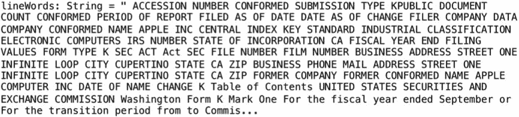

在接下来的步骤中，我们将把单词字符串转换为 DataFrame，并使用`explode()`函数为每个单词创建一行：

```scala
scala> val wordsStringDF = sc.parallelize(List(lineWords)).toDF() 

scala> val wordsDF = wordsStringDF.withColumn("words10k", explode(split($"value", "[\\s]"))).drop("value") 
```

接下来，我们将读取一个词典（最好是领域特定的词典）。我们将把我们的单词列表与这个词典进行匹配，以得到我们最终的单词列表（在这个阶段它们应该都是合法的单词）。

```scala
scala> val dictDF = spark.read.format("csv").option("header", "true").load("file:///Users/aurobindosarkar/Downloads/edgardata/LoughranMcDonald_MasterDictionary_2014.csv") 
```

为了我们的目的，我们使用了 Loughran & McDonold 的主词典，因为它包含在 10-K 报告中通常找到的单词。您可以从[`www3.nd.edu/~mcdonald/Word_Lists.html`](https://www3.nd.edu/~mcdonald/Word_Lists.html)下载`LoughranMcDonald_MasterDictionary_2014.csv`文件和相关文档。

在下一步中，我们将我们的单词列表 DataFrame 与词典连接，并计算我们最终列表中的单词数量：

```scala
scala> val joinWordsDict = wordsDF.join(dictDF, lower(wordsDF("words10k")) === lower(dictDF("Word"))) 

scala> val numWords = joinWordsDict.count() 
numWords: Long = 54701 

```

平均每句单词数是通过将单词数除以先前计算的句号数来计算的：

```scala
scala> val avgWordsPerSentence = numWords / countPeriods 
avgWordsPerSentence: Long = 21 
```

我们使用词典中的“音节”列来计算我们的单词列表中有多少单词有两个以上的音节，具体如下：

```scala
scala> val numPolySylb = joinWordsDict.select("words10k", "Syllables").where(joinWordsDict("Syllables") > 2) 

scala> val polySCount = numPolySylb.count() 
polySCount: Long = 14093 

```

最后，我们将参数插入到我们的方程中，计算 Fog 指数，如下所示：

```scala
scala> val fogIndex = 0.4*(avgWordsPerSentence+((polySCount/numWords)*100)) 
fogIndex: Double = 8.4 
```

反对使用可读性指标（例如 Fog 指数）在财务文件中的观点是，这些文件中的大多数并不能根据所使用的写作风格来区分。此外，即使这些文件中复杂词语的比例可能很高，这些词语或行业术语对这些文件的受众（例如投资者社区）来说是容易理解的。

作为年度报告可读性的简单指标，Loughran 和 McDonald 建议使用`10-K`文件大小的自然对数（完整提交文本文件）。与 Fog 指数相比，这个指标更容易获得，不需要复杂的解析`10-K`文件。

在下一步中，我们提供一个计算文件（或者更具体地说，RDD）大小的函数：

```scala
scala> def calcFileSize(rdd: RDD[String]): Long = { 
     |   rdd.map(_.getBytes("UTF-8").length.toLong) 
     |      .reduce(_+_) //add the sizes together 
     | } 

scala> val lines = sc.textFile("file:///Users/aurobindosarkar/Downloads/edgardata/0001193125-14-383437.txt") 
```

文件大小（以 MB 为单位）和文件大小的对数可以如下计算：

```scala
scala> val fileSize = calcFileSize(lines)/1000000.0 
fileSize: Double = 11.91724 

scala> math.log(fileSize) 
res1: Double = 2.477986091202679 
```

尽管文件大小是衡量文档可读性的一个很好的指标，比如`10-K`备案，但对于新闻稿、新闻稿件和盈利电话会议等文本可能不太合适。在这种情况下，由于文本长度变化不大，更适合采用更注重内容的其他方法。

在下一节中，我们将讨论在文本分析中使用单词列表。

# 使用单词列表

在衡量财务文件的语气或情绪时，从业者通常计算与特定情绪相关的单词数量，按照文档中的总单词数进行比例缩放。因此，例如，文档中更高比例的负面词语表明更悲观的语气。

使用词典来衡量语气具有几个重要优势。除了在大规模计算情绪时的便利性外，使用这种词典还通过消除个体主观性来促进标准化。对于分类单词的重要组成部分是识别每个分类中最常出现的单词。

在下一步中，我们使用词典中包含的单词情感指标来了解`10-K`备案的情感或语气。这可以相对于同一组织以往的备案进行计算，或者与同一或不同行业的其他组织进行比较。

```scala
scala> val negWordCount = joinWordsDict.select("words10k", "negative").where(joinWordsDict("negative") > 0).count() 
negWordCount: Long = 1004 

scala> val sentiment = negWordCount / (numWords.toDouble) 
sentiment: Double = 0.01835432624632091 
```

通常，在这种分析中，情态词的使用也很重要。例如，使用较弱的情态词（例如，may，could 和 might）可能会暗示公司存在问题：

```scala
scala> val modalWordCount = joinWordsDict.select("words10k", "modal").where(joinWordsDict("modal") > 0).groupBy("modal").count() 
```

在下面的代码中，我们计算每个情态词类别的单词数量。根据此处使用的词典的参考文档，`1`表示“强情态”（例如，“always”，“definitely”和“never”等词），`2`表示“中等情态”（例如，“can”，“generally”和“usually”等词），而`3`表示“弱情态”（例如，“almost”，“could”，“might”和“suggests”等词）：

```scala
scala> modalWordCount.show() 
+-----+-----+ 
|modal|count| 
+-----+-----+ 
|    3|  386| 
|    1|  115| 
|    2|  221| 
+-----+-----+ 

```

在下一节中，我们将使用本节定义的一些函数来为`10-K`备案创建数据预处理流水线。

# 创建数据预处理流水线

在本节中，我们将一些先前部分的数据处理函数转换为自定义 Transformer。这些 Transformer 对象将输入 DataFrame 映射到输出 DataFrame，并通常用于为机器学习应用程序准备 DataFrame。

我们创建以下类作为`UnaryTransformer`对象，将转换应用于一个输入 DataFrame 列，并通过将新列（包含应用函数的处理结果）附加到其中来生成另一个列。然后，这些自定义 Transformer 对象可以成为处理流水线的一部分。

首先，我们创建四个自定义的`UnaryTransformer`类，我们将在示例中使用，如下所示：

**TablesNHTMLElemCleaner.scala**

```scala
package org.chap9.edgar10k
import org.apache.spark.ml.UnaryTransformer
import org.apache.spark.sql.types.{DataType, DataTypes, StringType}
import scala.util.matching.Regex
import org.apache.spark.ml.util.Identifiable

class TablesNHTMLElemCleaner(override val uid: String) extends UnaryTransformer[String, String, TablesNHTMLElemCleaner] {
   def this() = this(Identifiable.randomUID("cleaner"))
   def deleteTablesNHTMLElem(instr: String): String = {
      val pattern1 = new Regex("(?s)(?i)<Table.*?</Table>")
      val str1 = pattern1.replaceAllIn(instr, " ")
      val pattern2 = new Regex("(?s)<[^>]*>")
      val str2 = pattern2.replaceAllIn(str1, " ")
      str2
   }

override protected def createTransformFunc: String => String = {
   deleteTablesNHTMLElem _
}

override protected def validateInputType(inputType: DataType): Unit = {
   require(inputType == StringType)
}

override protected def outputDataType: DataType = DataTypes.StringType
}
```

**AllURLsFileNamesDigitsPunctuationExceptPeriodCleaner.scala**

```scala
package org.chap9.edgar10k
import org.apache.spark.ml.UnaryTransformer
import org.apache.spark.sql.types.{DataType, DataTypes, StringType}
import scala.util.matching.Regex
import org.apache.spark.ml.util.Identifiable

class AllURLsFileNamesDigitsPunctuationExceptPeriodCleaner(override val uid: String) extends UnaryTransformer[String, String, AllURLsFileNamesDigitsPunctuationExceptPeriodCleaner] {
   def this() = this(Identifiable.randomUID("cleaner"))
   def deleteAllURLsFileNamesDigitsPunctuationExceptPeriod(instr: String): String = {
      val pattern1 = new Regex("\\b(https?|ftp|file)://[-a-zA-Z0-9+&@#/%?=~_|!:,.;]*[-a-zA-Z0-9+&@#/%=~_|]")
      val str1 = pattern1.replaceAllIn(instr, "")
      val pattern2 = new Regex("[_a-zA-Z0-9\\-\\.]+.(txt|sgml|xml|xsd|htm|html)")
      val str2 = pattern2.replaceAllIn(str1, " ")
      val pattern3 = new Regex("[^a-zA-Z|^.]")
      val str3 = pattern3.replaceAllIn(str2, " ")
      str3
}

override protected def createTransformFunc: String => String = {
   deleteAllURLsFileNamesDigitsPunctuationExceptPeriod _
}

override protected def validateInputType(inputType: DataType): Unit = {
   require(inputType == StringType)
}

override protected def outputDataType: DataType = DataTypes.StringType
}
```

**OnlyAlphasCleaner.scala**

```scala
package org.chap9.edgar10k
import org.apache.spark.ml.UnaryTransformer
import org.apache.spark.sql.types.{DataType, DataTypes, StringType}
import scala.util.matching.Regex
import org.apache.spark.ml.util.Identifiable
class OnlyAlphasCleaner(override val uid: String) extends UnaryTransformer[String, String, OnlyAlphasCleaner] {
   def this() = this(Identifiable.randomUID("cleaner"))
   def keepOnlyAlphas(instr: String): String = {
      val pattern1 = new Regex("[^a-zA-Z|]")
      val str1 = pattern1.replaceAllIn(instr, " ")
      val str2 = str1.replaceAll("[\\s]+", " ")
      str2
   }
override protected def createTransformFunc: String => String = {
   keepOnlyAlphas _
}

override protected def validateInputType(inputType: DataType): Unit = {
require(inputType == StringType)
}

override protected def outputDataType: DataType = DataTypes.StringType
}
```

**ExcessLFCRWSCleaner.scala**

```scala
package org.chap9.edgar10k
import org.apache.spark.ml.UnaryTransformer
import org.apache.spark.sql.types.{DataType, DataTypes, StringType}
import scala.util.matching.Regex
import org.apache.spark.ml.util.Identifiable

class ExcessLFCRWSCleaner(override val uid: String) extends UnaryTransformer[String, String, ExcessLFCRWSCleaner] {
   def this() = this(Identifiable.randomUID("cleaner"))
   def deleteExcessLFCRWS(instr: String): String = {
   val pattern1 = new Regex("[\n\r]+")
   val str1 = pattern1.replaceAllIn(instr, "\n")
   val pattern2 = new Regex("[\t]+")
   val str2 = pattern2.replaceAllIn(str1, " ")
   val pattern3 = new Regex("\\s+")
   val str3 = pattern3.replaceAllIn(str2, " ")
   str3
}

override protected def createTransformFunc: String => String = {
   deleteExcessLFCRWS _
}

override protected def validateInputType(inputType: DataType): Unit = {
   require(inputType == StringType)
}

override protected def outputDataType: DataType = DataTypes.StringType
}
```

创建以下`build.sbt`文件来编译和打包目标类：

```scala
name := "Chapter9"
version := "2.0"
scalaVersion := "2.11.8"
libraryDependencies ++= Seq(
("org.apache.spark" % "spark-core_2.11" % "2.2.0" % "provided"),
("org.apache.spark" % "spark-sql_2.11" % "2.2.0" % "provided"),
("org.apache.spark" % "spark-mllib_2.11" % "2.2.0" % "provided")
)
libraryDependencies += "com.github.scopt" %% "scopt" % "3.4.0"
libraryDependencies += "com.typesafe" % "config" % "1.3.0"
libraryDependencies += "com.typesafe.scala-logging" %% "scala-logging-api" % "2.1.2"
libraryDependencies += "com.typesafe.scala-logging" %% "scala-logging-slf4j" % "2.1.2"
libraryDependencies += "org.scalatest" % "scalatest_2.11" % "3.0.1" % "test"
```

使用以下`SBT`命令编译并打包类成一个 JAR 文件：

```scala
Aurobindos-MacBook-Pro-2:Chapter9 aurobindosarkar$ sbt package
```

最后，重新启动 Spark shell，并将前面的 JAR 文件包含在会话中：

```scala
Aurobindos-MacBook-Pro-2:spark-2.2.1-SNAPSHOT-bin-hadoop2.7 aurobindosarkar$ bin/spark-shell --driver-memory 12g --conf spark.driver.maxResultSize=12g --conf spark.sql.shuffle.partitions=800 --jars /Users/aurobindosarkar/Downloads/Chapter9/target/scala-2.11/chapter9_2.11-2.0.jar
```

以下示例的数据集，Reuters-21578，Distribution 1.0，可以从[`archive.ics.uci.edu/ml/datasets/reuters-21578+text+categorization+collection`](https://archive.ics.uci.edu/ml/datasets/reuters-21578+text+categorization+collection)下载。

在这里，我们将使用下载的 SGML 文件中由`<Reuters>...</Reuters>`标记分隔的条目之一，创建一个包含单个故事的新输入文件。这大致模拟了一个新故事进入我们的管道。更具体地说，这个故事可能是通过 Kafka 队列进入的，我们可以创建一个连续的 Spark SQL 应用程序来处理传入的故事文本。

首先，我们将新创建的文件读入 DataFrame 中，如下所示：

```scala
scala> val linesDF1 = sc.textFile("file:///Users/aurobindosarkar/Downloads/reuters21578/reut2-020-1.sgm").toDF()
```

接下来，我们使用本节中之前定义的类创建 Transformer 的实例。通过将每个 Transformer 的输出列指定为链中下一个 Transformer 的输入列，将 Transformer 在管道中链接在一起：

```scala
scala> val tablesNHTMLElemCleaner = new TablesNHTMLElemCleaner().setInputCol("value").setOutputCol("tablesNHTMLElemCleaned")

scala> val allURLsFileNamesDigitsPunctuationExceptPeriodCleaner = new AllURLsFileNamesDigitsPunctuationExceptPeriodCleaner().setInputCol("tablesNHTMLElemCleaned").setOutputCol("allURLsFileNamesDigitsPunctuationExceptPeriodCleaned")

scala> val onlyAlphasCleaner = new OnlyAlphasCleaner().setInputCol("allURLsFileNamesDigitsPunctuationExceptPeriodCleaned").setOutputCol("text")

scala> val excessLFCRWSCleaner = new ExcessLFCRWSCleaner().setInputCol("text").setOutputCol("cleaned")
```

在通过我们的清洗组件处理文本后，我们添加了另外两个阶段，以对我们的文本进行标记化和去除停用词，如示例所示。我们使用可在[`www3.nd.edu/~mcdonald/Word_Lists.html`](https://www3.nd.edu/~mcdonald/Word_Lists.html)上找到的通用停用词列表文件：

```scala
scala> val tokenizer = new RegexTokenizer().setInputCol("cleaned").setOutputCol("words").setPattern("\\W")

scala> val stopwords: Array[String] = sc.textFile("file:///Users/aurobindosarkar/Downloads/StopWords_GenericLong.txt").flatMap(_.stripMargin.split("\\s+")).collect
```

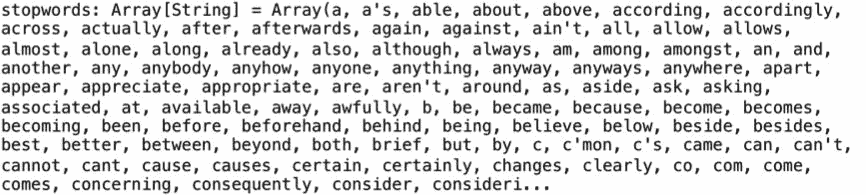

```scala
scala> val remover = new StopWordsRemover().setStopWords(stopwords).setCaseSensitive(false).setInputCol("words").setOutputCol("filtered")
```

在这个阶段，所有处理阶段的组件都准备好被组装成一个管道。

有关 Spark 管道的更多详细信息，请参阅[`spark.apache.org/docs/latest/ml-pipeline.html`](https://spark.apache.org/docs/latest/ml-pipeline.html)。

我们创建一个管道，并将所有 Transformer 链接在一起，以指定管道阶段，如下所示：

```scala
scala> val pipeline = new Pipeline().setStages(Array(tablesNHTMLElemCleaner, allURLsFileNamesDigitsPunctuationExceptPeriodCleaner, onlyAlphasCleaner, excessLFCRWSCleaner, tokenizer, remover))
```

在原始包含原始文本文档的 DataFrame 上调用`pipeline.fit()`方法：

```scala
scala> val model = pipeline.fit(linesDF1)
```

我们可以使用前面步骤的管道模型来转换我们原始的数据集，以满足其他下游文本应用程序的要求。我们还删除了中间处理步骤的列，以清理我们的 DataFrame：

```scala
scala> val cleanedDF = model.transform(linesDF1).drop("value").drop("tablesNHTMLElemCleaned").drop("excessLFCRWSCleaned").drop("allURLsFileNamesDigitsPunctuationExceptPeriodCleaned").drop("text").drop("word")
```

此外，我们可以通过删除包含空字符串或空格的任何行来清理最终输出列，如下所示：

```scala
scala> val finalDF = cleanedDF.filter(($"cleaned" =!= "") && ($"cleaned" =!= " "))
scala> cleanedDF.count()
res3: Long = 62
```

其余处理步骤与我们之前介绍的类似。以下步骤将包含我们单词的列分解为单独的行，将我们最终的单词列表与字典连接，然后计算情感和情态词的使用：

```scala
scala> val wordsInStoryDF = finalDF.withColumn("wordsInStory", explode(split($"cleaned", "[\\s]"))).drop("cleaned")

scala> val joinWordsDict = wordsInStoryDF.join(dictDF, lower(wordsInStoryDF("wordsInStory")) === lower(dictDF("Word")))

scala> wordsInStoryDF.count()
res4: Long = 457

scala> val numWords = joinWordsDict.count().toDouble
numWords: Double = 334.0

scala> joinWordsDict.select("wordsInStory").show()
```

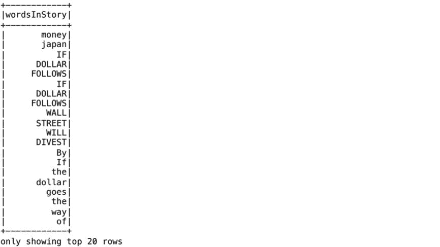

```scala
scala> val negWordCount = joinWordsDict.select("wordsInStory", "negative").where(joinWordsDict("negative") > 0).count()
negWordCount: Long = 8

scala> val sentiment = negWordCount / (numWords.toDouble)
sentiment: Double = 0.023952095808383235

scala> val modalWordCount = joinWordsDict.select("wordsInStory", "modal").where(joinWordsDict("modal") > 0).groupBy("modal").count()

scala> modalWordCount.show()
+-----+-----+
|modal|count|
+-----+-----+
|    3|    2|
|    1|    5|
|    2|    4|
+-----+-----+
```

下一组步骤演示了使用前面的管道处理我们语料库中的另一个故事。然后我们可以比较这些结果，以获得故事中悲观情绪的相对感知：

```scala
scala> val linesDF2 = sc.textFile("file:///Users/aurobindosarkar/Downloads/reuters21578/reut2-008-1.sgm").toDF()

scala> val cleanedDF = model.transform(linesDF2).drop("value").drop("tablesNHTMLElemCleaned").drop("excessLFCRWSCleaned").drop("allURLsFileNamesDigitsPunctuationExceptPeriodCleaned").drop("text").drop("word")
cleanedDF: org.apache.spark.sql.DataFrame = [cleaned: string,

scala> val finalDF = cleanedDF.filter(($"cleaned" =!= "") && ($"cleaned" =!= " "))

scala> cleanedDF.count()
res7: Long = 84

scala> val wordsInStoryDF = finalDF.withColumn("wordsInStory", explode(split($"cleaned", "[\\s]"))).drop("cleaned")

scala> val joinWordsDict = wordsInStoryDF.join(dictDF, lower(wordsInStoryDF("wordsInStory")) === lower(dictDF("Word")))

scala> wordsInStoryDF.count()
res8: Long = 598

scala> val numWords = joinWordsDict.count().toDouble
numWords: Double = 483.0

scala> joinWordsDict.select("wordsInStory").show()
```

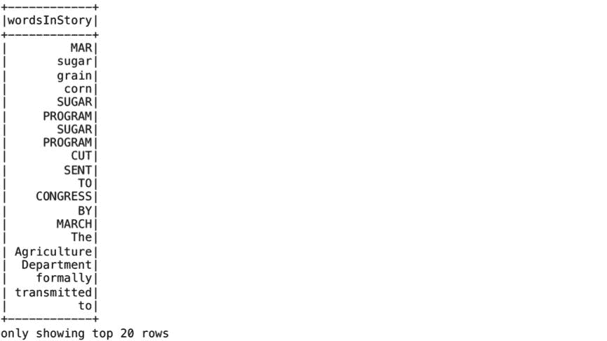

```scala
scala> val negWordCount = joinWordsDict.select("wordsInStory", "negative").where(joinWordsDict("negative") > 0).count()
negWordCount: Long = 15
```

根据以下负面情感计算，我们可以得出结论，这个故事相对来说比之前分析的更悲观：

```scala
scala> val sentiment = negWordCount / (numWords.toDouble)
sentiment: Double = 0.031055900621118012

scala> val modalWordCount = joinWordsDict.select("wordsInStory", "modal").where(joinWordsDict("modal") > 0).groupBy("modal").count()

scala> modalWordCount.show()
+-----+-----+
|modal|count|
+-----+-----+
|    3|    1|
|    1|    3|
|    2|    4|
+-----+-----+
```

在接下来的部分，我们将把重点转移到识别文档语料库中的主要主题。

# 理解文档语料库中的主题

基于词袋技术也可以用于对文档中的常见主题进行分类，或者用于识别文档语料库中的主题。广义上讲，这些技术，像大多数技术一样，试图基于每个词与潜在变量的关系来减少术语-文档矩阵的维度。

这种分类的最早方法之一是**潜在语义分析**（**LSA**）。LSA 可以避免与同义词和具有多重含义的术语相关的基于计数的方法的限制。多年来，LSA 的概念演变成了另一个称为**潜在狄利克雷分配**（**LDA**）的模型。

LDA 允许我们在一系列文档中识别潜在的主题结构。LSA 和 LDA 都使用术语-文档矩阵来降低术语空间的维度，并生成主题权重。LSA 和 LDA 技术的一个限制是它们在应用于大型文档时效果最佳。

有关 LDA 的更详细解释，请参阅 David M. Blei、Andrew Y. Ng 和 Michael I. Jordan 的*潜在狄利克雷分配*，网址为[`ai.stanford.edu/~ang/papers/jair03-lda.pdf`](http://ai.stanford.edu/~ang/papers/jair03-lda.pdf)。

现在，我们展示了在 XML 文档语料库上使用 LDA 的示例。

使用包含用于读取 XML 文档的包启动 Spark shell，因为我们将在本节中读取基于 XML 的语料库：

```scala
Aurobindos-MacBook-Pro-2:spark-2.2.1-SNAPSHOT-bin-hadoop2.7 aurobindosarkar$ bin/spark-shell --driver-memory 12g --conf spark.driver.maxResultSize=12g --conf spark.sql.shuffle.partitions=800 --packages com.databricks:spark-xml_2.11:0.4.1
```

接下来，我们定义了一些常量，包括主题数量、最大迭代次数和词汇量大小，如下所示：

```scala
scala> val numTopics: Int = 10
scala> val maxIterations: Int = 100
scala> val vocabSize: Int = 10000
```

`PERMISSIVE` 模式如下所示，允许我们在解析过程中遇到损坏记录时继续创建 DataFrame。`rowTag` 参数指定要读取的 XML 节点。在这里，我们对使用 LDA 进行主题分析时文档中的句子感兴趣。

此示例的数据集包含来自**澳大利亚联邦法院**（**FCA**）的 4,000 个法律案例，可从[`archive.ics.uci.edu/ml/datasets/Legal+Case+Reports`](https://archive.ics.uci.edu/ml/datasets/Legal+Case+Reports)下载。

我们读取所有案例文件，如下所示：

```scala
scala> val df = spark.read.format("com.databricks.spark.xml").option("rowTag", "sentences").option("mode", "PERMISSIVE").load("file:///Users/aurobindosarkar/Downloads/corpus/fulltext/*.xml")
```

接下来，我们为每个法律案例生成文档 ID，如下所示：

```scala
scala> val docDF = df.select("sentence._VALUE").withColumn("docId", monotonically_increasing_id()).withColumn("sentences", concat_ws(",", $"_VALUE")).drop("_VALUE")

scala> // Split each document into words
scala> val tokens = new RegexTokenizer().setGaps(false).setPattern("\\p{L}+").setInputCol("sentences").setOutputCol("words").transform(docDF)

scala> //Remove stop words using the default stop word list provided with the Spark distribution.
scala> val filteredTokens = new StopWordsRemover().setCaseSensitive(false).setInputCol("words").setOutputCol("filtered").transform(tokens)
```

我们使用`CountVectorizer`（和`CountVectorizerModel`）将我们的法律文件集转换为标记计数的向量。在这里，我们没有预先的词典可用，因此`CountVectorizer`被用作估计器来提取词汇并生成`CountVectorizerModel`。该模型为文档生成了在词汇表上的稀疏表示，然后传递给 LDA 算法。在拟合过程中，`CountVectorizer`将选择跨语料库按词项频率排序的前`vocabSize`个词：

```scala
scala> val cvModel = new CountVectorizer().setInputCol("filtered").setOutputCol("features").setVocabSize(vocabSize).fit(filteredTokens)

scala> val termVectors = cvModel.transform(filteredTokens).select("docId", "features")

scala> val lda = new LDA().setK(numTopics).setMaxIter(maxIterations)

scala> val ldaModel = lda.fit(termVectors)

scala> println("Model was fit using parameters: " + ldaModel.parent.extractParamMap)

Model was fit using parameters: {
lda_8b00356ca964-checkpointInterval: 10,
lda_8b00356ca964-featuresCol: features,
lda_8b00356ca964-k: 10,
lda_8b00356ca964-keepLastCheckpoint: true,
lda_8b00356ca964-learningDecay: 0.51,
lda_8b00356ca964-learningOffset: 1024.0,
lda_8b00356ca964-maxIter: 100,
lda_8b00356ca964-optimizeDocConcentration: true,
lda_8b00356ca964-optimizer: online,
lda_8b00356ca964-seed: 1435876747,
lda_8b00356ca964-subsamplingRate: 0.05,
lda_8b00356ca964-topicDistributionCol: topicDistribution
}
```

我们计算 LDA 模型的对数似然和对数困惑度，如下所示。具有更高似然的模型意味着更好的模型。同样，更低的困惑度代表更好的模型：

```scala
scala> val ll = ldaModel.logLikelihood(termVectors)
ll: Double = -6.912755229181568E7

scala> val lp = ldaModel.logPerplexity(termVectors)
lp: Double = 7.558777992719632

scala> println(s"The lower bound on the log likelihood of the entire corpus: $ll")
The lower bound on the log likelihood of the entire corpus: -6.912755229181568E7

scala> println(s"The upper bound on perplexity: $lp")
The upper bound on perplexity: 7.558777992719632
```

接下来，我们使用`describeTopics()`函数显示由其权重最高的术语描述的主题，如下所示：

```scala
scala> val topicsDF = ldaModel.describeTopics(3)

scala> println("The topics described by their top-weighted terms:")
The topics described by their top-weighted terms are the following:

scala> topicsDF.show(false)
```

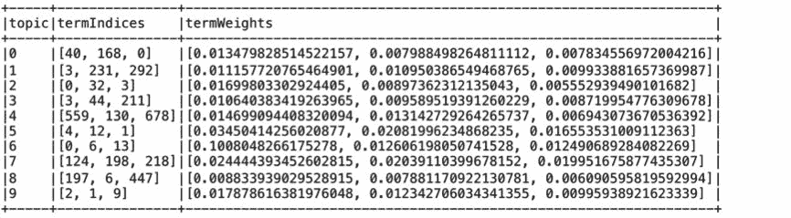

```scala
scala> val transformed = ldaModel.transform(termVectors)

scala> transformed.select("docId", "topicDistribution").take(3).foreach(println)

[0,[0.0,0.0,0.0,0.0,0.0,0.0,0.0,0.0,0.0,0.0]]
[8589934592,[8.963966883240337E-5,7.477786237947913E-5,1.1695214724007773E-4,7.651092413869693E-5,5.878144972523343E-5,1.533289774455994E-4,8.250794034920294E-5,6.472049126896475E-5,7.008103300313653E-5,0.9992126995056172]]
[17179869184,[9.665344356333612E-6,8.06287932260242E-6,0.13933607311582796,8.249745717562721E-6,6.338075472527743E-6,1.6528598250017008E-5,8.89637068587104E-6,6.978449157294409E-6,0.029630980885952427,0.8309682265352574]]

scala> val vocab = cvModel.vocabulary
```

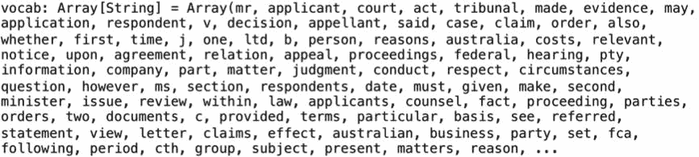

我们可以显示包含与术语索引对应的实际术语的结果，如下所示。从这里显示的词语中很明显，我们正在处理一个法律语料库。

```scala
scala> for ((row) <- topicsDF) {
| var i = 0
| var termsString = ""
| var topicTermIndicesString = ""
| val topicNumber = row.get(0)
| val topicTerms:WrappedArray[Int] = row.get(1).asInstanceOf[WrappedArray[Int]]
|
| for (i <- 0 to topicTerms.length-1){
| topicTermIndicesString += topicTerms(i) +", "
| termsString += vocab(topicTerms(i)) +", "
| }
|
| println ("Topic: "+ topicNumber+ "|["+topicTermIndicesString + "]|[" + termsString +"]")
| }

Topic: 1|[3, 231, 292, ]|[act, title, native, ]
Topic: 5|[4, 12, 1, ]|[tribunal, appellant, applicant, ]
Topic: 6|[0, 6, 13, ]|[mr, evidence, said, ]
Topic: 0|[40, 168, 0, ]|[company, scheme, mr, ]
Topic: 2|[0, 32, 3, ]|[mr, agreement, act, ]
Topic: 7|[124, 198, 218, ]|[commissioner, income, tax, ]
Topic: 3|[3, 44, 211, ]|[act, conduct, price, ]
Topic: 8|[197, 6, 447, ]|[trade, evidence, mark, ]
Topic: 4|[559, 130, 678, ]|[patent, dr, university, ]
Topic: 9|[2, 1, 9, ]|[court, applicant, respondent, ]Using
```

文本分析的下一个主要主题是搭配词。对于一些词来说，它们的意义很大程度上来自于与其他词的搭配。基于搭配来预测词义通常是简单词袋方法之外最常见的扩展之一。

在下一节中，我们将研究在 n-gram 上使用朴素贝叶斯分类器。

# 使用朴素贝叶斯分类器

朴素贝叶斯分类器是一类基于贝叶斯条件概率定理的概率分类器。这些分类器假设特征之间相互独立。朴素贝叶斯通常是文本分类的基准方法，使用词频作为特征集。尽管存在强烈的独立性假设，朴素贝叶斯分类器快速且易于实现；因此，在实践中它们被广泛使用。

尽管朴素贝叶斯非常受欢迎，但它也存在可能导致偏向某一类别的错误。例如，倾斜的数据可能导致分类器偏向某一类别。同样，独立性假设可能导致错误的分类权重，偏向某一类别。

有关处理朴素贝叶斯分类器相关问题的具体启发式方法，请参阅 Rennie，Shih 等人的《解决朴素贝叶斯文本分类器的错误假设》[`people.csail.mit.edu/jrennie/papers/icml03-nb.pdf`](https://people.csail.mit.edu/jrennie/papers/icml03-nb.pdf)。

朴素贝叶斯方法的主要优点之一是它不需要大量的训练数据集来估计分类所需的参数。在使用监督机器学习进行单词分类的各种方法中，朴素贝叶斯方法非常受欢迎；例如，年度报告中哪些句子可以被分类为“负面”、“正面”或“中性”。朴素贝叶斯方法也是最常与 n-grams 和支持向量机（SVMs）一起使用的。

N-grams 用于各种不同的任务。例如，n-grams 可用于为监督机器学习模型（如 SVMs，最大熵模型和朴素贝叶斯）开发特征。当`N`的值为`1`时，n-grams 被称为 unigrams（实质上是句子中的单个词；当`N`的值为`2`时，它们被称为 bigrams，当`N`为`3`时，它们被称为 trigrams，依此类推。这里的主要思想是在特征空间中使用 bigrams 等标记，而不是单个词或 unigrams。

该示例的数据集包含大约 169 万条电子产品类别的亚马逊评论，可从[`jmcauley.ucsd.edu/data/amazon/`](http://jmcauley.ucsd.edu/data/amazon/)下载。

有关此示例中使用的步骤的更详细解释，请查看 Mike Seddon 的《使用 Apache Spark ML 和亚马逊评论进行自然语言处理》（第 1 和第二部分）[`mike.seddon.ca/natural-language-processing-with-apache-spark-ml-and-amazon-reviews-part-1/`](http://mike.seddon.ca/natural-language-processing-with-apache-spark-ml-and-amazon-reviews-part-1/)。

首先，我们读取输入的 JSON 文件以创建我们的输入 DataFrame：

```scala
scala> val inDF = spark.read.json("file:///Users/aurobindosarkar/Downloads/reviews_Electronics_5.json")

scala> inDF.show()
```

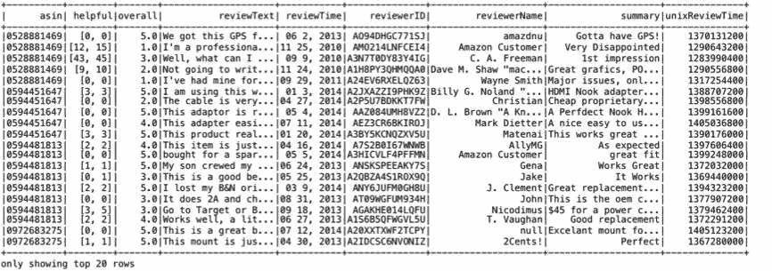

您可以打印模式，如下所示：

```scala
scala> inDF.printSchema()
root
|-- asin: string (nullable = true)
|-- helpful: array (nullable = true)
| |-- element: long (containsNull = true)
|-- overall: double (nullable = true)
|-- reviewText: string (nullable = true)
|-- reviewTime: string (nullable = true)
|-- reviewerID: string (nullable = true)
|-- reviewerName: string (nullable = true)
|-- summary: string (nullable = true)
|-- unixReviewTime: long (nullable = true)
```

接下来，我们打印出每个评分值的记录数，如下所示。请注意，记录数在评分五方面严重倾斜。这种倾斜可能会影响我们的结果，使评分五相对于其他评分更有利：

```scala
scala> inDF.groupBy("overall").count().orderBy("overall").show()
+-------+-------+
|overall| count|
+-------+-------+
|    1.0| 108725|
|    2.0|  82139|
|    3.0| 142257|
|    4.0| 347041|
|    5.0|1009026|
+-------+-------+
```

我们从 DataFrame 创建一个视图，如下所示。这一步可以方便地帮助我们创建一个更平衡的训练 DataFrame，其中包含每个评分类别的相等数量的记录：

```scala
scala> inDF.createOrReplaceTempView("reviewsTable")

scala> val reviewsDF = spark.sql(
| """
| SELECT text, label, rowNumber FROM (
| SELECT
| overall AS label, reviewText AS text, row_number() OVER (PARTITION BY overall ORDER BY rand()) AS rowNumber FROM reviewsTable
| ) reviewsTable
| WHERE rowNumber <= 60000
| """
| )

scala> reviewsDF.groupBy("label").count().orderBy("label").show()
+-----+-----+
|label|count|
+-----+-----+
|  1.0|60000|
|  2.0|60000|
|  3.0|60000|
|  4.0|60000|
| 5.0|60000|
+-----+-----+
```

现在，我们使用行号创建我们的训练和测试数据集：

```scala
scala> val trainingData = reviewsDF.filter(reviewsDF("rowNumber") <= 50000).select("text","label")

scala> val testData = reviewsDF.filter(reviewsDF("rowNumber") > 10000).select("text","label")
```

在给定的步骤中，我们对文本进行标记化，去除停用词，并创建 bigrams 和 trigrams：

```scala
scala> val regexTokenizer = new RegexTokenizer().setPattern("[a-zA-Z']+").setGaps(false).setInputCol("text")

scala> val remover = new StopWordsRemover().setInputCol(regexTokenizer.getOutputCol)

scala> val bigrams = new NGram().setN(2).setInputCol(remover.getOutputCol)

scala> val trigrams = new NGram().setN(3).setInputCol(remover.getOutputCol)
```

在接下来的步骤中，我们为 unigrams、bigrams 和 trigrams 定义`HashingTF`实例：

```scala
scala> val removerHashingTF = new HashingTF().setInputCol(remover.getOutputCol)

scala> val ngram2HashingTF = new HashingTF().setInputCol(bigrams.getOutputCol)

scala> val ngram3HashingTF = new HashingTF().setInputCol(trigrams.getOutputCol)

scala> val assembler = new VectorAssembler().setInputCols(Array(removerHashingTF.getOutputCol, ngram2HashingTF.getOutputCol, ngram3HashingTF.getOutputCol))

scala> val labelIndexer = new StringIndexer().setInputCol("label").setOutputCol("indexedLabel").fit(reviewsDF)

scala> val labelConverter = new IndexToString().setInputCol("prediction").setOutputCol("predictedLabel").setLabels(labelIndexer.labels)
```

然后，我们创建一个朴素贝叶斯分类器的实例：

```scala
scala> val nb = new NaiveBayes().setLabelCol(labelIndexer.getOutputCol).setFeaturesCol(assembler.getOutputCol).setPredictionCol("prediction").setModelType("multinomial")
```

我们组装我们的处理管道，如图所示：

```scala
scala> val pipeline = new Pipeline().setStages(Array(regexTokenizer, remover, bigrams, trigrams, removerHashingTF, ngram2HashingTF, ngram3HashingTF, assembler, labelIndexer, nb, labelConverter))
```

我们创建一个参数网格，用于交叉验证以得到我们模型的最佳参数集，如下所示：

```scala
scala> val paramGrid = new ParamGridBuilder().addGrid(removerHashingTF.numFeatures, Array(1000,10000)).addGrid(ngram2HashingTF.numFeatures, Array(1000,10000)).addGrid(ngram3HashingTF.numFeatures, Array(1000,10000)).build()

paramGrid: Array[org.apache.spark.ml.param.ParamMap] =
Array({
hashingTF_4b2023cfcec8-numFeatures: 1000,
hashingTF_7bd4dd537583-numFeatures: 1000,
hashingTF_7cd2d166ac2c-numFeatures: 1000
}, {
hashingTF_4b2023cfcec8-numFeatures: 10000,
hashingTF_7bd4dd537583-numFeatures: 1000,
hashingTF_7cd2d166ac2c-numFeatures: 1000
}, {
hashingTF_4b2023cfcec8-numFeatures: 1000,
hashingTF_7bd4dd537583-numFeatures: 10000,
hashingTF_7cd2d166ac2c-numFeatures: 1000
}, {
hashingTF_4b2023cfcec8-numFeatures: 10000,
hashingTF_7bd4dd537583-numFeatures: 10000,
hashingTF_7cd2d166ac2c-numFeatures: 1000
}, {
hashingTF_4b2023cfcec8-numFeatures: 1000,
hashingTF_7bd4dd537583-numFeatures: 1000,
hashingTF_7cd2d166ac2c-numFeatures: 10000
}, {
hashingTF_4b2023cfcec8-numFeatures: 10000,
hashingTF_7bd4dd537...
```

在下一步中，请注意，k 折交叉验证通过将数据集分割为一组不重叠的、随机分区的折叠来执行模型选择；例如，对于`k=3`折叠，k 折交叉验证将生成三个（训练、测试）数据集对，每个数据集对使用数据的`2/3`进行训练和`1/3`进行测试。

每个折叠都恰好被用作测试集一次。为了评估特定的`ParamMap`，`CrossValidator`计算在两个不同（训练，测试）数据集对上拟合估计器产生的三个模型的平均评估指标。在识别出最佳的`ParamMap`后，`CrossValidator`最终使用整个数据集使用最佳的`ParamMap`重新拟合估计器：

```scala
scala> val cv = new CrossValidator().setEstimator(pipeline).setEvaluator(new MulticlassClassificationEvaluator().setLabelCol("indexedLabel").setPredictionCol("prediction").setMetricName("accuracy")).setEstimatorParamMaps(paramGrid).setNumFolds(5)

scala> val cvModel = cv.fit(trainingData)

scala> val predictions = cvModel.transform(testData)

scala> val evaluator = new MulticlassClassificationEvaluator().setLabelCol("indexedLabel").setPredictionCol("prediction").setMetricName("accuracy")

scala> val accuracy = evaluator.evaluate(predictions)
accuracy: Double = 0.481472

scala> println("Test Error = " + (1.0 - accuracy))
Test Error = 0.518528
```

在执行前一组步骤后，获得的预测结果并不理想。让我们检查是否可以通过减少评论类别的数量并增加训练集中的记录数量来改善结果，如图所示：

```scala
scala> def udfReviewBins() = udf[Double, Double] { a => val x = a match { case 1.0 => 1.0; case 2.0 => 1.0; case 3.0 => 2.0; case 4.0 => 3.0; case 5.0 => 3.0;}; x;}

scala> val modifiedInDF = inDF.withColumn("rating", udfReviewBins()($"overall")).drop("overall")

scala> modifiedInDF.show()
```

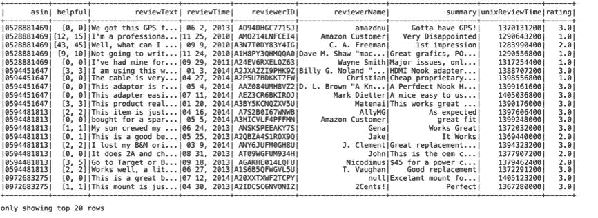

```scala
scala> modifiedInDF.groupBy("rating").count().orderBy("rating").show()
+------+-------+
|rating| count|
+------+-------+
|   1.0| 190864|
|   2.0| 142257|
|   3.0|1356067|
+------+-------+

scala> modifiedInDF.createOrReplaceTempView("modReviewsTable")

scala> val reviewsDF = spark.sql(
| """
| SELECT text, label, rowNumber FROM (
| SELECT
| rating AS label, reviewText AS text, row_number() OVER (PARTITION BY rating ORDER BY rand()) AS rowNumber FROM modReviewsTable
| ) modReviewsTable
| WHERE rowNumber <= 120000
| """
| )
reviewsDF: org.apache.spark.sql.DataFrame = [text: string,

scala> reviewsDF.groupBy("label").count().orderBy("label").show()
+-----+------+
|label| count|
+-----+------+
|  1.0|120000|
|  2.0|120000|
|  3.0|120000|
+-----+------+

scala> val trainingData = reviewsDF.filter(reviewsDF("rowNumber") <= 100000).select("text","label")

scala> val testData = reviewsDF.filter(reviewsDF("rowNumber") > 20000).select("text","label")

scala> val regexTokenizer = new RegexTokenizer().setPattern("[a-zA-Z']+").setGaps(false).setInputCol("text")

scala> val remover = new StopWordsRemover().setInputCol(regexTokenizer.getOutputCol)

scala> val bigrams = new NGram().setN(2).setInputCol(remover.getOutputCol)

scala> val trigrams = new NGram().setN(3).setInputCol(remover.getOutputCol)

scala> val removerHashingTF = new HashingTF().setInputCol(remover.getOutputCol)

scala> val ngram2HashingTF = new HashingTF().setInputCol(bigrams.getOutputCol)

scala> val ngram3HashingTF = new HashingTF().setInputCol(trigrams.getOutputCol)

scala> val assembler = new VectorAssembler().setInputCols(Array(removerHashingTF.getOutputCol, ngram2HashingTF.getOutputCol, ngram3HashingTF.getOutputCol))

scala> val labelIndexer = new StringIndexer().setInputCol("label").setOutputCol("indexedLabel").fit(reviewsDF)
```

标签转换器可用于恢复原始标签的文本，以提高可读性，如果是文本标签的话：

```scala
scala> val labelConverter = new IndexToString().setInputCol("prediction").setOutputCol("predictedLabel").setLabels(labelIndexer.labels)
```

接下来，我们创建我们朴素贝叶斯分类器的一个实例：

```scala
scala> val nb = new NaiveBayes().setLabelCol(labelIndexer.getOutputCol).setFeaturesCol(assembler.getOutputCol).setPredictionCol("prediction").setModelType("multinomial")
```

我们使用所有转换器和朴素贝叶斯估计器组装我们的管道，如下所示：

```scala
scala> val pipeline = new Pipeline().setStages(Array(regexTokenizer, remover, bigrams, trigrams, removerHashingTF, ngram2HashingTF, ngram3HashingTF, assembler, labelIndexer, nb, labelConverter))
```

我们使用交叉验证来选择模型的最佳参数，如图所示：

```scala
scala> val paramGrid = new ParamGridBuilder().addGrid(removerHashingTF.numFeatures, Array(1000,10000)).addGrid(ngram2HashingTF.numFeatures, Array(1000,10000)).addGrid(ngram3HashingTF.numFeatures, Array(1000,10000)).build()

paramGrid: Array[org.apache.spark.ml.param.ParamMap] =
Array({
hashingTF_2f3a479f07ef-numFeatures: 1000,
hashingTF_0dc7c74af716-numFeatures: 1000,
hashingTF_17632a08c82c-numFeatures: 1000
}, {
hashingTF_2f3a479f07ef-numFeatures: 10000,
hashingTF_0dc7c74af716-numFeatures: 1000,
hashingTF_17632a08c82c-numFeatures: 1000
}, {
hashingTF_2f3a479f07ef-numFeatures: 1000,
hashingTF_0dc7c74af716-numFeatures: 10000,
hashingTF_17632a08c82c-numFeatures: 1000
}, {
hashingTF_2f3a479f07ef-numFeatures: 10000,
hashingTF_0dc7c74af716-numFeatures: 10000,
hashingTF_17632a08c82c-numFeatures: 1000
}, {
hashingTF_2f3a479f07ef-numFeatures: 1000,
hashingTF_0dc7c74af716-numFeatures: 1000,
hashingTF_17632a08c82c-numFeatures: 10000
}, {
hashingTF_2f3a479f07ef-numFeatures: 10000,
hashingTF_0dc7c74af...

scala> val cv = new CrossValidator().setEstimator(pipeline).setEvaluator(new MulticlassClassificationEvaluator().setLabelCol("indexedLabel").setPredictionCol("prediction").setMetricName("accuracy")).setEstimatorParamMaps(paramGrid).setNumFolds(5)

scala> val cvModel = cv.fit(trainingData)

scala> val predictions = cvModel.transform(testData)

scala> val evaluator = new MulticlassClassificationEvaluator().setLabelCol("indexedLabel").setPredictionCol("prediction").setMetricName("accuracy")

scala> val accuracy = evaluator.evaluate(predictions)
accuracy: Double = 0.63663

scala> println("Test Error = " + (1.0 - accuracy))
Test Error = 0.36336999999999997
```

注意将评级合并为较少类别并增加训练模型的记录数量后，我们的预测结果显著改善。

在下一节中，我们将介绍一个关于文本数据的机器学习示例。

# 开发一个机器学习应用程序

在本节中，我们将介绍一个文本分析的机器学习示例。有关本节中提供的机器学习代码的更多详细信息，请参阅第六章，*在机器学习应用中使用 Spark SQL*。

以下示例中使用的数据集包含巴西公司的自由文本业务描述的 1,080 个文档，分类为九个子类别。您可以从[`archive.ics.uci.edu/ml/datasets/CNAE-9`](https://archive.ics.uci.edu/ml/datasets/CNAE-9)下载此数据集。

```scala
scala> val inRDD = spark.sparkContext.textFile("file:///Users/aurobindosarkar/Downloads/CNAE-9.data")

scala> val rowRDD = inRDD.map(_.split(",")).map(attributes => Row(attributes(0).toDouble, attributes(1).toDouble, attributes(2).toDouble, attributes(3).toDouble, attributes(4).toDouble, attributes(5).toDouble,
.
.
.
attributes(852).toDouble, attributes(853).toDouble, attributes(854).toDouble, attributes(855).toDouble, attributes(856).toDouble))
```

接下来，我们为输入记录定义一个模式：

```scala
scala> val schemaString = "label _c715 _c195 _c480 _c856 _c136 _c53 _c429 _c732 _c271 _c742 _c172 _c45 _c374 _c233 _c720
.
.
.
_c408 _c604 _c766 _c676 _c52 _c755 _c728 _c693 _c119 _c160 _c141 _c516 _c419 _c69 _c621 _c423 _c137 _c549 _c636 _c772 _c799 _c336 _c841 _c82 _c123 _c474 _c470 _c286 _c555 _c36 _c299 _c829 _c361 _c263 _c522 _c495 _c135"

scala> val fields = schemaString.split(" ").map(fieldName => StructField(fieldName, DoubleType, nullable = false))

scala> val schema = StructType(fields)
```

然后，我们使用模式将 RDD 转换为 DataFrame，如图所示：

```scala
scala> val inDF = spark.createDataFrame(rowRDD, schema)

scala> inDF.take(1).foreach(println)
```

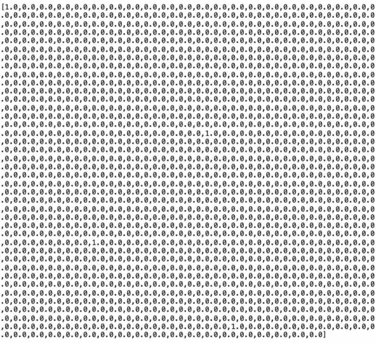

接下来，我们使用`monotonically_increasing_id()`函数向 DataFrame 添加索引列，如图所示：

```scala
scala> val indexedDF= inDF.withColumn("id", monotonically_increasing_id())

scala> indexedDF.select("label", "id").show()
```

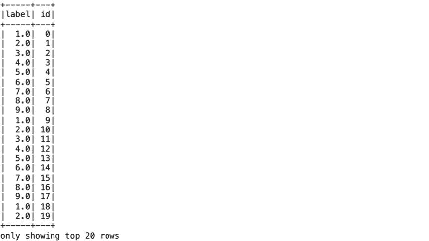

在接下来的步骤中，我们组装特征向量：

```scala
scala> val columnNames = Array("_c715","_c195","_c480","_c856","_c136","_c53","_c429","_c732","_c271","_c742","_c172","_c45","_c374","_c233","_c720","_c294","_c461","_c87","_c599","_c84","_c28","_c79","_c615","_c243","_c603","_c531","_c503","_c630","_c33","_c428","_c385","_c751","_c664","_c540","_c626","_c730","_c9","_c699","_c117","
.
.
.
c693","_c119","_c160","_c141","_c516","_c419","_c69","_c621","_c423","_c137","_c549","_c636","_c772","_c799","_c336","_c841","_c82","_c123","id","_c474","_c470","_c286","_c555","_c36","_c299","_c829","_c361","_c263","_c522","_c495","_c135")

scala> val assembler = new VectorAssembler().setInputCols(columnNames).setOutputCol("features")

scala> val output = assembler.transform(indexedDF)

scala> output.select("id", "label", "features").take(5).foreach(println)
[0,1.0,(857,[333,606,829],[1.0,1.0,1.0])]
[1,2.0,(857,[725,730,740,844],[1.0,1.0,1.0,1.0])]
[2,3.0,(857,[72,277,844],[1.0,1.0,2.0])]
[3,4.0,(857,[72,606,813,822,844],[1.0,1.0,1.0,1.0,3.0])]
[4,5.0,(857,[215,275,339,386,475,489,630,844],[1.0,1.0,1.0,1.0,1.0,1.0,1.0,4.0])]
```

我们将输入数据集分为训练数据集（记录的 90％）和测试数据集（记录的 10％）：

```scala
scala> val Array(trainingData, testData) = output.randomSplit(Array(0.9, 0.1), seed = 12345)

scala> val copyTestData = testData.drop("id").drop("features")
copyTestData: org.apache.spark.sql.DataFrame = [label: double, _c715: double ... 855 more fields]

scala> copyTestData.coalesce(1).write.format("csv").option("header", "false").mode("overwrite").save("file:///Users/aurobindosarkar/Downloads/CNAE-9/input")
```

在接下来的步骤中，我们在训练数据集上创建并拟合逻辑回归模型：

```scala
scala> val lr = new LogisticRegression().setMaxIter(20).setRegParam(0.3).setElasticNetParam(0.8)

scala> // Fit the model

scala> val lrModel = lr.fit(trainingData)
```

我们可以列出模型的参数，如图所示：

```scala
scala> println("Model was fit using parameters: " + lrModel.parent.extractParamMap)

Model was fit using parameters: {
logreg_801d78ffc37d-aggregationDepth: 2,
logreg_801d78ffc37d-elasticNetParam: 0.8,
logreg_801d78ffc37d-family: auto,
logreg_801d78ffc37d-featuresCol: features,
logreg_801d78ffc37d-fitIntercept: true,
logreg_801d78ffc37d-labelCol: label,
logreg_801d78ffc37d-maxIter: 20,
logreg_801d78ffc37d-predictionCol: prediction,
logreg_801d78ffc37d-probabilityCol: probability,
logreg_801d78ffc37d-rawPredictionCol: rawPrediction,
logreg_801d78ffc37d-regParam: 0.3,
logreg_801d78ffc37d-standardization: true,
logreg_801d78ffc37d-threshold: 0.5,
logreg_801d78ffc37d-tol: 1.0E-6
}
```

接下来，我们显示逻辑回归模型的系数和截距值：

```scala
scala> println(s"Coefficients: \n${lrModel.coefficientMatrix}")
Coefficients:
10 x 857 CSCMatrix
(1,206) 0.33562831098750884
(5,386) 0.2803498729889301
(7,545) 0.525713129850472

scala> println(s"Intercepts: ${lrModel.interceptVector}")
Intercepts: [-5.399655915806082,0.6130722758222028,0.6011509547631415,0.6381333836655702,0.6011509547630515,0.5542027670693254,0.6325214445680327,0.5332703316733128,0.6325214445681948,0.5936323589132501]
```

接下来，我们使用模型对测试数据集进行预测，如图所示：

```scala
scala> val predictions = lrModel.transform(testData)
```

选择示例行以显示预测 DataFrame 中的关键列，如图所示：

```scala
scala> predictions.select("prediction", "label", "features").show(5)
```

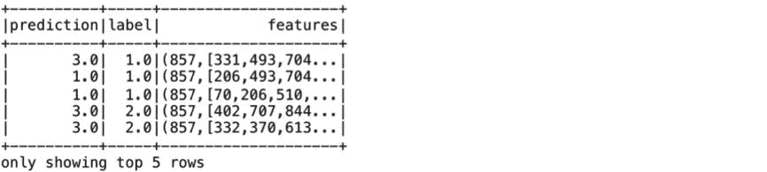

我们使用评估器来计算测试错误，如下所示：

```scala
scala> val evaluator = new MulticlassClassificationEvaluator().setLabelCol("label").setPredictionCol("prediction").setMetricName("accuracy")
scala> val accuracy = evaluator.evaluate(predictions)
accuracy: Double = 0.2807017543859649
scala> println("Test Error = " + (1.0 - accuracy))
Test Error = 0.7192982456140351
```

将逻辑回归模型应用于我们的数据集的结果并不特别好。现在，我们定义参数网格，以探索是否更好的参数集可以改善模型的整体预测结果：

```scala
scala> val lr = new LogisticRegression()
lr: org.apache.spark.ml.classification.LogisticRegression = logreg_3fa32a4b5c6d

scala> val paramGrid = new ParamGridBuilder().addGrid(lr.regParam, Array(0.1, 0.01)).addGrid(lr.elasticNetParam, Array(0.0, 0.5, 1.0)).build()

paramGrid: Array[org.apache.spark.ml.param.ParamMap] =
Array({
logreg_3fa32a4b5c6d-elasticNetParam: 0.0,
logreg_3fa32a4b5c6d-regParam: 0.1
}, {
logreg_3fa32a4b5c6d-elasticNetParam: 0.0,
logreg_3fa32a4b5c6d-regParam: 0.01
}, {
logreg_3fa32a4b5c6d-elasticNetParam: 0.5,
logreg_3fa32a4b5c6d-regParam: 0.1
}, {
logreg_3fa32a4b5c6d-elasticNetParam: 0.5,
logreg_3fa32a4b5c6d-regParam: 0.01
}, {
logreg_3fa32a4b5c6d-elasticNetParam: 1.0,
logreg_3fa32a4b5c6d-regParam: 0.1
}, {
logreg_3fa32a4b5c6d-elasticNetParam: 1.0,
logreg_3fa32a4b5c6d-regParam: 0.01
})
```

在这里，我们展示了使用`CrossValidator`来选择模型的更好参数：

```scala
scala> val cv = new CrossValidator().setEstimator(lr).setEvaluator(new MulticlassClassificationEvaluator).setEstimatorParamMaps(paramGrid).setNumFolds(5)
```

接下来，我们运行交叉验证以选择最佳的参数集：

```scala
scala> val cvModel = cv.fit(trainingData)

scala> println("Model was fit using parameters: " + cvModel.parent.extractParamMap)

Model was fit using parameters: {
cv_00543dadc091-estimator: logreg_41377555b425,
cv_00543dadc091-estimatorParamMaps: Lorg.apache.spark.ml.param.ParamMap;@14ca1e23,
cv_00543dadc091-evaluator: mcEval_0435b4f19e2a,
cv_00543dadc091-numFolds: 5,
cv_00543dadc091-seed: -1191137437
}
```

我们对测试数据集进行预测。这里，`cvModel`使用找到的最佳模型（`lrModel`）：

```scala
scala> cvModel.transform(testData).select("id", "label", "probability", "prediction").collect().foreach { case Row(id: Long, label: Double, prob: Vector, prediction: Double) =>
| println(s"($id, $label) --> prob=$prob, prediction=$prediction")
| }
```

![

```scala
scala> val cvPredictions = cvModel.transform(testData)
cvPredictions: org.apache.spark.sql.DataFrame = [label: double, _c715: double ... 860 more fields]

scala> cvPredictions.select("prediction", "label", "features").show(5)
```

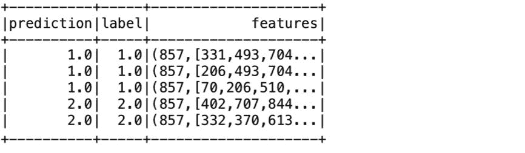

```scala
scala> val evaluator = new MulticlassClassificationEvaluator().setLabelCol("label").setPredictionCol("prediction").setMetricName("accuracy")
```

注意交叉验证结果中预测准确率的显著提高：

```scala
scala> val accuracy = evaluator.evaluate(cvPredictions)
accuracy: Double = 0.9736842105263158

scala> println("Test Error = " + (1.0 - accuracy))
Test Error = 0.02631578947368418
```

最后，将模型保存到文件系统。我们将在本节的程序中从文件系统中检索它：

```scala
scala> cvModel.write.overwrite.save("file:///Users/aurobindosarkar/Downloads/CNAE-9/model")
```

接下来，我们构建一个应用程序，编译，打包，并使用来自我们 spark-shell 会话的代码和保存的模型和测试数据来执行它，如图所示：

**LRExample.scala**

```scala
package org.chap9.ml
import scala.collection.mutable
import scopt.OptionParser
import org.apache.spark.sql._
import org.apache.spark.sql.types._
import org.apache.spark.ml._
import org.apache.spark.examples.mllib.AbstractParams
import org.apache.spark.ml.feature.{VectorAssembler}
import org.apache.spark.ml.classification.{LogisticRegression, LogisticRegressionModel}
import org.apache.spark.ml.tuning.{CrossValidator, CrossValidatorModel}
import org.apache.spark.ml.evaluation.{MulticlassClassificationEvaluator}
import org.apache.spark.sql.{DataFrame, SparkSession}

object LRExample {
   case class Params(
   inputModelPath: String = null,
   testInput: String = ""
) extends AbstractParams[Params]

def main(args: Array[String]) {
   val defaultParams = Params()
   val parser = new OptionParserParams {
      head("LRExample: an example Logistic Regression.")
      argString
      .text(s"input path to saved model.")
      .required()
      .action((x, c) => c.copy(inputModelPath = x))
      argString
      .text("test input path to new data")
      .required()
      .action((x, c) => c.copy(testInput = x))
   checkConfig { params =>
      if ((params.testInput == null) || (params.inputModelPath == null)) {
         failure(s"Both Test Input File && input model path values need to be provided.")
      } else {
         success
      }
   }
}
parser.parse(args, defaultParams) match {
   case Some(params) => run(params)
   case _ => sys.exit(1)
  }
}
def run(params: Params): Unit = {
   val spark = SparkSession
      .builder
      .appName(s"LogisticRegressionExample with $params")
      .getOrCreate()
   println(s"LogisticRegressionExample with parameters:\n$params")
   val inRDD = spark.sparkContext.textFile("file://" + params.testInput)

   val rowRDD = inRDD.map(_.split(",")).map(attributes => Row(attributes(0).toDouble, attributes(1).toDouble, attributes(2).toDouble, attributes(3).toDouble, attributes(4).toDouble, attributes(5).toDouble, attributes(6).toDouble,
.
.
.
attributes(850).toDouble, attributes(851).toDouble, attributes(852).toDouble, attributes(853).toDouble, attributes(854).toDouble, attributes(855).toDouble, attributes(856).toDouble))
val schemaString = "label _c715 _c195 _c480 _c856 _c136 _c53 _c429 _c732 _c271 _c742 _c172 _c45 _c374 _c233 _c720 _c294 _c461 _c87 _c599 _c84 _c28 _c79 _c615 _c243
.
.
.
_c336 _c841 _c82 _c123 _c474 _c470 _c286 _c555 _c36 _c299 _c829 _c361 _c263 _c522 _c495 _c135"
val fields = schemaString.split(" ").map(fieldName => StructField(fieldName, DoubleType, nullable = false))
val schema = StructType(fields)
val inDF = spark.createDataFrame(rowRDD, schema)
val indexedDF= inDF.withColumn("id",org.apache.spark.sql.functions.monotonically_increasing_id())
val columnNames = Array("_c715","_c195","_c480","_c856","_c136","_c53","_c429","_c732","_c271","_c742","_c172","_c45","_c374","_c233","_c720","_c294","_c461","_c87","_c599","_c84","_c28","_c
.
.
.
141","_c516","_c419","_c69","_c621","_c423","_c137","_c549","_c636","_c772","_c799","_c336","_c841","_c82","_c123","id","_c474","_c470","_c286","_c555","_c36","_c299","_c829","_c361","_c263","_c522","_c495","_c135")
   val assembler = new VectorAssembler().setInputCols(columnNames).setOutputCol("features")
   val output = assembler.transform(indexedDF)
   val cvModel = CrossValidatorModel.load("file://"+ params.inputModelPath)
   val cvPredictions = cvModel.transform(output)
   val evaluator = new MulticlassClassificationEvaluator().setLabelCol("label").setPredictionCol("prediction").setMetricName("accuracy")
   val accuracy = evaluator.evaluate(cvPredictions)
   println("Test Error = " + (1.0 - accuracy))
   spark.stop()
  }
}
```

在根`SBT`目录（包含`build.sbt`文件的目录）内创建一个`lib`文件夹，并将 spark 分发的`examples`目录中的`scopt_2.11-3.3.0.jar`和`spark-examples_2.11-2.2.1-SNAPSHOT.jar`复制到其中。

接下来，使用与前一节中相同的`build.sbt`文件编译和打包源代码，如下所示：

```scala
Aurobindos-MacBook-Pro-2:Chapter9 aurobindosarkar$ sbt package
```

最后，使用 spark-submit 执行您的 Spark Scala 程序，如下所示：

```scala
Aurobindos-MacBook-Pro-2:scala-2.11 aurobindosarkar$ /Users/aurobindosarkar/Downloads/spark-2.2.1-SNAPSHOT-bin-hadoop2.7/bin/spark-submit --jars /Users/aurobindosarkar/Downloads/Chapter9/lib/spark-examples_2.11-2.2.1-SNAPSHOT.jar,/Users/aurobindosarkar/Downloads/Chapter9/lib/scopt_2.11-3.3.0.jar --class org.chap9.ml.LRExample --master local[*] chapter9_2.11-2.0.jar /Users/aurobindosarkar/Downloads/CNAE-9/model /Users/aurobindosarkar/Downloads/CNAE-9/input/part-00000-61f03111-53bb-4404-bef7-0dd4ac1be950-c000.csv

LogisticRegressionExample with parameters:
{
inputModelPath: /Users/aurobindosarkar/Downloads/CNAE-9/model,
testInput: /Users/aurobindosarkar/Downloads/CNAE-9/input/part-00000-61f03111-53bb-4404-bef7-0dd4ac1be950-c000.csv
}
Test Error = 0.02631578947368418
```

# 总结

在本章中，我们介绍了一些在文本分析领域中使用 Spark SQL 的应用程序。此外，我们提供了详细的代码示例，包括构建数据预处理流水线，实现情感分析，使用朴素贝叶斯分类器与 n-gram，并实现一个 LDA 应用程序来识别文档语料库中的主题。另外，我们还详细介绍了实现一个机器学习示例的细节。

在下一章中，我们将专注于在深度学习应用中使用 Spark SQL 的用例。我们将探索一些新兴的深度学习库，并提供实现深度学习相关应用程序的示例。
