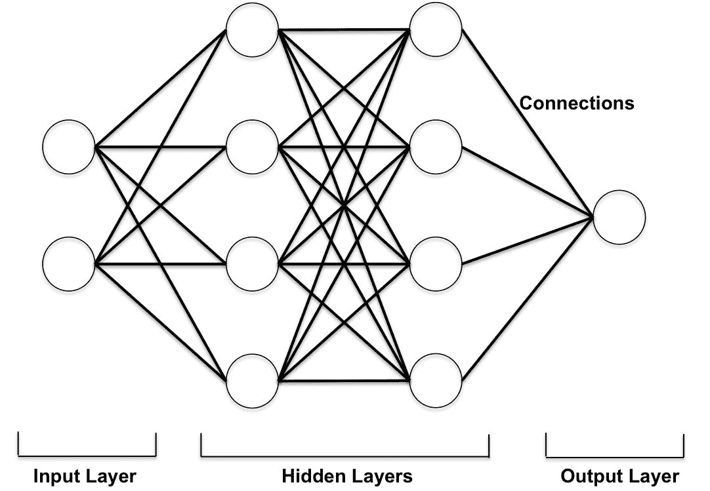
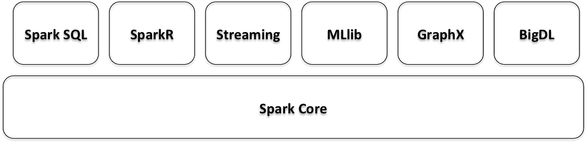
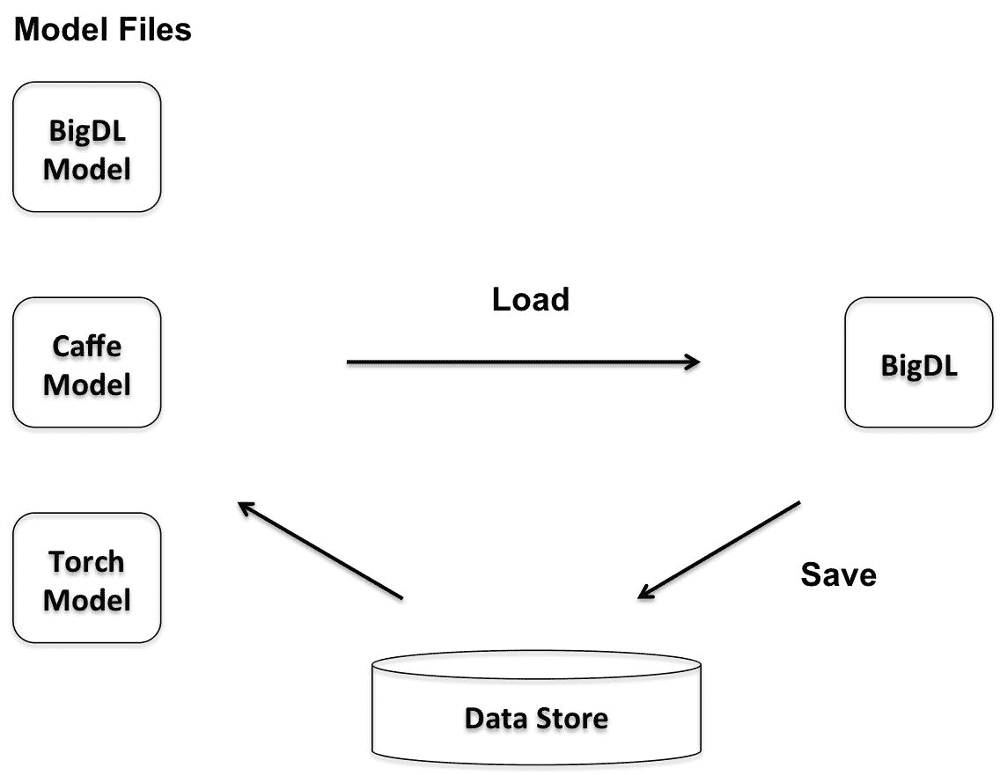
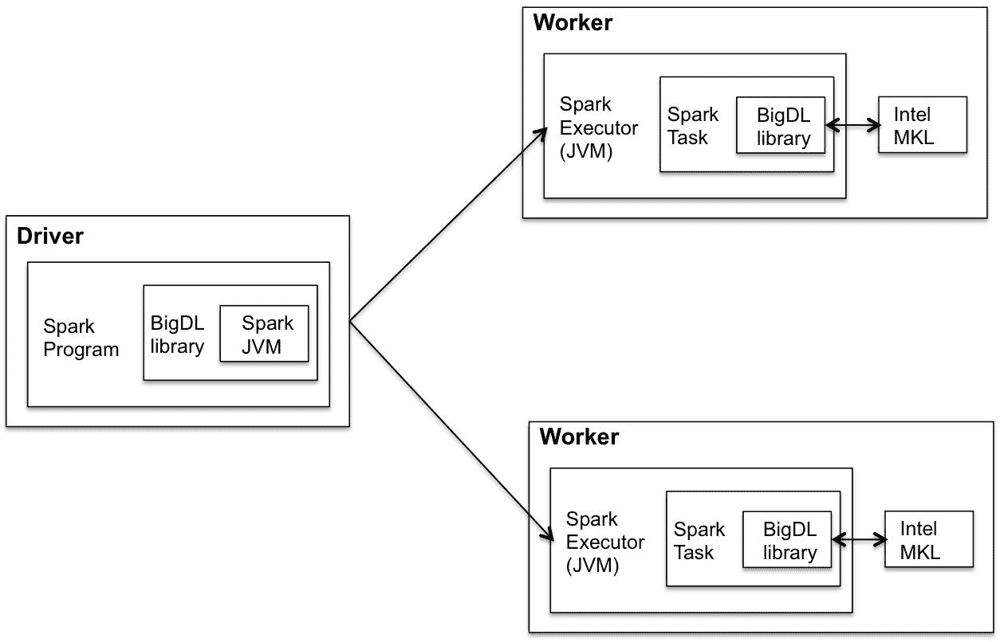
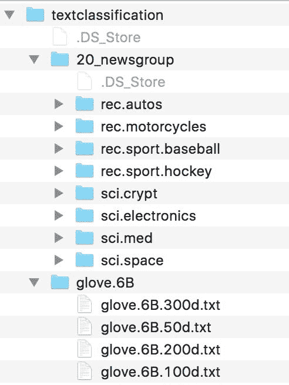
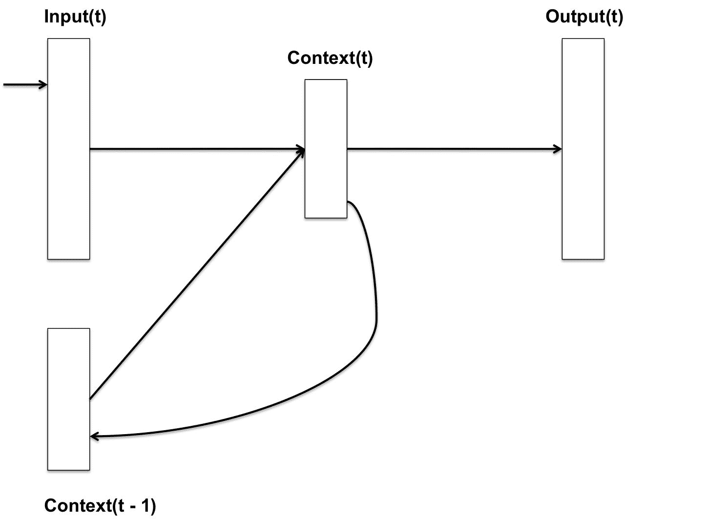
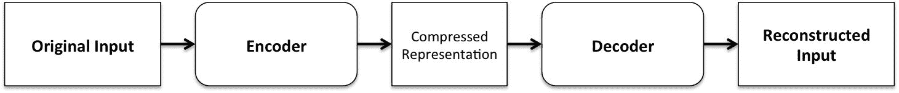

# 第十章：在深度学习应用中使用 Spark SQL

在过去的十年中，深度学习已经成为解决机器学习中几个困难问题的优越解决方案。我们听说深度学习被部署到许多不同领域，包括计算机视觉、语音识别、自然语言处理、音频识别、社交媒体应用、机器翻译和生物学。通常，使用深度学习方法产生的结果与或优于人类专家产生的结果。

已经有几种不同类型的深度学习模型被应用到不同的问题上。我们将回顾这些模型的基本概念并呈现一些代码。这是 Spark 中一个新兴的领域，所以尽管有几种不同的库可用，但很多都还处于早期版本或者每天都在不断发展。我们将简要概述其中一些库，包括使用 Spark 2.1.0、Scala 和 BigDL 的一些代码示例。我们选择 BigDL 是因为它是少数几个直接在 Spark Core 上运行的库之一（类似于其他 Spark 包），并且使用 Scala API 与 Spark SQL DataFrame API 和 ML pipelines 一起工作。

更具体地，在本章中，您将学习以下内容：

+   什么是深度学习？

+   了解各种深度学习模型的关键概念

+   了解 Spark 中的深度学习

+   使用 BigDL 和 Spark

# 神经网络介绍

神经网络，或者人工神经网络（ANN），是一组松散模拟人脑的算法或实际硬件。它们本质上是一组相互连接的处理节点，旨在识别模式。它们适应于或从一组训练模式中学习，如图像、声音、文本、时间序列等。

神经网络通常组织成由相互连接的节点组成的层。这些节点通过连接彼此进行通信。模式通过输入层呈现给网络，然后传递给一个或多个隐藏层。实际的计算是在这些隐藏层中执行的。最后一个隐藏层连接到一个输出层，输出最终答案。

特定节点的总输入通常是连接节点的每个输出的函数。这些输入对节点的贡献可以是兴奋的或抑制的，并最终有助于确定信号是否以及在多大程度上通过网络进一步传播（通过激活函数）。通常，Sigmoid 激活函数非常受欢迎。在一些应用中，也使用了线性、半线性或双曲正切（`Tanh`）函数。在节点的输出是总输入的随机函数的情况下，输入决定了给定节点获得高激活值的概率。

网络内部连接的权重根据学习规则进行修改；例如，当神经网络最初呈现一种模式时，它会猜测权重可能是什么。然后，它评估其答案与实际答案的差距，并对其连接权重进行适当调整。

有关神经网络基础知识的良好介绍，请参考：Bolo 的《神经网络基础介绍》，网址：[`pages.cs.wisc.edu/~bolo/shipyard/neural/local.html`](http://pages.cs.wisc.edu/~bolo/shipyard/neural/local.html)。

在接下来的章节中，我们将介绍各种类型的神经网络的更具体细节。

# 了解深度学习

深度学习是将人工神经网络应用于学习任务。深度学习方法基于学习数据表示，而不是特定于任务的算法。尽管学习可以是监督的或无监督的，但最近的重点是创建能够从大规模未标记数据集中学习这些表示的高效系统。

下图描述了一个具有两个隐藏层的简单深度学习神经网络：



深度学习通常包括多层处理单元，每一层都在其中学习特征表示。这些层形成特征的层次结构，深度学习假设这种层次结构对应于抽象级别。因此，它利用了分层解释因素的思想，更高级别的更抽象的概念是从更低级别的概念中学习的。通过改变层数和层大小，可以提供不同数量的抽象，根据使用情况的需要。

# 理解表示学习

深度学习方法是具有多个抽象层次的表示学习方法。在这里，非线性模块将原始输入转换为更高、稍微更抽象级别的表示。最终，通过组合足够数量的这样的层，可以学习非常复杂的函数。

有关深度学习的综述论文，请参阅 Yann LeCun、Yoshua Bengio 和 Geoffrey Hinton 的《深度学习》，可在[`www.nature.com/nature/journal/v521/n7553/full/nature14539.html?foxtrotcallback=true`](http://www.nature.com/nature/journal/v521/n7553/full/nature14539.html?foxtrotcallback=true)上找到。

现在，我们将说明在传统模式识别任务中学习表示和特征的过程：


传统的机器学习技术在处理自然数据的原始形式时受到限制。构建这样的机器学习系统需要深入的领域专业知识和大量的努力，以识别（并保持更新）学习子系统，通常是分类器，可以从中检测或分类输入中的模式的特征。

许多传统的机器学习应用程序使用手工制作的特征上的线性分类器。这样的分类器通常需要一个良好的特征提取器，产生对图像方面有选择性的表示。然而，如果可以使用通用学习程序自动学习良好的特征，那么所有这些努力都是不必要的。深度学习的这一特定方面代表了深度学习的一个关键优势。

与早期的机器学习技术相比，深度学习中的高级过程通常是，其中端到端的学习过程还涉及从数据中学习的特征。这在这里有所说明：


在下一节中，我们将简要讨论一种最常用的函数，即随机梯度下降，用于调整网络中的权重。

# 理解随机梯度下降

深度学习系统可以包括数百万个可调整的权重，并且使用数百万个标记的示例来训练机器。在实践中，**随机梯度下降**（**SGD**）优化被广泛应用于许多不同的情况。在 SGD 中，梯度描述了网络的错误与单个权重之间的关系，即当调整权重时错误如何变化。

这种优化方法包括：

+   为一些示例呈现输入向量

+   计算输出和错误

+   计算示例的平均梯度

+   适当调整权重

这个过程对许多小的训练示例集重复进行。当目标函数的平均值停止减少时，过程停止。

与更复杂的优化技术相比，这个简单的过程通常能够非常有效地产生一组良好的权重。此外，训练过程所需的时间也要短得多。训练过程完成后，通过在测试数据集上运行经过训练的模型来衡量系统的性能。测试集包含机器之前在训练阶段未见过的新输入。

在深度学习神经网络中，激活函数通常设置在层级，并应用于特定层中的所有神经元或节点。此外，多层深度学习神经网络的输出层起着特定的作用；例如，在监督学习（带有标记的输入）中，它基于从前一层接收到的信号应用最可能的标签。输出层上的每个节点代表一个标签，并且该节点产生两种可能的结果之一，即`0`或`1`。虽然这样的神经网络产生二进制输出，但它们接收的输入通常是连续的；例如，推荐引擎的输入可以包括客户上个月的消费金额和过去一个月每周平均客户访问次数等因素。输出层必须将这些信号处理成给定输入的概率度量。

# 在 Spark 中介绍深度学习

在本节中，我们将回顾一些使用 Spark 的更受欢迎的深度学习库。这些包括 CaffeOnSpark、DL4J、TensorFrames 和 BigDL。

# 介绍 CaffeOnSpark

CaffeOnSpark 是 Yahoo 为 Hadoop 集群上的大规模分布式深度学习开发的。通过将深度学习框架 Caffe 的特性与 Apache Spark（和 Apache Hadoop）结合，CaffeOnSpark 实现了在 GPU 和 CPU 服务器集群上的分布式深度学习。

有关 CaffeOnSpark 的更多详细信息，请参阅[`github.com/yahoo/CaffeOnSpark`](https://github.com/yahoo/CaffeOnSpark)。

CaffeOnSpark 支持神经网络模型的训练、测试和特征提取。它是非深度学习库 Spark MLlib 和 Spark SQL 的补充。CaffeOnSpark 的 Scala API 为 Spark 应用程序提供了一种简单的机制，以在分布式数据集上调用深度学习算法。在这里，深度学习通常是在现有数据处理流水线的同一集群中进行，以支持特征工程和传统的机器学习应用。因此，CaffeOnSpark 允许将深度学习训练和测试过程嵌入到 Spark 应用程序中。

# 介绍 DL4J

DL4J 支持在 Spark 集群上训练神经网络，以加速网络训练。当前版本的 DL4J 在每个集群节点上使用参数平均化的过程来训练网络。当主节点拥有训练好的网络的副本时，训练就完成了。

有关 DL4J 的更多详细信息，请参阅[`deeplearning4j.org/spark`](https://deeplearning4j.org/spark)。

# 介绍 TensorFrames

实验性的 Scala 和 Apache Spark 的 TensorFlow 绑定目前在 GitHub 上可用。TensorFrames 本质上是 Spark Dataframes 上的 TensorFlow，它允许您使用 TensorFlow 程序操作 Apache Spark 的 DataFrames。目前，Scala 支持比 Python 更有限--Scala DSL 具有 TensorFlow 变换的子集。

有关 TensorFrames 的更多详细信息，请访问[`github.com/databricks/tensorframes`](https://github.com/databricks/tensorframes)。

在 Scala 中，操作可以从以`ProtocolBuffers`格式定义的现有图形中加载，也可以使用简单的 Scala DSL。然而，鉴于 TensorFlow 的整体流行，这个库正在受到关注，并且在 Python 社区中更受欢迎。

# 使用 BigDL

BigDL 是 Apache Spark 的开源分布式深度学习库。最初由英特尔开发并开源。使用 BigDL，开发人员可以将深度学习应用程序编写为标准的 Spark 程序。这些程序直接在现有的 Spark 或 Hadoop 集群上运行，如图所示：



BigDL 是基于 Torch 建模的，它支持深度学习，包括数值计算（通过张量）和[神经网络](https://github.com/intel-analytics/BigDL/tree/master/spark/dl/src/main/scala/com/intel/analytics/bigdl/nn)。此外，开发人员可以将预训练的[Caffe](http://caffe.berkeleyvision.org/)或[Torch](http://torch.ch/)模型加载到 BigDL-Spark 程序中，如下图所示：



为了实现高性能，BigDL 在每个 Spark 任务中使用[Intel MKL](https://software.intel.com/en-us/intel-mkl)和多线程编程。

有关 BigDL 文档、示例和 API 指南，请访问[`bigdl-project.github.io/master/`](https://bigdl-project.github.io/master/)。

下图显示了 BigDL 程序在 Spark 集群上的高级执行方式。借助集群管理器和驱动程序，Spark 任务分布在 Spark 工作节点或容器（执行器）上：



我们将在本章的后面几节中执行 BigDL 分发中提供的几个深度神经网络的示例。目前，这是少数几个与 Spark SQL DataFrame API 和 ML 管道一起使用的库之一。

在下一节中，我们将重点介绍如何利用 Spark 并行调整超参数。

# 调整深度学习模型的超参数

构建神经网络时，有许多重要的超参数需要仔细选择。考虑以下示例：

+   每层神经元的数量：很少的神经元会降低网络的表达能力，但太多的神经元会大大增加运行时间并返回嘈杂的估计值

+   学习率：如果学习率太高，神经网络将只关注最近看到的几个样本，并忽略之前积累的所有经验；如果学习率太低，将需要很长时间才能达到良好的状态

超参数调整过程是“尴尬并行”的，可以使用 Spark 进行分布。

有关更多详细信息，请参阅 Tim Hunter 的*Deep Learning with Apache Spark and TensorFlow*，网址为[`databricks.com/blog/2016/01/25/deep-learning-with-apache-spark-and-tensorflow.html`](https://databricks.com/blog/2016/01/25/deep-learning-with-apache-spark-and-tensorflow.html)。

# 介绍深度学习管道

Spark 中有一个新兴的库，用于支持深度学习管道，它提供了用于 Python 中可扩展深度学习的高级 API。目前支持 TensorFlow 和基于 TensorFlow 的 Keras 工作流程，重点是在规模化图像数据上进行模型推断/评分和迁移学习。

要关注 Spark 中深度学习管道的发展，请访问[`github.com/databricks/spark-deep-learning`](https://github.com/databricks/spark-deep-learning)。

此外，它为数据科学家和机器学习专家提供了工具，可以将深度学习模型转换为 SQL UDF，这样更广泛的用户群体就可以使用。这也是生产深度学习模型的一种好方法。

在下一节中，我们将把重点转移到监督学习上。

# 理解监督学习

最常见的机器学习形式是监督学习；例如，如果我们正在构建一个用于分类特定图像集的系统，我们首先收集来自相同类别的大量图像数据集。在训练期间，机器显示一幅图像，并产生一个以每个类别为一个分数的向量形式的输出。作为训练的结果，我们期望所需的类别在所有类别中具有最高的分数。

深度网络的一种特殊类型——卷积神经网络（ConvNet/CNN）——比全连接网络更容易训练，泛化能力也更好。在监督学习场景中，深度卷积网络显著改善了图像、视频、语音和音频数据的处理结果。同样，循环网络也为顺序数据（如文本和语音）带来了曙光。我们将在接下来的部分探讨这些类型的神经网络。

# 理解卷积神经网络

卷积神经网络是一种特殊类型的多层神经网络，它们被设计来直接从像素图像中识别视觉模式，需要最少的预处理。它们可以识别具有广泛变化的模式，并且可以有效地处理扭曲和简单的几何变换。CNN 也是使用反向传播算法的一种版本进行训练。

典型 ConvNet 的架构被构造为一系列包含多个堆叠卷积、非线性和池化层的阶段，然后是额外的卷积和全连接层。非线性函数通常是**修正线性单元**（ReLU）函数，池化层的作用是将相似特征语义地合并为一个。因此，池化允许表示在前一层的元素在位置和外观上变化很少时也能变化很小。

LeNet-5 是一个专为手写和机器打印字符识别设计的卷积网络。在这里，我们介绍了 BigDL 分发中可用的 Lenet-5 的一个例子。

该示例的完整源代码可在[`github.com/intel-analytics/BigDL/tree/master/spark/dl/src/main/scala/com/intel/analytics/bigdl/models/lenet`](https://github.com/intel-analytics/BigDL/tree/master/spark/dl/src/main/scala/com/intel/analytics/bigdl/models/lenet)找到。

在这里，我们将使用 Spark shell 执行相同的代码。请注意，常量的值都取自上述网站提供的源代码。

首先，执行`bigdl` shell 脚本来设置环境：

```scala
source /Users/aurobindosarkar/Downloads/BigDL-master/scripts/bigdl.sh
```

然后，我们使用适当指定 BigDL JAR 启动 Spark shell：

```scala
bin/spark-shell --properties-file /Users/aurobindosarkar/Downloads/BigDL-master/spark/dist/target/bigdl-0.2.0-SNAPSHOT-spark-2.0.0-scala-2.11.8-mac-dist/conf/spark-bigdl.conf --jars /Users/aurobindosarkar/Downloads/BigDL-master/spark/dist/target/bigdl-0.2.0-SNAPSHOT-spark-2.0.0-scala-2.11.8-mac-dist/lib/bigdl-0.2.0-SNAPSHOT-jar-with-dependencies.jar
```

这个例子的数据集可以从[`yann.lecun.com/exdb/mnist/`](http://yann.lecun.com/exdb/mnist/)下载。

本例的 Spark shell 会话如下所示：

```scala
scala> import com.intel.analytics.bigdl._
scala> import com.intel.analytics.bigdl.dataset.DataSet
scala> import com.intel.analytics.bigdl.dataset.image.{BytesToGreyImg, GreyImgNormalizer, GreyImgToBatch, GreyImgToSample}
scala> import com.intel.analytics.bigdl.nn.{ClassNLLCriterion, Module}
scala> import com.intel.analytics.bigdl.numeric.NumericFloat
scala> import com.intel.analytics.bigdl.optim._
scala> import com.intel.analytics.bigdl.utils.{Engine, T,
scala> import com.intel.analytics.bigdl.nn._
scala> import java.nio.ByteBuffer
scala> import java.nio.file.{Files, Path, Paths}
scala> import com.intel.analytics.bigdl.dataset.ByteRecord
scala> import com.intel.analytics.bigdl.utils.File

scala> val trainData = "/Users/aurobindosarkar/Downloads/mnist/train-images-idx3-ubyte"
scala> val trainLabel = "/Users/aurobindosarkar/Downloads/mnist/train-labels-idx1-ubyte"
scala> val validationData = "/Users/aurobindosarkar/Downloads/mnist/t10k-images-idx3-ubyte"
scala> val validationLabel = "/Users/aurobindosarkar/Downloads/mnist/t10k-labels-idx1-ubyte"

scala> val nodeNumber = 1 //Number of nodes
scala> val coreNumber = 2 //Number of cores

scala> Engine.init

scala> val model = Sequential[Float]()
model: com.intel.analytics.bigdl.nn.Sequential[Float] =
nn.Sequential {
[input -> -> output]
}

scala> val classNum = 10 //Number of classes (digits)
scala> val batchSize = 12
//The model uses the Tanh function for non-linearity.
//It has two sets layers comprising of Convolution-Non-Linearity-Pooling
//It uses a Softmax function to output the results

scala> model.add(Reshape(Array(1, 28, 28))).add(SpatialConvolution(1, 6, 5, 5)).add(Tanh()).add(SpatialMaxPooling(2, 2, 2, 2)).add(Tanh()).add(SpatialConvolution(6, 12, 5, 5)).add(SpatialMaxPooling(2, 2, 2, 2)).add(Reshape(Array(12 * 4 * 4))).add(Linear(12 * 4 * 4, 100)).add(Tanh()).add(Linear(100, classNum)).add(LogSoftMax())

res1: model.type =
nn.Sequential {
[input -> (1) -> (2) -> (3) -> (4) -> (5) -> (6) -> (7) -> (8) -> (9) -> (10) -> (11) -> (12) -> output]
(1): nn.Reshape(1x28x28)
(2): nn.SpatialConvolution(1 -> 6, 5 x 5, 1, 1, 0, 0)
(3): nn.Tanh
(4): nn.SpatialMaxPooling(2, 2, 2, 2, 0, 0)
(5): nn.Tanh
(6): nn.SpatialConvolution(6 -> 12, 5 x 5, 1, 1, 0, 0)
(7): nn.SpatialMaxPooling(2, 2, 2, 2, 0, 0)
(8): nn.Reshape(192)
(9): nn.Linear(192 -> 100)
(10): nn.Tanh
(11): nn.Linear(100 -> 10)
(12): nn.LogSoftMax
}

//The following is a private function in Utils.
scala> def load(featureFile: String, labelFile: String): Array[ByteRecord] = {
|    val featureBuffer = ByteBuffer.wrap(Files.readAllBytes(Paths.get(featureFile)))
|    val labelBuffer = ByteBuffer.wrap(Files.readAllBytes(Paths.get(labelFile)));
|    val labelMagicNumber = labelBuffer.getInt();
|    require(labelMagicNumber == 2049);
|    val featureMagicNumber = featureBuffer.getInt();
|    require(featureMagicNumber == 2051);
|    val labelCount = labelBuffer.getInt();
|    val featureCount = featureBuffer.getInt();
|    require(labelCount == featureCount);
|    val rowNum = featureBuffer.getInt();
|    val colNum = featureBuffer.getInt();
|    val result = new ArrayByteRecord;
|    var i = 0;
|    while (i < featureCount) {
|       val img = new ArrayByte);
|       var y = 0;
|       while (y < rowNum) {
|          var x = 0;
|          while (x < colNum) {
|             img(x + y * colNum) = featureBuffer.get();
|             x += 1;
|          }
|          y += 1;
|       }
|       result(i) = ByteRecord(img, labelBuffer.get().toFloat + 1.0f);
|       i += 1;
|    }
|    result;
| }

scala> val trainMean = 0.13066047740239506
scala> val trainStd = 0.3081078

scala> val trainSet = DataSet.array(load(trainData, trainLabel), sc) -> BytesToGreyImg(28, 28) -> GreyImgNormalizer(trainMean, trainStd) -> GreyImgToBatch(batchSize)

scala> val optimizer = Optimizer(model = model, dataset = trainSet, criterion = ClassNLLCriterion[Float]())

scala> val testMean = 0.13251460696903547
scala> val testStd = 0.31048024
scala> val maxEpoch = 2

scala> val validationSet = DataSet.array(load(validationData, validationLabel), sc) -> BytesToGreyImg(28, 28) -> GreyImgNormalizer(testMean, testStd) -> GreyImgToBatch(batchSize)

scala> optimizer.setEndWhen(Trigger.maxEpoch(2))
scala> optimizer.setState(T("learningRate" -> 0.05, "learningRateDecay" -> 0.0))
scala> optimizer.setCheckpoint("/Users/aurobindosarkar/Downloads/mnist/checkpoint", Trigger.severalIteration(500))
scala> optimizer.setValidation(trigger = Trigger.everyEpoch, dataset = validationSet, vMethods = Array(new Top1Accuracy, new Top5Accuracy[Float], new Loss[Float]))

scala> optimizer.optimize()

scala> model.save("/Users/aurobindosarkar/Downloads/mnist/model") //Save the trained model to disk.
scala> val model = Module.loadFloat //Retrieve the model from the disk
scala> val partitionNum = 2
scala> val rddData = sc.parallelize(load(validationData, validationLabel), partitionNum)

scala> val transformer = BytesToGreyImg(28, 28) -> GreyImgNormalizer(testMean, testStd) -> GreyImgToSample()

scala> val evaluationSet = transformer(rddData)

scala> val result = model.evaluate(evaluationSet, Array(new Top1Accuracy[Float]), Some(batchSize))

scala> result.foreach(r => println(s"${r._2} is ${r._1}"))
Top1Accuracy is Accuracy(correct: 9831, count: 10000, accuracy: 0.9831)
```

在下一节中，我们将介绍一个文本分类的例子。

# 使用神经网络进行文本分类

其他越来越重要的应用包括自然语言理解和语音识别。

本节中的示例作为 BigDL 分发的一部分可用，完整的源代码可在[`github.com/intel-analytics/BigDL/tree/master/spark/dl/src/main/scala/com/intel/analytics/bigdl/example/textclassification`](https://github.com/intel-analytics/BigDL/tree/master/spark/dl/src/main/scala/com/intel/analytics/bigdl/example/textclassification)找到。

它使用预训练的 GloVe 嵌入将单词转换为向量，然后用它在包含二十个不同类别的二十个新闻组数据集上训练文本分类模型。这个模型在只训练两个时期后就可以达到 90%以上的准确率。

这里呈现了定义 CNN 模型和优化器的关键部分代码：

```scala
val model = Sequential[Float]()

//The model has 3 sets of Convolution and Pooling layers.
model.add(Reshape(Array(param.embeddingDim, 1, param.maxSequenceLength)))
model.add(SpatialConvolution(param.embeddingDim, 128, 5, 1))
model.add(ReLU())
model.add(SpatialMaxPooling(5, 1, 5, 1))
model.add(SpatialConvolution(128, 128, 5, 1))
model.add(ReLU())
model.add(SpatialMaxPooling(5, 1, 5, 1))
model.add(SpatialConvolution(128, 128, 5, 1))
model.add(ReLU())
model.add(SpatialMaxPooling(35, 1, 35, 1))
model.add(Reshape(Array(128)))
model.add(Linear(128, 100))
model.add(Linear(100, classNum))
model.add(LogSoftMax())

//The optimizer uses the Adagrad method
val optimizer = Optimizer(
model = buildModel(classNum),
sampleRDD = trainingRDD,
criterion = new ClassNLLCriterion[Float](),
batchSize = param.batchSize
)

optimizer
.setOptimMethod(new Adagrad(learningRate = 0.01, learningRateDecay = 0.0002))
.setValidation(Trigger.everyEpoch, valRDD, Array(new Top1Accuracy[Float]), param.batchSize)
.setEndWhen(Trigger.maxEpoch(20))
.optimize()
```

输入数据集的描述如下，以及它们的下载 URL：

+   **嵌入**：400k 个单词的 100 维预训练 GloVe 嵌入，训练于 2014 年英文维基百科的转储数据。从[`nlp.stanford.edu/data/glove.6B.zip`](http://nlp.stanford.edu/data/glove.6B.zip)下载预训练的 GloVe 单词嵌入。

+   **训练数据**：“20 Newsgroup 数据集”，包含 20 个类别，共 19,997 个文本。从[`www.cs.cmu.edu/afs/cs.cmu.edu/project/theo-20/www/data/news20.tar.gz`](http://www.cs.cmu.edu/afs/cs.cmu.edu/project/theo-20/www/data/news20.tar.gz)下载 20 Newsgroup 数据集作为训练数据。

在我们的示例中，我们将类别数量减少到八个，以避免在内存小于 16GB 的笔记本电脑上出现`内存不足`异常。将这些数据集放在`BASE_DIR`中；最终的目录结构应如图所示：



使用以下命令执行文本分类器：

```scala
Aurobindos-MacBook-Pro-2:BigDL aurobindosarkar$ /Users/aurobindosarkar/Downloads/BigDL-master/scripts/bigdl.sh -- /Users/aurobindosarkar/Downloads/spark-2.1.0-bin-hadoop2.7/bin/spark-submit --master "local[2]" --driver-memory 14g --class com.intel.analytics.bigdl.example.textclassification.TextClassifier /Users/aurobindosarkar/Downloads/BigDL-master/spark/dist/target/bigdl-0.2.0-SNAPSHOT-spark-2.0.0-scala-2.11.8-mac-dist/lib/bigdl-0.2.0-SNAPSHOT-jar-with-dependencies.jar --batchSize 128 -b /Users/aurobindosarkar/Downloads/textclassification -p 4
```

这里给出了示例输出以供参考：

```scala
17/08/16 14:50:07 INFO textclassification.TextClassifier$: Current parameters: TextClassificationParams(/Users/aurobindosarkar/Downloads/textclassification,1000,20000,0.8,128,100,4)
17/08/16 14:50:07 INFO utils.ThreadPool$: Set mkl threads to 1 on thread 1
17/08/16 14:50:09 INFO utils.Engine$: Auto detect executor number and executor cores number
17/08/16 14:50:09 INFO utils.Engine$: Executor number is 1 and executor cores number is 2
17/08/16 14:50:09 INFO utils.Engine$: Find existing spark context. Checking the spark conf...
17/08/16 14:50:10 INFO utils.TextClassifier: Found 8000 texts.
17/08/16 14:50:10 INFO utils.TextClassifier: Found 8 classes
17/08/16 14:50:13 INFO utils.TextClassifier: Indexing word vectors.
17/08/16 14:50:16 INFO utils.TextClassifier: Found 17424 word vectors.
17/08/16 14:50:16 INFO optim.DistriOptimizer$: caching training rdd ...
17/08/16 14:50:37 INFO optim.DistriOptimizer$: Cache thread models...
17/08/16 14:50:37 INFO optim.DistriOptimizer$: model thread pool size is 1
17/08/16 14:50:37 INFO optim.DistriOptimizer$: Cache thread models... done
17/08/16 14:50:37 INFO optim.DistriOptimizer$: config {
learningRate: 0.01
maxDropPercentage: 0.0
computeThresholdbatchSize: 100
warmupIterationNum: 200
learningRateDecay: 2.0E-4
dropPercentage: 0.0
}
17/08/16 14:50:37 INFO optim.DistriOptimizer$: Shuffle data
17/08/16 14:50:37 INFO optim.DistriOptimizer$: Shuffle data complete. Takes 0.012679728s
17/08/16 14:50:38 INFO optim.DistriOptimizer$: [Epoch 1 0/6458][Iteration 1][Wall Clock 0.0s] Train 128 in 0.962042186seconds. Throughput is 133.0503 records/second. Loss is 2.0774076.
17/08/16 14:50:40 INFO optim.DistriOptimizer$: [Epoch 1 128/6458][Iteration 2][Wall Clock 0.962042186s] Train 128 in 1.320501728seconds. Throughput is 96.93285 records/second. Loss is 4.793501.
17/08/16 14:50:40 INFO optim.DistriOptimizer$: [Epoch 1 256/6458][Iteration 3][Wall Clock 2.282543914s] Train 128 in 0.610049842seconds. Throughput is 209.81892 records/second. Loss is 2.1110187.
17/08/16 14:50:41 INFO optim.DistriOptimizer$: [Epoch 1 384/6458][Iteration 4][Wall Clock 2.892593756s] Train 128 in 0.609548069seconds. Throughput is 209.99164 records/second. Loss is 2.0820618.
17/08/16 14:50:42 INFO optim.DistriOptimizer$: [Epoch 1 512/6458][Iteration 5][Wall Clock 3.502141825s] Train 128 in 0.607720212seconds. Throughput is 210.62325 records/second. Loss is 2.0860045.
17/08/16 14:50:42 INFO optim.DistriOptimizer$: [Epoch 1 640/6458][Iteration 6][Wall Clock 4.109862037s] Train 128 in 0.607034064seconds. Throughput is 210.86131 records/second. Loss is 2.086178.
.
.
.
17/08/16 15:04:57 INFO optim.DistriOptimizer$: [Epoch 20 6144/6458][Iteration 1018][Wall Clock 855.715191033s] Train 128 in 0.771615991seconds. Throughput is 165.88562 records/second. Loss is 2.4244189E-4.
17/08/16 15:04:58 INFO optim.DistriOptimizer$: [Epoch 20 6272/6458][Iteration 1019][Wall Clock 856.486807024s] Train 128 in 0.770584628seconds. Throughput is 166.10765 records/second. Loss is 0.04117684.
17/08/16 15:04:59 INFO optim.DistriOptimizer$: [Epoch 20 6400/6458][Iteration 1020][Wall Clock 857.257391652s] Train 128 in 0.783425485seconds. Throughput is 163.38503 records/second. Loss is 3.2506883E-4.
17/08/16 15:04:59 INFO optim.DistriOptimizer$: [Epoch 20 6400/6458][Iteration 1020][Wall Clock 857.257391652s] Epoch finished. Wall clock time is 861322.002763ms
17/08/16 15:04:59 INFO optim.DistriOptimizer$: [Wall Clock 861.322002763s] Validate model...
17/08/16 15:05:02 INFO optim.DistriOptimizer$: Top1Accuracy is Accuracy(correct: 1537, count: 1542, accuracy: 0.996757457846952)
```

在下一节中，我们将探讨使用深度神经网络进行语言处理。

# 使用深度神经网络进行语言处理

如第九章中所讨论的，*使用 Spark SQL 开发应用程序*，语言的统计建模通常基于 n-grams 的出现频率。在大多数实际用例中，这通常需要非常大的训练语料库。此外，n-grams 将每个单词视为独立单元，因此它们无法概括语义相关的单词序列。相比之下，神经语言模型将每个单词与一组实值特征向量相关联，因此语义相关的单词在该向量空间中靠近。学习单词向量在单词序列来自大型真实文本语料库时也非常有效。这些单词向量由神经网络自动发现的学习特征组成。

从文本中学习的单词的向量表示现在在自然语言应用中被广泛使用。在下一节中，我们将探讨递归神经网络及其在文本分类任务中的应用。

# 理解递归神经网络

通常，对于涉及顺序输入的任务，建议使用**递归神经网络**（**RNNs**）。这样的输入一次处理一个元素，同时保持一个“状态向量”（在隐藏单元中）。状态隐含地包含有关序列中所有过去元素的信息。

通常，在传统的 RNN 中，很难长时间存储信息。为了长时间记住输入，网络可以增加显式内存。这也是**长短期记忆**（**LSTM**）网络中使用的方法；它们使用可以记住输入的隐藏单元。LSTM 网络已被证明比传统的 RNN 更有效。

在本节中，我们将探讨用于建模序列数据的递归神经网络。下图说明了一个简单的递归神经网络或 Elman 网络：



这可能是最简单的递归神经网络的版本，易于实现和训练。网络有一个输入层，一个隐藏层（也称为上下文层或状态），和一个输出层。网络在时间`t`的输入是**Input(t)**，输出表示为**Output(t)**，**Context(t)**是网络的状态（隐藏层）。输入向量是通过连接表示当前单词的向量和时间`t-1`的上下文层中神经元的输出来形成的。

这些网络在几个时期内进行训练，其中训练语料库中的所有数据都被顺序呈现。为了训练网络，我们可以使用随机梯度下降的标准反向传播算法。每个时期后，网络都会在验证数据上进行测试。如果验证数据的对数似然性增加，训练将在新的时期继续。如果没有观察到显著的改善，学习率可以在每个新时期开始时减半。如果改变学习率没有显著改善，训练就结束了。这样的网络通常在 10-20 个时期后收敛。

这里，输出层表示在给定上一个单词和**Context(t − 1)**时下一个单词的概率分布。Softmax 确保概率分布是有效的。在每个训练步骤中，计算错误向量，并使用标准的反向传播算法更新权重，如下所示：

*error(t) = desired(t) − Output(t)*

这里，desired 是使用`1-of-N`编码的向量，表示在特定上下文中应该被预测的单词，**Output(t)**是网络的实际输出。

为了提高性能，我们可以将在训练文本中出现次数少于给定阈值的所有单词合并为一个特殊的稀有标记。因此，所有稀有单词都被平等对待，即它们之间的概率均匀分布。

现在，我们执行 BigDL 库中提供的一个简单的 RNN 示例。该网络是一个全连接的 RNN，其中输出被反馈到输入中。该示例模型支持序列到序列处理，并且是用于语言建模的简单循环神经网络的实现。

有关此示例的完整源代码，请参阅[`github.com/intel-analytics/BigDL/tree/master/spark/dl/src/main/scala/com/intel/analytics/bigdl/models/rnn`](https://github.com/intel-analytics/BigDL/tree/master/spark/dl/src/main/scala/com/intel/analytics/bigdl/models/rnn)。

输入数据集 Tiny Shakespeare Texts 可以从[`raw.githubusercontent.com/karpathy/char-rnn/master/data/tinyshakespeare/input.txt`](https://raw.githubusercontent.com/karpathy/char-rnn/master/data/tinyshakespeare/input.txt)下载。

下载文本后，将其放入适当的目录。我们将输入数据集拆分为单独的`train.txt`和`val.txt`文件。在我们的示例中，我们选择 80%的输入作为训练数据集，剩下的 20%作为验证数据集。

通过执行以下命令将输入数据集拆分：

```scala
head -n 8000 input.txt > val.txt
tail -n +8000 input.txt > train.txt
```

`SentenceSplitter`和`SentenceTokenizer`类使用`Apache OpenNLP`库。训练模型文件--`en-token.bin`和`en-sent.bin`--可以从[`opennlp.sourceforge.net/models-1.5/`](http://opennlp.sourceforge.net/models-1.5/)下载。

与模型和优化器相关的关键部分代码如下：

```scala
val model = Sequential[Float]()
//The RNN is created with the time-related parameter.
model.add(Recurrent[Float]()
.add(RnnCellFloat)))
.add(TimeDistributedFloat))

//The optimization method used is SGD.
val optimMethod = if (param.stateSnapshot.isDefined) {
OptimMethod.loadFloat
} else {
   new SGDFloat
}

val optimizer = Optimizer(
model = model,
dataset = trainSet,
criterion = TimeDistributedCriterionFloat, sizeAverage = true)
)

optimizer
.setValidation(Trigger.everyEpoch, validationSet, Array(new LossFloat, sizeAverage = true))))
.setOptimMethod(optimMethod)
.setEndWhen(Trigger.maxEpoch(param.nEpochs))
.setCheckpoint(param.checkpoint.get, Trigger.everyEpoch)
.optimize()
```

以下命令执行训练程序。修改特定于您的环境的参数：

```scala
Aurobindos-MacBook-Pro-2:bigdl-rnn aurobindosarkar$ /Users/aurobindosarkar/Downloads/BigDL-master/scripts/bigdl.sh -- \
> /Users/aurobindosarkar/Downloads/spark-2.1.0-bin-hadoop2.7/bin/spark-submit \
> --master local[2] \
> --executor-cores 2 \
> --total-executor-cores 2 \
> --class com.intel.analytics.bigdl.models.rnn.Train \
> /Users/aurobindosarkar/Downloads/dist-spark-2.1.1-scala-2.11.8-mac-0.3.0-20170813.202825-21-dist/lib/bigdl-SPARK_2.1-0.3.0-SNAPSHOT-jar-with-dependencies.jar \
> -f /Users/aurobindosarkar/Downloads/bigdl-rnn/inputdata/ -s /Users/aurobindosarkar/Downloads/bigdl-rnn/saveDict/ --checkpoint /Users/aurobindosarkar/Downloads/bigdl-rnn/model/ --batchSize 12 -e 2
```

下面是训练过程中生成的输出的一部分：

```scala
17/08/16 21:32:38 INFO utils.ThreadPool$: Set mkl threads to 1 on thread 1
17/08/16 21:32:39 INFO utils.Engine$: Auto detect executor number and executor cores number
17/08/16 21:32:39 INFO utils.Engine$: Executor number is 1 and executor cores number is 2
17/08/16 21:32:39 INFO utils.Engine$: Find existing spark context. Checking the spark conf...
17/08/16 21:32:41 INFO text.Dictionary: 272304 words and32885 sentences processed
17/08/16 21:32:41 INFO text.Dictionary: save created dictionary.txt and discard.txt to/Users/aurobindosarkar/Downloads/bigdl-rnn/saveDict
17/08/16 21:32:41 INFO rnn.Train$: maxTrain length = 25, maxVal = 22
17/08/16 21:32:42 INFO optim.DistriOptimizer$: caching training rdd ...
17/08/16 21:32:42 INFO optim.DistriOptimizer$: Cache thread models...
17/08/16 21:32:42 INFO optim.DistriOptimizer$: model thread pool size is 1
17/08/16 21:32:42 INFO optim.DistriOptimizer$: Cache thread models... done
17/08/16 21:32:42 INFO optim.DistriOptimizer$: config {
maxDropPercentage: 0.0
computeThresholdbatchSize: 100
warmupIterationNum: 200
isLayerwiseScaled: false
dropPercentage: 0.0
}
17/08/16 21:32:42 INFO optim.DistriOptimizer$: Shuffle data
17/08/16 21:32:42 INFO optim.DistriOptimizer$: Shuffle data complete. 
Takes 0.011933988s
17/08/16 21:32:43 INFO optim.DistriOptimizer$: [Epoch 1 0/32885][Iteration 1][Wall Clock 0.0s] Train 12 in 0.642820037seconds. Throughput is 18.667744 records/second. Loss is 8.302014\. Current learning rate is 0.1.
17/08/16 21:32:43 INFO optim.DistriOptimizer$: [Epoch 1 12/32885][Iteration 2][Wall Clock 0.642820037s] Train 12 in 0.211497603seconds. Throughput is 56.73823 records/second. Loss is 8.134232\. Current learning rate is 0.1.
17/08/16 21:32:44 INFO optim.DistriOptimizer$: [Epoch 1 24/32885][Iteration 3][Wall Clock 0.85431764s] Train 12 in 0.337422962seconds. Throughput is 35.56367 records/second. Loss is 7.924248\. Current learning rate is 0.1.
17/08/16 21:32:44 INFO optim.DistriOptimizer$: [Epoch 1 36/32885][Iteration 4][Wall Clock 1.191740602s] Train 12 in 0.189710956seconds. Throughput is 63.25412 records/second. Loss is 7.6132483\. Current learning rate is 0.1.
17/08/16 21:32:44 INFO optim.DistriOptimizer$: [Epoch 1 48/32885][Iteration 5][Wall Clock 1.381451558s] Train 12 in 0.180944071seconds. Throughput is 66.31883 records/second. Loss is 7.095647\. Current learning rate is 0.1.
17/08/16 21:32:44 INFO optim.DistriOptimizer$: [Epoch 1 60/32885][Iteration 6][Wall Clock 1.562395629s] Train 12 in 0.184258125seconds. Throughput is 65.12603 records/second. Loss is 6.3607793\. Current learning rate is 0.1..
.
.
17/08/16 21:50:00 INFO optim.DistriOptimizer$: [Epoch 2 32856/32885][Iteration 5480][Wall Clock 989.905619531s] Train 12 in 0.19739412seconds. Throughput is 60.792084 records/second. Loss is 1.5389917\. Current learning rate is 0.1.
17/08/16 21:50:00 INFO optim.DistriOptimizer$: [Epoch 2 32868/32885][Iteration 5481][Wall Clock 990.103013651s] Train 12 in 0.192780994seconds. Throughput is 62.2468 records/second. Loss is 1.3890615\. Current learning rate is 0.1.
17/08/16 21:50:01 INFO optim.DistriOptimizer$: [Epoch 2 32880/32885][Iteration 5482][Wall Clock 990.295794645s] Train 12 in 0.197826032seconds. Throughput is 60.65936 records/second. Loss is 1.5320908\. Current learning rate is 0.1.
17/08/16 21:50:01 INFO optim.DistriOptimizer$: [Epoch 2 32880/32885][Iteration 5482][Wall Clock 990.295794645s] Epoch finished. Wall clock time is 1038274.610521ms
17/08/16 21:50:01 INFO optim.DistriOptimizer$: [Wall Clock 1038.274610521s] Validate model...
17/08/16 21:50:52 INFO optim.DistriOptimizer$: Loss is (Loss: 1923.4493, count: 1388, Average Loss: 1.3857704)
[Wall Clock 1038.274610521s] Save model to /Users/aurobindosarkar/Downloads/bigdl-rnn/model//20170816_213242
```

接下来，我们使用保存的模型在测试数据集上运行，如下所示：

```scala
Aurobindos-MacBook-Pro-2:bigdl-rnn aurobindosarkar$ /Users/aurobindosarkar/Downloads/BigDL-master/scripts/bigdl.sh -- \
> /Users/aurobindosarkar/Downloads/spark-2.1.0-bin-hadoop2.7/bin/spark-submit \
> --master local[2] \
> --executor-cores 1 \
> --total-executor-cores 2 \
> --class com.intel.analytics.bigdl.models.rnn.Test \
> /Users/aurobindosarkar/Downloads/dist-spark-2.1.1-scala-2.11.8-mac-0.3.0-20170813.202825-21-dist/lib/bigdl-SPARK_2.1-0.3.0-SNAPSHOT-jar-with-dependencies.jar \
> -f /Users/aurobindosarkar/Downloads/bigdl-rnn/saveDict --model /Users/aurobindosarkar/Downloads/bigdl-rnn/model/20170816_213242/model.5483 --words 20 --batchSize 12
17/08/16 21:53:21 INFO utils.ThreadPool$: Set mkl threads to 1 on thread 1
17/08/16 21:53:22 INFO utils.Engine$: Auto detect executor number and executor cores number
17/08/16 21:53:22 INFO utils.Engine$: Executor number is 1 and executor cores number is 2
17/08/16 21:53:22 INFO utils.Engine$: Find existing spark context. Checking the spark conf...
17/08/16 21:53:24 WARN optim.Validator$: Validator(model, dataset) is deprecated. 
17/08/16 21:53:24 INFO optim.LocalValidator$: model thread pool size is 1
17/08/16 21:53:24 INFO optim.LocalValidator$: [Validation] 12/13 Throughput is 84.44181986758397 record / sec
17/08/16 21:53:24 INFO optim.LocalValidator$: [Validation] 13/13 Throughput is 115.81166197957567 record / sec
Loss is (Loss: 11.877369, count: 3, Average Loss: 3.959123)
```

# 引入自动编码器

自动编码器神经网络是一种无监督学习算法，它将目标值设置为等于输入值。因此，自动编码器试图学习一个恒等函数的近似。

学习一个恒等函数似乎并不是一项值得的练习；然而，通过对网络施加约束，比如限制隐藏单元的数量，我们可以发现关于数据的有趣结构。自动编码器的关键组件如下图所示：



原始输入，压缩表示以及自动编码器的输出层也在下图中进行了说明。更具体地说，该图表示了一个情况，例如，输入图像具有来自 10×10 图像（100 像素）的像素强度值，并且在第二层中有`50`个隐藏单元。在这里，网络被迫学习输入的“压缩”表示，其中它必须尝试使用`50`个隐藏单元“重建”100 像素的输入：

！[](img/00291.jpeg)

有关自动编码器的更多细节，请参阅 G.E. Hinton 和 R.R. Salakhutdinov 的《使用神经网络降低数据的维度》，可在[`www.cs.toronto.edu/~hinton/science.pdf`](https://www.cs.toronto.edu/~hinton/science.pdf)上获得。

现在，我们展示了 BigDL 分发中针对 MNIST 数据集的自动编码器示例。

要训练自动编码器，您需要从[`yann.lecun.com/exdb/mnist/`](http://yann.lecun.com/exdb/mnist/)下载 MNIST 数据集。

您需要下载以下内容：

```scala
train-images-idx3-ubyte.gz
train-labels-idx1-ubyte.gz (the labels file is not actually used in this example)
```

然后，您需要解压它们以获得以下文件：

```scala
train-images-idx3-ubyte
train-labels-idx1-ubyte
```

对于我们的实现，ReLU 被用作激活函数，均方误差被用作损失函数。此示例中使用的模型和优化器代码的关键部分如下所示：

```scala
val rowN = 28
val colN = 28
val featureSize = rowN * colN
val classNum = 32
//The following model uses ReLU

val model = Sequential[Float]()
model.add(new Reshape(Array(featureSize)))
model.add(new Linear(featureSize, classNum))
model.add(new ReLU[Float]())
model.add(new Linear(classNum, featureSize))
model.add(new Sigmoid[Float]())

val optimMethod = new AdagradFloat

val optimizer = Optimizer(
   model = model,
   dataset = trainDataSet,
   criterion = new MSECriterion[Float]()
)
optimizer.setOptimMethod(optimMethod).setEndWhen(Trigger.maxEpoch(param.maxEpoch)).optimize()
```

以下是执行自动编码器示例的命令：

```scala
Aurobindos-MacBook-Pro-2:bigdl-rnn aurobindosarkar$ /Users/aurobindosarkar/Downloads/BigDL-master/scripts/bigdl.sh -- /Users/aurobindosarkar/Downloads/spark-2.1.0-bin-hadoop2.7/bin/spark-submit --master local[2] --class com.intel.analytics.bigdl.models.autoencoder.Train /Users/aurobindosarkar/Downloads/BigDL-master/spark/dist/target/bigdl-0.2.0-SNAPSHOT-spark-2.0.0-scala-2.11.8-mac-dist/lib/bigdl-0.2.0-SNAPSHOT-jar-with-dependencies.jar -b 150 -f /Users/aurobindosarkar/Downloads/mnist --maxEpoch 2 --checkpoint /Users/aurobindosarkar/Downloads/mnist
```

示例生成的输出如下：

```scala
17/08/16 22:52:16 INFO utils.ThreadPool$: Set mkl threads to 1 on thread 1
17/08/16 22:52:17 INFO utils.Engine$: Auto detect executor number and executor cores number
17/08/16 22:52:17 INFO utils.Engine$: Executor number is 1 and executor cores number is 2
17/08/16 22:52:17 INFO utils.Engine$: Find existing spark context. Checking the spark conf...
17/08/16 22:52:18 INFO optim.DistriOptimizer$: caching training rdd ...
17/08/16 22:52:19 INFO optim.DistriOptimizer$: Cache thread models...
17/08/16 22:52:19 INFO optim.DistriOptimizer$: model thread pool size is 1
17/08/16 22:52:19 INFO optim.DistriOptimizer$: Cache thread models... done
17/08/16 22:52:19 INFO optim.DistriOptimizer$: config {
weightDecay: 5.0E-4
learningRate: 0.01
maxDropPercentage: 0.0
computeThresholdbatchSize: 100
momentum: 0.9
warmupIterationNum: 200
dampening: 0.0
dropPercentage: 0.0
}
17/08/16 22:52:19 INFO optim.DistriOptimizer$: Shuffle data
17/08/16 22:52:19 INFO optim.DistriOptimizer$: Shuffle data complete. Takes 0.013076416s
17/08/16 22:52:19 INFO optim.DistriOptimizer$: [Epoch 1 0/60000][Iteration 1][Wall Clock 0.0s] Train 150 in 0.217233789seconds. Throughput is 690.5003 records/second. Loss is 1.2499084.
17/08/16 22:52:20 INFO optim.DistriOptimizer$: [Epoch 1 150/60000][Iteration 2][Wall Clock 0.217233789s] Train 150 in 0.210093679seconds. Throughput is 713.9672 records/second. Loss is 1.1829382.
17/08/16 22:52:20 INFO optim.DistriOptimizer$: [Epoch 1 300/60000][Iteration 3][Wall Clock 0.427327468s] Train 150 in 0.05808109seconds. Throughput is 2582.5962 records/second. Loss is 1.089432.
17/08/16 22:52:20 INFO optim.DistriOptimizer$: [Epoch 1 450/60000][Iteration 4][Wall Clock 0.485408558s] Train 150 in 0.053720011seconds. Throughput is 2792.2556 records/second. Loss is 0.96986365.
17/08/16 22:52:20 INFO optim.DistriOptimizer$: [Epoch 1 600/60000][Iteration 5][Wall Clock 0.539128569s] Train 150 in 0.052071024seconds. Throughput is 2880.681 records/second. Loss is 0.9202304.
.
.
.
17/08/16 22:52:45 INFO optim.DistriOptimizer$: [Epoch 2 59400/60000][Iteration 797][Wall Clock 26.151645532s] Train 150 in 0.026734804seconds. Throughput is 5610.6636 records/second. Loss is 0.5562006.
17/08/16 22:52:45 INFO optim.DistriOptimizer$: [Epoch 2 59550/60000][Iteration 798][Wall Clock 26.178380336s] Train 150 in 0.031001227seconds. Throughput is 4838.518 records/second. Loss is 0.55211174.
17/08/16 22:52:45 INFO optim.DistriOptimizer$: [Epoch 2 59700/60000][Iteration 799][Wall Clock 26.209381563s] Train 150 in 0.027455972seconds. Throughput is 5463.292 records/second. Loss is 0.5566905.
17/08/16 22:52:45 INFO optim.DistriOptimizer$: [Epoch 2 59850/60000][Iteration 800][Wall Clock 26.236837535s] Train 150 in 0.037863017seconds. Throughput is 3961.6494 records/second. Loss is 0.55880654.
17/08/16 22:52:45 INFO optim.DistriOptimizer$: [Epoch 2 59850/60000][Iteration 800][Wall Clock 26.236837535s] Epoch finished. Wall clock time is 26374.372173ms
[Wall Clock 26.374372173s] Save model to /Users/aurobindosarkar/Downloads/mnist/20170816_225219
```

# 总结

在本章中，我们介绍了 Spark 中的深度学习。我们讨论了各种类型的深度神经网络及其应用。我们还探索了 BigDL 分发中提供的一些代码示例。由于这是 Spark 中一个快速发展的领域，目前，我们期望这些库能够提供更多使用 Spark SQL 和 DataFrame/Dataset API 的功能。此外，我们还期望它们在未来几个月内变得更加成熟和稳定。

在下一章中，我们将把重点转向调整 Spark SQL 应用程序。我们将涵盖关于使用编码器进行序列化/反序列化以及与查询执行相关的逻辑和物理计划的关键基础知识，然后介绍 Spark 2.2 中发布的**基于成本的优化**（**CBO**）功能的详细信息。此外，我们还将介绍开发人员可以使用的一些技巧和窍门来提高其应用程序的性能。
