# 第十一章：调优 Spark SQL 组件以提高性能

在本章中，我们将重点关注基于 Spark SQL 的组件的性能调优方面。Spark SQL Catalyst 优化器是许多 Spark 应用程序（包括**ML Pipelines**、**Structured Streaming**和**GraphFrames**）高效执行的核心。我们将首先解释与查询执行相关的序列化/反序列化使用编码器的逻辑和物理计划的关键基础方面，然后介绍 Spark 2.2 中发布的**基于成本的优化**（**CBO**）功能的详细信息。此外，我们将在整个章节中提供一些开发人员可以使用的技巧和窍门，以改善其应用程序的性能。

更具体地说，在本章中，您将学习以下内容：

+   理解性能调优的基本概念

+   理解驱动性能的 Spark 内部原理

+   理解基于成本的优化

+   理解启用整体代码生成的性能影响

# 介绍 Spark SQL 中的性能调优

Spark 计算通常是内存中的，并且可能受到集群资源的限制：CPU、网络带宽或内存。此外，即使数据适合内存，网络带宽可能也是一个挑战。

调优 Spark 应用程序是减少网络传输的数据数量和大小和/或减少计算的整体内存占用的必要步骤。

在本章中，我们将把注意力集中在 Spark SQL Catalyst 上，因为它对从整套应用程序组件中获益至关重要。

Spark SQL 是最近对 Spark 进行的重大增强的核心，包括**ML Pipelines**、**Structured Streaming**和**GraphFrames**。下图说明了**Spark SQL**在**Spark Core**和构建在其之上的高级 API 之间发挥的关键作用：

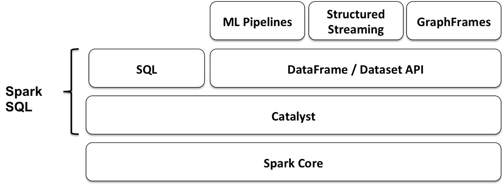

在接下来的几节中，我们将介绍调优 Spark SQL 应用程序所需的基本理解。我们将从**DataFrame/Dataset** API 开始。

# 理解 DataFrame/Dataset API

**数据集**是一种强类型的领域特定对象的集合，可以使用函数或关系操作并行转换。每个数据集还有一个称为**DataFrame**的视图，它不是强类型的，本质上是一组行对象的数据集。

Spark SQL 将结构化视图应用于来自不同数据格式的不同源系统的数据。结构化 API（如 DataFrame/Dataset API）允许开发人员使用高级 API 编写程序。这些 API 允许他们专注于数据处理所需的“是什么”，而不是“如何”。

尽管应用结构可能会限制可以表达的内容，但实际上，结构化 API 可以容纳应用开发中所需的绝大多数计算。此外，正是这些由结构化 API 所施加的限制，提供了一些主要的优化机会。

在下一节中，我们将探讨编码器及其在高效序列化和反序列化中的作用。

# 优化数据序列化

编码器是 Spark SQL 2.0 中**序列化**和**反序列化**（**SerDe**）框架中的基本概念。Spark SQL 使用 SerDe 框架进行 I/O，从而实现更高的时间和空间效率。数据集使用专门的编码器来序列化对象，以便在处理或通过网络传输时使用，而不是使用 Java 序列化或 Kryo。

编码器需要有效地支持领域对象。这些编码器将领域对象类型`T`映射到 Spark 的内部类型系统，`Encoder [T]`用于将类型`T`的对象或原语转换为 Spark SQL 的内部二进制行格式表示（使用 Catalyst 表达式和代码生成）。结果的二进制结构通常具有更低的内存占用，并且针对数据处理的效率进行了优化（例如，以列格式）。

高效的序列化是实现分布式应用程序良好性能的关键。序列化对象速度慢的格式将显著影响性能。通常，这将是您调优以优化 Spark 应用程序的第一步。

编码器经过高度优化，并使用运行时代码生成来构建用于序列化和反序列化的自定义字节码。此外，它们使用一种格式，允许 Spark 执行许多操作，如过滤和排序，而无需将其反序列化为对象。由于编码器知道记录的模式，它们可以提供显著更快的序列化和反序列化（与默认的 Java 或 Kryo 序列化器相比）。

除了速度之外，编码器输出的序列化大小也可以显著减小，从而降低网络传输的成本。此外，序列化数据已经是钨丝二进制格式，这意味着许多操作可以就地执行，而无需实例化对象。Spark 内置支持自动生成原始类型（如 String 和 Integer）和案例类的编码器。

在这里，我们展示了从第一章*，*Getting Started with Spark SQL**中为 Bid 记录创建自定义编码器的示例。请注意，通过导入`spark.implicits._`，大多数常见类型的编码器都会自动提供，并且默认的编码器已经在 Spark shell 中导入。

首先，让我们导入本章代码所需的所有类：

```scala
scala> import org.apache.spark.sql._ 
scala> import org.apache.spark.sql.types._ 
scala> import org.apache.spark.sql.functions._ 
scala> import org.apache.spark.sql.streaming._ 
scala> import spark.implicits._ 
scala> import spark.sessionState.conf 
scala> import org.apache.spark.sql.internal.SQLConf.SHUFFLE_PARTITIONS 
scala> import org.apache.spark.sql.Encoders 
scala> import org.apache.spark.sql.catalyst.encoders.ExpressionEncoder 
```

接下来，我们将为输入数据集中`Bid`记录的领域对象定义一个`case`类：

```scala
scala> case class Bid(bidid: String, timestamp: String, ipinyouid: String, useragent: String, IP: String, region: Integer, cityID: Integer, adexchange: String, domain: String, turl: String, urlid: String, slotid: String, slotwidth: String, slotheight: String, slotvisibility: String, slotformat: String, slotprice: String, creative: String, bidprice: String) 
```

接下来，我们将使用上一步的`case`类创建一个`Encoder`对象，如下所示：

```scala
scala> val bidEncoder = Encoders.product[Bid] 
```

可以使用 schema 属性访问模式，如下所示：

```scala
scala> bidEncoder.schema
```

我们使用了`ExpressionEncoder`的实现（这是 Spark SQL 2 中唯一可用的编码器特性的实现）：

```scala
scala> val bidExprEncoder = bidEncoder.asInstanceOf[ExpressionEncoder[Bid]] 
```

以下是编码器的序列化器和反序列化器部分：

```scala
scala> bidExprEncoder.serializer 

scala> bidExprEncoder.namedExpressions 
```

接下来，我们将演示如何读取我们的输入数据集：

```scala
scala> val bidsDF = spark.read.format("csv").schema(bidEncoder.schema).option("sep", "\t").option("header", false).load("file:///Users/aurobindosarkar/Downloads/make-ipinyou-data-master/original-data/ipinyou.contest.dataset/bidfiles") 
```

然后，我们将从我们新创建的 DataFrame 中显示一个`Bid`记录，如下所示：

```scala
scala> bidsDF.take(1).foreach(println) 

[e3d962536ef3ac7096b31fdd1c1c24b0,20130311172101557,37a6259cc0c1dae299a7866489dff0bd,Mozilla/4.0 (compatible; MSIE 8.0; Windows NT 6.1; Trident/4.0; QQDownload 734; SLCC2; .NET CLR 2.0.50727; .NET CLR 3.5.30729; .NET CLR 3.0.30729; eSobiSubscriber 2.0.4.16; MAAR),gzip(gfe),gzip(gfe),219.232.120.*,1,1,2,DF9blS9bQqsIFYB4uA5R,b6c5272dfc63032f659be9b786c5f8da,null,2006366309,728,90,1,0,5,5aca4c5f29e59e425c7ea657fdaac91e,300] 
```

为了方便起见，我们可以使用上一步的记录创建一个新记录，如在`Dataset[Bid]`中：

```scala
scala> val bid = Bid("e3d962536ef3ac7096b31fdd1c1c24b0","20130311172101557","37a6259cc0c1dae299a7866489dff0bd","Mozilla/4.0 (compatible; MSIE 8.0; Windows NT 6.1; Trident/4.0; QQDownload 734; SLCC2; .NET CLR 2.0.50727; .NET CLR 3.5.30729; .NET CLR 3.0.30729; eSobiSubscriber 2.0.4.16; MAAR),gzip(gfe),gzip(gfe)","219.232.120.*",1,1,"2","","DF9blS9bQqsIFYB4uA5R,b6c5272dfc63032f659be9b786c5f8da",null,"2006366309","728","90","1","0","5","5aca4c5f29e59e425c7ea657fdaac91e","300") 
```

然后，我们将记录序列化为内部表示，如下所示：

```scala
scala> val row = bidExprEncoder.toRow(bid)  
```

Spark 在 I/O 中内部使用`InternalRows`。因此，我们将字节反序列化为 JVM 对象，即`Scala`对象，如下所示。但是，我们需要导入`Dsl`表达式，并明确指定`DslSymbol`，因为在 Spark shell 中存在竞争的隐式：

```scala
scala> import org.apache.spark.sql.catalyst.dsl.expressions._ 

scala> val attrs = Seq(DslSymbol('bidid).string, DslSymbol('timestamp).string, DslSymbol('ipinyouid).string, DslSymbol('useragent).string, DslSymbol('IP).string, DslSymbol('region).int, DslSymbol('cityID).int, DslSymbol('adexchange).string, DslSymbol('domain).string, DslSymbol('turl).string, DslSymbol('urlid).string, DslSymbol('slotid).string, DslSymbol('slotwidth).string, DslSymbol('slotheight).string, DslSymbol('slotvisibility).string, DslSymbol('slotformat).string, DslSymbol('slotprice).string, DslSymbol('creative).string, DslSymbol('bidprice).string) 
```

在这里，我们检索序列化的`Bid`对象：

```scala
scala> val getBackBid = bidExprEncoder.resolveAndBind(attrs).fromRow(row) 
```

我们可以验证两个对象是否相同，如下所示：

```scala
scala> bid == getBackBid 
res30: Boolean = true 
```

在下一节中，我们将把重点转移到 Spark SQL 的 Catalyst 优化。

# 理解 Catalyst 优化

我们在第一章* **使用 Spark SQL 入门**中简要探讨了 Catalyst 优化器。基本上，Catalyst 具有用户程序的内部表示，称为**查询计划**。一组转换在初始查询计划上执行，以产生优化的查询计划。最后，通过 Spark SQL 的代码生成机制，优化的查询计划转换为 RDD 的 DAG，准备执行。在其核心，Catalyst 优化器定义了用户程序的抽象为树，以及从一棵树到另一棵树的转换。

为了利用优化机会，我们需要一个优化器，它可以自动找到执行数据操作的最有效计划（在用户程序中指定）。在本章的上下文中，Spark SQL 的 Catalyst 优化器充当用户高级编程构造和低级执行计划之间的接口。

# 理解数据集/DataFrame API

数据集或 DataFrame 通常是通过从数据源读取或执行查询而创建的。在内部，查询由运算符树表示，例如逻辑和物理树。数据集表示描述生成数据所需的逻辑计划。当调用动作时，Spark 的查询优化器会优化逻辑计划，并生成用于并行和分布式执行的物理计划。

查询计划用于描述数据操作，例如聚合、连接或过滤，以使用不同类型的输入数据集生成新的数据集。

第一种查询计划是逻辑计划，它描述了在数据集上所需的计算，而不具体定义实际计算的机制。它给我们提供了用户程序的抽象，并允许我们自由地转换查询计划，而不用担心执行细节。

查询计划是 Catalyst 的一部分，它对关系运算符树进行建模，即结构化查询。查询计划具有`statePrefix`，在显示计划时使用`!`表示无效计划，使用`'`表示未解析计划。如果存在缺少的输入属性并且子节点非空，则查询计划无效；如果列名尚未经过验证并且列类型尚未在目录中查找，则查询计划未解析。

作为优化的一部分，Catalyst 优化器应用各种规则来在阶段中操作这些树。我们可以使用 explain 函数来探索逻辑计划以及优化后的物理计划。

现在，我们将以三个数据集的简单示例，并使用`explain()`函数显示它们的优化计划：

```scala
scala> val t1 = spark.range(7) 
scala> val t2 = spark.range(13) 
scala> val t3 = spark.range(19) 

scala> t1.explain() 
== Physical Plan == 
*Range (0, 7, step=1, splits=8) 

scala> t1.explain(extended=true) 
== Parsed Logical Plan == 
Range (0, 7, step=1, splits=Some(8)) 

== Analyzed Logical Plan == 
id: bigint 
Range (0, 7, step=1, splits=Some(8)) 

== Optimized Logical Plan == 
Range (0, 7, step=1, splits=Some(8)) 

== Physical Plan == 
*Range (0, 7, step=1, splits=8) 

scala> t1.filter("id != 0").filter("id != 2").explain(true) 
== Parsed Logical Plan == 
'Filter NOT ('id = 2) 
+- Filter NOT (id#0L = cast(0 as bigint)) 
   +- Range (0, 7, step=1, splits=Some(8)) 

== Analyzed Logical Plan == 
id: bigint 
Filter NOT (id#0L = cast(2 as bigint)) 
+- Filter NOT (id#0L = cast(0 as bigint)) 
   +- Range (0, 7, step=1, splits=Some(8)) 

== Optimized Logical Plan == 
Filter (NOT (id#0L = 0) && NOT (id#0L = 2)) 
+- Range (0, 7, step=1, splits=Some(8)) 

== Physical Plan == 
*Filter (NOT (id#0L = 0) && NOT (id#0L = 2)) 
+- *Range (0, 7, step=1, splits=8) 
```

分析逻辑计划是在初始解析计划上应用分析器的检查规则的结果。分析器是 Spark SQL 中的逻辑查询计划分析器，它在语义上验证和转换未解析的逻辑计划为分析的逻辑计划（使用逻辑评估规则）：

```scala
scala> spark.sessionState.analyzer 
res30: org.apache.spark.sql.catalyst.analysis.Analyzer = org.apache.spark.sql.hive.HiveSessionStateBuilder$$anon$1@21358f6c 
```

启用会话特定记录器的`TRACE`或`DEBUG`日志级别，以查看分析器内部发生的情况。例如，将以下行添加到`conf/log4j`属性中：

```scala
log4j.logger.org.apache.spark.sql.hive.HiveSessionStateBuilder$$anon$1=DEBUG scala> val t1 = spark.range(7) 
17/07/13 10:25:38 DEBUG HiveSessionStateBuilder$$anon$1:  
=== Result of Batch Resolution === 
!'DeserializeToObject unresolveddeserializer(staticinvoke(class java.lang.Long, ObjectType(class java.lang.Long), valueOf, upcast(getcolumnbyordinal(0, LongType), LongType, - root class: "java.lang.Long"), true)), obj#2: java.lang.Long   DeserializeToObject staticinvoke(class java.lang.Long, ObjectType(class java.lang.Long), valueOf, cast(id#0L as bigint), true), obj#2: java.lang.Long 
 +- LocalRelation <empty>, [id#0L]                                                                                                                                                                                                            +- LocalRelation <empty>, [id#0L] 

t1: org.apache.spark.sql.Dataset[Long] = [id: bigint] 
```

分析器是一个规则执行器，定义了解析和修改逻辑计划评估规则。它使用会话目录解析未解析的关系和函数。固定点的优化规则和批处理中的一次性规则（一次策略）也在这里定义。

在逻辑计划优化阶段，执行以下一系列操作：

+   规则将逻辑计划转换为语义上等效的计划，以获得更好的性能

+   启发式规则用于推送下推断列，删除未引用的列等

+   较早的规则使后续规则的应用成为可能；例如，合并查询块使全局连接重新排序

`SparkPlan`是用于构建物理查询计划的 Catalyst 查询计划的物理运算符。在执行时，物理运算符会产生行的 RDD。可用的逻辑计划优化可以扩展，并且可以注册额外的规则作为实验方法。

```scala
scala> t1.filter("id != 0").filter("id != 2") 
17/07/13 10:43:17 DEBUG HiveSessionStateBuilder$$anon$1:  
=== Result of Batch Resolution === 
!'Filter NOT ('id = 0)                      
Filter NOT (id#0L = cast(0 as bigint)) 
 +- Range (0, 7, step=1, splits=Some(8))    
+- Range (0, 7, step=1, splits=Some(8)) 
... 

17/07/13 10:43:17 DEBUG HiveSessionStateBuilder$$anon$1:  
=== Result of Batch Resolution === 
!'Filter NOT ('id = 2)                         
Filter NOT (id#0L = cast(2 as bigint)) 
 +- Filter NOT (id#0L = cast(0 as bigint))     
   +- Filter NOT (id#0L = cast(0 as bigint)) 
    +- Range (0, 7, step=1, splits=Some(8))       
   +- Range (0, 7, step=1, splits=Some(8)) 
```

# 理解 Catalyst 转换

在这一部分，我们将详细探讨 Catalyst 转换。在 Spark 中，转换是纯函数，也就是说，在转换过程中不会改变树的结构（而是生成一个新的树）。在 Catalyst 中，有两种类型的转换：

+   在第一种类型中，转换不会改变树的类型。使用这种转换，我们可以将一个表达式转换为另一个表达式，一个逻辑计划转换为另一个逻辑计划，或者一个物理计划转换为另一个物理计划。

+   第二种类型的转换将一个树从一种类型转换为另一种类型。例如，这种类型的转换用于将逻辑计划转换为物理计划。

一个函数（与给定树相关联）用于实现单个规则。例如，在表达式中，这可以用于常量折叠优化。转换被定义为部分函数。（回想一下，部分函数是为其可能的参数子集定义的函数。）通常，case 语句会判断规则是否被触发；例如，谓词过滤器被推到`JOIN`节点下面，因为它减少了`JOIN`的输入大小；这被称为**谓词下推**。类似地，投影仅针对查询中使用的所需列执行。这样，我们可以避免读取不必要的数据。

通常，我们需要结合不同类型的转换规则。规则执行器用于组合多个规则。它通过应用许多规则（批处理中定义的）将一个树转换为相同类型的另一个树。

有两种方法用于应用规则：

+   在第一种方法中，我们重复应用规则，直到树不再发生变化（称为固定点）

+   在第二种类型中，我们一次批处理应用所有规则（一次策略）

接下来，我们将看看第二种类型的转换，即从一种树转换为另一种树：更具体地说，Spark 如何将逻辑计划转换为物理计划。通过应用一组策略，可以将逻辑计划转换为物理计划。主要是采用模式匹配的方法进行这些转换。例如，一个策略将逻辑投影节点转换为物理投影节点，逻辑过滤节点转换为物理过滤节点，依此类推。策略可能无法转换所有内容，因此在代码的特定点内置了触发其他策略的机制（例如`planLater`方法）。

优化过程包括三个步骤：

1.  分析（规则执行器）：这将一个未解析的逻辑计划转换为已解析的逻辑计划。未解析到已解析的状态使用目录来查找数据集和列的来源以及列的类型。

1.  逻辑优化（规则执行器）：这将一个已解析的逻辑计划转换为优化的逻辑计划。

1.  物理规划（策略+规则执行器）：包括两个阶段：

+   将优化的逻辑计划转换为物理计划。

+   规则执行器用于调整物理计划，使其准备好执行。这包括我们如何洗牌数据以及如何对其进行分区。

如下例所示，表达式表示一个新值，并且它是基于其输入值计算的，例如，将一个常量添加到列中的每个元素，例如`1 + t1.normal`。类似地，属性是数据集中的一列（例如，`t1.id`）或者由特定数据操作生成的列，例如 v。

输出中列出了由此逻辑计划生成的属性列表，例如 id 和 v。逻辑计划还具有关于此计划生成的行的一组不变量，例如，`t2.id > 5000000`。最后，我们有统计信息，行/字节中计划的大小，每列统计信息，例如最小值、最大值和不同值的数量，以及空值的数量。

第二种查询计划是物理计划，它描述了对具有特定定义的数据集进行计算所需的计算。物理计划实际上是可执行的：

```scala
scala> val t0 = spark.range(0, 10000000) 
scala> val df1 = t0.withColumn("uniform", rand(seed=10)) 
scala> val df2 = t0.withColumn("normal", randn(seed=27)) 
scala> df1.createOrReplaceTempView("t1") 
scala> df2.createOrReplaceTempView("t2") 

scala> spark.sql("SELECT sum(v) FROM (SELECT t1.id, 1 + t1.normal AS v FROM t1 JOIN t2 WHERE t1.id = t2.id AND t2.id > 5000000) tmp").explain(true) 
```

前述查询的所有计划都显示在以下代码块中。请注意我们在解析逻辑计划中的注释，反映了原始 SQL 查询的部分内容：

```scala
== Parsed Logical Plan == 
'Project [unresolvedalias('sum('v), None)] ------------------> SELECT sum(v) 
+- 'SubqueryAlias tmp 
   +- 'Project ['t1.id, (1 + 't1.normal) AS v#79] ----------->       SELECT t1.id,  
                                                               1 + t1.normal as v 
      +- 'Filter (('t1.id = 't2.id) && ('t2.id > 5000000))---> WHERE t1.id = t2.id,  
                                                                    t2.id > 5000000 
         +- 'Join Inner -------------------------------------> t1 JOIN t2 
            :- 'UnresolvedRelation `t1` 
            +- 'UnresolvedRelation `t2` 

== Analyzed Logical Plan == 
sum(v): double 
Aggregate [sum(v#79) AS sum(v)#86] 
+- SubqueryAlias tmp 
   +- Project [id#10L, (cast(1 as double) + normal#13) AS v#79] 
      +- Filter ((id#10L = id#51L) && (id#51L > cast(5000000 as bigint))) 
         +- Join Inner 
            :- SubqueryAlias t1 
            :  +- Project [id#10L, randn(27) AS normal#13] 
            :     +- Range (0, 10000000, step=1, splits=Some(8)) 
            +- SubqueryAlias t2 
               +- Project [id#51L, rand(10) AS uniform#54] 
                  +- Range (0, 10000000, step=1, splits=Some(8)) 

== Optimized Logical Plan == 
Aggregate [sum(v#79) AS sum(v)#86] 
+- Project [(1.0 + normal#13) AS v#79] 
   +- Join Inner, (id#10L = id#51L) 
      :- Filter (id#10L > 5000000) 
      :  +- Project [id#10L, randn(27) AS normal#13] 
      :     +- Range (0, 10000000, step=1, splits=Some(8)) 
      +- Filter (id#51L > 5000000) 
         +- Range (0, 10000000, step=1, splits=Some(8)) 

== Physical Plan == 
*HashAggregate(keys=[], functions=[sum(v#79)], output=[sum(v)#86]) 
+- Exchange SinglePartition 
   +- *HashAggregate(keys=[], functions=[partial_sum(v#79)], output=[sum#88]) 
      +- *Project [(1.0 + normal#13) AS v#79] 
         +- *SortMergeJoin [id#10L], [id#51L], Inner 
            :- *Sort [id#10L ASC NULLS FIRST], false, 0 
            :  +- Exchange hashpartitioning(id#10L, 200) 
            :     +- *Filter (id#10L > 5000000) 
            :        +- *Project [id#10L, randn(27) AS normal#13] 
            :           +- *Range (0, 10000000, step=1, splits=8) 
            +- *Sort [id#51L ASC NULLS FIRST], false, 0 
               +- Exchange hashpartitioning(id#51L, 200) 
                  +- *Filter (id#51L > 5000000) 
                     +- *Range (0, 10000000, step=1, splits=8) 
```

您可以使用 Catalyst 的 API 自定义 Spark 以推出自己的计划规则。

有关 Spark SQL Catalyst 优化器的更多详细信息，请参阅[`spark-summit.org/2017/events/a-deep-dive-into-spark-sqls-catalyst-optimizer/`](https://spark-summit.org/2017/events/a-deep-dive-into-spark-sqls-catalyst-optimizer/)。

# 可视化 Spark 应用程序执行

在本节中，我们将介绍 SparkUI 界面的关键细节，这对于调整任务至关重要。监视 Spark 应用程序有几种方法，例如使用 Web UI、指标和外部仪表。显示的信息包括调度器阶段和任务列表、RDD 大小和内存使用摘要、环境信息以及有关正在运行的执行器的信息。

可以通过简单地在 Web 浏览器中打开`http://<driver-node>:4040`（`http://localhost:4040`）来访问此界面。在同一主机上运行的其他`SparkContexts`绑定到连续的端口：4041、4042 等。

有关 Spark 监控和仪表的更详细覆盖范围，请参阅[`spark.apache.org/docs/latest/monitoring.html`](https://spark.apache.org/docs/latest/monitoring.html)。

我们将使用两个示例可视化地探索 Spark SQL 执行。首先，我们创建两组数据集。第一组（`t1`、`t2`和`t3`）与第二组（`t4`、`t5`和`t6`）的`Dataset[Long]`之间的区别在于大小：

```scala
scala> val t1 = spark.range(7) 
scala> val t2 = spark.range(13) 
scala> val t3 = spark.range(19) 
scala> val t4 = spark.range(1e8.toLong) 
scala> val t5 = spark.range(1e8.toLong) 
scala> val t6 = spark.range(1e3.toLong)  
```

我们将执行以下`JOIN`查询，针对两组数据集，以可视化 SparkUI 仪表板中的 Spark 作业信息：

```scala
scala> val query = t1.join(t2).where(t1("id") === t2("id")).join(t3).where(t3("id") === t1("id")).explain() 
== Physical Plan == 
*BroadcastHashJoin [id#6L], [id#12L], Inner, BuildRight 
:- *BroadcastHashJoin [id#6L], [id#9L], Inner, BuildRight 
:  :- *Range (0, 7, step=1, splits=8) 
:  +- BroadcastExchange HashedRelationBroadcastMode(List(input[0, bigint, false])) 
:     +- *Range (0, 13, step=1, splits=8) 
+- BroadcastExchange HashedRelationBroadcastMode(List(input[0, bigint, false])) 
   +- *Range (0, 19, step=1, splits=8) 
query: Unit = () 

scala> val query = t1.join(t2).where(t1("id") === t2("id")).join(t3).where(t3("id") === t1("id")).count() 
query: Long = 7 
```

以下屏幕截图显示了事件时间轴：

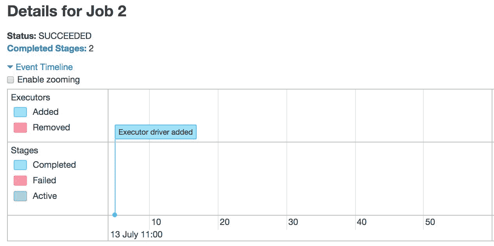

生成的**DAG 可视化**显示了阶段和洗牌（**Exchange**）：

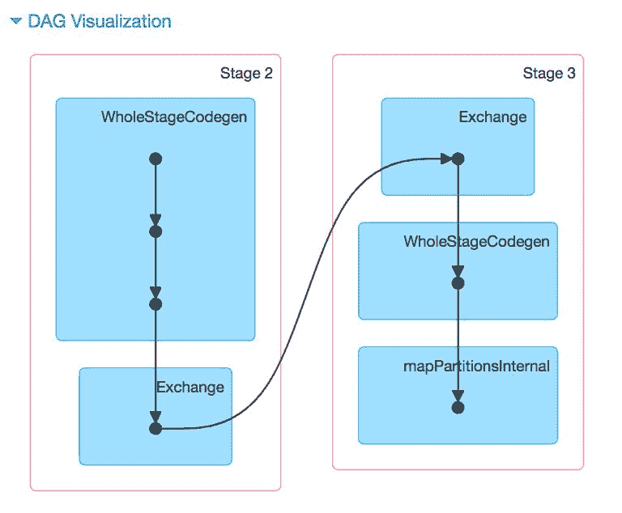

作业摘要，包括执行持续时间、成功任务和总任务数等，显示在此处：

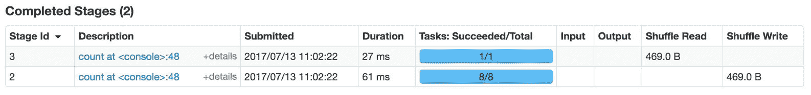

单击 SQL 选项卡以查看详细的执行流程，如下所示：

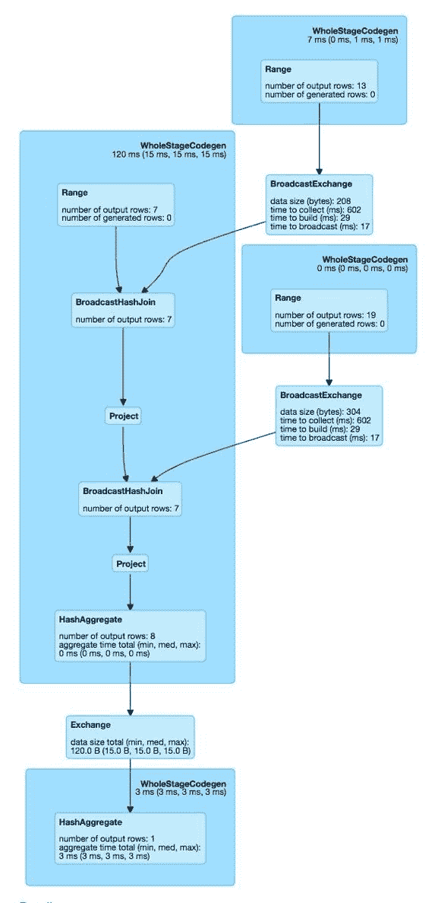

接下来，我们将在更大的数据集上运行相同的查询。请注意，由于输入数据集的增加，第一个示例中的`BroadcastHashJoin`现在变为`SortMergeJoin`：

```scala
scala> val query = t4.join(t5).where(t4("id") === t5("id")).join(t6).where(t4("id") === t6("id")).explain() 
== Physical Plan == 
*BroadcastHashJoin [id#72L], [id#78L], Inner, BuildRight 
:- *SortMergeJoin [id#72L], [id#75L], Inner 
:  :- *Sort [id#72L ASC NULLS FIRST], false, 0 
:  :  +- Exchange hashpartitioning(id#72L, 200) 
:  :     +- *Range (0, 100000000, step=1, splits=8) 
:  +- *Sort [id#75L ASC NULLS FIRST], false, 0 
:     +- ReusedExchange [id#75L], Exchange hashpartitioning(id#72L, 200) 
+- BroadcastExchange HashedRelationBroadcastMode(List(input[0, bigint, false])) 
   +- *Range (0, 1000, step=1, splits=8) 
query: Unit = () 
```

执行 DAG 如下图所示：

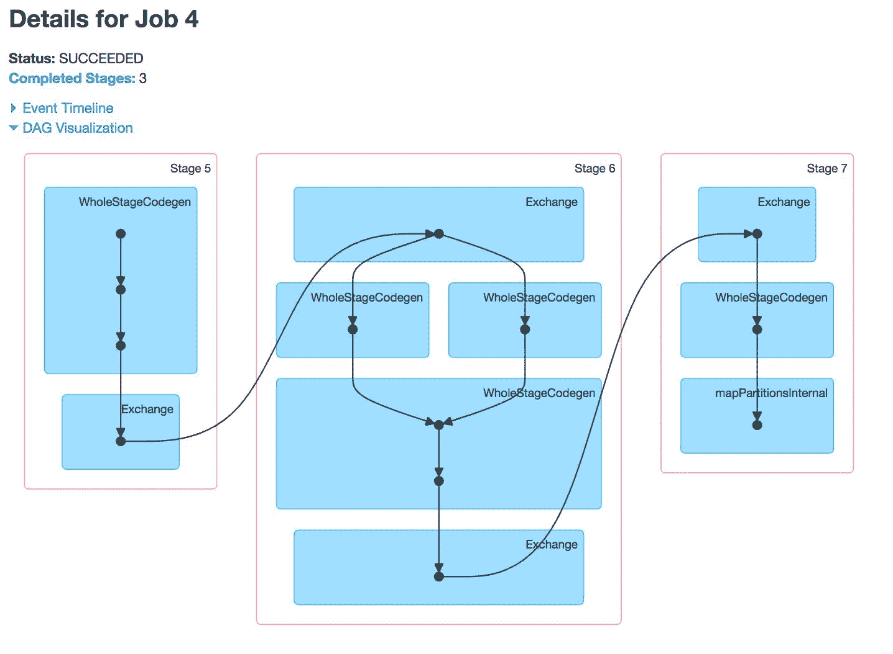

作业执行摘要如下所示：

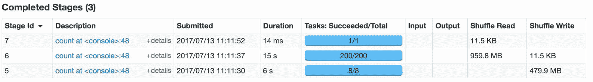

SQL 执行详细信息如下图所示：

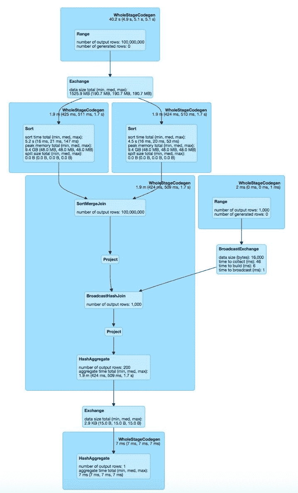

除了在 UI 中显示，指标也可用作 JSON 数据。这为开发人员提供了一个很好的方式来为 Spark 创建新的可视化和监控工具。REST 端点挂载在`/api/v1`；例如，它们通常可以在`http://localhost:4040/api/v1`上访问。这些端点已经强烈版本化，以便更容易地使用它们开发应用程序。

# 探索 Spark 应用程序执行指标

Spark 具有基于`Dropwizard Metrics`库的可配置度量系统。这允许用户将 Spark 指标报告给各种接收器，包括`HTTP`，`JMX`和`CSV`文件。与 Spark 组件对应的 Spark 指标包括 Spark 独立主进程，主进程中报告各种应用程序的应用程序，Spark 独立工作进程，Spark 执行程序，Spark 驱动程序进程和 Spark 洗牌服务。

下一系列的屏幕截图包含详细信息，包括摘要指标和针对较大数据集的 JOIN 查询的一个阶段的执行程序的聚合指标：

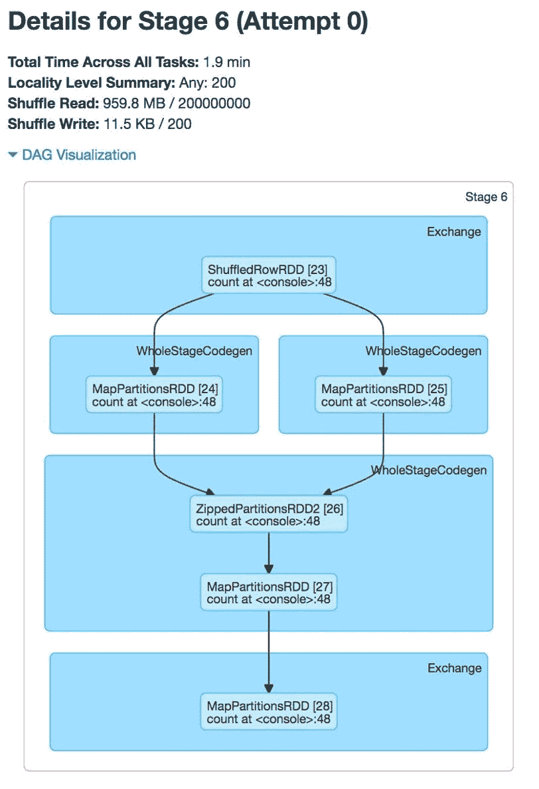

已完成任务的摘要指标如下所示：

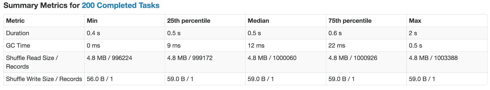

按执行程序聚合的指标如下所示：

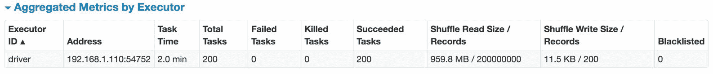

# 使用外部工具进行性能调优

通常使用外部监视工具来分析大型`Spark 集群`中 Spark 作业的性能。例如，Ganglia 可以提供有关整体集群利用率和资源瓶颈的见解。此外，`OS profiling`工具和`JVM`实用程序可以提供有关单个节点的细粒度分析和用于处理`JVM`内部的工具。

有关可视化 Spark 应用程序执行的更多详细信息，请参阅[`databricks.com/blog/2015/06/22/understanding-your-spark-application-through-visualization.html`](https://databricks.com/blog/2015/06/22/understanding-your-spark-application-through-visualization.html)。

在下一节中，我们将把焦点转移到 Spark 2.2 中发布的新成本优化器。

# Apache Spark 2.2 中的成本优化器

在 Spark 中，优化器的目标是最小化端到端查询响应时间。它基于两个关键思想：

尽早剪枝不必要的数据，例如，过滤器下推和列修剪。

最小化每个操作员的成本，例如广播与洗牌和最佳连接顺序。

直到 Spark 2.1，Catalyst 本质上是一个基于规则的优化器。大多数 Spark SQL 优化器规则都是启发式规则：`PushDownPredicate`，`ColumnPruning`，`ConstantFolding`等。它们在估计`JOIN`关系大小时不考虑每个操作员的成本或选择性。因此，`JOIN`顺序大多由其在`SQL 查询`中的位置决定，并且基于启发式规则决定物理连接实现。这可能导致生成次优计划。然而，如果基数事先已知，就可以获得更有效的查询。CBO 优化器的目标正是自动执行这一点。

华为最初在 Spark SQL 中实施了 CBO；在他们开源了他们的工作之后，包括 Databricks 在内的许多其他贡献者致力于完成其第一个版本。与 Spark SQL 相关的 CBO 更改，特别是进入 Spark SQL 数据结构和工作流的主要入口点，已经以一种非侵入性的方式进行了设计和实施。

配置参数`spark.sql.cbo`可用于启用/禁用此功能。目前（在 Spark 2.2 中），默认值为 false。

有关更多详细信息，请参阅华为的设计文档，网址为[`issues.apache.org/jira/browse/SPARK-16026`](https://issues.apache.org/jira/browse/SPARK-16026)。

Spark SQL 的 Catalyst 优化器实施了许多基于规则的优化技术，例如谓词下推以减少连接操作执行之前的符合记录数量，以及项目修剪以减少进一步处理之前参与的列数量。然而，如果没有关于数据分布的详细列统计信息，就很难准确估计过滤因子和基数，从而难以准确估计数据库操作员的输出大小。使用不准确和/或误导性的统计信息，优化器最终可能会选择次优的查询执行计划。

为了改进查询执行计划的质量，Spark SQL 优化器已经增强了详细的统计信息。更好地估计输出记录的数量和输出大小（对于每个数据库运算符）有助于优化器选择更好的查询计划。CBO 实现收集、推断和传播`源/中间`数据的`表/列`统计信息。查询树被注释了这些统计信息。此外，它还计算每个运算符的成本，例如输出行数、输出大小等。基于这些成本计算，它选择最优的查询执行计划。

# 了解 CBO 统计收集

`Statistics`类是保存统计信息的关键数据结构。当我们执行统计收集 SQL 语句以将信息保存到系统目录中时，会引用这个数据结构。当我们从系统目录中获取统计信息以优化查询计划时，也会引用这个数据结构。

CBO 依赖于详细的统计信息来优化查询执行计划。以下 SQL 语句可用于收集`表级`统计信息，例如行数、文件数（或 HDFS 数据块数）和表大小（以字节为单位）。它收集`表级`统计信息并将其保存在`元数据存储`中。在 2.2 版本之前，我们只有表大小，而没有行数：

```scala
ANALYZE TABLE table_name COMPUTE STATISTICS 
```

类似地，以下 SQL 语句可用于收集指定列的列级统计信息。收集的信息包括最大列值、最小列值、不同值的数量、空值的数量等。它收集列级统计信息并将其保存在`元数据存储`中。通常，它仅针对`WHERE`和`GROUP BY`子句中的列执行：

```scala
ANALYZE TABLE table_name COMPUTE STATISTICS FOR COLUMNS column-name1, column-name2, .... 
```

给定的 SQL 语句以扩展格式显示表的元数据，包括表级统计信息：

```scala
DESCRIBE EXTENDED table_name 
```

`customers`表是在本章的后面部分创建的：

```scala
scala> sql("DESCRIBE EXTENDED customers").collect.foreach(println) 
[# col_name,data_type,comment] 
[id,bigint,null] 
[name,string,null] 
[,,] 
[# Detailed Table Information,,] 
[Database,default,] 
[Table,customers,] 
[Owner,aurobindosarkar,] 
[Created,Sun Jul 09 23:16:38 IST 2017,] 
[Last Access,Thu Jan 01 05:30:00 IST 1970,] 
[Type,MANAGED,] 
[Provider,parquet,] 
[Properties,[serialization.format=1],] 
[Statistics,1728063103 bytes, 200000000 rows,] 
[Location,file:/Users/aurobindosarkar/Downloads/spark-2.2.0-bin-hadoop2.7/spark-warehouse/customers,] 
[Serde Library,org.apache.hadoop.hive.ql.io.parquet.serde.ParquetHiveSerDe,] 
[InputFormat,org.apache.hadoop.hive.ql.io.parquet.MapredParquetInputFormat,] 
[OutputFormat,org.apache.hadoop.hive.ql.io.parquet.MapredParquetOutputFormat,] 
```

以下 SQL 语句可用于显示优化后的逻辑计划中的统计信息：

```scala
EXPLAIN COST SELECT * FROM table_name WHERE condition 
```

# 统计收集函数

统计信息是使用一组函数收集的，例如，行数实际上是通过运行 SQL 语句获得的，例如`select count(1) from table_name`。使用 SQL 语句获取行数是快速的，因为我们利用了 Spark SQL 的执行并行性。类似地，`analyzeColumns`函数获取给定列的基本统计信息。基本统计信息，如`最大值`、`最小值`和`不同值的数量`，也是通过运行 SQL 语句获得的。

# 过滤运算符

过滤条件是 SQL select 语句的`WHERE`子句中指定的谓词表达式。当我们评估整体过滤因子时，谓词表达式可能非常复杂。

有几个运算符执行过滤基数估计，例如，在`AND`、`OR`和`NOT`逻辑表达式之间，以及逻辑表达式如`=`、`<`、`<=`、`>`、`>=`和`in`。

对于过滤运算符，我们的目标是计算过滤条件，以找出应用过滤条件后前一个（或子）运算符输出的部分。过滤因子是一个介于`0.0`和`1.0`之间的双精度数。过滤运算符的输出行数基本上是其`子节点`的输出行数乘以过滤因子。其输出大小是其`子节点`的输出大小乘以过滤因子。

# 连接运算符

在计算两个表连接输出的基数之前，我们应该已经有其两侧`子节点`的输出基数。每个连接侧的基数不再是原始连接表中的记录数。相反，它是在此连接运算符之前应用所有执行运算符后合格记录的数量。

如果用户收集`join column`统计信息，那么我们就知道每个`join column`的不同值的数量。由于我们还知道连接关系上的记录数量，我们可以判断`join column`是否是唯一键。我们可以计算`join column`上不同值的数量与连接关系中记录数量的比率。如果比率接近`1.0`（比如大于`0.95`），那么我们可以假设`join column`是唯一的。因此，如果`join column`是唯一的，我们可以精确确定每个不同值的记录数量。

# 构建侧选择

CBO 可以为执行操作符选择一个良好的物理策略。例如，CBO 可以选择`hash join`操作的`build side`选择。对于双向哈希连接，我们需要选择一个操作数作为`build side`，另一个作为`probe side`。该方法选择成本较低的子节点作为`hash join`的`build side`。

在 Spark 2.2 之前，构建侧是基于原始表大小选择的。对于以下 Join 查询示例，早期的方法会选择`BuildRight`。然而，使用 CBO，构建侧是基于连接之前各种操作符的估计成本选择的。在这里，会选择`BuildLeft`。它还可以决定是否执行广播连接。此外，可以重新排列给定查询的数据库操作符的执行顺序。`cbo`可以在给定查询的多个候选计划中选择最佳计划。目标是选择具有最低成本的候选计划：

```scala
scala> spark.sql("DROP TABLE IF EXISTS t1") 
scala> spark.sql("DROP TABLE IF EXISTS t2") 
scala> spark.sql("CREATE TABLE IF NOT EXISTS t1(id long, value long) USING parquet") 
scala> spark.sql("CREATE TABLE IF NOT EXISTS t2(id long, value string) USING parquet") 

scala> spark.range(5E8.toLong).select('id, (rand(17) * 1E6) cast "long").write.mode("overwrite").insertInto("t1") 
scala> spark.range(1E8.toLong).select('id, 'id cast "string").write.mode("overwrite").insertInto("t2") 

scala> sql("SELECT t1.id FROM t1, t2 WHERE t1.id = t2.id AND t1.value = 100").explain() 
== Physical Plan == 
*Project [id#79L] 
+- *SortMergeJoin [id#79L], [id#81L], Inner 
   :- *Sort [id#79L ASC NULLS FIRST], false, 0 
   :  +- Exchange hashpartitioning(id#79L, 200) 
   :     +- *Project [id#79L] 
   :        +- *Filter ((isnotnull(value#80L) && (value#80L = 100)) && isnotnull(id#79L)) 
   :           +- *FileScan parquet default.t1[id#79L,value#80L] Batched: true, Format: Parquet, Location: InMemoryFileIndex[file:/Users/aurobindosarkar/Downloads/spark-2.2.0-bin-hadoop2.7/spark-warehouse..., PartitionFilters: [], PushedFilters: [IsNotNull(value), EqualTo(value,100), IsNotNull(id)], ReadSchema: struct<id:bigint,value:bigint> 
   +- *Sort [id#81L ASC NULLS FIRST], false, 0 
      +- Exchange hashpartitioning(id#81L, 200) 
         +- *Project [id#81L] 
            +- *Filter isnotnull(id#81L) 
               +- *FileScan parquet default.t2[id#81L] Batched: true, Format: Parquet, Location: InMemoryFileIndex[file:/Users/aurobindosarkar/Downloads/spark-2.2.0-bin-hadoop2.7/spark-warehouse..., PartitionFilters: [], PushedFilters: [IsNotNull(id)], ReadSchema: struct<id:bigint> 
```

在下一节中，我们将探讨多向连接中的 CBO 优化。

# 理解多向连接排序优化

Spark SQL 优化器的启发式规则可以将`SELECT`语句转换为具有以下特征的查询计划：

+   过滤操作符和投影操作符被推送到连接操作符下面，也就是说，过滤和投影操作符在连接操作符之前执行。

+   没有子查询块时，连接操作符被推送到聚合操作符下面，也就是说，连接操作符通常在聚合操作符之前执行。

通过这一观察，我们从 CBO 中可以获得的最大好处是多向连接排序优化。使用动态规划技术，我们尝试为多向连接查询获得全局最优的连接顺序。

有关 Spark 2.2 中多向连接重新排序的更多详细信息，请参阅[`spark-summit.org/2017/events/cost-based-optimizer-in-apache-spark-22/`](https://spark-summit.org/2017/events/cost-based-optimizer-in-apache-spark-22/)。

显然，连接成本是选择最佳连接顺序的主要因素。成本公式取决于 Spark SQL 执行引擎的实现。

Spark 中的连接成本公式如下：

*权重*基数+大小*（1-权重）*

公式中的权重是通过`spark.sql.cbo.joinReorder.card.weight`参数配置的调整参数（默认值为`0.7`）。计划的成本是所有中间表的成本之和。请注意，当前的成本公式非常粗糙，预计 Spark 的后续版本将具有更精细的公式。

有关使用动态规划算法重新排序连接的更多详细信息，请参阅 Selinger 等人的论文，网址为[`citeseerx.ist.psu.edu/viewdoc/download?doi=10.1.1.129.5879&rep=rep1&type=pdf`](http://citeseerx.ist.psu.edu/viewdoc/download?doi=10.1.1.129.5879&rep=rep1&type=pdf)。

首先，我们将所有项目（基本连接节点）放入级别 1，然后从级别 1 的计划（单个项目）构建级别 2 的所有双向连接，然后从先前级别的计划（双向连接和单个项目）构建所有三向连接，然后是四向连接，依此类推，直到我们构建了所有 n 向连接，并在每个阶段选择最佳计划。

在构建 m 路连接时，我们只保留相同 m 个项目集的最佳计划（成本最低）。例如，对于三路连接，我们只保留项目集`{A, B, C}`的最佳计划，包括`(A J B) J C`、`(A J C) J B`和`(B J C) J A`。

这个算法的一个缺点是假设最低成本的计划只能在其前一级的最低成本计划中生成。此外，由于选择排序合并连接（保留其输入顺序）与其他连接方法的决定是在查询规划阶段完成的，因此我们没有这些信息来在优化器中做出良好的决策。

接下来，我们展示了一个扩展的例子，展示了关闭和打开`cbo`和`joinReorder`参数后的速度改进：

```scala
scala> sql("CREATE TABLE IF NOT EXISTS customers(id long, name string) USING parquet") 
scala> sql("CREATE TABLE IF NOT EXISTS goods(id long, price long) USING parquet") 
scala> sql("CREATE TABLE IF NOT EXISTS orders(customer_id long, good_id long) USING parquet") 

scala> import org.apache.spark.sql.functions.rand 

scala> spark.sql("CREATE TABLE IF NOT EXISTS customers(id long, name string) USING parquet") 
scala> spark.sql("CREATE TABLE IF NOT EXISTS goods(id long, price long) USING parquet") 
scala> spark.sql("CREATE TABLE IF NOT EXISTS orders(customer_id long, good_id long) USING parquet") 

scala> spark.range(2E8.toLong).select('id, 'id cast "string").write.mode("overwrite").insertInto("customers") 

scala> spark.range(1E8.toLong).select('id, (rand(17) * 1E6 + 2) cast "long").write.mode("overwrite").insertInto("goods") 
spark.range(1E7.toLong).select(rand(3) * 2E8 cast "long", (rand(5) * 1E8) cast "long").write.mode("overwrite").insertInto("orders") 
```

我们定义了一个 benchmark 函数来测量我们查询的执行时间：

```scala
scala> def benchmark(name: String)(f: => Unit) { 
     |      val startTime = System.nanoTime 
     |      f 
     |      val endTime = System.nanoTime 
     |      println(s"Time taken with $name: " + (endTime - 
                    startTime).toDouble / 1000000000 + " seconds") 
     | } 

```

在第一个例子中，如所示，我们关闭了`cbo`和`joinReorder`参数：

```scala

scala> val conf = spark.sessionState.conf 

scala> spark.conf.set("spark.sql.cbo.enabled", false) 

scala> conf.cboEnabled 
res1: Boolean = false 

scala> conf.joinReorderEnabled 
res2: Boolean = false 

scala> benchmark("CBO OFF & JOIN REORDER DISABLED"){ sql("SELECT name FROM customers, orders, goods WHERE customers.id = orders.customer_id AND orders.good_id = goods.id AND goods.price > 1000000").show() } 
```

以下是在命令行上的输出：

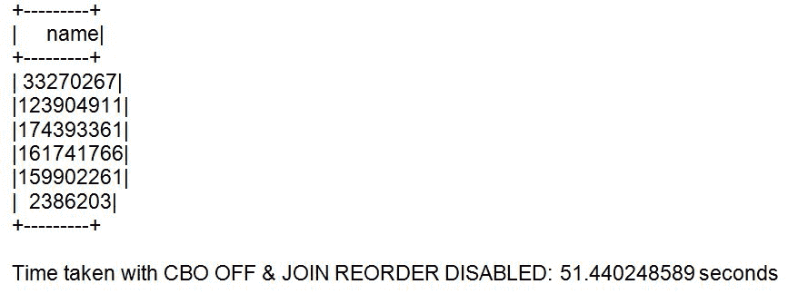

在下一个例子中，我们打开了`cbo`但保持`joinReorder`参数禁用：

```scala
scala> spark.conf.set("spark.sql.cbo.enabled", true) 
scala> conf.cboEnabled 
res11: Boolean = true 
scala> conf.joinReorderEnabled 
res12: Boolean = false 

scala> benchmark("CBO ON & JOIN REORDER DIABLED"){ sql("SELECT name FROM customers, orders, goods WHERE customers.id = orders.customer_id AND orders.good_id = goods.id AND goods.price > 1000000").show()} 
```

以下是在命令行上的输出：

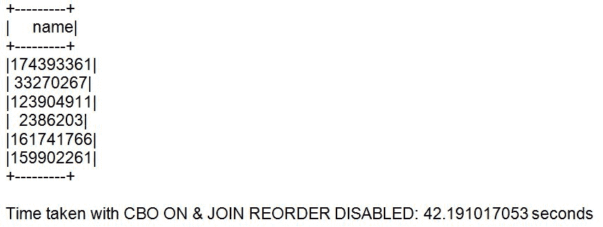

请注意，在启用`cbo`参数的情况下，查询的执行时间略有改善。

在最后一个例子中，我们同时打开了`cbo`和`joinReorder`参数：

```scala
scala> spark.conf.set("spark.sql.cbo.enabled", true) 
scala> spark.conf.set("spark.sql.cbo.joinReorder.enabled", true) 
scala> conf.cboEnabled 
res2: Boolean = true 
scala> conf.joinReorderEnabled 
res3: Boolean = true 

scala> benchmark("CBO ON & JOIN REORDER ENABLED"){ sql("SELECT name FROM customers, orders, goods WHERE customers.id = orders.customer_id AND orders.good_id = goods.id AND goods.price > 1000000").show()} 
```

以下是在命令行上的输出：

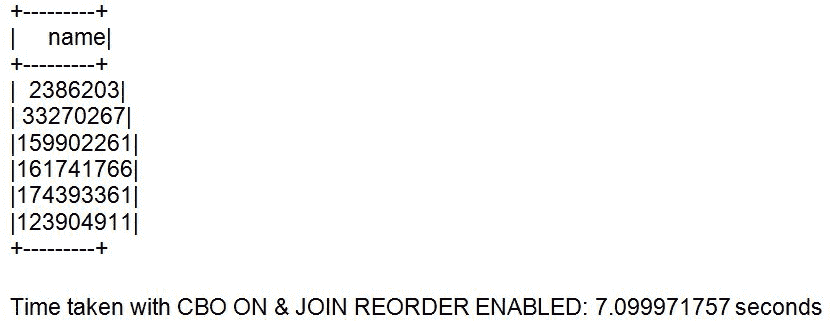

请注意，在启用了这两个参数的情况下，查询的执行时间有了显著的改进。

在接下来的部分中，我们将检查使用整体代码生成实现的各种`JOINs`的性能改进。

# 使用整体代码生成理解性能改进

在本节中，我们首先概述了 Spark SQL 中整体代码生成的高级概述，然后通过一系列示例展示了使用 Catalyst 的代码生成功能改进各种`JOINs`的性能。

在我们有了优化的查询计划之后，需要将其转换为 RDD 的 DAG，以在集群上执行。我们使用这个例子来解释 Spark SQL 整体代码生成的基本概念：

```scala
scala> sql("select count(*) from orders where customer_id = 26333955").explain() 

== Optimized Logical Plan == 
Aggregate [count(1) AS count(1)#45L] 
+- Project 
   +- Filter (isnotnull(customer_id#42L) && (customer_id#42L = 
              26333955)) 
      +- Relation[customer_id#42L,good_id#43L] parquet 
```

优化的逻辑计划可以看作是一系列的**扫描**、**过滤**、**投影**和**聚合**操作，如下图所示：

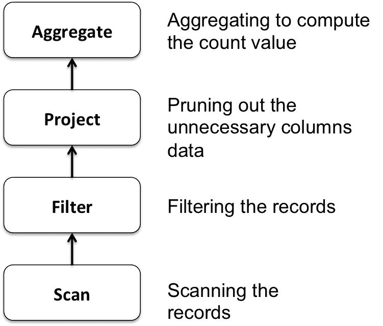

传统数据库通常基于 Volcano 迭代器模型执行前面的查询，其中每个操作符实现一个迭代器接口，并从其输入操作符消耗记录，并向其后顺序的操作符输出记录。这个模型使得可以轻松添加新的操作符，而不受其与其他操作符的交互影响。它还促进了操作符的可组合性。然而，Volcano 模型效率低下，因为它涉及执行许多虚拟函数调用，例如，每个记录在`Aggregate`函数中执行三次调用。此外，它需要大量的内存访问（由于按照迭代器接口在每个操作符中的读/写）。在 Volcano 模型上利用现代 CPU 特性（如流水线处理、预取和分支预测）也是具有挑战性的。

Spark SQL 不是为每个操作符生成迭代器代码，而是尝试为 SQL 语句中的操作符集生成一个单一函数。例如，前面查询的伪代码可能看起来像下面这样。这里，`for`循环遍历所有行（扫描操作），if 条件大致对应于过滤条件，而聚合本质上是计数：

```scala
long count = 0; 
for (customer_id in orders) {  
   if (customer_id == 26333955) { 
         count += 1; 
   } 
} 
```

请注意，简单的代码中没有虚拟函数调用，而且增加的计数变量存储在 CPU 寄存器中。这段代码易于编译器理解，因此现代硬件可以利用来加速这样的查询。

整个阶段代码生成的关键思想包括将操作符融合在一起，识别操作符链（阶段），并将每个阶段编译成单个函数。这导致生成的代码模仿手写优化代码来执行查询。

有关在现代硬件上编译查询计划的更多详细信息，请参阅[`www.vldb.org/pvldb/vol4/p539-neumann.pdf`](http://www.vldb.org/pvldb/vol4/p539-neumann.pdf)。

我们可以使用`EXPLAIN CODEGEN`来探索为查询生成的代码，如下所示：

```scala
scala> sql("EXPLAIN CODEGEN SELECT name FROM customers, orders, goods WHERE customers.id = orders.customer_id AND orders.good_id = goods.id AND goods.price > 1000000").take(1).foreach(println) 
[Found 6 WholeStageCodegen subtrees.                                             
== Subtree 1 / 6 == 
*Project [id#11738L] 
+- *Filter ((isnotnull(price#11739L) && (price#11739L > 1000000)) && isnotnull(id#11738L)) 
   +- *FileScan parquet default.goods[id#11738L,price#11739L] Batched: true, Format: Parquet, Location: InMemoryFileIndex[file:/Users/aurobindosarkar/Downloads/spark-2.2.0-bin-hadoop2.7/spark-warehouse..., PartitionFilters: [], PushedFilters: [IsNotNull(price), GreaterThan(price,1000000), IsNotNull(id)], ReadSchema: struct<id:bigint,price:bigint> 

Generated code: 
/* 001 */ public Object generate(Object[] references) { 
/* 002 */   return new GeneratedIterator(references); 
/* 003 */ } 
... 
== Subtree 6 / 6 == 
*Sort [id#11734L ASC NULLS FIRST], false, 0 
+- Exchange hashpartitioning(id#11734L, 200) 
   +- *Project [id#11734L, name#11735] 
      +- *Filter isnotnull(id#11734L) 
         +- *FileScan parquet default.customers[id#11734L,name#11735] Batched: true, Format: Parquet, Location: InMemoryFileIndex[file:/Users/aurobindosarkar/Downloads/spark-2.2.0-bin-hadoop2.7/spark-warehouse..., PartitionFilters: [], PushedFilters: [IsNotNull(id)], ReadSchema: struct<id:bigint,name:string> 

Generated code: 
/* 001 */ public Object generate(Object[] references) { 
/* 002 */   return new GeneratedIterator(references); 
/* 003 */ } 
... 
] 
```

在这里，我们提供了一系列使用关闭和随后打开整个阶段代码生成的`JOIN`示例，以查看对执行性能的显着影响。

本节中的示例取自[`github.com/apache/spark/blob/master/sql/core/src/test/scala/org/apache/spark/sql/execution/benchmark/JoinBenchmark.scala`](https://github.com/apache/spark/blob/master/sql/core/src/test/scala/org/apache/spark/sql/execution/benchmark/JoinBenchmark.scala)中可用的`JoinBenchmark.scala`类。

在以下示例中，我们介绍了获取使用长值进行 JOIN 操作的执行时间的详细信息：

```scala
scala> spark.conf.set("spark.sql.codegen.wholeStage", false) 

scala> conf.wholeStageEnabled 
res77: Boolean = false 

scala> val N = 20 << 20 
N: Int = 20971520 

scala> val M = 1 << 16 
M: Int = 65536 

scala> val dim = broadcast(spark.range(M).selectExpr("id as k", "cast(id as string) as v")) 

scala> benchmark("Join w long") { 
     |   spark.range(N).join(dim, (col("id") % M) === col("k")).count() 
     | } 
Time taken in Join w long: 2.612163207 seconds                                   

scala> spark.conf.set("spark.sql.codegen.wholeStage", true) 

scala> conf.wholeStageEnabled 
res80: Boolean = true 

scala> val dim = broadcast(spark.range(M).selectExpr("id as k", "cast(id as string) as v")) 

scala> benchmark("Join w long") { 
     |   spark.range(N).join(dim, (col("id") % M) === col("k")).count() 
     | } 
Time taken in Join w long: 0.777796256 seconds 
```

对于以下一组示例，我们仅呈现获取其执行时间的基本要素，包括是否使用整个阶段代码生成。请参考前面的示例，并按照相同的步骤顺序复制以下示例：

```scala
scala> val dim = broadcast(spark.range(M).selectExpr("id as k", "cast(id as string) as v")) 
scala> benchmark("Join w long duplicated") { 
     |     val dim = broadcast(spark.range(M).selectExpr("cast(id/10 as long) as k")) 
     |     spark.range(N).join(dim, (col("id") % M) === col("k")).count() 
     | } 
Time taken in Join w long duplicated: 1.514799811 seconds           
Time taken in Join w long duplicated: 0.278705816 seconds 

scala> val dim3 = broadcast(spark.range(M).selectExpr("id as k1", "id as k2", "cast(id as string) as v")) 
scala> benchmark("Join w 2 longs") { 
     |     spark.range(N).join(dim3, (col("id") % M) === col("k1") && (col("id") % M) === col("k2")).count() 
     | } 
Time taken in Join w 2 longs: 2.048950962 seconds       
Time taken in Join w 2 longs: 0.681936701 seconds 

scala> val dim4 = broadcast(spark.range(M).selectExpr("cast(id/10 as long) as k1", "cast(id/10 as long) as k2")) 
scala> benchmark("Join w 2 longs duplicated") { 
     |     spark.range(N).join(dim4, (col("id") bitwiseAND M) === col("k1") && (col("id") bitwiseAND M) === col("k2")).count() 
     | } 
Time taken in Join w 2 longs duplicated: 4.924196601 seconds      
Time taken in Join w 2 longs duplicated: 0.818748429 seconds      

scala> val dim = broadcast(spark.range(M).selectExpr("id as k", "cast(id as string) as v")) 
scala> benchmark("outer join w long") { 
     |     spark.range(N).join(dim, (col("id") % M) === col("k"), "left").count() 
     | } 
Time taken in outer join w long: 1.580664228 seconds        
Time taken in outer join w long: 0.280608235 seconds 

scala> val dim = broadcast(spark.range(M).selectExpr("id as k", "cast(id as string) as v")) 
scala> benchmark("semi join w long") { 
     |     spark.range(N).join(dim, (col("id") % M) === col("k"), "leftsemi").count() 
     | } 
Time taken in semi join w long: 1.027175143 seconds             
Time taken in semi join w long: 0.180771478 seconds 

scala> val N = 2 << 20 
N: Int = 2097152 
scala> benchmark("merge join") { 
     |     val df1 = spark.range(N).selectExpr(s"id * 2 as k1") 
     |     val df2 = spark.range(N).selectExpr(s"id * 3 as k2") 
     |     df1.join(df2, col("k1") === col("k2")).count() 
     | } 
Time taken in merge join: 2.260524298 seconds          
Time taken in merge join: 2.053497825 seconds             

scala> val N = 2 << 20 
N: Int = 2097152 
scala> benchmark("sort merge join") { 
     |     val df1 = spark.range(N).selectExpr(s"(id * 15485863) % ${N*10} as k1") 
     |     val df2 = spark.range(N).selectExpr(s"(id * 15485867) % ${N*10} as k2") 
     |     df1.join(df2, col("k1") === col("k2")).count() 
     | } 
Time taken in sort merge join: 2.481585466 seconds                
Time taken in sort merge join: 1.992168281 seconds                
```

作为练习，请使用本节中的示例来探索它们的逻辑和物理计划，并使用 SparkUI 查看和理解它们的执行。

在调整任务中使用了几个 Spark SQL 参数设置。`SQLConf`是 Spark SQL 中用于参数和提示的内部键值配置存储。要打印出这些参数的所有当前值，请使用以下语句：

```scala
scala> conf.getAllConfs.foreach(println) 
(spark.driver.host,192.168.1.103) 
(spark.sql.autoBroadcastJoinThreshold,1000000) 
(spark.driver.port,57085) 
(spark.repl.class.uri,spark://192.168.1.103:57085/classes) 
(spark.jars,) 
(spark.repl.class.outputDir,/private/var/folders/tj/prwqrjj16jn4k5jh6g91rwtc0000gn/T/spark-9f8b5ba4-e8f4-4c60-b01b-30c4b71a06e1/repl-ae75dedc-703a-41b8-b949-b91ed3b362f1) 
(spark.app.name,Spark shell) 
(spark.driver.memory,14g) 
(spark.sql.codegen.wholeStage,true) 
(spark.executor.id,driver) 
(spark.sql.cbo.enabled,true) 
(spark.sql.join.preferSortMergeJoin,false) 
(spark.submit.deployMode,client) 
(spark.master,local[*]) 
(spark.home,/Users/aurobindosarkar/Downloads/spark-2.2.0-bin-hadoop2.7) 
(spark.sql.catalogImplementation,hive) 
(spark.app.id,local-1499953390374) 
(spark.sql.shuffle.partitions,2) 
```

您还可以使用以下语句列出所有已定义配置参数的扩展集：

```scala
scala> conf.getAllDefinedConfs.foreach(println) 
```

# 摘要

在本章中，我们介绍了与调整 Spark 应用程序相关的基本概念，包括使用编码器进行数据序列化。我们还介绍了在 Spark 2.2 中引入的基于成本的优化器的关键方面，以自动优化 Spark SQL 执行。最后，我们提供了一些`JOIN`操作的示例，以及使用整个阶段代码生成导致执行时间改进的情况。

在下一章中，我们将探讨利用 Spark 模块和 Spark SQL 的应用程序架构在实际应用中的应用。我们还将描述用于批处理、流处理应用和机器学习流水线的一些主要处理模型的部署。
