# 第十二章：Spark SQL 在大规模应用程序架构中的应用

在本书中，我们从 Spark SQL 及其组件的基础知识开始，以及它在 Spark 应用程序中的作用。随后，我们提出了一系列关于其在各种类型应用程序中的使用的章节。作为 Spark SQL 的核心，DataFrame/Dataset API 和 Catalyst 优化器在所有基于 Spark 技术栈的应用程序中发挥关键作用，这并不奇怪。这些应用程序包括大规模机器学习、大规模图形和深度学习应用程序。此外，我们提出了基于 Spark SQL 的结构化流应用程序，这些应用程序作为连续应用程序在复杂环境中运行。在本章中，我们将探讨在现实世界应用程序中利用 Spark 模块和 Spark SQL 的应用程序架构。

更具体地，我们将涵盖大规模应用程序中的关键架构组件和模式，这些对架构师和设计师来说将作为特定用例的起点。我们将描述一些用于批处理、流处理应用程序和机器学习管道的主要处理模型的部署。这些处理模型的基础架构需要支持在一端到达高速的各种类型数据的大量数据，同时在另一端使输出数据可供分析工具、报告和建模软件使用。此外，我们将使用 Spark SQL 提供支持代码，用于监控、故障排除和收集/报告指标。

我们将在本章中涵盖以下主题：

+   理解基于 Spark 的批处理和流处理架构

+   理解 Lambda 和 Kappa 架构

+   使用结构化流实现可扩展的流处理

+   使用 Spark SQL 构建强大的 ETL 管道

+   使用 Spark SQL 实现可扩展的监控解决方案

+   部署 Spark 机器学习管道

+   使用集群管理器：Mesos 和 Kubernetes

# 理解基于 Spark 的应用程序架构

Apache Spark 是一个新兴的平台，利用分布式存储和处理框架来支持规模化的查询、报告、分析和智能应用。Spark SQL 具有必要的功能，并支持所需的关键机制，以访问各种数据源和格式的数据，并为下游应用程序做准备，无论是低延迟的流数据还是高吞吐量的历史数据存储。下图显示了典型的基于 Spark 的批处理和流处理应用程序中包含这些要求的高级架构：

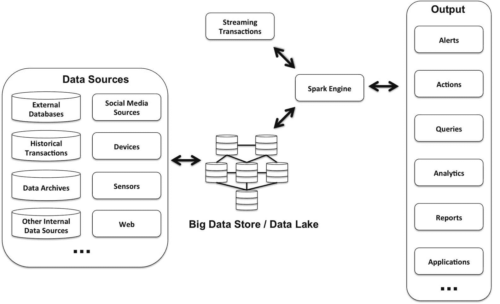

此外，随着组织开始在许多项目中采用大数据和 NoSQL 解决方案，仅由 RDBMS 组成的数据层不再被认为是现代企业应用程序所有用例的最佳选择。仅基于 RDBMS 的架构在下图所示的行业中迅速消失，以满足典型大数据应用程序的要求：

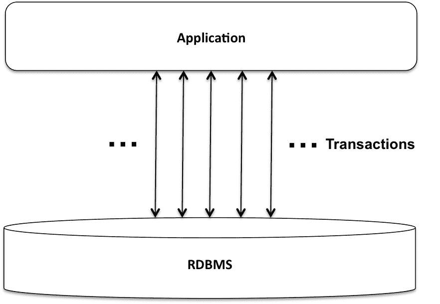

下图显示了一个更典型的场景，其中包含多种类型的数据存储。如今的应用程序使用多种数据存储类型，这些类型最适合特定的用例。根据应用程序使用数据的方式选择多种数据存储技术，称为多语言持久性。Spark SQL 在云端或本地部署中是这种和其他类似持久性策略的极好的实现者：

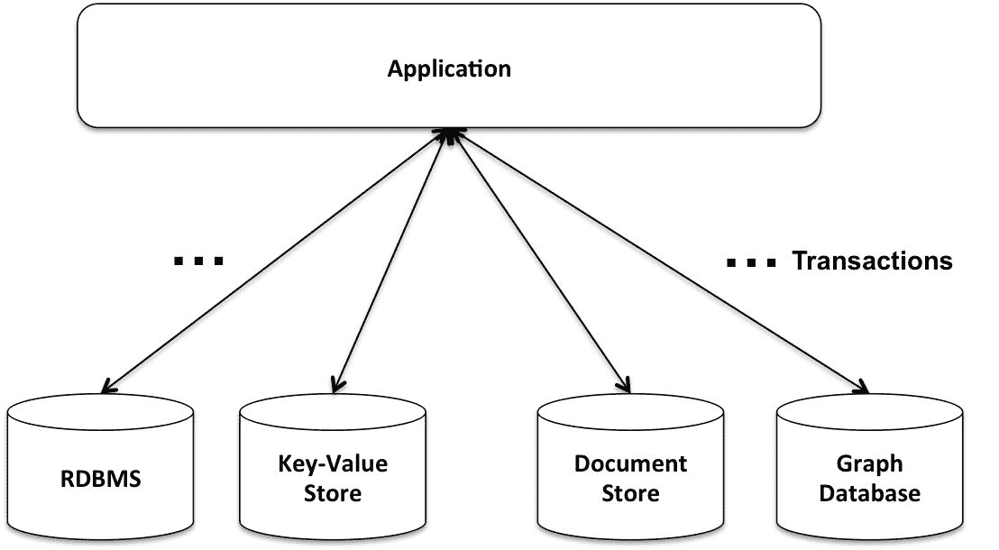

此外，我们观察到，现实世界中只有一小部分 ML 系统由 ML 代码组成（下图中最小的方框）。然而，围绕这些 ML 代码的基础设施是庞大且复杂的。在本章的后面，我们将使用 Spark SQL 来创建这些应用程序中的一些关键部分，包括可扩展的 ETL 管道和监控解决方案。随后，我们还将讨论机器学习管道的生产部署，以及使用 Mesos 和 Kubernetes 等集群管理器：

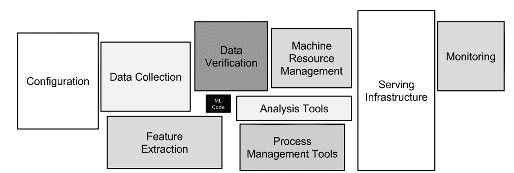

参考：“机器学习系统中的隐藏技术债务”，Google NIPS 2015

在下一节中，我们将讨论基于 Spark 的批处理和流处理架构中的关键概念和挑战。

# 使用 Apache Spark 进行批处理

通常，批处理是针对大量数据进行的，以创建批量视图，以支持特定查询和 MIS 报告功能，和/或应用可扩展的机器学习算法，如分类、聚类、协同过滤和分析应用。

由于批处理涉及的数据量较大，这些应用通常是长时间运行的作业，并且很容易延长到几个小时、几天或几周，例如，聚合查询，如每日访问者数量、网站的独立访问者和每周总销售额。

越来越多的人开始将 Apache Spark 作为大规模数据处理的引擎。它可以在内存中运行程序，比 Hadoop MapReduce 快 100 倍，或者在磁盘上快 10 倍。Spark 被迅速采用的一个重要原因是，它需要相似的编码来满足批处理和流处理的需求。

在下一节中，我们将介绍流处理的关键特征和概念。

# 使用 Apache Spark 进行流处理

大多数现代企业都在努力处理大量数据（以及相关数据的快速和无限增长），同时还需要低延迟的处理需求。此外，与传统的批处理 MIS 报告相比，从实时流数据中获得的近实时业务洞察力被赋予了更高的价值。与流处理系统相反，传统的批处理系统旨在处理一组有界数据的大量数据。这些系统在执行开始时就提供了它们所需的所有数据。随着输入数据的不断增长，这些批处理系统提供的结果很快就会过时。

通常，在流处理中，数据在触发所需处理之前不会在显著的时间段内收集。通常，传入的数据被移动到排队系统，例如 Apache Kafka 或 Amazon Kinesis。然后，流处理器访问这些数据，并对其执行某些计算以生成结果输出。典型的流处理管道创建增量视图，这些视图通常根据流入系统的增量数据进行更新。

增量视图通过**Serving Layer**提供，以支持查询和实时分析需求，如下图所示：

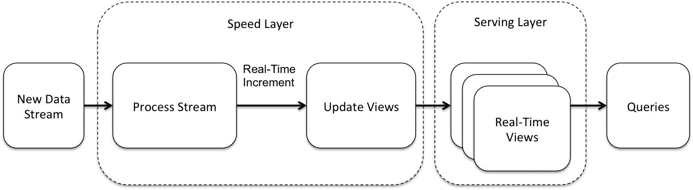

在流处理系统中有两种重要的时间类型：事件时间和处理时间。事件时间是事件实际发生的时间（在源头），而处理时间是事件在处理系统中被观察到的时间。事件时间通常嵌入在数据本身中，对于许多用例来说，这是您想要操作的时间。然而，从数据中提取事件时间，并处理延迟或乱序数据在流处理应用程序中可能会带来重大挑战。此外，由于资源限制、分布式处理模型等原因，事件时间和处理时间之间存在偏差。有许多用例需要按事件时间进行聚合；例如，在一个小时的窗口中系统错误的数量。

还可能存在其他问题；例如，在窗口功能中，我们需要确定是否已观察到给定事件时间的所有数据。这些系统需要设计成能够在不确定的环境中良好运行。例如，在 Spark 结构化流处理中，可以为数据流一致地定义基于事件时间的窗口聚合查询，因为它可以处理延迟到达的数据，并适当更新旧的聚合。

在处理大数据流应用程序时，容错性至关重要，例如，一个流处理作业可以统计到目前为止看到的所有元组的数量。在这里，每个元组可能代表用户活动的流，应用程序可能希望报告到目前为止看到的总活动。在这样的系统中，节点故障可能导致计数不准确，因为有未处理的元组（在失败的节点上）。

从这种情况中恢复的一个天真的方法是重新播放整个数据集。考虑到涉及的数据规模，这是一个昂贵的操作。检查点是一种常用的技术，用于避免重新处理整个数据集。在发生故障的情况下，应用程序数据状态将恢复到最后一个检查点，并且从那一点开始重新播放元组。为了防止 Spark Streaming 应用程序中的数据丢失，使用了**预写式日志**（**WAL**），在故障后可以从中重新播放数据。

在下一节中，我们将介绍 Lambda 架构，这是在 Spark 中心应用程序中实施的一种流行模式，因为它可以使用非常相似的代码满足批处理和流处理的要求。

# 理解 Lambda 架构

Lambda 架构模式试图结合批处理和流处理的优点。该模式由几个层组成：**批处理层**（在持久存储上摄取和处理数据，如 HDFS 和 S3），**速度层**（摄取和处理尚未被**批处理层**处理的流数据），以及**服务层**（将**批处理**和**速度层**的输出合并以呈现合并结果）。这是 Spark 环境中非常流行的架构，因为它可以支持**批处理**和**速度层**的实现，两者之间的代码差异很小。

给定的图表描述了 Lambda 架构作为批处理和流处理的组合：

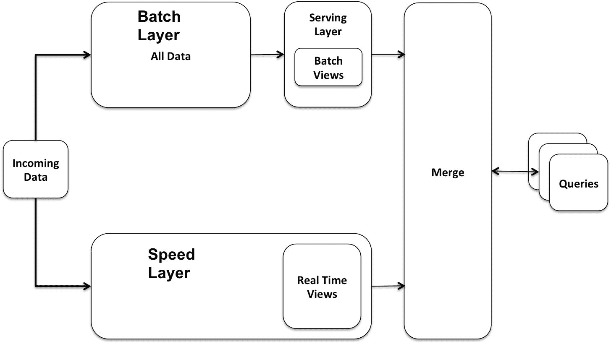

下图显示了使用 AWS 云服务（**Amazon Kinesis**，**Amazon S3**存储，**Amazon EMR**，**Amazon DynamoDB**等）和 Spark 实现 Lambda 架构：

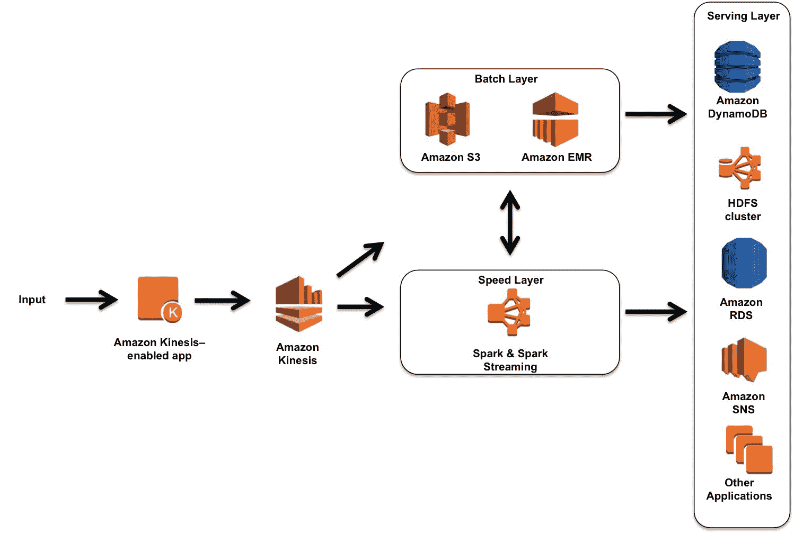

有关 AWS 实施 Lambda 架构的更多详细信息，请参阅[`d0.awsstatic.com/whitepapers/lambda-architecure-on-for-batch-aws.pdf`](https://d0.awsstatic.com/whitepapers/lambda-architecure-on-for-batch-aws.pdf)。

在下一节中，我们将讨论一个更简单的架构，称为 Kappa 架构，它完全放弃了**批处理层**，只在**速度层**中进行流处理。

# 理解 Kappa 架构

**Kappa 架构**比 Lambda 模式更简单，因为它只包括速度层和服务层。所有计算都作为流处理进行，不会对完整数据集进行批量重新计算。重新计算仅用于支持更改和新需求。

通常，传入的实时数据流在内存中进行处理，并持久化在数据库或 HDFS 中以支持查询，如下图所示：

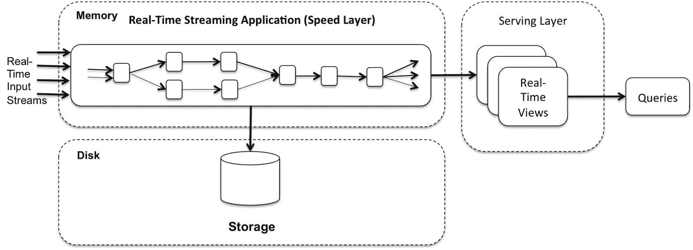

Kappa 架构可以通过使用 Apache Spark 结合排队解决方案（如 Apache Kafka）来实现。如果数据保留时间限制在几天到几周，那么 Kafka 也可以用来保留数据一段有限的时间。

在接下来的几节中，我们将介绍一些使用 Apache Spark、Scala 和 Apache Kafka 的实际应用开发环境中非常有用的实践练习。我们将首先使用 Spark SQL 和结构化流来实现一些流式使用案例。

# 构建可扩展流处理应用的设计考虑

构建健壮的流处理应用是具有挑战性的。与流处理相关的典型复杂性包括以下内容：

+   **复杂数据**：多样化的数据格式和数据质量在流应用中带来了重大挑战。通常，数据以各种格式可用，如 JSON、CSV、AVRO 和二进制。此外，脏数据、延迟到达和乱序数据会使这类应用的设计变得极其复杂。

+   **复杂工作负载**：流应用需要支持多样化的应用需求，包括交互式查询、机器学习流水线等。

+   **复杂系统**：具有包括 Kafka、S3、Kinesis 等多样化存储系统，系统故障可能导致重大的重新处理或错误结果。

使用 Spark SQL 进行流处理可以快速、可扩展和容错。它提供了一套高级 API 来处理复杂数据和工作负载。例如，数据源 API 可以与许多存储系统和数据格式集成。

有关构建可扩展和容错的结构化流处理应用的详细覆盖范围，请参阅[`spark-summit.org/2017/events/easy-scalable-fault-tolerant-stream-processing-with-structured-streaming-in-apache-spark/`](https://spark-summit.org/2017/events/easy-scalable-fault-tolerant-stream-processing-with-structured-streaming-in-apache-spark/)。

流查询允许我们指定一个或多个数据源，使用 DataFrame/Dataset API 或 SQL 转换数据，并指定各种接收器来输出结果。内置支持多种数据源，如文件、Kafka 和套接字，如果需要，还可以组合多个数据源。

Spark SQL Catalyst 优化器可以找出增量执行转换的机制。查询被转换为一系列对新数据批次进行操作的增量执行计划。接收器接受每个批次的输出，并在事务上下文中完成更新。您还可以指定各种输出模式（**完整**、**更新**或**追加**）和触发器来控制何时输出结果。如果未指定触发器，则结果将持续更新。通过持久化检查点来管理给定查询的进度和故障后的重启。

选择适当的数据格式

有关结构化流内部的详细说明，请查看[`spark.apache.org/docs/latest/structured-streaming-programming-guide.html`](http://spark.apache.org/docs/latest/structured-streaming-programming-guide.html)。

Spark 结构化流使得流式分析变得简单，无需担心使流式工作的复杂底层机制。在这个模型中，输入可以被视为来自一个不断增长的追加表的数据。触发器指定了检查输入是否到达新数据的时间间隔，查询表示对输入进行的操作，如映射、过滤和减少。结果表示在每个触发间隔中更新的最终表（根据指定的查询操作）。

在下一节中，我们将讨论 Spark SQL 功能，这些功能可以帮助构建强大的 ETL 管道。

# 使用 Spark SQL 构建强大的 ETL 管道

ETL 管道在源数据上执行一系列转换，以生成经过清洗、结构化并准备好供后续处理组件使用的输出。需要应用在源数据上的转换将取决于数据的性质。输入或源数据可以是结构化的（关系型数据库，Parquet 等），半结构化的（CSV，JSON 等）或非结构化数据（文本，音频，视频等）。通过这样的管道处理后，数据就可以用于下游数据处理、建模、分析、报告等。

下图说明了一个应用架构，其中来自 Kafka 和其他来源（如应用程序和服务器日志）的输入数据在存储到企业数据存储之前经过清洗和转换（使用 ETL 管道）。这个数据存储最终可以供其他应用程序使用（通过 Kafka），支持交互式查询，将数据的子集或视图存储在服务数据库中，训练 ML 模型，支持报告应用程序等。

在下一节中，我们将介绍一些标准，可以帮助您选择适当的数据格式，以满足特定用例的要求。

正如缩写（ETL）所示，我们需要从各种来源检索数据（提取），转换数据以供下游使用（转换），并将其传输到不同的目的地（加载）。

在接下来的几节中，我们将使用 Spark SQL 功能来访问和处理各种数据源和数据格式，以实现 ETL 的目的。Spark SQL 灵活的 API，结合 Catalyst 优化器和 tungsten 执行引擎，使其非常适合构建端到端的 ETL 管道。

在下面的代码块中，我们提供了一个简单的单个 ETL 查询的框架，结合了所有三个（提取、转换和加载）功能。这些查询也可以扩展到执行包含来自多个来源和来源格式的数据的表之间的复杂连接：

```scala
spark.read.json("/source/path") //Extract
.filter(...) //Transform
.agg(...) //Transform
.write.mode("append") .parquet("/output/path") //Load
```

我们还可以对流数据执行滑动窗口操作。在这里，我们定义了对滑动窗口的聚合，其中我们对数据进行分组并计算适当的聚合（对于每个组）。

# 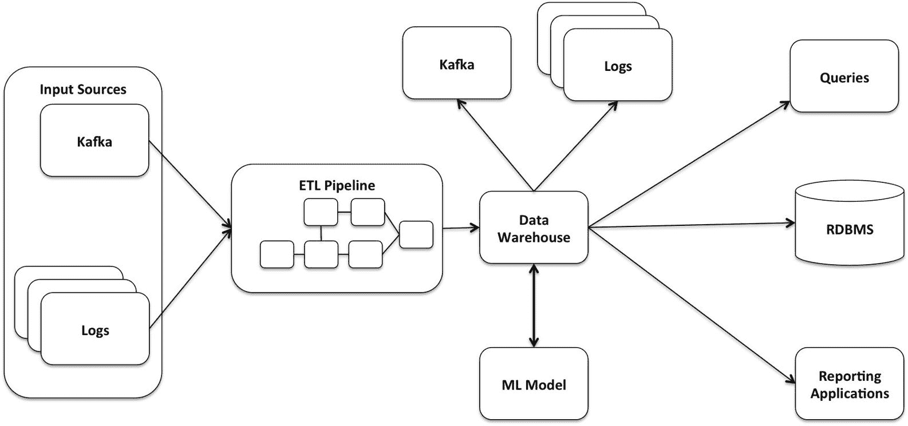

在企业设置中，数据以许多不同的数据源和格式可用。Spark SQL 支持一组内置和第三方连接器。此外，我们还可以定义自定义数据源连接器。数据格式包括结构化、半结构化和非结构化格式，如纯文本、JSON、XML、CSV、关系型数据库记录、图像和视频。最近，Parquet、ORC 和 Avro 等大数据格式变得越来越受欢迎。一般来说，纯文本文件等非结构化格式更灵活，而 Parquet 和 AVRO 等结构化格式在存储和性能方面更有效率。

在结构化数据格式的情况下，数据具有严格的、明确定义的模式或结构。例如，列式数据格式使得从列中提取值更加高效。然而，这种严格性可能会使对模式或结构的更改变得具有挑战性。相比之下，非结构化数据源，如自由格式文本，不包含 CSV 或 TSV 文件中的标记或分隔符。这样的数据源通常需要一些关于数据的上下文；例如，你需要知道文件的内容包含来自博客的文本。

通常，我们需要许多转换和特征提取技术来解释不同的数据集。半结构化数据在记录级别上是结构化的，但不一定在所有记录上都是结构化的。因此，每个数据记录都包含相关的模式信息。

JSON 格式可能是半结构化数据最常见的例子。JSON 记录以人类可读的形式呈现，这对于开发和调试来说更加方便。然而，这些格式受到解析相关的开销的影响，通常不是支持特定查询功能的最佳选择。

通常，应用程序需要设计成能够跨越各种数据源和格式高效存储和处理数据。例如，当需要访问完整的数据行时，Avro 是一个很好的选择，就像在 ML 管道中访问特征的情况一样。在需要模式的灵活性的情况下，使用 JSON 可能是数据格式的最合适选择。此外，在数据没有固定模式的情况下，最好使用纯文本文件格式。

# ETL 管道中的数据转换

通常，诸如 JSON 之类的半结构化格式包含 struct、map 和 array 数据类型；例如，REST Web 服务的请求和/或响应负载包含具有嵌套字段和数组的 JSON 数据。

在这一部分，我们将展示基于 Spark SQL 的 Twitter 数据转换的示例。输入数据集是一个文件（`cache-0.json.gz`），其中包含了在 2012 年美国总统选举前三个月内收集的超过`1.7 亿`条推文中的`1 千万`条推文。这个文件可以从[`datahub.io/dataset/twitter-2012-presidential-election`](https://datahub.io/dataset/twitter-2012-presidential-election)下载。

在开始以下示例之前，按照第五章中描述的方式启动 Zookeeper 和 Kafka 代理。另外，创建一个名为 tweetsa 的新 Kafka 主题。我们从输入 JSON 数据集生成模式，如下所示。这个模式定义将在本节后面使用：

```scala
scala> val jsonDF = spark.read.json("file:///Users/aurobindosarkar/Downloads/cache-0-json")

scala> jsonDF.printSchema()

scala> val rawTweetsSchema = jsonDF.schema

scala> val jsonString = rawTweetsSchema.json

scala> val schema = DataType.fromJson(jsonString).asInstanceOf[StructType]
```

设置从 Kafka 主题（*tweetsa*）中读取流式推文，并使用上一步的模式解析 JSON 数据。

在这个声明中，我们通过`指定数据.*`来选择推文中的所有字段：

```scala
scala> val rawTweets = spark.readStream.format("kafka").option("kafka.bootstrap.servers", "localhost:9092").option("subscribe", "tweetsa").load()

scala> val parsedTweets = rawTweets.selectExpr("cast (value as string) as json").select(from_json($"json", schema).as("data")).select("data.*")
```

在你通过示例工作时，你需要反复使用以下命令将输入文件中包含的推文传输到 Kafka 主题中，如下所示：

```scala
Aurobindos-MacBook-Pro-2:kafka_2.11-0.10.2.1 aurobindosarkar$ bin/kafka-console-producer.sh --broker-list localhost:9092 --topic tweetsa < /Users/aurobindosarkar/Downloads/cache-0-json
```

考虑到输入文件的大小，这可能会导致您的计算机出现空间相关的问题。如果发生这种情况，请使用适当的 Kafka 命令来删除并重新创建主题（参考[`kafka.apache.org/0102/documentation.html`](https://kafka.apache.org/0102/documentation.html)）。

在这里，我们重现了一个模式的部分，以帮助理解我们在接下来的几个示例中要处理的结构：

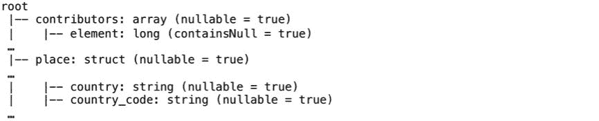

我们可以从 JSON 字符串中的嵌套列中选择特定字段。我们使用`.`（点）运算符来选择嵌套字段，如下所示：

```scala
scala> val selectFields = parsedTweets.select("place.country").where($"place.country".isNotNull)
```

接下来，我们将输出流写入屏幕以查看结果。您需要在每个转换之后执行以下语句，以查看和评估结果。此外，为了节省时间，您应该在看到足够的屏幕输出后执行`s5.stop()`。或者，您可以选择使用从原始输入文件中提取的较小数据集进行工作：

```scala
scala> val s5 = selectFields.writeStream.outputMode("append").format("console").start()
```

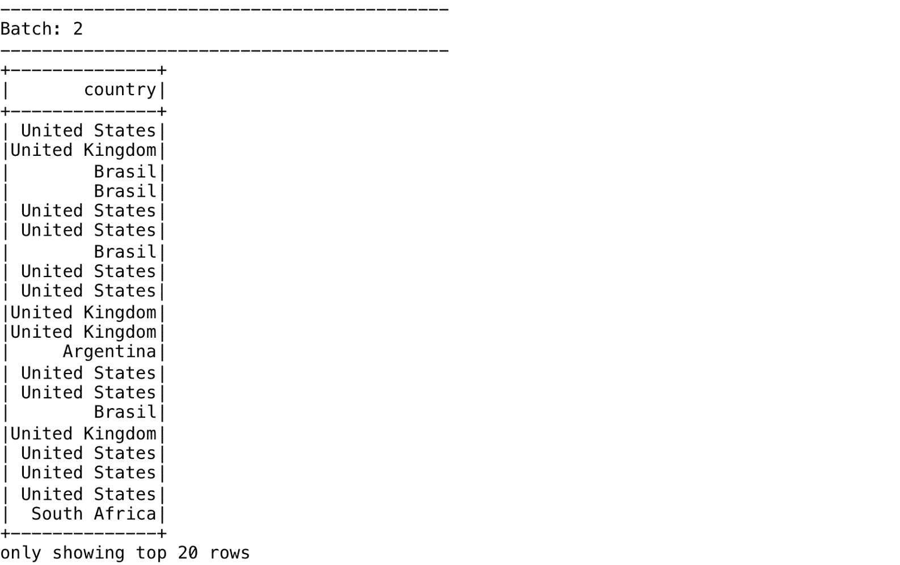

在下一个示例中，我们将使用星号（*）展平一个 struct 以选择 struct 中的所有子字段：

```scala
scala> val selectFields = parsedTweets.select("place.*").where($"place.country".isNotNull)
```

可以通过编写输出流来查看结果，如前面的示例所示：

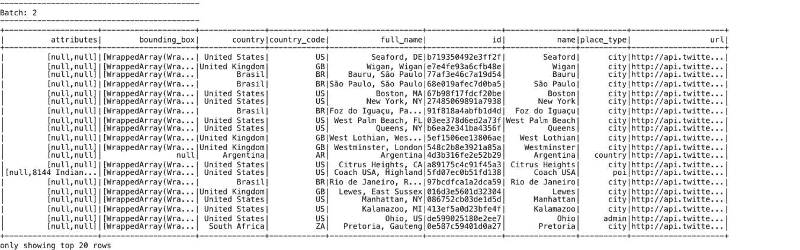

我们可以使用 struct 函数创建一个新的 struct（用于嵌套列），如下面的代码片段所示。我们可以选择特定字段或字段来创建新的 struct。如果需要，我们还可以使用星号（*）嵌套所有列。

在这里，我们重现了此示例中使用的模式部分：

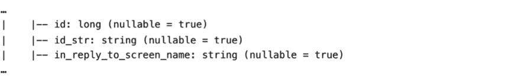

```scala
scala> val selectFields = parsedTweets.select(struct("place.country_code", "place.name") as 'locationInfo).where($"locationInfo.country_code".isNotNull)
```

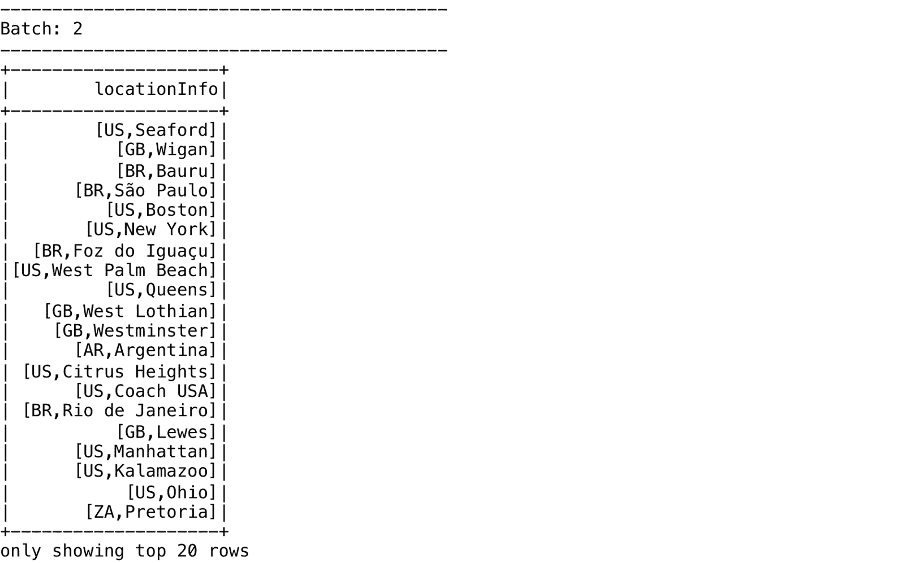

在下一个示例中，我们使用`getItem()`选择单个数组（或映射）元素。在这里，我们正在操作模式的以下部分：

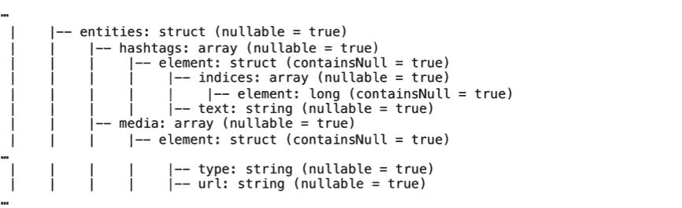

```scala
scala> val selectFields = parsedTweets.select($"entities.hashtags" as 'tags).select('tags.getItem(0) as 'x).select($"x.indices" as 'y).select($"y".getItem(0) as 'z).where($"z".isNotNull)
```

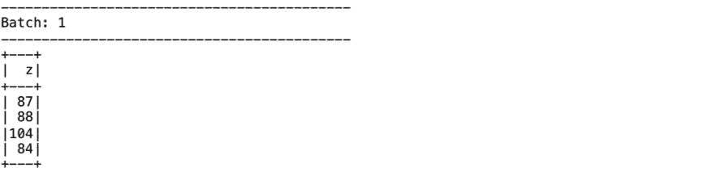

```scala
scala> val selectFields = parsedTweets.select($"entities.hashtags" as 'tags).select('tags.getItem(0) as 'x).select($"x.text" as 'y).where($"y".isNotNull)
```

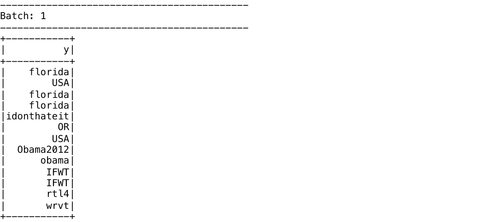

我们可以使用`explode()`函数为数组中的每个元素创建新行，如所示。为了说明`explode()`的结果，我们首先展示包含数组的行，然后展示应用 explode 函数的结果：

```scala
scala> val selectFields = parsedTweets.select($"entities.hashtags.indices" as 'tags).select(explode('tags))
```

获得以下输出：

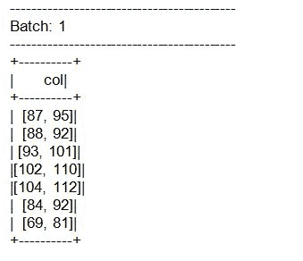

请注意，在应用 explode 函数后，为数组元素创建了单独的行：

```scala
scala> val selectFields = parsedTweets.select($"entities.hashtags.indices".getItem(0) as 'tags).select(explode('tags))
```

获得的输出如下：

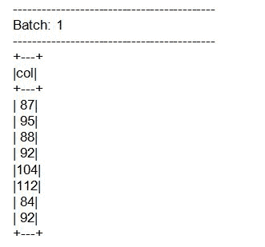

Spark SQL 还具有诸如`to_json()`之类的函数，用于将`struct`转换为 JSON 字符串，以及`from_json()`，用于将 JSON 字符串转换为`struct`。这些函数对于从 Kafka 主题读取或写入非常有用。例如，如果“value”字段包含 JSON 字符串中的数据，则我们可以使用`from_json()`函数提取数据，转换数据，然后将其推送到不同的 Kafka 主题，并/或将其写入 Parquet 文件或服务数据库。

在以下示例中，我们使用`to_json()`函数将 struct 转换为 JSON 字符串：

```scala
scala> val selectFields = parsedTweets.select(struct($"entities.media.type" as 'x, $"entities.media.url" as 'y) as 'z).where($"z.x".isNotNull).select(to_json('z) as 'c)
```

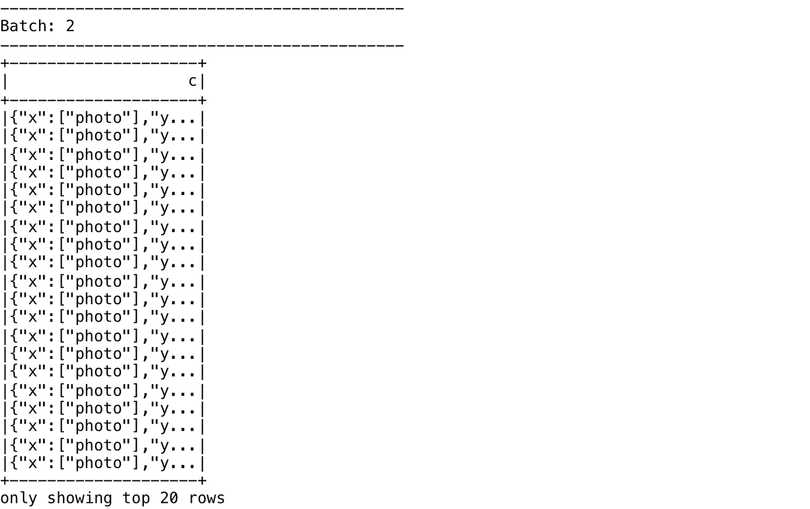

我们可以使用`from_json()`函数将包含 JSON 数据的列转换为`struct`数据类型。此外，我们可以将前述结构展平为单独的列。我们在后面的部分中展示了使用此函数的示例。

有关转换函数的更详细覆盖范围，请参阅[`databricks.com/blog/2017/02/23/working-complex-data-formats-structured-streaming-apache-spark-2-1.html`](https://databricks.com/blog/2017/02/23/working-complex-data-formats-structured-streaming-apache-spark-2-1.html)。

# 解决 ETL 管道中的错误

ETL 任务通常被认为是复杂、昂贵、缓慢和容易出错的。在这里，我们将研究 ETL 过程中的典型挑战，以及 Spark SQL 功能如何帮助解决这些挑战。

Spark 可以自动从 JSON 文件中推断模式。例如，对于以下 JSON 数据，推断的模式包括基于内容的所有标签和数据类型。在这里，输入数据中所有元素的数据类型默认为长整型：

**test1.json**

```scala
{"a":1, "b":2, "c":3}
{"a":2, "d":5, "e":3}
{"d":1, "c":4, "f":6}
{"a":7, "b":8}
{"c":5, "e":4, "d":3}
{"f":3, "e":3, "d":4}
{"a":1, "b":2, "c":3, "f":3, "e":3, "d":4}
```

您可以打印模式以验证数据类型，如下所示：

```scala
scala> spark.read.json("file:///Users/aurobindosarkar/Downloads/test1.json").printSchema()
root
|-- a: long (nullable = true)
|-- b: long (nullable = true)
|-- c: long (nullable = true)
|-- d: long (nullable = true)
|-- e: long (nullable = true)
|-- f: long (nullable = true)
```

然而，在以下 JSON 数据中，如果第三行中的`e`的值和最后一行中的`b`的值被更改以包含分数，并且倒数第二行中的`f`的值被包含在引号中，那么推断的模式将更改`b`和`e`的数据类型为 double，`f`的数据类型为字符串：

```scala
{"a":1, "b":2, "c":3}
{"a":2, "d":5, "e":3}
{"d":1, "c":4, "f":6}
{"a":7, "b":8}
{"c":5, "e":4.5, "d":3}
{"f":"3", "e":3, "d":4}
{"a":1, "b":2.1, "c":3, "f":3, "e":3, "d":4}

scala> spark.read.json("file:///Users/aurobindosarkar/Downloads/test1.json").printSchema()
root
|-- a: long (nullable = true)
|-- b: double (nullable = true)
|-- c: long (nullable = true)
|-- d: long (nullable = true)
|-- e: double (nullable = true)
|-- f: string (nullable = true)
```

如果我们想要将特定结构或数据类型与元素关联起来，我们需要使用用户指定的模式。在下一个示例中，我们使用包含字段名称的标题的 CSV 文件。模式中的字段名称来自标题，并且用户定义的模式中指定的数据类型将用于它们，如下所示：

```scala
a,b,c,d,e,f
1,2,3,,,
2,,,5,3,
,,4,1,,,6
7,8,,,,f
,,5,3,4.5,
,,,4,3,"3"
1,2.1,3,3,3,4

scala> val schema = new StructType().add("a", "int").add("b", "double")

scala> spark.read.option("header", true).schema(schema).csv("file:///Users/aurobindosarkar/Downloads/test1.csv").show()
```

获取以下输出：

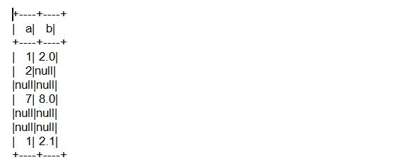

由于文件和数据损坏，ETL 管道中也可能出现问题。如果数据不是关键任务，并且损坏的文件可以安全地忽略，我们可以设置`config property spark.sql.files.ignoreCorruptFiles = true`。此设置允许 Spark 作业继续运行，即使遇到损坏的文件。请注意，成功读取的内容将继续返回。

在下一个示例中，第 4 行的`b`存在错误数据。我们仍然可以使用`PERMISSIVE`模式读取数据。在这种情况下，DataFrame 中会添加一个名为`_corrupt_record`的新列，并且损坏行的内容将出现在该列中，其余字段初始化为 null。我们可以通过查看该列中的数据来关注数据问题，并采取适当的措施来修复它们。通过设置`spark.sql.columnNameOfCorruptRecord`属性，我们可以配置损坏内容列的默认名称：

```scala
{"a":1, "b":2, "c":3}
{"a":2, "d":5, "e":3}
{"d":1, "c":4, "f":6}
{"a":7, "b":{}
{"c":5, "e":4.5, "d":3}
{"f":"3", "e":3, "d":4}
{"a":1, "b":2.1, "c":3, "f":3, "e":3, "d":4}

scala> spark.read.option("mode", "PERMISSIVE").option("columnNameOfCorruptRecord", "_corrupt_record").json("file:///Users/aurobindosarkar/Downloads/test1.json").show()
```

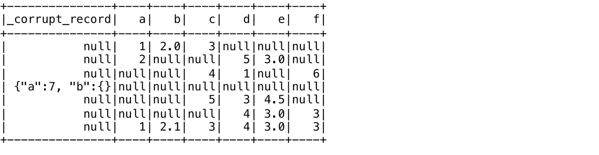

现在，我们使用`DROPMALFORMED`选项来删除所有格式不正确的记录。在这里，由于`b`的坏值，第四行被删除：

```scala
scala> spark.read.option("mode", "DROPMALFORMED").json("file:///Users/aurobindosarkar/Downloads/test1.json").show()
```

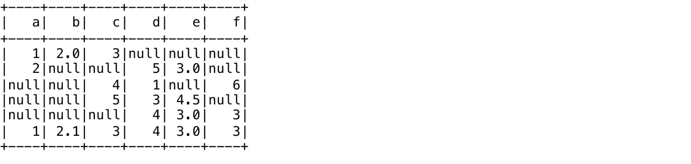

对于关键数据，我们可以使用`FAILFAST`选项，在遇到坏记录时立即失败。例如，在以下示例中，由于第四行中`b`的值，操作会抛出异常并立即退出：

```scala
{"a":1, "b":2, "c":3}
{"a":2, "d":5, "e":3}
{"d":1, "c":4, "f":6}
{"a":7, "b":$}
{"c":5, "e":4.5, "d":3}
{"f":"3", "e":3, "d":4}
{"a":1, "b":2.1, "c":3, "f":3, "e":3, "d":4}

scala> spark.read.option("mode", "FAILFAST").json("file:///Users/aurobindosarkar/Downloads/test1.json").show()
```

在下一个示例中，我们有一条跨越两行的记录；我们可以通过将`wholeFile`选项设置为 true 来读取此记录：

```scala
{"a":{"a1":2, "a2":8},
"b":5, "c":3}

scala> spark.read.option("wholeFile",true).option("mode", "PERMISSIVE").option("columnNameOfCorruptRecord", "_corrupt_record").json("file:///Users/aurobindosarkar/Downloads/testMultiLine.json").show()
+-----+---+---+
|    a|  b|  c|
+-----+---+---+
|[2,8]|  5|  3|
+-----+---+---+
```

有关基于 Spark SQL 的 ETL 管道和路线图的更多详细信息，请访问[`spark-summit.org/2017/events/building-robust-etl-pipelines-with-apache-spark/`](https://spark-summit.org/2017/events/building-robust-etl-pipelines-with-apache-spark/)。

上述参考介绍了几个高阶 SQL 转换函数，DataframeWriter API 的新格式以及 Spark 2.2 和 2.3-Snapshot 中的统一`Create Table`（作为`Select`）构造。

Spark SQL 解决的其他要求包括可扩展性和使用结构化流进行持续 ETL。我们可以使用结构化流来使原始数据尽快可用作结构化数据，以进行分析、报告和决策，而不是产生通常与运行周期性批处理作业相关的几小时延迟。这种处理在应用程序中尤为重要，例如异常检测、欺诈检测等，时间至关重要。

在下一节中，我们将把重点转移到使用 Spark SQL 构建可扩展的监控解决方案。

# 实施可扩展的监控解决方案

为大规模部署构建可扩展的监控功能可能具有挑战性，因为每天可能捕获数十亿个数据点。此外，日志的数量和指标的数量可能难以管理，如果没有适当的具有流式处理和可视化支持的大数据平台。

从应用程序、服务器、网络设备等收集的大量日志被处理，以提供实时监控，帮助检测错误、警告、故障和其他问题。通常，各种守护程序、服务和工具用于收集/发送日志记录到监控系统。例如，以 JSON 格式的日志条目可以发送到 Kafka 队列或 Amazon Kinesis。然后，这些 JSON 记录可以存储在 S3 上作为文件和/或流式传输以实时分析（在 Lambda 架构实现中）。通常，会运行 ETL 管道来清理日志数据，将其转换为更结构化的形式，然后加载到 Parquet 文件或数据库中，以进行查询、警报和报告。

下图说明了一个使用**Spark Streaming Jobs**、**可扩展的时间序列数据库**（如 OpenTSDB 或 Graphite）和**可视化工具**（如 Grafana）的平台：

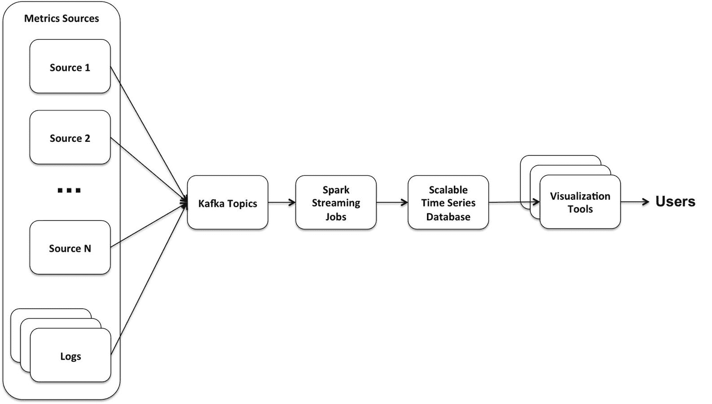

有关此解决方案的更多详细信息，请参阅[`spark-summit.org/2017/events/scalable-monitoring-using-apache-spark-and-friends/`](https://spark-summit.org/2017/events/scalable-monitoring-using-apache-spark-and-friends/)。

在由多个具有不同配置和版本、运行不同类型工作负载的 Spark 集群组成的大型分布式环境中，监控和故障排除问题是具有挑战性的任务。在这些环境中，可能会收到数十万条指标。此外，每秒生成数百 MB 的日志。这些指标需要被跟踪，日志需要被分析以发现异常、故障、错误、环境问题等，以支持警报和故障排除功能。

下图说明了一个基于 AWS 的数据管道，将所有指标和日志（结构化和非结构化）推送到 Kinesis。结构化流作业可以从 Kinesis 读取原始日志，并将数据保存为 S3 上的 Parquet 文件。

结构化流查询可以剥离已知的错误模式，并在观察到新的错误类型时提出适当的警报。其他 Spark 批处理和流处理应用程序可以使用这些 Parquet 文件进行额外处理，并将其结果输出为 S3 上的新 Parquet 文件：

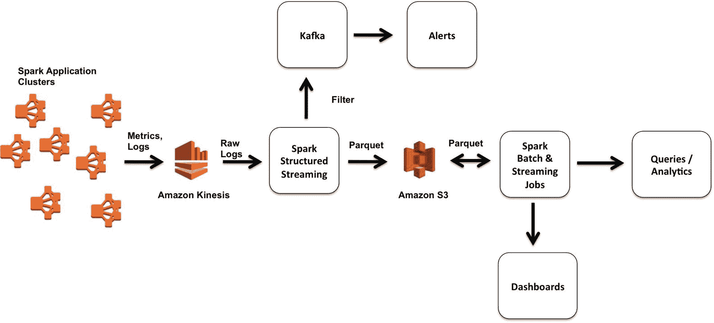

在这种架构中，可能需要从非结构化日志中发现问题，以确定其范围、持续时间和影响。**原始日志**通常包含许多近似重复的错误消息。为了有效处理这些日志，我们需要对其进行规范化、去重和过滤已知的错误条件，以发现和揭示新的错误。

有关处理原始日志的管道的详细信息，请参阅[`spark-summit.org/2017/events/lessons-learned-from-managing-thousands-of-production-apache-spark-clusters-daily/`](https://spark-summit.org/2017/events/lessons-learned-from-managing-thousands-of-production-apache-spark-clusters-daily/)。

在本节中，我们将探讨 Spark SQL 和结构化流提供的一些功能，以创建可扩展的监控解决方案。

首先，使用 Kafka 包启动 Spark shell：

```scala
Aurobindos-MacBook-Pro-2:spark-2.2.0-bin-hadoop2.7 aurobindosarkar$ ./bin/spark-shell --packages org.apache.spark:spark-streaming-kafka-0-10_2.11:2.1.1,org.apache.spark:spark-sql-kafka-0-10_2.11:2.1.1 --driver-memory 12g
```

下载 1995 年 7 月的痕迹，其中包含了对佛罗里达州 NASA 肯尼迪航天中心 WWW 服务器的 HTTP 请求[`ita.ee.lbl.gov/html/contrib/NASA-HTTP.html`](http://ita.ee.lbl.gov/html/contrib/NASA-HTTP.html)。

在本章的实践练习中，导入以下包：

```scala
scala> import org.apache.spark.sql.types._
scala> import org.apache.spark.sql.functions._
scala> import spark.implicits._
scala> import org.apache.spark.sql.streaming._
```

接下来，为文件中的记录定义模式：

```scala
scala> val schema = new StructType().add("clientIpAddress", "string").add("rfc1413ClientIdentity", "string").add("remoteUser", "string").add("dateTime", "string").add("zone", "string").add("request","string").add("httpStatusCode", "string").add("bytesSent", "string").add("referer", "string").add("userAgent", "string")
```

为简单起见，我们将输入文件读取为以空格分隔的 CSV 文件，如下所示：

```scala
scala> val rawRecords = spark.readStream.option("header", false).schema(schema).option("sep", " ").format("csv").load("file:///Users/aurobindosarkar/Downloads/NASA")

scala> val ts = unix_timestamp(concat($"dateTime", lit(" "), $"zone"), "[dd/MMM/yyyy:HH:mm:ss Z]").cast("timestamp")
```

接下来，我们创建一个包含日志事件的 DataFrame。由于时间戳在前面的步骤中更改为本地时区（默认情况下），我们还在`original_dateTime`列中保留了带有时区信息的原始时间戳，如下所示：

```scala
scala> val logEvents = rawRecords.withColumn("ts", ts).withColumn("date", ts.cast(DateType)).select($"ts", $"date", $"clientIpAddress", concat($"dateTime", lit(" "), $"zone").as("original_dateTime"), $"request", $"httpStatusCode", $"bytesSent")
```

我们可以检查流式读取的结果，如下所示：

```scala
scala> val query = logEvents.writeStream.outputMode("append").format("console").start()
```

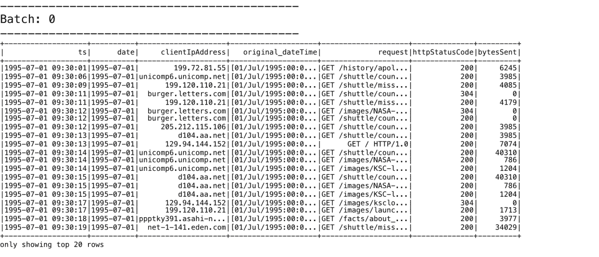

我们可以将流输入保存为 Parquet 文件，按日期分区以更有效地支持查询，如下所示：

```scala
scala> val streamingETLQuery = logEvents.writeStream.trigger(Trigger.ProcessingTime("2 minutes")).format("parquet").partitionBy("date").option("path", "file:///Users/aurobindosarkar/Downloads/NASALogs").option("checkpointLocation", "file:///Users/aurobindosarkar/Downloads/NASALogs/checkpoint/").start()
```

我们可以通过指定`latestFirst`选项来读取输入，以便最新的记录首先可用：

```scala
val rawCSV = spark.readStream.schema(schema).option("latestFirst", "true").option("maxFilesPerTrigger", "5").option("header", false).option("sep", " ").format("csv").load("file:///Users/aurobindosarkar/Downloads/NASA")
```

我们还可以按日期将输出以 JSON 格式输出，如下所示：

```scala
val streamingETLQuery = logEvents.writeStream.trigger(Trigger.ProcessingTime("2 minutes")).format("json").partitionBy("date").option("path", "file:///Users/aurobindosarkar/Downloads/NASALogs").option("checkpointLocation", "file:///Users/aurobindosarkar/Downloads/NASALogs/checkpoint/").start()
```

现在，我们展示了在流式 Spark 应用程序中使用 Kafka 进行输入和输出的示例。在这里，我们必须将格式参数指定为`kafka`，并指定 kafka 代理和主题：

```scala
scala> val kafkaQuery = logEvents.selectExpr("CAST(ts AS STRING) AS key", "to_json(struct(*)) AS value").writeStream.format("kafka").option("kafka.bootstrap.servers", "localhost:9092").option("topic", "topica").option("checkpointLocation", "file:///Users/aurobindosarkar/Downloads/NASALogs/kafkacheckpoint/").start()
```

现在，我们正在从 Kafka 中读取 JSON 数据流。将起始偏移设置为最早以指定查询的起始点。这仅适用于启动新的流式查询时：

```scala
scala> val kafkaDF = spark.readStream.format("kafka").option("kafka.bootstrap.servers", "localhost:9092").option("subscribe", "topica").option("startingOffsets", "earliest").load()
```

我们可以按以下方式打印从 Kafka 读取的记录的模式：

```scala
scala> kafkaDF.printSchema()
root
|-- key: binary (nullable = true)
|-- value: binary (nullable = true)
|-- topic: string (nullable = true)
|-- partition: integer (nullable = true)
|-- offset: long (nullable = true)
|-- timestamp: timestamp (nullable = true)
|-- timestampType: integer (nullable = true)
```

接下来，我们定义输入记录的模式，如下所示：

```scala
scala> val kafkaSchema = new StructType().add("ts", "timestamp").add("date", "string").add("clientIpAddress", "string").add("rfc1413ClientIdentity", "string").add("remoteUser", "string").add("original_dateTime", "string").add("request", "string").add("httpStatusCode", "string").add("bytesSent", "string")
```

接下来，我们可以指定模式，如所示。星号`*`运算符用于选择`struct`中的所有`subfields`：

```scala
scala> val kafkaDF1 = kafkaDF.select(col("key").cast("string"), from_json(col("value").cast("string"), kafkaSchema).as("data")).select("data.*")
```

接下来，我们展示选择特定字段的示例。在这里，我们将`outputMode`设置为 append，以便只有追加到结果表的新行被写入外部存储。这仅适用于查询结果表中现有行不会发生变化的情况：

```scala
scala> val kafkaQuery1 = kafkaDF1.select($"ts", $"date", $"clientIpAddress", $"original_dateTime", $"request", $"httpStatusCode", $"bytesSent").writeStream.outputMode("append").format("console").start()
```

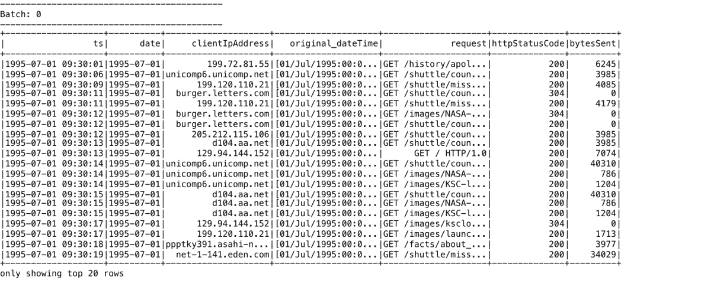

我们还可以指定`read`（而不是`readStream`）将记录读入常规 DataFrame 中：

```scala
scala> val kafkaDF2 = spark.read.format("kafka").option("kafka.bootstrap.servers","localhost:9092").option("subscribe", "topica").load().selectExpr("CAST(value AS STRING) as myvalue")
```

现在，我们可以对这个 DataFrame 执行所有标准的 DataFrame 操作；例如，我们创建一个表并查询它，如下所示：

```scala
scala> kafkaDF2.registerTempTable("topicData3")

scala> spark.sql("select myvalue from topicData3").take(3).foreach(println)
```

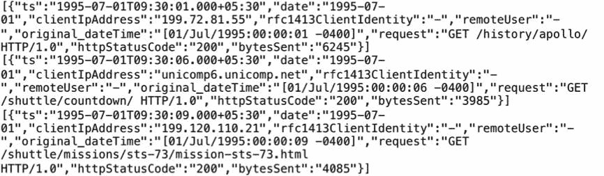

然后，我们从 Kafka 中读取记录并应用模式：

```scala
scala> val parsed = spark.readStream.format("kafka").option("kafka.bootstrap.servers", "localhost:9092").option("subscribe", "topica").option("startingOffsets", "earliest").load().select(from_json(col("value").cast("string"), kafkaSchema).alias("parsed_value"))
```

我们可以执行以下查询来检查记录的内容：

```scala
scala> val query = parsed.writeStream.outputMode("append").format("console").start()
```

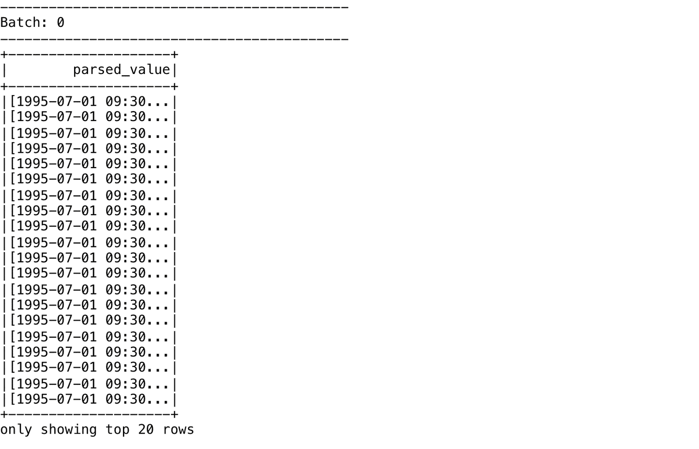

我们可以从记录中选择所有字段，如下所示：

```scala
scala> val selectAllParsed = parsed.select("parsed_value.*")
```

我们还可以从 DataFrame 中选择感兴趣的特定字段：

```scala
scala> val selectFieldsParsed = selectAllParsed.select("ts", "clientIpAddress", "request", "httpStatusCode")
```

接下来，我们可以使用窗口操作，并为各种 HTTP 代码维护计数，如所示。在这里，我们将`outputMode`设置为`complete`，因为我们希望将整个更新后的结果表写入外部存储：

```scala
scala> val s1 = selectFieldsParsed.groupBy(window($"ts", "10 minutes", "5 minutes"), $"httpStatusCode").count().writeStream.outputMode("complete").format("console").start()
```

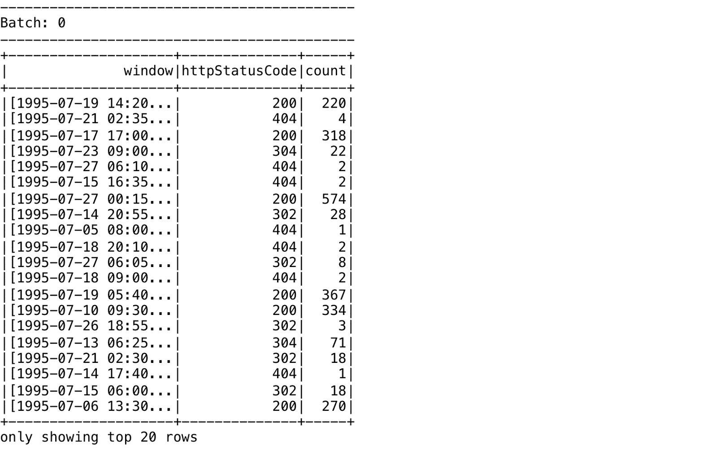

接下来，我们展示了另一个使用`groupBy`和计算各窗口中各种页面请求计数的示例。这可用于计算和报告访问类型指标中的热门页面：

```scala
scala> val s2 = selectFieldsParsed.groupBy(window($"ts", "10 minutes", "5 minutes"), $"request").count().writeStream.outputMode("complete").format("console").start()
```

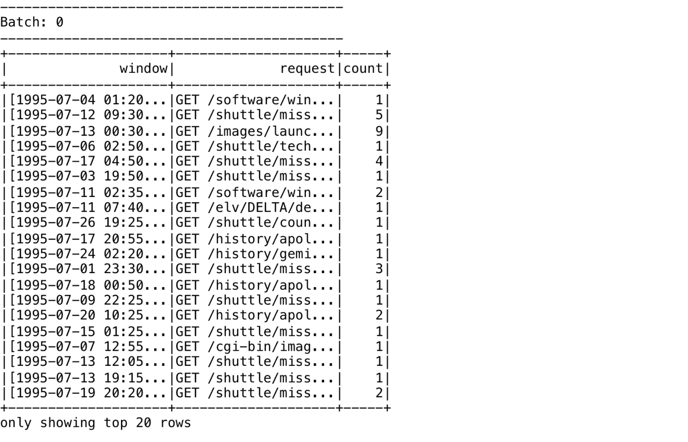

请注意，前面提到的示例是有状态处理的实例。计数必须保存为触发器之间的分布式状态。每个触发器读取先前的状态并写入更新后的状态。此状态存储在内存中，并由持久的 WAL 支持，通常位于 HDFS 或 S3 存储上。这使得流式应用程序可以自动处理延迟到达的数据。保留此状态允许延迟数据更新旧窗口的计数。

然而，如果不丢弃旧窗口，状态的大小可能会无限增加。水印方法用于解决此问题。水印是预期数据延迟的移动阈值，以及何时丢弃旧状态。它落后于最大观察到的事件时间。水印之后的数据可能会延迟，但允许进入聚合，而水印之前的数据被认为是“太晚”，并被丢弃。此外，水印之前的窗口会自动删除，以限制系统需要维护的中间状态的数量。

在前一个查询中指定的水印在这里给出：

```scala
scala> val s4 = selectFieldsParsed.withWatermark("ts", "10 minutes").groupBy(window($"ts", "10 minutes", "5 minutes"), $"request").count().writeStream.outputMode("complete").format("console").start()
```

有关水印的更多详细信息，请参阅[`databricks.com/blog/2017/05/08/event-time-aggregation-watermarking-apache-sparks-structured-streaming.html`](https://databricks.com/blog/2017/05/08/event-time-aggregation-watermarking-apache-sparks-structured-streaming.html)。

在下一节中，我们将把重点转移到在生产环境中部署基于 Spark 的机器学习管道。

# 部署 Spark 机器学习管道

下图以概念级别说明了机器学习管道。然而，现实生活中的 ML 管道要复杂得多，有多个模型被训练、调整、组合等：


下图显示了典型机器学习应用程序的核心元素分为两部分：建模，包括模型训练，以及部署的模型（用于流数据以输出结果）：

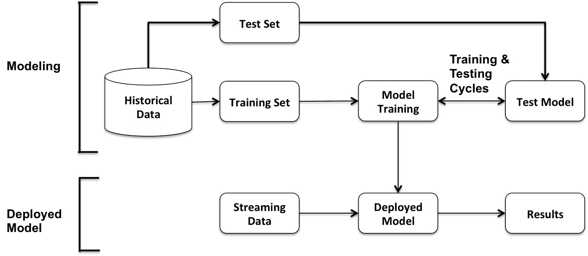

通常，数据科学家在 Python 和/或 R 中进行实验或建模工作。然后在部署到生产环境之前，他们的工作会在 Java/Scala 中重新实现。企业生产环境通常包括 Web 服务器、应用服务器、数据库、中间件等。将原型模型转换为生产就绪模型会导致额外的设计和开发工作，从而导致更新模型的推出延迟。

我们可以使用 Spark MLlib 2.x 模型序列化直接在生产环境中加载数据科学家保存的模型和管道（到磁盘）的模型文件。

在以下示例中（来源：[`spark.apache.org/docs/latest/ml-pipeline.html`](https://spark.apache.org/docs/latest/ml-pipeline.html)），我们将演示在 Python 中创建和保存 ML 管道（使用`pyspark` shell），然后在 Scala 环境中检索它。

启动`pyspark` shell 并执行以下 Python 语句序列：

```scala
>>> from pyspark.ml import Pipeline
>>> from pyspark.ml.classification import LogisticRegression
>>> from pyspark.ml.feature import HashingTF, Tokenizer
>>> training = spark.createDataFrame([
... (0, "a b c d e spark", 1.0),
... (1, "b d", 0.0),
... (2, "spark f g h", 1.0),
... (3, "hadoop mapreduce", 0.0)
... ], ["id", "text", "label"])
>>> tokenizer = Tokenizer(inputCol="text", outputCol="words")
>>> hashingTF = HashingTF(inputCol=tokenizer.getOutputCol(), outputCol="features")
>>> lr = LogisticRegression(maxIter=10, regParam=0.001)
>>> pipeline = Pipeline(stages=[tokenizer, hashingTF, lr])
>>> model = pipeline.fit(training)
>>> model.save("file:///Users/aurobindosarkar/Downloads/spark-logistic-regression-model")
>>> quit()
```

启动 Spark shell 并执行以下 Scala 语句序列：

```scala
scala> import org.apache.spark.ml.{Pipeline, PipelineModel}
scala> import org.apache.spark.ml.classification.LogisticRegression
scala> import org.apache.spark.ml.feature.{HashingTF, Tokenizer}
scala> import org.apache.spark.ml.linalg.Vector
scala> import org.apache.spark.sql.Row

scala> val sameModel = PipelineModel.load("file:///Users/aurobindosarkar/Downloads/spark-logistic-regression-model")
```

接下来，我们创建一个`test`数据集，并通过 ML 管道运行它：

```scala
scala> val test = spark.createDataFrame(Seq(
| (4L, "spark i j k"),
| (5L, "l m n"),
| (6L, "spark hadoop spark"),
| (7L, "apache hadoop")
| )).toDF("id", "text")
```

在`test`数据集上运行模型的结果如下：

```scala
scala> sameModel.transform(test).select("id", "text", "probability", "prediction").collect().foreach { case Row(id: Long, text: String, prob: Vector, prediction: Double) => println(s"($id, $text) --> prob=$prob, prediction=$prediction")}

(4, spark i j k) --> prob=[0.15554371384424398,0.844456286155756], prediction=1.0
(5, l m n) --> prob=[0.8307077352111738,0.16929226478882617], prediction=0.0
(6, spark hadoop spark) --> prob=[0.06962184061952888,0.9303781593804711], prediction=1.0
(7, apache hadoop) --> prob=[0.9815183503510166,0.018481649648983405], prediction=0.0
```

保存的逻辑回归模型的关键参数被读入 DataFrame，如下面的代码块所示。在之前，当模型在`pyspark` shell 中保存时，这些参数被保存到与我们管道的最终阶段相关的子目录中的 Parquet 文件中：

```scala
scala> val df = spark.read.parquet("file:///Users/aurobindosarkar/Downloads/spark-logistic-regression-model/stages/2_LogisticRegression_4abda37bdde1ddf65ea0/data/part-00000-415bf215-207a-4a49-985e-190eaf7253a7-c000.snappy.parquet")

scala> df.show()
```

获得以下输出：

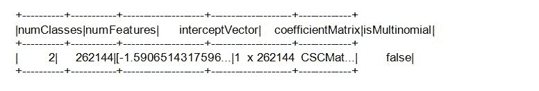

```scala
scala> df.collect.foreach(println)
```

输出如下：

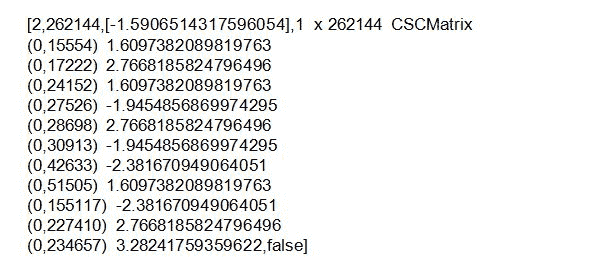

有关如何将 ML 模型投入生产的更多详细信息，请参阅[`spark-summit.org/2017/events/how-to-productionize-your-machine-learning-models-using-apache-spark-mllib-2x/`](https://spark-summit.org/2017/events/how-to-productionize-your-machine-learning-models-using-apache-spark-mllib-2x/)。

# 了解典型 ML 部署环境中的挑战

ML 模型的生产部署环境可能非常多样化和复杂。例如，模型可能需要部署在 Web 应用程序、门户、实时和批处理系统中，以及作为 API 或 REST 服务，嵌入设备或大型遗留环境中。

此外，企业技术堆栈可以包括 Java 企业、C/C++、遗留主机环境、关系数据库等。与响应时间、吞吐量、可用性和正常运行时间相关的非功能性要求和客户 SLA 也可能差异很大。然而，在几乎所有情况下，我们的部署过程需要支持 A/B 测试、实验、模型性能评估，并且需要灵活和响应业务需求。

通常，从业者使用各种方法来对新模型或更新模型进行基准测试和逐步推出，以避免高风险、大规模的生产部署。

在下一节中，我们将探讨一些模型部署架构。

# 了解模型评分架构的类型

最简单的模型是使用 Spark（批处理）预计算模型结果，将结果保存到数据库，然后从数据库为 Web 和移动应用程序提供结果。许多大规模的推荐引擎和搜索引擎使用这种架构：

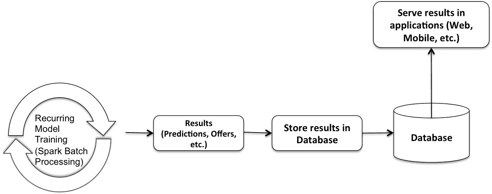

第二种模型评分架构使用 Spark Streaming 计算特征并运行预测算法。预测结果可以使用缓存解决方案（如 Redis）进行缓存，并可以通过 API 提供。其他应用程序可以使用这些 API 从部署的模型中获取预测结果。此选项在此图中有所说明：

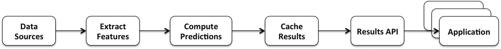

在第三种架构模型中，我们可以仅使用 Spark 进行模型训练。然后将模型复制到生产环境中。例如，我们可以从 JSON 文件中加载逻辑回归模型的系数和截距。这种方法资源高效，并且会产生高性能的系统。在现有或复杂环境中部署也更加容易。

如图所示：

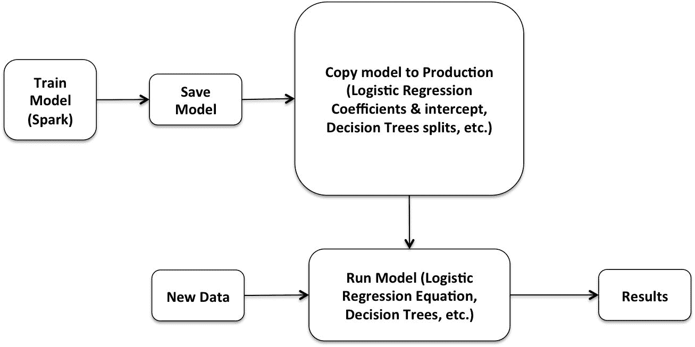

继续我们之前的例子，我们可以从 Parquet 文件中读取保存的模型参数，并将其转换为 JSON 格式，然后可以方便地导入到任何应用程序（在 Spark 环境内部或外部）并应用于新数据：

```scala
scala> spark.read.parquet("file:///Users/aurobindosarkar/Downloads/spark-logistic-regression-model/stages/2_LogisticRegression_4abda37bdde1ddf65ea0/data/part-00000-415bf215-207a-4a49-985e-190eaf7253a7-c000.snappy.parquet").write.mode("overwrite").json("file:///Users/aurobindosarkar/Downloads/lr-model-json")
```

我们可以使用标准操作系统命令显示截距、系数和其他关键参数，如下所示：

```scala
Aurobindos-MacBook-Pro-2:lr-model-json aurobindosarkar$ more part-00000-e2b14eb8-724d-4262-8ea5-7c23f846fed0-c000.json
```

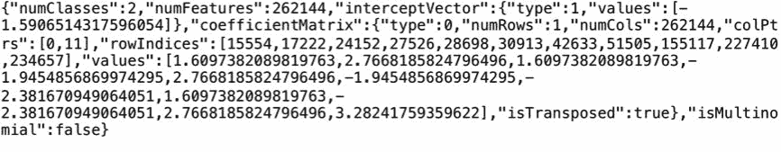

随着模型变得越来越大和复杂，部署和提供服务可能会变得具有挑战性。模型可能无法很好地扩展，其资源需求可能变得非常昂贵。Databricks 和 Redis-ML 提供了部署训练模型的解决方案。

在 Redis-ML 解决方案中，模型直接应用于 Redis 环境中的新数据。

这可以以比在 Spark 环境中运行模型的价格更低的价格提供所需的整体性能、可伸缩性和可用性。

下图显示了 Redis-ML 作为服务引擎的使用情况（实现了先前描述的第三种模型评分架构模式）：

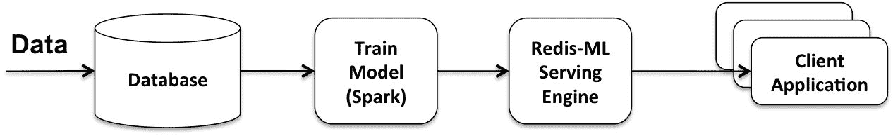

在下一节中，我们将简要讨论在生产环境中使用 Mesos 和 Kubernetes 作为集群管理器。

# 使用集群管理器

在本节中，我们将在概念层面简要讨论 Mesos 和 Kubernetes。Spark 框架可以通过 Apache Mesos、YARN、Spark Standalone 或 Kubernetes 集群管理器进行部署，如下所示：

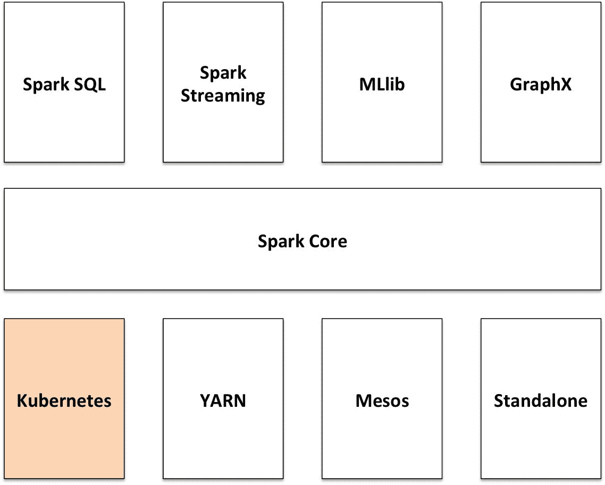

Mesos 可以实现数据的轻松扩展和复制，并且是异构工作负载的良好统一集群管理解决方案。

要从 Spark 使用 Mesos，Spark 二进制文件应该可以被 Mesos 访问，并且 Spark 驱动程序配置为连接到 Mesos。或者，您也可以在所有 Mesos 从属节点上安装 Spark 二进制文件。驱动程序创建作业，然后发出任务进行调度，而 Mesos 确定处理它们的机器。

Spark 可以在 Mesos 上以两种模式运行：粗粒度（默认）和细粒度（在 Spark 2.0.0 中已弃用）。在粗粒度模式下，每个 Spark 执行器都作为单个 Mesos 任务运行。这种模式具有显着较低的启动开销，但会为应用程序的持续时间保留 Mesos 资源。Mesos 还支持根据应用程序的统计数据调整执行器数量的动态分配。

下图说明了将 Mesos Master 和 Zookeeper 节点放置在一起的部署。Mesos Slave 和 Cassandra 节点也放置在一起，以获得更好的数据局部性。此外，Spark 二进制文件部署在所有工作节点上：

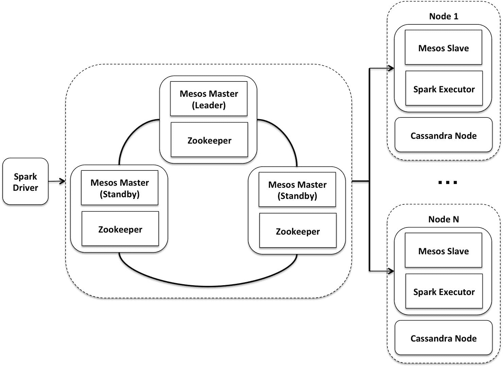

另一个新兴的 Spark 集群管理解决方案是 Kubernetes，它正在作为 Spark 的本机集群管理器进行开发。它是一个开源系统，可用于自动化容器化 Spark 应用程序的部署、扩展和管理。

下图描述了 Kubernetes 的高层视图。每个节点都包含一个名为 Kublet 的守护程序，它与 Master 节点通信。用户还可以与 Master 节点通信，以声明性地指定他们想要运行的内容。例如，用户可以请求运行特定数量的 Web 服务器实例。Master 将接受用户的请求并在节点上安排工作负载：

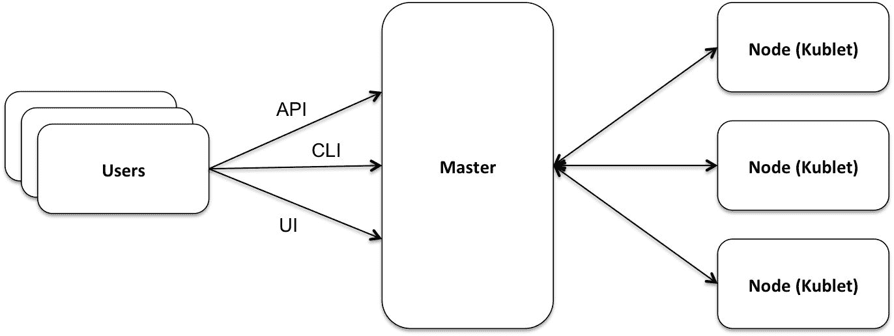

节点运行一个或多个 pod。Pod 是容器的更高级抽象，每个 pod 可以包含一组共同放置的容器。每个 pod 都有自己的 IP 地址，并且可以与其他节点中的 pod 进行通信。存储卷可以是本地的或网络附加的。这可以在下图中看到：

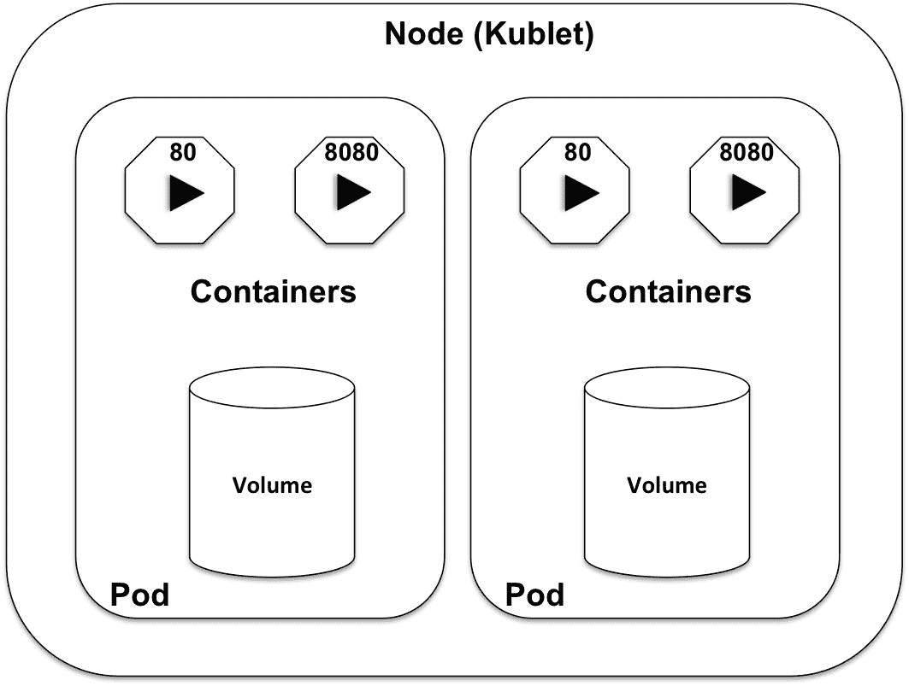

Kubernetes 促进不同类型的 Spark 工作负载之间的资源共享，以减少运营成本并提高基础设施利用率。此外，可以使用几个附加服务与 Spark 应用程序一起使用，包括日志记录、监视、安全性、容器间通信等。

有关在 Kubernetes 上使用 Spark 的更多详细信息，请访问[`github.com/apache-spark-on-k8s/spark`](https://github.com/apache-spark-on-k8s/spark)。

在下图中，虚线将 Kubernetes 与 Spark 分隔开。Spark Core 负责获取新的执行器、推送新的配置、移除执行器等。**Kubernetes 调度器后端**接受 Spark Core 的请求，并将其转换为 Kubernetes 可以理解的原语。此外，它处理所有资源请求和与 Kubernetes 的所有通信。

其他服务，如文件暂存服务器，可以使您的本地文件和 JAR 文件可用于 Spark 集群，Spark 洗牌服务可以存储动态分配资源的洗牌数据；例如，它可以实现弹性地改变特定阶段的执行器数量。您还可以扩展 Kubernetes API 以包括自定义或特定于应用程序的资源；例如，您可以创建仪表板来显示作业的进度。

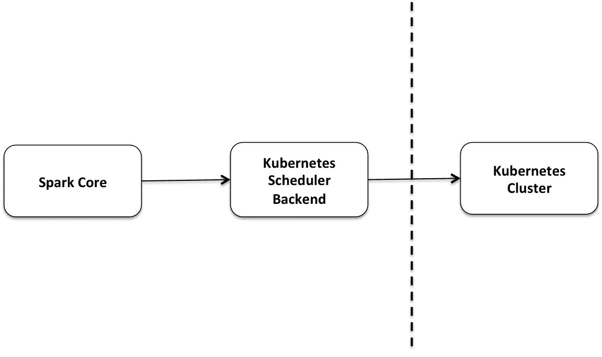

Kubernetes 还提供了一些有用的管理功能，以帮助管理集群，例如 RBAC 和命名空间级别的资源配额、审计日志记录、监视节点、pod、集群级别的指标等。

# 总结

在本章中，我们介绍了几种基于 Spark SQL 的应用程序架构，用于构建高度可扩展的应用程序。我们探讨了批处理和流处理中的主要概念和挑战。我们讨论了 Spark SQL 的特性，可以帮助构建强大的 ETL 流水线。我们还介绍了一些构建可扩展监控应用程序的代码。此外，我们探讨了一种用于机器学习流水线的高效部署技术，以及使用 Mesos 和 Kubernetes 等集群管理器的一些基本概念。

总之，本书试图帮助您在 Spark SQL 和 Scala 方面建立坚实的基础。然而，仍然有许多领域可以深入探索，以建立更深入的专业知识。根据您的特定领域，数据的性质和问题可能差异很大，您解决问题的方法通常会涵盖本书中描述的一个或多个领域。然而，在所有情况下，都需要 EDA 和数据整理技能，而您练习得越多，就会变得越熟练。尝试下载并处理不同类型的数据，包括结构化、半结构化和非结构化数据。此外，阅读各章节中提到的参考资料，以深入了解其他数据科学从业者如何解决问题。参考 Apache Spark 网站获取软件的最新版本，并探索您可以在 ML 流水线中使用的其他机器学习算法。最后，诸如深度学习和基于成本的优化等主题在 Spark 中仍在不断发展，尝试跟上这些领域的发展，因为它们将是解决未来许多有趣问题的关键。
