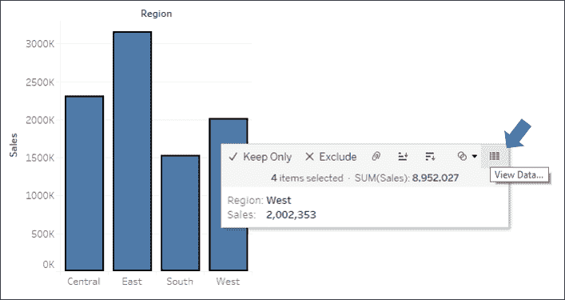

# 第二章：连接到 Tableau 中的数据

Tableau 提供了连接几乎所有数据源的能力。它通过一种独特的范式来实现这一点，该范式利用了现有数据库引擎的强大功能和效率，或者提取数据到本地。我们将在*第十三章*《理解 Tableau 数据模型、连接和联接》中详细探讨连接、混合、联合以及全新的对象模型。在本章中，我们将重点介绍 Tableau 如何连接并处理数据的基本概念。我们将涵盖以下主题：

+   Tableau 范式

+   连接到数据

+   管理数据源元数据

+   使用提取代替实时连接

+   过滤数据

我们将从理解 Tableau 如何处理数据的基本范式开始。

# Tableau 范式

在 Tableau 中处理数据的独特和令人兴奋的体验，正是 **VizQL**（**可视化查询语言**）的结果。

VizQL 是作为斯坦福大学的研究项目开发的，专注于人类如何自然地感知世界的方式，以及如何将这种感知应用到数据可视化中。我们自然地感知大小、形状、空间位置和颜色的差异。VizQL 使 Tableau 能够将你在可视化环境中拖放数据字段的操作，转换成定义数据如何编码这些视觉元素的查询语言。你无需阅读、编写或调试 VizQL。当你将字段拖放到定义大小、颜色、形状和空间位置的各个架构上时，Tableau 会在后台生成 VizQL。这使得你可以专注于可视化数据，而不是编写代码！

VizQL 的一个好处是它提供了一种通用的方式来描述视图中各个字段的排列如何定义与数据相关的查询。这个通用的基准可以被转换成多种 SQL、MDX 和 **Tableau 查询语言**（**TQL**，用于提取的数据）的变种。Tableau 会自动将 VizQL 转换为由源数据引擎执行的本地查询。

在最简单的形式下，Tableau 处理数据的范式如下图所示：

图 2.1：Tableau 处理数据的基本范式

让我们通过一个实际示例来看看这一范式是如何工作的。

## 一个简单的示例

打开位于 `\Learning Tableau\Chapter 02` 目录下的 `Chapter 02 Starter.twbx` 工作簿，并导航到 `Tableau Paradigm` 表单。该视图是通过将 **Region** 维度拖放到 **Columns**，并将 **Sales** 度量拖放到 **Rows** 创建的。以下是截图：

图 2.2：此条形图是一个查询的结果，返回了四行聚合数据

视图由两个字段定义。**区域**是唯一的维度，意味着它定义了视图的细节级别，并切分度量，这样每个区域就会有一条条形图。**销售额**作为度量，通过在每个区域内求和每笔销售来聚合。（另请注意，**区域**是离散的，导致生成列 **标题**，而**销售额**是连续的，导致生成 **轴**。）

以本示例为例（尽管该原理适用于任何数据源），假设您通过实时连接到 SQL Server 数据库，其中 `Superstore` 数据存储在一张表中。当您首次创建上面的截图时，Tableau 会生成一个 VizQL 脚本，这个脚本会被翻译为 SQL 脚本并发送到 SQL Server。SQL Server 数据库引擎评估查询并返回聚合结果到 Tableau，之后这些结果会以可视化形式呈现。

整个过程在 Tableau 的范式中看起来像下图所示：

图 2.3：Tableau 使用类似这样的范式生成了前面图片中的条形图

SQL Server 中可能有数百、数千甚至数百万行销售数据。然而，当 SQL Server 处理查询时，它返回的是汇总结果。在这种情况下，SQL Server 只返回四行汇总数据到 Tableau——每个区域一行。

有时，数据库管理员可能需要找出针对某个特定数据库正在执行的脚本，以便调试性能问题或确定更高效的索引或数据结构。许多数据库提供了分析工具或记录查询的执行。此外，您还可以在位于 `My Tableau Repository\Logs` 目录中的日志文件中找到 Tableau 生成的 SQL 或 MDX 查询。

您还可以使用 Tableau 内置的 **性能记录器** 来定位已执行的查询。在顶部菜单中选择 **帮助 | 设置和性能 | 开始性能记录**，然后与视图交互，最后在菜单中停止记录。Tableau 将打开一个仪表板，允许您查看在记录会话期间执行的任务、性能和查询。

要查看 Tableau 用于绘制视图的汇总数据，按 *Ctrl +* *A* 选择所有条形图，然后右键点击其中一条，选择 **查看数据**。

图 2.4：使用查看数据工具提示选项查看标记的摘要或基础数据

这将显示一个 **查看数据** 窗口：

图 2.5：摘要选项卡显示 Tableau 用于渲染视图中每个标记的汇总数据

**查看数据**屏幕允许你观察视图中的数据。**汇总**标签显示了用于渲染视图的汇总级别数据。这里的**销售额**是每个地区的销售总和。当你点击**完整数据**（之前称为**基础数据**）标签时，Tableau 将查询数据源，检索所有构成汇总记录的记录。在这种情况下，基础记录有**9,426**条，如下图右下角状态栏所示：

图 2.6：**完整数据**标签显示了数据库中的行级数据

Tableau 不需要**9,426**条记录来绘制视图，并且直到点击**完整数据**数据标签时才会向数据源请求这些记录。

数据库引擎经过优化，可以对数据执行聚合操作。通常，这些数据库引擎也位于强大的服务器上。Tableau 利用底层数据源的优化和计算能力。通过这种方式，Tableau 可以以相对较少的本地数据处理来可视化大量数据集。

此外，只有在你进行需要新查询或视图刷新的更改时，Tableau 才会查询数据源。否则，它将使用存储在本地缓存中的汇总结果，如下所示：

图 2.7：第一次渲染时，给定的一组字段会直接查询数据源。后续的渲染会查询缓存，即使相同的字段在视图中被重新排列。

在前面的示例中，查询以**地区**作为维度和**销售额**的总和作为度量，仅会对数据源发出一次请求。当返回的四行汇总结果时，它们会被存储在缓存中。初次渲染之后，如果你将**地区**移动到另一个视觉编码架，比如颜色，或将**销售额**移动到另一个视觉编码架，比如大小，那么 Tableau 会从缓存中获取汇总的行并重新渲染视图。

你可以通过按下*F5*键，或从**数据**菜单中选择数据源并选择**刷新**，强制 Tableau 跳过缓存并从数据源刷新数据。每当你希望视图反映来自实时数据源的最新更改时，都可以这样做。

如果你向视图中引入了没有缓存结果的新字段，Tableau 会向数据源发出新的查询，检索汇总结果，并将这些结果添加到缓存中。

# 连接到数据

Tableau 几乎可以可视化任何数据！几乎每个新的 Tableau 版本都会添加新的原生连接器。Tableau 还在不断为基于云的数据添加原生连接器。**Web 数据连接器**允许你为任何想要检索的在线数据编写连接器。**Tableau Hyper API** 允许你通过编程方式读取和写入数据提取，从而让你访问任何来源的数据并将其写入 Tableau 原生格式。此外，对于没有内置连接的数据库，Tableau 允许你使用通用 **ODBC** 连接。

你可能在同一个工作簿中有多个数据源。每个数据源将在左侧边栏的 **数据** 选项卡下显示。

尽管这些术语经常交替使用，但做出区分是有帮助的。**连接**严格来说是指与单一位置数据的连接，例如同一数据库中的表，或同一目录结构中的相同类型的文件。**数据源**可以包含多个可以联合在一起的连接，比如 SQL Server 中的表与 Snowflake 数据库中的表联合，再与 Excel 表联合。你可以这么理解：一个 Tableau 工作簿可能包含一个或多个数据源，而每个数据源可能包含一个或多个连接。本书中我们会保持这个区分。

本节将重点介绍一些连接到各种数据源的实际示例。无法覆盖所有可能的连接类型，但我们将介绍几个具有代表性的例子。你可能没有权限访问以下示例中的某些数据源。如果无法跟随每个示例，也无需担心，重点是观察它们之间的差异。

## 连接到文件中的数据

文件数据包括所有存储在文件中的数据源。文件数据源包括以下类型：

+   **提取文件**：一个 `.hyper` 或 `.tde` 文件，包含从原始数据源提取的数据。

+   **Microsoft Access**：一个 `.mdb` 或 `.accdb` 数据库文件，在 Access 中创建。

+   **Microsoft Excel**：在 Excel 中创建的 `.xls`、`.xlsx` 或 `.xlsm` 电子表格。多个 Excel 表格或子表格可以通过单一连接进行合并或联合。

+   **文本文件**：一个分隔符文本文件，最常见的是 `.txt`、`.csv` 或 `.tab`。多个文本文件可以在单一目录中通过连接合并或联合在一起。

+   **本地数据立方体文件**：一个 `.cub` 文件，包含多维数据。这些文件通常从 OLAP 数据库中导出。

+   **Adobe PDF**：一个 `.pdf` 文件，可能包含 Tableau 可解析的表格数据。

+   **空间文件**：支持多种空间格式，如 `.kml`、`.shp`、`.tab`、`.mif`、空间 JSON 和 ESRI 数据库文件。这些格式包含可以被 Tableau 渲染的空间对象。

+   **统计文件**：由统计工具生成的`.sav`、`.sas7bdat`、`.rda`或`.rdata`文件，例如 SAS 或 R。

+   **JSON** **文件**：一个包含 JSON 格式数据的`.json`文件。

除了前面提到的连接方式，你还可以连接到 Tableau 文件，以导入你在其他 Tableau 工作簿中保存的连接（`.twb`或`.twbx`）。连接将被导入，且更改仅会影响当前工作簿。

按照这个示例查看连接到 Excel 文件的方式：

1.  在`Chapter 02 Starter.twbx`工作簿中，导航至**连接到 Excel**工作表。

1.  从菜单中选择**数据 | 新建数据源**，然后从可能的连接列表中选择**Microsoft Excel**。

1.  在开放的对话框中，从`\Learning Tableau\Chapter 02`目录打开`Superstore.xlsx`文件。Tableau 将打开**数据源**界面。你应该能在左侧看到 Excel 文档中的两个工作表。

1.  双击**订单**工作表，然后双击**退货**工作表。Tableau 会弹出**编辑关系**对话框。我们将在*第十三章*《理解 Tableau 数据模型、连接和合并》中详细介绍关系。现在，关闭对话框以接受默认设置。

你的数据源界面应该与以下截图类似：

图 2.8：包含两个对象（订单和退货）的数据源界面

花些时间熟悉**数据源**界面的操作，该界面具有以下功能（在前面的截图中已编号）：

+   **工具栏**：工具栏包含一些常用的控件，包括撤销、重做和保存。它还包括刷新当前数据源的选项。

+   **连接**：当前数据源中的所有连接。点击**添加**以向当前数据源添加新的连接。这使你可以跨不同连接类型联合数据。每个连接会用颜色标识，以便区分数据来自哪个连接。

+   **工作表（或表格）**：列出给定连接的所有数据表。这包括 Excel 的工作表、子表和命名区域；关系型数据库的表、视图和存储过程；以及其他与连接相关的选项，例如**新建联合**或**自定义 SQL**。

+   **数据源名称**：这是当前选择的数据源的名称。你可以使用数据库图标旁的下拉箭头选择其他数据源。点击数据源的名称可以进行编辑。

+   **对象/数据模型画布**：将左侧的表单和表格拖动到此区域，以使其成为连接的一部分。你可以通过拖放或双击它们来添加额外的表格。每个表格将作为对象添加到对象模型中。你还可以将表格添加为联合，或双击对象以编辑底层表格和连接。我们将在*第十三章*中详细讲解这些内容，*理解 Tableau 数据模型、连接和混合*。现在，只需注意，订单和退货是通过订单 ID 关联在一起的。

+   **实时** **或** **提取** **选项**：对于许多数据源，你可以选择使用实时连接或提取连接。我们将在本章后面详细介绍这些内容。

+   **数据源** **筛选器**：你可以为数据源添加筛选器。筛选器将在数据源级别应用，因此会影响工作簿中使用该数据源的所有视图。

+   **预览窗格选项**：这些选项允许你指定是否希望查看数据预览或元数据列表，并且可以选择如何预览数据（例如，别名值、显示隐藏字段、以及希望预览多少行数据）。

+   **预览窗格/元数据视图**：根据你在选项中的选择，这个区域要么显示数据预览，要么显示所有字段及其附加的元数据。请注意，这些视图为你提供了广泛的选项，例如更改数据类型、隐藏或重命名字段以及应用各种数据转换功能。我们将在本章以及后续章节中探讨其中的一些选项。

一旦你创建并配置了数据源，就可以点击任何表单开始使用它。

完成此练习的步骤如下：

1.  点击数据源名称编辑文本，并将数据源重命名为 `Orders and Returns`。

1.  导航到**连接到 Excel** 表单，并使用 `Orders and Returns` 数据源，创建一个显示**退货数量**按**退货原因**分类的时间序列。你的视图应如下图所示：

    图 2.9：按退货原因分类的退货数量

如果你需要随时编辑连接，请从菜单中选择**数据**，找到你的连接，然后选择**编辑数据源...**。或者，你可以右键单击左侧边栏中的任何数据源，并选择**编辑数据源...**，或者点击左下角的**数据源**选项卡。你可以通过点击 Tableau Desktop 左下角的**数据源**选项卡随时访问数据源界面。

## 连接到服务器上的数据

数据库服务器，如 SQL Server、Snowflake、Vertica 和 Oracle，将数据托管在一台或多台服务器上，并使用强大的数据库引擎根据客户端应用程序的查询存储、汇总、排序和提供数据。Tableau 可以利用这些服务器的功能来提取数据进行可视化和分析。或者，数据可以从这些源中提取并存储在提取文件中。

作为连接到服务器数据源的示例，我们将演示如何连接到 SQL Server。如果您有访问基于服务器的数据源的权限，您可能希望创建一个新的数据源并探索其详细信息。然而，这个特定的示例没有包含在本章的工作簿中。

一旦选择了 Microsoft SQL Server 连接，界面会显示一些初步配置选项，如下所示：

图 2.10：Microsoft SQL Server 的连接编辑器

连接到 SQL Server 需要 **服务器** 名称以及身份验证信息。

数据库管理员可以配置 SQL Server 使用 **Windows 身份验证** 或 SQL Server 用户名和密码。通过 SQL Server，您还可以选择允许读取未提交的数据。这可能会提高性能，但如果数据在 Tableau 查询时同时被插入、更新或删除，可能会导致不可预测的结果。此外，您可以通过左下角的 **初始 SQL...** 链接指定在连接时运行的 SQL。

为了保持高标准的安全性，Tableau 不会将密码作为数据源连接的一部分进行保存。这意味着，如果您使用实时连接与他人共享工作簿，他们需要有访问数据的凭据。这也意味着，当您首次打开工作簿时，对于任何需要密码的连接，您需要重新输入密码。

一旦点击橙色的 **登录** 按钮，您将看到一个与您之前看到的 Excel 连接界面非常相似的界面。主要的区别在于左侧，您有一个选择 **数据库** 的选项，如下图所示：

图 2.11：一旦连接到数据库，Tableau 将显示表、视图和存储过程作为添加到对象模型的选项

一旦选择了数据库，您将看到以下内容：

+   **表格**：此处显示选定数据库中的任何数据表或视图。

+   **新建自定义 SQL**：您可以编写自己的自定义 SQL 脚本并将其作为表添加。您可以像其他任何表或视图一样联接这些表。

+   **新建联合**：您可以将数据库中的表联合在一起。Tableau 会根据名称和数据类型匹配字段，并根据需要额外合并字段。

+   **存储过程**：您可以使用返回数据表的存储过程。您将有机会为存储过程参数设置值，或使用或创建一个 Tableau 参数来传递值。

配置完连接后，点击任意工作表的标签页以开始可视化数据。

## 使用提取

使用提取的数据源将有一个独特的图标，表示数据已从原始数据源提取到提取中，如以下截图所示：

图 2.12：数据源旁边的图标指示其是否已提取

前面数据窗格中的第一个数据连接已被提取，而第二个则没有。在创建提取后，您可以选择是否使用该提取。右键点击数据源（或从菜单中选择**数据**，然后选择数据源），您将看到以下菜单选项：

图 2.13：数据窗格中数据连接的上下文菜单，提取选项标注编号

让我们更详细地介绍它们：

1.  **刷新**：数据源下的**刷新**选项仅告知 Tableau 刷新本地数据缓存。对于实时数据源，这将重新查询底层数据。对于已提取的数据源，将清除缓存并要求使用提取，但此**刷新**选项不会更新提取中的数据。如果要更新提取，请使用**提取**子菜单中的**刷新**选项（参见此列表中的编号 4）。

1.  **提取数据...**：此选项将从数据源创建一个新的提取（如果已有提取，则会替换原提取）。

1.  **使用提取**：如果某个数据源有提取，此选项将被启用。取消选中此选项将告诉 Tableau 使用实时连接，而非提取。提取不会被删除，您可以随时通过勾选此选项再次使用它。如果原始数据源对当前工作簿不可用，Tableau 将询问数据源的存放位置。

1.  **刷新**：此**刷新**选项将使用原始数据源的数据刷新提取。它不会优化由于您进行的某些更改（例如隐藏字段或创建新的计算）而产生的提取。

1.  **从文件追加数据...** 或 **从数据源追加数据...**：这些选项允许您将其他文件或数据源追加到现有提取中，前提是它们与原始数据源具有完全相同的数据结构。这将向现有提取中添加行；不会添加新的列。

1.  **立即计算计算字段**：此操作将根据自初次创建提取以来您所做的更改，重新结构化提取，以提高其效率。某些计算字段可能会被*物化*（即，计算一次，以便可以存储计算结果值），新隐藏的列或删除的计算将从提取中移除。

1.  **删除**：这将删除提取的定义，选择性地删除提取文件，并恢复与原始数据源的实时连接。

1.  **历史记录**：这允许你查看提取和刷新历史。

1.  **属性**：这使你能够查看提取的属性，例如位置、底层数据源、筛选器和行限制。

接下来我们来考虑使用提取的性能影响。

## 连接到云端数据

某些数据连接是连接到托管在云端的数据。这些包括**Amazon RDS**、**Google BigQuery**、**Microsoft SQL Azure**、**Snowflake**、**Salesforce**、**Google Sheets**等。详细介绍每种连接超出了本书的范围，但作为一个云数据源的示例，我们将考虑连接到 Google Sheets。

Google Sheets 允许用户在线创建和维护数据表格。表格可以由多个不同的用户共享和协作。在这里，我们将演示如何连接到一个通过链接共享的表格。

为了跟随这个示例，你需要一个免费的 Google 帐户。使用你的凭据，按以下步骤操作：

1.  点击工具栏上的**添加新数据源**按钮，如下所示：

    图 2.14：添加数据按钮

1.  从可能的数据源列表中选择**Google Sheets**。你可以使用搜索框快速缩小列表范围。

1.  在下一屏幕上，登录你的 Google 帐户并允许 Tableau Desktop 获得适当的权限。然后，你将看到所有 Google Sheets 的列表，并可以预览和搜索，如下图所示：

    图 2.15：你可以选择任何你有权限查看的 Google Sheet，或者你可以输入共享表格的 URL。

1.  将以下 URL 输入到搜索框中（为了方便，它已包含在`Chapter 02 Starter`工作簿的**连接到 Google Sheets**标签页中，可以复制粘贴）：[`docs.google.com/spreadsheets/d/1fWMGkPt0o7sdbW50tG4QLSZDwkjNO9X0mCkw-LKYu1A/edit?usp=sharing`](https://docs.google.com/spreadsheets/d/1fWMGkPt0o7sdbW50tG4QLSZDwkjNO9X0mCkw-LKYu1A/edit?usp=sharing)，然后点击**搜索**按钮：

1.  在列表中选择结果中的`Superstore`表格，然后点击**连接**按钮。你现在应该能看到**数据源**屏幕。

1.  点击**数据源**名称，将其重命名为`Superstore (Google Sheets)`：

    图 2.16：重命名数据源

1.  在本示例中，将连接选项从**Live**切换为**Extract**。当连接到你自己的 Google Sheets 数据时，你可以选择**Live**或**Extract**：

    图 2.17：在 Live 和 Extract 之间切换，编辑提取选项，并添加筛选器

1.  点击**连接到 Google 表格**选项卡。系统会提示你选择保存提取文件的位置。接受默认名称，并将其保存在`Learning Tableau\Chapter 02`目录下（如果需要，选择**是**来覆盖现有文件）。数据应在几秒钟内完成提取。

1.  创建按**州**划分的**利润**填充地图，**利润**定义**颜色**和**标签**：

    图 2.18：填充地图演示了连接到云端数据源的能力

如果你所在的位置在美国之外，你可能需要更改 Tableau 的区域设置，以便正确显示地图中的州。使用菜单并选择**文件** | **工作簿区域设置** | **更多**，然后选择**英语（美国）**。

现在我们已经看过了几个连接数据的具体示例，让我们来看一些快捷方式以及如何管理我们的数据源。

## 连接数据的快捷方式

你可以非常快速地进行某些连接。以下选项将帮助你更快速地开始分析：

+   从剪贴板粘贴数据。如果你从系统剪贴板复制了数据（例如，电子表格、网页上的表格或文本文件），你可以将数据直接粘贴到 Tableau 中。可以使用*Ctrl + V*，或者从菜单中选择**数据 | 粘贴数据**。数据将作为文件存储，当你保存工作簿时，会提示数据的位置。

+   从菜单中选择**文件 | 打开**。这将允许你打开 Tableau 支持的任何数据文件，如文本文件、Excel 文件、Access 文件（macOS 上不可用）、空间文件、统计文件、JSON 甚至离线立方体（`.cub`）文件。

+   从 Windows 资源管理器或 Finder 拖放文件到 Tableau 工作区。任何有效的基于文件的数据源都可以拖放到 Tableau 工作区，甚至可以拖放到桌面或任务栏上的 Tableau 快捷方式。

+   复制现有的数据源。你可以通过右键单击并选择**复制**来复制现有的数据源。

这些快捷方式提供了一种快速分析所需数据的方法。接下来，让我们集中精力管理数据源。

# 管理数据源元数据

Tableau 中的数据源存储有关连接的信息。除了连接本身（例如，数据库服务器名称、数据库和/或文件名），数据源还包含有关所有可用字段的信息（例如字段名称、数据类型、默认格式、注释和别名）。通常，这些*关于数据的数据*被称为**元数据**。

在数据面板中右键单击字段，弹出菜单会显示元数据选项。部分选项将在后面的练习中演示；其他选项将在本书中详细解释。以下是通过右键单击可以使用的一些选项：

+   重命名字段

+   隐藏字段

+   更改非日期维度值的别名

+   创建计算字段、分组、集合、区间或参数

+   拆分字段

+   更改日期或数字字段的默认使用方式，选择离散或连续

+   将字段重新定义为维度或度量

+   更改字段的数据类型

+   为字段分配地理角色

+   更改字段在可视化中显示的默认设置，例如默认颜色和形状、数字或日期格式、排序顺序（对于维度）或聚合类型（对于度量）

+   为字段添加默认注释（当在数据面板中将鼠标悬停在字段上时，注释将作为工具提示显示，或者当从菜单中选择**描述...**时，注释会作为描述的一部分显示）

+   在层次结构中添加或移除字段

与字段的可视化显示相关的元数据选项，例如默认排序顺序或默认数字格式，定义了字段的整体默认值。然而，你可以通过右键点击货架上的活动字段并选择所需选项，在任何单独的视图中覆盖这些默认值。

要查看这个效果，可以使用在**连接到 Google 表格**视图中创建的按州分类的`利润`填充地图视图。如果你没有创建此视图，可以使用**订单与退货**数据源，尽管结果视图会略有不同。打开填充地图后，按照以下步骤操作：

1.  右键点击数据面板中的**利润**字段，并选择**默认属性** | **数字格式...**。弹出的对话框会提供多种数字格式选项。

1.  将数字格式设置为**货币（自定义）**，并将`0`**小数位数**和**显示单位**设置为`千（K）`。点击**确定**后，你应该会注意到地图上的标签已更新，包括货币符号：

    图 2.19：编辑字段的默认数字格式

1.  再次右键点击**利润**字段并选择**默认属性** | **颜色...**。弹出的对话框将提供一个选项，让你选择并自定义**利润**字段的默认颜色编码。可以尝试不同的色板和设置。每次点击**应用**按钮时，可视化都会更新。

发散色板（从一种颜色渐变到另一种颜色的色板）对于像**利润**这样的字段尤其有效，因为它可以具有负值和正值。默认的`0`中心可以让你轻松地通过显示的颜色分辨哪些值是正数，哪些值是负数。

图 2.20：自定义颜色

由于你在数据源级别设置了字段的默认格式，因此你创建的任何使用**利润**的视图都将包含你指定的默认格式。

在你的可视化中考虑使用色盲安全色。橙色和蓝色通常被认为是红色和绿色的色盲安全替代色。Tableau 还包含了一个离散的色盲安全色板。此外，考虑调整颜色的强度，使用标签或不同的可视化方式，以使你的可视化更具可访问性。

# 使用提取代替实时连接

几乎所有数据源都允许选择实时连接或提取数据。少数基于云的数据源要求必须进行提取。相反，OLAP 数据源无法提取，必须使用实时连接。

提取扩展了 Tableau 操作数据的方式。请参考以下示意图：

图 2.21：原始数据源的数据被提取到一个自包含的数据快照中

使用实时连接时，Tableau 会直接向数据源发出查询（如果可能，也会使用缓存中的数据）。当你提取数据时，Tableau 会从原始数据源中拉取部分或全部数据并将其存储在提取文件中。在 10.5 版本之前，Tableau 使用的是 Tableau 数据提取（`.tde`）文件。从 10.5 版本开始，Tableau 使用 Hyper 提取（`.hyper`）文件，并会在更新旧工作簿时将 `.tde` 文件转换为 `.hyper` 文件。

Tableau 操作数据的基本模式并没有改变，但你会注意到 Tableau 现在是从提取中查询并获取结果。可以重新从源中获取数据以刷新提取。因此，每个提取都是数据源在最新刷新时的快照。提取的优势在于它具有便携性且非常高效。

## 创建提取

提取可以通过多种方式创建，如下所示：

+   在 **数据源** 页面上选择 **提取**，如图所示。点击 **编辑...** 链接将允许你配置提取：

    图 2.22：选择“实时”或“提取”作为连接方式，并通过点击“编辑”配置提取选项。

+   从 **数据** 菜单中选择数据源，或右键点击数据窗格中的数据源并选择 **提取数据**。你将有机会为提取设置配置选项，以下截图演示了此过程：

    图 2.23：提取数据… 选项

+   开发者可以使用 Tableau Hyper API 创建提取。此 API 允许你使用 Python、Java、C++ 或 C#/.NET 编程语言以编程方式读取和写入 Hyper 提取文件。该方法的具体细节超出了本书的范围，但 Tableau 官方网站上有相关文档可供参考：[`help.tableau.com/current/api/hyper_api/en-us/index.html`](https://help.tableau.com/current/api/hyper_api/en-us/index.html)。

+   一些工具，如 `Alteryx` 或 `Tableau Prep`，可以输出 Tableau 提取。

你将有多种选项来配置提取。要编辑这些选项，选择 **提取**，然后在 **数据源** 页面上选择 **编辑...**，或从 **数据** 窗格中的连接右键菜单选择 **提取数据...**。在配置提取时，你将被提示选择某些选项，如下所示：

图 2.24：提取数据对话框提供了许多配置提取的选项

在配置提取时，你有很大的控制权。以下是各种选项，以及你的选择对性能和灵活性的影响：

+   根据你创建的数据源和对象模型，你可以在**逻辑表**和**物理表**之间进行选择。我们将在*第十三章*中探讨相关细节，*了解 Tableau 数据模型、连接和混合*。

+   你可以选择性地添加提取**过滤器**，将提取限制为原始源的一个子集。在此示例中，只有**Region**为**Central**或**South**且**Category**为**Office Machines**的记录将被包含在提取中。

+   你可以通过勾选框来对提取进行聚合。这意味着数据将汇总到可见维度的级别，并且可以选择汇总到指定的日期级别，如年份或月份。

    **可见字段**是指在数据窗格中显示的字段。你可以通过右键单击字段并选择**隐藏**，将字段从数据源屏幕或数据窗格中隐藏。如果该字段在工作簿中的任何视图中使用，则此选项将被禁用。`隐藏`字段无法在视图中使用。`隐藏`字段在创建或优化提取之前是不会包含在提取中的。

在前面的示例中，如果只有**Region**和**Category**维度可见，生成的提取将仅包含两行数据（**Central**和**South**各一行）。此外，任何度量都会在**Region**/**Category**级别上进行聚合，并会根据**Extract**过滤器进行处理。例如，**Sales**将汇总为**Central**/**Office Machines**和**South**/**Office Machines**的销售总和。所有度量都会根据其默认的聚合方式进行汇总。

你可以通过包含所有行或数据集中前 *n* 行的抽样来调整提取中的行数。如果选择所有行，你可以指示进行增量刷新。如果源数据逐步添加记录，并且你有一个可以可靠识别新记录的字段，例如身份列或日期字段，那么增量提取可以让你将这些记录添加到提取中，而无需重新创建整个提取。在前面的示例中，任何**Row ID**高于上次提取刷新最大值的新行，都将包含在下一个增量刷新中。

增量刷新是处理随着时间增长的大量数据的一个好方法。然而，使用增量刷新时需要小心，因为增量刷新仅会基于你指定的字段添加新的数据行。你将无法获得对现有行的更改，也不会删除源中已删除的行。如果增量字段的值小于现有提取中的最大值，你也会错过任何新行。

现在我们已经考虑了如何创建和配置提取数据，接下来我们来看看如何使用它们。

## 性能

Tableau 中有两种类型的提取数据：

+   Tableau 数据提取（`.tde`文件）：在 Tableau 10.5 版本之前，这些是唯一可用的提取数据类型。

+   Hyper（`.hyper`文件）在 Tableau 10.5 或更高版本中可用。

根据规模和数据量，`.hyper`和`.tde`提取数据通常比大多数传统的实时数据库连接更快。通常情况下，Tableau 默认会创建 Hyper 提取数据。除非你使用的是旧版本的 Tableau，否则没有太多理由使用旧版的 `.tde`。Tableau 提取数据的卓越性能基于几个因素，包括以下几点：

+   Hyper 提取数据结合了 OLTP 和 OLAP 模型，且引擎会自动确定最佳查询方式。Tableau 数据提取采用列式存储，查询效率非常高。

+   提取数据是以结构化的方式存储的，因此可以快速加载到内存中，无需额外的处理，并且在内存和磁盘存储之间传输数据，因此大小不受可用内存的限制，但内存会被高效使用以提高性能。

+   许多计算字段在提取数据中被物化。存储在提取数据中的预计算值通常比每次执行查询时都进行计算要读取得更快。Hyper 提取数据进一步扩展了这一点，通过物化更多的聚合结果来提升性能。

你可以选择使用提取数据来提高性能，超越传统数据库。为了最大化你的性能提升，考虑采取以下措施：

+   在创建提取数据之前，隐藏未使用的字段。如果你已经创建了所有需要的可视化，可以点击**隐藏未使用的字段**按钮，在**提取**对话框中隐藏所有未在任何视图或计算中使用的字段。

+   如果可能，使用来自原始数据源的子集。例如，如果你有过去 10 年的历史数据，但只需要过去两年的数据进行分析，那么可以通过`Date`字段来筛选提取的数据。

+   在创建或编辑计算字段，或者删除或隐藏字段后，优化提取数据。

+   将提取的数据存储在固态硬盘上。

尽管性能是考虑使用提取数据的一个主要原因，但还有其他因素需要考虑，接下来我们将讨论这些因素。

## 便携性与安全性

假设你的数据存储在仅限公司内部网络访问的数据库服务器上。通常情况下，你必须在现场或通过 VPN 才能访问这些数据。即使是云端数据源，也需要网络连接。通过提取数据，你可以将数据带走，并在离线时进行工作。

提取文件包含从源中提取的数据。当你保存工作簿时，可以将其保存为 Tableau 工作簿（`.twb`）文件或 Tableau 打包工作簿（`.twbx`）文件。我们来看看它们的区别：

+   Tableau 工作簿（`.twb`）包含所有连接、字段、可视化和仪表板的定义，但不包含任何数据或外部文件，如图片。Tableau 工作簿可以在 Tableau Desktop 中编辑并发布到 Tableau Server。

+   Tableau 打包工作簿（`.twbx`）包含 `.twb` 文件中的所有内容，但还包括提取和外部文件，这些文件与工作簿一起打包在一个文件中。使用提取的打包工作簿可以在 Tableau Desktop、Tableau Reader 中打开，并发布到 Tableau Public 或 Tableau Online。

打包工作簿文件（`.twbx`）实际上只是一个压缩的 `.zip` 文件。如果你将扩展名从 `.twbx` 更改为 `.zip`，你可以像访问其他 `.zip` 文件一样访问其内容。

使用提取时需要注意一些安全性考虑。首先，任何限制根据所使用的凭证访问哪些数据的安全层，在创建提取后将不再有效。提取不需要用户名或密码，任何人都可以读取提取中的所有数据。其次，提取文件（`.hyper` 或 `.tde`）或包含提取的打包工作簿（`.twbx`）中的可见（非隐藏）字段数据，即使这些数据未在可视化中显示，也可以访问。务必小心限制对包含敏感或专有数据的提取或打包工作簿的访问。

## 何时使用提取

在决定是否使用提取时，你应考虑各种因素。在某些情况下，你没有选择（例如，OLAP 需要实时连接，一些基于云的数据源需要提取）。在其他情况下，你需要评估你的选择。

通常，在以下情况下使用提取：

+   你需要比实时连接提供更好的性能。

+   你需要使数据具有可移植性。

+   你需要使用数据库数据引擎不支持的函数（例如，`MEDIAN` 在与 SQL Server 的实时连接中不受支持）。

+   你想要共享打包工作簿。尤其是在你希望与使用免费版 Tableau Reader 的人共享打包工作簿时，因为 Tableau Reader 只能读取包含数据提取的打包工作簿。

通常，当你有以下任何使用案例时，不要使用提取：

+   你有敏感数据，某些用户不应访问这些数据，或者你无法控制谁能够访问提取的数据。不过，你可以在创建提取之前隐藏敏感字段，在这种情况下，它们将不再是提取的一部分。

+   你需要根据登录凭证管理安全性。（不过，如果你使用 Tableau Server，你仍然可以使用 Tableau Server 上托管的提取连接，并通过登录进行安全保护。我们将在*第十六章*“共享你的数据故事”中讨论如何使用 Tableau Server 分享你的工作）。

+   你需要看到源数据的变化实时更新。

+   数据量过大导致生成提取文件所需的时间不现实。可以在合理时间内提取的记录数量将取决于字段的数据类型、字段的数量、数据源的速度和网络带宽等因素。Hyper 引擎通常比旧的 `.tde` 文件构建 `.hyper` 提取文件要快得多。

了解如何创建、管理和使用提取文件（以及何时不使用它们）后，我们将重点关注在 Tableau 中筛选数据的各种方法。

# 筛选数据

通常，你会希望在 Tableau 中筛选数据，以便对数据的子集进行分析、缩小焦点或深入探讨细节。Tableau 提供了多种筛选数据的方式。

如果你希望将分析范围限制为数据的一个子集，你可以使用以下技术之一在数据源中筛选数据：

+   **数据源筛选器**在所有其他筛选器之前应用，并且当你想将分析限制为数据的一个子集时非常有用。这些筛选器在任何其他筛选器之前应用。

+   **提取筛选器**限制存储在提取文件中的数据（`.tde` 或 `.hyper`）。如果在提取数据时存在数据源筛选器，它们通常会转换为提取筛选器。

+   **自定义 SQL 筛选器**可以通过使用带有 Tableau 参数的 `WHERE` 子句的实时连接实现。我们将在*第四章*《与计算和参数的冒险之旅》中详细讨论参数。

此外，你还可以使用以下技术之一对一个或多个视图应用筛选器：

+   从数据面板将字段拖动到**筛选器**架上。

+   在视图中选择一个或多个标记或标题，然后选择**仅保留**或**排除**，如下所示：

图 2.25：根据标记选择，你可以仅保留匹配的值或排除这些值。

+   右键点击数据面板或视图中的任何字段，并选择**显示筛选器**。筛选器将显示为控件（例如下拉列表和复选框），以便视图或仪表板的最终用户能够更改筛选器。

+   使用操作筛选器。我们将在仪表板的上下文中进一步探讨筛选器和操作筛选器。

每个选项都会将一个或多个字段添加到视图的**筛选器**架上。当你将字段拖到**筛选器**架上时，系统会提示你定义筛选器的选项。筛选器选项的差异最明显的表现是字段是离散的还是连续的。字段是作为维度筛选还是作为度量筛选，会极大地影响筛选器的应用方式及其结果。

## 筛选离散（蓝色）字段

当你使用离散字段进行筛选时，系统会提供选择保留或排除单个值的选项。例如，当你将离散的**部门**维度拖到**筛选器**架上时，Tableau 会提供以下选项：

图 2.26：筛选离散字段时会显示包括或排除单个值的选项

**筛选器**选项包括**常规**、**通配符**、**条件**和**顶部**标签。您的筛选器可以包括来自每个标签的选项。**常规**标签中的**摘要**部分将显示所有已选择的选项：

+   **常规**标签允许您从列表中选择项目（如果维度包含大量值并且加载时间较长，您可以使用自定义列表手动添加项目）。您可以使用**排除**选项排除选定的项目。

+   **通配符**标签允许您匹配包含、以某值开头、以某值结尾或完全匹配给定值的字符串值。

+   **条件**标签允许您根据其他字段的聚合结果指定条件（例如，保留任何**部门**，其销售总额超过 1,000,000 美元）。此外，您可以编写自定义计算来形成复杂的条件。我们将在*第四章*《与计算和参数一起开始冒险》和*第六章*《深入探讨表格计算》中详细讲解计算。

+   **顶部**标签允许您将筛选器限制为仅显示顶部或底部项目。例如，您可能决定仅保留销售总额前五的项目。

离散度量（除使用表格计算的计算字段外）无法添加到**筛选器**架上。如果字段包含日期或数值，您可以在筛选之前将其转换为连续字段。其他数据类型需要创建计算字段，将您希望筛选的值转换为连续的数值。

接下来我们来看看如何筛选连续的过滤器。

## 筛选连续（绿色）字段

如果您将连续维度拖放到**筛选器**架上，您将获得不同的选项集。通常，系统会首先提示您如何筛选字段，如下所示：

图 2.27：对于数值，您通常会看到作为筛选器一部分的聚合选项

这里的选项分为两大类：

+   **所有值**：筛选器将基于字段的每个单独值，*逐行筛选*。例如，一个**所有值**筛选器，仅保留销售额超过 100 美元的记录，将评估每一条底层数据记录，仅保留销售额超过 100 美元的单个销售记录。

+   **聚合**：筛选器将基于指定的聚合（例如，**总和**、**平均值**、**最小值**、**最大值**、**标准差**和**方差**），并且聚合将在视图的细节层次上执行。例如，在类别级别的视图上保持销售总和超过 100,000 美元的筛选器将仅保留销售总额至少为 100,000 美元的类别。

一旦您做出选择（或如果该选择不适用于所选字段），您将获得另一个界面来设置实际的筛选器，如下所示：

图 2.28：销售额（作为 SUM）的筛选选项

在这里，你会看到基于范围进行筛选的连续值选项，可以选择开始、结束或两者。**特殊**选项卡提供了显示所有值、`NULL`值或非`NULL`值的选项。

从用户界面的角度来看，筛选选项最显著的区别在于字段是离散的还是连续的。然而，你应始终考虑是否将字段用作**维度过滤器**或**测量过滤器**，以便了解根据操作顺序得到的结果是什么，操作顺序将在*附录*中讨论。

+   维度过滤器将过滤*详细数据行*。例如，筛选出“中央地区”将删除该地区的所有数据行。你将看不到该地区的任何州，并且汇总结果，如`SUM(Sales)`，将不包括该地区的任何数据。

+   测量过滤器将在由视图中包含的维度定义的详细级别上过滤*汇总数据行*。例如，如果你筛选只包含`SUM(Sales)`大于 100,000 美元的记录，并且视图中包括`Region`和`Month`，那么最终的视图将只包含`Region`在给定月份销售额超过 100,000 美元的值。

除了筛选离散和连续字段外，你还会注意到在筛选日期时有一些不同的选项，我们接下来将讨论。

## 筛选日期

我们将在*第三章，超越基础可视化*的*可视化日期和时间*部分，详细了解 Tableau 处理日期的特殊方式。现在，请考虑将**订单日期**字段拖到**筛选器**架上的选项，如下所示：

图 2.29：日期字段的初始筛选选项

这里的选项包括以下内容：

+   **相对日期**：此选项允许你根据特定日期筛选，例如保留今天起的最后三周，或从 1 月 1 日起的最后六个月。

+   **日期范围**：此选项允许你根据开始日期、结束日期或两者来筛选日期范围。

+   **日期部分**：此选项允许你根据日期的离散部分进行筛选，例如**年份**、**月份**、**日期**，或部分的组合，如**月/年**。根据你的选择，你将获得不同的筛选选项，并且可以选择默认使用数据中的最新值。

+   **单独的日期**：此选项允许你根据数据中日期字段的每个单独值进行筛选。

+   **计数**或**计数（唯一）**：此选项允许你根据数据中日期值的计数或唯一计数进行筛选。

根据你的选择，你将获得更多的筛选选项。

## 其他筛选选项

在筛选时，你还需要注意以下选项：

+   你可以通过右键单击字段并选择**显示过滤器**，为几乎任何字段显示过滤器控件。控件的类型取决于字段的类型，是否是离散的或连续的，并且可以通过使用过滤器控件右上角的小下拉箭头进行自定义。

+   **过滤器**可以添加到**上下文**中。上下文在*附录*中有详细描述，我们将通过本书中的多个示例了解其重要性。现在，只需注意此选项。此选项可通过过滤器控件的下拉菜单或**过滤器**架上的字段访问。

+   **过滤器**可以设置为显示数据库中的所有值、上下文中的所有值、层级中的所有值，或仅显示基于其他过滤器相关的值。这些选项可通过**过滤器**控件的下拉菜单或**过滤器**架上的字段访问。

+   使用 Tableau Server 时，你可以定义用户过滤器，通过基于用户凭证过滤来提供行级安全性。

+   默认情况下，放置在**过滤器**架上的任何字段定义一个特定于当前视图的过滤器。然而，你可以通过使用**过滤器**架上字段的菜单来指定范围。选择**应用于**，然后选择以下选项之一：

    +   **所有相关数据源**：所有数据源将根据指定的值进行过滤。字段的关系与数据混合相同（即，默认按名称和类型匹配，或通过**数据 | 编辑关系...**菜单选项进行自定义）。所有使用任何相关数据源的视图将受到过滤器的影响。此选项有时被称为**跨数据源过滤**。

    +   **当前数据源**：该字段的数据源将被过滤。任何使用该数据源的视图将受到过滤器的影响。

    +   **选定工作表**：任何选定的工作表，只要使用该字段的数据源，都将受到过滤器的影响。

    +   **当前工作表**：只有当前视图将受到过滤器的影响。

在本书中，我们将看到许多过滤数据的实际示例，其中许多示例将利用这些选项。

# 总结

本章涵盖了 Tableau 如何与数据协作的关键概念。虽然你通常不会关注 Tableau 生成的查询来查询底层数据引擎，但对 Tableau 的基本概念有一个深入的理解，将极大地帮助你在分析数据时的工作。

我们查看了多个不同数据源的连接示例，考虑了使用数据提取的优点和潜在缺点，思考了如何管理元数据，并考虑了过滤数据的选项。

在 Tableau 中处理数据是你所有工作中的基础。理解如何连接各种数据源、何时使用提取数据，以及如何自定义元数据，将是你开始更深层次分析和更复杂可视化时的关键，例如在*第三章*《*超越基础可视化*》中讲解的内容。
