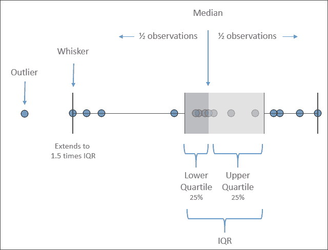

# 第三章：超越基础可视化

现在，你已经准备好开始创建更高级的可视化了！*高级*不一定意味着*困难*，因为 Tableau 使得许多可视化容易创建。*高级*也不一定意味着*复杂*。目标是传达数据，而不是用不必要的复杂性来掩盖它。

相反，这些可视化之所以是高级的，是因为你需要理解它们何时使用，为什么它们有用，以及如何利用 Tableau 的功能来创建它们。此外，我们将要查看的许多示例会介绍一些高级技巧，例如计算，以扩展基础可视化的实用性。许多这些技巧将在未来的章节中得到充分发展，所以现在不必担心试图吸收每个细节。

本章中的大多数示例都是设计成你可以跟随操作的。然而，别只是死记一套操作步骤。相反，花时间理解将不同类型的字段放到不同的架子上时，如何改变标题、轴和标记的呈现方式。尝试并偶尔偏离操作说明，看看还能实现什么其他的效果。你总是可以使用 Tableau 的返回按钮，再次查看示例！

在本章中，可视化将分为以下几个主要类别：

+   比较

+   日期和时间

+   将数据的部分与整体相关联

+   分布

+   多轴

你可能已经注意到前面列表中缺少空间位置或地理类别。地图功能在*第一章*，*使用 Tableau 起步*中介绍，我们将在*第十二章*，*探索地图和高级地理空间功能*中讨论一些高级的地理功能。

你可以通过使用 `Chapter 03 Starter.twbx` 工作簿来重建本章中的示例，或者从头开始，使用空白工作簿并连接位于 `Learning Tableau/Chapter 03` 文件夹中的 `Hospital Visits.csv` 文件。完成的示例可以在 `Chapter 03 Complete.twbx` 工作簿中找到。

我们将从评估哪些类型的可视化适用于定量比较开始。

# 比较数值

通常，你会想要比较不同类别中测量值之间的差异。你可能会问以下问题：

+   每个商店服务了多少客户？

+   每个风电场生产了多少能量？

+   每个医生看了多少病人？

在每个案例中，你都在尝试进行比较（无论是在商店、风电场还是医生之间），比较某些定量测量（客户数量、兆瓦电力、病人数量）。

让我们来看看一些可视化示例，这些示例有助于回答这类问题。

## 条形图

这是一个简单的条形图，类似于我们在*第一章*，*使用 Tableau 起步*中创建的图表：


图 3.1：显示按部门患者就诊次数的条形图

这个条形图使得在医院各个部门之间比较患者就诊次数变得容易。作为一个维度，**部门**根据每个不同数值（如**急诊**、**重症监护室**或**心脏科**）对数据进行切片。它为这些数值创建了一个标题，因为它是离散的（蓝色）。作为一个度量，**患者就诊次数**给出了每个部门的患者就诊总数。因为它是一个连续的（绿色）字段，它定义了一个轴，条形被渲染以可视化数值。

请注意，条形图按照患者就诊次数总和最高的部门在顶部，最低的在底部进行排序。对条形图进行排序通常会为分析增加很多价值，因为它使得比较和查看排名顺序变得更容易。例如，很容易看出**微生物学**部门比**营养学**部门有更多的患者就诊次数。如果图表没有排序，这可能不会那么明显。

您可以按以下方式对视图进行排序：

+   单击工具栏上的排序图标之一：这将导致根据定义轴的度量自动排序。导致新顺序的数据或筛选的更改将反映在视图中：

    图 3.2：工具栏排序图标

+   单击轴上的排序图标：当您悬停在轴上时，选项图标将变得可见，并在启用排序时保持在原位。这也将导致自动排序：

    图 3.3：轴排序图标

+   使用活动维度字段上的下拉菜单，选择**排序**以查看和编辑排序选项。您还可以选择**清除排序**以删除任何排序：

    图 3.4：使用下拉菜单进行排序

+   使用行的字段标签上的下拉菜单，选择所需的排序选项：

    图 3.5：按字段标签排序

+   拖放行标题以手动重新排列它们。这将导致一个不会随数据刷新而更新的手动排序。

所有这些排序方法都是特定于视图的，并将覆盖您在元数据中定义的任何默认排序。

## 条形图变体

一个基本的条形图可以通过多种方式扩展以实现各种目标。考虑以下变体：

+   使用子弹图表显示朝向目标、指标或阈值的进展

+   条中条图表以显示朝向目标的进展或比较类别内两个特定值

+   突出显示感兴趣的类别

### 子弹图表

**子弹图**（有时也称为**子弹图表**）是一种非常好的方式，可以直观地将一个度量值与目标、标准或阈值进行比较。条形表示度量值，而线表示目标。Tableau 还默认使用阴影表示到目标或阈值的**60%**和**80%**距离。该线和阴影是参考线，可以进行调整（我们将在未来的章节中详细探讨如何调整）。


图 3.6：子弹图的各个部分

在这个场景中，我们将考虑医院在收入目标方面的运营情况。医院管理部门为 2019 年设定了以下收入目标，现在希望了解每个部门的实际表现：


图 3.7：部门目标以电子表格形式存储，如下所示

患者访问和收入数据包含在`Hospital Visits.csv`中，收入目标则在`Hospital Goals.csv`中。这两个数据连接在**Data Model**中相关联，在`Starter`和`Complete`工作簿中都有。我们将在*第十三章*，*理解 Tableau 数据模型、连接和混合*中深入探讨数据模型。目前，只需使用`Hospital Visits & Revenue`数据源来完成本章中的示例。

我们将使用`Chapter 3`工作簿来构建子弹图，其中包含`Hospital Visits`和`Hospital Goals`电子表格数据源。我们将利用这两个数据源来可视化实际与目标服务分钟数之间的关系，按照以下步骤进行：

1.  转到**Average Minutes to Service (Bullet Chart)**工作表。

1.  创建一个按**Department**的总**Revenue**的基本条形图。

1.  按**Department**从高到低排序。

1.  按**Year**筛选**Date of Admit**，仅保留`2019`年的数据。此时，你的视图应如下所示：

    图 3.8：创建子弹图的中间步骤

1.  在**Data**面板中，选择`Hospital Goals.csv`表中的**Goal**字段。

1.  打开**Show Me**并选择子弹图。此时，Tableau 会使用视图中已有的字段以及你在数据面板中选择的`Goal`字段来创建子弹图。

当你使用**Show Me**创建子弹图时，有时可能会发现 Tableau 使用的字段顺序与你预期的相反（错误的度量值定义了轴和条形图，另一个定义了参考线）。如果发生这种情况，只需右键单击轴并选择**Swap Reference Line Fields**：


图 3.9：交换参考线字段选项

完整的子弹图应该如下所示：


图 3.10：完整的子弹图

完成的子弹图使我们能够看到哪些部门达成了目标，哪些部门落后了。接下来，让我们考虑如何进一步突出显示这一点。

#### 标出阈值

对于子弹图，视觉上标出未达到或未超过阈值的条形可能很有帮助。我们将在下一章深入探讨计算方法，但目前你可以按照以下步骤完成此示例：

1.  在**数据**窗格中使用下拉箭头，选择**创建计算字段...**：

    图 3.11：创建计算字段

1.  使用以下代码命名计算字段`目标达成？`：

    ```py
    SUM([Revenue]) >= SUM([Goal]) 
    ```

1.  点击**确定**，然后将新创建的`目标达成？`字段从数据窗格拖到**颜色**上。

当某个部门的`收入`值大于目标值时，计算返回`true`，否则返回`false`。将计算字段放到**颜色**上后，便可以很容易地看到哪些部门已经达成了 2019 年的目标：


图 3.12：已达到目标的部门在此子弹图中以高亮显示

颜色是吸引视觉注意力的最强方法之一。使用颜色时要有意图。决定你是否想突出显示良好的表现或差的表现。

### 条形图中的条形图

显示每个类别中两个值之间关系的另一种可能方式是条形图中的条形图。与子弹图一样，条形图中的条形图可以显示朝向目标的进展。它还可以用来比较任意两个值。例如，你可能会将收入与目标进行比较，或者将当前年份的收入与前一年进行比较：


图 3.13：条形图中的条形图

要创建此视图，请在同一个工作簿中继续并按以下步骤操作：

1.  导航到**年比年收入（条形图中的条形图）**工作表。

1.  将**收入**拖放到视图中的横轴上（这与将其拖放到**列**架上的结果相同）。

1.  将**部门类型**拖到**行**上。

1.  将**入院日期**拖放到**颜色**上。我们将在下一节详细讨论日期，但你会注意到，Tableau 使用日期的年份来生成一个堆叠条形图，结果如下所示：

    图 3.14：创建条形图中的条形图的中间步骤

1.  对于条形图中的条形图，我们不希望标记被堆叠。要关闭堆叠，可以使用主菜单选择**分析** | **堆叠标记** | **关闭**。

1.  现在所有条形段的起点都为`0`，某些条形可能完全遮盖其他条形。为了看到每个条形，我们需要调整另一个视觉元素。在这种情况下，按住*Ctrl*键，同时将当前位于**颜色**上的**入院日期的年份（YEAR(Date of Admit))**字段从**标记**卡片拖到**大小**上。

    在将字段从一个架子移动到另一个架子时，按住*Ctrl*键可以创建该字段的副本。

    完成前一步后，应该会出现一个大小图例。条形的大小将基于年份调整，我们将能够看到所有可用的段，即使它们重叠。

1.  我们希望**2019**位于前面，**2018**位于背景中，因此请将**2019**拖放到**大小**图例中，重新排列值，使得**2018**排在**2019**之后：


图 3.15：您可以拖放图例中的项目来重新排序它们

1.  双击**颜色**图例以编辑颜色，使**2019**更加突出。使用较深的橙色或蓝色来表示**2019**，并为**2018**选择浅灰色，这样效果很好（尽管您可能会找到其他您更喜欢的颜色组合！）。

此时，您的视图应该像本节开始时在*图 3.13*中展示的条形图那样。您可能希望通过以下方式进一步增强可视化效果：

+   为条形图添加边框。通过点击**颜色**货架并使用**边框**选项来实现。

+   调整大小范围，以减少大极值和小极值之间的差距。通过双击**大小**图例（或使用箭头下拉菜单并选择**编辑**）来完成此操作。

+   调整视图的大小。通过将鼠标悬停在画布上，直到鼠标指针变为大小调整光标，然后单击并拖动来调整视图的大小，来完成此操作。您还可能需要调整视图如何填充空间。使用工具栏上的下拉菜单并尝试不同选项：

    图 3.16：此下拉菜单确定当前视图的大小

+   隐藏大小图例。您可能会决定，大小图例对于这个特定视图没有增加任何价值，因为大小只是用来显示重叠条形图。要隐藏任何图例，请使用图例上的下拉箭头并选择**隐藏卡片**：

    图 3.17：图例的隐藏卡片选项

条形图中的条形图为您提供了另一种比较值的方式。接下来，我们将考虑一种变体，允许我们突出显示感兴趣的区域。

### 高亮显示感兴趣的类别

假设您在医院的主要职责之一是监控**ICU**和**新生儿科**部门的患者就诊次数。您不一定关心其他部门的细节，但您确实希望跟踪这两个部门与其他部门的比较。您可能会设计如下内容：


图 3.18：通过颜色高亮显示的两条条形图

现在，随着数据随时间刷新，您将能够立即看到您关注的两个部门与其他部门的比较。要创建此视图，请按以下步骤操作：

1.  转到**ICU 和新生儿科**工作表。

1.  将**部门**放置在**行**上，**患者就诊次数**放置在**列**上。将条形图按降序排序。

1.  点击视图中**ICU**的条形图，同时按住*Ctrl*键，点击**新生儿科**的条形图。

1.  将光标悬停在所选条形图之一上几秒钟，然后从出现的菜单中单击**创建组**按钮（看起来像一个图钉）：

    图 3.19：在 Ctrl + 单击两个条形图后，使用图钉图标将它们分组

    这将创建一个组，结果是在左侧数据窗格中命名为**部门（组）**的新维度。Tableau 会自动将此字段分配给**颜色**。

    Tableau 中的临时组非常强大。您可以在视图中创建组（就像之前所做的那样），也可以通过使用数据窗格中维度的菜单并选择**创建** | **组**来创建组。您可以像使用任何其他维度一样使用它们。

1.  仅为这两个部门的条形图添加标签，右键单击每个条形图并选择**标记标签** | **始终显示**。标记的标签将始终显示，即使为视图关闭其他标签或标签重叠标记或其他标签。

颜色将继续使监控变得容易。标签只会显示您选择的两个部门，并会随着数据的变化而更新。

现在我们已经考虑了条形图如何用于比较值，并且已经演示了几个变体的示例，让我们将注意力转向可视化日期和时间。

# 可视化日期和时间

在您的分析中，您经常会想要了解某事发生的时间。您会问类似以下的问题：

+   我们何时获得了最多的新客户？

+   利润是上升还是下降的趋势？

+   一天中哪个时间段的呼叫量最高？

+   我们在销售中看到了什么样的季节性趋势？

幸运的是，Tableau 使得这种视觉发现和分析变得容易。在本节中，我们将看看 Tableau 如何处理日期以及您可能可视化时间的各种方式。

## 日期部分、日期值和确切日期

当您连接到平面文件、关系型或抽取数据源时，Tableau 为任何日期字段提供了强大的内置日期层次结构。

Cube/OLAP 连接不允许 Tableau 层次结构。您需要确保所有您需要的日期层次结构和日期值在立方体中定义。

要查看此操作，请继续使用`第三章`工作簿，导航到`内置日期层次结构`工作表，并通过将**患者访问次数**拖放到**行**和**入院日期**拖放到**列**来创建一个类似于所示的视图。在**列**上的**YEAR(入院日期)**字段将有一个加号指示器，如下所示：


图 3.20：表示日期层次结构中年份部分的字段

当您悬停在标题上时，还会看到加号或减号指示器，如下所示：


图 3.21：可用于展开层次结构的列标题上的加号图标

单击它后，层次结构会通过在**列**的**YEAR(入院日期)**右侧添加**QUARTER(入院日期)**来展开，并且视图会扩展到层次结构的新级别：


图 3.22：显示了扩展的层级，包括年份和季度。

**入院日期（YEAR(Date of Admit))**字段现在有一个负号指示器，允许你将层级折叠回年份级别。**季度**字段也有一个加号，表示你可以进一步展开层级。从**年份**开始，层级如下：**年份** | **季度** | **月份** | **日期**。当字段是日期和时间时，你还可以进一步深入到**小时** | **分钟** | **秒**。层级中的任何部分都可以在视图中移动或完全移除。

层级由**日期部分**构成，这是日期字段的三种使用方式之一。当你右键点击视图中的日期字段或使用下拉菜单时，你将看到多个日期选项，如下所示：


图 3.23：活动日期字段上的下拉菜单展示了 Tableau 中日期的各个方面。

菜单中明显显示出三种主要的日期类型，尽管没有明确标注：

+   **日期部分**：此字段表示日期的特定部分，如季度或月份。日期的部分单独使用，并不参考日期的其他部分。这意味着，1980 年 11 月 8 日，当作为月份日期部分使用时，视图中只是**11 月**。视图中选择的**11 月**表示数据集中所有的 11 月，而患者就诊次数则是 2018 年和 2019 年的总和：

    图 3.24：此视图使用月份作为日期部分。患者就诊次数是按月份统计的总数，而不考虑年份。

+   **日期值**：此字段表示日期值，但会根据你选择的级别进行汇总或截断。例如，如果你选择**月份**作为日期值，那么 2019 年 11 月 8 日会被截断为月份和年份，变成**2019 年 11 月**。你会注意到，**2018 年 11 月**和**2019 年 11 月**在标题中各自有不同的值，并且有不同的条形图：

    图 3.25：此视图使用月份作为日期值。患者就诊次数是按月份统计的总数，考虑了年份。

+   **确切日期**：此字段表示数据中的确切日期值（如果适用，包括时间）。这意味着 1980 年 11 月 8 日凌晨 2:01 与 1980 年 11 月 8 日下午 3:08 是不同的。

需要注意的是，几乎所有这些选项都可以作为离散或连续字段使用。日期部分默认是离散的。日期值和确切日期默认是连续的。然而，你可以根据需要在离散和连续之间切换，以便在可视化中提供灵活性。

例如，要创建参考线，必须有一个轴（需要一个连续字段）。此外，Tableau 只会在行或列标题的最低级别连接线条。使用连续的日期值，而不是多个离散的日期部分，可以让你跨越多个年份、季度和月份连接线条。

作为快捷方式，你可以右键点击并将日期字段拖入视图中，这样在视图绘制之前会出现一个选项菜单，供你选择日期字段如何使用。

接下来，我们来考虑一些不同的日期和时间可视化方法。

## 日期和时间可视化的变体

使用各种日期部分和数值，并且甚至可以将它们组合使用，给你在创建独特而有用的可视化效果时提供了极大的灵活性。

例如，使用月份日期部分作为列，使用年份日期部分作为颜色，可以创建一个时间序列，使逐年比较变得非常简单。年份日期部分已经被复制到标签中，以便为线条添加标签：


图 3.26：逐月比较两年的数据

这种视图便于进行逐年比较。

点击**标记**卡片上的任何架，都会弹出一个选项菜单。这里，点击了**标签**，并调整了标签设置，使其仅在每条线的末尾显示。

以下热力图是使用不同架上的日期部分来实现有用分析的另一个示例。这种可视化方法在观察不同时间段的模式时非常有用，比如一天中的小时，或一个月中的周数。在这里，我们看到按月份和日期划分的患者入院数量：


图 3.27：显示按天和月份划分的患者访问强度的热力图

视图中没有包括年份，因此这是对所有数据中年份的分析，并帮助我们查看是否存在任何季节性模式或热点。我们可能会注意到与流行病、医生的排班或保险福利时机相关的模式。也许二月患者入院的强度增加与流感季节相对应。

请注意，将一个连续字段放置到**颜色**架上，导致 Tableau 完全填充了**行**和**列**的每个交点，并且使用了编码患者访问总数的颜色阴影。点击**颜色**架可以为我们提供一些微调选项，包括为标记添加边框的选项。在此视图中，已添加黑色边框，以帮助区分每个单元格。

## 甘特图

甘特图对于理解任何有持续时间的事件序列非常有用，尤其是当这些事件之间存在某种关系时。从视觉上来看，它们对于确定某些事件是否重叠、是否有依赖关系，或者是否比其他事件花费更多或更少的时间非常有帮助。

举个例子（未包含在工作簿中），以下甘特图展示了一系列在应用程序启动时运行的过程。其中一些过程并行运行，而有些则显然依赖于其他过程。甘特图清晰地展示了这些依赖关系：


图 3.28：显示每个过程开始时间及每个过程持续时间的甘特图

甘特图使用**甘特标记**类型，在**标记**卡的下拉菜单中选择。甘特条形图的起点由**行**上定义轴的字段的值确定。甘特条形图的长度由**大小**卡上的字段确定，正值向右延伸，负值向左延伸。

在医院中，你可能希望查看每个患者 2019 年到**急诊科**的就诊情况，并了解每次就诊持续了多久，是否有患者回到医院，和每次就诊之间的间隔时间。以下步骤给出了如何创建这样一个甘特图的示例：

1.  将**科室**放在**筛选器**上，并仅保留**急诊科**。

1.  将**入院日期**放在**筛选器**上，选择**年份**作为筛选选项，并仅保留**2019**。

1.  将**入院日期**放在**列**上，作为连续的**精确日期**或**天**值（不是**日部分**）。注意，Tableau 自动默认的标记类型是甘特条形图：

    图 3.29：在这种情况下，甘特条形图是自动的标记类型。

1.  将**医生**和**患者姓名**放在**行**上。结果是为每个患者按医生分组显示一行。甘特条形图代表了患者住院的情况。

    在大多数情况下，我们还希望在视图中添加一个唯一标识符，例如患者 ID，以确保那些恰巧同名的患者在可视化中能被区分开来。虽然在这个数据集中没有这个必要，因为所有的姓名都是唯一的，但在处理你自己的数据时，这可能至关重要。

1.  甘特条形图的长度是通过将一个持续时间字段放在**大小**架上来设置的。这个数据集中没有这样的字段。但是，我们有**出院日期**，并可以创建一个计算字段来表示持续时间。我们将在下一章详细介绍计算。现在，从菜单中选择**分析**，然后点击**创建计算字段...**。将字段命名为**住院天数**，并输入以下代码：

    ```py
    DATEDIFF('day', [Date of Admit], [Date of Discharge]) 
    ```

1.  新创建的计算字段会出现在数据面板的**度量**下。将该字段拖动到**大小**架上。现在你有了一个甘特图，显示了患者的入院时间以及每次就诊持续的时间。

考虑对**患者姓名**维度进行排序。例如，按字段排序，并选择**入院日期**作为最小值，这样你可以看到最早入院的患者排在顶部，而后来入院的患者排在底部。排序基于患者的最早（最小）入院日期，即使患者多次入院也是如此。排序是查看甘特图中模式的一个非常有用的技巧。

你的最终视图应该类似于以下内容：


图 3.30：最终的甘特图，展示了每个患者的入院时间、住院时长以及是否曾经再入院。

这种类型的图表在观察实体随时间变化的模式和关系时非常有用。

当在日期轴上绘制时，定义甘特图条形图长度的字段需要以天为单位。如果你想要可视化以小时或秒为单位的事件持续时间，避免使用`DATEDIFF`的`day`参数，因为它计算的是整天，无法准确反映小时和秒的细节。

相反，计算小时或秒之间的差异，然后再转换回天数。以下代码计算开始日期和结束日期之间的秒数，然后除以 86,400，将结果转换为天数，包括天数的分数部分：`DATEDIFF('second', [Start Date], [End Date]) / 86400`。

在充分理解 Tableau 如何处理日期和时间后，我们考虑了一些不同的可视化选项。接下来我们将重点关注如何可视化部分与整体之间的关系。

# 将数据的部分与整体相关联

在探索和分析数据时，你通常希望了解各个部分如何加总为整体。例如，你会问以下问题：

+   每种电力生产方式（风能、太阳能、煤炭和核能）对总能源生产的贡献是多少？

+   每个州的总利润占比是多少？

+   每个文件、子目录和目录在我的硬盘上占用了多少空间？

这些问题询问的是部分（生产方式、州、文件/目录）与整体（总能源、全国销售和硬盘）之间的关系。有几种类型的可视化和变体可以帮助你进行分析。

现在我们来看一些可视化示例，帮助我们思考如何展示部分与整体之间的关系。

## 堆叠条形图

我们在*第一章*《与 Tableau 一起起飞》中看过堆叠条形图，其中提到一个显著的缺点：很难跨类别比较数值。除了最左边（或最底部）的条形图外，其他条形图段有不同的起始点，因此它们的长度更难以比较。这并不意味着堆叠条形图绝对不能使用，但应谨慎使用，以确保沟通的清晰度。

在这里，我们使用堆积条形图来可视化整体组成。我们更关心的是查看组成某一类别的各部分，而不是在类别之间进行视觉比较。

例如，在医院里，我们可能想知道每种部门类型内的患者群体情况。也许每位患者在入院时都被分配了一个风险档案。

我们可以像这样，使用堆积条形图来可视化按风险档案分类的访问数量：


图 3.31：显示每个部门患者总数以及低风险和高风险患者细分的堆积条形图

这为每种部门类型的访问情况提供了一个不错的视图。我们可以看出，更多的人访问一般科室，而且**专科**和**实验室**的高风险患者数量差不多。**重症监护**接诊的高风险患者较少，整体患者数量也较少。但这只是部分情况。

考虑一个堆积条形图，它没有给出绝对值，而是为每种部门类型给出百分比：


图 3.32：显示每个部门内高风险和低风险患者相对数量的堆积条形图

比较之前的两个堆积条形图。几乎 50%的**重症监护**患者被认为是**高风险**的，这一点在两个图表中都很明显。然而，第二个图表使这一点一目了然。

两个图表中的数据没有变化，但第二个图表中的条形表示每种部门类型占总数的百分比。你无法再比较绝对值，但比较每种部门类型的相对细分变得更加容易。尽管**重症监护**的患者较少，但其中的高风险患者比例明显较高。

让我们考虑如何在 Tableau 中创建前述图表，甚至将它们合并为一个可视化图表。我们将使用一个快速的表格计算方法。关于表格计算，我们将在*第六章*，《深入表格计算》一章中详细讨论。在这里，只需按照以下步骤操作：

1.  通过将**部门类型**放到**行**上，**患者访问数量**放到**列**上，**患者风险档案**放到**颜色**上，来创建一个堆积条形图。现在你将得到一个单一的堆积条形图。

1.  将条形图按降序排列。

1.  通过按住*Ctrl*键并将**患者访问数量**字段拖动到**列**上，立即放置在当前字段右侧，来复制**列**上的**患者访问数量**字段。或者，你也可以从数据面板将字段拖放到**列**上。此时，你将有两个**患者访问数量**轴，从而实际上复制了堆积条形图：

    图 3.33：创建堆积条形图的一个中间步骤

1.  使用第二个**患者访问次数**字段的下拉菜单，选择**快速表格计算** | **占总数的百分比**。这个表格计算对数据源返回的值进行二次计算，以计算占总数的百分比。在这里，你需要进一步指定如何计算这个总数。

1.  使用相同的下拉菜单，选择**计算依据** | **患者风险档案**。这会告诉 Tableau 根据给定科室计算每个**患者风险档案**的百分比。这意味着每个科室的值加起来将为 100%。

1.  通过点击顶部工具栏上的**T**按钮来开启标签显示。这样会为每个标记打开默认的标签：

    图 3.34：此工具栏选项可以切换标签的显示与隐藏

按照前面的步骤操作后，你完成的堆叠条形图应如下所示：


图 3.35：包含绝对值和相对值的最终堆叠条形图视图

在同一个视图中同时使用绝对值和百分比，可以揭示一些可能仅通过其中一种图表无法显示的重要方面和细节。

## 树图

树图使用一系列嵌套的矩形来显示部分与整体的关系，特别是在层级关系中。树图在你拥有具有**高基数**（即大量不同值）的层级和维度时特别有用。

这里是一个树图的示例，展示了患者在医院中花费的天数。最大的矩形区域显示的是**科室类型**。在这些区域内，是科室和患者：


图 3.36：展示科室类型/科室/医生/患者的部分与整体关系的树图

要创建树图，你只需要将一个度量放到**大小**货架上，将一个维度放到**详细信息**货架上。你可以将其他维度添加到详细信息级别，以增加视图的细节。Tableau 会添加不同厚度的边框来分隔由多个维度创建的详细信息级别。请注意，在上面的视图中，你可以轻松看到科室类型的划分，然后是科室、医生，最后是单个患者。你可以通过点击**颜色**货架来调整最低级别的边框。

**Marks** 卡片上维度的顺序定义了树图如何分组矩形。此外，你可以将维度添加到行或列中，将树图切割成多个树图。最终的结果实际上是一个树图的条形图：


图 3.37：将一个维度添加到行中，实际上已经将树图变成了一个条形图

上述树状图不仅展示了能够拥有多行（或多列）树状图的能力，还展示了将多个字段放置在 **颜色** 货架上的技巧。这只能使用离散字段来实现。你可以通过按住 *Shift* 键同时将第二个字段拖动到颜色上，从而分配两种或更多颜色。或者，你可以点击 **Marks** 卡片上每个字段左侧的图标或空白处，来更改该字段使用的货架：


图 3.38：点击 **Marks** 卡片中字段旁边的图标，可以更改使用的货架类型

树状图、结合气泡图、词云图及其他一些图表类型，通常被称为 **非笛卡尔** 图表类型。这意味着它们在绘制时没有 *x* 或 *y* 轴，甚至不需要行或列标题。要创建这些图表类型，可以按照以下步骤操作：

+   确保在行或列中不使用连续字段。

+   使用任何字段作为 **大小** 的度量。

+   根据所需的图表类型更改标记类型：树状图使用正方形，气泡图使用圆形，词云使用文本（并在 **标签** 上放置所需字段）。

## 面积图

你可以把线形图的下方区域填充起来。如果有多条线，那么就把这些填充的区域堆叠在一起。这就是你可能会想象面积图的样子。

实际上，在 Tableau 中，你可能会发现很容易创建一张线形图，就像你之前做过的那样，然后将 **Marks** 卡片上的标记类型更改为 **面积**。任何放置在 **颜色**、**标签** 或 **详细信息** 货架上的维度都会创建堆叠在一起的面积块。**大小** 货架不适用于面积图。

作为示例，考虑以下按医院分支区分的患者就诊情况随时间变化的可视化：


图 3.39：按医院分支区分的患者就诊情况随时间变化的面积图

每一条带状区域代表不同的医院分支位置。在许多方面，这种视图是美观的，并且确实突出了数据中的一些模式。然而，它也存在与堆叠条形图相同的缺点。只有底部的带状区域（**南区**）可以通过轴上的数值进行读取。

其他带状区域被堆叠在上面，比较变得非常困难。例如，每年二月左右明显出现一个峰值。但这个峰值出现在每个分支吗？还是下方的某一带区域将上方的区域推高了？哪个带状区域的峰值最显著？

现在，考虑以下视图：


图 3.40：一个显示百分比而非绝对值的面积图

该视图使用了快速表计算，类似于堆叠条形图的例子。与第一个图表不同，现在无法看到尖峰。然而，显而易见的是，2019 年 2 月左右，**东部**分支（中间带状区域）看到的患者百分比急剧增加，并且该分支持续到年底仍然看到了大量患者。

通过选择不同的图表类型，理解数据故事中强调（或隐藏）的方面非常重要。你甚至可以在`Chapter 3`工作簿中实验，将第一个区域图更改为折线图。你可能会注意到，折线图能展示出尖峰，并能清晰地看到每个分支的患者访问数量的绝对增加与减少。每种图表类型都为数据故事贡献了某种特定的视角。

你可以通过更改**Marks**卡片上维度的排序顺序来定义区域堆叠的顺序。此外，你还可以通过在**Color Legend**中拖拽和放置它们，进一步调整顺序。

## 饼图

饼图还可以用来显示部分与整体的关系。要在 Tableau 中创建饼图，请将标记类型更改为**饼图**。这将为你提供一个**角度**货架，你可以用来编码度量。你放置在**Marks**卡片上的任何维度（通常是在**Color**货架上）都会定义饼图的切片：


图 3.41：展示按分支划分的总收入的饼图

请注意，前面的饼图使用收入的总和来定义每个切片的角度；总和越高，切片越宽。**医院分支**维度在切分度量并定义饼图的切片。这个视图还展示了将多个字段放置在**Label**货架上的功能。第二个**SUM(Revenue)**字段是你之前看到的总表计算的百分比。这使你可以看到收入的绝对值，以及它在整体中的百分比。

饼图在切片较少时表现较好。在大多数情况下，切片超过两到三个后就变得难以观察和理解。此外，作为一种良好的实践，按定义切片的维度进行排序。在前面的示例中，**医院分支**维度是通过按收入的`SUM`降序排序来设置的。此操作通过下拉菜单选项完成。这会导致切片按从大到小的顺序排列，使任何查看图表的人都能轻松地看到哪些切片较大，即使它们的大小和角度几乎相同。

在掌握了可视化部分与整体关系的一些技巧后，我们继续讨论如何可视化分布情况。

# 可视化分布

通常，单纯理解总数、和、甚至部分与整体的拆分只能提供整体情况的一部分。大多数时候，你会想要了解单个项目在所有相似项目的分布中的位置。

你可能会问以下问题：

+   每个顾客在我们的商店消费多少，这与其他顾客相比如何？

+   我们大多数病人住院多久？哪些病人超过了正常范围？

+   机器中的部件的平均寿命是多少？哪些部件的寿命超过平均值？是否有任何部件的寿命极长或极短？

+   学生的测试成绩是高于还是低于及格线？

这些问题有共同之处。在每种情况下，你都希望了解个体（顾客、病人、部件、学生）与群体的关系。在每种情况下，你可能有相对较多的个体。从数据角度看，你有一个维度（顾客、病人、部件、学生），代表着一个相对较大的人群，并且有一些度量（消费金额、住院时长、寿命、考试成绩）你希望进行比较。使用以下一种或多种可视化方式可能是一个不错的选择。

## 圆形图

圆形图是可视化分布的一种方式。考虑以下视图，它展示了每位医生在相同科室类型中，患者住院平均天数的比较：


图 3.42：显示每个科室类型中每位医生平均住院时间的圆形图

在这里，你可以看到哪些医生的病人平均住院时间更长或更短。还值得注意的是，某些类型的科室相比其他科室有更长的平均住院时间。这是有道理的，因为不同类型的科室有不同需求的病人。可能不令人惊讶的是，**重症监护**病人的住院时间通常较长。某些科室可能有不同的目标或要求。能够在同一类型的科室内评估医生，使得比较变得更加有意义。

要创建上述圆形图，你需要将字段放置在显示的货架上，然后只需将标记类型从**自动**（即条形图）更改为**圆形**。**科室类型**定义行，而每个圆形都绘制在**医生**级别上，后者位于**标记**卡片的**细节**级别。最后，若要添加平均线，只需切换到左侧窗格的**分析**标签并将**平均线**拖到视图中，特别是将其放在**单元格**选项上：


图 3.43：你可以通过从“分析”标签拖动到视图中，添加参考线及更多内容

你也可以点击结果中的某条平均线，并选择**编辑**以找到微调选项，例如标签。

### 抖动

当使用类似圆形图或其他类似类型的可视化时，你通常会看到标记重叠，这可能会导致部分真实情况被掩盖。你是否能仅凭眼力，确定**重症监护**中的医生中，哪些是高于平均水平的？哪些是低于平均水平的？或者是否可能有两个或更多的圆形完全重叠？一种减少这种情况的方法是点击**颜色**货架，为每个圆形添加一些透明度和边框。另一种方法是使用一种叫做**抖动**的技术。

**抖动**是数据可视化中一种常见的技术，它通过向可视化中添加一些故意的噪声来避免重叠，而不破坏所传达信息的完整性。Alan Eldridge 和 Steve Wexler 是 Tableau 中抖动技术的先驱之一。

各种抖动技术，如使用`Index()`或`Random()`函数，可以通过在 Tableau 论坛上搜索*抖动*，或者使用搜索引擎搜索*Tableau 抖动*找到。

这里使用了一种方法，通过`Index()`函数进行计算，并在**Doctor**字段上作为一个连续字段添加到**行**上。由于**INDEX()**是连续的（绿色），它定义了一个轴并使圆形标记垂直展开。现在，你可以更清楚地看到每个单独的标记，并更有信心认为重叠并未掩盖数据的真实图像：


图 3.44：这里 INDEX()已作为连续字段添加到行（表计算是沿着 Doctor 字段计算的）

在前面的视图中，由**Index**字段创建的垂直轴被隐藏。你可以通过使用定义该轴或标题的字段的下拉菜单并取消勾选**显示标题**来隐藏一个轴或标题。或者，你也可以右键单击视图中的任何轴或标题，选择相同的选项。

你可以在许多涉及绘制可能重叠的固定点的可视化中使用抖动技术，例如点图和散点图。接下来，我们将介绍另一种有用的分布可视化技术：箱型图和须状图。

## 箱型图和须状图

箱型图和须状图（有时简称为**箱型图**）为分布提供了额外的统计学背景。要理解箱型图和须状图，请参考以下图示：



图 3.45：箱型图和须状图的解释

这里，箱型图已被添加到圆形图中。箱子通过中位数被分割，这意味着一半的值位于中位数之上，另一半位于中位数之下。箱子还表示下四分位数和上四分位数，每个包含四分之一的值。箱子的跨度构成了**四分位距**（**IQR**）。须状线延伸至 1.5 倍的 IQR 值（或数据的最大范围）。任何超出须状线的标记都被视为离群值。

要添加箱线图，请使用左侧边栏的**分析**标签，将**箱线图**拖动到视图中。将其应用于我们在*图 3.42*中考虑的圆形图表，会得到以下图表：


图 3.46：应用于先前圆形图表的箱线图

箱线图帮助我们查看并比较中位数、数据范围、值的集中度以及任何异常值。你可以通过点击或右键单击箱线图的箱体或须，选择**编辑**来编辑箱线图。这将显示多个选项，包括如何绘制须线、是否仅显示异常值以及其他格式化选项。

## 直方图

显示分布的另一种方法是使用直方图。直方图看起来类似于条形图，但条形显示的是某个值的发生次数。例如，标准化测试的审计员在寻找成绩篡改的证据时，可能会构建一个学生考试成绩的直方图。通常，分布可能如下所示（未包含在工作簿中）：


图 3.47：考试成绩的直方图

测试成绩显示在*x*轴上，每个条形的高度表示获得该分数的学生人数。典型的分布通常具有可识别的钟形曲线。在这种情况下，一些学生表现不佳，而另一些学生表现非常好，但大多数学生的成绩在中间。

如果审计员看到像这样的结果，怎么办？


图 3.48：一个没有典型钟形曲线的直方图，提出了一些问题

显然有些问题。也许评分员将一些成绩接近及格的学生的分数提高到了刚刚及格的水平。也有可能这反映了主观评分中的偏差，而非明显的篡改。我们不应该急于下结论，但这种模式不正常，值得进一步调查。直方图在发现此类异常情况时非常有用。

现在我们已经看到了直方图的一个例子，让我们把注意力转回到医院数据，并进行一个例子操作。如果你想要可视化开始病人治疗所需的时间，以便观察不同患者群体的模式，你可以从空白视图开始，并按照以下步骤进行：

1.  点击选择数据面板中**度量**下的**服务分钟数**字段。

1.  如有需要，展开**Show Me**并选择直方图。

选择直方图后，Tableau 通过创建一个新的维度**服务分钟数（分箱）**来构建图表，该维度用于视图中，并与**服务分钟数**的`COUNT`一起呈现视图：


图 3.49：显示按服务分钟数分布的患者的直方图

**箱子**是度量值的范围，可以作为维度来切片数据。你可以将箱子看作是桶。例如，你可能会按 0-5%、5-10% 等查看考试成绩，或者按 0-10、10-20 等查看人们的年龄。你可以在创建时设置箱子的大小或范围，并在任何时候进行编辑。Tableau 还会基于一个算法，查看数据中存在的值，自动建议箱子的大小。Tableau 会为所有箱子使用统一的大小。

对于此视图，Tableau 自动将箱子的大小设置为 **3.47** 分钟，这个大小并不直观。你可以通过右键点击或使用数据面板中 **服务等待分钟数（箱子）** 字段的下拉菜单，选择 **编辑**，来尝试不同的值。结果窗口会提供一些信息，并允许你调整箱子的大小：


图 3.50：编辑数据箱的选项

这里举个例子，这是同一个直方图，每个箱子的大小为 2 分钟：


图 3.51：箱子大小为 2 的直方图

你可以看到曲线，其峰值出现在略低于 **20** 分钟处，然后逐渐下降，少数患者的等待时间长达 **40** 分钟。你可能会进行进一步的分析，例如查看基于患者风险档案，等待时间在大多数患者中的变化情况，如下图所示：


图 3.52：患者风险档案生成两行直方图，显示大多数高风险患者得到更快的护理（正如我们所期望的那样）

你可以通过右键点击一个数字字段并选择 **创建** | **箱子** 来创建新的箱子。你也可以通过选择箱子字段的 **编辑** 选项来编辑箱子的大小。

你还需要考虑想要为每个箱子计数什么，并将其放在 **行** 上。当你使用 **Show Me** 时，Tableau 将 **服务等待分钟数** 的 `COUNT` 放在了 **行** 上，这仅是对每个值不为空的记录进行计数。在这种情况下，这等同于对患者访问次数的计数，因为数据集中每条记录对应一次访问。然而，如果你想要计算唯一患者的数量，你可能考虑用 `COUNTD([患者 ID])` 替换视图中的字段。

就像日期一样，当视图中的箱子字段为离散时，下拉菜单中会有一个 **显示缺失值** 的选项。如果你使用离散的箱子字段，你可能希望使用此选项，以避免扭曲可视化并识别哪些值在数据中未出现。

我们已经看到了如何使用圆形图、直方图和箱型图来可视化分布。现在让我们将注意力转向使用多个轴来比较不同的度量。

# 可视化多个轴以比较不同的度量

通常，你需要使用多个轴来比较不同的度量，了解相关性，或在不同的细节级别上分析相同的度量。在这些情况下，你将使用具有多个轴的可视化。

## 散点图

散点图是理解两个度量之间关系的基本可视化类型。当你有以下类似问题时，可以考虑使用散点图：

+   我在营销上花费多少，真的对销售有影响吗？

+   每度加热/制冷会导致多少电力消耗的增加？

+   学习时间与考试成绩之间有相关性吗？

这些问题旨在理解两个度量之间的相关性（如果有的话）。散点图帮助你理解这些关系，并识别任何异常值。

考虑以下散点图，它用于寻找部门总收入与患者就诊次数之间的关系：


图 3.53：显示收入与患者就诊次数之间相关性的散点图

**部门**维度位于**文本**上，并定义了视图的详细级别。视图中的每个标记代表该部门的总**收入**和总**患者就诊次数**。

正如你所预期的，大多数部门在患者数量较多时收入较高。**神经科**和**心脏科**尽管患者量较少，但收入较高，表现突出。

寻找利用**大小**和**颜色**在散点图中编码附加数据的方法。例如，我们可以将**部门类型**添加到**颜色**中，看看相同类型的部门是否显示出相似的相关性。我们还可以将**大小**编码为平均住院天数，看看较高的收入是否也可以通过住院时间较长的患者来解释。

让我们考虑其他几种使用多个坐标轴的图表类型。

## 双轴图和组合图

Tableau 中的一个非常重要的功能是使用双轴的能力。散点图使用两个坐标轴，分别是*X*轴和*Y*轴。你还会在堆叠条形图示例中观察到，当多个连续的（绿色）字段彼此相邻放置在**行**或**列**上时，会出现多个并排的坐标轴。而双轴则意味着视图使用两个相对的坐标轴，共享一个面板。

这是一个使用**销售**和**利润**的双轴示例（不包含在工作簿中）：


图 3.54：一个双轴图表，指示哪个字段定义了哪个坐标轴

视图有几个关键特征，具体如下：

+   **销售**和**利润**字段位于**行**，表示它们通过共享一个平坦的侧面具有双轴。

+   **销售**和**利润**定义的轴位于视图的对立面。同时，请注意，它们并未同步，这在许多情况下可能会导致数据的扭曲展示。如果利润如此接近总销售额，那该有多好！但事实并非如此。要同步轴，请右键点击右侧轴并选择**同步轴**。如果该选项为灰色，可能是因为其中一个值是整数类型，另一个是小数类型。你可以通过右键点击数据窗格中的字段并选择**更改数据类型** | **数字（整数）** 或 **数字（小数）** 来更改其中一个字段的数据类型。

+   **标记**卡片现在是一个类似手风琴的控制界面，包含**所有**部分，以及**销售**和**利润**部分。你可以使用它来定制所有度量的标记，或专门定制**销售**或**利润**的标记。

要创建双轴，拖动并将两个连续（绿色）字段放置在**行**或**列**架旁边，然后使用第二个字段上的下拉菜单，选择**双轴**。或者，你也可以将第二个字段拖放到画布上，放置在现有轴的对面。

双轴可以与任何定义轴的连续字段一起使用。这包括数字字段、日期字段以及定义地理可视化的纬度或经度字段。对于纬度或经度，只需复制其中一个字段，并将其紧挨着自己放在**行**或**列**架上。然后，使用下拉菜单选择**双轴**。

**组合图**扩展了双轴的使用，叠加了不同的标记类型。这是可能的，因为**标记**卡片会提供编辑所有标记的选项，或为每个单独的轴定制标记。

当两个或更多连续字段并排放置在**行**或**列**架上时，可以使用多种标记类型。

作为**组合图**的一个例子，考虑以下可视化：


图 3.55：一种组合图，显示每个分支的就诊数为折线图，所有就诊数为柱状图。

这张图表结合了柱状图和折线图，展示了随时间变化的患者就诊总数（柱状图）以及按医院分支划分的患者就诊数（折线图）。这种可视化方式在提供额外上下文信息时非常有效。

关于该视图，有几个要点需要注意：

+   **颜色**架上的字段列出为**多个字段**，并且在**标记**卡片上为灰色。这表示在每个**标记**轴上，**颜色**使用了不同的字段。

+   该视图展示了在同一视图中混合不同细节层次的能力。柱状图是以最高级别绘制的（每月的患者就诊数），而折线图则以较低的级别绘制（每个分支的每月患者就诊数）。

+   该视图展示了在同一维度上多次使用相同字段（**患者访问**，在本例中）的方法（在此示例中，使用的是**行**）。

+   第二个坐标轴（右侧的**患者访问**字段）隐藏了标题，以去除视图中的冗余信息。你可以通过取消勾选视图中字段的**显示标题**选项，或右键点击你希望隐藏的坐标轴或标题来完成此操作。

双轴和组合图表为混合标记类型和细节层次提供了广泛的可能性，非常有助于生成独特的洞察力。在本书的其余部分中，我们将看到更多这些图表的示例。务必尝试这一功能，释放你的想象力，探索它能实现的所有可能性。

# 总结

在本章中我们已经涵盖了很多内容！你现在应该能够很好地理解何时使用某些类型的可视化。你提出的数据问题通常会引导你选择某种类型的视图。你已经探索了如何创建这些不同类型的视图，并学会了如何通过多种高级技术扩展基本的可视化方式，例如计算字段、抖动、多个标记类型和双轴。与此同时，我们还介绍了在 Tableau 中日期的相关细节。

希望本章中使用计算字段的示例能激发你进一步学习如何创建计算字段的兴趣。在 Tableau 中创建计算字段的能力为扩展数据分析、计算结果、定制可视化和创建丰富的用户交互性开辟了无限可能。接下来的两章，我们将深入探讨计算字段的使用，了解它们的工作原理以及它们能做出哪些令人惊叹的事情。
