# 第五章：利用详细程度计算

在考虑了逐行计算和聚合计算后，接下来我们将关注四种主要计算类型中的第三种：**详细程度计算**。

**详细程度计算**（有时称为 **LOD 计算** 或 **LOD 表达式**）允许你在指定的详细程度上执行聚合，这个详细程度可能与视图中定义的不同。你可以利用这个功能进行各种分析，这些分析在其他情况下可能会非常困难。

本章将涵盖以下内容：

+   详细程度概述

+   详细程度计算语法及其变体

+   `FIXED` 详细程度计算示例

+   `INCLUDE` 详细程度计算示例

+   `EXCLUDE` 详细程度计算示例

# 详细程度概述

**详细程度**是什么意思？这取决于术语的使用上下文。在 Tableau 中，我们将区分几种不同的详细程度，每种程度都至关重要，必须理解它们才能正确地分析数据：

+   **数据详细程度**：有时被称为数据的 **粒度**，这是由数据集中的一条记录定义的详细程度。当你能够阐明一条记录代表什么时（例如，“每条记录代表一个订单”或“每个客户有一条记录”），那么你就对数据的详细程度有了很好的理解。*逐行计算在这一层次操作*。

+   **视图详细程度**：我们之前讨论过，作为视图中维度的字段组合定义了视图的详细程度。通常，在视图中，Tableau 会为视图中所有维度的每个唯一值组合绘制一个标记（例如条形图或圆形）。例如，如果视图中的两个维度是 **客户** 和 **年份**，则 Tableau 会为数据中每个存在的 **客户**/**年份** 组合绘制一个标记（前提是没有被筛选器排除）。*聚合计算在这一层次操作*。

+   **计算的详细程度**：这是由计算定义的一个单独的详细程度。正如我们所看到的，你可以使用任意数量的维度来定义详细程度。*详细程度计算用于定义这个层次*。

考虑以下数据集，每条记录对应一个客户，**数据详细程度**为每个客户一条记录：

| **客户** | **州** | **会员日期** | **会员等级** | **订单数** |
| --- | --- | --- | --- | --- |
| Neil | Kansas | 2009-05-05 | Silver | 1 |
| Jeane | Kansas | 2012-03-17 | Gold | 5 |
| George | Oklahoma | 2016-02-01 | Gold | 10 |
| Wilma | Texas | 2018-09-17 | Silver | 4 |

在这种情况下，每条记录定义了一个唯一的客户。如果我们执行逐行计算，例如使用 `DATEDIFF('year'`, `[Membership Date]`, `TODAY())` 来确定每个客户成为会员的年数，那么结果将按记录计算。

现在考虑一个由数据创建的视图，该视图的 **视图级别详细程度** 是州：


图 5.1：州的视图级别详细程度

作为视图中唯一的维度，**State** 定义了视图的详细程度。每个州有一个标记，计算和用作聚合的字段，例如 **SUM(Orders)**，将按州执行。

基于这一特定观点，我们可能希望通过提出额外的问题来增强我们的理解，例如以下问题：

+   哪个客户是视图中每个州的第一个成员？

+   各州的订单数量与所有州的平均订单数量相比如何？

+   哪个会员级别在各州的订单数量最高或最低？

在每种情况下，问题涉及的详细程度不同于视图（每个州的最小会员日期与每个客户的比较、所有订单的平均数与各州订单的比较，以及每个州每个会员级别的最小或最大订单数）。在某些情况下，构建一个新的视图来回答这些问题可能是有意义的。但有时我们希望补充现有视图或在同一视图中比较不同的详细程度。详细程度计算提供了解决方案！

# 详细程度计算

在进入使用详细程度计算的实际示例之前，让我们先花一点时间理解详细程度计算的语法和类型。

## 详细程度语法

详细程度计算遵循以下基本语法模式：

```py
{FIXED|INCLUDE|EXCLUDE [Dim 1],[Dim 2] : AGG([Field])} 
```

前面声明的定义如下：

+   `FIXED`、`INCLUDE` 和 `EXCLUDE` 是指示详细程度计算类型的关键字。我们将在接下来的章节中考虑这些差异。

+   `Dim 1`、`Dim 2`（以及所需的其他维度）是以逗号分隔的维度字段列表，定义了执行计算时的详细程度。

+   `AGG` 是你希望执行的聚合函数（例如 `SUM`、`AVG`、`MIN` 和 `MAX`）。

+   `Field` 是将根据你选择的聚合方法进行聚合的值。

## 详细程度类型

Tableau 中使用三种类型的详细程度计算：**FIXED**、**INCLUDE** 和 **EXCLUDE**。

### FIXED

**Fixed** 详细程度表达式在代码中指定的维度列表定义的详细程度下工作，而不考虑视图中包含的维度。例如，以下代码返回各州的平均订单数量，无论视图中包含其他哪些维度：

```py
{FIXED [State] : AVG([Orders])} 
```

你可以根据需要包括任意多的维度，或者完全不包括任何维度。以下代码表示对数据源中整个数据集的平均订单数进行的固定计算：

```py
{FIXED : AVG([Orders])} 
```

或者，你也可以用以下方式编写计算，结果相同：

```py
{AVG([Orders])} 
```

没有指定维度的固定详细程度表达式有时被称为*表格范围的固定详细程度表达式*，因为在计算中定义的聚合将适用于整个表格。

### INCLUDE

**包含**详细程度表达式会在视图中由维度确定的详细程度层级上进行聚合，*同时*包括代码中列出的维度。例如，以下代码计算的是在视图中由维度定义的详细程度层级上的平均订单数，但即使`Membership Level`不在视图中，依然包括`Membership Level`这一维度：

```py
{INCLUDE [Membership Level] : AVG([Orders])} 
```

### EXCLUDE

**排除**详细程度表达式会在由视图中的维度决定的详细程度层级上进行聚合，*排除*代码中列出的任何维度。例如，以下代码计算的是在视图中定义的详细程度层级上的平均订单数，但不包括`Customer`维度，即使`Customer`在视图中存在：

```py
{EXCLUDE [Customer] : AVG([Orders])} 
```

## 详细程度差异的示意图

在分析数据时，你可能常常会想，数据片段是如何与整体情况相关联的。例如，你可能会想，视图中每个州的订单数量是如何与总体平均订单数相关的。一种快速且简单的方式是通过从**分析**标签中拖放，向视图中添加一个**平均线**，操作如下：

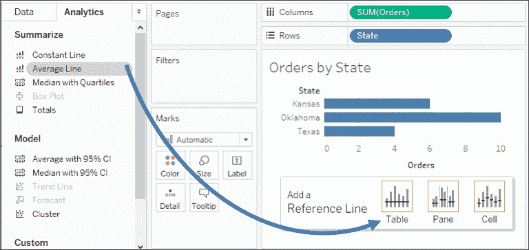

图 5.2：向视图添加平均线

你最终会得到如下的平均线：

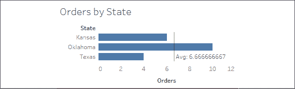

图 5.3：总体平均值报告为 6.66667。这是每个州的平均值

但是，`6.66667`真的是总体的平均订单数吗？事实证明，并不是。它实际上是每个州的订单数量之和的平均值：`(6 + 10 + 4) / 3`。很多时候，那条平均线（即每个州的订单总数的平均值）正是我们在使用聚合数据时希望对比的内容。

但是有时候，我们可能希望计算真实的总体平均值。为了获得整个数据集中的平均订单数，我们可以考虑创建一个名为`Overall Average Number of Orders`的计算，并使用类似下面的固定详细程度计算：

```py
{FIXED : AVG([Orders])} 
```

将该计算字段添加到**标记**卡的**详细信息**部分，并将参考线编辑为使用该字段，给我们带来了不同的结果：

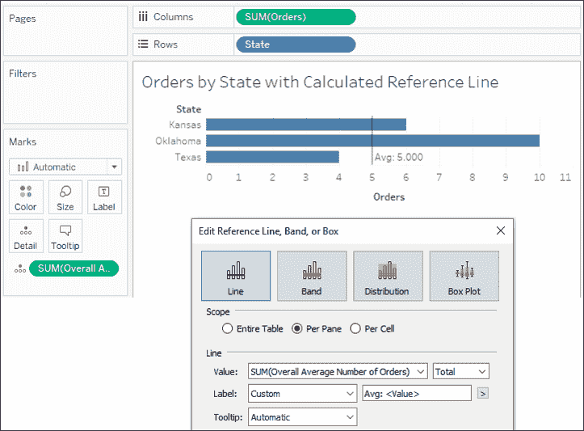

图 5.4：每位客户的真实总体平均订单数是 5

你会回忆起原始数据集有四条记录，快速检查可以验证这个结果：

```py
(1 + 5 + 10 + 4) / 4 = 5 
```

现在我们已经研究了详细程度计算如何带来实际差异；接下来让我们看一些实际的例子。

# 固定详细程度计算的示例

当我们将注意力转向一些关于细节级别计算的实际示例时，我们将使用`Chapter 05 Loans`数据集，该数据集包含在`Chapter 05`工作簿中。真实的数据集包含更多的记录，但这里是它所包含的某些数据示例：

| **日期** | **投资组合** | **贷款类型** | **余额** | **开盘日期** | **成员姓名** | **信用评分** | **年龄** | **州** |
| --- | --- | --- | --- | --- | --- | --- | --- | --- |
| 3/1/2020 | 汽车贷款 | 新车贷款 | 15987 | 9/29/2018 | Samuel | 678 | 37 | 加利福尼亚州 |
| 7/1/2020 | 抵押贷款 | 第一抵押贷款 | 96364 | 8/7/2013 | Lloyd | 768 | 62 | 俄亥俄州 |
| 3/1/2020 | 抵押贷款 | 房屋净值信贷（HELOC） | 15123 | 4/2/2013 | Inez | 751 | 66 | 伊利诺伊州 |
| 3/1/2020 | 抵押贷款 | 第一抵押贷款 | 418635 | 9/30/2015 | Patrick | 766 | 60 | 俄亥俄州 |
| 5/1/2020 | 汽车贷款 | 二手车贷款 | 1151 | 10/22/2018 | Eric | 660 | 44 | 宾夕法尼亚州 |
| … | … | … | … | … | … | … | … | … |
| … | … | … | … | … | … | … | … | … |

数据集代表银行、信用合作社或类似金融机构中成员的贷款历史数据。每条记录是贷款的月度快照，包含快照日期以及描述贷款的字段（**投资组合**，**贷款类型**，**余额**，和**开盘日期**）和描述成员的字段（**姓名**，**信用评分**，**年龄**，和**州**）。

与前几章一样，目标是理解关键概念和一些关键模式。以下仅是细节级别计算所呈现的所有可能性中的几个示例。

## 某个成员是否曾经处于风险中？

假设分行管理层已确定，任何曾经有过信用评分低于 550 的成员都被视为处于风险中，并有资格获得特别帮助。考虑以下三位个体的历史记录：

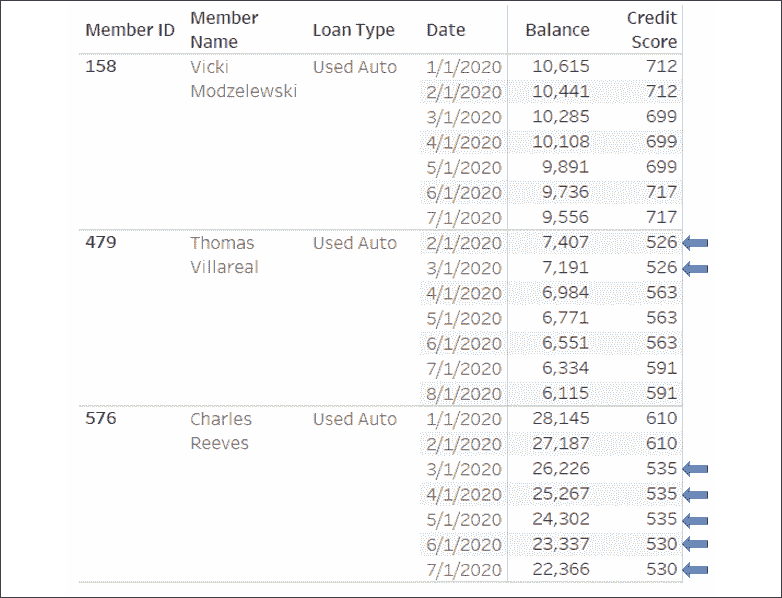

图 5.5：三位信用评分低于 550 的个体，信用评分低于阈值的部分通过箭头标出

每个月，都会记录新的历史快照。贷款余额通常会随着成员的信用评分变化。一些成员从未处于风险中。第一个成员 Vicki，她的最低信用评分为 699，且从未处于风险中。然而，Charles 和 Thomas 在历史中都有信用评分低于阈值的时段（在前述截图中以箭头标出）。

一个简单的行级计算，例如`[Credit Score] < 550`，可以识别每条记录，其中信用评分的月度快照显示存在风险。但那些信用评分在阈值上下波动的成员，其记录会交替为`TRUE`或`FALSE`。

我们希望给定成员的每一条记录如果*任何*记录低于阈值，则为`TRUE`，如果*没有*记录低于阈值，则为`FALSE`。

一种解决方案是使用一个细节级别计算，我们将其命名为`Member Ever at Risk?`，其代码如下：

```py
{FIXED [Member ID] : MIN([Credit Score])} < 550 
```

该计算确定了每个成员的最低信用分数，并将其与 550 的风险阈值进行比较。对于给定成员的每一条记录，结果是相同的，如下所示：

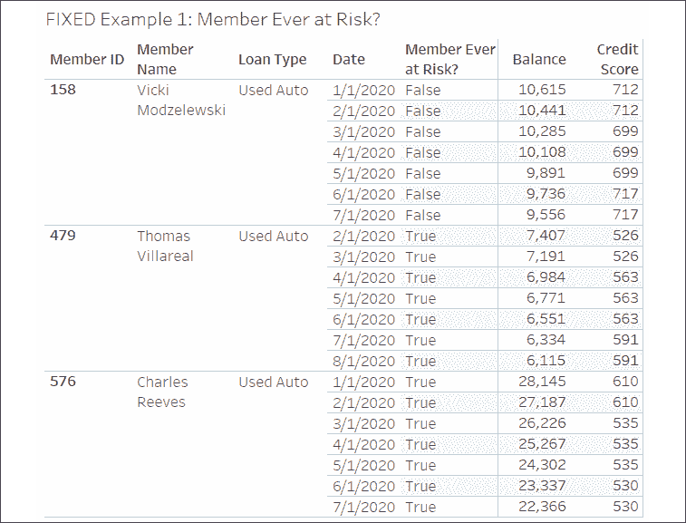

图 5.6：给定成员的所有记录中，Member Ever at Risk? 字段的值为 True 或 False

请注意，每条记录都包含相关成员的计算结果。这说明了固定细节层级计算的一个关键概念：*虽然计算是在定义的细节层级上进行的聚合，但结果是在行级别上的*。也就是说，`TRUE` 或 `FALSE` 的值是在成员级别计算的，但这些结果作为行级别的值对于该成员的每条记录都是可用的。

这为各种分析可能性提供了支持，例如：

+   仅过滤出处于风险中的成员，同时保留其历史的所有记录。如果你改为基于个人信用评分进行过滤，那么你将丧失那些信用评分高于阈值的历史记录。那些记录可能对你的分析至关重要。

+   正确统计成员是否处于风险中，并避免在历史波动的情况下将同一成员同时计入两种情况。

+   比较不同细节层级下处于风险中和不处于风险中的成员。例如，这个视图展示了按投资组合分类的处于风险中和不处于风险中的成员数量：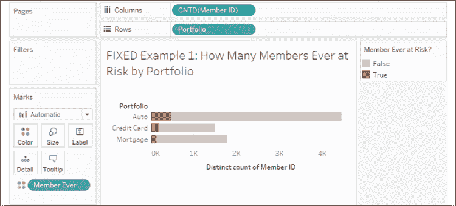

    图 5.7：我们可以通过一些交互展示有多少比例的成员曾经处于风险中

固定细节层级计算是上下文敏感的。也就是说，它们在某个上下文中进行操作，这个上下文要么是 1) 整个数据集，要么是 2) 由**上下文过滤器**定义的（即选择了下拉菜单中的**添加到上下文**选项的过滤器）。在这个例子中，这意味着如果不使用上下文过滤器，每个成员的计算值将不会发生变化。以 Thomas 为例，即使你应用了仅保留 2020 年 3 月之后的日期的普通过滤器，他仍然会被认为处于风险中。因为固定细节层级计算会跨整个数据集进行工作，并在 1 月和 2 月找到处于风险中的值。如果你将这种过滤器添加到上下文中，结果可能会发生变化。理解固定细节层级计算的这种行为有助于分析，但如果没有理解，也可能导致意外的行为。

这是通过细节层级计算简化的分析类型的一个示例。我们还能做更多的事情，接下来会看到另一个示例！

## 给定成员的最新余额

许多数据集包含一系列事件或交易历史。你可能会提出如下问题：

+   患者第一次去医院时常见的诊断是什么？

+   网络中每台计算机的最后一次报告状态是什么？

+   每个客户在他们的最后一笔订单上花费了多少？

+   本周的第一笔交易与最后一笔交易相比，赚了多少？

这些问题不仅仅是在问最早或最新的事件发生了什么。简单的`MIN`或`MAX`日期聚合就能提供答案。但这些问题的复杂性在于，除了要求最早或最新日期的详细信息外，还要求关于这些日期发生的更多内容。对于这类问题，详细级别计算提供了一种得出答案的方式。

请考虑以下三位成员的数据，这些数据包含在`Chapter 05 Loans`数据集中：

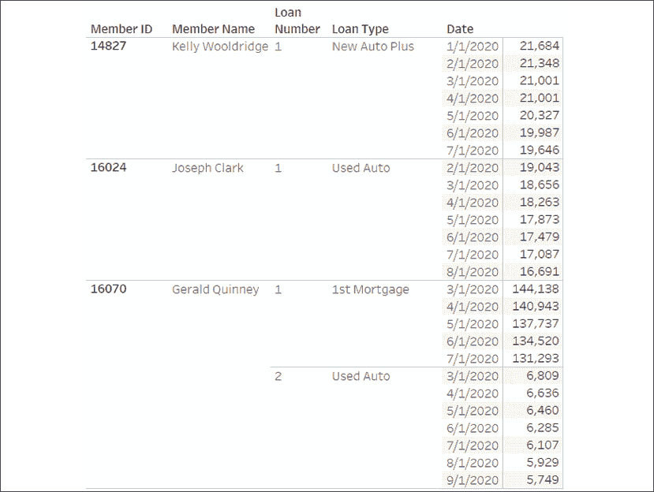

图 5.8：贷款数据集中三位选定成员的数据

每个成员都有每个贷款的余额历史。然而，每个贷款的最新历史日期是不同的。凯利的最新余额是七月，约瑟夫的最新余额是八月。杰拉尔德有两个贷款：第一个的最新余额是七月，第二个是九月。

如果你只想识别代表成员最新已知余额的记录怎么办？你可以考虑使用一个固定的详细级别计算，名为`Latest Date per Member/Loan`，代码如下：

```py
{FIXED [Member ID],[Loan Number] : MAX([Date])} = [Date] 
```

这决定了每个成员每个贷款的最大日期，并将结果与每行的日期进行比较，匹配时返回`TRUE`，否则返回`FALSE`。

在前面的计算中，使用了两个维度来定义详细级别，因为一个成员可能有多个贷款。如果你为每个贷款拥有唯一标识符，你也可以使用该标识符作为定义详细级别的单一维度。为了准确利用详细级别计算，你需要对数据有充分的理解。

你可以在这里查看计算结果：

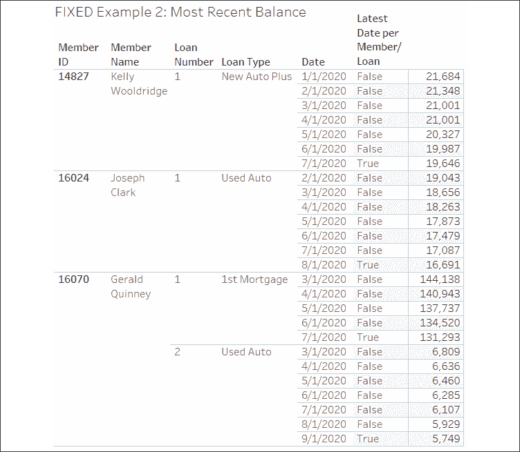

图 5.9：每个贷款每个人的最新日期通过计算的`True`值表示

如果你想要确定每个贷款的第一条记录，你只需将代码中的`MAX`改为`MIN`。你可以将详细级别计算的行级`TRUE` / `FALSE`结果作为过滤器，只保留最新的记录，或作为其他计算的一部分来完成分析，比如比较、起始余额和结束余额。

该计算展示的技术有许多应用场景。在数据*逐步传入*的情况下，你可以识别出最新的记录。在记录重复的情况下，你可以过滤掉，只保留第一条或最后一条记录。你可以识别客户的首次或最后一次购买。你还可以将历史余额与原始余额进行比较，等等！

我们刚刚看到如何利用固定详细级别计算来回答一些复杂的问题。接下来，我们将继续查看包含详细级别表达式。

# 包含详细级别表达式的示例

包含详细层次计算在你需要在低于（更详细的）视图层次进行某些计算时非常有用。让我们来看一个例子。

## 每个成员的平均贷款数

有些成员只有一笔贷款，有些则有两笔、三笔，甚至可能更多。如果我们想按州查看每个成员平均有多少笔贷款，该如何进行呢？让我们考虑一下该如何操作。

我们从一个视图层次为**州**的工作表开始：

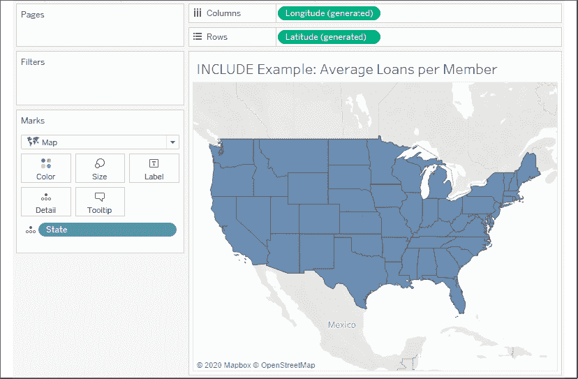

图 5.10：示例的起点—按州填充的地图

可视化每个州的平均信用评分或平均余额是相对简单的。但如果我们想要可视化每个州每个成员的平均贷款数量呢？虽然有多种方法可以解决这种问题，但我们将在此考虑使用以下名为`每个成员的贷款数量`的详细层次表达式：

```py
{INCLUDE [Member ID] : COUNTD([Loan Number])} 
```

这段代码返回了一个独特的贷款数量统计，统计的细节层次包括成员 ID 以及定义视图层次的所有维度（在此案例中是州）。当我们将计算添加到视图时，我们需要决定如何进行聚合。在此案例中，我们想要每个成员的平均贷款数量，因此我们将在字段的下拉菜单中选择**度量** | **平均值**，这将揭示一个有趣的地理模式：

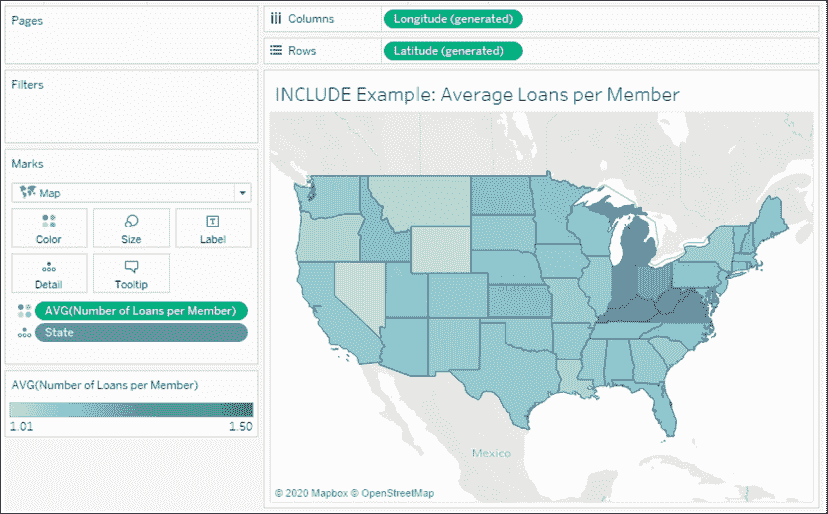

图 5.11：使用包含详细层次计算创建颜色渐变，以显示每个成员的平均贷款数

在你思考包含详细层次计算如何工作的同时，你可能想要在此层次构建一个交叉表：

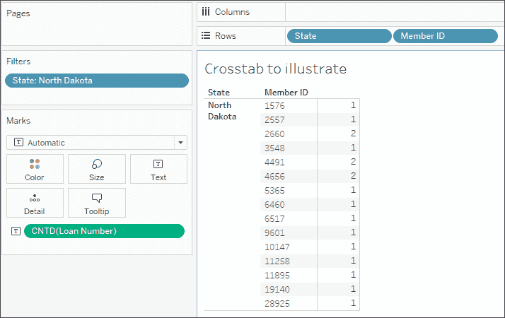

图 5.12：交叉表有助于说明如何将贷款的独特统计数用作平均值的基础

**州**，在**行**上的第一个维度，来自视图层次。**成员 ID**已被包含在交叉表中，以模拟包含在详细层次表达式中的维度。`COUNTD(Loan Number)`给出了每个成员的贷款数。将所有州内成员的值求平均，得到该州的平均数。快速检查**北达科他州**，我们得到每个成员平均 1.2 笔贷款，这与地图可视化完全一致。

在这种情况下，包含详细层次表达式为我们提供了一个有用的解决方案。虽然有其他的替代方法，但在考虑如何解决类似问题时，思考这些方法是非常有帮助的。我们接下来将考虑这些方法。

### 替代方法

值得注意的是，上面的数据集实际上允许你使用`MAX([Loan Number])`，而不是`COUNTD([Loan Number])`，因为贷款数会根据每个成员有多少笔贷款而递增。最大值与该成员的贷款数是相同的。在一个显著大的数据集中，`MAX`计算的性能会更好。

解决此问题还有一些其他方法，例如计算。例如，您可以编写以下代码：

```py
COUNTD(STR([Member ID]) + "_" + STR([Loan Number])) 
/ 
COUNTD([Member ID]) 
```

此代码计算贷款的唯一计数，并将其除以成员的唯一计数。为了计算贷款的唯一数量，代码通过将成员 ID 和贷款编号的字符串连接起来创建唯一键。

聚合计算的替代方法具有在视图的任何详细级别上都能工作的优势。您可能会发现详细级别计算或聚合计算更容易理解，您需要决定哪种方法能帮助您更好地保持思维流畅，在处理当前问题时更加得心应手。

另一种方法是使用固定的详细级别表达式，例如：

```py
{FIXED [State],[Member ID] : COUNTD([Loan Number])} 
```

此计算与包含表达式产生相同的详细级别，并使用相同的贷款编号的唯一计数。结果发现，在此数据集中，每个成员只属于一个州，因此州不一定需要包含在固定的详细级别表达式中。然而，如果您想改变详细级别，您需要调整计算，而使用包含表达式时，只需向视图中添加或删除维度即可。

在考虑了包含示例和一些替代方法后，让我们将注意力转向排除详细级别计算的示例。

# 排除详细级别计算的示例

排除详细级别计算在您希望在比视图详细级别更高（较少详细）的级别上执行某些计算时非常有用。以下示例将演示我们如何利用此功能。

## 每种贷款类型的平均信用评分

在此示例中，我们将回答以下问题：给定贷款类型的平均信用评分如何与整个投资组合的总体平均信用评分进行比较？

请看以下视图，其中显示了每种贷款类型的平均信用评分（其中贷款类型按投资组合分组）：

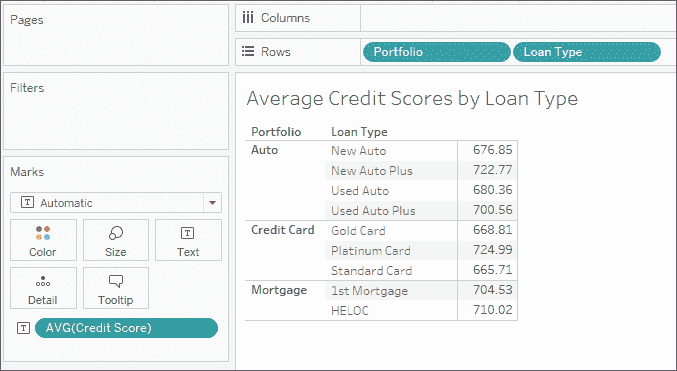

图 5.13：此交叉表显示每种贷款类型的平均信用评分

如果我们想将每种贷款类型的平均信用评分与整个投资组合的总体平均信用评分进行比较怎么办？我们可以通过如下所示的排除详细级别计算来实现这一点：

```py
{EXCLUDE [Loan Type] : AVG([Credit Score])} 
```

这将**贷款类型**从详细级别中移除，平均值仅在投资组合级别计算。这为我们提供了如下结果：

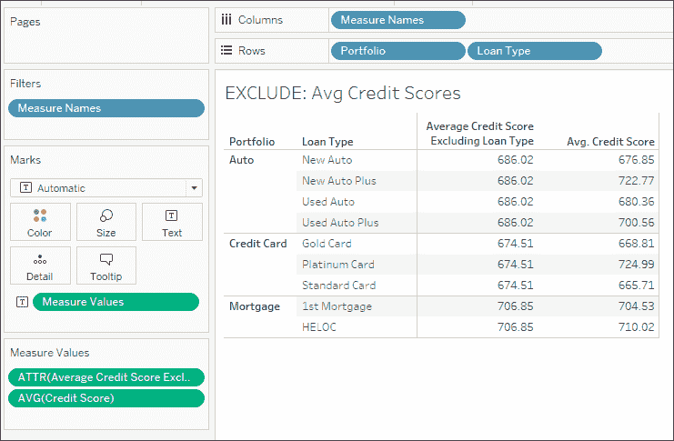

图 5.14：排除详细级别表达式删除了贷款类型，因此平均值仅在投资组合级别计算

你会注意到，排除贷款类型的平均值会为每个贷款类型重复。这是预期中的结果，因为整体平均值是在投资组合级别，而不受贷款类型的影响。按现有方式，这也许不是最有用的视图。但我们可以稍微扩展计算，以便给出整体投资组合平均值与每个贷款类型的平均值之间的差异。代码如下所示：

```py
AVG([Credit Score]) - AVG([Average Credit Score Excluding Loan Type]) 
```

这个计算会在视图的详细级别（贷款类型和投资组合）上取平均值，并减去投资组合级别的平均值，从而给出每个贷款类型的平均值与整个投资组合平均值之间的差异。我们可以重新排列视图，像这样直观地查看结果：

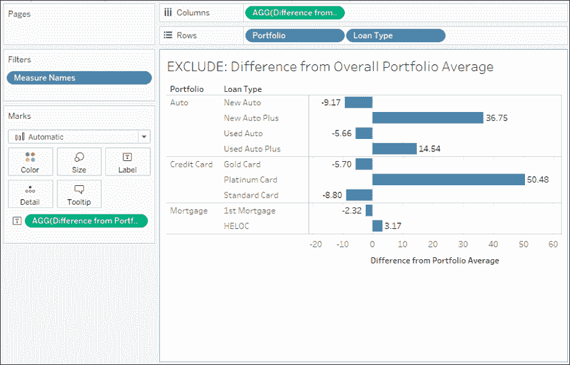

图 5.15：最终视图显示了贷款类型平均信用评分与整体投资组合平均值之间的差异

排除详细级别表达式使我们能够分析视图级别的详细信息与更高层次详细信息之间的差异。

# 总结

详细级别表达式极大扩展了你在计算中能做到的事情。你现在拥有了一个在不同详细级别处理数据的工具集。通过固定详细级别计算，你可以识别出系列中的第一个或最后一个事件，或者判断某个条件在整个数据子集中的状态。通过包含表达式，你可以在较低的详细级别进行工作，然后在视图中汇总这些结果。通过排除表达式，你可以在更高的详细级别进行工作，极大地扩展了分析的可能性。

在下一章中，我们将探讨最后一种主要的计算类型：**表格计算**。这些计算在解决问题的能力上是最强大的，它们为深入分析开辟了难以置信的可能性。实际上，它们从非常简单到极其复杂不等。
