# 第七章：制作既美观又实用的可视化

Tableau 默认应用了许多优秀的视觉实践，对于快速分析来说，你可能不需要过多担心改变这些默认设置。然而，在考虑如何最好地传达你所发现的数据故事时，你需要考虑如何利用一切，从字体和文本到颜色和设计，以便能够与观众有效沟通。

Tableau 的格式化选项提供了相当大的灵活性。字体、标题、说明、颜色、行列带状、标签、阴影、注释等等，都可以自定义，以使你的可视化讲述一个令人印象深刻的故事。

本章将涵盖以下主题：

+   可视化考虑因素

+   在 Tableau 中利用格式化

+   为可视化添加价值

当你思考为什么要调整某个可视化时，有几个方面需要考虑。我们将从这些考虑因素开始。

# 可视化考虑因素

从你开始将字段拖放到架子上，Tableau 就采用了良好的格式化和可视化实践。你会发现离散调色板使用了易于区分的颜色，字体令人愉悦，网格线在适当的位置较为淡薄，数字和日期遵循元数据中定义的默认格式设置。

默认格式化对于发现和分析来说已经足够。如果你的重点是分析，可能不需要花太多时间微调格式，直到你准备好分享结果。然而，当你思考如何将数据传达给他人时，你可能会考虑格式化的调整如何对数据故事的传达效果产生重大影响。

有时，你可能会有特定的格式化偏好，或者有一套公司指南来决定字体和颜色的选择。在这种情况下，你可以在一个空白工作簿中设置格式化选项，并将其保存为模板。每当你希望开始一组新的视图和仪表板时，可以复制这个工作簿文件。

以下是你应该考虑的一些事项：

+   **受众**：受众是谁，他们的需求是什么？

+   **目标**：目标是引发情感反应，还是为做出热烈的决策列出事实？你是在突出需要采取的行动，还是仅仅想引发对某个话题的兴趣？

+   **设置**：这是数据故事传达的环境。是一个正式的商业会议，格式应该体现高度的专业性吗？还是将要以非正式的方式分享到博客上？

+   **模式**：可视化将如何呈现？你需要确保行、列、字体和标记足够大，适合投影仪使用，或者足够紧凑，适合 iPad。如果你将数据发布到 Tableau Server、Tableau Online 或 Tableau Public，那么你是否选择了适合网络的安全字体？你是否需要使用设备设计器来为仪表板创建不同版本？

+   **情感**：某些颜色、字体和布局可以用来设置情感。数据是否讲述了一个应该激发某种反应的故事？数据故事是严肃的还是轻松的？例如，红色可能意味着危险、负面结果或表明需要采取某些行动。然而，你需要对你的观众和具体情境保持敏感。颜色在不同的文化和情境中有不同的含义。在一些文化中，红色可能表示喜庆或幸福。此外，如果红色是公司标志的颜色，那么它可能并不是传达负面情绪的好选择。

+   **一致性**：通常来说，在所有可视化中使用相同的字体、颜色、形状、线条粗细和行条带。尤其是当它们将在仪表板上一起查看或在同一个工作簿中使用时。这也特别适用于考虑如何在整个组织内保持一致性，而不显得过于死板。

这些考虑因素将指导你的设计和格式化决策。与使用 Tableau 的其他所有工作一样，把设计视为一个迭代过程。经常从你的目标观众那里获取反馈，并根据需要调整你的做法，确保你的沟通尽可能清晰和有效。格式化的最终目标是更有效地传达数据。

# 利用 Tableau 中的格式化

本章将重点介绍工作表级别的格式化，因为我们已经在*第二章*《在 Tableau 中连接数据》中涵盖了元数据，而*第八章*《用仪表板讲述数据故事》将涵盖仪表板和故事。然而，了解 Tableau 格式化的全局视角是有益的。

Tableau 使用默认格式，包括默认字体、颜色、阴影和对齐方式。此外，还有多个格式化级别可以进行自定义，如下图所示：

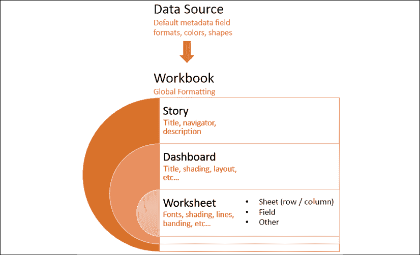

图 7.1：Tableau 中的格式化级别

让我们更详细地了解这些内容：

+   **数据源级别**：我们已经看过如何为数字和日期字段设置默认格式。其他默认设置，如颜色和形状，也可以通过数据面板中的下拉菜单上的**默认属性**菜单进行设置。

+   **工作簿级别**：可以设置各种全局格式选项。从菜单中选择**格式** | **工作簿**。

+   **故事级别**：导航到故事标签并选择**格式** | **故事**（或**故事** | **格式**）来编辑特定于故事元素的格式。这些包括自定义阴影、标题、导航器和描述的选项。

+   **仪表板级**：仪表板特定元素可以进行格式化。在查看仪表板时，选择**格式** | **仪表板**（或**仪表板** | **格式**）以指定仪表板标题、副标题、底纹和文本对象的格式。

+   **工作表级别**：我们将考虑各种选项。以下类型的格式化可用于工作表：

    +   **工作表格式化**：这种格式化包括字体、对齐、底纹、边框和线条。您可以覆盖整个工作表的格式化以进行行和列特定的格式化。

    +   **字段级格式化**：这种格式化包括字体、对齐、底纹以及数字和日期格式。这种格式化是特定于字段在当前视图中的显示方式。您在字段级别设置的选项会覆盖工作表级别设置的默认值。数字和日期格式也会覆盖默认字段格式化。

    +   **附加格式化**：可以应用于标题、说明、工具提示、标签、注释、参考线、字段标签等的附加格式化。

+   **富文本格式化**：标题、说明、注释、标签和工具提示都包含可以使用不同字体、颜色和对齐方式进行格式化的文本。这种格式化是特定于各个文本元素的。

让我们从检查工作簿级格式化开始。

## 工作簿级格式化

Tableau 允许您在工作簿级别设置某些格式化默认值。要查看选项并更改默认值，请单击**格式** | **工作簿...** 现在左侧窗格将显示工作簿的格式化选项：

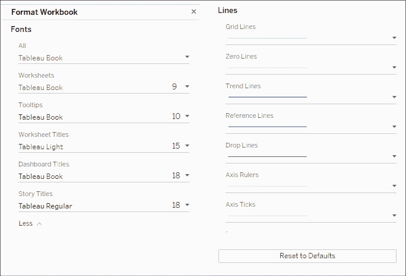

图 7.2：工作簿格式化选项

选项包括更改默认**字体**，适用于视图或仪表板的各个部分，以及默认**线条**，适用于可视化中使用的各种线条类型。还请注意**恢复默认值**按钮，如果您希望恢复默认格式化。这里的任何更改都将影响整个工作簿。

有时，您会希望应用于特定工作表的格式化，接下来我们将考虑这一点。

## 工作表级格式化

您已经看到如何在以前的章节中编辑元数据，我们将在未来的章节中详细介绍仪表板和故事。因此，我们将把注意力转向工作表级格式化。

在具体调整格式化之前，考虑与格式化相关的视图的以下部分：

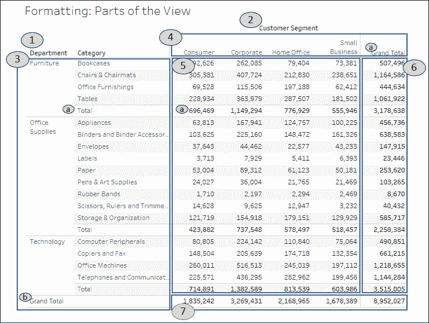

图 7.3：使用工作表级格式化可以进行格式化的视图部分

此视图由以下部分组成，可以进行格式化：

1.  **行的字段标签**：可以通过菜单（**格式** | **字段标签...**）或右键点击视图中的字段标签并选择**格式...**来进行格式设置。此外，您也可以通过菜单（**分析** | **表格布局**，然后取消勾选显示字段标签的选项）或右键点击视图中的字段标签并选择隐藏选项来隐藏字段标签。如果需要，您可以使用**分析** | **表格布局**菜单选项重新显示它们。

1.  **列的字段标签**：这些字段标签与行的标签选项相同，但它们可以独立于行字段标签进行格式设置或显示/隐藏。

1.  **行标题**：这些标题将遵循一般标题的格式设置，除非您为行单独指定不同的标题格式。请注意，小计和总计也有标题。小计和总计的标题分别标记为**a**和**b**。

1.  **列标题**：这些标题将遵循一般标题的格式设置，除非您为列单独指定不同的标题格式。请注意，小计和总计也有标题。在前面的截图中标记的总计标题就是列标题。

1.  **面板**：许多格式设置选项包括将面板与标题进行不同格式设置的功能。

1.  **总计（列）面板**：这是用于总计的面板，可以在工作表或列级别进行格式设置。

1.  **总计（行）面板**：这是用于总计的面板，可以在工作表或行级别进行格式设置。

工作表级别的格式设置是通过格式窗口完成的，格式窗口会出现在左侧，取代数据面板的位置。

要查看格式窗口，请从菜单中选择**格式**，然后选择**字体...**、**对齐...**、**阴影...**、**边框...**或**线条...**：


图 7.4：工作表的格式选项

您还可以右键点击视图中的几乎任何元素并选择**格式**。这将打开特定于所选元素上下文的格式窗口。只需确保格式窗口的标题与您的预期一致。当您进行更改时，视图应立即更新以反映您的格式设置。如果没有更新，您可能是在格式窗口的错误选项卡中工作，或者您可能在较低级别（例如**行**）进行格式设置，这会覆盖在较高级别（例如**工作表**）所做的更改。

现在您应该能够在左侧看到格式窗口，在这种情况下是**格式字体**。它看起来应该是这样的：

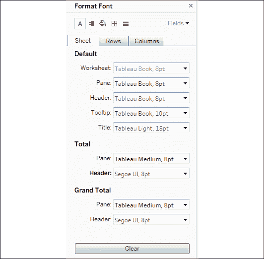

图 7.5：格式字体面板

注意格式窗口中的以下关键方面：

+   窗口的标题将为您的格式选择提供上下文信息。

+   顶部的图标与**格式**菜单的选择项相匹配。这使您可以轻松地浏览这些选项，而无需每次都返回菜单。

+   三个标签，**工作表**、**行**和**列**，允许你在工作表级别指定选项，然后在行和列级别覆盖这些选项和默认值。例如，你可以为**行**总计设置不同于**列**总计的窗格和标题字体（尽管这种选择可能会显得突兀，不推荐使用！）。

+   右上角的**字段**下拉菜单允许你在字段级别进行格式微调。

+   你所做的任何更改都会预览，并通过加粗标签显示，表明该格式选项已经从默认设置进行了更改（注意到**总计**下的**标题**字体已被自定义，导致**标题**标签文字显示为加粗）。

清除格式的三种选项如下：

**清除单个选项**：在格式窗口中，右键单击你已更改的任何单个选项的标签或控件，然后从弹出菜单中选择**清除**。

**清除所有当前选项**：在格式窗口底部，点击**清除**按钮以清除所有可见的更改。此操作仅适用于你当前在格式窗口中看到的内容。例如，如果你在**行**标签上查看**阴影**并点击**清除**，那么仅**行**标签上的阴影选项会被清除。

**清除工作表**：从菜单中选择**工作表** | **清除** | **格式**。你也可以通过工具栏上的**清除**项目的下拉菜单来实现。这将清除当前工作表上的所有自定义格式。

其他格式选项（如对齐和阴影）与字体选项的工作方式非常相似。只有少数细节需要注意：

+   **对齐**包括水平和垂直对齐、文本方向和文本换行的选项。

+   **阴影**包括行和列带状效果的选项。带状效果允许交替的阴影模式，帮助区分或分组行和列。默认情况下，文本表格启用了浅色行带状效果，但在其他可视化类型中也可能有用，例如水平条形图。行带状效果可以设置为不同的级别，级别与**行**或**列**架上出现的离散（蓝色）字段数对应。

+   **边框**指的是绘制在单元格、窗格和标题周围的边框。它包括行和列分隔符选项。你可以在视图中看到部门之间的分隔符。默认情况下，边框的级别是基于行或列中的倒数第二个字段设置的。

+   **线条**指的是通过坐标轴绘制的线条。这包括网格线、参考线、零线和坐标轴标尺。你可以从菜单的**格式**选项访问更多完整的参考线和掉线选项。

我们已经考虑了如何在整个工作簿级别以及特定工作表级别调整格式。现在，让我们将注意力转向字段级别的格式调整。

## 字段级格式

在格式窗口的右上角有一个小的下拉菜单，标签为 **字段**。选择该下拉菜单会显示当前视图中的字段列表，选择一个字段会更新格式窗口，以显示适合该字段的格式选项。例如，这是 `SUM(Sales)` 字段所显示的窗口：

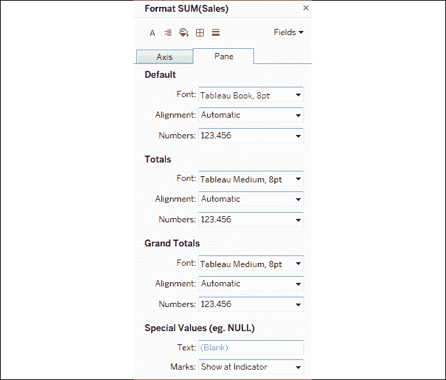

图 7.6：字段级格式化的格式窗格

格式窗口的标题会提醒你正在格式化的字段。从窗口左上角选择 **字体**、**对齐方式** 等图标将切换回工作表级别的格式设置。但是，你可以在 **轴** 和 **窗格** 选项卡之间切换。这两个选项卡允许你对字段在标题或作为轴标签使用时与在视图窗格中的格式进行不同的格式设置。字段的选项包括 **字体**、**对齐方式**、**阴影** 以及 **数字** 和 **日期** 格式。最后两个选项将覆盖任何默认的元数据格式。

你会注意到某些类型字段有特殊的格式选项。数字字段支持广泛的格式化选项，甚至包括自定义格式化功能，接下来我们将讨论这个。

### 自定义数字格式

当你更改数字格式时，可以从几种标准格式中选择，也可以选择自定义格式。自定义格式允许你输入一个格式字符串，Tableau 将根据该字符串来格式化数字。你的格式字符串可以使用井号/符号（*#*）、逗号、负号和括号的组合，同时可以使用被引号括起来的文字字符串来指示数字的显示方式。

格式字符串最多可以包含三个条目，用分号分隔，分别表示正数、负数和零的格式。

这里有一些示例，假设正数为 `34,331.336`，负数为 `-8,156.7777`：

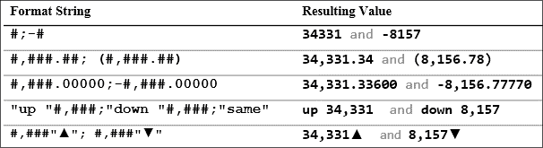

图 7.7：格式字符串示例及结果值

你可以通过 `Starter` 或 `Complete` 工作簿中的 **自定义数字格式** 视图来复制这些示例并尝试其他格式字符串：

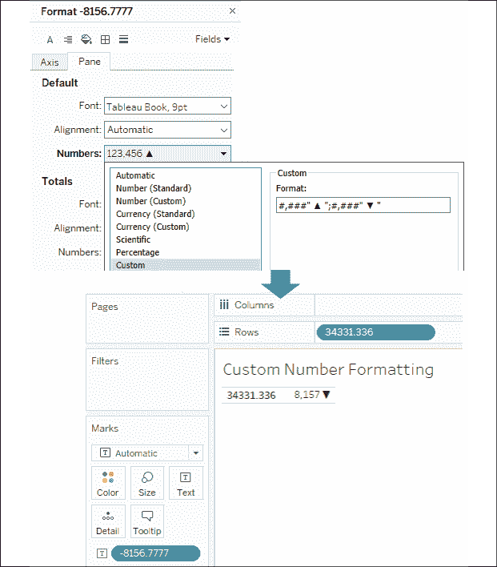

图 7.8：在第七章工作簿中使用自定义数字格式视图实验格式字符串

注意 Tableau 如何根据格式字符串对数字的显示进行四舍五入。请始终注意，你在文本、标签或标题中看到的数字可能由于格式设置而被四舍五入。

还可以观察到，你可以将格式字符（如井号、逗号和小数点）与字符串混合使用。所示的第四个示例将提供一个标签，其中零值通常会显示在该位置。

最后，注意最后一个示例使用了 Unicode 字符，这为你提供了广泛的可能性，例如显示度数或其他单位的测量。Unicode 字符可以在 Tableau 中的文本框、标题、字段名称和标签、别名等地方使用！

选择一个接近你想要的预定义格式，然后切换到自定义格式，可以让你从一个接近你所需格式的自定义格式字符串开始。

### 自定义日期格式化

以类似的方式，你可以使用自定义字符串定义自定义日期格式。下表说明了基于不同格式字符串对日期值 11/08/2018, 1:30 PM 的一些可能格式化：

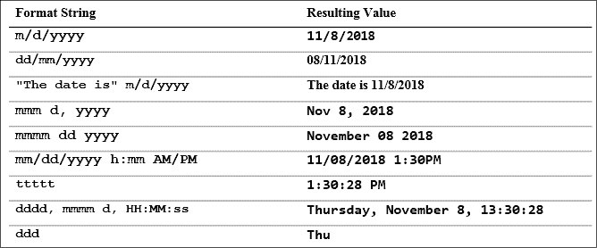

图 7.9：一些可能的日期格式示例

这些仅仅是示例，你可以根据需要添加任意多的字面字符串。

查看自定义日期格式字符串选项的完整列表，请访问 [`onlinehelp.tableau.com/current/pro/desktop/en-us/dates_custom_date_formats.html`](https://onlinehelp.tableau.com/current/pro/desktop/en-us/dates_custom_date_formats.html)。

注意，在这个示例中，应用某些自定义日期格式如何提高轴线的可读性：

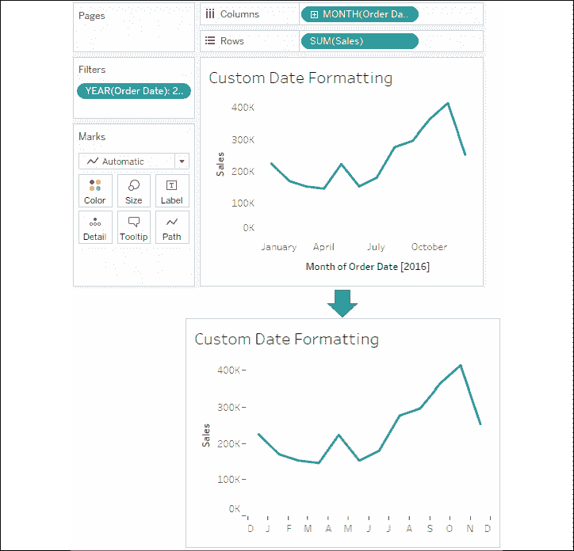

图 7.10：这里使用的自定义格式字符串是 mmmmm，这会将月份表示为单个字母。

当你有需要格式化的数值时，自定义数字和日期格式是可以使用的。但如果没有数值呢？也就是说，如何格式化`NULL`值？我们接下来来探讨这个问题。

### 空值格式化

格式化字段的另一个方面是特别格式化**空值**。当格式化字段时，选择**窗格**标签并找到**特殊值**部分，如以下截图所示：


图 7.11：格式窗格中出现的特殊值选项

在字段值为空时，输入你希望在窗格中显示的任何文本（在**文本**字段中）。你还可以选择标记显示的位置。**标记**下拉菜单提供了多种选项，用于定义当使用轴时空值的标记应如何绘制。你有以下选项：

+   **在指示器处显示**会在视图的右下角显示一个小指示器，标明空值的数量。你可以点击该指示器选择过滤空值或将其显示为默认值。你也可以右键点击该指示器将其隐藏。

+   **显示为默认值**将在默认位置（通常为 0）显示标记。

+   **隐藏（连接行）**不会为空值放置标记，但会连接所有非空值之间的线条。

+   **隐藏（断开行）**会在不显示空值的位置打断行。

你可以在以下截图中看到这些选项，两个空值的位置由灰色带标示。

**在指示器处显示**不会在灰色区域显示标记，但会在右下角指示空值的数量：

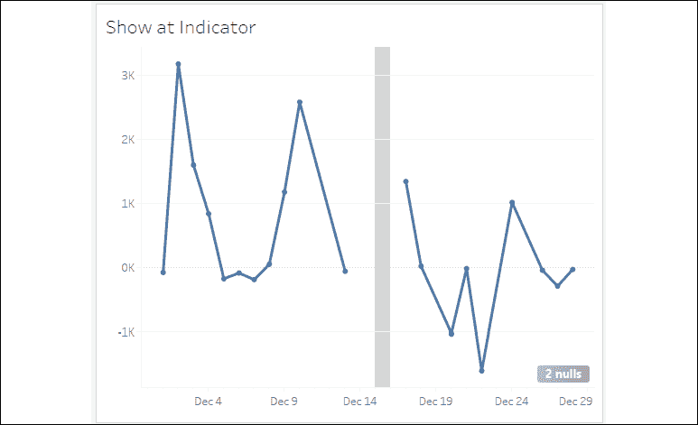

图 7.12：在指示器处显示

**显示为默认值**将在`0`处放置标记并连接线条：

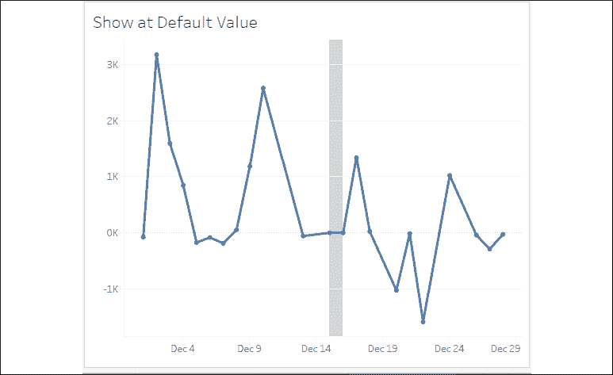

图 7.13：显示为默认值

**隐藏（连接线条）**移除缺失值的标记，但会连接现有的标记：

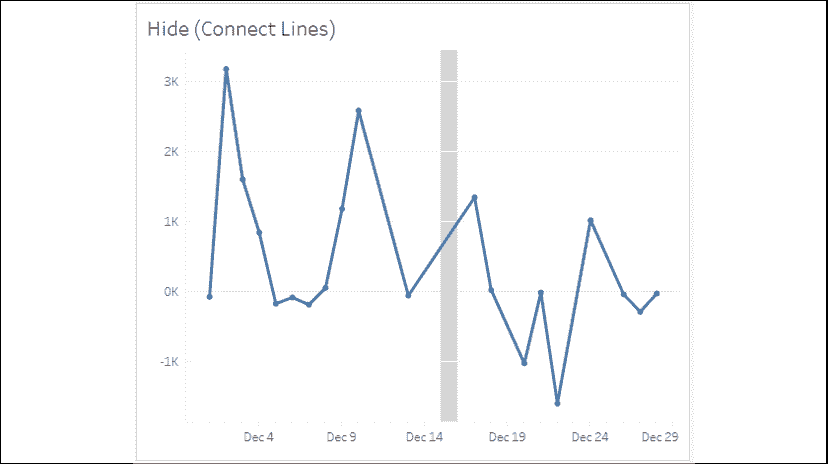

图 7.14：隐藏（连接线条）

**隐藏（断开线条）**移除缺失值的标记，并且不连接现有的标记：

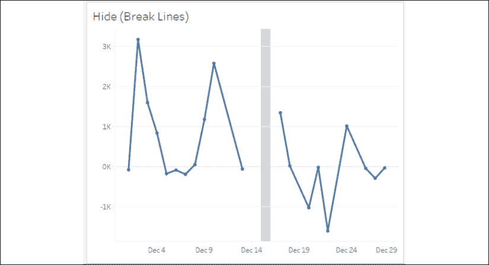

图 7.15：隐藏（断开线条）

这些选项中的任何一个可能都能很好地使用，但需要考虑每个选项如何传达信息。连接线条可能有助于传达随时间变化的趋势，但也可能会减少缺失数据的显示。断开线条可能有助于突出缺失值，但可能会削弱整体信息。你需要根据本章开始时提到的考虑因素，决定哪个选项最符合你的目标。

你会注意到，之前的折线图在视图中每个标记的位置都有小圆圈标记。当标记类型为线条时，点击颜色架会打开一个菜单，提供标记的选项。所有标记类型都有标准选项，如颜色和透明度。一些标记类型支持其他选项，如边框和/或光环，正如这里所示：

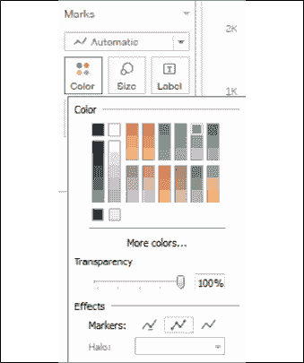

图 7.16：向线条添加标记

了解这些选项将帮助你在思考如何传达缺失数据时做出决策，但始终要记得，另一种可视化类型，如条形图，可能在传达缺失值方面更加有效：

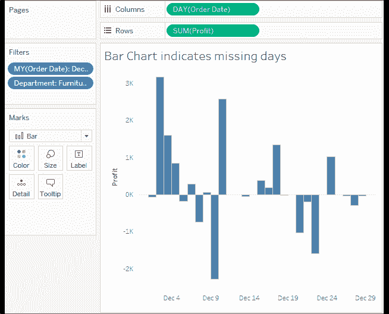

图 7.17：条形图有时比折线图更适合展示缺失值

了解如何格式化空值为你提供了一些选项，帮助你考虑如何传达数据。我们来看一下几个额外的选项。

## 其他格式化选项

还可以通过格式窗口访问其他格式化选项。这些选项包括以下内容：

+   **参考线**的众多选项

+   **下拉线**的线条和文本选项

+   **标题**和**说明**的阴影和边框选项

+   **注释**的文本、框和线条选项

+   **字段**标签的字体、阴影、对齐和分隔符选项

+   **图例**、**快速筛选**和**参数**的标题和主体选项

+   **单元格**大小和**工作簿**主题选项

你会发现这些选项大多数比较直观。一些选项可能不太明显：

+   **下拉线**，即从标记到坐标轴的连线，可以通过右键点击视图中带有坐标轴的空白区域并选择**下拉线** | **显示下拉线**来启用。使用相同的右键菜单并选择**编辑下拉线**，可以访问其他选项。下拉线仅在 Tableau Desktop 和 Reader 中显示，但在视图发布到 Tableau Server、Online 或 Public 时不可用。

+   **标题**和**说明**可以通过从菜单中选择**工作表**并选择所需选项来显示或隐藏。除了可以应用于标题和说明的标准格式外，还可以通过双击标题或说明、右键点击标题或说明并选择**编辑**，或通过使用标题或说明的下拉菜单（或仪表板视图的下拉菜单）来编辑和专门格式化标题或说明的文本。标题和说明的文本可以动态地包括参数的值、视图中任何字段的值，以及某些其他数据和工作表特定的值。

+   **注释**可以通过右键点击视图中的标记或空白区域，选择**注释**，然后选择以下三种注释类型之一来创建：

    +   **标记**注释与视图中的特定标记相关联。如果该标记未显示（由于过滤器或坐标轴范围），则注释也不会显示。标记注释可以显示定义标记或其位置的任何字段的值。

    +   **点**注释固定在视图中的特定点上。如果该点在视图中不可见，则注释将消失。点注释可以显示定义点位置的任何字段值（例如，坐标轴的坐标）。

    +   **区域**注释包含在一个矩形区域内。所有注释的文本可以动态地包括参数的值，以及某些其他数据和工作表特定的值。

您可以通过在查看源工作表时，从**格式**菜单中选择**复制格式**，将格式从一个工作表复制到另一个工作表（无论是在同一工作簿内还是跨工作簿）。然后，在查看目标工作表时，从**格式**菜单中选择**粘贴格式**（或者从目标工作表标签的右键菜单中选择该选项）。

该选项将把源工作表上所有的自定义格式应用到目标工作表。然而，在编辑标题、说明、标签和工具提示的文本时所应用的特定格式不会被复制到目标工作表。

我们现在已经考虑了格式化工作簿、单独工作表、字段、数字、日期和空值的许多选项。接下来，让我们考虑如何利用其中一些技巧来真正帮助我们更好地理解数据。

# 为可视化添加价值

现在我们已经了解了 Tableau 中格式化的工作方式，接下来我们来看看格式化如何为可视化增加价值。

在应用自定义格式时，始终问问自己格式化到底为数据理解带来了什么。它是否使可视化更清晰、更易理解？还是只是在增加杂乱和噪音？

一般来说，尝试采用简约的方式。从可视化中移除所有不必要的内容。强调重要的数值、文本和标记，同时降低那些仅提供支持或上下文的内容的重点。

请考虑以下可视化，均使用默认格式：

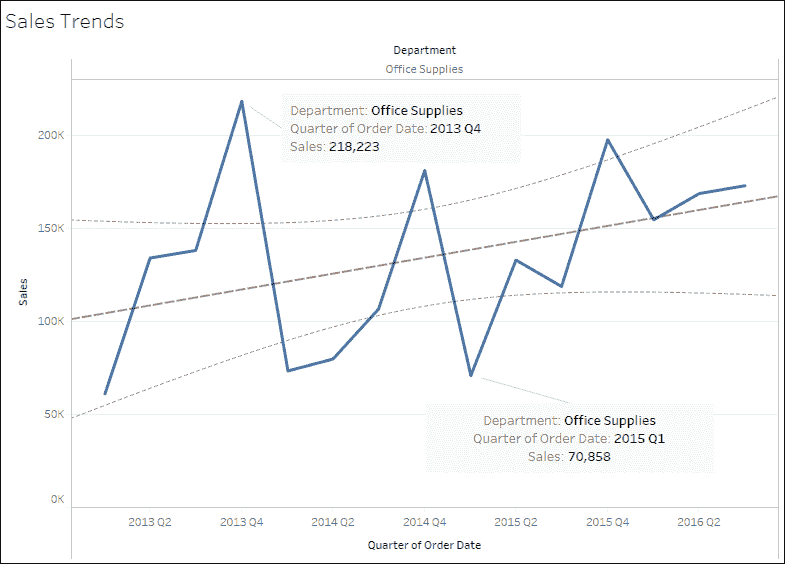

图 7.18：默认格式通常适用于数据发现和快速分析，但在向他人清晰传达和强调数据故事时，可能会显得过于杂乱。

默认格式效果相当不错，但将其与这个可视化进行比较：

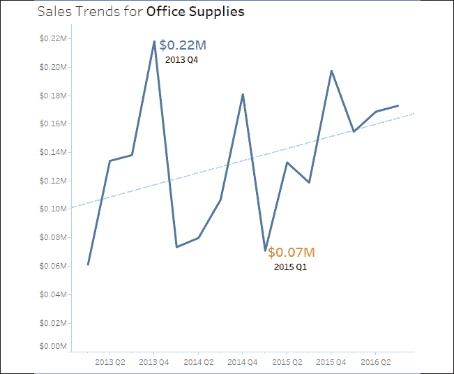

图 7.19：格式化可以使可视化看起来更简洁，并更有效地传达数据。

上述两个图表均展示了按季度划分的销售额，并过滤到**办公用品**部门。第一个视图使用默认格式。第二个视图进行了格式调整，包括以下内容：

+   **标题**已调整，包含了部门名称。

+   **销售额**已被格式化为以自定义货币显示，保留两位小数，单位为百万。这适用于轴和注释。通常，高精度可能会让可视化变得杂乱。数据的初始视图为我们提供了趋势和足够的细节，以了解数量级的顺序。工具提示或额外视图可以用于显示详细信息并提高精度。

+   轴标签已通过右键单击轴、选择**编辑轴**，然后清除文本的方式移除。视图的标题清楚地表明你正在查看`销售额`。仅凭数值可以揭示第二个轴是按季度划分的。如果数据中包含多个日期，你可能需要指定当前使用的是哪个日期。根据你的目标，你可能考虑完全隐藏轴。

+   **行**上的网格线已被移除。网格线可以为视图增值，尤其是在能够确定数值至关重要的视图中。然而，它们也可能让视图显得杂乱并分散注意力。你需要根据视图本身和你要讲述的故事来决定网格线是否有帮助。

+   趋势线的格式已调整为与线条颜色匹配，尽管它较浅且较细，以降低其突出程度。此外，置信区间已被移除。你需要根据自己的需求和观众来决定这些置信区间是否提供了上下文或只是增加了杂乱。

+   注释中的线条、阴影和框已被移除，以减少杂乱。

+   注释的大小和颜色已更改，以使其更加突出。如果目标只是突出显示线上的最小值和最大值，标签可能是更好的选择，因为它们可以设置为仅显示**最小**/**最大**。然而，在这个例子中，较小的数字实际上是视图中的第二低点。

+   坐标轴刻度和刻度线已被强调并着色，以匹配标记和参考线（坐标轴刻度在**格式**窗口的**线条**选项下可用）。

格式化也可以用来显著改变可视化的外观。考虑以下图表：

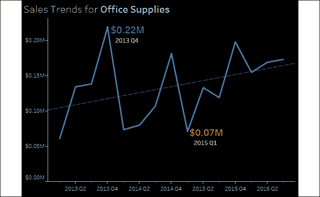

图 7.20：可以通过设置视图的阴影来设置深色背景

该可视化与先前的视图几乎相同。然而，已经对工作表和标题应用了阴影。此外，字体根据需要进行了加亮或加暗，以便在深色背景上显示清晰。有些人认为这种格式更加赏心悦目，尤其是在移动设备上。如果视图要嵌入到带有深色主题的网站中，这种格式可能会非常受欢迎。然而，某些文本在深色背景下可能会更难以阅读。你需要考虑你的受众、环境和交付方式，来判断这种格式是否适合你的情况。

使用深色背景时，顺序色彩调色板（基于连续字段的单色渐变）应该被反转。这是因为，较浅（较低）到较深（较高）的默认设置在白色背景上效果良好，其中较深的颜色突出显示，而较浅的颜色会逐渐融入白色。在黑色背景上，较浅的颜色突出显示，较深的颜色会渐变为黑色。你可以在双击图例或右键单击图例选择**编辑颜色...**并勾选**反转**时找到反转选项。

## 工具提示

由于工具提示并不总是可见，它们是可视化中容易被忽视的方面。然而，它们增添了一种微妙的专业感。考虑以下默认工具提示，当最终用户将鼠标悬停在前面截图中显示的一个标记上时，显示的工具提示：


图 7.21：默认工具提示

与这个工具提示进行对比：


图 7.22：自定义工具提示

工具提示通过点击**工具提示**在**标记**卡片上编辑，打开一个编辑器，允许在工具提示中进行丰富的文本编辑：

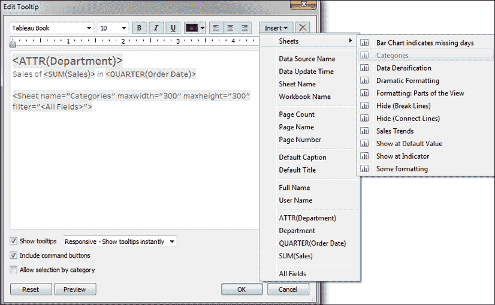

图 7.23：工具提示编辑器

该编辑器类似于用于编辑标签、标题、说明和注释文本的编辑器。你可以输入文本并根据需要进行格式化。此外，**编辑工具提示**对话框还具有一些额外的功能：

+   右上角的**插入**下拉菜单允许你插入工作表、字段、参数和其他动态值。这些特殊或动态的文本对象在文本编辑器中作为标签包围（例如，`<SUM(Sales)>`）。稍后我们将考虑工作表的特殊情况。

+   一个复选框选项**显示工具提示**，以及一个下拉菜单，用于指示工具提示的样式（**响应式 - 即时显示工具提示**或**悬停时显示**）。

+   一个复选框选项**包括命令按钮**。这是默认设置，你可以在本节的第一个未编辑的工具提示中看到这些命令按钮。命令按钮包括**包含**、**排除**、**创建集合**等选项。许多选项仍然可以通过右键点击访问，因此将它们从工具提示中删除并不会完全阻止用户访问它们。

+   一个复选框选项**允许按类别选择**。启用时，这个功能允许用户点击工具提示中显示的维度值，从而选择与该值相关联的所有标记。

对于那些不会显著且有意提升用户体验的视图，考虑取消勾选**显示工具提示**。

### Viz in Tooltip

Tableau 允许你将可视化嵌入到工具提示中，这些可视化会根据你悬停在不同标记上的位置动态过滤。通常称为**Viz in Tooltip**，它大大扩展了终端用户的交互性，提供了深入挖掘细节的能力，以及快速以不同方式查看数据的能力。

在前面的截图中，以下标签是通过选择**插入** | **工作表** | **类别**添加到工具提示中的：

```py
<Sheet name="Categories" maxwidth="300" maxheight="300" filter="<All Fields>"> 
```

这个标签，你可以直接编辑文本进行修改，它告诉 Tableau 在工具提示中显示`类别`工作表的可视化。最大宽度和高度默认为 300 像素。过滤器指示哪个字段作为从工作表到“Viz in Tooltip”的过滤器。默认情况下，`<所有字段>`表示视图中的所有维度都会作为过滤器。然而，你可以指定一个字段列表，根据视图中存在的一个或多个维度进行特定过滤（例如，`<部门>`、`<类别>`）。

注意带有工具提示的最终视图：

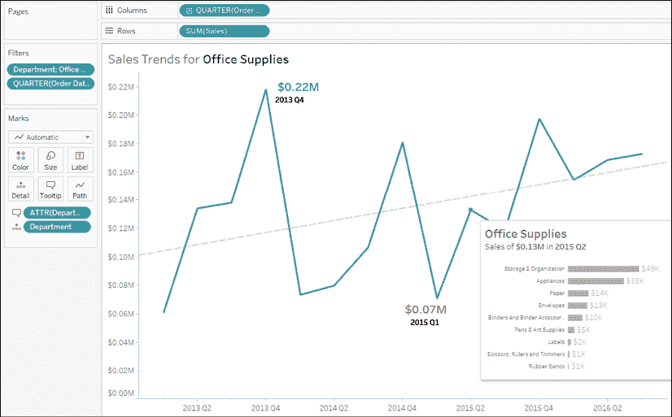

图 7.24：Viz in Tooltip

使用“Viz in Tooltip”功能有很多可能性。首先，你可以利用该功能深入细节，而无需在仪表板上额外占用空间，也无需导航到一个单独的视图。其次，你可以显示数据的不同方面（例如：时间序列的地理位置作为工具提示）。最后，你可以考虑如何使用“Viz in Tooltip”来让终端用户在更广泛的背景下看到部分数据。

这个功能还有许多其他有价值的应用，下面是一些提示，帮助我们总结“Viz in Tooltip”功能：

+   你可以在单个工具提示中添加多个可视化。

+   将工作表的**适应**选项设置为**适应整个视图**，使其调整到最大宽度和高度。

+   你可以通过右键点击工作表标签并选择**隐藏**来隐藏工具提示中使用的工作表。要恢复它们，请右键点击工具提示中使用的工作表标签并选择**取消隐藏工作表**。

# 总结

格式化的目标是提高手头数据的有效传达。在进行格式化的迭代过程中，始终考虑受众、环境、模式、情绪和一致性。寻找能为你的可视化增值的格式化，避免无用的杂乱。

我们讨论了很多格式化选项——从工作簿级别的字体、颜色、线条等到单独的工作表和字段格式化。我们还讨论了如何自定义数字、日期和空值的格式，并且如何利用这些技巧为你的可视化增加价值。

了解 Tableau 中格式化的工作原理后，你将能够将你在发现和分析阶段创建的可视化精炼成一个极具效果的数据故事传达。

在下一章，我们将看看这些内容如何在仪表板中汇聚。
