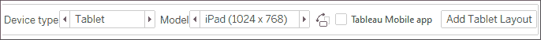

# 第八章：用仪表板讲述数据故事

在数据发现和分析过程中，你很可能会创建许多数据可视化。每一个可视化都为你提供了数据中某个故事的快照。每一个对数据的洞察都会回答一两个问题。有时，发现和分析阶段就足够让你做出关键决策，整个周期便完成了。在其他情况下，你需要将这些快照汇集在一起，向目标观众传达一个完整且有说服力的故事。

Tableau 允许你将相关的数据可视化整合到一个仪表板中。这个仪表板可以是对数据各方面的静态视图，或者是一个完全互动的环境，允许用户动态过滤、深入分析并与数据可视化进行交互。

在本章中，我们将通过几个深入的示例来探讨这些概念，逐步走过仪表板设计过程。像之前一样，不必担心记住一长串指令。相反，专注于理解仪表板的各个组件和方面为何以及如何发挥作用。

本章将涵盖以下内容：

+   仪表板简介

+   在 Tableau 中设计仪表板

+   适应不同显示器和设备的设计

+   通过操作实现互动性

+   故事

在本章的示例中，我们将回到前几章中使用的`Superstore Sales`示例数据。请创建一个新的工作簿并连接到该数据集，我们将从介绍仪表板的关键概念开始。

# 仪表板简介

在深入了解一些实际示例之前，先花点时间理解什么是仪表板，以及为什么你可能会创建一个仪表板。

## 仪表板定义

从 Tableau 的角度来看，**仪表板**是将单独的可视化以及其他组件，如图例、过滤器、参数、文本、容器、图像、扩展、按钮和网页对象，安排在一个画布上的方式。理想情况下，可视化和组件应共同工作，讲述一个完整且有说服力的数据故事。仪表板通常（但不总是）是互动的。

## 仪表板目标

仪表板的主要目标是将数据传达给特定的观众，并获得预期的结果。我们经常会谈论*讲述数据故事*。也就是说，数据中包含了一个或多个可以传达给他人的叙事。

尽管你可以通过单一的可视化或一系列复杂的仪表板讲述数据故事，但单个 Tableau 仪表板是最常见的讲述单一故事的方式。每个仪表板都旨在通过清晰展示特定信息来讲述一个故事。在构建故事之前，你应该了解数据讲述了什么故事。你如何讲述这个故事将取决于许多因素，比如你的观众、观众如何访问仪表板，以及你希望观众做出什么回应。

Stephen Few，数据可视化领域的领先专家之一，将仪表板定义为*一种显示达成一个或多个目标所需最重要信息的可视化展示，这些信息被整合并排列在一个屏幕上，以便能够一目了然地进行监控*。

该定义来自 Few 的论文 *Dashboard Confusion*，可以通过以下链接阅读：[`www.perceptualedge.com/articles/ie/dashboard_confusion.pdf`](https://www.perceptualedge.com/articles/ie/dashboard_confusion.pdf)。

这个定义有助于我们理解数据故事，并界定我们在 Tableau 中讲述数据故事时要遵循的一些关键边界。通常，你的数据故事应当遵循以下准则：

+   数据故事应当专注于最重要的信息。任何不传达或不支持核心故事的信息应当被排除。你可能希望将这些信息包含在其他仪表板中。

+   你讲述的数据故事必须符合你的关键目标。你的目标可能包括从提供信息到为进一步探索提供界面，再到促使观众采取行动或做出关键决策。任何不支持你的目标的内容，应当留给其他仪表板。

+   数据故事应该容易访问，且核心思想应当清晰。根据你的观众，你可能希望明确地陈述你的数据结论，或者你可能希望引导观众自己得出结论。

当你开始构建仪表板时，首先要仔细考虑你的目标。你的发现和分析应该已经揭示了有关数据及其故事的各种洞察。现在，责任在你，将这些发现和分析转化为一种有意义的方式，以传达故事并满足你的目标和观众的需求。你处理这一任务的方式被称为你的**方法**。

## 仪表板方法

根据你的目标，构建仪表板有许多可能的方法。以下列举的仅仅是一个不完整的清单：

+   **引导分析**：你已经进行了分析，得出了发现，因此对数据故事的含义有了深刻的理解。通常，设计一个能够引导观众经历类似发现过程的仪表板是有帮助的，这样他们就能清楚地认识到行动的必要性。例如，你可能已经发现了营销部门的浪费性开支，但团队可能在没有看到数据如何引导你得出这个结论的情况下，并不准备接受你的结果。

+   **探索性**：很多时候，当数据在下一个小时、下一个星期或下一个年份刷新时，你并不知道数据会讲述什么故事。今天可能看似不重要的部分，未来可能成为一个重要的决策点。在这种情况下，你的目标是为你的观众提供一个分析工具，使他们能够自主地探索和互动数据的各个方面。例如，今天，所有区域的客户满意度都很高。然而，你的仪表板需要让你的组织能够持续跟踪满意度变化，动态按产品和价格进行筛选，并观察与质量和交货时间等因素的相关性。

+   **计分卡/状态快照**：对于表示良好与不良绩效的**关键绩效指标**（**KPI**）或度量指标，通常会达成广泛共识。你不需要引导观众进行发现或强迫他们去探索。他们只需要一个高层次的总结，并能够深入细节，快速找到并解决问题，奖励成功。例如，你可能有一个仪表板，简单地显示仍未解决的支持工单数量。经理可以在移动设备上打开仪表板，并立即采取必要的行动。

+   **叙事型**：这种类型的仪表板强调一个故事。可能涉及探索性、引导性分析或绩效指标，但主要目的是从数据中讲述一个单一的故事。例如，你可能想讲述一种入侵性昆虫的传播故事，包括它的起源、传播速度、结果以及控制措施。你的仪表板应以一种可视化的方式，利用数据讲述这个故事。

我们将通过几个深入的示例来更好地理解这些不同的方法，并结合我们在前几章中学习的许多技能。首先，我们将介绍一些设计 Tableau 仪表板的关键方面。

你的仪表板可能采取混合方式。例如，你可能有一个探索性仪表板，突出显示一些关键绩效指标（KPI）。但是，务必小心不要让仪表板过于复杂。试图用单个仪表板实现多个目标往往会导致信息过载，变得混乱不堪。

# Tableau 中的仪表板设计

无论你的目标或方法是什么，设计 Tableau 仪表板的实际任务每次看起来都差不多。在本节中，我们将介绍一些基本概念。

## 对象

仪表板由对象组成，这些对象被排列在画布上。你将在仪表板的左侧面板看到可以添加到仪表板中的对象列表：


图 8.1：可添加到仪表板的对象

该面板包含以下对象：

+   **水平容器**：一种布局容器，其中其他对象将在单一行（水平）中排列。

+   **垂直**：一个布局容器，其中其他对象将按单列（垂直）排列。

+   **文本**：允许您在仪表板中包含格式丰富的文本的对象。

+   **图片**：可以在仪表板上定位和调整大小的图像（例如`.gif`、`.png`或`.jpeg`）。您还可以选择设置点击图片时的导航 URL。

+   **网页**：允许您在仪表板中嵌入网页内容的对象。您可以在设计时设置 URL。我们还会考虑如何使用动作动态更改 URL。

+   **空白**：一个空白对象，可用作占位符或提供间距选项。

+   **导航**：导航按钮允许您定义用户跳转到工作簿中的其他页面和仪表板。

+   **导出**：导出对象允许您创建一个链接或按钮，方便用户将仪表板导出为图像、PDF 或 PowerPoint。

+   **扩展**：由 Tableau 及第三方（甚至可能是您自己！）开发的一种日益增长的工具，利用扩展 API 为仪表板提供扩展功能。这可以使您实现诸如收集广泛的使用数据、动态更新参数、整合来自其他平台的可视化（如 D3）等更多功能。

除了可以通过侧边栏添加的对象外，还有其他可能适用于特定仪表板的对象：

+   **过滤器**：这些将作为控件显示，供最终用户选择过滤的值。

+   **参数**：类似于过滤器，这些将作为控件显示，供最终用户选择参数选项。

+   **页面控件**：这些是控件，允许最终用户分页查看数据，并可用于动画效果展示可视化和仪表板。

+   **图例**：这些包括颜色、大小和形状的图例，帮助最终用户理解各种可视化内容。

+   **高亮器**：这些允许用户在视图中高亮显示不同的维度值。

+   **仪表板标题**：一个特殊的文本对象，默认显示仪表板页面的名称。

### 平铺与浮动

对象可以是平铺的或浮动的。如果它是平铺对象，它会自动对齐到您拖动的仪表板或布局容器中。如果它是浮动对象，它将浮动在仪表板上并叠加显示。您可以更改浮动对象的层次顺序。

您会注意到，在前面的图片中，**平铺**或**浮动**按钮位于**对象**面板的正下方。这些按钮定义了您放置在仪表板上的对象的默认设置，但您可以更改任何给定对象的平铺或浮动状态。

按住`Shift`键，拖动对象时可以快速将其从平铺状态切换为浮动状态，或从浮动状态切换为平铺状态。

随着你在仪表板设计中的经验积累，你可能会更倾向于使用主要是瓷砖布局或主要是浮动布局的设计方式。（你可以在任何仪表板中混合使用瓷砖和浮动对象）。许多设计师发现其中一种设计方法更符合他们的风格。以下是一些考虑事项：

+   **精度**：浮动对象可以精确到像素级别进行调整和定位，而瓷砖对象则会大大依赖其容器的位置和大小。

+   **速度**：许多设计师发现，瓷砖布局的创建速度要快得多，因为他们不必担心精确度或层叠问题。

+   **动态调整大小**：浮动对象在固定大小的仪表板上表现良好，但如果仪表板根据窗口大小动态调整，则浮动对象会发生偏移，常常进入不理想的位置。瓷砖对象的移动和调整大小更为可靠（但并非总是完美！）。

+   **灵活性**：某些设计技巧可以通过浮动或瓷砖两种方式实现。例如，可以使用浮动技术将透明可视化层叠在背景图像上。然而，表单切换（我们将在*第十一章*，*动态仪表板*中讨论）通常是通过瓷砖布局实现的。

+   **维护**：浮动仪表板的布局变更可能比瓷砖布局的更困难且繁琐。

尝试各种设计技巧，并随意发展自己的风格！

### 操作仪表板上的对象

一旦某个对象成为仪表板的一部分，你可能希望对其进行操作。每个对象都有一些控制选项，当你选择该对象时，这些控制项将会显示：


图 8.2：选择仪表板对象后，将可以访问各种控制项

+   **握柄**：点击并拖动握柄来移动对象。

+   **从仪表板中移除**：点击此按钮可将对象从仪表板中移除。

+   **转到工作表**：要编辑仪表板上的单个可视化，请使用此按钮导航到单独的工作表。

+   **用作筛选器**：点击此处将启用视图作为筛选器。选择视图中的标记后，将会过滤仪表板上的其他视图。我们将在本章后面讨论筛选器操作的细节，以及如何更精确地控制视图如何作为筛选器使用。

+   **更多选项**：此下拉箭头将显示该对象的多种选项，包括参数和筛选器的控制显示选项；显示或隐藏视图上的标题或说明；向仪表板添加图例、参数和筛选器；格式化、布局和大小选项等。

+   **对象大小边框**：将鼠标悬停在边框上，光标会变为调整大小的光标。你可以拖动边框来调整对象的大小。

你可能会注意到，根据对象所在的容器类型以及对象是瓷砖还是浮动，尺寸行为有所不同。

在本章的前几节中，我们介绍了仪表板的理论基础以及设计中的一些关键元素。现在，让我们通过一个实际例子来应用这些概念。

# 用于理解盈利能力的仪表板

在涵盖了一些概念性话题以及与仪表板设计相关的实际事项之后，我们将深入一个示例。

假设你被要求帮助管理层找出最不盈利的商品。管理层认为，大多数最不盈利的商品应该从库存中淘汰。然而，由于你已经完成了分析，你发现某些商品虽然整体上不盈利，但在某些地区偶尔会盈利。你的主要目标是让管理层能够快速看到最不盈利商品的分析，以识别一个商品是否一直没有盈利，从而回答“最不盈利的商品是否一直没有盈利？”这个问题。这个例子将结合引导分析仪表板和探索工具的特点。

## 构建视图

使用`Superstore Sales`数据集，并按照以下步骤构建将形成仪表板基础的各个视图：

1.  创建一个按类别显示利润的柱状图。按利润总和降序排列类别。

1.  将**部门**字段添加到**筛选器**中并显示筛选器。为此，使用数据窗格中**部门**字段的下拉菜单，选择**显示筛选器**。

1.  将工作表命名为**按类别总利润**:

    图 8.3：显示按类别汇总利润的柱状图，以“部门”作为筛选器

1.  创建另一个类似的视图，显示按商品的利润。按利润总和降序排列商品。

1.  你会注意到，项目太多，无法一次性查看。对于这个仪表板的目标，你可以将项目限制为最不盈利的前 10 个。将**项目**字段添加到**筛选器**区域，选择**前 10**标签，并调整设置以按字段筛选。指定**最不盈利的 10 个**，按`Sum(Profit)`：

    图 8.4：使用“前 10”标签设置显示的项目数量

1.  将工作表重命名为**最不盈利的前 10 个商品**:

    图 8.5：结果柱状图显示最不盈利的前 10 个项目

1.  创建另一个工作表，显示按州划分的利润填充地图。你可以通过双击数据窗口中的**州**字段，然后将**利润**拖动到**颜色**区域来迅速完成这一操作。（注意：如果你的地区设置不是美国，你可能需要使用**编辑位置**选项将国家设置为美国。）

1.  将工作表重命名为**按州利润**:

    图 8.6：显示按州划分利润的填充地图

1.  创建最后一个工作表，显示利润是何时产生或丧失的。确保**订单日期**字段已作为**季度**日期值添加，并且它是连续的（绿色）。

1.  添加线性趋势线。为此，请切换到左侧边栏的**分析**标签，将**趋势线**从**模型**拖动到视图中。或者，右键单击视图画布的空白区域，选择**趋势线** | **显示趋势线**。

1.  将工作表重命名为**利润趋势**：

    图 8.7：显示按季度利润趋势的折线图

现在，您已经创建了构成仪表盘的视图，让我们开始将仪表盘组合起来！

## 创建仪表盘框架

此时，您已经拥有实现仪表盘目标所需的所有视图。现在，只剩下安排它们并启用所需的交互性，以有效讲述故事：

1.  通过点击位于所有现有工作表标签右侧的**新建仪表盘**标签，或从菜单中选择**仪表盘** | **新建仪表盘**来创建一个新的仪表盘。

1.  将新仪表盘重命名为`最不盈利的是否总是亏损的？`。

1.  在左侧边栏底部，勾选**显示仪表盘标题**。

1.  通过从左侧边栏的**仪表盘**窗格中拖动视图并将其放入仪表盘画布中，来将视图添加到仪表盘。按如下方式排列它们：

    图 8.8：所有视图已放置在仪表盘上

    在仪表盘中添加视图后，您需要花些时间重新定位和调整各个元素和视图的大小。

1.  使用**部门**筛选器上的下拉菜单，将控件更改为**单值**（下拉菜单）。

1.  您会注意到，改变筛选器的值只会改变**按类别的总体利润**视图。您可以通过使用下拉菜单来调整筛选器应用的视图。使用下拉菜单，选择**应用到工作表** | **所有使用此数据源**。

可以通过筛选器控件上的下拉菜单或视图中筛选器架上的字段来设置应用筛选器的选项。选项包括以下内容：

+   **所有使用相关数据源**：该筛选器将应用于所有数据源，其中用于筛选的字段在数据源之间存在关联。可以通过主菜单中的**数据** | **编辑关系**来编辑关系。

+   **所有使用此数据源**：该筛选器将应用于任何将数据源用作主要数据源的视图。

+   **选择的工作表...**：该筛选器将应用于您选择的工作表。

+   **仅此工作表**：该筛选器将仅应用于当前工作表。

现在，让我们回到创建仪表盘框架的工作。

1.  从左侧边栏中，拖动并将文本对象放置在**按类别的总体利润**之上，并输入以下说明：

    1.  **从下拉菜单中选择一个部门**

    1.  **选择下方的类别**

    1.  **选择下方的项目**

1.  使用控制柄，将**部门**筛选器立即移动到**最不盈利的前 10 项**视图上方。

1.  调整文本对象的大小，以使**前 10 名**视图与整体视图对齐。

1.  将**利润**颜色图例移到**按州利润**视图下方。

1.  使用**整体类别利润**下拉菜单，选择**适应** | **整个视图**。这将确保所有类别都可见，而不需要滚动条。

1.  此外，将**最不赚钱的前 10 个项目**调整为**整个视图**。

此时，你的仪表板应该类似于下图所示：


图 8.9：已整理并调整大小的精美仪表板

现在我们有一个包含所有我们想要的视图的仪表板。如你所见，添加视图和对象并重新排列它们是很容易的。接下来，让我们继续探讨如何通过操作来驱动故事。

## 实施操作来引导故事

现在你有了一个支持数据故事讲述的框架。你的观众能够在选定类别的上下文中定位到最不赚钱的项目。然后，选择一个项目将回答它是否在每个位置上都一直是无利可图的。为了启用这种流程并实现你的目标，你通常需要启用交互性。在本例中，我们将使用操作。我们将通过一些具体的步骤来完成这个示例，然后在本章稍后详细介绍操作的复杂性：

1.  点击**整体类别利润**视图上的**用作筛选器**按钮。这将使该视图成为整个仪表板的交互式筛选器。也就是说，当用户选择一个条形图时，所有其他视图将根据选择进行过滤：

    图 8.10：按类别利润视图上的“用作筛选器”控件

1.  从主菜单中，选择**仪表板** | **操作**。你将看到一个包含名为**筛选器 1（生成）**的操作的列表。这是你之前选择**用作筛选器**时创建的操作：

    图 8.11：点击筛选控制时创建了筛选器 1（生成）

1.  点击**添加操作 >**按钮并选择**筛选器**。弹出的对话框将为你提供选择源和目标的选项，以及该操作的其他选项。

1.  在这里，我们需要一个操作，当用户选择某个项目时，筛选除**整体类别利润**视图之外的所有内容。在**添加筛选操作**对话框中，将**源工作表**设置为**最不赚钱的前 10 个项目**，并将**目标工作表**设置为**按州利润**和**利润趋势**。确保操作设置为在**选择**时运行。将筛选器命名为**按项目筛选**，然后点击对话框中的**确定**按钮。然后在**操作**对话框中做同样的操作：

    图 8.12：为按项目筛选操作设置选项

现在，你有三个筛选器（其中两个是操作）来驱动仪表板：

+   从下拉菜单中选择一个部门将过滤整个仪表板（实际上会过滤工作簿中的所有视图，因为你已设置为使用数据源过滤每个视图）

+   选择一个类别（点击一个条形图或标题）将把整个仪表板筛选到该选择

+   选择一个项目（点击一个条形图或标题）将筛选**按州的利润**和**利润趋势**仪表板

您可以通过点击空白区域或再次点击选定标记来清除视图中的选择。例如，如果您点击**书架**条形图以选择它（从而筛选出仪表板的其余部分），您可以再次点击该条形图来取消选择。

尝试使用筛选器和操作，看看您的仪表板如何运行。

## 上下文筛选

当您使用下拉筛选器选择单个部门或选择单个类别时，您会发现在 Top 10 视图中少于 10 个项目。例如，从**部门**筛选器选择**家具**，点击**桌子**条形图只显示三个项目。这是因为**顶级项目**筛选器与操作筛选器同时评估。只有三个**桌子**类别项目同时也在**Top 10**中。

如果您想查看**桌子**类别中的 Top 10 项目，您可以通过上下文筛选器实现这一目标。

**上下文筛选器**是 Tableau 中的一种特殊类型的筛选器，它们在其他筛选器之前应用。其他筛选器然后在上下文筛选器定义的上下文中应用。概念上，上下文筛选器导致数据子集，其他筛选器和计算在此数据子集上运行。除了**顶级筛选器**外，还在上下文筛选器定义的上下文中计算**计算集**和**固定详细级别**计算。

在这种情况下，导航到**Top 10**工作表，并使用**筛选器**架上字段的下拉菜单将**部门**筛选器和新添加的**（类别）**操作筛选器添加到上下文中。一旦添加到上下文中，这些字段将在筛选器架上显示为灰色。现在，您将看到所选部门和类别的 Top 10 项目：


图 8.13：最不赚钱的 10 个项目将位于 Action（类别）和**部门**筛选器的上下文中

请注意，将筛选器添加到上下文会使字段在**筛选器**架上显示为灰色。

如果您编辑仪表板上的操作，筛选器可能会自动更新，您可能需要重新添加到上下文中。

通过选择几个不同的类别和几个不同的项目，继续并逐步进行操作。观察最终的仪表板如何通过讲述一个故事来实现您的目标：


图 8.14：由选择触发的最终仪表板与筛选器

用户从**部门**下拉菜单中选择了**技术**，从**类别**列表中选择了**电话和通讯**，然后选择了**项目 10631**，这是该类别中利润最少的项目。此操作显示了该项目在各个州的销售情况（按利润进行颜色编码），以及该项目的利润时间序列。

管理层是否应从库存中移除项目 10631？在考虑到该项目仅在一个实例中亏损，并且其趋势正向更高的盈利转变之前，不能轻易做出决定。虽然最初的亏损很大，但那是很久以前的事，而且每次后续销售该项目都获得了盈利。你所得到的结果可能会促使进一步分析，以确定影响项目盈亏的因素，从而帮助管理层做出更好的决策。

当你查看`第八章完成`的工作簿时，你会看到底部只有仪表板的选项卡，个别视图已被隐藏。隐藏仪表板或故事中使用的工作表选项卡是保持工作簿整洁并引导观众远离那些应在仪表板或故事背景下查看的工作表的好方法。要隐藏工作表，右键点击选项卡并选择**隐藏工作表**。要取消隐藏工作表，导航到使用该工作表的仪表板或故事，右键点击左侧窗格中的工作表，并取消勾选**隐藏工作表**。此外，你还可以通过右键点击仪表板选项卡并选择适当的选项，来隐藏或取消隐藏所有在仪表板中使用的工作表。用于工具提示的工作表也可以用相同的方式进行隐藏或取消隐藏。

现在，你已经拥有一个完全互动的仪表板！你构建了视图，将它们添加到仪表板，并创建了一些有意义的计算。过程中，你学习了**顶部过滤器**和**上下文过滤器**。现在，让我们考虑一下如何为不同的显示器和设备设计仪表板。

# 针对不同显示器和设备的设计

在设计仪表板时，你通常会问自己的一些第一个问题是：*我的观众如何查看这个仪表板？他们会使用什么设备？* 随着移动设备的广泛采用，后一个问题变得非常重要，因为在大型平面屏幕显示器上看起来不错的东西，在平板或手机上可能并不总是很好看。

左侧边栏**仪表板**选项卡的顶部显示了一个按钮，用于在各种设备上预览仪表板，以及一个**大小**选项的下拉菜单：


图 8.15：设备预览选项允许你为其他设备设计和预览仪表板

点击**设备预览**按钮不仅可以让你查看仪表板在各种设备类型（甚至是特定型号）上的显示效果，还可以让你为每种设备类型添加布局，并且可以进行自定义：



图 8.16：设备的可自定义选项

你不仅可以查看仪表盘在各种设备和型号上的显示效果，还可以根据设备的方向以及是否使用 Tableau Mobile 应用（如果该设备支持）查看其外观。

点击**添加布局**按钮（即前面截图中的**添加平板布局**按钮）将会在左侧边栏的**仪表盘**选项卡下添加一个布局：


图 8.17：每种布局都可以配置多种选项

每种布局可以有自己的大小和适配选项，布局选项允许你从**默认**切换到**自定义**。这使你能够根据给定的布局重新排列仪表盘。你甚至可以为某些布局删除视图和对象。例如，你可以简化仪表盘，将其缩减为一两个视图用于手机显示，同时为桌面显示保留三四个视图。

`Chapter 08 Completed` 工作簿包含利润分析仪表盘的示例，并提供了几种布局选项。例如，这是为手机显示格式化的仪表盘，仪表盘会根据手机的宽度自动适配，并允许上下滚动：


图 8.18：仪表盘的手机布局

如你所见，手机的仪表盘布局意味着**按州利润**和**利润趋势**在手机设备的预览边界内不会显示。然而，它们距离手指滑动仅一步之遥。

# 与操作的交互

在 Tableau 中，**操作**是由用户发起的事件，它触发 Tableau 的响应。你已经看过几个仪表盘中使用操作的示例。现在我们将探讨一些操作在 Tableau 中如何工作的细节。

Tableau 支持六种操作：

+   **筛选操作**：用户的操作会导致在一个或多个视图中应用一个或多个筛选器。

+   **突出显示操作**：用户的操作会导致在一个或多个视图中突出显示特定的标记和标题。

+   **URL 操作**：用户的操作会导致打开特定的 URL（可以是浏览器、新标签页或嵌入式网页对象）。

+   **转到工作表**：用户的操作会导致导航到选定的工作表或仪表盘。

+   **参数操作**：用户的操作会更改参数的值。这使用户能够以全新和令人兴奋的方式与参数进行视觉互动！

+   **设置操作**：用户的操作定义了一个集合。集合可以在计算、筛选器和货架上使用，以定义标记的视觉属性。这为复杂和创造性的交互提供了许多可能性。

某些操作是由 Tableau 根据快捷方式自动生成的。例如，你可以从仪表盘视图的下拉菜单中选择**用作筛选器**，这会自动生成一个筛选操作。通过点击离散颜色图例上的按钮或工具栏上的按钮启用突出显示，将自动生成一个突出显示操作：


图 8.19：启用高亮显示的选项

您还可以通过从菜单中选择**仪表板** | **操作**来创建或编辑仪表板操作。我们来看看每种类型操作的详细信息。

## 过滤器操作

**过滤器操作**由一个或多个源工作表定义，这些源工作表将一个或多个维度值作为过滤器传递给目标工作表。当涉及到这些标记的操作发生时，包含该标记的维度值可以作为过滤器传递到一个或多个目标工作表。请记住，每个工作表上的标记是由独特的维度值交集定义的。

当您创建或编辑过滤器操作时，您将看到如下选项：


图 8.20：过滤器操作选项

此屏幕允许您执行以下操作：

+   命名过滤器。

+   选择**源**和**目标**工作表。**源**工作表是用户将启动操作（悬停、选择、菜单）的地方，**目标**工作表是应用响应的地方（在此示例中是过滤，但也可以是高亮显示）。

+   设置触发过滤器的操作，以及多个标记的选择还是单个标记的选择触发操作。

+   选择清除选择时发生的情况。

+   指定哪些维度用于将过滤器值传递到**目标**工作表。

尝试使用有助于您在仪表板中区分多个操作的名称来命名您的操作。此外，如果您的操作设置为在**菜单**上运行，那么您使用的名称将在工具提示中作为链接显示。使用名称右侧的箭头插入特殊字段占位符。当用户在工具提示中看到菜单选项时，这些占位符会根据标记的字段值动态更新。

您可以选择任意数量的源和目标工作表。然而，如果您在底部区域指定了特定的**目标过滤器**，则您选择的字段必须出现在源工作表中（例如，**行**、**列**和**详细信息**）。如果某个字段在一个或多个**源**工作表中不可用，您将收到警告，并且该操作将不会在这些工作表上触发。大多数情况下，您的源和目标将是相同的仪表板。您还可以选择一个不同的目标工作表或仪表板，这将使操作除了过滤之外，还能够导航到目标。

当过滤器操作在工作表级别定义时（在查看工作表时，从菜单中选择**工作表** | **操作**），该操作的菜单项将作为菜单项出现在每个使用相同数据源的工作表上的所有标记中。您可以使用此功能在工作表之间以及从仪表板到单个工作表之间快速创建导航。

过滤器操作可以设置为发生在三种可能的操作中的任何一种：

+   **悬停**：用户将鼠标光标移动到标记上（或在移动设备上点击标记）。

+   **选择**：用户点击或轻触一个标记，通过点击并拖动矩形框选中多个标记，或者点击一个标题（这样该标题下的所有标记都会被选中）。用户可以通过点击/轻触已经选中的标记、点击/轻触视图中的空白区域，或点击/轻触已选中的标题来取消选择。

+   **菜单**：用户选择工具提示中的操作菜单选项。

下面是一个筛选操作的示例，当源中的条形图被选中时触发：


图 8.21：点击“表格”条形图，将“类别”作为过滤器传递给目标表格。

源中的每个条形标记都由**类别**维度定义。当选择“表格”的条形图时，目标上会设置一个单一的过滤器。

如果标记由多个维度定义（例如，**类别**和**区域**），则目标表格仍然会根据所选维度值的组合设置单一过滤器。

在这个例子中，过滤器包含**办公设备**和**西部**，这与定义选中方框的维度匹配：


图 8.22：点击“办公设备”和“西部”交集的方框，会将这两个维度的值作为单一操作过滤器传递给目标。

默认情况下，源视图中存在的所有维度都会用于筛选操作。你可以选择性地指定应使用哪些字段。你可以在**编辑筛选操作**对话框中使用**已选择字段**选项来实现以下功能：

+   基于更少的维度进行筛选。例如，如果你只选择了**区域**字段，那么选择前述方框将只会将“西部”区域作为过滤器传递给目标。

+   使用不同的数据源对目标视图进行筛选。**已选择字段**选项允许你将源字段映射到目标字段（即使目标字段有不同的名称，但值必须仍然匹配）。例如，如果目标使用的数据源中，**东部**是一个名为**区域**的字段的可能值，你可以将源中的**区域**映射到目标中的**区域**。

筛选操作非常有用，可以缩小焦点范围，深入查看细节，观察所选维度的不同方面。你会发现自己经常使用它们。让我们考虑另一种类型的操作：高亮操作。

## 高亮操作

这种类型的操作不会过滤目标表格。相反，**高亮操作**会在目标表格中突出显示由所选维度值定义的标记（至少部分由它们定义）。高亮操作的选项与筛选操作非常相似，具有相同的源和目标表格配置选项，以及触发操作的事件。

假设一个仪表板有三个视图，并且基于**地区**字段的高亮操作。当对**东区**触发该操作时，所有由**东区**定义的标记都会被高亮显示。用于高亮的维度必须出现在所有你希望应用高亮的视图中。地图和散点图的**地区**字段都位于*标记卡*的*详细信息*部分：


图 8.23：点击东区的条形图已高亮显示与该维度值相关的所有其他标记

**高亮显示器**（也称为**数据高亮显示器**）作为用户控件显示（类似于过滤器和参数），根据用户交互来进行高亮显示。它们可以应用于一个或多个视图，并且会高亮显示视图中的标记。它们不会创建动作。要添加高亮显示器，选择视图中的任何离散（蓝色）字段，并使用下拉菜单点击**显示高亮显示器**。或者，你也可以使用菜单选择**分析** | **高亮显示器**。在仪表板上，你可以通过使用视图的下拉菜单选择**高亮显示器**来添加高亮显示器。

## URL 操作

**URL 操作**允许你根据某个操作动态生成一个 URL，并在仪表板中的网页对象内或在一个新的浏览器窗口或标签页中打开它。URL 操作可以通过与其他操作相同的悬停、菜单和选择事件来触发。URL 操作的名称使其与其他操作区分开，并将在作为菜单使用时显示为链接。

URL 包括你输入的任何硬编码值，以及通过 URL 文本框右侧的箭头可以访问的占位符。这些占位符包括字段和参数。当操作触发时，这些值将动态插入到 URL 字符串中，基于构成所选标记的字段的值和当前参数的值。

如果你在仪表板中包含了一个网页对象，URL 操作将自动使用该对象作为目标。否则，操作会打开一个新的浏览器窗口（当仪表板在桌面或阅读器中查看时，使用你的默认浏览器）或一个新的标签页（当仪表板在网页浏览器中查看时）。

一些网页在通过 iframe 查看时具有不同的行为。浏览器对象在 Tableau Desktop 或 Tableau Reader 中不使用 iframe，但在将仪表板发布到 Tableau Server、Tableau Online 或 Tableau Public 时会使用 iframe。你需要根据你的观众将如何查看仪表板来测试 URL 操作。

创建或编辑 URL 操作时，你可以为 URL 操作指定一个目标：


图 8.24：URL 操作的选项

选项包括**新浏览器标签页**、**网页对象**（如果仪表板上有多个对象，你可以选择其中一个）和**如果没有网页对象则为浏览器标签页**。如果仪表板上有多个网页对象，建议为它们命名，以便更容易选择。

要完成此操作，请切换到左侧窗格中的**布局**选项卡，并展开**项目层级结构**，直到找到你希望重命名的对象。右键单击该对象并选择**重命名仪表板项...**：


图 8.25：可以通过项目层级结构和右键上下文菜单重命名仪表板对象

在你重命名对象之后，你将能更轻松地识别出哪个是 URL 操作的目标。

接下来，我们将考虑另一种实现特定结果的操作类型：导航。

## 转到工作表操作

**转到工作表操作**（也称为导航操作）允许你根据用户与一个或多个视图的交互，指定导航到工作簿中的另一个仪表板或工作表。例如，点击条形图中的条形可能会导航到另一个仪表板。这些操作类似于定义另一个工作表为目标的过滤器操作，但转到工作表操作不会设置任何过滤器。

## 参数操作

**参数操作**允许你根据用户操作设置参数的值。当你创建参数操作时，你将使用类似这样的界面设置选项：


图 8.26：参数操作的选项

与其他操作一样，你可以选择触发操作的工作表和用户交互（**悬停**、**选择**、**菜单**）。此外，你将设置目标参数并指定哪个字段将设置该值。你可以使用工作表中的任何字段，也可以为该字段指定聚合。

我们在*第四章*，*使用计算和参数开始冒险*中，看到过参数如何用于实现各种结果。你可以在计算、过滤器和**前 N 名**集合中使用它们，还可以使用它们定义参考线并改变任何视图的视觉效果。这为使用视图和触发器驱动交互体验打开了无限可能。

## 设置操作

**集合操作**允许你为一个或多个维度填充一个或多个值的集合。这非常强大，因为集合可以在任何架构中使用来编码任何视觉元素，可以在计算中使用，也可以作为过滤器使用。它们可以以不同的方式在不同的视图中使用，这为集合操作提供了令人难以置信的灵活性。我们将首先花一些时间更清楚地定义集合，然后看一个集合操作的示例。

### 集合

在 Tableau 中，**集合**定义了来自数据源的一组记录。在行级别，每条记录要么在集合中，要么不在集合中。有两种类型的集合：

+   动态集合（有时称为计算或计算集）

+   固定集合

**动态集合**是根据你定义的条件计算为单一维度计算的。随着数据变化，条件的结果可能会变化，记录可能会在集合内外之间切换。

例如，如果你在数据窗格中的**Customer Name**字段上使用下拉菜单并选择**Create** | **Set**，你可以规定一个条件来定义哪些记录属于该集合：


图 8.27：基于条件的动态集合

在这个示例中，我们创建了一个名为**Customers who purchased more than $100**的动态集合，其条件是销售总额大于**100**。你会注意到，还有计算**By formula**或**Top** N 的选项。所有这些条件将应用于聚合级别（跨整个数据集或如果使用了上下文筛选器则跨上下文），然后每条记录将根据该记录对应的客户总销售额是否大于$100 来判断其是否在集合中。

**固定集合**是一个包含一个或多个维度的值的列表。如果单个记录的值与集合定义的列表匹配，则该记录在集合中，否则不在集合中。例如，你可能会基于**Customer Name**字段创建另一个集合，这次使用**General**选项卡：


图 8.28：基于成员选择的静态集合

在这里，你可以选择定义集合中包含或排除的单独值。注意有一个选项是排除而不是包含值。在这种情况下，我们创建了一个名为**Customers with first name of Aaron**的集合。任何具有与我们选择的**6**个值匹配的**Customer Name**值的记录都将包含在集合中。所有其他的将不在集合中。因为这是一个固定集合，所以这些值永远不会被计算或重新计算。如果下周数据集中出现一个名为 Aaron Burr 的客户记录，它仍然不会出现在集合中。

正如我们在下面的示例中所看到的，集合操作作用于固定的集合。

### 一个集合操作的示例

你可以在名为`Sales by Region and Category (set actions)`的仪表板中的`Chapter 08 Complete.twbx`工作簿中找到一个集合操作的示例，显示如下：


图 8.29：集合操作允许高亮显示：突出显示属于选定区域的条形部分

该仪表板包含两个视图：一个地图和一个条形图。在地图上选择一个区域会触发一个集合操作，从而更新条形图。一个筛选操作会筛选条形图，使每个条形的长度仅显示所选区域的值。然而，在这里，集合操作用于显示属于该区域的整体条形部分，同时仍保留所有区域的完整条形长度。

要复制此交互性，请按照以下步骤操作：

1.  在数据窗格中**维度**下的**Region**字段上使用下拉菜单选择**Create** | **Set**。将集合命名为**Region Set**。

1.  在生成的**创建集合**对话框中，选择**常规**选项卡，勾选一个或多个值。这将创建一个固定集合。在这个示例中，选择哪些值并不重要，因为稍后你会配置集合操作来瞬间更新这些值。

1.  创建一个**按类别销售**的条形图。

1.  从数据面板中的**集合**拖动**区域集合**并放置到**颜色**上：

    图 8.30：将集合拖放到颜色上，以显示集合内外的区别

你可以像使用其他字段一样在架构上使用集合。注意集合如何给出两个值，即**集合内**和**集合外**，它们定义了两种颜色。你可能希望调整颜色，以突出显示**集合内**的部分。

你也可以在计算字段中使用集合。例如，代码`[Region Set]`为每条记录提供布尔值真/假结果，表示该记录是否在集合中。

通过创建区域地图、仪表板并实现集合操作来完成集合操作示例：

1.  使用**区域**的下拉菜单选择**地理角色** | **从…创建** | **州**。这告诉 Tableau 根据**州**这一地理字段的关系将**区域**视为地理字段。

1.  在一个新的空白视图中，双击**区域**字段以创建地图视图。现在，**区域**被识别为地理字段，Tableau 会生成必要的纬度、经度以及渲染形状所需的几何图形。

1.  将地图和条形图视图都添加到同一个仪表板中。你可以根据需要将它们定位。

1.  通过选择**仪表板** | **操作**菜单，然后在弹出的对话框中选择**添加操作** | **更改集合值...**来添加集合操作。弹出的对话框具有许多与其他操作类型相似的功能：

    图 8.31：集合操作的选项

你会注意到可以为**名称**指定操作值；**执行操作时：** **悬停**、**选择**或**菜单**；以及**清除选择**的选项。像其他操作类型一样，你还可以指定触发该操作的**源**工作表。**目标集合**允许你指定根据操作更新值的数据源及该数据源中的固定集合。在此示例中，我们希望在**销售按区域（集合操作）**视图中做出选择时更新**区域集合**。当清除选择时，我们将选择从集合中删除所有值。

创建上述操作后，你的仪表板应与本节开始时显示的示例非常相似。在地图上选择一个区域时，突出显示与该区域对应的条形图部分。这种技术被称为**刷选**，或**比例刷选**。

该技巧只是集合操作的几百种可能应用之一。由于集合可以在任何架构上使用，并且可用于计算，通过集合操作更新数值为用户交互和分析开辟了几乎无限的可能性。

在了解了各种类型的操作后，让我们继续考虑另一个示例，展示不同类型的仪表板。

# 一个地区评分卡仪表板

现在，我们将考虑另一个示例仪表板，展示略微不同的目标。假设组织中的每个人都同意利润比率是一个 KPI。此外，大家也达成共识，认为可接受与差的利润比率之间的临界值为 15%，但管理层希望能够动态调整此值，以查看是否可能有更好的目标。

考虑以下仪表板：


图 8.32：一个简单的利润 KPI 仪表板

该仪表板使你的观众能够非常迅速地评估各个地区在过去六个月的表现。高层管理人员可以很快在他们的移动设备上调出这个仪表板，并根据需要采取适当的行动。

该仪表板提供与 KPI 目标参数的互动。如果需要，额外的深入探索功能可以提供到其他仪表板或视图。如果该视图发布到 Tableau Server，考虑到地区经理可能会订阅该视图并接收包含最新仪表板图像的定期电子邮件，这也是完全合理的。

让我们考虑如何创建一个类似的仪表板：

1.  创建一个名为`Profit Ratio KPI Target`的浮动类型参数，初始值设置为`.15`，格式为百分比。

1.  创建一个名为`Profit Ratio`的计算，公式为`SUM([Profit]) / SUM([Sales])`。这是一个聚合计算，它将把利润总和除以视图中定义的详细程度下的销售总和。

1.  创建第二个名为`KPI - 利润比率`的计算，公式如下：

    ```py
    IF [Profit Ratio] >= [Profit Ratio KPI Target] 
    THEN "Acceptable" 
    ELSE "Poor" 
    END 
    ```

    该代码将利润比率与参数化的临界值进行比较。任何等于或高于临界值的将标记为`可接受`，而低于临界值的将标记为`差`。

1.  创建一个名为**地区评分卡**的新工作表。该视图包含**行**上的`地区`，**列**上的**订单日期**（作为离散日期部分），以及在形状和颜色上都有`KPI - 利润比率`字段。你会观察到形状已被编辑为使用勾选标记和叉号，并且颜色调色板使用了对色盲友好的蓝色和橙色。

1.  使用**分析**面板添加列总计，并将总计格式化为自定义标签**总体**，字体加粗，并使用浅灰色阴影。

1.  添加**订单日期**作为过滤器，并将其设置为按字段排序的前 6 名（**订单日期**作为**最小值**）。这将动态地将视图过滤为过去六个月的数据：

    图 8.33：此视图定义了地区评分卡，显示每个地区每月的可接受与差的结果

1.  创建另一个名为**按区域计算的利润率**的工作表。

1.  如果你跳过了设置操作示例，请使用`Region`上的下拉菜单选择**地理角色** | **从...创建** | **州**。这告诉 Tableau 将**Region**视为一个基于与地理字段**州**的关系的地理字段。

1.  双击数据窗格中的**Region**字段。Tableau 将自动根据**Region**生成地理可视化。我们将在*第十二章*，*探索地图和高级地理空间功能*中更详细地探讨自定义地理区域的创建。

1.  将**利润率**放在**颜色**和**标签**上。你还需要将**利润率**格式化为百分比。你可以通过专门在此视图中格式化该字段，或者通过在数据窗格中设置字段的默认数字格式来完成（后者通常是首选，因为你几乎总是希望它以百分比形式显示）。

1.  此外，将**Region**添加到**标签**中。重新排列标记卡中的字段以重新排序标签，或者点击**标签**架直接编辑标签文本。

1.  将与**区域记分卡**视图相同的过滤器应用于此视图。你可能希望导航到**区域记分卡**工作表，并使用**订单日期**上**过滤器**架上的下拉菜单将现有的过滤器应用于多个工作表：

    图 8.34：填充地图显示按区域计算的利润

一旦两个视图都创建完成，你可以将这些视图安排成一个仪表板。`第八章完整`工作簿中的示例应用了一个手机布局，如下所示：


图 8.35：KPI 仪表板的手机布局

尝试不同的布局和元素位置。

默认情况下，所有添加到仪表板的对象都是瓷砖化的。**瓷砖化**的对象会固定位置，并出现在**浮动**对象下面。任何对象都可以通过切换左侧窗口下**新对象**下的切换按钮，或按住`Shift`键将对象拖动到仪表板上，作为浮动对象添加到仪表板。

现有对象可以通过按住`Shift`键在移动对象时或使用下拉菜单在浮动和瓷砖之间切换。下拉菜单还提供了调整对象浮动顺序的选项。此外，通过选择浮动对象并使用左下角的定位和大小控制，你可以以像素为单位精确调整浮动对象的大小和位置。

你可以混合使用瓷砖和浮动元素，但许多仪表板作者更喜欢构建完全由一个或另一个组成的仪表板。这确保了不同布局和屏幕尺寸之间的一致性（特别是当仪表板设置为**自动**或**范围**大小选项时）。

这个例子展示了一个用于快速查找和快速决策的仪表板。如果我们想讲述一个更复杂的故事，展示细节的进展，甚至按照特定顺序呈现数据故事怎么办？让我们考虑如何利用 Tableau 的一个专门设计用于此目的的功能。

# 故事

**故事**功能允许你使用仪表板和视图的交互式快照讲述一个故事。快照成为故事中的一个点。这使你能够构建一个引导性叙事，甚至是一个完整的演示。

让我们考虑一个故事点可能有用的例子。高层管理者对你之前开发的**区域记分卡**仪表板感到满意。现在，他们希望你为董事会做一个演示，突出显示南部地区的某些具体问题。通过最小的努力，你可以将简单的记分卡进行扩展，添加一些额外的视图，并讲述整个故事：

1.  首先，我们将构建几个额外的视图。创建一个简单的地理视图，命名为`利润比率 KPI 按州`。将其设置为填充地图，使用**KPI – 利润比率**字段并定义颜色。

1.  将**利润比率**添加到**Marks**卡片的**详细信息**部分，以便稍后使用：

    图 8.36：利润比率 KPI 按州使用颜色编码显示可接受与差的对比

1.  创建一个名为`按季度利润比率`的额外视图。将**订单日期**作为**列**上的连续日期值，**利润比率**作为**行**。

1.  将标记类型设置为条形图。为**利润比率 KPI 目标**参数值添加参考线（你可以右键点击**利润比率**轴并选择**添加参考线...**）。

1.  将**KPI – 利润比率**添加到**颜色**。你也可以点击**颜色**货架并添加边框。

1.  继续筛选视图，选择南部地区，并使用下拉菜单将该筛选器应用到**利润比率 KPI 按州**视图中：

    图 8.37：按季度利润比率显示某一季度是否符合目标，是否可接受或差

1.  创建一个新的仪表板，包含这两个新的视图，排列方式与下面截图中的相同。如果没有显示，添加**利润比率 KPI 目标**参数和**地区**筛选器。

1.  使用**利润比率 KPI 按州**上的下拉菜单，将该视图作为筛选器使用：

    图 8.38：同一仪表板上的利润比率 KPI 按州和按季度视图

1.  通过从菜单中选择**故事** | **新建故事**，或者使用底部现有工作表旁的新建故事标签来创建一个新故事：

    **故事**界面由一个侧边栏组成，显示所有可见的仪表板和视图。顶部显示故事标题，可以通过双击进行编辑。故事中的每个新点都会显示为一个导航框，其中的文本也可以编辑。点击框会让你访问故事点，随后你可以添加单个仪表板或视图。

    

    图 8.39：添加故事点

你可以使用**新建空白点**按钮（创建一个新故事点）、**复制**按钮（将创建当前选定故事点的复制快照）或**另存为新点**按钮（将捕获当前仪表板的状态作为一个新的故事点）来创建新的故事点。

点击故事点导航框将显示该故事点的视图或仪表板快照。你可以通过选择、改变筛选器、更改参数值和添加注释等方式与仪表板互动。更改仪表板的任何部分后，系统将提供更新现有故事点为仪表板当前状态的选项。或者，你可以使用导航框上方的**恢复**按钮返回仪表板的原始状态。点击**X**将删除故事点。

每个故事点包含一个完全独立的仪表板快照。筛选选择、参数值、选择项和注释将为特定的故事点记住，但不会影响其他故事点或仪表板中的任何其他工作表。

你可以通过拖动和放置导航框来重新排列故事点。

我们将通过完成以下步骤来构建故事：

1.  给故事命名为**南部区域分析**。

1.  将**区域成绩卡**仪表板作为第一个故事点。选择地图中的**南部**区域。为该故事点添加以下文本：**南部区域在过去六个月的表现不佳**：

    图 8.40：第一个故事点突出显示南部区域的表现

1.  点击**新建空白点**按钮创建一个新的故事点，并将**利润比率分析**仪表板添加到该点。

1.  给此故事点添加标题**只有一个州整体达到了 15% 的目标**。

1.  右键点击地图上的**弗吉尼亚州**，选择**注释** | **标记**。保持州和利润比率作为注释的一部分：

    图 8.41：第二个故事点深入细节

1.  点击**复制**按钮复制当前故事点。为这个新故事点添加标题**3 个州将达到 10% 的目标**。将**利润比率 KPI 目标**设置为`10.00%`并更新该点。

1.  再次点击**复制**按钮，为新创建的点添加标题**某些州在历史上表现良好**。

1.  右键点击弗吉尼亚州的注释，选择**删除**将其删除，然后为**路易斯安那州**添加类似的注释。接着，点击**路易斯安那州**选择该州。

1.  确保点击**更新**按钮以捕获仪表板的状态。

在演示模式下，添加、复制、更新或删除故事点的按钮不会显示。你的最终故事应该类似于以下内容：


图 8.42：此故事点突出显示单个州的季度结果

花点时间浏览一下演示文稿。点击导航框将展示该故事点。你可以在每个故事点中完全与仪表板互动。通过这种方式，你可以即时回答问题并深入探讨细节，然后继续故事的进行。

学习仪表板技巧（以及数据可视化技巧的一般方法）一个很好的方式是订阅 *每日可视化* ([`www.tableau.com/public/community/viz-of-the-day`](http://www.tableau.com/public/community/viz-of-the-day))。每天都会展示一个新的可视化、仪表板或故事。当你看到一个想要了解的设计技巧或可视化时，你可以下载工作簿并探索使用的各种技巧。

# 摘要

当你准备分享你的发现和分析时，你可能会使用仪表板将故事与观众关联起来。讲述故事的方式将取决于你的目标、观众以及传递方式。通过结合视图、对象、参数、筛选器和图例，你可以创造一个极具吸引力的数据故事框架。Tableau 允许你为不同的设备专门设计布局，确保你的观众获得最佳体验。通过引入动作和互动性，你可以邀请观众参与到故事中。故事点将允许你将多个仪表板和视图的快照汇集在一起，从而制作和呈现完整的叙事。

在下一章，我们将关注一些涉及趋势、分布、预测和聚类的更深入分析。
