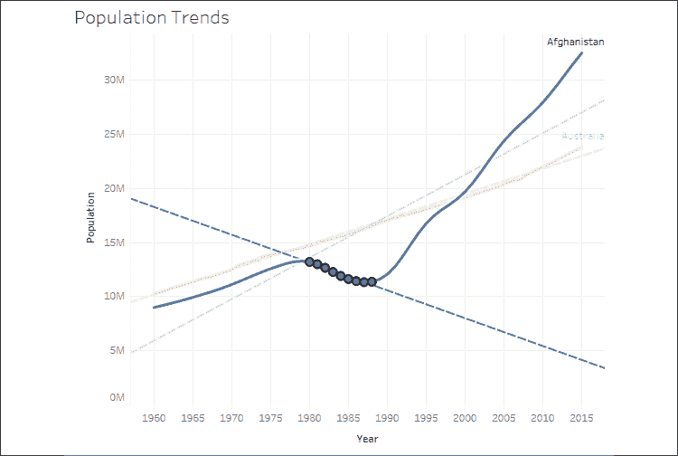
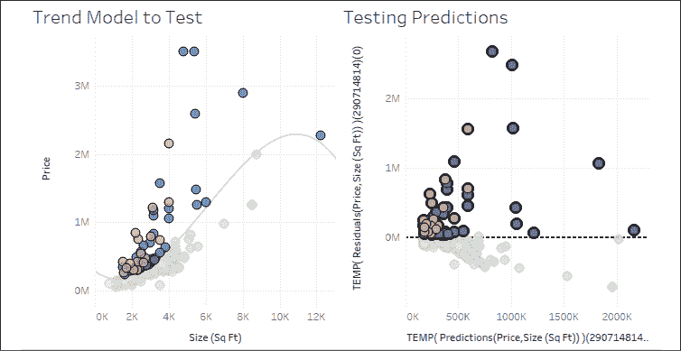
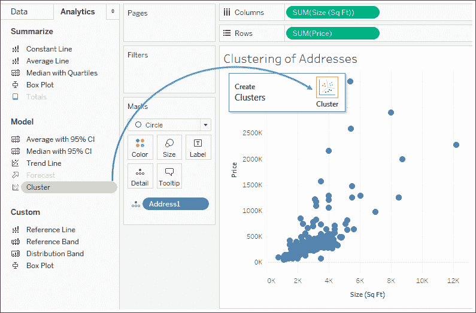
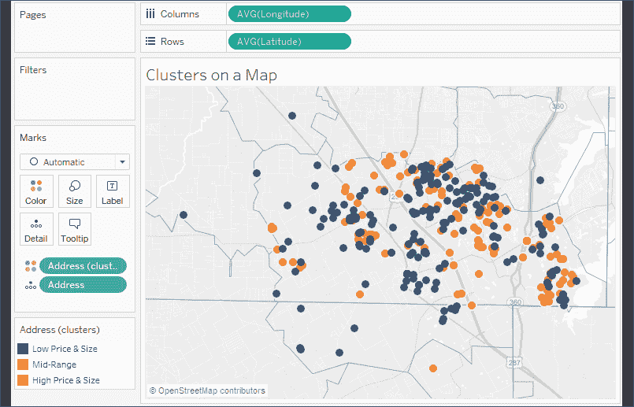

# 第九章：可视化分析 – 趋势、聚类、分布和预测

使用 Tableau 进行的快速视觉分析对于回答众多问题和做出关键决策非常有用。但它仅仅触及了可能分析的表面。例如，一个简单的散点图可以揭示异常值，但通常你会想要了解数据的分布，或者识别出类似的观察点的聚集。一个简单的时间序列帮助你看到某一指标随时间的涨跌，但通常，你想看到趋势或预测未来的数值。

Tableau 使你能够快速通过统计分析来增强数据可视化。内置的功能，如趋势模型、聚类、分布和预测，使你能够快速为你的可视化分析增值。此外，Tableau 还与 R 和 Python 平台集成，为数据的处理和分析提供了无限的选择。

本章将涵盖内置的统计模型和分析，包括以下主题：

+   趋势

+   聚类

+   分布

+   预测

我们将通过一些示例数据集来查看这些概念。你可以通过 `Chapter 9` 工作簿来跟随并重现这些示例。

在分析随时间变化的数据时，理解变化的整体趋势至关重要。我们将从观察和理解趋势开始。

# 趋势

`World Population.xlsx` 文件包含在 `Chapter 09` 目录中。它记录了每个国家从**1960**年到**2015**年的每一年的人口数据。使用这个数据集，让我们来看看不同国家的历史趋势。创建一个类似于下方截图所示的视图，展示**阿富汗**和**澳大利亚**随时间变化的人口数据。你会注意到**国家名称**已经被过滤，只包括**阿富汗**和**澳大利亚**，并且该字段还被添加到了**颜色**和**标签**货架中：


图 9.1：阿富汗和澳大利亚随时间变化的人口数据

仅从这个可视化图表中，你可以得出几个有趣的观察结论。到**1980**年，两国的人口增长相似。此后，阿富汗的人口开始下降，直到**1988**年才开始上升。在**1996**年左右，阿富汗的人口超过了澳大利亚。此后，两国之间的差距持续扩大。

虽然我们对这两个趋势有一些了解，但当我们看到趋势线时，它们变得更加明显。Tableau 提供了几种添加趋势线的方式：

+   从菜单中选择**分析** | **趋势线** | **显示趋势线**。

+   右键点击视图窗格中的空白区域并选择**显示趋势线**。

+   点击左侧边栏中的**分析**选项卡，切换到**分析**面板。将**趋势线**拖放到你选择的趋势模型上（在本例中我们使用**线性**模型，稍后我们将在本章中讨论其他模型）：

    图 9.2：通过从分析面板拖放来将趋势线添加到视图中

一旦将**趋势线**添加到视图中，你将看到两条趋势线：每个国家各一条。我们稍后将讨论如何定制显示。现在，你的视图应该像这样：


图 9.3：每条趋势线显示了各自国家的整体趋势

趋势是由 Tableau 在查询数据源后计算的，并且基于视图中的各个元素：

+   **定义 X 和 Y 坐标的两个字段**：位于**行**和**列**上的字段定义了*x*轴和*y*轴的坐标，允许 Tableau 计算各种趋势模型。为了显示趋势线，必须在**行**和**列**上使用连续（绿色）字段。唯一的例外是可以使用离散（蓝色）**日期**字段。如果你使用离散的**日期**字段来定义标题，另一个字段必须是连续字段。

+   **创建多个独立趋势线的附加字段**：**行**、**列**或**颜色**架上的离散（蓝色）字段可用作因素，将单一趋势线拆分为多个独立的趋势线。

+   **选择的趋势模型**：我们将在下一节中检查模型之间的差异，即**趋势模型**。

请在*图 9.3*中观察到有两条趋势线。由于**国家名称**是一个离散（蓝色）字段，且位于**颜色**上，因此默认情况下每种颜色都会定义一条趋势线。

如前所述，我们观察到阿富汗的人口在不同的历史时期内有所增减。请注意，趋势线是沿整个日期范围计算的。那么，如果我们想查看那些时间段的不同趋势线呢？

其中一个选项是简单地选择视图中感兴趣时间段的标记。默认情况下，Tableau 将为当前选择计算趋势线。例如，在这里，选择了**1980**到**1988**年间的阿富汗数据点，并显示了新的趋势：



图 9.4：默认设置指定将为选择绘制趋势线

另一个选项是指示 Tableau 使用**行**、**列**或**颜色**上的离散字段绘制不同的趋势线。

请继续创建一个名为**Period**的计算字段，该字段使用如下代码定义不同历史时期的离散值：

```py
IF [Year] <= 1979
  THEN "1960 to 1979"
ELSEIF [Year] <= 1988
  THEN "1980 to 1988"
ELSE "1988 to 2015"
END 
```

当你将其放置在列上时，你将得到每个时间段的标题，这会打断行并导致每个时间段显示不同的趋势。你还会观察到，Tableau 在每个时间段的轴上保留了完整的日期范围。你可以通过右键单击其中一个日期轴，选择**编辑轴**，然后勾选**每行或每列独立的轴范围**选项来设置独立范围：


图 9.5：这里，离散维度“周期”创建了三个独立的时间段，并为每个时间段绘制了趋势线

在这个视图中，已对**颜色**应用透明度，以帮助趋势线突出显示。此外，**年份**的轴被隐藏（通过取消勾选字段中的**显示标题**选项）。现在，你可以清楚地看到不同时期趋势的差异。澳大利亚的趋势在各个时期几乎没有变化，而阿富汗的趋势则变化较大。

在了解如何将趋势线添加到可视化之后，让我们更深入地探讨如何自定义趋势线和模型。

## 自定义趋势线

让我们再看一个例子，它将帮助我们考虑趋势线的各种选项。使用**房地产**数据源，创建一个像这样的视图：


图 9.6：散点图上的趋势线通常有助于更好地理解相关性和离群值

在这里，我们创建了一个散点图，**尺寸（平方英尺）**的总和放置在**列**上，用于定义*x*轴，**价格**的总和放置在**行**上，用于定义*y*轴。**地址**已添加到**标记**卡片的**详细信息**中，以定义聚合级别。因此，散点图上的每个标记都是一个在由尺寸和价格定义的位置的独特地址。**销售类型**已放置在**颜色**上。趋势线已经显示。根据 Tableau 的默认设置，有三条趋势线：每种颜色一条趋势线。置信区间已被隐藏。

假设有一个良好的模型，趋势线展示了**价格**与**尺寸**增加之间的关系，以及每种销售类型下价格的上涨速度和幅度。

在这个数据集中，我们有两个字段，**地址**和**ID**，每个字段定义了一个唯一的记录。将其中一个字段添加到**详细级别**，实际上会将数据进行拆分，并允许我们为每个单独的属性绘制一个标记。有时，数据中可能没有定义唯一性的维度。在这种情况下，你可以通过在**分析**菜单中取消勾选**聚合度量**来拆分数据。

另外，你可以使用每个度量字段在行和列上的下拉菜单，将它们从度量更改为维度，同时保持它们是连续的。作为维度，每个单独的值将定义一个标记。保持连续性将保留趋势线所需的轴。

让我们考虑一些趋势线的可用选项。您可以通过使用菜单并选择**分析** | **趋势线** | **编辑趋势线...** 或右键单击趋势线然后选择**编辑趋势线...** 来编辑趋势线。当您这样做时，您将看到如下的对话框：


图 9.7：Tableau 提供多种配置趋势线的选项

在这里，您可以选择**模型类型**；选择模型中适用的字段作为因素；允许离散颜色定义不同的趋势线；显示**置信区间**；强制 y 截距为零；为所选标记显示重新计算的趋势；以及显示趋势线的**工具提示**。我们将更详细地研究这些选项。

只有在确信必须为零时才应将 y 截距强制为零。根据这些数据，它几乎肯定不为零（即，不存在面积为 0 平方英尺且标价为$0 的房屋）。

现在，尝试各种选项。注意如何将**销售类型**字段作为因素移除或取消选中**每种颜色显示趋势线**选项将导致单一趋势线。

可以从下面的视图中排除一个字段作为因素的结果，其中**销售类型**已添加到**行**中：


图 9.8：将字段作为因素包含告诉 Tableau 它是否有助于趋势模型

如前述截图的左侧部分所示，**销售类型**被包括为因素。这导致每种销售类型有一个明显的趋势线。当将**销售类型**排除为因素时，相同的趋势线（即所有类型的总体趋势）将绘制三次。这种技术对比较数据子集和总体趋势非常有用。

自定义趋势线只是使用趋势了解数据的一个方面。同样重要的是趋势模型本身，我们将在下一节考虑定制。

## 趋势模型

让我们回到原始视图，并继续使用单一趋势线，考虑在 Tableau 中可用的趋势模型。下面的模型可以从**趋势线选项**窗口中选择。

### 线性

如果我们假设随着**尺寸**增加，**价格**将以恒定速率增加，我们将使用线性模型。无论**尺寸**增加多少，我们都预期**价格**增加，以便新数据点接近直线：


图 9.9：线性趋势

### 对数

如果我们预计实际上存在**边际效益递减法则**，即在买家停止支付更多之前，尺寸只能增加这么多：


图 9.10：对数趋势

### 指数

我们将使用指数模型来测试这样一个观点：每增加一点尺寸会导致价格的显著（指数级！）增加：


图 9.11：指数趋势

### 幂次

如果我们认为大小与价格之间的关系是非线性的，并且介于递减的对数趋势和爆炸性的指数趋势之间，我们会采用幂次趋势模型。该曲线表示价格是尺寸的某个幂次函数。幂次趋势非常适用于预测某些事件，例如车辆加速的行驶距离：


图 9.12：幂次趋势

### 多项式

如果我们认为**大小**和**价格**之间的关系较为复杂，并且遵循更像**S**形曲线的趋势——最初增大尺寸会显著提高价格，但到某一点后价格趋于平稳——我们将使用此模型。你可以将多项式模型的度数设置为从`2`到`8`之间。这里显示的趋势线是一个 3^(rd)度的多项式：


图 9.13：3^(rd)度多项式趋势

你需要了解趋势模型的基础知识，以便测试和验证你对数据的假设。某些趋势模型对于我们的数据显然是错误的（尽管在统计学上仍然有效，但价格指数增长的可能性极低）。常识与日益增加的统计学知识将帮助你在不断发展的过程中取得进展。

你可能还希望分析模型的准确性，我们接下来会进行这方面的讨论。

## 分析趋势模型

观察趋势线可能很有用，但通常我们希望了解我们选择的趋势模型是否具有统计学意义。幸运的是，Tableau 为我们提供了一些趋势模型和计算的可视化信息。

只需将鼠标悬停在单一趋势线上，就可以看到该趋势线的公式，以及**R 平方**和**P 值**：


图 9.14：将鼠标悬停在趋势线时显示的提示信息

**P 值**是一个统计学概念，描述了假设值之间没有关系（即随机机会）时，结果与趋势模型预测的结果之间的相似度的概率。P 值为 5%（.05）意味着有 5%的概率是随机机会能够至少与趋势模型一样好地描述值之间的关系。这也是为什么 P 值在 5%或以下通常被认为表明趋势模型显著的原因。P 值高于 5%通常会让统计学家质疑趋势模型所描述的相关性。

此外，你还可以通过从菜单中选择**分析** | **趋势线** | **描述趋势模型...**，或者通过右键单击视图面板中的相似菜单来查看趋势模型的更详细描述。当你查看趋势模型时，将会看到**描述趋势模型**窗口：


图 9.15：描述趋势模型窗口

你还可以在工作表描述中获得趋势模型的描述，该描述可以通过**工作表**菜单或按下*Ctrl* + *E*来访问。工作表描述包含了当前视图的其他有用的总结信息。

窗口中显示的丰富统计信息包括趋势模型的描述、公式、观测数量以及模型整体和每条趋势线的**p 值**。注意，在前面展示的截图中，**类型**字段作为一个因素被包含在内，定义了三条趋势线。你可能会发现，视觉化中的不同线条（例如*图 9.6*中的线条）的 p 值是不同的。有时，即使某些趋势线的 p 值不显著，你也可能会发现整个模型在统计上是显著的。

通过显示总结信息，Tableau Desktop 可以显示给定视图的额外统计总结信息。通过菜单选择**工作表** | **显示总结**。在**总结**卡片上的下拉菜单中可以展开显示的总结信息：


图 9.16：总结信息

通过工具提示和总结提供的大量信息将帮助你评估趋势模型并理解其准确性和细节。但我们甚至可以进一步，通过导出并分析趋势模型的统计数据。接下来我们将讨论这个话题。

### 导出统计模型详情

Tableau 还提供了导出数据的功能，包括与趋势模型相关的数据。这使得你能够更深入地——甚至是通过可视化的方式——分析趋势模型本身。让我们分析房地产价格与面积散点图的三次多项式趋势线，而不考虑任何因素。要导出与当前视图相关的数据，请使用菜单选择**工作表** | **导出** | **数据**。数据将被导出为**Microsoft Access 数据库**（`.mdb`）文件，并且系统会提示你保存文件的位置。

导出数据到**Access**的功能仅限于 PC。如果你使用的是 Mac，则没有此选项。你可以快速浏览这一部分，但不必担心你无法复制示例。

在**导出数据到 Access**屏幕上，指定一个 Access 表名称，并选择是导出整个视图的数据还是仅导出当前选择的数据。你还可以指定 Tableau 应该连接到数据。这将生成数据源，并以指定名称将其提供给当前工作簿：


图 9.17：导出数据到 Access 对话框

新的数据源连接将包含原始视图中的所有字段，以及与趋势模型相关的附加字段。这使得我们可以像下面这样使用残差和预测构建一个视图：


图 9.18：使用残差和预测来测试模型的视图

预测（*x* 轴）和残差（*y* 轴）的散点图可以让你直观地看到每个标记与趋势线预测位置之间的距离。这也能让你看出残差是否均匀分布在零的两侧。如果分布不均，则可能表明趋势模型存在问题。

你可以将这个新视图与原始视图一同放在仪表板上，以便直观地探索趋势模型。使用工具栏上的高亮按钮来高亮显示 **地址** 字段：


图 9.19：高亮按钮

定义了高亮动作后，在一个视图中选择标记，将使你能够在另一个视图中看到它们。你可以扩展此技术，将多个趋势模型和仪表板导出，以同时评估几个趋势模型：



图 9.20：将原始视图与测试视图并排放置，可以看到它们之间的关系

### 使用 R 和 Python 进行高级统计分析等

你可以利用 Tableau 与 R 或 Python 的集成功能，进行更复杂的统计分析。**R** 是一个开源的统计分析平台和编程语言，您可以使用它定义高级统计模型。**Python** 是一种高级编程语言，它因易用性而迅速获得数据分析师和数据科学家的广泛关注。Python 提供了许多数据清洗功能以及统计函数库。

要使用 R 或 Python，首先需要安装一个 `R` 服务器或 `TabPy`（Tableau 提供的 Python API），然后配置 Tableau 以使用 R 服务器或 TabPy。要了解更多关于安装和使用 R 服务器或 TabPy 的信息，请参考以下资源：

**R**: [`www.tableau.com/solutions/r`](https://www.tableau.com/solutions/r)

**Python**: [`www.tableau.com/about/blog/2017/1/building-advanced-analytics-applications-tabpy-64916`](https://www.tableau.com/about/blog/2017/1/building-advanced-analytics-applications-tabpy-64916)

本书并未深入探讨 R 和 Python 的复杂性，但了解它们的功能将帮助你进一步研究该主题。

接下来，我们将查看 Tableau 如何利用聚类分析识别数据中复杂的关系。

# 聚类分析

Tableau 使你能够在可视化中快速执行聚类分析。这可以让你根据选择的任意数量，找到彼此相似的单个数据点的组，或者说是 **聚类**。这种功能在许多不同的行业和学科中都非常有用，以下是一些例子：

+   营销部门可能会发现，根据消费金额、购买频率或订单时间和日期，确定彼此相关的顾客群体是有用的。

+   医院中的病人护理主任可能会从了解基于诊断、药物、住院时间和再入院次数的病人群体中获益。

+   免疫学家可能会根据抗药性或基因标记搜索相关的细菌菌株。

+   可再生能源顾问可能希望根据能源生产来定位风车的聚类，然后将其与地理位置进行关联。

Tableau 使用标准的 **k-均值聚类** 算法，每次渲染视图时都会产生一致的结果。Tableau 会自动分配聚类数（k），但你可以选择调整该值，并分配任意数量的变量。

在我们考虑聚类时，我们将再次回到房地产数据，看看我们是否能够找到市场上相关房屋的分组，然后根据我们找到的聚类确定是否存在地理模式。

尽管你可以在任何可视化中添加聚类，但我们将从散点图开始，因为它已经允许我们查看两个变量之间的关系。这将为我们提供一些关于聚类如何工作的洞察，然后我们可以添加额外的变量，看看聚类是如何重新定义的。

从 **地址** 按 **面积** 和 **价格** 的基本散点图开始，切换到 **分析** 面板，并将 **聚类** 拖到视图中：



图 9.21：通过从分析面板拖放添加聚类

当你将 **聚类** 拖到视图时，Tableau 会生成一个新的 **聚类** 字段（这里自动放置在 **颜色** 上），并会显示一个包含作为 **变量** 使用的字段和更改 **聚类数** 选项的 **聚类** 窗口。**变量** 默认将包含视图中已经存在的度量：


图 9.22：基于价格和面积的单独地址的聚类

**变量** 是聚类算法用来确定相关数据点的所有因素。**聚类数** 决定了数据被划分成多少组。在前面的视图中，你将看到三个房屋聚类：

+   价格较低且面积较小的（蓝色）

+   价格和大小适中的（橙色）

+   价格较高且面积较大的（灰色）

由于用于聚类的两个变量与散点图中使用的变量相同，因此比较容易看出聚类的边界（你可以想象几条对角线将数据分区）。

你可以将几乎任何字段从 **数据面板** 或 **视图** 拖动到 **变量** 部分进行添加或删除变量。随着你这样做，聚类会自动更新。通过将 **卧室数** 添加到 **变量** 列表中进行实验，观察到 **聚类 1** 和 **聚类 2** 之间现在有了一些重叠，因为一些较大的房屋只有两三个卧室，而一些较小的房屋可能有四五个卧室。卧室数量现在有助于定义聚类。移除 **卧室数**，并注意到聚类会立即再次更新。

一旦你得到了有意义的集群，就可以通过将其从视图中拖动并放入**数据**面板，将集群物化为数据源中的组：


图 9.23：通过将集群字段从视图拖动到数据面板来物化集群

集群组在渲染时不会重新计算。要重新计算集群组，请使用**数据**面板中字段的下拉菜单，并选择**重新调整**。

使用集群组可以完成很多事情，包括以下内容：

+   集群组可以跨多个可视化使用，并可以在仪表板上的操作中使用。

+   集群组可以编辑，如果需要，个别成员可以在组之间移动。

+   集群组的名称可以设置别名，从而允许比**集群 1**和**集群 2**更具描述性的名称。

+   集群组可以在计算字段中使用，而集群则不能。

在以下示例中，已经根据前一视图中的**地址（集群）**组对房产地图进行了颜色编码，以帮助我们查看基于价格和大小的集群是否与地理位置有关。虽然这些集群可以直接在此可视化中创建，但该组有一些之前提到的优势：



图 9.24：此视图使用我们识别的集群，进一步理解任何地理空间关系

在此视图中，每个原始集群现在都是一个已经设置了别名的组，从而为集群提供了更好的描述。你可以使用数据面板中组字段的下拉菜单，或者右键点击颜色图例中的项目来编辑别名。

映射的外观有很多编辑选项。你可以调整显示在地图上的图层，以便为你绘制的数据提供更多背景信息。从顶部菜单中选择**地图** | **地图图层**。图层选项将显示在左侧边栏中。之前的地图启用了**街道**、**高速公路**、**县边界**和**邮政编码边界**，以便为每个地址提供更精确的位置背景。可以选择的图层将取决于地图的缩放级别。

在查看之前的视图时，确实可以看到一些几乎完全是**低价和小尺寸**（**集群 1**）的邻域，另一些则几乎完全是**中等价位**（**集群 2**）。试想一个房地产投资者如何利用这样的可视化来寻找在中等价位社区中的低价房屋。

# 分布

分析分布非常有用。我们已经看到某些计算可以用于确定统计信息，如平均值、百分位数和标准差。Tableau 还可以轻松地快速可视化各种分布，包括置信区间、百分比、百分位数、分位数和标准差。

您可以使用**分析**窗格添加任何这些视觉分析功能（或者，您可以右键单击轴并选择**添加参考线**）。与参考线和带状图一样，分布分析可以应用于表、窗格或单元格的范围内。当您拖放所需的视觉分析时，您将有选择范围和轴的选项。在以下示例中，我们从**分析**窗格将**分布带**拖放到由`Sum(Price)`定义的**窗格**轴上：


图 9.25：在添加参考线和分布时，定义范围和轴

选择了范围和轴之后，您将有更改设置的选项。您还可以通过右键单击视图中的分析功能或轴或参考线本身来编辑线条、带状图、分布和箱线图。

例如，让我们以价格和大小为轴，将**销售类型**放在**列**上，并加上颜色的散点图为例：


图 9.26：一个分为三列的散点图

接下来，我们从**分析**窗格将**分布**带放置到仅定义为**价格**轴的**窗格**中。这将弹出一个对话框来设置选项：


图 9.27：用于添加或编辑线条、带状图、分布或箱线图的对话框

每个特定**分布**选项在**计算**下拉菜单中有独特的设置。例如，**置信区间**允许您指定一个百分比值作为区间。**标准差**允许您输入一个逗号分隔的数值列表，描述多少个标准差和在什么间隔下。前述设置反映了指定**-2**、**-1**、**1**和**2**个标准差。调整标签和格式如前述屏幕截图所示后，您应该看到如下结果：


图 9.28：每种销售类型价格的两个标准差

由于您将标准差应用于每个窗格，因此每种销售类型都有不同的带状图。每个轴都可以支持多个分布、参考线和带状图。例如，在前述视图中添加平均线可帮助观看者理解标准差的中心。

在散点图上，为每个轴使用分布可以提供分析异常值的非常有用的方法。显示**面积**和**价格**的单个标准差使您能够轻松查看落入两者或其中一个或都不符合正常价格范围的属性（您可能会考虑购买一套房子，其大小处于高端但价格在正常范围内！）：


图 9.29：所有房屋价格和大小的一个标准差

# 预测

如我们所见，趋势模型可以进行预测。在一个良好的模型下，你可以期望额外的数据会遵循这个趋势。当趋势随着时间推移时，你可以大致了解未来值可能落在何处。然而，预测未来值通常需要另一种类型的模型。季节性等因素可能会产生趋势模型无法预测的差异。Tableau 包含内置的预测模型，可以用来预测并可视化未来值。

要使用预测功能，你需要一个包含日期字段或足够日期部分的视图，以便 Tableau 可以重建日期（例如，**年份**和**月份**字段）。Tableau 还允许基于整数进行预测，而不是仅限于日期。你可以从**分析**窗格中拖放预测，选择**分析** | **预测** | **显示预测**，或右键点击视图窗格并从上下文菜单中选择该选项。

例如，下面是展示阿富汗和澳大利亚人口增长及其预测结果的视图：


图 9.30：阿富汗和澳大利亚的人口预测

请注意，当你显示预测时，Tableau 会在**行**的`SUM(人口)`字段上添加一个预测图标，以表明该度量值正在进行预测。此外，Tableau 还会在**颜色**中添加一个新的特殊**预测指示器**字段，以便在视图中区分预测值与实际值。

你可以将**预测指示器**字段移动，甚至复制它（在拖动和放置时按住*Ctrl*键）到其他货架上，以进一步自定义你的视图。

当你通过从菜单中选择**分析** | **预测** | **预测选项...**，或在视图上使用右键菜单进行编辑时，你将看到多个选项，允许你自定义趋势模型，如下所示：


图 9.31：预测选项对话框

在这里，你可以设置预测的时长、确定聚合方式、自定义模型，并设置是否希望显示预测区间。默认情况下，预测长度设置为**自动**，但你也可以通过自定义值来延长预测时长。

**源数据**下的选项允许你可选地为模型指定不同的数据粒度。例如，视图可能按年份显示一个度量值，但你可以允许 Tableau 查询源数据以按月份检索值，并使用更细粒度的数据来潜在地实现更好的预测结果。

Tableau 能够单独查询数据源以获取更细粒度的数据，从而获得更精确的结果，这在处理关系型数据源时效果很好。然而，**联机分析处理**（**OLAP**）数据源不兼容这种方法，这也是为什么在处理数据立方体时无法使用预测功能的原因之一。

默认情况下，最后一个值会被排除在模型之外。这在你处理的数据中，最近期的时间段尚不完整时非常有用。例如，当记录是每日添加时，最后（当前）月份在最后一天记录添加之前是不会完整的。如果在最后一天之前该不完整的时间段未被忽略，可能会影响模型的准确性。

模型本身可以设置为自动模式，带或不带季节性，或者可以自定义设置季节性和趋势的选项。要了解这些选项，请参考以下来自 `Superstore` 示例数据集的 **按月销售** 视图：


图 9.32：此时间序列显示了一个周期性或季节性模式

数据显示出明显的周期性或季节性模式。这对于零售销售和其他类型的数据非常典型。以下是选择不同自定义选项的结果：


图 9.33：选择不同的预测模型会产生不同的结果

检查上述差异将帮助你理解选项之间的不同。例如，注意没有季节性时，结果是一条直线，不随季节波动。乘法趋势会导致更陡峭的上升和下降，而乘法季节性则会导致更剧烈的变化。

与趋势类似，预测模型和摘要信息可以通过菜单访问。选择 **分析** | **预测** | **描述预测** 将显示一个窗口，其中包含关于模型的摘要和详细信息的选项卡：


图 9.34：Tableau 描述了预测模型

点击窗口底部的 **了解更多关于预测摘要的信息** 链接，将为你提供更多关于 Tableau 中使用的预测模型的信息。

预测模型仅在满足特定条件时启用。如果该选项被禁用，请确保你连接的是关系型数据库而非 OLAP，且未使用表计算，且至少有五个数据点。

# 摘要

Tableau 提供了一套丰富的功能，帮助你为分析添加更多价值。趋势线使你能够更准确地识别离群值，确定哪些值落在某些模型的预测范围内，甚至可以预测测量值的预期位置。Tableau 提供了对趋势模型的全面可视化，甚至允许你导出包含趋势模型预测值和残差的数据。聚类功能可以帮助你基于各种因素找到相关数据点的组。分布功能有助于理解数据集中的值分布。预测功能能够通过复杂的趋势和季节性模型预测未来的结果。充分理解这些工具将使你能够澄清和验证最初的可视化分析。

接下来，我们将考虑一些高级可视化类型，这些类型将拓展你在使用 Tableau 时能够完成的工作范围，以及你向他人传达数据的方式！
