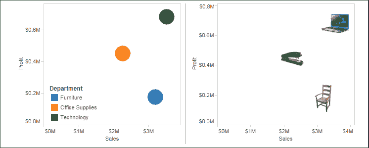
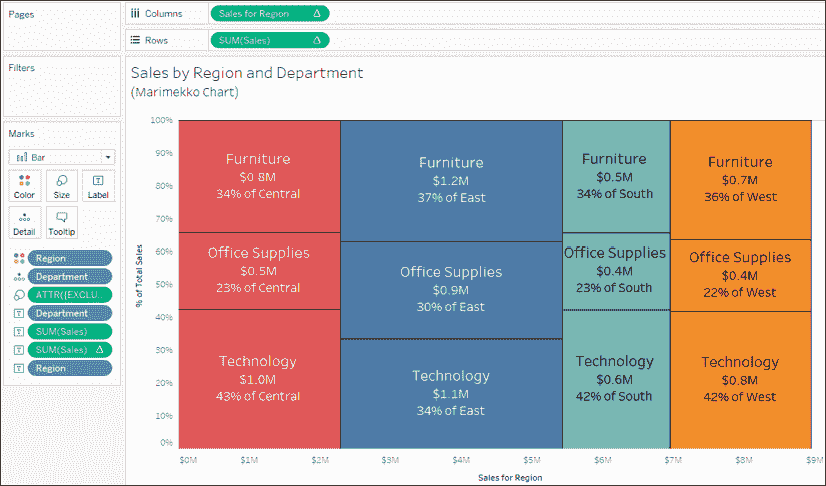
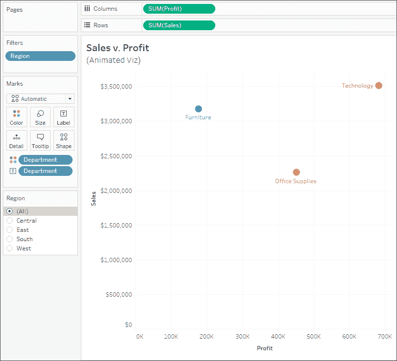

# 第十章：高级可视化

我们已经探索了许多不同类型的可视化，并考虑了它们最适合回答哪些类型的问题。例如，条形图有助于比较数值；折线图可以显示随时间变化的趋势和变化；堆叠条形图和树状图帮助我们看到部分与整体的关系；箱形图帮助我们理解分布和异常值。我们还看到如何通过计算、注释、格式化和参考线来增强我们的理解和数据叙事。以这些知识为基础，我们将通过一些高级可视化扩展数据分析的可能性。

这些仅仅是 Tableau 惊人灵活性的示例，旨在激发你思考新的方式来查看、理解和传达数据。这些图表并不是为了复杂而复杂，而是为了激发创造力和兴趣，从而有效地传达数据。

我们将考虑以下主题：

+   高级可视化——何时以及为什么使用它们

+   坡度图和波动图

+   漏斗图

+   步骤线和跳跃线

+   火花线

+   哑铃图

+   单位/符号图

+   Marimekko 图

+   动画可视化

# 高级可视化——何时以及为什么使用它们

到目前为止，我们看到的可视化类型可以回答你关于数据的许多问题。如果你问的是*什么时候？*，那么时间序列可能是最合适的解决方案。如果你问的是*多少？*，条形图可以提供一个快速且好的结果。但有时候，你会提出一些问题，用其他类型的可视化会更好地回答。例如，运动或流动可能最好用桑基图表示。*多少个？* 可能最好用单位图或符号图回答。比较排名或绝对值的变化可能最适合使用坡度图或波动图。这些后续的可视化并不是你在最初探索数据时会使用的。但当你深入分析并想了解或传达更多信息时，你可以考虑本章中的一些选项。

本章中的每个可视化都是使用提供的`Superstore`数据创建的。我们不会提供逐步的操作指引，而是指出每种图表类型中使用的具体高级技巧。我们的目标不是让你记住步骤，而是让你理解如何创造性地利用 Tableau 的功能。

你可以在`第十章完整`工作簿中找到完整的示例，或者通过使用`第十章入门`工作簿从零开始构建，测试你不断增长的 Tableau 技能。

让我们从坡度图和波动图开始我们的高级可视化之旅。

# 坡度图和波动图

**坡度图**展示了从一个时期或状态到另一个时期或状态的值变化。例如，这里是一个坡度图，展示了**南部**地区每个州在**2016**到**2017**年间销售排名的变化：


图 10.1：坡度图有助于比较从一个时期或状态到另一个时期或状态的排名或绝对值的变化。

以下是用于创建前述坡度图的一些功能和技术：

+   表格计算**Rank(SUM(Sales))**是通过（按**州**分组）计算的，这意味着每个州在单一年度的分区内进行排名。

+   **网格线**和**零线**的**行**已设置为**无**。

+   轴已经被反转（右键单击轴并选择**编辑**，然后勾选反转选项）。这样可以使排名**#1**显示在顶部，较低的排名按降序排列。

+   轴已被隐藏（右键单击轴并取消勾选**显示标题**）。

+   标签已被编辑（点击**标签**）以显示在线的两端，垂直居中，并将排名数字放在州名旁边。

+   年份列标题已从视图底部移至顶部（从顶部菜单中选择**分析 | 表格布局 | 高级**，然后取消选中将最内层级别显示在底部的选项）。

+   已添加**数据高亮**（在视图中的`State`字段的下拉菜单中选择**显示高亮**），使最终用户能够突出显示一个或多个州。

数据高亮使用户能够通过从下拉列表中选择值或输入内容（任何部分匹配的值都会高亮显示标记；例如，输入`Carolina`会高亮显示**北卡罗来纳州**和**南卡罗来纳州**）。数据高亮可以显示在你在视图中使用的任何离散字段（蓝色），并且可以跨多个视图在仪表板中使用，只要这些视图中使用了相同的字段。

坡度图可以使用绝对值（例如，**销售额**的实际值）或相对值（例如，**销售额**的排名，如本例所示）。如果你展示超过两年的数据以观察排名在多个时期的变化，那么结果的可视化图表可能被称为**碰撞图**，其外观如下：


图 10.2：此碰撞图显示了每个州随时间变化的排名变化，并利用了高亮功能。

坡度图在比较前后的排名或从一个州到另一个州的排名时非常有用。碰撞图则将这一概念扩展到多个时期。当你想要理解排名的相对变化并对比这种变化时，可以考虑使用这两种图表之一。

接下来，我们将考虑一种帮助我们理解部分与整体关系的图表。

# 漏斗图

**瀑布图**在你想展示各个部分如何逐步累积到整体时非常有用。例如，在以下截图中，瀑布图显示了利润如何在各个**部门**和**产品类别**中逐步累积到最终总和。有时利润为负数，在这种情况下，瀑布图会出现下跌，而正值则逐步累积到总和：


图 10.3：该瀑布图显示了每个类别如何增加（或减少）利润，逐步构建出总和

以下是构建图表所使用的特性和技巧：

+   **SUM(Profit)** 字段在**行**上是一个**累计总和**表计算（使用**快速表计算**从下拉菜单创建），并且是跨整个表计算的。

+   已经在视图中添加了**行总计**（从**分析**窗格拖放）。

+   标记类型设置为**甘特条形图**，并使用了临时计算，代码为：**SUM(Profit)** 来确定大小。一开始这可能看起来有点奇怪，但它会让甘特条形图根据实际值绘制，当利润为正时填充向下，利润为负时填充向上。

+   **类别**按其利润总和升序排序，使得瀑布图在每个**部门**内从左到右逐渐（或负向）构建。你可能需要尝试不同的排序选项，看看它们对展示效果的影响。

瀑布图将帮助你展示一个逐步累积或向总和/整体值推进的过程。接下来，我们将考虑阶梯线和跳跃线，用来展示随时间变化的离散变化。

# 阶梯线和跳跃线

标记类型设置为**线条**，点击**路径**架，你将看到三种**线条类型**选项：


图 10.4：点击标记卡上的路径，改变线条类型

这三种选项为：

1.  **线性**：使用倾斜的线条来强调值之间的运动或过渡。这是默认设置，并且本书中所有的线图示例都使用了这种线条类型。

1.  **阶梯线**：保持连接，但强调离散的变化步骤。当你想表达值之间没有过渡，或者过渡是一个离散的变化步骤时，这种线条类型非常有用。例如，你可能想展示一段时间内发电机的数量变化。从 7 到 8 的变化是一个离散的变化，可能最适合用阶梯线表示。

1.  **跳跃线**不连接，当值发生变化时，会开始新的一条线。跳跃线在你想展示某个特定状态存在一段时间后跳到另一个状态时非常有用。例如，你可能想展示一家酒店随时间变化的日入住率。跳跃线可以帮助强调每一天的入住率是一个新的值。

在以下示例中，我们使用之前用**瀑布图**演示的利润构建过程，采用阶梯线来显示每一步骤的利润变化：


图 10.5：阶梯线图强调突变或离散差异。

尝试切换线条类型，查看其视觉效果以及每种类型对数据的传达方式。

# 小火花图

**小火花图(Sparklines)**是通过多个小型线形图展示的可视化，它们旨在快速读取和比较。小火花图的目标是提供一种可以一眼看懂的可视化。你并不是在传达精确的数值，而是让观众快速理解趋势、变化和模式。

在这种可视化方法的各种用途中，你可能已经在财务出版物中看到过小火花图，用于比较股票价格的变动。回想一下，在*第一章*中，我们讨论了**小火花图(Sparklines)**的初步实现，分析了折线图的迭代过程。这里是一个更加完善的示例：


图 10.6：小火花图让你快速浏览多个类别的时间变化趋势。

你可以通过以下步骤构建这样的图表：

1.  从**订单日期(Order Date)**按**季度(Quarter)**展示**销售总和(SUM(Sales))**的简单视图开始，并将**类别(Category)**放入**行(Rows)**。

1.  创建两个计算字段，显示每个类别的季度最低和最高销售额。**最低销售额(Min Sales)**的公式是`WINDOW_MIN(SUM(Sales))`，**最高销售额(Max Sales)**的公式是`WINDOW_MAX(SUM(Sales))`。将这两个字段添加到**行(Rows)**中，作为离散（蓝色）字段。

1.  将计算字段**最后销售(Last Sales)**，公式为`IF LAST() == 0 THEN SUM([Sales]) END`，放入**行(Rows)**，并使用同步的双轴与圆形标记类型，突出显示每个时间段的最终销售值。

1.  编辑**销售总和(SUM(Sales))**的轴，使每行或列具有独立的轴范围，并隐藏轴。这可以突出显示线条的变化。记住：目标不是显示精确的数值，而是让观众看到模式和变化。

1.  隐藏**行(Rows)**的网格线。

1.  调整视图大小（水平压缩并设置为**适应高度(Fit Height)**）。这将使小火花图适应小空间，便于快速理解模式和趋势。

小火花图可以与各种时间序列一起使用，帮助快速洞察整体趋势和行为。

# 哑铃图

**哑铃图(Dumbbell chart)**是圆形图的一种变体，用于比较每个数据切片的两个数值，突出显示这两个数值之间的距离。

例如，下面是一个展示**东西部地区利润差异**的图表，按每个**类别(Category)**的产品进行展示：


图 10.7：哑铃图强调两个数值之间的距离/差异。

此图表是使用以下功能和技术构建的：

+   已使用同步的双轴图，其中一个轴用于标记**利润总和(SUM(Profit))**，另一个轴用于**圆形(Circle)**标记，另一个用于**线形(Line)**标记。

+   **类别**已按**利润**降序排序（排序时将东部和西部的利润合并）。

+   **区域**已放置在**路径**架位上，以便线条告诉 Tableau 在两个**区域**之间绘制一条线。

    **路径**架位适用于**线条**和**多边形**标记类型。当你将字段放置在**路径**架位时，它告诉 Tableau 连接点的顺序（按照放置在**路径**上的字段的排序顺序）。路径通常用于地理可视化中，连接原点和目的地，但也可以用于其他可视化类型。Tableau 会在两个值之间（在此例中是东部和西部）绘制一条线。

+   **区域**已放置在**颜色**上，用于圆形标记类型。

哑铃图非常适合突出值之间的差异。接下来我们考虑如何使用单位/符号图表来推动反应。

# 单位/符号图表

**单位图表**可以用来显示单个项目，通常使用形状或符号来代表每个个体。这些图表能够引起强烈的情感反应，因为数据的表现形式不那么抽象，更容易识别为真实的事物。例如，下面的图表显示了每个**区域**中有多少客户的订单发生了延迟发货：


图 10.8：每个图像代表一个真实的人，远比圆形或方形更具象

该视图使用了以下技术：

+   视图被过滤，仅显示**延迟发货**为**True**的记录。**延迟发货**是一个计算字段，用于判断订单是否超过`14`天才发货。代码如下：

    ```py
    DATEDIFF('day', [Order Date], [Ship Date]) > 14 
    ```

+   **区域**已按**客户 ID**的不同计数降序排序。

+   **客户 ID**已放置在**详细信息**上，以便为每个独立客户生成一个标记。

+   标记类型已更改为**形状**，并且形状已更改为**性别**形状调色板中的人形图形。要更改形状，请点击**形状**架位并选择所需的形状，如下图所示：

    图 10.9：你可以使用形状架位将形状分配给维度值

前述的单位图表可能比标准条形图更能引起区域经理的反应，尤其是在他们被温和提醒，客户服务不佳会影响真实人群时。尽管这些形状仍然是抽象的，但它们更能代表实际的人物。你还可以考虑为标记添加客户姓名标签或使用其他技巧来进一步吸引你的观众。

请记住，通常在 Tableau 中，每个维度值交叉点都会生成一个标记。因此，对于一个只包含某字段值`10`的单行数据，绘制`10`个单独的形状会相当困难。这意味着你需要考虑数据的形态，并包含足够的行数来绘制你希望表示的单位。

在任何类型的可视化中，具体的形状也能显著减少理解数据所需的时间。对比这两个散点图中识别部门所需的努力量：



图 10.10：注意左图和右图之间的“认知负荷”差异

一旦你了解了形状的含义，就不再需要参考图例。将离散字段放置在**形状**架上，可以将形状分配给字段的各个值。

形状是位于`My Tableau Repository\Shapes`目录中的图像。你可以通过在该目录下添加文件夹和图像文件，将自定义形状包含在子文件夹中。

# Marimekko 图表

**Marimekko 图表**（有时也叫做**Mekko 图表**）类似于垂直堆叠条形图，但额外使用了不同宽度的条形图来传达有关数据的更多信息。例如，下面是一个**Marimekko 图表**，展示了按区域和部门分类的销售情况。

条形图的宽度传达了**区域**的总**销售额**，而每个部分的高度则展示了**部门**在该**区域**内的销售百分比：



图 10.11：每个部分的高度表示每个部门的销售额，而每个条形图的宽度则表示每个区域的总销售额

在 Tableau 中创建 Marimekko 图表利用了根据坐标轴的单位固定条形图宽度的功能。

当一个连续（绿色）字段位于**列**上（从而定义了横轴），且标记类型设置为**条形**时，点击**大小**架会显示固定大小的选项。你可以手动输入**大小**和**对齐方式**，或将字段拖到**大小**架上，以改变条形图的宽度。

创建这种可视化所需的步骤如下：

1.  标记类型已特别设置为**条形**。

1.  **区域**和**部门**分别被放置在**颜色**和**详细信息**架上。它们是视图中唯一的维度，因此定义了视图的**详细级别**。

1.  **销售额**已放置在**行**上，并应用了**总百分比**快速表计算。**计算方式**（地址）已设置为**部门**，这样我们就能得到每个部门在**区域**分区中的销售百分比。

1.  计算字段**区域销售**计算了每个条形图右侧位置的*X*轴位置。代码如下：

    ```py
    IF FIRST() = 0 
        THEN MIN({EXCLUDE [Department] : SUM(Sales)}) 
    ELSEIF LOOKUP(MIN([Region]), -1) <> MIN([Region]) 
        THEN PREVIOUS_VALUE(0) + MIN({EXCLUDE [Department] : SUM(Sales)}) 
    ELSE 
        PREVIOUS_VALUE(0) 
    END 
    ```

虽然这段代码一开始可能显得令人望而生畏，但它遵循了逻辑进程。具体来说，如果这是第一个条形段，我们需要知道`Region`的总和，我们需要将之前**Region**的总和与新的**Region**总和相加。否则，计算的是同一个**Region**中的另一个条形段，因此区域总和与前一个条形段相同。再次注意，**Compute Using**选项已设置为**Department**，以使逻辑进程按预期工作。

最后，对视图进行了几个额外的调整：

+   **Size**字段是一个临时的详细计算，代码为`{EXCLUDE [Department] : SUM(Sales)}`。正如我们之前提到的，这排除了**Department**字段，允许我们获取**Region**级别的销售总和。这意味着每个条形的大小是根据给定**Region**的总销售额来确定的。

+   点击**Size**架构可以设置条形的对齐方式为右对齐。由于之前的计算给出了条形的正确位置，我们需要确保条形从该起始点绘制。

+   各种字段，如**SUM(Sales)**的绝对值和百分比，已被复制到**Label**架构中，以便每个条形段能够更清晰地传达含义给观众。

要为每个**Region**列添加标签，您可以考虑创建第二个视图并将两个视图放置在仪表板上。或者，您也可以使用注释。

除了让您能够创建 Marimekko 图表外，控制条形的大小（以坐标轴单位为准）还为创建其他可视化提供了各种可能性，例如复杂的级联图或阶梯面积图。使用的技术与此处相似。您还可以将大小调整功能与**连续区间**结合使用（使用下拉菜单将视图中的区间字段从离散更改为连续）。

有关 Marimekko 图表的更全面讨论，以及适用于稀疏数据的处理方法，请参阅 Jonathan Drummey 在[`www.tableau.com/about/blog/2016/8/how-build-marimekko-chart-tableau-58153`](https://www.tableau.com/about/blog/2016/8/how-build-marimekko-chart-tableau-58153)上的博客文章。

# 动画可视化

Tableau 的早期版本通过**Pages**架构和播放控制实现了简单的动画效果。Tableau 2020.1 引入了真正的**Mark Animation**，意味着在应用筛选器、排序或分页变化时，标记会平滑过渡。考虑通过以下几种方式利用动画来扩展您的分析潜力：

1.  在探索和分析数据时启用它。这使您能够获得您可能会错过的分析洞察，例如看到随着筛选器变化，散点图中的标记会向哪个方向移动。

1.  战略性地使用它来增强数据故事。动画可以用来吸引注意力、突出重要元素，或为结论的出现制造悬念。

我们将在接下来的示例中考虑两种动画方法。

## 通过动画增强分析效果

考虑以下柱状图，展示了每个**部门**的**销售额**和**利润**的相关性：



图 10.12：每个部门的销售额和利润

注意**区域**过滤器。在`Chapter 10`工作簿中多次更改过滤器选择。你将观察到没有动画时的标准行为：圆形标记会立即在过滤器确定的新位置重新绘制。这是有效的，但在过滤器设置之间存在一些脱节。当你在区域之间切换时，注意到在跟踪标记的位置和新选择之间的心理难度。某个区域的标记是增加了利润吗？是减少了销售额吗？

现在，为视图开启动画。为此，使用菜单选择**格式** | **动画…**。**动画**格式面板将出现在左侧。使用它为**选定工作表**启用**动画**：


图 10.13：动画格式面板提供了工作簿和单个工作表动画设置的各种选项

尝试不同的持续时间设置并更改过滤器值。注意从一个区域到另一个区域销售额和利润变化的观察有多么容易。这让你能更轻松地注意到变化。即使不花费大量的认知精力，你也会开始洞察变化的大小和方向。动画为此分析洞察提供了路径。

## 通过动画增强数据讲故事的效果

除了在进行数据发现和分析时提供分析洞察外，你还可以利用动画更有效地激发兴趣，并突出数据故事中的决策点、机会或风险。例如，考虑一下`Chapter 10`工作簿中的这个视图：


图 10.14：阿波罗 13 号任务期间 O2 气罐 1 和 2 的压力读取随时间变化

这个视图讲述了阿波罗 13 号任务和灾难的故事，它通过使用**页面**架和流畅的动画来实现这一点。尝试调整`Chapter 10`工作簿中的动画速度和播放控件。考虑一下动画如何用来提高意识、激发兴趣，甚至制造悬念。

当你在仪表板上使用多个视图，并且每个视图在**页面**架上拥有相同的字段组合时，你可以通过同步播放控件（使用播放控件上的下拉菜单）来创建一个完全动画化的仪表板。

动画可以与其他 Tableau Desktop 用户共享，并在 Tableau Server、Tableau Online 和 Tableau Public 上显示。

# 总结

在本章中，我们涵盖了多种高级可视化类型！我们讨论了显示排名或数值变化的斜率图和凸起图，展示离散变化值的阶梯线和跳跃线，以及帮助具体化抽象概念的单元图。

不能涵盖所有可能的可视化类型。相反，我们的目的是展示一些可以实现的方式，并激发新的创意和灵感。当你尝试并不断迭代新的数据呈现方式时，你将变得更加自信，能够更好地传达数据背后的故事。接下来，我们将简要回到仪表盘的话题，看看一些高级技术如何使其真正变得动态。
