# 第十一章：动态仪表板

我们在之前的*第八章*《使用仪表板讲述数据故事》中已经讨论过仪表板，并考虑了如何使用各种操作使其具备交互性。现在，我们将扩展这一概念，考虑如何创建真正动态的仪表板——可以显示和隐藏对象的仪表板。这使得你可以做很多惊人的事情，例如允许用户选择查看哪种类型的可视化，或者动态隐藏或显示相关或期望的控件。

我们将考虑以下几种动态交互方式：

+   显示/隐藏按钮

+   工作表交换

+   自动显示和隐藏控件

让我们从考虑如何使用显示/隐藏按钮来在仪表板上显示和隐藏内容开始。

# 显示/隐藏按钮

显示/隐藏按钮允许你显示和隐藏布局容器（以及其中的所有内容！）。你可以在`第十一章完整`工作簿中找到几个示例。`第十一章入门`工作簿包含仪表板，但没有显示/隐藏按钮或容器。第二个示例中使用的图像也位于`第十一章`目录中。

要使用显示/隐藏按钮，先将一个布局容器添加到仪表板中，作为**浮动对象**，然后使用下拉菜单选择**添加显示/隐藏按钮**，如*图 11.1*所示：

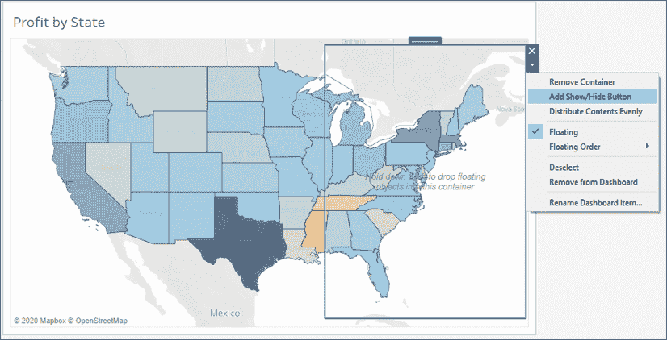

图 11.1：一个包含单一地图视图和浮动布局容器的仪表板

在这个仪表板上，我们添加了一个垂直布局容器，浮动在地图上方。当我们选择**添加显示/隐藏按钮**时，Tableau 会向仪表板添加一个小按钮：

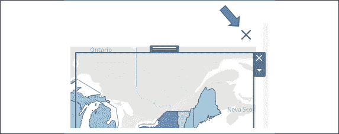

图 11.2：布局容器的显示/隐藏按钮

每个显示/隐藏按钮都可以应用于仪表板上的任何单个浮动布局容器。

使用**重命名仪表板项目…**选项在布局容器下拉菜单中，可以轻松识别哪个布局容器是显示/隐藏按钮的目标。

你可以通过点击按钮的下拉菜单选择**编辑按钮...**来编辑按钮的外观和动作：

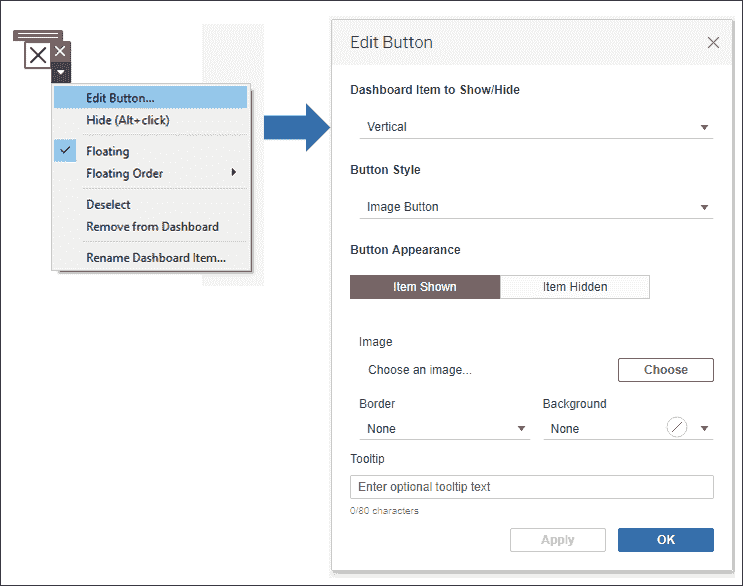

图 11.3：选择“编辑按钮…”可以显示许多选项，用于更改按钮的行为和外观

在弹出的对话框中，你将有选项选择要显示或隐藏的布局容器，按钮的样式（图像或文本），以及在容器显示或隐藏时显示哪些图像或文本。

在这个示例中，显示/隐藏按钮使用了默认的**图像按钮**样式（如*图 11.3*所示），并且布局容器已经填充了一些过滤器和地图的图例。

你可以将任何仪表板对象包含在容器中，包括过滤器、图例、参数和集合控件，甚至是其他视图！

此外，容器还设置了边框和半透明背景，以便地图在容器下方稍微可见。通过选择容器并使用**仪表板**窗格的**布局**选项卡完成了这一设置，如下所示：

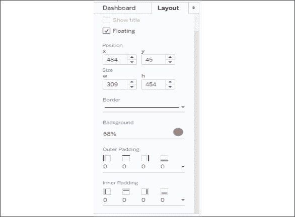

图 11.4：使用布局窗格调整所选仪表板对象的选项

最终结果在`第十一章`工作簿中展示，是一个带有显示/隐藏按钮的仪表板，使用户清楚地知道可以显示或隐藏其他选项：

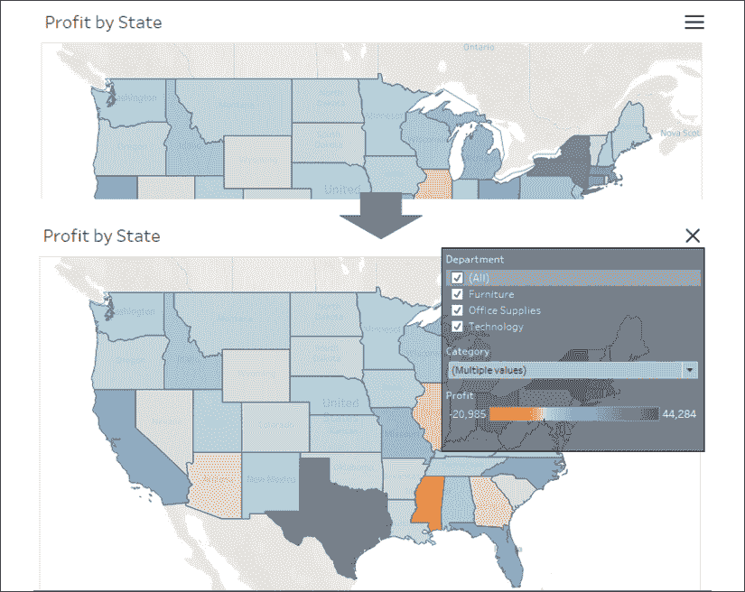

图 11.5：在这里您可以看到布局容器的隐藏和显示状态以及按钮图像的变化

在**设计模式**下使用 *Alt* + *Click* 来触发按钮动作，或者切换到**演示模式**，单击即可触发按钮。

显示/隐藏按钮为您的仪表板设计提供了很大的灵活性，从优化空间到简化显示，到从打印输出中删除过滤器和其他混乱的内容。

考虑在`第十一章完成`工作簿中的另一个示例，该示例说明了显示和隐藏说明的可能性：

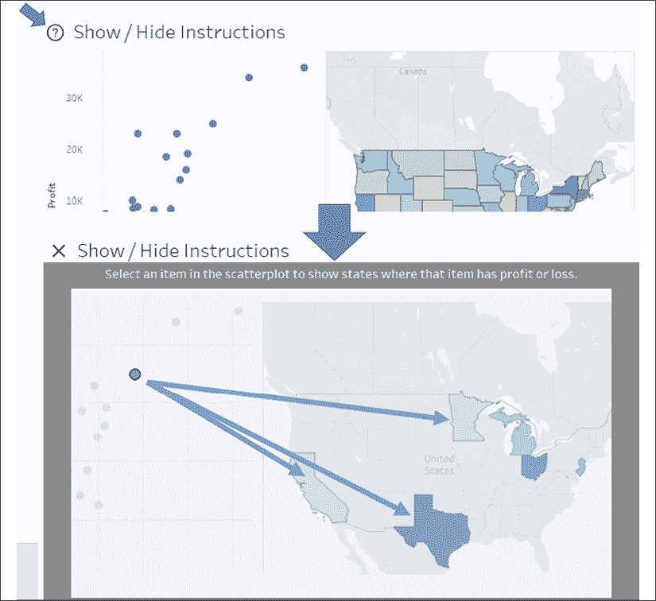

图 11.6：单击问号按钮会显示如何使用仪表板的说明

在这种情况下，默认按钮图像已被问号图标替换。这是通过编辑图像实现的，如*图 11.3*所示，并更改图像（`questionmark.png`包含在`第十一章`目录中。）

当用户点击按钮时，一个浮动容器出现在整个仪表板的顶部。它包括文本以及一个带注释的图像，指导用户如何使用仪表板。在这个简单的例子中，以这种方式提供说明可能有点过火，一个简单的文本标签就足够了。

然而，随着您构建更复杂的仪表板或需要解释的详细分析，这是向用户提供额外指示和细节的好方法，否则会使仪表板混乱。

还考虑使用显示/隐藏按钮来允许用户互动，这些功能不希望包含在 PDF 或仪表板的打印页面中。过滤器和参数非常有用，但并不总是希望它们显示在精美的输出中。

让我们继续考虑另一种在仪表板上动态显示、隐藏甚至切换内容的方法。

# 表格切换

**表格切换**，有时也称为**表格选择**，是一种动态在仪表板上显示和隐藏视图的技术，通常表现为将一个视图与另一个视图进行切换。在仪表板上动态隐藏和显示视图具有更广泛的应用。当与浮动对象和布局容器结合使用时，此技术允许您创建丰富和动态的仪表板。

让我们从一些基本的表格切换原则开始。

## 表格切换的基本原则

基本原则相对简单。当以下情况发生时，仪表板上的视图会折叠：

+   至少有一个字段位于行或列上

+   它位于水平或垂直的**布局容器**中

+   它没有固定的高度或宽度，并且布局容器未设置为等分项目

+   组合使用过滤器或隐藏功能会阻止任何标记的呈现

此外，标题和说明文字不会随视图一起折叠。然而，这些可以被隐藏，从而使视图完全折叠。

接下来，我们将探讨一个如何在实践中使用工作表交换的示例。

## 使用工作表交换在仪表板上更改视图

让我们考虑一个简单的示例，视图显示了 **部门和类别的利润**，并具有一个 **部门** 快速过滤器。仪表板已被格式化（从菜单中选择 **Format** | **Dashboard**），并使用灰色阴影帮助我们看到效果：

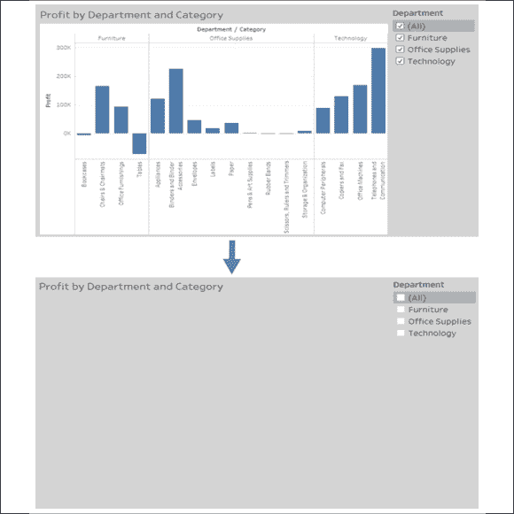

图 11.7：在仪表板中隐藏工作表的演示

观察到过滤掉所有部门后，视图会折叠。标题仍然存在，但也可以隐藏。

为了交换两个不同的工作表，我们简单地利用了折叠行为和布局容器的属性。我们将通过创建两个通过参数和计算字段过滤的不同视图来开始。参数将允许我们确定显示哪个工作表。请执行以下步骤：

1.  创建一个名为 `Show Sheet` 的整数参数，列出 **String** 类型的值，设置为 **Bar Chart** 和 **Map**：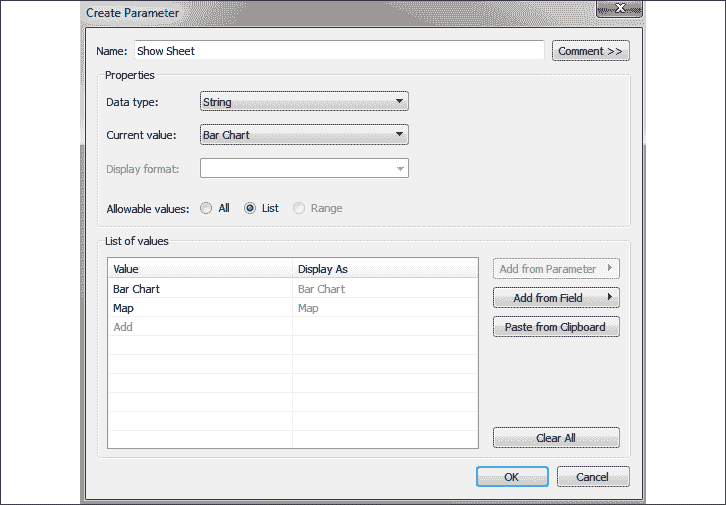

    图 11.8：创建一个参数来控制显示哪个工作表

1.  由于我们希望基于参数选择进行过滤，而参数不能直接添加到 **Filters** 架构中，因此我们将创建一个名为 `Show Sheet Filter` 的计算字段来返回参数的选定值。代码很简单，直接使用 `[Show Sheet]`，即参数名称，返回当前参数的值。

1.  创建一个新的工作表，命名为 **Bar Chart**，类似于图 *11.7* 中显示的 **部门和类别的利润** 视图。

1.  显示参数控制（右键点击数据窗口中的参数，选择 **Show Parameter Control**）。确保选择了 **Bar Chart** 选项。

1.  将 `Show Sheet Filter` 字段添加到 **Filters** 架构，并勾选 **Bar Chart** 来保留该值。

1.  创建另一个命名为 **Map** 的工作表，显示按利润划分的州填充地图：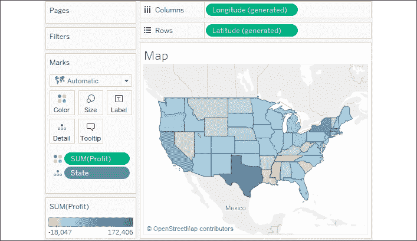

    图 11.9：地图视图

1.  在该视图上显示参数，并将选择更改为 **Map**。请记住，参数选择是全局性的，适用于整个工作表。如果你切换回 **Bar Chart** 视图，它应该不再显示任何数据，因为已经应用了过滤器。

1.  将 `Show Sheet Filter` 字段添加到 **Filters** 架构，并勾选 **Map** 作为保留的值。

1.  创建一个新的仪表板，命名为 **Sheet Swap**。

1.  从左侧窗口的对象中，将一个 **Horizontal** 布局容器添加到仪表板中：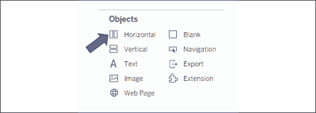

    图 11.10：插入一个水平布局容器

    在这种情况下，**垂直**布局容器同样有效。关键在于布局容器允许内部的每个视图在设置为适合整个视图时扩展以填充容器，或适合宽度（对于水平容器）或适合高度（对于垂直容器）。当一个视图折叠时，可见视图将扩展以填充剩余的容器。

1.  将每个 Sheet 添加到仪表板中的布局容器中。由于在每个视图中都可见，参数控件应该会被自动添加。

1.  在**条形图**视图上使用下拉菜单，确保视图设置为填充容器（**适合** | **整个视图**）。您不必为地图设置填充，因为地图可视化会自动填充容器。

1.  隐藏每个视图的标题（右键单击标题并选择**隐藏标题**）。

现在您有一个仪表板，更改参数会显示一个或另一个视图。当选择**地图**时，过滤器导致条形图没有数据，因此它会折叠，地图填充容器：

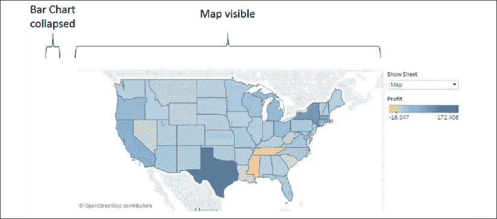

图 11.11：地图可见，而条形图已折叠

或者，当选择**条形图**时，由于过滤器的作用，地图会折叠，而条形图会填充容器：

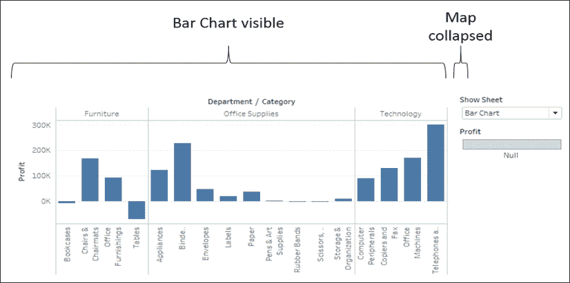

图 11.12：条形图可见，而地图已折叠

折叠视图的关键是使用一个或一组过滤器确保不显示任何数据行。您不必使用参数来控制过滤。您可以使用常规过滤器或操作过滤器来实现相同的效果。这为仪表板中的动态行为开辟了各种可能性。

Sheet 交换可以为您的仪表板带来惊人的效果。从允许用户选择可视化类型，到交换适合小数据集的视图，再到为大数据集总结的视图，考虑使用 Sheet 交换来实现动态体验。

在某些情况下，您可能会考虑替代 Sheet 交换，例如使用导航按钮在不同版本的仪表板之间导航，而不是尝试在同一仪表板中交换内容。

Sheet 交换允许您在仪表板中交换视图。如果视图更改导致某些图例、过滤器或参数不再适用，并且您希望隐藏它们，我们来考虑一些可能性。

# 自动显示和隐藏其他控件

当所有数据被过滤时，视图将会折叠。但是，其他控件（如快速过滤器、参数、图像、图例和文本框）不会折叠。您可以使用我们之前讨论过的显示/隐藏按钮，但通常您希望在过滤器更改时自动显示或隐藏这些控件，而无需用户采取额外的操作。

考虑前一节中的简单示例。由 Tableau 自动添加到仪表板中的颜色图例适用于地图，但当条形图显示时，图例就不再适用了。

幸运的是，我们可以扩展前一节中使用的技术，通过展开视图，将我们希望显示的项推到浮动对象下方，然后收起视图，让我们希望隐藏的项返回到浮动对象下方。

让我们扩展之前的工作表交换示例，看看如何显示和隐藏颜色图例：

1.  创建一个名为**显示/隐藏图例**的新工作表。此视图仅用于显示和隐藏颜色图例。

1.  通过双击**行**并输入`MIN(1)`来创建临时计算。为了让视图收缩，我们必须在行或列上有一个字段，所以我们将使用这个字段来为**行**和**列**分别提供一个单一的坐标轴，并且没有其他标题。

1.  在**列**上复制临时计算。现在你应该有一个简单的散点图，并且只有一个标记。

1.  由于这是一个辅助工作表，并非我们希望用户看到的内容，因此我们不希望它显示任何标记或线条。使用**格式** | **线条**格式化视图，移除**行**和**列**中的**网格线**，以及**坐标轴标尺**。此外，隐藏坐标轴（右键点击每个坐标轴或字段，取消勾选**显示标题**）。同时，将颜色设置为完全透明以隐藏标记。

1.  当选择地图选项时，我们希望显示此视图，因此显示参数控制，并确保它设置为**地图**，然后将**显示工作表过滤器**添加到过滤器中，并勾选**地图**：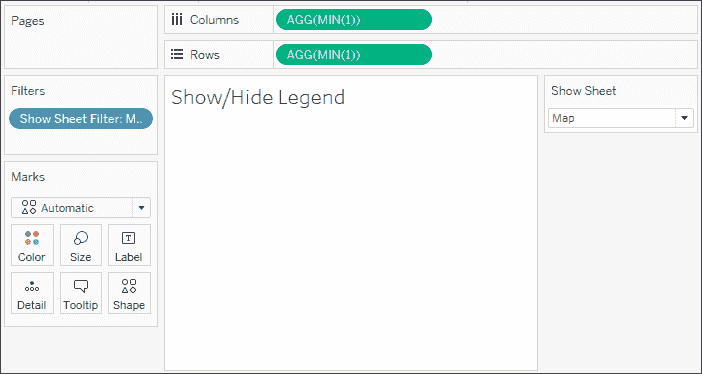

    图 11.13：应用显示工作表过滤器的显示/隐藏图例工作表

1.  在**工作表交换**仪表板上，将**显示/隐藏图例**工作表添加到布局容器中，放置在**显示工作表**参数下拉菜单和颜色图例之间。隐藏**显示/隐藏图例**工作表的标题。

1.  确保选中**地图**。颜色图例应该被推到底部。

1.  将一个布局容器作为浮动对象添加。就大小和位置而言，它应完全覆盖颜色图例原先所在的区域。它应该覆盖**显示/隐藏图例**工作表的标题，但不覆盖参数下拉菜单。

    可以通过按住*Shift*键拖动、将**新对象**选项设置为**浮动**，或通过在对象上使用下拉菜单将对象添加为浮动对象。你还可以在**仪表板**窗格中更改新对象的默认行为，从平铺更改为浮动。

1.  布局容器默认是透明的，但我们希望它能够隐藏下面的内容。使用下拉菜单进行格式化，并添加白色阴影，使其与背景不可区分。

此时，您已经拥有一个动态仪表板，其中图例在地图显示并适用时显示，在条形图可见时隐藏。当选择**地图**时，**显示/隐藏图例**工作表会显示，并将图例推到底部的**布局容器**：

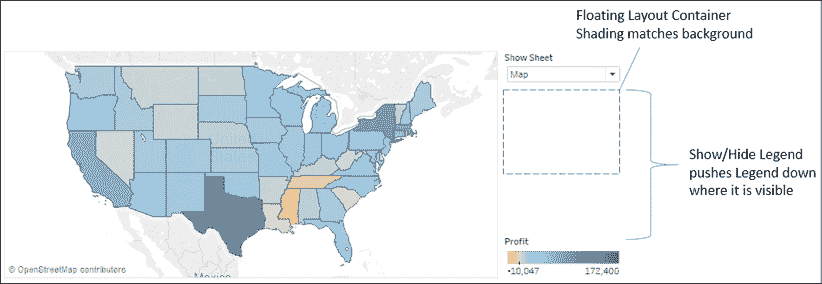

图 11.14：显示/隐藏图例将图例推到浮动对象下方

当选择**条形图**时，**显示/隐藏图例**工作表折叠，图例不再适用于该视图，掉到**浮动布局容器**下方/隐藏。

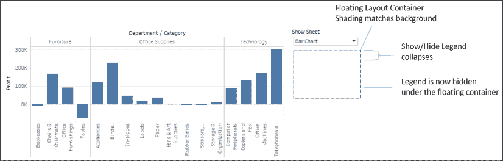

图 11.15：显示/隐藏图例折叠，导致图例移到浮动对象下方

您可以在仪表板上使用该技术的变体数量没有限制。您可以根据需要添加任意多的层。您甚至可以组合这些技术，在仪表板上推送或移除视图和对象。创造丰富互动用户体验的可能性是令人难以置信的。

# 总结

创建真正动态的仪表板为您的仪表板设计提供了极大的灵活性。显示/隐藏按钮为最终用户提供了在仪表板上显示或隐藏内容的选项。工作表切换技术允许您切换显示哪些视图，并自动显示或隐藏控件或其他内容。

本章介绍的技术将使您能够实现各种惊人的互动效果，从隐藏和显示控件、说明、业务规则和分析的解释，到允许用户确定可视化类型并切换视图。

接下来，我们将转向使用一些高级技术来探索某种类型的数据：地理空间数据！
