# 第十二章：探索映射和高级地理空间功能

到目前为止，我们已经看过利用 Tableau 基本功能的地图和地理空间可视化示例。在本章中，我们将踏上探索 Tableau 提供的广泛映射和地理空间功能之旅。从利用内置的地理空间数据库并用额外的数据和空间文件进行补充，到使用高级地理空间功能，我们将探索 Tableau 能够实现的可能性。

正如我们之前所做的，本章将通过一些实际示例来介绍这些概念。这些示例将跨越不同行业，包括房地产、交通运输和医疗保健。与以往一样，这些示例具有广泛的适用性，您将发现许多方法来利用数据，发掘您所发现的空间模式中的答案。

在本章中，我们将讨论以下主题：

+   Tableau 地图概述

+   使用 Tableau 渲染地图

+   使用地理空间数据

+   利用空间函数

+   创建自定义区域

+   Tableau 映射：技巧与窍门

+   在背景图像上绘制数据

# Tableau 地图概述

Tableau 包含一个内部地理数据库，使其能够识别常见的地理元素，并在地图上的特定纬度和经度位置渲染标记。在许多情况下，例如国家或州，Tableau 还包含内部的形状文件，使其能够在正确的位置以复杂的矢量形状渲染标记。Tableau 还可以利用您特定的地理空间数据，例如纬度和经度、形状文件以及空间对象。本章中，我们将探讨其中的一些可能性。现在，我们将带您了解 Tableau 渲染地图的一些基本知识，以及可用的自定义选项。

# 使用 Tableau 渲染地图

请参考以下截图（`第十二章` 工作簿中的 `基本地图` 示例），并对某些元素进行编号以便参考：

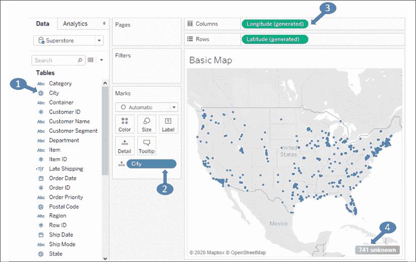

图 12.1：Tableau 中的基本地理空间渲染

数字表示 Tableau 渲染地图能力的某些重要方面：

1.  数据中的地理字段会显示为一个地球图标。Tableau 默认会为它识别的字段添加此图标。您可以通过菜单为任何字段分配一个地理角色，选择 **地理角色** 即可。

1.  视图中的地理字段（在本例中位于 **详细信息**）是渲染地图所必需的。

1.  如果 Tableau 能够将地理字段与其内部数据库匹配，那么将 **纬度（生成的）** 和 **经度（生成的）** 字段放在 **行** 和 **列** 上，再加上地理字段（们）放在 **标记** 卡片上，即可渲染出一张地图。

1.  与 Tableau 地理数据库不匹配的值将显示一个指示器，提醒您存在未知值。

您可以右键点击未知指示器将其隐藏，或者点击它以显示以下选项：

+   编辑位置（手动匹配位置值到已知值或经纬度）

+   过滤掉未知位置

+   在默认位置绘制（纬度和经度为 0，这个位置有时幽默地被称为“空岛”，位于非洲西海岸附近）

Tableau 在地图上呈现标记的方式与散点图类似（实际上，您可以把地图看作是一种散点图，它通过一些复杂的几何变换来投影经纬度）。这意味着您可以在地图上绘制圆形、点和自定义形状。

在标记下方，地图本身是从在线地图服务中检索到的矢量图像。接下来，我们将考虑如何自定义地图图层和选项。

## 自定义地图图层

地图本身——陆地和水域、地形、街道、国家和州的边界等——都是从在线地图服务中检索到的矢量图像（也提供离线选项）。

然后在该图像上绘制标记。您已经知道如何使用数据、计算和参数来调整标记的渲染方式，但 Tableau 给予您对地图渲染方式的高度控制。

使用菜单通过选择**地图** | **背景地图**来探索各种选项。例如，这里是一个**暗色地图**：

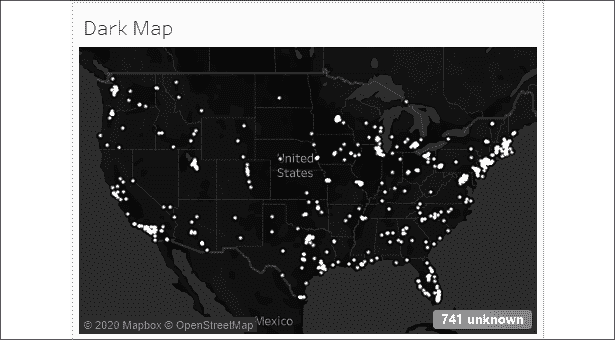

图 12.2：暗色地图是多种地图背景选项之一

这张地图包含与前一个截图完全相同的标记，只是背景不同。其他选项包括**浅色**、**街道**、**卫星**等。

如果您将在没有互联网的环境中使用 Tableau（或发布到没有互联网连接的 Tableau 服务器），请选择**离线**选项。但是，请注意，离线版本不包含在线选项中的细节或缩放级别。

通过从菜单中选择**地图** | **地图图层**，可以找到其他图层选项。这将打开一个看起来像这样的**地图图层**面板：

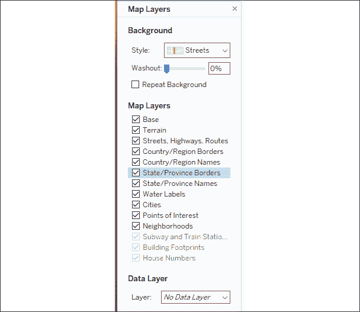

图 12.3：地图图层面板

**地图图层**面板提供了选择背景、设置洗涤效果、选择显示的特征以及设置**数据图层**的选项。根据缩放级别，某些选项可能会被禁用（例如，**建筑物轮廓**只有在缩放到足够接近地图时才会启用）。**数据图层**允许您基于各种人口统计数据将填充地图应用于背景。这些人口统计数据只作为图像的一部分显示，并且不具备互动性，数据不会暴露给用户交互或计算。

您还可以使用菜单选项**地图** | **背景地图** | **管理地图**来更改使用的地图服务，这样您就可以指定自己的 WMS 服务器、第三方服务，或者使用**Mapbox**地图。这使您能够以任何您喜欢的方式自定义地图可视化的背景图层。

这些功能的细节超出了本书的范围，不过，你可以在 Tableau 的[官方文档](https://help.tableau.com/current/pro/desktop/en-us/maps_mapsources_wms.htm)中找到相关内容。

## 自定义地图选项

此外，你还可以自定义可供最终用户使用的地图选项。注意当你将鼠标悬停在地图上时会出现的控制项：

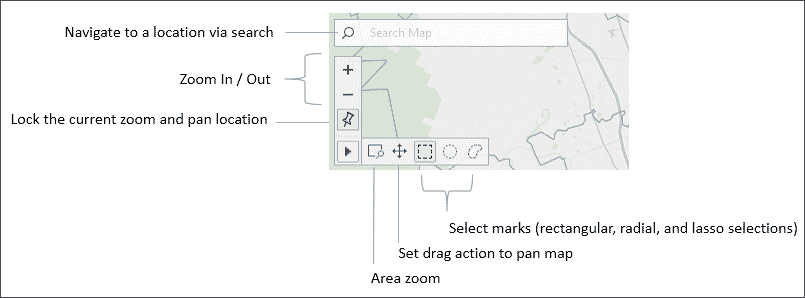

图 12.4：自定义地图时可用的控制项

这些控制项允许你搜索地图、放大和缩小、将地图定位到当前位置，并使用各种选择方式。

你还可以使用键盘和鼠标组合来导航地图。使用*Ctrl* + 鼠标滚轮或*Shift* + *Ctrl* + 鼠标点击进行缩放。点击并按住或*Shift* + 点击来平移。

选择 **地图 | 地图选项** 后会出现其他选项：


图 12.5：地图选项

这些选项让你能够设置允许最终用户执行哪些地图操作，以及是否显示比例尺。此外，你还可以设置比例尺和**径向选择**的显示单位。选项包括**自动**（基于系统配置）、**公制**（米和千米）和**美制**（英尺和英里）。

Tableau 中集成了许多其他地理空间功能，我们将在接下来的内容中揭示如何利用地理空间数据。

# 使用地理空间数据

我们已经看到，对于任何数据源，Tableau 会根据它与内部地理数据库匹配的字段自动提供**纬度（生成）**和**经度（生成）**字段。像国家、省州、邮政编码、大都市区（MSA）和国会选区等字段都包含在 Tableau 的内部地理库中。随着 Tableau 持续增加地理功能，你可能需要查阅文档，了解内部数据库具体包含的内容。

然而，你也可以在可视化中利用特定的地理空间数据。我们将考虑使用能够支持地理空间可视化的数据，包括以下内容：

+   在你的数据中包含`纬度`和`经度`作为数值。

+   将包含`纬度`和`经度`定义的`.csv`文件导入到 Tableau 的数据库中。

+   利用 Tableau 连接到支持空间对象的各种空间文件或数据库的能力。

我们将在接下来的部分中探索这些选项，然后进一步了解如何利用地理空间函数扩展数据。

## 在数据中包含纬度和经度

在数据中包含纬度和经度可以为你的可视化（和计算）提供极大的灵活性。例如，虽然 Tableau 内建了国家、省州和邮政编码的地理编码功能，但它并不提供地址级别的地理编码。提供纬度或经度数据能让你精确地在地图上定位标记。

你可以在使用`房地产`数据源的`第十二章`工作簿中找到以下示例：

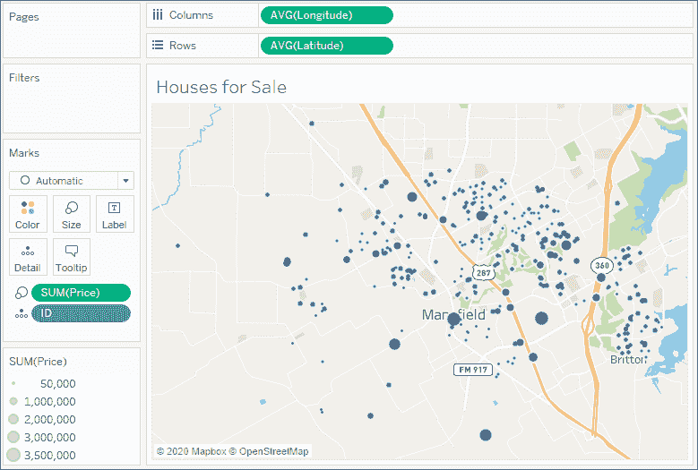

图 12.6：按价格大小绘制的待售房屋地图

在这里，每个单独的房屋可以通过精确的位置进行映射，并根据价格调整大小。为了帮助观众更直观地理解，已经应用了**街道**背景。

有许多免费的和商业的工具可以**地理编码**地址。也就是说，给定一个地址，这些工具会添加经度和纬度信息。

如果你无法直接将字段添加到数据源中，可以考虑使用跨数据库连接或数据混合。另一种选择是直接将纬度和经度定义导入到 Tableau 中。接下来我们将考虑这种选项。

## 导入定义到 Tableau 的地理数据库

若要从菜单导入，选择**地图** | **地理编码** | **导入自定义地理编码...**。导入对话框中包含了一个链接，描述了该选项的更多细节：

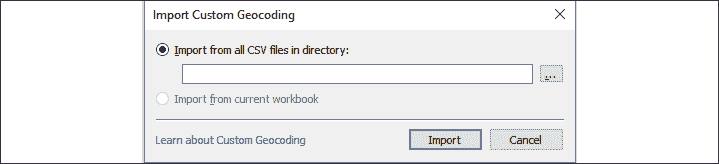

图 12.7：导入自定义地理编码对话框

通过导入一组定义，你可以：

+   添加新的地理类型

+   扩展 Tableau 内建的地理类型

纬度和经度定义了一个单一的点。在某些时候，你可能需要呈现更复杂的形状和线条。在这种情况下，你可以考虑一些地理空间函数和空间对象支持，接下来我们将讨论这些内容。

## 利用空间对象

空间对象定义了地理区域，这些区域可以简单如一个点，也可以复杂如多边形。这使得你可以呈现从自定义商业区域到河流、道路以及县和国家的历史边界等所有内容。空间对象可以存储在空间文件中，并且被一些关系型数据库所支持。

Tableau 支持多种空间文件格式，如`ESRI`、`MapInfo`、`KML`、`GeoJSON`和`TopoJSON`。此外，你还可以直接连接到`ESRI`数据库以及具有地理空间支持的关系型数据库，如`ESRI`或 SQL Server。如果你创建了一个提取文件，空间对象将被包含在提取文件中。

许多应用程序，如`Alteryx`、`Google Earth`和`ArcGIS`，都可以用来生成空间文件。空间文件也可以从许多组织那里轻松下载。这为地理空间分析提供了极大的灵活性。

例如，这里有一张美国铁路的地图：

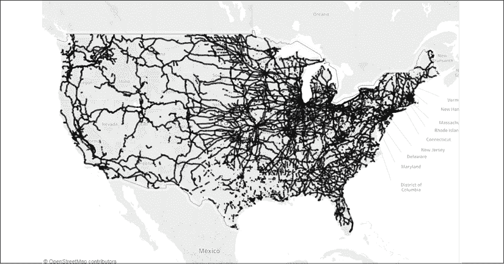

图 12.8：美国铁路地图

要复制此示例，请从美国人口普查局下载 shapefile：[`catalog.data.gov/dataset/tiger-line-shapefile-2015-nation-u-s-rails-national-shapefile`](https://catalog.data.gov/dataset/tiger-line-shapefile-2015-nation-u-s-rails-national-shapefile)。

下载并解压文件后，连接到`tl_2015_us_rails.shp`文件。在预览中，你将看到带有 ID 字段和铁路名称的数据记录。**几何**字段是定义铁路段线性形状的空间对象：

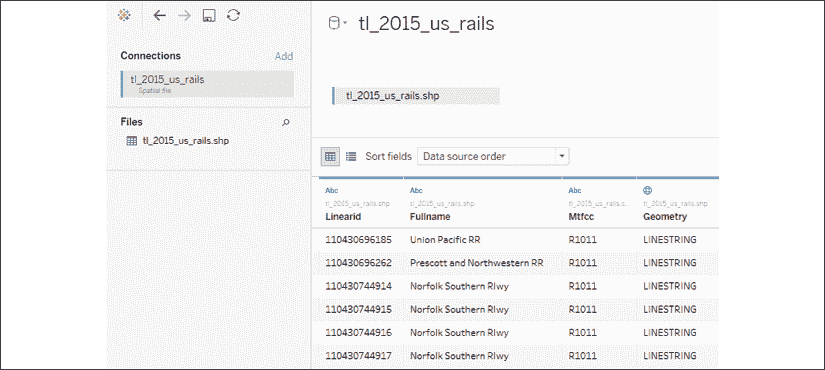

图 12.9：美国铁路地图预览

在空白工作表中，只需双击**几何**字段。Tableau 将把地理数据集包括在细节中，并自动引入纬度和经度字段以完成渲染。尝试将 ID 字段包含在细节中，并根据**全名**进行筛选。

考虑使用跨数据库连接来补充现有数据与自定义空间数据。此外，Tableau 支持空间连接，允许你将仅在空间上相关的数据汇聚在一起，即使没有其他关系存在。

接下来，我们将着眼于利用一些空间函数，甚至是空间连接来扩展你的分析。

# 利用空间函数

Tableau 不断增加对空间函数的本地支持。撰写本文时，Tableau 支持以下功能：

+   `Makeline()`返回一个由两个点确定的线状空间对象。

+   `Makepoint()`返回一个由两个坐标确定的点状空间对象。

+   `Distance()`返回两个点之间的距离，单位为所需的测量单位。

+   `Buffer()`在一个点周围创建一个给定距离半径的圆形区域。你可以指定测量单位。

我们将通过`第十二章`工作簿中的`医院和病人`数据集来探索一些这些功能。该数据集将房地产数据重新构想为一个被病人环绕的医院，在以下视图中通过**形状**、**大小**和**颜色**的差异来表示：

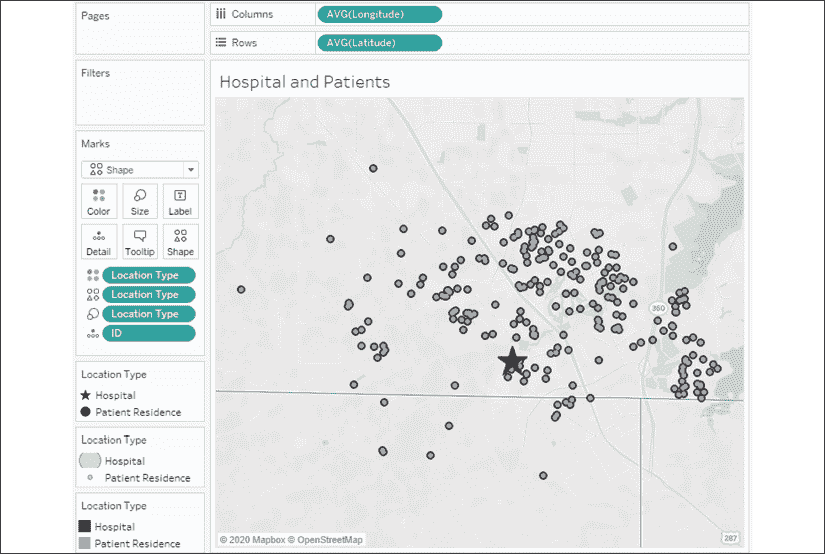

图 12.10：一个被病人包围的医院（由星号表示）

我们可能会提出许多分析性问题。我们将集中讨论以下几个问题：

+   每个病人距离医院有多远？

+   有多少病人位于给定半径内？

+   哪些病人位于半径之外？

为了开始回答这些问题，我们将创建一些计算字段来为我们提供构建块。为了在同一计算中使用多个点，医院的纬度和经度需要与每个病人记录一起包含。实现这一目标的一种方法是使用几个`FIXED` **细节级别**（**LOD**）表达式将值返回到每一行。

我们将创建一个名为`Hospital Latitude`的计算，代码如下：

```py
{FIXED : MIN(IF [Location Type] == "Hospital" THEN [Latitude] END)} 
```

以及一个名为`Hospital Longitude`的相应计算，代码如下：

```py
{FIXED : MIN(IF [Location Type] == "Hospital" THEN [Longitude] END)} 
```

在每种情况下，医院的纬度和经度是通过`IF`/`THEN`逻辑确定的，并通过`FIXED` LOD 表达式作为行级结果返回。这为我们提供了几个附加计算的构建块。接下来，我们将考虑`第十二章`工作簿中的几个示例。

## MAKELINE()和 MAKEPOINT()

在考虑这两个功能时，我们将创建一个计算字段，绘制医院和每个患者之间的线。我们将命名我们的计算为`Line`并编写以下代码：

```py
MAKELINE(
    MAKEPOINT([Hospital Latitude], [Hospital Longitude]),
    MAKEPOINT([Latitude], [Longitude])
) 
```

`MAKELINE()`需要两个点，这些点可以通过`MAKEPOINT()`函数创建。该函数需要纬度和经度。第一个点是医院的位置，第二个点是患者的纬度和经度。

由于该函数返回一个空间对象，你会注意到该字段有一个地理图标：


图 12.11：地理图标已添加到 Line 字段

在一个新的可视化中，如果你双击**Line**字段，你会立即得到一个地理可视化，因为该字段定义了一个地理空间对象。你会注意到**Detail**上的**COLLECT(Line)**字段，以及**Columns**和**Rows**上的 Tableau 的**Longitude (generated)**和**Latitude (generated)**。地理空间集合被绘制为一个单一对象，除非你通过向视图添加维度来将其拆分。

在这种情况下，每个 ID 定义了一条单独的线，因此将其添加到**Marks**卡片的**Detail**中会将地理空间对象拆分为单独的线：

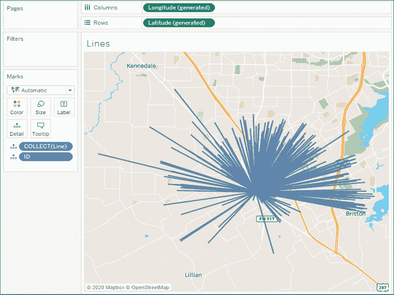

图 12.12：每条线从医院起点绘制到患者

如果我们想知道每条线覆盖的距离呢？我们将在一个扩展的例子中考虑这个问题。

## DISTANCE()

距离可能是我们分析数据时非常重要的概念。知道两个地理空间点之间的距离能为我们提供很多见解。计算本身非常类似于`MAKELINE()`，我们可以创建一个名为`Distance to the Hospital`的计算字段，使用以下代码：

```py
DISTANCE(
    MAKEPOINT([Hospital Latitude], [Hospital Longitude]),
    MAKEPOINT([Latitude], [Longitude]),
    'mi'
) 
```

类似于`MAKELINE()`计算，`DISTANCE()`函数也需要几个点，但它还需要一个单位。这里，我们使用参数`'mi'`指定英里，但我们也可以使用`'km'`来指定公里。

我们可以将此计算放置在**Tooltip**上，以查看每条线所覆盖的距离：

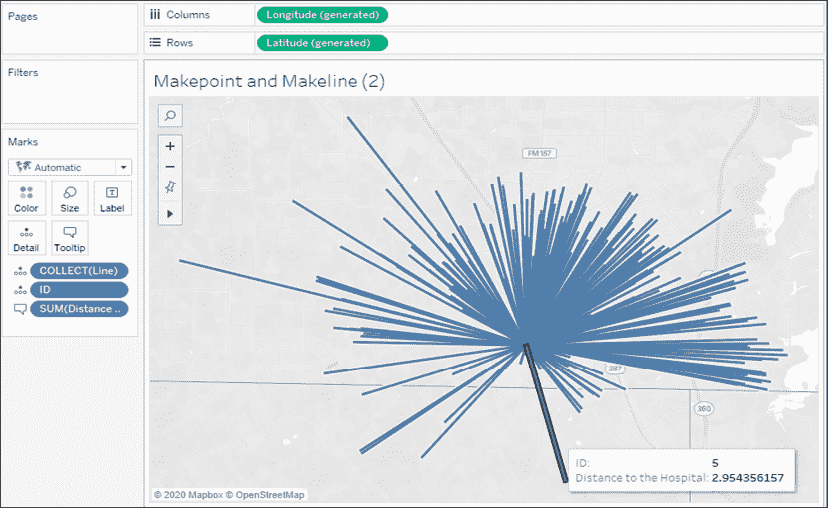

图 12.13：工具提示现在显示从医院到患者的距离

这个简单的例子可以大大扩展。现在，我们可以知道当我们悬停在这条线时，患者 ID **5**距离医院**2.954…**英里。我们可以通过将距离四舍五入到`2`个小数位来改进显示，或者查看患者的名字。我们还可以通过将距离作为过滤器来显著增加分析的实用性（分析距离超过或低于某个阈值的患者），或者将距离作为更复杂分析中的相关因素。

我们可以通过`Buffer()`在视觉上完成一些操作，接下来我们将进一步探讨！

## BUFFER()

Buffer 函数与`DISTANCE()`类似，但方向相反。与其计算两个点之间的距离，`BUFFER()`函数允许你指定一个点、一个距离和一个单位，进而在该点周围绘制一个具有指定半径的圆。

例如，你可能想要可视化哪些病人在医院的 3 英里半径范围内。为此，我们将创建一个名为`Hospital Radius`的计算字段，代码如下：

```py
IF [Location Type] == "Hospital"
THEN BUFFER(MAKEPOINT([Latitude], [Longitude]), 3, 'mi')
END 
```

这段代码首先检查确保只对医院记录进行计算。`BUFFER()`计算本身使用经纬度来生成一个点，并指定一个 3 英里半径。

为了可视化半径以及每个病人的个体标记，我们将创建一个**双轴地图**。双轴地图会复制经纬度字段并放在行或列中，然后使用**Marks**卡片的不同部分来渲染不同的地理空间对象。例如，在这里我们将病人的位置以圆点表示，将半径以**自动**标记类型表示：

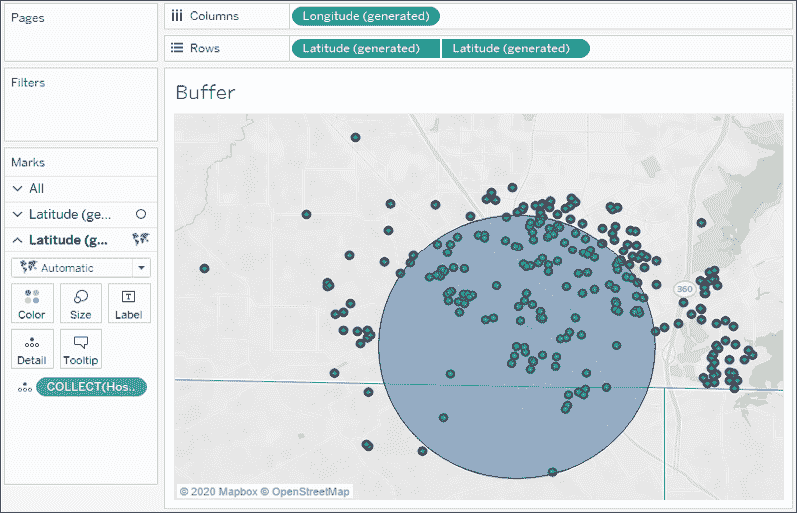

图 12.14：位于医院 3 英里半径范围内的病人

注意，我们使用了生成的**纬度**和**经度**字段。这些字段作为占位符，供 Tableau 可视化任何空间对象。在**Marks**卡片的第一个部分，我们包含了来自数据的**纬度**和**经度**字段。在第二部分，我们加入了**医院半径**字段。在这两种情况下，生成的字段使 Tableau 能够使用**Marks**卡片上的地理或空间对象来定义可视化。

我们刚刚触及空间函数的表面。例如，你可以将半径值参数化，以便让最终用户动态更改距离。你还可以将`MAKEPOINT()`和`BUFFER()`计算作为连接计算在数据源中使用，以便将空间相关的数据汇聚在一起。例如，利用这些数据，你可以通过`BUFFER()`与`MAKEPOINT()`的**相交连接**将医院记录与病人记录结合，专门处理包含或排除特定半径内病人的数据集。这大大提升了你的分析能力。

在充分理解了可用的地理空间函数后，我们稍微调整一下焦点，讨论另一个感兴趣的话题：创建自定义区域。

# 创建自定义区域

**自定义区域**是你创建的（或数据定义的）地理区域或范围，而非内建的区域（例如国家或区号）。Tableau 为你提供了两种创建自定义区域的选项：**临时自定义区域**和**字段定义自定义区域**。接下来我们将探讨这两者。

## 临时自定义区域

你可以通过选择和分组地图上的标记，以一种临时方式创建自定义区域。只需选择一个或多个标记，悬停在一个标记上，然后使用**分组**图标。或者，右键点击其中一个标记，找到相关选项。如果数据中包含纬度和经度，或者你正在使用 Tableau 生成的纬度和经度，你可以按任何维度进行分组，从而创建自定义区域。

在这里，我们将通过邮政编码来考虑一个例子：

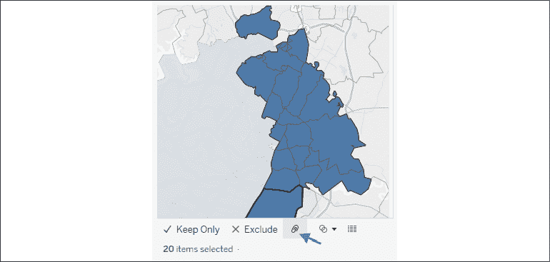

图 12.15：选择填充区域并将其分组为一个新区域后，使用回形针图标创建该分组

你会注意到，在这个例子中，Tableau 创建了一个新的字段 `Zip Code (group)`。该字段在数据面板中显示了回形针和地球图标，表明它是一个分组字段和地理字段：


图 12.16：一个分组和地理字段

Tableau 会自动将分组字段添加到**颜色**上。

你可以继续选择和分组标记，直到你得到所有所需的自定义区域。由于邮政编码仍然是视图级别的详细信息，视图中将显示每个邮政编码的标记（并且任何度量值将按邮政编码切分）。然而，当你从视图中移除邮政编码，仅保留`Zip Code (group)`字段时，Tableau 会根据新的分组绘制标记：

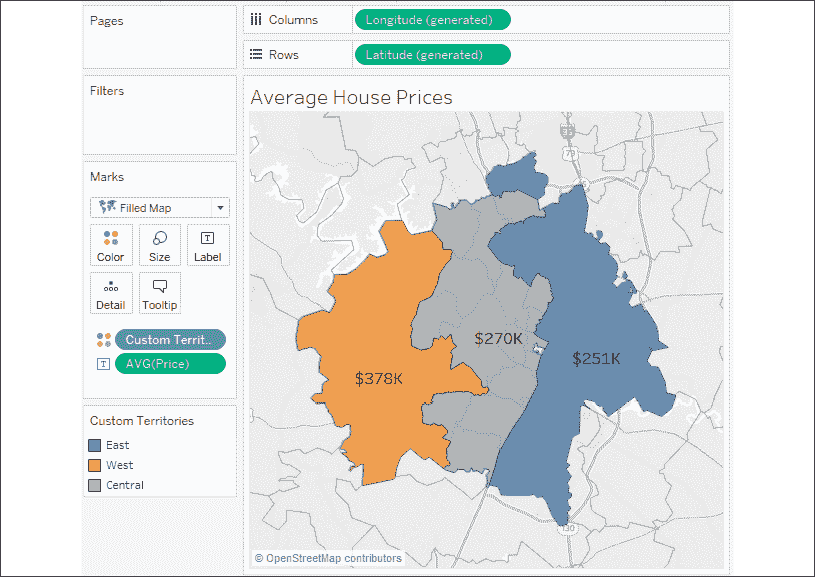

图 12.17：按自定义区域分组

在这里，分组字段已重命名为 `Custom Territories`，并且分组名称已别名为`东区`、`西区`和`中区`。我们可以看到每个自定义区域内的房屋平均价格。

这些功能的详细内容超出了本书的范围，但你可以在 Tableau 的[文档](https://help.tableau.com/current/pro/desktop/en-us/maps_mapsources_wms.htm)中找到相关信息。

使用填充地图时，Tableau 会连接所有相邻区域，并仍然将不相连的区域包含在选择和高亮显示中。使用符号地图时，Tableau 会在所有分组区域的地理中心绘制标记。

有时，数据本身就定义了区域。在这种情况下，我们无需手动创建区域。相反，我们将使用接下来描述的技术。

## 字段定义的自定义区域

有时你的数据包含自定义区域的定义。例如，假设你的数据中有一个名为**Region**的字段，已经将邮政编码分组到不同的区域中。也就是说，每个邮政编码只包含在一个区域中。在这种情况下，你可能不想花时间手动选择标记并进行分组。

相反，你可以告诉 Tableau 数据中已经存在这种关系。在这个例子中，你可以使用数据面板中**Region**字段的下拉菜单，选择**地理角色** | **从...创建** | **邮政编码**。现在，**Region**变成了一个地理字段，定义了自定义区域：

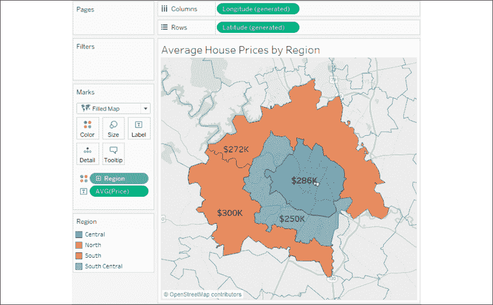

图 12.18：此处的自定义区域由数据中的区域字段定义

在这种情况下，区域是由数据中的**区域**字段定义的。如果稍后重新定义这些区域，Tableau 会显示新区域（只要数据已更新）。使用字段定义的自定义区域使我们确信不需要手动更新定义。

使用临时自定义区域进行快速分析，但考虑使用字段定义的自定义区域作为长期解决方案，因为这样你可以在数据中重新定义区域，而无需手动编辑 Tableau 数据源中的任何分组。

# Tableau 地图 – 提示与技巧

在处理地理可视化时，还需考虑一些其他提示：

使用顶部菜单选择**地图** | **地图图层**，以查看多个可作为地图一部分显示的背景图层选项。

+   放大还可以通过使用鼠标滚轮、双击、*Shift* + *Alt* + 点击以及*Shift* + *Alt* + *Ctrl* + 点击来实现。

+   你可以点击并按住几秒钟来切换到平移模式。

+   你可以通过右键点击地图并选择相应选项来显示或隐藏缩放控制和/或地图搜索。

+   缩放控制可以在任何使用轴的可视化类型上显示。

+   放大控制按钮上的图钉会交替将地图恢复到适合可见数据的最佳视图，或者锁定当前的缩放和位置。

+   你可以通过复制（*Ctrl* + 拖动/放置）**列**上的**经度**或**行**上的**纬度**来创建**双轴地图**，然后使用字段的下拉菜单选择**双轴**。你可以使用这种技巧在单一地图上结合多种标记类型：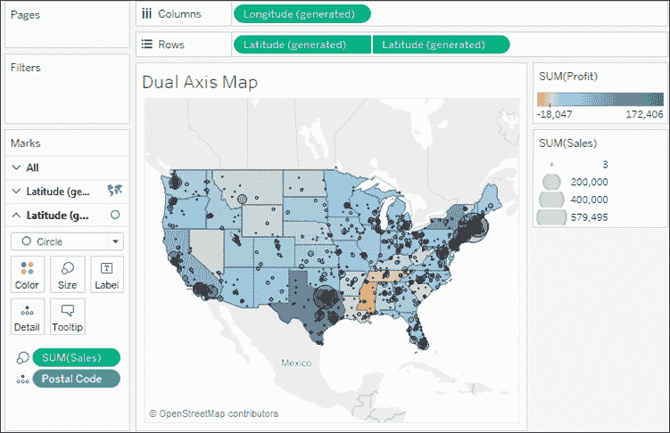

    图 12.19：双轴地图，显示州级的利润和邮政编码级别的销售额

    你可以使用双轴来显示不同级别的细节或使用不同的标记类型。在这种情况下，两个目标都已实现。该地图利用双轴在州级别显示填充地图的**利润**，在**邮政编码**级别显示圆形的**销售额**：

    +   在使用填充地图时，考虑在**地图图层**窗口中将**洗净**设置为**100%**，以获得干净的地图效果。然而，只有填充的形状会显示，因此任何缺失的州（或县、国家等）将不会被绘制：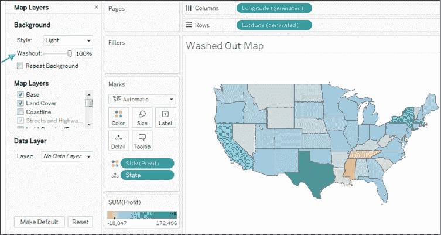

        图 12.20：洗净地图

    +   你可以通过菜单选择**地图** | **背景地图**来更改背景地图图像的来源。这样，你可以选择**无**、**离线**（在没有互联网连接时使用，但显示的细节有限）或**Tableau**（默认选项）。

    +   此外，从同一菜单选项中，你可以指定**地图服务...**来使用`WMS 服务器`或`Mapbox`。

接下来，我们将通过探讨如何将数据绘制到背景图像上，来进一步提升数据可视化和展示效果，从而结束本章内容。

# 将数据绘制到背景图像上

背景图像允许你在任何图像上绘制数据。想象一下这些可能性！你可以在体育场的座位图上绘制票务销售数据、在办公室楼层图上绘制房间占用情况、在网络图上绘制每个设备的错误数量，或者在月球表面绘制陨石撞击数据。

在本例中，我们将绘制每月在医院不同房间里的病人数。我们将使用医院底层和二层的两张平面图作为图像。数据源位于`Chapter 12`目录下，文件名为`Hospital.xlsx`。它包含两个标签：一个是病人数统计，另一个是基于映射到图像上的 x/y 坐标的房间位置。我们接下来将讨论它是如何工作的。你可以查看`Chapter 12`目录下的`Complete.twbx`工作簿来查看完整示例，或者从头开始使用`Chapter 12`目录下的`Starter.twbx`。

要指定背景图片，请使用顶部菜单选择**地图** | **背景图片**，然后点击适用该图像的数据源——在本例中为`Patient Activity (Hospital)`。在**背景图片**屏幕上，您可以添加一张或多张图片。

在这里，我们将从位于`Chapter 12`目录下的`Hospital - Ground Floor.png`开始：

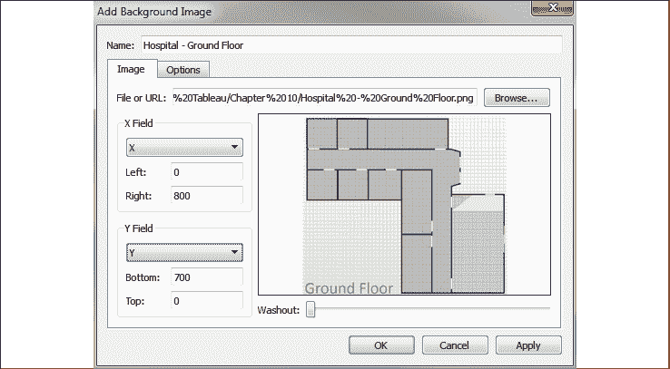

图 12.21：添加背景图片窗格

你会注意到我们映射了**X**和**Y**字段（来自**Locations**标签），并指定了**Right**为**800**，**Bottom**为**700**。这是基于图像的像素大小。

你不必使用像素，但大多数情况下，使用像素能让映射数据位置更容易。在这个例子中，我们有一个 Excel 文件标签，里面已经将位置映射到图像上的**x**和**y**坐标（单位为像素）。通过跨数据库联接，你可以创建一个包含图片映射的简单文本或 Excel 文件，并将其连接到现有数据源。你可以手动映射点（使用图形应用程序）或使用多个免费的在线工具，快速在图片上映射坐标。

我们只想显示这一蓝图的底层平面图，因此切换到**Options**标签，我们将确保基于数据设置条件。我们还将确保勾选**始终显示整个图像**：

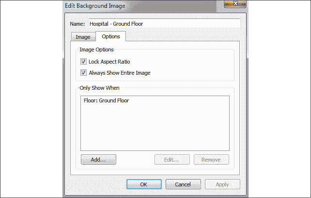

图 12.22：编辑背景图片窗格

接下来，重复前面的步骤，我们将把第二张图像（`Hospital - 2nd Floor.png`）添加到数据源中，并确保它只在`2nd Floor`显示。

一旦我们定义并映射了图像，就可以开始构建可视化了。基本思路是使用**X**和**Y**字段作为轴来构建散点图。但我们必须确保**X**和**Y**没有被求和，因为如果它们在多个记录中被相加，就无法正确映射到像素位置。这里有几个选项：

+   使用**X**和**Y**作为连续维度。

+   使用 `MIN`、`MAX` 或 `AVG` 替代 `SUM`，并确保 **位置** 被用来定义视图的细节级别。

+   此外，图像从顶部的 0 到底部的 **Y** 进行度量，而散点图则从底部的 0 开始，数值向上增加。因此，最初你可能会看到背景图像显示倒置。为了避免这个问题，我们将编辑 *y* 轴（右键点击并选择 **编辑轴**），然后勾选 **反向** 选项。

我们还需要确保 **楼层** 字段被用于视图中。这是为了告诉 Tableau 应该显示哪个图像。在这一点上，我们应该能够得到如下的可视化效果：

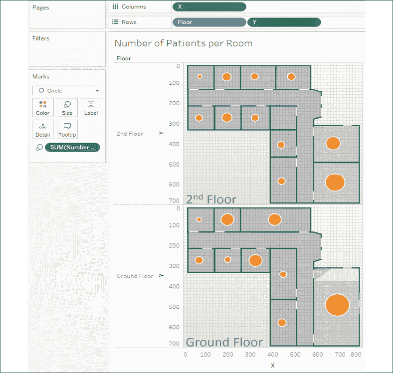

图 12.23：在楼层平面图像上绘制每个房间的患者数量

在这里，我们已根据每个房间的患者数量绘制了大小不同的圆圈。我们可以通过多种方式清理和修改可视化：

+   隐藏 *x* 和 *y* 轴（右键点击轴并取消勾选 **显示标题**）

+   隐藏 **楼层** 的标题，因为图像已经包含了标签

+   将 **楼层** 添加到 **筛选器** 架上，以便最终用户可以选择一次查看一个楼层

在背景图像上绘制标记的功能为传达复杂主题开辟了无限的可能性。想想你如何在计算机网络的图示上显示硬件错误数量，在篮球场上显示未投中的跳投次数，或者显示办公室大楼中人与人之间的距离。所有这一切，甚至更多，都是可能的！

# 摘要

本章我们已经覆盖了很多内容！可视化地图的基本操作很简单，但背后有很多强大的功能和可能性。从使用你自己的地理空间数据到利用地理空间对象和函数，你有很多分析选项。创建自定义区域并在背景图像上绘制数据，进一步扩展了你的可能性。

接下来，我们将重点介绍 Tableau 2020.2 的全新功能：数据模型！我们将探讨数据模型关系、连接、混合的区别，并看看如何使用它们进行各种有价值的分析！
