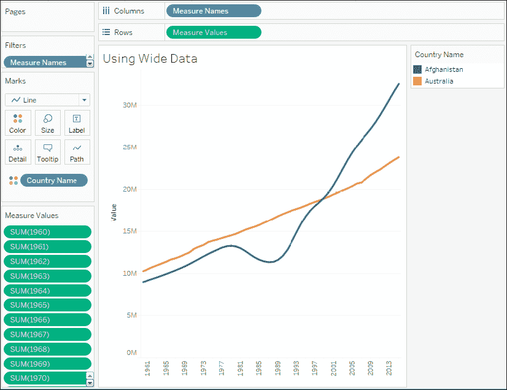

# 第十四章：将混乱数据结构化以便与 Tableau 配合使用

到目前为止，本书中的大多数示例假设数据结构良好且相对干净。现实世界中的数据并不总是如此完美。也许它很混乱，或者没有良好的结构。它可能缺失值或有重复值，或者可能具有错误的详细程度。

如何处理这种类型的混乱数据？在上一章中，我们考虑了如何使用 Tableau 的数据模型来关联不同表中的数据。在下一章中，我们将考虑将 Tableau Prep Builder 作为清理和结构化数据的有效方法。本章中的许多信息将为你使用 Tableau Prep 提供必要的基础。

目前，让我们关注一些在 Tableau 中效果良好的基本数据结构，以及你可以使用的一些额外技术，将数据转换为这些结构。在本章中，我们将讨论 Tableau 的本地功能，但你学到的许多内容将在下一章的 Tableau Prep 中应用。到本章结束时，你将对什么构成良好的数据结构有一个坚实的基础。了解哪些数据结构与 Tableau 配合良好是解决某些问题的关键。

在本章中，我们将重点讨论一些有助于与 Tableau 配合良好的数据结构原则，以及如何解决常见数据问题的具体示例。本章将涵盖以下主题：

+   为 Tableau 结构化数据

+   四种基本的数据转换

+   数据问题的高级修复概述

我们将首先讨论哪些数据结构在 Tableau 中效果较好。

# 为 Tableau 结构化数据

我们已经看到，Tableau 可以连接几乎所有数据源。无论是内置的直接连接、**开放数据库连接**（**ODBC**），还是使用 Tableau 数据提取 API 生成提取，数据都没有限制。然而，某些结构使得数据在 Tableau 中更容易使用。

确保良好数据结构的两个关键要素是：

+   每个源数据连接的记录应处于有意义的详细程度

+   数据源中包含的每个度量值应与数据源的详细程度匹配，或者可能处于更高的详细程度，但绝不应处于较低的详细程度。

例如，假设你有一张记录每个班级的测试成绩的表格，每条记录代表一个学校中的一个教室。在记录中，你可能会有三个度量值：该教室的平均 GPA、班级中的学生人数以及学校的平均 GPA：

| **学校** | **教室** | **平均 GPA** | **学生人数** | **学校的学生人数** |
| --- | --- | --- | --- | --- |
| Pickaway 小学 | 4 年级 | 3.78 | 153 | 1,038 |
| Pickaway 小学 | 5 年级 | 3.73 | 227 | 1,038 |
| Pickaway 小学 | 6 年级 | 3.84 | 227 | 1,038 |
| McCord 小学 | 4 年级 | 3.82 | 94 | 915 |
| McCord 小学 | 5^(年级) | 3.77 | 89 | 915 |
| McCord 小学 | 6^(年级) | 3.84 | 122 | 915 |

前两个度量（**平均 GPA**和**学生数量**）与数据的单个记录处于相同的详细级别（每个班级的记录）。**学生数量（学校）**则处于更高的详细级别（每个学校）。只要你意识到这一点，你就可以进行仔细的分析。然而，如果你尝试将每个学生的 GPA 存储在班级记录中，就会遇到数据结构问题。如果数据结构尝试存储每个年级的所有学生 GPA（也许每个学生有一列，或者有一个字段包含一个以逗号分隔的学生成绩列表），那么我们需要做一些工作，以便让数据在 Tableau 中更易于使用。

理解源数据的详细级别（通常称为**粒度**）至关重要。每次连接到数据源时，你应该问并回答的第一个问题是：一条记录代表什么？例如，如果你将`记录数量`（或在 Tableau 2020.2 及更高版本中的`表格（计数）`字段）字段拖放到视图中并观察到 1,000 条记录，那么你应该能够完成这个陈述，`我有 1,000 个 _____`。它可以是 1,000 个学生、1,000 个考试成绩，或者 1,000 所学校。对数据粒度有良好的理解将帮助你避免做出错误的分析，并帮助你判断是否拥有进行分析所需的数据。

查找数据详细级别的快速方法是将`记录数量`（或者在 Tableau 2020.2 及更高版本中的`表格（计数）`字段）放到**文本**架上，然后尝试将不同的维度放到**行**架上。当所有行显示为 1，并且在左下角状态栏中显示的总数等于数据中的记录数量时，那么该维度（或维度组合）就唯一标识了一条记录，并定义了数据的最低详细级别。

理解数据粒度的整体原则后，让我们继续了解某些数据结构，这些结构可以让你在 Tableau 中无缝且高效地工作。有时，最好在源头使用`Alteryx`或 Tableau Prep Builder 等工具重构数据。然而，在某些情况下，重构源数据是不可能的或不可行的。例如，你可能没有数据库的写入权限，或者它可能是一个具有预定义结构的基于云的数据源。对于这种情况，我们将在 Tableau 中看一些选项。目前，让我们考虑哪些类型的数据结构与 Tableau 的兼容性较好。

## Tableau 中的良好结构化数据

在上一节中提到的构建良好结构的两个关键点应该能得出一种数据结构，其中单一的度量包含在单一列中。你可能有多个不同的度量，但任何单一的度量几乎不应被分布在多个列中。通常，这种差异被描述为**宽数据**与**高数据**。

### 宽数据

*宽数据通常不是 Tableau 中进行可视化分析的良好结构*。

**宽数据**描述了一种结构，其中单行的度量分布在多个列中。这种数据通常更加**易于阅读**。宽数据往往会导致较少的行和更多的列。

下面是宽数据在表格中展示的人口数字示例：

| **国家名称** | **1960** | **1961** | **1962** | **1963** | **1964** |
| --- | --- | --- | --- | --- | --- |
| 阿富汗 | 8,774,440 | 8,953,544 | 9,141,783 | 9,339,507 | 9,547,131 |
| 澳大利亚 | 10,276,477 | 10,483,000 | 10,742,000 | 10,950,000 | 11,167,000 |

请注意，这个表格的详细层次是每个国家一行。然而，单一的度量（人口）并未存储在单一列中。这些数据是宽数据，因为它们有一个单一的度量（人口），但该度量被分布在多个列中（每个年份一个列）。这个宽数据表违反了构建良好结构的第二个关键点，因为度量的层次低于每条记录的层次（按国家和年份，而不是按国家）。

### 高数据

*高数据通常是 Tableau 中进行可视化分析的良好结构*。

**高数据**描述了一种结构，其中每个不同的度量在一行中包含在单一列中。高数据通常会导致更多的行和更少的列。

考虑以下表格，它代表了与之前相同的数据，但采用了高数据结构：

| **国家名称** | **年份** | **人口** |
| --- | --- | --- |
| 阿富汗 | 1960 | 8,774,440 |
| 阿富汗 | 1961 | 8,953,544 |
| 阿富汗 | 1962 | 9,141,783 |
| 阿富汗 | 1963 | 9,339,507 |
| 阿富汗 | 1964 | 9,547,131 |
| 澳大利亚 | 1960 | 10,276,477 |
| 澳大利亚 | 1961 | 10,483,000 |
| 澳大利亚 | 1962 | 10,742,000 |
| 澳大利亚 | 1963 | 10,950,000 |
| 澳大利亚 | 1964 | 11,167,000 |

现在，我们有更多的行（每个国家每年一行）。单独的年份不再是分开的列，而人口测量也不再分布在这些列中。相反，一个单一的列给我们提供了**年份**的维度，另一个单一的列给我们提供了**人口**的度量。行数增加了，而列数减少了。现在，人口的度量与每一行的详细信息处于同一层次，因此在 Tableau 中进行可视化分析将变得更容易。

让我们看看这个差异在实践中的体现。

### Tableau 中的宽数据与高数据

你可以在 Tableau 中轻松看到宽数据与高数据的区别。以下是**宽数据**表格在左侧**数据**窗口中的样子：


图 14.1：宽格式数据每年都有一个度量。

正如我们所期望的那样，Tableau 将表中的每一列视为一个独立的字段。数据的宽格式结构对我们不利。最终，我们为每一年都得到一个独立的度量。如果你想绘制每年的人口折线图，你可能会感到很困难。哪个维度表示日期？你可以使用哪个单一度量来表示人口？

这并不是说不能在 Tableau 中使用宽格式数据。例如，你可以使用**度量名称**/**度量值**将所有**年份**度量绘制在一个视图中，如下所示：



图 14.2：宽格式数据仍然可以使用，但方式复杂且有限。

你会注意到每个**年份**字段都被放置在**度量值**货架上。好消息是，即使是结构不良的数据，你也可以从中创建可视化图表。坏消息是，创建视图往往更加困难，并且某些高级功能可能无法使用。

基于宽格式数据结构，以下限制适用于图 *14.2* 中的视图：

+   因为 Tableau 没有日期维度或整数维度，所以无法使用预测功能。

+   因为 Tableau 在**列**中没有日期或连续字段，所以无法启用趋势线。

+   因为每个度量都是一个独立的字段，所以无法使用快速表计算（例如累计总和、百分比差异等）。

+   确定诸如跨年份平均人口等内容，将需要繁琐的自定义计算，而不是仅仅更改度量的聚合方式。

+   你没有日期轴（只有度量名称的系列标题），因此无法添加参考线。

相比之下，**高格式数据**在**数据**面板中的样子是这样的：


图 14.3：高格式数据具有一个**年份**维度和一个单独的**人口**度量。

这个数据源更容易处理。只有一个度量（**人口**）和一个**年份**维度来切片该度量。如果你想制作按年份划分的人口折线图，只需将**人口**和**年份**字段拖到**列**和**行**中。预测、趋势线、聚类、平均值、标准差等高级功能都能按预期工作。

你可以看到，使用仅三个活动字段创建的可视化结果，在 Tableau 中要容易得多。


图 14.4：使用高格式数据在 Tableau 中创建视图要容易得多。

接下来，我们将考虑几种其他适合与 Tableau 配合使用的数据结构。

## 星型模式（数据集市/数据仓库）

假设它们设计良好，**星型模式**数据模型与 Tableau 非常兼容，因为它们有明确的粒度、度量和维度定义。此外，如果它们实现得当，可以极为高效地查询。这使得在使用 Tableau 的实时连接时，能够提供非常顺畅的体验。

星型架构之所以得名，是因为它由一个单一的事实表和与之相关的维度表组成，从而形成了一个星形模式。**事实表**包含具有有意义粒度的度量，而**维度表**包含各种相关实体的属性。下图展示了一个简单的星型架构，其中包含一个事实表（**医院就诊**）和三个维度表（**患者**、**主治医生**、和**出院详情**）：


图 14.5：一个简单的星型架构

事实表通过通常被称为**替代键**或**外键**的字段与相关的维度表连接，该外键引用单一的维度记录。事实表定义了粒度级别，并包含度量。在这种情况下，**医院就诊**的粒度是每次就诊一条记录。在这个简单的示例中，每次就诊都对应一个患者，患者见了一个主治医生并完成了出院。**医院就诊**表明确存储了`就诊时长`这一度量，并隐式定义了另一项度量`就诊次数`（即行数）。

数据建模的纯粹主义者会指出，日期值已被存储在事实表中（甚至一些维度表中）。他们会建议，应该有一个日期维度表，包含每个日期的详细属性，并且只在事实表中存储一个替代键（外键）。

日期维度非常有用。然而，Tableau 内置的日期层次结构和丰富的日期选项使得将日期存储在事实表中成为一种可行的选择。如果你需要日期的特定属性，而这些属性在 Tableau 中不可用（例如，哪些天是公司假期），或者有复杂的财政年度，或者需要支持遗留的 BI 报表工具，可以考虑使用日期维度。

设计良好的星型架构允许使用**内连接**，因为每个替代键都应引用单个维度记录。在维度值未知或不适用的情况下，会使用特殊的维度记录。例如，一个尚未完成的住院就诊（患者仍在医院）可能会引用**出院详情**表中的一个特殊记录，标记为`尚未出院`。

你已经在上一章中处理过类似的数据结构，在那里你体验了数据模型的逻辑层和物理层中表关系的差异。可以随时返回*第十三章*，*理解 Tableau 数据模型、联接和合并*，以复习相关概念。

实现良好的星型架构尤其适合用于**实时连接**，因为 Tableau 可以通过实现联接剔除来提高性能。**联接剔除**是 Tableau 通过将查询中的不必要联接发送到数据源引擎来消除不必要的联接。

例如，如果将`医生姓名`放置在行上，将`访问时长`的平均值放置在列上，以便获得每个医生的平均访问时长的条形图，那么可能不需要连接到**治疗**和**病人**表格。如果你使用的是简单的星型模式且只从中央事实表进行连接，并且在数据源中启用了参照完整性，或者允许 Tableau 假设参照完整性，那么 Tableau 会自动去除不必要的连接。对于物理层中连接的表格，从数据菜单中选择数据源连接，或使用数据源连接的上下文菜单，选择**假设参照完整性**。对于数据模型的逻辑层中的关系，使用每个适用关系的参照完整性性能选项。

在考虑了一些良好的结构示例后，让我们关注一些基本的转换，这些转换将帮助我们将结构不佳的数据集转换为结构良好的数据集，使得在 Tableau 中更容易操作。

# 四种基本的数据转换

在本节中，我们将为您提供一些基本转换的概述，这些转换可以从根本上改变数据的结构。我们将从概述开始，然后查看一些实际示例。

## 转换概述

在 Tableau（以及 Tableau Prep）中，有四种基本的数据转换。以下定义广泛适用于大多数数据库和数据转换工具，但也有一些特定于 Tableau 的细节和术语：

+   **透视**：这表示将列转换为行或将行转换为列。后者仅在 Tableau Prep 中可用。结果的数据集会更窄更高，列数较少，行数较多（列转行），或者会更宽更短，列数更多，行数较少（行转列）。

+   **联合**：这表示将一张数据表的行附加到另一张表格，匹配的列**对齐**在一起。结果数据结构是一个包含所有联合表格行的单一表格，以及原始表格之间匹配的列，未匹配的列则包含`NULL`值。

+   **连接**：这表示对两个或更多表格进行逐行匹配，生成一个包含所有表格列的数据结构。行数取决于连接类型和找到的匹配数量。

+   **聚合**：这表示将表格**汇总**到更高层次的细节，以便每个用于分组的维度的唯一值集都有一行，同时包含其他聚合值（如总和、最小值、最大值或其他聚合）。

为了更全面地理解这些定义，我们将借助一些插图和实际示例。

## 透视（以及一些简单的数据清理）

`World Population Data.xlsx` 这份 Excel 工作簿，位于本书资源包中 `Chapter 14` 目录下，是许多 Excel 文档的典型代表。它的内容如下所示：


图 14.6：World Population Data Excel 文件

这类 Excel 文档通常更加易于阅读，但在 Tableau 中用于数据分析时往往包含多个问题。此文档中的问题包括：

+   多余的表头（标题、注释和格式）不属于数据部分

+   合并单元格

+   国家名称和代码合并在同一列中

+   可能不必要的列（**指标名称** 和 **指标代码**）

+   数据较宽，即每一年都有一列，且人口数据分布在这些列中，属于同一条记录

当我们最初连接到 Excel 文档时，连接界面将类似于 *图 14.7*，如下所示：


图 14.7：Tableau 数据源页面中的 World Population Data.xlsx

数据预览显示了因结构不良而导致的一些问题：

+   由于列头不在 Excel 的第一行，Tableau 默认为每一列赋予了 **F1**、**F2** 等名称

+   标题 **World Population Data** 和关于样本数据的注释被解读为 **F1** 列中的值

+   实际的列头被当作了一行数据（第三行）

幸运的是，这些问题可以在连接窗口中解决。首先，我们可以通过启用 **Tableau 数据解析器** 来修正许多多余的表头问题，该组件专门用于识别和解决 Excel 或 Google 表格文档中的常见结构问题。当你勾选 **使用数据解析器** 选项时，数据预览将呈现出更好的结果：


图 14.8：Tableau 数据解析器解决了 Excel（及类似）数据源中许多常见问题

点击勾选框下方的 **查看结果...** 链接，将导致 Tableau 生成一个新的 Excel 文档，并通过颜色编码来显示数据解析器如何解析该 Excel 文档。使用此功能可以验证 Tableau 是否正确解析了 Excel 文档，并保留了你预期的数据。

观察到多余的表头被去除，且列名得到了正确的显示。然而，仍然有一些附加的问题需要修正。

首先，如果我们认为 **指标名称** 和 **指标代码** 列对分析没有用处，我们可以将其隐藏。点击列头上的下拉箭头，会显示一个菜单选项。

选择 **隐藏** 将会从连接中移除该字段，并且防止其被存储到提取文件中：


图 14.9：你可以在数据源页面隐藏字段

其次，我们可以使用相同菜单中的选项将**国家名称和代码**列分成两列，以便分别处理名称和代码。在这种情况下，菜单中的**拆分**选项效果很好，Tableau 完美地拆分了数据，甚至去除了代码周围的括号。在拆分选项初次无法正常工作时，可以尝试**自定义拆分...**选项。我们还将使用**重命名**选项，将拆分后的字段`国家名称和代码 - 拆分 1`和`国家名称和代码 - 拆分 2`分别重命名为**国家名称**和**国家代码**。然后，我们将**隐藏**原始的`国家名称和代码`字段。

到此为止，大部分数据结构问题已经得到解决。然而，你会发现数据仍然是**宽格式**。我们已经看到了可能遇到的一些问题：


图 14.10：经过一些清理后，数据仍然呈现不理想的宽格式结构

我们的最后一步是**透视**年份列。这意味着我们将重塑数据，使得每个国家在每一年都有一行。通过点击**1960**列，向右滚动，按住*Shift*键并点击**2013**列，选择所有年份列。最后，在任何一个年份字段的下拉菜单中选择**透视**选项。

结果是用两个列（**透视字段名称**和**透视字段值**）代替了所有年份列。将这两个新列重命名为**年份**和**人口**。现在，数据集变得更加狭长，而不是宽短。

最后，注意到**年份**列的图标被 Tableau 识别为文本字段。点击该图标可以直接更改数据类型。在这种情况下，选择**日期**会得到`NULL`值，但将数据类型更改为**数字（整数）**则会得到适用于大多数情况的整数值：


图 14.11：你可以在数据源页面上更改字段的数据类型

另外，你也可以使用`年份`字段中第一个下拉菜单并选择**创建计算字段...**。这将允许你创建一个计算字段，命名为**年份（日期）**，该字段将年份字符串解析为日期，代码如下：`DATE(DATEPARSE("yyyy", [Year]))`。此代码将解析字符串并将其转换为没有时间的简单日期。然后，你可以隐藏原始的**年份**字段。即使字段用于计算，只要它不用于视图，你也可以将其隐藏。这将使数据集变得非常干净。

最终清理后的透视数据集在 Tableau 中比原始数据集更容易操作：


图 14.12：清理和透视后的数据集

数据解释器、清理选项以及在 Tableau 中透视数据（列转行）的功能，使得处理许多数据集变得更加轻松。接下来，我们将了解合并。

## 合并

通常，你可能有多个独立的文件或表格，它们合在一起代表整个数据集。例如，你可能有一个过程，每月生成一个新的数据转储文件并保存到某个目录中。或者，你可能有一个 Excel 文件，其中包含每个部门的数据，每个部门的数据在不同的工作表中。

**联合**是将数据表按行拼接成一个单一表格的过程。比如，考虑以下三张数据表：

**原创**：

| **姓名** | **职业** | **银行账户余额** |
| --- | --- | --- |
| Luke | 农民 | $2,000 |
| Leia | 公主 | $50,000 |
| Han | 走私犯 | -$20,000 |

**前传**：

| **姓名** | **职业** | **银行账户余额** |
| --- | --- | --- |
| Watto | 垃圾商 | $9,000 |
| Darth Maul | 面部画家 | $10,000 |
| Jar Jar | 西斯领主 | -$100,000 |

**续集**：

| **姓名** | **职业** | **银行账户余额** |
| --- | --- | --- |
| Rey | 拾荒者 | $600 |
| Poe | 飞行员 | $30,000 |
| Kylo | 失业 | $0 |

这些表的联合将生成一个包含每个单独表格行的单一表格：

| **姓名** | **职业** | **银行账户余额** |
| --- | --- | --- |
| Luke | 农民 | $2,000 |
| Leia | 公主 | $50,000 |
| Han | 走私犯 | -$20,000 |
| Watto | 垃圾商 | $9,000 |
| Darth Maul | 面部画家 | $10,000 |
| Jar Jar | 西斯领主 | -$100,000 |
| Rey | 拾荒者 | $600 |
| Poe | 飞行员 | $30,000 |
| Kylo | 失业 | $0 |

Tableau 允许你将文件数据源中的表格联合起来，包括以下类型：

+   文本文件（`.csv`、`.txt` 和其他文本文件格式）

+   Excel 文档中的工作表（标签）

+   Excel 表中的子表

+   多个 Excel 文档

+   Google 表格

+   关系型数据库表

使用**数据解析器**功能查找 Excel 或 Google 表格中的子表。它们将作为数据的附加表格出现在左侧边栏。

在 Tableau 中创建联合，请按以下步骤操作：

1.  从菜单、工具栏或**数据源**屏幕中创建一个新的数据源，开始时选择你希望成为联合一部分的文件之一。然后，将任何其他文件拖动到画布上现有表格下方的**拖动表格到联合区域**，该区域位于逻辑层或物理层中（不过，技术上讲，联合存在于物理层中）：

    图 14.13：你可以通过将表格或文件直接拖放到画布上现有表格下方来创建联合

1.  一旦你创建了联合，可以在设计器中的表格下拉菜单中配置联合选项。或者，你也可以将左侧边栏中的**新建联合**对象拖动到设计器中，替换现有表格。这将显示创建和配置联合的选项：

    图 14.14：你可以使用这些选项编辑联合

    **Specific (manual)**标签允许你将表格拖入或拖出联合操作。**Wildcard (automatic)**标签允许你指定文件名和工作表（对于 Excel 和 Google Sheets）中的通配符，这些通配符会根据匹配情况自动将文件和工作表包含在联合操作中。

    如果你预见未来会添加更多文件，使用**Wildcard (automatic)**功能。例如，如果你有一个特定的目录，用于定期存储数据文件，通配符功能将确保你不必手动编辑连接。

1.  一旦定义了联合操作，你可以使用结果数据源来可视化数据。此外，联合表可以与设计窗口中的其他表格进行连接，给你在数据处理上提供很大的灵活性。

当你创建联合操作时，Tableau 会在数据源中添加一个或多个新字段，帮助你识别数据来源的文件、工作表和表格。**Path**将包含文件路径（包括文件名），**Sheet**将包含工作表名称（对于 Excel 或 Google Sheets），而**Table Name**将包含子表或文本文件名。你可以利用这些字段帮助识别数据问题，并根据需要扩展数据集。

例如，如果你有一个按月命名的数据文件目录，文件名为`2020-01.txt`、`2020-02.txt`、`2020-03.txt`，依此类推，但文件中没有实际的日期字段，你可以使用如下代码通过计算字段获取日期：

```py
DATEPARSE('yyyy-MM', [Table Name] ) 
```

在联合操作中，Tableau 会根据列名匹配不同表格之间的列。当表格或文件之间的列名不一致时会发生什么情况？如果你向数据库写查询，你可能会预期查询失败，因为列名通常需要完全匹配。然而，Tableau 允许你联合那些列名不匹配的文件或表格。

在一个文件/表格中存在但在其他文件/表格中不存在的列会作为联合表的一部分出现，但在没有该列的文件/表格中，值会显示为`NULL`。例如，如果某个文件包含一个名为**Job**的列，而不是**Occupation**，那么最终的联合表将包含一个名为**Job**的列和一个名为**Occupation**的列，在不存在该列的地方显示`NULL`值。你可以通过选择这些列并使用下拉菜单来合并不匹配的列。这将合并（保留每行数据中第一个非空值）为一个新的单列：


图 14.15：使用合并不匹配字段功能，合并因联合操作导致的字段名不匹配的列（该不匹配未包含在示例数据中）。

你不必合并不匹配的字段。有时，某些文件或表格中没有对应的匹配项，这对于你的分析可能是有用的。

联合（Unions）允许你将结构相对相同的多个文件或表格合并，并**堆叠**在一起，这样你就可以得到所有表格/文件中的记录。通过对旋转和联合的探索，我们已经涵盖了四种基本转换类型中的两种。接下来我们将继续演示如何使用连接来重构数据。

## 连接（Joins）

你会记得，我们之前在*第十三章*，*理解 Tableau 数据模型、连接和混合*中讨论了连接的概念和类型。虽然连接在将同一数据库中的表格或甚至不同数据源（不同系统和格式中的数据）合并时非常有用，但它们也可以用来解决其他数据问题，例如重塑数据，使其更容易在 Tableau 中实现你的目标。

你可以在`第十四章`的工作簿中通过以下示例进行操作，但服务器数据库数据源是通过文本文件（`Patient Visits.txt`）进行模拟的。

假设你有一个服务器数据库中的表格（例如 SQL Server 或 Oracle），该表格为每个患者包含一行数据，并将**入院日期**和**出院日期**作为单独的列：

| **患者 ID** | **患者姓名** | **入院日期** | **出院日期** |
| --- | --- | --- | --- |
| 1 | David | 2018/12/1 | 2018/12/20 |
| 2 | Solomon | 2018/12/3 | 2018/12/7 |
| 3 | Asa | 2018/12/5 | 2018/12/22 |
| 4 | Jehoshaphat | 2018/12/5 | 2018/12/6 |
| 5 | Joash | 2018/12/9 | 2018/12/16 |
| 6 | Amaziah | 2018/12/10 | 2018/12/14 |
| 7 | Uzziah | 2018/12/12 | 2018/12/24 |
| 8 | Jotham | 2018/12/16 | 2018/12/29 |
| 9 | Hezekiah | 2018/12/18 | 2018/12/22 |
| 10 | Josiah | 2018/12/22 | 2018/12/23 |

尽管这种数据结构适用于某些分析类型，但如果你想要按日展示 12 月住院患者的数量，可能会觉得难以使用。

首先，你应该使用哪个日期字段作为轴？即使你将表格旋转，使得所有日期都集中在一个字段中，你也会发现数据中有缺失。**稀疏数据**，即某些值没有记录的数据，在一些现实世界的数据源中非常常见。具体来说，在这个例子中，你每个**入院**或**出院**日期都有一条记录，但中间的日期没有记录。

有时，可能可以选择在源头重构数据，但如果数据库被锁定，你可能无法做到这一点。你还可以利用 Tableau 填补数据空白的功能（**数据密集化**）来解决这个问题。然而，这种解决方案可能会很复杂，并且潜在地不稳定或难以维护。

另一种选择是使用连接来创建所有日期的行。在这种情况下，我们将利用跨数据库连接，将另一个数据源完全引入。你可能会迅速创建一个包含你想要查看的日期列表的 Excel 表格，如下所示：


图 14.16：一个仅包含日期综合列表的 Excel 文件

这个 Excel 文件包含每个日期的记录。我们的目标是将数据库表与 Excel 表中的数据进行**交叉连接**（将一个表的每一行与另一个表的每一行连接）。完成此操作后，您将为每个患者的每个日期生成一行记录。

将一个数据集中的每条记录与另一个数据集中的每条记录连接起来，产生的结果称为**笛卡尔积**。生成的数据集将包含`N1 * N2`行（其中`N1`是第一个数据集的行数，`N2`是第二个数据集的行数）。使用这种方法时要小心。它在较小的数据集上效果良好，但随着数据集的增大，笛卡尔积可能会变得非常庞大，以至于这个解决方案不再可行。

您通常会在各个表中找到可以用来连接数据的特定字段。然而，在这种情况下，我们没有定义连接的键。日期也没有给我们提供一种连接所有数据的方法，以便获得我们想要的结构。为了实现交叉连接，我们将使用连接计算。**连接计算**允许您编写一个专门用于连接的特殊计算字段。

在这种情况下，我们将为两个表选择**创建连接计算...**并为左右两侧都输入单一的硬编码值，也就是`1`：


图 14.17：正如我们所见，连接是在数据模型的物理层创建的

由于左侧每行的`1`与右侧每行的`1`匹配，我们得到了每一行与每一行的匹配——这就是一个真正的交叉连接。

作为替代方案，对于许多其他基于服务器的数据源，您可以使用**自定义 SQL**作为数据源。在**数据源**屏幕上，使用设计器中的**患者访问**表，您可以使用顶部菜单选择**数据** | **转换为自定义 SQL**来编辑 Tableau 用于源的 SQL 脚本。或者，您也可以在左侧边栏使用**新建自定义 SQL**对象编写自己的自定义 SQL。

在这个替代示例中的脚本已被修改，加入了`1 AS Join`来创建一个名为**Join**的字段，字段值为每行`1`（尽管如果您没有在脚本中这样做，您也可以简单地使用连接计算）。在自定义 SQL 中定义的字段也可以用于连接：


图 14.18：一个可以用来创建连接值的示例脚本

基于连接计算，我们新的交叉连接数据集包含了每个患者每个日期的记录，现在我们可以创建一个快速计算，查看某个患者是否应被计入特定日期的医院人口。名为**医院中的患者**的计算字段包含以下代码：

```py
IF [Admit Date] <= [Date] AND [Discharge Date] >= [Date] 
THEN 1 
ELSE 0 
END 
```

这使我们能够轻松可视化患者流动，甚至可能基于平均值、趋势，甚至预测进行高级分析：


图 14.19：经过数据重构后的每日医院人口可视化图表，使得分析变得简单。

最终，对于长期解决方案，你可能希望考虑开发一个基于服务器的数据源，以提供所需分析的结构。然而，这里的连接允许我们在不等待长时间开发周期的情况下实现分析。

在考虑了枢轴、联合和连接的例子之后，让我们将焦点转向最终主要的转换类型之一：聚合。

## 聚合

请记住，良好数据结构的两个关键要素如下：

+   拥有有意义的细节级别

+   拥有与细节级别相匹配的度量，或者可能处于更高细节级别的度量

处于较低细节级别的度量往往导致数据变得很宽，可能会使某些分析变得困难，甚至不可能。而较高细节级别的度量，有时也可能是有用的。只要我们了解如何正确处理它们，就可以避免一些陷阱。

举例来说，考虑以下数据（该数据以`Apartment Rent.xlsx`文件形式包含在`Chapter 14`目录中），该数据为每个公寓每个月提供一个记录：


图 14.20：公寓租金数据，由于每个月的平方英尺（Square Feet）度量值被重复记录，结构较差。

这两个度量值实际上位于不同的细节级别：

+   **收取的租金（Rent Collected）**与数据的细节级别相匹配，其中记录了每月每个公寓的租金收入。

+   另一方面，**平方英尺（Square Feet）**每个月并不变化。相反，它处于较高的细节级别，仅限于**公寓**。

如果数据被包含在两个表格中，且细节级别正确，Tableau 的数据模型会使得这些数据非常容易处理。如果数据存储在关系型数据库中，我们可以使用自定义 SQL 语句创建几个具有正确细节级别的表格，那么我们可能会考虑这种方法。在下一章中，我们将讨论如何使用 Tableau Prep 来轻松解决这个问题。现在，请逐步分析这些细节，以便理解如何应对类似的结构问题（这样你会对 Tableau Prep 和 Tableau 数据模型能做的事情有深刻的认识！）。

细节级别的差异可以通过移除视图中的日期，并查看所有数据的**公寓**级别来观察：


图 14.21：展示了不同聚合方式在不同细节级别下是否正确的插图。

注意，**SUM(收取的租金)** 是完全合理的。你可以将每个月收取的租金加总起来，并得出每个公寓的有意义的结果。然而，你不能对**平方英尺（Square Feet）**进行求和并得到每个公寓的有意义结果。其他聚合方法，如平均值、最小值和最大值，确实能给出每个公寓的正确结果。

然而，假设您被要求计算每个公寓的租金与平方英尺的比率。您知道这将是一个聚合计算，因为您需要先将收取的租金求和再进行除法。但以下哪个是正确的计算方法呢？

+   `SUM([收取租金])/SUM([平方英尺])`

+   `SUM([收取租金])/AVG([平方英尺])`

+   `SUM([收取租金])/MIN([平方英尺])`

+   `SUM([收取租金])/MAX([平方英尺])`

第一个显然是错误的。我们已经看到每个月不应该添加平方英尺。只要确保**公寓**继续定义视图的详细级别，最后三个中的任何一个都是正确的。

然而，一旦我们查看具有不同详细级别的视图（例如，所有公寓的总计或多个公寓的每月总计），这些计算就不起作用了。要理解原因，请考虑当我们打开列总计（从菜单中选择**分析** | **总计** | **显示列总计**，或者从**分析**选项卡中拖放**总计**）时会发生什么：


图 14.22：没有一种聚合方式可以给我们提供总计

这里的问题在于**总计**行位于所有公寓（所有月份）的详细级别。实际上，我们真正想要的**总计**平方英尺是 `900 + 750 = 1,650`。然而，在这里，平方英尺的总和是所有公寓所有月份的平方英尺相加。平均值不适用。最小值找到 **750** 作为数据中所有公寓的最小度量。同样地，最大值选择 **900** 作为单个最大值。因此，任何提议的计算方法在不包括单个公寓的详细级别时都不会起作用。

您可以通过点击单个值并使用下拉菜单选择总计方式来调整子总计和总计的计算方式。或者，右键单击活动度量字段并选择**使用总计**。您可以从菜单中选择**分析** | **总计** | **全部使用总计**来一次性更改所有度量的总计方式。使用这种**两遍总计**技术可以在先前的视图中得到正确的结果，但不能普遍解决问题。例如，如果您想显示每月每平方英尺的价格，您将面临同样的问题。

幸运的是，Tableau 允许我们在视图中处理不同的详细级别。使用我们在*第五章*，*利用详细级别计算*中遇到的**详细级别**（LOD）计算，我们可以计算每个公寓的平方英尺。

在这里，我们将使用固定的 LOD 计算来保持公寓级别的详细信息不变。我们将创建一个名为`每个公寓的平方英尺`的计算字段，其代码如下：

```py
{ INCLUDE [Apartment] : MIN([Square Feet]) } 
```

大括号包围了一个 LOD 计算，关键字`INCLUDE`表示我们希望将`公寓`包含为计算的详细级别的一部分，即使它不包含在视图详细级别中。在前述代码中使用了`MIN`，但也可以使用`MAX`或`AVG`，因为所有这些都会得到每个公寓相同的结果。

正如你所看到的，计算返回了视图级别和总计级别的正确结果，在这里 Tableau 包括**公寓**以找到**900**（**A**的最小值）和**750**（**B**的最小值），然后将它们求和得到**1,650**：


图 14.23：LOD 计算为我们提供了所有详细级别上的正确结果

现在，我们可以在另一个计算中使用 LOD 计算字段来确定所需的结果。我们将创建一个名为`每平方英尺收集的租金`的计算字段，并使用以下代码：

```py
SUM([Rent Collected])/SUM([Square Feet per Apartment]) 
```

当该字段添加到视图并格式化以显示小数时，最终结果是正确的：


图 14.24：LOD 表达式为我们提供了更复杂的基础，例如计算每个区域的租金

或者，我们可以使用`FIXED`级别的详细信息，而不是使用`INCLUDE`。这总是在遵循`FIXED`关键字后的维度级别上执行，而不管视图中定义的详细级别是什么。这将告诉 Tableau 始终计算每个公寓的最小平方英尺，而不管定义视图级别的维度是什么。虽然非常有用，请注意，`FIXED` LOD 计算是针对整个上下文（整个数据集或由**上下文筛选器**定义的子集）计算的。如果不理解这一点，使用它们可能会产生意想不到的结果。

目前，我们已经学会了如何处理一些聚合问题；然而，在下一章中，我们将探讨如何通过聚合来真正转换数据，使类似前面练习的问题变得更加容易。与此同时，让我们考虑一些数据问题的替代修复方法。

# 数据问题的高级修复概述

除了本章早些时候提到的技术之外，还有一些额外的方法来处理数据结构问题。本书不涵盖完全发展这些概念。然而，通过一些对这些方法的熟悉，你可以扩展自己解决挑战的能力：

+   **自定义 SQL**：它可以用于数据连接以解决一些数据问题。除了为跨数据库连接提供字段，如我们之前看到的，自定义 SQL 还可以用于根本重塑从源中检索的数据。自定义 SQL 并非适用于所有数据源，但适用于许多关系型数据库。考虑一个自定义 SQL 脚本，将我们之前在本章中提到的国家人口的宽表重构为高表：

    ```py
    SELECT [Country Name],[1960] AS Population, 1960 AS Year 
    FROM Countries 

    UNION ALL 

    SELECT [Country Name],[1961] AS Population, 1961 AS Year 
    FROM Countries 

    UNION ALL

    SELECT [Country Name],[1962] AS Population, 1962 AS Year 
    FROM Countries 
    ... 
    ... 
    ```

    等等。虽然设置起来可能有些繁琐，但这将使得在 Tableau 中处理数据变得更加容易！然而，许多使用复杂自定义 SQL 的数据源出于性能考虑需要进行提取。

+   **表格计算**：表格计算可以用于解决许多数据挑战，从查找和消除重复记录到处理多个细节级别。由于表格计算可以在更高细节级别的分区内工作，你可以将多个表格计算与聚合计算结合使用，在一个视图中混合不同的细节级别。一个简单的例子是**总百分比**表格计算，它将视图中细节级别的聚合计算与更高细节级别的总计进行比较。

+   **数据混合**：数据混合可以用来解决许多数据结构问题。由于你可以定义所使用的连接字段，你可以控制混合的细节级别。

+   **数据支架**：数据支架扩展了数据混合的概念。在这种方法中，你构建一个由各种维度值组成的支架，作为主要数据源，然后将它们与一个或多个次要数据源进行混合。通过这种方式，你可以控制主要数据源的结构和粒度，同时仍然能够利用次要数据源中的数据。

+   **数据模型**：数据混合在你需要控制每个视图的关系级别时非常有用。如果关系定义得更好，数据模型将为你提供强大的能力，将不同细节级别的表格关联起来，并确保聚合计算能够正确执行。

# 总结

到目前为止，我们已经查看了大多数结构良好且易于使用的数据。在这一章中，我们考虑了什么构成良好的结构以及如何处理不良的数据结构。一个良好的结构由具有有意义细节级别的数据组成，并且具有与该细节级别相匹配的度量。当度量分布在多个列中时，我们得到的是宽数据而非高数据。

我们还花了一些时间理解了基本的转换类型：数据透视、联合、连接和聚合。理解这些对于解决数据结构问题至关重要。

你还获得了一些实际经验，应用各种技术来处理具有错误形状或度量级别不匹配的数据。Tableau 赋予我们处理一些结构性问题的能力和灵活性，但最好在源头上修复数据结构。

在下一章，我们将暂时停下来不看 Tableau Desktop，转而考虑 Tableau Prep，另一个解决复杂数据问题的替代工具！
