# 第十五章：使用 Tableau Prep 整理数据

在前一章中，我们考虑了在 Tableau Desktop 中构建数据结构的几种选项。有关结构良好的数据的许多概念将在此处应用，因为我们现在将注意力转向 Tableau 的另一款产品：**Tableau Prep**。Tableau Prep 扩展了 Tableau 平台，提供了强大的数据清理和结构化选项，便于在 Tableau 中进行分析。正如 Tableau Desktop 为数据可视化和分析提供了一个直观、交互的体验，Tableau Prep 则为数据清理和整形提供了一个直观、交互的体验。

Tableau Prep 处于加速的每月发布周期中，虽然该平台不断增长和扩展，但其背后有一个基本的范式，为数据清理和整形奠定了基础。我们将在本章中覆盖大量内容，但我们的目标不是覆盖每一个可能的功能——实际上，我们不会。相反，我们将寻求理解那个基础范式和思考流程，这将帮助您在 Tableau Prep 中应对多种数据挑战。

在本章中，我们将通过几个实际的示例来探讨 Tableau Prep 的范式，理解基本的转换操作，并了解 Tableau Prep 的许多功能和特性。

本章将涵盖多个主题，包括以下内容：

+   准备好探索 Tableau Prep

+   了解 Tableau Prep Builder 界面

+   按照基本范式进行数据流动

    +   连接数据

    +   清理数据

    +   Tableau Prep 中的计算和聚合

    +   在 Tableau Prep 中过滤数据

    +   为分析转化数据

+   自动化数据流的选项

在本章中，我们将广泛使用“Tableau Prep”这一术语，指代 Tableau 为数据准备开发的整个平台，有时也作为 Tableau Prep Builder 的简称，后者是用于连接数据、创建数据流和定义输出的客户端应用程序。在需要明确时，我们将使用这些具体名称：

+   **Tableau Prep Builder**：用于设计数据流、在本地运行它们并发布的客户端应用程序

+   **Tableau Prep Conductor**：这是 Tableau Server 的一个附加组件，允许对已发布的数据流进行调度和自动化处理。

让我们从了解如何开始使用 Tableau Prep 开始。

# 准备好开始探索 Tableau Prep

Tableau Prep Builder 适用于 Windows 和 Mac。如果您当前没有在机器上安装 Tableau Prep Builder，请花点时间从[`www.tableau.com/products/prep/download`](https://www.tableau.com/products/prep/download)下载该应用程序。Tableau Prep Builder 的许可证包含在 Tableau Creator 许可中。如果您当前没有许可证，您可以免费试用该应用程序 14 天。请与您的 Tableau 代表联系，以确认许可和试用期。

本章中的示例使用的文件位于 `\Learning Tableau\Chapter 15` 目录下。具体说明将指导你何时以及如何使用这些文件。

一旦你下载并安装了 Tableau Prep Builder，你将能够启动应用程序。启动后，你将看到一个欢迎屏幕，我们将在下一节中详细介绍该界面。

# 理解 Tableau Prep Builder 界面

你会发现 Tableau Prep Builder 和 Tableau Desktop 的界面有很多相似之处。Tableau Prep Builder 的主屏幕看起来将类似于以下内容：

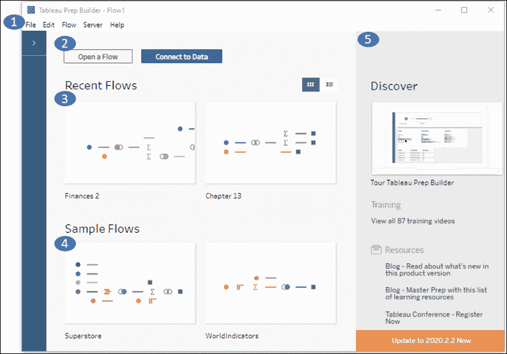

图 15.1：Tableau Prep Builder 欢迎屏幕，数字标注用以识别界面中的关键组件

以下组件在*图 15.1*中已被编号：

1.  菜单包括打开文件、编辑和运行流、登录 Tableau Server 以及各种**帮助**功能的选项。还可以注意到左侧紧挨着**文件**菜单的**连接**面板。初始时它是折叠的，但随着你创建数据连接，它将包含一个数据连接列表。

1.  屏幕顶部的两个大按钮为你提供了**打开一个流**的选项，用于打开一个现有的 Tableau Prep 流文件，或**连接数据**，用于通过初始数据连接开始一个新流。在下一节中我们会定义什么是流。现在，你可以把流看作是 Tableau Prep 相当于 Tableau Desktop 工作簿的东西。

1.  **最近的流**显示了你最近保存的 Tableau Prep 数据流。你可以点击其中一个打开流并进行编辑或运行。右侧的切换按钮允许你在缩略图和列表视图之间切换。

1.  **示例流**允许你打开一些预构建的示例。

1.  **发现**面板为你提供了在学习 Tableau Prep 时的培训和资源选项。如果有新版本可用，通知升级也会出现在此。

一旦你打开或开始一个新流，主屏幕将被一个新界面替代，这将有助于流的设计和运行：

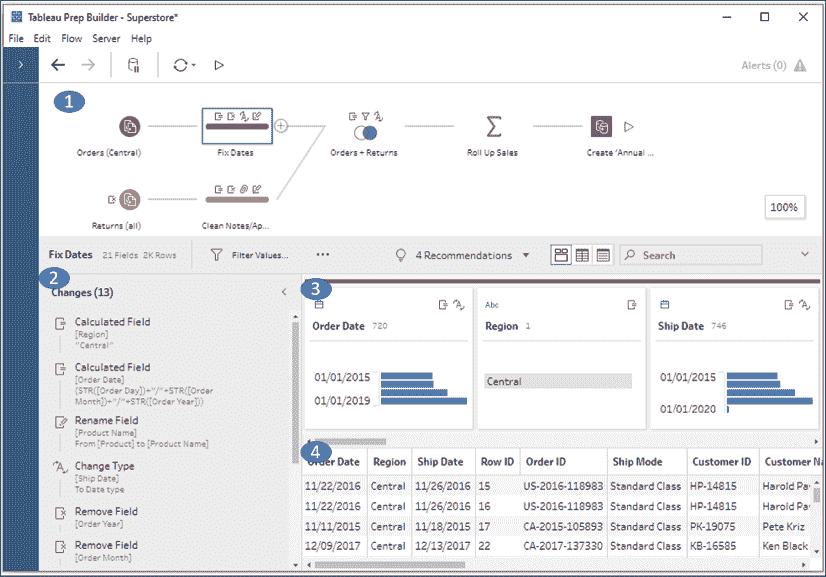

图 15.2：在设计流时，你会看到类似于此的界面。主要组件已按数字标注，具体描述如下：

这个界面由以下部分组成，这些部分在前面的截图中已编号：

1.  流面板，你将在其中逻辑地构建数据流，步骤包括从清洗到计算，再到转换和重塑。选择任何一个单独的步骤，将在屏幕下半部分显示相应的界面。这个界面会有所不同，具体取决于你选择的步骤类型。

1.  设置面板或更改面板列出了该步骤的设置，还包括该步骤中所做的所有更改，从计算、重命名或删除字段，到更改数据类型或分组值。你可以点击单个更改进行编辑，或者查看这些更改如何影响数据。

1.  配置面板显示了所选步骤中每个字段的配置情况。你可以看到每个字段的类型和数值分布。点击某个字段将突出显示流程面板中的数据流，点击字段的一个或多个数值将突出显示与之相关的其他字段值。

1.  数据网格显示了该步骤中存在的每条数据记录。选择变化网格中的某个变化，将显示根据该变化（包括该变化）后的数据。选择配置面板中某个字段的值，将筛选数据网格，仅显示包含该值的记录。例如，选择配置面板中`订单日期`字段的第一行，将使数据网格仅显示由该条记录表示的数据。这允许你浏览数据，但在你执行某个会产生变化的操作之前，数据不会被更改。

你还会注意到工具栏，它允许你撤销或重做操作、刷新数据或运行流程。此外，还会根据所选步骤或字段的类型显示其他选项或控件。我们将在深入探讨 Tableau Prep 的工作原理及本章稍后的实际示例时，详细说明这些内容。

# 跟随基本理念的流动

Tableau Prep 的整体理念是通过一个流程，以实践和可视化的方式发现、清理和塑造数据。一个流程（有时也叫做数据流程）是应用于数据的逻辑步骤和变化的系列，从输入（或多个输入）到输出（或多个输出）。

下面是 Tableau Prep 中流程面板中的一个流程示例：

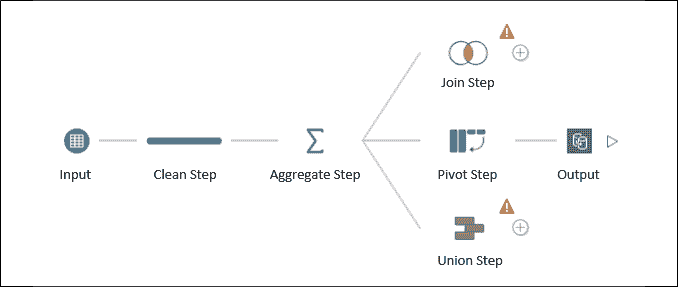

图 15.3：Tableau Prep 中的流程示例

每个流程的独立组件称为步骤，这些步骤通过连接线相互连接，表示数据从左到右的逻辑流动。连接线有时也被称为流程的连接器或分支。请注意，**聚合步骤**这里有一条从左边进入的线和三条向右延伸的分支。任何步骤都可以有多个输出分支，表示流程中该点的数据逻辑副本。

需要注意的一个重要点是，四种步骤类型代表了我们在*第十四章*《将凌乱数据结构化以便在 Tableau 中顺利工作》中讨论的四大数据转换。这些步骤类型分别是**透视**、**联合**、**连接**和**聚合**，它们与这些转换完全对应，而**清理步骤**则允许进行各种清理和计算操作。你可能希望回顾一下上一章中提到的基本数据转换。

在本章我们通过一个流程示例进行讲解时，将更详细地考察每种类型的步骤。现在，先考虑一下 Tableau Prep 中主要步骤的初步定义：

+   **输入**：输入步骤通过数据源（例如文件、表格、视图或自定义 SQL）开始流程。它提供了定义文件分隔符、多个表或文件的联合以及如何抽样数据量（对于较大的记录集）的选项。

+   **清理步骤**：清理步骤允许你对数据执行各种功能，包括计算、过滤、调整数据类型、移除和合并字段、分组和清理等。

+   **聚合步骤**：聚合步骤允许你在指定的详细级别上聚合值（例如，获取`MIN`、`MAX`、`SUM`、`AVG`等）。

+   **连接步骤**：连接步骤允许你将流程中的两个分支汇聚在一起，并基于你选择的字段以及连接类型逐行匹配数据。

+   **联合步骤**：联合步骤允许你将两个或更多代表数据集的分支合并在一起。你将有选项合并或移除不匹配的字段。

    这个示例中的**联合步骤**和**连接步骤**都有一个错误图标，表示流程中某些配置不正确。将鼠标悬停在图标上会显示错误的工具提示描述。在这种情况下，错误是由于只有一个输入连接，而联合和连接都需要至少两个输入。通常，选择带有错误图标的步骤可能会在更改窗格或配置步骤的其他地方显示错误的详细信息。

+   **透视步骤**：透视步骤允许你将数据列转换为行，或将数据行转换为列。你将有选项选择透视类型以及字段本身。有时也会使用术语*转置*来描述此操作。

+   **输出**：输出步骤定义了清理和转换后的数据的最终目的地。这可以是文本文件（`.csv`）、提取文件（`.hyper` 或 `.tde`），或发布到 Tableau Server 的提取数据源。虽然输出到数据库的功能已经宣布，但在撰写时尚不可用。你将有选项选择输出类型、路径和文件名，或选择 Tableau Server 和项目。

右键单击步骤或连接器会显示各种选项。你也可以将步骤拖放到其他步骤上，以显示连接或联合步骤的选项。如果你想替换流程的早期部分并交换输入步骤，可以右键单击连接器并选择**删除**，然后将新的输入步骤拖动到流程中所需的下一个步骤上，以将其添加为新的输入。

除了使用术语*流程*来指代定义数据逻辑流程和转换的步骤与连接，我们还会使用流程一词来指代 Tableau Prep 用于存储步骤定义和流程更改的文件。Tableau Prep 流程文件的扩展名为 `.tfl`（未打包流程）或 `.tflx`（打包流程）。

Tableau Prep 的范式远远超出了任何单一步骤的功能和特点。当你构建和修改数据流时，你会立即收到反馈，这样你就能看到每个步骤和变化的影响。这使得你可以相对轻松（而且有趣！）地逐步发现数据，并进行必要的更改。

当你构建数据流、添加步骤、做出更改并与数据互动时，你处于 **设计模式**。Tableau Prep 结合了 Hyper 引擎的缓存和直接查询数据库的方式，在你做出更改时提供近乎即时的反馈。当你运行数据流时，你使用的是 **批处理模式** 或 **执行模式**。Tableau Prep 将运行优化过的查询和操作，这些查询与设计模式下运行的查询可能略有不同。

在本章的其余部分，我们将通过一个示例来帮助讨论 Tableau Prep 的范式，并突出一些重要的功能和注意事项。这个示例将自然展开，使我们能够看到 Tableau Prep 如何提供令人难以置信的灵活性，以应对数据挑战并随着你发现数据的新方面进行更改。

我们将把你置于一个分析师的角色，任务是分析员工的航空旅行。这将包括票价、航空公司，甚至对旅行本身进行一些地理空间分析。数据需要从多个系统中整合，并且需要清洗和整理才能进行分析。

为了跟随操作，打开 Tableau Prep Builder，它会直接显示在主屏幕（本章没有启动数据流）。示例数据位于 `Chapter 15` 目录中，如果你想检查你的工作，可以找到 `Complete` 流程。`Complete (clean)` 流程包含了一个自我记录数据流的示例——它不会精确匹配截图。

当你打开 `Complete` 流程文件时，你可能会收到错误和警告，提示输入路径和输出路径无效。这是预期中的情况，因为你的计算机几乎肯定会有不同的驱动器和目录结构，和准备示例时所用的系统不同。当你与他人共享数据流文件时，也会遇到这种情况。要解决这些问题，只需在左侧的 **连接** 窗格（在 *图 15.4* 中展开）中处理连接，重新连接文件并将输出步骤设置为适合你计算机的目录。

我们将从连接数据开始！

## 连接数据

在 Tableau Prep 中连接数据非常类似于在 Tableau Desktop 中连接数据。从主屏幕上，你可以点击“**连接到数据**”或在展开的“**连接**”窗格中点击 **+** 按钮：

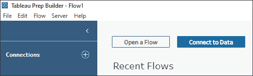

图 15.4：你可以通过点击 + 按钮或“连接到数据”按钮来创建新的数据连接。

无论哪种 UI 元素都会弹出一个数据源类型的选择列表。

与 Tableau Desktop 类似，对于基于文件的数据源，你可以将文件从**Windows 资源管理器**或**Finder**拖动到 Tableau Prep 窗口，以快速创建连接。

Tableau Prep 支持多种文件类型和数据库，且支持的类型仍在不断增加。你会识别出许多与 Tableau Desktop 相同的连接类型。不过，在撰写本书时，Tableau Prep 尚不支持 Tableau Desktop 中所有可用的连接类型。

你可以创建任意数量的连接，**连接**窗格会分别列出每个连接，并显示相关的文件、表、视图、存储过程或适用于该数据源的其他选项。你可以在流中使用任何组合的数据源。

现在，我们从以下步骤开始示例：

1.  从图 *15.4* 所示的窗口开始，点击**连接数据**。

1.  从出现的扩展连接列表中，选择**Microsoft Excel**。

1.  你将看到一个名为**员工航班**的主表和一个名为**员工航班表 1**的子表。将**员工航班**表拖动到流画布中，将创建一个输入步骤，并显示数据预览和其他选项。输入预览窗格最初会像这样：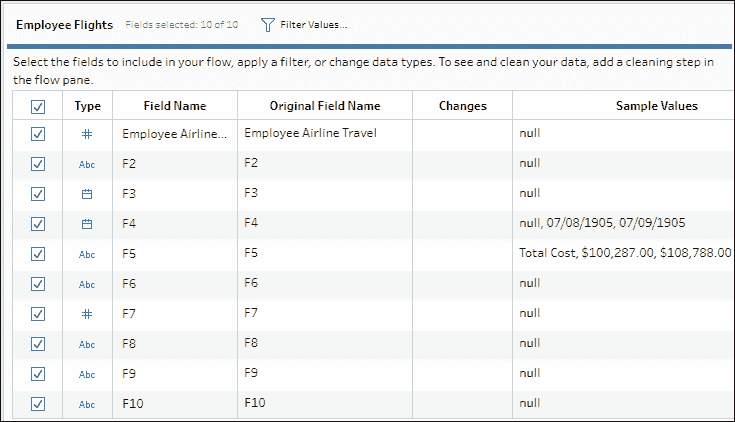

    图 15.5：输入预览允许你选择要包含在流中的输入字段，重命名字段，并更改数据类型。

    输入步骤显示字段网格和这些字段的选项。你会注意到，**员工航班**表中的许多字段被命名为`F2`、`F3`、`F4`，依此类推。这是由于 Excel 文件的格式问题，其中包含合并单元格和汇总子表。请继续按照以下步骤进行操作：

1.  在**连接**窗格中选中**使用数据解释器**选项，Tableau Prep 将正确解析文件，如下所示：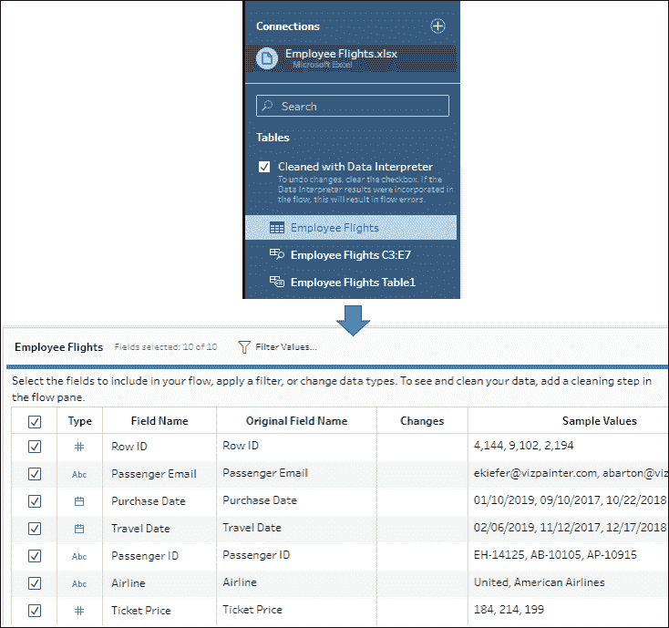

    图 15.6：数据解释器解析文件，以修复常见问题，例如合并单元格、空标题和小计行。

    当你选择一个输入步骤时，Tableau Prep 会显示数据字段的网格。你可以使用该网格取消勾选不想包含的字段，点击相关符号编辑数据的**类型**（例如，将字符串改为日期），并通过双击字段名值来编辑**字段名称**。

    如果 Tableau Prep Builder 检测到数据源包含大量记录，它可能会启用数据采样。**数据采样**使用较小的记录子集来提供快速反馈和设计模式下的分析。然而，在你以批处理模式运行整个流程时，它将使用完整的数据集。你可以通过点击输入窗格中的**数据样本**来控制数据采样选项。虽然你可以为源设置样本大小，但后续步骤（如联接）如果生成大量记录，可能会启用无法禁用的采样。如果在流程中发生数据采样，你会收到**数据采样**的指示。

1.  现在，我们将继续探索数据并在过程中解决一些问题。点击鼠标悬停在**员工航班**输入步骤上时出现的**+**按钮。这将允许你通过添加额外的步骤类型来扩展流程。在这种情况下，我们将添加一个**清理步骤**。这将通过添加名为**Clean 1**的清理步骤来扩展流程：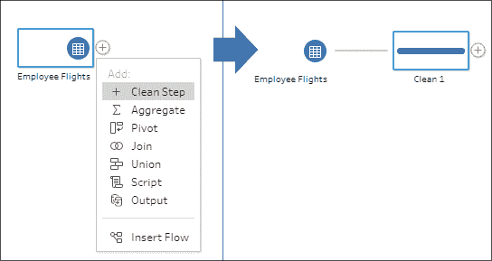

    图 15.7：添加一个步骤扩展了流程。在这里，添加一个清理步骤会添加 Clean 1

1.  选择**Clean 1**步骤后，花一点时间使用配置文件窗格来探索数据。观察在配置文件窗格中选择字段的单个值时，如何突出显示与其他字段相关的部分值。这能让你深入了解数据，比如根据`机票` `类型`看到不同的价格区间：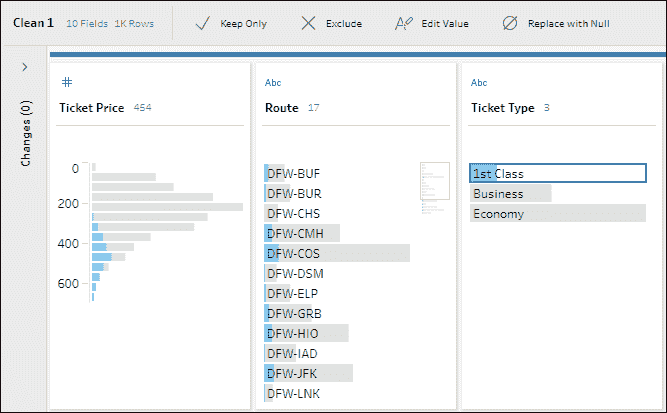

    图 15.8：在配置文件窗格中选择字段值时，会突出显示与所选值相关的值（以及这些值的比例）

在配置文件窗格中突出显示字段间的条形图段，通常是通过选择字段值实现的，这叫做“刷选”。你还可以通过配置文件窗格顶部的工具栏或右键点击字段值来对选中的值采取操作。这些操作包括过滤、编辑值或用 `NULL` 替换。然而，在对数据进行任何更改或清理之前，让我们连接一些额外的数据。

事实证明，大部分航空公司机票预订数据存储在一个由 Excel 文件表示的数据库中，但另一家航空公司的预订数据存储在定期添加到目录中的文件中。这些文件位于 `\Learning Tableau\Chapter 15\` 目录中。文件名遵循 `Southwest YYYY.csv` 的命名规范（其中 `YYYY` 代表 `年份`）。

我们将连接所有现有文件，并确保为未来可能添加的文件做好准备：

1.  点击**连接**窗格中的**+**图标，添加一个新的**文本文件**连接。

1.  导航到 `\Learning Tableau\Chapter 15\` 目录并选择任何一个 `Southwest YYYY.csv` 文件来开始连接。查看**输入**设置，你应该会看到 Tableau Prep 正确识别了字段分隔符、字段名称和类型：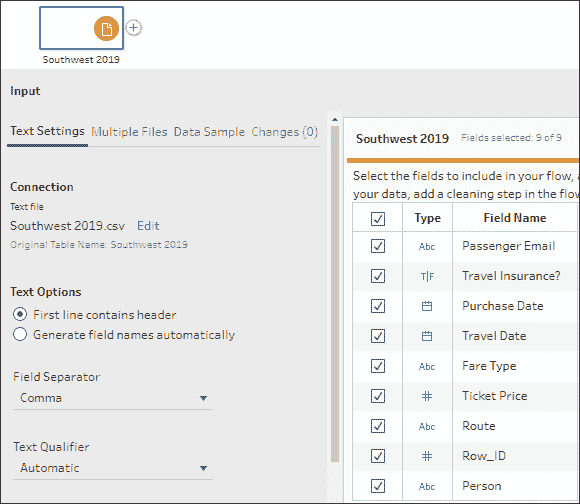

    图 15.9：一个文本文件包含了头部、字段分隔符、文本限定符、字符集等选项。还可以注意到诸如“多个文件”和“数据示例”等标签，提供了其他文本输入的选项。

1.  在**输入**面板中，选择**多个文件**标签，并从**单一表格**切换到**通配符联合**。将**匹配模式**设置为`Southwest*`，然后点击**应用**。这告诉 Tableau Prep 将目录中所有以`Southwest`开头的文本文件联合起来：

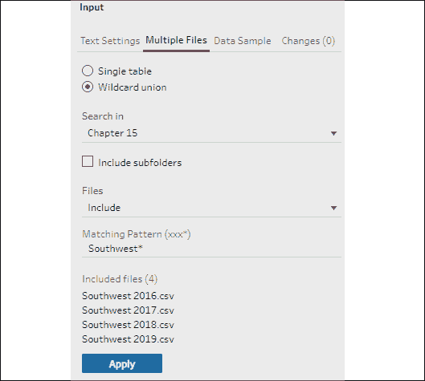

图 15.10：使用匹配模式告诉 Tableau Prep 应该将哪些文件联合在一起。这样，当`Southwest 2020.txt`和未来的文件被放入目录时，它们将自动被包括在内。

1.  使用流程面板中**西南**输入步骤上的**+**图标来添加一个新的清理步骤。这个步骤默认命名为**清理 2**。再次检查数据，但在将两个数据源在流程中结合之前，不要采取任何操作。你可能会注意到在**清理 2**步骤中有一个名为**文件路径**的新字段，表示联合中每条记录对应的文件。

在定义了输入步骤之后，接下来我们考虑如何清理一些数据，为分析做好准备。

## 数据清理

构建流程的过程是相当迭代的，你会经常发现有关数据的新信息，这有助于你清理和转换数据。为了方便参考，我们将此示例分成几个部分，但不要因此忽视构建流程本应是一种思维流的想法。这个示例旨在做到无缝衔接！

在本节中，我们将探讨一些数据预处理的可能性，包括合并和分组。让我们从查看如何在流程中联合各个分支开始。

### 联合、合并不匹配的字段并删除不必要的字段

我们知道我们想要将所有航空公司的预订数据合并在一起，因此我们将在流程中联合这两个路径：

1.  将**清理 2**步骤拖到**清理 1**步骤上，并将其放到出现的**联合**框中。这将创建一个新的**联合**步骤，输入连接来自两个清理步骤：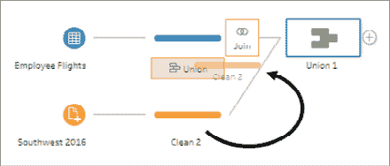

    图 15.11：在流程中将一个步骤拖到另一个步骤上，显示出将数据集合并到流程中的选项。例如，这里有创建联合或连接的选项。

1.  当选择**联合**步骤时，出现的**联合**面板会显示不匹配的字段，指示相关输入，并提供删除或合并字段的选项。例如，`Fare`、`Type`和`Ticket Type`在 Excel 文件和文本文件中的命名不同，但实际上代表的是相同的数据。按住*Ctrl*键并选择两个字段，然后从面板顶部的工具栏或右键菜单中选择**合并字段**：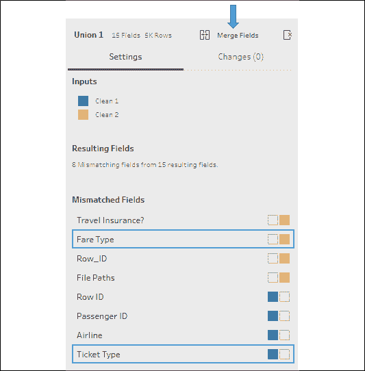

    图 15.12：当你选择单一字段时，Tableau Prep 会高亮显示可能为相同数据的字段。选择这两个字段后会显示“合并字段”选项。

1.  同样，合并`Row``ID`和`Row_ID`。

1.  **文件路径**仅适用于`Southwest`文件，这些文件在**输入**步骤中被联合在一起。虽然这个自动生成的字段在某些情况下非常有用，但在这个例子中并没有为数据增加任何价值。选择该字段，然后点击省略号菜单按钮，选择**移除字段**。

1.  类似地，`Travel``Insurance?`和`Passenger``ID`仅适用于一个输入字段，在我们的分析中用处不大。也请移除这些字段。

1.  唯一剩下的字段`Airline`是有用的。暂时保留它，然后点击流面板中**Union 1**步骤的**+**图标，选择**清理步骤**来扩展流程。此时，您的流程应该如下所示：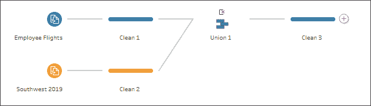

    图 15.13：你的流程应该类似于这个。你可能会注意到步骤的确切位置或颜色有所不同（你可以通过右键点击步骤来更改步骤的颜色）。

在流中的**Union 1**步骤上方有一个图标，表示在此步骤内做出的更改。在这种情况下，更改是移除了几个字段。每个有更改的步骤都会有类似的图标，鼠标悬停时会显示工具提示的详细信息，还可以与更改进行交互。你可以通过点击步骤并打开更改面板，查看更改的完整列表，编辑它们、重新排序或移除它们。根据步骤类型，可以通过展开步骤或选择“更改”选项卡来查看此内容。

接下来，我们将继续构建流程并考虑一些分组与清理的选项。

### 分组与清理

现在，我们将花些时间清理来自两个输入源的数据。选中**Clean 3**步骤后，使用配置面板检查数据并继续我们的流程。前两个字段显示了一些需要处理的问题：

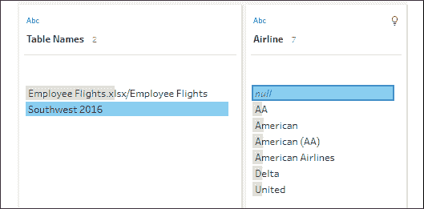

图 15.14：所有`Airline`字段中的空值来自于 Southwest 文件。幸运的是，在这个案例中，数据源明确指示了航空公司。

`Table``Names`字段是由 Tableau Prep 在**Union 1**步骤中生成的，用以指示记录的来源。`Airline`字段仅来自 Excel 文件（你可以通过在配置面板中选择它并观察流面板中该字段的高亮路径来确认这一点）。点击`Airline`字段的**空值**，并观察数据刷选：这是证明`Airline`中的空值全部来自 Southwest 文件的证据，因为这些文件没有包含用来指示航空公司的字段。我们将处理这些`空值`并进行一些额外的清理：

1.  双击**null**值，然后输入`Southwest`，将`NULL`替换为你知道代表正确航空公司的值。Tableau Prep 将通过一个回形针图标指示发生了**分组**和**替换**操作。

1.  我们将进行额外的分组，以清理**American**的变体。使用`Airline`字段上的**选项**按钮，选择**分组值** | **按发音分组**：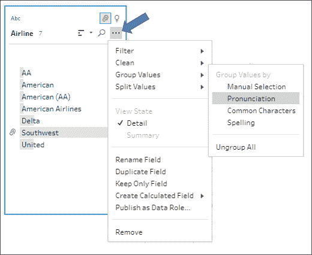

    图 15.15：字段上的省略号按钮将显示大量选项，从清理到过滤，再到分组和创建计算。

    几乎所有变体都被分组到**American**值中。只有**AA**还剩下。

1.  在弹出的**按发音分组值**窗格中，选择**American Airlines**组，并通过选中右侧列表中的**AA**手动添加它：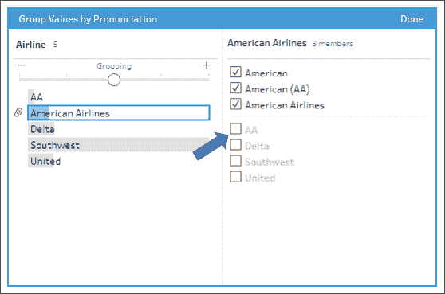

    图 15.16：当按发音分组时，你会注意到一个滑块，允许你控制分组的灵敏度。你也可以通过选择一个字段手动调整分组。

1.  在**按发音分组值**窗格中点击**完成**。

1.  接下来，选择不再需要的`Table``Names`字段。使用工具栏选项、字段右键菜单或选项按钮，选择**删除字段**。

1.  在资料窗格中的一些字段上，有一个**建议**图标（类似灯泡的图标）位于右上角。点击`Passenger``Email`字段上的此图标，然后点击**应用**建议，为其分配**Email**数据角色：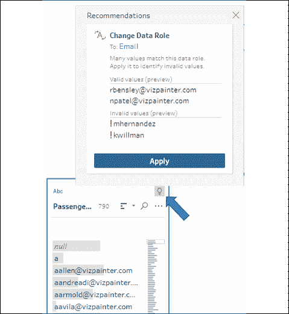

    图 15.17：当 Tableau Prep 有清理字段的建议时，建议将会显示。

    **数据角色**允许你根据预期的模式或值域快速识别有效或无效的值。一旦分配了数据角色，你可能会收到额外的建议，提示你过滤或替换无效值。

    应用建议后，你会看到资料窗格中标记无效值的指示。当你继续跟随示例时，我们将考虑一些快速处理无效值的选项。

1.  再次点击`Passenger``Email`字段上的**建议**按钮。你将看到呈现出两个新的选项。**应用**该选项以**分组**并将无效值替换为`null`：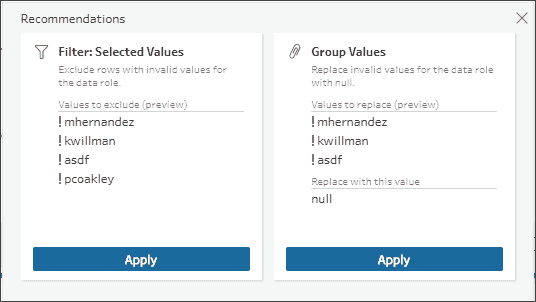

    图 15.18：在这里，Tableau Prep 建议要么过滤掉具有无效值的记录，要么将无效值替换为 null。在这种情况下，我们不想过滤掉整个记录，但无效值本身没有意义，最好用 null 来表示。

1.  除了`Fare``Type`（或者可能是`Ticket``Type`，具体取决于之前合并字段时保留了哪个名称）之外，大部分剩余字段看起来都没问题。这个字段包含了**1st Class**和**First Class**的值。按住*Ctrl*键点击这两个值，然后将它们与**First Class**值一起**分组**。这里有两种分组值的界面选项：

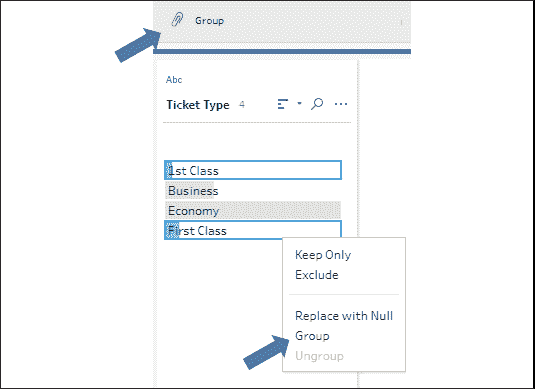

图 15.19：选择两个或多个值后，可以通过工具栏选项或右键菜单将它们分组

1.  到目前为止，我们已经有了一个干净的数据集，包含了所有的主要数据。事实上，我们已经可以进行很多分析了。不如现在先预览一下数据。右键点击**Clean 3**步骤并选择**在 Tableau Desktop 中预览**：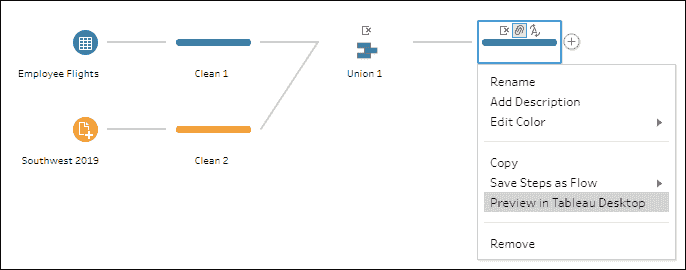

    图 15.20：你可以通过右键菜单选项在 Tableau Desktop 中预览任何步骤表示的数据

将建立一个新的数据连接，并在 Tableau Desktop 中打开。你可以预览流中任何步骤的数据。花些时间在 Tableau Desktop 中探索数据，然后返回 Tableau Prep。现在，我们将把注意力转向通过一些计算、补充数据和小范围重构来扩展数据集。

## Tableau Prep 中的计算和聚合

让我们看看如何在 Tableau Prep 中创建计算和聚合选项。

### 行级计算

Tableau Prep 中的计算语法几乎与 Tableau Desktop 相同。不过，你会注意到，只有行级和`FIXED`详细级别的函数是可用的。这是因为 Tableau Prep 中的所有计算都将应用于行级别。聚合操作则通过**聚合****步骤**来执行，我们稍后会讨论这一点。

计算和聚合可以大大扩展我们的分析能力。在当前的示例中，我们有机会分析从购票到实际旅行之间的时间间隔。我们还可能希望为每条记录标注一个乘客的整体旅行频率指标。接下来，跟随以下步骤深入了解这些计算：

1.  我们将从一个计算开始，确定从购票到旅行的时间间隔。选择**Clean 3**步骤，然后点击**创建计算字段**。将计算命名为**从购买到旅行的天数**，并输入`DATEDIFF('day', [Purchase Date], [Travel Date])`。

1.  检查个人资料面板中的结果。新字段应该如下所示：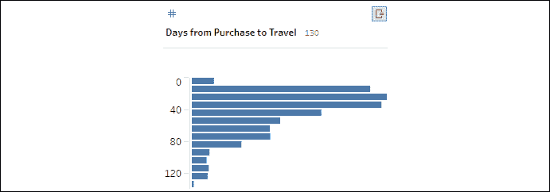

    图 15.21：计算字段显示在个人资料面板中

这里的默认视图（与许多数值字段的情况一样）是一个汇总的分箱直方图。你可以通过选择字段右上角的省略号按钮并切换到**详细信息**视图，查看字段的每一个值：

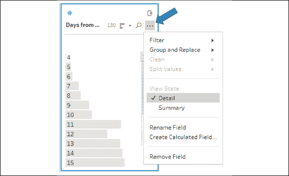

图 15.22：数值和日期字段可以在摘要或详细信息中查看。

默认汇总直方图显示的数据形态接近我们预期的，大多数人会在靠近（但不是立即）出行日期时购买票。提前购买可能会有更好的优惠，所以识别这一模式（并在 Tableau Desktop 中进一步探索）对于此类分析至关重要。

### 细节级别计算

我们可能希望进行其他几种类型的分析。让我们考虑如何根据乘客的旅行频率创建乘客细分。

我们将使用 `FIXED` **细节级别**（**LOD**）表达式来完成这一任务。我们可以从头开始创建计算，匹配我们在 Tableau Desktop 中学习的语法，像这样编写计算：

```py
{FIXED [Person] : COUNTD([Row_ID])} 
```

上述计算会对每个人进行不同的行计数。考虑到每一行代表一次旅行，我们也可以使用代码 `{FIXED [Person] : SUM(1)}`，根据具体的数据源，这可能会具有更好的性能。

然而，在这个例子中，我们将利用界面来可视化地创建计算：

1.  点击 `Person` 字段上的省略号按钮，并选择**创建计算字段** | **固定 LOD**：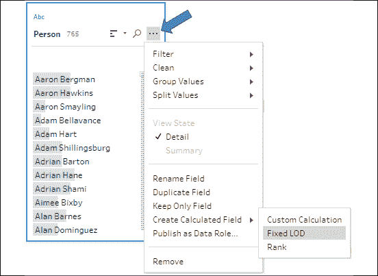

    图 15.23：要创建固定 LOD 计算，请使用菜单选择“创建计算字段” | “固定 LOD”。

    还可以注意到创建 **自定义计算**（编写代码）和 **排名**（计算选定字段的排名）的选项。

1.  这将弹出一个 **固定 LOD** 面板，允许我们配置 LOD 表达式。**按组计算**字段已设置为 `Person`（因为我们从该字段开始计算），但我们需要配置 **按...计算** 以执行行的不同计数，并将字段重命名为 `Trips``per``Person`，如图所示：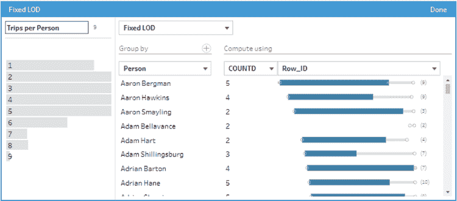

    图 15.24：固定 LOD 面板允许您可视化地配置 LOD 表达式，并即时获得关于结果的可视化反馈。

1.  配置完 **固定 LOD** 后，点击**完成**。

1.  我们将使用 `Trips per Person` 字段来创建客户细分。我们将通过另一个计算字段来实现此目的，因此点击**创建计算字段...**以打开代码编辑器。命名该字段为 `Frequency Segment`，并输入以下代码：

    ```py
    IF [Trips per Person] <= 2 THEN "Rarely"
    ELSEIF [Trips per Person] <= 5 THEN "Occasionally"
    ELSE "Frequently"
    END 
    ```

该代码使用 `Trips per Person` 字段在 `If` `Then` `Else` 结构中创建三个细分。您可以在预览面板中直观地看到字段之间的对应关系：

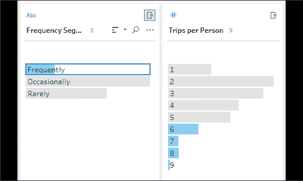

图 15.25：您可以轻松地通过概况面板可视化计算与其他字段之间的关系。

`Frequency``Segment` 字段可用于完成各种有用的分析。例如，您可能想了解频繁旅行者是否通常能获得更好的票价。

我们已经了解了行级别和 FIXED LOD 计算，并注意到了**排名**选项。现在让我们将注意力转向聚合。

### 聚合

在 Tableau Prep 中，聚合是通过聚合步骤实现的。我们将继续我们的流程，假设我们希望更好地理解我们的旅行频率分段：

1.  点击**Clean 3**上的**+**符号并添加一个**聚合**步骤。默认情况下，新步骤将被命名为**聚合 1**：

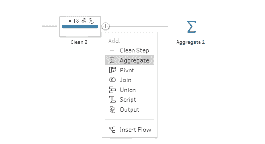

图 15.26：使用 + 符号将聚合步骤添加到流程中

1.  双击新步骤下的文本**聚合 1**，这样你就可以编辑名称。将名称从**聚合 1**更改为**频率** **分段**。

    给步骤起有意义的名字，以便自我记录流程。这将大大帮助你和其他人在将来返回编辑流程时。此外，当你编辑步骤的名称时，**添加描述**的文本会出现在名称下方，如*图 15.27*所示。

    

    图 15.27：在编辑步骤名称时，你还可以添加更详细的描述，帮助记录步骤的目的。

    选择聚合步骤会显示一个面板，提供在流程中对字段进行分组和聚合的选项：

    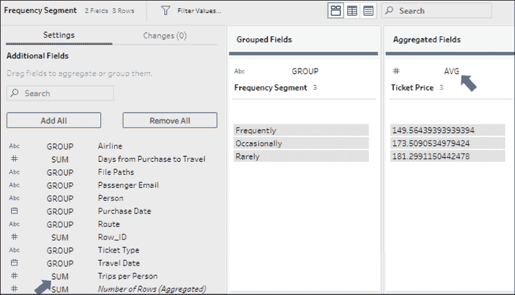

    图 15.28：使用 + 符号将聚合步骤添加到流程中

    你可以将左侧的字段拖放到**分组字段**或**聚合字段**部分，并且你可以通过点击聚合文本（*图 15.28*中的箭头指示的示例：`SUM`位于`每人旅行`旁，或者`AVG`位于`票价`上方）并从下拉菜单中选择不同的聚合类型来更改聚合方式。

    在*图 15.28*中，注意我们将**频率** **分段**添加到**分组**中，并将`票价`字段作为`AVG`添加到**聚合字段**中。还注意到，`行数` **(聚合)**出现在左侧字段列表的底部。这是一个在聚合步骤中可用的特殊字段。

1.  通过点击当你悬停在**频率分段**聚合步骤上时出现的**+**图标，添加一个**输出**步骤来结束本示例：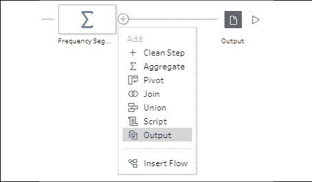

    图 15.29 使用 + 符号将输出步骤添加到流程中

1.  当你选择**输出**步骤时，**输出**面板会显示保存输出的选项，并预览输出将是什么样子。在这种情况下，我们已配置输出将保存到名为**频率分段**的**逗号分隔值（.csv）**文件中：

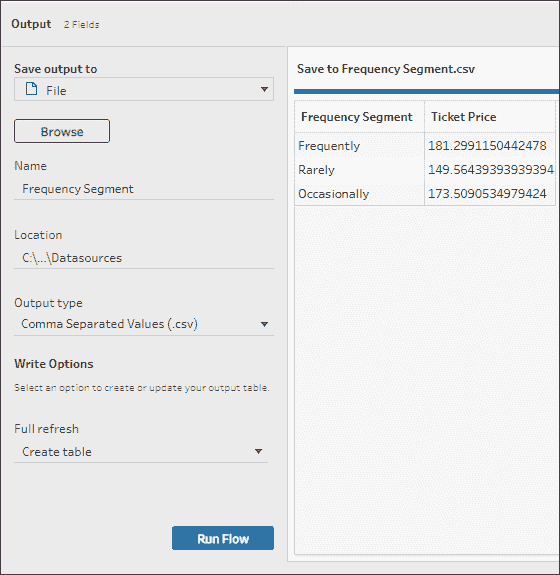

图 15.30：此输出将包含确切的三行数据

1.  **输出**面板还提供了设置输出类型、执行数据完全刷新或将数据追加到现有数据中以及运行流程的选项。

在接下来的几个部分，我们将扩展我们的流程，额外输出详细数据。详细数据以及聚合数据的输出文件为我们提供了一些很好的选项，可以在 Tableau Desktop 中利用 Tableau 的数据模型进行复杂分析。

让我们继续思考如何在 Tableau Prep 中过滤数据。

## 在 Tableau Prep 中过滤数据

在 Tableau Prep 中有几种方法可以过滤数据：

+   过滤输入

+   流程中的过滤

过滤输入可以提高效率，因为发送到数据源的查询将返回更少的记录。要过滤输入，选择输入步骤，然后点击输入面板上的**过滤值...**按钮：

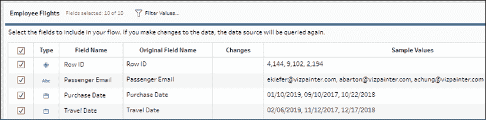

图 15.31：**过滤值...**选项允许你在输入步骤中过滤值。这可能会提高在大数据集或关系型数据库上的性能。

弹出的**添加过滤器**对话框允许你写出一个`Boolean`（布尔值，真/假）结果的计算式。只有为真值的记录将被保留。

过滤操作也可以在流程中的清洗步骤内进行。有多种方式可以应用过滤器：

+   选择一个或多个给定字段的值，然后使用**仅保留**或**排除**选项。

+   使用字段上的**选项**按钮，根据字段类型显示多个过滤选项。例如，日期可以通过**计算...**、**日期范围**、**相对日期**或**空值**来过滤：

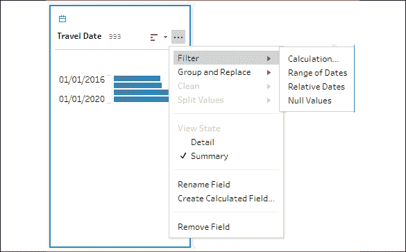

图 15.32：字段的过滤选项包括按计算、日期范围、相对日期进行过滤，以及保留或排除空值

+   选择一个字段，然后从工具栏中选择**过滤值**。与输入面板中的过滤器工作方式类似，你将被提示编写代码，以返回你希望保留的记录的真值。例如，如果你希望保留 2016 年 1 月 1 日之后的旅行记录，可以编写如下代码：

    ```py
    [Travel Date] > MAKEDATE(2016, 1, 1) 
    ```

虽然在我们示例中的数据集无需过滤，但你可能希望尝试不同的过滤技巧。

到此为止，你的流程应该像这样：

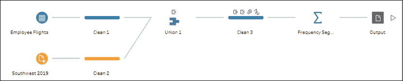

图 15.33：你的流程应该看起来像这样（步骤的具体位置和颜色可能有所不同）

让我们通过一些最终的转换来结束 Tableau Prep 流程，使数据在 Tableau 中更容易使用。

## 转换数据以进行分析

让我们在流程中创建一个新的分支，再次处理详细数据。点击**清洗 3**步骤并检查预览面板。特别是，考虑一下`Route`字段：

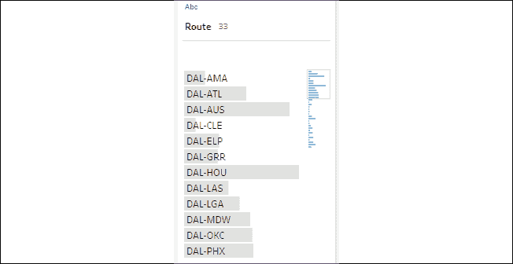

图 15.34：Route 字段使用机场代码表示起点和终点，用破折号分隔

Tableau Desktop（和 Server）内置了机场代码的地理编码功能。但为了实现我们的具体分析目标（并为 Tableau Desktop 中的其他地理空间功能开辟新的可能性），我们将通过自己的地理编码来补充数据。我们还需要考虑数据的形态。将起点和终点拆分成单独的字段最为有用，如果我们想要将它们在视觉上连接，我们还需要考虑将它们拆分成单独的行（一个用于起点，另一个用于终点）。

有很多种可视化数据的方法。例如，我们可以将起点和终点保留在同一行，并使用双轴图。如果我们想通过线条将起点和终点连接起来，我们可以将它们保留在同一数据行中，并使用 Tableau 的 `MAKELINE()` 函数。这里你将跟随的示例将指导你将数据拆分成单独的行。

如果你在跟随本教程，以下是我们将采取的步骤：

1.  使用当你悬停在 **Clean 3** 步骤时出现的 **+** 按钮。点击该按钮添加一个新的清理步骤，自动命名为 **Clean 4**：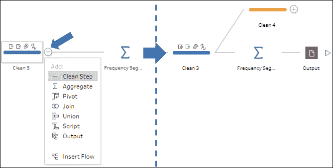

    图 15.35：向已有输出的步骤中添加内容会在流程中添加一个新的分支

1.  在 **Clean 4** 步骤中，点击 `Route` 字段的省略号按钮，选择 **拆分值** | **自动拆分**：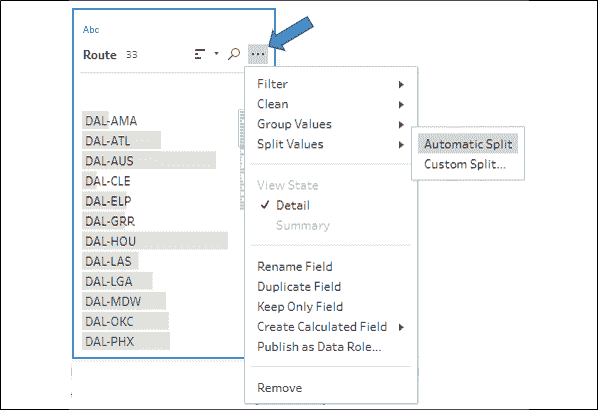

    图 15.36：拆分值允许你将分隔的字符串拆分成单独的字段。自动拆分会尝试确定分隔符，而自定义拆分...则提供更多选项和灵活性

    现在你会看到两个新的字段已添加到该步骤：

    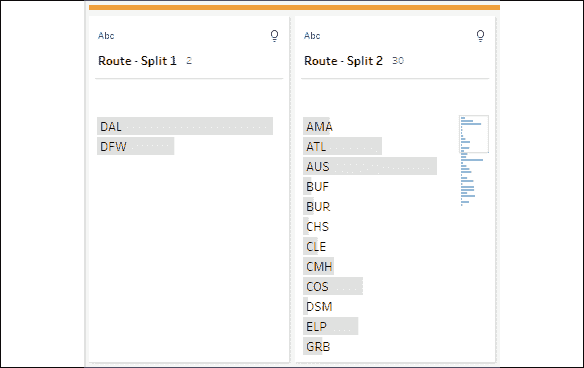

    图 15.37：拆分结果将在流程中生成新的字段

1.  **Route - Split 1** 是起点，**Route - Split 2** 是终点。在配置面板中双击字段名（或使用省略号按钮的选项）将字段重命名为 `Origin` 和 `Destination`。

1.  在 `Chapter 15` 目录下找到 `US Airports.hyper` 文件。该文件包含每个 `Airport` `Code`，以及 `Airport` `Name`、`Latitude` 和 `Longitude`：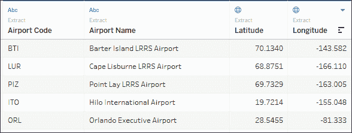

    图 15.38：超提取文件包含了我们需要补充流程的地理空间数据

1.  在 Tableau Prep 中连接此文件。你可以选择将文件拖放到 Tableau Prep 画布上，或使用界面上的 **添加连接** 按钮。Tableau 会自动插入一个名为 **Extract (Extract.Extract)** 的输入步骤。你可以自由地将输入步骤的名称更改为 **机场代码**：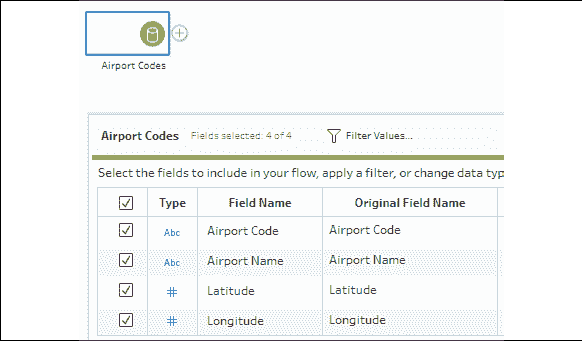

    图 15.39：机场代码文件的输入面板

1.  我们希望将**机场代码**加入我们的流程中，以便查找`纬度`和`经度`，但在执行之前，我们需要考虑到**Clean 4**中的`起点`和`终点`目前都在同一行数据中。一种选择是透视数据。使用**Clean 4**步骤中的**+**按钮添加一个**透视**步骤：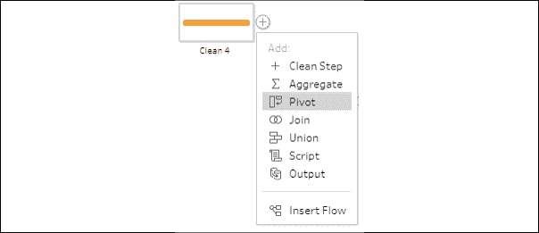

    图 15.40：从 Clean 4 添加透视步骤

1.  透视窗格提供了将行转换为列或将列转换为行的选项。我们将保留默认选项**列转行**。将`起点`和`终点`字段拖入窗格中的**Pivot1 值**区域：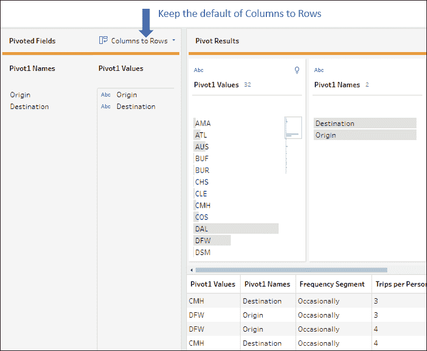

    图 15.41：Pivot1 名称保持原始列名的值，而 Pivot1 值则包含来自起点和终点的实际值

1.  作为快捷方式，代替*步骤 6*和*步骤 7*，你可以在**Clean 4**步骤中选择`起点`和`终点`字段，并选择**透视列转行**：

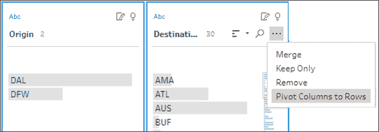

图 15.42：透视列转行的快捷方式

按照以下步骤继续操作：

1.  双击**Pivot1 值**的文本并将字段重命名为`机场代码`。该字段将包含起点和终点记录的所有机场代码。

1.  双击**Pivot1 名称**的文本并将字段重命名为`路线点`。该字段将标记每条记录为**起点**或**终点**。

    此时，我们拥有一个数据集，其中包含每个旅行终点（无论是起点还是终点）的单条记录。

    注意，透视操作导致了重复数据。曾经是一行（起点和终点合并在一起）的数据现在变成了两行。记录数已翻倍，因此我们不能再通过记录数来确定旅行的数量。我们也不能对票价使用`SUM`，因为它会重复计算票价。我们需要使用`MIN`/`MAX`/`AVG`或某种详细级别的表达式或筛选器，以便仅查看起点或终点。虽然许多转换可以帮助我们实现特定目标，但我们必须意识到它们可能引入其他复杂情况。

    我们当前在主流程中所拥有的唯一位置信息是机场代码。然而，我们已经与`Airports.hyper`建立了连接，并将输入步骤重命名为**机场代码**。

1.  定位到**机场代码**输入步骤，并将其拖到**透视**步骤上。将其放置到**连接**区域：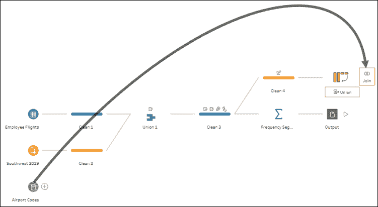

    图 15.43：将机场代码拖到透视步骤的连接区域

    在将**机场代码**输入步骤拖到**连接**区域后，将创建一个新的连接步骤，命名为**连接 1**。稍作停顿，查看连接窗格：

    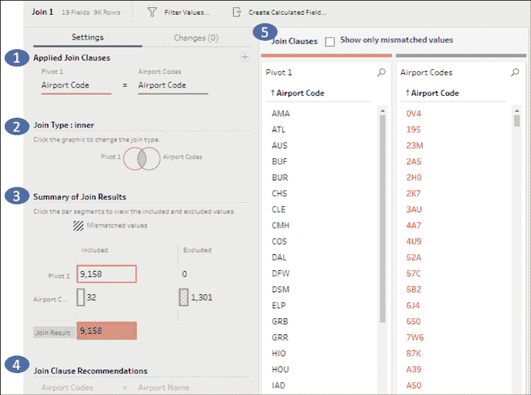

    图 15.44：连接窗格提供了大量信息和选项，用于配置连接和理解结果。界面中的重要部分已编号，并附有说明

你会在*图 15.44*中注意到以下特征：

1.  **应用的连接子句**：在此，您可以选择向连接子句添加条件，决定哪些字段应作为关键字来定义连接。您可以根据需要添加任意数量的子句。

1.  **连接类型**：在此，您可以定义连接的类型（内部连接、左连接、左内部连接、右连接、右内部连接、外连接）。通过单击 Venn 图的各个部分来完成此操作。

1.  **连接结果摘要**：这里的条形图显示了来自每个输入的记录数量，以及匹配或未匹配的记录数量。您可以单击条形图的某个部分来查看数据网格中的过滤结果。

1.  **连接子句建议**：如果适用，Tableau Prep 将显示可能的连接子句，您可以通过单击轻松添加。

1.  **连接子句**：在此，Tableau Prep 显示了用于连接子句的字段及其对应的值。任何未匹配的值将以红色字体显示。您可以通过双击它们来编辑值。这使您能够根据需要修复个别不匹配的值。

在这个例子中，我们不需要配置任何内容。`Airport Code`字段上的**内部连接**默认设置非常有效。我们可以确认来自**Pivot**步骤的所有`9,158`条记录都被保留。只有`32`条来自**Airport Codes**超文件的记录是实际匹配的（`1,301`条记录未匹配）。这不需要担心。这仅仅意味着我们有很多多余的代码，这些代码本来可能为数据提供补充，但实际上并不需要。现在，继续我们之前的例子：

1.  从**连接 1**开始，添加一个最终输出步骤，并将其配置为输出到名为`Airline Travel.csv`的`.csv`文件。

1.  使用工具栏顶部的运行按钮或点击输出步骤中的运行按钮来运行流程。


图 15.45：工具栏允许您运行所有输出的流程或单个输出，而输出步骤上的按钮将仅运行该输出的流程

您的最终流程看起来大致如下：

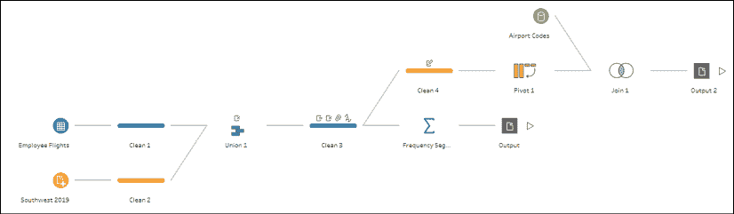

图 15.46：您的最终流程将类似于此，但外观可能略有不同

`Chapter 15 Complete (clean).tfl`文件经过了一些清理，添加了适当的步骤标签和描述。作为一种良好的做法，请尝试重命名您的步骤并添加描述，以便使流程更易于理解。以下是清理后的版本：

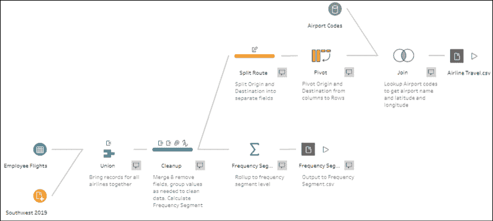

图 15.47：此流程已被清理并包含“自我文档化”

一旦流程执行完毕，打开`Airline Travel.twb`工作簿，该文件位于`\Learning Tableau\Chapter 15`目录中，以查看数据如何使用并自行探索：

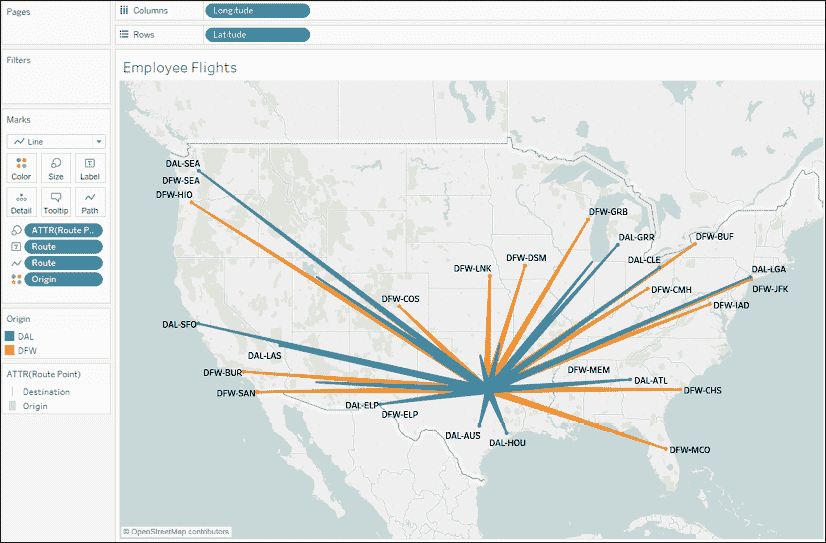

图 15.48：在`Airline Travel.twb`工作簿中探索数据

与 `.tde` 或 `.hyper` 文件不同，`.csv` 文件可以被写入，即使它们作为数据源在 Tableau Desktop 中打开。如果你运行一个流程试图覆盖正在使用中的 `.tde` 或 `.hyper` 文件，你将收到错误提示。此外，你可以通过将字段拖放到清洁步骤的配置文件面板中来重新排列 `.csv` 文件的字段顺序，然后再输出。

随着我们的示例结束，让我们通过考虑一些自动化 Tableau Prep 流程的选项来总结。

# 自动化流程的选项

Tableau Prep Builder 允许你使用该应用程序设计和运行流程。有时，数据清洗和准备是一次性的操作，用于支持临时分析。然而，你通常希望随后运行流程，以捕获新数据或更改后的数据，并根据相同的模式清洗和调整它。在这些情况下，你需要考虑一些自动化流程的选项：

+   **Tableau Prep Builder** 可以通过命令行运行。你可以提供 JSON 文件来定义输入或输出数据连接的凭证。这使你能够使用脚本和调度工具运行流程，而无需手动打开并运行 Tableau Prep 界面。有关此选项的详细信息，请参阅 Tableau 帮助：[`onlinehelp.tableau.com/current/prep/en-us/prep_save_share.htm#refresh-output-files-from-the-command-line`](https://onlinehelp.tableau.com/current/prep/en-us/prep_save_share.htm#refresh-output-files-from-the-command-line)。

+   **Tableau Prep Conductor** 是 Tableau Server 的附加组件，允许你将整个流程从 Tableau Prep Builder 发布到 Tableau Server，然后根据需求或自定义时间表运行这些流程。它还提供了监控和故障排除功能。

# 总结

Tableau Prep 通过即时反馈的动手数据清洗和调整的创新范式，极大地扩展了 Tableau 平台，并使你对数据拥有了令人难以置信的控制力。在本章中，我们考虑了整体界面以及它如何使你能够迭代和快速构建一个逻辑流程，用于清洗和调整数据，以便进行所需的分析或可视化。

通过本章中贯穿始终的详细而实用的示例，我们探索了 Tableau Prep 中的每个主要转换，从输入到联合、连接、聚合和透视，再到输出。在此过程中，我们还考察了其他转换和功能，包括计算、拆分、合并以及值的分组。这为你提供了在任何需要的方式下塑造和调整数据的基础。

在下一章中，我们将总结一些关于如何利用 Tableau 平台分享你的分析和数据故事的最终思考！
