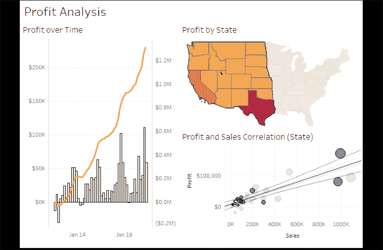
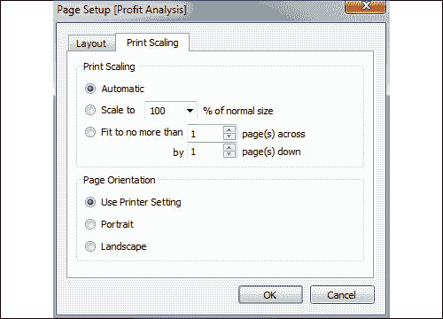
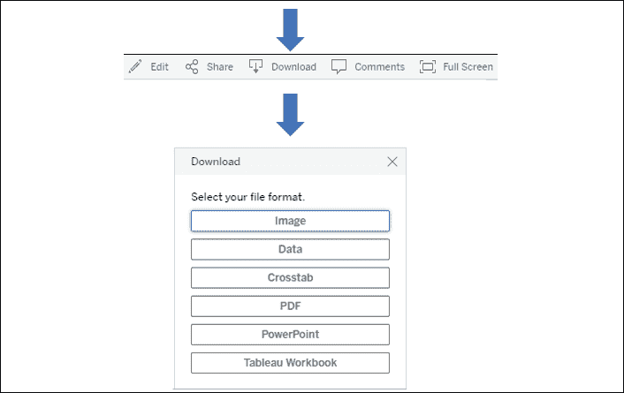
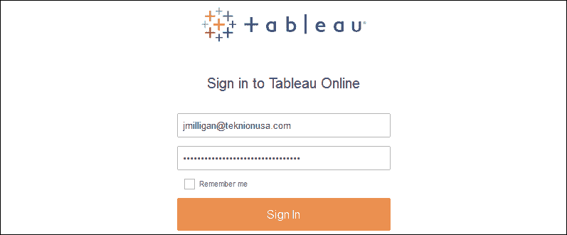
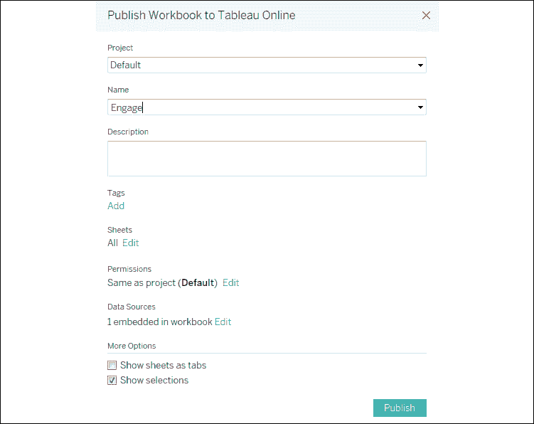
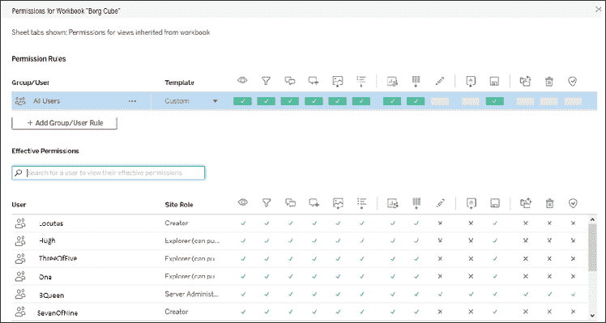
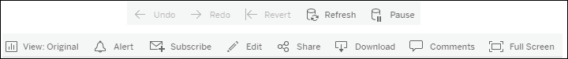

# 第十六章：分享您的数据故事

本书的重点是 Tableau Desktop，我们学习了如何通过可视化和仪表板来深入探索和传达数据。一旦您做出了发现，设计了具有洞察力的可视化，并构建了令人惊叹的仪表板，您就准备好分享您的数据故事了。

Tableau 使您能够通过多种方式共享您的工作。在本章中，我们将查看各种共享可视化和仪表板的方法，以及在决定如何共享项目时需要考虑的事项。

具体来说，我们将探讨以下主题：

+   展示、打印和导出

+   与 Tableau Desktop 和 Tableau Reader 的用户共享

+   与 Tableau Server、Tableau Online 和 Tableau Public 的用户共享

本章没有需要跟随的示例，但强烈建议您通读材料，以便深入了解共享洞察和发现的各种选项。

让我们从展示、打印和导出过程的概述开始。

# 展示、打印和导出

Tableau 主要用于构建丰富互动的可视化和仪表板，以便在屏幕上进行查看。通常，您会期望用户与您的仪表板和可视化进行互动。然而，提供多种格式的展示、打印和导出选项也是非常不错的选择。

## 展示

Tableau 为您提供了多种个人展示数据故事的选项。您可以带领观众浏览单个仪表板或视图的展示，或者您可以创建一个完整的演示文稿。虽然有多种方式可以构建演示文稿，但请考虑以下选项：

+   导出到 PowerPoint

+   演示模式

Tableau Desktop 和 Tableau Server 允许您直接导出到 **PowerPoint**。在 Tableau Desktop 中，选择 **文件** | **导出为 PowerPoint...**。选择位置和文件名后，Tableau 将生成一个 PowerPoint 文件（`.pptx`），将 Tableau 工作簿中的每个标签页转换为 PowerPoint 中的单个幻灯片。每个幻灯片将包含导出时视图和仪表板的静态图像。由于每个幻灯片只是一个截图，因此导出后将不再具备动态互动功能。

如果您更喜欢更具动态性的演示体验，请考虑使用**演示模式**。此模式会将所有仪表板和视图显示为全屏模式，隐藏所有工具栏、窗格和创作对象。要激活演示模式，选择顶部菜单中的**窗口**，或者按*F7*或顶部工具栏中的选项。按*F7*或*Esc*键退出演示模式。在演示模式下，您仍然可以通过操作、突出显示、筛选和其他选项与仪表板和视图进行交互。这可以丰富演示内容，并让您能够快速回答问题。在配合引人注目的仪表板和故事使用时，演示模式是一种有效的方式，能够带领观众深入了解数据故事。

如果在演示模式下按`Ctrl` + `S`保存工作簿，工作簿将在默认情况下以演示模式打开。

## 打印

Tableau 支持单独的可视化、仪表板和故事的打印。通过**文件**菜单，您可以选择**打印**将当前活动的工作表发送到打印机，或选择**打印为 PDF**选项导出为 PDF。无论哪种方式，您都可以将活动工作表、选定的工作表或整个工作簿导出为 PDF。要选择多个工作表，按住`Ctrl`键并点击单个标签。

打印时，您还可以选择**显示选择项**。选中此选项时，在视图或仪表板上交互式选择或高亮的标记将作为已选项进行打印。否则，标记将像没有选择项一样打印。以下仪表板中的地图已选择美国西部的标记：

图 16.1：您可以在此截图中看到已选择的州和圆圈。您可以选择打印包含选择项的视图

以下是一些关于打印的考虑事项、提示和建议：

+   如果仪表板是为打印设计的，请选择预定义的纸张大小作为仪表板的固定大小，或使用与相同纵横比匹配的自定义大小。

+   使用**页面设置**界面（可从**文件**菜单访问）来定义特定的打印选项，例如将包含哪些元素（图例、标题、说明文字）、布局（包括边距和居中）以及视图或仪表板如何缩放以匹配纸张大小。**页面设置**选项是针对每个视图的。复制或复制一个工作表时，会包含任何对**页面设置**的更改：

    如果您要设计多个工作表或仪表板用于打印，请考虑将其中一个工作表作为模板，设置所有所需的打印设置，然后为每个新工作表进行复制。

图 16.2：页面设置对话框包含布局和打印缩放选项

+   在**页面**架构上使用的字段将定义打印中的分页（适用于单个工作表，但不适用于仪表板或故事）。**页面**架构定义的页面数量不一定等于打印的页数。这是因为一个由**页面**架构定义的单一页面可能需要多于一页的打印页。

+   故事中的每个故事点将被打印在新的一页上。

+   打印整个工作簿是生成单一 PDF 文档并分发的一种有效方式。每个可见的工作表将按标签顺序（从左到右）包含在 PDF 中。你可以隐藏工作表以防止它们出现在 PDF 中，或重新排序工作表以调整结果文档的顺序。还可以考虑创建包含图像和文本的仪表板，用于封面、目录、页码和评论。你也可以尝试使用上一章中的完整工作簿，查看不同的视觉元素在 PDF 转换中的保留或变化。

+   避免在仪表板中使用滚动条，因为它们会作为滚动条打印，并且可视窗口外的内容将不会被打印。

+   你还可以在工作簿中选择多个工作表（按住`Ctrl`键同时点击每个标签），然后仅打印所选工作表。

    如果工作表是用于一个或多个仪表板或工具提示的视图，或者是用于一个或多个故事的仪表板，则可以隐藏工作表。要隐藏视图，右键点击底部条带或仪表板或故事工作区左侧面板中的标签或缩略图，然后选择**隐藏工作表**。要显示工作表，在仪表板或故事工作区的左侧面板中找到它，右键点击并取消选中**隐藏工作表**。你还可以右键点击仪表板或故事标签，隐藏或显示所有使用的工作表。

    如果你没有看到**隐藏工作表**选项，这意味着该工作表没有在任何仪表板中使用，因此可以删除。

除了打印或输出为 PDF，我们还可以导出视图和仪表板中的数据和图像。让我们来看看吧！

## 导出

Tableau 还使得导出视图、仪表板和故事的图像变得非常简单，适用于文档、文献甚至像本书这样的书籍！图像可以导出为`.png`、`.emf`、`.jpg`或`.bmp`格式。你还可以将图像复制到剪贴板，然后粘贴到其他应用程序中。你还可以将数据导出为交叉表（Excel）、`.csv`文件或 Microsoft Access 数据库（适用于 PC）。

要复制图像或导出图像或数据，请使用**工作表**、**仪表板**或**故事**的菜单选项。

我们将很快详细讨论如何使用 Tableau Server、Tableau Online 和 Tableau Public。现在，让我们先了解这些平台上可用的导出功能。当在 Tableau Server、Online 或 Public 上与视图交互时，除非你没有所需的权限，或者管理员特意禁用了工具栏，否则你将看到一个工具栏：

图 16.3：从工具栏导出提供了与 Server、Online 和 Public 相似的体验

工具栏中的**下载**选项允许你下载**图像**、**数据**、**交叉表**（Excel）、**PDF**、**PowerPoint**或**Tableau 工作簿**。图像以`.png`格式导出，并呈现当前状态下的仪表板。导出`.pdf`文档时，用户可以选择多种选项，包括布局、缩放、是否打印当前仪表板、工作簿中的所有工作表，或当前仪表板中的所有工作表。

导出数据或交叉表时，会导出仪表板中活动视图的数据；也就是说，如果你点击仪表板中的一个视图，它将变为活动视图，你可以导出该视图的数据显示或交叉表。

Tableau Server 上还存在其他导出选项：

+   带有**导出**按钮的仪表板你可能还记得，**导出**按钮是可以添加到仪表板中的对象之一。这些按钮可以配置为将整个仪表板导出为 PDF、PowerPoint 或图像，并且是工具栏选项的不错替代方案。这也便于从 Tableau Desktop 导出。

+   **Tabcmd** 让你能够通过命令行或脚本以多种格式导出数据、图像或文档。

+   **REST API** 让你能够以编程方式导出数据、图像或文档，支持多种格式。

+   你可以将扩展名附加到托管在 Tableau Server 或 Tableau Online 上的视图的 URL，以查看或下载链接定义的格式。例如，附加`.pdf`后，URL 可能会变成 `https://tableauserver/#/views/Dashboard/View.pdf`，这样视图就会在浏览器中作为 PDF 文档呈现。

除了共享图像或文档导出外，你通常会想与他人共享完全互动的仪表板。让我们考虑一下如何实现这一点。

# 与 Tableau Desktop 和 Tableau Reader 用户共享

你可以与其他 Tableau Desktop 和 Tableau Reader 用户共享工作簿。我们将在接下来的章节中考虑选项，并注意一些差异。

## 与 Tableau Desktop 用户共享

与其他 Tableau Desktop 用户共享工作簿相当简单，但有一些事项需要考虑。

主要的考虑因素之一是你将共享打包的工作簿（`.twbx`）还是未打包的工作簿（`.twb`）。打包工作簿是一个包含工作簿（`.twb`）、提取文件（`.hyper`）、未提取的基于文件的数据源（如`.xls`、`.xlsx`、`.txt`、`.cub`、`.mdb`等）、自定义图像及其他相关文件的单一文件。

要与 Tableau Desktop 用户共享，你有多种选择：

+   你可以通过简单地将文件与其他拥有相同或更新版本的 Tableau Desktop 用户共享，来共享打包（`.twbx`）或未打包（`.twb`）工作簿。

    当在更新版本的 Tableau Desktop 中保存工作簿文件时，工作簿文件将会更新。在旧版本的 Tableau 中打开工作簿时可能会收到错误或警告。首次打开工作簿时会提示更新，保存时再次提示。您可以选择从**文件**菜单将工作簿导出为之前的版本。

+   如果您分享一个未打包的（`.twb`）工作簿，则使用它的其他任何人必须能够访问任何数据源，并且任何引用的图像必须在与原始文件引用的相同目录中对用户可用。例如，如果工作簿在网络路径上使用对 Excel（`.xlsx`）文件的实时连接，并在位于`C:\Images`的仪表板上包含图像，则所有用户必须能够访问网络路径上的 Excel 文件，并在本地具有包含相同名称图像文件的`C:\Images`目录。

    如果使用此方法，请考虑使用 UNC 路径（例如`\\servername\directory\file.xlsx`）来共享常用文件。

类似地，如果您分享一个使用实时连接的打包工作簿（`.twbx`），那么使用该工作簿的任何人必须能够访问实时连接的数据源，并具有适当的权限。

## 与 Tableau Reader 用户分享

**Tableau Reader**是 Tableau Software 提供的免费应用程序，允许用户与在 Tableau Desktop 中创建的可视化、仪表板和故事进行交互。与 Tableau Desktop 不同，它不允许创建可视化或仪表板。但是，所有互动功能（如过滤、下钻、操作和突出显示）对最终用户均可用。

将 Tableau Reader 视为许多 PDF 阅读器的类似物，允许您阅读和导航文档，但不允许创建或保存更改。

要与 Tableau Reader 用户分享，请考虑以下事项：

+   Reader 仅打开打包的（`.twbx`）工作簿。

+   打包的工作簿可能不包含与服务器或基于云的数据源的实时连接。这些连接必须是提取的。

    在分享打包的工作簿（`.twbx`）时，请务必考虑安全性和机密性问题。由于打包的工作簿通常包含数据，因此必须确保数据不敏感。即使数据未显示在任何视图或仪表板上，如果它是与工作簿一起打包的提取或文件的一部分，仍然可以访问它。

Reader 和 Desktop 是不错的选择，但确实需要其他用户安装该应用程序。您还可以考虑使用 Tableau Server、Online 或 Public 与更广泛的受众分享和协作。

# 与 Tableau Server、Tableau Online 和 Tableau Public 用户分享

**Tableau Server**、**Tableau Online**和**Tableau Public**都是相同概念的变体：在服务器上托管可视化和仪表板，并允许用户通过 Web 浏览器访问它们。

以下表格提供了产品之间的一些相似性和差异，但由于细节可能会变化，请在做出购买决策前咨询 Tableau 代表：

|  | **Tableau Server** | **Tableau Online** | **Tableau Public** |
| --- | --- | --- | --- |
| 描述 | 安装在一台或多台服务器上的服务器应用程序，托管通过 Tableau Desktop 创建的视图和仪表板。 | 一个由 Tableau 软件维护的基于云的服务，托管通过 Tableau Desktop 创建的视图和仪表板。 | 一个由 Tableau 软件维护的基于云的服务，托管通过 Tableau Desktop 或免费的 Tableau Public 客户端创建的视图和仪表板。 |
| 授权费用 | 是 | 是 | 免费 |
| 管理 | 完全由购买许可证的个人或组织进行维护、管理和操作。 | 由 Tableau 软件进行管理和维护，用户可以选择进行项目和用户管理。 | 由 Tableau 软件进行管理和维护。 |
| 创作和发布 | Tableau Desktop 的用户可以创作并将工作簿发布到 Tableau Server。Web 创作功能允许 Tableau Server 用户在 Web 浏览器中编辑和创建可视化和仪表板。 | Tableau Desktop 的用户可以创作并将工作簿发布到 Tableau Online。Web 创作功能允许 Tableau Online 用户在 Web 浏览器中编辑和创建可视化和仪表板。 | Tableau Desktop 用户或免费的 Tableau Public 客户端用户可以将工作簿发布到 Tableau Public。未来将发布支持在线创作的功能。 |
| 交互 | 已授权的 Tableau Server 用户可以与托管的视图进行交互。视图也可以嵌入到内联网网站、SharePoint 和自定义门户中。 | 已授权的 Tableau Online 用户可以与托管的视图进行交互。视图也可以嵌入到内联网网站、SharePoint 和自定义门户中。 | 一切都公开。任何人都可以与托管的视图进行交互。视图可以嵌入到公共网站和博客中。 |
|  | **Tableau Server** | **Tableau Online** | **Tableau Public** |
| 限制 | 无 | 大多数数据源必须在工作簿发布之前进行提取。大多数非云数据源必须通过本地计算机上的**Tableau Desktop**或通过**Tableau Online Sync Client**刷新提取数据。 | 所有数据必须提取，每个数据源的行数限制为 1500 万行。 |
| 安全性 | Tableau Server 管理员可以创建站点、项目和用户，并为每个用户调整权限。可以限制对基础数据的访问，并且可以限制工作簿或数据的下载。 | Tableau Server 管理员可以创建项目和用户，并为每个用户调整权限。可以限制对基础数据的访问，并且可以限制工作簿或数据的下载。 | 默认情况下，任何人都可以下载和查看数据；不过，作者可以限制这些选项的访问权限。 |
| 良好用途 | 内部仪表板和分析，或通过多租户站点跨部门/部门/客户使用。 | 内部仪表板和分析，特别是大多数数据源都是基于云的情况。与远程用户分享和协作。 | 在面向公众的网站或博客上使用嵌入视图分享可视化和仪表板。 |

## 发布到 Tableau Public

您可以使用 Tableau Desktop 或免费的 Tableau Public 客户端应用程序打开工作簿并保存到 Tableau Public。请记住以下几点：

+   要使用 Tableau Public，您需要注册一个帐户。

+   使用 Tableau Desktop 和适当的权限，您可以使用**服务器**菜单并在 Tableau Public 下选择选项来保存和打开工作簿。

+   使用免费的 Tableau Public 客户端，您只能将工作簿保存到网络并从网络中打开。

    使用这些选项时，请注意全世界任何人都可以查看您发布的内容。

+   选择**管理工作簿**选项将打开一个浏览器，以便您可以登录到您的 Tableau Public 帐户并在线管理所有工作簿。

+   保存到 Tableau Public 的工作簿可能包含任意数量的数据源连接，但它们必须全部被提取，每个提取的数据不能超过 1500 万行。

当您想与世界分享您的数据故事时，请考虑使用 Tableau Public！

## 发布到 Tableau Server 和 Tableau Online

发布到 Tableau Server 和 Tableau Online 是类似的体验。要发布到 Tableau Server 或 Tableau Online，请从菜单中选择**服务器** | **发布工作簿**。如果您尚未登录到服务器，则将提示您登录：

图 16.4：Tableau Online 的登录界面

您必须拥有一个具有发布权限的用户帐户，用于一个或多个项目。输入 Tableau Server 的 URL 或 IP 地址，您的用户名和密码。登录后，如果您有多个访问权限，则会提示您选择一个站点。最后，您将看到发布屏幕：

图 16.5：发布到 Tableau Online

发布时您有多个选项：

+   选择要发布到的**项目**并为您的工作簿命名。如果已经使用与所选项目相同的名称发布了工作簿，则将提示您覆盖它。

+   您可以为工作簿添加**描述**并使用**添加标签**使搜索和查找工作簿更容易。

+   您还可以指定要在发布的工作簿中包含哪些**工作表**。您勾选的任何工作表都将被包含；您取消勾选的则不会。

+   您可以编辑用户和组**权限**以定义谁有权查看、交互和更改您的工作簿。默认情况下，使用项目设置。这是一个带有个人用户和权限的示例工作簿：

    图 16.6：Tableau Server 允许进行强大的权限设置。您可以调整个人和组的权限，以进行查看、过滤、评论、编辑、保存等操作。

+   您可以编辑数据源的属性。下一节将详细描述这些选项。

+   您还可以选择**显示工作表作为标签**。选中此选项后，Tableau Server 上的用户将能够像在 Tableau Desktop 底部那样使用标签在工作表之间进行导航。如果您计划设置在视图之间导航的操作，必须选中此选项。

+   **显示选择**表示您希望任何活动的标记选择在发布的视图中保留。

编辑数据源时，您可以选择身份验证和调度选项：

+   对于工作簿中使用的每个数据连接，您可以确定如何验证数据库连接的身份。可选项将根据数据源以及 Tableau Server 的配置而有所不同。不同的选项包括嵌入密码、模拟用户或提示 Tableau Server 用户输入凭据。

+   您可以为 Tableau Server 设置调度，以运行任何数据提取的刷新。

任何需要在服务器上刷新实时连接或提取连接的，都必须定义可从服务器使用的连接。这意味着所有相关的数据库驱动程序必须安装在服务器上；所有访问数据库服务器和基于云的数据所需的网络、互联网连接及端口必须是开放的。

此外，任何由工作簿引用的外部文件（例如图像文件和未提取的基于文件的数据源）如果在工作簿发布时未包含，必须使用 Tableau Server 可访问的位置进行引用（例如，具有允许 Tableau Server 进程读取权限的网络路径）。

一旦仪表板和视图发布到 Tableau Server，您和其他有权限的用户将能够与其进行交互。接下来我们将详细讨论这些内容。

## 与 Tableau Server 交互

在工作簿发布到 Tableau Server 后，其他用户将能够使用网页浏览器查看和与可视化和仪表板交互。登录 Tableau Server 后，他们将能够浏览其有权限访问的内容。这些用户可以使用仪表板中内置的任何功能，如快速过滤器、参数、操作或钻取。所有内容都以`HTML5`格式呈现，因此用户查看和与视图及仪表板交互的唯一要求是兼容`HTML5`的网页浏览器。

**Tableau 移动版**应用程序，适用于 iOS 和 Android 设备，可以增强移动用户的体验。使用 Tableau 的设备设计器为特定设备调整布局。

大多数情况下，在 Server 或 Online 上与工作簿互动非常类似于在 Tableau Desktop 或 Reader 中与工作簿互动。快速筛选器、参数、操作和工具提示的外观和行为都非常相似。

你还会找到一些额外的功能：

+   侧边菜单为你提供了与管理和导航 Tableau Server 相关的各种选项。

+   在下面，你会看到一个面包屑导航，告诉你当前正在查看哪个工作簿和视图。

+   在下方，你会看到一个包含多个功能的工具栏：

    图 16.7：Tableau Server 工具栏

+   **撤销**和**重做**使你能够在交互过程中前后移动。

+   **恢复**使你能够撤销所有更改并恢复到原始仪表板。

+   **刷新**重新加载仪表板并刷新数据。然而，这不会刷新任何数据的提取。

+   **暂停**允许你暂停仪表板基于操作、筛选选择或参数值变化的刷新，直到你完成所有想要的更改。

+   **视图**允许你根据选择、筛选器和参数值保存仪表板的当前状态，以便你稍后能够快速返回到该状态。你也可以在这里找到已保存的视图。

+   **警报**允许你设置条件警报。当视图中的标记达到你定义的阈值时，你将通过电子邮件收到警报。例如，你可能有一个盈利能力的折线图，并希望在达到组织目标的那天收到警报，或者你可以设置一个警报，当数据中指示的错误数量超过`0`时，收到通知。

+   **订阅**允许你安排定期发送仪表板截图的电子邮件。管理员还可以为其他用户订阅。你可能希望考虑这个选项来分发每日绩效报告、销售更新、库存数量或任何你想要推送的其他信息！

+   **编辑**允许你编辑仪表板。界面与 Tableau Desktop 非常相似。Tableau 管理员可以根据用户或用户组启用或禁用网页编辑，并控制保存编辑视图的权限。

+   **共享**为你提供了共享工作簿的选项。这些选项包括一个你可以分发给其他授权用户的 URL，以及用于将仪表板嵌入网页的代码。

+   **下载**按钮允许你下载数据、仪表板图像、`.pdf`文件或工作簿，如前所述。

+   **评论**使你能够通过在视图上发表评论并回复其他人评论的方式与其他 Tableau Server 用户进行协作。

+   **全屏**允许你查看仪表板或以全屏模式查看。

+   **指标**（未在*图 16.7*中显示）使你能够定义你希望跟踪的关键数字或指标。

现在我们已经探索了 Tableau Server 的一些互动功能，让我们进一步考虑 Tableau Server 和 Tableau Online 的一些分发选项。

## 使用 Tableau Server 或 Tableau Online 的其他分发选项

Tableau Server 和 Tableau Online 提供了几种其他选项，用于共享您的视图、仪表板和数据。在允许用户登录 Tableau Server 的同时，您还可以考虑以下选项：

+   仪表板、视图和故事点可以嵌入到网站、门户和 SharePoint 中。单点登录选项可实现您的网站身份验证与 Tableau Server 的无缝集成。

+   Tableau Server 允许用户订阅视图和仪表板并安排电子邮件发送。电子邮件将包含视图的最新图像以及 Tableau Server 上仪表板的链接。

+   **tabcmd** 工具与 Tableau Server 一起提供，并可以安装在其他机器上。该工具提供了自动化 Tableau Server 多种功能的能力，包括导出功能、发布功能以及用户和安全管理功能。这为自动化交付打开了许多可能性。

+   **REST API** 允许与 Tableau Server 进行程序化交互。这为您提供了广泛的选项，用于导出数据、图像和文档并分发给用户，以及访问使用统计信息、用户、权限等更多内容！

所有这些选项极大地扩展了将数据和可视化内容分发给组织中最需要它们的人所提供的灵活性！

# 摘要

Tableau 是一个令人惊叹的平台，适用于探索、准备和清理数据，同时创建有用且有意义的可视化和仪表板，以便理解和传达关键洞察。 在本书中，我们考虑了如何连接数据——无论是基于文件的、在本地数据库中的，还是在云中的。您已经通过示例了解了如何探索和准备数据，以便清理它并将其结构化以进行分析。我们已涵盖了多种可视化类型，以及它们如何揭示深入的分析洞察。四种主要计算类型已被深入探讨，为您提供了扩展数据、分析和用户互动的工具。您已经构建了仪表板并讲述了数据故事。在本章中，我们考虑了如何与他人共享您所有工作的结果。

您现在已经打下了坚实的基础。从本质上讲，Tableau 平台直观且易于使用。当您深入探索时，简洁性变得愈加美丽。随着您发现理解数据的新方式，解决复杂问题，提出新问题，并在数据集中找到新的答案，您的新 Tableau 技能将帮助您发掘、解读并共享数据中隐藏的新洞察。
