# 七、监督和非监督学习

在过去的几十年里，社会上为各种目的收集的数据量大幅增加。机器学习是一种利用我们对数据的了解来理解所有这些数据的方法。在机器学习的广义图景中，计算机首先从给定的数据集(训练)中学习，并创建一个广义模型来表示它。使用这个模型，可以预测各种结果、结果和分组(类)。在本章中，我们将涵盖以下主题:

*   带有机器学习算法的线性回归
*   用机器学习算法进行聚类
*   特征选择—一种选择最重要特征的预处理方法
*   不同机器学习算法和核的分类

在开始之前，我将向您简要介绍机器学习以及我们将使用的软件包:Scikit-learn。

# 机器学习入门

机器学习主要有三类:有监督的、无监督的和强化的。给定一个具有输入`x`和输出`y`的简单数据集，监督学习是当`x`和`y`都有已知的标签时。该算法将`x`映射到`y`，经过训练后，可以以`x`为输入预测`y`值。与此相反，无监督学习是当只有`x`被标记并且算法为`y`本身找到一个标签时。强化学习是指计算机在学习时不需要将输入映射到结果，而是对输入做出反应。下棋或其他游戏的算法就是这样工作的。

他们试图在没有明确量化结果的情况下预测如何对输入做出反应，而是寻求强化；一个例子是连续地玩游戏，直到游戏结束而不出错(即获胜)。Python 中一个功能丰富且流行的机器学习包是 Scikit-learn。

# 科学学习

Scikit-learn 是 SciPy 工具包的一部分，它是 SciPy 的附属包。更多关于 SciPy 工具包的信息和可用工具包的列表可以在[https://www.scipy.org/scikits.html](https://www.scipy.org/scikits.html)找到。Scikit-learn 的第一个版本出现在 2007 年，但 2011 年第一个展示该包的出版物是 Python 中的机器学习，Pedregosa 等人，JMLR 12，第 2825-2830 页，2011 年。有关大量示例、文档和阅读，请参见 Scikit-learn 网页([http://scikit-learn.org](http://scikit-learn.org))。这个包维护得很好，文档很好，覆盖面很广。

在这个简短的介绍之后，我们像前面几章一样——我们启动一个 Jupyter Notebook 并运行标准导入。

现在我们当然也想导入 Scikit-learn。下面的代码导入它，并打印出安装的 Scikit-learn 的版本号:

```py
import sklearn 
sklearn.__version__

```

接下来，我创建了一个函数，它删除了图或图网格中的右轴和顶轴。它在制作数字时很方便；能够以清晰和集中的方式呈现数据和分析结果非常重要。删除绘图中不必要的行是其中的一部分，也节省了文本空间。`despine`功能的名称灵感来源于优秀套装 Seaborn 中的等效功能，也可以帮你做出好看的身材([https://stanford.edu/~mwaskom/software/seaborn/](https://stanford.edu/~mwaskom/software/seaborn/)):

```py
def despine(axs): 
    # to be able to handle subplot grids 
    # it assumes the input is a list of  
    # axes instances, if it is not a list,  
    # it puts it in one 
    if type(axs) != type([]): 
        axs = [axs] 
    for ax in axs: 
        ax.yaxis.set_ticks_position('left') 
        ax.xaxis.set_ticks_position('bottom') 
        ax.spines['bottom'].set_position(('outward', 10)) 
        ax.spines['left'].set_position(('outward', 10)) 

```

# 线性回归

Scikit-learn 内置了很多不同的线性回归模型，**普通最小二乘** ( **OLS** )和**最小绝对收缩和选择算子** ( **LASSO** )仅举两个例子。这两者之间的差异可以通过不同的损失函数来近似，损失函数是由机器学习算法处理的函数。在 LASSO 中，有一个远离拟合函数的附加惩罚，而 OLS 只是最小二乘方程。然而，常规仍然不同于我们前面介绍的 OLS；得出答案的底层算法是机器学习算法。其中一个常见的算法是梯度下降法。在这里，我们将采用前一章的气候数据，并用两种方法拟合一个线性函数，然后将 OLS 模型的结果与 PyMC 的贝叶斯推断( *[)第 6 章](106.html "Chapter 6. Bayesian Methods")* 、*贝叶斯方法*)和 statsmodels 的 OLS ( *[)第 4 章](104.html "Chapter 4. Regression")* 、*回归*的结果进行比较。

## 气候数据

我们从过去 60 年的二氧化碳 <sub>2</sub> 增长率数据开始:

```py
co2_gr = pd.read_csv('data/co2_gr_gl.txt',  
                  delim_whitespace=True, 
                 skiprows=62, 
                 names=['year', 'rate', 'err']) 

```

为了刷新你的记忆，我们再次绘制数据。我们现在使用`despine`功能移除两个轴:

```py
fig, ax = plt.subplots(1,1) 
ax.errorbar(co2_gr['year'], co2_gr['rate'],  
           yerr=co2_gr['err'], 
           ls='None',   
           elinewidth=1.5, 
           capthick=1.5, 
           marker='.', 
           ms=8) 
despine(ax) 
plt.minorticks_on() 
labels = ax.get_xticklabels() 
plt.setp(labels, rotation=33, ha='right') 
ax.set_ylabel('CO$_2$ growth') 
ax.set_xlabel('Year') 
ax.set_xlim((1957,2016)) 
ax.set_title('CO$_2$ growth rate'); 

```

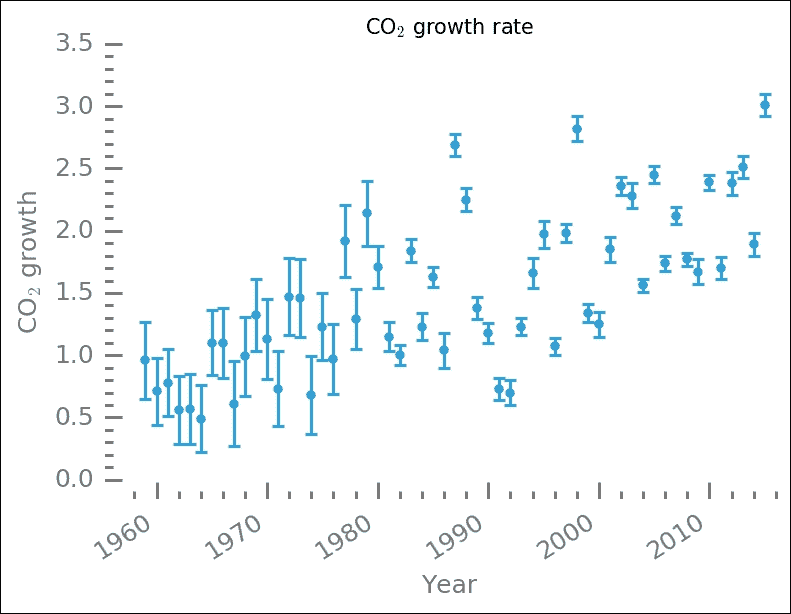

数据在这个范围的中间有很大的差异，大约在 1980 年到 2000 年之间。从某种意义上说，看起来两条在 1985 年跳跃的线可以被拟合。然而，不清楚为什么会这样；也许不确定性的两种分布与此有关？

在 Scikit-learn 中，学习是通过首先启动估计器来完成的，估计器是一个我们称之为 fit 方法来训练数据集的对象。这意味着我们首先要引入估计量。在这个例子中，我将向您展示两种不同的估计量以及它们产生的拟合结果。第一个是简单的线性模型，第二个是 LASSO 估计量。Scikit-learn 中有许多不同的线性模型:RANSAC、Theil-Sen，以及基于**随机梯度下降** ( **SGD** )学习的线性模型，仅举几例。看完这个例子后，你应该看看另一个估算器，并尝试一下。我们首先导入将要使用的函数，以及`cross_validation`函数，我们将使用该函数将数据集分成两部分——训练和测试:

```py
from sklearn.linear_model import LinearRegression, Lasso 
from sklearn import cross_validation 

```

因为我们希望能够验证我们的适合度，看看它有多好，所以我们没有使用所有的数据。我们使用`cross_validation`中的`train_test_split`函数将 25%的数据放入测试集中，将 75%的数据放入训练集中。玩转不同的价值观，看看最终的契合度如何变化。然后，我们将`x`和`y`值存储在适当的结构中。`x`值必须有一个额外的轴。这也可以通过`x_train.reshape(-1,1)`代码来完成；我们在这里做的方式给出了同样的效果。我们还创建了一个数组，稍后用我们知道的跨整个范围和更大范围的`x`值绘制拟合:

```py
x_test, x_train, y_test, y_train = cross_validation.train_test_split( 
    co2_gr['year'], co2_gr['rate'],  
    test_size=0.75,  
    random_state=0) 
X_train = x_train[:, np.newaxis] 
X_test = x_test[:, np.newaxis] 
line_x = np.array([1955, 2025]) 

```

在训练和测试数据分割中，我们还利用`random_state`参数，使得随机种子是相同的，并且我们通过多次运行它来获得训练和测试集的相同划分(为了精确的再现性)。我们现在准备训练数据，首先是简单的线性回归模型。为了在训练集上运行机器学习算法，我们首先创建一个估计器对象/类，然后我们简单地通过调用`fit`方法来训练模型，其中训练`x`和`y`值作为输入:

```py
est_lin = LinearRegression() 
est_lin.fit(X_train, y_train) 
lin_pred = est_lin.predict(line_x.reshape(-1, 1)) 

```

在这里，我还添加了对我们之前创建的数组中预测的`y`值的计算，为了展示一种重构输入数组的替代方法，我使用了重塑方法。接下来是 LASSO 模型，我们做的完全一样，只是在创建模型对象时，我们现在可以选择给它额外的参数。`alpha`参数基本上是这个模型区别于前面简单线性回归模型的地方。如果设置为零，模型将与线性模型相同。LASSO 模型 alpha 输入修改损失函数，默认值为`1`。尝试不同的值，虽然 0 不是很好的选择，因为没有损失函数的附加惩罚，模型就不能运行:

```py
est_lasso = Lasso(alpha=0.7) 
est_lasso.fit(X_train, y_train) 
lasso_pred = est_lasso.predict(line_x.reshape(2, 1)) 

```

为了查看结果，我们首先打印出系数、均方误差或误差(均方残差)和方差得分的估计值。方差分数是我们创建的 Scikit-learn 模型(估计器)中的一种方法。虽然方差得分为 1 意味着它能够完美地预测值，但得分为 0 意味着没有预测值，并且变量之间没有(线性)关系。系数通过`estimator.coeff_`和`estimator.intercept_`访问。为了得到均方误差，我们简单地取预测值和观测值之间的差值，用`estimator.predict(x)`计算，其中`x`是`x`值，你要预测`y`值。这应该根据测试数据而不是训练集来计算。我们首先创建一个函数来计算并打印相关诊断:

```py
def printstuff(estimator, A, b): 
    name = estimator.__str__().split('(')[0] 
    print('+'*6, name, '+'*6) 
    print('Slope: {0:.3f} Intercept:{1:.2f} '.format( 
            estimator.coef_[0], estimator.intercept_)) 
    print("Mean squared residuals: {0:.2f}".format( 
          np.mean((estimator.predict(A) - b)**2)) )  
    print('Variance score: {0:.2f}'.format( 
            estimator.score(A, b)) ) 

```

使用该函数，我们现在可以打印拟合结果，给出估计斜率和截距、均方残差和方差得分:

```py
printstuff(est_lin, X_test, y_test) 
printstuff(est_lasso, X_test, y_test) 

```


LASSO 模型估计斜率和截距的较低值，但给线性回归模型一个类似的均方残差和方差得分。数据的差异太大，无法断定它们中是否有任何一个产生了更可靠的估计。当然，我们可以将所有这些结果与数据一起绘制成图表:

```py
fig = plt.figure() 
ax = fig.add_subplot(111) 
ax.scatter(X_train, y_train, marker='s', 
        label='Train', color='IndianRed') 
ax.scatter(X_test, y_test, label='Test',  
        color='SteelBlue') 
ax.plot(line_x, lin_pred, color='Green', 
        label='Linreg', lw=2) 
ax.plot(line_x, lasso_pred, color='Coral', 
        dashes=(5,4), label='LASSO', lw=2) 
ax.set_xlabel('Year') 
ax.set_ylabel('CO$_2$ growth rate') 
ax.legend(loc=2, fontsize=10, numpoints=1) 
despine(ax) 
plt.minorticks_on() 
ax.locator_params(axis='x', nbins=5) 
ax.locator_params(axis='y', nbins=7) 
ax.set_xlim(1950,2030) 
ax.set_title('CO$_2$ growth rate'); 

```

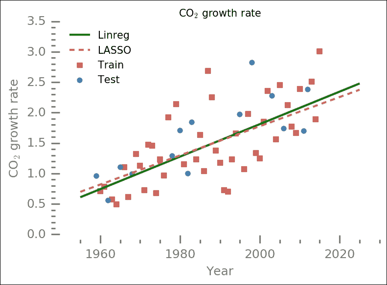

拟合略有不同，但绝对在彼此的不确定性范围内。数据点的分布相对较大。正方形表示训练集，圆圈表示测试(验证)集。然而，在这个范围之外进行外推会预测出明显不同的值。

我们可以计算出 R <sup>2</sup> 分数，就像以前用经典 OLS 回归一样:

```py
from sklearn.metrics import r2_score 
r2_lin = r2_score(co2_gr['rate'],  
                  est_lin.predict( 
                    co2_gr['year'].reshape(-1,1))) 
r2_lasso = r2_score(co2_gr['rate'],  
                    est_lasso.predict( 
                        co2_gr['year'].reshape(-1,1))) 
print('LinearSVC: {0:.2f}\nLASSO:\ 
\t   {1:.2f}'.format(r2_lin, r2_lasso)) 

```


R <sup>2</sup> 值相对较高，尽管数据点分布明显且数据大小有限。

## 用贝叶斯分析和 OLS 检验

我们将很快用线性模型与 statsmodels 的 OLS 回归和贝叶斯推断进行比较。贝叶斯推断和 OLS 拟合与 *[第六章](106.html "Chapter 6. Bayesian Methods")**贝叶斯方法*相同，这里重复一个小版本:

```py
import pymc 
x = co2_gr['year'].as_matrix()   
y = co2_gr['rate'].as_matrix() 
y_error = co2_gr['err'].as_matrix() 
def model(x, y):  
    slope = pymc.Normal('slope', 0.1, 1.) 
    intercept = pymc.Normal('intercept', -50., 10.) 
    @pymc.deterministic(plot=False) 
    def linear(x=x, slope=slope, intercept=intercept): 
        return x * slope + intercept 
    f = pymc.Normal('f', mu=linear, tau=1.0/y_error,                       value=y, observed=True) 
    return locals() 
MDL = pymc.MCMC(model(x,y)) 
MDL.sample(5e5, 5e4, 100) 
y_fit = MDL.stats()['linear']['mean'] 
slope = MDL.stats()['slope']['mean'] 
intercept = MDL.stats()['intercept']['mean'] 

```

对于 OLS 模型，我们再次使用公式框架来表示变量之间的关系:

```py
import statsmodels.formula.api as smf 
from statsmodels.sandbox.regression.predstd import wls_prediction_std 
ols_results = smf.ols("rate ~ year", co2_gr).fit() 
ols_params = np.flipud(ols_results.params) 

```

现在我们已经得到了这三种方法的结果，让我们打印出它们的斜率和截距:

```py
print('     Slope  Intercept \nML : \ 
{0:.3f} {1:.3f} \nOLS: {2:.3f} \ 
{3:.3f} \nBay: {4:.3f} \ 
{5:.3f}'.format(est_lin.coef_[0], est_lin.intercept_, 
                ols_params[0],ols_params[1], 
                slope, intercept) ) 

```


虽然总体结果相似，但贝叶斯推断估计的绝对值似乎低于其他方法。我们现在可以将这些不同的估计值与数据一起可视化:

```py
fig = plt.figure() 
ax = fig.add_subplot(111) 
ax.errorbar(x, y, yerr=y_error, ls='None',   
        elinewidth=1.5, capthick=1.5, 
        marker='.', ms=8, label='Observed') 
ax.set_xlabel('Year') 
ax.set_ylabel('CO$_2$ growth rate') 
ax.plot([x.min(), x.max()],  
        [ols_results.fittedvalues.min(),  
         ols_results.fittedvalues.max()],  
        lw=1.5, label='OLS', 
        dashes=(13,5)) 
ax.plot(x, y_fit, lw=1.5, 
        label='pymc') 
ax.plot([x.min(), x.max()],  
        est_lin.predict([[x.min(), ], [x.max(), ]]), 
        label='Scikit-learn', lw=1.5) 
despine(ax) 
ax.locator_params(axis='x', nbins=7) 
ax.locator_params(axis='y', nbins=4) 
ax.set_xlim((1955,2018)) 
ax.legend(loc=2, numpoints=1) 
ax.set_title('CO$_2$ growth rate'); 

```

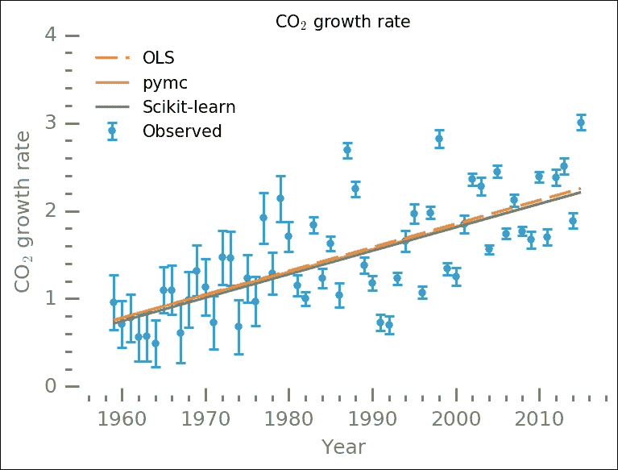

这可能看起来是一个非常小的差别；然而，如果我们用这些不同的结果来推断 30 年、50 年甚至 100 年后的未来，这些将产生明显不同的结果。这个例子向你展示了在 Scikit-learn 中尝试不同的方法和模型是多么简单。也可以自己创造。接下来，我们将看看 Scikit-learn 中的一个集群识别模型，DBSCAN。

# 聚类

在这个例子中，我们将在 Scikit-learn 中看到一个名为 **DBSCAN** 的聚类发现算法。DBSCAN 代表有噪声的应用程序的基于密度的空间聚类，是一种有利于点组的聚类算法，可以将这些组(聚类)之外的点识别为噪声(异常值)。与线性机器学习方法一样，Scikit-learn 使使用它变得非常容易。我们首先从 *[第五章](105.html "Chapter 5. Clustering")**聚类*中读取数据，带有 Pandas 的`read_pickle`功能:

```py
TABLE_FILE = 'data/test.pick' 
mycat = pd.read_pickle(TABLE_FILE) 

```

与前面的数据集一样，为了刷新您的内存，我们绘制了数据。它包含了映射的附近宇宙的一部分，也就是具有确定位置(方向和与我们的距离)的星系。和以前一样，我们用 *Z* 来缩放颜色，如数据表所示:

```py
fig,ax = plt.subplots(1,2, figsize=(10,2.5)) 
plt.subplot(121) 
plt.scatter(mycat['Y'], -1*mycat['X'],  
            s=8,  
            color=plt.cm.viridis_r( 
                    10**(mycat.Zmag-mycat.Zmag.max()) ),  
            edgecolor='None') 
plt.xlabel('Y (Mpc)'); plt.ylabel('X (Mpc)') 
ax = plt.gca() 
despine(ax) 
ax.locator_params(axis='x', nbins=5) 
ax.locator_params(axis='y', nbins=5) 
plt.axis('equal') 
plt.subplot(122) 
c_arr = 10**(mycat.Zmag-mycat.Zmag.max()) 
plt.scatter(-1*mycat['X'],mycat['Z'],  
            s=8,  
            color=plt.cm.viridis_r(c_arr),  
            edgecolor='None') 
lstyle = dict(lw=1.5, color='k', dashes=(6,4)) 
ax = plt.gca() 
despine(ax) 
ax.locator_params(axis='x', nbins=5) 
ax.locator_params(axis='y', nbins=5) 
plt.plot([0,150], [0,80], **lstyle) 
plt.plot([0,150], [0,45], **lstyle) 
plt.plot([0,-25], [0,80], **lstyle) 
plt.plot([0,-25], [0,45], **lstyle) 
plt.xlabel('X (Mpc)'); plt.ylabel('Z (Mpc)') 
plt.subplots_adjust(wspace=0.3) 
plt.axis('equal'); 
plt.ylim((-10,110)); 

```


这些数据跨越了极大的尺度和给定方向上的许多星系。为了开始使用机器学习进行聚类查找，我们从 Scikit-learn 导入相关对象:

```py
from sklearn.cluster import DBSCAN 
from sklearn import metrics 
from sklearn.preprocessing import StandardScaler 

```

第一个导入是简单的 DBSCAN 方法，第二个导入是度量模块，我们可以用它来计算聚类算法的各种统计数据。`StandardScaler`类只是对数据进行缩放，如 *[第 5 章](105.html "Chapter 5. Clustering")**聚类*。接下来，我们设置输入数据；每一行都应该包含缩放后的要素/点的坐标。然后，该缩放坐标列表被输入到数据库扫描方法中:

```py
A = np.array([mycat['Y'], -1*mycat['X'], mycat['Z']]).T 
A_scaled = StandardScaler().fit_transform(A) 
dbout = DBSCAN(eps=0.15, min_samples=5).fit(A_scaled) 

```

DBSCAN 对象是用几个参数实例化的。`eps`参数根据至少`min_samples`必须位于的距离来限制聚类的大小(记住，以比例单位)。`dbout`对象现在存储拟合的所有结果。`dbout.labels_`数组包含每个点的所有标签；不在任何簇中的点被赋予一个`-1`标签。让我们看看是否有:

```py
(dbout.labels_==-1).any() 

```

它打印出`True`，所以我们有噪音。输出对象还有一个重要的方法就是`core_sample_indices_`。它包含核心样本，每个集群都是从这些样本扩展和形成的。这几乎就像 k-means 聚类中的质心位置。我们现在为核心样本索引创建一个布尔数组，并在结果中创建一个唯一标签列表。根据 Scikit-learn 文档，这是推荐的方法。

```py
csmask = np.zeros_like(dbout.labels_, dtype=bool) 
csmask[dbout.core_sample_indices_] = True 
unique_labels = set(dbout.labels_) 

```

没有集群的真正标签，衡量集群发现的成功是很棘手的。通常，您会计算轮廓分数，这是一个根据质心和同一聚类和附近聚类中的样本之间的距离进行缩放的分数。轮廓得分越高，聚类发现在定义聚类时就越好。然而，这假设了以一个点为中心的簇，而不是丝状结构。为了向您展示如何计算和解释剪影分数，我们在本例中对其进行了介绍，但请记住，在这种情况下，它可能不是一种有代表性的方法。我们将计算轮廓分数，并打印出找到的簇的数量。请记住，标签数组还包含噪声标签(即`-1`):

```py
n_clusters = len(set(labels)) - [0,1][-1 in labels] 
print('Estimated number of clusters: %d' % n_clusters) 
print("Silhouette Coefficient: %0.3f" 
      % metrics.silhouette_score(A_scaled, dbout.labels_)) 

```


接近零的轮廓得分值表示聚类重叠。现在我们将绘制所有结果，并检查它看起来像什么。我试图通过增加核心样本的标记大小和减少非核心样本的大小来绘制不同的核心样本。我还对颜色进行了洗牌，试图让不同的集群在它们的邻居面前脱颖而出:

```py
colors = plt.cm.viridis(np.linspace(0.3, 1, len(unique_labels)))  
np.random.seed(0) 
np.random.shuffle(colors) 
for lbl, col in zip(unique_labels, colors): 
    if lbl == -1: 
        # Black used for noise. 
        col = 'DarkRed'; m1=m2= '+'; s = 10; a = 0.5 
    else: 
        m1='.';m2='.'; s=5; a=1 
    cmmask = (dbout.labels_ == lbl) 
    xy = A[cmmask & csmask] 
    plt.scatter(xy[:, 0], xy[:, 1], color=col, 
                marker=m1, 
                s=s+1, 
               alpha=a) 
    xy = A[cmmask & ~csmask] 
    plt.scatter(xy[:, 0], xy[:, 1], color=col, 
                marker=m2, 
                s=s-2, 
               alpha=a) 
despine(plt.gca()) 
noiseArtist = plt.Line2D((0,1),(0,0),  
                       color='DarkRed',  
                       marker='+',  
                       linestyle='', 
                       ms=4, mew=1, 
                       alpha=0.7) 
clusterArtist = plt.Line2D((0,1),(0,0),  
                       color='k',  
                       marker='.',  
                       linestyle='', 
                      ms=4, mew=1) 
plt.legend([noiseArtist, clusterArtist],  
           ['Outliers','Clusters'],  
           numpoints=1) 
plt.title('A slice of the Universe') 
plt.xlabel('X [Mpc]') 
plt.ylabel('Y [Mpc]'); 

```

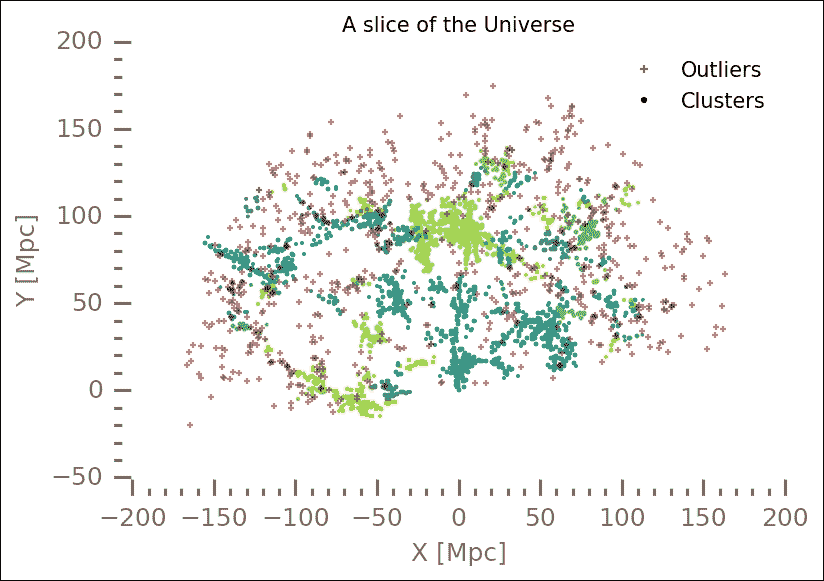

该算法还可以找到噪声(异常值)，在这里用红色十字标出。尝试调整核心和非核心样本的显示，使它们更加突出。此外，您应该尝试 DBSCAN 方法的不同参数，看看结果会受到什么影响。另一件事是回到 *[第 5 章](105.html "Chapter 5. Clustering")**聚类*，将 66 个聚类放入我们在那里用相同数据集尝试的分层聚类算法中进行比较。

# 种子分类

我们现在来看三组主要的分类(学习)模型:**支持向量机** ( **SVM** )、最近邻和随机森林。SVM 简单地将空间划分为*和*两个区域，由一个边界隔开。可以允许边界具有不同的形状，例如，有线性边界或二次边界。最近邻分类识别 k 个最近邻，并根据 k 个最近邻属于哪个类别对当前数据点进行分类。随机森林分类器是一种决策树学习方法，简单来说，它根据给定的训练数据创建规则，以便能够对新数据进行分类。一行中的一组 if 语句赋予了它决策树的名称。

我们将要使用的数据来自 UCI 机器学习知识库(李奇曼，m .(2013)-[http://archive.ics.uci.edu/ml](http://archive.ics.uci.edu/ml)。(加州欧文:加州大学信息与计算机科学学院)。该数据集包含三种不同类型小麦籽粒的若干测量属性(M. Charytanowicz，J. Niewczas，P. Kulczycki，P.A. Kowalski，s .卢卡西克，S. Zak，*)X 射线图像特征分析的完全梯度聚类算法*，载于:生物医学中的信息技术，Ewa Pietka，亚采克·卡瓦(eds。)，斯普林格-弗拉格，柏林-海德堡，2010 年，第 15-24 页。).

我们想创建一个分类器，如果我们测量种子的特定参数，它可以告诉我们它是什么类型的种子。对于数据集，提供了列的描述，这也可以在数据集的 UCI 网页上找到。共有八列，七列用于参数，一列用于种子的已知类型(即标签)。我已经为此创建了一个文本文件；如果您运行的是基于 Linux 的系统，您可以使用 Jupyter magic 列出内容:

```py
%%bash 
less data/seeds.desc 

```

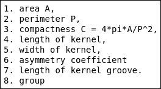

### 型式

如果你运行的是微软的 Windows，可以使用`more`命令，也就是`more data/seeds.desc`，给你同样的输出，但是在一个弹出窗口，不太方便但是还是有用的。

现在我们知道有哪些列了，我们可以把它读入 Pandas 数据框:

```py
seeds = pd.read_csv('data/seeds_dataset.txt', 
       delim_whitespace=True, 
       names=['A', 'P', 'C', 'lkern', 'wkern',  
       'asym', 'lgro', 'gr']) 

```

一如既往，列出所读内容:

```py
seeds.head() 

```

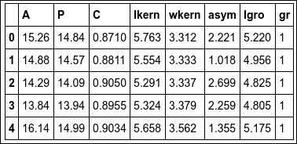

## 可视化数据

我们可以对数据集中的所有七个参数运行整个分类过程。这在计算上是昂贵的，并且当增加数据量时，成本增加得非常快。为了第一次尝试只选择对分类重要的属性，我想直观地检查不同类型颗粒的属性值的分布。为此，我们首先为不同的组创建一个选择过滤器:

```py
gr1 = seeds.gr == 1 
gr2 = seeds.gr == 2 
gr3 = seeds.gr == 3 

```

为了只绘制相关参数，我们还创建了一个我们想要查看的参数列表(也就是说，不是颗粒的类型):

```py
pars = ['A','C','P','asym','lgro','lkern','wkern'] 

```

借助 Pandas 内置的`histogram`功能，我们可以绘制出每组的属性。我添加了一些额外的命令，使图形看起来更好看，更整洁:

```py
axes = seeds[pars][gr1].hist(figsize=(8,6)) 
despine(list(axes.flatten())) 
_ = [ax.grid() for ax in list(axes.flatten())] 
_ = [ax.locator_params(axis='x', nbins=4) for ax in  
    list(axes.flatten())] 
_ = [ax.locator_params(axis='y', nbins=2) for ax in  
    list(axes.flatten())] 
plt.subplots_adjust(wspace=0.5, hspace=0.7) 

```

我们再一次使用`despine`功能使图更清晰。前面的代码将绘制第一个组`gr1`的所有属性。直方图将显示这些值是如何分布的:

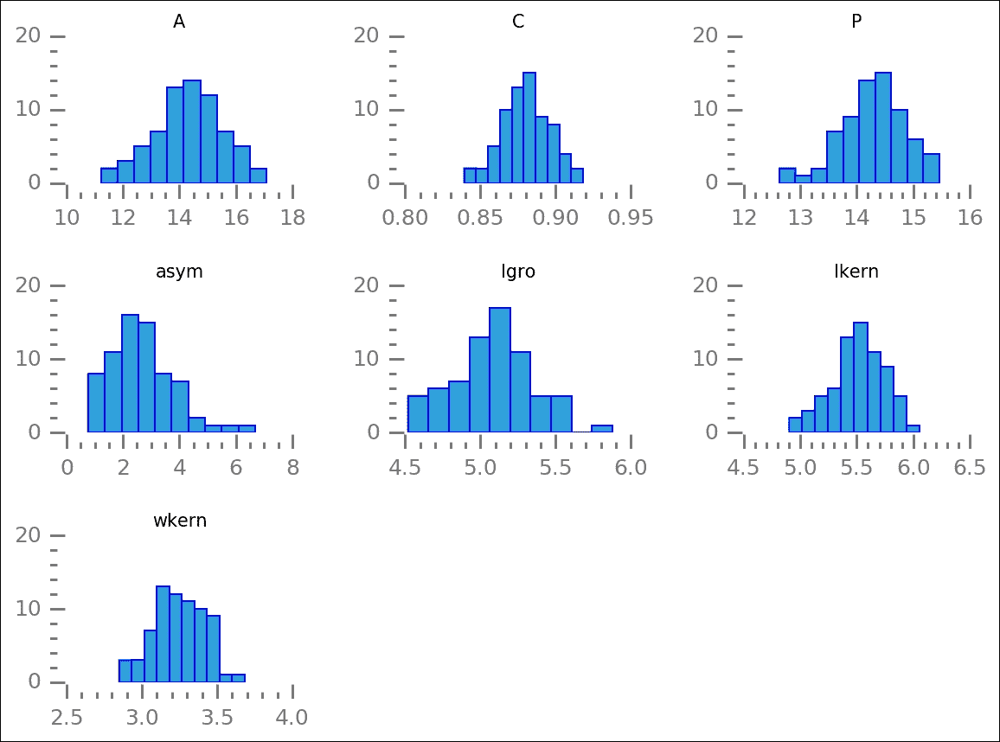

使用选择过滤器，可以轻松绘制其他组:

```py
axes = seeds[pars][gr2].hist(figsize=(8,6)) 
despine(list(axes.flatten())) 
_ = [ax.grid() for ax in list(axes.flatten())] 
_ = [ax.locator_params(axis='x', nbins=4) for ax in  
    list(axes.flatten())] 
_ = [ax.locator_params(axis='y', nbins=2) for ax in  
    list(axes.flatten())] 
plt.subplots_adjust(wspace=0.5, hspace=0.7) 

```

通过绘制所有的组，我们可以看到属性值的分布是如何不同的。我们试图找出不同群体之间最大的差异:

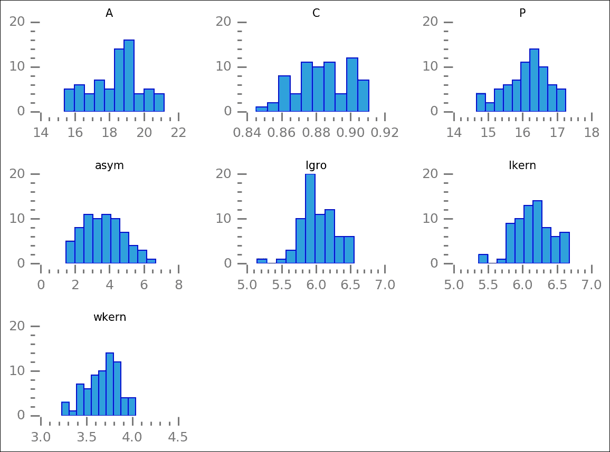

```py
axes = seeds[pars][gr3].hist(figsize=(8,6)) 
despine(list(axes.flatten())) 
_ = [ax.grid() for ax in list(axes.flatten())] 
_ = [ax.locator_params(axis='x', nbins=5) for ax in  
    list(axes.flatten())] 
_ = [ax.locator_params(axis='y', nbins=2) for ax in  
    list(axes.flatten())] 
plt.subplots_adjust(wspace=0.5, hspace=0.7) 

```

绘制完最后一个组后，我们可以查看每个属性，并找到每个组的分布分开的属性。这样，我们就可以用它来区分各种群体(种子的类型)，也就是把它们分类:

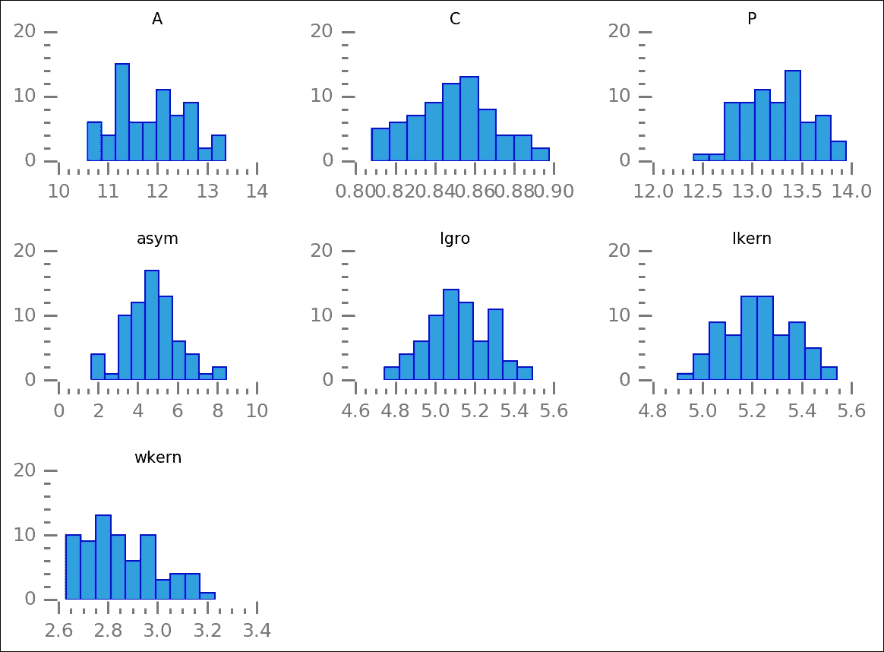

由此，我认为孔隙率和凹槽长度是很好的参数，因为它们的定义相当明确，并且对于三组来说，它们是分开的峰。为了核实这一点，我们让他们互相攻击。我们还想标记不同种类的谷物:

```py
fig = plt.figure() 
ax = fig.add_subplot(111) 
ax.scatter(seeds.P[gr1], seeds.lgro[gr1],  
           color='LightCoral')  
ax.scatter(seeds.P[gr2], seeds.lgro[gr2],  
           color='SteelBlue', marker='s')  
ax.scatter(seeds.P[gr3], seeds.lgro[gr3],  
           color='Green', marker='<'); 
ax.text(seeds.P[gr1].mean(), seeds.lgro[gr1].mean(), 
        '1', bbox=dict(color='w', alpha=0.7,  
                 boxstyle="Round")) 
ax.text(seeds.P[gr2].mean(), seeds.lgro[gr2].mean(), 
        '2', bbox=dict(color='w', alpha=0.7,  
                  boxstyle="Round")) 
ax.text(seeds.P[gr3].mean(), seeds.lgro[gr3].mean(), 
        '3', bbox=dict(color='w', alpha=0.7,  
                 boxstyle="Round")) 
ax.set_xlabel('Porosity') 
ax.set_ylabel('Groove length') 
ax.set_title('Seed parameters') 
despine(ax) 
plt.minorticks_on() 
ax.locator_params(axis='x', nbins=5) 
ax.locator_params(axis='y', nbins=4) 
ax.set_xlim(11.8,18) 
ax.set_ylim(3.8,7.1); 

```

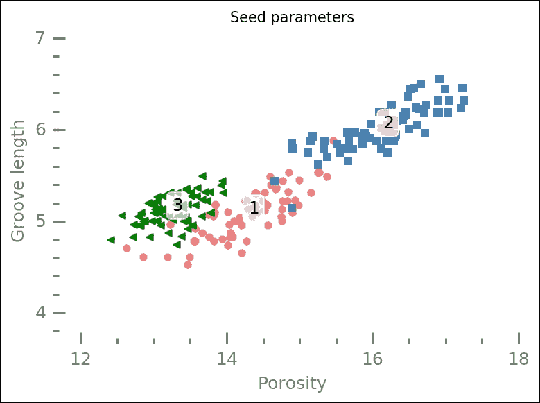

现在，这只是其中两个参数；我们还有几个。但是，从这一点来看，似乎最难把第 1 组和第 3 组，也就是圆和三角形分开。

## 特征选择

Scikit-learn 内置了几种确定最佳观察参数的方法。这有时被称为特征选择，它试图确定哪些参数彼此之间具有最大的差异，并且最适合将各种组描述为完全不同的组。在这里，我们使用一个我们可以给出一个数字的地方， *K* (不要与 K-means 中的 *K* 混淆)，这决定了它应该选择多少个特征中最好的。

首先，我们将种子表存储为一个矩阵，一个 NumPy 数组，然后我们将数据和标签分开:

```py
X_raw = seeds.as_matrix() 
X_pre, labels = X_raw[:,:-1], X_raw[:,-1] 

```

现在我们可以导入选择算法并在数据上运行它。请注意，我们还导入了 chi2 估计器，并将其提供给选择对象。这意味着卡方最小化将用于确定最佳参数:

```py
from sklearn.feature_selection import SelectKBest 
from sklearn.feature_selection import chi2 
X_best = SelectKBest(chi2, k=2).fit_transform(X_pre, labels) 

```

它现在已经选择了两列；为了检查哪些列，我们打印出选择的前几行和原始数据:

```py
X_best[:5] 

```


```py
seeds.head()

```

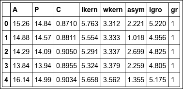

面积(`A`)和不对称(`asym`)系数是根据该选择算法可以使用的两个最佳参数。在我们通过机器学习算法之一进行分类之前，我们再次绘制所有数据，但这一次特征是由算法选择的:

```py
fig = plt.figure() 
ax = fig.add_subplot(111) 
ax.scatter(seeds.A[gr1], seeds.asym[gr1],  
           color='LightCoral') 
ax.text(seeds.A[gr1].mean(), seeds.asym[gr1].mean(), 
        '1', bbox=dict(color='w', alpha=0.7,  
        boxstyle="Round")) 
ax.scatter(seeds.A[gr2], seeds.asym[gr2],  
           color='SteelBlue', 
           marker='s')  
ax.text(seeds.A[gr2].mean(), seeds.asym[gr2].mean(), 
        '2', bbox=dict(color='w', alpha=0.7,  
        boxstyle="Round")) 
ax.scatter(seeds.A[gr3], seeds.asym[gr3],  
           color='Green', 
           marker='<') 
ax.text(seeds.A[gr3].mean(), seeds.asym[gr3].mean(), 
        '3', bbox=dict(color='w', alpha=0.7,  
        boxstyle="Round")) 
ax.set_xlabel('Area') 
ax.set_ylabel('Asymmetry') 
ax.set_title('Seed parameters') 
despine(ax) 
plt.minorticks_on() 
ax.locator_params(axis='x', nbins=5) 
ax.locator_params(axis='y', nbins=3) 
ax.set_xlim(9.6,22) 
ax.set_ylim(-0.6,10); 

```

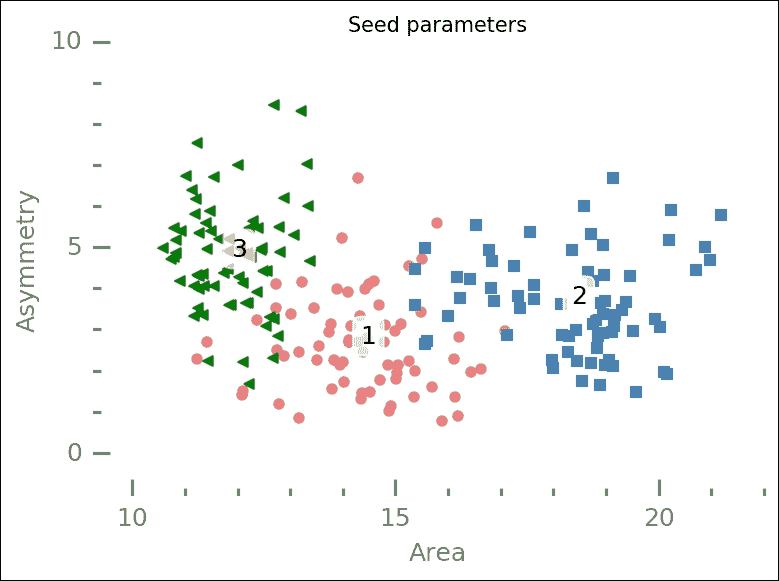

与之前类似的情节相比，点更分散，也许圆圈和三角形更分离，重叠更少——这很难评估。

## 对数据进行分类

为了开始对数据进行分类，我们首先准备一些东西。我们引入了 SVM 模和 K 近邻以及随机森林估计。在 SVM 模块中是**支持向量分类** ( **支持向量机**)估计器，SVM 的主要估计器。SVC 可以用不同的内核运行；我们将讨论线性、径向基函数和多项式核。在我们运行它们之前，我将对它们做一个简短的解释。

为了可视化分类，我想绘制边界，我们将使用等高线来实现这一点。为此，我们需要创建一个点网格，并用我们训练好的分类器对它们进行评估:

```py
from sklearn import svm 
from sklearn.neighbors import KNeighborsClassifier 

res = 0.01 
#X, y  = X_best[::2], labels[::2] 
X, y  = X_best, labels 
x_min, x_max = X[:, 0].min() - 1, X[:, 0].max() + 1 
y_min, y_max = X[:, 1].min() - 1, X[:, 1].max() + 1 
xx, yy = np.meshgrid(np.arange(x_min, x_max, res), 
                     np.arange(y_min, y_max, res)) 

```

在这里，我们编写一个函数来绘制结果。为了绘制边界，使用了我们之前创建的`x`和`y`网格。它被传递给估计者的`predict(xxyy)`方法。这里，输入是估计器、机器学习分类模型的输出(即不同的支持向量机、最近邻和随机森林)以及图的标题。等高线图绘制边界，您可以将`ax.contour`更改为`ax.contourf`以获得填充的等高线。现在我们有了一个处理可视化的功能，我们可以专注于测试不同的模型(称为内核):

```py
def plot_results(clf, title): 
    fig = plt.figure() 
    ax = fig.add_subplot(111) 
    plt.subplots_adjust(wspace=0.2, hspace=0.4) 
    xxyy = np.vstack((xx.flatten(), yy.flatten())).T 
    Z = clf.predict(xxyy) 
    Z = Z.reshape(xx.shape) 
    ax.contour(xx, yy, Z,  
               colors=['Green','LightCoral', 'SteelBlue'],  
               alpha=0.7, zorder=-1) 
    ax.scatter(seeds.A[gr1], seeds.asym[gr1],  
               color='LightCoral')  
    ax.scatter(seeds.A[gr2], seeds.asym[gr2],  
               color='SteelBlue', marker='s')  
    ax.scatter(seeds.A[gr3], seeds.asym[gr3],  
               color='Green', marker='<')
    ax.text(seeds.A[gr1].mean(), seeds.asym[gr1].mean(), 
            '1', bbox=dict(color='w', alpha=0.7,  
            boxstyle="Round")) 
    ax.text(seeds.A[gr2].mean(), seeds.asym[gr2].mean(), 
            '2', bbox=dict(color='w', alpha=0.7,  
            boxstyle="Round")) 
    ax.text(seeds.A[gr3].mean(), seeds.asym[gr3].mean(), 
            '3', bbox=dict(color='w', alpha=0.7,  
            boxstyle="Round")) 
    despine(ax) 
    plt.minorticks_on() 
    ax.locator_params(axis='x', nbins=5) 
    ax.locator_params(axis='y', nbins=3) 
    ax.set_xlabel('Area') 
    ax.set_ylabel('Asymmetry') 
    ax.set_title(title, size=10) 
    ax.set_xlim(9.6,22) 
    ax.set_ylim(-0.6,10); 

```

### 奇异值分解线性核

SVC 中一个简单的核是线性核，它假设线性边界。作为输入，取`C`，决定对噪声数据敏感度的参数；对于非常嘈杂的数据，您可以降低该参数。为了得到线性核，对我们的数据运行分类，并用我们的函数绘制结果，我们运行以下内容:

```py
svc = svm.SVC(kernel='linear', C=1.).fit(X, y) 
plot_results(svc, 'SVC-Linear') 

```


正如你所看到的，边界是线性的，它合理地将不同的点分成与研究人员创建的点相对应的组。

### 支持向量机径向基函数

下一个内核**径向基函数** ( **径向基函数**)是在没有输入内核给 SVC 调用的情况下使用的内核；它基本上是一个高斯核。结果是一个由高斯线性组合而成的核(区域)。除了`C`参数，这里还可以给出伽马参数；它是高斯宽度的倒数，因此它给出了边界的陡度:

```py
rbf_svc = svm.SVC(kernel='rbf', gamma=0.4, C=1.).fit(X, y) 
plot_results(rbf_svc, 'SVC-Radial Basis Function') 

```

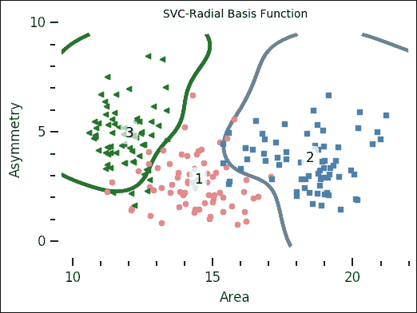

在这里，边界更加平滑。中心的边界与线性内核大致相同，但远离密集区域时会有所不同。

### 奇异值分解多项式

我们将讨论的最后一个 SVC 内核是多项式，它听起来就是多项式。作为输入，它需要以下程度:

```py
poly_svc = svm.SVC(kernel='poly', degree=3, C=1.).fit(X, y) 
plot_results(poly_svc, 'SVC-Polynomial') 

```

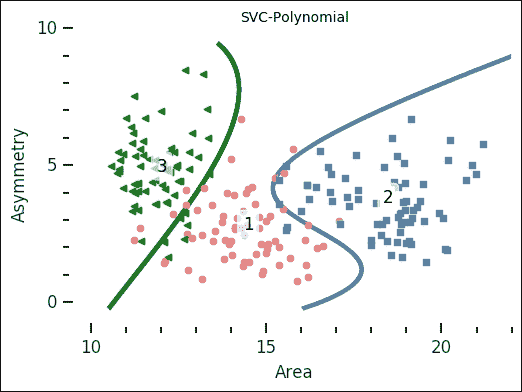

因此边界用多项式来表示。我建议你试着把度数换成别的，看看边界会发生什么。

### K-最近邻

现在我们使用 K 近邻。作为输入，这需要比较邻居的权重和数量。默认权重是假设所有`n_neighbors`附近点的权重一致；将权重关键字更改为`distance`假设权重随着距离的增加而减少:

```py
knn = KNeighborsClassifier(weights = 'uniform', n_neighbors=5).fit(X, y) 
plot_results(knn, 'k-Nearest Neighbours') 

```

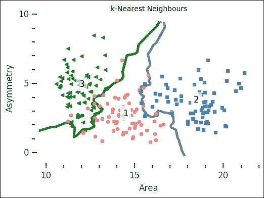

这类似于一些支持向量机内核，但适用于更小的变化。尝试将权重更改为“距离”，同时更改`n_neighbors`参数，看看结果如何变化。把`n_neighbors`换成大于 30 的东西会怎么样；它几乎完全复制了其他哪个分类器？

### 随机森林

作为最后一个示例分类器，我们使用随机森林方法。你可以把它想象成 *[第五章](105.html "Chapter 5. Clustering")**聚类*中进行层次聚类的树形图；但是，每个分支都是对这里的数据进行分类的规则。我们给对象三个输入:`max_depth`、`n_estimators`和`max_features`。第一个，`max_depth`决定每棵决策树应该走多远，`n_estimators`给出*森林中有多少棵决策树*。这并不是真正的直观，所以要展示给大家是什么，先放`n_estimators=1`，运行代码，看输出。然后，换成另一个更高的数字，看看新的输出:

```py
rfc = RandomForestClassifier( 
                             max_depth=3,  
                             n_estimators=10,  
                             max_features='auto').fit(X, y) 
plot_results(rfc, 'Random Forest Classifier') 

```

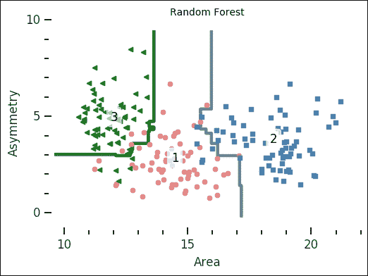

森林中的树的数量是用来建立分类器的决策树的数量。结果显示，随机森林分类器很简单，但能够对相当复杂的问题进行分类。SVC 和线性核也很简单，但是你可以想象随机森林分类器如何能够用相当低的深度和很少的估计量来分类更复杂的问题。我建议你花点时间，摆弄一下所有分类器的输入参数，看看结果如何变化。

## 选择你的分类器

前面的例子向您展示了 SVC(具有各种核)、kNN 和随机森林分类器的不同结果。但是，什么时候应该用一个而不是另一个呢？一般来说，尝试给定问题的所有方法。SVC 的主要优势在这些例子中得到强调——它非常通用，有许多不同的内核。决策树像随机森林一样，有变得过于复杂从而过度拟合数据的风险。同样在前面的例子中突出显示的是，kNN 非常适合于边界明显不是线性的分类，正如你可以在前面的 kNN 图像的结果中看到的。还有其他内核和分类器。例如，对文章*进行了 179 个分类器的比较，我们需要数百个分类器来解决现实世界的分类问题吗？*(费尔南德斯-德尔加多，2014，JMLR，15，3133-3181)。本研究涵盖了所有常见的量词。然而，如前所述，重要的是在您的数据上尝试各种分类器，看看什么有效。

# 总结

在这一章中，我们研究了各种机器学习方法来进行回归、聚类和分类。我们将使用机器学习工具的线性回归与贝叶斯推断和标准 ols 中的相同问题进行了比较。此外，我们将聚类机器学习算法 DBSCAN 的结果与我们在 *[第 5 章](105.html "Chapter 5. Clustering")**聚类*中获得的结果进行了比较。最后，我们查看了 Scikit-learn 中可用的几种分类算法，以及它们在同一数据集上的表现。

有了 UCI 机器学习知识库，找到实践数据并不难。我建议你访问[http://archive.ics.uci.edu/ml](http://archive.ics.uci.edu/ml)并寻找一个数据集来尝试我们在这里经历的任何新事物。