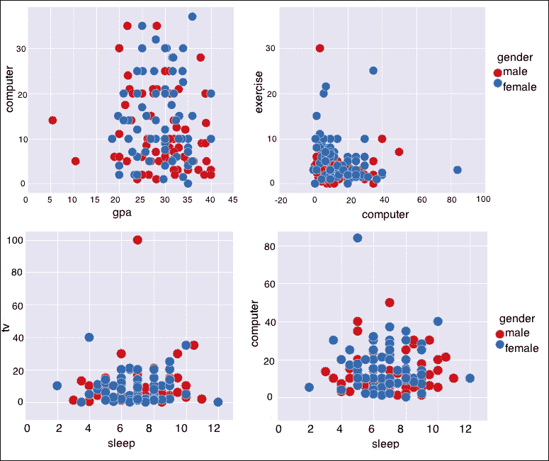
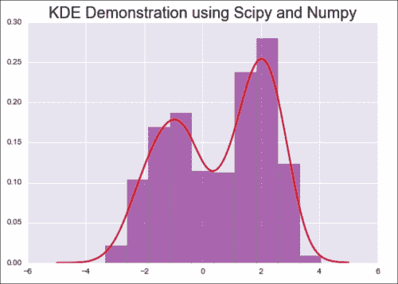

# 一、数据可视化的概念框架

互联网和社交媒体在现代的存在导致了大量的数据，数据量的增长超乎想象。这是如何以及何时开始的？

十年前，一种新的经营方式出现了:公司从整个企业的来源收集、组合和处理大量数据。他们的目标是使用大量数据来改进决策过程。大约在同一时间，亚马逊、雅虎和谷歌等处理大量数据的公司取得了重大进展。这些里程碑导致了支持*大数据*的多项技术的诞生。我们不会详细讨论大数据，但会尝试探索为什么许多组织改变了他们的方式，使用类似的想法来进行更好的决策。

这些大量的数据究竟是如何用来做出更好的决策的？我们最终会做到这一点，但首先让我们试着理解数据、信息和知识之间的区别，以及它们如何与数据可视化相关联。人们可能会想，为什么我们在谈论数据、信息和知识。有一个故事绘图连接了我们如何开始，我们从什么开始，所有这些事情如何有益于业务，以及可视化的作用。我们将通过简要回顾相关步骤来确定数据可视化所需的概念框架。

在本章中，我们将涵盖以下主题:

*   数据、信息、知识和洞察力之间的区别
*   信息转化为知识，进而转化为洞察力
*   收集、处理和组织数据
*   数据可视化的历史
*   可视化数据如何帮助决策？
*   可视化图

# 数据、信息、知识和洞察力

术语**数据**、**信息**和**知识**在计算机科学的上下文中被广泛使用。这些术语有许多定义，往往相互冲突，不一致。在我们深入这些定义之前，我们将了解这些术语如何与可视化相关。数据可视化的主要目标是获得对数据或信息的洞察(隐藏的真相)。本书中关于数据、知识和洞察力的整个讨论都是在计算机科学的背景下进行的，而不是心理学或认知科学。对于认知语境，可以参考[https://www . UCSF . edu/news/2014/05/114321/converting-data-knowledge-insight-and-action](https://www.ucsf.edu/news/2014/05/114321/converting-data-knowledge-insight-and-action)。

## 数据

术语**数据** 意味着一个可以从中得出结论的前提。虽然数据和信息在某种背景下看起来是相互关联的，但数据实际上是指数字形式的离散客观事实。数据是基本的构建模块，当以不同的方式组织和排列时，会产生有助于回答一些业务问题的信息。

数据可以是非常简单的东西，但是数量庞大且没有组织。这种离散的数据不能单独用于决策，因为它没有意义，更重要的是，因为它们之间没有结构或关系。数据收集、传输和存储的过程因数据类型和存储方法而异。数据有多种形式；一些值得注意的形式如下:

*   CSV 文件
*   数据库表
*   文档格式(Excel、PDF、Word 等)
*   HTML 文件
*   JSON 文件
*   文本文件
*   XML 文件

## 信息

信息是经过处理的数据，作为一个商业问题的答案。当我们添加关系或关联时，数据就变成了信息。关联是通过为数据提供上下文或背景来实现的。背景是有帮助的，因为它允许我们回答关于数据的问题。

例如，让我们假设给定的篮球运动员的数据包括身高、体重、位置、大学、出生日期、选秀、选秀轮次、NBA 首秀和招募排名。问题的答案“身高超过六尺，打控卫位置的选秀状元是谁？”也是信息。

同样，每个玩家的分数都是一条数据。“今年谁的场均得分最高，他的得分是多少”这个问题的答案是“勒布朗·詹姆斯，27.47”，这也是信息。

## 知识

当人类解释和组织信息并利用这些信息来推动决策时，知识就出现了。知识是通过经验获得的数据、信息和技能。知识包括做出适当决策的能力以及执行决策的技能。

基本要素——连接数据——让我们了解每条信息的相对重要性。通过比较过去的结果和识别模式，我们不必从头开始构建问题的解决方案。下图总结了数据、信息和知识的概念:


知识以递增的方式变化，特别是当信息被重新排列或重组时，或者当一些计算算法改变时。知识就像一个指向算法结果的箭头，依赖于来自数据的过去信息。在许多实例中，知识也是通过与结果的视觉交互获得的。另一方面，洞察力打开了通往未来的道路。

## 数据分析与洞察

在我们深入洞察的定义及其与业务的关系之前，让我们看看捕捉洞察的想法是如何开始的。十多年来，组织一直在努力理解他们拥有的所有数据和信息，尤其是在数据量爆炸式增长的情况下。他们都意识到了**数据** **分析**(也称为**数据分析**或**分析**)的重要性，以便根据现有数据和信息做出最佳或现实的业务决策。

分析依赖于数学算法来确定数据之间的关系，从而产生洞察力。理解洞察力的一个简单方法是考虑一个类比:当数据没有结构和与业务的适当一致时，它通过将数据转换为更结构化的形式并使其更接近业务目标来给出更清晰和更深刻的理解。顿悟就是有突破性结果出来的“灵光乍现”时刻。人们不应该混淆术语分析和商业智能。分析具有预测能力，而商业智能基于对历史数据的分析提供结果。

分析通常适用于更广泛的数据，因此，数据协作通常发生在内部和/或外部。在一些商业范例中，协作只发生在广泛的数据集集合的内部，但在大多数其他情况下，外部连接有助于连接点或完成难题。外部数据连接的两个最常见来源是社交媒体和消费者群。

在本章的后面，我们将参考现实生活中的商业故事，这些故事通过应用分析来获得洞察力和推动商业价值，改进决策，并更好地了解他们的客户，从而取得了一些显著的成果。

# 数据的转换

到现在我们已经知道什么是数据，但是现在的问题是:收集数据的目的是什么？数据对于描述物理或社会现象以及进一步回答关于该现象的问题是有用的。因此，确保数据没有错误、不准确或不完整非常重要；否则，基于该数据的响应也将是不准确或不完整的。

有不同类别的数据，有些是*过去的性能数据*、*实验数据*、*基准数据*。过去的性能数据和实验数据是非常不言自明的。另一方面，基准数据是将两个不同项目或产品的特性与标准测量进行比较的数据。数据被转换成信息，被进一步处理，然后用于回答问题。因此，很明显，我们的下一步是实现这一转变。

## 将数据转化为信息

数据被收集并根据内容及其重要性以几种不同的形式存储。例如，如果数据是关于季后赛篮球比赛的，那么它将是文本和视频格式的。另一个例子是一个国家所有城市的温度记录，通过不同的格式收集和提供。从数据到信息的转换涉及数据的收集、处理和组织，如下图所示:


收集到的数据需要一些处理和组织，这些数据以后可能有也可能没有结构、模型或模式。然而，这个过程至少给了我们一个有组织的方式来寻找关于数据的问题的答案。这个过程可以是基于篮球运动员总得分的简单排序，也可以是基于城市和州名的排序。

从数据到信息的转换也可能不仅仅是排序，比如统计建模或计算算法。正是这种从数据到信息的转换非常重要，它使得数据能够被查询、访问和操作。在某些情况下，当有大量不同的数据时，转换可能涉及处理方法，如过滤、聚合、应用相关性、缩放和归一化以及分类。

### 数据收集

数据采集是一个耗时的过程。因此，企业正在寻找更好的方法来自动化数据捕获。然而，对于许多过程来说，手动数据收集仍然很普遍。现代通过自动过程进行的数据收集使用传感器等输入设备。例如，水下珊瑚礁通过传感器进行监测；农业是传感器用于监测土壤特性、控制灌溉和施肥方法的另一个领域。

另一种自动收集数据的方法是扫描文档和日志文件，这是服务器端数据收集的一种形式。手动过程包括通过基于网络的方法收集数据，这些数据存储在数据库中，然后可以转换成信息。如今，基于网络的协作环境正受益于改进的通信和数据共享。

传统的可视化和可视化分析工具通常是为在单台机器上与可视化应用交互的单个用户设计的。扩展这些工具以包括对协作的支持，显然已经在增加可视化在现实世界中的范围和适用性方面取得了很大进展。

### 数据预处理

今天，由于数据的大小和可能来自多个不同的来源和类型，数据非常容易受到噪声和不一致性的影响。有*数据清理*、*数据整合*、*数据约简*、*数据转换*等多种数据预处理技术。数据清理可用于消除噪声和纠正数据中的不一致。数据集成将来自多个来源的数据合并成一种连贯的格式，通常称为数据仓库。例如，数据缩减可以通过合并、聚合和消除冗余特征来减少数据大小。数据转换可以应用于数据被缩放到较小范围内的情况，从而提高处理和可视化数据的准确性和效率。数据的转换周期如下图所示:


异常检测是对收集的数据中可能不符合预期行为或模式的异常数据的识别。异常也被称为异常值或噪声；例如，在信号数据中，不寻常的特定信号被认为是噪声，而在交易数据中，异常值是欺诈性的交易。准确的数据收集对于保持数据的完整性至关重要。除了异常的负面影响，另一方面，异常值也非常重要——例如，特别是在人们想要发现欺诈性保险索赔的情况下。

### 数据处理

数据处理是转化过程中的重要一步。当务之急是将重点放在数据质量上。有助于准备数据以便更好地分析和理解数据的一些处理步骤是*相关性建模*和*聚类*。还有其他处理技术，但我们将在这里只讨论两种最流行的处理方法。

依赖建模是对数据进行建模以确定表示的性质和结构的基本原则。该过程搜索数据元素之间的关系；例如，百货公司可能会收集顾客购买习惯的数据。这个过程有助于百货商店推断关于频繁购买的信息。

**聚类**的任务是发现数据中以某种方式具有“相似模式”的组，而不使用数据中已知的结构。

### 组织数据

数据库管理系统允许用户以结构化格式存储数据。但是，数据库太大，无法放入内存。结构化数据有两种方式:

*   以表格、树或图形等结构化格式将大数据存储在磁盘中
*   使用数据结构格式将数据存储在内存中，以加快访问速度

数据结构包括一组不同的格式，用于构造能够存储和访问数据的数据。一般的数据结构类型有数组、文件、表、树、列表、映射等。任何数据结构都是为了组织数据以适应特定的目的而设计的，这样就可以在运行时存储、访问和操作数据。可以选择或设计数据结构来存储数据，以便使用各种算法对其进行处理，从而实现更快的访问。

被收集、处理和组织起来以便有效存储的数据更容易理解，这导致可以更好地理解信息。

### 获取数据集

对于无法访问组织数据的读者来说，互联网上有大量的资源，这些资源包含来自几个不同来源的丰富数据集，例如:

*   [http://grouplens.org](http://grouplens.org)(来自明尼苏达大学)
*   [http://ichart.finance.yahoo.com/table.csv?s=YHOO&c = 1962](http://ichart.finance.yahoo.com/table.csv?s=YHOO&c=1962)
*   [http://datawrangling.com/some-datasets-available-on-the-web](http://datawrangling.com/some-datasets-available-on-the-web)
*   [http://weather-warehouse.com](http://weather-warehouse.com)(天气数据)
*   [http://www.bjs.gov/developer/ncvs/](http://www.bjs.gov/developer/ncvs/)(司法统计局)
*   [http://census.ire.org/data/bulkdata.html](http://census.ire.org/data/bulkdata.html)(人口普查数据)
*   [http://ww.pro-football-reference.com](http://ww.pro-football-reference.com)(足球参考)
*   [http://www.basketball-reference.com](http://www.basketball-reference.com)(篮球参考)
*   [http://www.baseball-reference.com](http://www.baseball-reference.com)(棒球参考)
*   [http://archive.ics.uci.edu/ml/datasets.html](http://archive.ics.uci.edu/ml/datasets.html)(机器学习)
*   [http://www.pewresearch.org/data/download-datasets/](http://www.pewresearch.org/data/download-datasets/)
*   [http://archive.ics.uci.edu/ml/datasets/Heart+Disease](http://archive.ics.uci.edu/ml/datasets/Heart+Disease)(心脏病)

## 将信息转化为知识

信息是可量化、可度量的，它有形状，可以访问、生成、存储、分发、搜索、压缩、复制。它可以用信息量来量化。

信息通过离散算法的应用转化为知识，知识被期望比信息更具定性。在一些问题领域，知识继续经历一个不断发展的循环。这种演变尤其发生在数据实时变化的时候。

知识就像食谱，让你用信息做面包，在这种情况下，面粉和酵母的成分。另一种看待知识的方式是将数据和信息结合起来，在此基础上增加经验和专家意见来帮助决策。知识不仅仅是过滤或算法的结果。

这一转变涉及哪些步骤，变化是如何发生的？自然，它不能自己发生。尽管信息这个词根据定义会有不同的解释，但我们将在计算的背景下进一步探讨它。

一个简单的类比来说明信息和知识的区别:特定课程的课程材料为你提供了关于概念的必要信息，老师后来通过讨论帮助学生理解概念。这有助于学生获得课程知识。通过类似的过程，需要做一些事情来将信息转化为知识。下图展示了从信息到知识的转化:


如图所示，当信息通过一些离散算法聚集和运行时，就会转化为知识。需要对信息进行汇总，以获得更广泛的知识。通过这种转变获得的知识有助于回答关于数据或信息的问题，例如公司哪个季度的销售收入最大？广告在多大程度上推动了销售？或者说，今年发布了多少新品？

## 将知识转化为洞察力

在传统系统中，信息被处理，然后被分析以生成报告。自从互联网出现以来，经过处理的信息已经并且总是可用的，社交媒体已经成为一种新的商业方式。

组织一直在使用外部数据，通过数据分析获得洞察力。例如，消费者通过推特发推来衡量用户情绪，用来跟踪对产品品牌的意见。在某些情况下，有更高比例的用户在社交媒体上对新产品给出积极的信息，比如 iPhone 或平板电脑。分析工具可以提供这种情绪的数字证据，而这正是数据可视化发挥重要作用的地方。

另一个说明这种转变的例子是，网飞在 2009 年宣布了一项最佳协同过滤算法竞赛，根据以前的评分来预测电影的用户评分。该竞赛的获胜者使用了实用主义理论，在预测用户评级方面取得了 10.05%的改进，这增加了网飞的商业价值。


使用协作和分析将知识转化为洞察力，如前面的图所示。洞察意味着看到解决方案并意识到需要做什么。获取数据和信息很容易，组织有已知的方法来实现这一点，但获得洞察力非常困难。获得洞察力需要新的创造性思维和连接点的能力。除了应用创造性思维，数据分析和数据可视化在获得洞察力方面也发挥着重要作用。数据可视化被认为是一门艺术，也是一门科学。

# 数据可视化历史

可视化的根源在于一个悠久的历史传统，即使用原始绘画和墙上的地图、数字表和粘土上的绘画来表示信息。然而，它们并不被称为可视化或数据可视化。数据可视化是一个新名词；它表达了这样的想法，即它不仅仅涉及以图形形式表示数据。数据背后的信息应该通过良好的展示以直观的方式展现出来；图形应该有助于观众看到数据的结构。

## 计算机前的可视化

在巴比伦时代早期，图画是在粘土上画的，在后期则是在纸莎草纸上画的。这些绘画和地图的目的是为观众提供对信息的定性理解。我们也知道理解图片是我们的自然本能，因为信息的视觉呈现更容易被感知。本节仅包括可视化历史的部分细节。对于详细的细节和例子，我们推荐两个有趣的资源:

*   数据可视化([http://euclid.psych.yorku.ca/datavis/](http://euclid.psych.yorku.ca/datavis/)
*   爱德华·塔夫特图形出版社([www.edwardtufte.com/tufte](http://www.edwardtufte.com/tufte))作品

### 米纳德的俄国战役(1812)

查尔斯·米纳德是一名在巴黎工作的土木工程师。他用形象的地图概括了 1812 年的战争——拿破仑向莫斯科进军。这张地图是一张简单的图片，它既是一张视觉时间线，也是一张地理地图，描绘了军队的规模和方向、温度以及地标和位置。爱德华·塔夫特教授将这张图片描述为有史以来最好的统计图表，这是出了名的。


楔形从左边的厚开始，我们看到军队在波兰边境开始了 422，000 人的战役。随着越来越深入俄罗斯，温度越来越低，楔形变得越来越窄。这种可视化设法将许多不同的数字和地理事实浓缩成一幅图像:当军队减少时，减少的原因，以及随后他们的撤退。

### 伦敦的霍乱流行(1831-1855)

1831 年 10 月，英国发生了第一例亚洲霍乱，超过 52000 人死于这场流行病。随后，在 1848-1849 年和 1853-1854 年，更多的霍乱流行导致大量死亡。

1855 年，约翰·斯诺博士绘制了一张地图，显示了聚集在伦敦布罗德街水泵周围的霍乱死亡人数。约翰·斯诺博士的这张地图是一个里程碑式的图形发现，但不幸的是，它是在那个时期结束时设计出来的。他的地图显示了每个死者的位置，这为他的结论提供了一个视角，即疫情的源头可能是布罗德街一个水泵的污染水。大约在那个时候，图表的使用在经济和国家规划中变得很重要。

### 统计图形(1850-1915)

到了 18 世纪中期，视觉化在整个欧洲迅速发展。1863 年，高尔顿的欧洲多元天气图中有一页显示了 1861 年 12 月的气压、风向、雨量和温度(资料来源:剑桥大学出版社弗朗西斯·高尔顿的生平、书信和著作)。

在这一时期，统计图形成为主流，有许多教科书都是这样写的。这些教科书包含了图解方法的详细描述，讨论了频率，以及尺度和基线的选择对差异和比率的视觉估计的影响。它们还包含历史图表，其中两个或多个时间序列可以显示在一个图表上，以便对它们的历史进行比较。

### 数据可视化的后期发展

1962 年，约翰·图基呼吁承认数据分析是统计学的一个合法的分支；不久之后，他开始在标题为**探索性数据分析** ( **EDA** )下发明各种新的、简单而有效的图形显示，随后是**探索性空间数据分析** ( **ESDA** )。图基后来在 1977 年写了一本名为*探索性数据分析*的书。有许多工具可用于图形技术的电子设计自动化，如下所示:

*   方块-触须图(方块图)
*   柱状图
*   多元 ari 图表(来自烛台图表)
*   运行序列图
*   帕累托图(以维尔弗雷多·帕累托命名)
*   散点图
*   多维标度
*   目标投射追踪

科学计算中的可视化正在成为一个重要的基于计算机的领域，其目标是提高对数据的理解并做出快速的实时决策。今天，医生诊断疾病的能力取决于视力。例如，在髋关节置换手术中，定制的髋关节现在可以在手术前制造。可以在手术前使用无创 3D 成像进行精确测量，从而将术后身体排斥反应的数量从 30%减少到仅 5%(来源:[http://bone smart . org/hip/hip-imports-specialized-and-custom-fited-options/](http://bonesmart.org/hip/hip-implants-specialized-and-custom-fitted-options/))。

三维人脑结构和功能的可视化是一个具有深远意义的研究前沿。几乎没有什么进步改变了神经科学和脑成像技术的领域，比如看内部和阅读活人大脑的能力。为了大脑研究的持续进展，有必要在许多抽象层次上整合结构和功能信息。

硬件性能功率一直在上升的速度告诉我们，我们已经能够分析脱氧核糖核酸序列并直观地表示它们。计算机的未来发展预示着医学和其他科学领域将会有更光明的进步。

# 可视化如何帮助决策？

有多种方式可以直观地表示数据。然而，只有很少的几种方法可以描述数据，使人们能够直观地看到一些东西并观察新的模式。数据可视化并不像看起来那么容易；这是一门艺术，需要大量的实践和经验。(就像画画一样——一个人不可能从第一天就成为大师级的画家，这需要大量的练习。)

人类感知在数据可视化领域发挥着重要作用。一双健康的人眼具有大约 200 度的水平总视场(其中大约 120 度由双眼共享)。大约四分之一的人脑参与视觉处理，这比任何其他感觉都多。在听觉、视觉和嗅觉这三种感官中，人类视觉的感知能力最强，达到了 60%。

有效的可视化帮助我们分析和理解数据。作者斯蒂芬·利特尔(Stephen Light)描述了以下八种定量信息(通过可视化)，这些信息可能有助于我们理解或交流一组数据(来源:[https://www . Perceptual edge . com/articles/ie/the _ right _ graph . pdf](https://www.perceptualedge.com/articles/ie/the_right_graph.pdf)):

*   时间序列
*   等级
*   部分对整体
*   偏差
*   频数分布
*   相互关系
*   名义比较
*   地理或地理空间

科学家绘制了人类基因组图谱，这也是为什么我们面临着将知识转化为可视化表示以便更好地理解的挑战的原因之一。换句话说，我们可能必须找到新的方法来直观地呈现人类基因组，这样普通人就不难理解了。

## 可视化适合哪里？

需要注意的是数据可视化不是科学可视化。科学可视化处理具有固有物理结构的数据，例如流过飞机机翼的空气分子。另一方面，信息可视化处理抽象数据，并帮助解决涉及大型数据集的问题。挑战之一是确保数据是干净的，然后减少维度，从而丢弃不必要的信息。

无论我们在哪里看到知识或数据价值的增加，可视化都可以使用。这可以通过做更多的数据分析和运行算法来确定。数据分析可能从最简单的形式变化到更复杂的形式。

有时候，观察平均值、中位数或总数之外的数据是有价值的，因为这些测量只测量看起来很明显的东西。有时，区域周围的聚合或值隐藏了需要特别关注的有趣细节。一个经典的例子是“安斯科姆四重奏”，它由四个数据集组成，这些数据集具有几乎相同的简单统计属性，但在绘制图表时却显得非常不同。有关这方面的更多信息，可以参考链接:[https://en.wikipedia.org/wiki/Anscombe%27s_quartet](https://en.wikipedia.org/wiki/Anscombe%27s_quartet)。


大多数情况下，非常适合可视化的数据集可以采取不同的形式，但是有些数据集比其他数据集更容易理解。在某些情况下，有必要对它们进行多次分析，以便更好地理解可视化，如上图所示。

一个好的可视化不仅仅是一个人可以看的静态图片，就像博物馆里的展览一样。这是允许我们深入并找到更多关于数据变化的东西。例如，先查看，缩放和过滤，更改某些显示比例的值，并以增量方式查看结果，如本·施内德曼的所述。有时候，在一个显示器上和一个标尺上显示所有东西要困难得多，只有通过经验，人们才能更好地理解这些可视化方法。进一步总结，可视化在组织和理解数据方面都很有用，尤其是当数据丰富的时候。

交互式可视化作为一种新的交流形式正在出现，它允许用户分析信息，以便构建他们自己对数据的新理解。

## 今天的数据可视化

虽然计算的许多领域旨在用自动化取代人类的判断，但可视化系统是独一无二的，并且被明确设计成不取代人类。事实上，它们旨在让人类积极参与整个过程；为什么会这样？

数据可视化是一门艺术，由数据驱动，但由人类在各种计算工具的帮助下创造。一个艺术家用画笔和颜色等工具和材料画一幅画。同样，另一位艺术家试图借助计算工具创建数据可视化。视觉化可以在美学上令人愉悦，并有助于使事情变得清晰；有时，根据创建它的用户，它可能缺少这些品质中的一个或两个。

如今，有超过 30 种不同的数据可视化表示，每一种都有理由以特定的方式表示数据。随着可视化方法的进步，我们拥有的不仅仅是条形图和饼图。尽管数据可视化有许多好处，但由于缺乏理解，在某些情况下，由于仪表板上的东西杂乱无章，变得过于繁琐，这些好处被削弱了。

呈现数据的方式有很多种，但在大多数情况下，其中只有少数有意义；这将在本章后面的章节中详细解释。在那次讨论之前，让我们来看看一些重要的东西的列表，这些东西可以很好地可视化。

### 什么是好的可视化？

良好的可视化帮助用户探索和理解数据，提供价值和深刻的见解。它是有效的，视觉上吸引人的，可扩展的，并且容易理解(好的可视化不必太复杂)。可视化是一个中心工具，通过进行研究和分析，使用任何可以回答数据问题的工具来发现数据中的模式和趋势。

有效可视化背后的主要原则是确定您想要表达的主要观点，识别受众的水平和背景，准确地表示数据，然后创建一个清晰的演示文稿，向该受众传达信息。

**示例**:使用一个小样本数据源创建了以下表示，该数据源显示了 1970-2012 年间获得十个不同学科学位的男女比例(`womens-undergrad-degrees.csv`和来自[【http://www.knapdata.com/python/】](http://www.knapdata.com/python/)的`mens-undergrad-degrees.csv`):


http://nces.ed.gov/programs/digest/d11/tables/dt11_290.asp 的完整数据源维护着整套数据。

一个简单的方法是在一个尺度上表示它们，尽管不同学科之间的数字没有关系。让我们分析一下，看看这种表示是否有意义，如果没有意义，那么我们还需要什么？还有其他的表述吗？

首先，关于不同学科的所有数据都显示在一个屏幕上，这是一个很好的比较。然而，如果我们需要获得 2000 年的信息，没有简单的方法。除非有类似于金融股票图表的交互式显示模式，否则没有简单的方法来确定 2000 年多学科授予学位的信息。这些图中另一个令人困惑的部分是百分比加起来并不是 100%。另一方面，一个学科内授予学位的男女比例加起来是 100%；例如，男性和女性在**卫生专业**学科中获得学位的比例分别为 15.2%和 84.8%。

我们可以通过其他可视化方法来表示这些吗？人们可以为每一年创建气泡图，有一个带有年份选择的交互式可视化，也有一个播放按钮来转换每一年的气泡。

这种可视化更适合我们正在查看的数据。我们还可以使用与原始图相同的滑块，并通过突出显示所选年份的数据使其具有交互性。一个好习惯是用几种不同的方式来可视化数据，看看某个显示是否比另一个更有意义。如果数值范围非常大(例如，从 20 到 200，000)，我们可能必须在对数标度上对数值进行标度。

人们可以用 Python 编写一个程序来完成这个气泡图。其他替代语言是使用 D3.js 的 JavaScript 和使用 R-Studio 的 R。留给读者去探索其他的可视化选项。

Google Motion Chart 可以在[developers . Google . com/Chart/interactive/docs/gallery/Motion Chart 进行可视化来表示这个交互图表？csw = 1 #示例](http://developers.google.com/chart/interactive/docs/gallery/motionchart?csw=1#Example)显示了一个类似于这个气泡图的工作示例。这里显示的气泡图只有三年，但你可以为所有年份创建另一个气泡图。


数据可视化是在数据分析之后必须使用的过程。我们之前也注意到，数据转换、数据分析、数据可视化都做了几次；为什么会这样？我们都知道那句名言，*知识就是有正确的答案，智慧就是问正确的问题*。数据分析有助于我们更好地理解数据，从而能够回答关于数据的问题。然而，当数据以几种不同的方式被可视化表示时，一些新的问题出现了，这也是为什么会有重复的分析和可视化过程的原因之一。

数据可视化是数据探索的主要工具之一，几乎总是先于或启发数据分析。可视化显示数据的工具很多，但做分析的工具就少了。像 Julia、R 和 Python 这样的编程语言在执行数据分析方面排名较高，但是在可视化方面，基于 JavaScript 的 D3.js 在生成交互式数据可视化方面具有更大的潜力。

在 R 和 Python 之间，R 是一门比较难学的语言。另一方面，Python 要容易得多。这一点在 Quora 上也有争论；人们可以在互联网上查看这一点的有效性。如今，Python 中有许多用于统计建模和数据分析的工具，因此，它是数据科学的一个有吸引力的选择。

# 可视化图

我们进行可视化的原因之一是为了确认我们对数据的了解。然而，如果数据不被很好地理解，你可能不会对数据提出正确的问题。

创建可视化时，第一步是明确要回答的问题。换句话说，可视化将如何帮助？接下来还有另一个挑战——知道正确的绘图方法。一些可视化方法如下:

*   条形图和饼图
*   箱线图
*   泡泡图
*   柱状图
*   **核密度估计** ( **KDE** )图
*   线和曲面图
*   网络图
*   散点图
*   树形图
*   小提琴绘图

在确定可视化应该传达的信息的过程中，查看以下问题是有意义的:

*   我们在处理多少变量，我们试图描绘什么？
*   *x* 轴和 *y* 轴是指什么？(对于 3D， *z* 轴也是如此。)
*   数据大小标准化了吗？数据点的大小有什么意义吗？
*   我们是否使用了正确的颜色选择？
*   对于时间序列数据，我们是试图识别趋势还是相关性？

如果变量太多，在不同的数据子集上绘制同一个图的多个实例是有意义的。这种技术被称为**格子**或**格子**绘图。它允许查看者快速提取大量关于复杂数据的信息。

考虑一个学生数据子集，其中包含关于`(gender, sleep, tv, exercise, computer, gpa)`和`(height, momheight, dadheight)`的不同寻常的混合信息。`computer`、`tv`、`sleep`和`exercise`的单位是小时，`height`单位是英寸，`gpa`单位是 4.0。


前面的数据是一个变量比通常更多的例子，因此，做一个网格图来可视化和查看这些变量之间的关系是有意义的。

我们执行可视化的原因之一是确认我们对数据的了解。然而，如果数据没有被很好地理解，人们可能不会对它提出正确的问题。

由于数据中只有两种性别，因此有 10 种可能的变量组合(`sleep`、`tv`)、(`sleep`、`exercise`)、(`sleep`、`computer`)、(`sleep`、`gpa`)、(`tv`、`exercise`)、(`tv`、`computer`)、(`tv`、`gpa`)、(`exercise`、`computer`)、(`exercise`、`gpa`)和(`computer`另外两个，(`height`、`momheight`)和(`height`、`dadheight`)为第二套。以下是除(`sleep`、`tv`)、(`tv`、`exercise`以外的所有组合。


我们的目标是找到什么样的变量组合可以用来使这些数据变得有意义，或者看看这些变量是否有任何有意义的影响。因为数据是关于学生的，所以`gpa`可能是驱动其他变量相关性的关键变量。上图描绘的散点图显示，更多的女学生比男学生拥有更高的`gpa`，更多的男学生花更多的时间在电脑上，并获得类似的`gpa`值范围。虽然这里显示了所有散点图，但目的是找出哪些数据起着更重要的作用，以及我们能从这些数据中得出什么意义。



更高的蓝点数量(对于 *y* 轴上的`gpa`来说)表明有更多的女生拥有更高的`gpa`(该数据是从 UCSD 收集的)。

数据可从[http://www.knapdata.com/python/ucdavis.csv](http://www.knapdata.com/python/ucdavis.csv)下载。

可以使用 `seaborn`包，用很少的代码行显示散点图，下面的例子显示了与学生花在电脑上的时间相比，`gpa`沿 *x* 轴的散点图:

```py
import pandas as pd
import seaborn as sns
import matplotlib.pyplot as plt

students = pd.read_csv("/Users/kvenkatr/Downloads/ucdavis.csv")

g = sns.FacetGrid(students, hue="gender", palette="Set1", size=6)
g.map(plt.scatter, "gpa", "computer", s=250, linewidth=0.65,
  edgecolor="white")

g.add_legend()
```

### 型式

**下载示例代码**

您可以从您在[http://www.packtpub.com](http://www.packtpub.com)的账户中下载您购买的所有 Packt 书籍的示例代码文件。如果您在其他地方购买了这本书，您可以访问[http://www.packtpub.com/support](http://www.packtpub.com/support)并注册，以便将文件直接通过电子邮件发送给您。

这些图是使用`matplotlib`、`pandas`和`seaborn`库包生成的。`Seaborn`是基于`matplotlib`的统计数据可视化库，由斯坦福大学的 Michael Waskom 创建。关于这些库的更多细节将在后面的章节中讨论。

`Seaborn`库中有很多有用的类。特别是当我们需要在数据子集内分别可视化一个变量的分布或多个变量之间的关系时，`FacetGrid`类就派上了用场。`FacetGrid`可以绘制三维，即行、列和色调。这些库包及其功能将在后面的章节中描述。

创建可视化时，第一步是明确要回答的问题。换句话说，可视化将如何帮助？另一个挑战是选择正确的绘图方法。

## 条形图和饼图

我们什么时候选择条形图和饼图？它们是最古老的可视化方法，饼图最适合用来比较整体的各个部分。然而，条形图可以比较不同组之间的事物来显示模式。

条形图、直方图和饼图帮助我们比较不同的数据样本，对它们进行分类，并确定数据值在该样本中的分布。条形图有几种不同的样式，从单一的、多重的和堆叠的。

### 条形图

当你有很好地分成不同类别的数字数据时，条形图特别有效，因此你可以快速看到数据中的趋势。

条形图在跨类别比较数据时非常有用。一些值得注意的例子包括:

*   不同尺寸牛仔裤的体积
*   过去二十年世界人口变化
*   按部门划分的支出百分比

除了这一点，还要考虑以下几点:

*   **为条形图添加颜色以获得更大的影响力**:用条形图展示收入表现具有信息性，但添加颜色以揭示利润会增加视觉洞察力。然而，如果有太多的条，颜色可能会使图表看起来笨拙。
*   **在一个仪表盘上包含多个条形图**:这有助于查看者快速比较相关信息，而不是翻阅一堆电子表格或幻灯片来回答问题。
*   **在一个轴的两侧放置条形**:沿着一个连续的轴绘制正负数据点是发现趋势的有效方法。
*   **使用堆叠条形图或并排条形图**:将相关数据显示在彼此的顶部或旁边，可以让您的分析更深入，同时解决多个问题。

这些图可以用不到 12 行 Python 代码来实现，更多的例子将在后面的章节中讨论。

对于条形图，每列代表一个由特定类别定义的组；对于直方图，每一列代表一个由定量变量定义的组。对于条形图， *x* 轴没有低端或高端值，因为 *x* 轴上的标签是分类的，而不是定量的。另一方面，在柱状图中，会有一系列的值。下图显示了 2000 年至 2009 年美国奥斯卡获奖者和提名者的统计数据:


下面的 Python 代码使用`matplotlib`显示电影中一个小数据样本的条形图(这可能不一定是一个真实的例子，但给出了一个绘图和比较的想法):

```py
[5]: import numpy as np
     import matplotlib.pyplot as plt

     N = 7
     winnersplot = (142.6, 125.3, 62.0, 81.0, 145.6, 319.4, 178.1)

     ind = np.arange(N)  # the x locations for the groups
     width = 0.35        # the width of the bars

     fig, ax = plt.subplots()
     winners = ax.bar(ind, winnersplot, width, color='#ffad00')

     nomineesplot = (109.4, 94.8, 60.7, 44.6, 116.9, 262.5, 102.0)
     nominees = ax.bar(ind+width, nomineesplot, width,
       color='#9b3c38')

     # add some text for labels, title and axes ticks
     ax.set_xticks(ind+width)
     ax.set_xticklabels( ('Best Picture', 'Director', 'Best Actor',
       'Best Actress','Editing', 'Visual Effects', 'Cinematography'))

     ax.legend( (winners[0], nominees[0]), ('Academy Award Winners',  
       'Academy Award Nominees') )

     def autolabel(rects):
       # attach some text labels
       for rect in rects:
         height = rect.get_height()
         hcap = "$"+str(height)+"M"
         ax.text(rect.get_x()+rect.get_width()/2., height, hcap,
           ha='center', va='bottom', rotation="vertical")

     autolabel(winners)
     autolabel(nominees)

     plt.show()
```

### 饼图

说到饼状图，真的要考虑回答“各部分组成有意义的整体了吗？”以及“你有足够的房产来用圆形视图表示它们吗？”。有一些批评者在饼状图上崩溃了，其中一个主要原因是，当有许多类别时，很难得到比例并比较这些类别来获得任何洞察力。(来源:[https://www . quora . com/How-and-why-is-pie-charts-被数据可视化专家认为是邪恶的](https://www.quora.com/How-and-why-are-pie-charts-considered-evil-by-data-visualization-experts))。

饼图对于显示单个空间或整个地图的比例非常有用。一些值得注意的例子包括:

*   调查的响应类别
*   特定技术的前五大公司市场份额(在这种情况下，人们可以很快知道哪些公司在市场中占有主要份额)

除此之外，请考虑以下几点:

*   **将饼图楔形限制为八个**:如果要表示的比例超过八个，考虑一个条形图。由于房地产有限，很难有意义地表现和解释这些作品。
*   **在地图上叠加饼图**:饼图可以更容易地在地图上展开并突出地理趋势。(这里的楔形也应该是有限的。)

考虑以下简单饼状图的代码，比较几个学科的录取人数是如何分布的:

```py
[6]: import matplotlib.pyplot as plt

     labels = 'Computer Science', 'Foreign Languages', 
       'Analytical Chemistry', 'Education', 'Humanities', 
       'Physics', 'Biology', 'Math and Statistics', 'Engineering'

     sizes = [21, 4, 7, 7, 8, 9, 10, 15, 19]
     colors = ['yellowgreen', 'gold', 'lightskyblue', 'lightcoral',
       'red', 'purple', '#f280de', 'orange', 'green']
     explode = (0,0,0,0,0,0,0,0,0.1)
     plt.pie(sizes, explode=explode, labels=labels, 
       autopct='%1.1f%%', colors=colors)
     plt.axis('equal')
     plt.show()
```

下面的饼图示例显示了一些选定的顶级研究领域的大学录取人数:


## 方框图

箱线图也被称为“盒须图”。这是一种基于五个数字汇总显示数据分布的标准化方式:最小值、第一个四分位数、中值、第三个四分位数和最大值。下图显示了如何阅读箱线图:


箱线图是以图形方式检查一组或多组数据的快速方法，它们一次只占用较少的空间来定义五个摘要。对于这种用法，我们可以想到的一个例子是:如果两个或两个以上的班级进行同样的考试，那么一个方框图可以告诉我们一个班级的大多数学生什么时候比另一个班级的大多数学生做得更好。另一个例子是，如果有更多的人吃汉堡，中位数会更高，或者顶部的胡须会比底部的长。在这种情况下，它可以很好地概括数据分布。

在我们试图理解何时使用方框图之前，这里有一个需要理解的定义。数据值集合中的异常值是与其他值相距异常距离的观察值。

箱线图在显示一组数据的分布时最有用。一些值得注意的例子如下:

*   识别数据中的异常值
*   确定数据是如何向两端倾斜的

除此之外，请考虑以下几点:

*   **隐藏框内的点**:关注异常值
*   **跨分布比较**:箱线图有利于快速比较数据集之间的分布

## 散点图和气泡图

散点图是一种显示两个变量的可视化方法。它们相交点的模式可以图形化地显示关系模式。散点图是在同一组个体上测量的两个变量之间关系的可视化。另一方面，气泡图显示三维数据。每个实体及其相关数据的三元组 *(a，b，c)* 被绘制成一个圆盘，通过 *xy* 位置表示这三个变量中的两个，第三个显示测量的显著性量。

### 散点图

数据通常显示为点的集合，并经常用于绘制各种相关性。例如，当一组数据值的增加也会增加另一组数据值时，就会发现正相关。前面显示的学生记录数据有各种散点图，显示了它们之间的相关性。

在下面的例子中，我们将学生的身高与他们母亲的身高进行比较，以确定是否存在正相关。数据可从[http://www.knapdata.com/python/ucdavis.csv](http://www.knapdata.com/python/ucdavis.csv)下载。

```py
import numpy as np
import pandas as pd
import seaborn as sns
import matplotlib.pyplot as plt
students = pd.read_csv("/Users/Macbook/python/data/ucdavis.csv")
g = sns.FacetGrid(students, palette="Set1", size=7)
g.map(plt.scatter, "momheight", "height", s=140, linewidth=.7, edgecolor="#ffad40", color="#ff8000")
g.set_axis_labels("Mothers Height", "Students Height")
```

我们使用`seaborn`包演示了这个例子，但是也可以只使用`matplotlib`来完成，这将在下一节中显示。前面代码的散点图如下所示:


散点图对于研究两个不同变量之间的关系非常有用。一些值得注意的例子如下:

*   男性与女性不同年龄患皮肤癌的可能性
*   智商测试分数与平均成绩的相关性

除此之外，请考虑以下几点:

*   **添加趋势线或最佳拟合线(如果关系是线性的)**:添加趋势线可以显示数据值之间的相关性
*   **使用信息性标记类型**:如果要透露的故事是关于可以通过相关形状和颜色进行视觉增强的数据，则应使用信息性标记类型

### 气泡图

以下示例显示了如何使用彩色地图作为第三个维度，该维度可以指示销售量或任何适当的推动利润的指标:

```py
 [7]: import numpy as np
     import pandas as pd
     import seaborn as sns
     import matplotlib.pyplot as plt

     sns.set(style="whitegrid")
     mov = pd.read_csv("/Users/MacBook/python/data/2014_gross.csv")

     x=mov.ProductionCost
     y=mov.WorldGross
     z=mov.WorldGross

     cm = plt.cm.get_cmap('RdYlBu')
     fig, ax = plt.subplots(figsize=(12,10))

     sc = ax.scatter(x,y,s=z*3, c=z,cmap=cm, linewidth=0.2, alpha=0.5)
     ax.grid()
     fig.colorbar(sc)

     ax.set_xlabel('Production Cost', fontsize=14)
     ax.set_ylabel('Gross Profits', fontsize=14)

     plt.show()
..-.
```

以下散点图是使用颜色映射的示例的结果:


气泡图对于比较三个数值数据维度中的数据之间的关系非常有用: *x* 轴数据、 *y* 轴数据以及由气泡大小表示的数据。气泡图类似于 *XY* 散点图，不同的是散点图上的每个点都有一个与之相关的附加数据值，该值由以 *XY* 点为中心的圆或“气泡”的大小来表示。此处显示了气泡图的另一个示例(没有 python 代码，以展示不同的风格):


在前面的显示中，气泡图显示了不同大洲的**预期寿命**和**人均国内生产总值**。

气泡图最有用的是显示沿两个轴的数据浓度，第三个数据元素是测量的显著性值。一些值得注意的例子如下:

*   电影的制作成本和总利润，以及如示例中所示的按加热比例衡量的重要性

除此之外，请考虑以下几点:

*   **添加颜色和形状意义**:通过改变大小和颜色，可以将数据点转化为清晰回答某些问题的可视化
*   **使其具有交互性**:如果数据点太多，气泡图可能会变得混乱，所以将它们按时间轴或类别分组，并以交互方式可视化

## KDE 图

**核密度** **估计** ( **KDE** )是一种非参数方法，用于估计概率密度函数及其在观测数据点上的平均值，以创建平滑近似。它们与直方图密切相关，但有时可以被称为核的概念赋予平滑性或连续性。

**概率密度函数** ( **PDF** )的核心是 PDF 的形式，其中省略了不是域中任何变量的函数的任何因素。我们将只关注它的可视化方面；关于更多的理论，可以参考统计学书籍。

有几个不同的 Python 库可以用来完成不同深度和级别的 KDE 绘图，包括`matplotlib`、`Scipy`、`scikit-learn`和`seaborn`。以下是 KDE 绘图的两个例子。在后面的章节中，将会有更多的例子，只要有必要，展示 KDE 绘图的各种其他方式。

在下面的示例中，我们使用大小为 250 的随机数据集和`seaborn`包，用几行简单的线显示分布图:


可以使用`seaborn`显示数据图的简单分布，这里使用使用`numpy.random`生成的随机样本进行演示:

```py
from numpy.random import randn
import matplotlib as mpl
import seaborn as sns
import matplotlib.pyplot as plt

sns.set_palette("hls")
mpl.rc("figure", figsize=(10,6))
data = randn(250)
plt.title("KDE Demonstration using Seaborn and Matplotlib", fontsize=20)
sns.distplot(data, color='#ff8000')
```

在第二个例子中，我们使用 SciPy 和 NumPy 演示了概率密度函数。首先我们使用 SciPy 中的`norm()`来创建正态分布样本，然后使用 NumPy 中的`hstack()`来水平堆叠它们，并应用 SciPy 中的`gaussian_kde()`。



前面的图是使用 SciPy 和 NumPy 的 KDE 图的结果，如下所示:

```py
from scipy.stats.kde import gaussian_kde
from scipy.stats import norm
from numpy import linspace, hstack
from pylab import plot, show, hist

sample1 = norm.rvs(loc=-1.0, scale=1, size=320)
sample2 = norm.rvs(loc=2.0, scale=0.6, size=320)
sample = hstack([sample1, sample2])
probDensityFun = gaussian_kde(sample)
plt.title("KDE Demonstration using Scipy and Numpy", fontsize=20)
x = linspace(-5,5,200)
plot(x, probDensityFun(x), 'r')
hist(sample, normed=1, alpha=0.45, color='purple')
show()
```

其他可视化方法如线面图、网络图、树状图、热图、雷达图或蜘蛛图、小提琴图将在接下来的几章中讨论。

# 总结

到目前为止，所展示的例子只是为了让你知道在做演示之前应该如何思考和计划。最重要的阶段是数据熟悉和可视化的准备过程。一个人能否首先获得数据或塑造理想的故事，主要取决于尝试的结果。这就像是“先有鸡还是先有蛋”的情况——数据是第一位还是焦点？最初，可能不清楚人们可能需要什么数据，但在大多数情况下，经过几次迭代，只要数据中没有错误，事情就会变得清楚。

通过进行一些清理或缩小维度(如果需要)来转换数据质量，并填补空白(如果有)。除非数据是好的，否则人们在视觉上展示数据的努力将会白费。在实现了对数据的合理理解之后，确定什么样的可视化可能是合适的是有意义的。在某些情况下，最好以几种不同的方式显示它，以便清楚地看到故事。