# 二、数据分析和可视化

大多数可视化故事都是从某个问题开始的，这个问题是针对正在探索或收集数据的主题。这个问题包含了故事的前提，并把我们引向数据对故事绘图进行考察的点。这样的数据考察以一个问题开始，例如，【2014 年报告了多少埃博拉死亡病例？由一群人通过相互协作来实现。数据传播者的角色应该是创造一种信息体验，改变受众对其故事的看法。

故事的关键部分涉及将可视化置于有意义的上下文中的过程。上下文提供了回答以下问题的知识:

*   有足够的数据吗？
*   这种数据存在的时间范围内吗？
*   全球哪些相关事件会影响这些数据？

重申一下，理解数据并确定试图回答的问题的背景是很重要的。有时，人们甚至在问题最终确定之前就开始挖掘数据，在这种情况下，一旦对数据有了更好的理解，你可能会对问题有一个更好或更清晰的版本。

这个过程从输入数据开始，假设人们有办法从某个来源获取、解析和收集所需的信息。在某些情况下，最好将收集的信息可视化以消除噪声，而在其他一些情况下，可以在应用可视化方法之前过滤和分析数据。在本章中，我们将学习数据探索的不同方式，以进一步将它们用于可视化方法。我们还将按照以下顺序讲述一些有趣的数据故事和相关概念:

*   获取、解析和过滤数据以检测异常值和异常值、数据挖掘和提炼、可视化表示和交互
*   用数据创造有趣的故事
*   可视化的感知、呈现方法和最佳实践
*   交互式可视化—探索事件侦听器和布局

# 为什么可视化需要规划？

可视化的整个过程涉及不同技能集和领域专长的人。数据辩论者勤奋地收集数据并进行分析。数学家和统计学家理解视觉设计原则，并使用这些原则交流他们的数据。设计师或艺术家(在某些情况下，是前端开发人员)拥有可视化所需的技能，而业务分析师则关注客户行为模式、异常值或突然出现的异常趋势。但是，它总是从获取或收集数据开始，并遵循以下步骤:

*   **从外部来源、网站或磁盘上的文件获取或收集数据**
*   **解析和过滤数据**使用编程方法解析、清理和减少数据
*   **分析细化**去除噪声和不必要的维度，找到模式
*   **表示和交互**以更易访问和理解的方式呈现数据

这个过程遵循的程度因不同的问题而异，在某些情况下，所做的分析比数据过滤更多。如前一章所述，在某些情况下，分析和可视化是迭代完成的。换句话说，这些步骤的分布并不总是可预测和一致的。

# 埃博拉的例子

为了说明上一节提到的步骤，以及它们如何导致一个可以理解的可视化，让我们考虑一下我们之前的问题，即【2014 年报告了多少埃博拉死亡病例？这个特殊的问题引出了非常具体的数据，通常由世界卫生组织([http://www.who.int/en/](http://www.who.int/en/))或人道主义数据交换([https://hdx.rwlabs.org](https://hdx.rwlabs.org))维护。这一数据的原始来源是**世界卫生组织** ( **世卫组织**)，但**人道主义数据交换** ( **HDX** )是贡献者。然而，请注意，我们将在一个地方获得所有数据，以及本书的 Python 源代码示例。

这些数据包含有关埃博拉病毒在几内亚、利比里亚、马里、尼日利亚、塞内加尔、塞拉利昂、西班牙、联合王国和美利坚合众国传播的信息。

该信息的投稿人网址为[https://data.hdx.rwlabs.org/dataset/ebola-cases-2014/](https://data.hdx.rwlabs.org/dataset/ebola-cases-2014/)。

**逗号分隔值** ( **CSV** )格式的数据文件内容包括指标、国家名称、日期以及死亡人数或感染人数，具体取决于指标所述。共有 36 个不同的指标，前 10 名如下(其他可在[附录](9.html "Appendix A. Go Forth and Explore Visualization")、*前进探索可视化*查看):

*   过去 7 天可能出现的埃博拉病例数
*   过去 21 天可能的埃博拉死亡人数
*   过去 21 天疑似埃博拉病例数
*   过去 7 天疑似埃博拉病例数
*   过去 21 天疑似埃博拉死亡人数
*   过去 21 天确诊的埃博拉病例比例
*   过去 7 天确诊的埃博拉病例比例
*   过去 21 天确诊的埃博拉死亡比例
*   过去 7 天疑似埃博拉病例的比例
*   过去 21 天疑似埃博拉死亡的比例

此时，看完指标清单，我们最初的单一问题，即【2014 年报告了多少埃博拉死亡病例？可以改为多组问题。为了简单起见，我们将重点放在这个问题上，看看如何进一步分析数据，并提出可视化方法。首先，让我们看一下读取数据文件的方法。

在任何编程语言中，读取文件的方式都不止一种，其中一种选择就是使用 Python 的 **pandas** 库，该库性能高，使用数据结构和数据分析工具。另一种选择是使用 **csv** 库读取 csv 格式的数据文件。它们之间有什么区别？他们两个都能做这项工作。在熊猫的旧版本中，大数据的内存映射存在问题(也就是说，如果 CSV 格式的数据文件非常大)，但现在已经进行了优化。让我们从下面的代码开始:

```py
[1]:  with open('("/Users/kvenkatr/python/ebola.csv ', 'rt') as f: 
        filtereddata = [row for row in csv.reader(f) if row[3] != "0.0" and 
        row[3] != "0" and "deaths" in row[0]]

[2]:    len(filtereddata)
Out[2]: 1194
```

前面的过滤也可以使用熊猫来执行，如下所示:

```py
import pandas as pd
eboladata = pd.read_csv("/Users/kvenkatr/python/ebola.csv")
filtered = eboladata[eboladata["value"]>0]
filtered = filtered[filtered["Indicator"].str.contains("deaths")]
len(filtered)
```

数据可从[http://www.knapdata.com/python/ebola.csv](http://www.knapdata.com/python/ebola.csv)下载。下一步是以**读取文本** ( **rt** )格式打开数据文件。它读取每一行，并进一步过滤死亡人数为零的行，因为指示器字符串中有单词`deaths`。这是一个非常简单的过滤器，用于忽略没有报告病例或死亡的数据。仅打印过滤数据的前五行会显示以下内容:

```py
[3]:  filtereddata[:5]
Out[3]: 
[['Cumulative number of confirmed Ebola deaths', 'Guinea','2014-08-29', '287.0'],
 ['Cumulative number of probable Ebola deaths','Guinea','2014-08-29',
  '141.0'],
 ['Cumulative number of suspected Ebola deaths','Guinea','2014-08-29',
  '2.0'],
 ['Cumulative number of confirmed, probable and suspected Ebola deaths',
  'Guinea','2014-08-29','430.0'],
 ['Cumulative number of confirmed Ebola deaths',
  'Liberia','2014-08-29','225.0']]
```

如果每个国家报告的埃博拉病例的所有数据都要分开，我们如何进一步过滤这些数据？我们可以在国家栏上对它们进行分类。该数据文件共有四列:`indicator`、`country`、`date`和`number value`，如下图所示:

```py
[4]:  import operator
      sorteddata = sort(filtereddata, key=operator.itemgetter(1))
[5]:  sorteddata[:5]
Out[5]: 
[['Cumulative number of confirmed Ebola deaths', 'Guinea','2014-08-29', '287.0'],
 ['Cumulative number of probable Ebola deaths','Guinea','2014-08-29',
  '141.0'],
 ['Cumulative number of suspected Ebola deaths','Guinea','2014-08-29',
  '2.0'],
 ['Cumulative number of confirmed, probable and suspected Ebola deaths',
  'Guinea','2014-08-29','430.0'],
 ['Number of confirmed Ebola deaths in the last 21 days', 'Guinea',
  '2014-08-29','8.0']]
```

在查看了目前为止的数据后，有两个指标似乎与我们开始这一数据考察的背景有关:

*   累计确诊埃博拉死亡人数
*   累计确诊、可能和疑似埃博拉死亡人数

通过多次应用可视化，我们还注意到，在几个国家中，几内亚、利比里亚和塞拉利昂的确诊死亡人数多于其他国家。我们现在来看看这三个国家的死亡报告是如何绘制的:

```py
import matplotlib.pyplot as plt  
import csv 
import operator 
import datetime as dt  

with open('/Users/kvenkatr/python/ebola.csv', 'rt') as f: 
  filtereddata = [row for row in csv.reader(f) if row[3] != "0.0" and 
  row[3] != "0" and "deaths" in row[0]] 

sorteddata = sorted(filtereddata, key=operator.itemgetter(1))  
guineadata  = [row for row in sorteddata if row[1] == "Guinea" and 
  row[0] == "Cumulative number of confirmed Ebola deaths"] 
sierradata  = [row for row in sorteddata if row[1] == "Sierra Leone" and 
  row[0] == "Cumulative number of confirmed Ebola deaths"] 
liberiadata = [row for row in sorteddata if row[1] == "Liberia" and 
  row[0] == "Cumulative number of confirmed Ebola deaths"] 

g_x = [dt.datetime.strptime(row[2], '%Y-%m-%d').date() for 
  row in guineadata] 
g_y = [row[3] for row in guineadata] 

s_x = [dt.datetime.strptime(row[2], '%Y-%m-%d').date() for 
  row in sierradata] 
s_y = [row[3] for row in sierradata] 

l_x = [dt.datetime.strptime(row[2], '%Y-%m-%d').date() for
  row in liberiadata] 
l_y = [row[3] for row in liberiadata] 

plt.figure(figsize=(10,10))
plt.plot(g_x,g_y, color='red', linewidth=2, label="Guinea") 
plt.plot(s_x,s_y, color='orange', linewidth=2, label="Sierra Leone")
plt.plot(l_x,l_y, color='blue', linewidth=2, label="Liberia")
plt.xlabel('Date', fontsize=18)
plt.ylabel('Number of Ebola Deaths', fontsize=18)
plt.title("Confirmed Ebola Deaths", fontsize=20)
plt.legend(loc=2)
plt.show()
```

结果将会是如下图所示:

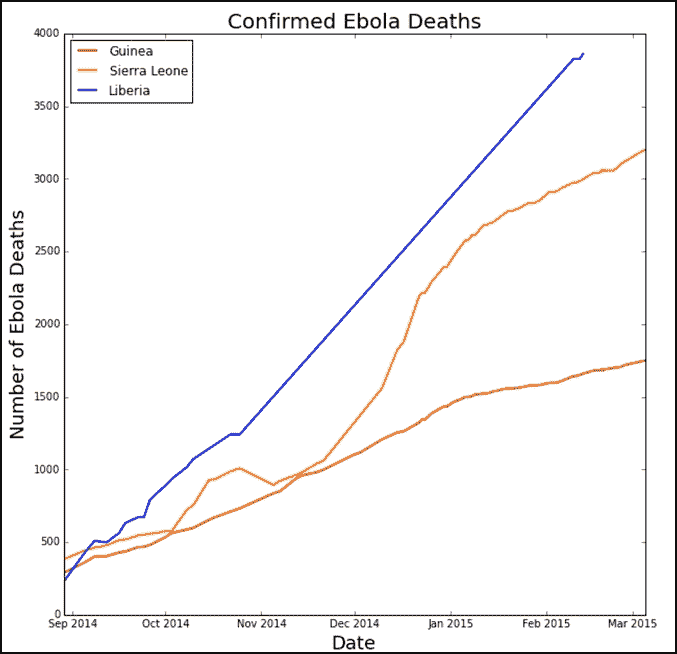

我们可以为另一个指标构建一个类似的图，即*累计确诊、疑似和疑似埃博拉死亡人数*。(这可能不是最好的方法，但我们可以纳入更多国家的数据，并绘制出类似的结果。)

```py
import matplotlib.pyplot as plt  
import csv 
import operator 
import datetime as dt  

with open('/Users/kvenkatr/python/ebola.csv', 'rt') as f: 
  filtereddata = [row for row in csv.reader(f) if row[3] != "0.0" and 
  row[3] != "0" and "deaths" in row[0]] 

sorteddata = sorted(filtereddata, key=operator.itemgetter(1))  

guineadata  = [row for row in sorteddata if row[1] == "Guinea" and 
  row[0] == "Cumulative number of confirmed, probable and suspected Ebola deaths"] 
sierradata  = [row for row in sorteddata if row[1] == "Sierra Leone" and 
  row[0] == " Cumulative number of confirmed, probable and suspected Ebola deaths "] 
liberiadata = [row for row in sorteddata if row[1] == "Liberia" and 
  row[0] == " Cumulative number of confirmed, probable and suspected Ebola deaths "] 

g_x = [dt.datetime.strptime(row[2], '%Y-%m-%d').date() for 
  row in guineadata] 
g_y = [row[3] for row in guineadata] 

s_x = [dt.datetime.strptime(row[2], '%Y-%m-%d').date() for 
  row in sierradata] 
s_y = [row[3] for row in sierradata] 

l_x = [dt.datetime.strptime(row[2], '%Y-%m-%d').date() for
  row in liberiadata] 
l_y = [row[3] for row in liberiadata] 

plt.figure(figsize=(10,10))
plt.plot(g_x,g_y, color='red', linewidth=2, label="Guinea") 
plt.plot(s_x,s_y, color='orange', linewidth=2, label="Sierra Leone")
plt.plot(l_x,l_y, color='blue', linewidth=2, label="Liberia")
plt.xlabel('Date', fontsize=18)
plt.ylabel('Number of Ebola Deaths', fontsize=18)
plt.title("Probable and Suspected Ebola Deaths", fontsize=20)
plt.legend(loc=2)
plt.show()
```

绘图应该是这样的:

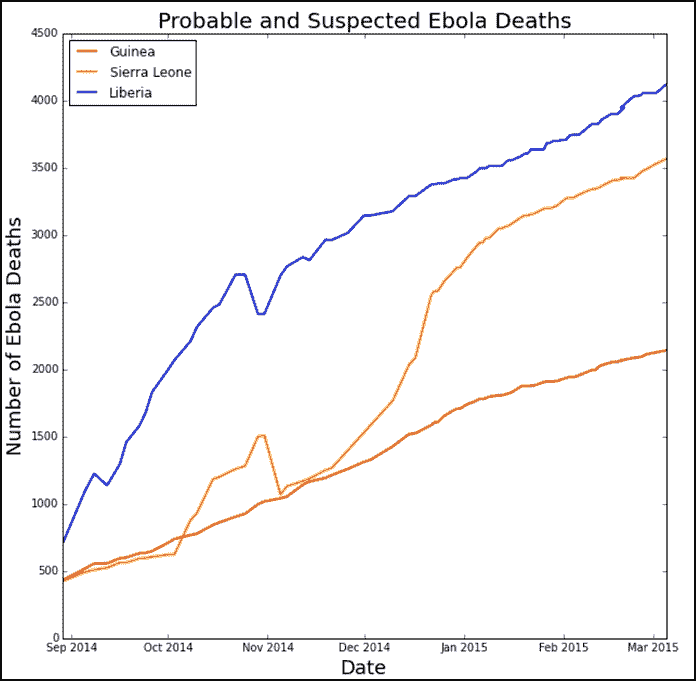

# 一个体育的例子

为了说明另一个例子，以及一个特定的可视化方法如何比另一个更好地工作，让我们考虑一个不同的问题:*截至 2015 年 2 月，美国足坛四分卫的前五大触球记录是什么？*这一数据的原始来源是美国橄榄球联盟的莱恩·道森和美国劳联统计。(数据来源:[http://www . pro-football-reference . com/players/D/dawsle00 . htm](http://www.pro-football-reference.com/players/D/DawsLe00.htm)。)

该数据包含了前 22 名四分卫的信息:培顿·曼宁、布雷特·法弗、丹·马里诺、德鲁·布里斯、汤姆·布拉迪、弗兰克·塔肯顿、约翰·埃尔韦、沃伦·穆恩、约翰·尤尼塔斯、文尼泰斯塔维尔达、乔·蒙塔纳、戴夫·Krieg、埃利·曼宁、桑尼·尤根森、丹·福茨、菲利普·里弗斯、本·罗瑟里斯伯格、德鲁·布莱索、布默·埃西森、约翰·哈德尔、蒂特尔和托尼·罗莫:

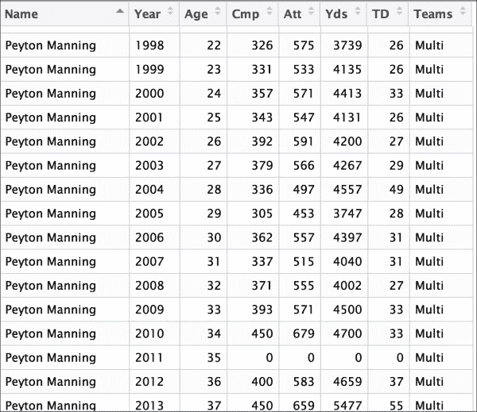

在我们想到可视化方法之前，需要做一点分析。这些四分卫在不同的时期打过球。例如，布雷特·法弗从 1991 年到 2010 年，丹·马里诺从 1983 年到 1999 年。挑战在于，如果我们使用条形图或气泡图，它们只会在一个维度上显示结果。

第一步是解析 CSV 文件，这里有几个选项。我们可以使用熊猫`read_csv`功能，也可以使用`csv`模块，该模块有一些方便的功能，例如`DictReader`:

```py
import csv 
import matplotlib.pyplot as plt

# csv has Name, Year, Age, Cmp, Att, Yds, TD, Teams
with open('/Users/MacBook/java/qb_data.csv') as csvfile: 
   reader = csv.DictReader(csvfile) 
   for row in reader:
     name  = row['Name']
     tds = row['TD']
```

四分卫数据是从本节前面列出的来源下载的；过滤后的数据也可在[http://www.knapdata.com/python/qb_data.csv](http://www.knapdata.com/python/qb_data.csv)获得。`csv`模块包括将行作为字典使用的类，以便可以命名字段。`DictReader`和`DictWriter`类将这些行翻译成字典，而不是列表。字典的关键字可以是传入的或从输入的第一行推断的(该行包含标题)。通过`DictReader`读取 CSV 文件的内容，其中列输入值被视为字符串:

```py
#ways to call DictReader

# if fieldnames are Name, Year, Age, Cmp, Att, Yds, TD, Teams
fieldnames = ['Name', 'Year', 'Age', 'Cmp', 'Att', 'Yds', 'TD', 'Teams'] 

reader = csv.DictReader(csvfile, fieldNames=fieldnames)
# If csv file has first row as Name, Year, Cmp, Att, Yds, TD, Teams
#   we don't need to define fieldnames, the reader automatically recognizes
#   them. 
```

为了将一些值转换成数字，我们可能需要一个转换并返回数值的函数。我们还在`prepare.py`中增加了`getcolors()``num()`等功能，可以在以后的例子中使用:

```py
# num(s) and getcolors() functions 
def num(s):
  try:
    return int(s)
  except ValueError:
    return 0  

def getcolors():
  colors = [(31, 119, 180), (255,0,0), (0,255,0), (148, 103, 189), (140, 86, 75), (218, 73, 174), (127, 127, 127), (140,140,26), (23, 190, 207), (65,200,100), (200, 65,100), (125,255,32), (32,32,198), (255,191,201), (172,191,201), (0,128,0), (244,130,150), (255, 127, 14), (128,128,0), (10,10,10), (44, 160, 44), (214, 39, 40), (206,206,216)]

  for i in range(len(colors)):
    r, g, b = colors[i]
    colors[i] = (r / 255\. , g / 255\. , b / 255.)
  return colors
```

## 直观地表示结果

根据输入数据中的字段名称，对于每个四分卫，他们的触地统计数据或传球码统计数据可以绘制在时间线上。现在我们知道要画什么了，下一步就是弄清楚怎么画。

简单的 *X-Y* 带场(年，触地)或(触地，年)的绘图应该是一个好的开始。然而，到目前为止，在这个输入数据文件中有 252 个四分卫，其中大多数是不相关的。因此，用不同的颜色展示它们是没有意义的。(为什么？我们有 252 种不同的颜色吗？)我们可以尝试绘制前 7 名或前 10 名的结果，如下图所示:

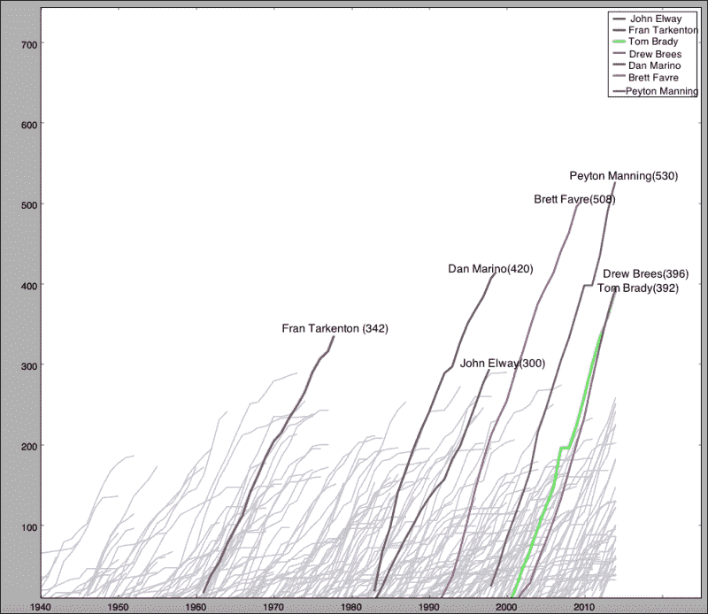

下面的 Python 程序演示了如何使用`matplotlib`根据触地次数显示前 10 名四分卫，该程序产生的图是上图所示的:

```py
import csv
import matplotlib.pyplot as plt

# The following functions can be in separate file 
#  (If it does, you need to import) 
def num(s):
  try:
    return int(s)
  except ValueError:
    return 0  

def getcolors():
  colors = [(31, 119, 180), (255,0,0), (0,255,0), (148, 103, 189), (140, 86, 75), (218, 73, 174), (127, 127, 127), (140,140,26), (23, 190, 207), (65,200,100), (200, 65,100), (125,255,32), (32,32,198), (255,191,201), (172,191,201), (0,128,0), (244,130,150), (255, 127, 14), (128,128,0), (10,10,10), (44, 160, 44), (214, 39, 40), (206,206,216)]

  for i in range(len(colors)):
    r, g, b = colors[i]
    colors[i] = (r / 255\. , g / 255\. , b / 255.)
  return colors

def getQbNames():
  qbnames = ['Peyton Manning']
  name=''
  i=0
  with open('/Users/MacBook/java/qb_data.csv') as csvfile:
    reader = csv.DictReader(csvfile)
    for row in reader:
      if ( row['Name'] != name and qbnames[i] != row['Name']):
        qbnames.append(row['Name'])
        i = i+1
  return qbnames

def readQbdata():
  resultdata = []
  with open('/Users/MacBook/java/qb_data.csv') as csvfile:
    reader = csv.DictReader(csvfile)
    resultdata = [row for row in reader]
  return resultdata

fdata=[]
prevysum=0

#    -- functions End -- 

qbnames = getQbNames()
fdata = readQbdata()

i=0
rank=0
prevysum=0
lastyr=0
highrank=244
colorsdata = getcolors() 

fig = plt.figure(figsize=(15,13))
ax=fig.add_subplot(111,axisbg='white')

# limits for TD
plt.ylim(10, 744) 
plt.xlim(1940, 2021)

colindex=0
lastage=20

for qbn in qbnames:
  x=[]
  y=[]
  prevysum=0
  for row in fdata: 
    if ( row['Name'] == qbn and row['Year'] != 'Career'):
      yrval = num(row['Year'])
      lastage = num(row['Age'])
      prevysum += num(row['TD'])
      lastyr = yrval
      x += [yrval]
      y += [prevysum]

  if ( rank > highrank):
    plt.plot(x,y, color=colorsdata[colindex], label=qbn, linewidth=2.5)
    plt.legend(loc=0, prop={'size':10}) 
    colindex = (colindex+1)%22
    plt.text(lastyr-1, prevysum+2, qbn+"("+str(prevysum)+"):" +str(lastage), fontsize=9)

  else:
    plt.plot(x,y, color=colorsdata[22], linewidth=1.5) 
    rank = rank +1 
plt.xlabel('Year', fontsize=18)
plt.ylabel('Cumulative Touch Downs', fontsize=18)
plt.title("Cumulative Touch Downs by Quarter Backs", fontsize=20)
plt.show() 
```

当绘图( *X，Y* )切换到( *Y，X* )时，有足够的空间显示四分卫的名字。在前面的代码片段中，我们可能需要进行以下更改:

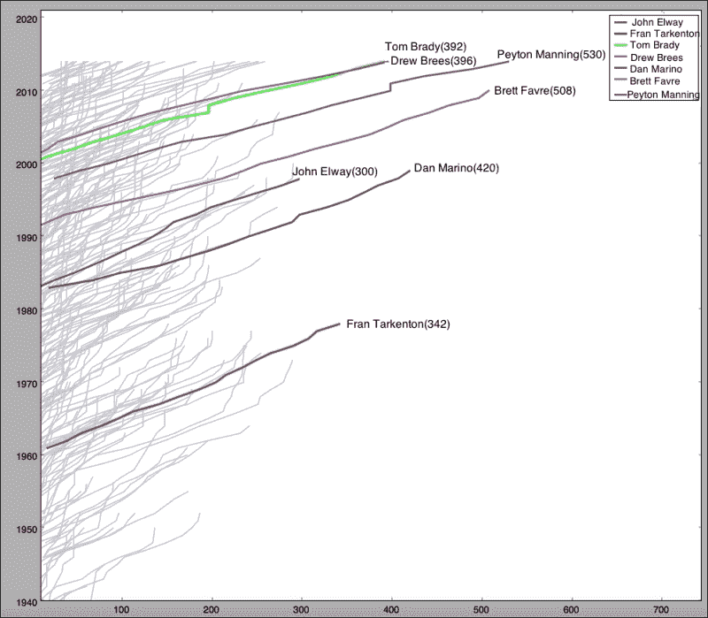

如果我们翻转 *x* 和 *y* 轴，那么就有更多的空间来显示四分卫的名字和总触地得分，如前面的图所示。要做到这一点，可能需要切换 *x* 和 *y* ，让标签文字按照新的 *x* 和 *y* 轴正确定位。

```py
plt.xlim(10, 744)  
plt.ylim(1940, 2021)

# remaining code all un-changed except

y += [num(row['Year'])]
x += [prevysum]

# Don't forget to switch the x,y co-ordinates of text display

plt.text(prevysum+2, lastyr-1, qbn+"("+str(prevysum)+"):" str(lastage), fontsize=9)
```

乍一看，我们只能分辨出职业生涯达阵得分数领先的四分卫(截至 2014-2015 足球赛季)。基于这种可视化，您可以进一步尝试分析和理解我们还可以从这些数据中推断出什么。这个问题的答案基于以下问题的答案:

*   哪个四分卫在他们的职业生涯中打得最久？
*   今天有谁能超越培顿·曼宁的触地得分记录吗？

在我们从输入文件中读取的字段中，`Age`恰好是我们拥有的字段值之一。有许多方法可以试验`Age`的起始值，用于绘制`Age`与`Touchdown`的统计数据。要回答第一个问题，我们必须跟踪`Age`而不是`Year`。以下代码片段可以在单独的函数中使用(如果必须经常使用的话)，也可以包含在主脚本中:

```py
maxage = 30

with open('/Users/MacBook/java/qb_data.csv') as csvfile:
  reader = csv.DictReader(csvfile)
    for row in reader:
      if ( num(row['Age']) > maxage ):
        maxage = num(row['Age']) 

print maxage 
```

运行前面的代码块显示`44`是四分卫的最大年龄(在联盟中活跃时，有三个这样的四分卫:沃伦·穆恩、维尼·泰斯特维德和史蒂夫·德伯格。技术上，乔治·布兰达一直打到了 48 岁(这是作为球员的最大年龄)，但他从四分卫开始，也是一名踢球的人(有些年了)。

为了回答另一个问题，我们根据四分卫年龄绘制了触地得分统计数据，如下所示:

```py
import csv
import matplotlib.pyplot as plt

# The following functions can be in a separate file
#    -- functions Begin -- 
def num(s):
  try:
    return int(s)
  except ValueError:
    return 0  

def getcolors():
  colors = [(31, 119, 180), (255,0,0), (0,255,0), (148, 103, 189), (140, 86, 75), (218, 73, 174), (127, 127, 127), (140,140,26), (23, 190, 207), (65,200,100), (200, 65,100), (125,255,32), (32,32,198), (255,191,201), (172,191,201), (0,128,0), (244,130,150), (255, 127, 14), (128,128,0), (10,10,10), (44, 160, 44), (214, 39, 40), (206,206,216)]

  for i in range(len(colors)):
    r, g, b = colors[i]
    colors[i] = (r / 255\. , g / 255\. , b / 255.)
  return colors

def getQbNames():
  qbnames = ['Peyton Manning']
  name=''
  i=0
  with open('/Users/MacBook/java/qb_data.csv') as csvfile:
    reader = csv.DictReader(csvfile)
    for row in reader:
      if ( row['Name'] != name and qbnames[i] != row['Name']):
        qbnames.append(row['Name'])
        i = i+1
  return qbnames

def readQbdata():
  resultdata = []
  with open('/Users/MacBook/java/qb_data.csv') as csvfile:
    reader = csv.DictReader(csvfile)
    resultdata = [row for row in reader]
  return resultdata

fdata=[]
prevysum=0

#    -- functions End -- 

qbnames = getQbNames()
fdata = readQbdata()

i=0
rank=0
prevysum=0
lastyr=0
highrank=244
colorsdata = getcolors() 

fig = plt.figure(figsize=(15,13))
ax=fig.add_subplot(111,axisbg='white')

# limits for TD
plt.ylim(10, 744)
#change xlimit to have age ranges 
plt.xlim(20, 50)

colindex=0
lastage=20

for qbn in qbnames:
  x=[]
  y=[]
  prevysum=0
  for row in fdata: 
    if ( row['Name'] == qbn and row['Year'] != 'Career'):
      yrval = num(row['Year'])
      lastage = num(row['Age'])
      prevysum += num(row['TD'])
      lastyr = yrval
      x += [lastage]
      y += [prevysum]

  if ( rank > highrank):
    if ( lastage == 44):
      plt.plot(x,y, color='red', label=qbn, linewidth=3.5)
    else:
      plt.plot(x,y, color=colorsdata[colindex], label=qbn, linewidth=2.5)
      plt.legend(loc=0, prop={'size':10}) 

    colindex = (colindex+1)%22
    plt.text(lastage-1, prevysum+2, qbn+"("+str(prevysum)+"):" +str(lastage), fontsize=9)

  else:
    if ( lastage == 44):
      plt.plot(x,y, color='red', label=qbn, linewidth=3.5)
      plt.text(lastage-1, prevysum+2, qbn+"("+str(prevysum)+"):" +str(lastage), fontsize=9)
    else:         
      plt.plot(x,y, color=colorsdata[22], linewidth=1.5) 
    rank = rank +1 

plt.xlabel('Age', fontsize=18)
plt.ylabel('Number of Touch Downs', fontsize=18)
plt.title("Touch Downs by Quarter Backs by Age", fontsize=20)
plt.show() 
```

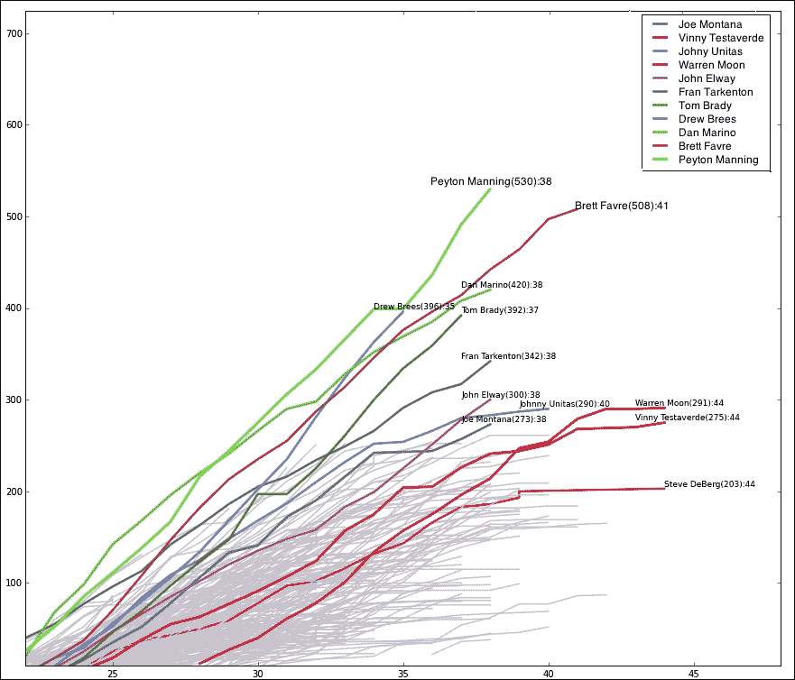

当你看一下标绘结果，只有两个四分卫的成绩能和 35 岁的培顿·曼宁相提并论，那就是德鲁·布里斯和汤姆·布拉迪。然而，考虑到汤姆·布拉迪目前的年龄和他迄今为止的成就，似乎只有德鲁·布里斯更有可能超越培顿·曼宁的触地得分记录。

下图显示了这一结论，并给出了基于 35 岁的简单数据图。对比前四名四分卫的成绩——培顿·曼宁、汤姆·布拉迪、德鲁·布里斯和布雷特·法弗——我们可以看到，德鲁·布里斯在 35 岁时的成就堪比佩顿在同样年龄时的成就。虽然《纽约时报》以标题*为题的文章《为什么培顿·曼宁的记录很难被打破》*得出了不同的结论，但以下绘图，至少是倾向于德鲁·布里斯可能打破记录的可能性:

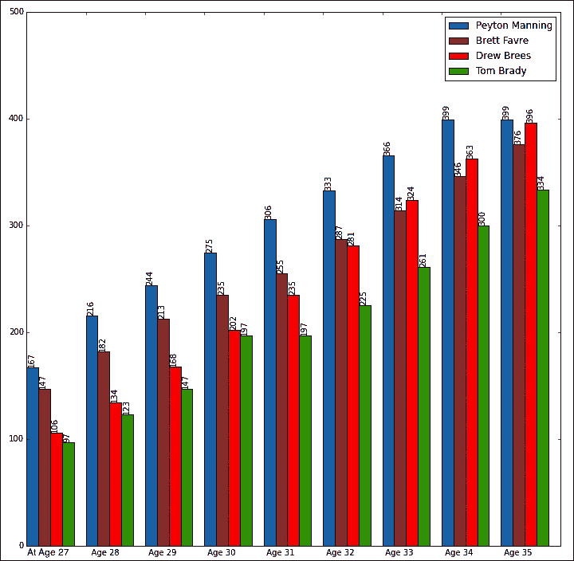

# 用数据创造有趣的故事

数据可视化定期提升其用数据揭示故事的能力，在某些情况下，可视化地揭示不那么琐碎的故事。在最近的过去，记者们一直在将可视化更多地融入他们的叙述中，这通常有助于我们更好地理解他们的故事。在商业世界中，很少有人能掌握数据如何与一个既能在情感上又能在智力上吸引观众的有意义的故事联系起来。正如拉迪亚德·吉卜林所写的那样，*如果历史是以故事的形式教授的，它将永远不会被忘记*；类似的想法也适用于数据。因此，我们应该明白，如果以正确的方式呈现，数据会被更好地理解和记住。

## 为什么故事如此重要？

我们今天有许多可视化的工具和方法:条形图和饼图、表格、折线图、气泡图、散点图等等，不胜枚举。然而，使用这些工具，重点是数据探索，而不是辅助叙述。虽然有可视化的例子确实有助于讲故事，但它们很少。这主要是因为找到故事比计算数字要困难得多。还有 **读者驱动的叙事**和**作者驱动的叙事**。

作者驱动的叙事具有由作者选择并呈现给公众读者的数据和可视化。另一方面，读者驱动的叙事为读者提供了玩数据的工具和方法，这给了读者更多的灵活性和选择来分析和理解可视化。

## 读者驱动的叙事

2010 年，斯坦福大学的研究人员研究并回顾了讲故事的新兴重要性，并为叙事可视化提出了一些设计策略。根据他们的研究，纯作者驱动的方法在可视化中有严格的线性路径，依赖于消息传递，并且没有交互性，而读者驱动的方法没有规定的图像排序，没有消息传递，并且具有高度的交互性。作者驱动方法的一个例子是幻灯片演示。该研究列出的七种可视化叙事包括杂志风格、标注图表、分区海报、流程图、连环画、幻灯片和一部电影/视频/动画。

### Gapminder

读者驱动的叙事与数据驱动的叙事相结合的一个经典例子是《Gapminder World》([http://gapminder.org/world](http://gapminder.org/world))。它收集了 600 多个国际经济、环境、卫生、技术等数据指标。它提供了学生可以用来研究现实世界问题和发现模式、趋势和相关性的工具。这是由 Trendalyzer 软件开发的，该软件最初由瑞典的汉斯·罗斯林基金会开发，后来在 2007 年 3 月被谷歌收购。

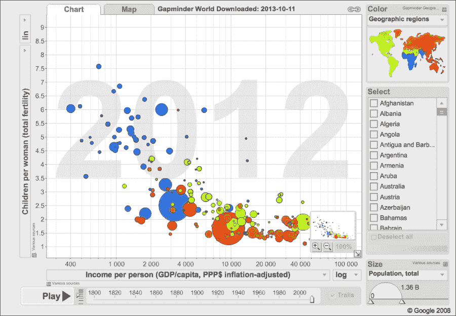

Gapminder 使用的信息可视化技术是一个交互式气泡图，默认设置为五个变量: *X* 、 *Y* 、气泡大小、颜色和一个由滑块控制的时间变量。这种滑动控制和对沿着 *X* 和 *Y* 轴的选择使其具有交互性。然而，创造一个故事，即使有这样的工具，也不一定容易。讲故事是一门手艺，可以成为一种有效的知识分享技巧，因为它比大多数其他交流方式更有效地传达了背景和情感内容。

最有魅力的说书人都明白理解观众的重要性。他们可能会给一个孩子和一个成年人讲同样的故事，但是发音会有所不同。同样，数据驱动或读者驱动的故事应该根据谁在听或研究它来调整。例如，对于高管来说，统计数据可能是关键，但商业智能经理最有可能对方法和技术感兴趣。

今天有很多 JavaScript 框架可以用来创建交互式可视化，最流行的是 D3.js，使用 Python，今天只有几种方法可以创建交互式可视化(不使用 Flash)。一种方法是生成 D3.js 可以用来绘图的 JSON 格式的数据，第二种选择是使用 Plotly([http://www . Plotly . ly](http://www.plot.ly))。我们将在这一章的最后一节更详细地讨论 Plotly。

### 国情咨文

推特根据奥巴马总统演讲期间的推文创建了一个可视化工具，可以根据位置和主题绘制推文。这种可视化很有趣，因为它在一个地方捕捉了很多细节。滚动演讲，看看推特的反应；发布在[http://twitter.github.io/interactive/sotu2015/#p1](http://twitter.github.io/interactive/sotu2015/#p1)。

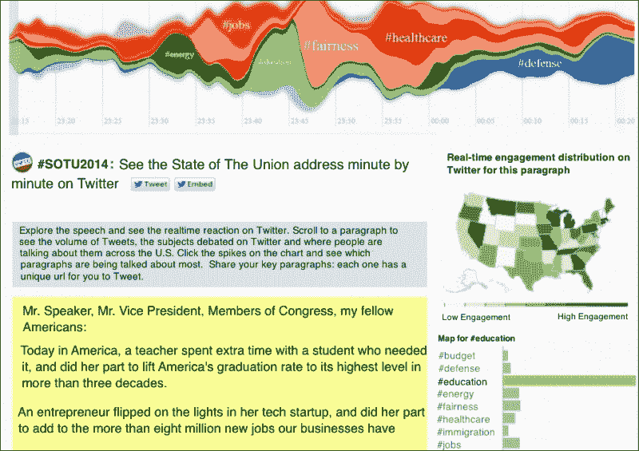

### 美国的死亡率

从 1968 年到 2010 年，美国的死亡率下降了大约 17%，这些年我们有详细的数据(来自 http://www.who.int/healthinfo/mortality_data/en/和 T2)。几乎所有这些进步都可以归因于男性生存前景的改善。看起来进步在 20 世纪 90 年代中期就停止了，但其中一个原因可能是从那以后人口老龄化了很多。人们可能会读到彭博对此的完整描述，但这里我们试图展示两个可视化:

*   1968-2010 年期间男性、女性和合计死亡率
*   死亡率为七个年龄组展示了一些有趣的结果

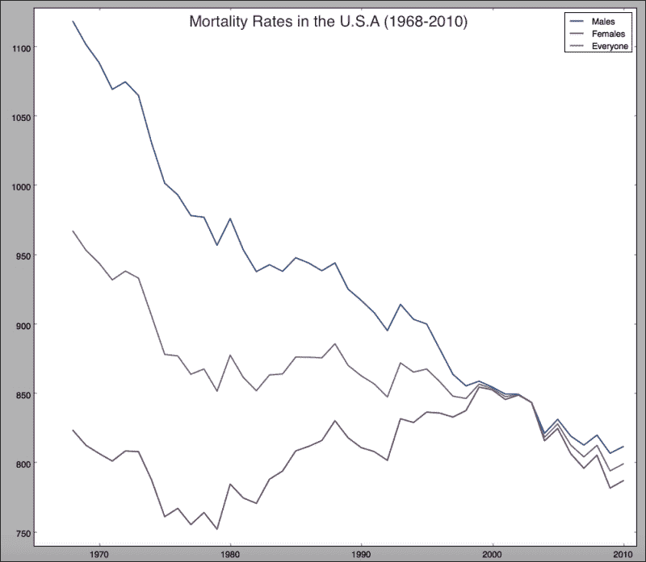

该示例的代码如下:

```py
import csv
import matplotlib.pyplot as plt

fig = plt.figure(figsize=(15,13))
plt.ylim(740,1128)
plt.xlim(1965,2011)
# Data from http://www.who.int/healthinfo/mortality_data/en/
with open('/Users/MacBook/Downloads/mortality1.csv') as csvfile:
  mortdata = [row for row in csv.DictReader(csvfile)]

x=[]
males_y=[]
females_y=[]
every_y=[]
yrval=1968
for row in mortdata:
  x += [yrval]
  males_y += [row['Males']]
  females_y += [row['Females']]
  every_y += [row['Everyone']]
  yrval = yrval + 1

plt.plot(x, males_y, color='#1a61c3', label='Males', linewidth=1.8)
plt.plot(x, females_y, color='#bc108d', label='Females', linewidth=1.8)
plt.plot(x, every_y, color='#747e8a', label='Everyone', linewidth=1.8)
plt.legend(loc=0, prop={'size':10})
plt.show()
```

死亡率是按每 10 万人计算的。通过将人口分成不同的年龄组，预期寿命的提高是持续的，尤其是 25 岁以下年龄组的进步最大。25-44 岁年龄组以下的人口到底发生了什么(红色显示)？关于彭博的叙述将另一个事实联系起来，很好地阐明了原因，即在此期间，艾滋病造成的死亡人数对该年龄组产生了影响。

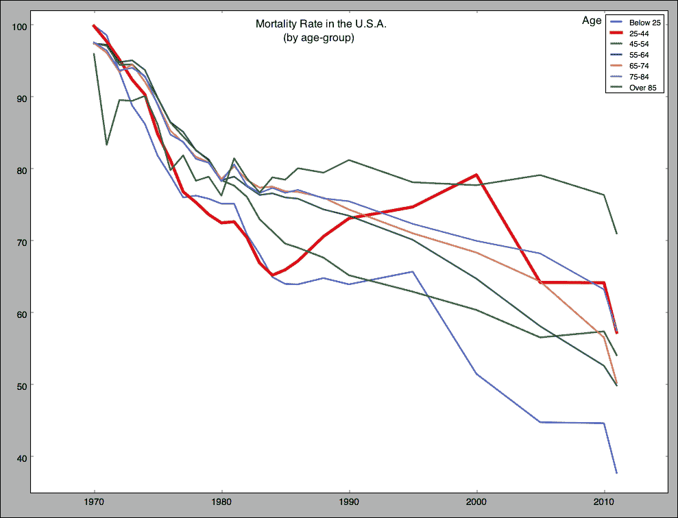

艾滋病每年夺去 4 万多名美国人的生命，其中 75%的人年龄在 25-44 岁之间。因此，不寻常的结果是在那个时间窗口看到的。

```py
import csv
import matplotlib.pyplot as plt

fig = plt.figure(figsize=(15,13))
plt.ylim(35,102)
plt.xlim(1965,2015)

colorsdata = ['#168cf8', '#ff0000', '#009f00', '#1d437c', '#eb912b', '#8663ec', '#38762b']
labeldata = ['Below 25', '25-44', '45-54', '55-64', '65-74', '75-84', 'Over 85']

# using reader() instead of DictReader() so that we could loop to 
# build y-values in list
with open('/Users/MacBook/Downloads/mortality2.csv') as csvfile:
  mortdata = [row for row in csv.reader(csvfile)]

x=[]
for row in mortdata:
  yrval = int(row[0])
  if ( yrval == 1969 ):
    y = [[row[1]],[row[2]],[row[3]],[row[4]],[row[5]],[row[6]],[row[7]]]
  else:
   for col in range(0,7):
     y[col] += [row[col+1]]
  x += [yrval]

for col in range(0,7):
  if ( col == 1 ):
    plt.plot(x, y[col], color=colorsdata[col], label=labeldata[col], linewidth=3.8)
  else:
    plt.plot(x, y[col], color=colorsdata[col], label=labeldata[col], linewidth=2)

plt.legend(loc=0, prop={'size':10})
plt.show()
```

`csv.reader()`和`csv.DictReader()`的区别在于，当输入的 CSV 文件有字段名(或列名)时，`DictReader()`使用字段名作为关键字，使用该列中的实际值作为数据值。在前面的例子中，我们使用了`reader()`，因为当涉及到循环时`( y[col] = [row[col+1]] )`会很方便。此外，对于`reader()`，如果 CSV 文件中存在列名，则应忽略第一行。

我们还将这两个示例的过滤数据作为`mortality1.csv`和`mortality2.csv`在[http://www.knapdata.com/python](http://www.knapdata.com/python)提供。

对于`mortdata[:4]`，每种阅读方法的结果都是不同的。换句话说，当我们使用`reader()`时`mortdata[:4]`的结果如下:

```py
[['1969', '100', '99.92', '97.51', '97.47', '97.54', '97.65', '96.04'],  ['1970', '98.63', '97.78', '97.16', '97.32', '96.2', '96.51', '83.4'],  ['1971', '93.53', '95.26', '94.52', '94.89', '93.53', '93.73', '89.63'],  ['1972', '88.86', '92.45', '94.58', '95.14', '94.55', '94.1', '89.51']] 
```

使用`DictReader()`，假设 CSV 文件有字段名，四行显示如下:

```py
[{'25-44': '99.92', '45-54': '97.51', '55-64': '97.47', '65-74': '97.54', '75-84': '97.65', 'Below 25': '100', 'Over 85': '96.04', 'Year': '1969'},
 {'25-44': '97.78', '45-54': '97.16', '55-64': '97.32', '65-74': '96.2', '75-84': '96.51', 'Below 25': '98.63', 'Over 85': '83.4', 'Year': '1970'},
 {'25-44': '95.26', '45-54': '94.52', '55-64': '94.89', '65-74': '93.53', '75-84': '93.73', 'Below 25': '93.53', 'Over 85': '89.63', 'Year': '1971'},
 {'25-44': '92.45', '45-54': '94.58', '55-64': '95.14', '65-74': '94.55', '75-84': '94.1', 'Below 25': '88.86', 'Over 85': '89.51', 'Year': '1972'}]
```

### 其他几个示例叙述

人们可以探索、想象、互动和玩耍的例子数不胜数。一些值得注意的问题如下:

*   **经济衰退如何重塑经济 255 图(纽约时报)**:这段叙述展示了在大衰退结束后的五年里，经济如何重新获得了失去的 900 万个工作岗位，突出了哪些行业比其他行业恢复得更快。(来源:[http://tinyurl.com/nwdp3pp](http://tinyurl.com/nwdp3pp)。)
*   **2013 年华盛顿奇才队的投篮明星(华盛顿邮报)**:这张互动图是几年前根据 2013 年华盛顿奇才队的表现而创作的，试图分析和看看签下保罗·皮尔思如何能够带来中距离投篮的大幅提升。(来源:[http://www . Washington post . com/WP-SRV/special/sports/wizard-shooting-star/](http://www.washingtonpost.com/wp-srv/special/sports/wizards-shooting-stars/)。)

## 作者驱动的叙事

*纽约**时报制作了一些世界上最好的数据可视化、多媒体和互动故事。他们对这些项目的抱负一直是在非常有声望的水平上达到新闻标准，并为读者创造真正新的体验。其中的讲故事文化是这部作品背后的能量来源之一。*

 *例如，有一个名为*也门混乱地理*的数据和作者驱动叙事的组合。2015 年 3 月 26 日，沙特阿拉伯喷气式飞机袭击了也门的目标，以打击胡塞叛军组织。也门对沙特阿拉伯、伊朗和美国等关键角色扮演着重要角色。《纽约时报》的作者们直观地捕捉到，胡塞武装的影响力在过去几年有所增长。

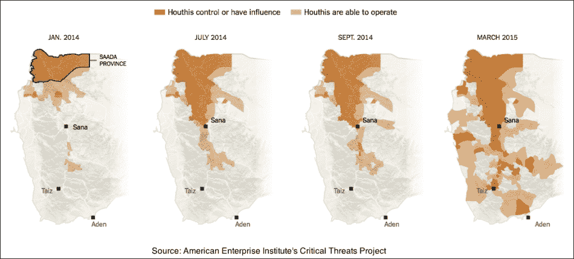

也门是基地组织在阿拉伯半岛最活跃的分支之一的所在地。自 2009 年以来，美国已经在也门进行了至少 100 次空袭。除了基地组织的占领之外，伊斯兰国在该地区也有活动，最近，他们声称对萨那两个什叶派清真寺的爆炸事件负责，这两起爆炸造成 135 多人死亡。以下可视化来自美国企业研究所关键威胁项目调查新闻局:

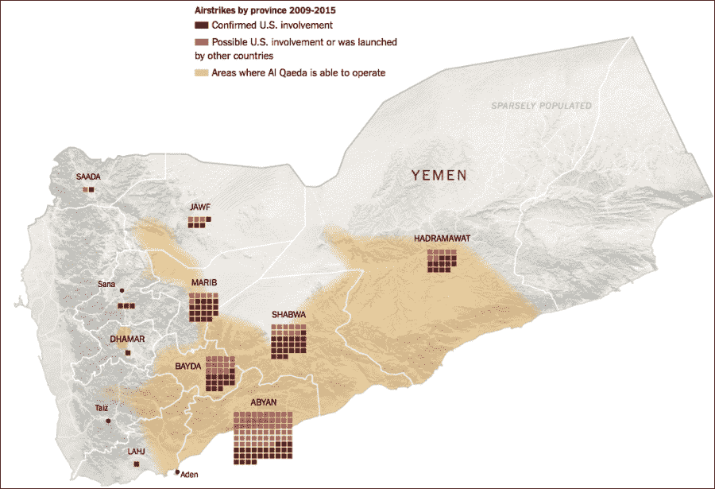

另一个很好的例子是大卫·麦坎德斯对大西洋过去的可视化，它展示了过度捕捞之前的海洋是什么样子。很难想象过度捕捞对海洋造成的损害。效果是看不见的，隐藏在海洋中。下图显示了 1900 年和 2000 年北大西洋中被广泛食用的鱼类的生物量。人们普遍食用的鱼类包括金枪鱼、鳕鱼、黑线鳕、鳕鱼、大比目鱼、鲱鱼、鲭鱼、鳕鱼、鲑鱼、海鳟鱼、条纹鲈鱼、鲟鱼和大菱鲆，其中许多现在都很脆弱或濒临灭绝。

不列颠哥伦比亚大学的维利·克里斯滕森博士和他的同事使用生态系统模型、水下地形图、鱼获记录和统计分析来呈现本世纪不同时期大西洋鱼类的生物量。

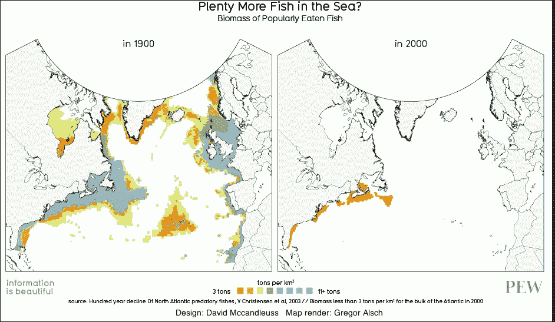

# 感知和呈现方法

在过去，数据的大小和种类并没有带来太大的挑战；因此，感知和分析数据很简单。今天，在无数的领域中有大量的数据，可视化可以为人类感知和交互数据的可视化提供有价值的帮助。人为因素对整个可视化过程有很大贡献，以便更好地理解数据并帮助决策任务。

可视化技术可以分为两个领域:

*   **科学** **可视化**:这涉及到具有内在物理实体的科学数据
*   **信息** **可视化**:这涉及到抽象数据(空间或非空间)

大多数可视化系统的设计都是为了让人类和计算机能够相互协作，各自执行以下任务:

*   直观地表示数据以增强数据分析
*   直观显示模型、数据解释、想法、假设和洞察力
*   帮助用户通过为他们的假设找到支持或矛盾的证据来改进他们的模型
*   帮助用户组织和分享他们的想法

对视觉感知的新见解来自于信息可视化之外的各个学科的工作，如人的因素和人机交互。数据可视化的最大优势之一是我们处理视觉信息的速度比语言信息快得多。20 世纪 20 年代，心理学家在德国研究知觉组织，第一批是格式塔理论家。

## 感知的格式塔原则

完形这个词的意思是“有组织的整体”，或者换句话说，当单独识别的部分对整体有不同的特征时。例如，为了描述一棵树，你可以说它有不同的部分，如树干、树叶、树枝、果实(在某些情况下)。然而，当我们看整棵树时，我们意识不到部分，而是意识到整个物体——在这种情况下，是树。

格式塔知觉的原理如下:

*   **Proximity**: Objects that are close together or connected to each other are perceived as a group, reducing the need to process smaller objects separately.

    

*   **Similarity**: Objects that share similar attributes, color, or shape are perceived as a group.

    

*   **Common fate**: When both the principles of proximity and similarity are in place, a movement takes place. Then they appear to change grouping.

    

*   **Good continuation**: Some things are important as a whole, which means if there are interruptions, then it changes the perceptive reading. In the following image, we perceive the two crossed lines instead of four lines meeting at the center:

    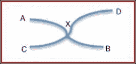

*   **Closure**: Even if a part of the border of a shape is missing, we still tend to see the shape as completely enclosed by the border and ignore the gaps.

    

了解这些原则对于创建任何可视化方法都非常有用。

让我们用一个例子来进一步阐述。邻近是指如果形状看起来彼此相似，则将形状分组在一起的视觉方法。这样的群体通常被视为一个单一的单位。例如，下图显示了如何区分邻近关系:


# 可视化的一些最佳实践

第一个重要的步骤是知道努力背后的目标是什么。如何知道可视化是否有目的？了解观众是谁以及这将如何帮助他们也非常重要。

一旦知道了这些问题的答案，并且很好地理解了可视化的目的，下一个挑战就是选择正确的方法来呈现它。最常用的可视化类型可以根据以下内容进一步分类:

*   比较和排名
*   相互关系
*   分配
*   特定位置或地理数据
*   部分到整体的关系
*   趋势随着时间的推移

## 对比排名

比较和排名可以有多种方式，但是传统的方式是使用条形图。条形图被认为是将数量值编码为同一基线上的长度。然而，这并不总是显示比较和排名的最佳方式。例如，要显示非洲国内生产总值排名前 12 的国家，以下演示是一种创造性的可视化方式(礼貌: *Stats Legend，Andrew Gelman 和 Antony Unwin* ):

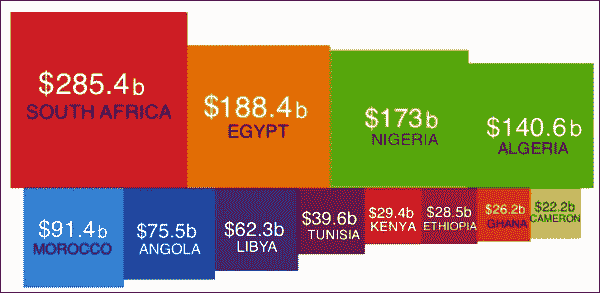

## 相关性

一个简单的相关性分析是一个很好的开始来识别测量之间的关系，虽然相关性不能保证关系。为了确认这种关系确实存在，通常需要一种统计方法。下面是一个构建简单散点图来检测两个因素之间的相关性的示例，比如某大学学生中的`gpa`和`tv`或`gpa`和`exercise`:

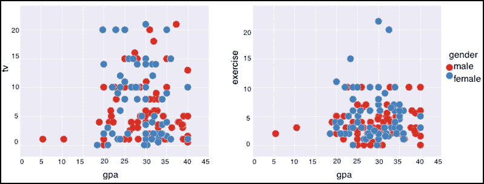

但是，我们可以使用其他方式来显示相关矩阵。例如，可以使用散点图、热图或一些特定的例子来显示 S&P 100 指数股票之间的影响网络。(以下两幅图取自[http://www.sthda.com](http://www.sthda.com)高通量分析统计工具。)为了进一步强调，一个相关矩阵包含矩阵形式的数据。数据通过使用缩放的颜色映射进行关联，如下例所示。更多详情，建议您参考网站:[http://www.sthda.com](http://www.sthda.com)。

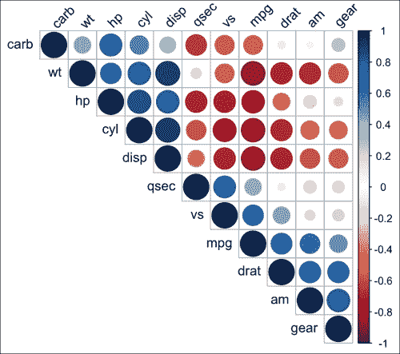

相关矩阵用于同时研究多个变量之间的相关性。结果是一个包含每个变量和其他变量之间的相关系数的表。热图起源于 2D 在数据矩阵中显示值。有许多不同的配色方案可以用来说明热图，每个方案都有感知上的优点和缺点。

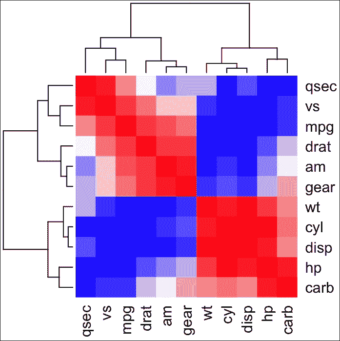

## 分布

分布分析显示了定量值在它们的范围内是如何分布的，因此在数据分析中非常有用。例如，比较一个班学生的期中、期末考试和课程总成绩的家庭作业的等级分布。在本例中，我们将讨论两种最常用的图表类型。一个是 **直方图**(如下图所示)，另一个是**方块** **图**或 **方块触须**图。

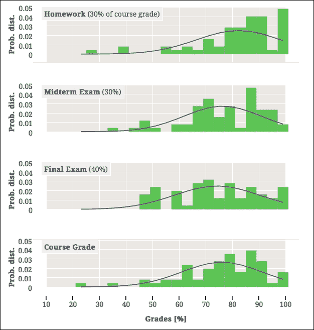

直方图的形状很大程度上取决于指定的面元大小和位置。盒须图非常适合显示多种分布。他们把所有的数据点——在这种情况下是每个学生的分数——打包到一个触须显示器中。现在，您可以轻松地识别所有类别中的低值、第 25 百分位值、中间值、第 75 百分位值和最大值，所有这些都是同时进行的。

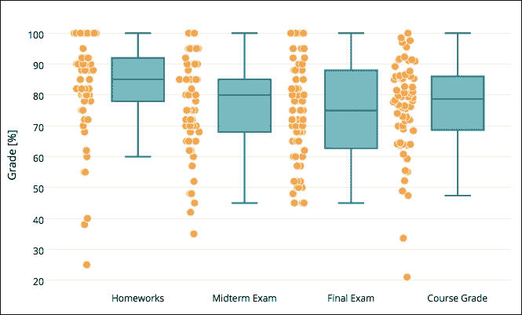

在 Python 中方便地绘制这些图的方法之一是使用 Plotly，这是一种在线分析和可视化工具。Plotly 为 Python、R、Julia 和 JavaScript 提供在线绘图、分析和统计工具以及科学绘图库。直方图和盒须图的例子，参考[https://plot.ly/python/histograms-and-box-plots-tutorial](https://plot.ly/python/histograms-and-box-plots-tutorial)。

## 特定位置或地理数据

地图是显示特定位置数据的最佳方式。当地图与另一个详细说明地图显示内容的图表(如从大到小排序的条形图、显示趋势的折线图等)配对时，使用地图最为合适。例如，下图显示了各大洲地震的强度对比:

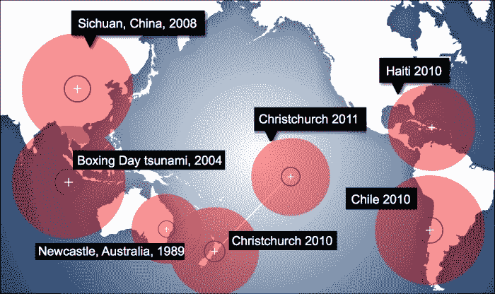

## 部分对整体的关系

饼图是显示部分到整体关系的常用工具，但也有其他方法。分组条形图有利于将类别中的每个元素与其他元素进行比较，也有利于跨类别比较元素。然而，分组使得区分每组总数之间的差异变得更加困难。这就是堆叠柱形图的由来。

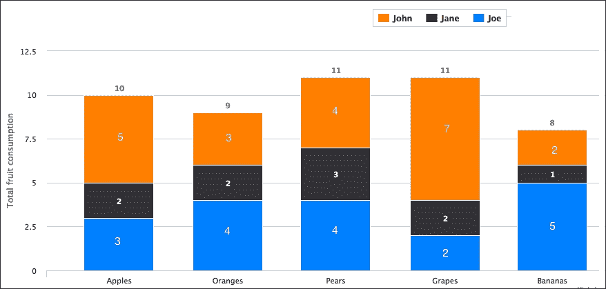

堆叠柱形图非常适合显示总数，因为它们直观地将所有类别聚集在一个组中。不利的一面是，比较各个类别的规模变得更加困难。堆叠也表示部分到整体的关系。

## 一段时间内的趋势

分析数据最常用的可视化方法之一是显示一段时间内的趋势。在下面的例子中，绘制了 2009-2015 年对可穿戴设备初创公司的投资。说明可穿戴设备的投资几年来一直在上升；2014 年的交易活动如火如荼，有 61 笔交易完成，总价值 4.27 亿美元，而 2013 年(仅一年前)只有 43 笔交易价值 1.66 亿美元。

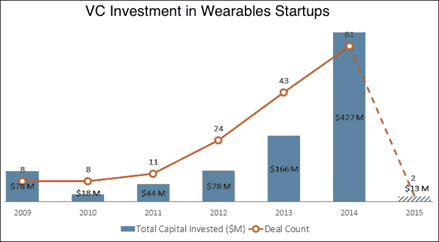

有了这个观察，看看未来几年市场如何演变将会很有趣。

# Python 中的可视化工具

分析和可视化数据需要几个软件工具:编写代码的文本编辑器(最好是语法高亮显示的)、运行和测试代码的 Python 和附加库，或许还有呈现结果的工具。软件工具分为两类:通用软件工具和特定软件组件。

## 开发工具

通用软件工具是一个**集成开发环境** ( **IDE** )，它是一个应用，在一个包中拥有所有的生产力工具。从处理 Python 库的角度来看，这些 ide 通常非常方便。关于这些集成开发环境工具的更多细节将在下一章中讨论。在这一章中，我们将把我们的讨论限制在对来自 Enthought】的*树冠和来自 Continuum Analytics* 的*蟒蛇的简单介绍。*

具体软件组件有`Bokeh`、`IPython`、`matplotlib`、`NetworkX`、`SciPy`、`NumPy`、`Scikit-learn`、`Seaborn`等 Python 绘图库。这两个 ide 都有一个非常方便的方法来处理这些绘图库的添加、删除和更新。

### 来自恩思的树冠

entorn Canopy 有一个免费版本，是在 BSD 风格的许可下发布的，除了其他几个库之外，还附带了作为绘图工具的 **GraphCanvas** 、 **SciMath** 和 **Chaco** 。它拥有高级文本编辑器、集成的 IPython 控制台、图形包管理器和在线文档链接。Canopy 分析环境简化了科学家、工程师和分析师的数据分析、可视化、算法设计和应用开发。

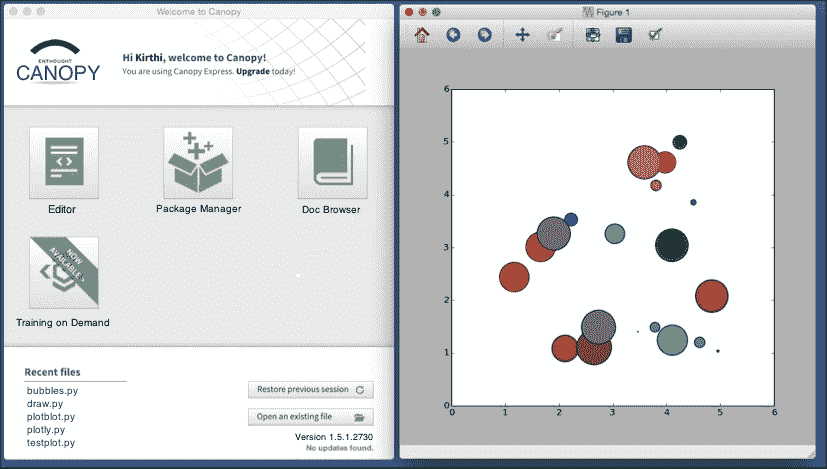

### 来自连续体分析的蟒蛇

Anaconda IDE 基于 conda 应用。Conda 是一个用于查找和安装软件包的应用。conda 包是包含系统级库、Python 模块、可执行程序或其他组件的二进制 tarball。Conda 跟踪包和平台细节之间的依赖关系，使得从不同的包集合创建工作环境变得简单。

Anaconda 有 **sypder-app** ，一个科学的 Python 开发环境，也有一个 IPython 查看器。除此之外，IPython 还可以作为图形用户界面或基于网络的笔记本推出。最方便的是可以在主目录中安装 Python，而不需要触碰系统安装的 Python。到目前为止，并不是所有的包都准备好使用 Python 3；因此，最好将 Python 2 与这些 ide 一起使用。

IPython([)http://ipython.scipy.org/](http://ipython.scipy.org/))提供了一个增强的、交互式的 Python 外壳，并且强烈推荐主要是因为数据分析和可视化本质上是交互式的。大多数平台都支持 IPython。IPython 附带的一些附加功能如下:

*   **选项卡完成**:这包括变量、函数、方法、属性和文件名的完成。标签完成是通过 GNU Readline 库([http://tiswww.case.edu/php/chet/readline/rltop.html](http://tiswww.case.edu/php/chet/readline/rltop.html))实现的，非常上瘾。在接触到 GNU Readline 之后，很难回到常规的命令行界面。
*   **命令历史功能**:这将发布之前使用的命令的完整记录的命令历史。

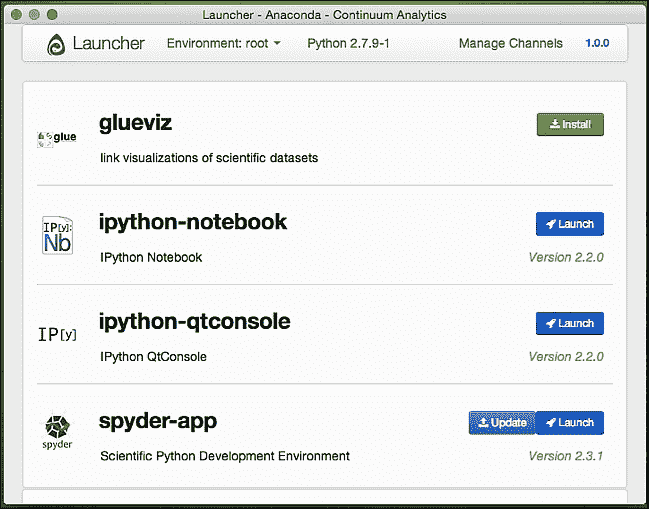

# 交互可视化

要使可视化被认为是交互式的，它必须满足两个标准:

*   **人类输入**:对信息的视觉表示的某些方面的控制必须对人类可用
*   **响应时间**:人类做出的改变必须及时融入可视化

当必须处理大量数据来创建可视化时，这变得非常困难，有时是不可能的，即使以当前的技术；因此，“交互式可视化”通常应用于在输入几秒钟内向用户提供反馈的系统。许多交互式可视化系统支持导航隐喻，类似于通过物理世界的导航。

互动的好处是，人们可以在更短的时间内探索更大的信息空间，这可以通过一个平台来理解。然而，这种交互的一个缺点是，它需要大量时间来彻底检查每一种可能性，以测试可视化系统。此外，设计系统以保证对用户行为的即时响应可能需要大量的算法关注。

任何可视化方法都需要良好的布局规划。一些布局方法会自动生成对称的图形；或者，一些绘图方法从发现数据的对称性开始。交互式可视化是使用事件侦听器实现的，对一些人来说，这是众所周知的常识，但无论如何，下面的部分描述了它的全部内容。

## 事件监听器

事件监听器是当鼠标被移动或点击时使用的过程。技术上，事件有很多种，但纯粹为了交互可视化，你只需要知道当用户用鼠标在可视化中导航时会发生什么。交互的延迟，也就是系统响应鼠标动作的时间，非常重要。

最显而易见的原则是，用户确实应该有某种动作已经完成的确认，而不是被悬着不知道动作是否还在进行。因此，诸如突出显示选定项目的反馈是确认所需操作已成功完成的好方法。视觉反馈通常应该发生在大约一秒钟的即时反应等待时间内。以下是谷歌图表中的一个 JavaScript 事件监听器示例:

```py
chart = new google.visualization.PieChart(document.getElementById( 'chart_div'));
google.visualization.events.addListener(chart, 'select', selectHandler);
chart.draw(data, options);

function selectHandler() {
  var selectedItem = chart.getSelection()[0];
  var value = data.getValue(selectedItem.row, 0);
  alert('The user selected ' + value);
}
```

另一个原则是，如果一个动作花费的时间比用户自然预期的要长得多，那么应该向用户显示某种进度指示器。用 JavaScript 编写事件侦听器要容易得多，但是为了使用用 Python 编写的绘图方法创建交互式可视化，应该使用 Plotly。

还有另一个模块，**图形工具**([https://graph-tool . skill . de](https://graph-tool.skewed.de))，可以用来以直接的方式执行动画。它使用 GTK+在交互窗口和屏幕外显示动画到文件。这个想法是为了容易地生成可视化，可以用于演示和嵌入网站。

## 布局

为了直观高效地显示数据，了解布局方法非常重要。美学是衡量布局算法优劣的标准之一。为了使布局结果更易读，如果可能的话，结构需要有层次或对称；一个关键因素是空间的利用。

一个好的布局是解开和理解任何图形的关键。一般来说，为了更好地理解，每种布局都特别适合不同类型的数据可视化。一些值得注意的布局方法如下:

*   圆形布局
*   放射状布局
*   气球布局

### 圆形布局

表格是数据的天然容器。每当信息被呈现时，通过表格呈现的机会非常高。然而，在许多情况下，当这些信息很复杂(因此表格很大)时，表格表示很难直观地解析，表格数据中的模式仍然不透明。

换句话说，有用的容器并不总是呈现数据的有用方式。该表很好地呈现了单个数据，但是它们之间的相互关系以及它们组成的模式几乎不可见。圆形布局可以使用几种不同的组合(定性和定量)在单个可视化中显示，如下图所示:

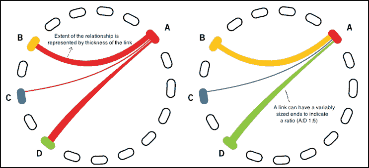

例如，如上图所示，在有限的空间内显示复杂的关系是很直观的。

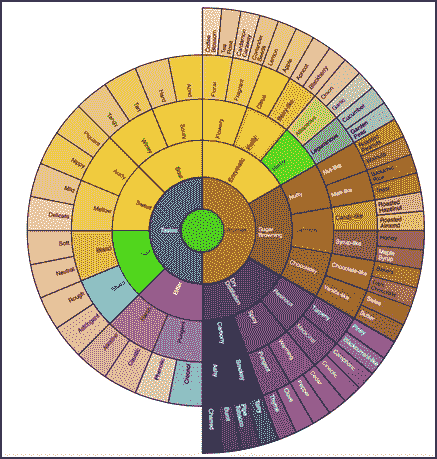

上图显示了以圆形布局显示的复杂层次关系的示例。

### 放射状布局

Sunburst 可视化是一种用于显示树状结构的径向空间填充可视化技术(如上图所示)。还有其他填充空间的可视化方法，使用其他可视化编码来描述层次结构。例如，树形图是一种空间填充可视化，它使用“包含”来显示“父子”关系。有几个微妙的变化可以改善这种可视化传达信息的方式。

由于每个轨道的长度随着半径的增加而增加，因此节点的空间往往更大。随着层级的增加，径向树会将更多的节点分布在更大的区域。

### 气球布局

气球布局有不同的变化，人们甚至可以将它们视为气泡。但是，如果我们使用不同颜色和大小的气球(或圆圈/气泡)，在这个可视化中可以显示更多，如下图所示:

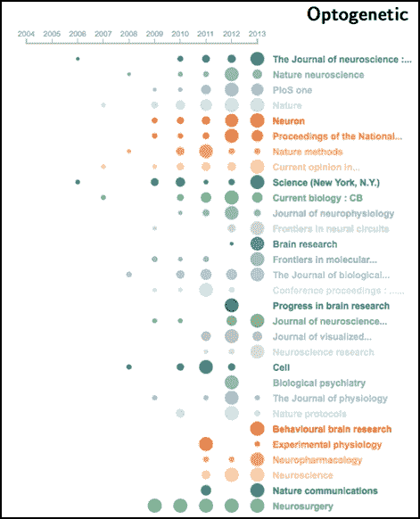

# 总结

可视化方法的原则对于创建一个有效的故事是有用的。本章解释的叙述给出了美学的概念和方法的巨大变化。

数据可视化的目标是通过所选择的可视化显示方法，向用户清晰有效地传达信息。有效的可视化有助于分析和推理数据和证据。它使复杂的数据更易于访问、理解和使用。用户可能有特定的分析任务，如进行比较或理解因果关系，图形的设计原则遵循任务。

表通常用于用户查找变量的特定度量，而各种类型的图表用于显示一个或多个变量的数据模式或关系。

数据可视化既是一门艺术，也是一门科学，就像解决一个数学问题。没有一个正确的方法来解决它。同样，没有一种正确的方法来创建可视化方法。可视化工具有很多，我们知道一些支持 Python 的工具。在下一章中，将讨论关于这些工具的更多细节。*