# 三、Python 集成开发环境入门

Python 是一种广泛使用的编程语言，已经存在了 20 多年。在许多其他东西中，这种语言因其简单性和动态类型而非常受欢迎。*类型(基准)*动态确定数据对象的类型。它有一个语法，允许程序员写很少的代码行。Python 支持多种编程范例，包括函数式、面向对象和过程式。

Python 解释器可以在几乎所有正在使用的操作系统上使用。它的内置数据结构与动态绑定相结合，使得它作为一种高性能语言来快速连接现有的操作组件非常有吸引力。即使在分布式应用中，Python 也作为粘合剂与 Hive (NoSQL)一起使用，以非常快速和高效地完成一些事情。Python 功能强大，在软件开发社区中很受欢迎，它需要一个交互式环境来创建、编辑、测试、调试和运行程序。

一个 **集成开发环境** ( **IDE** )是一个软件应用，它提供了一套全面而强大的工具来为运行 Windows、Linux 或 Mac OS 操作系统的目标系统构建应用。这些工具提供单一且一致的集成环境，旨在最大限度地提高工作效率。Python 编程的 IDE 有很多选择。细节将在本章的下一节讨论。此外，我们将讨论以下主题:

*   Python 中的集成开发环境工具
*   安装指南—下载和安装工具的说明
*   conda **命令行界面** ( **CLI** )和 Spyder
*   IDE 工具中的数据可视化工具是特定于对可视化有用的库的
*   交互式可视化包
*   使用集成开发环境工具的一些绘图示例

# Python 中的 IDE 工具

分析和可视化数据需要几个软件工具:一个编写代码的文本编辑器(最好是语法高亮显示)，运行和测试代码的附加工具和库，也许还有另一套呈现结果的工具。集成开发环境有许多优点。一些值得注意的问题如下:

*   语法高亮显示(立即显示错误或警告)
*   在调试模式下单步执行代码
*   交互式控制台
*   与交互式图形笔记本(如 IPython)的集成

## Python 3.x 对比 Python 2.7

Python 3.x 与 2.x 版本不向后兼容。这就是为什么 Python 2.7 仍在使用的原因。在本书中，我们将使用 Python 2.7，尽量不要将重点放在 Python 3.x 上，这个问题超出了本书的范围，建议您搜索如何编写适用于不同版本的代码的信息。一些 IDE 工具有使用这两个版本的具体说明。在某些情况下，代码的编写可能会有所不同。

## 交互工具的类型

在进一步讨论 Python IDEs 的之前，考虑显示交互式数据可视化的不同方式是很重要的。创建交互式数据可视化有许多选项，但在这里，我们将只考虑两种流行的工具来实现这一点:

*   伊普提洪伊普提翁伊普提翁伊普提翁伊普提翁伊普提翁伊普提翁伊普提翁伊普提翁伊普提翁伊普提翁伊普提翁
*   阴谋地

### IPython

2001 年，Fernando Perez 开始致力于 IPython，这是一个增强的交互式 Python shell，具有一些改进，例如历史缓存、配置文件、对象信息和会话日志记录。最初专注于 Python 中的交互计算，后来包括 Julia、R、Ruby 等等。一些特性——比如自动添加括号和完成标签——非常省时，并且在可用性方面非常有效。在标准 Python 中，要完成选项卡，您必须导入几个模块，而 IPython 默认提供选项卡完成。

IPython 为 Python 脚本编写提供了以下丰富的工具集:

*   方便的终端命令和基于 Qt 的工具
*   纯基于网络的笔记本电脑的交互环境，具有与独立笔记本电脑相同的核心功能；它还支持代码、文本、数学表达式和内联图
*   方便的交互式数据可视化；这种能力是许多 ide 集成支持 IPython 的原因
*   易于使用的高性能多处理计算工具

对 IPython 最有帮助的四个命令及其简要描述:

<colgroup><col style="text-align: left"> <col style="text-align: left"></colgroup> 
| 

命令

 | 

描述

 |
| --- | --- |
| `?` | 这指定了 IPython 特性的介绍和概述 |
| `%quickref` | 这表示快速参考 |
| `--help-all` | 这指定了 Python 的帮助 |
| `%who/%whos` | 这给出了关于标识符的信息 |

IPython 笔记本是一个基于网络的交互式计算环境。在这里，您可以将代码、数学和绘图合并到一个文档中。

IPython([http://ipython.scipy.org/](http://ipython.scipy.org/))提供了一个增强的交互式 Python 外壳，强烈推荐，主要是因为数据分析和可视化本质上是交互式的。大多数平台都支持 IPython。IPython 附带的一些附加功能包括:

*   **选项卡完成**:这包括变量、函数、方法、属性和文件名的完成。标签完成是使用 GNU Readline 库([http://tiswww.case.edu/php/chet/readline/rltop.html](http://tiswww.case.edu/php/chet/readline/rltop.html))实现的。在接触到 GNU Readline 之后，很难回到常规的命令行界面。
*   **命令历史功能**:这将发布以前使用的命令的完整记录的命令历史。

在 IPython 上运行的一个示例如下图所示。要了解更多关于 IPython 和 IPython 笔记本的信息，请参考[http://nbviewer.ipython.org](http://nbviewer.ipython.org)。

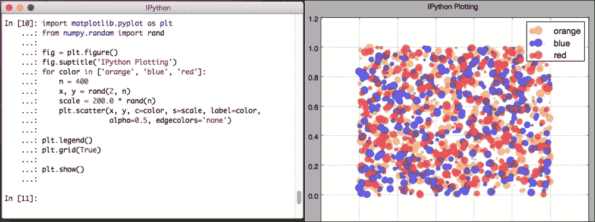

### 绘图

Plotly 是一个在线分析和数据可视化工具，提供在线绘图、分析和统计工具，以实现更好的协作。该工具使用 Python 构建，用户界面使用 JavaScript，可视化库使用 D3.js、HTML 和 CSS。Plotly 包括许多语言的科学图形库，如 Arduino、Julia、MATLAB、Perl、Python 和 r .有关 Plotly 的示例来源，请参考[https://Plotly . ly/~ etpinard/84/fig-31a-Hans-roslings-bubble-chart-For-year-2007/](https://plot.ly/~etpinard/84/fig-31a-hans-roslings-bubble-chart-for-the-year-2007/)。

以下是显示全球人均国内生产总值的臭名昭著的泡沫图例子。

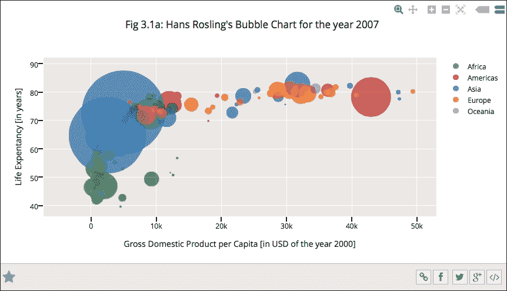

Plotly 提供了一种方便的方式将绘图从`matplotlib`转换为 Plotly，如以下代码所示(假设您有一个 Plotly 帐户并使用您的凭据登录):

```py
import plotly.plotly as py
import matplotlib.pyplot as plt
#auto sign-in with credentials or use py.sign_in()
mpl_fig_obj = plt.figure()
#code for creating matplotlib plot
py.plot_mpl(mpl_fig_obj)
```

## Python IDE 的类型

以下是目前流行的一些 Python IDEs:

*   **PyCharm** :这指定了基于 Java Swing 的用户界面
*   **PyDev** :表示基于 SWT 的用户界面(在 Eclipse 上工作)
*   **互动编辑为** **巨蟒** ( **IEP** )
*   **来自恩思的天篷**:这个是基于 PyQt 的
*   连续分析公司 Spyder 的分布图(T4):这也是基于 PyQt

### 皮卡姆

PyCharm 是为数不多的有很大特色的热门 ide 之一，社区版是免费的。PyCharm 4.0.6 社区版是当前版本，可在[https://www.jetbrains.com/pycharm/download](https://www.jetbrains.com/pycharm/download)免费下载。他们有快捷方式参考卡可用于苹果电脑，Linux 和视窗系统。佩德罗·克罗格博士在[http://pedrokroger.net/getting-started-pycharm-python-ide/](http://pedrokroger.net/getting-started-pycharm-python-ide/)写了一篇关于 PyCharm 的详细描述。您可以参考此链接了解更多详细信息。在许多有趣的特性中，代码向导和 NumPy 数组查看器显示在下面的屏幕截图中:

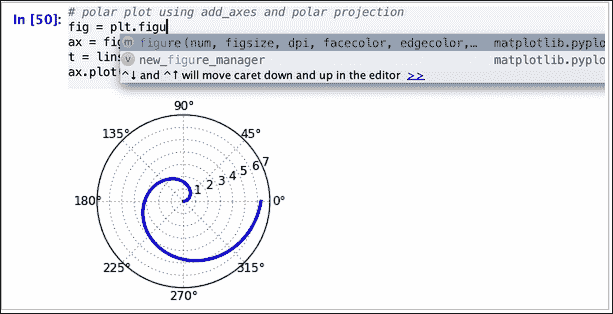

极坐标投影可以快速完成，如前面的截图所示，随机样本数组的创建如下面的截图所示:

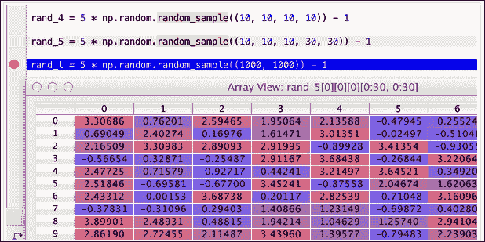

类似的随机样本在不同的 IDE(如 Spyder)中创建；下面是一个的例子:

```py
rand_4 = np.random.random_sample((2,2,2,2))-1  
array([[[[-0.6565232 , -0.2920045 ],
[-0.45976502, -0.70469325]],
[[-0.80218558, -0.77538009],
[-0.34687551, -0.42498698]]],
[[[-0.60869175, -0.9553122 ], 
[-0.05888953, -0.70585856]], 
[[-0.69856656, -0.21664848],
[-0.29017137, -0.61972867]]]])
```

### PyDev

PyDev 是 Eclipse IDE 的一个插件。换句话说，Eclipse 的插件足以利用普通集成开发环境可能具有的其他默认功能，而不是创建一个新的集成开发环境。PyDev 支持代码重构、图形调试、交互控制台、代码分析和代码折叠。

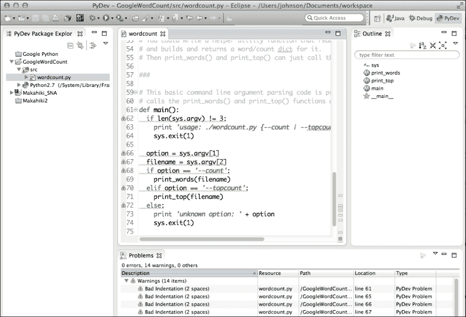

您可以安装 PyDev 作为 Eclipse 的插件，或者安装 LiClipse，一个高级的 Eclipse 发行版。LiClipse 不仅增加了对 Python 的支持，还增加了对 CoffeeScript、JavaScript、Django 模板等语言的支持。

PyDev 预装在 LiClipse 中，但需要先安装 Java 7。完整安装步骤可参考[http://pydev.org/manual_101_install.html](http://pydev.org/manual_101_install.html)。

### Python 交互编辑器(IEP)

IEP 是另一个 Python IDE，它拥有其他 IDE 中可用的类似工具，但看起来与您可能在微软 Windows 上使用的任何工具相似。

IEP 是一个跨平台的 Python IDE，旨在交互性和自省性，这使得它非常适合科学计算。它的实用设计旨在简单高效。

IEP 由两个主要的组件组成，编辑器和外壳，并使用一组可插拔工具以各种方式帮助程序员。一些示例工具是源结构、项目管理器、交互式帮助和工作区。一些关键特性如下:

*   像任何现代 IDE 一样进行代码自省
*   要么从命令行运行 Python 脚本，要么通过文件或 IPython 界面交互运行
*   Shells 作为后台进程运行
*   多个外壳可以使用不同的 Python 版本(从 v2.4 到 3.x)

下面的截图显示了如何在同一个 IDE 中使用两个不同版本的 Python:

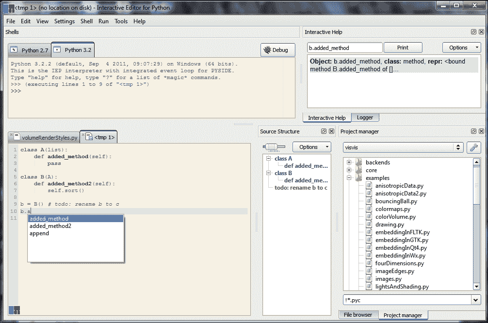

有些人不认为 IEP 是一个集成开发环境工具，但它服务于开发 Python 程序、编辑它们和运行它们的目的。它同时支持多个 Python 外壳。因此，对于想要使用多个图形用户界面工具包进行编程的人来说，这是一个非常有效的工具，例如 PySide、PyQt4、GTK 和 TK 交互。

IEP 是用(纯)Python 3 编写的，并且使用了 Qt GUI 工具包，但是它可以用来在任何可用的 Python 版本上执行代码。你可以从[http://www.iep-project.org/downloads.html](http://www.iep-project.org/downloads.html)下载 IEP。

### 来自恩思的树冠

entorn Canopy 有一个免费版本，是在 BSD 风格的许可下发布的，除了其他几个库之外，它还附带了 **GraphCanvas** 、 **SciMath** 和 **Chaco** 作为绘图工具。像所有的 IDEs 一样，它有一个文本编辑器。它还有 IPython 控制台，非常有用，能够运行和可视化结果。此外，它还附带了一个图形包管理器。当天篷启动时，它会提供一个带有**编辑器**、**包管理器**和**文档浏览器**的选项供选择。也可以尝试使用他们的培训材料，如下图所示:

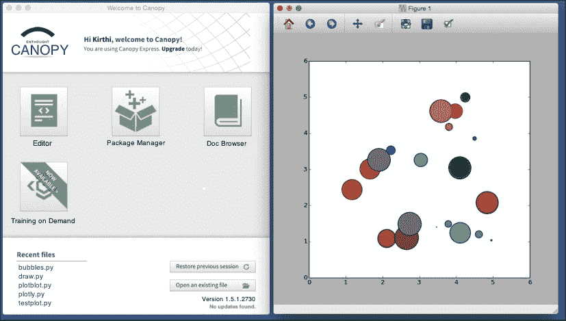

除了其他开发代码之外，Canopy 还拥有 IPython 笔记本集成的便捷功能，您可以使用这些功能来创建数据可视化。像大多数 IDEs 一样，它有一个编辑器、一个文件浏览器和 IPython 控制台。此外，还有一个显示当前编辑状态的状态显示。雨篷集成开发环境的这些组件主要执行以下任务:

*   **文件浏览器**:有了这个，你就可以从硬盘读取或者写入 Python 程序了
*   **Python 代码编辑器**:这指定了一个语法突出的代码编辑器，具有专门针对 Python 代码的附加功能
*   **Python 窗格**:这是一个集成的 IPython(交互式 Python)提示，可用于交互式运行 Python 程序，而不是从文件中运行
*   **编辑器状态栏**:可以显示行号、列号、文件类型、文件路径

下面的截图显示了高亮显示的数字。这代表了之前描述的 IDEs 的组件。文件浏览器和 Python 窗格可以拖放到代码编辑器窗口或边框之外的不同位置。当一个窗格被拖动时，它可以停靠的位置以蓝色突出显示，如下图所示的:

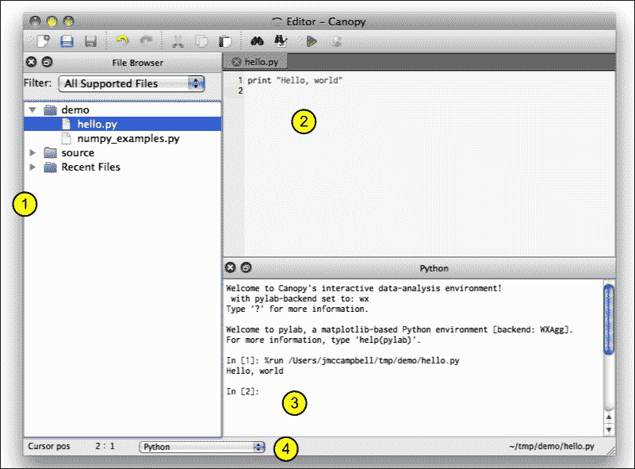

文档通过名为*座舱盖文档浏览器*的浏览器组织，可从**帮助**菜单访问。这包括一些常用 Python 包的文档链接。

*文档浏览器*的一个重要特性是，它提供了对文档中呈现的示例代码的简单访问。当用户右键单击示例代码框时，将显示上下文菜单。此外，您可以选择**复制代码**选项，将代码块的内容复制到 Canopy 的复制粘贴缓冲区，以便在编辑器中使用。

Canopy 为个人提供了几种不同的产品，免费版本被称为 **Canopy Express** ，大约有 100 个核心包。这个免费版本对于科学和分析计算的 Python 开发来说是一个有用的工具。选择目标操作系统为 Windows、Linux 或 Mac OS 之一后，可在[https://store.enthought.com/downloads/](https://store.enthought.com/downloads/)下载。

Python 开发环境中的挑战之一是，管理许多不同库和工具的包可能是一项非常耗时且令人生畏的任务。这就是他们的**文档浏览器**的样子。

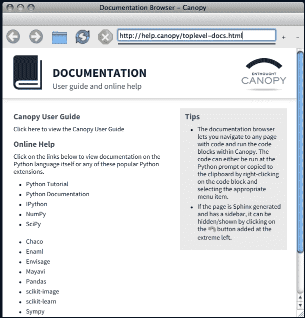

Canopy 有一个包管理器，可以用来发现 Canopy 可用的 Python 包，并决定安装哪些附加包和删除哪些包。有一个方便的搜索界面来查找和安装任何可用的软件包，并恢复到以前的软件包状态。

Canopy 使用 Python 功能来确定可用的 Python 包。当 Canopy 启动时，它首先在虚拟环境中查找包并显示它们，如下图所示:

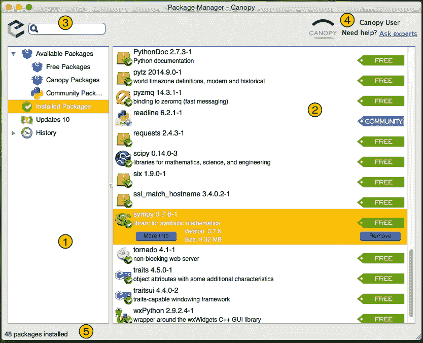

集成开发环境的编号突出显示区域是:

1.  **导航面板**:这个和任何 IDE 都差不多；导航有一个树列表类型的结构来选择包管理器的组件。
2.  **主查看区**:一旦左侧的选择发生变化，右侧面板将显示选中的项目，以及相关的套餐列表(如前一张截图所示)、带有标题为**更多信息**按钮的具体套餐信息等等。
3.  **搜索栏**:这类似于任何搜索功能，有助于快速搜索包的名称和描述。例如，打字机器将列表过滤为 11 个包(匹配的数量可能因操作系统而异)。
4.  **订阅状态和帮助**:这里会显示订阅的链接和当前使用的账号名称。
5.  **状态栏**:对于用户进行的每一次导航，状态栏都会根据导航的变化显示结果当前状态的详细信息。

### 来自连续体分析的蟒蛇

蟒蛇是社区使用的最受欢迎的 ide 之一。它附带了一个已经集成的编译好的长的软件包列表。该 IDE 基于名为 conda 的核心组件(稍后将详细解释)，您可以使用`conda`或`pip`安装或更新 Python 包。

Anaconda 是 Python 强大包的免费集合，支持大规模数据管理、分析和可视化，用于商业智能、科学分析、工程、机器学习等。

Anaconda 有一个 **Scientific PYthon 开发环境** ( **Spyder** )，它也有一个 IPython 查看器。此外，IPython 可以作为图形用户界面或基于网络的笔记本推出。最方便的方面是可以在一个主目录下安装 Python，不要碰系统安装的 Python。并非所有的包都已经准备好使用 Python 3；因此，最好将 Python 2 与这些 ide 一起使用。Anaconda IDE 有两个重要组件，基于`conda`包管理器。两个组件是`conda`和`spyder`。

当 Anaconda 启动时，会出现以下截图。这为用户提供了几个选项，包括 IPython 控制台、IPython 笔记本、Spyder IDE 和 glueviz:

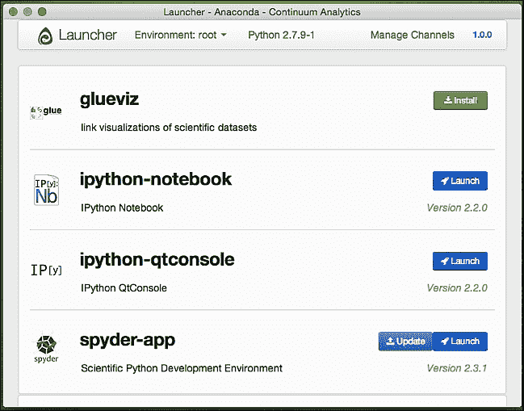

#### Spyder 概述

Spyder 是一个 Python 开发环境，包含以下组件:

*   **Python 代码编辑器**:这个自带单独的函数浏览器，类编辑器自带对 Pylint 代码分析的支持。今天，代码完成已经成为一种规范，在所有的 ide 上都很方便，所以它也支持这一点。
*   **交互控制台**:Python 语言最适合交互工作；因此，控制台必须具备支持对编辑器中编写的代码进行即时评估的所有必要工具。
*   **探索变量**:在任何交互执行过程中探索变量有助于提高整体生产力。编辑变量也是可能的，例如字典，有时还可以编辑数组。

代码编辑器和 IPython 控制台如下图所示:

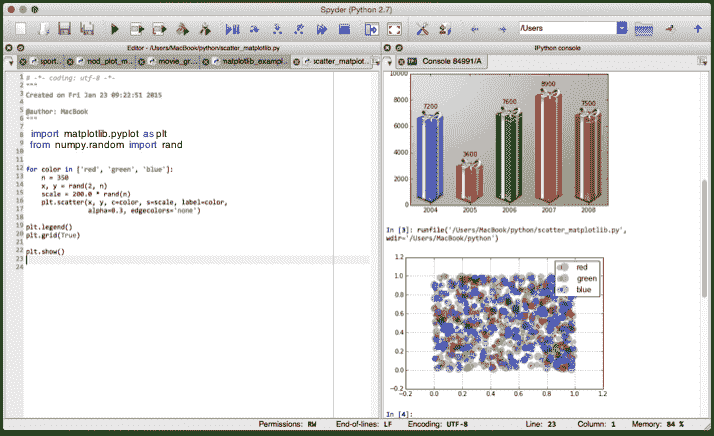

#### conda 概述

Conda 是一个命令行工具，用于管理环境和 Python 的包，而不是使用`pip`。有多种方法可以查询和搜索包，必要时创建新的环境，并在现有的 conda 环境中安装和更新 Python 包。这个命令行工具还跟踪包和平台细节之间的依赖关系，帮助您从不同的包组合中创建工作环境。要检查运行的是 conda 的哪个版本，您可以输入以下代码(在我的环境中，它显示的是 3.10.1 版本):

```py
Conda –v
3.10.1

```

一个 **conda 环境**是一个文件系统目录，包含一组特定的 conda 包。作为一个具体的例子，您可能希望有一个提供 NumPy 1.7 的环境和另一个为遗留测试提供 NumPy 1.6 的环境；conda 使这种混合和匹配变得容易。要开始使用环境，只需将`PATH`变量设置为指向其 bin 目录。

让我们看一个如何用 conda 安装一个名为 SciPy 的包的例子。假设您已经正确安装了 Anaconda，并且 conda 在运行路径中可用，您可能需要输入以下代码来安装 SciPy:

```py
$ conda install scipy

Fetching package metadata: ....
Solving package specifications: .
Package plan for installation in environment /Users/MacBook/anaconda:

The following packages will be downloaded:

 package                    |            build
 ---------------------------|-----------------
 flask-0.10.1               |           py27_1         129 KB
 itsdangerous-0.23          |           py27_0          16 KB
 jinja2-2.7.1               |           py27_0         307 KB
 markupsafe-0.18            |           py27_0          19 KB
 werkzeug-0.9.3             |           py27_0         385 KB

The following packages will be linked:

 package                    |            build
 ---------------------------|-----------------
 flask-0.10.1               |           py27_1
 itsdangerous-0.23          |           py27_0
 jinja2-2.7.1               |           py27_0
 markupsafe-0.18            |           py27_0
 python-2.7.5               |                2
 readline-6.2               |                1
 sqlite-3.7.13              |                1
 tk-8.5.13                  |                1
 werkzeug-0.9.3             |           py27_0
 zlib-1.2.7                 |                1

Proceed ([y]/n)? 

```

您应该注意到，正在尝试安装的软件包上的任何依赖项都将被自动识别、下载和链接。如果需要安装或更新任何 Python 包，您必须使用以下代码:

```py
conda install <package name>  or conda update <package name> 

```

下面是一个使用 conda(更新 matplotlib)从命令行更新包的例子:

```py
conda update matplotlib

Fetching package metadata: ....
Solving package specifications: .
Package plan for installation in environment /Users/MacBook/anaconda:

The following packages will be downloaded:

 package                    |            build
 ---------------------------|-----------------
 freetype-2.5.2             |                0         691 KB
 conda-env-2.1.4            |           py27_0          15 KB
 numpy-1.9.2                |           py27_0         2.9 MB
 pyparsing-2.0.3            |           py27_0          63 KB
 pytz-2015.2                |           py27_0         175 KB
 setuptools-15.0            |           py27_0         436 KB
 conda-3.10.1               |           py27_0         164 KB
 python-dateutil-2.4.2      |           py27_0         219 KB
 matplotlib-1.4.3           |       np19py27_1        40.9 MB
 ------------------------------------------------------------
 Total:        45.5 MB

The following NEW packages will be INSTALLED:

 python-dateutil: 2.4.2-py27_0 

The following packages will be UPDATED:

 conda:           3.10.0-py27_0    --> 3.10.1-py27_0 
 conda-env:       2.1.3-py27_0     --> 2.1.4-py27_0 
 freetype:        2.4.10-1         --> 2.5.2-0 
 matplotlib:      1.4.2-np19py27_0 --> 1.4.3-np19py27_1
 numpy:           1.9.1-py27_0     --> 1.9.2-py27_0 
 pyparsing:       2.0.1-py27_0     --> 2.0.3-py27_0 
 pytz:            2014.9-py27_0    --> 2015.2-py27_0 
 setuptools:      14.3-py27_0      --> 15.0-py27_0 

Proceed ([y]/n)?

```

要检查使用 Anaconda 安装的软件包，请导航到命令行并输入以下命令，以快速显示默认环境中安装的所有软件包的列表:

```py
conda list 

```

此外，您始终可以通过常用方式安装软件包，例如`pip install`，或者使用`setup.py`文件从源位置安装。虽然 conda 是首选的打包工具，但是 Anaconda 并没有什么特别的地方阻止使用标准的 Python 打包工具(比如`pip`)。

IPython 不是必需的，但强烈建议使用。IPython 应该在安装 Python、GNU Readline 和 PyReadline 之后安装。默认情况下，Anaconda 和 Canopy 会执行这些操作。本书中的所有示例都使用了 Python 包，这是有充分理由的。在下面的部分，我们已经更新了这个列表。

# 水蟒可视化图

从获取数据、操纵和处理数据，到可视化和交流研究成果，Python 和 Anaconda 支持科学数据工作流中的多种流程。Python 可以用于各种各样的应用(甚至超越科学计算)；用户可以快速采用这种语言，不需要学习新的软件或编程语言。Python 的开源可用性增强了研究结果，并使用户能够与世界各地的科学家和工程师的大型社区联系。

以下是一些可用于 Anaconda 的常见打印库:

*   **matplotlib** :这是最流行的 Python 绘图库之一。再加上 NumPy 和 SciPy，这是科学 Python 社区的主要驱动力之一。IPython 具有 pylab 模式，该模式专门设计用于使用 matplotlib 执行交互式绘图。
*   **Plotly** :这是一个在浏览器上工作的协同绘图和分析平台。它支持使用 IPython 笔记本的交互式图形。图形是交互式的，可以通过修改代码和交互式查看结果来进行风格化。使用 matplotlib 生成的任何绘图代码都可以轻松导出到 Plotly 版本。
*   **Veusz** :这是一个用 Python 和 PyQt 编写的 GPL-科学绘图包。Veusz 也可以嵌入到其他 Python 程序中。
*   **Mayavi** :这是一个三维绘图包，完全可以从 Python 中脚本化，类似于简单的 pylab 和类似 MATLAB 的接口，用于绘制数组。
*   **NetworkX** :这是一个 Python 语言软件包，用于创建、操作和研究复杂网络的结构、动力学和功能。
*   **pygooglechart** :这是一个功能强大的包，可以让你创建可视化的方法，还可以和 Google Chart API 接口。

## 表面-3D 图

三维图由定义为 *Z* 的数据生成，作为 *(X，Y)* 的函数。这在数学上表示为 *Z=f(X，Y)* 。在我们这里的例子中，我们将绘制 *Z=sin(sqrt(X2+Y2))* ，这本质上类似于二维抛物线。我们的绘图需要遵循以下步骤:

1.  First, generate the *X* and *Y* grid with the following code:

    ```py
    import numpy as np

    X = np.arange(-4, 4, 0.25) 
    Y = np.arange(-4, 4, 0.25) 
    X, Y = np.meshgrid(X, Y)
    Generate the Z data:
    R = np.sqrt(X**2 + Y**2)
    Z = np.sin(R)
    ```

    使用`mpl_toolkits`包绘制简单的三维表面 *sin(sqrt(X**2+Y**2))* 如下图所示；使用颜色条表示打击和绘图图:

    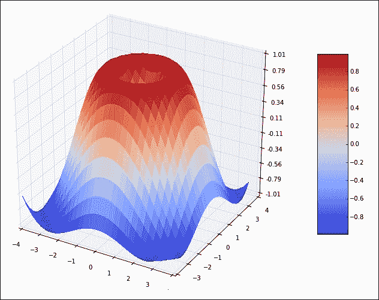

2.  然后，绘制曲面，如下图所示:

    ```py
    from mpl_toolkits.mplot3d import Axes3d
    from matplotlib import cm
    from matplotlib.ticker import LinearLocator, FormatStrFormatter
    import matplotlib.pyplot as plt
    import numpy as np

    fig = plt.figure(figsize=(12,9))
    ax = fig.gca(projection='3d')
    X = np.arange(-4, 4, 0.25)
    Y = np.arange(-4, 4, 0.25)
    X, Y = np.meshgrid(X, Y)
    R = np.sqrt(X**2 + Y**2)
    Z = np.sin(R)
    surf = ax.plot_surface(X, Y, Z, rstride=1, cstride=1, cmap=cm.coolwarm, linewidth=0, antialiased=False)

    ax.set_zlim(-1.01, 1.01)
    ax.zaxis.set_major_locator(LinearLocator(10))
    ax.zaxis.set_major_formatter(FormatStrFormatter('%.02f'))

    fig.colorbar(surf, shrink=0.6, aspect=6)

    plt.show()
    ```

为了让这个三维绘图工作，你必须确保安装了 matplotlib 和 NumPy 。Anaconda 中的默认包附带了这些安装。

## 正方形地图图

通过比较和上一章讨论的排名示例，使用 squarify 算法(带有 matplotlib)显示非洲 GDP 排名前 12 的国家，您可以获得一个看起来类似于树状图的图，如下代码所示:

```py
# Squarified Treemap Layout : source file (squarify.py)
# Implements algorithm from Bruls, Huizing, van Wijk, "Squarified Treemaps"
# squarify was created by Uri Laserson 
# primarily intended to support d3.js 

def normalize_sizes(sizes, dx, dy):
  total_size = sum(sizes)
  total_area = dx * dy
  sizes = map(float, sizes)
  sizes = map(lambda size: size * total_area / total_size, sizes)
  return sizes

def pad_rectangle(rect):
  if rect['dx'] > 2:
    rect['x'] += 1
    rect['dx'] -= 2
  if rect['dy'] > 2:
    rect ['y'] += 1
    rect['dy'] -= 2

def layoutrow(sizes, x, y, dx, dy):
  covered_area = sum(sizes)
  width = covered_area / dy
  rects = []
  for size in sizes:  
    rects.append({'x': x, 'y': y, 'dx': width, 'dy': size / width})
    y += size / width
  return rects

def layoutcol(sizes, x, y, dx, dy):
  covered_area = sum(sizes)
  height = covered_area / dx
  rects = []
  for size in sizes:
    rects.append({'x': x, 'y': y, 'dx': size / height, 'dy': height})
    x += size / height
  return rects

def layout(sizes, x, y, dx, dy):
  return layoutrow(sizes, x, y, dx, dy) if dx >= dy else layoutcol(sizes, x, y, dx, dy)

def leftoverrow(sizes, x, y, dx, dy):
  covered_area = sum(sizes)
  width = covered_area / dy
  leftover_x = x + width
  leftover_y = y
  leftover_dx = dx - width
  leftover_dy = dy
  return (leftover_x, leftover_y, leftover_dx, leftover_dy)

def leftovercol(sizes, x, y, dx, dy):
  covered_area = sum(sizes)
  height = covered_area / dx
  leftover_x = x
  leftover_y = y + height
  leftover_dx = dx
  leftover_dy = dy - height
  return (leftover_x, leftover_y, leftover_dx, leftover_dy)

def leftover(sizes, x, y, dx, dy):
  return leftoverrow(sizes, x, y, dx, dy) if dx >= dy else leftovercol(sizes, x, y, dx, dy)

def worst_ratio(sizes, x, y, dx, dy):
  return max([max(rect['dx'] / rect['dy'], rect['dy'] / rect['dx']) for rect in layout(sizes, x, y, dx, dy)])

def squarify(sizes, x, y, dx, dy):
  sizes = map(float, sizes)
  if len(sizes) == 0:
    return []
  if len(sizes) == 1:
    return layout(sizes, x, y, dx, dy)
  # figure out where 'split' should be
  i = 1
  while i < len(sizes) and worst_ratio(sizes[:i], x, y, dx, dy) >= worst_ratio(sizes[:(i+1)], x, y, dx, dy):
    i += 1
  current = sizes[:i]
  remaining = sizes[i:]
  (leftover_x, leftover_y, leftover_dx, leftover_dy) = leftover(current, x, y, dx, dy)
  return layout(current, x, y, dx, dy) + \
squarify(remaining, leftover_x, leftover_y, leftover_dx, leftover_dy)

def padded_squarify(sizes, x, y, dx, dy):
  rects = squarify(sizes, x, y, dx, dy)
  for rect in rects:
    pad_rectangle(rect)
  return rects
```

前一个代码显示的 squarify 函数可以用来显示非洲 GDP 排名前 12 的国家，如下代码所示:

```py
import matplotlib.pyplot as plt
import matplotlib.cm
import random
import squarify

x = 0.
y = 0.
width = 950.
height = 733.
norm_x=1000
norm_y=1000

fig = plt.figure(figsize=(15,13))
ax=fig.add_subplot(111,axisbg='white')

initvalues = [285.4,188.4,173,140.6,91.4,75.5,62.3,39.6,29.4,28.5, 26.2, 22.2]
values = initvalues
labels = ["South Africa", "Egypt", "Nigeria", "Algeria", "Morocco",
"Angola", "Libya", "Tunisia", "Kenya", "Ethiopia", "Ghana", "Cameron"]

colors = [(214,27,31),(229,109,0),(109,178,2),(50,155,18), 
(41,127,214),(27,70,163),(72,17,121),(209,0,89), 
(148,0,26),(223,44,13), (195,215,0)] 
# Scale the RGB values to the [0, 1] range, which is the format matplotlib accepts. 
for i in range(len(colors)): 
  r, g, b = colors[i] 
  colors[i] = (r / 255., g / 255., b / 255.) 

# values must be sorted descending (and positive, obviously)
values.sort(reverse=True)

# the sum of the values must equal the total area to be laid out
# i.e., sum(values) == width * height
values = squarify.normalize_sizes(values, width, height)

# padded rectangles will probably visualize better for certain cases
rects = squarify.padded_squarify(values, x, y, width, height)

cmap = matplotlib.cm.get_cmap()

color = [cmap(random.random()) for i in range(len(values))]
x = [rect['x'] for rect in rects]
y = [rect['y'] for rect in rects]
dx = [rect['dx'] for rect in rects]
dy = [rect['dy'] for rect in rects]

ax.bar(x, dy, width=dx, bottom=y, color=colors, label=labels)

va = 'center'
idx=1

for l, r, v in zip(labels, rects, initvalues):
  x, y, dx, dy = r['x'], r['y'], r['dx'], r['dy']
  ax.text(x + dx / 2, y + dy / 2+10, str(idx)+"--> "+l, va=va,
     ha='center', color='white', fontsize=14)
  ax.text(x + dx / 2, y + dy / 2-12, "($"+str(v)+"b)", va=va,
     ha='center', color='white', fontsize=12)
  idx = idx+1
ax.set_xlim(0, norm_x)
ax.set_ylim(0, norm_y)
plt.show()
```

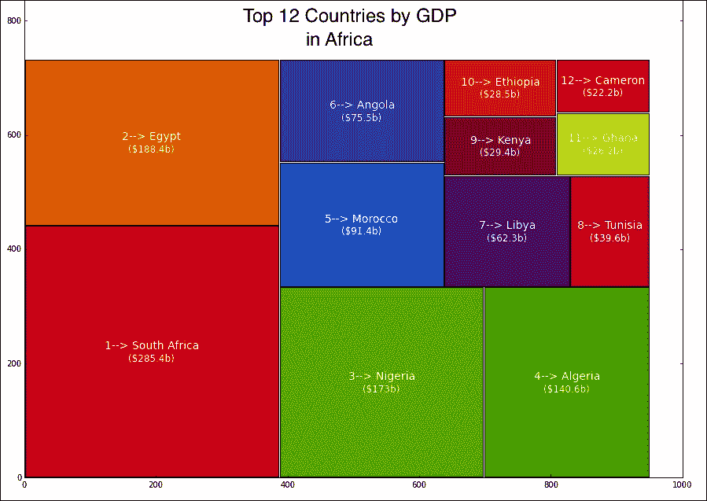

# 交互式可视化包

几年前除了 IPython 没有太多的交互工具。为了理解如何让任何可视化变得交互式，将它与现有工具(如 D3.js)进行比较是有意义的。D3.js 非常强大的原因之一是基于 JavaScript 的绘图框架可以使绘图呈现在网络上。此外，它还附带了所有可以轻松配置的事件驱动功能。

有两个可视化库被称为 **Bokeh** 和 **VisPy** ，它们在今天可用的少数几个中很受欢迎。还有另一个工具叫做**瓦卡里**。这主要用于数据分析，在如何创建基于浏览器的可视化方面与 IPython 相似。 **Ashiba** 项目是由 Clayton Davis 在 Continuum 开发的另一个工具，但是由于 Continuum 的重点转移到了 Bokeh 和 Wakari，在过去的几年里，关于 Ashiba 的工作做得很少。

## Bokeh

Bokeh 是一个用 Python 开发的交互式可视化库，旨在通过网络浏览器工作。Bokeh 这个名字来自哪里？这是一个日语单词，用来描述模糊或图像中不聚焦的部分。目标是开发一个非常类似 D3.js 美学的库；Bokeh 这个名字的选择似乎很匹配。Bokeh 写入 HTML5 Canvas 库，因此保证在支持 HTML5 的浏览器上工作。这很有用，因为您可能想要将基于 JavaScript 的图与 Python 进行比较。

我们不会详细说明这个工具。你可以在[http://bokeh.pydata.org](http://bokeh.pydata.org)阅读和探索更多相关内容。然而，重要的是要知道 Bokeh 库的依赖关系。安装 Bokeh 库前，要求安装`jsonschema`，如下:

```py
conda install jsonschema

Fetching package metadata: ....
Solving package specifications: .
Package plan for installation in environment /Users/MacBook/anaconda:

The following packages will be downloaded:

 package                    |            build
 ---------------------------|-----------------
 jsonschema-2.4.0           |           py27_0          51 KB

The following NEW packages will be INSTALLED:

 jsonschema: 2.4.0-py27_0

Proceed ([y]/n)?

```

使用 Bokeh、pandas、SciPy、matplotlib 和 ggplot 的交互式可视化示例可在[上找到。](http://nbviewer.ipython.org/gist/fonnesbeck/ad091b81bffda28fd657)

## 粘性

VisPy 是一个用于 2D 或三维绘图的可视化库，具有交互性和高性能。您可以利用 OpenGL 知识快速创建可视化。它也有不一定需要深入了解 OpenGL 的方法。有关更多信息，您可以阅读位于【vispy.org】的文档。

为了安装 VisPy 库，可以尝试`conda install vispy`命令，但它很可能会响应 binstar 搜索`–t conda vispy`的建议。以下代码是列表中的代码之一:

```py
conda install --channel https://conda.binstar.org/asmeurer vispy

```

使用此命令，您将获得以下响应:

```py
Fetching package metadata: ......
Solving package specifications: .
Package plan for installation in environment /Users/MacBook/anaconda:

The following packages will be downloaded:

 package                    |            build
 ---------------------------|-----------------
 numpy-1.8.2                |           py27_0         2.9 MB
 vispy-0.3.0                |       np18py27_0         679 KB
 ------------------------------------------------------------
 Total:         3.6 MB

The following NEW packages will be INSTALLED:

 vispy: 0.3.0-np18py27_0

The following packages will be DOWNGRADED:

 numpy: 1.9.2-py27_0 --> 1.8.2-py27_0 

Proceed ([y]/n)?

```

VisPy 的图库收藏中有很多例子。可以在[【http://vispy.org/gloo.html?highlight=gloo#module-vispy.gloo】](http://vispy.org/gloo.html?highlight=gloo#module-vispy.gloo)查看使用`vispy.gloo`命令和 GLSL 阴影代码的点显示的一个特定示例。

# 总结

现在有一套适合 Python 开发人员的工具和包。Python 有一个很大的标准库。这通常被认为是 Python 最大的优势之一。它有创建图形用户界面的模块，连接到关系数据库，伪随机数发生器，具有任意精度小数的算法，操作正则表达式。此外，还有绘制 2D 和三维图形的高性能软件包、机器学习和统计算法等。

我们已经看到，集成开发环境工具(如 Canopy 和 Anaconda)从计算和可视化的角度以及其他许多领域利用了高效的开发工作。有许多有效的方法来使用这些工具产生可视化方法。在接下来的几章中，将展示这些工具和包的有趣示例。