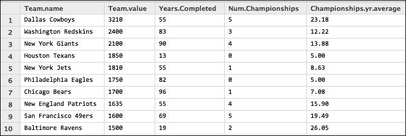

# 四、数值计算和交互式绘图

高性能数值计算领域位于许多学科和技能的十字路口。为了在今天成功地使用高性能计算，它需要编程、数据科学和应用数学的知识和技能。除此之外，计算问题的有效实现需要对处理和存储设备有所了解。

近年来，计算在科学中的作用已经发展到不同的水平。编程语言(如 R 和 MATLAB)在学术研究和科学计算中很常见。如今，Python 在科学计算中扮演着重要角色，这是有充分理由的。Python 社区汇集了许多高效的工具和包，不仅被研究社区使用，而且被成功的商业组织使用，如雅虎、谷歌、脸书和亚马逊。

科学计算中广泛使用的软件包有两种。分别是**数值 Python 包** ( **NumPy** )和**科学 Python 包** ( **SciPy** )。NumPy 因其高效的数组，尤其是易于索引而广受欢迎。在以下各节中，我们将讨论以下主题:

*   NumPy、SciPy 和 MKL 函数
*   数字索引和逻辑索引
*   数据结构—堆栈、队列、元组、集合、尝试和字典
*   使用 matplotlib 可视化绘图，等等
*   用 NumPy 和 SciPy 进行优化和插值，并举例说明
*   将 Cython 与 NumPy 相结合以及 Cython 的优势

# NumPy、SciPy 和 MKL 函数

几乎所有的科学和数值计算都需要用向量和矩阵的形式来表示数据，NumPy 用数组来处理所有这些。

NumPy 和 SciPy 是 Python 的计算模块，在预编译的快速函数中提供方便的数学和数值方法。NumPy 包提供了基本的例程来操作大型数组和矩阵的数字数据。SciPy 包扩展了 NumPy，用应用数学技术收集有用的算法。在 NumPy 中， *ndarray* 是一个数组对象，它表示具有已知大小的多维齐次项目数组。

## NumPy

NumPy 不仅使用数组对象，还使用可以方便用于计算的线性代数函数。它提供了阵列和相关阵列功能的快速实现。使用数组对象，可以执行包括矩阵乘法、向量和矩阵转置、求解方程组、执行向量乘法和归一化等操作。

### NumPy 通用函数

通用功能( *ufunc* )是通过每个元素、支持类型铸造和其他几个标准特征在`ndarrays`上运行的功能。换句话说，`ufunc`是接受标量输入并产生标量输出的函数的矢量化包装器。许多内置函数都是在编译好的 C 代码中实现的，这使得它更快。

NumPy 通用函数比 Python 函数更快，因为循环是在编译代码中执行的。此外，因为数组是类型化的，所以在任何类型的计算发生之前就知道它们的类型。

这里显示了一个对每个元素进行操作的简单示例`ufunc`:

```py
import numpy as np
x = np.random.random(5)
print x
print x + 1   # add 1 to each element of x

[ 0.62229809  0.18010463  0.28126201  0.30701477  0.39013144] 
[ 1.62229809  1.18010463  1.28126201  1.30701477  1.39013144]
```

其他例子还有`np.add`和`np.subtract`。

NumPy 的`ndarray`类似于 Python 中的列表，但它在只存储同类对象时相当严格。换句话说，使用 Python 列表，可以混合元素类型，例如第一个元素作为数字，第二个元素作为列表，下一个元素作为另一个列表(或字典)。对于大尺寸阵列来说，在操作`ndarray`的元件方面的性能明显更快，这将在这里进行演示。这里的例子表明它更快，因为我们将测量运行时间。然而，对于对 C 语言中的 NumPy 实现感兴趣的读者来说，在[网站上可以找到关于这个实现的文档。](http://docs.scipy.org/doc/numpy/reference/internals.code-explanations.html)

```py
import numpy as np

arr = np.arange(10000000)
listarr = arr.tolist()

def scalar_multiple(alist, scalar):
    for i, val in enumerate(alist):
        alist[i] = val * scalar
    return alist

# Using IPython's magic timeit command
timeit arr * 2.4
10 loops, best of 3: 31.7 ms per loop
# above result shows 31.7 ms (not seconds)

timeit scalar_multiple(listarr, 2.4)
1 loops, best of 3: 1.39 s per loop
# above result shows 1.39 seconds (not ms)
```

在前面的代码中，每个数组元素占用 4 个字节。因此，一百万个整数数组占用大约 44 MB 的内存，列表使用 711 MB 的内存。但是，数组对于小的集合大小来说速度较慢，但是对于大的集合大小来说，它们使用的内存空间较少，并且比列表快得多。

NumPy 附带了许多有用的函数，大致分为三角函数、算术函数、指数和对数函数以及各种函数。在众多的杂函数中，线性卷积的`convolve()`和线性插值的`interp()`比较流行。此外，对于大多数涉及等间距数据的实验工作来说，`linspace()`和`random.rand()`函数是被广泛使用的几个函数之一。

### 塑造和重塑手法

改变现有数组的形状比用新形状从旧数据创建新数组更有效。在第一个示例中，重塑发生在内存中(数组不存储在变量中)，而在下面的代码中，数组首先存储在变量 a 中，然后 a 被重塑:

```py
import numpy as np

np.dandom.rand(2,4)
array([[ 0.96432148,  0.63192759,  0.12976726,  0.56131001], 
    [    0.27086909,  0.92865208,  0.27762891,  0.40429701]])

np.random.rand(8).reshape(2,4)
array([[ 0.39698544,  0.88843637,  0.66260474,  0.61106802], 
       [ 0.97622822,  0.47652548,  0.56163488,  0.43602828]]) 
```

在上例中，创建`8`值后，它们被重新整形为有效的选择维度，如以下代码所示:

```py
#another example
a = np.array([[11,12,13,14,15,16],[17,18,19,20,21,22]])

print a
[[11, 12, 13, 14, 15, 16], [17, 18, 19, 20, 21, 22]]

# the following shows shape is used to know the dimensions
a.shape
(2,6)

#Now change the shape of the array
a.shape=(3,4)
print a
[[11 12 13]  [14 15 16]  [17 18 19]  [20 21 22]]
```

用`xrange`代替`range`，因为循环更快，避免了整数列表的存储；它只是一个接一个地产生它们。形状和重塑的对立面是`ravel()`，如下图所示:

```py
#ravel example
a = np.array([[11,12,13,14,15,16],[17,18,19,20,21,22]])

a.ravel()
array([11, 12, 13, 14, 15, 16, 17, 18, 19, 20, 21, 22])
```

### 插值的一个例子

以下是使用`interp()`进行插值的示例:

```py
n=30 

# create n values of x from 0 to 2*pi 
x = np.linspace(0,2*np.pi,n) 

y = np.zeros(n) 

#for range of x values, evaluate y values
for i in xrange(n):    
   y[i] = np.sin(x[i])
```

下图显示的图像是简单正弦曲线插值的结果:


以下代码显示了使用和不使用插值绘制曲线:

```py
import numpy as np
import matplotlib.pyplot as plt

# create n values of x from 0 to 2*pi 
x = np.linspace(0, 8*np.pi, 100)

y = np.sin(x/2)

#interpolate new y-values 
yinterp = np.interp(x, x, y)

#plot x,y values using circle marker (line style)
plt.plot(x, y, 'o')  

#plot interpolated curve using dash x marker
plt.plot(xvals, yinterp, '-x')  

plt.show()
```

### 向量化函数

通过 NumPy 和 SciPy 中的`vectorize()`向量化函数非常有效。矢量化能够通过逐元素应用相同的规则，将以标量为参数的函数转换为以数组为参数的函数。我们将在这里用两个例子来证明这一点。

第一个示例使用一个接受三个标量参数的函数来生成一个接受三个数组参数的矢量化函数，如以下代码所示:

```py
import numpy as np

def addition(x, y, z):
    return x + y + z

def addpoly():
    i = np.random.randint(25)
    poly1 = np.arange(i, i+10)
    i = np.random.randint(25) 
    poly2 = np.arange(i, i+10)
    poly3 = np.arange(10, 18)
    print poly1
    print poly2
    print poly3
    print '-' * 32
    vecf = np.vectorize(addition)
    print vecf(poly1,poly2,poly3)

addpoly()

[ 4  5  6  7  8  9 10 11 12 13]
[13 14 15 16 17 18 19 20 21 22]
[10 11 12 13 14 15 16 17 18 19]
--------------------------------
[27 30 33 36 39 42 45 48 51 54]
```

注意`arrange`是内置 Python `range`函数的数组值版本。

第二个示例使用一个接受标量参数的函数来生成一个接受数组参数的**矢量化**函数，如以下代码所示:

```py
import numpy as np

def posquare(x):
  if x >= 0: return x**2
  else: return -x

i = np.random.randint(25)
poly1 = np.arange(i,i+10)

print poly1
vecfunc = vectorize(posquare, otypes=[float]) 
vecfunc(poly1)

[14 15 16 17 18 19 20 21 22 23]
array([ 196., 225., 256., 289., 324., 361., 400., 441., 484., 529.])
```

还有另一个例子，借助于示例代码很有意思。此示例显示了用常数增加数组元素的三种方法，并测量运行时间以确定哪种方法更快:

```py
import numpy as np
from time import time

def incrembyone(x):
    return x + 1

dataarray=np.linspace(1,5,1000000)

t1=time()
lendata = len(dataarray)
print "Len = "+str(lendata)
print dataarray[1:7]
for i in range(lendata):
    dataarray[i]+=1
print " time for loop (No vectorization)->" + str(time() - t1)

t2=time()

vecincr = np.vectorize(incrembyone) #1 
vecincr(dataarray) #2          
print " time for vectorized version-1:" + str(time() - t2)
t3 = time()

# This way to increment array elements with one line
# is pretty powerful, accomplishes same thing as #1 and #2
dataarray+=1  # how does this achieve the results
print dataarray[1:7]
print " time for vectorized version-2:" + str(time() - t3)

Len = 1000000
 [ 1.000004 1.000008 1.000012 1.000016 1.00002 1.000024]  
time for loop (No vectorization)->0.473765850067  
time for vectorized version-1:0.221153974533 # half the time

[ 3.000004 3.000008 3.000012 3.000016 3.00002 3.000024]  
time for vectorized version-2:0.00192213058472 # in fraction time
```

除了矢量化技术，还有另一种简单的编码实践可以让程序更高效。如果循环中使用了前缀符号，最好创建一个本地别名，并在循环中使用该别名。这里显示了一个这样的例子:

```py
fastsin = math.sin

x = range(1000000)
for i in x:
    x[i] = fastsin(x[i])
```

### NumPy 线性代数综述

以下是 NumPy 在线性代数中提供的一些著名函数的列表:

<colgroup><col style="text-align: left"> <col style="text-align: left"></colgroup> 
| 

名字

 | 

描述

 |
| --- | --- |
| `dot(a,b)` | 这是两个数组的点积 |
| `linalg.norm(x)` | 这是矩阵或向量范数 |
| `linalg.cond(x)` | 这指定了条件编号 |
| `linalg.solve(A,b)` | 这解决了线性系统`Ax=b` |
| `linalg.inv(A)` | 这表示`A`的倒数 |
| `linalg.pinv(A)` | 这指定了`A`的伪逆 |
| `linalg.eig(A)` | 这些是平方的特征值/向量`A` |
| `linalg.eigvals(A)` | 这些是一般`A`的特征值 |
| `linalg.svd(A)` | 这是一个奇异值分解 |

## 黑桃

NumPy 已经有很多方便的函数可以用于计算。那么，我们为什么需要 SciPy？SciPy 是用于数学、科学和工程的 NumPy 的扩展，它有许多软件包可用于线性代数、积分、插值、快速傅立叶变换、大型矩阵操作、统计计算等。下表显示了这些包的简要描述:

<colgroup><col style="text-align: left"> <col style="text-align: left"></colgroup> 
| 

分装

 | 

功能简述

 |
| --- | --- |
| `scipy.cluster` | 这指定了用于聚类的函数，包括矢量量化和 k 均值。 |
| `scipy.fftpack` | 这表示快速傅立叶变换的功能。 |
| `scipy.integrate` | 这指定了使用梯形、辛普森、龙贝格和其他方法进行数值积分的函数。它还规定了积分常微分方程的方法。人们可以用函数`quad`、`dblquad`和`tplquad`对函数对象执行单、双和三次积分。 |
| `scipy.interpolate` | 表示具有离散数值数据的插值对象以及线性和样条插值的函数和类。 |
| `scipy.linalg` | 这是 NumPy 中包装`linalg`的包装。NumPy 的所有功能都是`scipy.linalg`的一部分，还有其他几个功能。 |
| `scipy.optimize` | 这表示最大化和最小化函数，包括奈德-米德单纯形法、鲍威尔法、共轭梯度 BFGS 法、最小二乘法、约束优化器、模拟退火法、牛顿法、二等分法、布赖登-安德森法和线搜索法。 |
| `scipy.sparse` | 这指定了可以处理大型稀疏矩阵的函数。 |
| `scipy.special` | 这对于计算物理有特殊的作用，如椭圆、贝塞尔、伽马、β、超几何、抛物线、圆柱、马蒂厄和球面波。 |

除了前面列出的子包，SciPy 还有一个`scipy.io`包，该包具有加载名为`spio.loadmat()`的矩阵、保存名为`spio.savemat()`的矩阵以及通过`scio.imread()`读取图像的功能。当需要用 Python 开发计算程序时，最好检查 SciPy 文档，看看它是否包含已经完成预期任务的函数。

我们来看一个使用`scipy.polyId()`的例子:

```py
import scipy as sp

# function that multiplies two polynomials
def multiplyPoly():  
    #cubic1 has coefficients 3, 4, 5 and 5 
    cubic1 = sp.poly1d([3, 4, 5, 5])  

    #cubic2 has coefficients 4, 1, -3 and 3
    cubic2 = sp.poly1d([4, 1, -3, 3]) 

    print cubic1   
    print cubic2 

    print '-' * 36

    #print results of polynomial multiplication
    print cubic1 * cubic2

multiplyPoly()  # produces the following result

   3     2
3 x + 4 x + 5 x + 5
   3     2
4 x + 1 x - 3 x + 3
------------------------------------
    6      5      4      3     2
12 x + 19 x + 15 x + 22 x + 2 x + 15  
```

结果与传统的逐项乘法相匹配，如下所示:


因此，多项式表示可以用于积分、微分和其他计算物理。这些功能以及 NumPy、SciPy 和其他包扩展中的更多功能清楚地表明，Python 是 MATLAB 的另一个替代品，因此在一些学术环境中使用。

SciPy 提供了许多不同类型的插值。以下示例使用`interpolate.splev`，其使用 B 样条及其导数和`interpolate.splprep`用于二维曲线(一般为 N 维)的 B 样条表示:

```py
import numpy as np 
import matplotlib.pyplot as plt
import scipy as sp

t = np.arange(0, 2.5, .1)
x = np.sin(2*np.pi*t)
y = np.cos(2*np.pi*t)

tcktuples,uarray = sp.interpolate.splprep([x,y], s=0)
unew = np.arange(0, 1.01, 0.01)

splinevalues = sp.interpolate.splev(unew, tcktuples)

plt.figure(figsize=(10,10))
plt.plot(x, y, 'x', splinevalues[0], splinevalues[1], 
np.sin(2*np.pi*unew), np.cos(2*np.pi*unew), x, y, 'b')

plt.legend(['Linear', 'Cubic Spline', 'True'])
plt.axis([-1.25, 1.25, -1.25, 1.25])
plt.title('Parametric Spline Interpolation Curve')

plt.show()
```

下图是使用 SciPy 和 NumPy 进行样条插值的结果:


让我们看一下数值积分中的一个例子，并使用一些 SciPy 函数(如 Simpson 和 Romberg)求解线性方程，并将这些函数与 NumPy 梯形函数进行比较。我们知道，当*f(x)= 9–x2*这样的函数从`-3`积分到`3`时，我们期望 36 个单位，如下图所示:


上图显示了 *9-x2* 函数(沿 *Y* 轴对称)。数学上，从 *-3* 到 *3* 的积分是从 *0* 到 *3* 的积分的两倍。我们如何使用 SciPy 进行数值积分？下面的代码显示了一种使用 NumPy 中的梯形方法执行该操作的方法:

```py
import numpy as np
from scipy.integrate import simps, romberg

a = -3.0; b = 3.0;
N = 10  

x = np.linspace(a, b, N)
y = 9-x*x
yromb = lambda x: (9-x*x)

t = np.trapz(y, x)
s = simps(y, x)
r = romberg(yromb, a, b)

#actual integral value
aiv = (9*b-(b*b*b)/3.0) - (9*a-(a*a*a)/3.0)

print 'trapezoidal = {0} ({1:%} error)'.format(t, (t - aiv)/aiv)
print 'simpsons = {0} ({1:%} error)'.format(s, (s - aiv)/aiv)
print 'romberg  = {0} ({1:%} error)'.format(r, (r - aiv)/aiv)
print 'actual value = {0}'.format(aiv)

trapezoidal = 35.5555555556 (-1.234568% error)
simpsons = 35.950617284 (-0.137174% error)
romberg  = 36.0 (0.000000% error)
actual value = 36.0
```

### 线性方程的一个例子

让我们尝试用三个变量 *x* 、 *y* 和 *z* 求解一组线性方程，如下所示:

*   *x+2y–z = 2*
*   *2x–3y+2z = 2*
*   *3x+y–z = 2*

NumPy 提供了一种求解线性方程的方便方法`np.linalg.solve()`。然而，输入应该是矢量形式的。下面的程序展示了如何求解线性方程。

```py
import numpy as np

# Matrix A has coefficients of x,y and z
A = np.array([[1, 2, -1],
              [2, -3, 2],
              [3, 1, -1]])
#constant vector 
b = np.array([2, 2, 2])

#Solve these equations by calling linalg.solve
v = np.linalg.solve(A, b)

# v is the vector that has solutions
print "The solution vector is "
print v
# Reconstruct Av to see if it produces identical values 
print np.dot(A,v) == b

The solution vector is
[ 1\.  2\.  3.]
[ True  True  True]
```

注意`np.dot(A,v)`是矩阵乘法(不是`A*v`)。解向量`v = [1,2,3]`是正确的预期结果。

### 矢量化的数值导数

现在作为本节的最后一个例子，我们将看看 NumPy 提供的矢量化数字导数。应用微分的商法则，我们确实知道导数是。但是，通过应用 Python 中的矢量化方法来计算没有循环的导数，我们将看到以下代码:

```py
import numpy as np 
import matplotlib.pyplot as plt

x = np.linspace(-np.pi/2, np.pi/2, 44)
y = 1/(1+np.cos(x)*np.cos(x))
dy_actual = np.sin(2*x)/(1+np.cos(x)*np.cos(x))**2

fig = plt.figure(figsize=(10,10))
ax=fig.add_subplot(111,axisbg='white')

# we need to specify the size of dy ahead because diff returns 
dy = np.zeros(y.shape, np.float) #we know it will be this size
dy[0:-1] = np.diff(y) / np.diff(x)
dy[-1] = (y[-1] - y[-2]) / (x[-1] - x[-2])

plt.plot(x,y, linewidth=3, color='b', label='actual function')
plt.plot(x,dy_actual,label='actual derivative', linewidth=2, color='r')
plt.plot(x,dy,label='forward diff', linewidth=2, color='g')
plt.legend(loc='upper center')
plt.show()
```

在下面的例子中，我们可以看到你如何在同一个图中画出实际函数、它的导数和向前差。将实际导数插入`dy_actual`，使用从 NumPy 计算的`diff()`计算正向差。

以下图表是该程序的结果:


## MKL 函数

英特尔的 MKL 函数提供向量和矩阵的高性能例程。此外，它们还包括快速傅立叶变换函数和矢量统计函数。这些功能已经过增强和优化，可在英特尔处理器上高效工作。对于 Anaconda 用户，Continuum 已经将这些 FFT 函数打包到 Python 库的二进制版本中，用于 MKL 优化。然而，作为 Anaconda Accelerate 包的一部分，MKL 优化作为一个附加组件提供。此处的图表显示了没有 MKL 时的慢度差异:


### 注

上图取自[https://store.continuum.io/cshop/mkl-optimizations/](https://store.continuum.io/cshop/mkl-optimizations/)。

对于更大的阵列输入，MKL 在性能上有显著提升，如下图所示:


上图取自[https://software . Intel . com/en-us/articles/numpsycpiy-with-Intel-mkl](https://software.intel.com/en-us/articles/numpyscipy-with-intel-mkl)。

## Python 的性能

Python 程序员为了性能考虑，经常尝试用 C 语言重写自己最里面的循环，从 Python 中调用编译好的 C 函数。有许多项目旨在使这种优化变得更容易，例如 Cython。然而，最好是让他们现有的 Python 代码更快，而不依赖于另一种编程语言。

几乎没有其他选项可以提高 Python 中计算密集型程序的性能:

*   **使用 numapro**:这是来自 Continuum Analytics 的 Python 编译器，可以编译 Python 代码，以便在支持 CUDA 的 GPU 或多核 CPU 上执行。该编译代码运行本机编译代码，比解释代码快几倍。Numbapro 通过在运行时启用编译来工作(这是**及时**或**准时**编译)。有了 Numbapro，可以编写标准的 Python 函数，并在支持 CUDA 的 GPU 上运行它们。Numbapro 是为面向数组的计算任务而设计的，比如广泛使用的 NumPy 库。Numbapro 是 Numba 的增强版本，是 Anaconda Accelerate 的一部分，Anaconda Accelerate 是 Continuum Analytics 的商业许可产品。
*   **使用 Scipy.weave** :这是一个模块，允许您插入 C 代码的片段，并将 NumPy 数组无缝传输到 C 层。它也有一些高效的宏。
*   **使用多核方法**:Python 2.6 或更高版本的多处理包提供了一种相对简单的机制来创建子进程。现在连台式电脑都有多核处理器；让所有处理器工作是有意义的。这比使用线程要简单得多。
*   **使用称为池**的进程池:这是多处理包中的另一个类。使用 pool，您可以定义要在池中创建的工作进程的数量，然后传递一个包含每个进程参数的 iterable 对象。
*   **在分布式计算包(如 Disco)** 中使用 Python:这是一个轻量级、开源的分布式计算框架，基于 MapReduce 范式([http://discoproject.org](http://discoproject.org))。其他类似的包有 Hadoop Streaming、mrjob、dumbo、Hadoop 和 pydoop。

# 标量选择

标量选择是从数组中选择元素的最简单的方法，对于一维数组使用`[rowindex]`，对于二维数组使用`[rowindex, columnindex]`等等来实现。下面是显示数组元素引用的简单代码:

```py
import numpy as np
x = np.array([[2.0,4,5,6], [1,3,5,9]])

x[1,2]
5.0
```

纯标量选择总是返回单个元素，而不是数组。所选元素的数据类型与所选内容中使用的数组的数据类型匹配。标量选择也可用于为数组元素赋值，如以下代码所示:

```py
x[1,2] = 8

x
array([[2, 4, 5, 6],[1, 3, 8, 9]])
```

# 切片

数组可以像列表和元组一样被切片。数组切片与列表切片相同，只是语法更简单。使用`[ : , :, ... :]`语法对数组进行切片，其中数组的维数决定切片的大小，除了省略切片的这些维数，所有元素都被选中。比如`b`是三维阵列，`b[0:2]`和`b[0:2,:,:]`一样。切片有速记符号。一些常见的有:

*   **:和:**同 *0:n:1* ，其中 *n* 为阵长
*   **m:和 m:n:** 与 *m:n:1* 相同，其中 *n* 为阵长
*   **:n:** 同 *0:n:1*
*   **:d:**同 *0:n:d* ，其中 *n* 为阵长

所有这些切片方法都引用了数组的用法。这也适用于列表。对一维数组进行切片与对简单列表进行切片是一样的(因为可以看到一维数组相当于一个列表)，并且所有切片操作的返回类型都与被切片的数组相匹配。以下是显示阵列切片的简单机制:

```py
x = array([5,6,7,8,9,10,11,12,13,14,15,16,17,18,19,20])

# interpret like this – default start but end index is 2
y = x[:2]
array([5, 6])

# interpretation – default start and end, but steps of 2
y = x[::2]
array([5,7,9,11,13,15,17,19])
```

如果具有一种数据类型的元素被插入到具有不同数据类型的数组中，NumPy 会尝试自动转换数据类型。例如，如果数组具有整数数据类型，那么在数组中放置一个浮点数会导致该浮点数被截断，并将其存储为整数。这可危险了；因此，在这种情况下，数组应该被初始化为包含 floats，除非有充分的理由考虑决定使用不同的数据类型。此示例显示，即使一个元素是 float，而其余的是 integer，为了使其正常工作，也假定它是 float 类型:

```py
a = [1.0, 2,3,6,7]
b = array(a)

b.dtype
dtype('float64')
```

## 用平板切片

矩阵中的数据以行为主的顺序存储，这意味着元素首先通过沿行计数，然后沿列计数进行索引。例如，在下面的矩阵中，有三行三列；元素的读取顺序为 *4、5、6、7、8、9、1、2、3* (每行、每列):


线性切片按照元素读取的顺序为数组的每个元素分配一个索引。在二维数组或列表中，线性切片的工作方式是首先在行中计数，然后在列中计数。为了使用线性切片，必须使用`flat`函数，如下代码所示:

```py
a=array([[4,5,6],[7,8,9],[1,2,3]])
b = a.flat[:]

print b
[4, 5, 6, 7, 8, 9, 1, 2, 3]
```

# 数组索引

来自 NumPy 数组的元素可以使用四种方法进行选择:标量选择、切片、数值索引和逻辑(或布尔)索引。标量选择和切片是访问数组中元素的基本方法，这里已经讨论过了。数字索引和逻辑索引密切相关，允许更灵活的选择。数字索引使用位置列表或数组来选择元素，而逻辑索引使用包含布尔值的数组来选择元素。

## 数值索引

数值索引是切片记数法的替代方法。数值索引中的思想是使用坐标来选择元素。这类似于切片。使用数字索引创建的数组创建数据的副本，而切片只是数据的视图，而不是副本。为了性能，应该使用切片。切片类似于一维数组，但切片的形状由切片输入决定。

一维数组中的数值索引使用数值索引值作为数组中的位置(从 0 开始的索引)，并返回与数值索引具有相同维度的数组。

请注意，数字索引可以是列表或 NumPy 数组，并且必须包含整数数据，如以下代码所示:

```py
a = 10 * arange(4.0)
array([0.,10.,20.,30.])

a[[1]]  # arrays index is list with first element 
array([ 10.])

a[[0,3,2]] # arrays index are 0-th, 3-rd and 2-nd
array([  0.,  30.,  20.])

sel = array([3,1,4,2,3,3])  # array with repetition
a[sel]
array([ 30\.  10\.   0\.  20\.  30\.  30.])

sel = array([4,1],[3,2]])
a[sel]
array([[ 30.,10.], [ 0.,20.]])
```

这些示例表明，数值索引决定元素位置，数值索引数组的形状决定输出的形状。

类似于切片，数值索引可以使用`flat`函数进行组合，以使用数组的行主顺序从数组中选择元素。使用平面进行数值索引的行为与在底层数组的平面版本上使用数值索引的行为相同。这里显示了几个示例:

```py
a = 10 * arange(8.0)
array([  0.,  10.,  20.,  30.,  40., 50., 60., 70.])

a.flat[[3,4,1]]
array([ 30., 40., 10.])

a.flat[[[3,4,7],[1,5,3]]]
array([[ 30., 40., 70.], [ 10., 50., 30.]])
```

## 逻辑索引

逻辑索引不同于切片和数值索引；它而是使用逻辑索引来选择元素、行或列。逻辑索引就像电灯开关，不是真就是假。纯逻辑索引使用与用于选择的数组大小相同的逻辑索引数组，并且总是返回一维数组，如以下代码所示:

```py
x = arange(-4,5)

x < 0 
array([True, True, True, True, False, False, False, False, False], dtype=bool)

x[x>0]
array([1, 2, 3, 4])

x[abs(x) >= 2]  
array([-4, -3, -2,  2,  3,  4])

#Even for 2-dimension it still does the same
x = reshape(arange(-8, 8), (4,4))
x
array([[-8, -7, -6, -5], [-4, -3, -2, -1], [ 0,  1,  2,  3], [ 4,  5,  6,  7]])

x[x<0]
array([-8, -7, -6, -5, -4, -3, -2, -1])
```

下面是另一个演示逻辑索引的例子:

```py
from math import isnan
a = [[3, 4, float('NaN')], [5, 9, 8], [3, 3, 2], [9, -1, float('NaN')]]

list2 = [3, 4, 5, 6]
list1_valid = [elem for elem in list1 if not any([isnan(element) for element in elem])]

list1_valid
[[3, 7, 8], [1, 1, 1]] 

list2_valid = [list2[index] for index, elem in enumerate(list1) if not any([isnan(element) for element in elem])]

list2_valid
 [4, 5]
```

# 其他数据结构

Python 具有诸如堆栈、列表、集合、序列、元组、列表、堆、数组、字典和 deque 等数据结构。我们已经在试图理解数组时讨论了列表。元组通常比列表更节省内存，因为它们是不可变的。

## 书库

`list` 方法作为栈使用非常方便，已知是一种抽象数据类型，其原理是操作后进先出。已知的操作包括使用`append()`在堆栈顶部添加项目，使用`pop()`从堆栈顶部提取项目，以及使用`remove(item-value)`移除项目，如以下代码所示:

```py
stack = [5, 6, 8]
stack.append(6)
stack.append(8)

stack
[5, 6, 8, 6, 8]

stack.remove(8)
stack
[5, 6, 6, 8]

stack.pop()
8

stack.remove(8)
Traceback (most recent call last): 
File "<ipython-input-339-61d6322e3bb8>", line 1, in <module>     stack.remove(8)
  ValueError: list.remove(x): x not in list
```

`pop()`功能效率最高(恒定时间)，因为所有其他元素都保留在它们的位置。但是，参数化版本`pop(k)`删除了列表中 *k < n* 索引处的元素，将所有后续元素转移到以填补删除后的空白。该操作的效率是线性的，因为移动量取决于索引 *k* 的选择，如下图所示:


## 元组

元组是一系列看起来类似于列表的不可变对象。元组是异构的数据结构，这意味着它们的元素有不同的含义，而列表是一个同质的元素序列。元组有结构，列表有顺序。元组的一些示例是星期几、课程名称和评分标准，如以下代码所示:

```py
#days of the week
weekdays = ("Sunday", "Monday", "Tuesday", "Wednesday", "Thursday", "Friday", "Saturday")

#course names
courses = ("Chemistry", "Physics", "Mathematics", "Digital Logic", "Circuit Theory")

#grades
grades = ("A+", "A", "B+", "B", "C+", "C", "I")
```

元组有不可变的对象。这意味着您不能更改或从元组中移除它们。但是，元组可以完全删除，例如，“del grades”将删除此元组。此后，如果尝试使用该元组，将会出现错误。以下是内置的元组函数:

*   `cmp(tup1, tup2)`:这个函数可以用来比较二元组的元素
*   `len(tuple)`:这个函数可以用来获取元组的总长度
*   `max(tuple)`:这个函数可以用来确定元组中的最大值
*   `min(tuple)`:这个函数可以用来确定元组中的最小值
*   `tuple(lista)`:该功能可用于将`lista`转换为`tuple`

Python 有一个`max()`函数，其行为与数值的预期一致。然而，如果我们传递一个字符串列表，`max()`返回最长的项目。

```py
weekdays = ("Sunday", "Monday", "Tuesday", "Wednesday", "Thursday", "Friday", "Saturday")
print max(weekdays) 
Wednesday  
```

类似地`min()`对于字符串也有相同的行为。

```py
print min(weekdays) 
Friday
```

当我们需要找到一个数组或列表中有多少元素时，`len()`是一个很方便的方法。

```py
len(weekdays)
7
```

## 套

集合与列表相似，但在两个方面有所不同。首先，与列表(按位置或索引排序)相比，它们是一个无序的集合。其次，它们没有副本(如果你知道集合的数学定义)。用于集合的符号显示在以下命令中:

```py
setoftrees = { 'Basswood', 'Red Pine', 'Chestnut', 'Gray Birch', 'Black Cherry'} 

newtree = 'Tulip Tree' 
if newtree not in setoftrees:  setoftrees.add(newtree)
```

现在有了这个命令，你可以看到`setoftrees`上是什么:

```py
setoftrees  # typing this shows list of elements shown below
{'Basswood', 'Black Cherry', 'Chestnut', 'Gray Birch', 'Red Pine', 'Tulip Tree'}
```

然后，使用适当的拼写构建`charsinmath`和`charsinchem`，如以下代码所示

```py
#example of set of operation on letters
charsinmath = set('mathematics')
charsinchem = set('chem')
```

现在，让我们试着看看这些集合中的值:

```py
Charsinmath # typing this shows letters in charsinmath
{'a', 'c', 'e', 'h', 'i', 'm', 's', 't'}

charsinchem # typing this shows letters in charsinchem
{'c', 'e', 'h', 'm'}
```

为了找到设置的差异，我们需要显示`charsinmath – charsinchem` 如下:

```py
# take away letters from charsinchem from charsinmath
charsinmath - charsinchem
{'a', 'i', 's', 't'}
```

## 队列

就像堆栈一样，使用列表作为队列是可能的。但是的区别是可以在列表的末尾或者列表的开头添加或者删除元素。虽然在列表的末尾添加和删除是有效的，但是从头开始做同样的事情是无效的，因为在这种情况下，元素必须被转移。

幸运的是，Python 的集合包中有`deque`，可以使用`append()`、`pop()`、`appendleft()`和`popleft()`高效地实现从两端添加和移除元素，如以下代码所示:

```py
from collections import deque

queue = deque(["Daniel", "Sid", "Mathew",  "Michael"]) 
queue.append("Dirk")      # Dirk arrives 
queue.append("Monte")   # Monte arrives queue

queue
deque(['Daniel', 'Sid', 'Mathew', 'Michael', 'Dirk', 'Monte'])

queue.popleft()  
'Daniel'  

queue.pop() 
'Monte'

queue.appendleft('William')
queue
deque(['William', 'Sid', 'Mathew', 'Michael', 'Dirk'])

queue.append('Lastone')
queue
deque(['William', 'Sid', 'Mathew', 'Michael', 'Dirk', 'Lastone'])
```

## 词典

字典是由键/值对组成的无序数据值的集合，它具有基于键作为索引访问值的独特优势。问题是，如果键是字符串，那么索引是如何工作的？密钥必须是可散列的:对密钥应用散列函数来提取存储值的位置。换句话说，散列函数接受一个键值并返回一个整数。字典然后使用这些整数(或哈希值)来存储和检索值。这里显示了一些示例:

```py
#example 1: Top 10 GDP of Africa
gdp_dict = { 'South Africa': 285.4, 'Egypt': 188.4, 'Nigeria': 173, 'Algeria': 140.6, 'Morocco': 91.4, 'Angola': 75.5, 'Libya': 62.3, 'Tunisia': 39.6, 'Kenya': 29.4, 'Ethiopia': 28.5, 'Ghana': 26.2, 'Cameron': 22.2}

gdp_dict['Angola']
75.5

#example 2: English to Spanish for numbers one to ten
english2spanish = { 'one' : 'uno', 'two' : 'dos', 'three': 'tres', 
'four': 'cuatro', 'five': 'cinvo', 'six': 'seis', 'seven': 'seite',  'eight': 'ocho', 'nine': 'nueve', 'ten': 'diez'}

english2spanish['four'] 
'cuatro'
```

密钥应该是不可变的，以具有可预测的哈希值；否则，哈希值更改将导致不同的位置。此外，不可预测的事情可能会发生。默认字典不会按照插入的顺序保存值；因此，通过在插入后迭代，键/值对的顺序是任意的。

Python 的 collections 包有一个等价的`OrderedDict()`函数，它保持插入顺序中的对的顺序。默认字典和有序字典的另一个区别是，在前者中，如果它们有一组相同的键/值对(不一定是相同的顺序)，等式总是返回`true`，而在后者中，只有当它们有一组相同的键/值对并且它们处于相同的顺序时，等式才返回`true`。下面的例子说明了这一点:

```py
# using default dictionary
dict = {}

dict['cat-ds1'] = 'Introduction to Data Structures'
dict['cat-ds2'] = 'Advanced Data Structures'
dict['cat-la1'] = 'Python Programming'
dict['cat-la2'] = 'Advanced Python Programming'
dict['cat-pda'] = 'Python for Data Analysis'
dict['cat-ps1'] = 'Data Science in Python'
dict['cat-ps2'] = 'Doing Data Science'

for key, val in dict.items():  print key,val

cat-ps1 Data Science in Python 
cat-ps2 Doing Data Science 
cat-pda Python for Data Analysis 
cat-la2 Advanced Python Programming 
cat-la1 Python Programming 
cat-ds1 Introduction to Data Structures 
cat-ds2 Advanced Data Structures

#using OrderedDict (inserting data the same way as before)
odict = OrderedDict()

odict['cat-ds1'] = 'Introduction to Data Structures'
odict['cat-ds2'] = 'Advanced Data Structures'
odict['cat-la1'] = 'Python Programming'
odict['cat-la2'] = 'Advanced Python Programming'
odict['cat-pda'] = 'Python for Data Analysis'
odict['cat-ps1'] = 'Data Science in Python'
odict['cat-ps2'] = 'Doing Data Science'

for key, val in odict.items():  print key,val

cat-ds1 Introduction to Data Structures 
cat-ds2 Advanced Data Structures 
cat-la1 Python Programming 
cat-la2 Advanced Python Programming 
cat-pda Python for Data Analysis 
cat-ps1 Data Science in Python 
cat-ps2 Doing Data Science
```

如果您必须实现类似这样的东西，那么在计算上最好使用 ISBN 作为关键字，而不是像在库中那样使用目录号。但是，可能有旧书没有 ISBN 因此，必须使用等效的唯一键/值来保持与其他具有 ISBN 号的新书的一致性。哈希值通常是一个数字，使用数字键，哈希函数可能比字母数字键容易得多。

## 矩阵表示的字典

通常有很多的例子，可以在有键/值关联的时候应用字典。例如，说明缩写和名称；其中一个可以是键，另一个可以是值，但是将缩写作为键会更有效。其他的例子有单词和单词计数或者城市名称和人口。字典真正有效的一个有趣的计算领域是稀疏矩阵的表示。

### 稀疏矩阵

我们来考察一下矩阵的空间利用率；对于使用列表表示的*100×100*矩阵，每个元素占用 4 个字节；因此，矩阵需要 40，000 字节，大约是 40 KB 的空间。然而，在这 40，000 个字节中，如果只有 100 个有非零值，其余的都为零，那么空间就被浪费了。现在，为了讨论简单起见，让我们考虑一个较小的矩阵，如下图所示:


这个矩阵有大约 20%的非零值；因此，找到一种替代方法来表示矩阵的非零元素将是一个良好的开端。 *1* 有七个值， *2* 和 *3* 各有五个值， *4* 、 *6* 、 *7* 各有一个值。这可以表示如下:

```py
A = {1: [(2,2),(6,6), (0,7),(1,8),(7,8),(3,9),(8,9)],
  2: [(5,2),(8,2),(6,3),(0,4),(0,9)],
  3: [(5,0),(8,0),(9,1),(1,3),(5,8)],
  4:[(1,1)], 6:[(2,0)], 7:[(2,5)]} 
```

然而，这种表示使得更难访问 *A* 的 *(i，j)* <sup>*th*</sup> 值。有一种更好的方法可以用字典来表示这个稀疏矩阵，如下面的代码所示:

```py
def getElement(row, col):
    if (row,col) in A.keys():
       r = A[row,col]
    else:
       r = 0
    return r

A={(0,4): 2, (0,7): 1, (1,1): 4, (1,3):3, (1,8): 1, (2,0): 6, (0,9): 2, (2,2):1, (2,5): 7, (3,9): 1, (5,0): 3, (5,2): 2, (5,8): 3, (6,3): 2, (6,6):1, (7,8): 1, (8,0): 3, (8,2): 2, (8,9): 1, (9,1): 3}

print getElement(1,3)
3

print getElement(1,2)
0
```

要访问矩阵 *A* 的 *(1，3)* 处的元素，我们可以使用*A【(1，3)】*，但是如果该键不存在，它将抛出异常。为了使用键获取非零值，如果键不存在则返回`0`，我们可以使用名为`getElement()`的函数，如前面的代码所示。

#### 可视化稀疏

借助方块图，我们可以直观地看到矩阵有多稀疏。下图显示了`sparseDisplay()`功能。这将为每个试图查看显示的矩阵条目使用方形框。黑色表示稀疏，而绿色表示非零元素:


下面的代码演示了如何显示稀疏性:

```py
import numpy as np
import matplotlib.pyplot as plt

"""
  SquareBox diagrams are useful for visualizing values of a 2D array,
  Where black color representing sparse areas.  
"""
def sparseDisplay(nonzero, squaresize, ax=None):
    ax = ax if ax is not None else plt.gca()

    ax.patch.set_facecolor('black')
    ax.set_aspect('equal', 'box')
    for row in range(0,squaresize):
      for col in range(0,squaresize):
        if (row,col) in nonzero.keys():
           el = nonzero[(row,col)]
           if el == 0:  color='black' 
           else:  color = '#008000'
           rect = plt.Rectangle([col,row], 1, 1, 
                   facecolor=color, edgecolor=color)
           ax.add_patch(rect)

    ax.autoscale_view()
    ax.invert_yaxis()

if __name__ == '__main__': 
    nonzero={(0,4): 2, (0,7): 1, (1,1): 4, (1,3): 3, (1,8): 1, 
(2,0): 6, (0,9): 2, (2,2): 1, (2,5): 7, (3,9): 1, (5,0): 3, 
(5,2): 2, (5,8): 3, (6,3): 2, (6,6): 1, (7,8): 1, (8,0): 3, (8,2): 2, (8,9): 1, (9,1): 3}

    plt.figure(figsize=(4,4))
    sparseDisplay(nonzero, 10)
    plt.show()
```

这只是显示稀疏矩阵的一个快速示例。假设您有一个只有几个非零值的 *30 x 30* 矩阵，那么显示看起来会有点类似于下图。就空间利用率而言，这种情况下节省了 97%。换句话说，矩阵越大，占用的空间越小，如下图所示:


找到了用字典存储稀疏矩阵的方法后，你可能要记住不需要重新发明轮子。而且，考虑存储稀疏矩阵的可能性来理解字典的力量是有意义的。然而，真正推荐的是看看稀疏矩阵的 SciPy 和 pandas 包。在本书中，可能会有更多的机会在一些例子中使用这些方法。

### 记忆词典

记忆是计算科学中的一种优化技术，可以存储中间结果，否则会很昂贵。不是每个问题都需要记忆，但是当有一种通过调用函数来计算相同值的模式时，使用这种方法通常是有用的。可以使用这种方法的一个例子是在斐波那契函数的计算中，使用字典来存储已经计算的值，所以下次，您可以只搜索该值，而不是再次重新计算它，如以下代码所示:

```py
fibvalues = {0: 0, 1: 1, 2:1, 3:2, 4:3, 5:5}

def fibonacci(n):
    if n not in fibvalues: 
        sumvalue = fibonacci(n-1) + fibonacci(n-2)
        fibvalues[n] = sumvalue  
    return fibvalues[n]

fibonacci(40)
102334155

print sorted(fibvalues.values())
[0, 1, 1, 2, 3, 5, 8, 13, 21, 34, 55, 89, 144, 233, 377, 610, 987, 1597, 2584, 4181, 6765, 10946, 17711, 28657, 46368, 75025, 121393, 196418, 317811, 514229, 832040, 1346269, 2178309, 3524578, 5702887, 9227465, 14930352, 24157817, 39088169, 63245986, 102334155]

#regular fibonacci without using dictionary
def fib(n):
   if n <= 1 : return 1
   sumval = fib(n-1)+fib(n-2)
   return sumval
```

`fibvalues`的字典对于防止重新计算斐波那契的值非常有用，但是`fibcalled`在这里仅用于说明通过使用字典，对于特定的 *n* 值，不能有一次以上的对`fibonacci()`的调用。通过比较`fib()`(不使用字典存储计算值)和`fibonacci()`的运行时间比率，我们可以看到绘制时，它看起来类似于下面的截图:


```py
from time import time

for nval in range(16,27):
  fibvalues = {0: 0, 1: 1, 2:1, 3:2, 4:3, 5:5}
  t3 = time()
  fibonacci(nval)
  diftime1 = time()-t3
  t2 = time()
  fib(nval)
  diftime2 = time()-t2
  print "The ratio of time-2/time-1 :"+str(diftime2/diftime1)
```

## 尝试

**Trie** (发音为 Trie 或 trai)是具有不同名称的数据结构(*数字树*、*基数树*或*前缀树*)。尝试对于搜索、插入和删除功能非常有效。这种数据结构非常适合存储。比如*加*、*也*、*代数*、 *assoc* 、 *all* 、*到*、 *trie* 、*树*、*茶*、*十个*存储在 trie 中，看起来会和下图类似


在上图中，为了清楚起见，字符以大写形式显示，而在实际存储中，字符以单词形式存储。在 trie 的实现中，存储字数是有意义的。搜索功能非常有效，特别是当模式不匹配时，结果会更快。换句话说，如果搜索的*是*，则在未找到字母 *r* 的级别确定失败。

其中一个流行的功能是*最长前缀匹配*。换句话说，如果我们要在字典中找到与特定搜索字符串匹配最长前缀的所有单词: *base* (例如)。结果可能是*基础*、*基础*、*基线*或*基础*，如果在单词字典中找到的话，甚至更多单词。

Python 有很多不同的实现:`suffix_tree`、`pytire`、`trie`、`datrie`等等。J. F .塞巴斯蒂安做了一个很好的比较研究，可以在[https://github.com/zed/trie-benchmark](https://github.com/zed/trie-benchmark)查阅。

大多数搜索引擎都有一个名为**倒排索引**的 trie 实现。这是空间优化非常重要的核心部分。此外，搜索这种结构对于找到搜索字符串和文档之间的相关性非常有效。trie 的另一个有趣的应用是 IP 路由，其中包含大范围值的能力特别合适。也节省了空间。

Python 中一个简单的实现(不一定是最有效的)在下面的代码中显示为:

```py
_end = '_end_'

# to search if a word is in trie
def in_trie(trie, word):
     current_dict = trie
     for letter in word:
         if letter in current_dict:
             current_dict = current_dict[letter]
         else:
             return False
     else:
         if _end in current_dict:
             return True
         else:
             return False

#create trie stored with words
def create_trie(*words):
    root = dict()
    for word in words:
        current_dict = root
        for letter in word:
            current_dict = current_dict.setdefault(letter, {})
        current_dict = current_dict.setdefault(_end, _end)
    return root

def insert_word(trie, word):
    if in_trie(trie, word): return

    current_dict = trie
    for letter in word:
            current_dict = current_dict.setdefault(letter, {})
    current_dict = current_dict.setdefault(_end, _end)

def remove_word(trie, word):
    current_dict = trie
    for letter in word:
        current_dict = current_dict.get(letter, None)
        if current_dict is None:
            # the trie doesn't contain this word.
            break
    else:
        del current_dict[_end]

dict = create_trie('foo', 'bar', 'baz', 'barz', 'bar')
print dict
print in_trie(dict, 'bar')
print in_trie(dict, 'bars')
insert_word(dict, 'bars')
print dict
print in_trie(dict, 'bars')
```

# 使用 matplotlib 的可视化

`matplotlib`是不是除了现在还有其他几个流行的绘图包之外的又一个流行的绘图包。`matplotlib`的能力现在正在被 Python 社区实现。这个包的创建者和项目负责人约翰·亨特将其总结为*马特洛特利试图让简单的事情变得容易，让困难的事情变得可能*。您只需很少的努力就可以生成非常高质量的出版物就绪图。在这一节中，我们将挑选几个有趣的例子来说明`matplotlib`的力量。

## 字云

单词云赋予在任何给定文本中出现频率更高的单词更大的重要性。它们也被称为标签云或加权词。您可以使用不同的字体、布局和配色方案来调整单词云。从出现的次数来看，一个词的力量的重要性在视觉上映射到其出现的大小。换句话说，在可视化中出现最多的单词是在文本中出现最多的单词。

除了它们出现的明显地图之外，单词云在社交媒体和营销方面还有几个有用的应用。一些应用如下:

*   企业可以了解他们的客户以及他们如何看待他们的产品。一些组织使用了一种非常有创意的方法，让他们的粉丝或追随者发布关于他们对自己品牌的看法的词语，将所有这些词语放入一个词云，以更好地了解他们产品品牌的最常见印象。
*   通过识别一个在网上很受欢迎的品牌来寻找了解竞争对手的方法。从他们的内容中创建一个词云，以更好地理解哪些词和主题吸引了产品目标市场。

为了创建单词云，您可以编写 Python 代码或使用已经存在的东西。来自 NYU 数据科学中心的安德烈亚斯·穆勒用 Python 创建了一个非常简单易用的单词云。它可以按照下一节给出的说明进行安装。

## 安装字云

为了更快的安装，你可以只使用`pip`和`sudo`访问，如下代码所示:

```py
sudo pip install git+git://github.com/amueller/word_cloud.git

```

或者，您可以通过 Linux 上的`wget`或 Mac OS 上的`curl`获得该包，代码如下:

```py
wget https://github.com/amueller/word_cloud/archive/master.zip
unzip master.zip
rm master.zip 
cd word_cloud-master 
sudo pip install -r requirements.txt

```

对于 Anaconda IDE，您必须通过以下三个步骤使用`conda`安装它:

```py
#step-1 command
conda install wordcloud

Fetching package metadata: ....
Error: No packages found in current osx-64 channels matching: wordcloud

You can search for this package on Binstar with
# This only means one has to search the source location
binstar search -t conda wordcloud

Run 'binstar show <USER/PACKAGE>' to get more details:
Packages:
 Name | Access       | Package Types   | 
 ------------------------- | ------------ | --------------- |
 derickl/wordcloud | public       | conda           |
Found 1 packages

# step-2 command
binstar show derickl/wordcloud

Using binstar api site https://api.binstar.org
Name:    wordcloud
Summary:
Access:  public
Package Types:  conda
Versions:
 + 1.0

To install this package with conda run:
conda install --channel https://conda.binstar.org/derickl wordcloud

# step-3 command
conda install --channel https://conda.binstar.org/derickl wordcloud

Fetching package metadata: ......
Solving package specifications: .
Package plan for installation in environment /Users/MacBook/anaconda:

The following packages will be downloaded:

 package                    |            build
 ---------------------------|-----------------
 cython-0.22                |           py27_0         2.2 MB
 django-1.8                 |           py27_0         3.2 MB
 pillow-2.8.1               |           py27_1         454 KB
 image-1.3.4                |           py27_0          24 KB
 setuptools-15.1            |           py27_1         435 KB
 wordcloud-1.0              |       np19py27_1          58 KB
 conda-3.11.0               |           py27_0         167 KB
 ------------------------------------------------------------
 Total:         6.5 MB

The following NEW packages will be INSTALLED:
 django:     1.8-py27_0
 image:      1.3.4-py27_0
 pillow:     2.8.1-py27_1
 wordcloud:  1.0-np19py27_1

The following packages will be UPDATED:
 conda:      3.10.1-py27_0 --> 3.11.0-py27_0
 cython:     0.21-py27_0   --> 0.22-py27_0
 setuptools: 15.0-py27_0   --> 15.1-py27_1

The following packages will be DOWNGRADED:

libtiff:    4.0.3-0       --> 4.0.2-1

Proceed ([y]/n)? y

```

## 输入单词云

在本节中，将有两个来源，您可以从中提取单词来构建单词云。第一个示例显示了如何从一些已知网站的 web 提要中提取文本，以及如何从其描述中提取单词。第二个例子展示了如何借助搜索关键词从推文中提取文本。这两个例子将需要`feedparser`包和`tweepy`包，通过遵循类似的步骤(如前面其他包所述)，您可以轻松安装它们。

我们的方法是从这两个例子中收集单词，并将它们用作通用单词云程序的输入。

### 网络订阅源

如今，在大多数的“T5”新闻和科技服务网站中，都有分组有序的“T4”RSS 或 atom 订阅源。虽然我们的目标是将上下文限制在技术上，但是我们可以确定一些提要列表，如下面的代码所示。为了能够解析这些提要，`feedparser`的`parser()`方法派上了用场。Word cloud 有自己的`stopwords`列表，但除此之外，我们还可以一边用一边收集数据，如下图所示(`stopwords`这里不全，但可以从网上任何已知资源收集更多):

```py
import feedparser
from os import path
import re

d = path.dirname(__file__)
mystopwords = [  'test', 'quot', 'nbsp']

feedlist = ['http://www.techcrunch.com/rssfeeds/',
'http://www.computerweekly.com/rss',
'http://feeds.twit.tv/tnt.xml',
'https://www.apple.com/pr/feeds/pr.rss',
'https://news.google.com/?output=rss'
'http://www.forbes.com/technology/feed/'                  'http://rss.nytimes.com/services/xml/rss/nyt/Technology.xml',         'http://www.nytimes.com/roomfordebate/topics/technology.rss',
'http://feeds.webservice.techradar.com/us/rss/reviews'            'http://feeds.webservice.techradar.com/us/rss/news/software',
'http://feeds.webservice.techradar.com/us/rss',
'http://www.cnet.com/rss/',
'http://feeds.feedburner.com/ibm-big-data-hub?format=xml',
'http://feeds.feedburner.com/ResearchDiscussions-DataScienceCentral?format=xml',        'http://feeds.feedburner.com/BdnDailyPressReleasesDiscussions-BigDataNews?format=xml',
'http://http://feeds.feedburner.com/ibm-big-data-hub-galleries?format=xml',          'http://http://feeds.feedburner.com/PlanetBigData?format=xml',
'http://rss.cnn.com/rss/cnn_tech.rss',
'http://news.yahoo.com/rss/tech',
'http://slashdot.org/slashdot.rdf',
'http://bbc.com/news/technology/']          

def extractPlainText(ht):
    plaintxt=''
    s=0
    for char in ht:
        if char == '<': s = 1
        elif char == '>': 
            s = 0
            plaintxt += ' '
        elif s == 0: plaintxt += char
    return plaintxt

def separatewords(text):
    splitter = re.compile('\\W*')
    return [s.lower() for s in splitter.split(text) if len(s) > 3]

def combineWordsFromFeed(filename):
    with open(filename, 'w') as wfile:
      for feed in feedlist:
        print "Parsing " + feed
        fp = feedparser.parse(feed)
        for e in fp.entries:
          txt = e.title.encode('utf8') + 
               extractPlainText(e.description.encode('utf8'))
          words = separatewords(txt)

          for word in words:
            if word.isdigit() == False and word not in mystopwords:
               wfile.write(word)
               wfile.write(" ")
          wfile.write("\n")
    wfile.close()
    return

combineWordsFromFeed("wordcloudInput_FromFeeds.txt")
```

### 推特正文

为了访问推特应用编程接口，你需要访问令牌和消费者凭证，包括四个参数:`access_token`、`access_token_secret`、`consumer_key`和`consumer_secret`。为了获得这些密钥，您必须使用推特账户。获取这些密钥的步骤可以在推特网站上找到。涉及的步骤有:

1.  登录推特账户。
2.  导航到[developer.twitter.com](http://developer.twitter.com)并使用**管理我的应用**来完成并获取前面提到的参数。

假设这些参数都准备好了，有了`tweepy`包，就可以通过 Python 访问推文了。下面的代码显示了一个简单的自定义流侦听器。在这里，当推文被流式传输时，有一个监听器监听状态并将状态写入文件。这可以在以后用来创建单词云。

该流使用过滤器来缩小关注于*Python 程序*、*数据可视化*、*大数据*、*机器学习*和*统计*的推特文本。`tweepy`流提供提取的推文。这可以永远运行，因为有无限的数据。我们如何设置它停止？访问速度可能比您预期的要慢，为了创建单词云，您可以想象提取一定数量的推文可能就足够了。因此，我们设置了一个限制，并将其称为`MAX_TWEETS`为`50`，如以下代码所示:

```py
import tweepy
import json
import sys
import codecs

counter = 0
MAX_TWEETS = 500

#Variables that contains the user credentials to access Twitter API 
access_token = "Access Token"
access_token_secret = "Access Secret"
consumer_key = "Consumer Key"
consumer_secret = "Consumer Secret"

fp = codecs.open("filtered_tweets.txt", "w", "utf-8")

class CustomStreamListener(tweepy.StreamListener):

     def on_status(self, status):
        global counter
        fp.write(status.text)
        print "Tweet-count:" +str(counter)
        counter += 1
        if counter >= MAX_TWEETS: sys.exit()

    def on_error(self, status):
        print status

if __name__ == '__main__':

    auth = tweepy.OAuthHandler(consumer_key, consumer_secret)
    auth.set_access_token(access_token, access_token_secret)
    streaming_api = tweepy.streaming.Stream(auth,
               CustomStreamListener(), timeout=60)

    streaming_api.filter(track=['python program', 'statistics', 
             'data visualization', 'big data', 'machine learning'])
```

使用任何一包单词，你可以写少于 20 行的 Python 代码来生成单词云。一个字云生成一个图像，使用`matplotlib.pyplot`，可以使用`imshow()`显示字云图像。以下单词云可用于任何单词输入文件:

```py
from wordcloud import WordCloud, STOPWORDS
import matplotlib.pyplot as plt
from os import path

d = path.dirname("__file__")
text = open(path.join(d, 'filtered_tweets.txt')).read()

wordcloud = WordCloud(
    font_path='/Users/MacBook/kirthi/RemachineScript.ttf',
    stopwords=STOPWORDS,
    background_color='#222222',
    width=1000,
    height=800).generate(text)

# Open a plot of the generated image.
plt.figure(figsize=(13,13))
plt.imshow(wordcloud)
plt.axis("off")
plt.show()
```


所需字体文件可从多个网站下载(该字体的一个特定资源可在[http://www.dafont.com/remachine-script.font](http://www.dafont.com/remachine-script.font)获得)。无论字体文件位于何处，您都必须使用设置为`font_path`的精确路径。对于使用提要中的数据，只有一行发生了变化，如以下代码所示:

```py
text = open(path.join(d, 'wordcloudInput_fromFeeds.txt')).read()
```


使用类似的从推文中提取文本创建词云的思路，你可以在手机厂商的上下文中提取带有关键词的文本，比如 *iPhone* 、*三星 Galaxy* 、*亚马逊 Fire* 、 *LG 擎天柱*、*诺基亚 Lumia* 等等，来决定消费者的情绪。在这种情况下，您可能需要一组额外的信息，即与单词相关联的积极和消极情绪值。

在有限的上下文中，有几种方法可以让你对推文进行情感分析。首先，一种非常天真的方法是将权重与对应于积极情绪的单词(如 *w* <sub>*p*</sub> )和消极情绪(如 *w* <sub>*n*</sub> 联系起来，应用以下符号 *p(+)* 作为积极情绪的概率，应用 *p(-)* 表示消极情绪:


第二种方法是使用自然语言处理工具，并将训练好的分类器应用于以获得更好的结果。 **TextBlob** 是一个也有情感分析的文本处理包([http://textblob.readthedocs.org/en/dev](http://textblob.readthedocs.org/en/dev))。

TextBlob 构建一个文本分类系统，并创建一个 JSON 格式的训练集。之后，使用这个训练和朴素贝叶斯分类器，它执行情感分析。我们将在后面的章节中尝试使用这个工具来演示我们的工作示例。

## 绘制股价图

美国最大的两家证券交易所是成立于 1792 年的纽约证券交易所和成立于 1971 年的纳斯达克。今天，大多数股票交易都是以电子方式进行的。甚至股票本身几乎都是以电子形式持有，而不是作为实物凭证。除了纳斯达克和纽交所，还有许多其他网站也提供实时股价数据。

### 获取数据

获取数据的网站之一是 Yahoo，它通过 API 提供数据，比如获取亚马逊的股价(低、高、开、关、量)，网址是[http://chart API . finance . Yahoo . com/instrument/1.0/amzn/chart data；type = quote 范围=3y/csv](http://chartapi.finance.yahoo.com/instrument/1.0/amzn/chartdata;type=quote;range=3y/csv) 。根据您选择的绘图方法，需要进行一些数据转换。例如，从该资源获得的数据包括没有任何格式的日期，如下面的代码所示:

```py
uri:/instrument/1.0/amzn/chartdata;type=quote;range=3y/csv
ticker:amzn
Company-Name:Amazon.com, Inc.
Exchange-Name:NMS
unit:DAY
timestamp:
first-trade:19970516
last-trade:20150430
currency:USD
previous_close_price:231.9000
Date:20120501,20150430
labels:20120501,20120702,20121001,20130102,20130401,20130701,20131001,20140102,20140401,20140701,20141001,20150102,20150401
values:Date,close,high,low,open,volume
close:208.2200,445.1000
high:211.2300,452.6500
low:206.3700,439.0000
open:207.4000,443.8600
volume:984400,23856100
20120501,230.0400,232.9700,228.4000,229.4000,6754900
20120502,230.2500,231.4400,227.4000,227.8200,4593400
20120503,229.4500,232.5300,228.0300,229.7400,4055500
...
...
20150429,429.3700,434.2400,426.0300,426.7500,3613300
20150430,421.7800,431.7500,419.2400,427.1100,3609700
```

我们将讨论创建绘图的三种方法。每一种都有自己的优点和局限性。

在第一种方法中，使用`matplotlib.cbook`包和`pylab`包，您可以用以下代码行创建一个图:

```py
from pylab import plotfile show, gca 
import matplotlib.cbook as cbook  
fname = cbook.get_sample_data('/Users/MacBook/stocks/amzn.csv', asfileobj=False) 
plotfile(fname, ('date', 'high', 'low', 'close'), subplots=False) 
show()
```

这将创建一个类似于下面截图中所示的图:


在尝试使用这种方法绘图之前，还需要进行一次额外的编程工作。日期值必须格式化以将 *20150430* 表示为`%d-%b-%Y`。采用这种方法，图也可以一分为二，一个显示股价，另一个显示成交量，如下代码所示:

```py
from pylab import plotfile show, gca 
import matplotlib.cbook as cbook  
fname = cbook.get_sample_data('/Users/MacBook/stocks/amzn.csv', asfileobj=False) 
plotfile(fname, (0,1,5), plotfuncs={f:'bar'}) 
show()
```


第二种方法是使用`matplotlib.mlab`和`matplotlib.finance`的子包。这有方便的方法从[http://ichart.finance.yahoo.com/table.csv?s=GOOG&a = 04&b = 12&c = 2014&d = 06&e = 20&f = 2015&g = d](http://ichart.finance.yahoo.com/table.csv?s=GOOG&a=04&b=12&c=2014&d=06&e=20&f=2015&g=d)获取股票数据，为了展示一个样本，这里有一个代码片段:

```py
ticker='GOOG'

import matplotlib.finance as finance
import matplotlib.mlab as mlab
import datetime

startdate = datetime.date(2014,4,12)
today = enddate = datetime.date.today()

fh = finance.fetch_historical_yahoo(ticker, startdate, enddate)   
r = mlab.csv2rec(fh); fh.close()
r.sort()
print r[:2]

[ (datetime.date(2014, 4, 14), 538.25, 544.09998, 529.56, 532.52002, 2568000, 532.52002)  (datetime.date(2014, 4, 15), 536.82001, 538.45001, 518.46002, 536.44, 3844500, 536.44)]
```

当您试图绘制股价比较图时，显示成交量信息是没有意义的，因为对于每个股票代码，成交量是不同的。此外，它变得太混乱，无法查看股票图表。

`matplotlib`已经有绘制股价图的工作示例，足够精细，包括**相对强弱指标** ( **RSI** )和**移动平均线收敛/发散** ( **MACD** )，可在[http://matplotlib . org/examples/pylab _ examples/finance _ work 2 . html](http://matplotlib.org/examples/pylab_examples/finance_work2.html)获得。关于 RSI 和 MACD 的详情，你可以在网上找到很多资源，但是在[http://easyforextrading.co/how-to-trade/indicators/](http://easyforextrading.co/how-to-trade/indicators/)有一个有趣的解释。

为了尝试使用现有代码，对其进行修改，并使其适用于多个图表，创建了一个名为`plotTicker()`的函数。这有助于在同一坐标轴内绘制每个滚动条，如以下代码所示:

```py
import datetime
import numpy as np

import matplotlib.finance as finance
import matplotlib.dates as mdates
import matplotlib.mlab as mlab
import matplotlib.pyplot as plt

startdate = datetime.date(2014,4,12)
today = enddate = datetime.date.today()

plt.rc('axes', grid=True)
plt.rc('grid', color='0.75', linestyle='-', linewidth=0.5)
rect = [0.4, 0.5, 0.8, 0.5]

fig = plt.figure(facecolor='white', figsize=(12,11))

axescolor = '#f6f6f6' # the axes background color

ax = fig.add_axes(rect, axisbg=axescolor)
ax.set_ylim(10,800)

def plotTicker(ticker, startdate, enddate, fillcolor):
  """
     matplotlib.finance has fetch_historical_yahoo() which fetches 
     stock price data the url where it gets the data from is 
     http://ichart.yahoo.com/table.csv stores in a numpy record 
     array with fields: 
      date, open, high, low, close, volume, adj_close
  """

  fh = finance.fetch_historical_yahoo(ticker, startdate, enddate) 
  r = mlab.csv2rec(fh); 
  fh.close()
  r.sort()

  ### plot the relative strength indicator
  ### adjusted close removes the impacts of splits and dividends
  prices = r.adj_close

  ### plot the price and volume data

  ax.plot(r.date, prices, color=fillcolor, lw=2, label=ticker)
  ax.legend(loc='top right', shadow=True, fancybox=True)

  # set the labels rotation and alignment 
  for label in ax.get_xticklabels():
    # To display date label slanting at 30 degrees
    label.set_rotation(30)
    label.set_horizontalalignment('right')

  ax.fmt_xdata = mdates.DateFormatter('%Y-%m-%d')

#plot the tickers now
plotTicker('BIDU', startdate, enddate, 'red')
plotTicker('GOOG', startdate, enddate, '#1066ee')
plotTicker('AMZN', startdate, enddate, '#506612')

plt.show()
```

当你用这个来比较比都、谷歌、亚马逊的股价时，图会看起来类似于下面的截图:


使用以下代码比较推特、脸书和领英的股价:

```py
plotTicker('TWTR', startdate, enddate, '#c72020')
plotTicker('LNKD', startdate, enddate, '#103474')
plotTicker('FB', startdate, enddate, '#506612')
```


现在，您也可以添加体积图。对于带音量的单个跑马灯图，请使用以下代码:

```py
import datetime

import matplotlib.finance as finance
import matplotlib.dates as mdates
import matplotlib.mlab as mlab
import matplotlib.pyplot as plt

startdate = datetime.date(2013,3,1)
today = enddate = datetime.date.today()

rect = [0.1, 0.3, 0.8, 0.4]   

fig = plt.figure(facecolor='white', figsize=(10,9))  
ax = fig.add_axes(rect, axisbg='#f6f6f6')

def plotSingleTickerWithVolume(ticker, startdate, enddate):

    global ax

    fh = finance.fetch_historical_yahoo(ticker, startdate, enddate)

    # a numpy record array with fields: 
    #     date, open, high, low, close, volume, adj_close
    r = mlab.csv2rec(fh); 
    fh.close()
    r.sort()

    plt.rc('axes', grid=True)
    plt.rc('grid', color='0.78', linestyle='-', linewidth=0.5)

    axt = ax.twinx()
    prices = r.adj_close

    fcolor = 'darkgoldenrod'

    ax.plot(r.date, prices, color=r'#1066ee', lw=2, label=ticker)
    ax.fill_between(r.date, prices, 0, prices, facecolor='#BBD7E5')
    ax.set_ylim(0.5*prices.max())

    ax.legend(loc='upper right', shadow=True, fancybox=True)

    volume = (r.close*r.volume)/1e6  # dollar volume in millions
    vmax = volume.max()

    axt.fill_between(r.date, volume, 0, label='Volume', 
                 facecolor=fcolor, edgecolor=fcolor)

    axt.set_ylim(0, 5*vmax)
    axt.set_yticks([])

    for axis in ax, axt:  
        for label in axis.get_xticklabels():
            label.set_rotation(30)
            label.set_horizontalalignment('right')

        axis.fmt_xdata = mdates.DateFormatter('%Y-%m-%d')

plotSingleTickerWithVolume ('MSFT', startdate, enddate)
plt.show()
```

随着单个滚动条的绘制以及音量和前面代码中的变化，该图将类似于下面的屏幕截图:


您也可以选择使用*第三种方法*:使用`blockspring`套装。要安装`blockspring`，必须使用以下`pip`命令:

```py
pip install blockspring

```

Blockspring 的方法是生成 HTML 代码。它以 JavaScript 格式自动生成绘图数据。当它与 D3.js 集成时，它提供了一个非常好的交互式绘图。令人惊讶的是，只有两行代码:

```py
import blockspring 
import json  

print blockspring.runParsed("stock-price-comparison", 
   { "tickers": "FB, LNKD, TWTR", 
   "start_date": "2014-01-01", "end_date": "2015-01-01" }).params
```

根据操作系统，当运行该代码时，它会在默认区域生成 HTML 代码。


# 体育运动中的可视化实例

让我们在这里考虑一个不同的例子来说明可视化数据的各种不同方法。我们不会选择计算问题，而是将自己局限于一组简单的数据，并展示可以进行多少不同的分析，最终导致可视化，以帮助澄清这些分析。

北美体育有好几个大联盟运动，我们就来比较一下其中的四个:**全国足球联赛**(**NFL**)**棒球大联盟**(**MLB**)**全国篮球协会**(**NBA**)**全国曲棍球联赛**。NFL 的球队总价值为 91.3 亿美元，总收入为 95.8 亿美元。我们将使用以下团队价值观和锦标赛数据来选择这项运动(此处仅显示部分数据):



团队价值是比较不同团队的一个重要因素，但锦标赛也有价值。沿着 *x* 轴的*年完成数*、沿着 *y* 轴的*冠军数*以及代表每年平均*冠军数*的气泡大小的这个数据的简单图会给我们类似于下图的东西:


但是，除非您可以通过显示标签或细节使其具有交互性，否则前面的图可能不会很有用。matplotlib 可以进行上述绘图，如以下代码所示:

```py
import matplotlib.pyplot as plt
fig = plt.figure(figsize=(15,10), facecolor='w')

def plotCircle(x,y,radius,color, alphaval):
  circle = plt.Circle((x, y), radius=radius, fc=color,\
   alpha=alphaval)
  fig.gca().add_patch(circle)
  nofcircle = plt.Circle((x, y), radius=radius, ec=color, \
   fill=False)
  fig.gca().add_patch(nofcircle)

x = [55,83,90,13,55,82,96,55,69,19,55,95,62,96,82,30,22,39, \
  54,50,69,56,58,55,55,47,55,20,86,78,56]
y = [5,3,4,0,1,0,1,3,5,2,2,0,2,4,6,0,0,1,0,0,0,0,1,1,0,0,3,0, \
  0,1,0]
r = [23,17,15,13,13,12,12,11,11,10,10,10,10,10,9,9,9,8,8,8,8, \
    8,8,8,7,7,7,7,6,6,6]
for i in range(0,len(x)):
  plotCircle(x[i],y[i],r[i],'b', 0.1)

plt.axis('scaled')
plt.show()
```

你甚至可以用这个数值数据转换成 JavaScript 可以理解的格式(JSON 格式)，这样在与 SVG 地图集成时，就有可能在地图上显示估值，如下图截图所示:


如果显示相关的标签，前面带有气泡的地图会更好。然而，由于地图的某些区域空间不足，在地图上添加交互式实现并通过导航显示信息会更有意义。

可以参考[http://tinyurl.com/oyxk72r](http://tinyurl.com/oyxk72r)的原始数据源。

在[http://www.knapdata.com/python/nfl_franch.html](http://www.knapdata.com/python/nfl_franch.html)有一个备用电源。

除了普通的气泡图和地图上的气泡图，还有其他几种可视化方法可以应用。当显示 32 个团队的统计数据时，一种看起来混乱的视觉格式是饼状图或条形图。

它不仅看起来杂乱，标签也几乎不可读。显示这个饼图的全部意义在于说明在这种数据中，人们必须寻找可视化的替代方法，如下图所示:


如果我们在团队价值的一定范围内组合一组团队，那么通过减少它们，我们可能能够以更有组织的方式展示它们，如下图所示:


上图是通过将团队分成小组来显示团队价值的另一种方法，例如，用 2300，000，000 美元表示 23 亿美元，这意味着 23 亿美元。这样，数据标签是可读的。

# 总结

在过去的几十年里，计算已经成为许多领域中非常重要的一部分。事实上，许多学校的计算机科学课程，如斯坦福、加州大学伯克利分校、麻省理工学院、普林斯顿、哈佛、加州理工学院等，都因为这种变化而进行了修订，以适应跨学科课程。在大多数科学学科中，计算工作是实验和理论的重要补充。此外，绝大多数实验和理论论文都涉及一些数值计算、模拟或计算机建模。

Python 已经走了很长的路，今天 Python 社区已经发展到有资源和工具来帮助编写最少的代码来非常高效地完成计算中可能需要的几乎所有事情。我们只能在本章中挑选几个工作示例，但是在接下来的章节中，我们将查看更多示例。