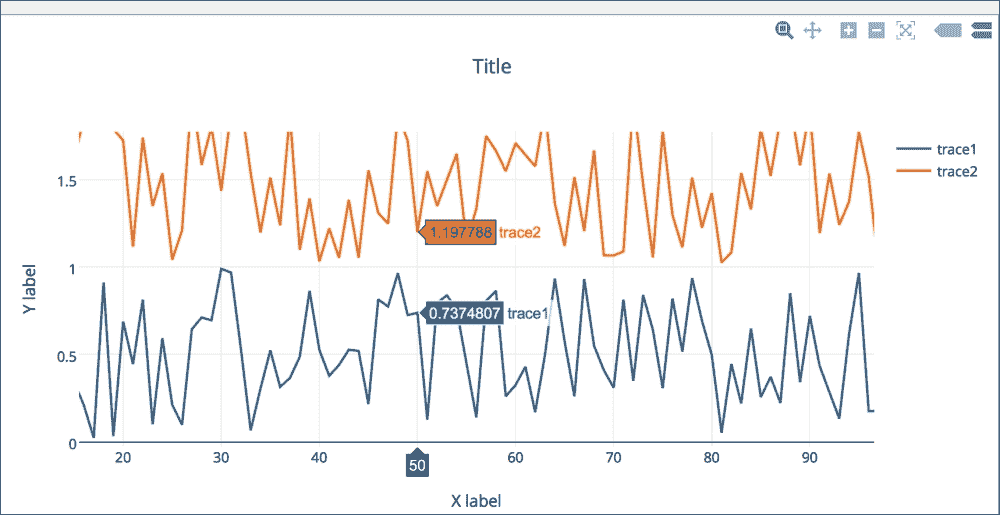

# 五、金融和统计模型

金融和经济模型主要帮助数据的简化和抽象，并广泛使用概率和统计。看一看数据总是很重要的；数据分析的第一步应该是绘制数据。诸如坏数据、异常值和缺失数据等问题通常可以通过可视化数据来检测。只要有可能，就应该纠正错误数据，否则就应该丢弃。然而，在一些不寻常的情况下，例如在股票市场，异常值是很好的数据，应该保留。总而言之，重要的是要检测出不良数据和异常值，并了解它们，以便采取适当的措施。数据变量的选择在这些模型中起着重要的作用。

变量的选择很重要，因为模型的性质通常会决定被考察的事实。例如，为了衡量通货膨胀，需要一个行为模型，这样你就可以了解价格的真实变化，以及与通货膨胀直接相关的价格变化。

我们可以讨论许多有趣的模型及其应用，但是为了不超出本书的范围，我们将选择一些例子。在某些情况下，比如蒙特卡洛，我们也会选择一些在体育运动中的应用。在后面的章节中，我们将讨论以下主题:

*   蒙特卡罗模拟—适用于许多领域的示例
*   带有示例的价格模型
*   通过示例了解波动性度量
*   门槛模型——炮击隔离模型
*   带有绘图选项的贝叶斯回归方法
*   几何布朗、基于扩散的模拟和投资组合估值
*   分析和创建实时交互图
*   统计和机器学习概述

计算金融是计算机科学的一个领域，处理金融建模中出现的数据和算法。对于一些读者来说，这一章的内容可能很好理解，但对于其他人来说，看看这些概念将有助于学习一些新的见解，这些见解可能对他们的生活有用，或者适用于他们的兴趣领域。

在您了解蒙特卡罗模拟方法的应用之前，让我们看一个非常简单的投资和一段时间内总回报的例子。

# 确定性模型

投资的最终目的是盈利，投资或亏损的收益取决于价格的变化和持有的资产数量。投资者通常对与初始投资规模高度相关的收入感兴趣。回报衡量这一点，主要是因为回报是一种资产。例如，股票、债券或股票和债券的投资组合根据定义表示为变化，价格表示为初始价格的一部分。让我们看看总回报的例子。

## 总回报

我们假设为*P*T3*t*T6】为<sub>T8T10】时刻的投资金额。简单的总回报表示如下:</sub>


在这里， *P* <sub>*t+1*</sub> 为归还的投资价值，回报为 *R* <sub>*t+1*</sub> 。例如，如果*P*<sub>*t*</sub>*= 10*和*P*<sub>*t+1*</sub>*= 10.6*，那么*R*<sub>*t+1*</sub>*= 0.06 = 6%*。收益是无标度的，意味着它们不依赖于单位，但是收益依赖于 *t* 的单位(小时、天等)。换句话说，如果 *t* 是以年来衡量的，那么，更准确地说，这个净回报是每年 6%。

最近 *k* 年的总回报是 *k* 单年总回报的乘积(从 *t-k* 到 *t* ，如下图所示:


这是一个确定性模型的例子，除了有一个我们没有提到的警告:你必须将通货膨胀率纳入每年的等式中。如果我们通过假设 *F* <sub>*t*</sub> 是对应于收益 *R* <sub>*t*</sub> 的通货膨胀，在前面的等式中包括这一点，我们将得到以下等式:


如果我们假设*F*<sub>*t*</sub>*= 0*，那么前面的等式将适用。假设我们不包括通货膨胀，问这个问题:“2010 年初始投资 1 万美元，回报率 6%，几年后我的投资会翻倍吗？”

让我们试着用 Python 程序找到的答案。在这个程序中，我们还必须添加一条几乎类似于 *y = 2x* 的直线，并查看它与在 *y* 轴上绘制的返回值曲线的交点，年份在 *x* 轴上。首先，我们将绘制无线图，以确定投资价值是否在 12 年内几乎翻了一番。然后，我们将计算直线的斜率 *m = 10，000/12 = 833.33* 。因此，我们将`833.33`的斜率值包含在程序中，以显示返回值和直线。下面的代码将返回值与直线重叠进行比较:

```py
import matplotlib.pyplot as plt

principle_value=10000  #invested amount
grossReturn = 1.06     # Rt

return_amt = []
x = []
y = [10000]
year=2010
return_amt.append(principle_value)
x.append(year)

for i in range(1,15):
  return_amt.append(return_amt[i-1] * grossReturn)
  print "Year-",i," Returned:",return_amt[i]

  year += 1
  x.append(year)
  y.append(833.33*(year-2010)+principle_value)

# set the grid to appear
plt.grid()

# plot the return values curve
plt.plot(x,return_amt, color='r')
plt.plot(x,y, color='b')

Year- 1 Returned: 10600.0
Year- 2 Returned: 11236.0
Year- 3 Returned: 11910.16
Year- 4 Returned: 12624.7696
Year- 5 Returned: 13382.255776
Year- 6 Returned: 14185.1911226
Year- 7 Returned: 15036.3025899
Year- 8 Returned: 15938.4807453
Year- 9 Returned: 16894.78959
Year- 10 Returned: 17908.4769654
Year- 11 Returned: 18982.9855834
Year- 12 Returned: 20121.9647184
Year- 13 Returned: 21329.2826015
Year- 14 Returned: 22609.0395575
```

看完图，你会想有没有办法弄清楚提供房贷的银行到底赚了多少钱。我们把这个留给你。


一个有趣的事实是，曲线在 2022 年之前与直线相交。此时，返回值正好是 20，000 美元。然而，在 2022 年，回报率将约为 20，121 美元。看了的总回报，股票也差不多吗？许多股票，尤其是成熟公司的股票，支付的股息必须计入等式。

如果在时间 *t* 之前支付股息(或利息) *D* <sub>*t*</sub> ，则时间 *t* 的总回报定义如下:


另一个例子是抵押贷款，从金融机构以一定的利率借入一定数量的贷款。在这里，为了了解业务的性质，我们将选择 35 万美元的贷款金额，利率为 5%，期限为 30 年。这是美国抵押贷款的一个典型例子(贷款金额和利率因贷款寻求者的信用历史和市场利率而异)。

一个简单的利息计算已知为 *P (1 + rt)* ，其中 *P* 为本金金额， *r* 为利率， *t* 为期限，因此 30 年期末累计金额为:


原来，到 30 年年底，你已经支付了两倍多的贷款金额(我们在这个计算中没有考虑房地产税):

```py
from decimal import Decimal
import matplotlib.pyplot as plt

colors = [(31, 119, 180),(174, 199, 232),(255,128,0),(255, 15, 14),
      (44, 160, 44),(152, 223, 138),(214, 39, 40),(255,173, 61),
      (148, 103, 189),(197, 176, 213),(140, 86, 75),(196, 156, 148),
      (227, 119, 194),(247, 182, 210),(127, 127, 127),
      (199, 199, 199),(188, 189, 34), (219, 219, 141), 
      (23, 190, 207), (158, 218, 229)]

# Scale the RGB values to the [0, 1] range, which is the format matplotlib accepts.
for i in range(len(colors)):
    r, g, b = colors[i]
    colors[i] = (r / 255., g / 255., b / 255.)

def printHeaders(term, extra):
    # Print headers
    print "\nExtra-Payment: $"+str(extra)+" Term:"+str(term)+" years"
    print "---------------------------------------------------------"
    print 'Pmt no'.rjust(6), ' ', 'Beg. bal.'.ljust(13), ' ',
    print 'Payment'.ljust(9), ' ', 'Principal'.ljust(9), ' ',
    print 'Interest'.ljust(9), ' ', 'End. bal.'.ljust(13)
    print ''.rjust(6, '-'), ' ', ''.ljust(13, '-'), ' ',
    print ''.rjust(9, '-'), ' ', ''.ljust(9, '-'), ' ',
    print ''.rjust(9, '-'), ' ', ''.ljust(13, '-'), ' '

def amortization_table(principal, rate, term, extrapayment, printData=False):
    xarr=[]
    begarr = []

    original_loan = principal
    money_saved=0
    total_payment=0
    payment = pmt(principal, rate, term)
    begBal = principal

    # Print data
    num=1
    endBal=1
    if printData == True: printHeaders(term, extrapayment)
    while  (num < term + 1) and (endBal >0):

        interest = round(begBal * (rate / (12 * 100.0)), 2)
        applied = extrapayment+round(payment - interest, 2)
        endBal = round(begBal - applied, 2)
        if (num-1)%12 == 0 or (endBal < applied+extrapayment):
          begarr.append(begBal)
          xarr.append(num/12)
          if printData == True:
              print '{0:3d}'.format(num).center(6), ' ',
              print '{0:,.2f}'.format(begBal).rjust(13), ' ',
              print '{0:,.2f}'.format(payment).rjust(9), ' ',
              print '{0:,.2f}'.format(applied).rjust(9), ' ',
              print '{0:,.2f}'.format(interest).rjust(9), ' ',
              print '{0:,.2f}'.format(endBal).rjust(13)
        total_payment += applied+extrapayment
        num +=1
        begBal = endBal
    if extrapayment > 0 :
      money_saved = abs(original_loan - total_payment)
      print '\nTotal Payment:','{0:,.2f}'.format(total_payment).rjust(13)
      print '  Money Saved:','{0:,.2f}'.format(money_saved).rjust(13)
    return xarr, begarr, '{0:,.2f}'.format(money_saved)

def pmt(principal, rate, term):
    ratePerTwelve = rate / (12 * 100.0)

    result = principal * (ratePerTwelve / (1 - (1 + ratePerTwelve) ** (-term)))

    # Convert to decimal and round off to two decimal
    # places.
    result = Decimal(result)
    result = round(result, 2)
    return result

plt.figure(figsize=(18, 14))

#amortization_table(150000, 4, 180, 500)
i=0
markers = ['o','s','D','^','v','*','p','s','D','o','s','D','^','v','*','p','s','D']
markersize=[8,8,8,12,8,8,8,12,8,8,8,8,8,8,8,8,8,8,8,8,8,8,8,8,8]

for extra in range(100,1700,100):
  xv, bv, saved = amortization_table(450000, 5, 360, extra, False)
  if extra == 0:
    plt.plot(xv, bv, color=colors[i], lw=2.2, label='Principal only', marker=markers[i], markersize=markersize[i])
  else:
    plt.plot(xv, bv, color=colors[i], lw=2.2, label="Principal plus\$"+str(extra)+str("/month, Saved:\$")+saved, marker=markers[i], markersize=markersize[i])
  i +=1

plt.grid(True)
plt.xlabel('Years', fontsize=18)
plt.ylabel('Mortgage Balance', fontsize=18)
plt.title("Mortgage Loan For $350,000 With Additional Payment Chart", fontsize=20)
plt.legend()
plt.show()
```

当这个程序运行时，你会得到所有额外付款情况下每 12 个月的摊销时间表，从 100 美元到 1600 美元。这只是其中一个例子:

```py
Extra-Payment: $800 Term: 30 years 
-----------------------------------------------------------------Pmt no   Beg. bal.   Payment   Principal   Interest    End. bal.     ------   ---------   -------   ---------   ---------   ------
  1      350,000.00  1,878.88* 1,220.55  1,458.33   348,779.45   
 13      335,013.07  1,878.88  1,282.99  1,395.89   333,730.08   
 25      319,259.40  1,878.88  1,348.63  1,330.25   317,910.77   
 37      302,699.75  1,878.88  1,417.63  1,261.25   301,282.12   
 49      285,292.85  1,878.88  1,490.16  1,188.72   283,802.69   
 61      266,995.41  1,878.88  1,566.40  1,112.48   265,429.01   
 73      247,761.81  1,878.88  1,646.54  1,032.34   246,115.27   
 85      227,544.19  1,878.88  1,730.78    948.10   225,813.41   
 97      206,292.20  1,878.88  1,819.33    859.55   204,472.87  
109      183,952.92  1,878.88  1,912.41    766.47   182,040.51  
121      160,470.74  1,878.88  2,010.25    668.63   158,460.49  
133      135,787.15  1,878.88  2,113.10    565.78   133,674.05  
145      109,840.70  1,878.88  2,221.21    457.67   107,619.49  
157       82,566.78  1,878.88  2,334.85    344.03    80,231.93  
169       53,897.49  1,878.88  2,454.31    224.57    51,443.18  
181       23,761.41  1,878.88  2,579.87     99.01    21,181.54  
188        5,474.98  1,878.88  2,656.07     22.81     2,818.91  
189        2,818.91  1,878.88  2,667.13     11.75       151.78  

* $1878.88 includes $1078.88 plus $800 extra payment towards principal
Total Payment: $504,526.47 Money Saved: $154,526.47
Approximately after 15 years 10 months, one can pay off in half the time.
```

Python 代码生成了以下图表，该图表将抵押贷款支付的额外储蓄与本金储蓄进行了比较:


前面的图显示了抵押贷款余额下降早于 30 年，通过支付额外的数额对本金数额。

固定利率抵押贷款的月付款是借款人每月支付的金额，以确保贷款在期限结束时全额支付利息。月还款额取决于利率( *r* )作为分数，月还款额( *N* )称为贷款期限，借款金额( *P* )称为贷款本金；当你重新排列普通年金现值的公式时，我们得到了每月支付的公式。然而，每个月，如果额外的金额与固定的每月付款一起支付，那么贷款金额可以在更短的时间内还清。

在下面的图表中，我们试图使用从程序中节省下来的钱，并将这些钱与 500 美元到 1300 美元范围内的额外金额进行比较。如果我们仔细看，有了 800 美元的额外金额，你可以节省几乎一半的贷款金额，并在一半的期限内还清贷款。


上图显示了三种不同贷款金额的储蓄，其中额外缴款沿 *x* 轴显示，以千计的储蓄沿 *y* 轴显示。下面的代码使用了一个气泡图，该图也直观地显示了抵押贷款本金的额外节省:

```py
import matplotlib.pyplot as plt

# set the savings value from previous example
yvals1 = [101000,111000,121000,131000,138000, 143000,148000,153000,158000]
yvals2 = [130000,142000,155000,160000,170000, 180000,190000,194000,200000]
yvals3 = [125000,139000,157000,171000,183000, 194000,205000,212000,220000]
xvals = ['500','600','700', '800', '900','1000','1100','1200','1300']

#initialize bubbles that will be scaled 
bubble1 = []
bubble2 = []
bubble3 = []

# scale it on something that can be displayed
# It should be scaled to 1000, but display will be too big 
# so we choose to scale by 5% (divide these by 20 again to relate 
# to real values)

for i in range(0,9): 
  bubble1.append(yvals1[i]/20) 
  bubble2.append(yvals2[i]/20) 
  bubble3.append(yvals3[i]/20) 

#plot yvalues with scaled by bubble sizes
#If bubbles are not scaled, they don't fit well
fig, ax = plt.subplots(figsize=(10,12))
plt1 = ax.scatter(xvals,yvals1, c='#d82730', s=bubble1, alpha=0.5)
plt2 = ax.scatter(xvals,yvals2, c='#2077b4', s=bubble2, alpha=0.5)
plt3 = ax.scatter(xvals,yvals3, c='#ff8010', s=bubble3, alpha=0.5)

#Set the labels and title 
ax.set_xlabel('Extra Dollar Amount', fontsize=16)
ax.set_ylabel('Savings', fontsize=16)
ax.set_title('Mortgage Savings (Paying Extra Every Month)', 
        fontsize=20)

#set x and y limits
ax.set_xlim(400,1450)
ax.set_ylim(90000,230000)

ax.grid(True)
ax.legend((plt1, plt2, plt3), ('$250,000 Loan', '$350,000 Loan',
     '$450,000 Loan'), scatterpoints=1, loc='upper left', 
      markerscale=0.17, fontsize=10, ncol=1)

fig.tight_layout()
plt.show()
```

通过创建散点图，可以更容易地查看哪种贷款类别比其他类别提供更多的储蓄，但为了简单起见，我们将只比较三种贷款金额:25 万美元、35 万美元和 45 万美元。

下图是散点图的结果，该散点图展示了每月支付额外费用所节省的费用:


# 随机模型

我们已经讨论了确定性模型，其中具有定量输入值的单个结果没有随机性。随机这个词来源于希腊单词 Stochastikos。意思是善于猜测或碰运气。这个的反义词是“确定的”、“确定的”或“确定的”。一个随机模型预测一组可能的结果，这些结果由它们的可能性或概率加权。例如，一枚硬币在空中翻转时，最终“肯定”会落在地球上，但它是正面还是反面是“随机”的。

## 蒙特卡罗模拟

蒙特卡洛模拟，也被视为概率模拟，是一种用于理解任何预测模型中风险和不确定性影响的技术。蒙特卡罗方法是 1940 年由斯坦尼斯瓦夫·乌拉姆发明的，当时他正在洛斯阿拉莫斯国家实验室从事几个核武器项目。如今，有了计算机，你可以很快生成随机数并运行模拟，但他令人惊讶地发现，这种方法是多年前计算非常困难的时候发现的。

在预测模型或任何提前计划未来的模型中，都有假设。这些可能是关于投资组合投资回报的假设，或者完成某项任务需要多长时间。由于这些是未来的预测，最好的办法是估计期望值。

### 蒙特卡洛模拟到底是什么？

蒙特卡罗模拟是一种迭代评估确定性模型的方法，该模型以随机数集作为输入。当模型复杂、非线性或涉及多个不确定参数时，通常使用这种方法。一个模拟通常会涉及超过 100，000 甚至一百万个模型评估。让我们看看确定性模型和随机模型之间的区别。确定性模型将具有确定性的实际输入，以产生一致的结果，如下图所示:


让我们看看概率模型和确定性模型有什么不同。

随机模型的输入是概率性的，来自概率密度函数，产生的结果也是概率性的。随机模型是这样的:


现在，我们如何用语言描述前面的图表？

首先，创建一个模型。假设你已经确定了三个随机输入: *x1* 、 *x2* 、 *x3* ，确定了一个方法: *f(x1，x2，x3)* ，生成了一组 10，000 个输入的随机值(在某些情况下，可以少也可以多)。评估这些输入的模型，对这 10000 个随机输入重复一遍，记录为 *yi* ，其中 *i* 从 1 到 10000 运行。分析结果，选择一个最有可能的。

例如，如果我们找到问题的答案，那就是“洛杉矶快船队赢得第七场比赛的概率是多少？”在篮球背景下的一些随机输入，对这个问题有合理的意义，你可以通过运行蒙特卡罗模拟找到答案，并获得一个答案:他们有 45%的概率会赢。实际上他们输了。

蒙特卡洛模拟严重依赖随机数发生器；因此，弄清楚什么是执行蒙特卡罗模拟的最快和最有效的方法是有意义的？Hans Petter Langtangen 完成了一项出色的任务，该任务表明通过将代码移植到位于[的 Cython 上，蒙特卡罗模拟可以变得更加高效，他还将其与纯 C 实现进行了比较。](http://hplgit.github.io/teamods/MC_cython/sphinx/main_MC_cython.html)

让我们考虑几个例子来说明蒙特卡罗模拟。第一个例子显示了库存问题。稍后，我们将讨论体育中的一个示例(蒙特卡罗模拟适用于许多体育分析。

### 蒙特卡罗模拟中的一个库存问题

一名水果零售商销售人员每天销售一些水果并订购“T1”Y“T2”单位。每卖出一个单位就有 60 美分的利润，而在一天结束时没有卖出的单位则以每单位 40 美分的亏损被抛出。任意给定日期的需求 *D* 在【80，140】上均匀分布。零售商应该订购多少台才能使预期利润最大化？

让我们把利润表示为 *P* 。当您试图根据前面的问题描述创建方程时， *s* 表示售出的单位数量，而 *d* 表示需求，如下式所示:


使用这个利润的表示，下面的 Python 程序显示了最大利润:

```py
import numpy as np
from math import log

import matplotlib.pyplot as plt

x=[]
y=[]

#Equation that defines Profit
def generateProfit(d):

   global s

   if d >= s: 
     return 0.6*s
   else:
     return 0.6*d - 0.4*(s-d)

# Although y comes from uniform distribution in [80,140]
# we are running simulation for d in [20,305]

maxprofit=0

for s in range (20, 305):

  # Run a simulation for n = 1000 
  # Even if we run for n = 10,000 the result would
  # be almost the same
  for i in range(1,1000):

     # generate a random value of d 
     d = np.random.randint(10,high=200)

     # for this random value of d, find profit and
     # update maxprofit
     profit = generateProfit(d)
     if profit > maxprofit:
        maxprofit = profit

  #store the value of s to be plotted along X axis 
  x.append(s)

  #store the value of maxprofit plotted along Y axis 
  y.append(log(maxprofit)) # plotted on log scale

plt.plot(x,y)
print "Max Profit:",maxprofit

# Will display this
Max Profit: 119.4
```

如下图所示，销量越多利润越大，但满足需求时，最大利润保持不变:


前面的图是对数刻度上显示的，这意味着 *n=1000* 的模拟运行的最大利润是 119.4。现在，让我们试着看一下解析解，看看模拟结果与解析方法的结果有多接近。

由于需求( *D* )在【80，140】中均匀分布，预期利润由以下积分得出:


使用分析方法的答案是 116，蒙特卡罗模拟也产生了大约这个数字:119。有时，它会产生 118 或 116。这取决于试验的次数。

让我们考虑另一个简单的例子，并寻求问题的答案:“在一个满是 30 名学生的教室里，一个以上的人过同一个生日的概率是多少？”我们将假设它不是闰年，而不是使用月和日，我们将只使用日历年中的天数，即 365 天。逻辑很简单。下面的代码显示了如何计算在 30 个学生的房间里，不止一个人过同一个生日的概率:

```py
import numpy as np
numstudents = 30
numTrials = 10000
numWithSameBday = 0

for trial in range(numTrials):
    year = [0]*365

    for i in range(numstudents):
        newBDay = np.random.randint(365)
        year[newBDay] = year[newBDay] + 1

    haveSameBday = False
    for num in year:
        if num > 1:
           haveSameBday = True

    if haveSameBday == True:
        numWithSameBday = numWithSameBday + 1

prob = float(numWithSameBday) / float(numTrials)
print("The probability of a shared birthday in a class of ", numstudents, " is ", prob) 

('The probability of a shared birthday in a class of ', 30, ' is ', 0.7055)
```

换句话说，在一个 30 名学生的班级里，有 70%的概率两个人过同一个生日。下面的例子说明了如何应用蒙特卡罗模拟来知道在今天比过去更经常发生的情况下赢得比赛的可能性。

### 蒙特卡洛模拟在篮球中的应用

让我们考虑一个篮球比赛中的例子，它是在汗学院用 JavaScript 编写的。问题是，“当落后 3 分，只剩下 30 秒的时候，是尝试一个艰难的三分球还是一个轻松的两分球，然后再得到一次控球权？”(勒布朗·詹姆斯提问)。

大多数读者可能理解篮球比赛，但我们只会强调一些重要的规则。每个队都有 24 秒的控球时间。在这段时间内，如果他们得分(甚至在更短的时间内)，对方球队将在接下来的 24 秒内获得控球权。然而，由于只剩下 30 秒，如果一名球员可以在大约不到 10 秒的时间内快速投进 3 分，那么对方球队还剩 20 秒左右。篮球和其他任何运动一样，竞争非常激烈，既然球员的目标是减少落后分，那么拿到 3 分对他们最有利。让我们试着写一个 Python 程序来回答这个问题。

在展示模拟程序之前，让我们看一下这个问题域中涉及的一些参数。为了确定在获胜概率方面，投三分球是否更好，球员和对方球队的以下统计非常重要。球员的`threePtPercent`、`twoPtPercent`不仅决定了他的实力，还决定了对方球队得标为`oppTwoPtPercent`的 2 分的百分比，以及对方球队在标为`oppFtPercent`的罚球百分比中的实力。

也有其他组合，但为了简单起见，我们就到此为止。对方的罚球命中率越高，我们的答案就越倾向于投三分球。您可以降低`oppFtPercent`的值，看看这里讨论的是什么。在这个例子中，我们将以不同的部分显示片段，您可以用任何您觉得合适的方式将它们放在一起，并使用它们来运行。首先，我们需要 NumPy 包，因为在这里，我们打算使用这个包中的随机数生成器，并且需要`matplotlib`来绘制，如下代码所示:

```py
import numpy as np
import matplotlib.pyplot as plt
```

在许多示例中，我们将使用 tableau 中使用的标准颜色，您可能希望将其放在单独的文件中。以下颜色代码阵列可用于任何可视化绘图:

```py
colors = [(31, 119, 180), (174, 199, 232), (255, 127,  14),
   (255, 187, 120), (44, 160, 44), (214,  39,  40), (148,103,189),
   (152, 223, 138), (255,152,150), (197, 176, 213), (140, 86, 75),
   (196, 156, 148), (227,119,194), (247, 182, 210), (127,127,127),
   (199, 199, 199),(188,189, 34),(219, 219, 141), (23, 190,207),
   (158, 218, 229),(217,217,217)]

# Scale RGB values to the [0, 1] range, format matplotlib accepts.
for i in range(len(colors)):
  r, g, b = colors[i]
  colors[i] = (r / 255., g / 255., b / 255.)
```

我们来看看的三分尝试。如果`threePtPercent`大于随机数，加班的概率更大，那么就保证赢。看看下面的代码:

```py
def attemptThree():
  if np.random.randint(0, high=100) < threePtPercent:
    if np.random.randint(0, high=100) < overtimePercent:
      return True #We won!!
  return False #We either missed the 3 or lost in OT
```

两点尝试的逻辑有点复杂，因为这一切都是关于还剩多少时间和谁拥有球权。假设平均来说，尝试一次两分球只需要 5 秒钟，并且玩家标记为`twoPtPercent`的两分球得分百分比相当高，那么他们就可以获得一次两分球，这将从`pointsDown`变量中的值中扣除。以下功能用于两点评分尝试:

```py
def attemptTwo():
  havePossession = True
  pointsDown = 3
  timeLeft = 30
  while (timeLeft > 0):
    #What to do if we have possession
    if (havePossession):
      #If we are down by 3 or more, we take the
      #2 quickly.  If we are down by 2 or less
      #We run down the clock first
      if (pointsDown >= 3):
        timeLeft -= timeToShoot2
      else:
        timeLeft = 0

      #Do we make the shot?
      if (np.random.randint(0, high=100) < twoPtPercent):
        pointsDown -= 2
        havePossession = False
    else:
      #Does the opponent team rebound?
      #If so, we lose possession.
      #This doesn't really matter when we run
      #the clock down
      if (np.random.randint(0, high=100) >= offenseReboundPercent):
        havePossession = False
      else:   #cases where we don't have possession
        if (pointsDown > 0):  #foul to get back possession

          #takes time to foul
          timeLeft -= timeToFoul

          #opponent takes 2 free throws
          if (np.random.randint(0, high=100) < oppFtPercent):
            pointsDown += 1

          if (np.random.randint(0, high=100) < oppFtPercent):
            pointsDown += 1
            havePossession = True
        else:
          if (np.random.randint(0, high=100) >= ftReboundPercent):
            #you were able to rebound the missed ft
            havePossession = True
          else:  
            #tied or up so don't want to foul; 
            #assume opponent to run out clock and take
            if (np.random.randint(0, high=100) < oppTwoPtPercent):
              pointsDown += 2 #They made the 2
            timeLeft = 0

  if (pointsDown > 0):
    return False
  else:
    if (pointsDown < 0):
      return True
    else:
      if (np.random.randint(0, high=100) < overtimePercent):
        return True
      else:
        return False
```

为了比较，我们将选择 5 名平均分不错或者平均分 2 分或者两者兼有的玩家，如下代码所示:

```py
plt.figure(figsize=(14,14))
names=['Lebron James', 'Kyrie Irving', 'Steph Curry', 
       'Kyle Krover', 'Dirk Nowitzki']
threePercents = [35.4,46.8,44.3,49.2, 38.0]
twoPercents = [53.6,49.1,52.8, 47.0,48.6]
colind=0

for i in range(5):  # can be run individually as well
  x=[]
  y1=[]
  y2=[]
  trials = 400 #Number of trials to run for simulation
  threePtPercent = threePercents[i] # % chance of making 3-pt shot
  twoPtPercent = twoPercents[i] # % chance of making a 2-pt shot
  oppTwoPtPercent = 40 #Opponent % chance making 2-pter
  oppFtPercent = 70 #Opponent's FT %
  timeToShoot2 = 5 #How many seconds elapse to shoot a 2
  timeToFoul = 5 #How many seconds elapse to foul opponent
  offenseReboundPercent = 25 #% of regular offense rebound
  ftReboundPercent = 15 #% of offense rebound after missed FT
  overtimePercent = 50 #% chance of winning in overtime

  winsTakingThree = 0
  lossTakingThree = 0
  winsTakingTwo = 0
  lossTakingTwo = 0
  curTrial = 1

  while curTrial < trials:
    #run a trial take the 3
    if (attemptThree()):
      winsTakingThree += 1
    else:
      lossTakingThree += 1
      #run a trial taking a 2
      if attemptTwo() == True :
        winsTakingTwo += 1
      else:
        lossTakingTwo += 1

      x.append(curTrial)
      y1.append(winsTakingThree)
      y2.append(winsTakingTwo)
      curTrial += 1

  plt.plot(x,y1, color=colors[colind], label=names[i]+" Wins Taking Three Point", linewidth=2)
  plt.plot(x,y2, color=colors[20], label=names[i]+" Wins Taking Two Point", linewidth=1.2)
  colind += 2

legend = plt.legend(loc='upper left', shadow=True,)
for legobj in legend.legendHandles:
    legobj.set_linewidth(2.6)
plt.show()
```

这是通过设置范围`1`为单个玩家运行的，并且只包括该玩家的姓名和统计数据。在所有情况下，由于对手队的 2 分率很高(70%)，对于所有球员，蒙特卡罗模拟通过 3 分得分产生了获胜的建议。让我们看看其中一个单独绘制和全部绘制在一起时的结果。

我们从[http://www.basketball-reference.com/teams/](http://www.basketball-reference.com/teams/)的最新统计数据中挑选出了 3 分命中率相当不错的球员。统计数据截至 2015 年 5 月 12 日。在所有情况下，尝试得分 3 分更有可能获胜。如果对方球队的平均罚球数更低，那么结果就会不一样。

以下两个图显示了一名球员和五名从 NBA 联盟(2015)中选出的球员的结果:


前面的截图显示了勒布朗的三分和两分尝试。以下绘图展示了其他四位玩家的尝试进行对比:


### 波动图

到目前为止，我们已经看到了许多有用的 Python 包。一次又一次，我们看到了 matplotlib 的使用，但在这里，我们将用很少的代码行展示熊猫的使用，这样您就可以快速实现金融绘图。标准差是一个统计术语，用来衡量平均值周围的变化量或离差。这也是衡量波动性的一个指标。

根据定义，离差是实际值和平均值之间的差值。为了将波动性与封闭值一起绘制，这个示例说明了如何从给定的开始日期看到特定股票(如 IBM)的表现，并使用以下代码查看波动性:

```py
import pandas.io.data as stockdata
import numpy as np
r,g,b=(31,  119, 180)
colornow=(r/255.,g/255.,b/255.)
ibmquotes = stockdata.DataReader(name='IBM', data_source='yahoo', start='2005-10-1')
ibmquotes['Volatility'] = np.log(ibmquotes['Close']/
    ibmquotes['Close'].shift(1))
ibmquotes[['Close', 'Volatility']].plot(figsize=(12,10), \
    subplots=True, color=colornow) 
```

以下截图是波动图的结果:


现在，让我们看看如何衡量我们的波动性。波动性是衡量价格变化的尺度，可以有各种峰值。而且，指数函数让我们插入时间，给我们成长；对数(指数的倒数)让我们插入增长，并给我们时间度量。以下片段显示了衡量波动性的对数图:

```py
%time
ibmquotes['VolatilityTest'] = 0.0
for I in range(1, len(ibmquotes)):
  ibmquotes['VolatilityTest'] = 
    np.log(ibmquotes['Close'][i]/ibmquotes['Close'][i-1])
```

如果我们对此进行计时，前面的片段将采用以下内容:

```py
CPU times: user 1e+03 ns, sys: 0 ns, total: 1e+03 ns Wall time: 5.01 µs
```

为了细分并展示我们是如何做到的，我们使用`%time`并使用收盘值与收盘值变化的比率来分配波动性度量，如下所示:

```py
%time
ibmquotes['Volatility'] = np.log(ibmquotes['Close']/ ibmquotes['Close'].shift(1))
```

如果我们对此进行计时，前面的片段将采用以下内容:

```py
CPU times: user 2 µs, sys: 3 µs, total: 5 µs Wall time: 5.01 µs.
```

它们的价值差异越大，结果就越不稳定。在我们试图绘制波动率相对于行权价格的隐含波动率之前，让我们看看 VSTOXX 数据。该数据可从[http://www.stoxx.com](http://www.stoxx.com)或[http://www.eurexchange.com/advanced-services/](http://www.eurexchange.com/advanced-services/)下载。VSTOXX 数据的示例行如下所示:

```py
            V2TX   V6I1   V6I2   V6I3   V6I4   V6I5   V6I6   V6I7   V6I8 
  Date                                                                     
2015-05-18  21.01  21.01  21.04    NaN  21.12  21.16  21.34  21.75 21.84 
2015-05-19  20.05  20.06  20.15  17.95  20.27  20.53  20.83  21.38 21.50 
2015-05-20  19.57  19.57  19.82  20.05  20.22  20.40  20.63  21.25 21.44 
2015-05-21  19.53  19.49  19.95  20.14  20.39  20.65  20.94  21.38 21.55
2015-05-22  19.63  19.55  20.07  20.31  20.59  20.83  21.09  21.59 21.73
```

该数据文件由欧洲斯托克指数组成，所有这些指数都可以通过一个简单的过滤机制绘制，日期在 2011 年 12 月 31 日至 2015 年 5 月 1 日之间。以下代码可用于绘制 VSTOXX 数据:

```py
import pandas as pd

url = 'http://www.stoxx.com/download/historical_values/h_vstoxx.txt'
vstoxx_index = pd.read_csv(url, index_col=0, header=2,
                           parse_dates=True, dayfirst=True,
                           sep=',')
vstoxx_short = vstoxx_index[('2011/12/31' < vstoxx_index.index)
                            & (vstoxx_index.index < '2015/5/1')]
# to plot all together
vstoxx_short.plot(figsize=(15,14))
```

当运行前面的代码时，它会创建一个比较欧洲斯托克指数波动性的图:


前面的图显示了一起绘制的所有索引，但是如果它们要绘制在单独的子图上，您可能需要将以下子图设置为`True`:

```py
# to plot in subplots separately
vstoxx_short.plot(subplots=True, grid=True, color='r',
     figsize=(20,20), linewidth=2)
```


### 隐含波动率

布莱克-斯科尔斯-默顿模型是金融市场的统计模型。从这个模型中，可以找到对欧式期权价格的估计。这个公式被广泛使用，许多经验测试表明，布莱克-斯科尔斯价格“相当接近”观察到的价格。费希尔·布莱克和迈伦·斯克尔斯在他们 1973 年的论文《期权和公司负债的定价》中首次发表了这个模型。该模型背后的主要思想是通过以正确的方式买卖标的资产来对冲期权。

在这个模型中，非分散支付股票的欧式看涨期权的价格如下:


对于给定的欧式看涨期权， *C* <sub>*g*</sub> ，隐含波动率由前面的等式(对数收益率的标准差)计算得出。期权定价公式对波动率的偏导数称为 **Vega** 。这是一个数字，表明如果波动率为正的 1%且仅波动率为正，期权价格将向哪个方向移动以及移动到什么程度，如下式所示:


波动率模型(如 BSM)预测波动率以及该模型的金融用途，预测未来收益的特征。这种预测用于风险管理和对冲、市场时机、投资组合选择和许多其他金融活动。美式看涨或看跌期权为您提供了随时行权的权利，但对于欧式看涨或看跌期权，您只能在到期日行权。

**Black-Scholes-Merton**(**BSM**)没有封闭形式的解，但是使用牛顿法(也称为牛顿-拉夫森法)，可以通过迭代获得近似值。每当涉及迭代方法时，都会有一定数量的阈值来确定迭代的终止条件。让我们看一下 Python 代码，通过迭代(牛顿法)找到这些值并绘制出来:


```py
from math import log, sqrt, exp
from scipy import stats
import pandas as pd
import matplotlib.pyplot as plt

colors = [(31, 119, 180), (174, 199, 232), (255,128,0), 
 (255, 15, 14), (44, 160, 44), (152, 223, 138), (214, 39, 40), 
 (255, 152, 150),(148, 103, 189), (197, 176, 213), (140, 86, 75),
(196, 156, 148),(227, 119, 194), (247, 182, 210), (127, 127, 127),
(199, 199, 199),(188, 189, 34), (219, 219, 141), (23, 190, 207),
(158, 218, 229)]

# Scale the RGB values to the [0, 1] range, which is the format matplotlib accepts.
for i in range(len(colors)):
  r, g, b = colors[i]
  colors[i] = (r / 255., g / 255., b / 255.)

def black_scholes_merton(S, r, sigma, X, T):

  S = float(S) # convert to float
  logsoverx = log (S/X)
  halfsigmasquare = 0.5 * sigma ** 2
  sigmasqrtT = sigma * sqrt(T)

  d1 = logsoverx + ((r + halfsigmasquare) * T) / sigmasqrtT
  d2 = logsoverx + ((r - halfsigmasquare) * T) / sigmasqrtT

  # stats.norm.cdf —> cumulative distribution function
  value = (S * stats.norm.cdf(d1, 0.0, 1.0) – 
     X * exp(-r * T) *   stats.norm.cdf(d2, 0.0, 1.0))

  return value

def vega(S, r, sigma, X, T):

  S = float(S)
  logsoverx = log (S/X)
  halfsigmasquare = 0.5 * sigma ** 2
  sigmasqrtT = sigma * sqrt(T) 
  d1 = logsoverx + ((r + halfsigmasquare) * T) / sigmasqrtT
  vega = S * stats.norm.cdf(d1, 0.0, 1.0) * sqrt(T)

  return vega 

def impliedVolatility(S, r, sigma_est, X, T, Cstar, it):

  for i in range(it):
    numer = (black_scholes_merton(S, r, sigma_est, X, T) - Cstar)
    denom = vega(S,r, sigma_est, X, T)
    sigma_est -= numer/denom

  return sigma_est
```

我们已经准备好使用这些函数，它们可以在单独的文件中使用并导入，或者只运行一次，完全嵌入代码中。输入文件是从[stoxx.com](http://stoxx.com)获得的一个名为`vstoxx_data.h5`的文件，如下代码所示:

```py
h5 = pd.HDFStore('myData/vstoxx_data_31032014.h5', 'r')

futures_data = h5['futures_data'] # VSTOXX futures data
options_data = h5['options_data'] # VSTOXX call option data

h5.close()

options_data['IMP_VOL'] = 0.0
V0 = 17.6639  # the closing value of the index
r=0.04        # risk free interest rate
sigma_est=2
tol = 0.5     # tolerance level for moneyness
```

现在，让我们用`options_data`和`futures_data`值形式运行迭代:

```py
for option in options_data.index:
  # iterating over all option quotes
  futureval = futures_data[futures_data['MATURITY'] == 
      options_data.loc[option]['MATURITY']]['PRICE'].values[0]

  # picking the right futures value 
  if (futureval * (1 - tol) < options_data.loc[option]['STRIKE'] 
    < futureval * (1 + tol)):
    impliedVol = impliedVolatility(V0,r,sigma_est,
            options_data.loc[option]['STRIKE'], 
            options_data.loc[option]['TTM'], 
            options_data.loc[option]['PRICE'],  #Cn
            it=100)                             #iterations 
    options_data['IMP_VOL'].loc[option] = impliedVol

plot_data = options_data[options_data['IMP_VOL'] > 0]
maturities = sorted(set(options_data['MATURITY']))

plt.figure(figsize=(15, 10))

i=0
for maturity in maturities:

  data = plot_data[options_data.MATURITY == maturity]

  # select data for this maturity
  plot_args = {'lw':3, 'markersize': 9}
  plt.plot(data['STRIKE'], data['IMP_VOL'], label=maturity.date(),
       marker='o', color=colors[i], **plot_args)
  i += 1

plt.grid(True)

plt.xlabel('Strike rate $X$', fontsize=18)
plt.ylabel(r'Implied volatility of $\sigma$', fontsize=18)
plt.title('Short Maturity Window (Volatility Smile)', fontsize=22)

plt.legend()
plt.show()
```

下图是运行前面程序的结果，该程序使用从[http://vstoxx.com](http://vstoxx.com)下载的数据展示了隐含波动率与罢工率的关系。或者，可以在[http://knapdata.com/python/vstoxx_data_31032014.h5](http://knapdata.com/python/vstoxx_data_31032014.h5)下载。下图显示了相对于欧洲斯托克指数的隐含波动率:


## 投资组合估值

对一个实体的投资组合估值的常见意义是估计其当前价值。估值通常适用于金融资产或负债，可以对股票、期权、企业或无形资产进行。为了理解估值和它们的可视化方法，我们将挑选共同基金并绘制它们，比较它们，并找到相关性。

让我们假设我们对以单一货币计价的所有投资组合进行估值。这大大简化了投资组合中的价值聚合。

我们将从 Vanguard 中挑选三只基金，如 Vanguard 美国 Total ( `vus.to`)、Vanguard 加拿大 cap(`vre.to`)和 Vanguard 新兴市场(`vee.to`)。下面的代码显示了三只 Vanguard 基金的比较。

```py
import pandas as pd   #gets numpy as pd.np

from pandas.io.data import get_data_yahoo
import matplotlib.pyplot as plt

# get data
data = get_data_yahoo(["vus.to","vre.to","vee.to"], 
  start = '2014-01-01')['Adj Close']

data.plot(figsize=(10,10), lw=2) 
plt.show()
```

还有另一种从`pandas.io.data`使用 `get_data_yahoo()`获取数据的方式，如下图截图所示:


除了绘制它们之外，还可以在将价格转换为日志回报后获得相关矩阵，以便缩放这些值，如以下代码所示:

```py
#convert prices to log returns
retn=data.apply(pd.np.log).diff()

# make corr matrix
retn.corr()

#make scatterplot to show correlation
pd.tools.plotting.scatter_matrix(retn, figsize=(10,10))
plt.show()

# some more stats
retn.skew()
retn.kurt()
# Output
vee.to    0.533157 
vre.to    3.717143 
vus.to    0.906644 
dtype: float64
```

相关图如下图所示。这个是在应用`skew()`和`kurt()`相关后，使用熊猫的`scatter_matrix`函数获得的:


## 仿真模型

模型是结构和系统功能的表示。模型类似于它所代表的系统，更容易理解。系统的模拟是系统的工作模型。该模型通常是可重新配置的，以允许频繁的实验。该模型的运行对研究该模型是有用的。在建立现有系统之前，模拟是有用的，以减少故障的可能性，从而满足规格。

特定系统何时适合模拟模型？一般来说，每当需要对系统中的随机性进行建模和分析时，仿真是首选的工具。

## 几何布朗模拟

布朗运动是随机游走的一个例子，广泛用于物理过程建模，如扩散和生物过程以及社会和金融过程(如股票市场的动态)。

布朗运动是一种复杂的方法。这是基于 1827 年布朗在植物中发现的一个过程。它有一系列的应用，包括模拟图像中的噪声、生成分形、晶体的生长和股票市场模拟。出于此处内容相关性的目的，我们将选择后者，即股市模拟。

米（meter 的缩写））F.M .奥斯本研究了普通股价格和货币价值的对数，并表明它们在统计均衡中有一系列影响。利用统计数据和随机时间的股票选择价格，他能够推导出一个分布函数，该函数非常类似于布朗运动中粒子的分布。

**几何布朗运动的定义**:

一个随机过程( *S* <sub>*t*</sub> )如果满足以下随机微分方程，则称其遵循几何布朗运动:


综合双方，应用初始条件:*S*<sub>*t*</sub>*= S*<sub>*o*</sub>，可以得出上述方程的解如下:


利用前面的推导，我们可以插入值，得到以下布朗运动:

```py
import matplotlib.pyplot as plt
import numpy as np

'''
Geometric Brownian Motion with drift!
u=drift factor 
sigma: volatility 
T: time span
dt: length of steps
S0: Stock Price in t=0
W: Brownian Motion with Drift N[0,1] 
'''
rect = [0.1, 5.0, 0.1, 0.1]
fig = plt.figure(figsize=(10,10))

T = 2
mu = 0.1
sigma = 0.04
S0 = 20
dt = 0.01
N = round(T/dt)
t = np.linspace(0, T, N)

# Standare normal distrib
W = np.random.standard_normal(size = N) 
W = np.cumsum(W)*np.sqrt(dt) 

X = (mu-0.5*sigma**2)*t + sigma*W

#Brownian Motion 
S = S0*np.exp(X) 

plt.plot(t, S, lw=2)
plt.xlabel("Time t", fontsize=16)
plt.ylabel("S", fontsize=16)
plt.title("Geometric Brownian Motion (Simulation)",
  fontsize=18)
plt.show()
```

布朗运动模拟的结果如下截图所示:


使用布朗运动模拟股票价格也显示在下面的代码中:

```py
import pylab, random

class Stock(object):
    def __init__(self, price, distribution):
        self.price = price
        self.history = [price]
        self.distribution = distribution
        self.lastChange = 0

    def setPrice(self, price):
        self.price = price
        self.history.append(price)

    def getPrice(self):
        return self.price

    def walkIt(self, marketBias, mo):
        oldPrice = self.price
        baseMove = self.distribution() + marketBias
        self.price = self.price * (1.0 + baseMove)
        if mo:
            self.price = self.price + random.gauss(.5, .5)*self.lastChange
        if self.price < 0.01:
            self.price = 0.0
        self.history.append(self.price)
        self.lastChange = oldPrice - self.price

    def plotIt(self, figNum):
        pylab.figure(figNum)
        pylab.plot(self.history)
        pylab.title('Closing Price Simulation Run-' + str(figNum))
        pylab.xlabel('Day')
        pylab.ylabel('Price')

def testStockSimulation():
    def runSimulation(stocks, fig, mo):
        mean = 0.0
        for s in stocks:
            for d in range(numDays):
                s.walkIt(bias, mo)
            s.plotIt(fig)
            mean += s.getPrice()
        mean = mean/float(numStocks)
        pylab.axhline(mean)
    pylab.figure(figsize=(12,12))
    numStocks = 20
    numDays = 400
    stocks = []
    bias = 0.0
    mo = False
    startvalues = [100,500,200,300,100,100,100,200,200, 300,300,400,500,00,300,100,100,100,200,200,300]
    for i in range(numStocks):
        volatility = random.uniform(0,0.2)
        d1 = lambda: random.uniform(-volatility, volatility)
        stocks.append(Stock(startvalues[i], d1))
    runSimulation(stocks, 1, mo)

testStockSimulation()
pylab.show()
```

使用来自均匀分布的随机数据的收盘价模拟的结果如下截图所示:


## 基于扩散的模拟

随机模型提供了对反应扩散过程更详细的理解。这样的描述对于生物系统的建模通常是必要的。已经研究了各种各样的模拟模型，为了在本章的上下文中限制我们自己，我们将考虑平方根扩散。

由考克斯、英格索尔和罗斯(1985)为金融推广的平方根扩散被用于建模均值回复量(如利率和波动性)。这个过程的随机微分方程如下:


*x* <sub>*t*</sub> 的值具有卡方分布，但是在离散版本中，它们可以用正态分布来近似。对于离散版本，我们指的是使用迭代方法应用欧拉数值近似方法，如下式所示:


```py
import numpy as np
import matplotlib.pyplot as plt
import numpy.random as npr

S0 = 100 # initial value
r = 0.05 
sigma = 0.25 
T = 2.0 

x0=0
k=1.8
theta=0.24
i = 100000
M = 50
dt = T / M
def srd_euler():
  xh = np.zeros((M + 1, i))
  x1 = np.zeros_like(xh)
  xh[0] = x0
  x1[0] = x0
  for t in range(1, M + 1):
   xh[t] = (xh[t - 1]
    + k * (theta - np.maximum(xh[t - 1], 0)) * dt
    + sigma * np.sqrt(np.maximum(xh[t - 1], 0)) * np.sqrt(dt) 
    * npr.standard_normal(i))
  x1 = np.maximum(xh, 0)
  return x1
x1 = srd_euler()

plt.figure(figsize=(10,6))
plt.hist(x1[-1], bins=30, color='#98DE2f', alpha=0.85)
plt.xlabel('value')
plt.ylabel('frequency')
plt.grid(False)

plt.figure(figsize=(12,10))
plt.plot(x1[:, :10], lw=2.2)
plt.title("Square-Root Diffusion - Simulation")
plt.xlabel('Time', fontsize=16)
plt.ylabel('Index Level', fontsize=16)
#plt.grid(True)
plt.show()
```


# 阈值模型

阈值模型是任何模型，其中一些阈值用于区分值的范围，其中模型预测的行为以某种重要的方式收敛。谢林试图通过构建两个模拟模型来模拟个体相互作用时的分离动力学。

## 谢林的隔离模型

**谢林的** **隔离模式** ( **SSM** )最早由托马斯 C·谢林提出。这个模型是能够自组织的系统的第一个构造模型之一。

谢林通过将便士和一角硬币放在棋盘上，并根据各种规则移动它们来进行实验。在他的实验中，他使用了一个类似于城市的棋盘，棋盘的正方形代表住所，正方形代表邻居。便士和一角硬币(视觉上也不同)可以代表两个群体的吸烟者、不吸烟者、男性、女性、高管、非高管、学生或教师。

模拟规则将终止条件指定为*没有任何代理因为开心*而从当前位置移动，这意味着如果代理不开心*就会移动*。

谢林模型被用来模拟教室的隔离，该模型表明，即使是对相邻同学的微弱偏好，隔离模式也可能发生。

假设我们根据学生的优先级有三种类型的学生类别:*运动类*、*高级熟练度学术类*和*普通类*，每种类型分别为 *0* 、 *1* 和 *2* 。

为了便于说明，我们假设一所高中有 250 名不同类型的学生。每个代理代表一名学生。这些代理人都住在一个单一的单位广场上(这可以想象成一所高中建筑)。代理人的位置只是一个点 *(x，y)* ，这里 *0 < x，y < 1* 。如果一个代理的 12 个最近的邻居中有一半或更多是同一类型的(从欧几里得距离来看是最近的)，那么这个代理就是幸福的。每个代理的初始位置是从二元均匀分布中独立得出的，如以下代码所示:

```py
from random import uniform, seed
from math import sqrt
import matplotlib.pyplot as plt

num = 250             # These many agents of a particular type
numNeighbors = 12     # Number of agents regarded as neighbors
requireSameType = 8   # At least this many neighbors to be same type

seed(10)  # for reproducible random numbers

class StudentAgent:

    def __init__(self, type):
        #Students of different type will be shown in colors
        self.type = type
        self.show_position()

    def show_position(self):
        # position changed by using uniform(x,y)
        self.position = uniform(0, 1), uniform(0, 1)

    def get_distance(self, other):
        #returns euclidean distance between self and other agent.
        a = (self.position[0] - other.position[0])**2
        b = (self.position[1] - other.position[1])**2
        return sqrt(a + b)

    def happy(self, agents):
        "returns True if reqd number of neighbors are the same type."
        distances = []

        for agent in agents:
            if self != agent:
                distance = self.get_distance(agent)
                distances.append((distance, agent))
        distances.sort()
        neighbors = [agent for d, agent in distances[:numNeighbors]]
        numSameType = sum(self.type == agent.type 
            for agent in neighbors)
        return numSameType >= requireSameType

    def update(self, agents):
        "If not happy, randomly choose new positions until happy."
        while not self.happy(agents):
            self.show_position()

def plot_distribution(agents, cycle_num):

    x1,y1 = [],[]
    x2,y2 = [],[]
    x3,y3 = [],[]

    for agent in agents:
        x, y = agent.position
        if agent.type == 0:
            x1.append(x); y1.append(y)
        elif agent.type == 1:
            x2.append(x); y2.append(y)        
        else:
            x3.append(x); y3.append(y)

    fig, ax = plt.subplots(figsize=(10,10))
    plot_args = {'markersize' : 8, 'alpha' : 0.65, 'markersize': 14}
    ax.set_axis_bgcolor('#ffffff')
    ax.plot(x1, y1, 'o', markerfacecolor='#1b62a5',  **plot_args)
    ax.plot(x2, y2, 'o', markerfacecolor='#279321', **plot_args)
    ax.plot(x3, y3, 'D', markerfacecolor='#fd6610', **plot_args)
    ax.set_title('Iteration {}'.format(cycle_num))
    plt.show()

agents = [StudentAgent(0) for i in range(num)]
agents.extend(StudentAgent(1) for i in range(num))
agents.extend(StudentAgent(2) for i in range(num))
count = 1
terminate=False
while terminate == False:
    plot_distribution(agents, count)
    count += 1
    no_one_moved = True
    for agent in agents:
        old_position = agent.position
        agent.update(agents)
        if agent.position != old_position:
            no_one_moved = False
    if no_one_moved:
        terminate=True
```


# 统计和机器学习概述

**人工** **智能** ( **AI** )这个领域并不新鲜，如果我们还记得三十年前研究 AI 的时候，除了机器人学的之外，当时对这个领域的未来几乎没有什么了解。现在，特别是在过去的十年里，人们对人工智能和机器学习的兴趣有了相当大的增长。从最广泛的意义上说，这些领域旨在“发现和学习一些有用的”环境知识。收集到的信息导致新算法的发现，进而引出“如何处理高维数据和处理不确定性”的问题。

机器学习旨在生成足够简单的分类表达式，供人类使用。他们必须充分模仿人类的推理，以提供对决策过程的见解。与统计方法类似，背景知识可以在开发阶段加以利用。统计学习在许多科学领域发挥着关键作用，学习科学在与工程和其他学科领域交叉的统计、数据挖掘和人工智能领域发挥着关键作用。

统计学和机器学习的区别在于统计学强调*推理*，而机器学习强调*预测*。当应用统计学时，一般的方法是推断数据产生的过程。对于机器学习来说，人们想要知道如何预测数据关于某个变量的未来特征。统计学习和机器学习之间有很多重叠之处，专家们经常会有一方提出相反的观点。让我们把这场辩论留给专家们，并在本章中选择几个领域进行讨论。在接下来的章节中，将会有机器学习的详细例子。以下是一些算法:

*   回归或预测
*   线性和二次判别分析
*   分类
*   最近邻
*   奈伊夫拜厄斯
*   支持向量机
*   决策树
*   使聚集

机器学习的算法大致分为监督学习、无监督学习、强化学习和深度学习。分类的监督学习方法是给测试数据贴标签，就像老师一样，给班级监督。无监督学习没有任何标记的训练数据，而有监督学习有完全标记的训练数据。半监督学习介于监督学习和非监督学习之间。这也利用了未标记的数据进行训练。

由于本书的上下文是数据可视化，我们将在下面的章节中只讨论一个少数算法。

## K-最近邻

我们首先要看的机器学习算法是 **k 近邻** ( **k-NN** )。k-NN 不根据训练数据建立模型。它将没有标签的新数据与现有数据进行比较。然后，获取最相似的数据(最近的邻居)并查看它们的标签。现在，从已知数据集中查看最上面的 *k* 条最相似的数据( *k* 是一个整数，通常小于 20)。下面的代码演示了 k 近邻图:

```py
from numpy import random,argsort,sqrt
from pylab import plot,show
import matplotlib.pyplot as plt

def knn_search(x, data, K):

  """ k nearest neighbors """

  ndata = data.shape[1]
  K = K if K < ndata else ndata
  # euclidean distances from the other points
  sqd = sqrt(((data - x[:,:ndata])**2).sum(axis=0))
  idx = argsort(sqd) # sorting
  # return the indexes of K nearest neighbors
  return idx[:K]

data = random.rand(2,200) # random dataset
x = random.rand(2,1) # query point

neig_idx = knn_search(x,data,10)

plt.figure(figsize=(12,12))

# plotting the data and the input point
plot(data[0,:],data[1,:],'o,  x[0,0],x[1,0],'o', color='#9a88a1', 
   markersize=20)

# highlighting the neighbors
plot(data[0,neig_idx],data[1,neig_idx],'o', 
  markerfacecolor='#BBE4B4',markersize=22,markeredgewidth=1)

show()
```

k 近邻的方法如下:

*   使用任何方法收集数据
*   准备距离计算所需的数值
*   用任何合适的方法进行分析
*   无培训(不涉及任何培训)
*   计算错误率的测试
*   应用对计算出的 k 最近邻搜索采取一些行动，并识别查询的顶部 *k* 最近邻

为了测试出一个分类器，你可以从一些已知的数据开始，这样你就可以对分类器隐藏答案，并向分类器询问它的最佳猜测。


## 广义线性模型

回归是估计变量之间关系的统计过程。更具体地说，回归有助于理解当任何一个自变量发生变化时，因变量的典型值是如何变化的。

线性回归是可以应用插值的最古老的回归类型，但它不适合预测分析。这种回归对异常值和互相关很敏感。

贝叶斯回归是一种惩罚估计，比传统的线性回归更加灵活和稳定。它假设你有一些关于回归系数的先验知识，并且统计分析适用于贝叶斯推断的上下文。

我们将讨论一组方法，其中目标值( *y* )预计是一些输入变量的线性组合(*x*<sub>T5】1</sub>， *x* <sub>*2*</sub> ，以及……*x*<sub>*n*</sub>)。换句话说，使用符号表示目标值如下:


现在，让我们来看看贝叶斯线性回归模型。人们可能会问的一个逻辑问题是“为什么是贝叶斯？”答案是:

*   贝叶斯模型更加灵活
*   贝叶斯模型在小样本中更准确(可能取决于先验)
*   贝叶斯模型可以包含先验信息

### 贝叶斯线性回归

首先，让我们看一下线性回归的图形模型。在这个模型中，假设我们被赋予了数据值——*D =((x*<sub>*1*</sub>*、y* <sub>*1*</sub> *)、(x*<sub>*2*</sub>*、y*<sub>T22】2</sub>*)、…(x*<sub>T28】n【T29</sub>


这里， *w* 是权重向量，每个 *Y* <sub>*i*</sub> 呈正态分布，如上式所示。 *Y* <sub>*i*</sub> 都是随机变量，并且用一个新的变量 *x* 来条件化每个随机变量*Y*<sub>T20】I</sub>*= Y*<sub>*I*T28】从数据中，我们可以预测出相应的 *y* 为新的变量*x【t33*</sub>

```py
import numpy as np
import matplotlib.pyplot as plt
from scipy import stats

from sklearn.linear_model import BayesianRidge
from sklearn.linear_model import LinearRegression

np.random.seed(0)
n_samples, n_features = 200, 200

X = np.random.randn(n_samples, n_features)  # Gaussian data
# Create weights with a precision of 4.
theta = 4.
w = np.zeros(n_features)

# Only keep 8 weights of interest
relevant_features = np.random.randint(0, n_features, 8)
for i in relevant_features:
    w[i] = stats.norm.rvs(loc=0, scale=1\. / np.sqrt(theta))

alpha_ = 50.
noise = stats.norm.rvs(loc=0, scale=1\. / np.sqrt(alpha_), size=n_samples)
y = np.dot(X, w) + noise

# Fit the Bayesian Ridge Regression 
clf = BayesianRidge(compute_score=True)
clf.fit(X, y)

# Plot weights and estimated and histogram of weights
plt.figure(figsize=(11,10))
plt.title("Weights of the model", fontsize=18)
plt.plot(clf.coef_, 'b-', label="Bayesian Ridge estimate")
plt.plot(w, 'g-', label="Training Set Accuracy")
plt.xlabel("Features", fontsize=16)
plt.ylabel("Values of the weights", fontsize=16)
plt.legend(loc="best", prop=dict(size=12))
plt.figure(figsize=(11,10))
plt.title("Histogram of the weights", fontsize=18)
plt.hist(clf.coef_, bins=n_features, log=True)
plt.plot(clf.coef_[relevant_features], 5 * np.ones(len(relevant_features)),
         'ro', label="Relevant features")
plt.ylabel("Features", fontsize=16)
plt.xlabel("Values of the weights", fontsize=16)
plt.legend(loc="lower left")
plt.show()
```

以下两个图是程序的结果:


# 创建动画和互动绘图

有几个交互式绘图工具可供选择，如 Bokeh、Plotly 和 VisPy。

Bokeh 允许您通过 JavaScript 绘制 matplotlib 对象，这使得交互部分变得容易。例如，如果需要一个交互式的地图绘图，可以使用 Bokeh。Bokeh 使用 JavaScript，支持 D3.js 风格的绘图，并通过现代网络浏览器将可视化作为目标。Bokeh 在大数据集上提供了良好的性能。您可以通过`conda`或`pip`轻松安装`bokeh`，如下代码所示:

```py
conda install bokeh
 OR
pip install bokeh

```

```py
import collections 

from bokeh.sampledata import us_counties, unemployment
from bokeh.plotting import figure, show, output_file
from bokeh.models import HoverTool

county_coordinate_xs=[
us_counties.data[code]['lons'] for code in us_counties.data
if us_counties.data[code]['state'] == 'ca'
]
county_coordinate_ys=[
us_counties.data[code]['lats'] for code in us_counties.data
if us_counties.data[code]['state'] == 'ca'
]

colors = ["#e6f2ff", "#cce5ff", "#99cbff", "#b2d8ff", "#73abe5", "#5985b2"]
county_colors = []
for county_id in us_counties.data:
  if us_counties.data[county_id]['state'] != 'ca':
    continue
  try:
    rate = unemployment.data[county_id]
    idx = min(int(rate/2), 5)
    county_colors.append(colors[idx])
  except KeyError:
    county_colors.append("black")

output_file("california.html", title="california.py example")

TOOLS="pan,wheel_zoom,box_zoom,reset,hover,save"
p = figure(title="California Unemployment 2009", width=1000, height=1000, tools=TOOLS)

p.patches(county_coordinate_xs, county_coordinate_ys,
fill_color=county_colors, fill_alpha=0.7,
line_color="white", line_width=0.5)

mouse_hover = p.select(dict(type=HoverTool))
mouse_hover.point_policy = "follow_mouse"
mouse_hover.tooltips = collections.OrderedDict([
("index", "$index"), ("(x,y)", "($x, $y)"),
("fill color", "$color[hex, swatch]:fill_color"),
])
show(p)
```

为了查看结果，您可能需要使用浏览器打开`California.html`:


Plotly 是另一个允许互动绘图的选项，但是需要一个在线并且有 Plotly 账号。使用 Plotly 的绘图看起来非常好，而且是交互式的。以下代码显示了如何使用`plotly`创建交互式绘图:

```py
from pylab import * 
import plotly
#py = plotly.plotly('me', 'mykey')

def to_plotly(ax=None):
    if ax is None:
        ax = gca()

    lines = []
    for line in ax.get_lines():
        lines.append({'x': line.get_xdata(),
                      'y': line.get_ydata(),
                      'name': line.get_label(),
                      })

    layout = {'title':ax.get_title(),
              'xaxis':{'title':ax.get_xlabel()},
              'yaxis':{'title':ax.get_ylabel()}
              }
    filename = ax.get_title()  if ax.get_title() != '' else 'Untitled'
    print filename
    close('all')
    #return lines, layout
    return py.iplot(lines,layout=layout, filename = filename)    

plot(rand(100), label = 'trace1')
plot(rand(100)+1, label = 'trace2')
title('Title')
xlabel('X label')
ylabel('Y label ')

response = to_plotly()
response
```



VisPy 是另一款使用 Python 和 OpenGL 构建的高性能交互工具；因此，它传递了现代 GPU 的力量。它是相当新的，随着它的成熟，它给用户留下了另一个好的可视化库可供选择。下面的例子显示了使用`vispy`可以创建一个可以交互缩放的图像:

```py
import sys

from vispy import scene
from vispy import app
import numpy as np

canvas = scene.SceneCanvas(keys='interactive')
canvas.size = 800, 800
canvas.show()

# Set up a viewbox to display the image with interactive pan/zoom
view = canvas.central_widget.add_view()

# Create the image
img_data = np.random.normal(size=(100, 100, 3), loc=128,
                            scale=40).astype(np.ubyte)
image = scene.visuals.Image(img_data, parent=view.scene)

# Set 2D camera (the camera will scale to the contents in the scene)
view.camera = scene.PanZoomCamera(aspect=1)

if __name__ == '__main__' and sys.flags.interactive == 0:
    app.run()
```


前面的图像显示了第一次出现的图，但是当我们移动鼠标并放大它时，它显示如下:


# 总结

本章讨论了典型的金融示例，并在最后讨论了机器学习。简要介绍了确定性模型，使用毛利分析和节省抵押贷款支付进行了讨论。

利用期权形式的真实数据，还讨论了 VSTOXX 波动率指数上欧洲看涨期权的隐含波动率。我们还看了蒙特卡洛模拟。使用不同的实现方法，我们展示了使用蒙特卡罗方法的模拟方法、库存问题和篮球情况。

此外，您还以股市模型为例学习了模拟模型(如几何布朗和基于扩散的模拟)。这一章还侧重于如何利用扩散来显示漂移和波动。

我们还研究了贝叶斯线性回归和交互式绘图方法，可供选择。然后，我们讨论了 k 近邻算法、基于实例的学习性能和机器学习算法。这个例子只是为了引起人们对这个主题的兴趣，并让你对这些算法有所了解。然而，在下一章中，我们将研究更有趣的统计和机器学习算法。