# 六、统计和机器学习

机器学习使您能够创建和使用计算机算法，从这些算法中学习，纠正它们，并改进它们，以绘制任何过去未知的新模式。您还可以从这些从数据中发现的新模式中提取见解。例如，人们可能有兴趣教计算机如何识别图像中的邮政编码值。另一个例子是，如果我们有一个特定的任务，比如确定垃圾邮件，那么不要直接编写程序来解决这个问题，在这个范式中，你可以寻求学习的方法，并变得更擅长使用计算机获得准确的结果。

近年来，机器学习已经成为人工智能的一个重要组成部分。有了计算能力，我们很有可能能够使用机器学习方法构建智能系统。凭借我们今天拥有的计算能力，这些任务已经变得比二十年前简单得多。机器学习的主要目标是开发在现实世界中有应用价值的算法。除了时间和空间效率之外，这些学习算法所需的数据量也起着挑战性的作用。由于机器学习算法是由数据驱动的，你可以看到为什么今天在这个学科领域已经有这么多不同的算法。在本章的以下部分，我们将通过示例讨论以下主题:

*   分类方法—决策树、线性和 k 近邻
*   朴素贝叶斯、线性回归和逻辑回归
*   支持向量机
*   基于树的回归和无监督学习
*   主成分分析
*   基于相似度的聚类
*   测量分类性能

# 分类方法

机器学习算法在许多现实应用中非常有用，例如，如果有人对准确预测气候或诊断疾病感兴趣。学习通常基于一些已知的行为或观察。这意味着机器学习是关于学习在过去的经验或观察的基础上改进未来的东西。

机器学习算法大致分为监督学习、无监督学习、强化学习和深度学习。分类的监督学习方法(其中测试数据被标记)类似于监督不同班级的老师。当我们指定目标变量时，监督学习依靠算法从数据中学习。构建准确的分类器需要以下特征:

*   一组很好的训练例子
*   在训练场上相当不错的表现
*   一种与先前预期密切相关的分类方法

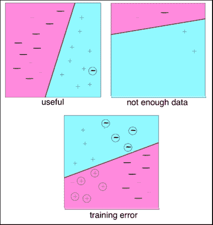

二进制分类器获取数据项并将其放入两个类中的一个(对于更高维度，数据项被放入 *k* 类中)。二元分类器的例子决定了一个人的结果是否可以被诊断为某种疾病的阳性或阴性。分类器算法是概率性的。在一定的误差范围内，某人可以被诊断为阳性或阴性。在这些算法中，有一种通用的方法可以实现这一点，其顺序如下:

*   从可靠的来源收集数据。
*   准备或重组具有特定结构的数据。对于二进制分类器，需要计算距离。
*   用任何合适的方法分析数据。
*   训练(这不适用于二进制分类器)。
*   测试(计算错误率)。

在这一章中，的讨论将集中在什么工具可用于可视化输入和结果，但没有太多的关注机器学习的概念。关于这个主题的更深入的内容，你可以参考适当的材料。让我们看一个例子，并逐步了解各种选择。

# 理解线性回归

一个简单的场景是人们希望根据 GPA 分数和 SAT 分数的数据预测一个学生是否有可能被大学本科项目(如普林斯顿大学)录取，样本数据如下:

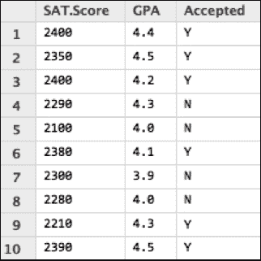

为了能够考虑录取分数与 SAT 分数和 GPA 分数相结合的分数，这里只是为了举例说明(注意，这不像实际的录取过程)，我们将尝试找出分隔线。由于 SAT 分数沿 *x* 轴从 *2100* 到 *2390* 不等，我们可以从*y = 2490–2 * I * 2000*中尝试五个值。在下面的例子中，我们有 2150 而不是 2000。沿 *y* 轴的 GPA 取极值为*3.3**5.0*；因此，我们从一个极端使用以 *3.3* 开始的增量值，从另一个极端使用 *3.3+0.2i* 和 *5.0-0.2i* (步长为 *0.2* )。

作为第一次尝试看到数据的视觉外观，我们将尝试使用`matplotlib`和`numpy`来探索它。使用在 *x* 和 *y* 轴上的 SAT 和 GPA 分数，并应用散点图，我们将尝试在以下示例中找到分隔线:

```py
import matplotlib.pyplot as plt
import matplotlib as mpl
import numpy as np

mpl.rcParams['axes.facecolor']= '#f8f8f8' 
mpl.rcParams['grid.color'] = '#303030' 
mpl.rcParams['grid.color']= '#303030' 
mpl.rcParams['lines.linestyle'] = '--'
#SAT Score 
x=[2400,2350,2400,2290,2100,2380,2300,2280,2210,2390]

#High school GPA
y=[4.4,4.5,4.2,4.3,4.0,4.1,3.9,4.0,4.3,4.5]

a = '#6D0000'
r = '#00006F' 
#Acceptance or rejections core 
z=[a,a,a,r,r,a,r,r,a,a]

plt.figure(figsize=(11,11))
plt.scatter(x,y,c=z,s=600)

# To see where the separation lies
for i in range(1,5):
  X_plot = np.linspace(2490-i*2,2150+i*2,20)
  Y_plot = np.linspace(3.3+i*0.2,5-0.2*i,20)
  plt.plot(X_plot,Y_plot, c='gray')

plt.grid(True) 

plt.xlabel('SAT Score', fontsize=18) 
plt.ylabel('GPA', fontsize=18) 
plt.title("Acceptance in College", fontsize=20) 
plt.legend()

plt.show()
```

在前面的代码中，我们不会执行任何回归或分类。这只是试图理解数据的视觉外观。还可以画几条分隔线，直观了解线性回归的工作原理。

您可以看到，没有足够的数据来应用准确的方法来预测测试数据。然而，如果我们尝试获取更多的数据，并使用一些知名的包来应用机器学习算法，我们可以更好地理解结果。例如，增加课外活动(如体育和音乐)。

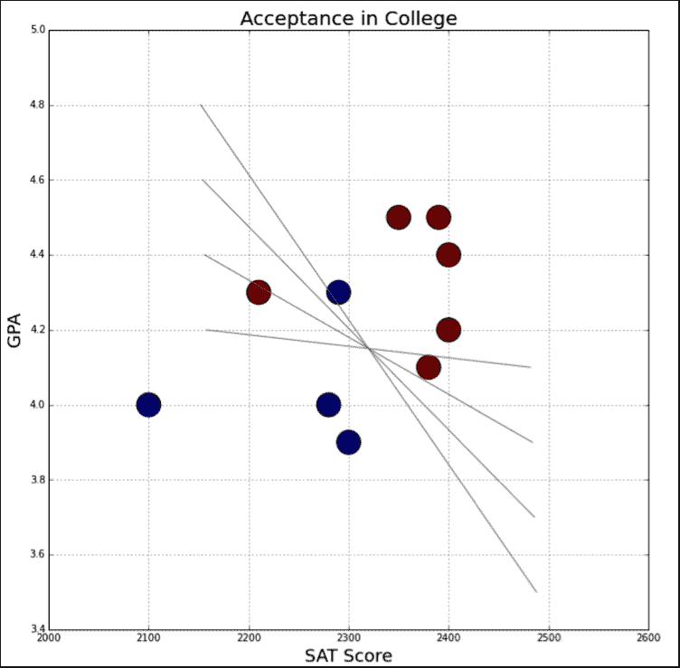

# 线性回归

使用线性回归的主要目标是预测一个数值目标值。一种方法是写一个关于输入的目标值的方程。例如，假设我们试图预测一个参加体育和音乐，但属于低收入家庭的全面发展的学生的接受率。

一个可能的等式是*接受度= 0.0015 *收入+ 0.49*(参与 _ 评分)*；这是一个回归方程。这使用简单的线性回归来预测具有单一特征的定量反应。它采用以下形式:

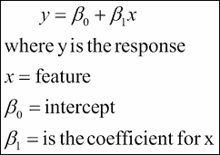

将 *β* <sub>*0*</sub> 和 *β* <sub>*1*</sub> 合起来称为模型系数。要创建我们的模型，您必须学习这些系数的值。一旦你学会了这些系数，你就可以用这个模型来合理地预测接受率。

这些系数是使用最小二乘准则估计的，这意味着我们将在数学上找到分隔线，并最小化残差平方和。以下是以下示例中使用的部分数据:

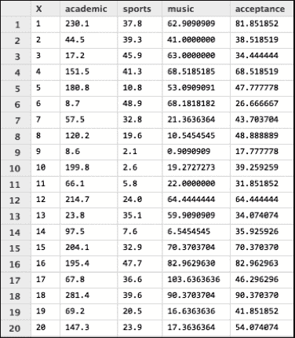

下面的 Python 代码展示了如何尝试散点图来确定变量之间的相关性:

```py
from matplotlib import pyplot as pplt

import pandas as pds

import statsmodels.formula.api as sfapi

df = pds.read_csv('/Users/myhomedir/sports.csv', index_col=0)
fig, axs = plt.subplots(1, 3, sharey=True)
df.plot(kind='scatter', x='sports', y='acceptance', ax=axs[0], figsize=(16, 8))
df.plot(kind='scatter', x='music', y='acceptance', ax=axs[1])
df.plot(kind='scatter', x='academic', y='acceptance', ax=axs[2])

# create a fitted model in one line
lmodel = sfapi.ols(formula='acceptance ~ music', data=df).fit()

X_new = pd.DataFrame({'music': [df.music.min(), df.music.max()]})
predictions = lmodel.predict(X_new)

df.plot(kind='scatter', x='music', y='acceptance', figsize=(12,12), s=50)

plt.title("Linear Regression - Fitting Music vs Acceptance Rate", fontsize=20)
plt.xlabel("Music", fontsize=16)
plt.ylabel("Acceptance", fontsize=16)

# then, plot the least squares line
```

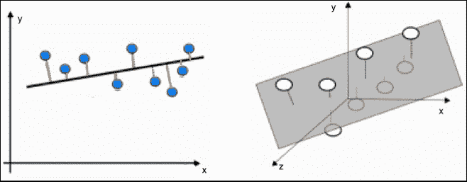

如上图所示，蓝点为 *(x，y)* 的观测值，对角交叉的线为基于 *(x，y)* 值的最小二乘拟合，橙色线为残差，为观测值与最小二乘线之间的距离。

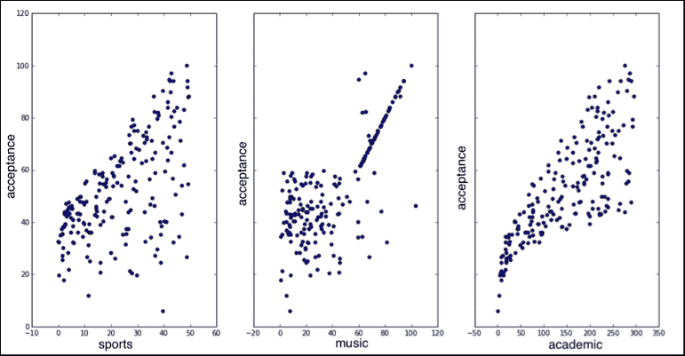

使用`statsmodels`、`pandas`和`matplotlib`(如上图所示)，我们可以假设是基于一所大学如何评价其学生对学术、体育和音乐的贡献的某种评分。

为了测试一个分类器，我们可以从一些已知的数据开始，在不知道答案的情况下，我们将从分类器中寻找答案进行最佳猜测。此外，我们可以将分类器出错的次数相加，然后除以总的测试次数，得到错误率。

下面是从前面的 Python 代码中导出的线性回归图。

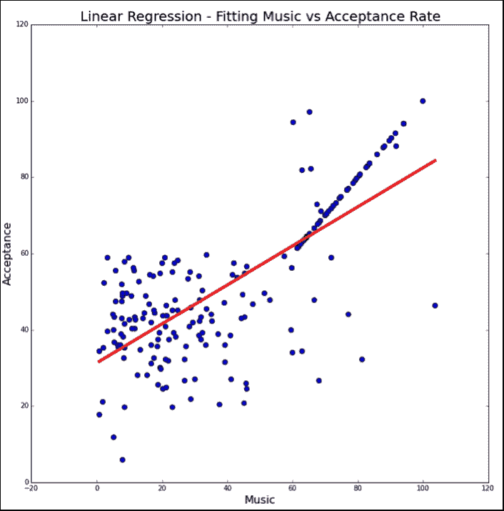

还有许多其他 Python 库可以用于线性回归，`scikit-learn`、`seaborn`、`statsmodels`和`mlpy`是其中一些著名且流行的库。网络上已经有许多用这些软件包解释线性回归的例子。关于`scikit-learn` 包的详细信息，请参考[http://sci kit-learn . org/stable/modules/generated/sklearn . linear _ model。LinearRegression.html](http://scikit-learn.org/stable/modules/generated/sklearn.linear_model.LinearRegression.html)。

还有一种有趣的机器学习模型叫做**决策树学习**，有时也可以称为**分类树**。另一个类似的模型是**回归树**。在这里，我们将看到它们之间的差异，以及其中一个是否比另一个有意义。

# 决策树

分类树用于将数据分成属于响应变量的类。响应变量通常有两类:*是*或*否* (1 或 0)和晴天或雨天。如果目标变量有两个以上的类别，那么 C4.5 可以适用。C4.5 改进了连续属性、离散属性和后期构建过程的 ID3 算法。

与大多数学习算法类似，分类树算法分析训练集，然后基于该训练构建分类器，以便在将来有新数据时，它可以正确地对训练和新数据进行分类。测试示例是输入对象，算法必须预测输出值。当响应或目标变量本质上是分类的时，使用分类树。

相反，当响应变量是连续的而不是离散的时，需要回归树。例如，产品的预测价格。回归树是通过二进制分区构建的。这是一个迭代过程，将数据拆分为分区或分支，然后随着方法向上移动每个分区或分支，继续将每个分区拆分为更小的组。换句话说，当问题涉及预测而不是分类时，回归树是适用的。有关这方面的更多细节，我们建议您参考关于分类和回归树的书籍。

当预测因子和反应之间的关系是线性时，标准回归树更合适，当预测因子和反应之间的关系是非线性时，则应使用 C4.5。此外，总结一下，当响应变量只有两个类别时，应该使用分类树算法。

## 一个例子

对于打网球或高尔夫的决策树算法来说，人们可以通过问一个问题来轻松梳理决策过程，即外面是下雨还是晴天？根据答案画出每个问题的决策图。比赛的性质几乎是一样的——网球对高尔夫——而且在任何体育赛事中，如果刮风下雨，很可能不会有比赛。

对于网球来说，如果前景晴朗，但湿度较高，那么建议不要打。同样，如果下雨刮风，那么网球比赛的整体动态将会相当糟糕。因此，在这种情况下打网球也没有什么乐趣。下图显示了所有可能的情况:

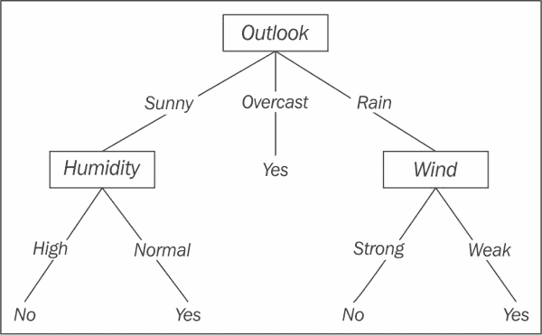

我们还可以添加离散属性(如温度)；在什么温度范围内打网球没有意义？大概，如果温度大于华氏 70 度，也就是温度热的话。我们可以将所有这些结合起来编写如下规则:

```py
If (Outlook = Sunny) and (Humidity = High) then play=No
If (Outlook = Rain) and (Wind = Strong) then play=No
If (Outlook = Sunny) and (Humidity = Normal) or
  (Outlook = Overcast) or (Outlook=Rain and Wind=Weak) then play=Yes
```

使用以下训练集，我们可以运行算法来选择下一个最佳分类器:

<colgroup><col style="text-align: left"> <col style="text-align: left"> <col style="text-align: left"> <col style="text-align: left"> <col style="text-align: left"></colgroup> 
| 

观点

 | 

温度

 | 

湿度

 | 

风

 | 

玩？

 |
| --- | --- | --- | --- | --- |
| 快活的 | 热的 | 高的 | 无力的 | 不 |
| 快活的 | 热的 | 高的 | 强烈的 | 不 |
| 遮蔽 | 热的 | 高的 | 无力的 | 是 |
| 遮蔽 | 凉爽的 | 常态 | 强烈的 | 是 |
| 快活的 | 温和的 | 高的 | 无力的 | 不 |
| 快活的 | 凉爽的 | 常态 | 无力的 | 是 |
| 雨 | 温和的 | 高的 | 无力的 | 是 |
| 雨 | 凉爽的 | 常态 | 无力的 | 是 |
| 雨 | 凉爽的 | 常态 | 强烈的 | 不 |
| 雨 | 温和的 | 常态 | 无力的 | 是 |
| 快活的 | 温和的 | 常态 | 强烈的 | 是 |
| 遮蔽 | 温和的 | 高的 | 强烈的 | 是 |
| 遮蔽 | 热的 | 常态 | 无力的 | 是 |
| 雨 | 温和的 | 高的 | 强烈的 | 不 |

决策树 ( **ID3** )的自上而下**归纳是遵循这些规则的方法:**

*   迭代叶节点直到停止条件:
    1.  确定遍历中下一个节点的最佳决策属性。
    2.  将步骤 1 中最佳节点指定为决策属性。
    3.  对于这些最佳节点的每个值，创建这些节点的新后代。
    4.  将训练数据分类到叶节点中。
    5.  Stopping condition for iteration:

        如果训练数据被分类在阈值内

线性回归和决策树算法的一个明显区别是，决策边界平行于坐标轴，例如，如果我们有两个特征( *x* <sub>*1*</sub> 和 *x* <sub>*2*</sub> ，那么它只能创建规则，例如*x*<sub>*1*</sub>*>= 5.2，x* <sub>*2 决策树算法的优点是对错误具有鲁棒性，这意味着训练集可能有错误。还有，对算法影响不大。*</sub>

使用来自`scikit-learn`([scikit-learn.org](http://scikit-learn.org))的`sklearn`包和以下代码，我们可以绘制决策树分类器:

```py
from sklearn.externals.six import StringIO
from sklearn import tree
import pydot 

# Four columns from the table above with values
# 1st col - 1 for Sunny, 2 for Overcast, and 3 for Rainy
# 2nd col - 1 for Hot, 2 for Mild, 3 for Cool
# 3rd col – 1 for High and 2 for Normal
# 4th col – 0 for Weak and 1 for Strong

X=[[1,1,1,0],[1,1,1,1],[2,1,1,0],[2,3,2,1],[1,2,1,0],[1,3,2,0],\
[3,2,1,0],[3,3,2,0],[3,3,2,1],[3,2,2,0],[1,2,2,1],[2,2,1,1],\
[2,1,2,0],[3,2,1,0]]  

# 1 for Play and 0 for Don't Play
Y=[0,0,1,1,0,1,1,1,0,1,1,1,1,0] 

clf = tree.DecisionTreeClassifier()
clf = clf.fit(X, Y)

dot_data = StringIO() 
tree.export_graphviz(clf, out_file=dot_data) 

graph = pydot.graph_from_dot_data(dot_data.getvalue()) 
graph.write_pdf("game.pdf")
```

使用`sklearn`的导出功能，可以将树形图转换为类似下图的图形形式:

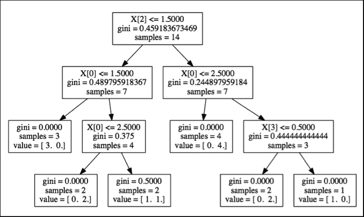

为了创建自己的树形结构，可以选择从`matplotlib`开始使用绘图方法。为了显示树形图，`matplotlib`有标注，允许您创建带有标签的树形结构，如以下代码所示:

```py
import matplotlib.pyplot as plt

#create nodes here
branchNode = dict(boxstyle="sawtooth", fc="0.8")
leafNode = dict(boxstyle="round4", fc="0.8")
startNode = dict(boxstyle="sawtooth", fc="0.9")

def createPlot():
    fig = plt.figure(1, facecolor='white')
    fig.clf()
    createPlot.ax1 = plt.subplot(111, frameon=False) #ticks for demo purposes
    plotNode('from here', (0.3,0.8), (0.3, 0.8), startNode)
    plotNode('a decision node', (0.5, 0.1), (0.3, 0.8), branchNode)
    plotNode('a leaf node', (0.8, 0.1), (0.3, 0.8), leafNode)
    plt.show()
...
```

这通常是一个如何使用`matplotlib`从头开始创建树结构的想法。基本上，前面的例子显示了三个节点的创建，并将它们连接起来形成一个小树。该代码的结果如下所示:

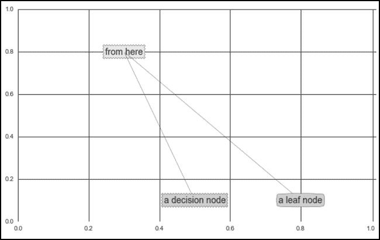

# 贝叶斯定理

为了首先理解贝叶斯定理，在我们试图看一看天真的贝叶斯分类方法之前，我们应该考虑这个例子。我们假设在 *U* 宇宙的所有人中，患乳腺癌的那一组人被设定为 *A* ，而设定为 *B* 的那一组人进行了筛查试验，结果不幸被诊断为乳腺癌阳性。这在下图中显示为重叠区域*A∪B*:

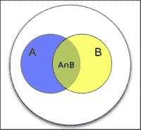

有两个不寻常的领域需要关注:*B–A∪B*或无乳腺癌且诊断为阳性的人和事件*A–A∪B*或乳腺癌且诊断为阴性的人。现在，让我们尝试回答我们是否知道随机选择的人的测试是阳性的。那么，人得乳腺癌的概率是多少呢？这在视觉上转化为我们是否知道一个人在 *B* 区域可见，那么同一个人出现在*A∪B*的概率是多少？从数学上讲，这转化为*概率(给定的一个 B* )。条件概率方程如下所示:

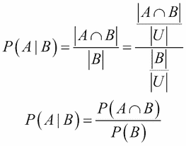

同样，如果我们知道一个随机选择的人得了癌症，诊断测试出来阳性的概率是多少？这转化为*概率(B 给 A)* ，如下代码所示:

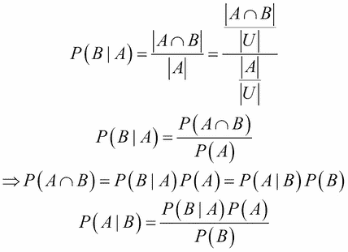

因此，我们推导出贝叶斯定理，其中 *A* 和 *B* 是 *P (B)* 非零的事件。

# 朴素贝叶斯分类器

朴素贝叶斯分类器技术基于贝叶斯定理，适用于输入维数较高的情况。虽然它看起来很简单，但在技术上比其他分类方法表现得更好。

(更多信息可在[http://scikit-learn.org/stable/modules/naive_bayes.html](http://scikit-learn.org/stable/modules/naive_bayes.html)和[http://sebastianaschka . com/Articles/2014 _ naive _ Bayes _ 1 . html](http://sebastianraschka.com/Articles/2014_naive_bayes_1.html)获取)。

让我们看看下面这个用红色和蓝色显示对象的例子。如图所示，红色显示的对象代表患有乳腺癌的人群，蓝色显示的对象代表被诊断为乳腺癌阳性的人群。我们的任务是能够标记任何新数据，在这种情况下，新数据是基于对象的现有结构或类别出现的新人，并识别新数据或新人所属的组或类。

在贝叶斯中，先验概率更倾向于接近于当前如何表征对象的模式或行为。这主要是因为先前这个词在这里是先前经验的同义词；因此，如果红色物体比蓝色物体占更大的百分比，那么这就给了我们一个优势，我们可以预期红色物体的预测结果应该更高。

这里的方法是朴素贝叶斯和 k-最近邻算法的结合。对于纯粹天真的贝叶斯分类，我们将讨论另一个使用`TextBlob`([http://textblob.readthedocs.org/en/dev/](http://textblob.readthedocs.org/en/dev/))的例子。

下图直观地显示了一个尚未分类的新人:

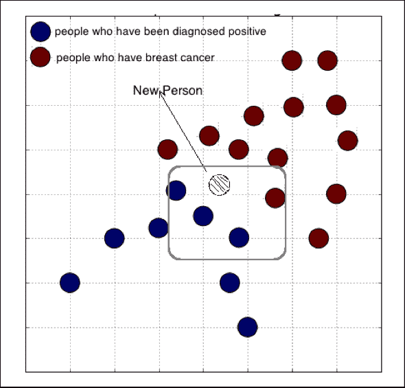

利用红色和蓝色的先验概率，可以计算出 x 为红色或蓝色的后验概率，如下代码所示:

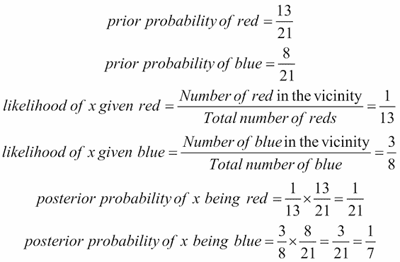

新人最有可能被归类为乳腺癌确诊阳性者。

# 使用文本块的朴素贝叶斯分类器

`TextBlob`是一个有趣的库，其中有一组用于文本处理的工具。它附带了用于**自然语言处理** ( **自然语言处理**)任务的应用编程接口，如分类、名词短语提取、词性标注和情感分析。

要确保一个人可以使用，需要几个步骤。任何使用自然语言处理的图书馆都需要一些语料库；因此，在尝试使用这个有趣的库之前，需要完成以下安装和配置顺序:

*   安装`TextBlob`(通过`conda`或`pip`)
*   下载语料库

## 安装文本块

使用 `binstar search -t conda textblob`，可以为水蟒用户找到安装的地方。更多详情可参见[附录](9.html "Appendix A. Go Forth and Explore Visualization")、*前进探索可视化*。

## 下载语料库

以下命令将让一个人下载`corpora`:

```py
$ python -m textblob.download_corpora

[nltk_data] Downloading package brown to
[nltk_data]     /Users/administrator/nltk_data...
[nltk_data]   Unzipping corpora/brown.zip.
[nltk_data] Downloading package punkt to
[nltk_data]     /Users/administrator/nltk_data...
[nltk_data]   Unzipping tokenizers/punkt.zip.
[nltk_data] Downloading package wordnet to
[nltk_data]     /Users/administrator/nltk_data...
[nltk_data]   Unzipping corpora/wordnet.zip.
[nltk_data] Downloading package conll2000 to
[nltk_data]     /Users/administrator/nltk_data...
[nltk_data]   Unzipping corpora/conll2000.zip.
[nltk_data] Downloading package maxent_treebank_pos_tagger to
[nltk_data]     /Users/administrator/nltk_data...
[nltk_data]   Unzipping taggers/maxent_treebank_pos_tagger.zip.
[nltk_data] Downloading package movie_reviews to
[nltk_data]     /Users/administrator/nltk_data...
[nltk_data]   Unzipping corpora/movie_reviews.zip.
Finished.
```

## 使用文本块的朴素贝叶斯分类器

`TextBlob` 可以轻松创建自定义文本分类器。为了更好地理解这一点，人们可能需要用他们的训练和测试数据做一些实验。在 TextBlob 0.6.0 版本中，以下分类器可用:

*   `BaseClassifier`
*   `DecisionTreeClassifier`
*   `MaxEntClassifier`
*   `NLTKClassifier *`
*   `NaiveBayesClassifier`
*   `PositiveNaiveBayesClassifier`

标有`*`的分类器是包裹`nltk.classify`模块的抽象类。

对于情感分析，可以使用朴素贝叶斯分类器，并用该分类器和`textblob.en.sentiments.PatternAnalyzer`训练系统。一个简单的例子如下:

```py
from textblob.classifiers import NaiveBayesClassifier
from textblob.blob import TextBlob

from textblob.classifiers import NaiveBayesClassifier
from textblob.blob import TextBlob

train = [('I like this new tv show.', 'pos'),
 # similar train sentences with sentiments goes here]
test = [ ('I do not enjoy my job', 'neg'),
 # similar test sentences with sentiments goes here]
]

cl = NaiveBayesClassifier(train)
cl.classify("The new movie was amazing.") # shows if pos or neg

cl.update(test)

# Classify a TextBlob
blob = TextBlob("The food was good. But the service was horrible. "
                "My father was not pleased.", classifier=cl)
print(blob)
print(blob.classify())

for sentence in blob.sentences:
    print(sentence)
    print(sentence.classify())
```

以下是运行上述代码时将显示的结果:

```py
pos
neg
The food was good.
pos
But the service was horrible.
neg
My father was not pleased.
pos

```

可以从文本格式或 JSON 格式的文件中读取训练数据。JSON 文件中的示例数据如下所示:

```py
[
  {"text": "mission impossible three is awesome btw","label": "pos"},
  {"text": "brokeback mountain was beautiful","label":"pos"},
  {"text": " da vinci code is awesome so far","label":"pos"},
  {"text": "10 things i hate about you + a knight's tale * brokeback mountain","label":"neg"},
  {"text": "mission impossible 3 is amazing","label":"pos"},

    {"text": "harry potter = gorgeous","label":"pos"},  
    {"text": "i love brokeback mountain too: ]","label":"pos"},
]

from textblob.classifiers import NaiveBayesClassifier
from textblob.blob import TextBlob
from nltk.corpus import stopwords

stop = stopwords.words('english')

pos_dict={}
neg_dict={}
with open('/Users/administrator/json_train.json', 'r') as fp: 
     cl = NaiveBayesClassifier(fp, format="json")
print "Done Training"

rp = open('/Users/administrator/test_data.txt','r')
res_writer = open('/Users/administrator/results.txt','w')
for line in rp:
    linelen = len(line)
    line = line[0:linelen-1]
    sentvalue = cl.classify(line)
    blob = TextBlob(line)
    sentence = blob.sentences[0]
    for word, pos in sentence.tags:
       if (word not in stop) and (len(word)>3 \
            and sentvalue == 'pos'): 
         if pos == 'NN' or pos == 'V':  
           pos_dict[word.lower()] = word.lower()
       if (word not in stop) and (len(word)>3 \
            and sentvalue == 'neg'): 
         if pos == 'NN' or pos == 'V':  
           neg_dict[word.lower()] = word.lower()

    res_writer.write(line+" => sentiment "+sentvalue+"\n")

    #print(cl.classify(line))
print "Lengths of positive and negative sentiments",len(pos_dict), len(neg_dict)  

Lengths of positive and negative sentiments 203 128 
```

我们可以从语料库中添加更多的训练数据，并用以下代码评估分类器的准确性:

```py
test=[
("mission impossible three is awesome btw",'pos'),
("brokeback mountain was beautiful",'pos'),
("that and the da vinci code is awesome so far",'pos'),
("10 things i hate about you =",'neg'),
("brokeback mountain is a spectacularly beautiful movie",'pos'),
("mission impossible 3 is amazing",'pos'),
("the actor who plays harry potter sucks",'neg'),
("harry potter = gorgeous",'pos'),
('The beer was good.', 'pos'),
('I do not enjoy my job', 'neg'),
("I ain't feeling very good today.", 'pos'),
("I feel amazing!", 'pos'),
('Gary is a friend of mine.', 'pos'),
("I can't believe I'm doing this.", 'pos'),
("i went to see brokeback mountain, which is beautiful(",'pos'),
("and i love brokeback mountain too: ]",'pos')
]

print("Accuracy: {0}".format(cl.accuracy(test)))

from nltk.corpus import movie_reviews

reviews = [(list(movie_reviews.words(fileid)), category)
for category in movie_reviews.categories()
for fileid in movie_reviews.fileids(category)]
new_train, new_test = reviews[0:100], reviews[101:200]

cl.update(new_train)
accuracy = cl.accuracy(test + new_test)
print("Accuracy: {0}".format(accuracy))

# Show 5 most informative features
cl.show_informative_features(4)
```

输出如下:

```py
Accuracy: 0.973913043478 
Most Informative Features 
contains(awesome) = True         pos : neg    =     51.9 : 1.0 
contains(with) = True            neg : pos    =     49.1 : 1.0 
contains(for) = True             neg : pos    =     48.6 : 1.0 
contains(on) = True              neg : pos    =     45.2 : 1.0 

```

首先，训练集有 250 个样本，准确率为`0.813`，后来它又增加了 100 个电影评论样本。准确率上升到`0.974`。因此，我们尝试使用不同的测试样本，并绘制样本大小与准确度的关系图，如下图所示:

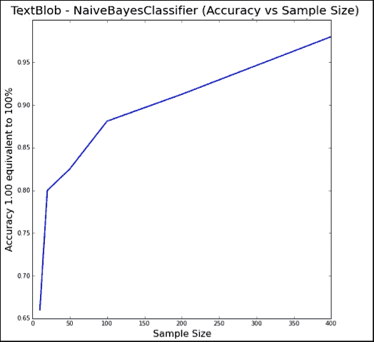

# 用词云看积极情绪

单词云给予在任何给定文本中更频繁出现的单词更大的突出。它们也被称为标签云或加权词。从出现的次数来看，一个单词力量的重要性在视觉上映射到它的外观大小。换句话说，在可视化中出现最多的单词是在文本中出现最多的单词。

除了以形状和颜色显示单词的出现之外，单词云在社交媒体和营销方面还有以下几个有用的应用:

*   企业可以了解他们的客户，以及他们如何看待自己的产品。一些组织使用了一种非常有创意的方式，让他们的粉丝或追随者发表他们对自己品牌的看法，将所有这些话带到一个词云，以了解他们对产品品牌最常见的印象是什么。
*   通过识别一个在网上很受欢迎的品牌来寻找了解竞争对手的方法。从他们的内容中创建一个词云，以更好地理解哪些词和主题吸引了产品目标市场。

为了创建单词云，可以编写 Python 代码或使用已经存在的东西。NYU 数据科学中心的安德烈亚斯·穆勒用 Python 创建了一个单词云。这非常简单易用。`RemachineScript.ttf`字体文件可从[http://www . font s101 . com/fonts/view/Script/63827/remmachine _ Script](http://www.fonts101.com/fonts/view/Script/63827/Remachine_Script)下载。

`STOPWORDS`由极其常见的单词组成，例如`a`、`an`、`the`、`is`、`was`、`at`、`in`等等。以下代码使用`STOPWORDS`列表创建一个单词云，以便忽略它们:

```py
from wordcloud import WordCloud, STOPWORDS
import matplotlib.pyplot as plt
from os import path

d = path.dirname("__file__")
text = open(path.join(d, '/Users/MacBook/kirthi/results.txt')).read()

wordcloud = WordCloud(
    font_path='/Users/MacBook/kirthi/RemachineScript.ttf',
    stopwords=STOPWORDS,
    background_color='#222222',
    width=1000,
    height=800).generate(text)
```

为了绘制这个，首先设置图形大小，并使用`imshow()`将文字云显示为图像。

```py
# Open a plot of the generated image.
plt.figure(figsize=(13,13))

plt.imshow(wordcloud)
plt.axis("off")

plt.show()
```

综上所述，我们首先从`TextBlob`例子中提取情感，并假设提取的结果在`results.txt`中。然后，我们将使用这些单词将数据可视化为带有`matplotlib`包的单词云。

`wordcloud`的结果如下图所示:


# k 近邻

**k 最近邻** ( **k-NN** )分类是最容易理解的分类方法之一(尤其是在对数据分布的先验知识很少或没有的情况下)。k-最近邻分类有一种方法可以存储所有已知案例，并基于相似性度量(例如，欧几里德距离函数)对新案例进行分类。k-NN 算法因其简单性而在统计估计和模式识别中受到欢迎。

对于**1-最近邻** ( **1-NN** )，一个特定点的标签被设置为最近的训练点。当将其扩展为更高的 *k* 值时，测试点的标签是由最近的 *k* 训练点测量的。k-NN 算法被认为是一种懒惰的学习算法，因为优化是在本地完成的，并且计算被延迟到分类。

这种方法有优点也有缺点。优点是精度高，对异常值不敏感，对数据没有假设。k-NN 的缺点是计算量大，需要大量内存。

可以使用以下距离度量之一:

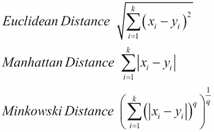

让我们考虑一个例子，给我们一大筐水果，里面只有苹果、香蕉和梨。我们将假设苹果是红苹果，而不是绿苹果。有一个特征可以区分这些水果:颜色。苹果是红色的，香蕉是黄色的，梨是绿色的。这些水果也可以用它们各自的重量来描述。以下假设是为了说明这个例子:

形状特征分类如下:

*   对于苹果来说，形状值在 1 到 3 之间，而重量在 6 到 7 盎司之间
*   对于梨来说，形状值在 2 到 4 之间，而重量在 5 到 6 盎司之间
*   对于香蕉来说，形状值在 3 到 5 之间，而重量在 7 到 9 盎司之间

我们有关于篮子里水果的数据如下:

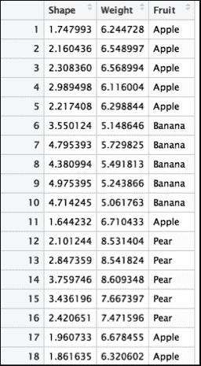

如果我们有一个已知重量和颜色类别的未标记水果，那么应用 k-最近邻方法(带有任何距离公式)将最有可能找到最近的 *k* 邻居(如果它们是绿色、红色或黄色，则未标记的水果最有可能分别是梨、苹果或香蕉)。下面的代码演示了使用水果形状和重量的 k 最近邻算法:

```py
import csv
import matplotlib.patches as mpatches
import matplotlib.pyplot as plt

count=0
x=[]
y=[]
z=[]

with open('/Users/myhome/fruits_data.csv', 'r') as csvf:
  reader = csv.reader(csvf, delimiter=',')
  for row in reader:
    if count > 0:
      x.append(row[0])
      y.append(row[1])
      if ( row[2] == 'Apple' ): z.append('r')
      elif ( row[2] == 'Pear' ): z.append('g')
      else: z.append('y')
    count += 1

plt.figure(figsize=(11,11))

recs=[]
classes=['Apples', 'Pear', 'Bananas']
class_colours = ['r','g','y']
plt.title("Apples, Bananas and Pear by Weight and Shape", fontsize=18)

plt.xlabel("Shape category number", fontsize=14)
plt.ylabel("Weight in ounces", fontsize=14)

plt.scatter(x,y,s=600,c=z)
```

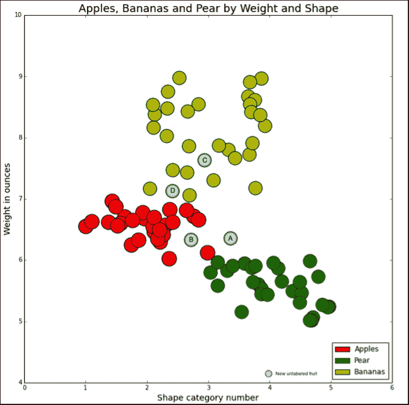

让我们挑选四个未标记的水果，它们的 x 和 y 值分别为 *A(3.5，6.2)* 、 *B(2.75，6.2)* 、 *C(2.9，7.6)* 和 *D(2.4，7.2)* ，代码如下:

```py
from math import pow, sqrt
dist=[]
def determineFruit(xv, yv, threshold_radius):
  for i in range(1,len(x)):
    xdif=pow(float(x[i])-xv, 2)
    ydif=pow(float(y[i])-yv, 2)
    sqrtdist = sqrt(xdif+ydif))
    if ( xdif < threshold_radius and 
         ydif < thresholdradius and sqrtdist < threshold_radius):
      dist.append(sqrtdist)
    else:
      dist.append(99)
  pear_count=0
  apple_count=0
  banana_count=0
  for i in range(1,len(dist)):
      if dist[i] < threshold_radius:
        if z[i] == 'g': pear_count += 1
        if z[i] == 'r': apple_count += 1
        if z[i] == 'y': banana_count += 1
  if ( apple_count >= pear_count and apple_count >= banana_count ):
    return "apple"
  elif ( pear_count >= apple_count and pear_count >= banana_count):
    return "pear"
  elif ( banana_count >= apple_count and banana_count >= pear_count):
    return "banana"

dist=[]
determine = determineFruit(3.5,6.2, 1)
print determine

'pear'
```

# 逻辑回归

正如我们之前看到的一样，线性回归的一个问题是它往往会使数据不足。这给了我们无偏估计量的最小均方误差。使用欠信息技术模型，我们不会得到最好的预测。有一些方法可以通过给我们的估计量增加一些偏差来减少均方差。

逻辑回归是为有真或假反应的数据拟合模型的方法之一。线性回归不能直接预测所有的概率，但逻辑回归可以。此外，与朴素贝叶斯的结果相比，预测概率可以更好地校准。

对于本次讨论，通过保持我们对二进制响应的关注，我们可以将`1`的值设置为`true`，将`0`的值设置为`false`。逻辑回归模型假设输入变量可以通过对数反函数进行缩放；因此，另一种看待这个问题的方法是,观测到的 *y* 值的对数可以表示为 *n* 输入变量与 *x* 的线性组合，如下式所示:

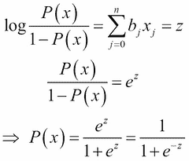

由于对数函数的反函数是指数函数，右侧的表达式看起来像是 *x* 变量线性组合的 sigmoid 版本。这意味着分母永远不可能是 *1* (除非 *z* 是 *0* )。因此 *P(x)* 的值严格大于 *0* ，小于 *1* ，如下代码所示:

```py
import matplotlib.pyplot as plt
import matplotlib
import random, math
import numpy as np
import scipy, scipy.stats
import pandas as pd

x = np.linspace(-10,10,100)
y1 = 1.0 / (1.0+np.exp(-x))
y2 = 1.0 / (1.0+np.exp(-x/2))
y3 = 1.0 / (1.0+np.exp(-x/10))

plt.title("Sigmoid Functions vs LineSpace")
plt.plot(x,y1,'r-',lw=2)
plt.plot(x,y2,'g-',lw=2)
plt.plot(x,y3,'b-',lw=2)
plt.xlabel("x")
plt.ylabel("y")
plt.show()
```

下图显示了标准 sigmoid 函数:

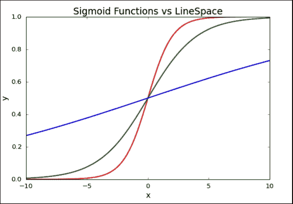

下面是一个展示*快乐*和*悲伤*概率的例子。

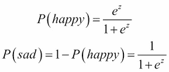

Kaggle 主办了所有的机器学习比赛。它通常提供训练和测试数据。不久前根据真实数据预测泰坦尼克号的幸存者在卡格尔号上有争议。`titanic_train.csv`和`titanic_test.csv`文件分别用于培训和测试。使用`scikit-learn`中包含逻辑回归的`linear_model`包，我们可以看到以下代码是赢得比赛的作者版本的修改版本:

```py
Import numpy as np
import pandas as pd
import sklearn.linear_model as lm
import sklearn.cross_validation as cv
import matplotlib.pyplot as plt

train = pd.read_csv('/Users/myhome/titanic_train.csv')
test = pd.read_csv('/Users/myhome/titanic_test.csv')
train[train.columns[[2,4,5,1]]].head()

data = train[['Sex', 'Age', 'Pclass', 'Survived']].copy()
data['Sex'] = data['Sex'] == 'female'
data = data.dropna()

data_np = data.astype(np.int32).values
X = data_np[:,:-1]
y = data_np[:,-1]

female = X[:,0] == 1
survived = y == 1

# This vector contains the age of the passengers.
age = X[:,1]
# We compute a few histograms.
bins_ = np.arange(0, 121, 5)
S = {'male': np.histogram(age[survived & ~female], 
                          bins=bins_)[0],
     'female': np.histogram(age[survived & female], 
                            bins=bins_)[0]}
D = {'male': np.histogram(age[~survived & ~female], 
                          bins=bins_)[0],
     'female': np.histogram(age[~survived & female], 
                            bins=bins_)[0]}
bins = bins_[:-1]
plt.figure(figsize=(15,8))
for i, sex, color in zip((0, 1),('male', 'female'), ('#3345d0', '#cc3dc0')):
    plt.subplot(121 + i)
    plt.bar(bins, S[sex], bottom=D[sex], color=color,
            width=5, label='Survived')
    plt.bar(bins, D[sex], color='#aaaaff', width=5, label='Died', alpha=0.4)
    plt.xlim(0, 80)
    plt.grid(None)

    plt.title(sex + " Survived")
    plt.xlabel("Age (years)")
    plt.legend()

(X_train, X_test, y_train, y_test) = cv.train_test_split(X, y, test_size=.05)
print X_train, y_train

# Logistic Regression from linear_model
logreg = lm.LogisticRegression();
logreg.fit(X_train, y_train)
y_predicted = logreg.predict(X_test)

plt.figure(figsize=(15,8));
plt.imshow(np.vstack((y_test, y_predicted)),
           interpolation='none', cmap='bone');
plt.xticks([]); plt.yticks([]);
plt.title(("Actual and predicted survival outcomes on the test set"))
```

以下是显示泰坦尼克号男女幸存者的线性回归图:

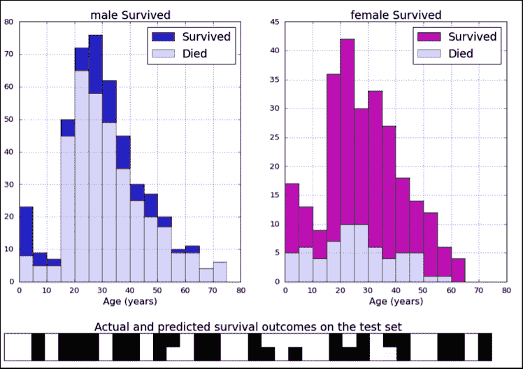

我们已经看到`scikit-learn`有很好的机器学习功能集合。它们还附带了一些标准数据集，例如，虹膜数据集和数字数据集用于分类，波士顿房价数据集用于回归。机器学习是关于学习数据的属性并将这些属性应用到新的数据集。

# 支持向量机

**支持向量机** ( **SVM** )是可应用于回归或分类的监督学习方法。这些学习方法是非线性模型的一种扩展，它在经验上提供了良好的性能，并在许多应用中取得了成功，如生物信息学、文本、图像识别等。这些方法计算量小，易于实现，但容易出现拟合不足，精度可能较低。

让我们了解一下 SVM 的目标。这里的目标是在 *x* 和 y 之间映射或找到一个模式，我们希望从*x*T4→T6】y(*x*T10】ϵT12】x 和*y*t16】ϵt18】y 执行映射。在这里， *x* 可以是对象，而 *y* 可以是标签。另一个简单的例子是 *X* 是 n 维实值空间，而 y 是一组 *-1，1* 。

SVM 的一个经典例子是，当给出一只老虎和一个人的两张照片时， *X* 成为像素图像的集合，而 *Y* 成为回答问题的标签，即“这是老虎还是人？”当一张未知的图片出现时。下面是字符识别问题的另一个例子:

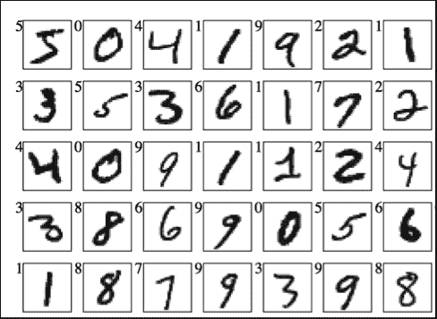

网上已经有很多 SVM 的例子，但在这里，我们将展示如何使用`scikit-learn` ( `sklearn`)将可视化方法应用于包括 SVM 在内的各种机器学习算法。在`sklearn`中，`sklearn.svm`套装包括以下 SVR 车型:

```py
import numpy as np
from sklearn.svm import SVR
import matplotlib.pyplot as plt

X = np.sort(5 * np.random.rand(40, 1), axis=0)
y = (np.cos(X)+np.sin(X)).ravel()
y[::5] += 3 * (0.5 - np.random.rand(8))

svr_rbfmodel = SVR(kernel='rbf', C=1e3, gamma=0.1)
svr_linear = SVR(kernel='linear', C=1e3)
svr_polynom = SVR(kernel='poly', C=1e3, degree=2)
y_rbfmodel = svr_rbfmodel.fit(X, y).predict(X)
y_linear = svr_linear.fit(X, y).predict(X)
y_polynom = svr_polynom.fit(X, y).predict(X)

plt.figure(figsize=(11,11))
plt.scatter(X, y, c='k', label='data')
plt.hold('on')
plt.plot(X, y_rbfmodel, c='g', label='RBF model')
plt.plot(X, y_linear, c='r', label='Linear model')
plt.plot(X, y_polynom, c='b', label='Polynomial model')
plt.xlabel('data')
plt.ylabel('target')
plt.title('Support Vector Regression')
plt.legend()
plt.show()
```

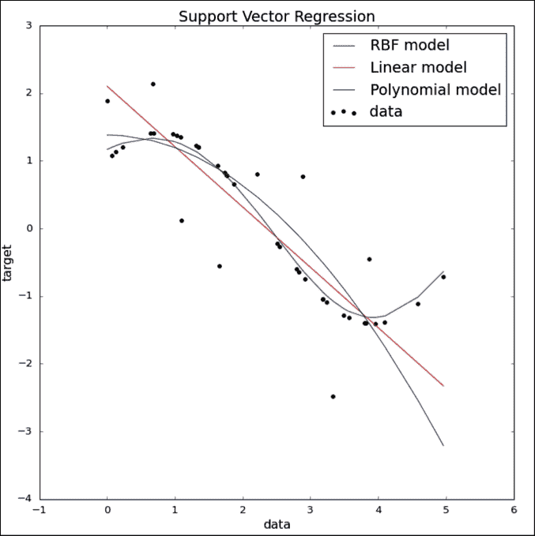

# 主成分分析

**主成分分析** ( **主成分分析**)使用简单的重排和旋转变换来变换未标记数据的属性。看着没有任何意义的数据，可以想办法这样降维。例如，当特定数据集在与轴成特定角度运行时看起来类似于椭圆，而在另一个变换表示中沿着 *x* 轴移动，并且明显没有沿着 *y* 轴变化的迹象，则可以忽略这一点。

k-means 聚类适用于未标记数据的聚类。有时，可以使用主成分分析将数据投影到更低的维度，然后将其他方法(如 k 均值)应用到更小、更小的数据空间。

然而，仔细地执行降维是非常重要的，因为任何降维都可能导致信息的丢失，并且算法在丢弃噪声的同时保留数据的有用部分是至关重要的。在这里，我们将从至少两个角度激励主成分分析，并解释为什么保持最大可变性是有意义的:

*   相关性和冗余性
*   形象化

假设我们收集了一个校园里学生的数据，包括性别、身高、体重、看电视时间、运动时间、学习时间、平均绩点等等。在使用这些维度对这些学生进行调查时，我们发现身高和体重的相关性产生了一个有趣的理论(通常，学生越高，由于骨骼重量而产生的重量越多，反之亦然)。在更大的人群中可能不是这种情况(更重的体重不一定意味着更高)。这种相关性也可以可视化如下:

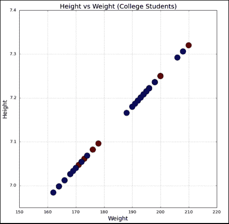

```py
import matplotlib.pyplot as plt
import csv

gender=[]
x=[]
y=[]
with open('/Users/kvenkatr/height_weight.csv', 'r') as csvf:
  reader = csv.reader(csvf, delimiter=',')
  count=0
  for row in reader:
    if count > 0:
        if row[0] == "f": gender.append(0)
        else:  gender.append(1)
        height = float(row[1])
        weight = float(row[2])
        x.append(height)
        y.append(weight)
    count += 1

plt.figure(figsize=(11,11))
plt.scatter(y,x,c=gender,s=300)
plt.grid(True)
plt.xlabel('Weight', fontsize=18)
plt.ylabel('Height', fontsize=18)
plt.title("Height vs Weight (College Students)", fontsize=20)
plt.legend()

plt.show()
```

再次使用`sklearn``preprocessing``datasets`和`decomposition`包，您可以编写如下简单的可视化代码:

```py
from sklearn.datasets import load_iris
from sklearn.preprocessing import StandardScaler
import matplotlib.pyplot as plt

data = load_iris()
X = data.data

# convert features in column 1 from cm to inches
X[:,0] /= 2.54
# convert features in column 2 from cm to meters
X[:,1] /= 100
from sklearn.decomposition import PCA

def scikit_pca(X):

    # Standardize
    X_std = StandardScaler().fit_transform(X)

    # PCA
    sklearn_pca = PCA(n_components=2)
    X_transf = sklearn_pca.fit_transform(X_std)

    # Plot the data
    plt.figure(figsize=(11,11))
    plt.scatter(X_transf[:,0], X_transf[:,1], s=600, color='#8383c4', alpha=0.56)
    plt.title('PCA via scikit-learn (using SVD)', fontsize=20)
    plt.xlabel('Petal Width', fontsize=15)
    plt.ylabel('Sepal Length', fontsize=15)
    plt.show()

scikit_pca(X)
```

该图显示了使用`scikit-learn`包的主成分分析:

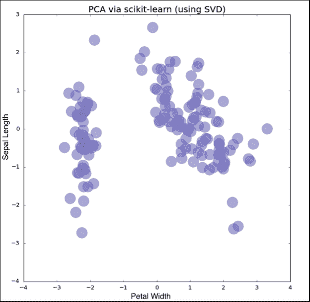

## 安装 sci kit-学习

以下命令将帮助安装`scikit-learn`包:

```py
$ conda install scikit-learn
Fetching package metadata: ....
Solving package specifications: .
Package plan for installation in environment /Users/myhomedir/anaconda:

The following packages will be downloaded:

 package                    |            build
 ---------------------------|-----------------
 nose-1.3.7                 |           py27_0         194 KB
 setuptools-18.0.1          |           py27_0         341 KB
 pip-7.1.0                  |           py27_0         1.4 MB
 scikit-learn-0.16.1        |       np19py27_0         3.3 MB
 ------------------------------------------------------------
 Total:         5.2 MB

The following packages will be UPDATED:

 nose:         1.3.4-py27_1      --> 1.3.7-py27_0 
 pip:          7.0.3-py27_0      --> 7.1.0-py27_0 
 scikit-learn: 0.15.2-np19py27_0 --> 0.16.1-np19py27_0
 setuptools:   17.1.1-py27_0     --> 18.0.1-py27_0 

Proceed ([y]/n)? y
Fetching packages ...

```

对于蟒蛇来说，由于命令行界面都是通过`conda`进行的，所以可以使用`conda`进行安装。在其他方面，默认情况下，人们总是试图使用`pip install`。但是，无论如何，您都应该查看安装文档。由于所有的`scikit-learn`套餐都很受欢迎，并且已经存在了一段时间，所以没有太大的变化。现在，在下一节中，我们将探索 k-means 聚类来结束这一章。

# k-均值聚类

**k-means 聚类** 起源于信号处理，是数据挖掘中一种流行的方法。k-means 聚类的主要目的是找到数据集的一些 *m* 点，这些点可以最好地表示数据集中一些 m 区域的中心。

k-means 聚类也称为分区聚类。这意味着在启动任何群集过程之前，需要指定群集的数量。您可以定义一个目标函数，该函数使用数据点与其最近的聚类质心之间的欧氏距离之和。人们可以遵循一个系统的过程，通过找到一组全新的可以迭代降低目标函数值的聚类中心，迭代地最小化这个目标函数。

k-means 聚类是聚类分析中一种流行的方法。它不需要任何假设。这意味着当给定一个数据集并且预定数量的聚类被标记为 *k* 时，并且当应用 k-means 算法时，它最小化了距离的平方和误差。

算法很容易理解，如下所示:

*   给出了一组 *n* 点 *(x，y)* 和一组 *k* 质心
*   对于每个 *(x，y)* ，找到最接近该点的质心(这决定了 *(x，y)* 所属的星团)
*   在每个聚类中，找到中间值，并将其设置为该聚类的质心，然后重复该过程

让我们来看一个简单的例子(这可以应用于大量的点集合)，使用来自`sklearn.cluster`包的 k-means。这个例子表明，用最少的代码，您可以使用`scikit-learn`库完成 k-means 聚类:

```py
import matplotlib.pyplot as plt

from sklearn.cluster import KMeans

import csv

x=[]
y=[]

with open('/Users/myhomedir/cluster_input.csv', 'r') as csvf:
  reader = csv.reader(csvf, delimiter=',')
    for row in reader:
      x.append(float(row[0]))
      y.append(float(row[1]))

data=[]
for i in range(0,120):
  data.append([x[i],y[i]])

plt.figure(figsize=(10,10))

plt.xlim(0,12)
plt.ylim(0,12)

plt.xlabel("X values",fontsize=14)
plt.ylabel("Y values", fontsize=14)

plt.title("Before Clustering ", fontsize=20)

plt.plot(x, y, 'k.', color='#0080ff', markersize=35, alpha=0.6)

kmeans = KMeans(init='k-means++', n_clusters=3, n_init=10)
kmeans.fit(data)

plt.figure(figsize=(10,10))

plt.xlabel("X values",fontsize=14)
plt.ylabel("Y values", fontsize=14)

plt.title("After K-Means Clustering (from scikit-learn)", fontsize=20)

plt.plot(x, y, 'k.', color='#ffaaaa', markersize=45, alpha=0.6)

# Plot the centroids as a blue X
centroids = kmeans.cluster_centers_

plt.scatter(centroids[:, 0], centroids[:, 1], marker='x', s=200,
  linewidths=3, color='b', zorder=10)

plt.show()
```

聚类前绘制数据如下所示:

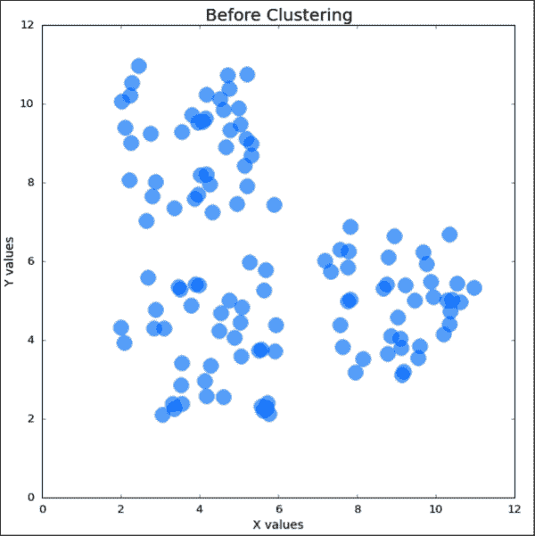

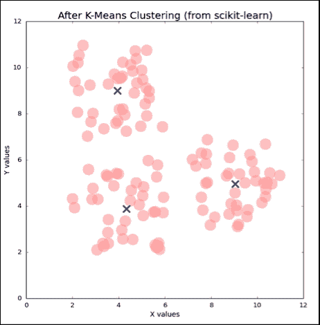

在这个例子中，如果我们为五个集群设置 *k=5* ，那么这个集群保持不变，但是另外两个集群被分成两个以获得五个集群，如下图所示:

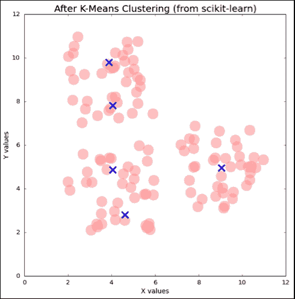

# 总结

本章举例说明了流行的机器学习算法。简单介绍了线性回归和逻辑回归。使用线性回归的大学录取标准和逻辑回归的泰坦尼克号幸存者，本章还说明了如何使用这些回归方法的`statsmodels.formula.api`、`pandas`和`sklearn.linear_model`软件包。在这两个例子中，`matplotlib`被用于可视化方法。

你了解了决策树。使用体育示例(高尔夫和网球)，我们使用`sklearn`和`pydot`包查看决策树。进一步，我们讨论了贝叶斯定理和朴素贝叶斯分类器。使用`TextBlob`包和来自`nltk`语料库的电影评论数据，我们查看了使用`wordcloud`包的单词云的示例。

你学习了 k 近邻算法。在这里，我们看了一个根据重量和形状对水果进行分类的例子，通过颜色直观地将水果分开。

我们还以最简单的形式查看了 SVM 的插图，并举例说明了如何从`sklearn.svm`包生成数据，以及如何使用`matplotlib`库绘制结果。您学习了主成分分析，如何确定冗余，以及消除一些变量。我们将 iris 示例与`sklearn.preprocesing`库一起使用，以了解如何可视化结果。最后，我们用一个使用`sklearn.cluster`的随机点的例子来看 k-means 聚类，因为这是实现聚类的最简单方法(用最少的代码)。在下一章中，我们将讨论生物信息学、遗传学和网络的各种例子。