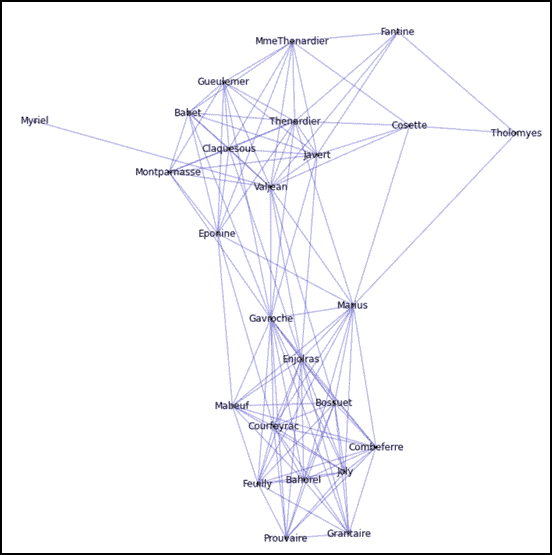

# 七、生物信息学、遗传学和网络模型

科学应用有多个黑盒，这些黑盒里的东西很复杂，通常被认为是神奇的。然而，它们都遵循一套系统的协议。这些协议在研究界众所周知。例如，网络模型被广泛用于表示复杂的结构化数据，如蛋白质网络、分子遗传学和化学结构。研究界另一个有趣的领域是生物信息学。这是一个不断发展的领域，最近在研究中取得了相当大的突破。

在生物学领域，有许多不同的复杂结构，如 DNA 序列、蛋白质结构等。为了进行比较，让我们来看看这些结构中的一些未知元素。有一个能直观显示它们的模型是有帮助的。类似地，在图论或网络的任何应用中，能够可视化复杂的图结构本质上是有益的。

在本章的后面，我们将讨论一些有趣的例子，例如社交网络、现实生活中的有向图例子、适合这些问题的数据结构以及网络分析。为了演示示例，这里我们将使用特定的库，如 metaseq、NetwX、matplotlib、Biopython 和 ETE 工具包，涵盖以下主题:

*   有向图和多重图
*   图的聚类系数
*   社交网络分析
*   平面图测试和有向无环图测试
*   最大流量和最小流量
*   遗传编程示例
*   随机块模型和随机图

# 有向图和多重图

首先，我们将回顾有向图和多重图。稍后，我们将在 Python 中找出生成它们的选项。另外，我们将看一个例子，其中您可能需要有向图。在我们从概念上描述图和有向图之前，让我们看一下理解何时可以使用图和有向图的不同方法。

在大学校园区域内相互连接的计算机可以被认为是一个连通图，其中连接中的每台计算机都被视为一个节点或顶点。连通路径是一条边，在某些情况下，如果只有单向连接，那么它就是一个有向图。例如，一个非常受限制的联邦网络不允许任何外部连接进入，但很可能不会反过来限制。以下是显示地点之间距离的简单图表:


在前面的例子中，带有城市标签 **A** 到 **F** 的图是有向图，右侧的另一个图是无向图。在有向图中，如果箭头指向两个方向，就有一条路可以走两个方向，而在无向图中，两条路都是假设的。如果我们用某种数据结构来表示这些图表，那会是什么呢？此外，如果我们要绘制这些类型的图表，我们使用哪些库以及如何实现？

## 存储图形数据

图形数据通常表示为邻接矩阵，除非是稀疏的。邻接矩阵是具有 *V* <sub>*2*</sub> 行的矩阵，假设图具有一个 *V* 顶点或一个节点。例如，对于上图中显示的两个图形，邻接矩阵类似于下表:

<colgroup><col style="text-align: left"> <col style="text-align: left"> <col style="text-align: left"> <col style="text-align: left"> <col style="text-align: left"> <col style="text-align: left"> <col style="text-align: left"></colgroup> 
|   | 

A

 | 

B

 | 

C

 | 

D

 | 

E

 | 

F

 |
| --- | --- | --- | --- | --- | --- | --- |
| **A** | Zero | Twenty-five | Twenty-six |   |   |   |
| **B** |   | Zero | eighty-five | five | Ten |   |
| **C** | Twenty-six | eighty-five | Zero |   |   | Ten |
| **D** |   |   |   | Zero |   | Eleven |
| **E** |   |   |   | nine | Zero | Eighty-eight |
| **F** |   |   |   | Eleven | Eighty-eight | Zero |

<colgroup><col style="text-align: left"> <col style="text-align: left"> <col style="text-align: left"> <col style="text-align: left"> <col style="text-align: left"> <col style="text-align: left"> <col style="text-align: left"></colgroup> 
|   | 

芝加哥

 | 

波士顿

 | 

纽约

 | 

洗 DC

 | 

迈阿密

 | 

达拉斯

 |
| --- | --- | --- | --- | --- | --- | --- |
| **芝加哥** | Zero | One thousand six hundred and thirteen |   | One thousand one hundred and forty-five |   |   |
| **波士顿** | One thousand six hundred and thirteen | Zero | Three hundred and thirty-eight | Seven hundred and twenty-five |   |   |
| **纽约** |   | Three hundred and thirty-eight | Zero | Three hundred and eighty-three | Two thousand one hundred and forty-five |   |
| **洗 DC** | One thousand one hundred and forty-five | Seven hundred and twenty-five | Three hundred and eighty-three | Zero | One thousand seven hundred and nine | Two thousand one hundred and thirteen |
| **迈阿密** |   |   | Two thousand one hundred and forty-five | One thousand seven hundred and nine | Zero | Two thousand one hundred and sixty-one |
| **达拉斯** |   |   |   | Two thousand one hundred and thirteen | Two thousand one hundred and sixty-one | Zero |

对于无向图，通过对称性，使用一半的存储就足够了(不需要存储从 *A* 到 *B* 和 *B* 到 *A* 的所有信息)。空白条目显示没有足够的距离数据。如果矩阵是稀疏的，其中大多数条目没有被填充，那么您可以将其存储为列表。幸运的是，`scipy`中有处理稀疏矩阵的便捷方法。以下代码仅适用于上图所示的第一个图形:

```py
import scipy.sparse as sparse

matrixA = sparse.lil_matrix((6,6))

matrixA = sparse.lil_matrix( [[0,25,26,0,0,0], [0,0,85,5,10,0],
   [26,85,0,0,0,10], [0,0,0,0,0,11],[0,0,0,9,0,88],[0,0,0,11,88,0]])
print matrixA   
(0, 1)  25   
(0, 2)  26   
(1, 2)  85   
(1, 3)  5   
(1, 4)  10   
(2, 0)  26   
(2, 1)  85   
(2, 5)  10
(3, 5)  11   
(4, 3)  9   
(4, 5)  88   
(5, 3)  11   
(5, 4)  88
```

## 显示图形

前面的示例仅显示了如何使用`scipy`库(尤其是`scipy.sparse`包)来表示图形。但是，在下一节中，我们将看到如何显示这些图表。虽然有许多 Python 包可供选择来显示图形，但其中最受欢迎的前三个选择是`NetworkX`、`igraph`(来自[igraph.org](http://igraph.org))和`graph-tool`。让我们看一个使用这三个包的图形显示的例子。

### igraph

最初，`igraph`是为 R 用户准备的，但是后来增加了 Python 版本。对于较小的图形，可以添加顶点和边并非常容易地显示它们，但在大多数情况下，图形并不小；因此，`igraph`提供了方便地从文件中读取图形数据并显示的功能。

目前，`igraph`提供几种格式，如`dimacs`、`dl`、`edgelist`、`graml`、`graphdb`、`gml`、`lgl`、`ncol`、`pajek`。GraphML 是一种基于 XML 的文件格式，可用于大型图形，而 NCOL 图形格式适用于带有加权边列表的大型图形。LGL 图格式也可以用于带有加权边的大型图布局。其他大多数使用简单的文本格式。`igraph`只完全支持 DL 文件格式，其他所有的`igraph`只支持部分文件格式。

与许多其他 Python 包类似，`igraph`的好处在于它提供了非常方便的方法来配置和显示图形，并将它们存储为 SVG 格式，以便它们可以嵌入到 HTML 文件中。

我们来看看一个涉及`pajek`格式的例子(关于`pajek`的更多细节，可以参考[http://vlado.fmf.uni-lj.si/pub/networks/pajek/](http://vlado.fmf.uni-lj.si/pub/networks/pajek/))。还有很多其他参数。其中一些是`labelcolor`、`vertexsize`和`radius`用于一些顶点形状。我们将在这里看到两个例子。第一个示例为一个小图形分配了标签和边，而第二个示例从文件中读取图形的数据并显示它。以下示例显示了使用`igraph`包的标记图形:

```py
from igraph import *

vertices = ["A", "B", "C", "D", "E", "F", "G", "H", "I", "J"]

edges = [(0,1),(1,2),(2,3),(3,4),(4,5),(5,6),(6,7),(7,1),
         (1,8),  (8,2),(2,4),(4,9),(9,5),(5,7),(7,0)]

graphStyle = { 'vertex_size': 20}
g = Graph(vertex_attrs={"label": vertices}, edges=edges, directed=True)
g.write_svg("simple_star.svg", width=500, height=300, **graphStyle)
```

星形图中有 10 个顶点，形成五个三角形和一个五边形。还有，有 15 条边，因为五个三角形完成了边的集合。这是一个非常简单的图，其中每条边由从零开始的相关顶点数定义。以下标记图形是前面 Python 示例的结果:


第二个示例不仅说明了如何从文件中读取图形数据，还说明了如何以 SVG 格式保存绘图，以便您可以将 SVG 数据嵌入到 HTML 中:

```py
from igraph import read  

g=read("ragusa.net",format="pajek")  

g.vs["color"]="#3d679d" 
g.es["color"]="red" 

graphStyle={ 'vertex_size': 12, 'margin': 6} 
#graphStyle["layout"]=g.layout("fr")  # optional

g.write_svg("ragusa_graph.svg", width=600, height=600,**graphStyle)
```

使用`igraph`的读取功能读取`pajek`格式文件。设置好边和顶点颜色，就可以生成图形的 SVG 格式。`igraph`提供了几种不同的布局，你可以尝试一下。下图显示了通过从文件中读取图形数据使用`igraph`包创建的图形:


`pajek`格式的图形数据是从`pajek`网络网站([http://vlado.fmf.uni-lj.si/pub/networks/pajek/data/gphs.htm](http://vlado.fmf.uni-lj.si/pub/networks/pajek/data/gphs.htm))的一个名为`Rgausa16.net`的文件中获得的。一旦从这里下载了一个数据文件，您就可以以类似的方式使用它并显示图表，如上图所示。如果我们使用`tinamatr.net`数据并将设置为圆形布局，那么图形将以圆形布局出现，如下代码所示:

```py
graphStyle["layout"]=g.layout("circle")
```

### 网络 x

这个 Python 包被称为`NetworkX`的原因之一是因为它是一个网络和图形分析的库。从寻找从源节点或顶点到目的节点或顶点的最短路径，寻找度分布来绘制与结点相似的节点，以及寻找图的聚类系数，有几种方法可以进行图分析。

对图形的研究已经有一段时间了，并且适用于神经生物学、化学、社会网络分析、页面排名以及当今许多类似的有趣领域。社交网络在加入相似的附属成员的意义上是真正分类的，而生物网络则相反。换句话说，脸书用户或院士(他们是合著者)之间的友谊可以很容易地通过图形可视化。Python 包为用户提供了许多选择。通常，用户选择其中的几个来结合他们各自的最佳功能。

`NetworkX`提供图形构建和分析功能。您可以以标准和非标准数据格式读写网络数据，生成图形网络，分析它们的结构，并构建几个模型。下面的 Python 代码展示了如何使用`matplotlib`创建有向图:

```py
import matplotlib.pyplot as plt
import pylab
from pylab import rcParams

import networkx as nx
import numpy as np

# set the graph display size as 10 by 10 inches
rcParams['figure.figsize'] = 10, 10

G = nx.DiGraph()

# Add the edges and weights
G.add_edges_from([('K', 'I'),('R','T'),('V','T')], weight=3)
G.add_edges_from([('T','K'),('T','H'),('I','T'),('T','H')], weight=4)
G.add_edges_from([('I','R'),('H','N')], weight=5)
G.add_edges_from([('R','N')], weight=6)

# these values to determine node colors
val_map = {'K': 1.5, 'I': 0.9, 'R': 0.6, 'T': 0.2}
values = [val_map.get(node, 1.0) for node in G.nodes()]

edge_labels=dict([((u,v,),d['weight'])
                 for u,v,d in G.edges(data=True)])

#set edge colors
red_edges = [('R','T'),('T','K')]
edge_colors = ['green' if not edge in red_edges else 'red' for edge in G.edges()]

pos=nx.spring_layout(G)

nx.draw_networkx_edges(G,pos,width=2.0,alpha=0.65)
nx.draw_networkx_edge_labels(G,pos,edge_labels=edge_labels)

nx.draw(G,pos, node_color = values, node_size=1500,
 edge_color=edge_colors, edge_cmap=plt.cm.Reds)

pylab.show()
```

下图说明了如何使用`NetworkX`配置图形的边缘权重和视觉美感。在几种显示有向图的方法中，`NetworkX`采用了不同的方法，在末尾显示粗条，而不是使用箭头符号来确定图形的方向。


当有一项科学研究涉及到表示事物或人的元素集合时，它们之间的关联更好地以图形的形式表示，其中这些元素是顶点或节点。在大多数情况下，中心性直观地标识了非常重要的节点。Python 包(如`NetworkX`)对于图形分析有许多有用的功能，包括在图形中寻找小团体。对于较小的图形来说，更容易直观地检查复杂的细节，但是对于较大的图形来说，人们会想要识别一种行为模式，例如孤立的集群组。

通常，节点和边的标签取决于您试图显示为图形的内容。例如，蛋白质相互作用可以显示为图表。一个更复杂的例子是序列空间图，其中一个图节点代表一个蛋白质序列，而一条边代表一个单一的脱氧核糖核酸突变。科学家更容易放大这些图像来看到图案，如下图所示。这个例子没有使用 Python，而是使用交互式编程来缩放和查看复杂的细节。


### 注

上图来自[http://publications.csail.mit.edu/](http://publications.csail.mit.edu/)。

有时，您可能想要在地图上突出显示不同的路线。例如，如果正在显示一张路线图，并且您必须在这张地图上显示奥运自行车队今年将遵循的路线，您可以执行类似于以下代码的操作:

```py
import networkx as nx
from pylab import rcParams

# set the graph display size as 10 by 10 inches
rcParams['figure.figsize'] = 10, 10

def genRouteEdges(r):
    return [(r[n],r[n+1]) for n in range(len(r)-1)]

G=nx.Graph(name="python")
graph_routes = [[11,3,4,1,2], [5,6,3,0,1], [2,0,1,3,11,5]]
edges = []
for r in graph_routes:
    route_edges = genRouteEdges(r)
    G.add_nodes_from(r)
    G.add_edges_from(route_edges)
    edges.append(route_edges)

print("Graph has %d nodes with %d edges" %(G.number_of_nodes(),    
G.number_of_edges()))

pos = nx.spring_layout(G)
nx.draw_networkx_nodes(G,pos=pos)
nx.draw_networkx_labels(G,pos=pos)

colors = ['#00bb00', '#4e86cc', 'y']
linewidths = [22,14,10]

for ctr, edgelist in enumerate(edges):
    nx.draw_networkx_edges(G,pos=pos,edgelist=edgelist,
      edge_color = colors[ctr], width=linewidths[ctr])
```

使用方便的方法从`NetworkX`开始，对于特定的路线，可以很容易地突出显示不同颜色和线宽的路线，如下图所示:


如上图所示，通过控制路线的高光，您可以在地图上识别不同的路线。

此外，从到度分布到聚类系数的最短路径，`NetworkX`提供了多种执行图形分析的方法。下面的代码显示了一种查看最短路径的简单方法:

```py
import networkx as nx

g = nx.Graph()
g.add_edge('m','i',weight=0.1)
g.add_edge('i','a',weight=1.5)
g.add_edge('m','a',weight=1.0)
g.add_edge('a','e',weight=0.75)
g.add_edge('e','h',weight=1.5) 
g.add_edge('a','h',weight=2.2)

print nx.shortest_path(g,'i','h')
nx.draw(g)

#printed shortest path as result 
['i', 'a', 'h']
```

使用`NetworkX`(特别是读取 GML 格式的数据)的另一个例子是“在*悲惨世界*小说中的人物的共同出现”，这是我们从位于[https://gephi.org/datasets/lesmiserables.gml.zip](https://gephi.org/datasets/lesmiserables.gml.zip)的[gephi.org](http://gephi.org)的数据集下载的。


前面的绘图是程序读取*《悲惨世界》*的人物关联，创建网络图的结果，如下代码所示:

```py
import networkx as nx
from pylab import rcParams
rcParams['figure.figsize'] = 12, 12

G = nx.read_gml('/Users/kvenkatr/Downloads/lesmiserables.gml', relabel=True)
G8= G.copy()
dn = nx.degree(G8)
for n in G8.nodes():
  if dn[n] <= 8:
    G8.remove_node(n)
pos= nx.spring_layout(G8)
nx.draw(G8, node_size=10, edge_color='b', alpha=0.45, font_size=9, pos=pos)
labels = nx.draw_networkx_labels(G8, pos=pos)
```

### 图形工具

在三个包、`igraph`、`networkx`和`graph-tool`中，`graph-tool`包是最难安装的，尤其是在 Mac OS 上。`Graph-tool`有许多方便的功能，并且被认为在中心性相关算法方面非常高效。这包括 k 核、PageRank、最小生成树和单源最短路径。对照表可在[https://graph-tool.skewed.de/performance](https://graph-tool.skewed.de/performance)查阅。前面提到的包含中心性相关算法的模块是`graph_tool.centrality`。

```py
import graph_tool.all as gtool

gr = gtool.collection.data["polblogs"]
gr = gtool.GraphView(gr, vfilt=gtool.label_largest_component(gr))

cness = gtool.closeness(gr)

gtool.graph_draw(gr, pos=gr.vp["pos"], vertex_fill_color=cness,
               vertex_size=gtool.prop_to_size(cness, mi=5, ma=15),
               vorder=cness, vcmap=matplotlib.cm.gist_heat,
               output="political_closeness.pdf")
```


“中心性”一词中的前缀 centra 实际上意味着某个实体(在本文中，这将是一个节点或顶点)是中心的。此外，许多其他实体连接到中央实体。所以，我们可以问一个合理的问题，那就是，使一个顶点变得重要的特征是什么？在`graph_tool`中心性模块中，提供了九种与中心性相关的算法， *PageRank* 是其中之一，此外还有*贴近度*。

#### 页面排名

`graph_tool.centrality .pagerank()`函数生成 *v* 顶点的页面行。大多数了解谷歌 PageRank 的人都知道这项措施是如何运作的。简而言之，这是一种衡量网页 *A* 重要程度的方法(根据有多少外部网站 *B* 依赖于网页 *A* 以及有多少网页 *A* 依赖——在图论中它们被称为入度和出度)。除此之外，谷歌还应用了许多其他外部因素来对网页进行排名。在前面的例子中，如果我们用 PageRank 替换查找接近度的行，如下所示:

```py
pagerank = gtool.pagerank(gr)
```

这将生成一个以 PageRank 为重点的图表。除了中心性度量，还有一个因素叫做图的聚类系数。

# 图的聚类系数

图中一个节点或顶点的聚类系数取决于相邻节点的接近程度，从而形成一个团(或一个小的完全图)，如下图所示:


有一个众所周知的公式来聚集系数，它看起来相当沉重的数学符号。然而，简单地说，看看下面的等式:


这包括跟踪每个顶点上的链接，并计算每个顶点上的聚类指数，其中最明显的节点邻居是离该节点只有一条链接的节点。聚类指数计算如下所示:


以下代码说明了如何显示《悲惨世界》小说中的人物，以及每个人物是如何与其他人物联系在一起的:

```py
import networkx as nx
from pylab import rcParams
rcParams['figure.figsize'] = 12, 12

G = nx.read_gml('/Users/kvenkatr/Downloads/lesmiserables.gml', relabel=True)
G8= G.copy()

dn = nx.degree(G8)

for n in G8.nodes():
  if dn[n] <= 8:
    G8.remove_node(n)

pos= nx.spring_layout(G8)
nx.draw(G8, node_size=10, edge_color='b', alpha=0.45, font_size=9, pos=pos)
labels = nx.draw_networkx_labels(G8, pos=pos)

def valuegetter(*values):
    if len(values) == 1:
        item = values[0]
        def g(obj):
            return obj[item]
    else:
        def g(obj):
            return tuple(obj[item] for item in values)
    return g

def clustering_coefficient(G,vertex):
    neighbors = G[vertex].keys()
    if len(neighbors) == 1: return -1.0
    links = 0
    for node in neighbors:
        for u in neighbors:
            if u in G[node]: links += 1
    ccoeff=2.0*links/(len(neighbors)*(len(neighbors)-1))
    return links, len(neighbors),ccoeff 

def calculate_centrality(G):
    degc = nx.degree_centrality(G)
    nx.set_node_attributes(G,'degree_cent', degc)
    degc_sorted = sorted(degc.items(), key=valuegetter(1), reverse=True)
    for key, value in degc_sorted[0:10]:
        print "Degree Centrality:", key, value
    return G, degc

print "Valjean", clustering_coefficient(G8,"Valjean")
print "Marius", clustering_coefficient(G8,"Marius")
print "Gavroche", clustering_coefficient(G8,"Gavroche")
print "Babet", clustering_coefficient(G8,"Babet")
print "Eponine", clustering_coefficient(G8,"Eponine")
print "Courfeyrac", clustering_coefficient(G8,"Courfeyrac")
print "Comeferre", clustering_coefficient(G8,"Combeferre")
calculate_centrality(G8)
```

前面的代码有两个结果；第一部分是打印的文本输出，而第二部分是绘制的网络图，如以下代码和图表所示:

```py
#Text Results printed
Valjean (82, 14, 0.9010989010989011)
Marius (94, 14, 1.032967032967033)
Gavroche (142, 17, 1.0441176470588236)
Babet (60, 9, 1.6666666666666667)
Eponine (36, 9, 1.0)
Courfeyrac (106, 12, 1.606060606060606)
Comeferre (102, 11, 1.8545454545454545)

Degree Centrality: Gavroche 0.708333333333
Degree Centrality: Valjean 0.583333333333
Degree Centrality: Enjolras 0.583333333333
Degree Centrality: Marius 0.583333333333
Degree Centrality: Courfeyrac 0.5
Degree Centrality: Bossuet 0.5
Degree Centrality: Thenardier 0.5
Degree Centrality: Joly 0.458333333333
Degree Centrality: Javert 0.458333333333
Degree Centrality: Feuilly 0.458333333333
```

图表结果如下所示。



很明显，到目前为止，我们已经发现*comefere*恰好具有更大的聚类系数(0.927)。通常，当我们绘制二维大图时，不容易在视觉上看到聚类系数。

# 社交网络分析

几年前，从社交网络(如领英、脸书或推特)获取数据要简单得多。现在，大多数 API 都有限制。此外，访问方法也有点复杂。首先，必须获得身份验证(甚至更早以前就是这种情况)，然后使用访问朋友或连接的方法。我们在这里只选择了 Twitter 来演示对社交网络数据的分析，但是你也可以用类似的方式找到其他社交媒体数据。

为了访问 Twitter 数据，正如我们在前面几章中注意到的(当我们讨论 word clouds 时)，您必须获得身份验证密钥才能访问它们的 API。有四个键:`CONSUMER_KEY`、`CONSUMER_SECRET`、`ACCESS_TOKEN_KEYS`和`ACCESS_TOKEN_SECRET`。一旦这些凭证通过 Python 验证成功，就可以调用`GetFriends()`和`GetFollowers()`获取好友和关注者列表。Python 中有许多包可以用来访问 Twitter 数据。因此，使用哪一个非常令人困惑。我们在过去的例子中使用了 tweepy。这里，在下面的代码中，我们将使用`Python-Twitter`，因为它有方便的模块来获取数据，将其汇总，存储在`cPickle`中，然后可视化。

```py
import cPickle
import os
import twitter  # https://github.com/ianozsvald/python-twitter

# Usage:
# $ # setup CONSUMER_KEY, CONSUMER_SECRET, ACCESS_TOKEN_KEY, ACCESS_TOKEN_SECRET
# as environment variables
# $ python get_data.py  # downloads friend and follower data to ./data

# Errors seen at runtime:
# raise URLError(err)
# urllib2.URLError: <urlopen error [Errno 104] Connection reset by peer>

DATA_DIR = "data"  # storage directory for friend/follower data

# list of screen names that we'll want to analyze
screen_names = [ 'KirthiRaman', 'Lebron' ]

def get_filenames(screen_name):
    """Build the friends and followers filenames"""
    return os.path.join(DATA_DIR, "%s.friends.pickle" % (screen_name)), os.path.join(DATA_DIR, "%s.followers.pickle" % (screen_name))

if __name__ == "__main__":

    # deliberately stripped my keys
    t = twitter.Api(consumer_key='k7atkBNgoGrioMS...',
                  consumer_secret='eBOx1ikHMkFc...',
                  access_token_key='8959...',
                  access_token_secret='O7it0...');

    print t.VerifyCredentials()

    for screen_name in screen_names:
        fr_filename, fo_filename = get_filenames(screen_name)
        print "Checking for:", fr_filename, fo_filename
        if not os.path.exists(fr_filename):
            print "Getting friends for", screen_name
            fr = t.GetFriends(screen_name=screen_name)
            cPickle.dump(fr, open(fr_filename, "w"), protocol=2)
        if not os.path.exists(fo_filename):
            print "Getting followers for", screen_name
            fo = t.GetFollowers(screen_name=screen_name)
            cPickle.dump(fo, open(fo_filename, "w"), protocol=2)
```

好友和关注者信息被转储到 cPickle。通过运行以下命令(如[https://github.com/ianozsvald/python-twitter](https://github.com/ianozsvald/python-twitter)中所述)，您可以运行以下代码:

```py
python get_data.py
python summarise_data.py
python draw_network.py
```


# 平面图形测试

平面图是可以在没有任何相交边的平面上绘制的图。为了绘制它们，您必须从一个顶点开始，从一边到另一边绘制，并在绘制继续时跟踪面。根据 Kuratowski 的观点，如果一个图不包含在五个顶点上是完全图的一部分的子图，那么这个图就是平面的。

下面是平面图的一个简单示例:


欧拉公式连接了许多顶点、边和面。根据欧拉公式，如果在没有任何相交边的平面上画一个有限连通的平面图，如果 *v* 代表顶点数， *e* 代表边数， *f* 代表面数，那么*v e+f = 2*。

除了`Mayavi`、`NetworkX`和`planarity`之外，还可以使用`gamera`包来创建和显示图形。但是，`gamera`只在 Windows 上可用。我们这里有一个简单的例子使用`planarity`和`NetworkX`:

```py
import planarity 
import networkx as nx 

# complete graph of 8 nodes, K8 
G8=nx.complete_graph(8) 

# K8 is not planar 
print(planarity.is_planar(G8)) 

# Will display false because G8 is not planar subgraph 
K=planarity.kuratowski_subgraph(G8) 

# Will display the edges
print(K.edges())

#Will display the graph
nx.draw(G8)

False
[(0, 4), (0, 5), (0, 7), (2, 4), (2, 5), (2, 7), (3, 5), (3, 6), (3, 7), (4, 6)]
```

此示例说明了以下八个节点的完整图形不是平面的:


上图显示，只有八个节点的平面图看起来可能很乱，所以节点越多的图看起来越复杂。

# 有向无环图测试

先来看看什么是有向无环图( *DAG* )。有向无环图是有向的图，这意味着从给定顶点 *A* 到 *B* 的边将指向特定的方向( *A- > B 或 B- > A* )，并且是无环的。非循环图是那些不循环的图，这也意味着没有循环(它们不循环)。

什么是 DAG 的好例子？一棵树甚至一棵树。我们都知道它们是什么，因为这本书的前几章已经讨论过了。使用 trie 的一个很好的例子是存储字典中的单词，并有一个拼写检查算法。我们不会对此进行更深入的讨论，但是在可视化的背景下，为了检查一个图是否是非循环的，我们将确定提供方法来测试一个图是否是非循环的 Python 包。

`NetworkX`有一个方便功能叫做`is_directed_acyclic_graph (Graph)`。这是一个非循环图的例子；使用这个函数，我们将测试它是否返回 true:

```py
import matplotlib.pyplot as plt
import pylab
from pylab import rcParams

import networkx as nx
import numpy as np

# set the graph display size as 10 by 10 inches
rcParams['figure.figsize'] = 10, 10

G = nx.DiGraph()

# Add the edges and weights
G.add_edges_from([('K', 'I'),('R','T'),('V','T')], weight=3)
G.add_edges_from([('T','K'),('T','H'),('T','H')], weight=4)
# these values to determine node colors
val_map = {'K': 1.5, 'I': 0.9, 'R': 0.6, 'T': 0.2}
values = [val_map.get(node, 1.0) for node in G.nodes()]

edge_labels=dict([((u,v,),d['weight'])
                 for u,v,d in G.edges(data=True)])

#set edge colors
red_edges = [('R','T'),('T','K')]
edge_colors = ['green' if not edge in red_edges else 'red' for edge in G.edges()]

pos=nx.spring_layout(G)

nx.draw_networkx_edges(G,pos,width=2.0,alpha=0.65)
nx.draw_networkx_edge_labels(G,pos,edge_labels=edge_labels)

nx.draw(G,pos, node_color = values, node_size=1500,
 edge_color=edge_colors, edge_cmap=plt.cm.Reds)

pylab.show()
nx.is_directed_acyclic_graph(G) 

True
```

本例的非循环图如下图所示:


# 最大流量和最小流量

流网络是从源到目的地的有向图，沿着每个边分配容量。正如我们可以将街道地图建模为有向图，以便找到从一个地方到另一个地方的最短路径一样，我们也可以将有向图解释为“流动网络”。流动网络的一些例子是液体流过管道，电流流过电网，以及数据通过通信网络传输。下面是一个示例图形流程图:


*G* 图的边预计具有指示该边可以支持多少流量的容量。如果该容量不存在，则假设它具有无限容量。流网最大流量 *G* 这里是 *4* 。

在`NetworkX` 包中，`maximum_flow_value(Graph, from, to)`函数计算图形的最大流量，如下代码所示:

```py
import networkx as nx
G = nx.DiGraph()
G.add_edge('p','y', capacity=5.0)
G.add_edge('p','s', capacity=4.0)
G.add_edge('y','t', capacity=3.0)
G.add_edge('s','h', capacity=5.0)
G.add_edge('s','o', capacity=4.0)

flow_value = nx.maximum_flow_value(G, 'p', 'o')

print "Flow value", flow_value
nx.draw(G, node_color='#a0cbe2')

Flow value 4.0
```

前一个代码的图表正在测试`maximum_flow_value`，该图表的显示如下图所示:


# 一个遗传编程的例子

CnvKit 也有可用，但它是 CLI，不太好用。除此之外，由 NCBI 国家卫生研究院的研究人员开发的 PyCogent 是一个有用的工具。然而，它们并不容易使用。我们将使用名为`Bio`([https://github.com/biopython/biopython/tree/master/Bio](https://github.com/biopython/biopython/tree/master/Bio))的包和来自 *Python 编程的库来进行生物学*。

一般来说，每个实验、研究项目或研究都有*序列*作为生物信息学中使用的关键对象。作为一名数学家，我对序列的视觉思考与具有特定模式(如`ATAGCATATGCT`)的字符串有关。首先，这里有一个简单的例子，显示了序列，气相色谱比和密码子:

```py
from Bio.Seq import Seq 
from Bio.Alphabet import IUPAC 
from Bio.SeqUtils import GC 

def DNACodons(seq):
    end = len(seq) - (len(seq) % 3) – 1
    codons = [seq[i:i+3] for i in range(0, end, 3)]     
    return codons DNACodons(my_seq)
my_seq = Seq('GGTCGATGGGCCTAGCAGCATATCTGAGC', IUPAC.unambiguous_dna) 
print "GC Result==>", GC(my_seq)  

DNACodons(my_seq)
[Seq('GGT', IUPACUnambiguousDNA()),
 Seq('CGA', IUPACUnambiguousDNA()), 
 Seq('TGG', IUPACUnambiguousDNA()), 
 Seq('GCC', IUPACUnambiguousDNA()), 
 Seq('TAG', IUPACUnambiguousDNA()), 
 Seq('CAG', IUPACUnambiguousDNA()), 
 Seq('CAT', IUPACUnambiguousDNA()), 
 Seq('ATC', IUPACUnambiguousDNA()), 
 Seq('TGA', IUPACUnambiguousDNA())]

GC Result==> 58.6206896552
```

让我们考虑两种分子结构，收集某些原子，并尝试用它们的*φ*和*ψ*角度绘制它们的位置。允许的分子结构是脱氧核糖核酸、核糖核酸和蛋白质。使用`PythonForBiology`库中的`Modelling`和`Maths`模块，我们将尝试并排绘制这些结构:


这两个图使用了来自两个文件的数据:`testTransform.pdb`和`1A12.pub`。这里面包含了人类染色体凝聚 ( **RCC1** )的**调节器，如下代码所示:**

```py
# bio_1.py
#
import matplotlib.pyplot as plt
from phipsi import getPhiPsi
from Modelling import getStructuresFromFile

def genPhiPsi(fileName):
  struc = getStructuresFromFile(fileName)[0]

  phiList = []
  psiList = []
  for chain in struc.chains:
    for residue in chain.residues[1:-1]:
      phi, psi = getPhiPsi(residue)
      phiList.append(phi)
      psiList.append(psi)

  return phiList, psiList

if __name__ == '__main__':

  phiList = []
  psiList = []
  phiList, psiList = genPhiPsi('examples/testTransform.pdb')

  phiList2 = []
  psiList2 = []
  phiList2, psiList2 = genPhiPsi('examples/1A12.pdb')

  plt.figure(figsize=(12,9))
  f, (ax1, ax2) = plt.subplots(1, 2, sharey=True, figsize=(12,9))

  ax1.scatter(phiList, psiList, s=90, alpha=0.65)
  ax1.axis([-160,160,-180,180])
  ax1.set_title('Ramachandran Plot for Two Structures')
  ax2.scatter(phiList2, psiList2, s=60, alpha=0.65, color='r')
  plt.show()
```

在这个例子中使用的库将与一个名为`PythonForBiology.zip`的文件中的代码例子一起提供。假设您已经安装了`numpy`和`matplotlib`，您可以提取它并通过命令行运行这段代码。

# 随机区块模型

在前面的章中，我们已经讨论了使用蒙特卡罗模拟的随机模型。到目前为止，我们一直在讨论图表和网络，所以纯粹从这个角度来看，社区结构也可以被视为图表。在这样的图中，节点通常作为密集连接的子图聚集在一起。通常，两个这样的节点之间的边的概率是该节点所属的簇的函数。

这种网络划分的一种流行选择是随机块模型。随机块模型的简单定义以标量 *n* 为特征。这表示组的数量或集群的数量，以及显示节点及其连接的矩阵。更严谨的数学定义，可以参考统计学书籍。

在支持随机模型的几个 Python 包中，PyMC 提供了**马尔可夫链蒙特卡罗** ( **MCMC** )和概率模型的三个构建块，如随机、确定性和潜力。除了 PyMC，还有另一个有趣的包叫做 **StochPy** 用于随机建模。 SSA 模块特别提供了方便的方法([http://stochpy.sourceforge.net/examples.html](http://stochpy.sourceforge.net/examples.html))。第一个示例使用具有正态分布的`pymc`来显示复合图，另一个示例使用 MCMC 模型，如以下代码所示:

```py
import pymc as mc

from pylab import rcParams

# set the graph display size as 10 by 10 inches
rcParams['figure.figsize'] = 12, 12
z = -1.

#instead of 0 and 1, some unknown mu and std goes here:
X = mc.Normal( "x", 0, 1, value = -3\. ) 

#Here below, one can place unknowns here in place of 1, 0.4
@mc.potential
def Y(x=X, z=z): 
  return mc.lognormal_like( z-x, 1, 0.4,  )

mcmc = mc.MCMC([X])
mcmc.sample(10000,500)
mc.Matplot.plot(mcmc)
```

此处显示的示例说明了如何用很少的代码行显示复杂的模型:


PyMC 中有`disaster_model`的例子，加上 MCMC 和 5 万次简单迭代，模型显示如下:

```py
from pymc.examples import disaster_model
from pymc import MCMC

from pylab import hist, show, rcParams

rcParams['figure.figsize'] = 10, 10

M = MCMC(disaster_model)
M.sample(iter=65536, burn=8000, thin=16)

hist(M.trace('late_mean')[:], color='#b02a2a')

show()
```

如果我们要显示模型平均值的直方图，这是使用 PyMC 的一个选项:


以下代码使用`stochpy`时间序列轨迹数据进行模拟:

```py
import stochpy as stp
smod = stp.SSA()

from pylab import rcParams
# set the graph display size as 10 by 10 inches
rcParams['figure.figsize'] = 12, 12

smod.Model('dsmts-003-04.xml.psc')
smod.DoStochSim(end=35,mode='time',trajectories=2000)
smod.GetRegularGrid()
smod.PlotAverageSpeciesTimeSeries()
```

StochPy 有几种方便的方法来模拟随机模型并显示结果，如下图所示:


# 总结

本章举例说明了网络和生物信息学的例子，以及能够绘制结果的 Python 包的选择。我们看了图和多重图的简单介绍，并使用稀疏矩阵和距离图来说明如何使用几个不同的包来存储和显示图，例如`NetworkX`、`igraph`(来自[【igraph.org】](http://igraph.org))和`graph-tool`。

图的聚类系数和中心性演示了如何计算聚类系数，以便它们能够知道图中节点或顶点的重要性。我们还使用`Python-Twitter`包和`NetworkX`库，通过可视化的推特好友和关注者的插图，观察了社交网络数据的分析。

您还学习了遗传编程示例，演示了如何在脱氧核糖核酸序列中看到密码子，以及如何使用生物包计算气相色谱比。除此之外，我们还演示了如何显示脱氧核糖核酸、核糖核酸或蛋白质的结构。

讨论了平面图测试、非循环图测试和使用`NetworkX`包的最大流，以及如何测试所有这些的几行代码。此外，您可以使用几种选择绘制随机块模型，例如 PyMC 或 StochPy。在下一章中，我们将以高级可视化方法结束，您可以从中进行选择。