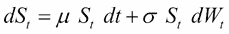
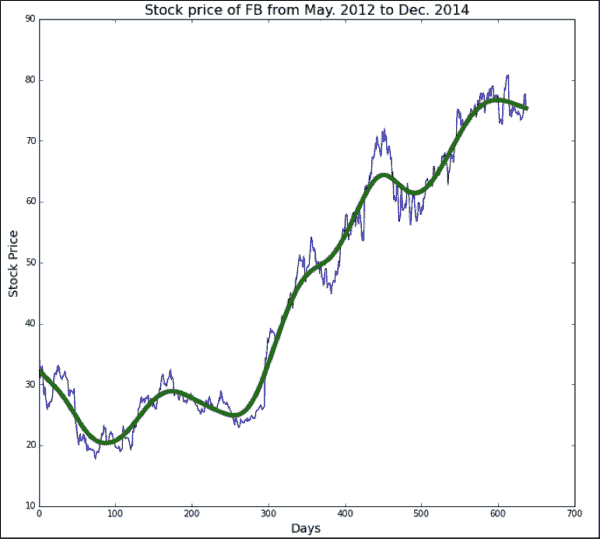
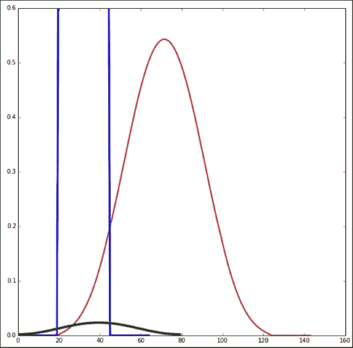
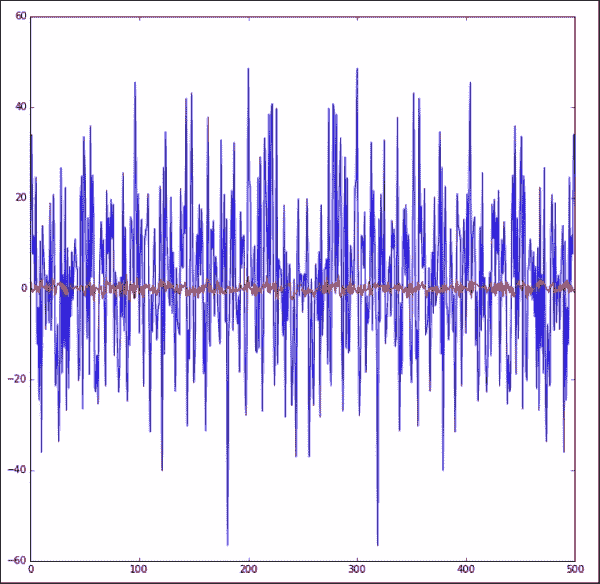
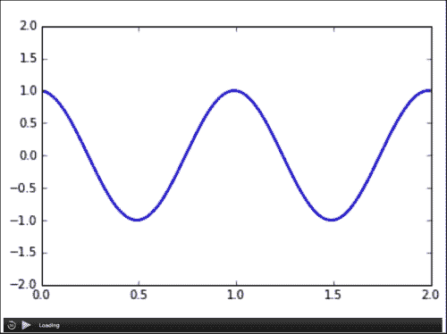
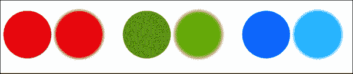
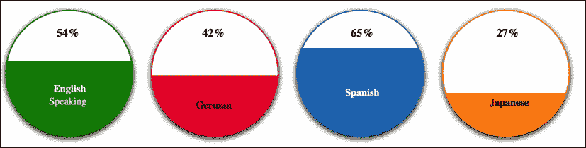
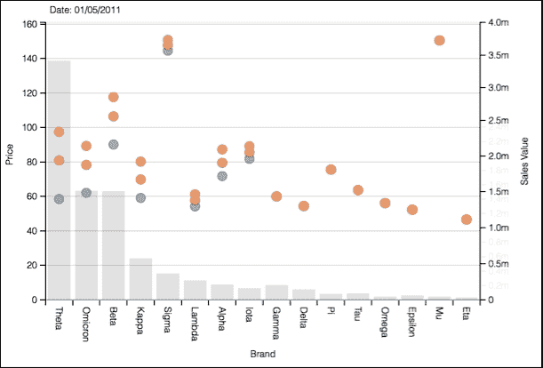
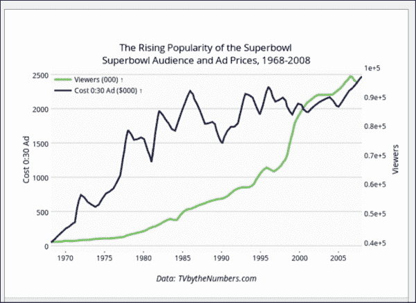

# 八、高级可视化

可视化方法已经从几十年前的传统条形图和饼图转变为最近更具创造性的形式。设计可视化并不像从特定工具提供的众多选择中选择一个那样简单。正确的可视化传达了正确的信息，错误的可视化可能会扭曲、混淆或传达错误的信息。

其中的计算机和存储设备不仅有助于使用数据结构存储大块数据，而且有助于通过算法使用计算能力。根据 D3.js 的创建者和领先的可视化专家迈克尔·博斯托克的说法，我们应该可视化算法，而不仅仅是输入其中的数据。算法是任何过程或计算模型背后的核心引擎；因此，该算法成为可视化的重要用例。

可视化算法只是在最近几年才得到认可，探索这个概念的一个有趣的地方是[visualgo.net](http://visualgo.net)，他们有一些先进的算法来教授数据结构和算法。Visualgo 包含的算法可以在史蒂芬·哈利姆博士的著作《T2》中找到。来自三藩市大学([https://www.cs.usfca.edu/~galles/visualization/](https://www.cs.usfca.edu/~galles/visualization/))的大卫·盖尔斯教授提供了另一种类似的有趣的可视化方法。还有其他类似的贡献来教授算法和数据。

我们讨论了许多不同的领域，包括数值计算、金融模型、统计和机器学习以及网络模型。在本章的后面，我们将讨论一些关于可视化的新的和创造性的想法，以及一些模拟和信号处理的例子。此外，我们将涵盖以下主题:

*   计算机模拟、信号处理和动画示例
*   使用 HTML5 的一些有趣的可视化方法
*   朱莉娅和 Python 有什么不同？—优点和缺点
*   与 Python 相比，为什么 D3.js 是最受欢迎的可视化工具
*   创建仪表板的工具

# 计算机模拟

计算机模拟是一门流行了几十年的学科。它是一个试图模拟抽象模型的计算机程序。计算机模拟模型可以帮助创建复杂系统，作为理解和评估隐藏或未知场景的一种方式。计算机模拟建模的一些显著例子是天气预报和用于训练飞行员的飞机模拟器。

计算机模拟已经成为物理、化学、生物学、经济学、工程学、心理学和社会科学等不同领域系统数学建模的一个非常有效的部分。

以下是模拟模型的好处:

*   更好地理解正在研究的算法或过程
*   识别流程和算法中的问题区域
*   评估任何与算法模型相关的变化的影响

模拟模型的类型如下:

*   **离散模型**:在这种情况下，系统的变化只发生在特定的时间
*   **连续模型**:在这种情况下，系统的状态会在一段时间内连续变化
*   **混合模型**:包含离散和连续元素

为了进行模拟，通常使用随机概率输入，因为在进行任何此类模拟实验之前，您不太可能拥有真实数据。因此，模拟实验涉及随机数是很常见的，无论它是否针对确定性模型。

首先，让我们考虑一下在 Python 中生成随机数的几个选项，并举例说明模拟中的一个或多个例子。

## Python 的随机包

Python 提供了一个名为`random`的包，它有几个方便的功能，可用于以下目的:

*   生成介于 0.0 和 1.0 之间或特定起始值和结束值之间的随机实数
*   生成特定数字范围之间的随机整数
*   从数字或字母列表中获取随机值列表

```py
import random

print random.random() # between 0.0 and 1.0
print random.uniform(2.54, 12.2) # between 2.54 and 12.2
print random.randint(5,10)  # random integer between 5 and 10

print random.randrange(25)  # random number between 0 and 25
#  random numbers from the range of 5 to 500 with step 5
print random.randrange(5,500,5) 

# three random number from the list 
print random.sample([13,15,29,31,43,46,66,89,90,94], 3) 
# Random choice from a list
random.choice([1, 2, 3, 5, 9])
```

## SciPy 的随机函数

NumPy 和 SciPy 是 Python 模块，由数学和数值例程组成。**数值**T5】Python(**NumPy**)包提供了操纵数值数据的大数组和矩阵的基本例程。`scipy`包用算法和数学技术扩展了 NumPy。

NumPy 内置了伪随机数发生器。这些数字是伪随机的，这意味着它们是由单个种子号确定性地生成的。使用相同的种子号，您可以生成相同的随机数集，如以下代码所示:

```py
Import numpy as np
np.random.seed(65536)
```

不提供种子值可以生成不同的随机序列。每次运行具有以下代码的程序时，NumPy 都会自动选择一个不同的随机种子(基于时间):

```py
np.random.seed()
```

间隔`[0.0, 1.0]`中的五个随机数的数组可以如下生成:

```py
import numpy as np
np.random.rand(5)
#generates the following
array([ 0.2611664,  0.7176011,  0.1489994,  0.3872102,  0.4273531])
```

`rand`功能也可以是用来生成随机二维数组，如下代码所示:

```py
np.random.rand(2,4) 
array([
[0.83239852, 0.51848638, 0.01260612, 0.71026089],        
[0.20578852, 0.02212809, 0.68800472, 0.57239013]])
```

要生成随机整数，可以使用`randint (min, max)`，其中`min`和`max`定义数字的范围，其中随机整数必须绘制，如下代码所示:

```py
np.random.randint(4,18) 
```

使用以下代码绘制离散泊松分布 *λ = 8.0* :

```py
np.random.poisson(8.0)
```

要从平均值为 *μ = 1.25* 且标准差为 *σ = 3.0* 的连续正态(高斯)分布中提取，请使用以下代码:

```py
np.random.normal(2.5, 3.0)

#for mean 0 and variance 1
np.random.mormal()
```

## 仿真示例

在第一个例子中，我们将选择几何布朗运动，也称为指数布朗运动，用**随机微分方程** ( **SDE** )来建模股价行为:



在上式中， *Wt* 为布朗运动， *μ* 为百分比漂移， *σ* 为百分比波动率。以下代码显示了布朗运动图:

```py
from numpy.random import standard_normal
from numpy import zeros, sqrt
import matplotlib.pyplot as plt

S_init = 20.222
T =1
tstep =0.0002
sigma = 0.4
mu = 1
NumSimulation=6

colors = [ (214,27,31), (148,103,189), (229,109,0), (41,127,214), 
(227,119,194),(44,160,44),(227,119,194), (72,17,121), (196,156,148)]  

# Scale the RGB values to the [0, 1] range.

for i in range(len(colors)):  
    r, g, b = colors[i]  
    colors[i] = (r / 255., g / 255., b / 255.)

plt.figure(figsize=(12,12))

Steps=round(T/tstep); #Steps in years
S = zeros([NumSimulation, Steps], dtype=float)
x = range(0, int(Steps), 1)

for j in range(0, NumSimulation, 1):

    S[j,0]= S_init
    for i in x[:-1]:
       S[j,i+1]=S[j,i]+S[j,i]*(mu-0.5*pow(sigma,2))*tstep+ \
          sigma*S[j,i]*sqrt(tstep)*standard_normal()
    plt.plot(x, S[j], linewidth=2., color=colors[j])

plt.title('%d Simulation using %d Steps, \n$\sigma$=%.6f $\mu$=%.6f $S_0$=%.6f ' % (int(NumSimulation), int(Steps), sigma, mu, S_init), 
          fontsize=18)
plt.xlabel('steps', fontsize=16)
plt.grid(True)
plt.ylabel('stock price', fontsize=16)
plt.ylim(0,90)

plt.show()
```

下图显示了使用布朗运动的六次模拟的结果:


这里的另一个模拟示例演示了如何应用霍德里克-普雷斯科特滤波器来获得属于时间序列数据类别的股票价格数据的平滑曲线表示:



这里，我们将使用`matplotlib`中的金融子包来生成一系列日期的股价数据，起始日期为 2012 年 5 月，终止日期为 2014 年 12 月。使用`matplotlib`的`hold`方法，可以将平滑后的曲线和股价图一起显示出来，如下代码所示:

```py
from matplotlib import finance
import matplotlib.pyplot as plt

import statsmodels.api as sm

titleStr='Stock price of FB from May. 2012 to Dec. 2014'
plt.figure(figsize=(11,10))

dt1 = datetime.datetime(2012, 05, 01)
dt2 = datetime.datetime(2014, 12, 01)
sp=finance.quotes_historical_yahoo('FB',dt1,dt2,asobject=None)

plt.title(titleStr, fontsize=16) 
plt.xlabel("Days", fontsize=14) 
plt.ylabel("Stock Price", fontsize=14)

xfilter = sm.tsa.filters.hpfilter(sp[:,2], lamb=100000)[1]

plt.plot(sp[:,2])
plt.hold(True)
plt.plot(xfilter,linewidth=5.)
```

除了这些例子，你可以模拟一个队列系统或者任何基于事件的进程。例如，你可以模拟一个神经网络，一个有助于快速建模的软件包可以在[http://briansimulator.org](http://briansimulator.org)获得。看看他们的演示程序，了解更多细节。

## 信号处理

信号处理中有很多的例子你可以想到，但是我们会选择一个涉及卷积的具体例子。两个信号的卷积是组合它们以产生滤波的第三信号的一种方式。在现实生活中，信号卷积用于平滑图像。在很大程度上，卷积也被用于计算信号干扰。关于更多的细节，你可以参考一本关于微波测量的书，但是我们将尝试给你看一些简单的例子。

让我们考虑三个简单的例子。第一个示例说明了数字信号的卷积信号，并使用汉明来模拟模拟信号，如以下代码所示:

```py
import matplotlib.pyplot as plt
from numpy import concatenate, zeros, ones, hamming, convolve

digital = concatenate ( (zeros(20), ones(25), zeros(20)))
norm_hamming = hamming(80)/sum(hamming(80))
res = convolve(digital, norm_hamming)
plt.figure(figsize=(10,10))
plt.ylim(0, 0.6)
plt.plot(res, color='r', linewidth=2)
plt.hold(True)
plt.plot(data, color='b', linewidth=3)
plt.hold(True)
plt.plot(norm_hamming, color='g', linewidth=4)
plt.show()
```

在这个例子中，我们将使用连接和来自`numpy`的 0 和 1 来产生数字信号，汉明来产生模拟信号，卷积来应用卷积。

如果我们绘制所有三个信号，即数字信号、模拟汉明和卷积结果信号(res)，结果信号将如预期的那样偏移，如下图所示:



在另一个例子中，我们将使用随机信号，即`random_data`并应用**快速傅立叶** **变换** ( **FFT** )如下:

```py
import matplotlib.pyplot as plt
from scipy import randn
from numpy import fft

plt.figure(figsize=(10,10))
random_data = randn(500)
res = fft.fft(random_data)
plt.plot(res, color='b')
plt.hold(True)
plt.plot(random_data, color='r')
plt.show()
```

使用`scipy`中的`randn`生成随机信号数据，使用`numpy`中的`fft`执行快速傅里叶变换，变换结果用蓝色绘制，原始随机信号用红色绘制，如下图所示:



在第三个示例中，显示了如何使用`scipy`包创建反转图像的简单示例。在我们开始实际的 Python 代码和结果之前，让我们试着分析一下倒排图像将如何帮助可视化数据。

有争议的是，在某些情况下，倒置的颜色对我们的视觉造成的压力较小，并且看起来很舒服。令人惊讶的是，如果我们将原始图像和反转图像并排放置，反转图像将有助于可视化某些区域，否则这些区域在原始图像中可能是困难的，如果不是所有图像的话，至少在某些情况下是如此。下面的代码展示了如何使用`scipy.misc.pilutil.Image()`将图像转换为反转图像:

```py
import scipy.misc as scm 
from scipy.misc.pilutil import Image  

# open original image 
orig_image = Image.open('/Users/kvenkatr/Desktop/filter.jpg')

# extract image data into array
image1 = scm.fromimage(orig_image)
# invert array values 
inv_image = 255 - image1

# using inverted array values, convert image 
inverted_image = scm.toimage(inv_image) 

#save inverted image
inverted_image.save('/Users/kvenkatr/Desktop/filter_invert.jpg').
```

反转图像结果与原始图像一起显示在此处:


类似地，使用以下一些功能，可以将其他过滤机制应用于任何图像:

```py
convolve()         Multidimensional convolution.
correlate()        Multi-dimensional correlation.
gaussian_filter()  Multidimensional Gaussian filter
```

功能的完整列表显示在 http://tinyurl.com/3xubv9p T2。

## 动画

您可以使用`matplotlib`在 Python 中完成动画，但是结果会保存在 MP4 格式的文件中，以便以后回放。动画的基本设置如下:

```py
import numpy as np 
import matplotlib.pyplot as plt 
from matplotlib import animation  

# Set up the figure, axis, and the plot element to be animated 
fig = plt.figure() 
ax = plt.axes(xlim=(0, 3.2), ylim=(-2.14, 2.14)) 
line, = ax.plot([], [], lw=2)
```

确保动画包从`matplotlib`导入，设置轴，并准备必要的绘图变量(这只是一个空行)，如下所示:

```py
# initialization function: plot the background of each frame
def init():
    line.set_data([], [])
    return line,
```

绘图的初始化需要在开始任何动画之前执行，因为它会创建一个基本帧，如以下代码所示:

```py
# animation function.  This is called sequentially
def animate(i):
    x = np.linspace(0, 2, 1000)
    xval = 2 * np.pi * (x - 0.01 * i)
    y = np.cos(xval) # Here we are trying to animate cos function
    line.set_data(x, y)
    return line,
```

这里是动画功能，以帧数为输入，定义改变的`x`和`y`值，并设置绘图变量:

```py
anim = animation.FuncAnimation(fig, animate, init_func=init,\
            frames=200, interval=20, blit=True)
anim.save('basic_animation.mp4', fps=30)
plt.show()
```

实际动画对象通过`FuncAnimation`创建，并通过`init()` 和`animate()`功能，以及帧数、**每秒帧数** ( **fps** )和时间间隔参数。`blit=True`参数告诉您只需要重新绘制显示的更改部分(否则，可能会看到闪烁)。

在你尝试执行一个动画之前，你必须确定`mencoder`或`ffmpeg`已经安装；否则，在没有`ffmpeg`或`mencoder`的情况下运行该程序将导致以下错误:`ValueError: Cannot save animation: no writers are available. Please install mencoder or ffmpeg to save animations.`。下图显示了三角曲线的动画，例如正弦曲线或余弦曲线:



您可以将这个 MP4 文件嵌入到一个 HTML 中进行显示，并按下左下角的播放按钮来观看动画。

在[https://jakevdp . github . io/blog/2012/08/18/matplotlib-animation-tutorial/](https://jakevdp.github.io/blog/2012/08/18/matplotlib-animation-tutorial/)有一个有趣的双摆动画演示，在[http://matplotlib . org/examples/animation/dynamic _ image 2 . html](http://matplotlib.org/examples/animation/dynamic_image2.html)有一个动态图像动画演示。

在本书中，到目前为止，我们已经讨论了可视化方法，涉及如何在 Python 中绘图或创建外部格式(如 MP4)。基于 JavaScript 的可视化方法受欢迎的原因之一是因为您可以在网络上呈现它们，并且还可以将一些事件驱动的动画与它们相关联。**支持向量图形** ( **SVG** )获得人气的原因有很多，其中之一就是*能够缩放到任意大小* *而不丢失细节*。

## 使用 HTML5 的可视化方法

下面的代码简单说明了使用`feGaussianBlur`显示圆的 SVG:

```py
  <svg width="230" height="120"  xmlns:xlink="http://www.w3.org/1999/xlink">
    <filter id="blurMe">
       <feGaussianBlur in="SourceGraphic" stdDeviation="5" />
    </filter>

    <circle cx="60"  cy="80" r="60" fill="#E90000" />
    <circle cx="190" cy="80" r="60" fill="#E90000"
      filter="url(#blurMe)" />
    <circle cx="360"  cy="80" r="60" fill="#4E9B01" />
    <circle cx="490" cy="80" r="60" fill="#4E9B01"
      filter="url(#blurMe)" />
    <circle cx="660"  cy="80" r="60" fill="#0080FF" />
    <circle cx="790" cy="80" r="60" fill="#0080FF"
      filter="url(#blurMe)" />
  </svg>
```

前两个圆的半径为 60，用相同的颜色填充，但第二个圆使用模糊滤镜。同样，绿色和蓝色的相邻圆圈也遵循相同的行为(对于彩色效果，请参考[http://knapdata.com/dash/html/svg_circle.html](http://knapdata.com/dash/html/svg_circle.html)，如下图所示:



当数据表示在可视化中需要整体的一部分，但没有组合成一个整体时，我们如何使用这种模糊的概念。这是什么意思？让我们考虑两个例子。在第一个例子中，我们将考虑一个以外语(在某些情况下，不止一种语言)注册的学生班级。如果我们将分布表示如下，我们会怎么做？



您可以通过 Python 程序生成 SVG 格式，如以下代码所示:

```py
import os
display_prog = 'more' # Command to execute to display images.
svcount=1

class Scene:
    def __init__(self,name="svg",height=400,width=1200):
        self.name = name
        self.items = []
        self.height = height
        self.width = width
        return

    def add(self,item): self.items.append(item)

    def strarray(self):
        var = [ "<html>\n<body>\n<svg height=\"%d\" width=\"%d\" >\n" % (self.height,self.width),
               "  <g id=\"setttings\">\n",
               "    <filter id=\"dropshadow\" height=\"160%\">\n",
               "     <feGaussianBlur in=\"SourceAlpha\" stdDeviation=\"5\"></feGaussianBlur>\n",
               "       <feOffset dx=\"0\" dy=\"3\" result=\"offsetblur\"></feOffset>\n",
               "       <feMerge>\n",
               "          <feMergeNode></feMergeNode>\n",
               "          <feMergeNode in=\"SourceGraphic\"></feMergeNode>\n",
               "       </feMerg>\n",
               "    </filter>\n"]
        for item in self.items: var += item.strarray()            
        var += [" </g>\n</svg>\n</body>\n</html>"]
        return var

    def write_svg(self,filename=None):
        if filename:
            self.svgname = filename
        else:
            self.svgname = self.name + ".html"
        file = open(self.svgname,'w')
        file.writelines(self.strarray())
        file.close()
        return

    def display(self,prog=display_prog):
        os.system("%s %s" % (prog,self.svgname))
        return        

def colorstr(rgb): return "#%x%x%x" % (rgb[0]/16,rgb[1]/16,rgb[2]/16)

class Text:
    def __init__(self, x,y,txt, color, isItbig, isBold):
        self.x = x
        self.y = y
        self.txt = txt
        self.color = color
        self.isItbig = isItbig 
        self.isBold = isBold
    def strarray(self):
        if ( self.isItbig == True ):
          if ( self.isBold == True ):
            retval = [" <text y=\"%d\" x=\"%d\" style=\"font-size:18px;font-weight:bold;fill:%s\">%s</text>\n" %(self.y, self.x, self.color,self.txt) ]
          else:
            retval = [" <text y=\"%d\" x=\"%d\" style=\"font-size:18px;fill:%s\">%s</text>\n" %(self.y, self.x, self.color,self.txt) ]
        else:
          if ( self.isBold == True ):
            retval = [" <text y=\"%d\" x=\"%d\" style=\"fill:%s;font-weight:bold;\">%s</text>\n" %(self.y, self.x, self.color,self.txt) ]
          else:
            retval = [" <text y=\"%d\" x=\"%d\" style=\"fill:%s\">%s</text>\n" %(self.y, self.x, self.color,self.txt) ]
        return retval

class Circle:
    def __init__(self,center,radius,color, perc):
        self.center = center #xy tuple
        self.radius = radius #xy tuple
        self.color = color   #rgb tuple in range(0,256)
        self.perc = perc
        return

    def strarray(self):
        global svcount
        diam = self.radius+self.radius
        fillamt = self.center[1]-self.radius - 6 + (100.0 - self.perc)*1.9
        xpos = self.center[0] - self.radius
        retval = ["  <circle cx=\"%d\" cy=\"%d\" r=\"%d\"\n" %\
                (self.center[0],self.center[1],self.radius),
                "    style=\"stroke: %s;stroke-width:2;fill:white;filter:url(#dropshadow)\"  />\n" % colorstr(self.color),
               "  <circle clip-path=\"url(#dataseg-%d)\" fill=\"%s\" cx=\"%d\" cy=\"%d\" r=\"%d\"\n" %\
                (svcount, colorstr(self.color),self.center[0],self.center[1],self.radius),
                "    style=\"stroke:rgb(0,0,0);stroke-width:0;z-index:10000;\"  />\n",
               "<clipPath id=\"dataseg-%d\"> <rect height=\"%d\" width=\"%d\" y=\"%d\" x=\"%d\"></rect>" %(svcount,diam, diam,fillamt,xpos),
               "</clipPath>\n"
                ]
        svcount += 1
        return retval

def languageDistribution():
    scene = Scene('test')
    scene.add(Circle((140,146),100,(0,128,0),54))
    scene.add(Circle((370,146),100,(232,33,50),42))
    scene.add(Circle((600,146),100,(32,119,180),65))
    scene.add(Circle((830,146),100,(255,128,0),27))
    scene.add(Text(120,176,"English", "white", False, True))
    scene.add(Text(120,196,"Speaking", "#e2e2e2", False, False))
    scene.add(Text(340,202,"German", "black", False, True))
    scene.add(Text(576,182,"Spanish", "white", False, True))
    scene.add(Text(804,198,"Japanese", "black", False, True))

    scene.add(Text(120,88,"54%", "black", True, True))
    scene.add(Text(350,88,"42%", "black", True, True))
    scene.add(Text(585,88,"65%", "black", True, True))
    scene.add(Text(815,88,"27%", "black", True, True))

    scene.write_svg()
    scene.display()
    return

if __name__ == '__main__': languageDistribution()
```

前面的例子给出了一个为可视化创建自定义`svg`方法的想法。今天 Python 中还有很多其他的`svg` 作者，但是他们都没有展示我们在这里展示的方法。也有许多不同的方法来创建其他语言的自定义可视化方法，例如 Julia。这种技术已经存在了将近三年，被认为适合数值和科学计算。

## 朱莉娅和 Python 有什么不同？

Julia 是一种动态的编程语言。不过在性能方面与 C 相当，因为 Julia 是一个基于低级虚拟机的即时编译器(JIT 编译器)。众所周知，在 Python 中，为了将 C 和 Python 结合起来，你可能不得不使用 Cython。

朱莉娅的一些显著优点如下:

*   性能与 C 相当
*   内置的包管理器
*   有类似 lisp 的宏
*   可以使用 PyCall 包调用 Python 函数
*   可以直接调用 C 函数
*   专为分布式计算设计
*   用户定义的类型和内置类型一样快

唯一的缺点是你必须学习一门新的语言，尽管与 C 和 Python 有一些相似之处。

D3.js(其中 D3 简称表示 DDD，代表**文档驱动的数据**)是 Python 中用于可视化的竞争框架之一。

## 用于可视化的 D3.js

D3.js 是一个 JavaScript 库，用于在 Web 上呈现数据，并使用 HTML、SVG 和 CSS 帮助显示数据。

D3.js 将数据附加到**文档对象模型** ( **DOM** )元素；因此，您可以使用 CSS3、HTML 和 SVG 来展示他们的数据。此外，由于 JavaScript 有事件侦听器，您可以使数据具有交互性。

迈克·博斯托克在斯坦福可视化小组攻读博士期间创建了 D3.js。首先，迈克与斯坦福可视化小组合作制作了 Protivis，然后最终成为 D3。迈克·博斯托克、瓦迪姆·奥吉夫茨基和杰弗里·赫尔发表了一篇题为 *D3:数据驱动文档*的论文，可在[http://vis.stanford.edu/papers/d3](http://vis.stanford.edu/papers/d3)查阅。

实际上，D3.js 的基本原理是使用 CSS 样式选择器从 DOM 节点中进行选择，然后使用 jQuery 样式对其进行操作。这里有一个例子:

```py
d3.selectAll("p")            // select all <p> elements
  .style("color", "#FF8000") // set style "color" to value "#FF8000"
  .attr("class", "tin")      // set attribute "class" to value "tin"
  .attr("x", 20);            // set attribute "x" to 20px
```

D3 的许多优点之一是，通过简单地访问 DOM 的机制，您可以创建惊人的数据表示。另一个优点是，通过充分利用 JavaScript 的强大功能结合当今的计算能力，您可以轻松快速地添加导航行为。在 http://bost.ocks.org/mike/有大量这样的可视化工具。这里显示了 D3 可视化图的一个示例:



你可以制作很多可视化的例子，在图库中的例子中([http://christophviau . com/d3list/gallery . html # visualization type =棒棒糖](http://christopheviau.com/d3list/gallery.html#visualizationType=lollipop))，我最喜欢的是讲述使用多系列多轴的不同聚合的故事，可以在[http://tinyurl.com/p988v2u](http://tinyurl.com/p988v2u)查看(上图也有显示)。

## 仪表盘

Python 相比 D3 有很多优势。当你把这两者结合在一起时，你可以把两者都利用起来。例如，Python 为数值和科学计算提供了一些非常好的软件包选项。由于这个原因，它一直很受学术界的欢迎。

最近出现的有趣的数据可视化和协作工具非常少，其中一个工具就是 Plotly([https://Plotly . ly](https://plot.ly))。Python 仪表盘集合可在[https://plot.ly/python/dashboard/](https://plot.ly/python/dashboard/)访问。由于这是相当新的，我们还没有有机会进一步探索，看看一个人能做什么。Splunk 提供了一个在[http://dev.splunk.com/view/SP-CAAADSR](http://dev.splunk.com/view/SP-CAAADSR)创建基于 Python 的仪表板的 SDK，Pyxley 是一个包的集合，它结合了 Python 和 JavaScript 的力量来创建基于网络的仪表板。Splunk 仪表板中的一个示例如下所示:



上图显示了 Plotly 的一个示例。它演示了如何生成一个看起来漂亮、易于理解并且可以在[http://tinyurl.com/pwmg5zr](http://tinyurl.com/pwmg5zr)导航的可视化效果。

# 总结

本章说明了前几章没有涉及的其他主题，例如使用 Python 的信号处理和动画。此外，我们还将 Python 与 D3.js 和 Julia 进行了比较，确定了它们的优势。讨论了信号处理的几个例子。我们还使用`numpy`和`matplotlib`研究了模拟和数字信号频谱的卷积。

我们还看了一个动画示例，并演示了如何通过 Python 生成 MP4 格式的动画。我们还将 Julia 与 Python 进行了比较，并列出了 Julia 相对于 Python 的几个优点，并对它们进行了比较，以看出不同之处。

此外，我们展示了 D3.js 的优势，强调了这个基于 JavaScript 的可视化工具和 Python 之间的区别。最后，我们讨论了仪表板可用的选项，并列出了创建基于 Python 的仪表板的几个选项。