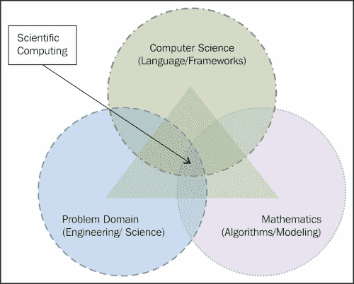

# 一、科学计算的前景——为什么是 Python？

使用计算机化的数学建模和数值分析技术来分析和解决科学和工程领域的问题被称为**科学计算**。科学问题包括来自各个科学分支的问题，如地球科学、空间科学、社会科学、生命科学、物理科学和形式科学。这些分支几乎涵盖了现有的所有科学领域，从传统科学到现代工程科学，如计算机科学。工程问题包括从土木和电气到(最新的)生物医学工程的问题。

在本章中，我们将涵盖以下主题:

*   科学计算基础
*   科学计算过程的流程
*   科学和工程领域的例子
*   解决复杂问题的策略
*   近似值、误差和相关术语
*   误差分析的概念
*   计算机算术和浮点数
*   Python 的背景
*   为什么选择 Python 进行科学计算？

数学建模是指涉及数学术语来表示设备、对象、现象和概念的行为的建模活动。一般来说，它有助于更好地理解概念、设备或对象的行为或观察。它可能有助于解释对某些未来行为的观察和可能的预测，或者还有待观察或测量的结果。数值分析是计算机科学和数学的一个领域，它设计、分析并最终实现算法，以数值方式解决自然科学(例如，物理、生物和地球科学)、社会科学(例如，经济学、心理学、社会学和政治学)、工程、医学和商业的问题。有一个名为**Python Dynamics**(**PyDy**)的包和工作流，用于研究多体动力学。它是一个工作流和一个软件包，是在 Sympymechanism 软件包的基础上开发的。PyDy 扩展了 SymPy，便于多体动力学的仿真。

# 科学计算的定义

科学计算也可称为**计算科学**或**科学计算**。它主要是发展数学模型、使用定量分析技术和使用计算机解决科学问题的思想。

|   | *“科学计算是在计算机上解决科学和工程问题的数学模型所需的工具、技术和理论的集合。”* |   |
|   | - *吉恩·h·戈鲁伯和詹姆斯·m·奥尔特加* |

简单来说，科学计算可以被描述为一个跨学科的领域，如下图所示:

作为跨学科领域的科学计算

科学计算需要对要解决的潜在问题的主题有所了解(一般来说，这将是一个来自科学或工程领域的问题)，具有各种数值分析技术的合理想法的数学建模能力，以及最终使用计算技术的高效和高性能实现。它还要求应用计算机；各种外围设备，包括网络设备、存储单元、处理单元以及数学和数值分析软件；编程语言；和任何数据库以及对问题领域的良好了解。计算和相关技术的使用使更新的应用成为可能，科学家可以从现有的数据和过程中推断出新的知识。

就计算机科学而言，科学计算可以被认为是数学模型和领域数据/信息的数值模拟。模拟背后的目标取决于被模拟应用的领域。目标可以是了解事件背后的原因、重建特定情况、优化流程或预测事件的发生。有几种情况下，数值模拟是唯一的选择，或者最好的选择。有些现象或情况下，进行实验几乎是不可能的，例如，气候研究、天体物理学和天气预报。在其他一些情况下，实际实验并不可取，例如，检查某些材料或产品的稳定性或强度。有些实验在时间/经济方面非常昂贵，例如车祸或生命科学实验。在这种情况下，科学计算可以帮助用户分析和解决问题，而无需花费太多时间或成本。

# 科学计算过程的简单流程

下图描述了一个科学应用的简单计算流程图。第一步是为所考虑的问题设计一个数学模型。数学模型制定后，下一步是开发其算法。然后使用合适的编程语言和合适的实现框架来实现该算法。选择编程语言是一个关键的决定，它取决于应用的性能和处理要求。另一个接近的决定是最终确定用于实施的框架。在确定了语言和框架之后，实现了算法并进行示例模拟。然后分析仿真结果的性能和正确性。如果实施的结果或绩效不符合预期，应确定其原因。然后我们需要回到要么重新制定数学模型，要么重新设计算法或其实现，并再次选择语言和框架。

一个数学模型是由一组合适的方程来表达的，这些方程将大多数问题描述得非常详细。该算法以单独的步骤表示求解过程，这些步骤将使用合适的编程语言或脚本来实现。

实现之后，有一个重要的步骤要执行——对实现的代码进行模拟运行。这包括设计实验基础设施、准备或安排用于模拟的数据/情况、准备要模拟的场景等等。

在完成模拟运行后，下一步需要收集结果并呈现出来，以分析结果，从而测试模拟的有效性。如果结果不像预期的那样，那么这可能需要返回到该过程的先前步骤之一来纠正和重复它们。这种情况在下图中以虚线的形式回到前面的一些步骤。如果一切进展顺利，那么分析将是工作流程的最后一步，在此图中用双线表示:

科学计算工作流程中的各个步骤

解决任何数学问题的算法的设计和分析，特别是关于科学和工程的，被称为**数值分析**，现在也被称为科学计算。在科学计算中，考虑的问题主要涉及连续值，而不是离散值。后者在其他计算机科学问题中处理。一般来说，科学计算解决的问题涉及具有连续变量的函数和方程，例如时间、距离、速度、重量、高度、大小、温度、密度、压力、应力等等。

一般来说，连续数学的问题都有近似解，因为它们的精确解并不总是可以在有限的步骤中得到。因此，这些问题通过迭代过程来解决，最终收敛到一个可接受的解。可接受的解决方案取决于具体问题的性质。一般来说，迭代过程不是无限的，每次迭代后，为了模拟的目的，当前解会更接近期望解。回顾解的准确性和对解的快速收敛形成了科学计算过程的要点。

有一些成熟的科学领域使用科学计算来解决问题。它们如下:

*   计算流体动力学语言
*   大气科学
*   地震学
*   结构分析
*   化学
*   磁流体力学
*   油藏建模
*   全球海洋/气候建模
*   天文学/天体物理学
*   宇宙学
*   环境研究
*   核工程

最近，一些新兴领域也开始利用科学计算的力量。它们包括:

*   生物
*   经济学
*   材料研究
*   医学成像
*   畜牧学

# 来自科学/工程领域的示例

让我们来看看使用科学计算可能解决的一些问题。第一个问题是研究两个黑洞碰撞的行为，这在理论和实践上都很难理解。从理论上讲，这个过程极其复杂，在实验室里进行并进行现场研究几乎是不可能的。但是这种现象可以在计算实验室中用爱因斯坦广义相对论的数学公式的适当和有效的实现来模拟。然而，这需要非常高的计算能力，这可以使用先进的分布式计算基础设施来实现。

第二个问题与工程和设计有关。考虑一个与汽车测试相关的问题，叫做**碰撞测试**。为了降低进行有风险的实际碰撞测试的成本，工程师和设计师更喜欢进行计算机模拟碰撞测试。最后，考虑设计大房子或工厂的问题。有可能构建提议的基础设施的虚拟模型。但这需要合理的时间，而且成本高昂。然而，这种设计可以使用架构设计工具来完成，这将节省大量的时间和成本。生物信息学和医学科学中也可以有类似的例子，比如蛋白质结构折叠和传染病建模。研究蛋白质结构折叠是一个非常耗时的过程，但可以使用大型超级计算机或分布式计算系统高效地完成。同样，传染病建模将节省分析各种参数对该疾病疫苗接种计划影响的努力和成本。

选择这三个例子是因为它们代表了可以使用科学计算解决的三类不同的问题。第一个问题几乎不可能。第二个问题是可能的，但在一定程度上是有风险的，可能会导致严重的损害。最终的问题可以在没有任何模拟的情况下解决，并且有可能在现实生活中复制它。然而，它比它的模拟更加昂贵和耗时。

# 解决复杂问题的策略

为复杂的计算问题寻找解决方案的简单策略是首先确定解决方案中的困难区域。现在，一个接一个地，开始用它们的解决方案替换这些小的困难部分，这些解决方案将导致相同的解决方案或在特定问题的允许限度内的解决方案。换句话说，最好的想法是将一个大的、复杂的问题简化为一组较小的问题。它们中的每一个都可能复杂或简单。现在，每个复杂的子问题都可能被一个类似的简单问题所取代，这样，我们最终会得到一个更简单的问题来解决。基本思想是将各个击破的技术与变小的复杂问题与类似的简单问题相结合。

采纳这个想法时，我们应该注意两个要点。第一个是我们需要搜索一个相似的问题或者一个有同一个类的解的问题。第二个是，就在用一个问题替换另一个问题之后，我们需要确定最终解决方案是否保留在公差范围内，如果不是完全保留的话。一些例子可能如下:

*   为简单起见，将问题中的无限维空间改为有限维空间
*   用有限过程改变无限过程，如用有限和或有限差的导数代替积分或无穷级数
*   如果可行，那么代数方程可以用来代替微分方程
*   尝试用线性问题代替非线性问题，因为线性问题很容易解决
*   如果可行，可以将复杂的功能更改为多个简单的功能，以实现简单性

# 近似值、误差以及相关的概念和术语

这些科学计算解通常产生近似解。通过近似解，我们的意思是代替精确的期望解，获得的解将与它几乎相似。几乎相似，我们的意思是，这将是一个足够接近的解决方案，认为实际或模拟成功，因为他们完成了目的。这种近似或类似的解决方案是由多种原因造成的。这些来源可以分为两类:在计算开始前出现的来源和在计算过程中出现的来源。

计算开始前出现的近似值可能是由以下一个或多个因素引起的:

*   **建模过程中的假设或忽略**:建模过程中可能存在假设，同样建模过程中忽略或忽略概念或现象的影响，这可能导致近似或可容忍的不准确性。
*   **来自观测或实验的数据**:不准确的地方可能是从一些精度较低的设备获得的数据。在计算过程中，有一些常数，如 pi，其值必须近似，这也是偏离正确结果的一个重要原因。
*   **先决条件计算**:数据可能是从以前的实验结果中获得的，或者模拟可能有微小的、可接受的不准确性，最终导致进一步的近似。这种预先处理可能是后续实验的先决条件。

计算过程中的近似是由以下一个或多个来源引起的:

*   **问题的简化**:正如我们在本章中已经建议的，解决大而复杂的问题，应该采用“分而治之”的组合，用更简单的问题代替小而复杂的问题。这可能导致近似值。考虑到我们用有限级数代替无限级数可能会导致近似。
*   **舍位与舍位**:多种情况要求中间结果舍位与舍位。同样，计算机中浮点数的内部表示及其算术也会导致微小的不准确性。

计算问题最终结果的近似值可能是前面讨论的各种来源的任意组合的结果。最终输出的精度可能会降低或提高，这取决于所解决的问题和解决问题的方法。

计算中误差和近似值的分类

## 误差分析

误差分析是用于观察这种近似对算法或计算过程精度的影响的过程。在随后的文本中，我们将讨论与错误分析相关的基本概念。

从前面关于近似值的讨论中可以观察到，误差可以被认为是输入数据中的误差，并且它们是在对该输入数据进行计算的过程中出现的。

在类似的路径上，计算误差可以再次分为两类:截断误差和舍入误差。截断误差是将复杂问题简化为简单问题的结果，例如，在达到所需精度之前迭代的不成熟终止。舍入误差是用于计算机计算的数字系统中表示数字的精度的结果，也是对这些数字进行算术运算的结果。

最终，显著或可忽略的误差量取决于数值的大小。例如，最终值 15 的误差 10 是非常显著的，而最终值 785 的误差 10 不是那么显著。此外，在获得 17，685 的最终值时，同样的误差 10 是可以忽略的。通常，误差值的影响与结果值有关。如果我们知道要获得的最终值的大小，那么在查看误差值后，我们可以决定是忽略它还是认为它是显著的。如果错误很大，那么我们应该开始采取纠正措施。

## 条件、稳定性和准确性

让我们讨论问题和算法的一些重要性质。灵敏度或条件是一个问题的属性。正在考虑的问题可以被称为敏感或不敏感，也可以被称为条件反射良好或条件反射不良。如果对于给定的输入相对变化，数据将对结果产生成比例的相对最终影响，则称问题不敏感或条件良好。另一方面，如果最终结果的相对影响比输入数据的相对变化大得多，则该问题将被视为敏感或病态问题。

## 前后向误差分析

假设我们通过 f 映射数据 *x* 得到了近似值 *y** ，例如 *y*=f(x)* 。现在，如果实际结果是 *y* ，那么小数量 *y' =y*-y* 称为一个 **正向误差**，其估计称为正向误差分析。一般来说，很难获得这个估计。另一种方法是将 *y** 视为修改后数据的相同问题的精确解，即*y * = f(x’)*。现在，数量 *x*=x'-x* 在 *y** 中被称为向后误差。后向误差分析是*×*的估计过程。

## 忽略这些错误可以吗？

这个问题的答案取决于你将应用科学计算的领域和应用。例如，如果是计算发射导弹的时间，0.1 秒的误差将导致严重的损坏。另一方面，如果是计算一列火车的到达时间，40 秒的误差不会导致大问题。同样，药物剂量的微小变化也会对患者产生灾难性的影响。一般来说，如果应用中的计算错误与人命损失无关，或者不涉及大的成本，那么它可以被忽略。否则，我们需要采取适当的努力来解决这个问题。

# 计算机算术和浮点数

由于实数在计算机中的表示，引入了科学计算中的一种近似。通过对这些实数进行算术运算，这个近似值被进一步放大。在这一节中，我们将讨论实数的这种表示，对这些数的算术运算，以及它们对计算结果的可能影响。然而，这些近似误差不仅出现在计算机计算中；它们可能出现在非计算机化的手动计算中，因为舍入是为了降低复杂性。然而，并非只有在计算机计算的情况下才会出现这些近似值。它们也可以在非计算机化的手动计算中观察到，因为四舍五入是为了降低计算的复杂性。

在继续讨论实数的计算机化表示之前，让我们先回顾一下数学中使用的著名的科学符号。在科学记数法中，为了把一个很大或很小的数的表示简化成一个简短的形式，我们把几乎相同的量乘以 10 的某些幂。同样，在科学符号中，数字以“ *a* 乘以 *10* 的形式表示为幂 *b* ，即 a *X 10b* 。例如，0.000000987654 和 987，654 可以分别表示为 *9.87654 x 10^-7* 和 *9.87654 x 10^5* 。在该表示中，指数是一个整数，系数是一个实数，称为**尾数**。

**电气和电子工程师协会** ( **IEEE** ) 已经标准化了 *IEEE 754* 中的浮点数表示。大多数现代机器使用这个标准，因为它解决了各种浮点数表示中发现的大多数问题。该标准的最新版本于 2008 年发布，被称为 *IEEE 754-2008* 。该标准定义了算术格式、交换格式、舍入规则、运算和异常处理。它还包括对高级异常处理、附加操作和表达式求值的建议，并告诉我们如何获得可再现的结果。

# Python 编程语言的背景

Python 是一种通用的高级编程语言，支持大多数编程范例，包括过程式、面向对象、命令式、面向方面和函数式编程。它还支持使用扩展的逻辑编程。它是一种解释语言，帮助程序员用比 C++、Java 或其他语言中相同概念的代码更少的行组成一个程序。Python 支持动态类型和自动内存管理。它有一个大而全面的标准库，现在它还支持许多特定任务的许多自定义库。使用包管理器(如`pip`、`easy_install`、`homebrew` (OS X)、`apt-get` (Linux)等)安装包非常容易。

Python 是一种开源语言；它的解释器适用于大多数操作系统，包括 Windows、Linux、OS X 和其他操作系统。有许多工具可以将 Python 程序转换为不同操作系统的可执行形式，例如 Py2exe 和 PyInstaller。这种可执行形式是独立的代码，不需要 Python 解释器来执行。

## Python 语言的指导原则

Python 的指导原则由吉多·范·罗苏姆(他也被称为 **【一生的仁慈独裁者】**(**【BDFL】**)编写，蒂姆·皮特斯(Tim Peters)将其转换成了一些格言，并在[https://www.python.org/dev/peps/pep-0020/](https://www.python.org/dev/peps/pep-0020/)发布。让我们用一些解释来讨论这些，如下所示:

*   **美胜于丑**:这背后的哲学是为人类读者编写程序，简单的表达语法，所有程序的语法和行为一致。
*   **显式比隐式好**:大多数概念都保持显式，就像显式布尔类型一样。我们对布尔变量使用了一个显式的文字值——真或假，而不是依赖于零或非零整数。尽管如此，它确实支持基于整数的布尔概念。非零值被视为布尔值。同样，它的`for`循环可以在不管理变量的情况下操作数据结构。同一个循环可以遍历字符串中的元组和字符。
*   **简单胜于复杂**:内存分配和垃圾收集器管理内存的分配或释放，避免复杂性。在简单的 print 语句中引入了另一个简单性。这避免了使用文件描述符进行简单打印。此外，对象会自动转换为逗号分隔值的可打印形式。
*   **复杂总比复杂好**:科学计算概念复杂，但这并不意味着程序会复杂。Python 程序并不复杂，即使对于非常复杂的应用也是如此。“Pythonic”的方式本来就很简单，SciPy 和 NumPy 包就是很好的例子。
*   **扁平化优于嵌套** : Python 在其标准库中提供了种类繁多的模块。Python 中的名称空间保持扁平结构，不需要使用很长的名称，比如`java.net.socket`而不是 Python 中的简单套接字。Python 的标准库遵循*电池包含的*理念。这个标准库提供了适用于许多任务的工具。例如，为开发丰富的互联网应用，支持各种网络协议的模块。类似地，图形用户界面编程、数据库编程、正则表达式、高精度算术、单元测试等模块都捆绑在标准库中。库中的部分模块包括网络(`socket`、`select`、`SocketServer`、`BaseHTTPServer`、`asyncore`、`asynchat`、`xmlrpclib`和`SimpleXMLRPCServer`)、互联网协议(`urllib`、`httplib`、`ftplib`、`smtpd`、`smtplib`、`poplib`、`imaplib`和`json`)、数据库(`anydbm`、`pickle`、`shelve`、`sqlite3`和`mongodb`)以及并行处理(`subprocess`、
***   **稀疏总比密集好**:Python 标准库保持浅，Python 包索引维护着旨在支持某个主题的深度操作的第三方包的详尽列表。我们可以使用`pip`安装定制的 Python 包。*   **可读性计数**:你的程序的块结构应该使用空格创建，Python 在语法中使用最少的标点符号。当分号引入块时，行尾不需要分号。允许使用分号，但并不是每一行代码都需要分号。同样，在大多数情况下，表达式不需要括号。Python 引入了用于生成 API 文档的内联文档。Python 的文档可以在运行时和在线获得。*   **特例还没有特殊到可以打破规则**:这背后的哲学就是 Python 中的一切都是对象。所有内置类型都实现为对象。表示数字的数据类型有方法。甚至函数本身也是带有方法的对象。*   **虽然实用性胜过纯粹性** : Python 支持多种编程风格，让用户可以选择最适合自己问题的风格。它支持面向对象、过程、函数和更多类型的编程。*   **错误永远不应该无声无息地传递**:它使用异常处理的概念来避免在低级别的 API 上处理错误，以便在编写使用这些 API 的程序时，可以在更高级别的 API 上处理错误。它支持具有特定含义的标准异常的概念，并且允许用户为自定义错误处理定义异常。为了支持代码调试，提供了回溯的概念。在 Python 程序中，默认情况下，错误处理机制会打印指向`stderr`中错误的完整回溯。回溯包括源文件名、行号和源代码(如果有的话)。*   **除非明确沉默**:为了处理某些情况，有一些选项可以让错误无声无息地过去。对于这些情况，我们可以使用`try`语句而不用`except`。还有一个将异常转换为字符串的选项。*   **面对歧义，拒绝猜测的诱惑**:只有在不意外的情况下才会进行自动类型转换。例如，整数操作数和浮点操作数之间的运算会产生浮点值。*   **应该有一个** — **，最好只有一个** — **显而易见的做法**:这个非常明显。它要求消除所有冗余。因此，更容易学习和记忆。*   **虽然一开始这种方式可能不明显，除非你是荷兰人**:我们在前面讨论的方式适用于标准库。当然，第三方模块也会有冗余。例如，我们支持多个图形用户界面，如 GTK、wxPython 和 KDE。类似地，对于网络编程，我们有 Django、AppEngine 和金字塔。*   **现在总比没有好**:这个说法是为了激励用户采用 Python 作为自己喜欢的工具。有一个 ctypes 的概念，意在包装现有的 C/C++共享库，以便在 Python 程序中使用。*   **虽然从来没有比现在更好的了:**:基于这一理念， **Python 增强提案** ( **PEP** ) 对语法、语义和内置组件的所有更改进行了一段时间的临时暂停(暂停)，以促进替代发展的追赶。*   **如果实现很难解释，那是个坏主意**和**如果实现很容易解释，那可能是个好主意**:在 Python 中，对语法、新的库模块和 API 的所有更改都将通过高度严格的审查和批准过程来处理。**

 **## 为什么用 Python 进行科学计算？

坦率地说，如果我们单独谈论 Python 语言，那么我们需要考虑一些选项。幸运的是，我们支持 NumPy、SciPy、IPython 和 matplotlib，这使得 Python 成为最佳选择。我们将在后续章节中讨论这些库。以下是 Python 及其相关库的综合特性，这些特性使 Python 比其他替代语言(如 MATLAB、R 和其他编程语言)更受欢迎。大多数情况下，没有一个单一的替代方案具备所有这些特征。

### 简洁可读的代码

与科学计算的替代代码相比，Python 代码通常更紧凑，内在可读性更强。正如 Python 指导原则中所讨论的，这是 Python 设计哲学的影响。

### 整体语言设计

总的来说，Python 语言的设计对于科学计算来说非常方便，因为 Python 支持多种编程风格，包括过程式、面向对象、函数式和逻辑式编程。用户有广泛的选择，他们可以选择最适合他们的问题。大多数可用的替代方案都不是这样。

### 免费开放源码

Python 和相关的工具是免费提供使用的，它们是作为开源工具发布的。这带来了一个额外的优势，他们的内部源代码的可用性。另一方面，大多数竞争工具都是昂贵的专有产品，其内部算法和概念不会向用户发布。

### 语言互操作性

Python 支持与大多数现有技术的互操作性。我们可以调用或使用用不同语言编写的函数、代码、包和对象，如 MATLAB、C、C++、R、Fortran 等。有许多选项可以支持这种互操作性，例如 Ctypes、Cython 和 SWIG。

### 便携可扩展

Python 支持大多数平台。所以，它是一种可移植的编程语言，它为一个平台编写的程序将在任何其他平台上产生几乎相同的输出，如果 Python 工具包可用于该平台的话。Python 背后的设计原则使它成为一种高度可扩展的语言，这就是为什么我们有大量高级库可用于许多不同的任务。

### 分层模块系统

Python 支持模块化系统在一个命名空间中以函数和类的形式组织程序。命名空间系统非常简单，以便轻松学习和记忆概念。这也支持增强的代码可重用性和维护。

### 图形用户界面包

Python 语言在图形包和工具集中提供了广泛的选择。这些工具包和包支持图形设计、用户界面设计、数据可视化和各种其他活动。

### 数据结构

Python 支持数据结构的详尽范围，这是设计和实现执行科学计算的程序中最重要的组件。支持字典是 Python 语言数据结构功能中最突出的特性。

### Python 的测试框架

Python 的单元测试框架名为 PyUnit，支持完整的单元测试功能，以便与`mypython`程序集成。它支持各种重要的单元测试概念，包括测试夹具、测试用例、测试套件和测试运行器。

### 可用库

由于电池- 包含 Python 的哲学，它在其捆绑库中支持广泛的标准包。由于它是一种可扩展的语言，许多经过良好测试的定制专用库可供广大用户使用。让我们简单地讨论几个用于科学计算的库。

NumPy/SciPy 是一个包，支持任何科学计算所需的大多数数学和统计操作。SymPy 库为基本符号算术、代数、微积分、离散数学、量子物理等的符号计算提供功能。PyTables 是一个包，用于以分层数据库的形式高效地处理具有大量数据的数据集。IPython 促进了 Python 的交互计算特性。它是一个命令外壳，支持多种编程语言的交互式计算。matplotlib 是一个支持 Python/NumPy 绘图功能的库。它支持绘制各种类型的图形，如线图、直方图、散点图和三维图。SQLAlchemy 是一个用于 Python 编程的对象关系映射库。通过使用这个库，我们可以非常方便地使用数据库功能进行科学计算。最后，是时候介绍一个在我们刚刚讨论的包和许多其他开源库和工具包的基础上编写的工具包了。这个工具包叫做 SageMath。它是一个开源的数学软件。

## 蟒蛇的缺点

在讨论了很多关于替代方案的 Python 的优点之后，如果我们开始寻找一些缺点，我们会注意到一些重要的东西:与替代方案相比，Python 的**集成开发环境** ( **IDE** ) 并不是最强大的 IDE。由于 Python 工具包是以离散包和工具包的形式排列的，所以其中一些工具包具有命令行界面。因此，在这个特性的比较中，Python 在特定平台上落后于一些替代品，例如，Windows 上的 MATLAB。然而，这并不意味着 Python 没有那么方便；它同样具有可比性，并且支持易用性。

# 总结

在这一章中，我们讨论了科学计算的基本概念及其定义。然后我们讲述了科学计算过程的流程。接下来，我们简要讨论了一些科学和工程领域的例子。举例之后，我们解释了解决复杂问题的有效策略。之后，我们讨论了近似值、误差和相关术语的概念。

我们还讨论了 Python 语言的背景及其指导原则。最后，我们讨论了为什么 Python 是最适合科学计算的选择。

在下一章中，我们将讨论科学计算中涉及的各种数学/数值分析概念。我们还将介绍用于科学计算的各种 Python 包、工具包和 API。**