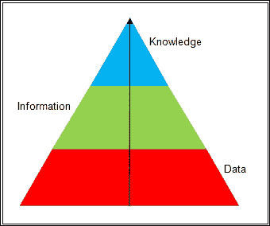
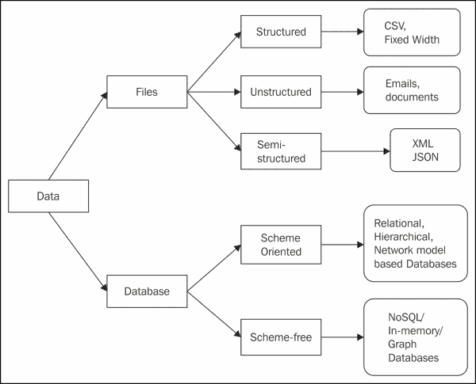

# 三、高效构建和管理科学数据

这一章是关于科学计算的数据。它介绍了这些数据的概念，然后介绍了用于管理这些数据的各种工具包以及要对其执行的操作。之后，讨论了各种数据格式和基于随机数的技术来生成合成数值数据。

在本章中，我们将涵盖以下主题:

*   数据、信息和知识的基础
*   各种数据存储软件和工具的概念
*   可以对数据执行的操作
*   科学数据标准格式的细节
*   关于现成数据集的讨论
*   使用随机数的合成数据生成
*   大规模数据集的概念

# 数据的基本概念

关于一个实体的事实和数字的原始的和无组织的形式被称为 **数据**。任何以无组织/原始形式(如一系列数字或字母)表示现实世界中的概念、现象、对象或实体的实际数量或价值都可以被视为数据。数据没有极限，到处都有。

数据可以转化为信息，并有助于实现组织的目标。当添加到数据中时，某些属性使其成为信息。准确及时的数据如果是为了特定的目的而组织的，并且是在特定的背景下准备和呈现的，则被称为信息。这给这些数据赋予了意义和相关性。

通过使用领域经验增加洞察力，数据和信息可以进一步转化为知识。这些知识需要大量的经验来处理与特定应用相关的数据，如商品价格或天气预报。

现在，让我们考虑一个数据、信息和知识的科学例子。显然，79°F 是温度读数，是数据。如果我们在阅读的同时添加一些细节——例如，这是 2015 年 3 月 3 日下午 5:30 印度孟买印度之门的温度——那么这就是信息。根据几年来这一周每小时的温度读数，预测下一周的温度就是知识。同样，根据印度北部最近两天强降雪的一些信息，得出印度中部气温也会有一定程度下降的结论也是知识。下图描述了数据、信息和知识之间的关系。这个过程从从实验中收集的数据开始，然后从这些数据中提取信息。最后，在详细分析这些信息后，我们从中解读知识。



数据、信息和知识的金字塔

# 数据存储软件和工具包

一般来说，涉及计算机科学的概念随着时间的推移变化非常快，存储数据的软件和工具也在快速演变。因此，目前市场上有许多软件和工具包可用于存储数据。数据有两大类存储软件和工具包。同样，在每个类别中，都有多个子类别。下图描述了用于管理和存储数据的各种数据存储软件/工具包的分类:



数据存储和管理软件/工具包分类

## 文件

第一类包括以不同格式的平面文件存储数据的软件或工具。平面文件的子类别是结构化和非结构化文件。“结构化文件”是指具有用于存储数据的预定义/固定结构的文件。而在非结构化文件中，没有预定义的结构来存储数据。通常，这两种类型的文件存储文本数据，而对于某些特定的科学应用，它们可能包括图像、音频、视频和其他非文本数据。

### 结构化文件

结构化文件的一个例子可以是带有 **逗号分隔值** ( **CSV** )的文本文件。在此类文件中，各种数据字段由逗号或分隔符分隔。该分隔符可以是任何字符或符号。优选地，该符号必须是不出现在要存储的数据中的符号。例如，如果我们在数据中存储货币值，那么逗号就不是合适的分隔符。

考虑 CSV 文件的以下记录:`H.K. Mehta, 08-Oct-1975, Higher Education department, 50,432`。

前面的记录有姓名、出生日期、部门名称和月薪。现在，对于 CSV 文件，不建议将空格、点(`.`)、逗号(`,`)和破折号(`-`)作为字段的分隔符。如果我们选择其中任何一个——空格点、逗号或破折号——作为分隔符，那么逗号会将金额视为两个值，同样，破折号(`-`)会将出生日期视为三个不同的值。点(`.`)将名称视为三个不同的值，如果空格是分隔符，部门名称将被分为三个值。对于这里提到的记录，分隔符可以是其他符号之一，如问号(`?`)或管道(`|`)。通常，在商业价值中，管道(`|`)是最常用的分隔符。

固定宽度文件是结构化文件的另一个示例。在这样的文件中，每个字段的总大小是预先定义的，并在整个文件中保持不变。如果特定记录中某个字段的大小小于或大于该字段的预定义固定大小，则对于该特定记录，要么用空格填充该字段(如果该字段较小)，要么对其进行修剪以减小其大小。

### 非结构化文件

非结构化文件的例子有网络服务器日志、书籍、日志和电子邮件。这包括文本和非文本数据。文本数据包括可由任何字符编码方案表示的数据，如**美国信息交换标准代码** ( **ASCII** ) 或 Unicode。还有另一类基于文件的数据存储，叫做半结构化。它不具有与关系数据库和其他数据库的结构一致的形式结构。半结构化方法使用标签或其他标记来分隔字段，为值添加适当的含义，并创建记录和字段的结构。这种数据的例子有 XML 和 JSON。这些数据类型的优势在于它们是独立于语言和平台的格式。因此，它们的操作不会随着语言或平台而改变。

## 数据库

第二类产品将数据存储在数据库中。除了文件，还有各种各样的数据库来存储计算数据。这些数据库可以分为两大类:基于模式的数据库和没有模式的数据库。基于模式的数据库是传统的数据库，它迫使用户在存储数据之前创建结构。另一方面，无模式数据库是大规模数据库领域的最新进展，旨在满足大规模应用的需求。基于模式的数据库的一些例子有 MySQL、Oracle、MS SQL Server、Postgres 等等。MongoDB、HBSE 和 Cassandra 就是无模式数据库的例子。

# 对数据的可能操作

除了存储数据，还需要执行许多操作来有效地管理和使用数据:

*   **数据农业**:使用高性能计算在巨大数据集上多次运行一组模拟的过程称为数据农业。数据农业的输出是来自数据的可见特征和特性的广阔视图；它支持决策过程。它是多个学科的集成，包括高性能计算、数据分析和可视化以及大规模数据库。
*   **数据管理**:数据管理是一个广义的术语由许多要对数据执行的操作组成，包括以下内容:
    *   **数据治理**:这是主控制。它确保输入的数据具有建模过程中定义的所需标准。该数据输入可以手动或通过自动过程来执行。
    *   **数据架构、分析和设计**:数据架构涉及应用各种模型、流程、算法、规则或标准，这些模型、流程、算法、规则或标准涉及必须收集什么数据、如何构建数据的存储以及如何集成数据。数据的分析和设计包括清理和转换数据的过程，以便对组织有益。
    *   **数据库管理**:数据的管理是一项复杂的任务，涉及多个相关活动，例如数据库的开发和设计、数据库监控、整体系统监控、提高数据库性能、数据库容量和扩展规划、安全规划和实施以及维护。
    *   **数据安全管理**:本次包括与数据安全相关的管理活动，包括访问权限管理、数据隐私管理以及其他与数据安全相关的方面(如数据清理/擦除、加密、屏蔽、备份)。
    *   **数据质量管理**:这是与提高数据质量相关的任务。它涉及许多操作，包括以下操作:
        *   通过检测和纠正数据集的损坏或不准确记录(称为脏数据)来清理数据。
        *   数据完整性是指在不同时期保证数据的准确性和一致性，并对数据进行处理的过程。
        *   数据丰富化是对数据进行提炼或增强的过程，重点是通过根据数据的领域搜索拼写错误或印刷错误来提高数据的质量。例如，在任何情况下，获得的分数都不能超过最大可能分数。在这种情况下，我们必须纠正那些分数大于最大分数的记录。
        *   数据集成是一个复杂的过程，需要丰富的经验，因为它通过将来自多个来源的数据转换成统一的结构来组合它们，而不影响其意义。
    *   **数据仓库管理**:数据仓库管理涉及到数据集市的准备、进行数据挖掘、进行与数据移动相关的各种操作的流程，如 **抽取、翻译、加载** ( **ETL** )。
    *   **元数据管理**:这是对数据库中存储的实际数据进行数据管理的过程。该管理数据称为 **元数据**。元数据包括存储数据的描述、数据创建和修改的日期和时间、数据的所有者、数据在物理设备上的位置以及其他相关细节。
*   **数据的导入导出**:这些对于任何一种应用都是非常重要的操作，无论是商业应用还是科学应用。一般来说，在执行导入和导出操作时必须小心。用户需要考虑为其导出或导入数据的应用的性质。因此，可以选择适当的格式。
*   **科学数据归档**:这个是基于科学家应该存储多少数据的应用和组织政策，以及这个数据的可访问性级别管理，长期存储科学数据的过程。

# 科学数据格式

有多种格式/形式可用于存储科学数据。一般来说，大多数科学计算 APIs 语言/工具包都支持这些格式的导入和导出操作。一些流行的格式如下:

*   **Network Common Data Form** (**NetCDF**): This is a self-describing and machine/device/platform-independent data format that supports manipulation (creation, access, and sharing) of large array-based scientific data. It is also bundled with a set of software libraries for creation and manipulation. Generally, this format is used in applications such as weather forecasting, climate change from climatology and meteorology, the oceanography domain, and GIS applications. Most GIS applications support NetCDF as an input/output format, and it is also used for general scientific data exchanges.

    这种格式的主要来源是 **大学大气研究公司** ( **UCAR** )的 Unidata 项目。项目的主页由他们托管。他们的网站上有一句很受欢迎的话，http://www . unidata . ucar . edu/software/netcdf/docs/FAQ . html # whatist:

    > *“NetCDF(网络通用数据表单)是一组面向数组的数据访问接口，是 C、Fortran、C++、Java 等语言的数据访问库的自由分布集合。NetCDF 库支持表示科学数据的独立于机器的格式。接口、库和格式共同支持科学数据的创建、访问和共享*

*   **分层数据格式** ( **HDF** ):这是一套在不同版本(HDF4 和 HDF5)中演变而来的文件格式。这种数据格式提供了存储和组织大量数值数据的设施。它是在国家超级计算应用中心开发的，现在得到了非营利组织 HDF 集团的支持，该组织确保了 HDF5 格式和相关工具/技术的进一步发展。这是一种非常流行的科学数据格式，HDF 得到了许多工具、语言、技术和平台的支持，包括 Java APIs、MATLAB、Octave、Scilab、Python APIs、R APIs 等等。
*   **灵活图像传输系统** ( **FITS** ):这是一个开放标准，定义了一种数字文件格式来管理用于科学和其他应用的图像文件。这种格式主要用于天文应用。它有几个选项用于描述光度和空间校准信息以及其他元数据。FITS 格式的第一次标准化是在 1981 年。其最新版本于 2008 年实现了标准化。FITS 还可以用于存储非图像数据，例如光谱、数据立方体，甚至数据库。FITS 支持一个重要特性；新版本的格式总是保持向后兼容。另一个重要的特性是文件的元数据存储在标题中人类可读的 ASCII 字符中。这将帮助用户分析文件并理解存储在其中的数据。
*   **带交错数据/带交错文件**:这些是二进制格式。这意味着数据存储在非文本文件中，一般这种格式用于遥感和高端 GIS。这些文件有两个子类型，即 **逐行交错带**(**【BIL】**)和 **逐像素交错带** ( **BIP** )。
*   **通用数据格式** ( **CDF** ):这是一种流行的存储标量和多维平台无关数据的格式。因此，它被用来存储科学数据，并作为一种数据交换格式在研究人员和组织中很受欢迎。 **空间物理数据设施** ( **SPDF** )提供了一个 CDF 软件工具包，作为 **戈达德太空飞行中心** ( **GSFC** )的一部分，用于数据操作。CDF 还支持许多编程语言、工具和 API 的非常好的接口，包括 C、C++、C#、FORTRAN、Python、Perl、Java、MATLAB 和 IDL。

各种科学数据格式有如下一些共同特征:

*   这些格式支持数据的顺序访问和随机访问读取。
*   它们被设计成高效地存储大量科学数据。
*   这些格式包含支持自我描述功能的元数据。
*   默认情况下，这些格式支持对象、网格、图像和数组的排序。
*   这些格式不可更新。用户可以在末尾追加数据。
*   它们支持机器便携性。
*   这些格式大多是标准化的。

这里讨论的各种数据格式可以用来存储任何主题及其子域的数据。然而，有些数据格式是专门为特定主题设计的。以下是特定主题数据格式的列表。我没有对这些特定主题的格式进行任何描述；有特殊兴趣的读者可以参考它们的来源:

*   天文数据的格式:
    *   **适合**:适合天文数据和图像格式(`.fit`或`.fits`)
    *   **SP3** : GPS 等卫星轨道(`.sp3`)
*   存储医学影像数据的格式:
    *   **DICOM** : DICOM 注释医学图像(`.dcm`、`.dic`)
*   医疗和生理数据的格式:
    *   **Affymetrix**:Affymetrix 数据格式(`.cdf`、`.cel`、`.chp`、`.gin`、`.psi`)
    *   **BDF** :生物电磁干扰数据格式(`.bdf`)
    *   **EDF** :欧洲数据格式(`.edf`)
*   化学和生物分子数据的格式:
    *   面向机器的语言(machine-oriented language)
    *   自卫队
    *   笑容
    *   物理数据库
    *   GenBank
    *   固定
*   地震学(地震相关科学和工程)数据格式:
    *   **NDK**:NDK 地震数据格式(`.ndk`)
*   天气数据格式:
    *   **GRIB**:GRIB 科学数据格式(`.grb`、`.grib`)

# 现成可用的标准数据集

多个政府、协作和研究工作正在持续进行，以开发和维护不同主题和主题内不同领域的标准数据集。这些数据集可供公众下载或离线工作，或者他们也可以对这些数据集进行在线计算。其中一个引人注目的努力被命名为 **开放科学数据云** ( **OSDC** )，它在每个主题上都有几个数据集。这个列表是从各种开放的数据源编译而来的，可供使用。他们也在他们的网络门户网站([https://www.opensciencedatacloud.org/publicdata/](https://www.opensciencedatacloud.org/publicdata/)上托管数据。OSDC 选定数据集的主题列表如下:

*   农业:
    *   美国农业部植物数据库
*   生物学:
    *   1000 个基因组
    *   基因表达综合系统
    *   麻省理工学院癌症基因组学数据
    *   蛋白质数据库
*   气候/天气:
    *   澳大利亚天气
    *   加拿大气象中心
    *   来自欧洲环境署的气候数据(每月更新)
    *   1929 年以来的全球气候数据
*   复杂网络:
    *   CrossRef 两个 URL
    *   DBLP 引文数据集
    *   NIST 复杂网络数据收集
    *   UFL 稀疏矩阵集合
    *   WSU 图形数据库
*   计算机网络:
    *   2012 年普通爬行 3.5 B 网页
    *   印第安纳大学 10 万用户的 53.5 B 网络点击量
    *   互联网数据集
    *   1B 网页
*   数据挑战:
    *   机器学习面临的挑战
    *   推动社会公益的大量竞争
    *   信息社会世界首脑会议数据挑战(自 2009 年起)
    *   卡格尔竞赛数据
*   经济学:
    *   美国经济协会
    *   来自 UMD 的第二个数据
    *   互联网产品代码数据库
*   能源:
    *   AMPds
    *   变蓝的
    *   数据端口
    *   英国-戴尔
*   财务:
    *   CBOE 期货交易所
    *   谷歌金融
    *   谷歌趋势
    *   全国证券交易商协会自动报价系统
*   “地球空间”/地理信息系统:
    *   BODC—大约 22，000 vars 的海洋数据
    *   美国马萨诸塞州剑桥，地理信息系统数据在 GitHub 上
    *   EOSDIS——美国宇航局的地球观测系统数据
    *   来自亚利桑那州立大学的地理空间数据
*   医疗保健:
    *   EHDP 大型健康数据集
    *   世界人口数据库
    *   美国医疗保险数据库
    *   医疗保险数据文件
*   图像处理:
    *   2 GB 猫的照片
    *   情感图像分类
    *   人脸识别基准
    *   大量视觉记忆刺激
    *   麻省理工学院太阳数据库
*   机器学习:
    *   发现月度数据
    *   易贝在线拍卖(2012 年)
    *   IMDb 数据库
    *   分类、回归和时间序列的龙骨存储库
    *   百万首歌曲数据集
*   博物馆:
    *   库珀·休伊特收藏数据库
    *   明尼阿波利斯艺术学院元数据
    *   泰特收藏元数据
    *   盖蒂词汇表
*   自然语言:
    *   博主语料库
    *   ClueWeb09 中非共和国武装部队
    *   谷歌图书(2.2 兆字节)
    *   谷歌网页 5 克(2006 年为 1 TB)
*   物理学:
    *   欧洲核子研究中心开放数据门户
    *   NSSDC(美国航天局)550 艘航天器的数据
*   公共域:
    *   CMU JASA 数据档案
    *   加州大学洛杉矶分校 SOCR 分校数据收集
    *   不明飞行物报告
    *   维基解密 911 呼机拦截
*   搜索引擎:
    *   来自 UMB 的数据共享学术洪流
    *   存档-从互联网存档
    *   DataMarket （Qlik）
    *   统计与研究
*   社会科学:
    *   由 150 名用户组成的 CMU 安然电子邮件数据集
    *   来自 LAW 的脸书社交网络(自 2007 年起)
    *   2010 年和 2011 年的四方社交网络
    *   来自 UMN/萨尔瓦特的四方(2013 年)
*   运动:
    *   Betfair 历史交换数据
    *   板球比赛(棒球)
    *   1950 年至今的一级方程式赛车
    *   足球/足球资源(数据和应用接口)
*   时间序列:
    *   MU 的时间序列数据库(TSDL)
    *   加州大学河滨分校时间序列数据集
    *   硬盘故障率
*   交通:
    *   航空公司 1987-2008 年的 OD 数据
    *   自行车共享系统(BSS)集合
    *   湾区自行车共享数据
    *   马萨诸塞州湖滨百万次骑行
    *   海上交通—船舶轨迹、港口呼叫等

# 数据生成

对于某些应用，如果用户没有可用于计算的数据，那么他们需要在执行计算之前生成该数据。它可以通过三种方式生成:个人收集、仪器收集或(针对某些特定应用)在计算机上合成生成。

有些应用的数据应该是个人收集的；例如，如果应用需要一个人的生物测定数据，可以通过建立数据收集并请求志愿者支持生物测定数据收集来亲自收集数据。这种收集必须亲自进行，因为这些数据不能在计算机上或使用仪器产生。对于这种特定的应用，用户有可能获得政府的支持，以便从政府数据库中获得这种数据，例如在签证处理过程中收集的生物特征细节的数据库，或者全国性的项目，例如美国政府的个人登记数据库，或者在印度的唯一识别项目(ADHAAR)期间收集的数据。

对于一些特定的实验，数据可以使用许多仪器生成，这些仪器提供感兴趣的用户的读数。例如，可以使用如下仪器生成与天气相关的数据:我们可以在不同的地方放置多个温度记录仪，并定期收集它们的读数。使用一些专门的传感器，我们还可以收集与天气或健康科学相关的数据。例如，可以使用专门设计的智能腰带或分发给不同人的手表来收集脉搏率和血液快感相关信息，并且可以从这些设备内的内置全球定位系统收集信息，该系统将定期使用推拉方法。

可以为许多需要数字或文本数据的实验生成合成数据，因为这些数据可以在没有任何特定仪器的计算机上使用根据预定义约束生成数据的程序生成。为了生成文本数据，可以使用现有的离线文本数据或具有文本信息的在线网页来生成用于处理的新样本。例如，文本挖掘和语言处理有时需要样本文本数据。

# 合成数据生成(制作)

在本节中，我们将讨论合成数值数据生成的各种方法。我们还将展示一个使用泊松分布的随机数生成算法及其 Python 实现。此外，我们将探索合成文本数据生成的不同方法。

## 使用 Python 的内置函数生成随机数

Python 有一个名为 random 的模块，它基于各种统计分布实现各种伪随机数生成器。该模块具有针对各种类型随机性的功能，例如整数、序列、列表的随机排列，以及从预定义群体生成随机样本。Python 随机模块支持使用各种统计分布生成随机数，包括均匀分布、正态分布(高斯分布)、对数正态分布、负指数分布、伽玛分布和贝塔分布。为了生成均匀的随机角度，Python 提供了冯米塞斯分布。Python 中随机数生成器的大部分模块都依赖于一个名为`random()`的基本函数。该函数生成半开范围内的随机浮点数(*【0.0，1.0】*)。

Mersenne Twister 是 Python 的主要随机数生成器。它能够产生 53 位精度的随机浮点数，周期为 2**19937-1。它是用 C 语言写在底层实现之上的，是线程安全和快速的。这是最广泛使用和测试的随机数发生器之一。然而，它并不适合所有应用，因为它是完全确定的。因此，它根本不适合与安全性相关的计算。随机模块还提供了一个`SystemRandom`类，该类使用操作系统提供的工具中的`os.urandom()`函数生成随机数。此类可用于生成用于加密目的的随机数。

随机模块的功能是`random.Random`类的隐藏实例的绑定方法。但是，用户可以拥有自己的`Random`类实例。优点是这个实例不共享状态。此外，如果用户需要设计一个新的随机数生成器，那么这个类也可以被扩展/继承来创建一个新的`Random`子类。在这种情况下，用户应该覆盖五种方法:`getstate()`、`jumpahead()`、`random()`、`seed()`和`setState()`。

让我们讨论 Python 随机模块的各种内置方法。如下节所述，这些功能分为几类。

### 记账功能

随机模块的各种记账功能如下:

*   `random.seed(a=None, version=2)`:该功能初始化随机数发生器。如果用户将整数值传递给`a`，则使用该值。如果没有值传递给`a`或者如果是`none`，则当前系统时间被用作`seed`值。如果正在使用的操作系统支持随机性来源，那么将使用它们而不是系统时间作为`seed`值。
*   `random.getstate()`:此函数返回一个代表随机数发生器当前内部状态的对象。该对象可用于使用`setstate()`功能恢复相同的状态。
*   `random.setstate(state)`:状态值必须是调用`getstate()`函数得到的对象。然后，`setstate`将发电机的内部状态恢复到调用`getstate()`时的状态。
*   `random.getrandbits(k)`:该函数返回一个带有`k`随机位的 Python 长整数。该方法由`MersenneTwister`发电机提供，也可以由其他几台发电机提供。

### 整数随机数生成功能

这里陈述了返回整数随机数的不同函数:

*   `random.randrange(stop)`或`random.randrange(start, stop[, step])`:此方法从给定的中返回随机选择的元素。其参数含义如下:`start`是区间的起点；它将包含在范围内。`stop`功能是范围的终点；它将被排除在范围之外。`step`代表要加到一个数上以决定一个随机数的值。
*   `random.randint(a,b)`:该函数返回从`a` 到`b`的包含范围内的整数值。

### 序列的功能

对序列进行运算以生成新的随机序列或子序列的各种功能如下:

*   `random.choice(seq)`:该函数返回非空`seq`序列的随机元素。`seq`字符必须是非空的。如果`seq`为空，则该函数会引发名为`IndexError`的错误/异常。
*   `random.shuffle(x)`:该功能将`x`顺序打乱。原地洗牌意味着值的位置将在列表变量中改变。
*   `random.sample(population, k)`:该函数从群体中返回唯一随机元素的`k`长度列表。群体必须是序列或集合。该功能一般用于随机采样，无需替换。此外，群体的成员可以是重复的，并且它们的每个出现都有相等的概率出现在所选列表中。如果样本量大于种群量 *k* ，将提出`ValueError`例外。

### 基于统计分布的函数

有很多统计分布适合各种情况。为了支持这些情况，随机数模块具有针对不同统计分布的一组函数。以下是基于统计分布的随机数生成器:

*   **随机数发生器函数(random.uniform(a，b))** :该函数返回一个介于`a`和`b`之间的随机浮点数 *N* 。在`a`和`b`之间选择任意数字的概率相等。
*   **随机三角(低、高、模式)发生器**:此函数根据三角分布返回一个随机浮点数 *N* ，使得*低< = N < =高*。低值和高值被视为界限，并且`mode`保持在这些界限之间。下限的默认值为 0。上限为 1，`mode`参数默认为下限和上限之间的中点。
*   **随机β变量(α，β)生成器**:该函数根据参数上的β分布条件返回一个介于 0 和 1 之间的随机数，为*α(α)>0*和*β(β)>0*。
*   **随机数发生器**:这个函数根据指数分布返回一个随机数。参数 lambd ( `λ`)的值应该是非零的。如果 lambd 为正，则返回 0 到正无穷大范围内的值，如果 lambd 为负，则返回负无穷大到 0 范围内的值。这个参数被有意地称为 lambda，因为 lambda 在 Python 中是一个保留字。
*   **随机γ变量(α，β)生成器**:该函数按照γ分布生成随机数，参数条件为*α(α)>0*和*β(β)>0*。
*   **随机正态变量(μ，σ)生成器**:正态分布是跟随生成随机数。这里，μ(`μ`)是平均值，σ(`σ`)是标准差。
*   **random . gauss(μ，σ)生成器**:顾名思义，这个函数使用高斯分布来生成随机数。同样，μ是平均值，σ是标准差。与正态分布相比，这个函数更快。
*   **随机数生成器**:对数正态分布用于随机数生成。由这个分布得到的值的自然对数给出了正态分布的值。同样，μ是平均值，σ是标准差。这里，mu 可以有任何值，但是 sigma 必须大于零。
*   **随机变量(μ，kappa)生成器**:该函数使用冯米塞斯分布返回随机角度，其中μ是以弧度为单位的平均角度，值介于 0 和 *2*pi* 之间，kappa ( *κ* )是浓度参数( *> =0* )。
*   **随机.帕累托变量(α)生成器**:该函数遵循帕累托分布返回一个随机变量。这里，α是形状参数。
*   **随机威布尔变量(α，β)生成器**:威布尔分布是本函数中用来生成随机数的。这里，α是比例参数，β是形状参数。

### 不确定随机数发生器

除了所讨论的随机数生成功能之外，还有一种可选的随机数生成器可以使用，特别是在随机数生成必须是不确定的情况下，例如加密和安全中需要的数字。该发电机为类`random.SystemRandom([seed])`。这个类使用操作系统提供的`os.urandom()`函数生成随机数。

下面的程序演示了所讨论的函数的用法。函数调用的输出也显示在其中。为了简单起见，我们只在其中使用了以下函数:

*   `random.random`
*   `random.uniform`
*   `random.randrange`
*   `random.choice`
*   `random.shuffle`
*   `print random.sample`
*   `random.choice`

程序如下:

```py
import random
print random.random()
print random.uniform(1,9)
print random.randrange(20)
print random.randrange(0, 99, 3) 
print random.choice('ABCDEFGHIJKLMNOPQRSTUVWXYZ') # Output 'P'
items = [1, 2, 3, 4, 5, 6, 7, 8, 9, 10]
random.shuffle(items)
print items
print random.sample([1, 2, 3, 4, 5, 6, 7, 8, 9, 10],  5)   
weighted_choices = [('Three', 3), ('Two', 2), ('One', 1), ('Four', 4)]
population = [val for val, cnt in weighted_choices for i in range(cnt)]
print random.choice(population) 
```

我们来讨论一下每个函数调用的输出。第一个函数`random`返回任何大于 0 小于 1 的浮点随机值。`uniform`函数返回给定范围内均匀分布的随机值。`randrange`函数返回给定范围内的随机整数值。如果忽略第一个参数，则取默认值`0`。所以`randrange(20)`的范围是 0 到 19。

现在，让我们讨论与序列相关的函数的输出。`choice`函数从提供的选项列表中返回一个随机选项。在本例中，有 26 个选项，返回一个值`P`。`shuffle`函数的输出是显而易见的，正如所料，一些值被打乱了。`sample`功能选择给定大小的随机样本。在本例中，`sample`尺寸选择为`5`。因此，随机样本有五个要素。最后三行执行一个重要的功能，以给定的概率选择一个随机选择。这就是为什么这个`choice`函数被称为加权选择——因为权重被分配给应用所需的每个选择。

## 设计并实现基于统计分布的随机数生成器

在本节中，我们将讨论泊松分布的算法设计及其 Python 实现。这在两个方面会有好处；一个是你将学习一个新的随机数生成统计分布的设计和实现。第二个方面是这个功能在随机模块中不可用，所以用户也可以使用这个新的发行版。对于一些特定的应用，一些变量假设泊松随机值。例如，考虑操作系统中进程调度中使用的调度算法。为了模拟流程调度，流程到达遵循泊松分布。

有许多应用泊松分布的情况。其中一些案例如下:

*   互联网上的流量模式遵循泊松分布
*   呼叫中心收到的呼叫数遵循泊松分布
*   曲棍球或足球(两队)等比赛中的进球数也遵循泊松分布
*   操作系统中的进程到达时间
*   给定一个年龄组，一年的死亡人数又是一个泊松模式
*   给定时间间隔内股票价格的跳跃次数
*   如果我们对一段给定的 DNA 施加辐射，突变的数量遵循泊松分布

泊松分布的算法是 Knuth 在他的畅销书*计算机编程的艺术，第二卷*中给出的，具体如下:

```py
algorithm poisson_random_number (Knuth):
    initializations:
         L = e−λ, 
count = 0 
product = 1
    do:
           k = k + 1
           u = uniform_random_number (0,1) 
p = p × u
    while p > L
    return k − 1
```

下面的代码是泊松分布的 Python 实现:

```py
import math
import random
def nextPoisson(lambdaValue):
  elambda = math.exp(-1*lambdaValue)
  product = 1
  count = 0

  while (product >= elambda):
    product *= random.random()
    result = count
    count+=1
  return result
for x in range(1, 9):
  print nextPoisson(8)
```

前一程序的输出如下:

```py
5
7
11
8
9
8
7
6
```

### 注

**重现生成的随机数的特别说明**

如果应用要求再现使用任何方法生成的随机数，那么在这种情况下，可以选择再现使用这些函数生成的数字。为了重现这个序列，我们只需要使用具有相同种子值的相同函数。通过这种方式，我们可以重现列表，这就是为什么我们称大多数随机数生成函数为确定性的。

## 用简单的逻辑生成五位随机数的程序

下一个程序演示了使用时间和日期对象产生随机数的思想。它有非常简单的逻辑来生成五位数的随机数。在这个程序中，当前系统时间用于生成随机数。系统时间的四个组成部分——小时、分钟、秒和微秒——通常是一个独特的组合。该值被转换为字符串，然后转换为五位数的值。用户定义函数中的第一行用于引入微秒级的延迟，以便在很短的时间内不同调用之间的时间值会有所不同。如果没有这一行，用户可能会得到一些重复的值:

```py
import datetime 
import time

# the user defined function that returns 5 digit random number
def  next_5digit_int():
  # this will introduce randomness at the microsecond level
  time.sleep(0.123)            
current_time = datetime.datetime.now().time() 
  random_no = int(current_time.strftime('%S%f'))
  # this will trim last three zeros
  return random_no/1000          

# to demonstrate generation of ten random numbers
for x in range(0, 10):
  i = next_5digit_int()
  print i
```

# 关于大规模数据集的简要说明

各种科学应用的数据集从几 MB 到几 GB 不等。对于某些特定的应用，数据集可能很大。这些巨大的数据集可能跨越几千兆字节。我们通常理解 MB 和 GB；让我们了解一下千兆字节的规模。假设我们在**光盘** ( **光盘** ) 中存储 1pb 的数据，并将这些光盘以堆栈的形式排列。这个堆栈的大小大约为 1.75 公里。由于网络和分布式计算技术的最新进展，如今有许多应用可以处理几千兆字节的数据集。为了高效地处理大规模数据集，在软件或硬件的所有级别都有许多可用的选项。

有几种有效的框架可以处理各种规模的数据集。这些框架可以同等效率地处理小型、中型或大型数据，具体取决于所提供的基础设施。Map reduce 就是这样一个框架的例子，Hadoop 是 MapReduce 框架的开源实现。

在数据库级别，用户有许多选择，能够存储和管理任何规模的数据。这些数据库可能是最简单的，比如平面文件——文本或二进制文件。然后，有许多基于模式的数据库，如关系数据库，可以有效地管理几千兆字节的数据库。文件和基于模式的数据库都可以管理从几兆字节到几千兆字节的数据。为了处理超出这些限制的数据，目前的趋势是使用非基于模式的数据库和高级分布式文件系统，例如谷歌的 BigTable、Apache HBase 和 HDFS。HBase 是一个面向列的数据库，旨在支持非常大规模的数据库。HDFS 是一个分布式文件系统，能够存储几千兆字节大小的文件，不像普通文件系统(如 WINDOWS NT)中的最大文件大小约为 16 GB。

大多数编程语言都支持这些框架和数据库，包括 Python、Scala、Java、Ruby 等等。除了软件层面，硬件层面也有进步，例如不同硬件(例如处理器、输入/输出设备和网络设备)中的虚拟化概念。还增强了对所讨论的软件的硬件级支持。

分布式计算的最新进展，称为云计算，已经实现了许多新的科学计算和商业应用。这是可能的，因为云计算与本节中讨论的概念一起，提供了有史以来最高的处理和存储能力。这使得许多新的应用得以实现，并且这类应用的列表日益增长。

所讨论的技术广泛应用于需要文本搜索、模式发现和匹配、图像处理、数据挖掘和处理大型数据集的应用中。这种要求在各种商业和科学应用中非常常见。

在[第 8 章](08.html "Chapter 8. Parallel and Large-scale Scientific Computing")、*并行和大规模科学计算*中，我们将对这些技术进行详细的讨论，重点是将其用于大规模科学应用。

# 总结

本章首先讨论了数据、信息和知识的基本概念。然后介绍了用于存储数据的各种软件。之后，我们讨论了应该在数据集上执行的各种操作。然后我们看到了存储科学数据的标准格式。我们还讨论了各种预定义的、已经使用的和标准的数据集，用于各种学科领域的许多科学应用。然而，在特定主题中，有些领域的数据集不可用。

在介绍了基本概念之后，介绍了为某些特定实验准备合成数据的各种技术。还介绍了用于合成数据生成的随机数生成的各种标准函数。对于合成数据生成，介绍了一种使用泊松分布生成随机数的算法和程序。

下一章将详细讨论并展示用于科学计算的各种 Python APIs 和工具包的功能。这些 API 提供数值计算(NumPy 和 SciPy)、符号计算(SymPy)、数据可视化和绘图(matplotlib 和 pandas)以及交互式编程(IPython)。本章还将简要讨论这些 API 的特性和功能。