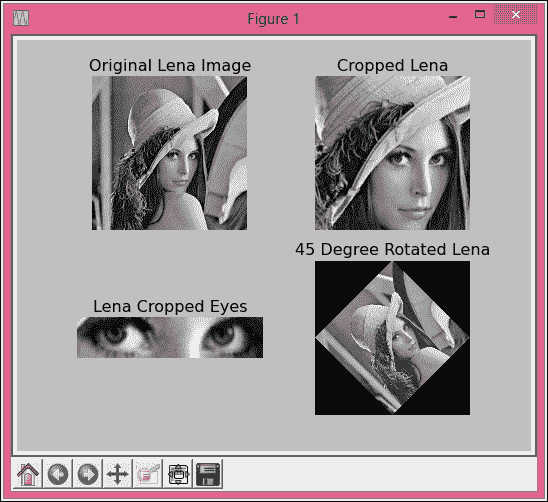

# 四、面向 Python 的科学计算 API

在本章中，我们将全面讨论 Python 中各种科学计算 API 和工具包的特性和功能。除了基础知识，我们还将讨论每个 API 的一些示例程序。由于符号计算是计算机化数学的一个相对不同的领域，我们在 SymPy 部分分配了一个特殊的小节来讨论计算机化代数系统的基础。

在本章中，我们将涵盖以下主题:

*   利用 NumPy 和 SciPy 进行科学数值计算
*   使用 SymPy 的符号计算
*   计算机化的代数系统
*   SymPy 及其模块简介
*   SymPy 中的几个简单的示例程序
*   数据分析、可视化和交互式计算

# Python 中的数值科学计算

科学计算主要要求对代数方程、矩阵、微分、积分、微分方程、统计、方程求解器等进行计算。默认情况下，Python 没有这些功能。然而，NumPy 和 SciPy 的发展已经使我们能够执行这些操作，以及比它们更高级的功能。NumPy 和 SciPy 是非常强大的 Python 包，使用户能够高效地为所有类型的科学应用执行所需的操作。

## NumPy 包

NumPy 是科学计算的基础 Python 包。它提供多维数组和基本数学运算的工具，如线性代数。Python 提供了几种数据结构来存储用户数据；最流行的数据结构是列表和字典。列表对象可以将任何类型的 Python 对象存储为一个元素。这些元素可以使用循环或迭代器来处理。字典对象以键值格式存储数据。

### 标准的数据结构

ndarrays 类似于 list，但是非常灵活和高效。n array 是一个数组对象，用于表示固定大小项目的多维数组。这个数组应该是同构的。它有一个类型为`dtype`的关联对象，用于定义数组中元素的数据类型。该对象定义数据类型(整数、浮点或 Python 对象)、数据大小(字节)和字节顺序(大端或小端)。此外，如果数据的类型是`record`或`sub-array`，那么它也包含关于它们的细节。实际数组可以使用数组、零或空方法中的任何一种来构造。

ndarrays 的另一个重要方面是数组的大小可以动态修改。此外，如果用户需要从数组中移除一些元素，那么这可以使用屏蔽数组的模块来完成。在许多情况下，科学计算要求删除/移除不正确或错误的数据。`numpy.ma`模块提供了屏蔽数组的功能，可以轻松地从数组中移除选定的元素。屏蔽数组只不过是普通的带屏蔽的数组。Mask 是另一个具有真值或假值的关联数组。如果对于特定位置，掩码具有真值，则主数组中的对应元素有效，如果掩码为假，则主数组中的对应元素无效或被掩码。在值为`false`的这种情况下，当对这种数组执行任何计算时，将不会考虑被屏蔽的元素。

### 文件处理

科学计算的另一个重要方面是将数据存储在文件中，NumPy 支持文本和二进制文件的读写。大多数情况下，文本文件是一种很好的读取、写入和数据交换方式，因为它们本身是可移植的，并且默认情况下，大多数平台都有能力操作它们。但是，对于某些应用，有时最好使用二进制文件，或者在某些情况下，此类应用所需的数据只能存储在二进制文件中。有时，图像或声音等数据的大小和性质要求将其存储在二进制文件中。

与文本文件相比，二进制文件更难管理，因为它们有特定的格式。此外，二进制文件的大小相对非常小，对它们的读/写操作比读/写文本文件要快得多。这种快速读/写最适合处理大型数据集的应用。用 NumPy 操作的二进制文件的唯一缺点是它们只能通过 NumPy 访问。

Python 有文本文件操作功能，如`open`、`readlines`、`writelines`。然而，将这些功能用于科学数据操作并不具有性能效率。这些默认的 Python 函数在文件中读写数据非常慢。NumPy 有一个高性能的替代方案，可以在实际计算之前将数据加载到数组中。在 NumPy 中，可以使用`numpy.loadtxt`和`numpy.savetxt`功能访问文本文件。`loadtxt`功能可用于将数据从文本文件加载到数据库。NumPy 还有一个单独的函数，用于操作二进制文件中的数据。读写功能分别为`numpy.load`和`numpy.save`。

### 一些 NumPy 示例程序

NumPy 数组可以从使用该数组的列表或元组中创建。这种方法可以将序列序列转换成二维数组:

```py
import numpy as np
x = np.array([4,432,21], int)
print x   #Output [  4 432  21]
x2d = np.array( ((100,200,300), (111,222,333), (123,456,789)) )
print x2d
```

以下是输出:

```py
[  4 432  21]
[[100 200 300]
[111 222 333]
[123 456 789]]
```

基本的矩阵算术运算可以很容易地在二维数组上执行，如下面的程序中所使用的。基本上，这些操作应用于元素。因此，操作数数组的大小必须相等。如果大小不匹配，则执行这些操作将导致运行时错误。考虑以下一维数组的算术运算示例:

```py
import numpy as np
x = np.array([4,5,6])
y = np.array([1,2,3])
print x + y    # output [5 7 9]
print x * y    # output [ 4 10 18]
print x - y    # output [3 3 3]  
print x / y    # output [4 2 2]
print x % y    # output [0 1 0]
```

有一个单独的子类叫做 matrix，用于执行矩阵运算。让我们通过下面的例子来理解矩阵运算，它演示了基于数组的乘法和矩阵乘法之间的区别。NumPy 矩阵是二维的，数组可以是任意维的:

```py
import numpy as np
x1 = np.array( ((1,2,3), (1,2,3), (1,2,3)) )
x2 = np.array( ((1,2,3), (1,2,3), (1,2,3)) )
print "First 2-D Array: x1"
print x1
print "Second 2-D Array: x2"
print x2
print "Array Multiplication"
print x1*x2

mx1 = np.matrix( ((1,2,3), (1,2,3), (1,2,3)) )
mx2 = np.matrix( ((1,2,3), (1,2,3), (1,2,3)) )
print "Matrix Multiplication"
print mx1*mx2
```

输出如下:

```py
First 2-D Array: x1
[[1 2 3]
  [1 2 3]
  [1 2 3]]
Second 2-D Array: x2
[[1 2 3]
  [1 2 3]
  [1 2 3]]
Array Multiplication
[[1 4 9]
  [1 4 9]
  [1 4 9]]
Matrix Multiplication
[[ 6 12 18]
  [ 6 12 18]
  [ 6 12 18]]
```

下面是一个简单的程序，演示了 NumPy 中给出的简单统计函数:

```py
import numpy as np
x = np.random.randn(10)    # Creates an array of 10 random elements
print x
mean = x.mean()
print mean
std = x.std()
print std
var = x.var()
print var
```

这是的第一个样本输出:

```py
[0.08291261  0.89369115  0.641396   -0.97868652  0.46692439 -0.13954144
  -0.29892453  0.96177167  0.09975071  0.35832954]
0.208762357623
0.559388806817
0.312915837192
```

以下是第二个示例输出:

```py
[ 1.28239629  0.07953693 -0.88112438 -2.37757502  1.31752476  1.50047537
  0.19905071 -0.48867481  0.26767073  2.660184  ]
0.355946458357
1.35007701045
1.82270793415
```

前面的程序是 NumPy 的一些简单例子。在[第 5 章](05.html "Chapter 5. Performing Numerical Computing")、*执行数值计算*中，我们将详细讨论 NumPy 功能。下一小节讨论 SciPy Python 包。

## 科学包

SciPy 通过提供高级数学函数，如微分、积分、微分方程、优化、插值、高级统计函数、方程求解器等，扩展了 Python 和 NumPy 对的支持。SciPy 是写在 NumPy 数组框架之上的。它利用了 NumPy 中提供的数组及其基本操作，并将其扩展到科学家和工程师应用经常需要的大多数数学方面。

在本章中，我们将介绍一些基本功能的示例，在[第 5 章](05.html "Chapter 5. Performing Numerical Computing")、*执行数值计算*中，我们将全面介绍 NumPy 和 SciPy 功能。在随后的小节中，我们将介绍 SciPy 的各种重要包/模块的基础知识，包括聚类分析、文件处理、集成、插值、优化、信号和图像处理、特殊分析和统计。

### 优化包

SciPy 中的优化包提供了解决单变量和多变量最小化问题的功能。它使用许多算法和方法为最小化问题提供解决方案。最小化问题在科学和商业领域有着广泛的应用。通常，我们执行线性回归，搜索函数的最小值和最大值，找到函数的根，并对这种情况进行线性规划。优化包支持所有这些功能。

### 插值包

插值包中提供了许多插值方法和算法作为内置函数。它提供了执行单变量和多变量插值以及一维和二维样条的工具。当数据依赖于一个变量时，我们使用单变量插值；如果它依赖于一个以上的变量，那么我们使用多元插值。除了这些功能，插值包还为拉格朗日和泰勒多项式插值器提供了额外的功能。

### SciPy 中的积分和微分方程

积分是科学计算的重要数学工具。SciPy 集成子包提供了执行数值集成的功能。SciPy 提供了一系列函数来对方程和数据进行积分。它还有一个常微分方程积分器。它提供了各种功能，以执行数值积分的帮助下，许多方法从数学使用数值分析。

### 统计模块

SciPy 统计模块包含一个用于大多数概率分布和大范围或统计函数的函数。支持的概率分布包括各种连续分布、多元分布和离散分布。统计函数的范围从简单的平均值到最复杂的统计概念，包括偏斜度、峰度和卡方检验，仅举几例。

### SciPy 中的聚类包和空间算法

聚类分析是一种流行的数据挖掘技术，在科学和商业领域有着广泛的应用。在科学领域，生物学、粒子物理学、天文学、生命科学和生物信息学是广泛使用聚类分析解决问题的几个学科。聚类分析在计算机科学中被广泛用于计算机化的欺诈检测、安全分析、图像处理以及许多其他领域。聚类软件包提供了 K-means 聚类、矢量量化以及分层和聚集聚类功能。

`spatial`类具有使用三角剖分、Voronoi 图和一组点的凸包来分析数据点之间距离的功能。它还具有用于执行最近邻查找功能的 KDTree 实现。

### SciPy 中的图像处理

SciPy 提供对执行各种图像处理操作的支持，包括图像文件的基本读写、显示图像以及简单的图像操作，如裁剪、翻转和旋转。它还支持图像滤波功能，如数学变形、平滑、去噪和图像锐化。此外，它支持各种其他操作，例如通过标记对应于不同对象的像素进行图像分割、分类以及例如边缘检测的特征提取。

## 【SciPy 程序示例

在接下来的小节中，我们将讨论一些使用 SciPy 模块和包的示例程序。我们将从一个执行标准统计计算的简单程序开始。之后，我们将讨论一个使用优化找到最小解的程序。最后，我们将讨论图像处理程序。

### 使用 SciPy 进行统计

SciPy 的 stats 模块具有执行简单统计运算和各种概率分布的功能。以下程序演示了使用`stats.describe` SciPy 函数的简单统计计算。这个函数对一个数组进行运算，并返回元素数量、最小值、最大值、平均值、方差、偏斜度和峰度:

```py
import scipy as sp
import scipy.stats as st
s = sp.randn(10)
n, min_max, mean, var, skew, kurt = st.describe(s)
print("Number of elements: {0:d}".format(n))
print("Minimum: {0:3.5f} Maximum: {1:2.5f}".format(min_max[0], min_max[1]))
print("Mean: {0:3.5f}".format(mean))
print("Variance: {0:3.5f}".format(var))
print("Skewness : {0:3.5f}".format(skew))
print("Kurtosis: {0:3.5f}".format(kurt))
```

这里是输出:

```py
Number of elements: 10
Minimum: -2.00080 Maximum: 0.91390
Mean: -0.55638
Variance: 0.93120
Skewness : 0.16958
Kurtosis: -1.15542
```

### SciPy 中的优化

一般在数学优化中，使用一个称为 Rosenbrock 函数的非凸函数来测试优化算法的性能。下面的程序演示了这个函数的最小化问题。 *N* 变量的罗森布罗克函数由下式给出，在 *xi =1* 处最小值为 0:


上述功能的程序如下:

```py
import numpy as np
from scipy.optimize import minimize

# Definition of Rosenbrock function
def rosenbrock(x):
     return sum(100.0*(x[1:]-x[:-1]**2.0)**2.0 + (1-x[:-1])**2.0)

x0 = np.array([1, 0.7, 0.8, 2.9, 1.1])
res = minimize(rosenbrock, x0, method = 'nelder-mead', options = {'xtol': 1e-8, 'disp': True})

print(res.x)
```

这是输出:

```py
Optimization terminated successfully.
         Current function value: 0.000000
         Iterations: 516
         Function evaluations: 827
[ 1\.  1\.  1\.  1\.  1.]
```

最后一条线是`print(res.x)`的输出，其中数组的所有元素都是`1`。

### 使用 SciPy 进行图像处理

下面开发了两个程序来演示 SciPy 的图像处理功能。第一个程序只是显示一个标准的测试图像。该图像广泛应用于图像处理领域，被称为 Lena。第二个程序对这个图像应用几何变换。它执行图像裁剪和旋转 45%。

下面的程序使用 matplotlib API 显示 Lena 图像。`imshow`方法将数组渲染成图像，`show`方法显示图像:

```py
from scipy import misc
l = misc.lena()
misc.imsave('lena.png', l) 
import matplotlib.pyplot as plt
plt.gray()
plt.imshow(l)
plt.show()
```

上一个程序的输出如下图所示:


以下程序执行几何变换。该程序将变换后的图像与原始图像一起显示为四轴数组:

```py
import scipy
from scipy import ndimage
import matplotlib.pyplot as plt
import numpy as np

lena = scipy.misc.lena()
lx, ly = lena.shape
crop_lena = lena[lx/4:-lx/4, ly/4:-ly/4]
crop_eyes_lena = lena[lx/2:-lx/2.2, ly/2.1:-ly/3.2]
rotate_lena = ndimage.rotate(lena, 45)

# Four axes, returned as a 2-d array
f, axarr = plt.subplots(2, 2)
axarr[0, 0].imshow(lena, cmap=plt.cm.gray)
axarr[0, 0].axis('off')
axarr[0, 0].set_title('Original Lena Image')
axarr[0, 1].imshow(crop_lena, cmap=plt.cm.gray)
axarr[0, 1].axis('off')
axarr[0, 1].set_title('Cropped Lena')
axarr[1, 0].imshow(crop_eyes_lena, cmap=plt.cm.gray)
axarr[1, 0].axis('off')
axarr[1, 0].set_title('Lena Cropped Eyes')
axarr[1, 1].imshow(rotate_lena, cmap=plt.cm.gray)
axarr[1, 1].axis('off')
axarr[1, 1].set_title('45 Degree Rotated Lena')

plt.show()
```

这是输出:



SciPy 和 NumPy 是 Python 支持科学计算的核心，因为它们在数值计算方面提供了坚实的功能。在[第 5 章](05.html "Chapter 5. Performing Numerical Computing")、*执行数值计算*中，我们将详细讨论这两个包。下一小节介绍使用 SymPy 的符号计算。

# 使用 SymPy 的符号计算

对数学符号进行的计算机化计算，而不评估或改变其含义，称为符号计算。一般来说，符号计算也被称为计算机化代数，这样的计算机化系统被称为计算机代数系统。下一小节对 SymPy 做了一个简单而好的介绍。在[第 6 章](06.html "Chapter 6. Applying Python for Symbolic Computing")*将 Python 应用于符号计算*中，我们将深入报道 Python 中的符号计算。

## 计算机代数系统

让我们来讨论一下**计算机代数系统** ( **CAS** )的概念。CAS 是一种软件或工具包，用于使用计算机而不是手动计算对数学表达式进行计算。起初，使用计算机进行这些应用被称为计算机代数；现在这个概念被称为符号计算。CAS 系统可分为两种类型。第一类是通用 CAS，第二类是针对特定问题的 CAS。通用系统适用于代数数学的大多数领域，而专用 CAS 是为特定领域设计的系统，如群论或数论。大多数时候，我们更喜欢通用 CAS 来处理科学应用中的数学表达式。

## 通用 CAS 的特性

用于科学应用的通用化学文摘社的各种期望特征如下:

*   操作数学表达式的用户界面。
*   用于编程和调试的接口。
*   这种系统需要简化各种数学表达式。因此，简化程序是这种计算机代数系统最基本的组成部分。
*   通用 CAS 系统必须支持一组详尽的函数来执行任何代数计算所需的各种数学运算。
*   大多数应用执行大量计算，因此高效的内存管理非常重要。
*   该系统必须支持对高精度数字和大数量进行数学计算。

## 症状的简要概念

SymPy 是 CAS 的开源和基于 Python 的实现。开发 SymPy 背后的理念是设计和开发一个 CAS，该 CAS 具有所有期望的特性，但其代码尽可能简单，以便它能够高度且容易地扩展。它完全用 Python 编写，不需要任何外部库。

SymPy 背后的基本思想是表达式的创建和操作。使用 SymPy，用户用 Python 语言表示数学表达式——通过使用 SymPy 类和对象。这些表达式由数字、符号、运算符、函数等组成。函数是执行数学功能的模块，如对数和三角函数。

ondřej·切尔蒂克于 2006 年 8 月开始开发 SymPy。从那以后，在数百人的贡献下，它有了很大的发展。这个库现在由 26 个不同的集成模块组成。这些模块能够执行基本符号算术、微积分、代数、离散数学、量子物理、绘图和打印所需的计算，以及以 LaTeX 和其他格式导出计算输出的选项。

SymPy 的能力可以分为两类——*核心能力*和*高级能力*——因为 SymPy 库分为一个核心模块和几个高级可选模块。各种模块支持的功能将在以下章节中讨论。

### 核心能力

核心能力模块支持要执行的任何数学代数运算所需的基本功能。这些运算包括基本算术，如乘法、加法、减法和除法，还有指数运算。该模块还支持简化表达式，以便简化复杂的表达式。它提供了扩展系列和符号的功能。

核心模块还支持用于执行与三角学、双曲线、指数、方程根、多项式、阶乘、伽马函数、对数以及 B 样条、球谐函数、张量函数和正交多项式的许多特殊函数相关的操作的函数。

核心模块中也有对模式匹配操作的强大支持。此外，SymPy 的核心功能包括支持代数运算所需替换的功能。它不仅支持整数、有理数和浮点数的高精度算术运算，还支持多项式运算所需的非交换变量和符号。

### 多项式

用于执行多项式运算的各种函数属于多项式模块。这些函数包括除法、**最大公约数** ( **GCD** )、**最小公倍数** ( **LCM** )、无平方因式分解、具有符号系数的多项式表示、一些特殊操作，例如结果的计算、三角恒等式的导出、部分分数分解以及多项式环和域上的 Grbner 基的工具。

### 微积分

演算模块中提供了支持基础演算和高级演算所需的不同操作的各种功能。它支持限额要求的功能；对此有一个`limit`功能。它还支持微分、积分、级数展开、微分方程和有限差分演算。SymPy 还特别支持定积分和积分变换。在微分中，它支持数值微分、导数的合成和分数导数。

### 解方程

求解器是提供方程求解功能的 SymPy 模块的名称。该模块支持复杂多项式、多项式根和多项式方程组的求解能力。有一个解代数方程的函数。它不仅支持微分方程(包括常微分方程、某些形式的偏微分方程、初值和边值问题等)的求解，还支持差分方程的求解。在数学中，差分方程也称为递归关系，即递归定义值的序列或多维数组的方程。

### 离散数学

离散数学包括本质上是离散的数学结构，而不是连续的数学(如微积分)。它从逻辑理论的角度处理整数、图形和语句。该模块完全支持二项式系数、乘积和求和。

该模块还支持数论中的各种函数，包括剩余理论、欧拉全能性、划分以及一些处理素数及其因式分解的函数。Plus SymPy 支持使用符号和布尔值创建和操作逻辑表达式。

### 矩阵

SymPy 对与矩阵和行列式相关的各种运算有强有力的支持。矩阵属于数学的线性代数范畴。它支持创建矩阵、基本矩阵运算(如乘法和加法)、0 和 1 的矩阵、创建随机矩阵以及对矩阵元素执行运算。它还支持特殊函数，例如计算一个函数的黑森矩阵、一组向量上的格拉姆-施密特过程、计算一个函数矩阵的渥伦斯肯等等。

此外，它完全支持特征值和特征向量、矩阵求逆以及矩阵和行列式的求解。计算矩阵的行列式，除了其他方法外，它还支持巴雷斯的无分数算法和伯克维茨算法。对于矩阵，它支持零空间计算、余因子展开工具、矩阵元素的导数计算以及计算矩阵的对偶。

### 几何图形

SymPy 有一个支持与 2D 几何相关的各种操作的模块。它支持创建 2D 实体或对象，如点、线、圆、椭圆、多边形、三角形、射线和线段。它还允许我们对这些实体进行查询，例如合适对象(椭圆、圆或三角形)的面积和直线的交点。然后，它支持诸如确定直线相切和查找实体的相似性和交集等查询。

### 标绘

有一个非常好的模块，可以让我们画出二维和三维的图。目前，使用`matplotlib`包渲染地块。它还支持其他软件包，如`TextBackend`、`Pyglet`、`textplot`等。它有一个非常好的交互界面工具，可以定制和绘制各种几何实体。

绘图模块具有以下绘图功能:

*   2D 线图
*   2D 参数图
*   2D 隐式和区域图
*   包含两个变量的函数的三维图
*   三维线和曲面图

### 物理学

还有也是一个解决物理领域问题的模块。它支持力学功能，包括经典力学和量子力学，以及高能物理。它具有支持一维和三维泡利代数和量子谐振子的功能。它还具有光学功能。有一个单独的模块将单元系统集成到 SymPy 中。这允许用户选择特定的单位系统来执行他们的计算和单位之间的转换。单位制由计算用的单位和常数组成。

### 统计

在 SymPy 中引入了统计模块，以支持数学计算中所需的各种统计概念。除了支持各种连续和离散的统计分布，它还支持与符号概率相关的功能。一般来说，这些分布支持 SymPy 中随机数生成的函数。

### 印刷

SymPy 有一个为*美版*提供全面支持的模块。漂亮的打印将各种风格的格式转换成文本文件，如源代码、文本文件、标记文件或类似的内容。该模块通过使用 ASCII 和/或 Unicode 字符进行打印来产生所需的输出。

它支持各种打印机，如 LaTeX 和 MathML 打印机。它能够产生各种编程语言的源代码，如 C、Python 和 Fortran。它也是能够使用标记语言如 HTML 和 XML 产生内容。

## 症状模块

以下列表显示了前面段落中讨论的模块的正式名称:

*   **假设**:假设引擎
*   **具体**:符号积和求和
*   **核心基础类结构**:基础、添加、Mul、Pow 等等
*   **功能**:初等和特殊功能
*   **Galgebra** :几何代数
*   **几何图形**:几何实体
*   **积分**:符号积分器
*   **交互**:交互会话(例如 IPython)
*   **逻辑**:布尔代数与定理证明
*   **矩阵**:线性代数和矩阵
*   **mpmath** :快速任意精度数值数学
*   **合成**:数论函数
*   **解析** : Mathematica 和 maxima 解析器
*   **物理学**:物理单位和量子材料
*   **绘制**:使用`Pyglet`绘制 2D 和 3D
*   **Polys** :多项式代数和因式分解
*   **打印**:漂亮-打印和代码生成
*   **系列**:符号极限和截断系列
*   **简化**:改写其他形式的表达式
*   **求解器**:代数、递归和微分
*   **统计**:标准概率分布
*   **实用工具**:测试框架和兼容性相关内容

各种数学工具包中有许多符号计算系统。有一些专有软件，如 Maple 和 Mathematica，也有一些开源替代软件，如奇异和 AXIOM。但是，这些产品有自己的脚本语言。很难扩展它们的功能，并且它们的开发周期很慢。另一方面，SymPy 是高度可扩展的，是用 Python 语言设计和开发的，是一个支持快速开发生命周期的开源 API。

## 简单的示范程序

这里有一些非常简单的例子来帮助你了解 SymPy 的能力。这些都是少于 10 行的 SymPy 源代码，它们涵盖了从基本符号操作到限制、区分和集成的主题。我们可以通过在谷歌应用引擎上实时运行 SymPy 在线测试这些程序在 SymPy 上的执行情况，该引擎可在[http://live.sympy.org/](http://live.sympy.org/)获得。

### 基本符号操作

下面的代码定义了三个符号和一个带有这些符号的表达式。然后它打印出表达式:

```py
import sympy
a = sympy.Symbol('a')
b = sympy.Symbol('b')
c = sympy.Symbol('c')
e = ( a * b * b + 2 * b * a * b) + (a * a + c * c)
print e
```

输出如下:

```py
a**2 + 3*a*b**2 + c**2
```

这里，`**`代表一个电源操作。

### 症状中的表达扩展

这里显示的程序演示了表达式扩展的概念。它在这些符号上定义了两个符号和一个简单的表达式，然后打印该表达式及其扩展形式:

```py
import sympy
a = sympy.Symbol('a')
b = sympy.Symbol('b')
e = (a + b) ** 4
print e
print e.expand()
```

这是输出:

```py
(a + b)**4
a**4 + 4*a**3*b + 6*a**2*b**2 + 4*a*b**3 + b**4
```

### 表达式或公式的简化

SymPy 具有简化数学表达式的功能。下面的程序有两个用于简化的表达式，它显示表达式简化后的输出:

```py
import sympy
x = sympy.Symbol('x')
a = 1/x + (x*exp(x) - 1)/x
simplify(a)
simplify((x ** 3 +  x ** 2 - x - 1)/(x ** 2 + 2 * x + 1))
```

以下是输出:

```py
ex
x – 1
```

### 简单积分

这个程序计算两个简单函数的积分:

```py
import sympy 
from sympy import integrate
x = sympy.Symbol('x')
integrate(x ** 3 + 2 * x ** 2 + x, x)
integrate(x / (x ** 2 + 2 * x), x)
```

输出如下:

```py
x**4/4+2*x**3/3+x**2/2
log(x + 2)
```

# 用于数据分析和可视化的 API 和工具包

Python 拥有优秀的工具包和 API，用于分析、可视化和呈现数据和计算结果。在接下来的讨论中，我们将涉及熊猫的概念和想法。我们将简要讨论 matplotlib 和一些图表绘制和以不同格式导出的示例程序。我们可以导出图像文件和其他文件中的图表，如 PDF。在[第 7 章](07.html "Chapter 7. Data Analysis and Visualization")、*数据分析和可视化*中，我们将详细讨论 matplotlib 和 pandas 的大部分概念，以及 IPython 工具包。

## 利用大熊猫进行数据分析和处理

熊猫是一个用于数据分析和数据处理的 Python 包。它由许多数据结构组成，用于在 Python 中进行科学数据分析。熊猫发展背后的最终目标是设计一个强大而灵活的数据操作和分析工具。它提供了高效、灵活和重要的数据结构，这些数据结构经过特殊设计，可以处理任何类型的数据。熊猫可以用来处理大多数流行的数据库和数据集。熊猫是在 NumPy 的基础上发展起来的。

因此，它本质上支持与 Python 的其他科学计算 API 和工具包的集成。它可以用于以下任何类型的数据:

*   它可以是表格数据，如关系数据库或电子表格(例如，微软电子表格)
*   它可以是有序或无序的时间序列数据
*   它可以是以多维数组组织的数据，例如带有行和列标签的矩阵
*   它可以是我们在[第 3 章](03.html "Chapter 3. Efficiently Fabricating and Managing Scientific Data")、*中讨论的用于以任何格式存储科学数据的任何数据集，高效地制造和管理科学数据*

### 大熊猫的重要数据结构

熊猫的数据结构范围从 1D 到 3D。系列是 1D，数据框架是 2D，面板是三维更高维的数据结构；其更高的层面如 4D 正在发展中。通常，系列和数据框架适用于统计、工程、金融和社会科学中的大多数用例:

*   **系列**:这个是一个带标签的 1D 数组，可以用来存储任何数据类型，比如整数、浮点数、字符串和其他有效的 Python 对象。这个轴的标签统称为索引。
*   **数据帧**:这个是一个有行有列的标签化的 2D 数据结构。这些列可能有不同的类型。数据框可被视为类似于其他 2D 结构，如电子表格和数据库表。DataFrame 也可以被认为是不同类型的多个系列的集合。
*   **面板**:在统计学和经济学中，面板数据指的是多维数据，其中包含了一段时间内进行的不同测量。这个数据结构的名字就是从这个概念衍生出来的。与系列和数据框相比，面板是一种较少使用的数据结构。

### 大熊猫的特征

以下是熊猫的突出特征:

*   它提供了在内存中熊猫数据结构和不同数据格式(包括 CSV、微软 Excel、SQL 数据库和 HDF5 格式)之间进行数据操作的工具。
*   它经过高度优化，可实现高性能；关键代码是在 Cython 和 c 开发的。
*   它支持使用切片、索引和子集化对大型数据集进行分区或细分。
*   它提供自动和明确的数据对齐。对象可以明确地与一组标签对齐。如果用户忽略标签，则数据结构会自动对齐数据。
*   数据结构支持动态大小可变性，因为可以插入和删除列。
*   pandas 有一个强大的`group by`运算引擎，用于数据的聚合和转换。
*   它还支持对数据集进行高效的合并和连接操作，以实现数据集成。
*   它使用重新索引的概念来管理丢失的数据。我们所说的“缺失数据”是指空数据或缺失数据。
*   pandas 还对特定于时间序列的功能提供了出色的支持，包括移动窗口统计、日期范围生成和频率转换、日期移动和滞后、移动窗口线性回归等等。

## 使用 matplotlib 的数据可视化

matplotlib 是用于数据可视化的 Python API。这是 2D 图形应用最广泛的 Python 包。它提供了一种快速且可定制的数据可视化方式，并以多种格式发布高质量的图像。它支持绘制多维图表。matplotlib 对这些图表的大多数属性都有默认值。然而，这些值是高度可定制的。用户可以控制任何图表的几乎所有设置，如图形大小、线宽、颜色和样式、轴、轴和网格属性以及文本属性(如字体、表面和大小)。

让我们讨论一些将它们绘制和导出为不同格式的示例。

## 使用 IPython 的 Python 交互计算

有两种流行的使用 Python 程序的风格:交互或通过脚本。仍然有一些程序员更喜欢使用脚本。通常，他们使用文本编辑器编写程序，并使用终端进行执行和其他活动，如调试。此外，科学计算应用通常需要非常好的交互式计算环境。在交互式计算中，只要需要，这些过程就可以从人类那里获取输入。该输入可以来自命令行或图形用户界面。Python 科学计算 API 使用与 IPython 捆绑在一起的一套工具获得了一个交互式计算环境。IPython 大量用于科学计算应用中的各种活动，例如数据管理、数据操作、数据分析、数据可视化、科学计算和大规模计算。

让我们讨论一些简单的例子，通过使用 NumPy、SymPy、pandas 和 matplotlib 来使用 IPython 进行计算。

## 样本数据分析和可视化程序

在小节中，我们将讨论使用 matplotlib 和 pandas 进行数据分析和可视化的示例程序。如果你没有熊猫和 matplotlib 的本地安装，你可以使用在[https://www.pythonanywhere.com/try-ipython/](https://www.pythonanywhere.com/try-ipython/)提供的实时 IPython。

首先，我们需要一些数据来分析或可视化。下面的程序从雅虎获取关于苹果的数据！从 2014 年 10 月 1 日至 2015 年 1 月 31 日的财务，并将此数据保存在 CSV 文件中:

```py
import pandas as pd
import datetime
import pandas.io.data

start = datetime.datetime(2014, 10, 1)
end = datetime.datetime(2015, 1, 31)

apple = pd.io.data.get_data_yahoo('AAPL', start, end)
print(apple.head())
apple.to_csv('apple-data.csv')
df = pd.read_csv('apple-data.csv', index_col='Date', parse_dates=True)
df.head()
```

这是输出:

<colgroup><col style="text-align: left"> <col style="text-align: left"> <col style="text-align: left"> <col style="text-align: left"> <col style="text-align: left"> <col style="text-align: left"> <col style="text-align: left"></colgroup> 
|   | 

打开

 | 

高的

 | 

低的

 | 

关闭

 | 

卷

 | 

近的

 |
| --- | --- | --- | --- | --- | --- | --- |
| **日期** |   |   |   |   |   |   |
| 10/1/2014 | One hundred point five nine | One hundred point six nine | Ninety-eight point seven | Ninety-nine point one eight | Fifty-one million four hundred and ninety-one thousand three hundred | Ninety-eight point three six |
| 10/2/2014 | Ninety-nine point two seven | One hundred point two two | Ninety-eight point zero four | Ninety-nine point nine | Forty-seven million seven hundred and fifty-seven thousand eight hundred | Ninety-nine point zero eight |
| 10/3/2014 | Ninety-nine point four four | One hundred point two one | Ninety-nine point zero four | Ninety-nine point six two | Forty-three million four hundred and sixty-nine thousand six hundred | Ninety-eight point eight |
| 10/6/2014 | Ninety-nine point nine five | One hundred point six five | Ninety-nine point four two | Ninety-nine point six two | Thirty-seven million fifty-one thousand two hundred | Ninety-eight point eight |
| 10/7/2014 | Ninety-nine point four three | One hundred point one two | Ninety-eight point seven three | Ninety-eight point seven five | Forty-two million ninety-four thousand two hundred | Ninety-seven point nine four |

下一个程序绘制了上一个示例中创建的`.csv`文件中的数据。它在收盘时计算出 50 移动平均线(50 毫安)读数。然后在 2D 图上画出开盘价、收盘价、最高价、最低价和 50 均线数据。此截图中显示的图表是由截图后显示的程序准备的:


程序如下:

```py
import pandas as pd
import matplotlib.pyplot as plt

df = pd.read_csv('apple-data.csv', index_col = 'Date', parse_dates=True)
df['H-L'] = df.High - df.Low
df['50MA'] = pd.rolling_mean(df['Close'], 50)
df[['Open','High','Low','Close','50MA']].plot()
plt.show()
```

现在以下程序对相同的数据进行三维绘图:

```py
import pandas as pd
import matplotlib.pyplot as plt
from mpl_toolkits.mplot3d import Axes3D

df = pd.read_csv('apple-data.csv', parse_dates=True)
print(df.head())
df['H-L'] = df.High - df.Low
df['50MA'] = pd.rolling_mean(df['Close'], 50)

threedee = plt.figure().gca(projection='3d')
threedee.scatter(df.index, df['H-L'], df['Close'])
threedee.set_xlabel('Index')
threedee.set_ylabel('H-L')
threedee.set_zlabel('Close')
plt.show()

threedee = plt.figure().gca(projection='3d')
threedee.scatter(df.index, df['H-L'], df['Volume'])
threedee.set_xlabel('Index')
threedee.set_ylabel('H-L')
threedee.set_zlabel('Volume')
plt.show()
```

前面程序的输出是一个 3D 图，如下图所示:


# 总结

在本章中，我们讨论了各种科学计算 API 和工具包的概念、特征和一些选定的示例程序。这一章从讨论 NumPy 和 SciPy 开始。在介绍完 NymPy 之后，我们讨论了与符号计算和 SymPy 相关的概念。

在剩下的一章中，我们讨论了交互式计算、数据分析和可视化，以及它们的 API 或工具包。IPython 是用于交互式计算的 Python 工具包。我们还讨论了名为 pandas 的数据分析包和名为 matplotlib 的数据可视化 API。

在下一章中，我们将详细讨论数值计算 API——NumPy。我们将借助示例程序介绍 NumPy 的各种函数和相关的数学概念。