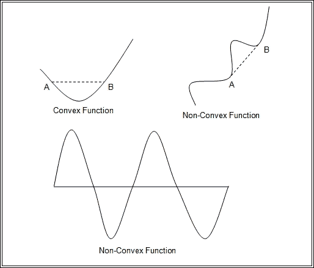

# 五、执行数值计算

在本章中，我们将借助示例程序讨论 NumPy 和 SciPy 的大部分特性。我们将首先通过示例详细讨论数组以及可以对其执行的操作。这将为讨论 NumPy 和 SciPy 支持的各种高级功能奠定坚实的基础。

在本章中，我们将涵盖以下主题:

*   利用 NumPy 和 SciPy 进行科学数值计算
*   数字货币的基本目标
*   NumPy 的各种包/模块
*   SciPy 包的基础知识
*   SciPy 的数学函数
*   高级数学模块和软件包

NumPy 是 Python 中数值计算的基础，其最根本、最重要的思想是支持多维数组。让我们从 NumPy 中数组的基本概念开始讨论。在基础知识之后，我们将讨论可以在多维数组上执行的各种操作。我们还将介绍 NumPy 支持的各种基本和高级数学函数。NumPy 有一些支持高级数学概念的子包或模块。

# NumPy 基本对象

NumPy 和 SciPy 的整个科学计算功能是围绕 NumPy 中的两种基本类型的对象构建的。第一个对象是名为**的 *n* 维数组对象，第二个对象是名为`ufunc`的通用函数对象。除了这两个对象之外，还有许多其他对象构建在它们之上。**

 **## 标准对象

数组对象是元素的同构集合，使用 *N* 整数进行索引，其中 *N* 是数组的维数。ndarray 有两个重要属性。第一个是数组元素的数据类型，称为`dtype`，第二个是数组的形状。这里的数据类型可以是 Python 支持的任何数据类型。数组的形状是一个 *N* 元组，即 *N* 维数组的 *N* 个元素的集合，其中元组的每个元素定义数组该维中的元素数量。

### 数组的属性

除了形状和`dtype`之外，一个数组的其他重要属性如下:

*   `size`
*   `itemsize`
*   `data`
*   `ndim`

`itemsize`是数组中一个元素的长度(以字节为单位)，而`data`属性是一个 Python 缓冲区对象，指向数组数据的开始。让我们借助下面的 Python 程序来理解形状、数据类型和其他属性的概念:

```py
import numpy as np
x2d = np.array( (   (100,200,300), 
                    (111,222,333), 
                    (123,456,789) ) )
x2d.shape
x2d.dtype
x2d.size
x2d.itemsize
x2d.ndim
x2d.data
```

### 对数组的基本操作

使用方括号(`[]`)来索引数组值被称为 **数组索引**。考虑上一个程序中定义和使用的`x2d`二维数组。二维数组的一个特定元素可以称为`x2d[row, column]`。例如，我们可以将第二行的第二个元素(即`222`)称为`x2d[1,1]`，因为索引从 0 开始。类似地，`x2d[2,1]`元素是指第三行的第二个元素(即`456`)。

数组切片是从数组中选择一些元素以产生子数组的过程。对于一维数组，我们可以从数组中依次选择一些元素。此外，通过使用切片，我们可以获取二维数组的整行或整列。换句话说，使用切片，我们可以跨轴获取数组元素。Python 的基本切片概念扩展到 *N* 维度进行数组。基本切片语法是`start:stop:step`。第一个元素指定切片的开始索引，第二个元素指定切片的停止索引，最后一个元素定义要添加到先前选择的元素的索引中的步骤。如果我们跳过前两个值中的任何一个，那么这个值被认为是零或更多。同样，`step`的默认值为 1。让我们考虑几个例子来使切片更加清晰。

考虑`x2d`，一个 6×3 的数组。那么`x2d[1]`和`x2d[1, :]`一样，代表数组的第二行，有三个元素。另一方面，`x2d[:, 1]`代表数组的第二列，有六个元素。第二列的每三个元素可以选择为`x2d[:: 1, 2]`。

省略号也可以用来替换零个或多个`:`项。省略号扩展到零个或多个全切片对象，以匹配切片对象的总维度，该维度等于原始数组的维度。比如`x4d`是`5×6×7×8`，那么`x4d[2 :, ..., 6]`就相当于`x4d[2 :, :, :, 6]`。同样`x4d[..., 4]`相当于`A[:, :, :, 4]`。考虑下面的程序来清楚地了解数组切片的概念。这个程序演示了一维和二维数组的切片:

```py
import numpy as np
x = np.array([1,12, 25, 8, 15, 35, 50, 7, 2, 10])
x[3:7]
x[1:9:2]
x[0:9:3]

x2d = np.array((  (100,200,300), 
                  (111,222,333), 
                  (123,456,789),
                  (125,457,791),
                  (127,459,793),
                  (129,461,795) ))
x2d[0:4,0:3]
x2d[0:4:2,0:3:2]
```

可以使用`for`循环对数组进行迭代。在一维数组中，我们可以使用`for`循环顺序获取所有元素。另一方面，可以相对于第一个轴对多维数组进行迭代。这个程序演示了如何在数组上执行迭代:

```py
import numpy as np
x = np.array([1,12, 25, 8, 15, 35, 50, 7, 2, 10])
x2d = np.array((  (100,200,300), 
               (111,222,333), 
               (123,456,789),
               (125,457,791),
               (127,459,793),
               (129,461,795) ))
for i in x:
  print i

for row in x2d:
  print row
```

### 数组上的特殊操作(形状变化和转换)

对于改变数组的形状，我们有很多方法如`ravel``reshape``resize`，以及给形状属性赋予新的值。`ravel`和`reshape`方法返回具有修改的形状的参数(调用对象)，而调整大小和赋值修改实际的数组。ravel 方法将数组展平成 C 语言风格的数组。它返回的参数就像是一维数组，每行按顺序一个接一个地排列。

让我们借助下一个程序来讨论这些方法的影响。这个程序对二维数组执行形状操作。程序中的第一个`print`将显示原始数组。`ravel`功能将显示展平的数组。`ravel`功能后的`print`功能将再次显示原始数组，因为`ravel`功能不会改变原始数组。现在`resize`功能将数组的形状从原来的六行三列的`(6,3)`变为三行六列的`(3,6)`。因此，`resize`功能之后的`print`功能将以新的形状显示数组。

现在，我们已经对数组的原始形状(`(6,3)`)应用了`reshape`函数。这将以`(6,3)`的原始形状显示数组。但是由于`reshape`不改变形状，之后的`print`功能会打印出`(3,6)`形状的数组。最后，最后一种方法是将`(9,2)`的形状值分配给`shape`属性。这将改变形状为`(9,2)`。

需要记住的最重要的一点是，在重塑的同时，新数组的总大小应该保持不变:

```py
import numpy as np
x2d = np.array((  (100,200,300), 
                  (111,222,333), 
                  (123,456,789),
                  (125,457,791),
                  (127,459,793),
                  (129,461,795) ))
print x2d
x2d.ravel()
print x2d
x2d.resize((3,6))
print x2d
x2d.reshape(6,3)
print x2d
x2d.shape = (9,2)
print x2d
```

如果需要，有工具将数组转换成 Python 列表数据结构、存储文件和字符串。每个转换都有单独的方法，称为`tolist`、`tofile`和`tostring`。

### 与数组关联的类

有许多类和子类与`ndarray`类相关联。这些类旨在支持特定的增强功能。在下面的段落中，我们将讨论这些类和子类。

#### 矩阵子类

`matrix`类是 ndarrays 的 Python 子类。可以从其他矩阵或字符串或任何其他可以转换为数组的对象创建矩阵。`matrix`子类专门覆盖了运算符，比如矩阵乘法的`*`和矩阵幂的`**`。`matrix`类中提供了几个函数来执行各种活动，如元素排序、转置计算、求矩阵元素的和、矩阵到列表的转换以及其他数据结构和数据类型。考虑下面的程序，它定义了两个矩阵，每个矩阵有三行和三列。最后，程序显示矩阵乘法的输出:

```py
import numpy as np
a = np.matrix('1 2 3; 4 5 6; 7 8 9')
print a
b = np.matrix('4 5 6; 7 8 9; 10 11 12')
print b
print a*b
```

#### 屏蔽数组

NumPy 有一个名为的模块，用于创建屏蔽数组。屏蔽数组是一个普通数组，它有一些无效的、丢失的或不需要的条目。它有两个组成部分:原始数组和一个掩码。掩码是用于确定数组值是否有效的布尔值数组。掩码中的一个`true`值反映数组中对应的值无效。屏蔽或无效的条目将不会用于对屏蔽数组的任何进一步计算。下一个程序演示了屏蔽数组的概念。假设原始数组`x`有不同人的脉率，并且有两个无效条目。为了屏蔽这些无效条目，在屏蔽中相应的值被设置为 1 ( `true`)。最后，我们计算原始数组和屏蔽数组的平均值。没有掩蔽，平均值是`61.1`，因为两个负值；掩蔽后，其余 8 个值的平均值为`94.5`:

```py
import numpy as np
import numpy.ma as ma
x = np.array([72, 79, 85, 90, 150, -135, 120, -10, 60, 100])
mx = ma.masked_array(x, mask=[0, 0, 0, 0, 0, 1, 0, 1, 0, 0])
mx2 = ma.masked_array(x,mask=x<0)
x.mean()
mx.mean()
mx2.mean()
```

#### 结构化/重新记录数组

NumPy 数组可以保存记录类型值。要创建一个`record`类型的数组，我们首先需要创建一个记录的数据类型，然后我们将使用这个数据类型作为数组元素的类型。这个记录数据类型可以使用`dtype`数据类型的定义来定义，然后我们可以在数组定义中使用这个`dtype`。考虑下面的程序，它创建了一组记录，这些记录具有城市的最低、最高和平均温度。`dtype`功能有两个组成部分:字段名称及其格式。本例中使用的格式是 32 位整数(`i4`)、32 位浮点(`f4`)和 30 个或更少字符的字符串(`a30`):

```py
import numpy as np
rectype= np.dtype({'names':['mintemp', 'maxtemp', 'avgtemp', 'city'], 'formats':['i4','i4', 'f4', 'a30']})

a = np.array([(10, 44, 25.2, 'Indore'),(10, 42, 25.2, 'Mumbai'), (2, 48, 30, 'Delhi')],dtype=rectype)

print a[0]
print a['mintemp']
print a['maxtemp']
print a['avgtemp']
print a['city'] 
```

## 通用功能对象

一个**通用功能** ( **取消** ) 是一个在逐个元素的基础上对标准进行操作的功能。它还支持广播、类型转换和许多其他重要功能。NumPy 中的广播是在不同形状的数组上操作的过程。特别是在算术运算期间，具有较小形状的数组将在较大的数组中传播，以使它们的形状兼容。通用函数是 NumPy 的`ufunc`类的实例。

### 属性

每个通用函数都有几个属性，尽管用户不能设置这些属性的值。以下是通用函数的属性。通用函数具有一些信息属性:

*   `__doc__`:包含`ufunc`功能的`doc`字符串。它的第一部分是根据名称、输入数量和输出数量动态生成的。它的第二部分是在创建函数时定义的，并与函数一起存储。
*   `__name__`:这是`ufunc`的名字。
*   `ufunc.nin`:表示输入的总数。
*   `ufunc.nout`:表示输出总数。
*   `ufunc.nargs`:这表示参数的总数，包括输入和输出。
*   `ufunc.ntypes`:表示定义该函数的不同类型的总数。
*   `ufunc.types`:这将返回一个列表，该列表包含`ntypes`元素，这些元素具有定义该函数的类型。
*   `ufunc.identity`:该函数的身份值。

### 方法

所有`ufuncs`都有五种方法，如下表所示。前四种方法只与接受两个输入参数并返回一个输出参数的 ufunc 相关。当试图调用其他 ufuncs 时，这些方法将引发`ValueError`异常。第五种方法允许用户使用索引执行就地操作。以下方法适用于每个 NumPy 通用功能:

*   `ufunc.reduce`:通过沿一个轴应用 ufunc，将数组的维数减少一。
*   `ufunc.accumulate`:这个累加了对所有元素应用运算符的结果。
*   `ufunc.reduceat`:这将对单个轴上的指定切片执行缩减。
*   `ufunc.outer(A, B)`:对于`A`中的 *a* 和`B`中的 *b* ，这将 ufunc 运算符应用于所有 *(a，b)* 对。
*   `ufunc.at`:这将对指定元素的操作数执行无缓冲就地操作。

### 各种可用的 ufunc

NumPy 支持的 ufunc 有多个(目前 60 多个)。这些函数涵盖了各种各样的运算，包括简单的数学运算(如加、减、模和绝对值)、平方、对数、指数、三角、按位、比较和浮点函数。一般来说，使用这些函数比应用循环更好，因为它们比循环更有效。

以下程序演示了其中一些 ufuncs 的使用:

```py
import numpy as np
x1 = np.array([72, 79, 85, 90, 150, -135, 120, -10, 60, 100])
x2 = np.array([72, 79, 85, 90, 150, -135, 120, -10, 60, 100])
x_angle = np.array([30, 60, 90, 120, 150, 180])
x_sqr = np.array([9, 16, 25, 225, 400, 625])
x_bit = np.array([2, 4, 8, 16, 32, 64])
np.greater_equal(x1,x2)
np.mod(x1,x2)
np.exp(x1)
np.reciprocal(x1)
np.negative(x1)
np.isreal(x1)
np.isnan(np.log10(x1))
np.sqrt(np.square(x_sqr))
np.sin(x_angle*np.pi/180)
np.tan(x_angle*np.pi/180)
np.right_shift(x_bit,1)
np.left_shift (x_bit,1)
```

在 Python 中，如果有一个值不能用数字表示，那么这个值就叫做`nan`。例如，如果我们在前面的程序中对`x1`数组操作`log10` ufunc，那么作为输出，有到`nan`。有一个名为`isnan`的 ufunc 验证输入参数是`nan`。三角函数需要参数作为角度值，单位为度。正常的十进制值是弧度值，可以通过乘以 180/NumPy.pi 转换为度数。按位左移 1 执行参数值 2 的快速乘法。类似地，按位右移 1 对参数执行值为 2 的快速除法。通常，这些 ufuncs 对数组进行操作，如果有任何非数组参数，那么该参数将作为数组进行广播。然后，执行逐个元素的操作。这是前一个程序最后四行的情况。

## NumPy 数学模块

NumPy 为特定功能增加了模块，例如线性代数、离散傅立叶变换、随机采样和矩阵代数库。这些功能捆绑在单独的模块中，如下所示:

*   `numpy.linalg`:这个模块支持线性代数的各种功能，比如数组和向量的内积、外积、点积；向量和矩阵的范数；线性矩阵方程的解:和矩阵求逆方法。
*   `numpy.fft`:离散傅里叶变换在数字信号处理中有着广泛的应用。该模块具有计算各种离散傅立叶变换的功能，包括一维、二维、多维、逆和厄米傅立叶变换。
*   `numpy.matlib`:这个模块包含默认情况下返回矩阵对象而不是数组的函数。这些功能包括`empty`、`zeros`、`ones`、`eye`、`rapmat`、`rand`、`randn`、`bmat`、`mat`和`matrix`。
*   `numpy.random`:该模块包含从特定人群中进行随机采样的功能。有一些函数可以从给定的总体或范围中生成简单的随机数据。它还支持随机排列的生成。此外，它还有一系列支持各种基于统计分布的随机抽样数据生成的功能。

下一个程序演示了`linalg`模块中一些功能的使用。它计算方阵的范数、逆、行列式、特征值和右特征向量。它还通过求解两个方程的系统来演示线性方程求解器， *2x+3y=4* 和 *3x+4y=5* ，这是通过将它们表示为数组来完成的。最后一行的`allclose`函数比较传递给它的两个数组，如果它们在公差范围内元素相等，则返回`true`。`eig`方法计算正方形数组的特征值和特征向量。返回值如下:`w`为特征值，`v`为特征向量，其中`v[:,i]`列为`w[i]`的特征向量:

```py
import numpy as np
from numpy import linalg as LA
arr2d = np.array((  (100,200,300), 
          (111,222,333), 
          (129,461,795) ))
eig_val, eig_vec = LA.eig(arr2d)
LA.norm(arr2d)
LA.det(arr2d)
LA.inv(arr2d)
arr1 = np.array([[2,3], [3,4]])
arr2 = np.array([4,5])
results = np.linalg.solve(arr1, arr2)
print results
np.allclose(np.dot(arr1, results), arr2)
```

随机抽样是科学和商业计算的一个重要方面。下面的程序演示了`numpy`随机采样模块支持的每一类功能中的一些功能。除了规模和人口，一些分布需要一些统计值，如平均值、模式和标准差。`permutation`函数随机置换一个序列或返回一个置换的范围，而`randint`函数从前两个参数给出的范围中返回随机选择的元素；元素的总数将作为第三个参数给出。其余方法从特定分布返回样本，如卡方、帕累托、标准正态和对数正态:

```py
import numpy as np
np.random.permutation(10)
np.random.randint(20,50, size=10)
np.random.random_sample(10)
np.random.chisquare(5,10) # degree of freedom, size
alpha, location_param = 4., 2.
s = np.random.pareto(alpha, 10) + location_param

s = np.random.standard_normal(20)

mean, std_deviation = 4., 2\. 
s = np.random.lognormal(mean, std_deviation, 10)
```

# SciPy 简介

SciPy 包含许多专用于各种科学计算应用所需的通用功能的子模块。SciPy 社区建议科学家在 SciPy 中实际实现所需功能之前，首先检查该功能是否已经实现。由于几乎所有科学计算的基本功能都已经实现，这种检查将节省科学家们在重新发明轮子时所付出的努力。此外，SciPy 模块已经针对错误和可能的错误进行了优化和测试。因此，使用它们将有利于提高性能。

## SciPy 中的数学函数

SciPy 写在 NumPy 之上，扩展其功能以执行高级数学功能。NumPy 中可用的基本数学函数并没有经过重新设计来执行这些功能。我们需要在本章后续讨论的程序中使用 NumPy 函数，正如我们将看到的。

## 高级模块/包

SciPy 的功能被分成许多独立的特定于任务的模块。让我们逐一讨论这些模块。为简洁起见，我们将不涵盖任何模块的所有功能。相反，我们将演示 SciPy 每个模块中的一些示例。

### 整合

`scipy.integrate`子包有几种积分方法的功能，包括常微分方程的积分器。当给定函数对象时，有几种方法来集成函数。当给定固定样本时，它有积分函数的方法。

以下是给定函数对象的积分函数:

*   `quad`:通用集成
*   `dblquad`:通用双集成
*   `tplquad`:通用三重集成
*   `nquad`:通用 n 维集成
*   `fixed_quad`:使用高斯求积对*函数(x)* 进行积分 *n*
*   `quadrature`:使用高斯求积在给定公差内积分
*   `romberg`:使用龙贝格积分积分功能

这些是给定固定样本的积分函数:

*   `cumtrapz`:用梯形法则累计计算积分
*   `simps`:用辛普森法则从样本中计算积分
*   `romb`:使用龙贝格积分计算 *(2**k + 1)* 均匀间隔样本的积分

常微分方程系统的积分器如下:

*   `odeint`:常微分方程的一般积分
*   `ode`:使用 VODE 和 ZVODE 例程集成 ODE
*   `complex_ode`:将复值 ODE 转换为实值并积分

让我们讨论从前面的列表中选择方法的程序。`quad`函数对正负无穷大范围内两点之间的一个变量的函数进行一般积分。在下面的程序中，我们使用该函数计算第一类贝塞尔函数在 *(0，20)* 区间内的积分。第一类贝塞尔函数在`special.jv`方法中定义。以下程序的最后一行使用`quad`函数计算高斯积分:

```py
import numpy as np
from scipy import special
from scipy import integrate

result = integrate.quad(lambda x: special.jv(4,x), 0, 20)
print result 
print "Gaussian integral", np.sqrt(np.pi),quad(lambda x: np.exp(-x**2),-np.inf, np.inf)
```

如果要集成的函数需要额外的参数，例如变量的乘法或幂因子，那么这些参数可以作为参数传递。这在下面的程序中进行了演示，通过将`a`、`b`和`c`作为参数传递给`quad`函数。有时，积分可能发散或收敛非常慢:

```py
import numpy as np
from scipy.integrate import quad

def integrand(x, a, b, c):
  return a*x*x+b*x+c

a = 3
b = 4 
c = 1
result = quad(integrand, 0,np.inf,  args=(a,b,c))
print result
```

可以分别使用`dblquad`和`tplquad`功能进行双重和三重积分。下一个程序演示了`dblquad`功能的使用。`t`和`x`的参数从`0`到无穷大(`inf`不等。注释后的代码在固定间隔内执行高斯求积:

```py
import numpy as np
from scipy.integrate import quad, dblquad, fixed_quad

def integrand1 (t, x, n):
  return np.exp(-x*t) / t**n

n = 4
result = dblquad(lambda t, x: integrand1(t, x, n), 0, np.inf, lambda x: 0, lambda x: np.inf)
# the following code is performing Gaussian quadrature over a fixed interval
from scipy.integrate import fixed_quad, quadrature

def integrand(x, a, b):
  return a * x + b
a = 2
b = 1
fixed_result = fixed_quad(integrand, 0, 1, args=(a,b))
result  = quadrature(integrand, 0, 1, args=(a,b))
```

对于函数与任意间隔样本的积分，我们有`simps`函数。辛普森法则将三个相邻点之间的函数近似为抛物线。以下程序使用`simps`功能:

```py
import numpy as np
from scipy.integrate import simps
def func1(a,x):
  return a*x**2+2

def func2(b,x):
  return b*x**3+4

x = np.array([1, 2, 4, 5, 6])
y1 = func1(2,x)
Intgrl1 = simps(y1, x)

print(Intgrl1)

y2 = func2(3,x)
Intgrl2 = simps (y2,x)
print (Intgrl2)
```

这里有一个程序，演示了使用`odeint`函数积分常微分方程:

```py
import matplotlib.pyplot as plt
from numpy import linspace, array
def derivative(x,time): 
  a = -2.0
  b = -0.1
  return array([  x[1], a*x[0]+b*x[1] ])

time = linspace (1.0,15.0,1000)
xinitialize = array ([1.05,10.2]) 
x = odeint(derivative,xinitialize,time)
plt.figure()
plt.plot(time,x[:,0]) 
plt.xlabel('t')
plt.ylabel('x')
plt.show()
```

### 信号处理

信号处理工具箱包含许多滤波函数、滤波器设计函数以及用于一维和二维数据的几种 B 样条插值算法的函数。该工具箱有几个用于执行以下操作的功能:

*   盘旋
*   b 样条
*   过滤
*   滤波器设计
*   Matlab 风格的 IIR 滤波器设计
*   连续时间线性系统
*   离散时间线性系统
*   LTI 代表处
*   波形
*   窗口功能
*   小波
*   峰值发现
*   光谱分析

让我们讨论一些示例程序来理解信号处理工具箱的功能。

`detrend`函数是一个过滤函数，从数据中去除沿轴的恒定或线性趋势，以便我们可以看到高阶的效果，如以下程序所示:

```py
import numpy as np
import matplotlib as mpl
import matplotlib.pyplot as plt
from scipy import signal
t = np.linspace(0, 5, 100)
x = t + np.random.normal(size=100)
plt.plot(t, x, linewidth=3)
plt.show()
plt.plot(t, signal.detrend(x), linewidth=3)
plt.show()
```

下面的程序使用样条滤波，使用`misc.lena`命令计算作为数组的 Lena 脸部的边缘图像。该功能通过使用两个功能来实现。首先，`cspline2d`命令用于将具有镜像对称边界条件的可分离二维 FIR 滤波器应用于样条系数。该函数比第二个函数`convolve2d`更快，后者卷积任意二维滤波器，并允许您选择镜像对称边界条件:

```py
import numpy as np
from scipy import signal, misc
import matplotlib.pyplot as plt
img = misc.lena()

splineresult = signal.cspline2d(img, 2.0)
arr1 = np.array([[-1,0,1], [-2,0,2], [-1,0,1]], dtype=np.float32)
derivative = signal.convolve2d(splineresult,arr1,boundary='symm' ,mode='same')
plt.figure()
plt.imshow(derivative)
plt.title('Image filtered by spline edge filter')
plt.gray()
plt.show()
```

### 傅里叶变换

实数或复数序列的离散傅里叶变换和离散逆傅里叶变换可分别使用`fft`和`ifft`(快速傅里叶变换)计算，如本程序所示:

```py
import numpy as np
from scipy.fftpack import fft, ifft
x = np.random.random_sample(5) 
y = fft(x)
print y
yinv = ifft(y)
print yinv
```

以下程序绘制了三个正弦之和的快速傅立叶变换:

```py
import numpy as np
import matplotlib as mpl
import matplotlib.pyplot as plt
from scipy.fftpack import fft
x = np.linspace(0.0, 1, 500)
y = np.sin(100*np.pi*x) + 0.5*np.sin(150*np.pi*x) + 0.75*np.sin(200*np.pi*x)
yf = fft(y)
xf = np.linspace(0.0, 0.1, 250)
import matplotlib.pyplot as plt
plt.plot(xf, 2.0/500 * np.abs(yf[0:500/2]))
plt.grid()
plt.show()
```

### 空间数据结构和算法

空间分析是一套用于分析空间数据的技术和算法。与地理空间或地平线相关的数据对象或元素可以称为空间数据。这些数据由点、线、多边形和其他几何和地理图元组成，这些图元可以通过位置进行映射，并用于跟踪和定位各种设备。它可以是提供关于地理或空间位置的特定信息的标量或矢量数据。空间数据由不同领域的许多应用使用和处理，如地理、地理信息系统/检索、基于位置的服务、基于网络和桌面的空间应用、空间挖掘等。

一个 **k 维树** ( **k-d 树**)是一个空间划分的数据结构。它在 k 维空间中组织点。在数学中，空间划分是将一个空间划分为多个不相交空间的过程。它将空间划分为不重叠的区域，其中空间中的每个点可能恰好属于一个区域。

SciPy 有一个空间模块，支持空间计算的各种所需功能。用户可以计算 *N* 维的德劳奈三角剖分、沃罗诺伊图和凸包。它也有绘图助手来绘制这些二维计算。此外，为了执行快速最近邻查找，它还支持 *KDTree 功能*，并且具有从原始观察向量集合中计算远处矩阵的功能。

让我们讨论一些展示这些功能的示例程序。以下程序执行德劳奈三角测量，然后使用`pyplot`绘制计算结果:

```py
import numpy as np
import matplotlib.pyplot as plt
from scipy.spatial import Delaunay
arr_pt = np.array([[0, 0], [0, 1.1], [1, 0], [1, 1]])
arr1 = np.array([0., 0., 1., 1.])
arr2 = np.array([0., 1.1, 0., 1.])

triangle_result = Delaunay(arr_pt)
plt.triplot(arr1, arr2, triangle_result.simplices.copy())
plt.show()
plt.plot(arr1, arr2, 'ro')
plt.show()
```

包含给定点集中所有点的最小凸对象称为凸包，可以使用`convexHull`函数计算。下一个程序演示了该函数的使用，然后绘制了使用`convexHull`函数的计算结果:

```py
import numpy as np
from scipy.spatial import ConvexHull
import matplotlib.pyplot as plt
randpoints = np.random.rand(25, 2) 
hull = ConvexHull(randpoints)
#following line will draw points
plt.plot(randpoints[:,0], randpoints[:,1], 'x')
#this loop will draw the line segment
for simplex in hull.simplices:
  plt.plot(randpoints[simplex,0], randpoints[simplex,1], 'k')

plt.show()
```

我们可以使用 KDTree 来找出点集中哪个点最接近所选点。这个程序演示了 k-d 树的使用:

```py
from scipy import spatial
x_val, y_val = np.mgrid[1:5, 3:9]
tree_create = spatial.KDTree(zip(x_val.ravel(), y_val.ravel()))
tree_create.data
points_for_query = np.array([[0, 0], [2.1, 2.9]])
tree_create.query(points_for_query)
```

以下程序显示最近距离和索引:

```py
import numpy as np
import matplotlib.pyplot as plt
from scipy.spatial import KDTree
vertx = np.array([[1, 1], [1, 2], [1, 3], [2, 1], [2, 2], [2, 3], [3, 1], [3, 2], [3, 3]])
tree_create = KDTree(vertx)
tree_create.query([1.1, 1.1])
x_vals = np.linspace(0.5, 3.5, 31)
y_vals = np.linspace(0.5, 3.5, 33)
xgrid, ygrid = np.meshgrid(x, y)
xy = np.c_[xgrid.ravel(), ygrid.ravel()]
plt.pcolor(x_vals, y_vals, tree.query(xy)[1].reshape(33, 31))
plt.plot(points[:,0], points[:,1], 'ko')
plt.show()
```

### 优化

优化是为一个或多个变量的目标函数寻找最佳解的过程，可能在这些变量上存在一些预定义的约束，也可能在这些变量上存在一些预定义的约束。目标函数可以被认为是最小化的成本/能量函数或最大化的利润或效用函数。有几个与优化问题相关的重要概念，例如优化问题的维数和优化的类型。在解决优化问题之前，最好先了解这些概念，然后再开始解决方案。对于问题的维数，我们指的是执行优化值搜索的标量变量的数量。变量的数量可以是一个或多个。变量的数量也会影响解决方案的可伸缩性。标量变量越多，问题越慢。此外，优化的类型也会影响解决方案的设计。

另一个重要的考虑是这个问题是否是一个约束问题。通过约束问题，我们意味着解决方案必须满足对所研究的变量的一些预先定义的约束。例如，我们可以写一个一般约束最小化优化问题如下:

```py
Minimize                           f(x)
Subjected to constraints    gi (x)= ai     for i= 1 … … n
                                        Hj (x)>= bj     for j= 1 … … m
```

解决方案需要满足这些约束。问题的解决取决于目标函数、约束和变量之间的关系。此外，模型的大小也会影响解决方案。模型的大小由变量的数量和约束的数量来衡量。通常，模型的大小有一个上限，这是由大多数优化求解软件应用强加的。由于更高的内存要求、问题的处理要求及其数值稳定性，必须引入该限制。可能我们根本找不到解决方案，或者获得解决方案可能非常耗时，这给人的印象是解决方案没有收敛。

此外，优化问题可以是凸或非凸问题。凸问题相对更容易解决，因为它有一个全局最小值/最大值，而没有局部最小值/最大值。

让我们详细讨论一下凸性的概念。凸优化是在凸集上最小化`convex`函数的过程。如果图形上任意两点之间的线段位于图形之上，则为区间定义的`convex`函数(它保存实数值)称为`convex`函数。两个流行的`convex`函数是指数函数( *f(x)=ex* )和二次函数( *f(x)=x2* )。`convex`和非凸函数的一些例子如图所示:



现在，凸集是这样一个区域，如果我们用一条线段连接它里面的两个点，那么这条线段上的所有点也位于这个区域里面。下图描述了`convex`和非凸集:


`scipy.optimize`包为标量和多维函数最小化、曲线拟合和求根的大多数有用算法提供了函数。让我们讨论如何使用这些函数。

下一个程序演示了**布赖登-弗莱彻-戈德法布-沙诺** ( **BFGS** ) 算法的使用。该算法利用目标函数的梯度快速收敛到解。程序首先定义一个名为`rosen_derivative`的函数来计算`rosenbrock`函数的梯度:

```py
import numpy as np
from scipy.optimize import minimize
def rosenbrock(x):
  return sum(100.0*(x[1:]-x[:-1]**2.0)**2.0 + (1-x[:-1])**2.0)

x0 = np.array([1.3, 0.7, 0.8, 1.9, 1.2])

def rosen_derivative(x):
  x1 = x[1:-1]
  x1_m1 = x[:-2]
  x1_p1 = x[2:]
  derivative = np.zeros_like(x)
  derivative[1:-1] = 200*(x1-x1_m1**2) - 400*(x1_p1 - x1**2)*x1 - 2*(1-x1)
  derivative[0] = -400*x[0]*(x[1]-x[0]**2) - 2*(1-x[0])
  derivative[-1] = 200*(x[-1]-x[-2]**2)
  return derivative

res = minimize(rosenbrock, x0, method='BFGS', jac=rosen_derivative, options={'disp': True})
```

下面的程序首先计算罗森布鲁克函数的海森，然后使用牛顿共轭梯度法最小化该函数:

```py
import numpy as np
from scipy.optimize import minimize

def rosenbrock(x):
  return sum(100.0*(x[1:]-x[:-1]**2.0)**2.0 + (1-x[:-1])**2.0)

x0 = np.array([1.3, 0.7, 0.8, 1.9, 1.2])

def rosen_derivative(x):
  x1 = x[1:-1]
  x1_m1 = x[:-2]
  x1_p1 = x[2:]
  derivative = np.zeros_like(x)
  derivative[1:-1] = 200*(x1-x1_m1**2) - 400*(x1_p1 - x1**2)*x1 - 2*(1-x1)
  derivative[0] = -400*x[0]*(x[1]-x[0]**2) - 2*(1-x[0])
  derivative[-1] = 200*(x[-1]-x[-2]**2)
  return derivative

def rosen_hessian(x):
  x_val = np.asarray(x)
  hess = np.diag(-400*x_val[:-1],1) - np.diag(400*x_val[:-1],-1)
  diagonal = np.zeros_like(x_val)
  diagonal[0] = 1200*x_val[0]**2-400*x_val[1]+2
  diagonal[-1] = 200
  diagonal[1:-1] = 202 + 1200*x_val[1:-1]**2 - 400*x_val[2:]
  hess = hess + np.diag(diagonal)
  return hess

result = minimize(rosenbrock, x0, method='Newton-CG', jac=rosen_derivative, hess=rosen_hessian, options={'xtol': 1e-8, 'disp': True})
print result.x
```

`minimize`函数还有一个接口，可以连接到许多约束最小化算法。以下程序使用**顺序最小二乘编程优化** ( **SLSQP** )算法。要最小化的函数在`func`中定义，其导数在`func_deriv`中定义，约束在`cons`变量中定义:

```py
import numpy as np
from scipy.optimize import minimize
def func(x, sign=1.0):
  return sign*(2*x[0]*x[1] + 2*x[0] - x[0]**2 - 2*x[1]**2)

def func_deriv(x, sign=1.0):
  dfdx0 = sign*(-2*x[0] + 2*x[1] + 2)
  dfdx1 = sign*(2*x[0] - 4*x[1])
  return np.array([ dfdx0, dfdx1 ])

cons = ({'type': 'eq',
  'fun': lambda x: np.array([x[0]**3 - x[1]]),
  'jac': lambda x: np.array([3.0*(x[0]**2.0), -1.0])},
  {'type': 'ineq',
  'fun': lambda x: np.array([x[1] - 1]),
  'jac': lambda x: np.array([0.0, 1.0])})

res = minimize(func, [-1.0,1.0], args=(-1.0,), jac=func_deriv, method='SLSQP', options={'disp': True})
print(res.x)

res = minimize(func, [-1.0,1.0], args=(-1.0,), jac=func_deriv,constraints=cons, method='SLSQP', options={'disp': True})
print(res.x)
```

下一个程序演示了寻找全局最小值和局部最小值的方法。首先，它定义了函数并绘制了图。该函数在`-1.3`附近有一个全局最小值，在`3.8`附近有一个局部最小值。使用 BFGF 算法来寻找局部最小值。该程序使用强力算法来寻找全局最小值。但是，随着网格大小(要检查的值的范围/域)的增加，蛮力方法会变得很慢，因此最好对标量函数使用布伦特方法。该程序还使用`fminbound`函数来寻找 0 到 10 之间的局部最小值:

```py
import numpy as np
import matplotlib.pyplot as plt
from scipy import optimize

def f(x):
  return x**2 + 10*np.sin(x)

x = np.arange(-10,10,0.1)
plt.plot(x, f(x))
plt.show()

optimize.fmin_bfgs(f, 0)

grid = (-10, 10, 0.1)
optimize.brute(f, (grid,))
optimize.brent(f)
optimize.fminbound(f, 0, 10)
```

以下程序演示了约束优化的使用:

```py
import numpy as np
from scipy import optimize
def f(x):
     return np.sqrt((x[0] - 2)**2 + (x[1] - 3)**2)

def constraint(x):
     return np.atleast_1d(2.5 - np.sum(np.abs(x)))

optimize.fmin_slsqp(f, np.array([0, 2]), ieqcons=[constraint, ])
optimize.fmin_cobyla(f, np.array([3, 4]), cons=constraint)
```

有几种方法可以找到多项式的根，接下来的三个程序使用平分法、牛顿-拉夫森法和根函数。本程序采用二等分法求`polynomial_func`中定义的多项式的根:

```py
import scipy.optimize as optimize
import numpy as np

def polynomial_func(x):
    return np.cos(x)**3 + 4 - 2*x

print(optimize.bisect(polynomial_func, 1, 5))
```

牛顿-拉夫森法用于在以下程序中寻找多项式的根:

```py
import scipy.optimize
from scipy import optimize

def polynomial_func(xvalue):
  yvalue = xvalue + 2*scipy.cos(xvalue)
        return yvalue

scipy.optimize.newton(polynomial_func,  1)
```

在数学中，拉格朗日乘子法被用来寻找函数的局部最小值和局部最大值，服从等式约束。该程序使用`fsolve`方法计算拉格朗日乘数:

```py
import numpy as np
from scipy.optimize import fsolve
def func_orig(data):
    xval = data[0]
    yval = data[1]
    Multiplier = data[2]
    return xval + yval + Multiplier * (xval**2 + yval**2 - 1)

def deriv_func_orig(data):
    dLambda = np.zeros(len(data))
    step_size = 1e-3 # this is the step size used in the finite difference.
    for i in range(len(data)):
        ddata = np.zeros(len(data))
        ddata[i] = step_size
        dLambda[i] = (func_orig(data+ddata)-func_orig(data-ddata))/(2*step_size);
    return dLambda

data1 = fsolve(deriv_func_orig, [1, 1, 0])
print data1, func_orig(data1)

data2 = fsolve(deriv_func_orig, [-1, -1, 0])
print data2, func_orig(data2)
```

### 插值

插值是一种在已知数据点的离散集合范围内寻找新数据点的方法。`interpolate`子包具有插值器，用于使用各种插值方法进行计算。它支持使用`spline`函数、`univariate`和`multivariate`一维和多维插值、拉格朗日和泰勒多项式插值器的插值。它也有用于`FITPACK`和`DFITPACK`函数的包装类。让我们讨论一些演示这些方法使用的程序。

这个程序演示了使用线性插值和三次插值的一维插值，并绘制它们进行比较:

```py
import numpy as np
from scipy.interpolate import interp1d
x_val = np.linspace(0, 20, 10)
y_val = np.cos(-x**2/8.0)
f = interp1d(x_val, y_val)
f2 = interp1d(x_val, y_val, kind='cubic')
xnew = np.linspace(0, 20, 25)
import matplotlib.pyplot as plt
plt.plot(x,y,'o',xnew,f(xnew),'-', xnew, f2(xnew),'--')
plt.legend(['data', 'linear', 'cubic'], loc='best')
plt.show()
```

以下程序演示了使用`griddata`函数进行 150 点多变量数据插值。这个点数可以更改为任何合适的值。程序使用`pyplot`在单个剧情中创建四个支线剧情:

```py
import numpy as np
import matplotlib.pyplot as plt
from scipy.interpolate import griddata

def func_user(x, y):
  return x*(1-x)*np.cos(4*np.pi*x) * np.sin(4*np.pi*y**2)**2

x, y = np.mgrid[0:1:100j, 0:1:200j]

points = np.random.rand(150, 2)
values = func_user(points[:,0], points[:,1])
grid_z0 = griddata(points, values, (x, y), method='nearest')
grid_z1 = griddata(points, values, (x, y), method='linear')
grid_z2 = griddata(points, values, (x, y), method='cubic')

f, axarr = plt.subplots(2, 2)
axarr[0, 0].imshow(func(x, y).T, extent=(0,1,0,1), origin='lower')
axarr[0, 0].plot(points[:,0], points[:,1], 'k', ms=1)
axarr[0, 0].set_title('Original')

axarr[0, 1].imshow(grid_z0.T, extent=(0,1,0,1), origin='lower')
axarr[0, 1].set_title('Nearest')

axarr[1, 0].imshow(grid_z1.T, extent=(0,1,0,1), origin='lower')
axarr[1, 0].set_title('Linear')

axarr[1, 1].imshow(grid_z2.T, extent=(0,1,0,1), origin='lower')
axarr[1, 1].set_title('Cubic')

plt.show()
```

### 线性代数

`scipy`线性代数方法期望一个参数作为一个可以转换成二维数组的对象。这些方法还返回一个二维数组。与`numpy.linalg`相比，`scipy.linalg`功能具有更高级的功能。

以下程序计算表示为二维数组的矩阵的逆矩阵。它还使用`T`(转置的快捷方式)并在数组上执行乘法:

```py
import numpy as np
from scipy import linalg
A = np.array([[2,3],[4,5]])
linalg.inv(A)
B = np.array([[3,8]]) 
A*B 
A.dot(B.T)
```

这个小程序计算矩阵的逆矩阵及其行列式:

```py
import numpy as np
from scipy import linalg
A = np.array([[2,3],[4,5]])
linalg.inv(A)
linalg.det(A)
```

下一个程序演示了如何使用矩阵求逆来求解线性方程，以及如何使用求解器来快速实现:

```py
import numpy as np
from scipy import linalg
A = np.array([[2,3],[4,5]])
B = np.array([[5],[6]])
linalg.inv(A).dot(B)
np.linalg.solve(A,B)
```

以下程序寻找一组线性比例系数，并使用模型拟合该数据。本程序使用`linalg.lstsq`解决数据拟合问题。`lstsq`方法用于求线性矩阵方程的最小二乘解。该方法是为给定数据点寻找最佳拟合线的工具。它使用线性代数和简单微积分:

```py
import numpy as np
from scipy import linalg
import matplotlib.pyplot as plt
coeff_1, coeff_2 = 5.0, 2.0
i = np.r_[1:11]  # or we can use np.arang(1, 11)
x = 0.1*i
y = coeff_1*np.exp(-x) + coeff_2*x
z = y + 0.05 * np.max(y) * np.random.randn(len(y))

A = np.c_[np.exp(-x)[:, np.newaxis], x[:, np.newaxis]]
coeff, resid, rank, sigma = linalg.lstsq(A, zi) 

x2 = np.r_[0.1:1.0:100j]
y2 = coeff[0]*np.exp(-x2) + coeff[1]*x2

plt.plot(x,z,'x',x2,y2)
plt.axis([0,1,3.0,5.5])
plt.title('Data fitting with linalg.lstsq')
plt.show()
```

以下程序演示了奇异值分解的方法以及`linag.svd`和`linag.diagsvd`函数:

```py
import numpy as np
from scipy import linalg
A = np.array([[5,4,2],[4,8,7]])
row = 2
col = 3
U,s,Vh = linalg.svd(A)
Sig = linalg.diagsvd(s,row,col)
U, Vh = U, Vh
print U
print Sig
print Vh
```

### 利用 ARPACK 求解稀疏特征值问题

该程序计算标准特征值分解和相应的特征向量:

```py
import numpy as np
from scipy.linalg import eigh
from scipy.sparse.linalg import eigsh
#following line is suppressing the values after decimal
np.set_printoptions(suppress=True)

np.random.seed(0)
random_matrix = np.random.random((75,75)) - 0.5
random_matrix = np.dot(random_matrix, random_matrix.T) 
#compute eigenvalues decomposition
eigenvalues_all, eigenvectors_all = eigh(random_matrix)

eigenvalues_large, eigenvectors_large = eigsh(random_matrix, 3, which='LM')
print eigenvalues_all[-3:]
print eigenvalues_large
print np.dot(eigenvectors_large.T, eigenvectors_all[:,-3:])
```

如果我们尝试使用`eigenvalues_small, eigenvectors_small = eigsh(random_matrix, 3, which='SM')`来寻找具有最小值的特征值，在这种情况下，系统返回一个没有`convergence`的错误。解决这个问题有几个选择。第一种解决方案是通过将`tol=1E-2`传递给`eigsh`函数来增加公差极限，如下所示:`eigenvalues_small, eigenvectors_small = eigsh(random_matrix, 3, which='SM', tol=1E-2)`。这将解决问题，但会导致精度下降。

另一种解决方案是将`maxiter=5000`传递给`eigsh`函数，将最大迭代次数增加到 5000 次，如下所示:`eigenvalues_small, eigenvectors_small = eigsh(random_matrix, 3, which='SM', maxiter=5000)`。然而，更多的迭代将花费更长的时间，并且有更好的方法以期望的精度快速解决这个问题。使用`sigma=0`或`2`和`which='LM'`参数使用换档模式，如下所示:`eigenvalues_small, eigenvectors_small = eigsh(random_matrix, 3, sigma=0, which='LM')`。

### 统计数据

有许多统计函数是为处理数组而设计的，它们的特殊版本是为处理屏蔽数组而设计的。后续段落中的程序演示了连续和离散概率分布的一些可用函数的使用。

以下程序使用离散二项式随机变量并绘制其概率质量函数。下面是二项式离散分布的概率质量函数:

```py
binom.pmf(k) = choose(n, k) * p**k * (1-p)**(n-k)
```

在前面的代码中，k 在(0，1，...，n)，n 和 p 是形状参数:

```py
import numpy as np
from scipy.stats import binom
import matplotlib.pyplot as plt

n, p = 5, 0.4
mean, variance, skewness, kurtosis = binom.stats(n, p, moments='mvsk')
x_var = np.arange(binom.ppf(0.01, n, p),binom.ppf(0.99, n, p))

plt.plot(x_var, binom.pmf(x_var, n, p), 'ro', ms=5, label='PMF of binomial ')
plt.vlines(x_var, 0, binom.pmf(x_var, n, p), colors='r', lw=3, alpha=0.5)
plt.show()
```

下一个程序演示了几何离散随机变量的使用，并绘制了概率质量函数:

```py
geom.pmf(k) = (1-p)**(k-1)*p
```

这里*k>= 1**p*为形状参数:

```py
import numpy as np
from scipy.stats import geom
import matplotlib.pyplot as plt

p = 0.5
mean, variance, skewness, kurtosis = geom.stats(p, moments='mvsk')
x_var = np.arange(geom.ppf(0.01, p),geom.ppf(0.99, p))
plt.plot(x_var, geom.pmf(x_var, p), 'go', ms=5, label='PMF of geomatric')
plt.vlines(x_var, 0, geom.pmf(x_var, p), colors='g', lw=3, alpha=0.5)

plt.show()
```

以下程序演示了广义帕累托连续随机变量的计算，并绘制了其概率密度函数:

```py
genpareto.pdf(x, c) = (1 + c * x)**(-1 - 1/c)
Here, x >= 0 if c >=0 and 0 <= x <= -1/c if c < 0:
import numpy as np
from scipy.stats import genpareto
import matplotlib.pyplot as plt
c = 0.1
mean, variance, skewness, kurtosis  = genpareto.stats(c, moments='mvsk')
x_val = np.linspace(genpareto.ppf(0.01, c),genpareto.ppf(0.99, c), 100)
plt.plot(x_val, genpareto.pdf(x_val, c),'b-', lw=3, alpha=0.6, label='PDF of Generic Pareto')
plt.show()
plt.show()
```

下一个程序显示了广义伽马连续随机变量的计算，并绘制了其概率密度函数:

```py
gengamma.pdf(x, a, c) = abs(c) * x**(c*a-1) * exp(-x**c) / gamma(a)
```

这次， *r x > 0* ， *a > 0* ，以及 *c！= 0* 。这里 *a* 和 *c* 是形状参数:

```py
import numpy as np
from scipy.stats import gengamma
import matplotlib.pyplot as plt
a, c = 4.41623854294, 3.11930916792
mean, variance, skewness, kurtosis   = gengamma.stats(a, c, moments='mvsk')
x_var = np.linspace(gengamma.ppf(0.01, a, c),gengamma.ppf(0.99, a, c), 100)
plt.plot(x_var, gengamma.pdf(x_var, a, c),'b-', lw=3, alpha=0.6, label='PDF of generic Gamma')
plt.show()
```

以下程序演示了多元正态随机变量的计算，并绘制了其概率密度函数。为简单起见，我们跳过概率密度函数:

```py
import numpy as np
import matplotlib.pyplot as plt
from scipy.stats import multivariate_normal
x_var = np.linspace(5, 25, 20, endpoint=False)
y_var = multivariate_normal.pdf(x_var, mean=10, cov=2.5)
plt.plot(x_var, y_var)
plt.show()
```

我们还可以冻结这些统计分布，以显示冻结的概率分布/质量函数。

### 多维图像处理

通常，图像处理和图像分析可以被认为是对二维值数组执行操作。这个包提供了许多应用于数组的图像处理和图像分析功能。下面的代码适用于莉娜的形象。首先，程序在图像中引入一些噪声，然后使用一些过滤器来清除噪声。它使用高斯、中值和`signal.wiener`过滤器显示有噪声的图像和过滤后的图像:

```py
import numpy as np
from scipy import signal
from scipy import misc
from scipy import ndimage
import matplotlib.pyplot as plt

lena = misc.lena()
noisy_lena = np.copy(lena).astype(np.float)
noisy_lena += lena.std()*0.5*np.random.standard_normal(lena.shape)
f, axarr = plt.subplots(2, 2)
axarr[0, 0].imshow(noisy_lena, cmap=plt.cm.gray)
axarr[0, 0].axis('off')
axarr[0, 0].set_title('Noissy Lena Image')
blurred_lena = ndimage.gaussian_filter(noisy_lena, sigma=3)
axarr[0, 1].imshow(blurred_lena, cmap=plt.cm.gray)
axarr[0, 1].axis('off')
axarr[0, 1].set_title('Blurred Lena')
median_lena = ndimage.median_filter(blurred_lena, size=5)
axarr[1, 0].imshow(median_lena, cmap=plt.cm.gray)
axarr[1, 0].axis('off')
axarr[1, 0].set_title('Median Filter Lena')
wiener_lena = signal.wiener(blurred_lena, (5,5))
axarr[1, 1].imshow(wiener_lena, cmap=plt.cm.gray)
axarr[1, 1].axis('off')
axarr[1, 1].set_title('Wiener Filter Lena')
plt.show()
```

上一个程序的输出显示在这个截图中:


### 聚类

聚类是将一大组对象放入多个组的过程。它使用一些参数，使得一个组(称为集群)中的对象比其他组或集群中的对象更相似。


分组为四组的对象

SciPy 聚类包有两个模块:**矢量量化** ( **VQ** )和层次结构。VQ 模块支持 k 均值和矢量量化。层次模块支持层次聚类和聚集聚类。

让我们简单了解一下这些算法:

*   **矢量量化** : VQ 是一种信号处理技术，使其用户能够通过原型矢量的分布来建模概率密度函数。它通过将一大组向量或点分成多个组来执行这种建模，这些组在其附近具有大致相同数量的点。每组都有一个代表性的质心点。
*   **k-means** : k-means 是一种取自信号处理的矢量量化技术，广泛应用于聚类分析，并广受欢迎。它将 *n* 个观测值划分为 *k* 个聚类，每个观测值都属于平均值最近的聚类。
*   **层次聚类**:这种聚类技术试图从观察结果中建立一个聚类层次。分层聚类技术通常属于以下两种类型:
    *   **可分聚类**:这是一种自上而下创建聚类层次的方法。它从最上面的一个集群开始，向下移动时执行拆分。
    *   **聚集聚类**:这是一种自下而上的方法。每个观察都是一个集群，这种技术在向上移动时执行这种集群的配对。

通常，分层聚类的结果以树形图(即树形图)描述，如下所示:


以下程序演示了 k 均值聚类和矢量量化的示例:

```py
from scipy.cluster.vq import kmeans,vq
from numpy.random import rand
from numpy import vstack,array
from pylab import plot,show

data_set = vstack((rand(200,2) + array([.5,.5]),rand(200,2)))

# K-Means computation for 2 clusters
centroids_of_clusters,_ = kmeans(data_set,2)
index,_ = vq(data_set,centroids_of_clusters)

plot(data_set[index==0,0],data_set[index==0,1],'ob',
     data_set[index==1,0],data_set[index==1,1],'or')
plot(centroids_of_clusters[:,0],centroids_of_clusters[:,1],'sg',markersize=8)

show()

# The same data for 3 clusters
centroids_of_clusters,_ = kmeans(data_set,3)
index,_ = vq(data_set,centroids_of_clusters)

plot(data_set[index==0,0],data_set[index==0,1],'ob',
     data_set[index==1,0],data_set[index==1,1],'or',
     data_set[index==2,0],data_set[index==2,1],'og') # third cluster points
plot(centroids_of_clusters[:,0],centroids_of_clusters[:,1],'sm',markersize=8)
show()
```

分层的聚类模块具有分成许多类别的许多功能，例如用于将分层聚类切割成平面聚类的功能、用于聚集聚类的例程、用于聚类可视化的例程、数据结构和用于将层次表示为树结构的例程、用于计算层次统计的例程、用于检查链接有效性和不稳定性度量的谓词功能等等。使用分层模块的`linkage`(凝聚聚类)和`dendrogram`功能，以下程序用于绘制样本数据的树形图:

```py
import numpy
from numpy.random import rand
from matplotlib.pyplot import show
from scipy.spatial.distance import pdist
import scipy.cluster.hierarchy as sch

x = rand(8,80)
x[0:4,:] *= 2

y = pdist(x)
z = sch.linkage(y)
sch.dendrogram(z)
show()
```

输出描述如下:


### 曲线拟合

构建对一系列数据点具有最佳拟合的数学函数或曲线的过程称为曲线拟合。通常，这种曲线拟合受到一些限制。当没有数据可用时，曲线拟合的输出可用于数据可视化，以深入了解函数。曲线拟合也可以用来观察多个变量之间的关系。我们可以对不同类型的曲线使用曲线拟合，如直线、多项式、圆锥曲线、三角函数、圆、椭圆等。

这个程序首先创建一些带有噪声的随机数据。然后定义一个表示模型的函数(`line_func`)并进行曲线拟合。接下来确定实际参数，`a`和`b`。最后，它还绘制了错误:

```py
import numpy as np
import matplotlib.pyplot as plt
from scipy.optimize import curve_fit

xdata = np.random.uniform(0., 50., 80)
ydata = 3\. * xdata + 2\. + np.random.normal(0., 5., 80)
plt.plot(xdata, ydata, '.')

def line_func(x, a, b):
    return a * x + b

opt_param, cov_estimated = curve_fit(line_func, xdata, ydata)

errors = np.repeat(5., 80)
plt.errorbar(xdata, ydata, yerr=errors, fmt=None)

opt_param, cov_estimated = curve_fit(line_func, xdata, ydata, sigma=errors)

print "a =", opt_param[0], "+/-", cov_estimated[0,0]**0.5
print "b =", opt_param[1], "+/-", cov_estimated[1,1]**0.5

plt.errorbar(xdata, ydata, yerr=errors, fmt=None)

xnew = np.linspace(0., 50., 80)  
plt.plot(xnew, line_func(xnew, opt_param[0], opt_param[1]), 'r-')
plt.errorbar(xdata, ydata, yerr=errors, fmt=None)
plt.plot(xnew, line_func(xnew, *opt_param), 'r-')
plt.show()
```

以下程序拟合 *cos* 三角函数的曲线:

```py
import numpy as np
from scipy import optimize
import pylab as pl

np.random.seed(0)

def func(x, omega, p):
    return np.cos(omega * x + p)

x = np.linspace(0, 10, 100)
y = f(x, 2.5, 3) + .1*np.random.normal(size=100)
params, params_cov = optimize.curve_fit(f, x, y)
t = np.linspace(0, 10, 500)
pl.figure(1)
pl.clf()
pl.plot(x, y, 'bx')
pl.plot(t, f(t, *params), 'r-')
pl.show()
```

### 文件输入/输出

SciPy 为使用模块、类和函数以各种文件格式执行读写数据提供支持:

*   Matlab 文件
*   ALD 档案
*   矩阵市场文件
*   未格式化的 FORTRAN 文件
*   WAV 声音文件
*   ARFF 档案
*   NetCDF 文件

该程序对 NetCDF 文件执行读写操作:

```py
from scipy.io import netcdf
# file creation
f = netcdf.netcdf_file('TestFile.nc', 'w')
f.history = 'Test netCDF File Creation'
f.createDimension('age', 12)
age = f.createVariable('age', 'i', ('age',))
age.units = 'Age of persons in Years'
age[:] = np.arange(12)
f.close()

#Now reading the file created  
f = netcdf.netcdf_file('TestFile.nc', 'r')
print(f.history)
age = f.variables['age']
print(age.units)
print(age.shape)
print(age[-1])
f.close()
```

以类似的方式，我们可以对各种其他类型的文件执行读/写操作。有一个单独的子模块用于加载`WEKA`机器学习工具创建的文件。`WEKA`以`ARFF`格式存储文件，这是`WEKA`的标准格式。`ARFF`是一个可能包含数值、字符串和数据值的文本文件。以下程序读取并显示`test.arff`文件中存储的数据。文件内容为`@relation foo`；`@attribute width numeric`；`@attribute height numeric`；`@attribute color {red,green,blue,yellow,black}`；`@data`；`5.0,3.25,blue`；`4.5,3.75,green`；`3.0,4.00,red`。

读取和显示内容的程序如下:

```py
from scipy.io import arff

file1 = open('test.arff')
data, meta = arff.loadarff(file1)

print data
print meta
```

# 总结

在本章中，我们详细讨论了如何使用 Python 的 NumPy 和 Scipy 包来执行数值计算。这些概念与示例程序一起呈现。这一章首先讨论了 NumPy 的基本对象，然后我们继续讨论 NumPy 的高级概念。

本章还讨论了 SciPy 的功能和模块。它涵盖了 SciPy 提供的基本和特殊功能，然后涵盖了特殊模块或子包。这是为了展示先进的概念，如优化，插值，傅里叶变换，信号处理，线性代数，统计，空间算法，图像处理，文件输入和输出。

在下一章中，我们将对符号计算进行详尽的讨论。具体来说，我们将涵盖多项式、微积分、方程求解器、离散数学、几何和物理的核心能力和扩展功能。**