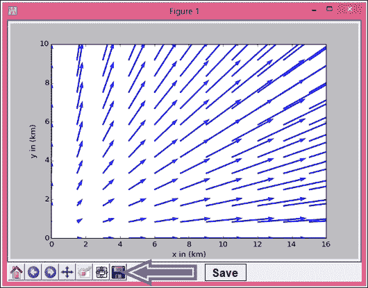
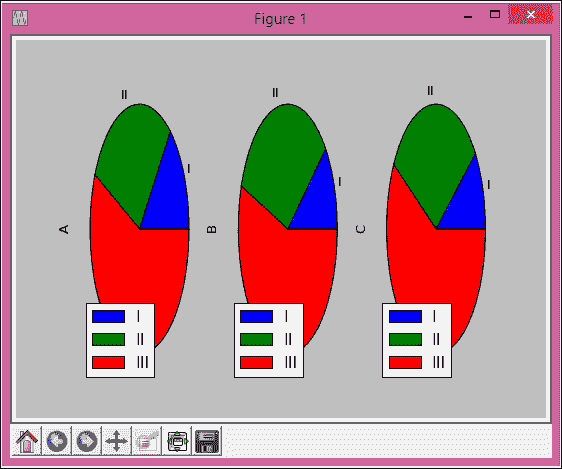
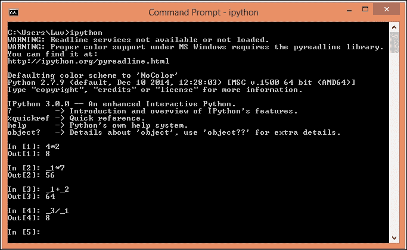
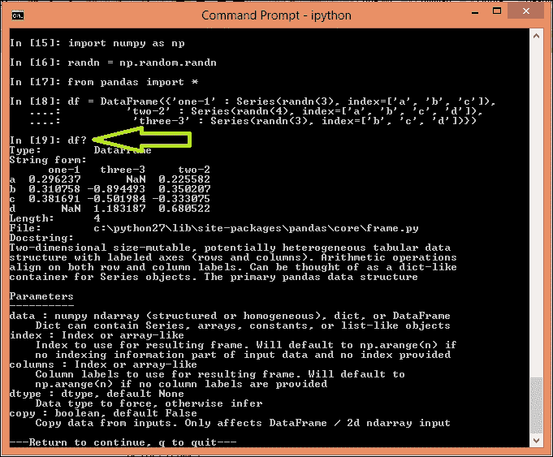
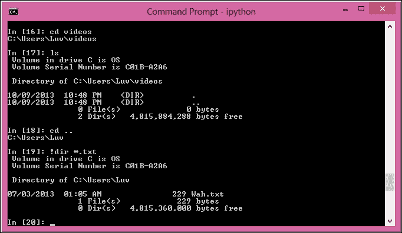
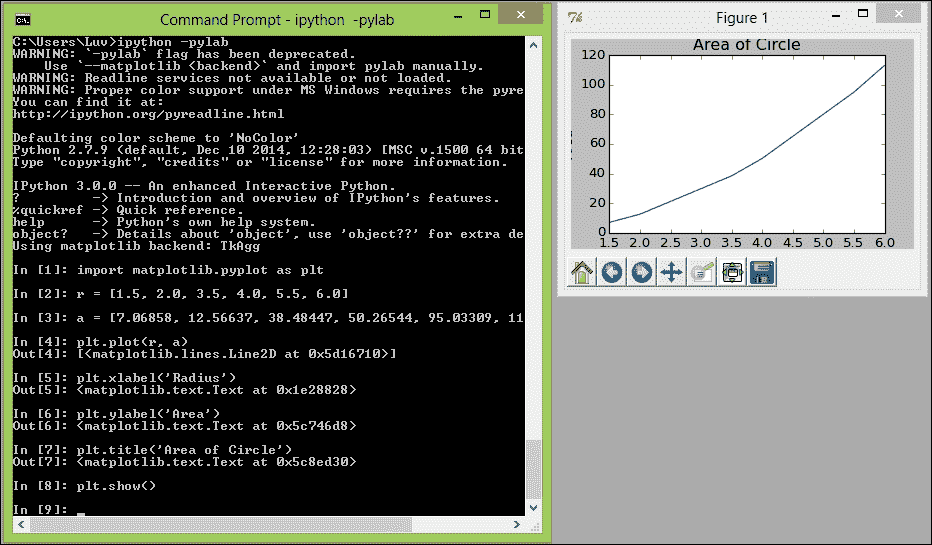
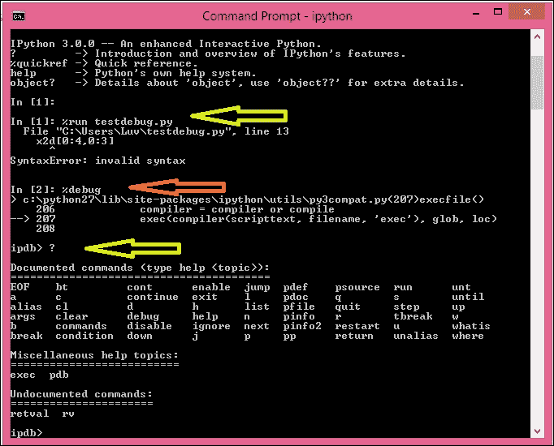
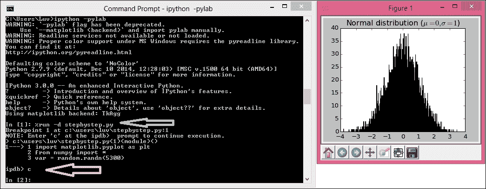
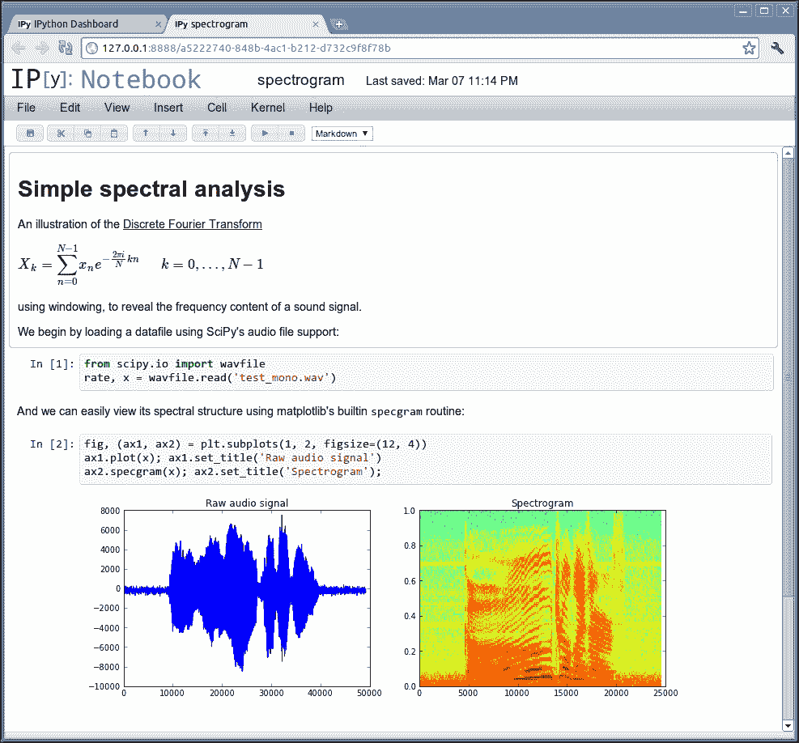

# 七、数据分析和可视化

在本章中，我们将讨论使用 matplotlib、pandas 和 IPython 的数据可视化、绘图和交互式计算的概念。数据可视化是以图形或图片形式呈现数据的过程。这将有助于轻松快速地从数据中理解信息。“标绘”是指以图形的形式表示数据集，以显示两个或多个变量之间的关系。“交互式计算”是指接受用户输入的软件。通常，这些是要由软件处理的命令。接受输入后，软件根据用户输入的命令进行处理。这些概念将伴随着示例程序。

在本章中，我们将涵盖以下主题:

*   使用 matplotlib 绘制相关概念
*   使用示例程序的绘图类型
*   熊猫的基本概念
*   熊猫的结构，使用样本程序
*   使用熊猫进行数据分析活动
*   交互式计算的组件，使用 IPython
*   使用 IPython 的各种组件

pandas 是一个拥有高性能且易于使用的数据结构和数据分析工具的库。它允许用户使用标准和定制的样式绘制各种类型的图。

IPython 是一个用于多种编程语言交互计算的命令外壳。它是专门为 Python 设计的。

# Matplotlib

最流行的处理二维图形和图表绘图的 Python 包是 matplotlib。它以不同类型的图表的形式提供了一种非常快速的数据可视化方式。它还支持将这些地块导出为各种格式。我们将从 matplotlib 的基础和体系结构开始讨论，然后我们将讨论使用示例程序绘制各种类型的图表。

## matplotlib 的架构

最重要的 matplotlib 对象是`Figure`。它包含并管理给定图表/图形的所有元素。matplotlib 已经将图形表示和操作活动从`Figure`到用户界面屏幕或设备的渲染中分离出来。这使得用户能够设计和开发有趣的特性和逻辑，而后端和设备操作仍然非常简单。它支持多个设备的图形渲染，还支持流行的用户界面设计工具包的事件处理。

matplotlib 架构分为三层，即后端、艺术家和脚本。这三层形成一个堆栈，其中每个上层知道与下层的通信方式，但下层不知道上层。后端层是最底层，脚本层是最顶层，艺术家层是中间层。现在让我们从上到下讨论这些层的细节。

### 脚本层(pyplot)

matplotlib 的`pyplot`界面对于科学家和分析师来说非常直观和简单。它简化了分析和可视化的常见任务。`pyplot`界面管理创建图形、轴的活动以及它们与后端的连接。它隐藏了数据结构维护的内部细节来表示图形和轴。

让我们讨论一个演示该层简单性的示例程序:

```py
import matplotlib.pyplot as plt
import numpy as np
var = np.random.randn(5300)
plt.hist(var, 530)
plt.title(r'Normal distribution ($\mu=0, \sigma=1$)')
plt.show()
```

为了将直方图保存在图像文件中，我们可以在显示之前将`plt.savefig('sample_histogram.png')`引号文本作为最后一行添加到前面的代码中。

### 艺术家层

matplotlib 堆栈的这个中间层处理大情节背后的大部分内部活动。这一层的基类是`matplotlib.artist.Artist`。这个对象知道如何使用渲染器在画布上绘制。matplotlib `Figure`上显示的每个对象都是`Artist`的一个实例，包括标题、轴和数据标签、图像、线、条和点。为每个组件创建一个单独的`Artist`实例。

每个实例都有许多与艺术家相关联的属性。第一个属性是变换，它执行艺术家坐标到画布坐标系的转换。下一个属性是可见性。这是艺术家可以画画的地方。图形中的标签也是一个属性，最终属性是一个界面，用于处理通过鼠标单击执行的用户活动。

### 后端层

最底层的层是后端层，它实际实现了多个抽象接口类，即`FigureCanvas`、`Renderer`和`Event`。`FigureCanvas`是玩曲面概念的类，用来画画。`FigureCanvas`与真正的绘画类似，相当于绘画中使用的纸张。`Renderer`扮演绘画组件的角色，在现实绘画中由画笔执行。`Event`类处理键盘和鼠标事件。

该层还支持与用户界面工具包的集成，如 Qt。与这些用户界面工具包集成的抽象基类位于`matplotlib.backend_bases`。为特定用户界面工具包派生的类保存在专用模块中，如`matplotlib.backends.backend_qt4agg`。

为了创建一个图像，后端层有标题、字体和功能，用于将输出存储在不同格式的文件中，包括 PDF、PNG、PS、SVG 等。

`Renderer`类提供了在画布上实际执行绘图的绘图界面。

## 带有 matplotlib 的图形

使用 matplotlib，用户可以绘制各种二维图。本节涵盖一些简单的图和两种特殊类型的图:等高线图和矢量图。以下程序用于在圆的半径和面积上绘制线图:

```py
import matplotlib.pyplot as plt
#radius
r = [1.5, 2.0, 3.5, 4.0, 5.5, 6.0]
#area of circle 
a = [7.06858, 12.56637, 38.48447, 50.26544, 95.03309, 113.09724]
plt.plot(r, a)
plt.xlabel('Radius')
plt.ylabel('Area')
plt.title('Area of Circle')
plt.show()
```

下一个程序是画一个线图，有两条不同的线，代表正弦和余弦线。通常，这些类型的图用于比较。颜色、线条样式和标记有多种选择。绘图方法的第三个参数表示线条颜色、线条样式和标记。第一个字符代表颜色，可以是`b`、`g`、`r`、`c`、`m`、`y`、`k`和`w`中的任意值。这里其他都很明显，`k`代表黑色。第二个及以下字符表示线型，可以取这些值中的任何一个:`-`、`--`、`-..`和`:`。这些符号分别表示实线、虚线、点划线和虚线。最后一个字符表示数据标记为`.`、`x`、`+`、`o`和`*`:

```py
import matplotlib.pyplot as plt
var = arange(0.,100,0.2)
cos_var = cos(var)
sin_var = sin(var)
plt.plot(var,cos_var,'b-*',label='cosine')
plt.plot(var,sin_var,'r-.',label='sine')
plt.legend(loc='upper left')
plt.xlabel('xaxis')
plt.ylabel('yaxis')
plt.show()
```

在图中，我们可以使用`xlim`或`ylim`功能设置 *x* 和 *y* 轴的限制。试着加上`plot.ylim(-2,2)`作为前一个程序的倒数第二行，观察影响。

以下程序用于生成高斯数的直方图。这些数字是使用常规方法生成的:

```py
import matplotlib.pyplot as plt
from numpy.random import normal
sample_gauss = normal(size=530)
plt.hist(sample_gauss, bins=15)
plt.title("Histogram Representing Gaussian Numbers")
plt.xlabel("Value")
plt.ylabel("Frequency")
plt.show()
```

下一个程序将在定义的函数上使用`linspace`方法生成的线性间隔矢量上生成等高线图:

```py
import matplotlib.pyplot as plt
from numpy import *
x = linspace(0,10.5,40)
y = linspace(1,8,30)
(X,Y) = meshgrid(x,y)
func = exp(-((X-2.5)**2 + (Y-4)**2)/4) - exp(-((X-7.5)**2 + (Y-4)**2)/4)
contr = plt.contour(x,y,func)
plt.clabel(contr)
plt.xlabel("x")
plt.ylabel("y")
plt.show()
```

下面的程序生成一个向量图，同样是在使用`linspace`方法生成的线性间隔向量上。如果以后需要以任何形式重用图形元素，我们可以将它们存储在变量中。这显示在以下程序中从底部开始的第二行和第三行，它们将`xlabel`和`ylabel`存储在变量中:

```py
import matplotlib.pyplot as plt
from numpy import *
x = linspace(0,15,11)
y = linspace(0,10,13)
(X,Y) = meshgrid(x,y)
arr1 = 15*X
arr2 = 15*Y
main_plot = plt.quiver(X,Y,arr1,arr2,angles='xy',scale=1000,color='b')
main_plot_key = plt.quiverkey(main_plot,0,15,30,"30 m/s",coordinates='data',color='b')
xl = plt.xlabel("x in (km)")
yl = plt.ylabel("y in (km)")
plt.show()
```

### 输出生成

生成的绘图的输出是图形，可以以不同的格式保存，包括图像、PDF 和 PS。要将输出存储在文件中，我们有两个选项:

*   The first, and simpler, solution is to use the output screen, as shown in the following screenshot:

    

    在输出屏幕上，左下角有很多按钮，其中最右边的按钮可以用来将图形保存在文件中。这将打开一个对话框，告诉您保存文件。将该文件保存在具有所需类型和指定名称的适当文件夹中。

*   第二种方法是使用`plt.show()`方法之前的`plt.savefig`方法将图形保存在文件中。我们也可以使用这个方法指定文件名和文件格式/类型。

以下程序将多个图形存储在不同页面的单个 PDF 文件中。它还演示了将图形保存在 PNG 图像文件中的一些技巧:

```py
from matplotlib.backends.backend_pdf import PdfPages
import matplotlib.pyplot as plt
import matplotlib as mpl
from numpy.random import normal
from numpy import *

# PDF initialization
pdf = mpl.backends.backend_pdf.PdfPages("output.pdf")

# First Plot as first page of the PDF
sample_gauss = normal(size=530)
plt.hist(sample_gauss, bins=15)
plt.xlabel("Value")
plt.ylabel("Frequency")
plt.title("Histogram Representing Gaussian Numbers")
pdf.savefig()
plt.close()

# create second plot and saved on second page of PDF
var = arange(0.,100,0.2)
cos_var = cos(var)
sin_var = sin(var)
plt.legend(loc='upper left')
plt.xlabel('xaxis')
plt.ylabel('yaxis')
plt.plot(var,cos_var,'b-*',label='cosine')
plt.plot(var,sin_var,'r-.',label='sine')
pdf.savefig()
pdf.close()
plt.close()

# output to a PNG file
r = [1.5, 2.0, 3.5, 4.0, 5.5, 6.0]
a = [7.06858, 12.56637, 38.48447, 50.26544, 95.03309, 113.09724]
plt.plot(r, a)
plt.xlabel('Radius')
plt.ylabel('Area')
plt.title('Area of Circle')
plt.savefig("sample_output.png")
plt.show()
```

# 熊猫图书馆

熊猫库拥有支持高性能数据分析任务的工具。这个库对商业和科学应用都很有用。首字母缩略词“熊猫”部分来源于计量经济学术语“面板数据”和 Python 数据分析。数据分析和数据处理的五个典型步骤是加载、准备、操作、建模和分析。

pandas 为 Python 增加了三种新的数据结构，即 Series、DataFrame 和 Panel。这些数据结构是在 NumPy 的基础上开发的。让我们详细讨论这些数据结构。

## 系列

系列是一个一维对象，类似于一个数组、一个列表或表格中的一列。它可以保存任何 Python 数据类型，包括整数、浮点数、字符串和任何 Python 对象。它还为系列中的每个项目分配一个带标签的索引。默认情况下，它会将从 *0* 到 *N* 的标签分配给具有 *N-1* 项的系列。我们可以使用`Series`方法，从一个数组，或者从字典(`dict`)中创建一个序列。理想情况下，我们还应该将指数与序列中的数据一起传递。

让我们在一个示例程序中讨论 Series 数据结构的使用:

```py
import numpy as np
randn = np.random.randn
from pandas import *

s = Series(randn(10), index=['I', 'II', 'III', 'IV', 'V', 'VI', 'VII', 'VIII', 'IX', 'X' ])
s
s.index

Series(randn(10))

d = {'a' : 0., 'e' : 1., 'i' : 2.}
Series(d)
Series(d, index=['e', 'i', 'o', 'a'])

#Series creation using scalar value 
Series(6., index=['a', 'e', 'i', 'o', 'u', 'y'])
Series([10, 20, 30, 40], index=['a', 'e', 'i', 'o'])
Series({'a': 10, 'e': 20, 'i': 30})

s.get('VI')

# name attribute can be specified
s = Series(np.random.randn(5), name='RandomSeries')
```

## 数据帧

熊猫的二维数据结构被称为**数据帧**。数据框是由行和列组成的数据结构，类似于数据库表或电子表格。

与系列类似，数据框也接受各种输入，例如:

*   一维数组、列表、序列和`dict`的字典。
*   二维数组
*   结构/记录的标准
*   系列或数据帧

虽然索引和列参数是可选的，但最好通过参数。索引可以称为行标签，列可以称为列标签。以下程序首先从`dict`创建数据帧。如果没有传递列名，则意味着列名是排序后的键值。

在此之后，程序还从 ndarrays/list 的`dict`创建一个数据帧。最后，它从结构或记录的数组中创建数据帧:

```py
import numpy as np
randn = np.random.randn
from pandas import *

#From Dict of Series/ dicts
d = {'first' : Series([10., 20., 30.], index=['I', 'II', 'III']),
     'second' : Series([10., 20., 30., 40.], index=['I', 'II', 'III', 'IV'])}
DataFrame(d, index=['IV', 'II', 'I'])

DataFrame(d, index=['IV', 'II', 'I'], columns=['second', 'third'])
df = DataFrame(d)
df
df.index
df.columns

#dict of ndarray/list
d = {'one' : [10., 20., 30., 40.],
      'two' : [40., 30., 20., 10.]}
DataFrame(d)
DataFrame(d, index=['I', 'II', 'III', 'IV'])

# Array of Structure/ record
data = np.zeros((2,),dtype=[('I', 'i4'),('II', 'f4'),('III', 'a10')])
data[:] = [(10,20.,'Very'),(20,30.,"Good")]

DataFrame(data)
DataFrame(data, index=['first', 'second'])
DataFrame(data, columns=['III', 'I', 'II'])
```

## 面板

面板数据结构对于存储三维数据很有用。该术语源自统计学和计量经济学，其中多维数据包含一段时间内的测量值。一般来说，小组数据包含同一组织或个人在不同时期对多个数据项的观察。

面板有三个主要组件，即项目、主轴和短轴，如下所述:

*   `items` : Items 表示面板内数据框的数据项
*   `major_axis`:表示数据帧的索引(行标签)
*   `minor_axis`:这表示数据帧的列

以下程序演示了创建面板的各种方法:项目选择/索引、挤压和转换为分层索引数据框。该程序的最后两行使用`to_frame`方法将面板转换为数据帧:

```py
import numpy as np
randn = np.random.randn
from pandas import *

# Panel creation from a three dimensional array of random numbers with axis labels.
workpanel = Panel(randn(2, 3, 5), items=['FirstItem', 'SecondItem'],
     major_axis=date_range('1/1/2010', periods=3),
     minor_axis=['A', 'B', 'C', 'D', 'E'])
workpanel

# Panel creation from Dict of DataFrame
data = {'FirstItem' : DataFrame(randn(4, 3)),
       'SecondItem' : DataFrame(randn(4, 2))}
Panel(data)

# orient=minor indicates to use the DataFrame's column as items
Panel.from_dict(data, orient='minor')

df = DataFrame({'x': ['one', 'two', 'three', 'four'],'y': np.random.randn(4)})
df

data = {'firstitem': df, 'seconditem': df}
panel = Panel.from_dict(data, orient='minor')
panel['x']
panel['y']
panel['y'].dtypes

#Select a particular Item
workpanel['FirstItem']

# To rearrange the panel we can use transpose method.
workpanel.transpose(2, 0, 1)

# Fetch a slice at given major_axis label
workpanel.major_xs(workpanel.major_axis[1])

workpanel.minor_axis
# Fetch a slice at given minor_axis label
workpanel.minor_xs('D')

# The dimensionality can be changes using squeeze method.
workpanel.reindex(items=['FirstItem']).squeeze()
workpanel.reindex(items=['FirstItem'],minor=['B']).squeeze()

forconversionpanel = Panel(randn(2, 4, 5), items=['FirstItem', 'SecondItem'],
     major_axis=date_range('1/1/2010', periods=4),
     minor_axis=['A', 'B', 'C', 'D', 'E'])
forconversionpanel.to_frame()
```

## 数据结构之间的共同功能

这些数据结构中有某些通用功能。这些函数对这些数据结构执行相同的操作。数据结构中有一些共同的属性。以下程序演示了熊猫数据结构的常见功能/操作和属性:

```py
import numpy as np
randn = np.random.randn
from pandas import *

index = date_range('1/1/2000', periods=10)

s = Series(randn(10), index=['I', 'II', 'III', 'IV', 'V', 'VI', 'VII', 'VIII', 'IX', 'X' ])

df = DataFrame(randn(10, 4), index=['I', 'II', 'III', 'IV', 'V', 'VI', 'VII', 'VIII', 'IX', 'X' ], columns=['A', 'B', 'C', 'D']) 

workpanel = Panel(randn(2, 3, 5), items=['FirstItem', 'SecondItem'],
     major_axis=date_range('1/1/2010', periods=3),
     minor_axis=['A', 'B', 'C', 'D', 'E'])

series_with100elements = Series(randn(100))

series_with100elements.head()
series_with100elements.tail(3)

series_with100elements[:3]
df[:2]
workpanel[:2]

df.columns = [x.lower() for x in df.columns]
df

# Values property can be used to access the actual value.
s.values
df.values
wp.values
```

有一些功能/属性只能在系列和数据框上执行/使用。该程序演示了这些函数和属性的使用，包括 description、min/max 索引、按标签/实际值排序、对象函数的转换和数据类型属性:

```py
import numpy as np
randn = np.random.randn
from pandas import *

# Describe Function
series = Series(randn(440))
series[20:440] = np.nan
series[10:20]  = 5
series.nunique()
series = Series(randn(1700))
series[::3] = np.nan
series.describe()

frame = DataFrame(randn(1200, 5), columns=['a', 'e', 'i', 'o', 'u'])
frame.ix[::3] = np.nan
frame.describe()

series.describe(percentiles=[.05, .25, .75, .95])
s = Series(['x', 'x', 'y', 'y', 'x', 'x', np.nan, 'u', 'v', 'x'])
s.describe()

frame = DataFrame({'x': ['Y', 'Yes', 'Yes', 'N', 'No', 'No'], 'y': range(6)})
frame.describe()
frame.describe(include=['object'])
frame.describe(include=['number'])
frame.describe(include='all')

# Index min and max value 
s1 = Series(randn(10))
s1
s1.idxmin(), s1.idxmax()

df1 = DataFrame(randn(5,3), columns=['X','Y','Z'])
df1
df1.idxmin(axis=0)
df1.idxmax(axis=1)

df3 = DataFrame([1, 2, 2, 3, np.nan], columns=['X'], index=list('aeiou'))
df3
df3['X'].idxmin()

# sorting by label and sorting by actual values
unsorted_df = df.reindex(index=['a', 'e', 'i', 'o'],
                columns=['X', 'Y', 'Z'])
unsorted_df.sort_index()
unsorted_df.sort_index(ascending=False)
unsorted_df.sort_index(axis=1)

df1 = DataFrame({'X':[5,3,4,4],'Y':[5,7,6,8],'Z':[9,8,7,6]})
df1.sort_index(by='Y')
df1[['X', 'Y', 'Z']].sort_index(by=['X','Y'])

s = Series(['X', 'Y', 'Z', 'XxYy', 'Yxzx', np.nan, 'ZXYX', 'Zoo', 'Yet'])
s[3] = np.nan
s.order()
s.order(na_position='first')

# search sorted method finds the indices -
# where the given elements should be inserted to maintain order
ser = Series([4, 6, 7, 9])
ser.searchsorted([0, 5])
ser.searchsorted([1, 8])
ser.searchsorted([5, 10], side='right')
ser.searchsorted([1, 8], side='left')

s = Series(np.random.permutation(17))
s
s.order()
s.nsmallest(5)
s.nlargest(5)

# we can sort on multiple index 
df1.columns = MultiIndex.from_tuples([('x','X'),('y','Y'),('z','X')])
df1.sort_index(by=('x','X'))

# Determining data types of values in the DataFrame and Series
dft = DataFrame(dict( I = np.random.rand(5),
                      II = 8,
                      III = 'Dummy',
                      IV = Timestamp('19751008'),
                      V = Series([1.6]*5).astype('float32'),
                      VI = True,
                      VII = Series([2]*5,dtype='int8'),
            VIII = False))
dft
dft.dtypes
dft['III'].dtype
dft['II'].dtype

# counts the occurrence of each data type
dft.get_dtype_counts()

df1 = DataFrame(randn(10, 2), columns = ['X', 'Y'], dtype = 'float32')
df1
df1.dtypes

df2 = DataFrame(dict( X = Series(randn(10)),
                      Y = Series(randn(10),dtype='uint8'),
                      Z = Series(np.array(randn(10),dtype='float16')) ))
df2
df2.dtypes

#Object conversion on DataFrame and Series
df3['D'] = '1.'
df3['E'] = '1'
df3.convert_objects(convert_numeric=True).dtypes
# same, but specific dtype conversion
df3['D'] = df3['D'].astype('float16')
df3['E'] = df3['E'].astype('int32')
df3.dtypes

s = Series([datetime(2001,1,1,0,0),
           'foo', 1.0, 1, Timestamp('20010104'),
           '20010105'],dtype='O')
s
s.convert_objects(convert_dates='coerce')
```

执行迭代非常简单，它对所有数据结构的工作方式都是一样的。有一个访问器，用于对序列数据结构执行日期操作。以下程序演示了这些概念:

```py
import numpy as np
randn = np.random.randn
from pandas import *

workpanel = Panel(randn(2, 3, 5), items=['FirstItem', 'SecondItem'],
     major_axis=date_range('1/1/2010', periods=3),
     minor_axis=['A', 'B', 'C', 'D', 'E'])
df = DataFrame({'one-1' : Series(randn(3), index=['a', 'b', 'c']),
                'two-2' : Series(randn(4), index=['a', 'b', 'c', 'd']),
      'three-3' : Series(randn(3), index=['b', 'c', 'd'])})

for columns in df:
     print(columns)

for items, frames in workpanel.iteritems():
     print(items)
     print(frames)

for r_index, rows in df2.iterrows():
       print('%s\n%s' % (r_index, rows))

df2 = DataFrame({'x': [1, 2, 3, 4, 5], 'y': [6, 7, 8, 9, 10]})
print(df2)
print(df2.T)

df2_t = DataFrame(dict((index,vals) for index, vals in df2.iterrows()))
print(df2_t)

df_iter = DataFrame([[1, 2.0, 3]], columns=['x', 'y', 'z'])
row = next(df_iter.iterrows())[1]

print(row['x'].dtype)
print(df_iter['x'].dtype)

for row in df2.itertuples():
    print(row)

# datetime handling using dt accessor 
s = Series(date_range('20150509 01:02:03',periods=5))
s
s.dt.hour
s.dt.second
s.dt.day
s[s.dt.day==2]

# Timezone based translation can be performed very easily
stimezone = s.dt.tz_localize('US/Eastern')
stimezone
stimezone.dt.tz
s.dt.tz_localize('UTC').dt.tz_convert('US/Eastern')

# period
s = Series(period_range('20150509',periods=5,freq='D'))
s
s.dt.year
s.dt.day

# timedelta
s = Series(timedelta_range('1 day 00:00:05',periods=4,freq='s'))
s
s.dt.days
s.dt.seconds
s.dt.components
```

pandas 提供了大量方法来执行描述性统计和聚合函数的计算，例如计数、总和、最小值、最大值、平均值、中值、模式、标准差、方差、偏斜度、峰度、分位数和累积函数。

以下程序演示了这些函数在系列、数据框和面板数据结构中的使用。这些方法有一个名为`skipna`的可选属性名，用于指定是否排除缺失的数据(`NaN`)。默认情况下，这个论点是`True`:

```py
import numpy as np
randn = np.random.randn
from pandas import *

df = DataFrame({'one-1' : Series(randn(3), index=['a', 'b', 'c']),
                'two-2' : Series(randn(4), index=['a', 'b', 'c', 'd']),
      'three-3' : Series(randn(3), index=['b', 'c', 'd'])})
df
df.mean(0)
df.mean(1)
df.mean(0, skipna=False)
df.mean(axis=1, skipna=True)
df.sum(0)
df.sum(axis=1)
df.sum(0, skipna=False)
df.sum(axis=1, skipna=True)

# the NumPy methods excludes missing values
np.mean(df['one-1'])
np.mean(df['one-1'].values)

ser = Series(randn(10))
ser.pct_change(periods=3)

# Percentage change over a given period 
df = DataFrame(randn(8, 4))
df.pct_change(periods=2)

ser1 = Series(randn(530))
ser2 = Series(randn(530))
ser1.cov(ser2)

frame = DataFrame(randn(530, 5), columns=['i', 'ii', 'iii', 'iv', 'v'])
frame.cov()
frame = DataFrame(randn(26, 3), columns=['x', 'y', 'z'])
frame.ix[:8, 'i'] = np.nan
frame.ix[8:12, 'ii'] = np.nan
frame.cov()
frame.cov(min_periods=10)
frame = DataFrame(randn(530, 5), columns=['i', 'ii', 'iii', 'iv', 'v'])
frame.ix[::4] = np.nan

# By pearson (Default) method Standard correlation coefficient
frame['i'].corr(frame['ii'])
# We can specify method Kendall/ spearman
frame['i'].corr(frame['ii'], method='kendall')
frame['i'].corr(frame['ii'], method='spearman')

index = ['i', 'ii', 'iii', 'iv']
columns = ['first', 'second', 'third']
df1 = DataFrame(randn(4, 3), index=index, columns=columns)
df2 = DataFrame(randn(3, 3), index=index[:3], columns=columns)
df1.corrwith(df2)
df2.corrwith(df1, 1)

s = Series(np.random.randn(10), index=list('abcdefghij'))
s['d'] = s['b'] # so there's a tie
s.rank()

df = DataFrame(np.random.randn(8, 5))
df[4] = df[2][:5] # some ties
df
df.rank(1)
```

## 时间序列和日期函数

熊猫有一个时间序列和日期的范围操纵函数，可以用来执行需要计算时间和日期的计算。

有许多组件可以从时间戳数据中访问。以下是所选组件的列表:

*   **年**:日期时间的年份
*   **月**:日期时间的月份
*   **日**:日期时间的天数
*   **小时**:日期时间的小时
*   **分钟**:日期时间的分钟
*   **秒**:日期时间的秒
*   **微秒**:日期时间的微秒
*   **纳秒**:日期时间的纳秒
*   **日期**:返回日期时间
*   **时间**:返回日期时间
*   **日**:一年中的第几天
*   **一年中的第几周**:一年中的第几周
*   **day fweek**:周一=0，周日=6 的一周中的一天
*   **季度**:1-3 月=1、4-6 月=2 的日期季度，以此类推。

这里有一个程序演示了这些功能:

```py
import numpy as np
randn = np.random.randn
from pandas import *
# Date Range creation, 152 hours from 06/03/2015
range_date = date_range('6/3/2015', periods=152, freq='H')
range_date[:5]

# Indexing on the basis of date
ts = Series(randn(len(range_date)), index= range_date)
ts.head()

#change the frequency to 40 Minutes
converted = ts.asfreq('40Min', method='pad')
converted.head()
ts.resample('D', how='mean')
dates = [datetime(2015, 6, 10), datetime(2015, 6, 11), datetime(2015, 6, 12)]
ts = Series(np.random.randn(3), dates)
type(ts.index)
ts

#creation of period index
periods = PeriodIndex([Period('2015-10'), Period('2015-11'),
                       Period('2015-12')])
ts = Series(np.random.randn(3), periods)
type(ts.index)
ts

# Conversion to Timestamp
to_datetime(Series(['Jul 31, 2014', '2015-01-08', None]))
to_datetime(['1995/10/31', '2005.11.30'])
# dayfirst to represent the data starts with day
to_datetime(['01-01-2015 11:30'], dayfirst=True)
to_datetime(['14-03-2007', '03-14-2007'], dayfirst=True)
# Invalid data can be converted to NaT using coerce=True
to_datetime(['2012-07-11', 'xyz'])
to_datetime(['2012-07-11', 'xyz'], coerce=True)

#doesn't works properly on mixed datatypes
to_datetime([1, '1'])
# Epoch timestamp : Integer and float epoch times can be converted to timestamp
# the default using is Nanoseconds that can be changed to seconds/ microseconds
# The base time is 01/01/1970
to_datetime([1449720105, 1449806505, 1449892905,
             1449979305, 1450065705], unit='s')
to_datetime([1349720105100, 1349720105200, 1349720105300,
             1349720105400, 1349720105500 ], unit='ms')
to_datetime([8])
to_datetime([8, 4.41], unit='s')

#Datetime Range 
dates = [datetime(2015, 4, 10), datetime(2015, 4, 11), datetime(2015, 4, 12)]
index = DatetimeIndex(dates)
index = Index(dates)
index = date_range('2010-1-1', periods=1700, freq='M')
index
index = bdate_range('2014-10-1', periods=250)
index

start = datetime(2005, 1, 1)
end = datetime(2015, 1, 1)
range1 = date_range(start, end)
range1
range2 = bdate_range(start, end)
range2
```

日期时间信息也可以用于数据结构中的索引。下面的程序演示了使用日期时间作为索引。它还演示了`DateOffset`对象的使用:

```py
import numpy as np
randn = np.random.randn
from pandas import *
from pandas.tseries.offsets import *

start = datetime(2005, 1, 1)
end = datetime(2015, 1, 1)
rng = date_range(start, end, freq='BM')
ts = Series(randn(len(rng)), index=rng)
ts.index
ts[:8].index
ts[::1].index

# We can directly use the dates and Strings for index 
ts['8/31/2012']
ts[datetime(2012, 07, 11):]
ts['10/08/2005':'12/31/2014']
ts['2012']
ts['2012-7']

dft = DataFrame(randn(50000,1),columns=['X'],index=date_range('20050101',periods=50000,freq='T'))
dft
dft['2005']
# first time of the first month and last time of month in parameter after :
dft['2005-1':'2013-4']
dft['2005-1':'2005-3-31']
# We can specify stop time
dft['2005-1':'2005-3-31 00:00:00']
dft['2005-1-17':'2005-1-17 05:30:00']
#Datetime indexing
dft[datetime(2005, 1, 1):datetime(2005,3,31)]
dft[datetime(2005, 1, 1, 01, 02, 0):datetime(2005, 3, 31, 01, 02, 0)]

#selection of single row using loc
dft.loc['2005-1-17 05:30:00']
# time trucation
ts.truncate(before='1/1/2010', after='12/31/2012')
```

## 处理缺失数据

丢失数据，我们指的是由于任何原因而为空或不存在的数据。一般表示为`Na*`，其中`*`表示单个字符，如`N`表示数字(`NaN`)`T`表示日期时间(`NaT`)。下一个程序演示了 pandas 功能，用于检查丢失的数据，如`isNull`和`notNull`，并使用`fillna`、`dropna`、`loc`、`iloc`和`interpolate`填写丢失的数据。如果我们在`NaN`上执行任何操作，都会导致`NaN`:

```py
import numpy as np
randn = np.random.randn
from pandas import *

df = DataFrame(randn(8, 4), index=['I', 'II', 'III', 'IV', 'VI', 'VII', 'VIII', 'X' ], 
    columns=['A', 'B', 'C', 'D']) 

df['E'] = 'Dummy'
df['F'] = df['A'] > 0.5
df

# Introducing some Missing data by adding new index
df2 = df.reindex(['I', 'II', 'III', 'IV', 'V', 'VI', 'VII', 'VIII', 'IX', 'X'])
df2
df2['A']
#Checking for missing values
isnull(df2['A'])
df2['D'].notnull()

df3 = df.copy()
df3['timestamp'] = Timestamp('20120711')
df3
# Observe the output of timestamp column for missing values as NaT
df3.ix[['I','III','VIII'],['A','timestamp']] = np.nan
df3

s = Series([5,6,7,8,9])
s.loc[0] = None
s

s = Series(["A", "B", "C", "D", "E"])
s.loc[0] = None
s.loc[1] = np.nan
s

# Fillna method to fill the missing value
df2
df2.fillna(0)  # fill all missing value with 0
df2['D'].fillna('missing') # fill particular column missing value with missing

df2.fillna(method='pad')
df2
df2.fillna(method='pad', limit=1)

df2.dropna(axis=0)
df2.dropna(axis=1)

ts
ts.count()
ts[10:30]=None
ts.count()
# interpolate method perform interpolation to fill the missing values
# By default it performs linear interpolation 
ts.interpolate()
ts.interpolate().count()
```

# 输入输出操作

熊猫输入输出 API 是一组返回熊猫对象的读取器函数。使用熊猫捆绑的工具加载数据非常容易。数据从各种类型文件中的记录加载到 pandas 数据结构中，如 **逗号分隔值** ( **CSV** )、Excel、HDF、SQL、JSON、HTML、谷歌大查询、pickle、stats 格式和剪贴板。有几个阅读器功能—每种文件一个功能—即`read_csv`、`read_excel`、`read_hdf`、`read_sql`、`read_json`、`read_html`、`read_stata`、`read_clipboard`和`read_pickle`。加载后，数据准备好进行分析。这包括删除错误条目、规范化、分组、转换和排序。

## 正在处理 CSV 文件

下一个程序演示如何处理 CSV 文件并对其执行各种操作。该程序使用 CSV 格式的图书交叉数据集，从[http://www2.informatik.uni-freiburg.de/~cziegler/BX/](http://www2.informatik.uni-freiburg.de/~cziegler/BX/)下载。它包含三个 CSV 文件(`BX-Books.csv`、`BX-Users.csv`、`BX-Book-Ratings.csv`)。其中包括书籍、用户和用户对书籍的评分的详细信息。有两个传递 CSV 文件名的选项；我们可以将文件放在任意文件夹中并使用完整路径，也可以将文件保留在当前目录中，只传递其名称。以下程序中的文件路径是 Windows 操作系统上的完整路径:

```py
import numpy as np
randn = np.random.randn
from pandas import *

user_columns = ['User-ID', 'Location', 'Age']
users = read_csv('c:\BX-Users.csv', sep=';', names=user_columns)

rating_columns = ['User-ID', 'ISBN', 'Rating']
ratings = read_csv('c:\BX-Book-Ratings.csv', sep=';', names=rating_columns)

book_columns = ['ISBN', 'Book-Title', 'Book-Author', 'Year-Of-Publication', 'Publisher', 'Image-URL-S']
books = read_csv('c:\BX-Books.csv', sep=';', names=book_columns, usecols=range(6))

books
books.dtypes

users.describe()
print books.head(10)
print books.tail(8)
print books[5:10]

users['Location'].head()
print users[['Age', 'Location']].head()

desired_columns = ['User-ID', 'Age'] 
print users[desired_columns].head()

print users[users.Age > 25].head(4)
print users[(users.Age < 50) & (users.Location == 'chicago, illinois, usa')].head(4)

print users.set_index('User-ID').head()
print users.head()

with_new_index = users.set_index('User-ID')
print with_new_index.head()
users.set_index('User_ID', inplace=True)
print users.head()

print users.ix[62]
print users.ix[[1, 100, 200]]
users.reset_index(inplace=True)
print users.head()
```

这里有一个程序，演示了`merge`、`groupby`以及相关操作，如排序、排序、查找最上面的 *n* 值以及在跨书数据集上的聚合:

```py
import numpy as np
randn = np.random.randn
from pandas import *

user_columns = ['User-ID', 'Location', 'Age']
users = read_csv('c:\BX-Users.csv', sep=';', names=user_columns)
rating_columns = ['User-ID', 'ISBN', 'Rating']
ratings = read_csv('c:\BX-Book-Ratings.csv', sep=';', names=rating_columns)

book_columns = ['ISBN', 'Title', 'Book-Author', 'Year-Of-Publication', 'Publisher', 'Image-URL-S']
books = read_csv('c:\BX-Books.csv', sep=';', names=book_columns, usecols=range(6))

# create one merged DataFrame
book_ratings = merge(books, ratings)
users_ratings = merge(book_ratings, users)

most_rated = users_ratings.groupby('Title').size().order(ascending=False)[:25]
print most_rated

users_ratings.Title.value_counts()[:17]

book_stats = users_ratings.groupby('Title').agg({'Rating': [np.size, np.mean]})
print book_stats.head()

# sort by rating average
print book_stats.sort([('Rating', 'mean')], ascending=False).head()

greater_than_100 = book_stats['Rating'].size >= 100
print book_stats[greater_than_100].sort([('Rating', 'mean')], ascending=False)[:15]

top_fifty = users_ratings.groupby('ISBN').size().order(ascending=False)[:50]
```

### 注

以下程序在[https://github . com/gjreda/Greg reda . com/blob/master/content/notebooks/data/city-of-Chicago-sales . CSV 上的 CSV 文件上工作？原始=真](https://github.com/gjreda/gregreda.com/blob/master/content/notebooks/data/city-of-chicago-salaries.csv?raw=true)。

这个程序演示了数据帧的合并和连接操作:

```py
import numpy as np
randn = np.random.randn
from pandas import *

first_frame = DataFrame({'key': range(10), 
                           'left_value': ['A', 'B', 'C', 'D', 'E', 'F', 'G', 'H', 'I', 'J']})
second_frame = DataFrame({'key': range(2, 12), 
                           'right_value': ['L', 'M', 'N', 'O', 'P', 'Q', 'R', 'S', 'T', 'U']})
print first_frame
print second_frame

#Natural Join Operation 
print merge(left_frame, right_frame, on='key', how='inner') 
# Left, Right and Full Outer Join Operation
print merge(left_frame, right_frame, on='key', how='left')
print merge(left_frame, right_frame, on='key', how='right')
print merge(left_frame, right_frame, on='key', how='outer')

concat([left_frame, right_frame])
concat([left_frame, right_frame], axis=1)

headers = ['name', 'title', 'department', 'salary']
chicago_details = read_csv('c:\city-of-chicago-salaries.csv',
                      header=False,
                      names=headers,
                      converters={'salary': lambda x: float(x.replace('$', ''))})
print chicago_detail.head()

dept_group = chicago_details.groupby('department')

print dept_group
print dept_group.count().head(10) 
print dept_group.size().tail(10) 
print dept_group.sum()[10:17] 
print dept_group.mean()[10:17] 
print dept_group.median()[10:17] 

chicago_details.sort('salary', ascending=False, inplace=True)
```

## 即食数据集

有各种各样的数据来源关于经济学和在熊猫项目中使用这些数据的具体模块。我们可以使用`pandas.io.data`和`pandas.io.ga`(谷歌分析)模块从各种互联网来源提取数据，并将其添加到数据框中。目前，它支持以下来源:

*   雅虎！金融
*   谷歌金融
*   圣路易斯联邦储备银行:**美联储经济数据** ( **弗雷德** ) 是一个由来自 80 个来源的 267，000 多个经济时间序列组成的数据库
*   肯尼斯·弗伦奇的数据库
*   世界银行
*   谷歌分析

这里有一个小程序，演示了如何从这些数据源中读取数据:

```py
import pandas.io.data as web
import datetime
f1=web.DataReader("F", 'yahoo', datetime.datetime(2010, 1, 1), datetime.datetime(2011, 12, 31))
f2=web.DataReader("F", 'google', datetime.datetime(2010, 1, 1), datetime.datetime(2011, 12, 31))
f3=web.DataReader("GDP", "fred", datetime.datetime(2010, 1, 1), datetime.datetime(2011, 12, 31))
f1.ix['2010-05-12']
```

### 熊猫在密谋

熊猫数据结构支持包装在`plt.plot()`方法周围的绘图方法，用于在数据结构中绘制数据。默认情况下，它将显示线图，可以通过将名为“种类”的可选属性传递给绘图方法来更改该线图。以下列表包含了`df.plot()`中用于生成不同地块的变化:

*   **条形图** : `df.plot(kind='bar')`
*   **柱状图** : `df.plot(kind='hist')`
*   **方块图** : `df.plot(kind='box')`
*   **区域地块** : `df.plot(kind='area')-`
*   **散射图** : `df.plot(kind='scatter')`
*   **脚迹** : `df.plot(kind='pie')`

这个程序演示了熊猫包装方法的一个简单的绘图例子。程序的输出显示在它后面的屏幕截图中:

```py
from pandas import *
randn = np.random.randn
import matplotlib.pyplot as plt
x1 = np.array( ((1,2,3), (1,4,6), (2,4,8)) )
df = DataFrame(x1, index=['I', 'II', 'III'], columns=['A', 'B', 'C']) 
df = df.cumsum()
df.plot(kind='pie', subplots=True)
plt.figure()
plt.show()
```



# IPython

IPython 的设计和开发旨在提供一个增强的 Python 外壳，使得执行交互式分布式和并行计算成为可能。IPython 还有一套为科学计算构建专用交互环境的工具。它有两个组件来帮助实现 IPython 的目标:

*   增强的交互式 IPython 外壳
*   交互式并行计算的体系结构

在本节中，我们将首先讨论增强交互式 IPython 外壳的组件。我们将在[第 8 章](08.html "Chapter 8. Parallel and Large-scale Scientific Computing")、*并行和大规模科学计算*中介绍交互式并行计算的其他组件。

## IPython 控制台和系统外壳

IPython 提供的界面如下图所示。我们可以对这个控制台应用不同的着色方案；默认着色方案为`NoColor`。我们还有其他选择，如`Linux`和`LightBG`。IPython 的一个重要特性是它是有状态的，因为它维护在控制台上执行的计算的状态。IPython 中任何步骤的输出都存储在`_N`中，其中`N`是输出/结果的数量。当我们进入 IPython 交互式外壳时，它会显示这个增强的交互式 IPython 提供的功能，如下所示:

```py
IPython 3.0.0 -- An enhanced Interactive Python.
?         -> Introduction and overview of IPython's features.
%quickref -> Quick reference.
help      -> Python's own help system.
object?   -> Details about 'object', use 'object??' for extra details.
```

如果我们在 shell 中输入问号(`?`)作为命令，那么它将显示 IPython 特性的详细列表。类似地，`%quickref`将显示大量 IPython 命令的简短引用，`%magic`将显示 IPython 魔法命令的详细信息。



如果我们输入任意一个`objectname?`，那么控制台将显示该对象的所有细节，例如文档字符串、函数和构造函数，如下图所示。我们已经创建了一个名为`df`的数据框对象，并使用`df?`显示了它的细节。



### 操作系统界面

有许多情况需要在操作系统的支持下执行计算。用户可以为常用命令创建新的别名。还支持`ls`等 Unix 命令。用户可以在任何操作命令或 shell 脚本前面加上`!`来执行它。



在 Python shel 中执行的操作系统命令

### 非阻塞绘图

在正常的 Python shell 中，如果我们创建任何一个图，并使用`show()`方法显示它，那么这个图将显示在一个新的屏幕上，这将保持 shell 被阻止，直到用户关闭显示图的屏幕。但是，IPython 有一个名为`–pylab`的标志。如果我们使用`IPython –pylab`命令执行 IPython 外壳，那么从 IPython 外壳打开的绘图窗口将不会阻塞外壳。这显示在下面的截图中——一个绘图窗口在不阻挡外壳的情况下打开，因为 IPython 是用`–pylab`标志执行的:



### 调试

IPython 拥有对程序调试以及错误和异常跟踪的出色支持。脚本执行完毕后，我们可以调用`%debug`启动 Python 调试器(`pdb`)来检查问题。我们可以在这里执行调试活动，因为我们可以打印变量值，执行语句，跟踪特定问题的来源。通常，这避免了使用外部调试器应用。

该截图描述了`%debug`选项:



用户可以通过调用`%run -d programname.py`逐步执行任何程序。这在下面的截图中显示。我们在名为`stepbystep.py`的程序中有一个步骤。在每个断点处，调试器界面要求用户按下 *C* 继续下一步:



## IPython 笔记本电脑

IPython 有一个名为 Notebook 的网络应用。它是为交互式开发和文字计算创作而设计和开发的，其中解释概念、数学方面、实际计算和图形输出的文本可以组合在一起。程序的输入和程序的输出存储在单元格中，如果需要，这些单元格可以就地编辑。

以下截图取自[http://ipython.org/notebook.html](http://ipython.org/notebook.html)，展示了 IPython 的界面:



# 总结

在本章中，我们从讨论 matplotlib 的基本概念和体系结构开始。之后，我们讨论了一些用于生成不同类型地块的示例程序。我们还介绍了将这些图保存在不同格式文件中的方法。然后我们讨论了熊猫在数据分析中的应用。

此外，我们还讨论了大熊猫的数据结构。在深入介绍了数据结构的使用之后，您学习了如何执行各种其他相关的数据分析活动。在最后一部分，我们讨论了使用 IPython 的交互式计算的概念、用途和应用。

在下一章中，我们将全面讨论使用 Python 进行科学计算，其中涉及并行和高性能计算。本章将涵盖并行和高性能计算的基本概念，以及可用的框架和技术。稍后，它将深入介绍 Python 在并行和高性能计算中的应用。