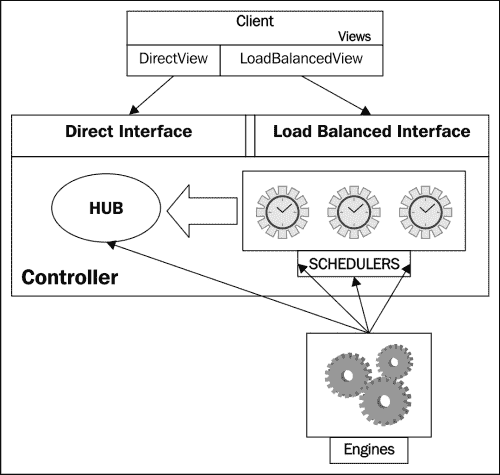
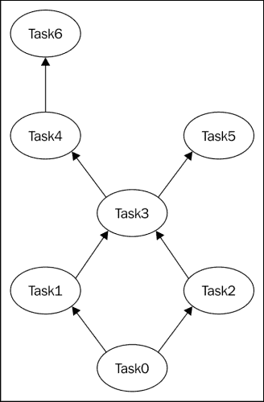
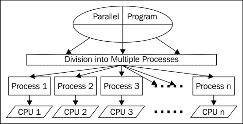
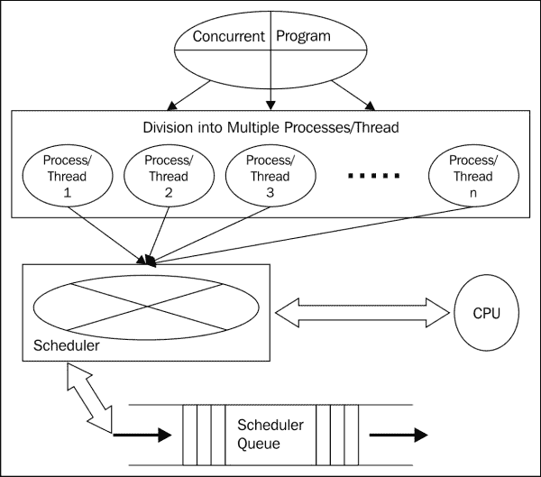
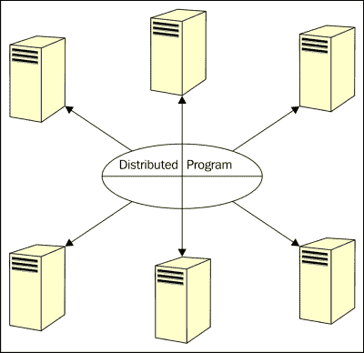

# 八、并行和大规模科学计算

本章讨论了在 Python 中使用并行和大规模计算，或者使用 IPython 解决科学计算问题的重要概念。它涵盖了大规模科学计算和大数据处理的最新趋势。我们将使用示例程序来理解这些概念。

在本章中，我们将涵盖以下主题:

*   IPython 中并行计算的基础
*   IPython 并行计算的组成部分
*   IPython 的任务接口和数据库
*   IPython 的直接接口
*   IPython 并行计算的细节
*   IPython 中的 MPI 程序
*   Python 中使用 Hadoop 和 Spark 的大数据处理

IPython 运行许多不同的进程，使用户能够执行并行计算。这些过程中的第一个是 IPython 引擎，它是一个 Python 解释器，执行用户提交的任务。用户可以运行多个引擎来执行并行计算。第二个过程是 IPython 中枢，它监控引擎和调度器，以跟踪用户任务的状态。集线器进程侦听来自引擎和客户端的注册请求；它持续监控来自调度程序的连接。第三个进程是 IPython 调度程序。这是一组用于在客户端和引擎之间传递命令和结果的进程。通常，调度程序进程运行在运行控制器进程的机器上，并连接到中心进程。最后一个进程是 IPython 客户端，它是 IPython 会话，用于协调引擎执行并行计算。

所有这些进程统称为 IPython 集群。这些进程使用 ZeroMQ 进行相互通信。ZeroMQ 支持各种传输协议，包括 Infiband、IPC、PGM、TCP 等。由集线器和调度器组成的 IPython 控制器监听套接字上客户端的请求。当用户启动引擎时，它会连接到集线器并执行注册。现在，集线器与引擎交换调度器的连接信息。稍后，引擎连接到调度器。这些连接在每台发动机的整个使用寿命中持续存在。每个 IPython 客户端都使用许多套接字连接来连接到控制器。通常，每个调度程序使用一个连接，一个集线器使用三个连接。这些连接在客户的整个生命周期中保持不变。

# 使用 IPython 的并行计算

IPython 允许用户以交互方式执行并行和高性能计算。我们可以使用 IPython 对并行计算的内置支持，它由四个组件组成，使 IPython 适合大多数类型的并行。具体来说，IPython 支持以下类型的并行:

*   **单程序多数据并行** ( **SPMD** ):这是最常见的并行编程风格，是**多指令多数据** ( **MIMD** )的一个子类型。在这个模型中，每个任务执行同一个程序的自己的副本。每个任务处理不同的数据集以获得更好的性能。
*   **多程序、多数据并行**:在**多程序、多数据** ( **MPMD** )风格中，每个任务执行不同的程序，在每个参与计算节点上处理不同的数据集。
*   **使用 MPI** 的消息传递:一个**消息传递接口** ( **MPI** )是消息传递库开发者的规范。它是一个独立于语言的规范，使用户能够编写基于消息传递的并行程序。在其目前的形式中，它支持分布式共享内存模型及其混合模型。
*   **任务并行**:任务并行在计算涉及的不同节点之间分配执行进程。该任务可以是线程、消息传递组件或其他编程模型的组件，如 MapReduce。
*   **数据并行**:数据并行在并行计算涉及的不同节点之间分配数据。数据并行化的主要重点是数据在不同节点间的分布/并行化，这与任务并行化不同。
*   **上述类型的混合并行** : IPython 还支持任何上述风格的混合并行计算风格。
*   **用户定义的并行方法** : IPython 被设计得非常简单和高度灵活，这种设计重点使用户能够将其用于任何新的或用户定义的并行风格。

IPython 以交互方式支持所有类型并行应用的程序开发生命周期的各个阶段，如开发、执行、调试、监控等。

将 matplotlib 与 IPython 结合使用，使用户能够分析和可视化远程或分布式大型数据集。它还使他们能够在集群上开始作业处理，并在本地系统上提取数据进行分析和可视化。用户可以从台式机/笔记本电脑上的 IPython 会话将 MPI 应用推送到高性能计算机上。它还支持在一组 CPU 上运行的不同任务的动态负载平衡。此外，它支持许多简单的方法，允许用户用两行或三行代码交互式地并行化许多简单的应用。用户可以交互地开发、执行、测试和调试定制的并行算法。IPython 使用户能够将在不同计算节点上执行的不同 MPI 作业捆绑到单个、巨大的分布式和/或并行系统中。

# IPython 并行计算的体系结构

IPython 中并行计算的体系结构有三个主要组成部分。这些组件是 IPython 并行包的一部分。IPython 并行计算的体系结构如下图所示:



IPython 并行计算的三个主要组件是**客户端**、**控制器**和**引擎**。**控制器**组件由两个子组件组成: **HUB** 和 **SCHEDULERS** 。它允许客户端通过两个主要接口与引擎交互:直接接口和负载平衡接口。

## 并行计算的组成部分

本小节将讨论与 IPython 并行计算架构相关的各种组件和概念。这些组件是 IPython 引擎、IPython 控制器(集线器和调度器)以及 IPython 客户端和视图。

### IPython 发动机

核心组件执行作为网络请求接收的 Python 命令的实际执行。该引擎是一个普通 Python 解释器的实例，最终它将成为一个完整的 IPython 解释器。用户可以通过启动多个引擎来执行分布式计算和并行计算。用户代码在阻塞模式下在 IPython 引擎中执行。

### IPython 控制器

控制器由一个中枢和一组调度器组成。IPython 控制器是客户端和引擎用于通信的一组进程。它是让引擎执行 Python 进程的用户的联系点。通常，调度程序是在集线器运行的同一台机器上运行的独立进程。在某些特殊情况下，调度程序在远程计算机上运行:

*   **Hub**:Hub 是最重要的组件，它跟踪调度器、客户端以及与引擎的连接。它处理客户端和引擎的所有连接以及整个流量。它还维护所有请求和结果的持久数据库，这些请求和结果将在应用的后续阶段使用。集线器提供了查询集群状态的功能，并隐藏了客户端和引擎之间许多连接的实际细节。
*   **调度器**:提交给引擎处理的 Python 命令通过调度器被定向。调度器还解决了执行用户代码时引擎阻塞的问题。调度器设法对用户隐藏这个问题，并提供对 IPython 引擎集合的完全异步访问。

### IPython 视图和界面

控制器提供两个接口与引擎交互。第一个接口是`Direct`接口，其中引擎被直接寻址用于任务分配。第二个接口是`LoadBalanced`接口，其中任务到引擎的正确分配留给调度器。IPython 的灵活设计使我们能够扩展视图，以实现更复杂的接口方案。

对于控制器的不同连接方式，有一个`view`对象。以下是通过控制器与机器交互的两种模式:

*   `DirectView`类，支持直接寻址。它允许在所有引擎上执行命令。
*   `LoadBalancedView`类以负载平衡的方式代表用户处理任务农业。它允许在任何一个引擎上执行命令，用于执行的引擎由调度程序决定。

### IPython 客户端

客户端是用于连接到群集的对象。在创建客户端对象的过程中，用户可以选择前面讨论的两个视图中的任何一个。一旦创建了客户端，只要作业运行，它就会一直存在。当超时周期结束或用户调用`kill`功能时，它被破坏。

# 执行并行计算的示例

以下程序是使用 IPython 执行并行计算的一个简单示例。它计算单个引擎或所有引擎中并行的集群的功率。在执行该程序之前，建议您根据需要检查`zmq`包是否安装。

要在 IPython 中运行这些程序，首先使用`ipcluster start --n=4 --profile=testprofile`命令启动 IPython 集群。它将在`<userhome>/.ipython/profile_testprofile/security`目录中创建`ipcontroller-engine.json`和`ipcontroller-client.json`文件。当我们通过传递`profile='testprofile'`创建客户端时，这些文件将被搜索。如果我们使用`parallel.Client()`创建客户端，那么它将在`profile_default`文件夹中搜索 JSON 文件。

首先，程序定义了一个计算功率的函数，然后使用测试配置文件创建一个客户端。要在引擎中调用 Python 函数，我们可以使用客户端或视图的`apply`方法。Python `map`函数对序列执行串行计算。在`DirectView`和`LoadBalancedView`中均有`map`函数对序列执行并行计算。我们也可以在阻塞或非阻塞模式下执行这些调用。要设置阻挡模式，我们可以将客户端或视图的`block`属性设置为`true`；默认为`false`:

```py
from IPython import parallel
def pow(a, b):
  return a ** b
clients = parallel.Client(profile='testprofile')
print clients.ids
clients.block = True
clients[0].apply(pow, 2, 4)
clients[:].apply(pow, 2, 4)
map(pow, [2, 3, 4, 5], [2, 3, 4, 5])
view = clients.load_balanced_view()
view.map(pow, [2, 3, 4, 5], [2, 3, 4, 5])
```

## 一个并行的装饰器

在`DirectView`中有一个并行装饰器，创建`parallel`函数。该函数对序列进行操作，并分解元素式操作。随后，它将它们分配给并行计算，最后，它会重建结果。`LoadBalancedView`的装饰器把 Python 函数变成了`parallel`函数:

```py
from IPython import parallel
clients = parallel.Client(profile='testprofile')
lbview = clients.load_balanced_view()
lbview.block = True
serial_computation = map(lambda i:i**5, range(26))
parallel_computation = lbview.map(lambda i: i**5, range(26))
@lbview.parallel()
def func_turned_as_parallel(x):
     return x**8
func_turned_as_parallel.map(range(26))
```

## IPython 的神奇功能

IPython 有许多用户可以作为命令调用的神奇功能。IPython 中有两种类型的魔法命令，即线魔法和细胞魔法。线路魔法功能以`%`为前缀，像操作系统命令一样执行它们的功能。而细胞魔法函数的前缀是`%%`，它们把剩下的一行和后面的一行作为不同的参数。

当用户创建客户端时，这些神奇的功能变得可用。线魔函数的描述如下:

*   `%px`:这可以在选定的引擎上执行单个 Python 命令。用户可以通过设置视图实例的目标属性来选择引擎。
*   `%pxconfig`:即使没有任何活动视图，也可以使用`pxconfig`魔法功能指定`--targets`、`--block`、`–noblock`。
*   `%autopx`:这是并联和非并联模式的切换开关。在第一次调用时，它会将控制台切换到一种模式，在这种模式下，所有键入的命令/函数调用将以并行模式执行，直到用户再次调用`%autopx`。
*   `%pxresult`:在非阻塞模式下，`%px`不返回结果。我们可以看到使用`pxresult`魔法命令的最新命令的结果。

在 cell magic 模式下，`px` ( `%%px` ) magic 接受`--targets`选项指定要使用的目标引擎，`--block`或`--noblock`指定阻塞或非阻塞执行模式。这在我们没有视图实例的情况下特别有用。它还有一个参数`--group-output`，可以管理多个引擎输出的呈现。

下面的程序说明了`px`和`pxresult`作为线魔法和细胞魔法的使用。它还涵盖了`autopx`和`pxconfig`线魔法，并为这些魔法创建了特定的后缀。程序的第二行和第三行在 IPython 会话和所有引擎上执行导入。第二行之后创建的块内的所有导入也将在引擎上执行:

```py
from IPython import parallel
drctview = clients[:]
with drctview.sync_imports():
   import numpy
clients = parallel.Client(profile='testprofile')
drctview.activate()
drctview.block=True
%px dummymatrix = numpy.random.rand(4,4)
%px eigenvalue = numpy.linalg.eigvals(dummymatrix)
drctview['eigenvalue']

%pxconfig --noblock
%autopx
maximum_egnvals = []
for idx in range(50):
    arr = numpy.random.rand(10,10)
    egnvals = numpy.linalg.eigvals(arr)
    maximum_egnvals.append(egnvals[0].real)
%autopx
%pxconfig --block 
%px answer= "The average maximum eigenvalue is: %f"%(sum(maximum_egnvals)/len(maximum_egnvals))
dv['answer']

%%px --block --group-outputs=engine
import numpy as np
arr = np.random.random (4,4)
egnvals = numpy.linalg.eigvals(arr)
print egnvals
egnvals.max()
egnvals.min()

odd_view = clients[1::2]
odd_view.activate("_odd")
%px print "Test Message"
odd_view.block = True
%px print "Test Message"
clients.activate()
%px print "Test Message"
%px_odd print "Test Message"
```

### 激活特定视图

默认情况下，这些魔法函数与一个`DirectView`对象相关联。允许用户通过在任何特定视图上调用`activate()`方法来更改`DirectView`对象。激活视图时，我们可以提到一个新的后缀，如`odd_view.activate("_odd")`中定义的。对于这个观点，我们现在有了一套新的魔法函数以及原来的魔法函数，比如`%px_odd`，它用在前面程序的最后一行。

### 引擎和 QtConsole

`px`神奇功能允许用户将 QtConsole 连接到引擎进行调试。下面的程序片段演示了如何通过绑定引擎内核来监听连接，从而将 QtConsole 连接到引擎:

```py
%px from IPython.parallel import bind_kernel; bind_kernel()
%px %qtconsole
%px %connect_info
```

# IPython 的高级特性

在接下来的小节中，我们将讨论 IPython 的各种高级特性。

## 容错执行

IPython 任务接口将引擎准备为容错和动态负载平衡的集群系统。在任务界面中，用户无权访问引擎。相反，任务分配完全依赖于调度器，这使得界面的设计简单、灵活且强大。

如果任务在 IPython 中由于任何原因失败，那么该任务将被重新排队，并再次尝试执行。如果出现故障，用户可以配置系统进行预定义次数的重试，他们也可以重新提交任务。

如果需要，用户可以显式重新提交任何任务。或者，他们可以设置一个标志，通过设置视图或计划程序的标志，在预定义的次数内重试该任务。

如果用户确定错误的原因不是代码中的错误或问题，那么他们可以将重试标志设置为从 1 到引擎总数的任何整数值。

最大限制等于引擎数量的原因是任务不会被重新提交给失败的引擎。

有两个选项可以设置重新提交次数的标志值。一种是使用`LoadBalancedView`(考虑对象名称为`lbvw`)对象设置值后，设置所有后续任务，如下:

```py
lbvw.retries = 4
```

另一种是使用`with ...temp_flags`为单个块设置值，如下所示:

```py
with lbvw.temp_flags(retries=4):
    lbview.apply(task_tobe_retried)
```

## 动态负载平衡

调度器还可以被配置为基于各种调度策略来执行调度。IPython 支持多种方案，在负载平衡请求的情况下将任务分配给机器。集成定制方案也非常容易。有两种选择方案的方法。一种是设置控制器的`config`对象的`taskSchedulerscheme_name`属性。第二种选择是通过将方案参数传递给`ipcontroller`来选择方案，如下所示:

```py
ipcontroller --scheme=<schemename>
```

这里有一个例子:

```py
ipcontroller --scheme=lru
```

`<schemename>`功能可以是以下任何一种:

*   `lru` : **最近最少使用的** ( **LRU** )是将任务分配给最近最少使用的引擎的方案。
*   `plainrandom`:在这个方案中，调度器随机挑选一个引擎运行任务。
*   `twobin`:该方案使用 NumPy 函数分配任务。它是`plainrandom`和`lru`的组合，因为它随机选择两个引擎，并从这两个引擎中选择最近最少使用的。
*   `leastload`:这个方案是调度器的默认方案。它将任务分配给负载最小的引擎(即剩余任务数最少的引擎)。
*   `weighted`:这个方案是`twobin`方案的变体，因为它随机挑选两个引擎，并将未完成任务的负载或数量分配为权重的倒数。它将任务分配给负载相对较小的发动机。

## 在客户端和引擎之间推拉对象

除了在引擎上调用函数和执行代码，IPython 还允许用户在 IPython 客户端和引擎之间移动 Python 对象。`push`方法将对象从客户端推送到引擎，`pull`方法可用于将任意对象从引擎拉回客户端。在非阻塞模式下，推拉返回`AsyncResult`对象。要在非阻塞模式下显示结果，我们可以如下拉取对象:`rslt = drctview.pull(('a','b','c'))`。我们可以调用`rslt.get()`来显示被拉对象中的值。在某些情况下，对输入数据序列进行分区并将不同的分区推送到不同的引擎是非常有用的。这种划分实现为`scatter`和`gather`功能，类似于 MPI。`scatter`操作用于将分区序列从客户端(IPython 会话)推送到引擎，而`gather`操作用于将分区从引擎取回客户端。

所有这些功能将在下面的程序中演示。最后，使用`scatter`和`gather`实现两个矩阵的平行点积:

```py
import numpy as np
from IPython import parallel
clients = parallel.Client(profile='testprofile')
drctview = clients[:]
drctview.block = True
drctview.push(dict(a=1.03234,b=3453))
drctview.pull('a')
drctview.pull('b', targets=0)
drctview.pull(('a','b'))
drctview.push(dict(c='speed'))
drctview.pull(('a','b','c'))
drctview.block = False
rslt = drctview.pull(('a','b','c'))
rslt.get()

drctview.scatter('a',range(16))
drctview['a']
drctview.gather('a')

def paralleldot(vw, mat1, mat2):
    vw['mat2'] = mat2
    vw.scatter('mat1', mat1)
    vw.execute('mat3=mat1.dot(mat2)')
    return vw.gather('mat3', block=True)
a = np.matrix('1 2 3; 4 5 6; 7 8 9')
b = np.matrix('4 5 6; 7 8 9; 10 11 12')
paralleldot(drctview, a,b)
```

下面的程序演示了将对象从客户端推送到引擎以及将结果从引擎拉回到客户端的方法。它在所有引擎上执行两个矩阵的点积，最后收集结果。它还使用`allclose()`方法验证所有结果是否相同，如果对象相同，则返回`True`。在以下程序的`execute`命令中，添加了`print mat3`语句，目的是使用`display_outputs()`方法显示所有发动机的标准输出设备的输出:

```py
import numpy as np
from IPython.parallel import Client
ndim = 5
mat1 = np.random.randn(ndim, ndim)
mat2 = np.random.randn(ndim, ndim)
mat3 = np.dot(mat1,mat2)
clnt = Client(profile='testprofile')
clnt.ids
dvw = clnt[:]
dvw.execute('import numpy as np', block=True)
dvw.push(dict(a=mat1, b=mat2), block=True)
rslt = dvw.execute('mat3 = np.dot(a,b); print mat3', block=True)
rslt.display_outputs()
dot_product = dvw.pull('mat3', block=True)
print dot_product
np.allclose(mat3, dot_product[0])
np.allclose(dot_product[0], dot_product[1])
np.allclose(dot_product[1], dot_product[2])
np.allclose(dot_product[2], dot_product[3])
```

## 用于存储请求和结果的数据库支持

IPython 中枢存储关于请求的信息和处理任务的结果，供以后使用。它的默认数据库是 SQLite，目前支持 MongoDB 和一个名为`DictDB`的内存数据库。用户必须配置用于他们的配置文件的数据库。在活动的配置文件文件夹中，有一个名为`ipcontroller_config.py`的文件。这个文件将在我们启动`ipcluster`时创建。该文件有一个`c.HubFactory.db_class`条目；用户应该将其设置到他们选择的数据库中，如下所示:

```py
#dict-based in-memory database named as dictdb
c.HubFactory.db_class = 'IPython.parallel.controller.dictdb.DictDB'
# For MongoDB:
c.HubFactory.db_class = 'IPython.parallel.controller.mongodb.MongoDB'
# For SQLite:
c.HubFactory.db_class = 'IPython.parallel.controller.sqlitedb.SQLiteDB'
```

该属性的默认值为`NoDB`，表示不使用数据库。要获得任何已执行任务的结果，用户可以在客户端对象上调用`get_result`函数。客户对象有一个更好的方法叫做`db_query()`来获得更多关于任务结果的见解。该方法是以 MongoDB 查询方式设计的。它从具有精确值的`TaskRecord`关键字列表中获取一个带有关键字的字典查询对象，或者 MongoDB 查询。这些论点遵循`{'operator' : 'argument(s)'}`语法。它还有一个名为`keys`的可选参数。此参数用于指定要检索的键。它返回一个`TaskRecord`字典列表。默认情况下，它检索除请求和结果缓冲区之外的所有键。`msg_id`键将始终包含在响应中，类似于 MongoDB。下表解释了各种任务记录键:

*   `msg_id`:该值为`uuid`(字节)类型。它代表消息标识。
*   `header`:该值为`dict`类型，保存请求头。
*   `content`:该值为`dict`类型，保存一般为空的请求内容。
*   `buffers`:这个值是`list`(字节)类型，它将是一个包含序列化请求对象的缓冲区。
*   `Submitted`:该值为`datetime`类型，保存提交时间戳。
*   `client_uuid`:该值是 uuid(以字节为单位的通用唯一标识符)。
*   `engine_uuid`:该值为保存发动机插座标识的`uuid`(字节)类型。
*   `started`:该值为`datetime`类型，保存某个引擎上任务执行开始的时间。
*   `completed`:该值为`datetime`类型，保存任务在引擎上执行完成的时间。
*   `resubmitted`:该值为`datetime`类型，如果适用，保存任务重新提交的时间。
*   `result_header`:该值为`dict`类型，保存结果的表头。
*   `result_content`:该值为`dict`类型，保存结果的内容。
*   `result_buffers`:这个值是`list`(字节)类型，它将是一个包含序列化结果对象的缓冲区。
*   `queue`:该值为`bytes`类型，代表任务的队列名称。
*   `stdout`:这是一串**标准输出** ( **标准输出**)数据。
*   `stderr`:这是一串**标准误差** ( **标准误差**)数据。

以下程序演示了用于访问结果信息的`db_query()`和`get_result()`方法的概念:

```py
from IPython import parallel
from datetime import datetime, timedelta
clients = parallel.Client(profile='testprofile')
incomplete_task = clients.db_query({'complete' : None}, keys=['msg_id', 'started'])
one_hourago = datetime.now() - timedelta(1./24)
tasks_started_hourago = clients.db_query({'started' : {'$gte' : one_hourago },'client_uuid' : clients.session.session})
tasks_started_hourago_other_client = clients.db_query({'started' : {'$le' : hourago }, 'client_uuid' : {'$ne' : clients.session.session}})
uuids_of_3_n_4 = map(clients._engines.get, (3,4))
headers_of_3_n_4 = clients.db_query({'engine_uuid' : {'$in' : uuids_of_3_n_4 }}, keys='result_header')
```

在`db_query`中支持以下关系运算符作为 MongoDB:

*   `'$in'`:这代表列表/序列中操作的
**   `'$nin'`:这表示列表/序列上的操作中没有**   `'$eq'`:这个用来表示*等于* ( `==`)*   `'$ne'`:这是用来表示*不等于* ( `!=`)*   `'$gt'`:这个用来表示*大于* ( `>`)*   `'$gte'`:表示*大于等于* ( `>=`)*   `'$lt'`:这是用来表示*小于* ( `<`)*   `'$lte'`:用于表示*小于等于* *到* ( `<=`)**

 **## 在 IPython 中使用 MPI

通常，在多个引擎上运行的并行算法需要在引擎之间移动数据。我们已经介绍了 IPython 执行这种数据移动的内置方式。但是，这是一个缓慢的操作，因为它不是客户端和引擎之间的直接传输。数据必须通过控制器传输。获得良好性能的更好方法是使用**消息传递接口** ( **MPI** )。IPython 的并行计算对与 MPI 的集成有出色的支持。要将 MPI 与 IPython 并行计算结合使用，我们需要安装一个 MPI 实现，如`OpenMPI`或`MPICH2` / `MPICH`和`mpi4py` python 包。安装后，测试系统是否能够执行`mpiexec`或`mpirun`命令。

测试安装之后，在实际运行 MPI 程序之前，用户需要使用以下命令创建 MPI 执行的配置文件:

```py
ipython profile create --parallel --profile=mpi
```

轮廓创建后，在`profile_mpi`文件夹的`ipcluster_config.py`中添加以下线条:

```py
c.IPClusterEngines.engine_launcher_class = 'MPIEngineSetLauncher'
```

现在，系统准备在 IPython 上执行基于 MPI 的程序。用户可以使用以下命令启动群集:

```py
ipcluster start -n 4 --profile=mpi
```

前面的命令启动 IPython 控制器，并使用`mpiexec`启动四个引擎。

下面的程序定义了一个计算分布式数组总和的函数。将文件名保存为`parallelsum.py`，因为这个名称将在下一个程序中使用，该程序实际上调用了这个函数:

```py
from mpi4py import MPI
import numpy as np

def parallelsum(arr):
    localsum = np.sum(arr)
    receiveBuffer = np.array(0.0,'d')
    MPI.COMM_WORLD.Allreduce([localsum, MPI.DOUBLE],
        [receiveBuffer, MPI.DOUBLE],
        op=MPI.SUM)
    return receiveBuffer
```

现在调用前面程序中定义的函数，以便在多个引擎上执行它。这样做是为了对数组执行并行求和:

```py
from IPython.parallel import Client
clients = Client(profile='mpi')

drctview = clients[:]
drctview.activate() 
#execute the program name passed as argument
drctview.run(parallelsum.py.py')
drctview.scatter('arr',np.arange(20,dtype='float'))
drctview['arr']
# calling of the function
%px sum_of_array = parallelsum(arr)
drctview['sum_of_array']
```

## 管理任务之间的依赖关系

它对管理各种任务之间的依赖关系有很强的支持。在大多数科学和商业应用中，只有负载平衡方案不足以管理其复杂性。这些应用需要多个任务之间的依赖性。这些依赖关系描述了特定的软件、Python 模块、操作系统或硬件需求；序列；计时；和任务集合中任务的执行位置。IPython 支持两种依赖，即函数依赖和图依赖。

### 功能依赖

功能相关性用于确定特定引擎是否能够运行任务。这个概念是使用来自`IPython.parallel.error`的特殊异常`UnmetDependency`实现的。如果任务因`UnmetDependency`异常而失败，调度程序不会将此错误传播给客户端。相反，它会处理这个错误，并将这个任务提交给其他引擎。调度程序重复这个过程，直到找到合适的引擎。此外，调度程序不会两次向引擎提交任务。

#### 功能依赖的装饰者

虽然允许用户手动引发`UnmetDependency`异常，但是 IPython 提供了两个装饰器来管理这个依赖问题。有两个装饰器和一个用于函数依赖的类:

*   `@require`: This decorator manages the dependency of a task that requires that a particular Python module, local function, or local object be available on an engine when the decorated function is called. Functions will be pushed to the engine with their names, and objects can be passed using the `arg` keyword. We can pass the names of all the Python modules required to execute this task. Using this decorator, a user can define a function to be executed on only those engines where the module names passed to this decorator are available and importable.

    例如，下面代码片段中定义的函数依赖于 NumPy 和 pandas 模块，因为它使用 NumPy 中的`randn`和 pandas 中的`Series`。如果对于某个任务，我们调用这个函数，那么它将在这两个模块可导入的机器上执行。调用此函数时，将导入 NumPy 和 pandas。

    ```py
    from IPython.parallel import depend, require
    # the following function uses randn and Series
    @require('pandas', 'numpy')
    def func_uses_functions_from_numpy_pandas():
      return performactivity()
    ```

*   `@depend`: This decorator allows users to define a function that has a dependency on some other function. It determines whether the dependency is met or not. Before starting the task, the dependency function will be called, and if this function returns `true`, then the actual processing of the task will be started. Moreover, if this dependency function returns `false`, then the dependency is considered to be unmet and the task is propagated to some other engine.

    例如，下面的代码片段首先创建一个依赖函数，用于验证引擎的操作系统是否与给定的操作系统匹配。这是因为用户希望编写两个不同的函数来执行 Linux 和 Windows 操作系统上的特定活动:

    ```py
    from IPython.parallel import depend, require
    def find_operating_system(plat):
        import sys
        return sys.platform.startswith(plat)
    @depend(find_operating_system, 'linux')
    def linux_specific_task():
        perform_activity_on_linux()
    @depend(platform_specific, 'win')
    def linux_specific_windows():
        perform_activity_on_windows()
    ```

### 图形相关性

还有另一类重要的依赖关系，任务之间相互依赖，任务必须在某些或所有特定任务成功执行后才能执行。另一个依赖关系可能如下:任务必须在满足一组特定依赖关系的目标上执行。通常，用户需要一个选项来指定运行给定任务的时间和位置，作为时间、位置和其他任务结果的函数。有一个单独的名为`Dependency`的类来管理图形依赖关系，`Dependency`是类`Set`的子类。它包含一组与任务相对应的消息标识，并且它还具有一些属性。这些属性有助于检查是否满足指定的依赖关系:

*   `any|all`:这些属性指定是否完成或满足任何指定的依赖关系。这将通过设置默认为`True`的所有依赖属性来指定。
*   `success`:该属性默认为`True`，用于指定如果指定任务成功，则认为满足依赖关系。
*   `failure`:该属性默认为`False`，用于指定如果指定任务失败，则认为满足依赖关系。
*   `after`:该属性用于指定依赖任务在执行指定任务后执行。
*   `follow`:`follow`属性指定从属任务应与其中一个从属任务在同一目的地执行。
*   `timeout`:该属性用于指定调度程序必须等待依赖项满足的持续时间。默认为`0`，表示从属任务将永远等待。超时后，从属任务失败，出现`DependencyTimeout`异常。

有些任务可以作为清理任务。它们应该只在指定任务失败时运行。用户应使用`failure=True,success=False`进行此类任务。对于某些依赖任务，需要依赖任务成功完成。在这种情况下，用户必须设置`success=True`和`failure=False`。在某些情况下，用户希望独立于依赖任务的成功或失败来执行依赖任务。在这种情况下，用户必须使用`success=failure=True`。

### 不可能的依赖

可能有些依赖是不可能满足的。如果调度程序没有处理这种可能性，那么调度程序可能会一直等待依赖性得到满足。为了应对这种情况，调度程序会分析图的依赖关系，以估计满足依赖关系的可能性。如果调度程序能够识别出某个任务的依赖性无法满足，那么该任务将失败并出现`ImpossibleDependency`错误。下面的代码片段演示了任务之间的图形依赖关系的使用:

```py
from IPython.parallel import *
clients = ipp.Client(profile='testprofile')
lbview = clients.load_balanced_view()

task_fail = lbview.apply_async(lambda : 1/0)
task_success = lbview.apply_async(lambda : 'success')
clients.wait()
print("Fail task executed on %i" % task_fail.engine_id)
print("Success task executed on %i" % task_success.engine_id)

with lbview.temp_flags(after=task_success):
    print(lbview.apply_sync(lambda : 'Perfect'))

with lbview.temp_flags(follow=pl.Dependency([task_fail, task_success], failure=True)):
    lbview.apply_sync(lambda : "impossible")

with lbview.temp_flags(after=Dependency([task_fail, task_success], failure=True, success=False)):
    lbview.apply_sync(lambda : "impossible")

def execute_print_engine(**flags):
    for idx in range(4):
        with lbview.temp_flags(**flags):
            task = lbview.apply_async(lambda : 'Perfect')
            task.get()
            print("Task Executed on %i" % task.engine_id)

execute_print_engine(follow=Dependency([task_fail, task_success], all=False))
execute_print_engine(after=Dependency([task_fail, task_success], all=False))
execute_print_engine(follow=Dependency([task_fail, task_success], all=False, failure=True, success=False))
execute_print_engine(follow=Dependency([task_fail, task_success], all=False, failure=True))
```

### DAG 依赖关系和网络库

一般来说，最好用**有向无环图** ( **DAG** )来表示并行工作流。Python 有一个流行的库，叫做 NetworkX，用于使用图形。该图是节点和有向边的集合。边连接各种节点；每个边都有一个相关的方向。我们可以用这个概念来表示依赖关系。例如，从任务 1 到任务 2 的`edge(task1, task2)`表示任务 2 依赖于任务 1。类似地，`edge(task2, task1)`表示任务 1 依赖于任务 2。这个图不能包含任何循环，这就是为什么它被称为非循环图。

现在考虑下图中描述的六节点 DAG。表示 **Task0** 不依赖任何任务，因此可以立即启动。而**任务 1** 和**任务 2** 依赖于**任务 0** ，因此它们将在**任务 0** 完成后开始。那么**任务 3** 同时依赖于**任务 1** 和**任务 2** ，所以在**任务 1** 和**任务 2** 结束后执行。同样的，**任务 4** 和**任务 5** 将在**任务 3** 结束后执行。**任务 6** 仅依赖于**任务 4** 。因此，它将在**任务 4** 完成执行后启动。



这是一个源代码片段，代表上图中描述的 DAG。在代码中，任务由它们的编号表示；即**任务 0** 用 0 表示，**任务 1** 用 1 表示，以此类推:

```py
import networkx as ntwrkx
import matplotlib.pyplot as plt

demoDAG = ntwrkx.DiGraph()
map(demoDAG.add_node, range(6))
demoDAG.add_edge(0,1)
demoDAG.add_edge(0,2)
demoDAG.add_edge(1,3)
demoDAG.add_edge(2,3)
demoDAG.add_edge(3,4)
demoDAG.add_edge(3,5)
demoDAG.add_edge(4,6)
pos = { 0 : (0,0), 1 : (-1,1), 2 : (1,1), 3 : (0,2), 4 : (-1,3), 5 : (1, 3), 6 : (-1, 4)}
labels={}
labels[0]=r'$0$'
labels[1]=r'$1$'
labels[2]=r'$2$'
labels[3]=r'$3$'
labels[4]=r'$4$'
labels[5]=r'$5$'
labels[6]=r'$6$'

ntwrkx.draw(demoDAG, pos, edge_color='r')
ntwrkx.draw_networkx_labels(demoDAG, pos, labels, font_size=16)
plt.show()
```

以下程序用彩色边和顶点标签创建相同的图表:

```py
import networkx as ntwrkx
import matplotlib.pyplot as plt

demoDAG = ntwrkx.DiGraph()
map(demoDAG.add_node, range(6))

pos = { 0 : (0,0), 1 : (-1,1), 2 : (1,1), 3 : (0,2), 4 : (-1,3), 5 : (1, 3), 6 : (-1, 4)}

ntwrkx.draw(demoDAG, pos)
ntwrkx.draw_networkx_edges(demoDAG,pos,
                       edgelist=[(0,1),(0,2),(1,3),(2, 3),(3, 4)],edge_color='r')
ntwrkx.draw_networkx_edges(demoDAG,pos,
                       edgelist=[(3,5),(4,6)],edge_color='b')

ntwrkx.draw_networkx_nodes(demoDAG,pos,
                       nodelist=[0,1,2,3,4],
                       node_color='r',
                       node_size=500,
                   alpha=0.8)
ntwrkx.draw_networkx_nodes(G,pos,
                       nodelist=[5,6],
                       node_color='b',
                       node_size=500,
                   alpha=0.8)

labels={}
labels[0]=r'$0$'
labels[1]=r'$1$'
labels[2]=r'$2$'
labels[3]=r'$3$'
labels[4]=r'$4$'
labels[5]=r'$5$'
labels[6]=r'$6$'

ntwrkx.draw_networkx_labels(demoDAG, pos, labels, font_size=16)
plt.show() 
```

## 在带有 StarCluster 的 Amazon EC2 集群上使用 IPython

StarCluster 旨在简化在亚马逊**弹性计算云** ( **EC2** )上使用虚拟机集群的过程。它是亚马逊 EC2 上集群计算的开源工具包。除了执行自动集群配置，星簇还提供**亚马逊机器映像** ( **AMIs** )定制支持科学计算和软件开发的工具包和库。这些 AMIs 由 ATLAS、IPython、NumPy、OpenMPI、SciPy 等组成。用户可以在安装了 StarCluster 的机器上使用以下命令检索可用的 AMIs 列表:

```py
starcluster listpublic
```

StarCluster 有一个非常简单直观的界面，用于计算集群的弹性管理和存储管理。安装后，用户必须更新其默认配置文件，以更新 Amazon EC2 帐户的详细信息，包括地址、地区、凭据和公钥/私钥对。

安装和配置完成后，用户可以使用以下命令从本地 IPython 安装中控制 Amazon EC2 集群:

```py
starcluster shell --ipcluster=clusterName
```

如果配置中有任何错误，将通过前面的命令显示。如果配置是正确的，那么这个命令启动 StarCluster 的开发外壳，并在 Amazon EC2 上为远程集群配置一个并行会话。StarCluster 会自动创建一个名为`ipclient`的并行客户端，并以`ipview`的名称查看整个集群。用户可以使用这些变量(`ipclient`和`ipview`)在亚马逊 EC2 集群上运行并行任务。以下代码片段使用`ipclient`显示集群的引擎标识，并使用`ipview`运行一个小的并行任务:

```py
ipclient.ids
result = ipview.map_async(lambda i: i**5, range(26))
print result.get()
```

用户还可以使用带有星簇的 IPython 并行脚本。如果用户希望从本地 IPython 会话在远程 Amazon EC2 集群上运行 IPython 并行脚本，那么他们应该在创建并行客户端的过程中使用一些配置细节，如下所示:

```py
from IPython.parallel import Client
remoteclients = Client('<userhome>/.starcluster/ipcluster/<clustername>-<yourregion>.json',  sshkey='/path/to/cluster/keypair.rsa')
```

具体来说，假设一个集群的名称是`packtcluster`，区域是`us-west-2`，而`keypair`的名称是`packtKey`，存储在`/home/user/.ssh/packtKey.rsa`中。然后，前面的代码将更改为以下内容:

```py
from IPython.parallel import Client
remoteclients = Client('/home/user/.starcluster/ipcluster/packtcluster-us-west-2.json', sshkey='/home/user/.ssh/packtKey.rsa')
```

在这两行代码之后，所有剩余的代码都将在 Amazon EC2 上的远程集群上执行。

# 关于 IPython 安全性的一个注记

在设计 IPython 的体系结构时，已经考虑到了安全问题。基于能力的客户端身份验证模型，以及 SSH 隧道传输的 TCP/IP 通道，管理主要的潜在安全问题，并允许用户在开放网络中使用 IPython 集群。

ZeroMQ 不提供安全性。因此，SSH 隧道是建立安全连接的主要来源。`Client`对象从`ipcontroller-client.json`文件获取与控制器建立连接的信息，然后使用 OpenSSH/Paramiko 创建隧道。

它还使用 HMAC 摘要的概念，使用保护共享机器用户的共享密钥对消息进行签名。有一个处理消息协议的会话对象。此对象使用唯一密钥验证消息的有效性。默认情况下，这个密钥是一个 128 位的伪随机数，类似于`uuid.uuid4()`生成的数字。一般来说，在并行计算过程中，IPython 客户端用于向 IPython 引擎发送 Python 函数、命令和数据，以执行和处理数据。IPython 确保只有客户端负责并能够使用引擎的功能。引擎从启动引擎的用户那里继承能力和权限。

为了防止未经授权的访问，身份验证和密钥相关的信息被编码在 JSON 文件中，客户端使用该文件来访问 IPython 控制器。用户可以通过限制密钥的分发来授予授权人员访问权限。

## 众所周知的并行编程风格

由于计算机硬件和软件的发展，并行程序可以用几种方式来设计、开发和实现。我们可以使用并发、并行或分布式的方式来实现一个程序。通常，前面提到的技术之一用于实现程序，以实现高效执行和提高性能。接下来的小节将讨论这些模型以及与之相关的常见问题。

### 并行编程中的问题

所有这些模型都依赖于程序的不同部分在独立的计算元素(中央处理器和计算节点)上执行的基本概念。通常，这些模型将程序分成多个工作程序，每个工作程序在不同的计算元素上开始执行。尽管有性能上的好处，这种类型的程序执行——使用多个工作人员——在通信中带来了多种复杂性。这个问题叫做**进程间通信** ( **IPC** )。

有几个经典的 IPC 问题需要开发人员注意，即死锁、饥饿和竞争条件:

*   **死锁**:死锁是两个或两个以上的工作者处于无限等待状态，以获取另一个等待工作者所占用的资源的情况。对此有四个充要条件，即互斥、保持等待、不抢占和循环等待。如果在任何程序的执行过程中出现这些情况，则该程序将被阻止，并且无法继续执行:
    *   互斥意味着资源不可共享
    *   我们所说的“等待”是指处于死锁状态的每个工作人员都持有一些资源并请求一些额外的资源
    *   无优先权意味着分配给一个工作者的资源不能被优先分配给另一个工作者
    *   最后，通过循环等待，我们意味着死锁下的工人形成一个链，或循环列表，其中每个工人都在等待列表中下一个工人持有的资源
*   **饥饿**:当多个工人争夺单一资源时，就会出现这种情况。在这种情况下，每个工作人员都被分配了资源分配的优先级。有时，这种优先分配变得不公平，一些工人的执行被拖延了很长时间。假设有两种类型的员工在竞争一种资源:高优先级的员工和低优先级的员工。如果高优先级工作人员不断到来，那么可能会出现这样一种情况，即一些低优先级工作人员为了获得高优先级工作人员释放的资源而经历漫长(无限)的等待。
*   **竞态条件**:当有多个工作人员同时对公共数据执行读和写操作，并且他们执行的操作之间缺乏同步时，就会出现这个问题。例如，假设两个工作人员从数据库中读取一条公共数据，修改其值，然后将该数据写回数据库。如果这些操作没有以良好同步的顺序执行，它们将使数据库处于不一致的状态。

有一些技术可以用来避免这些问题，尽管它们的详细讨论超出了本书的范围。让我们在后续小节中讨论并行计算的类型。

### 并行编程

在并行风格的程序开发中，程序被分成多个工作人员，他们在独立的 CPU 上执行，而不会争夺一个 CPU，如下图所示。这些 CPU 可以是多核计算机的单个处理器，也可以位于不同的计算机上，并使用诸如**消息传递接口** ( **MPI** )等技术进行通信。



### 并发编程

在并发编程中，用户程序的多个工作者在单个 CPU 上执行，或者在比工作者数量更少的 CPU 上执行(如下图所示)。这些工人在中央处理器调度程序的控制下争夺中央处理器。中央处理器调度器使用多种方案将工作人员分配给中央处理器。中央处理器调度方案被用来创建一个工人的排名，工人按照这个排名的顺序得到执行。

这些工作者可以使用多个进程或多个线程来实现。进程和线程同时执行主程序的某些部分。线程和进程的主要区别在于线程比进程消耗更少的内存。因此，螺纹被称为**轻质**。



### 分布式编程

在分布式编程中，程序的工作人员在通过网络连接的不同计算机上执行。这些程序的执行有不同的框架。网络还使用不同的拓扑，在某些情况下，方案数据和流程都可能是分布式的。随着时间的推移，这种并行计算模式变得越来越流行，因为它提供了几个优势，包括低成本、容错、高可扩展性等。在分布式编程中，每个组件都有独立的内存和处理，而在并行编程中，多个处理器/CPU 共享公共内存。



分布式程序执行

### Python 中的多处理

多处理模块支持在多核环境下在多个处理器上独立运行的多个进程的创建和执行。它有两个支持多处理的重要模型；一个基于`Process`类，另一个基于`Pool`类。

该程序使用`Process`类演示多处理:

```py
import multiprocessing as mpcs
import random
import string

output_queue = mpcs.Queue()

def strings_random(len, output_queue):
  generated_string = ''.join(random.choice(string.ascii_lowercase  + string.ascii_uppercase + string.digits)
    for i in range(len))
  output_queue.put(generated_string)

procs = [mpcs.Process(target=strings_random, args=(8, output_queue)) for i in range(7)]

for proc in procs:
  proc.start()

for proc in procs:
  proc.join()

results = [output_queue.get() for pro in procs]
print(results)
```

基于流程的类按照流程完成的顺序返回结果。如果用户需要检索一个有序的结果，他们必须付出额外的努力，如下面的代码所示。为了获得有序的结果，另一个参数被添加到函数中，最后添加到输出中。这表示过程的位置或顺序，最后结果根据参数排序。这个想法在下面的程序中使用`Process`类和输出中的一个位置参数进行了演示:

```py
import multiprocessing as mpcs
import random
import string

output_queue = mpcs.Queue()

def strings_random(len, position, output_queue):
  generated_string = ''.join(random.choice(string.ascii_lowercase  + string.ascii_uppercase + string.digits)
    for i in range(len))
  output_queue.put((position, generated_string))

procs = [mpcs.Process(target=strings_random, args=(5, pos, output)) for pos in range(4)]

for proc in procs:
  proc.start()
for proc in procs:
  proc.join()

results = [output_queue.get() for pro in procs]
results.sort()
results = [rslt[1] for rslt in results]
print(results)
```

`Pool`类提供了用于并行计算的`map`和`apply`方法，并且还支持这些方法的异步版本。`map`和`apply`方法锁定主程序，直到一个过程完成，这个概念可以用来产生特定应用所需的顺序输出。

### Python 中的多线程

Python 的线程模块允许用户创建一个进程的多个线程来执行并发计算。进程的线程与主进程/线程共享相同的数据空间，这使得数据共享和彼此之间的通信变得容易。线程也被称为轻量级进程，因为它们比进程需要更少的内存。

以下程序演示了线程的创建和启动:

```py
import threading
import time
class demoThread (threading.Thread):
  def __init__(self, threadID, name, ctr):
    threading.Thread.__init__(self)
    self.threadID = threadID
    self.name = name
    self.ctr = ctr
  def run(self):
    print "Start of The Thread: " + self.name
    print_time(self.name, self.ctr, 8)
    print "Thread about to Exit:" + self.name

def print_time(threadName, delay, counter):
    while counter:
      time.sleep(delay)
      print "%s: %s" % (threadName, time.ctime(time.time()))
      counter -= 1

thrd1 = demoThread(1, "FirstThread", 4)
thrd2 = demoThread(2, "SecondThread", 5)
thrd1.start()
thrd2.start()
print "Main Thread Exits"
```

这个程序启动两个线程。如果你观察程序的输出，你会注意到没有线程执行的顺序。首先显示`"Main Thread Exits"`字符串，然后是线程名称和`"Thread about to Exit: ThreadName"`的随机序列。

我们可以选择同步这个输出，这样就可以保持线程完成的顺序。下面的程序首先执行第一个线程。然后，在其退出后，第二个线程被执行。最后，主线程退出。通过获取锁来维护线程序列，并且在退出之前释放该锁，以便可以启动第二个线程。主线程对所有线程对象调用`join`方法。该方法阻止主线程完成其他各种线程:

```py
import threading
import time
class demoThread (threading.Thread):
  def __init__(self, threadID, name, ctr):
    threading.Thread.__init__(self)
    self.threadID = threadID
    self.name = name
    self.ctr = ctr
  def run(self):
    print "Start of The Thread: " + self.name
    threadLock.acquire()
    print_time(self.name, self.ctr, 8)
    print "Thread about to Exit:" + self.name
    threadLock.release()

def print_time(threadName, delay, counter):
    while counter:
      time.sleep(delay)
      print "%s: %s" % (threadName, time.ctime(time.time()))
      counter -= 1

threadLock = threading.Lock()
thrds = []

thrd1 = demoThread(1, "FirstThread", 4)
thrd2 = demoThread(2, "SecondThread", 5)
thrd1.start()
thrd2.start()

thrds.append(thrd1)
thrds.append(thrd2)
for thrd in threads:
  thrd.join()

print "Main Thread Exits"
```

## Python 中基于 Hadoop 的 MapReduce

Hadoop 是一个开源框架，用于计算集群中巨大数据集的分布式存储和处理。Hadoop 系统有三个主要组件:用于处理的 MapReduce、 **Hadoop 分布式文件系统** ( **HDFS** )和一个名为 HBase 的大规模数据库，用于存储数据集。HDFS 支持存储非常大的数据集文件。它将用户提交的数据集分布在各个集群节点上。它将数据集分成多个块，并保存关于块和节点的簿记信息。HBase 是一个为支持大规模数据库而设计的数据库，是在 HDFS 之上开发的。它是一个开源的、面向列的、非关系的分布式数据库。

MapReduce 是一个框架，旨在对计算集群中的巨大数据集执行分布式处理。Hadoop 是 MapReduce 框架的开源实现。MapReduce 程序由两个主要组件组成:map 和 Reduce。`map`函数用于对输入数据集进行过滤，并将其排序后的输出写入文件系统。稍后，reduce 函数使用该输出来执行总结，最终输出再次写入文件系统。MapReduce 框架遵循 **单程序，多数据** ( **SPMD** )模型，因为它在多个数据集上处理同一个程序。

在 Hadoop 系统中，完整的功能分为许多组件。有两个主节点。一个是作业跟踪器，它跟踪地图并减少从节点的进程，称为任务跟踪器节点。第二个主节点是 namenode，它包含有关哪个分割数据文件块存储在称为 data node 的特定从节点上的信息。为了避免单点故障，用户可以安装辅助名称节点。建议有多个称为任务跟踪器节点/数据节点的从节点来执行实际的映射并减少进程。每个从节点充当任务跟踪器节点和数据节点。MapReduce 应用的性能与从节点的数量成正比。Hadoop 系统还执行自动故障恢复；如果其中一个任务跟踪器节点在运行时出现故障，那么它的责任将自动分配给另一个任务跟踪器，处理将继续进行，不会出现故障。

下面的程序演示了用 Python 开发一个基于 Hadoop 的 MapReduce 程序。它处理常见的爬网数据集。这些数据集包含长期收集的数千兆字节的网络爬行数据。它包含以**【Web ARChive】**(**WARC**)格式存储的网页数据、提取的元数据和提取的文本。这些数据集作为亚马逊公共数据集计划的一部分存储在亚马逊 S3。关于这些数据集的更多信息可在[http://commoncrawl.org/the-data/get-started/](http://commoncrawl.org/the-data/get-started/)找到:

```py
import sys
for line in sys.stdin:
  try:
    line = line.strip()
    # split the line into words
    words = line.split()
    # increase counters  
    if words[0] == "WARC-Target-URI:" :
      uri = words[1].split("/")
      print '%s\t%s' % (uri[0]+"//"+uri[2], 1)
  except Exception:
    print "There is some Error"
```

前面的程序是贴图部分，后面的程序是缩小部分:

```py
from operator import itemgetter
import sys

current_word = None
current_count = 0
word = None

for line in sys.stdin:
    line = line.strip()

    word, count = line.split('\t', 1)

    try:
        count = int(count)
    except ValueError:
        continue

    if current_word == word:
        current_count += count
    else:
        if current_word:
            print '%s\t%s' % (current_word, current_count)
        current_count = count
        current_word = word

if current_word == word:
    print '%s\t%s' % (current_word, current_count)
```

在执行前一个程序之前，用户需要将名为`web-crawl.txt`的输入数据集文件转移到他们的`HDFS home`文件夹中。要执行该程序，用户应该运行以下命令:

```py
#hadoop jar /usr/local/apache/hadoop2/share/hadoop/tools/lib/hadoop-streaming-2.6.0.jar -file /mapper.py    -mapper /mapper.py -file /reducer.py   -reducer /reducer.py -input /sample_crawl_data.txt -output /output
```

## Python 中的火花

Spark 是一个通用的集群计算系统。它支持 Java、Python 和 Scala 的高级 API。这使得并行任务的编写变得容易。它是相对于 Hadoop 基于磁盘的 MapReduce 的两阶段模型而提出和开发的，因为它遵循内存模型，并为某些特定应用提供了最大 100%的性能提升。它非常适合实现机器学习应用/算法。

Spark 需要集群管理和分布式存储系统。它为各种分布式存储提供了一个简单的接口，包括亚马逊 S3、卡珊德拉、HDFS 等等。此外，它支持独立的——也就是说，用于集群管理的 spark 原生集群、Hadoop、纱和 Apache Mesos。

**Spark Python API** 命名为 **PySpark** ，将 Spark 编程模型暴露给 Python。我们可以在使用 PySpark 打开的 Python 外壳中或者通过使用 IPython 会话来开发基于 Spark 的应用。我们也可以先开发程序，然后使用`pyspark`命令运行。

# 总结

在本章中，我们讨论了使用 IPython 的高性能科学计算的概念。我们从并行计算的基本概念开始讨论。在基本概念之后，我们讨论了 IPython 并行计算的详细体系结构。后来，我们讨论了示例并行程序、IPython 魔法函数和并行装饰器的开发。

我们还介绍了 IPython 的高级功能:容错、动态负载平衡、管理任务之间的依赖关系、客户端和引擎之间的对象移动、IPython 数据库支持、使用来自 IPython 的 MPI 以及使用来自 IPython 的 StarCluster 管理 Amazon EC2 集群。然后我们讨论了 Python 中的多处理和多线程。最后，我们介绍了使用 Python 中的 Hadoop 和 Spark 开发分布式应用。

在下一章中，我们将讨论几个使用 Python 工具/API 进行科学计算的真实案例研究。我们将考虑各种基础和高级科学分支的应用。**