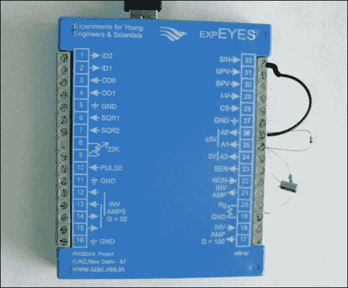
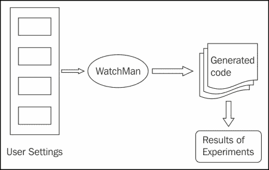

# 九、回顾真实案例研究

本章讨论了科学计算应用、API/库以及用 Python 设计和开发的工具的几个案例研究。

在本章中，我们将讨论在以下科学领域应用 Python 的一些案例研究:

*   专用硬件/软件
*   气象学家的申请
*   设计和建模
*   高能物理的应用
*   计算化学
*   生物科学
*   嵌入式系统

这些应用、工具和库涵盖各种社会、科学和商业领域，包括非政府组织的应用、科学教育的软件或硬件以及气象学家的应用。它们还包括用于飞机概念设计的工具和应用接口，用于地震风险评估的应用，以及用于制造过程能效的应用。除此之外，还包括高能物理的分析代码生成器、计算化学的应用、盲音频触觉映射系统、空中交通控制工具、节能灯的嵌入式系统、海事设计 API 和分子建模工具包。

# 用 Python 开发的科学计算应用

Python 是开发科学应用的流行语言。特别是，它最适合要求低成本的应用和要求高性能的应用。在接下来的小节中，我们将介绍一些以某种形式使用 Python 的应用、工具和产品。

## 每个孩子一台笔记本电脑项目使用 Python 作为用户界面

**每个孩子一台笔记本电脑**(**【OLPC】**)是一个项目，始于 **麻省理工学院** ( **麻省理工学院**)。该项目在软件和硬件开发者的支持下发展壮大，并通过坚实的社区参与来完成 OLPC 的使命。这个项目背后的想法是开发具有创新硬件和软件的低成本教育笔记本电脑。OLPC 的简单而令人信服的使命是为贫困儿童创造教育机会，为他们提供低成本、低功耗的笔记本电脑，其中包含为协作学习设计的软件和应用。此次任务的主要目标是生产和销售一款名为 OLPC XO 的低成本低功耗笔记本电脑。这款 XO 由台湾公司广达电脑制造。与其他计算机不同，XO 使用闪存而不是硬盘和基于 Fedora Linux 的操作系统。它还使用基于 802.11s 无线网状网络协议设计的移动自组网。XO 笔记本电脑如下图所示:

来源:[http://images . flat world knowledge . com/陆乐/陆乐-fig13_004.jpg](http://images.flatworldknowledge.com/lule/lule-fig13_004.jpg)

Sugar 是用设计的免费开源桌面环境，高贵专注于交互学习，是 XO 的交互界面。Sugar 没有桌面、文件夹和窗口的概念。取而代之的是，它从家庭视角开始；在此屏幕上，用户可以选择任何活动。为糖业设计的应用被称为 **活动**。活动包括应用以及共享和协作功能。为了保存应用的状态和历史，Sugar 实现了一个日志，允许用户恢复活动。日志自动存储用户的会话，并提供按日期检索历史记录的界面。每个活动都可以访问日志和其他功能(如剪贴板)的内置界面。Sugar 的活动以全屏模式运行，用户一次只能使用一个程序。

许多平台都提供糖，如下所示:

*   **XO 笔记本电脑**:一台 XO 笔记本电脑运行 Sugar 作为默认界面
*   **现场光盘和现场 u 盘**:糖也可以在现场光盘/u 盘上买到
*   **Linux 发行版的软件包** : Sugar 作为大多数 Linux 平台的软件包提供，作为一个替代桌面
*   **操作系统映像(使用虚拟化)**:用户也可以使用虚拟化在 Windows 或 Macintosh 操作系统上安装 Sugar

Python 语言用于开发 Sugar 和 Sugar 中的各种活动。开发人员可以使用 Python 扩展 Sugar 并添加新的应用/活动。Sugar 的主屏幕如下图所示:

前面截图的来源是[http://2 . BP . blogspot . com/_ PPJgknwAe5o/S _ 8kh 3r 1 qii/aaaaaaaagagk/qmjdlae1pq 8/S 1600/2009-SugarLabs-homeview . png](http://2.bp.blogspot.com/_PPJgknwAe5o/S_8kh3r1qII/AAAAAAAAAGk/qmJdLae1pQ8/s1600/2009-SugarLabs-Homeview.png)。

XO 推出后不久，就获得了社区的大力支持，因为它是免费运行的，是一款开源软件，允许开发者理解和改进软件。XO 拥有高分辨率、易读的屏幕，支持读本模式和多种语言。 XO 笔记本电脑的读书模式如下图所示:

资料来源:[http://regmedia . co . uk/2008/01/16/ebook . jpg](http://regmedia.co.uk/2008/01/16/ebook.jpg)

## expyes–科学之眼

**印度大学间加速器中心**(**【IUAC】**)启动了一个名为 **自制设备物理与创新实验** ( **PHOENIX** )的项目。这个项目背后的想法是通过实验来提高科学教育的质量。项目的主要活动是低成本实验室设备的开发。该倡议下的另一个项目是 **青年工程师和科学家实验**(**experies**)，设计的重点是通过探索学习。ExpEYES 适合高中和更高的班级。设计经过优化，以满足主要目标，即低成本设备。这个设备运行在 5 伏的 USB 电源上。

要使用 ExpEYES，用户可以通过将其连接到计算机的 USB 端口和接口应用来访问它。它有 32 个输入输出端子，排列在两侧，用于连接外部信号。用户可以控制和监控终端的电压。为了测量其他参数，如力、压力、温度等，用户应该使用适当的传感器元件将它们转换成电信号。例如，温度传感器会给出指示温度的电压。下图显示了 ExpEYES:

来源:[http://exp yes . in/sites/default/fiimg/diode-整流器-photo.jpg](http://expeyes.in/sites/default/filimg/diode-rectifier-photo.jpg)

实际学习需要探索和进行实验。物理实验需要控制和测量各种参数，如加速度、电流、力、压力、温度、速度、电压等。许多属性需要自动测量，因为它们的值变化很快(例如，交流电源电压)。这些自动化测量需要计算机的参与。

在任何计算机上运行 ExpEYES 都需要一个 Python 解释器和一个用于访问串口的 Python 模块。设备驱动程序处理 USB 接口；驱动程序将 USB 端口作为 RS232 端口呈现给应用。ExpEYES 的通信部分是通过使用 Python 语言编写的库来处理的。为每个支持的实验开发了一个图形用户界面程序。用户还可以开发 Python 程序进行新的实验。ExpEYES 以实时光盘和 Linux 和 Windows 安装的形式提供。这是一个负担得起的科学实验室，既便携又可扩展。它支持从高中到研究生阶段的广泛实验。

expyes 的最新版本叫做**expyes Junior**。这个版本增加了一些功能，而一些早期的功能已经被删除。它还可以与基于安卓的智能设备接口。下图描述了小 ExpEYES:

来源:[http://exp yes . in/sites/default/file/experiences/Photos/半波. jpg](http://expeyes.in/sites/default/files/Experiments/Photos/half-wave.jpg)

最初的软件是用 C 语言编写的，但很快就改成了 Python。这一变化带来了两大优势。第一个优势是对基于图形用户界面的程序开发的支持大幅增加。另一个优点是，由于 Python 支持硬件交互，这使得新实验的开发变得容易。

## Python 中的一个天气预报应用

一般来说，气象学家将他们的预测与相关时期的实际天气进行比较。这样做的目的是优化和提高他们的模型质量，该模型收集收集实际读数的实际测量的天气信息。**预测观察** 帮助气象学家和其他人比较、交流和理解他们天气预报的准确性。它提供基本的分析和无偏的数据，目的是提高预测的质量。ForecastWatch 始终如一地从各种天气预报来源收集数据，并将这些数据与实际观测数据相吻合。它将每个预测与在美国和加拿大 850 多个地点进行的观测进行比较。在这次比较中，高低温、不透明度、降水和风力预报都得到了验证。ForecastWatch 为数据的准确性生成大量按月统计的度量标准，并按国家、州和特定位置进行汇总。

ForecastWatch 由四个主要组件组成，如下所示:

*   **获取预测的输入流程**:这就是所谓的预测解析器，它从各个预测提供者的门户网站收集预测进行验证。它解析数据并将其插入数据库，以便与实际数据进行比较。
*   **获取实测气候数据的输入过程**:这被称为实际解析器。它从 **国家气候数据中心**检索**国家气象局** 提供的实际数据。这些数据包含高低温、降水和重大天气事件。实际的解析器将这些数据存储在数据库中，并根据实际数据对天气预报进行评分。它也将这些信息存储在数据库中。
*   **数据聚合引擎**:数据采集打分后，由数据聚合引擎进行处理，按照地点、天数、提供者等进行月块、年块的排列。
*   **Web 应用框架**:最初 web 界面是用 PHP 设计的，后来用 Python 重新设计。使用 Python 重新设计简化了 web 开发，并改进了它与系统其他三个组件的集成。一个基于 Python 的网络应用框架**吉诃德** 被用来开发纯基于 Python 的网络应用。

这是一个纯基于 Python 的应用，因为 Python 用于开发所有四个组件，从有趣的 web 界面到耗时的输入/输出绑定数据收集过程和高性能聚合引擎。开发人员选择 Python 是因为它有许多标准库，可用于数据收集、解析和存储在数据库中。多线程库用于在数据收集过程中将数据收集扩展到大量城市。聚合引擎也是用 Python 开发的。它使用名为**MySQL 数据库**到的 Python 数据库库为 MySQL 数据库执行数据库查询，该数据库由输入过程创建，用于存储预测和气候数据。

## Python 中的飞机概念设计工具和 API

在本节中，我们将讨论为支持飞机概念设计而开发的工具和 API。首先，我们将讨论 **VAMPzero** 工具。然后，我们将讨论 **pyACDT** API。

德国航空航天中心(德语缩写为 **DLR** )是德国航空航天、能源和交通研究的国家中心。他们的重点是开展航空航天研究，并为相关研发项目开发软件。DLR 使用 Python 开发软件工具和 API。

VAMPzero 是一款用于飞机概念设计的软件工具；它使德国航天中心能够应对挑战，并在飞机概念设计过程中提供灵活性和透明度。飞机设计的要求经常变化，因为它们使用了新技术。VAMPzero 的灵活流程使用户能够采用这些变化。VAMPzero 基于众所周知的手册方法，具有高度可扩展性。它允许用户追溯计算历史，并以 CPACS 格式导出数据。用 VAMPzero 设计一个新系统包括外部几何形状，以及发动机、结构、系统和成本。VAMPzero 是第一个为飞机概念设计制作的开源工具，支持在多学科环境中工作。VAMPzero 的编程是用 Python 完成的。它的开发目标是拥有一个快速执行飞机设计过程的工具。

在加拿大皇家军事学院**的 **高级飞机设计实验室**有一个科学家开发的框架，叫做 **Python 飞机概念设计工具箱** ( **pyACDT** )。pyACDT 是一个基于 Python 的面向对象框架，用于分析、定义、设计和优化飞机配置。它由几个模块组成，用于表示概念设计阶段所需的每个主要学科分析。该框架使用面向对象编程的概念表示各种飞机部件、发动机部件、特性和学科分析的模型。下图描述了 pyACDT 的各个模块，对应各个学科。框架的设计允许用户轻松改变约束、设计变量、学科分析和目标函数。**

 **

## 打开地震引擎

全球地震模型是区域、国家和国际级别的几个组织和一些个人的合作努力，为全球地震风险的计算和交流制定统一和开放的标准。该基金会是一个公私伙伴关系，成千上万的人以各种可能的方式做出贡献，包括他们的时间和知识。这是为了在各种全球项目中工作，作为软件的用户，通过使用和测试它们，审查项目的结果和参加会议。由于地震的脆弱性与日俱增，而且世界大部分地区仍然缺乏可靠的风险评估工具和数据，创业板所管理的活动至关重要。此外，我们缺乏全球标准来比较各种风险分析方法。为了正确理解地震的后果和行为，人们认为在全球范围内合作更好。创业板的设立就是为了管理这些问题。

创业板基金运作以下主要区域:

*   **地震风险评估工具**:主要重点是设计、开发和增强高质量的地震风险评估工具
*   **地震风险信息** : GEM 还致力于收集和生成地震风险信息数据集和模型的方法和指南
*   **协同风险评估项目**:创业板基金会致力于各种规模的协同风险评估项目的开发和实施
*   **技术转让和能力发展** : GEM 还致力于地震风险评估相关的能力建设和知识转让

在这个大框架下，科学家们正在开发最佳实践，创建通用数据集，并开发地震危害和风险评估模型。GEM 基金会正在将所有这些贡献整合到一个基于网络的 OpenQuake 工具包中。该工具包可供全球利益相关者使用。OpenQuake 引擎是用 Python 语言开发的，被工程师、金融专家、政府官员和科学家用来执行地震危害和风险评估。

OpenQuake 是一个基于网络的风险评估工具包，它提供了一个单一的集成环境来计算、可视化和调查地震风险；获取新数据；分享协作学习的发现。

OpenQuake 引擎使用五个主要计算器在地震风险评估和缓解的不同领域工作。这些计算器的简要说明如下:

*   **情景风险计算器**:这个计算器对于提高社会对地震风险的认识以及正确的应急计划和管理非常有用。它用于计算给定资产组的单一地震场景的损失和损失统计。
*   **情景损害评估计算器**:这个计算器对于评估研究中的各种资产的地震易损性是有用的。它支持从资产集合中估计对特定资产造成的损害。
*   **基于概率事件的风险计算器**:这个计算器对于计算资产集合的累计预期损失非常有用。它能够使用概率风险计算给定资产集合的损失概率和损失统计。
*   **基于经典 PSHA 的风险计算器**:该计算器的输出可用于对不同位置的各种资产的风险缓解工作进行优先排序。该计算器计算单一资产的损失概率和损失统计。此外，对几个地点的不同资产的这些计算可用于在资产之间进行比较风险评估。
*   **收益-成本比率计算器**:这个计算器对于确定需要加强活动的各个区域的优先次序和确定经济上适合给定区域的抗震设计是有用的。它计算并发现对一组特定的建筑采用改造或加固措施是否有经济效益。

## 短信 Siemag AG 应用节能

SMS Siemag AG 是冶金工厂和轧机技术的市场领导者。该公司正在与他们的客户合作，以提高他们铸造厂的能源效率及其对环境的影响。公司将这一操作命名为生态模式。在这种模式下，在特定时间，生产不需要的设备会自动关闭或切换到省电模式。这个自动过程由基于 Python 的软件控制。这个基于 Python 的应用用于测量和记录各种消费者的功耗。通过这种方式，它对不同运行模式下的各种发电机组的功耗进行记录和评估。

## 用于高能物理数据分析的自动代码生成器

**大型强子对撞机**(**【LHC】**)是世界上最大的人造机器，旨在进行粒子物理实验。这些实验的主要目的是证实粒子物理的理论和发现新的粒子。这开启了另一个 **高能物理** ( **HEP** )的时代。

这是有史以来最大的科学实验。以下是一些事实:

*   近 100 个国家参与其中
*   大约 500 个研究所正在合作
*   大约有 10，000 人正在进行实验/从实验中受益
*   该项目的成本约为 40 亿欧元
*   LHC 隧道全长 27 公里

这台巨大的机器产生 10pb/年规模的大量数据。不可能在一个站点存储和管理这么多数据。为了解决这个问题，欧洲核子研究中心与世界上几乎所有的 HEP 机构合作开发了一个网格计算环境。这个网格是一个大规模的并行处理系统，有一个机构网络，共享存储空间和处理能力。为了获得更好的性能，分析作业透明地在具有要分析的数据的系统上执行。

在 LHC 隧道中，两个质子束循环流动。它们每 25 纳秒在四个实验点碰撞一次。由于这些碰撞，产生了许多粒子。其中一些产生的粒子是众所周知的，预计其他一些可能是新的和未知的。

为了从碰撞数据中正确提取信息，物理学家必须为他们感兴趣的每个物理特征编写代码。只有当一次处理一个签名时，该代码才会有效。然而，他们需要编写许多这样的分析代码来扫描所有可能的新物理特征。所有这些代码大多相似，都是通过复制公共代码创建的；一般来说，这种常见的代码可能是*易错的*，因为有很多代码需要调试和维护。

为了解决这个问题，欧洲核子研究中心的科学家们为 HEP 社区提出了一个新的想法——用 Python 开发一个计算机辅助软件工程包，该包处理常见的代码和算法，并自动生成分析代码。由于该代码是从用户输入中自动生成的，因此它被证明更高效且不易出错。它使物理学家能够适当地处理物理部分，因为分析代码是自动生成的。这个包裹名叫`WatchMan`。WatchMan 是一个完全用 Python 开发的面向对象框架。它允许物理学家专注于他们的想法，而不用担心分析代码，因为它从用户设置中构建完整的分析代码。它是使用欧洲核子研究中心用 Python 开发的两个工具开发的:PyROOT(用于数据分析的 Python 工具箱)和 rootcint(Python 和 C++绑定系统)。WatchMan 的流程如下图所示:

## 用于计算化学应用的 Python

阿斯利康，一家知名的制药公司，为癌症、心血管疾病、胃肠和其他感染、疼痛控制和其他疾病提供有效的药物。一般来说，发现一种新药需要很长时间(通常是几十年)。最大的挑战是尽早从大量可能产生好药物的分子中找出可能的候选分子。

有几种技术可以预测分子的性质和行为。这些技术是由计算化学家开发的，用于确保特定的分子不会对身体有毒，并且能够保持稳定，能够执行所需的活动，最终会自动消除。

这些技术的问题是它们的结果本身是不够的，化学家必须进行实际的实验。这些分子必须在实验室进行测试，以观察它们的行为和反应。为了节省时间，各种计算模型被用来列出要测试的好候选人。

在阿斯利康加强药物鉴定过程之前，实验化学家和计算化学家在药物鉴定方面相互依赖。由于实验化学家不太接触计算技术，计算化学家应该帮助他们运行计算机预测，这是一个复杂的过程。这种依赖性正在影响计算化学家和实验化学家的进步，因为计算化学家投入时间频繁运行常规模型，而不是开发新的预测技术。如果有某种技术能够使实验化学家进行计算预测，那么它将改进这一过程，使药物预测过程变得更容易和更快。

皮埃尔·布鲁诺使用 Perl 脚本设计了一个成功的基于网络的工具。这个工具使用了一个叫做无人机的分子属性计算器工具。它被阿斯利康采用，以增强其后端工具无人机的可管理性、可扩展性和健壮性。这个新的后端工具被命名为**py 无人机**。

强大的显式错误处理和严格的类型检查在 Python(py 无人机)中实现时增强了无人机的健壮性。最初在测试阶段，py 无人机不断抛出一些由无人机静默执行的异常。开发人员发现，这些异常已经确定了以前没有处理过的几个新的错误案例。添加了错误处理编码的新代码提高了健壮性，因为代码处理了许多新的错误情况。

为了提高 py 无人机的扩展性，增加了一个规则库。该规则库由数据缓存和用于预测函数映射的属性名组成。

规则库的工作方式类似于 Python 字典对象。对于每个请求的属性，它首先查找缓存。如果找到了，那就用。否则，调用关联函数进行计算。

结果将被返回并存储在缓存中以备将来使用。对于新的预测，开发人员将新函数添加到函数表中。这样，py 无人机就能够管理所有现在和未来的预测方法。

# 开发盲音频触觉映射系统的 Python

为视觉残障人士设计的**盲人音频触觉地图系统** ( **BATS** ) 为他们提供了地图。在这个系统发明之前，没有视觉障碍的人可以获得古代世界的地图。该项目始于北卡罗来纳大学的一个小组。选择了 Python，而不是 C++或 Java。这最初是一个艰难的决定，因为团队对 Python 没有太多了解，他们精通 C++和 Java。最终，这个决定是一个明智的决定，因为 Python 拥有大量的库和模块，这些库和模块对于开发这样的应用来说是非常理想的。

BATS 使用古代世界制图中心提供的 ArcView 数据文件。ArcView/ArcGIS 是一款功能齐全的 GIS 软件，用于可视化、管理、创建和分析地理数据。最初，他们为地图的表面类型和高程生成了两个 ASCII 文本文件。该信息准备为 1024 x 768 的网格，与系统中使用的显示器和触摸板的分辨率相匹配。该网格信息被读取并存储在 Python 数组中。数据缩小以适合 BATS 模型。然后将其存储在压缩文件中；程序将这些数据解压缩并加载到适当的数据结构中，以执行快速启动。显示像素与文件中的值一一对应。该系统反应迅速，能及时处理用户的移动。各种音频/视觉效果被用来表示不同区域的运动，例如海洋或陆地。

BATS 由两个主要组件组成，即图形用户界面和数据管理器。数据管理器使用户界面能够管理数据。用户界面有一个触摸板、一个数字键盘和一个语音合成器，用于帮助视力残疾人。触摸板上的用户动作通过 **wxPython** 捕捉。对于用户移动，wxPython 中有鼠标运动事件；这些事件用于触发对各个城市的地表类型和数据库的查询。鼠标和按键事件由 wxPython 处理，产生语音反馈。BATS 也使用微软的语音 API。

wxPython 是跨平台 GUI API，允许 Python 程序员开发具有丰富用户界面和事件处理的基于 GUI 的程序。

数据管理器将各种值存储在三个数字数组和一个到 MS Access 数据库的 ODBC 连接中。这些数组存储高度、土地类型和数据库中的键值。键值用于查询 Access 数据库，该数据库检索与给定位置对应的城市信息。

## 空中交通管制工具

开发通用航空交通控制解决方案需要额外的努力，因为每个机场的特点在各个方面都是独特的，例如设计、法规遵从性和基础设施。空中交通管制系统最重要的组成部分是用户界面定制。

**frequency is**是空中交通管理、公共安全和运输领域的一线解决方案提供商。他们使用 Python 开发他们的 TAPTools 产品系列，该产品系列适用于作为空中交通管制一部分的塔台和机场工具。空中交通管制员使用这些来控制跑道照明和导航辅助仪器，监控导航仪器，并跟踪天气情况。

为每个客户设计一个全新的用户界面是一项乏味且耗时的任务。为了解决这个问题，Frequentis 开发了一个设计用户界面布局的工具，名为 PanView。这个工具可以用来设计和构建一个将由相关软件执行的用户界面，称为 PanMachine。这个软件运行在一个专门设计的硬件上，叫做 **动力面板**。这些工具可以用来轻松开发布局的原型。最初，PanView 和 PanMachine 使用了一种叫做 **Lua** 的脚本语言。Lua 用于连接用户界面和空中交通管制系统的实际功能。

与 Python 相比，使用 Lua 有很多问题。如果出现错误，它提供的信息有限。它没有任何列表数据结构，并且由于标准库有限，很难编写更大的程序。

芬兰民航局希望不仅在 PowerPanel 上，而且在网络浏览器上运行用户界面布局。这个项目强制在 Java 中重新实现 PanMachine，以便在浏览器中执行。由于 Lua 不能在 Java 下运行，所以 Frequentis 将其重新设计为基于 Python 的实现。他们选择了 Python 和 Python 的 Java 实现，叫做 **Jython** 。这将使用户能够在 PowerPanel 和 PanMachine 上运行用户界面布局，它们都是用 Java 实现的。对于 PowerPanel，Python 用 C 实现，Jython 用 Java 实现，用于浏览器。在这一步之后，常客开发人员重新设计了 Python 中的 Lua 布局。与 Lua 布局相比，为布局编写的 Python 代码非常短，因此易于管理。

## 嵌入式系统节能灯

卡玛那科技公司是太阳能发光二极管照明市场的领导者。该公司是一系列可用于不同用途的灯的制造商和供应商，包括机场照明、工业标记、海洋应用、铁路、公路、公交等。该公司最初生产用于海上航行的自给式和自主式太阳能灯。现在，卡玛拿的市场横跨全球，特别是条件极端的地方，如开阔的海洋、沙漠、极北地区等。如今，电灯已经变得如此复杂，以至于它应该满足自主和独立照明等特性。灯周围可用的太阳辐射随天气、季节、灯的位置、太阳能电池板的方向和其他属性而变化。有一些特殊的应用；这些灯还支持可编程接口，根据输入提供不同的输出，通过无线网络连接到集中控制站，适合其他复杂场景。

开发这种灯需要电气、电子、机械和光学设计的完美结合。每个灯都是使用运行在微控制器上的嵌入式软件程序来操作的。这些灯是自主的，因为每个灯都根据模型化的要求保持自身并执行其功能。

通常，嵌入式系统需要高可靠性、低功耗和小尺寸的组件。为了满足这些要求，已经设计了称为微控制器的特殊处理器芯片。这些微处理器以非常低的成本将中央处理器存储器和外围设备结合在一个芯片上。除了写在微处理器只读存储器上的嵌入式功能之外，在开发和维护期间，还有几个功能需要台式机/笔记本电脑系统。

现在，考虑一个例子，其中嵌入式软件在常规系统上编译；然后将目标代码加载到所需的微控制器上。同样，在维护期间，对部署的设备进行故障排除需要额外的硬件，如笔记本电脑，以执行诊断实用程序。Python 提供了许多特性来执行嵌入式系统开发的实际和支持活动。这些特性包括 Python 程序的紧凑性、自动化内存管理、Python 简单而强大的面向对象工具等等。

Carmanah 在其嵌入式系统生命周期的几个关键领域采用了 Python。例如，他们使用 Python 程序来控制软件构建过程、压力和单元测试、设备模拟器和其他领域。

# 用 Python 开发的科学计算库

在 Python 中，许多库是为不同的应用领域开发的。这些库是为了构建商业应用和科学应用而开发的。以下小节涵盖了一些选定的科学计算库。

## 一个由 Tribon 开发的海事设计 API

Tribon Solutions 在计算机辅助设计和建模解决方案领域工作。他们的重点是提高海事应用的整体效率。Tribon 软件套件支持船舶建造的整个生命周期。这需要高度并发的进程来处理这些情况。他们为从事船舶设计和建造的人员开发了一个中央存储库和一个单一的信息源。这个模型叫做 T3【产品信息模型】T4(**PIM**)。这些人可能是设计师、材料管理员、制造团队成员、计划员以及参与整个流程的其他人。

一般来说，船的设计是独一无二的；然而，他们的设计者的重点是通过标准化和参数驱动的设计来证明过程，从而降低成本。由于不同的设计原则、政府法规和标准以及供应商的设施和基础设施，该过程主要依赖于供应商。Tribon 处理这个问题是为了让供应商自行开发。Tribon 技术已经创建了一个易于使用、独立于平台、可扩展和可嵌入的 API。

Tribon 之所以选择 Python，是因为它有很多特性，比如产品是可嵌入和可扩展的，没有许可成本，平台无关性。Tribon 的解决方案不会受到 Python 任何更新版本的影响。客户开发的应用是独立于平台的，因此客户可以跨平台移动它们，而没有很多问题和代码变化。这些解决方案将一些零件的设计过程从几周改进到几天，整体质量得到提高。这是因为设计、计算和其他过程正在自动化。他们将这种产品命名为 Tribon Vitesse。

## 分子建模工具包

**分子建模工具包** ( **MMTK** )是一个 Python 库，用于以生物分子系统为重点的分子建模和模拟。这是一个使用 Python 和 C 语言开发的开源库。生物分子模拟比一般需要更长的时间，一般需要几周。这个过程需要复杂的数据结构来描述生物分子。Python 和 C 语言被选为高级解释语言和高性能编译语言。对于复杂和高性能要求的模拟来说，这是一个很好的组合。

之所以选择 Python 而不是 TCL 和 Perl，是因为它具有许多想要的特性，例如与编译语言的集成、库支持、面向对象的编程风格和可读性。

MMTK 库的用户以纯 Python 库的形式访问它，因为用于开发 MMTK 的 C 语言代码完全是以 Python 扩展模块的形式编写的。这段代码只为库的时间和性能关键方面编写。例如，相互作用能量评估是一个时间关键的函数，能量最小化和分子动力学是迭代过程，需要更多的时间来完成；它们需要高性能处理。这些函数是用 C 语言实现的，以避免 Python 语言的开销。另一方面，MMTK 广泛使用数字 Python、LAPACK 和 NetCDF Python 库。MMTK 还支持共享内存并行处理(使用多线程)和分布式内存并行处理(使用 MPI)。

MMTK 的设计目的是使其高度可扩展。无需修改 MMTK 代码来添加算法、能量项和专门的数据类型。对于可视化相关活动，MMTK 依赖外部工具；VMD 和皮摩尔尤其与 MMTK 融为一体。通常，MMTK 用户使用 Python 脚本来访问库。然而，有几个程序使用带有图形用户界面的 MMTK，例如域控制器和 nMOLDYN 程序。

MMTK 由三大类班级组成。最大的类别是用于表示原子和分子的一组类，以及管理分子和片段数据库的类。通用分子类别中有一个单独的子类，用于表示生物分子，如脱氧核糖核酸、蛋白质和核糖核酸。MMTK 的第二个(也是重要的)部分实现了各种模式来计算相互作用能。MMTK 的第三部分处理与输入和输出相关的功能。该代码旨在为一些流行的文件格式和基于 NetCDF 格式的自定义 MMTK 格式执行读写功能。MMTK 的文件可以跨各种平台移植，并且是二进制类型。由于这些文件是二进制文件，因此它们的大小较小，并且允许有效的访问。

## 标准 Python 包

除此之外，还有特定的工具、应用接口和应用可用；您可以访问[http://pypi.python.org](http://pypi.python.org)在线提供的 Python 包索引。它包含数千个用于特定应用的模块(大部分是用 Python 开发的)。这些应用也涵盖了许多科学、商业和计算领域。有生物信息学、医疗保健、地理空间分析、仪器仪表、工程、数学和其他分支的模块。门户网站维护一个包的分类列表。以下列表包含一些从科学和工程领域选择的软件包:

*   `fluiddyn`:研究流体动力学的框架
*   `DeCiDa`:装置和电路数据分析
*   `python-vxi11`:通过以太网控制仪器的 Python VXI-11 驱动程序
*   `pygr`:这个是一个主要面向生物信息学应用的 Python 图形数据库工具包
*   `Brainiac`:这些是人工智能系统中使用的各种组件，完全可以自己使用
*   `pyephem`:这个计算行星和恒星的位置
*   `PyMca`:这是一个 X 射线荧光分析工具包及应用
*   `openallure`:一个语音视觉对话系统
*   `BOTEC`:一个简单的天体物理学和轨道力学模拟器
*   `pyDGS`:基于小波的数字粒度分析
*   `MetagenomeDB`:宏基因组序列和注释的数据库
*   `biofrills`:这些是用于分子序列分析的生物信息学工具
*   `python-bioformat`:读写生命科学文件格式
*   `psychopy_ext`:用于神经科学和心理学实验的快速可复制设计、分析和绘图的框架
*   `Helmholtz`:创建神经科学数据库的框架
*   `pysesa` : PySESA 是一个开源项目，致力于提供一个通用的 Python 框架，用于点云和其他空间和频率域的地理空间数据的空间显式统计分析，供地球科学使用
*   `nitime`:神经科学数据的时间序列分析
*   `SpacePy`:空间科学应用工具
*   `Moss`:神经影像和认知科学的统计工具
*   `cclib`:解析器和计算化学算法
*   `PyQuante`:Python 中的量子化学
*   `phoebe`:恒星、恒星和行星系统的物理学
*   `mcview`:用于高能物理事件模拟的 3D/图形事件查看器
*   `yt`:用于天体物理模拟的分析和可视化工具包
*   `gwpy`:Python 中支持引力波天体物理的包

# 总结

在本章中，我们讨论了使用 Python 语言开发的科学计算应用、库和工具的几个案例研究。我们讨论了 Python 在各个领域的应用，包括专业软件和硬件的设计(如 OLPC 和 ExpEYES)，以及为照明系统设计基于 Python 的嵌入式系统。我们介绍了 Python 在计算化学和分子建模中的一些用途。我们还看到了 Python 在科学和其他领域的计算机辅助建模中的用途。

在下一章中，我们将讨论开发科学计算应用和 API 的最佳实践，特别关注 Python。**