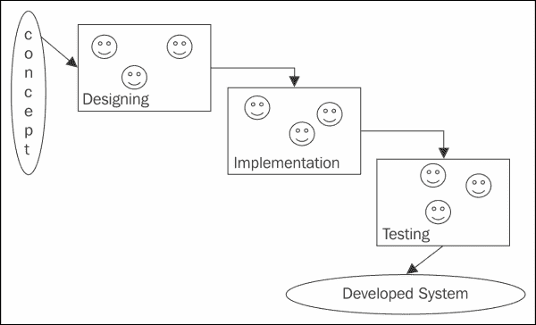
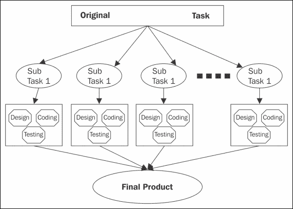
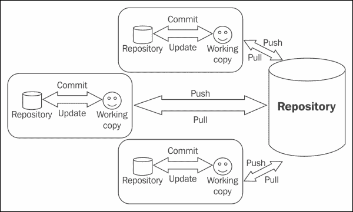
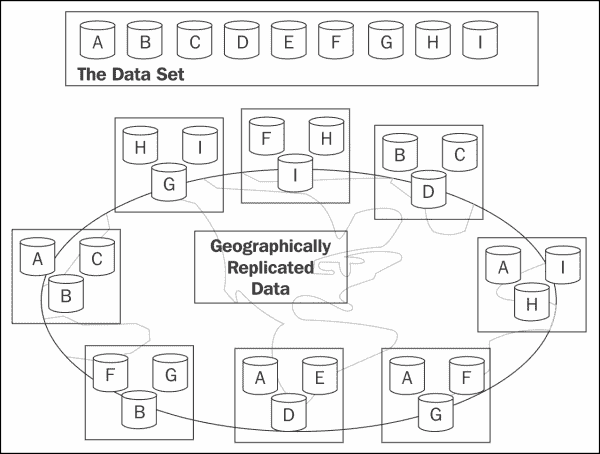

# 十、科学计算的最佳实践

本章讨论科学计算应用、API 和工具的开发人员将采用的最佳实践。最佳实践是通过研究和经验建立的定义明确的流程/陈述。遵循这些实践可以用更少的努力和更少的问题实现预期的结果。

特别是，本章将涵盖以下主题:

*   基于 Python 的设计的最佳实践
*   Python 实现的最佳实践
*   数据管理和应用部署的最佳实践
*   实现高性能的最佳实践
*   隐私和安全的最佳实践
*   维护和支持的最佳实践
*   Python 开发的最佳实践

一般来说，科学家使用计算工具来支持他们的研究，他们中的大多数人不会接受正式的计算机科学培训。这可能会导致他们开发低效的解决方案，并且开发周期可能会更长、更耗时。此外，实现的算法可能不是最优的，开发时间较长，并且代码不符合期望的标准。最佳实践帮助他们解决这些问题。遵循最佳实践让科学家将科学作为软件开发的正确方法来实践，并使他们的代码没有不必要的错误。

有许多科学图书馆/应用/工具包完全由非计算机科学背景的科学家设计和开发。尽管如此，这些最佳实践帮助他们获得更好的结果，并提高开发的效率和整体体验。

最佳实践可以被认为是在软件开发中执行期望任务的可重复的标准方法。

# 设计的最佳实践

本节涵盖了软件开发设计阶段应遵循的最佳实践:

*   **Task division among different teams**: This best practice says that it is better to distribute the activities of the different steps of the development life cycle among different people. This will reduce the burden on one person and achieve better results in less time. It is better to choose one team (maybe one to two members per team) for each of the design, implementation, and testing phases. These teams will work in collaboration with each other, as they have their respective responsibilities to be performed at different times. This is always better than different teams collaborating with each other. This collaboration is depicted in the following figure with common shape in different steps. The designers may support the developer team in programming, and this approach can be considered as pair programming. Similarly, the collaboration of an implementation team and a testing team will result in fixing of future bugs, and ultimately improve the overall performance of the system.

    

*   **将大任务分成一组更小的任务**:与其一次写一个大程序去执行一个大活动，我们更应该喜欢将任务分成更小的子任务。这是一种渐进的方法，通过逐个完成较小的子任务来完成较大的任务。这将改善整体实现体验和实现代码的质量。遵循这种方法将产生更好的代码，它需要更少的开发工作，并且易于管理。
*   **The life cycle for each subtask**: Following the development life cycle (that is, designing, developing, and testing) for each small subtask will definitely produce code that is less prone to errors, as each subtask is very well tested. This will also improve the overall quality of the code as the team will be dealing with smaller pieces of code. This approach is presented in the following figure:

    

    各子任务的生命周期

    采用这种方法将防止开发团队突然陷入重大错误。这也将节省整个应用最终测试期间的工作量。

*   **为每个活动使用专门的软件**:建议团队为开发生命周期的每个活动使用专门的软件。大多数活动都有各种各样的标准软件。例如，有一些用于设计和建模工具的软件(例如，Visio)。为了支持开发活动，我们集成了开发环境软件(例如，Eclipse for Java)、版本控制软件(例如，CVS 或 Git)、调试器(例如，GDB)和构建工具(例如，ANT)。还有用于测试应用和性能分析的特定软件。

# 最佳实践的实施

本节涵盖了软件开发实施阶段采用的最佳实践:

*   **最大化代码和文档中的注释**:大多数科学应用都涉及复杂的算法和计算；因此，它们的实现也很复杂。如果大多数复杂的实现都有描述性的注释来解释代码正在做什么，那么对未来的增强会更好。有必要最大限度地增加评论和文档，以便用户/开发人员很好地了解程序背后的想法。特别是，具有复杂逻辑的适当注释将使开发团队能够致力于开发的应用/工具/API 的未来增强。注释应该解释代码的逻辑。
*   **提升可重用性**:与其重新发明轮子，不如在开始开发周期之前，为此目的搜索合适的库。这将通过开发一些已经存在的库来节省大量的工作。此外，使用现有且经过良好测试的库开发的代码出现运行时错误或错误的可能性要低得多，因为这些库应该已经被测试并使用过多次。利用现有的图书馆将使科学家的思想自由地沉浸在科学中。这样会省很多力气；唯一需要做的工作就是了解这个库，并将其用于要执行的任务。
*   **先开发一个完整的工作模型**:开发一个应用、工具或 API 的好方法是先开发一个工作模型，然后计划优化所开发的解决方案。即使是简单的商业应用也应该遵循这种方法。可以对工作模型进行优化以提高其性能。然而，随着开发一起规划优化可能会转移团队的注意力。因此，开发阶段的重点应该放在实现所需的功能上，并且可以对正常工作的应用、工具和 API 进行优化，以提高其性能。
*   **考虑未来错误的可能性**:采取积极主动的方法来应对未来的错误。这种方法包括使用断言、异常处理、自动化测试和调试器。断言可以用来确保特定代码片段的前置条件和后置条件是完整的。自动化测试有助于开发人员确保程序的行为保持不变，即使程序中有修改。在测试过程中检测到的每个错误都应该被转换成一个测试用例，这样它将在未来被自动测试。使用调试器总是比插入`print`语句来测试程序的有效性更好的选择。使用调试器将帮助开发人员深入了解程序的每个语句的影响。异常处理帮助开发人员主动处理可能的错误。下面的代码片段演示了 Python 中断言的使用:

    ```py
    # assertion for precondition testing
    def centigradeToFahrenheit (centigrade)
    assert type(centigrade) is IntType, "Not an integer"
      assert (centigrade >= 0), "Less then absolute Zero"
      return (9 * centigrade/5 + 32)
    print centigradeToFahrenheit(40)
    print centigradeToFahrenheit(15)
    print centigradeToFahrenheit(-10)
    # assertion for both pre and post condition testing
    def calculate_percentage (marks1, marks2, marks3)
      assert (marks1 >= 0), "Less then absolute Zero"
      assert (marks2 >= 0), "Less then absolute Zero"
      assert (marks3 >= 0), "Less then absolute Zero"
      result = (marks1 + marks2 + marks3)/100.0)
      assert (0.0 <= result <= 100) "Percentage should be between 0 and 100"
      return result
    ```

*   **Open source/standard publication of data and code**: Code development and the preparation of data for experimentations should ideally be done with the aim of publishing them as open source/standards so that both the code and the data will be adopted by peer scientists working in the same field. This will increase awareness about the application, tool, or API, and ultimately result in a large user base.

    发布数据和代码增加了用户基础，这些用户将支持测试和未来增强的努力。数据也将得到改善，并将随着新的用户需求不断更新。通常，开源软件是与来自不同地理位置的许多开发者和科学家合作更新的。为了支持大量的分布式开发人员，版本控制软件的最新趋势是分布式版本控制。分布式版本控制是一个基于 web 的系统，可高度扩展以支持大量开发人员。传统的版本控制软件不是为了支持大量用户在软件仓库中处理代码而设计的。

    

    分布式版本控制软件的工作

# 数据管理和应用部署的最佳实践

本节涵盖应用的数据管理和部署的最佳实践:

*   **Data replication**: This practice especially focuses on mission-critical applications, where data loss is intolerable, which may be due to the high cost of the experiment, or where the experiment's failure can result in a loss of life. For such mission-critical applications, data replication should be properly planned such that a failure of some components of the system will not affect the overall functionality of the system. The replicated data must be placed at different locations so that a natural disaster at one location will not affect the ultimate processing.

    下图描述了数据复制的概念。每条数据在全球不同位置复制三次。即使一个或两个具有特定部分的系统出现故障，处理也不会停止，因为还有另一个副本。

    

*   **真实和合成数据的测试**:应用的测试既要在真实数据上进行，也要在合成数据上进行。如果没有真实的测试数据，那么对合成数据进行测试。为了准备合成数据，使用适当的基于统计分布的随机数生成技术，如[第 3 章](03.html "Chapter 3. Efficiently Fabricating and Managing Scientific Data")、*中所述，有效地制作和管理科学数据*。正如[第 3 章](03.html "Chapter 3. Efficiently Fabricating and Managing Scientific Data")、*高效制造和管理科学数据*所指出的，一般来说，大多数常见的科学应用都有开放数据集。如果发现合适，这些数据集可以用于应用的实验和测试。

# 实现高性能的最佳实践

这部分是专门针对要求高性能的应用。本节介绍了实现高性能的最佳实践:

*   **考虑未来的可扩展性需求**:不如主动考虑系统未来的可扩展性需求。系统的数据大小可能从非常小的数据到高达“千兆”或“千兆”的巨大数据集不等；在设计过程中，这一方面必须在设计过程中加以考虑。根据需求，可以规划硬件基础设施、软件开发框架和数据库。这个设计过程应该考虑到未来系统可能需要处理巨大数据集的可能性。
*   **硬件和软件选择**:投入足够的时间为应用、工具或 API 选择最合适的技术。这一过程将需要初始努力的投资，以选择合适的环境，从而令人满意地实现所需的功能。这种技术选择包括选择合适的编程语言和开发框架、合适的数据库/数据存储、所需的硬件、合适的部署环境等。
*   **API 选择**:如果有一些现有的 API 来实现期望的功能，那么选择最合适的 API 来实现期望的结果对于成功和高效的实现是至关重要的。在最终确定要使用的 API 之前，应该针对功能和性能需求对其进行适当的分析。最终产品的最终性能直接取决于用于构建系统的 API。
*   **使用适当的性能基准**:对于性能关键型应用，使用适当的性能基准。有许多基准可以用来评估不同类型的应用、工具和 API 的性能。例如，DEISA 基准测试套件是专门设计的高性能科学计算应用。通常，基准测试由一组来自应用领域的定制或真实程序组成。这些程序将被执行几次，以评估所研究系统的性能。

# 数据隐私和安全的最佳实践

数据隐私和安全是成功采用和广泛使用应用需要关注的最重要领域。本节涵盖了应用和数据的适当隐私和安全的最佳实践:

*   **数据隐私**:有某些应用需要收集数据，对于一些特定的应用，开发者必须最大限度的照顾用户数据的隐私。这种数据隐私非常重要，因为数据可能是财务或医疗数据，以某种方式丢失它可能会给利益相关者带来巨大损失。在系统开发生命周期的所有阶段，都必须仔细考虑这个问题。
*   **web 应用/服务的安全考虑**:如果应用被设计为 web 应用/服务，那么在安全方面就必须特别小心，因为基于 web 的系统是安全攻击的主要焦点。几种定义明确的策略可用于保护和攻击基于网络的系统。应该从应用的系统开发生命周期的第一步就考虑预防措施。应该采用适当的授权和认证机制来实现应用的隐私和安全。

# 测试和维护最佳实践

适当的测试和维护对于适当的软件开发是非常必要的。本节强调在测试和维护活动中应遵循的最佳实践:

*   **先进行单元测试**:先进行单元测试会更好。单元测试成功后，系统就可以进行集成测试了。最后，在成功的集成测试之后，应该执行验证测试。单元测试确保系统的不同模块完美工作，并有助于早期发现错误。这不仅会修复模块中的 bug，还支持查找原始想法实现中缺失的部分。由于单元测试是一次针对一个特定的模块执行的，并且关注点很小，所以它可能会识别出在实现阶段遗漏的规范部分。
*   **不同的测试团队**:测试是最终产品成功的关键活动。测试阶段的不同功能最好有不同的团队。这些团队可能会合作以获得更好的结果。这将有助于识别实现中的错误和问题，并为最终产品提供更好的整体质量。
*   **支持工作组**:为大型系统提供适当的支持和维护活动，最好为系统的每个实质性子部分创建多个工作组。优选地，该特定子任务的至少一个编码员也是其支持组的成员。这样，这个编码员(和成员)可以很容易地识别问题并修复它。每个工作组负责一个特定的子部分。这样，小组中的每个成员都会对该子任务有一个透彻的了解。这些成员将轻松管理支持和维护活动。
*   **多个工作组**:对于大型应用，创建多个工作组来划分工作量。每个工作组负责提供支持、维护和增强活动。针对特定模块的专门工作组将有助于提高系统的整体质量，并提供更好的支持。当团队在短时间内遇到与特定模块相关的问题时，他们将了解与系统相关的问题，并最终向系统推荐所需的更新。
*   **用户帮助和支持邮件列表**:为每个工作组创建一个用户邮件/反馈列表。用户将向此邮件列表提出问题，支持团队成员将在邮件列表上回复解决方案。这个列表将作为用户和开发者之间的沟通桥梁。

# 一般 Python 最佳实践

本节讨论 Python 程序员应该遵循的一些一般最佳实践:

*   **Python 代码的 PEP 0008 风格指南**:这一类的第一个最佳实践是清楚地理解并遵循 PEP 0008。参考[https://www.python.org/dev/peps/pep-0008/](https://www.python.org/dev/peps/pep-0008/)。
*   **命名约定**:建议所有编码者遵循一致且有意义的命名约定。这个建议是有帮助的，不仅对最初的开发者，而且对未来可能致力于增强系统的开发者。统一且有意义的名称提高了代码的可读性。命名约定应遵循统一的命名方案，并采用所使用的特定语言的推荐方案，例如，使用下划线或 camel 大小写将多个单词连接到一个变量或函数名中。下表代表推荐名称和不推荐名称:

    <colgroup><col style="text-align: left"><col style="text-align: left"></colgroup>
    | 

    不推荐

     | 

    被推荐的

     |
    | --- | --- |
    | 变量:var1，var2，mycalculation，S7-1200 可编程控制器，f1，35 | 变量:面积、收入、生产成本、计数器，λ，σ，乘积之和 |
    | 功能:func1()，func 2()，calculation_func()，执行 _func() | 功能:T57】计算面积(),总和的乘积()sinx() |

*   **Uniform coding style**: Generally, it is recommended that you follow a standard and uniform coding style throughout the system. The use of assertions, indentation, comments, and other things must be uniform in the code. Adopt or develop a standard style for comments and follow it in the coding throughout the system. Similarly, formatting should also be the same in the entire code for the system. It should consider spacing and indentations in the code.

    以下示例描述了较差的和推荐的格式样式:

    <colgroup><col style="text-align: left"> <col style="text-align: left"></colgroup> 
    | 

    不均匀的间距和压痕

     | 

    均匀的间距和压痕

     |
    | --- | --- |
    | x=(b*d- 4*a*c)/2*ay = 2 * x * x + 4 * x + 5def sample 函数()打印“正在运行”打印“最后一行”def second_sample()打印“正在运行”打印“最后一行” | x =(b * d–4 * a * c)/2 * ay = 2 * x * x + 4 * x + 5def sample 函数()打印“正在运行”打印“最后一行”def second_sample()打印“正在运行”打印“最后一行” |

# 总结

在本章中，我们讨论了从事科学计算的团队应该遵循的最佳实践。本章首先讨论了设计的最佳实践。之后，讨论了编码的最佳实践。稍后，将介绍数据管理和应用部署的最佳实践。

接下来，讨论了高性能计算的最佳实践，然后介绍了安全性和数据隐私的最佳实践。然后，我们看到了维护和支持的最佳实践。最后，讨论了基于 Python 的一般开发的最佳实践。