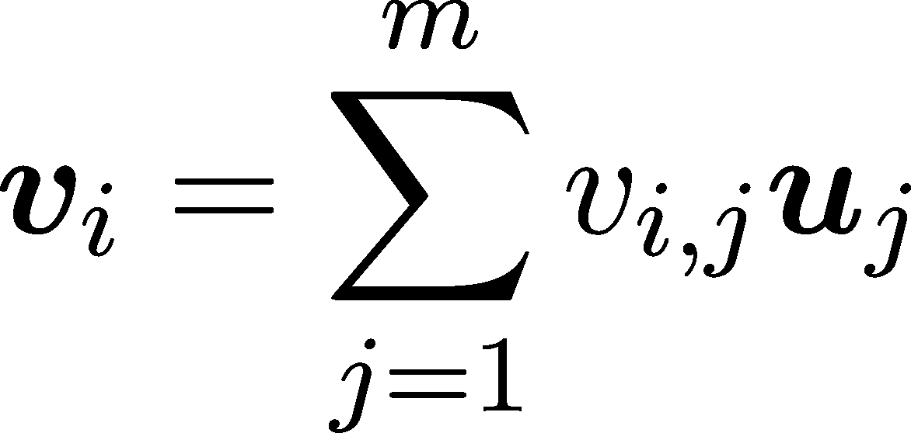

向量和向量空间

> “我想指出的是，抽象线性空间的类并不比元素为数组的空间类大。那么抽象带来了什么好处呢？首先，我们可以使用单一符号表示数组；这样我们可以把向量看作是基本构建块，不受分量的束缚。抽象视角导致结果简单、透明的证明。”
> 
> — 彼得·D·拉克斯，在他的书《线性代数及其应用》第一章中

机器学习的数学基础建立在三大支柱之上：线性代数、微积分和概率论。线性代数描述了如何表示和操作数据；微积分帮助我们拟合模型；而概率论则帮助解释这些模型。

这些内容相互依赖，我们将从最基础开始：表示和操作数据。

在本节中，我们将以著名的鸢尾花数据集为指导（[`en.wikipedia.org/wiki/Iris_flower_data_set`](https://en.wikipedia.org/wiki/Iris_flower_data_set)）。这包含了三种鸢尾花的测量数据：萼片和花瓣的长度和宽度。每个数据点包括这四个测量值，以及相应的鸢尾花种类：山鸢尾、维吉尼亚鸢尾或变色鸢尾。（萼片是花朵基部的通常是绿色的、类似叶片的结构，在花开放之前保护发育中的芽。花瓣是花朵的色彩鲜艳、柔软的部分，吸引传粉者如昆虫或鸟类。）

数据集可以直接从 scikit-learn（[`scikit-learn.org/`](https://scikit-learn.org/)）加载，让我们来看一下！

```py
from sklearn.datasets import load_iris 
data = load_iris() 
X, y = data["/span>data, data["/span>target 
X[:10]
```

```py
array([[5.1, 3.5, 1.4, 0.2], 
      [4.9, 3\. , 1.4, 0.2], 
      [4.7, 3.2, 1.3, 0.2], 
      [4.6, 3.1, 1.5, 0.2], 
      [5\. , 3.6, 1.4, 0.2], 
      [5.4, 3.9, 1.7, 0.4], 
      [4.6, 3.4, 1.4, 0.3], 
      [5\. , 3.4, 1.5, 0.2], 
      [4.4, 2.9, 1.4, 0.2], 
      [4.9, 3.1, 1.5, 0.1]])
```

在进入数学定义之前，让我们先建立一个共同的词汇表。测量数据本身以表格格式存储。行代表样本，列代表测量值。特定的测量类型通常称为特征。正如 X.shape 所示，鸢尾花数据集有 150 个数据点和四个特征：

```py
X.shape
```

```py
(150, 4)
```

（如果你对 NumPy 不熟悉也不要担心。我们会逐步学习细节。现在，理解数组的形状描述其维度就足够了。）

对于给定的样本，相应的鸢尾花种类称为标签。在我们的情况下，这可以是山鸢尾、维吉尼亚鸢尾或变色鸢尾。这里，标签用数字 0、1 和 2 编码：

```py
y
```

```py
array([0, 0, 0, 0, 0, 0, 0, 0, 0, 0, 0, 0, 0, 0, 0, 0, 0, 0, 0, 0, 0, 0, 
      0, 0, 0, 0, 0, 0, 0, 0, 0, 0, 0, 0, 0, 0, 0, 0, 0, 0, 0, 0, 0, 0, 
      0, 0, 0, 0, 0, 0, 1, 1, 1, 1, 1, 1, 1, 1, 1, 1, 1, 1, 1, 1, 1, 1, 
      1, 1, 1, 1, 1, 1, 1, 1, 1, 1, 1, 1, 1, 1, 1, 1, 1, 1, 1, 1, 1, 1, 
      1, 1, 1, 1, 1, 1, 1, 1, 1, 1, 1, 1, 2, 2, 2, 2, 2, 2, 2, 2, 2, 2, 
      2, 2, 2, 2, 2, 2, 2, 2, 2, 2, 2, 2, 2, 2, 2, 2, 2, 2, 2, 2, 2, 2, 
      2, 2, 2, 2, 2, 2, 2, 2, 2, 2, 2, 2, 2, 2, 2, 2, 2, 2])
```

从数学角度来看，鸢尾花数据集形成一个矩阵，数据点形成向量。简而言之，矩阵是表格，而向量是元组。（元组只是对象的有限和有序序列，例如 (1.297,−2.35,32.3,29.874)。）然而，这种简单化的观点并没有展示出整体图景。向量和矩阵具有美丽的几何和代数结构，探索它们的数学理论使我们能够看到数据背后的模式。

怎么回事呢？假设除了将数据点以紧凑的形式表示外，我们还想对它们进行操作，如加法和标量乘法。为什么我们需要将数据点相加？举个简单的例子，如果特征都在同一尺度上，通常会更有利。如果某个特征的分布尺度比其他特征小，它对预测的影响会较小。

想一想这个场景：如果有人在隔壁房间低声对你说话，而扬声器就在你耳边放着大声的音乐，那么你根本听不到那个人说的任何话。大规模的特征就像那震耳欲聋的音乐，而较小的特征就像那低语。你可能从低语中获得更多信息，但首先你需要把音乐调小。

为了看到这个现象的实际效果，让我们看看数据集特征的分布情况！

```py
import pandas as pd 
import seaborn as sns 
import matplotlib.pyplot as plt 
import numpy as np 

sns.set_theme(style="/span>white rc={"/span>axes.facecolor (0, 0, 0, 0)}) 

# 第三章：Create the data 
x = X.ravel() 
labels = ["/span>sepal length /span>sepal width /span>petal length /span>petal width 
g = np.tile(labels, len(X)) 
df = pd.DataFrame(dict(x=x, g=g)) 

# Initialize the FacetGrid object 
pal = sns.cubehelix_palette(10, rot=-.25, light=.7) 
g = sns.FacetGrid(df, row="/span>g hue="/span>g aspect=10, height=1.5, palette=pal) 

# Draw the densities 
g.map(sns.kdeplot, /span>x bw_adjust=.5, clip_on=False, fill=True, alpha=1, linewidth=1.5) 
g.map(sns.kdeplot, /span>x clip_on=False, color="/span>w lw=2, bw_adjust=.5) 

# Add reference line 
g.refline(y=0, linewidth=2, linestyle="" color=None, clip_on=False) 

# Label each plot 
g.map(lambda x, color, label: plt.gca().text(0, .2, label, fontweight="/span>bold color=color,ha="/span>left va="/span>center transform=plt.gca().transAxes), /span>x 

# Adjust subplots and aesthetics 
g.figure.subplots_adjust(hspace=-.25) 
g.set_titles("#x0022;) 
g.set(yticks=[], ylabel="#x0022;) 
g.despine(bottom=True, left=True) 

plt.show()
```


图 1.1：鸢尾花数据集的原始特征

你可以从上图中看到，有些特征的分布较为扩展（如花萼长度），而有些则较为紧凑（如花萼宽度）。在实际应用中，这可能会影响我们算法的预测性能。

为了解决这个问题，我们可以去除数据集的均值和标准差。如果数据集由向量 x[1], x[2], …, x[150] 组成，我们可以通过以下方式计算它们的均值：


以及它们的标准差


其中在 (x[i] −μ)² 中的减法和平方操作是逐元素进行的。

μ = (μ[1], μ[2], μ[3], μ[4]) 和 σ = (σ[1], σ[2], σ[3], σ[4]) 这些分量是各个特征的均值和方差。（回想一下，鸢尾花数据集包含 150 个样本，每个样本有 4 个特征。）

换句话说，均值描述了样本的平均值，而标准差则代表了样本与均值的平均距离。标准差越大，样本的分布就越广。

利用这些量，尺度化的数据集可以描述为


其中减法和除法都是逐元素进行的。

如果你熟悉 Python 和 NumPy，操作是这样的。（如果你不熟悉也没关系——关于它们的所有内容将在下一章中解释，并附有示例代码。）

```py
 X_scaled = (X - X.mean(axis=0))/X.std(axis=0)
X_scaled[:10] 
```

```py
array([[-0.90068117,  1.01900435, -1.34022653, -1.3154443 ], 
      [-1.14301691, -0.13197948, -1.34022653, -1.3154443 ], 
      [-1.38535265,  0.32841405, -1.39706395, -1.3154443 ], 
      [-1.50652052,  0.09821729, -1.2833891 , -1.3154443 ], 
      [-1.02184904,  1.24920112, -1.34022653, -1.3154443 ], 
      [-0.53717756,  1.93979142, -1.16971425, -1.05217993], 
      [-1.50652052,  0.78880759, -1.34022653, -1.18381211], 
      [-1.02184904,  0.78880759, -1.2833891 , -1.3154443 ], 
      [-1.74885626, -0.36217625, -1.34022653, -1.3154443 ], 
      [-1.14301691,  0.09821729, -1.2833891 , -1.44707648]])
```

```py
# Create the data 
x = X_scaled.ravel() 
labels = ["/span>sepal length /span>sepal width /span>petal length /span>petal width 
g = np.tile(labels, X_scaled.shape[0]) 
df = pd.DataFrame(dict(x=x, g=g)) 

# Initialize the FacetGrid object 
pal = sns.cubehelix_palette(10, rot=-.25, light=.7) 
grid = sns.FacetGrid(df, row="/span>g hue="/span>g aspect=10, height=1.5, palette=pal) 

# Draw the densities 
grid.map(sns.kdeplot, /span>x bw_adjust=.5, clip_on=False, fill=True, alpha=1, linewidth=1.5) 
grid.map(sns.kdeplot, /span>x clip_on=False, color="/span>w lw=2, bw_adjust=.5) 

# Add reference line 
grid.refline(y=0, linewidth=2, linestyle="" color=None, clip_on=False) 

# Add labels to each plot 
grid.map(lambda x, color, label: plt.gca().text(0, .2, label, fontweight="/span>bold color=color,ha="/span>left va="/span>center transform=plt.gca().transAxes), /span>x 

# Adjust subplots and aesthetics 
grid.figure.subplots_adjust(hspace=-.25) 
grid.set_titles("#x0022;) 
grid.set(yticks=[], ylabel="#x0022;) 
grid.despine(bottom=True, left=True) 

plt.show()
```


图 1.2：鸢尾花数据集的尺度化特征

如果你将修改后的版本与原始数据进行比较，你会发现它的特征都在相同的尺度上。换句话说，我们将数据集转换成了一个更具表现力的数据集。从一个（非常）抽象的角度来看，机器学习其实就是一系列学到的数据转换，将原始数据转换成一种预测简单的形式。

在数学环境中，数据操作和标签之间关系的建模源于向量空间及其之间的变换概念。让我们通过精确定义向量空间来迈出第一步！

## 1.1 什么是向量空间？

将多个测量值表示为一个元组（x[1], x[2], …, x[n]）是一个自然的想法，具有很多优点。元组的形式暗示了各个分量按精确的顺序排列，提供了一种清晰简洁的方式来存储信息。

然而，这也有代价：现在我们不得不处理更复杂的对象。尽管我们处理的是像 (x[1], …, x[n]) 这样的元组而不是数字，但它们之间仍有相似性。例如，任何两个元组 x = (x[1], …, x[n]) 和 y = (y[1], …, y[n])，

+   可以通过 x + y = (x[1] + y[1], …, x[n] + y[n]) 来相加，

+   并且可以与标量相乘：如果 c ∈ ℝ，则 cx = (cx[1], …, cx[n])。

这几乎就像使用一个数字一样。

这些运算也有明确的几何解释。加法与平移相同，而与标量的乘法则是简单的拉伸。（如果 |c| < 1，则是压缩。）


图 1.3：加法和标量乘法的几何解释

另一方面，如果我们想要遵循几何直觉（我们肯定是这么做的），那么如何定义向量乘法就不太清楚了。尽管有定义，


从代数角度来看是有意义的，但我们无法从几何角度理解它的含义。

当我们思考向量和向量空间时，我们是在思考一种数学结构，这种结构符合我们的直觉观点和预期。让我们将这些转化为定义！

定义 2.（向量空间）

向量空间是一个数学结构（V, F, +, ⋅），其中

(a) V 是向量的集合，

(b) F 是标量域（最常见的是实数 ℝ 或复数 ℂ），

(c) + : V × V → V 是加法运算，满足以下性质：

+   x + y = y + x（交换律），

+   x + (y + z) = (x + y) + z（结合律），

+   存在一个元素 0 ∈ V，使得 x + 0 = x（零向量的存在性），

+   对于每个 x ∈ V，都存在一个逆元素 −x ∈ V，使得 x + (−x) = 0（加法逆元的存在性）

对于所有的向量 x, y, z ∈ V，

(d) 以及 ⋅ : F × V → V 是标量乘法运算，满足

+   a(bx) = (ab)x（结合律），

+   a(x + y) = ax + ay（分配律），

+   且 1x = x

对于所有的标量 a, b ∈ F 和向量 x, y ∈ V。

这个定义包含了很多新的概念，我们来逐步拆解它。

首先，将加法和标量乘法等运算视为函数对你来说可能不太习惯，但这是一种完全自然的表示方式。（我们稍后会详细学习函数，但现在可以直观地理解它们。）在写作中，我们使用符号 x + y，但当将 + 视为两个变量的函数时，我们也可以写作 +(x, y)。形式 x + y 称为中缀表示法，而 +(x, y) 则称为前缀表示法。

在向量空间中，加法的输入是两个向量，结果是一个单一的向量，因此 + 是一个将笛卡尔积 V × V 映射到 V 的函数。

类似地，标量乘法接收一个标量和一个向量，结果是一个向量；也就是说，它是一个将 F × V 映射到 V 的函数。

（笛卡尔积 V × V 只是一个有序对的集合：


随时可以查看集合论附录（附录 C）了解更多细节，但目前，直观理解已经足够了。

这里也需要指出，数学定义总是在事后形式化的，即在对象本身有一定的具体化并且对用户变得熟悉之后。数学通常是先定义，再定理。这并不是实际操作中的做法。示例激发定义，而不是相反。

一般来说，标量域可以是实数或复数以外的其他东西。域这个术语指的是一个定义明确的数学结构，它使自然概念在数学上变得精确。我们不深入技术细节，只需把域理解为“一个数字集合，其中加法和乘法的运算方式与实数相同”。

由于我们不关心最一般的情况，我们将使用ℝ或ℂ以避免不必要的困难。如果你不熟悉域的精确数学定义，不必担心——每次看到“域”这个词时，直接理解为ℝ就好。

当上下文中的所有内容都很清晰时，(V,ℝ,+,⋅)通常会简化为 V 以方便表示。所以，如果没有特别指定域 F，则隐式假设 F 为ℝ。如果我们想要强调这一点，我们会称这些为实向量空间。

初看起来，定义 2 确实太复杂，难以理解。它看起来像是一堆集合、运算和属性的堆砌。然而，为了帮助我们建立一个心理模型，我们可以将向量想象成一支箭，从零向量开始。（回想一下，零向量 0 是那个对于所有 x 都有 x + 0 = x 成立的特殊向量。因此，它可以被视为一支零长度的箭；原点。）

为了更好地熟悉这一概念，让我们看一些向量空间的示例！

### 1.1.1 向量空间的示例

示例是构建对看似复杂的概念（如向量空间）理解的最佳方式之一。我们人类通常以模型而非抽象的形式进行思考。（是的，这也包括纯粹的数学家，尽管他们可能会否认这一点。）

示例 1. 向量空间最常见的实例是 (ℝ^n, ℝ, +, ⋅)，这就是我们用来激发定义本身的那个实例。（ℝ^n 是实数集的 n 重笛卡尔积。如果你不熟悉这一概念，可以查看附录 C 中的集合论教程。）

(ℝ^n,ℝ,+,⋅) 是标准模型，我们用它来指导我们整个学习过程。如果 n = 2，那么我们讨论的就是熟悉的欧几里得平面。


图 1.4：欧几里得平面作为一个向量空间

使用 ℝ² 或 ℝ³ 进行可视化会有很大帮助。这里有效的做法通常在一般情况下也有效，尽管有时这可能是危险的。数学依赖于直觉和逻辑。我们通过直觉发展思想，但用逻辑来验证它们。

示例 2\. 向量空间不仅仅是有限元组的集合。一个例子是具有实系数的多项式函数空间，定义为

![ ∑n ℝ [x ] = { pixi : pi ∈ ℝ, n = 0,1,...}. i=0 ](img/file14.png)

两个多项式 p(x) 和 q(x) 可以通过以下方式相加


并且可以通过与实数标量相乘来运算


通过这些运算，(ℝ[x],ℝ,+,⋅) 是一个向量空间。虽然我们大多数时候把多项式看作是函数，但它们也可以表示为系数的元组：


请注意，n——多项式的次数——是没有上限的。因此，这个向量空间的结构比 ℝ^n 更加丰富。

示例 3\. 之前的例子可以进一步推广。设 C([0,1]) 表示所有连续实值函数 f : [0,1] →ℝ 的集合。那么 (C(ℝ),ℝ,+,⋅) 是一个向量空间，其中加法和标量乘法是按元素定义的：


对于所有 f,g ∈C(ℝ) 和 c ∈ℝ。（尽管连续性是我们还未定义的概念，但可以把连续函数看作是图像可以在不抬起笔的情况下绘制的函数。）

是的，没错：函数也可以看作是向量。函数空间在数学中扮演着重要角色，它们有多种不同的形式。我们经常将空间限制为连续函数、可微分函数，或者基本上是任何在给定运算下封闭的子集。

（事实上，ℝ^n 也可以看作是一个函数空间。从抽象的角度来看，每个向量 x = (x[1],…,x[n]) 是从 {1,2,…,n} 到 ℝ 的映射。）

函数空间出现在更高级的主题中，例如 [反转 ResNet 架构](http://proceedings.mlr.press/v97/behrmann19a/behrmann19a.pdf)，我们在本书中不会讨论这些内容。然而，看到一些不同的（而且不那么直观的）例子是值得的，像 ℝ^n 这样的例子就不算是直观的。

## 1.2 基底

尽管我们的向量空间包含无限多个向量，但我们可以通过找到特殊的子集来简化复杂度，这些子集能够表示任何其他向量。

为了使这个概念更加明确，让我们考虑我们反复提到的例子 ℝ^n。在这里，我们有一个特殊的向量集合

| e[1] | = (1,0,…,0) |  |  |
| --- | --- | --- | --- |
| e[2] | = (0,1,…,0) |  |  |
|  |  |  |  |
| e[n] | = (0,0,…,1) |  |  |

这可以用来将每个向量 x = (x[1],…,x[n]) 表示为


例如，e[1] = (1,0) 和 e[2] = (0,1) 在ℝ²中。

我们刚刚看到的内容似乎极其简单，而且看起来只是让事情变得更加复杂。为什么我们需要将向量写成 x = ∑ [i=1]^nx[i]e[i]的形式，而不是简单地使用坐标(x[1],…,x[n])？因为，实际上，坐标表示法依赖于用来表示其他向量的基础向量集（在我们这里是{e[1],…,e[n]}）。

向量不同于它的坐标！同一个向量在不同的坐标系统中可以有多个不同的坐标，转换这些坐标是一个有用的工具。

因此，集合 E = {e[1],…,e[n]}⊆ℝ^n 非常特殊，因为它显著简化了向量的表示。通过向量加法和标量乘法操作，它完全生成了我们的向量空间。E 是向量空间基的一个例子，作为ℝ^n 的骨架。

在本节中，我们将详细介绍并研究向量空间基的概念。

### 1.2.1 线性组合与独立性

让我们从特殊情况ℝ^n 缩小视野，开始讨论一般的向量空间。通过我们关于基的启发式例子，我们已经看到像这样的和式


其中 v[i]是向量，x[i]系数是标量，这些在线性组合中起着至关重要的作用。当所有系数为零时，线性组合被称为平凡的。

给定一组向量，同一个向量可能以多种方式表示为线性组合。例如，如果 v[1] = (1,0)，v[2] = (0,1)，v[3] = (1,1)，那么

| (2,1) | = 2v[1] + v[2] |  |  |
| --- | --- | --- | --- |
|  | = v[1] + v[3]. |  |  |

这表明集合 S = {v[1],v[2],v[3]}是多余的，因为它包含了重复的信息。线性相关性和独立性的概念使得这一点更加明确。

定义 3\. （线性相关性与独立性）

设 V 是一个向量空间，S = {v[1],…,v[n]}是其向量的一个子集。如果 S 只包含零向量，或者存在一个非零向量 v[k]，它可以表示为其他向量 v[1],…,v[k−1],v[k+1],…,v[n]的线性组合，则称 S 是线性相关的。

S 被称为线性独立的，如果它不是线性相关的。

线性相关性和独立性可以从不同角度来看。如果


对于某些非零 v[k]，通过减去 v[k]，我们得到零向量可以通过非平凡的线性组合得到。


对于某些标量 x[i]，其中 x[k] = −1。这是线性相关的等价定义。通过这一点，我们证明了以下定理。

定理 2\.

设 V 是一个向量空间，S = {v[1],…,v[n]}是其向量的一个子集。

(a) S 是线性相关的，当且仅当零向量 0 可以通过非平凡的线性组合得到。

(b) 当且仅当 0 = ∑ [i=1]^nx[i]v[i] 时，所有系数 x[i] 都为零，S 是线性无关的。

### 1.2.2 向量集的张成

线性组合提供了一种方法，通过一个小的向量集合生成更多的向量。对于一个向量集合 S，取其所有可能的线性组合叫做张成，生成的集合叫做张成集合。形式化地，它定义为


注意，向量集合 S 不一定是有限的。为了帮助说明张成的概念，我们可以在三维空间中可视化这个过程。两个线性无关向量的张成是一个平面。


图 1.5：两个线性无关向量 u,v ∈ ℝ³ 的张成

当我们讨论有限集合 {v[1],…,v[n]} 的张成时，我们表示其张成为


这样可以避免通过给每个集合命名来过度复杂化符号。

命题 1\. 设 V 为一个向量空间，S, S[1], S[2] ⊆ V 为其向量的子集。

(a) 如果 S[1] ⊆ S[2]，则 span(S[1]) ⊆ span(S[2])。

(b) span(span(S)) = span(S)。

这是我们第一次证明！读一读，如果太难，跳过，稍后再回来看。只要确保你理解了命题的内容。

证明。性质 (a) 直接由定义得出。为了证明 (b)，我们需要证明 span(S) ⊆ span(span(S)) 和 span(span(S)) ⊆ span(S)。

（这是一个学习曲线较陡的时刻，但想一想：两个集合 A 和 B 相等的充要条件是 A ⊆ B 且 B ⊆ A。）

前者由定义得出。对于后者，设 x ∈ span(span(S))。那么


对于某些 v[i] ∈ span(S)。由于 v[i] 在 S 的张成中，我们得到



对于某些 u[j] ∈ S。因此，


这意味着 x ∈ span(S)。

因为 span(span(S)) = span(S)，如果 S 是线性相关的，我们可以去除冗余的向量，仍然保持张成不变。

想一想：如果 S = {v[1],…,v[n]}，假设 v[n] = ∑ [i=1]^(n−1)x[i]v[i]，那么 v[n] ∈ span(S ∖{v[n]}）。因此，


（操作 A ∖B 是集合差，包含所有属于 A 但不属于 B 的元素。详情请参见附录 C。）

在向量集合中，那些能生成整个向量空间的集合是特别的。经过这些铺垫，我们已经准备好做一个正式的定义。任何满足 span(S) = V 的向量集合 S 称为 V 的生成集。

S 可以被看作是 V 的“无损压缩”，因为它包含了重建 V 中任何元素所需的所有信息，同时它比整个空间要小。因此，我们希望尽可能减少生成集的大小。这引出了线性代数中的一个最重要的概念：最小生成集，或者我们更愿意称之为基。

### 1.2.3 基与最小生成集

结合我们迄今为止建立的所有直觉，让我们立即进入定义吧！

定义 4.（基）

设 V 为一个向量空间，S 为其向量的子集。如果 S 是 V 的基，则：

(a) S 是线性无关的，

(b) 且 span(S) = V。

基集的元素称为基向量。

可以证明这些定义性质意味着每个向量 x 都可以唯一地表示为 S 的线性组合。（这部分留给读者练习。）

让我们来看一些例子！在 ℝ³ 中，集合 {(1,0,0),(0,1,0),(0,0,1)} 是一个基，但 {(1,1,1),(1,1,0),(0,1,1)} 也是一个基。所以，同一个向量空间可以有多个基。

对于 ℝ^n，最常用的基是 {e[1],…,e[n]}，其中 e[i] 是一个向量，其所有坐标为 0，除了第 i 个坐标是 1。这个基称为标准基。

就“信息”而言，基向量集正好处于一个最佳的点上。向基集添加任何新向量会引入冗余；移除其中任何元素会导致集合不完整。

这些概念在下面的两个定理中得到了形式化。

定理 3。

设 V 为一个向量空间，S = {v[1],…,v[n]} 为其向量的子集。以下是等价的：

(a) S 是一个基。

(b) S 是线性无关的，且对于任何 x ∈V ∖S，向量集 S ∪{x} 是线性相关的。换句话说，S 是一个最大线性无关集。

证明。为了证明两个命题的等价性，我们需要证明两件事：一是 (a) 推导出 (b)；二是 (b) 推导出 (a)。让我们从第一个开始！

(a)  (b) 如果 S 是基，那么任何 x ∈V 都可以表示为


对于某些 x[i] ∈ℝ。因此，根据定义，S ∪{x} 是线性相关的。

(b)  (a) 我们的目标是证明任何 x 都可以表示为 S 中向量的线性组合。根据我们的假设，S ∪{x} 是线性相关的，因此 0 可以表示为一个非平凡的线性组合：


其中并非所有系数都为零。由于 S 是线性无关的，α 不能为零（否则意味着 S 是线性相关的，这与我们的假设相悖）。因此，


证明 S 是一个基。

接下来，我们要证明基的每个向量都是必不可少的。

定理 4。

设 V 为一个向量空间，S = {v[1],…,v[n]} 是一个基。那么，对于任何 v[i] ∈S，


即，S ∖{v[i]} 的跨度是 V 的一个真子集。

证明。我们将通过反证法来证明这一点。无损一般性，我们可以假设 i = 1。如果


然后


这意味着 S = {v[1],…,v[n]} 不是线性无关的，这与我们的假设相矛盾。

换句话说，上述结果意味着基既是最大线性无关集，又是最小生成集。

给定一个基 S = {v[1],…,v[n]}，我们隐式地将向量 x = ∑ [i=1]^nx[i]v[i] 写作 x = (x[1],…,x[n])。由于这种分解是唯一的，我们可以毫无问题地这样做。系数 x[i] 也称为坐标。（请注意，坐标强烈依赖于基。给定两个不同的基，相同向量的坐标可能不同。）

### 1.2.4 有限维向量空间

正如我们之前所见，一个向量空间可以有许多不同的基，所以基不是唯一的。在这个背景下，出现了一个非常自然的问题。若 S[1] 和 S[2] 是 V 的两个基，那么是否有 jS[1]j = jS[2]j 这一关系？（其中 jSj 表示集合 S 的基数，即其“大小”。）

换句话说，如果我们更聪明地选择基，能不能得到更好的结果呢？事实证明，我们不能，任何两个基集合的大小都是相等的。我们不打算证明这一点，但这里是该定理的完整内容。

定理 5。

设  为一个向量空间，且  和  是  的两个基。则有 。

这为我们提供了一种定义向量空间维度的方法，维度就是其基的基数。我们将 V 的维度表示为 dim(V)。例如，ℝ^n 是 n 维的，如标准基 {(1,0,…,0),…,(0,0,…,1)} 所示。

如果你回顾之前的定理，我们假设基是有限的。你可能会问：这总是成立吗？答案是否定的。例子 2 和 3 表明情况并非如此。例如，可数无限集 {1,x,x²,x³,…} 是 ℝ[x] 的一个基。因此，根据上述定理，那里不可能存在有限基。

这标志着向量空间之间的一个重要区别：具有有限基的向量空间被称为有限维的。我有一个好消息：所有有限维的实向量空间本质上是 ℝ^n。（回想一下，如果一个向量空间的标量是实数，我们就称这个向量空间为实向量空间。）

为了理解这一点，假设 V 是一个 n 维实向量空间，其基为 {v[1],…,v[n]}，并定义映射 φ : V →ℝ^n，如下所示：


φ是可逆的并且保持 V 的结构，也就是加法和标量乘法操作。事实上，如果 u,v ∈V 且α,β ∈ℝ，则有φ(αu + βv) = αφ(x) + βφ(y)。这样的映射称为同构。这个词本身来源于古希腊语，isos 意味着相同，morphe 意味着形状。尽管这听起来很抽象，但两个向量空间之间存在同构，意味着它们具有相同的结构。因此，ℝ^n 不仅仅是有限维实数向量空间的一个例子，它是这些空间的普遍模型。注意，如果标量不是实数，那么到ℝ^n 的同构就不成立。（我们将在后面的章节中讨论类似的变换。）

考虑到我们几乎完全处理的是有限维实数向量空间，这是个好消息。使用ℝ^n 不仅仅是启发式的，它是一个良好的思维模型。

### 1.2.5 为什么基底如此重要？

如果每个有限维实数向量空间本质上与ℝ^n 相同，那么我们从抽象中得到什么呢？当然，我们可以不谈基底，直接使用ℝ^n，但为了深入理解机器学习中的核心数学概念，我们需要这种抽象。

让我们简要展望一下并看看一个例子。如果你对神经网络有一些经验，你会知道矩阵在其中扮演着至关重要的角色。没有任何背景，矩阵只不过是一个数字表格，似乎有任意的计算规则。你是否曾经想过，为什么矩阵乘法是按这种方式定义的？

尽管我们还没有精确定义矩阵，你可能之前已经遇到过它们。我们将在第三章和第四章全面学习它们，但对于这两个矩阵


它们的积 AB 定义为


即，AB 的(i,j)-th 元素定义为


这个定义感觉有些随意。为什么不直接取元素逐一相乘(a[i,j]b[i,j])[i,j=1]^n 呢？一旦我们将矩阵视为描述向量空间之间线性变换的工具，这个定义就变得非常清晰，因为矩阵的元素描述了基向量的像。在这个背景下，矩阵的乘法仅仅是线性变换的组合。

我不想仅仅给出定义并告诉你如何使用它，而是希望你理解为什么它是这样定义的。在接下来的章节中，我们将学习矩阵乘法的每一个细节。

### 1.2.6 基的存在性

此时，你可能会问：对于给定的向量空间，我们是否能保证找到一个基？如果没有这样的保证，前面的设置可能会变得没有意义。（因为可能没有可以使用的基。）

幸运的是，情况并非如此。由于证明极其困难，我们不会展示这个过程，但这个问题非常重要，我们至少应该陈述定理。如果你对如何做到这一点感兴趣，我附上了一个证明的概述。可以跳过它，因为它对我们的目的并不至关重要。

定理 6。

每个向量空间都有一个基。

证明。（概述。）这个证明使用了一种叫做超限归纳的高级技术，远超我们的范围。（可以参考 Paul Halmos 的《Naive Set Theory》了解更多。）我们不精确地展示，而是专注于建立直觉，了解如何为任何向量空间构造基。

对于我们的向量空间 V，我们将逐个构造基。给定任意非零向量 v[1]，如果 span(S[1])≠V，集合 S[1] = {v[1]}还不是基。因此，我们可以找到一个向量 v[2] ∈ V ∖ span(S[1])，使得 S[2] := S[1] ∪{v[2]}依然是线性无关的。

S[2]是基吗？如果不是，我们可以继续这个过程。如果过程在有限的步骤中停止，我们就完成了。然而，这并不能得到保证。想一想ℝ[x]，即多项式的向量空间，它是无限维的，正如我们在第 1.2.4 节中所看到的。

这时，我们需要使用一些集合论的重型工具（我们并不具备）。

如果过程没有停止，我们需要找到一个包含所有 S[i]作为子集的集合 S[ℵ[0]]。（找到这个 S[ℵ[0]]集合是最棘手的部分。）S[ℵ[0]]是基吗？如果不是，我们继续这个过程。

这个过程很难展示，但最终会停止，我们无法再将任何向量添加到我们线性无关的向量集合中而不破坏无关性。当这一点发生时，我们已经找到了一个最大线性无关集——也就是基。

对于有限维向量空间，上述过程很容易描述。事实上，线性代数的支柱之一就是所谓的 Gram-Schmidt 过程，用于显式构造向量空间的特殊基。由于几个经典的结果依赖于此，我们将在接下来的章节中详细研究它。

### 1.2.7 子空间

在我们动手处理 Python 中的向量之前，还有一个主题我们需要讨论，它在讨论线性变换时会非常有用。（但再次强调，线性变换是机器学习的核心。我们学习的一切都是为了更好地理解它们。）对于给定的向量空间 V，我们通常对它的一个子集感兴趣，且这个子集本身也是一个向量空间。这就是子空间的概念。

定义 5。（子空间）

设 V 是一个向量空间。如果集合 U ⊆V 对加法和标量乘法是封闭的，那么 U 是 V 的一个子空间。

U 是一个真子空间，当且仅当它是一个子空间并且 U ⊂V。

根据定义，子空间本身就是向量空间，因此我们也可以定义它们的维度。每个向量空间至少有两个子空间：它本身和 {0}。这些被称为平凡子空间。除此之外，一组向量的跨度总是一个子空间。一个这样的例子在图 1.5 中说明。

子空间的一个最重要的方面是，我们可以利用它们来创建更多的子空间。这个概念将在下文中具体说明。

定义 6\. （子空间的直和）

设 V 是一个向量空间，U[1] 和 U[2] 是它的两个子空间。U[1] 和 U[2] 的直和定义为


你可以很容易地验证 U[1] + U[2] 确实是一个子空间，此外 U[1] + U[2] = span(U[1] ∪U[2])。子空间及其直和在多个主题中起着至关重要的作用，例如矩阵分解。例如，稍后我们将看到，其中许多是将一个线性空间分解为多个向量空间之和的等价问题。

选择一个基，其子集能够跨越某些给定子空间的能力通常非常有用。这个结果在下文中得到了形式化。

定理 7\.

设 V 是一个向量空间，U[1] 和 U[2] 是它的两个子空间，且 U[1] + U[2] = V。同时，设 {p[1],…,p[k]} ⊆ U[1] 是 U[1] 的一个基，{q[1],…,q[l]} ⊆ U[2] 是 U[2] 的一个基。那么，联合


是 V 中的一个基。

证明：这一点直接从直和的定义中得出。如果 V = U[1] + U[2]，那么任何 x ∈V 都可以表示为 x = a + b，其中 a ∈U[1] 且 b ∈U[2]。

反过来，由于 p[1],…,p[k] 在 U[1] 中形成一个基，q[1],…,q[l] 在 U[2] 中形成一个基，向量 a 和 b 可以写成


因此，任何 x 都可以表示为


这是基的定义。

我们仅仅是触及了表面。基是至关重要的，但它们仅提供了实践中遇到的向量空间的骨架。为了正确地表示和操作数据，我们需要在这个骨架上构建几何结构。我们如何衡量两个测量值之间的“距离”？它们的相似度又如何呢？

除此之外，还有一个更加关键的问题：我们到底如何在计算机中表示向量？在下一节中，我们将看看 Python 中的数据结构，为我们之后进行的数据操作和转换打下基础。

## 1.3 向量在实践中的应用

到目前为止，我们主要讨论了向量和向量空间的理论。然而，我们的最终目标是构建计算模型，用于发现和分析数据中的模式。为了将理论付诸实践，我们将看看向量在计算中的表示方式。

在计算机科学中，我们对于数学结构的理解与如何在计算机内部表示它们之间有着显著的差异。到目前为止，我们的目标是开发一个数学框架，使我们能够推理数据的结构及其转换过程。我们希望有一种语言，它

+   表达力强，

+   易于使用，

+   尽可能紧凑。

然而，当我们旨在进行计算而非纯粹的逻辑推理时，我们的目标发生了变化。我们需要的是那些能够实现计算的工具。

+   易于使用，

+   内存高效，

+   快速访问、操作和转换。

这些要求常常是相互矛盾的，具体情况可能会更倾向于某一方。例如，如果我们有大量内存，但需要进行大量计算，我们可以牺牲空间来换取速度。由于所有潜在的使用场景，表示相同数学概念的格式有很多种。这些都被称为数据结构。

不同的编程语言以不同的方式实现向量。因为 Python 在数据科学和机器学习中无处不在，所以它将是我们的首选语言。在本章中，我们将研究 Python 中的所有可能的数据结构，看看哪种最适合表示高性能计算中的向量。

### 1.3.1 元组

在标准的 Python 中，至少有两种内置数据结构可以用来表示向量：元组和列表。我们先从元组开始！它们可以通过将元素列在两个括号之间，并用逗号分隔来定义。

```py
v_tuple = (1, 3.5, -2.71, /span>a string 42) 
v_tuple
```

```py
(1, 3.5, -2.71, ’a string’, 42)
```

```py
type(v_tuple)
```

```py
tuple
```

单个元组可以包含各种类型的元素。尽管在计算线性代数中我们将专门处理浮点数，但这个特性对于通用编程非常有用。

我们可以通过索引访问元组的元素。就像在其他一些编程语言中一样，索引从零开始。这与数学中的做法大相径庭，数学中我们通常从一开始索引。因此，在大多数为科学计算设计的语言中，如 Fortran、Matlab 或 Julia，索引是从一开始的。

（不要告诉别人，但从零开始索引曾经让我疯狂。我是受过数学训练的。）

```py
v_tuple[0]
```

```py
1
```

元组的大小可以通过调用内置的 len 函数来访问。

```py
len(v_tuple)
```

```py
5
```

除了索引，我们还可以通过切片访问多个元素。

```py
v_tuple[1:4]
```

```py
(3.5, -2.71, ’a string’)
```

切片的工作方式是通过指定第一个和最后一个元素，以及可选的步长，使用语法 object[first:last:step]。

元组相当不灵活，因为你不能改变它们的组件。尝试这么做会导致 TypeError，这是 Python 告诉你对象不支持你尝试调用的方法的标准方式。（在我们的例子中，是项赋值。）

```py
v_tuple[0] = 2
```

```py
--------------------------------------------------------------------------- 
TypeError                               Traceback (most recent call last) 
Cell In[22], line 1 
---->/span> 1 v_tuple[0] = 2 

TypeError: ’tuple’ object does not support item assignment
```

此外，扩展元组以添加额外元素也不受支持。由于我们无法在实例化后以任何方式改变元组对象的状态，它们是不可变的。根据用例，不可变性既可能是优点也可能是缺点。不可变对象消除了意外更改，但每个操作都需要创建一个新对象，导致计算开销。因此，在复杂计算中表示大量数据时，元组并不是最佳选择。

列表解决了这个问题。让我们来看看它们以及它们引入的新问题！

### 1.3.2 列表

列表是 Python 的工作马。与元组相比，列表非常灵活且易于使用，尽管这会牺牲运行时的性能。类似于元组，列表对象可以通过在方括号内枚举其对象并用逗号分隔来创建。

```py
v_list = [1, 3.5, -2.71, /span>qwerty 
type(v_list)
```

```py
list
```

与元组一样，通过索引或切片访问列表的元素。我们可以对列表执行各种操作：覆盖其元素，追加项目，甚至移除其他项目。

```py
v_list[0] = /span>this is a string/span> 
v_list
```

```py
[’this is a string’, 3.5, -2.71, ’qwerty’]
```

此示例说明列表也可以容纳各种类型的元素。添加和删除元素可以通过诸如 append、push、pop 和 remove 之类的方法完成。

在尝试之前，让我们快速记录一下我们示例列表的内存地址，通过调用 id 函数访问。

```py
v_list_addr = id(v_list) 
v_list_addr
```

```py
126433407319488
```

这个数字简单地指代了我的计算机内存中的一个地址，那里是 v_list 对象的位置。确实，因为这本书是在我的个人电脑上编译的。

现在，我们将对我们的列表执行几个简单操作，并展示内存地址不会改变。因此，不会创建新对象。

```py
v_list.append([42])    # adding the list [42] to the end of our list 
v_list
```

```py
[’this is a string’, 3.5, -2.71, ’qwerty’, [42]]
```

```py
id(v_list) == v_list_addr    # adding elements doesn’t create any new objects
```

```py
True
```

```py
v_list.pop(1)    # removing the element at the index /span> 
v_list
```

```py
[’this is a string’, -2.71, ’qwerty’, [42]]
```

```py
id(v_list) == v_list_addr    # removing elements still doesn’t create any new objects
```

```py
True
```

不幸的是，将列表相加得到的结果与我们的期望完全不同。

```py
[1, 2, 3] + [4, 5, 6]
```

```py
[1, 2, 3, 4, 5, 6]
```

不像我们希望向量行为一样将相应元素相加，而是将列表连接起来。这个特性在编写通用应用程序时非常方便。然而，这对科学计算并不适用。“标量乘法”也会产生奇怪的结果。

```py
3*[1, 2, 3]
```

```py
[1, 2, 3, 1, 2, 3, 1, 2, 3]
```

用整数乘以列表会重复列表指定次数。鉴于+运算符在列表上的行为，这似乎是合乎逻辑的，因为整数乘法是重复加法：


总体而言，列表可以做比我们需要表示向量更多的事情。虽然我们可能想要更改向量的元素，但我们不需要添加或删除它们的元素，也不需要存储除浮点数之外的对象。我们能够牺牲这些额外的功能并获得适合我们目的但具有闪电般快速计算性能的实现吗？是的。进入 NumPy 数组。

### 1.3.3 NumPy 数组

尽管 Python 的内建数据结构非常出色，但它们是为易用性优化的，而不是为了科学计算。这一问题在语言开发初期就被意识到，并通过[NumPy](https://numpy.org/)库得到了解决。

Python 的主要卖点之一就是它写代码的速度快且直接，即使是复杂任务也能轻松完成。这种便利性是以速度为代价的。然而，在机器学习中，速度对我们来说至关重要。在训练神经网络时，一小部分操作需要重复数百万次。即使是性能的微小改进，也能节省大量的时间，尤其是在处理极大型模型时，可能节省数小时、数天甚至数周的时间。

C 语言位于技术谱系的另一端。虽然 C 代码编写起来较为困难，但当正确编写时，它的执行速度极快。由于 Python 是用 C 语言编写的，获取快速性能的一个行之有效的方法是从 Python 调用用 C 语言编写的函数。简而言之，这就是 NumPy 提供的功能：C 数组和操作，全部在 Python 中实现。

为了深入了解 Python 内建数据结构的底层问题，我们应该将数字和数组放在显微镜下观察。在计算机的内存中，对象被表示为固定长度的 0-1 序列。每个组成部分称为比特（bit）。比特通常按 8 位、16 位、32 位、64 位或甚至 128 位的块进行分组。根据我们希望表示的内容，相同的序列可以表示不同的意义。例如，8 位序列 00100110 可以表示整数 38 或 ASCII 字符“&”。


图 1.6：内存中的 8 位对象

通过指定数据类型，我们可以解码二进制对象。32 位整数称为 int32 类型，64 位浮点数称为 float64，以此类推。

由于单个比特包含的信息非常有限，因此内存是通过将其划分为 32 位或 64 位大小的块并依次编号来进行寻址的。这个地址是一个十六进制数，从 0 开始。（为了简化，假设内存是通过 64 位进行寻址的，这是现代计算机中的常见做法。）

存储一系列相关对象（具有相同数据类型）的一种自然方式是将它们放置在内存中的相邻位置。这种数据结构被称为数组。


图 1.7：一个 int64 类型对象的数组

通过存储第一个对象的内存地址，例如 0x23A0，我们可以通过访问内存位置 0x23A0 + k，瞬间获取第 k 个元素。

我们称这种数据结构为静态数组，或者通常称之为 C 数组，因为它在强大的 C 语言中是如此实现的。虽然这种数组实现速度极快，但它相对不灵活。首先，您只能存储单一类型的对象。其次，您必须预先知道数组的大小，因为不能使用超出预分配部分的内存地址。因此，在开始使用数组之前，您必须为其分配内存。（即预留空间，以防止其他程序覆盖它。）

然而，在 Python 中，你可以在同一个列表中存储任意大和不同的对象，并且可以随时移除或添加元素。

```py
l = [2**142 + 1, /span>a string 
l.append(lambda x: x) 
l
```

```py
[5575186299632655785383929568162090376495105, 
 ’a string’, 
 /span>function __main__.</span>lambdax)>
```

在上面的例子中，l[0] 是一个非常大的整数，甚至无法容纳在 128 位中。此外，我们的列表中包含各种各样的对象，包括一个函数。这是怎么回事？

Python 的列表提供了一个灵活的数据结构，

1.  内存的过度分配，以及

1.  将列表中对象的内存地址保存，而不是对象本身。

（至少在最广泛使用的 CPython 实现中（[`docs.python.org/3/faq/design.html\#how-are-lists-implemented-in-cpython`](https://docs.python.org/3/faq/design.html/#how-are-lists-implemented-in-cpython)）。）


图 1.8：CPython 实现的列表

通过检查我们列表 l 中每个对象的内存地址，我们可以看到它们分布在内存的各个位置。

```py
[id(x) for x in l]
```

```py
[126433412959232, 126433407528240, 126433410174944]
```

由于过度分配，删除或插入操作始终可以通过简单地移动剩余元素来完成。由于列表存储的是元素的内存地址，因此所有类型的对象都可以存储在单一结构中。

然而，这也有其代价。因为对象在内存中不是连续的，所以我们失去了引用局部性（[`en.wikipedia.org/wiki/Locality_of_reference`](https://en.wikipedia.org/wiki/Locality_of_reference)），意味着由于我们频繁地访问内存中遥远的位置，读取速度会变得更慢。因此，循环遍历 Python 列表的效率不高。

因此，NumPy 数组本质上就是 Python 中的老式 C 数组，并且具备 Python 列表的用户友好界面。（如果你曾经使用过 C，你会知道这有多么令人感激。）让我们看看如何使用它们！

首先，我们导入 numpy 库。（为了节省字符，通常将其导入为 np。）

```py
import numpy as np
```

主要的数据结构是 np.ndarray，表示 n 维数组。我们可以使用 np.array 函数从标准 Python 容器创建 NumPy 数组或从头开始初始化。（是的，我知道这有点混乱，但你很快就会习惯的。请记住，np.ndarray 是类，而 np.array 是你用来从 Python 对象创建 NumPy 数组的函数。）

```py
X = np.array([87.7, 4.5, -4.1, 42.1414, -3.14, 2.001])    # creating a NumPy array from a Python list 
X
```

```py
array([87.7   ,  4.5   , -4.1   , 42.1414, -3.14  ,  2.001 ])
```

```py
np.ones(shape=7) # initializing a NumPy array from scratch using ones
```

```py
array([1., 1., 1., 1., 1., 1., 1.])
```

```py
np.zeros(shape=5)    # initializing a NumPy array from scratch using zeros
```

```py
array([0., 0., 0., 0., 0.])
```

我们甚至可以使用随机数初始化 NumPy 数组。

```py
np.random.rand(10)
```

```py
array([0.92428404, 0.37719596, 0.92071695, 0.56905245, 0.12024811, 
      0.02868856, 0.53215047, 0.51749348, 0.21022765, 0.96749756])
```

最重要的是，当我们有一个给定的数组时，我们可以使用 np.zeros_like、np.ones_like 和 np.empty_like 函数初始化具有相同维度的另一个数组。

```py
np.zeros_like(X)
```

```py
array([0., 0., 0., 0., 0., 0.])
```

就像 Python 列表一样，NumPy 数组支持项赋值和切片操作。

```py
X[0] = 1545.215 
X
```

```py
array([1545.215 ,    4.5   ,   -4.1   ,   42.1414,   -3.14  ,    2.001 ])
```

```py
X[1:4]
```

```py
array([ 4.5   , -4.1   , 42.1414])
```

然而，正如预期的那样，你只能在每个 ndarray 中存储单一的数据类型。当试图将一个字符串作为第一个元素赋值时，我们会得到一条错误信息。

```py
X[0] = /span>str/span>
```

```py
--------------------------------------------------------------------------- 
ValueError                              Traceback (most recent call last) 
Cell In[48], line 1 
---->/span> 1 X[0] = /span>str/span> 

ValueError: could not convert string to float: ’str’
```

如你所料，每个 ndarray 都有一个数据类型属性，可以通过 ndarray.dtype 访问。如果可以在要分配的值与数据类型之间进行转换，它将自动执行，从而使项的赋值成功。

```py
X.dtype
```

```py
dtype(’float64’)
```

```py
val = 23 
type(val)
```

```py
int
```

```py
X[0] = val 
X
```

```py
array([23\.    ,  4.5   , -4.1   , 42.1414, -3.14  ,  2.001 ])
```

NumPy 数组是可迭代的，就像 Python 中的其他容器类型一样。

```py
for x in X: 
    print(x)
```

```py
23.0 
4.5 
-4.1 
42.1414 
-3.14 
2.001
```

这些适合用来表示向量吗？是的，我们稍后会看到原因！

### 1.3.4 NumPy 数组作为向量

让我们再谈谈向量。从现在开始，我们将使用 NumPy 的 ndarray 来表示向量。

```py
v_1 = np.array([-4.0, 1.0, 2.3]) 
v_2 = np.array([-8.3, -9.6, -7.7])
```

加法和标量乘法操作默认支持，并且表现如预期。

```py
v_1 + v_2    # adding v_1 and v_2 together as vectors
```

```py
array([-12.3,  -8.6,  -5.4])
```

```py
10.0*v_1    # multiplying v_1 with a scalar
```

```py
array([-40.,  10.,  23.])
```

```py
v_1 * v_2    # the elementwise product of v_1 and v_2
```

```py
array([ 33.2 ,  -9.6 , -17.71])
```

```py
np.zeros(shape=3) + 1
```

```py
array([1., 1., 1.])
```

由于 Python 的动态类型，我们通常可以将 NumPy 数组传入设计用于标量的函数中。

```py
def f(x): 
    return 3*x**2 - x**4 
f(v_1)
```

```py
array([-208\.    ,    2\.    ,  -12.1141])
```

到目前为止，NumPy 数组几乎满足我们表示向量所需的所有条件。还有一个条件需要检查：性能。为了调查这一点，我们将使用 Python 内置的 timeit 工具来测量执行时间。

在它的第一个参数中，timeit ([`docs.python.org/3/library/timeit.html`](https://docs.python.org/3/library/timeit.html)) 接受一个要执行并计时的函数。除了传递函数对象，它也接受作为字符串的可执行语句。由于在 Python 中函数调用有显著的计算开销，我们传递的是代码而非函数对象，以便更精确地进行时间测量。

在下面的对比中，我们将比较两个 NumPy 数组与包含千个零的 Python 列表相加的速度。

```py
from timeit import timeit 

n_runs = 100000 
size = 1000 

t_add_builtin = timeit( 
    x + y for x, y in zip(v_1, v_2)]" 
    setup=f/span>size={size}; v_1 = [0 for _ in range(size)]; v_2 = [0 for _ in range(size)]" 
    number=n_runs 
) 

t_add_numpy = timeit( 
    /span>v_1 + v_2" 
    setup=f/span>import numpy as np; size={size}; v_1 = np.zeros(shape=size); 
    v_2 = np.zeros(shape=size) 
    number=n_runs 
) 

print(f/span>Built-in addition:       \t{t_add_builtin} s 
print(f/span>NumPy addition:          \t{t_add_numpy} s 
print(f/span>Performance improvement: \t{t_add_builtin/t_add_numpy:.3f} times faster
```

```py
Built-in addition:             3.3522969299992837 s 
NumPy addition:               0.09616518099937821 s 
Performance improvement:       34.860 times faster
```

NumPy 数组要快得多。这是因为它们的操作是

+   在内存中是连续的，

+   类型一致，

+   在 C 语言中实现的。

这只是冰山一角。我们仅仅看到了其中的一小部分，但 NumPy 提供的功能远不止一个快速的数据结构。随着书中的内容逐渐深入，我们会慢慢探索其更广泛的功能，最终揭示它所提供的丰富功能。

### 1.3.5 NumPy 真的比 Python 更快吗？

NumPy 的设计目标是比原生 Python 更快。这真的是这样吗？并不总是。如果使用不当，它甚至可能会降低性能！为了了解何时使用 NumPy 最有利，我们将探讨它在实践中为什么更快。

为了简化调查，我们的玩具问题将是随机数生成。假设我们只需要一个随机数。我们应该使用 NumPy 吗？让我们测试一下！我们将其与内置的随机数生成器进行比较，运行十百万次并测量执行时间。

```py
from numpy.random import random as random_np 
from random import random as random_py 

n_runs = 10000000 
t_builtin = timeit(random_py, number=n_runs) 
t_numpy = timeit(random_np, number=n_runs) 

print(f/span>Built-in random:\t{t_builtin} s 
print(f/span>NumPy random:   \t{t_numpy} s
```

```py
Built-in random:      0.47474874800172984 s 
NumPy random:         5.1664929229991685 s
```

在生成单个随机数时，NumPy 明显较慢。为什么会这样？如果我们需要一个数组而不是一个数字呢？这样也会更慢吗？

这次，让我们生成一个包含千个元素的列表/数组。

```py
size = 1000
n_runs = 10000

t_builtin_list = timeit(
    "[random_py() for _ in range(size)]",
    setup=f"from random import random as random_py; size={size}",
    number=n_runs
)

t_numpy_array = timeit(
    "random_np(size)",
    setup=f"from numpy.random import random as random_np; size={size}",
    number=n_runs
)

print(f"Built-in random with lists:\t{t_builtin_list}s")
print(f"NumPy random with arrays:  \t{t_numpy_array}s")
```

```py
Built-in random with lists:    0.5773125300001993s 
NumPy random with arrays:       0.08449692800058983s
```

（再次说明，我不想把计时表达式包装在 lambda 中，因为在 Python 中函数调用有开销。我希望尽可能精确地计时，所以我将它们作为字符串传递给 timeit 函数。）

现在情况看起来完全不同了。在生成一个随机数数组时，NumPy 毫无疑问是最优选择。

这个结果也有一些有趣的地方。首先，我们生成了一个随机数，重复了 10000000 次。其次，我们生成了一个包含 1000 个随机数的数组，重复了 10000 次。在这两种情况下，最终我们都得到了 10000000 个随机数。使用内置方法时，当我们将它们放入列表中时，耗时大约是两倍。然而，在使用 NumPy 时，相比于自身处理数组时，我们看到的加速效果约为 30 倍！（实际的数字可能会因计算机不同而有所差异。）

为了了解背后的情况，我们将使用 cProfiler 来分析代码（[`docs.python.org/3/library/profile.html`](https://docs.python.org/3/library/profile.html)）。通过这个工具，我们可以准确看到每个函数被调用的次数以及花费的时间。

让我们先来看一下内置函数。在以下函数中，我们会像之前一样生成 10000000 个随机数。

```py
def builtin_random_single(n_runs): 
    for _ in range(n_runs): 
        random_py()
```

在本书的写作环境 Jupyter Notebook 中，可以使用魔法命令 %prun 调用 cProfiler。

```py
n_runs = 10000000 

%prun builtin_random_single(n_runs)
```

```py
 10000558 function calls (10000539 primitive calls) in 2.082 seconds 

   Ordered by: internal time 

   ncalls  tottime  percall  cumtime  percall filename:lineno(function) 
       1    0.937    0.937    1.671    1.671 2471337341.py:1(builtin_random_single) 
 10000000    0.911    0.000    0.911    0.000 {method ’random’ of ’_random.Random’ objects} 
     4/0    0.213    0.053    0.000         {method ’poll’ of ’select.epoll’ objects} 
      10    0.009    0.001    0.016    0.002 socket.py:626(send) 
       2    0.009    0.004    0.015    0.008 {method ’__exit__’ of ’sqlite3.Connection’ objects}
```

这里有两个重要的列。ncalls 显示函数被调用的次数，而 tottime 是函数内花费的总时间，不包括在子函数中花费的时间。

如预期的那样，内置函数 random.random() 被调用了 10000000 次。注意函数内花费的总时间。（我不能给你一个准确的数字，因为这取决于本书编写时的机器。）

那么 NumPy 版本呢？结果令人惊讶。

```py
def numpy_random_single(n_runs):
    for _ in range(n_runs):
        random_np()

%prun numpy_random_single(n_runs)
```

```py
448 function calls (444 primitive calls) in 7.203 seconds 

   Ordered by: internal time 

   ncalls  tottime  percall  cumtime  percall filename:lineno(function) 
       1    7.029    7.029    7.029    7.029 2015715881.py:1(numpy_random_single) 
       2    0.136    0.068    0.136    0.068 {method ’poll’ of ’select.epoll’ objects} 
       2    0.015    0.007    0.015    0.007 {method ’__exit__’ of ’sqlite3.Connection’ objects} 
       1    0.011    0.011    0.011    0.011 {method ’execute’ of ’sqlite3.Connection’ objects} 
       3    0.010    0.003    7.339    2.446 base_events.py:1910(_run_once) 
       7    0.000    0.000    0.000    0.000 socket.py:626(send) 
       1    0.000    0.000    0.000    0.000 {method ’disable’ of ’_lsprof.Profiler’ objects} 
       1    0.000    0.000    0.026    0.026 history.py:833(_writeout_input_cache) 
       1    0.000    0.000    0.000    0.000 inspect.py:3102(_bind) 
   88/84    0.000    0.000    0.000    0.000 {built-in method builtins.isinstance}
```

同样地，正如之前所说，numpy.random.random() 函数确实被调用了 10000000 次，正如预期的那样。然而，脚本在这个函数中花费的时间比之前的 Python 内置 random 函数要长得多。因此，每次调用的成本更高。

当我们开始处理大型数组和列表时，情况发生了显著变化。接下来，我们将生成一个包含 1000 个随机数的列表/数组，并测量执行时间。

```py
def numpy_random_single(n_runs): 
    for _ in range(n_runs): 
        random_np() 
%prun numpy_random_single(n_runs)
```

```py
448 function calls (444 primitive calls) in 7.203 seconds 

   Ordered by: internal time 

   ncalls  tottime  percall  cumtime  percall filename:lineno(function) 
       1    7.029    7.029    7.029    7.029 2015715881.py:1(numpy_random_single) 
       2    0.136    0.068    0.136    0.068 {method ’poll’ of ’select.epoll’ objects} 
       2    0.015    0.007    0.015    0.007 {method ’__exit__’ of ’sqlite3.Connection’ objects} 
       1    0.011    0.011    0.011    0.011 {method ’execute’ of ’sqlite3.Connection’ objects} 
       3    0.010    0.003    7.339    2.446 base_events.py:1910(_run_once) 
       7    0.000    0.000    0.000    0.000 socket.py:626(send) 
       1    0.000    0.000    0.000    0.000 {method ’disable’ of ’_lsprof.Profiler’ objects} 
       1    0.000    0.000    0.026    0.026 history.py:833(_writeout_input_cache) 
       1    0.000    0.000    0.000    0.000 inspect.py:3102(_bind) 
   88/84    0.000    0.000    0.000    0.000 {built-in method builtins.isinstance}
```

如我们所见，大约 60% 的时间花费在列表推导式上。（请注意，tottime 不包括像 random.random() 这样的子函数调用。）

现在，我们准备好了解为什么在正确使用的情况下 NumPy 更快了。

```py
def numpy_random_array(size, n_runs): 
    for _ in range(n_runs): 
        random_np(size) 
%prun numpy_random_array(size, n_runs)
```

```py
149 function calls (148 primitive calls) in 0.132 seconds 

   Ordered by: internal time 

   ncalls  tottime  percall  cumtime  percall filename:lineno(function) 
       1    0.122    0.122    0.122    0.122 1681905588.py:1(numpy_random_array) 
       2    0.009    0.004    0.009    0.004 {method ’__exit__’ of ’sqlite3.Connection’ objects} 
     2/1    0.000    0.000    0.122    0.122 {built-in method builtins.exec}
```

对于每一个 10000 次函数调用，我们都会得到一个包含 1000 个随机数的 numpy.ndarray。NumPy 快速的原因在于，它的数组在操作时非常高效。它们像 C 语言中的数组，而不是 Python 列表。

如我们所见，它们之间有两个显著的差异。

+   Python 列表是动态的，例如，你可以添加或移除元素。NumPy 数组具有固定的长度，因此无法在不创建新数组的情况下添加或删除元素。

+   Python 列表可以同时容纳多种数据类型，而 NumPy 数组只能包含一种数据类型。

所以，NumPy 数组虽然不如 Python 列表灵活，但在性能上显著优于后者。当不需要额外的灵活性时，NumPy 超越了 Python。

为了精确地看到 NumPy 在什么大小时超过 Python 的随机数生成速度，我们可以通过测量多个大小的执行时间来进行比较。

```py
sizes = list(range(1, 100)) 

runtime_builtin = [ 
    timeit( 
        random_py() for _ in range(size)]" 
        setup=f/span>from random import random as random_py; size={size}" 
        number=100000 
    ) 
    for size in sizes 
] 

runtime_numpy =  
    timeit( 
        /span>random_np(size) 
        setup=f/span>from numpy.random import random as random_np; size={size}" 
        number=100000 
    ) 
    for size in sizes
```

```py
sizes = import matplotlib.pyplot as plt

with plt.style.context("seaborn-v0_8"):
    plt.figure(figsize=(10, 5))
    plt.plot(sizes, runtime_builtin, label="built-in")
    plt.plot(sizes, runtime_numpy, label="NumPy")
    plt.xlabel("array size")
    plt.ylabel("time (seconds)")
    plt.title("Runtime of random array generation")
    plt.legend()
    plt.show()
```

![PIC 图 1.9：随机数组生成的运行时间在大约 20 时，NumPy 的性能开始超过 Python。当然，这个数字对于其他操作（例如计算正弦或加法）可能不同，但趋势是相同的。对于小输入规模，Python 会稍微超过 NumPy，但随着规模的增加，NumPy 会大幅领先。## 1.4 小结在本章中，我们学习了什么是向量，以及为什么在数据科学和机器学习中必须使用它们。向量不仅仅是一堆捆绑在一起的数字，它是一种数学结构，允许我们更有效地推理数据，无论在理论上还是实践中。与常见观点相反，向量之所以是向量，不是因为它们有方向和大小，而是因为你可以将它们相加。这一点通过向量空间的概念得到了形式化，为我们的研究提供了数学框架。向量空间最好通过基来描述，也就是最小且线性独立的生成集。理解向量空间及其基在我们研究线性变换时将带来巨大的回报，线性变换是预测模型中最重要的构建模块。除了向量所提供的抽象跃迁外，通过向量化我们的代码，我们在实践中获得了显著的收益，将复杂的逻辑压缩成如数据缩放等一行代码：```pyX_scaled = (X - X.mean(axis=0)) / X.std(axis=0)```除了从标量到向量和矩阵的概念跃迁，NumPy（数值 Python 的简称）使得高效的数据处理成为可能，它是机器学习工具包中的首选库。如果一个张量库没有使用 NumPy，那么它一定是受到 NumPy 启发的。我们已经理解了它的基本概念，并且知道何时以及为什么要使用它。在下一章中，我们继续探索向量空间。基是很酷的，但除了基，向量空间还有一个美丽而丰富的几何结构。让我们来看看！## 1.5 问题问题 1：并非所有的向量空间都是无限的。我们将在下一个问题中看到一些只包含有限个向量的向量空间。定义集合

运算符 + 和 ⋅ 由以下规则定义

| 0 + 0 | = 0 |  |  |
| --- | --- | --- | --- |
| 0 + 1 | = 1 |  |  |
| 1 + 0 | = 1 |  |  |
| 1 + 1 | = 0 |  |  |

和

| 0 ⋅ 0 | = 0 |  |  |
| --- | --- | --- | --- |
| 0 ⋅ 1 | = 0 |  |  |
| 1 ⋅ 0 | = 0 |  |  |
| 1 ⋅ 1 | = 1. |  |  |

这称为二进制（或模 2）算术。

(a) 证明 (ℤ[2],ℤ[2],+,⋅) 是一个向量空间。

(b) 证明 (ℤ[2]^n, ℤ[2], +, ⋅) 也是一个向量空间，其中 ℤ[2]^n 是 n 次笛卡尔积


加法和标量乘法是逐元素定义的：

| x + y | = (x[1] + y[1],…,x[n] + y[n]), x,y ∈ ℤ[2]^n, |  |  |
| --- | --- | --- | --- |
| cx | = (cx[1],…,cx[n]), c ∈ ℤ[2]. |  |  |

问题 2：以下向量集是线性无关的吗？

(a) S[1] = {(1,0,0),(1,1,0),(1,1,1)}⊆ℝ³

(b) S[2] = {(1,1,1),(1,2,4),(1,3,9)}⊆ℝ³

(c) S[3] = {(1,1,1),(1,1,−1),(1,−1,−1)}⊆ℝ³

(d) S[4] = {(π,e),(−42,13∕6),(π³,−2)}⊆ℝ²

问题 3\. 设 V 是一个有限的 n 维向量空间，S = {v[1],…,v[m]} 是一组线性无关的向量，且 m/span>n。证明存在一个基集 B，使得 S ⊂ B。

问题 4\. 设 V 是一个向量空间，S = {v[1],…,v[n]} 是它的基。证明每个向量 x ∈ V 都可以唯一地表示为 S 中向量的线性组合。（即，如果 x = ∑ [i=1]^n α[i]v[i] = ∑ [i=1]^n β[i]v[i]，则对于所有 i = 1,…,n，α[i] = β[i]。）

问题 5\. 设 V 是一个任意的向量空间，U[1] 和 U[2] ⊆ V 是其两个子空间。证明 U[1] + U[2] = span(U[1] ∪ U[2])。

提示：要证明这两个集合的相等性，你需要证明两件事：1）如果 x ∈ U[1] + U[2]，则 x ∈ span(U[1] ∪ U[2])，2）如果 x ∈ span(U[1] ∪ U[2])，则 x ∈ U[1] + U[2]。

问题 6\. 考虑由实系数多项式构成的向量空间，定义为：

![ n ℝ [x] = {p(x) = ∑ pxi : p ∈ ℝ, n = 0,1,...}. i i i=0 ](img/file66.png)

（a）证明：

![ ∑n i xℝ[x] := {p(x) = pix : pi ∈ ℝ, n = 1,2,...} i=1 ](img/file67.png)

是 ℝ[x] 的一个适当子空间。

（b）证明：

![f : ℝ[x] → xℝ [x ], p(x) ↦→ xp(x) ](img/file68.png)

是双射且线性的。（如果函数 f : X → Y 是双射的，那么对每个 y ∈ Y，都有唯一的 x ∈ X 使得 f(x) = y。如果你不熟悉这个概念，可以在 第九章之后再回顾这个问题。）

一般来说，向量空间之间的线性且双射的函数 f : U → V 被称为同构映射。给定这样的函数的存在，我们称向量空间 U 和 V 是同构的，意味着它们具有相同的代数结构。

结合（a）和（b），我们得到 ℝ[X] 与其适当子空间 xℝ[X] 同构。这是一个非常有趣的现象：一个代数上与其适当子空间相同的向量空间。（注意，这在有限维空间中是无法发生的，比如 ℝ^n。）

## 加入我们的 Discord 社区

与其他用户、机器学习专家以及作者本人一起阅读本书。提出问题，提供解决方案给其他读者，参与作者的问我任何问题（AMA）环节，还有更多内容。扫描二维码或访问链接加入社区。[`packt.link/math`](https://packt.link/math)


