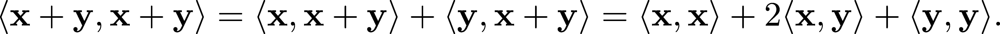
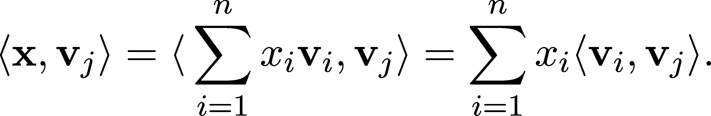
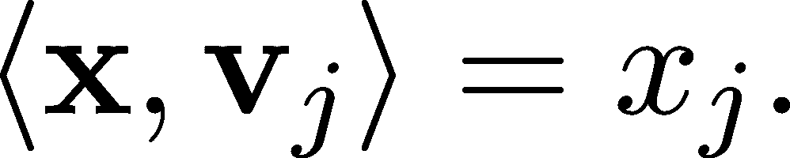
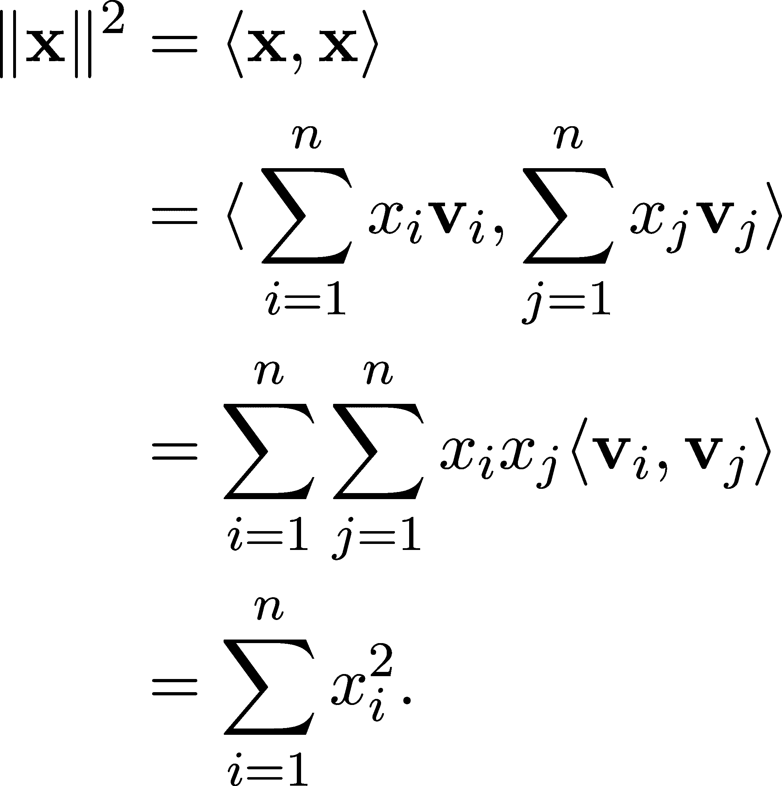
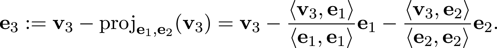
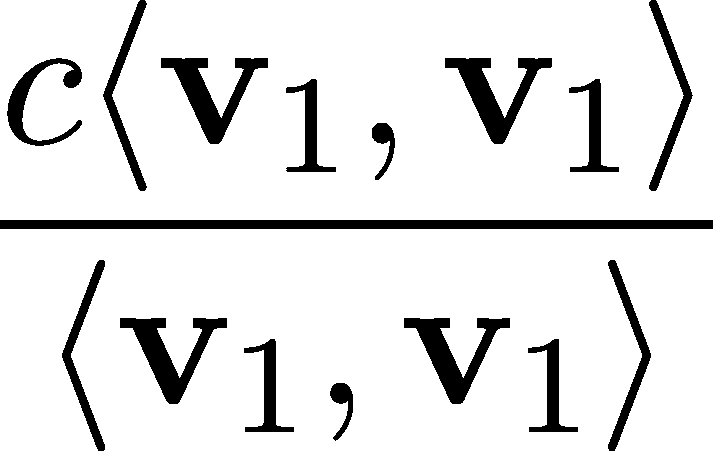

向量空间的几何结构

让我们重新审视上一章中介绍的鸢尾花数据集！我想考察一下你的直觉。我将花瓣宽度与花瓣长度绘制在一起，并在图 2.1 中隐藏了类别标签：

```py
import matplotlib.pyplot as plt 
from sklearn.datasets import load_iris 

# 第四章：Load the iris dataset 
iris = load_iris() 
data = iris.data 

# Extract petal length (3rd column) and petal width (4th column) 
petal_length = data[:, 2] 
petal_width = data[:, 3] 

with plt.style.context("/span>seaborn-v0_8": 
    # Create the scatter plot 
    plt.figure(figsize=(7, 7)) 
    plt.scatter(petal_length, petal_width, color=’indigo’, alpha=0.8, edgecolor=’none’, s=70, marker=’o’) 
    plt.xlabel(’petal length (cm)’) 
    plt.ylabel(’petal width (cm)’) 
    plt.show()
```


图 2.1：鸢尾花数据集中的“花瓣宽度”和“花瓣长度”特征

即使没有知道任何标签，我们也可以凭直觉指出，可能至少有两个类别。你能用一句话总结你的推理吗？

有许多有效的论点，但最常见的观点是，两个簇之间相距很远。正如这个例子所示，距离的概念在机器学习中起着至关重要的作用。在本章中，我们将把距离的概念翻译成数学语言，并将其置于向量空间的背景下。

## 2.1 范数与距离

之前，我们看到向量本质上是从零向量开始的箭头。除了方向，向量还有大小。例如，正如我们在高中数学中学到的，欧几里得平面中的大小定义为


同时我们可以计算 x 和 y 之间的距离为


（函数 ∥⋅∥ 仅表示向量的大小。）


图 2.2：欧几里得平面中的大小

大小公式  可以简单地推广到更高维度，方法是


然而，仅从这个公式看，并不清楚为什么它是这样定义的。平方和的平方根与距离和大小有什么关系呢？实际上，它背后只是勾股定理。

记住，勾股定理指出，在直角三角形中，斜边的平方等于其他两边的平方和，如图 2.3 所示。


图 2.3：勾股定理

将其转换为代数形式时，它表明 a² + b² = c²，当 c 是直角三角形的斜边，a 和 b 是它的两个其他边。如果我们将此应用于二维向量 x = (x[1],x[2])，我们可以看到，勾股定理给出了其大小 ∥x∥ = 。

这可以推广到更高维度。为了看看发生了什么，我们将检查三维情况，如图 1.4 所示。在这里，我们可以将勾股定理应用两次来得到大小！


图 2.4：三维空间中的勾股定理

对于每个向量 x = (x[1],x[2],x[3])，我们可以首先查看由(0,0,0)、(x[1],0,0)和(x[1],x[2],0)确定的三角形。斜边的长度可以通过来计算。然而，点(0,0,0)、(x[1],x[2],0)和(x[1],x[2],x[3])形成一个直角三角形。再次应用毕达哥拉斯定理，我们得到


这被称为欧几里得范数。这正是一般 n 维情况下发生的事情。

在机器学习中，大小和距离的概念至关重要，因为我们可以利用它们来确定数据点之间的相似度，衡量并控制神经网络的复杂度，等等。

毕达哥拉斯定理是唯一可行的度量大小和距离的方法吗？当然不是。

由于曼哈顿的街道布局本质上是一个矩形网格，其居民以按街区测量距离而闻名。如果某个地方位于北方两街区和东方三街区，那么就意味着你需要先向北走两个交叉口，再向东走三个交叉口才能到达。由此产生了一种数学上完全有效的度量概念，称为曼哈顿距离，定义为


使用曼哈顿距离时，两个点之间的最短路径不是唯一的。


图 2.5：对于曼哈顿距离，两个点之间的最短路径不是唯一的

除了欧几里得距离和曼哈顿距离外，还有其他几种度量。我们将再次从具体实例中抽离，采用抽象的视角来讨论。

如果我们谈论一般的测量和度量，那么我们期望它们具备哪些属性呢？什么构成了测量距离？本质上，有三个这样的特征：

+   距离应该是非负的，

+   它应该保持缩放性（即， 对所有标量成立），

+   从点到的直线距离始终等于或小于触及任何其他点的距离。

这些都通过范数的概念来形式化。

定义 7\.（范数）

设是一个向量空间。若函数，以下性质成立：

1.  正定性： 且 当且仅当。

1.  正齐次性： 对所有成立。

1.  三角不等式： 对所有成立。

配备范数的向量空间称为范数空间。

让我们看一些例子吧！

示例 1\. 设 p ∈ 1,∞)，并定义

![ ∑n p 1∕p ∥x∥p = ( |xi|) , x = (x1,...,xn ) i=1

在 ℝ^n 上，函数 ∥⋅∥[p] 被称为 p-范数。证明 ∥⋅∥[p] 确实是一个范数有点技术性。因此，我们不会进入详细的讨论。（三角不等式需要一些工作，但其他两个性质很容易看出。）

我们已经看到了两个特殊情况：欧几里得范数（p = 2）和曼哈顿范数（p = 1）。它们在机器学习中经常出现。例如，常见的均方误差就是预测值和真实值之间的缩放欧几里得距离：


如前所述，2-范数与 1-范数通常一起用于训练过程中控制模型的复杂度。举个具体的例子，假设我们正在拟合一个多项式 f(x) = ∑ [i=0]^mq[i]x^i 到数据 {(x[1],y[1]),…,(x[n],y[n])}。为了得到一个对新数据有良好泛化能力的模型，我们希望模型尽可能简单。因此，我们可能考虑最小化损失：

![Loss(y,ˆy,q) = MSE (y, ˆy)+ λ∥q ∥p, q = (q0,q1,...,qm), λ ∈ 0,∞ ) 

其中项 ∥q∥[p] 负责保持多项式 f(x) 的系数较小，而 λ 控制正则化的强度。通常，p 的值为 1 或 2，但 1,∞) 区间内的其他值也是有效的。

示例 2\. 让我们再在 ℝ^n 上停留一会儿！所谓的 ∞-范数定义为

![∥x ∥ = max {|x |,...,|x |}. ∞ 1 n 

证明 ∥⋅∥[∞] 确实是一个范数是一个简单的任务，留给你自己练习。（这或许是数学教材中最臭名昭著的一句话，但相信我，这真的很简单。试试看！如果你看不懂，可以尝试特殊情况 ℝ²。）

这就是所谓的 ∞-范数，并且与我们刚才看到的 p-范数有着密切的关系。事实上，如果我们让 p 的值无限增大，∥x∥[p] 将非常接近 ∥x∥[∞]，最终在极限时达成一致。

备注 2\. （∞-范数作为 p-范数的极限）

如果你已经熟悉收敛序列和极限，你会看到这是所谓的 ∞-范数，因为


为了证明这一点，考虑到


由于根据定义！-|xi|- ∥x∥∞ ≤ 1，


成立。因为


我们可以得出结论：


这就是为什么 ∞-范数被视为一个 p-范数，其中 p = ∞。

如果你不熟悉序列极限的概念，不用担心。我们将在学习单变量微积分时详细讲解这一点。

示例 3\. ∞-范数可以推广到函数空间。还记得 C([0,1])吗？这是在第 1.1.1 节中介绍的连续函数的向量空间示例。在那里，∥⋅∥[∞]可以定义为

![∥f∥∞ = sup |f (x )|. x∈[0,1] ](img/file108.png)

这种范数可以在其他函数空间中定义，例如 C(ℝ)，即连续实函数的空间。由于最大值不能保证存在（例如在 C(ℝ)中的 S 形函数），最大值被替换为上确界。因此，∞-范数通常被称为上确界范数。

如果将函数想象为一种景观，则上确界范数是最高峰的高度或最深槽的深度（无论绝对值较大者）。


图 2.6：上确界范数

当第一次遇到这种范数时，可能会觉得难以理解它与任何大小概念有什么关系。然而，∥f −g∥[∞]是衡量两个函数 f 和 g 之间距离的一种自然方式，一般来说，大小只是与 0 的距离。


图 2.7：由上确界范数给出的两个函数之间的距离

### 2.1.1 定义从范数到距离的距离

除了测量向量的大小外，我们还对测量它们之间的距离感兴趣。如果您在某个诱导范数空间中的位置为 x，则 y 有多远？在诱导范数向量空间中，我们可以通过以下方式定义任何 x 和 y 之间的距离


这被称为诱导范数的度量。因此，范数衡量了与零向量的距离，而度量 d 衡量了差异的范数。

通常，我们说函数 d：V ×V → 0,∞)是一种度量，如果以下条件对于所有 x,y,z ∈ V 都成立。

定义 8\. （度量）

让 ![V  是一个向量空间，d：V ×V → 0,∞) 是一个函数。如果以下条件对于所有的 x,y,z ∈ V 都成立，d 就是一个度量：

1.  当 d(x,y ) = 0 时，我们有 x = y（正定性）。

1.  d (x, y) = d (y, x)（对称性）。

1.  d (x, z) ≤ d(x,y )+ d(y,z)(三角不等式)。

定义的一个直接结果是，如果 x≠y，则 d(x,y)/span>0。 （由于正定性给出了 d(x,y) = 1 意味着 x = y。）

由于向量空间的线性结构，我们可以快速检查 d(x,y) = ∥x−y∥确实是一种度量。这是因为范数生成的度量对平移是不变的。也就是说，对于任意的 x,y,z ∈V ，我们有

![d(x,y) = d(x + z,y + z). 

换句话说，你从哪里出发并不重要：距离只取决于你的位移。这对于任何度量来说都不成立。因此，诱导范数度量是特殊的。在我们的研究中，我们只处理这些特殊情况。因此，我们甚至不会讨论度量，只讨论范数。

向量空间本身只是一个骨架，它提供了一种表示数据的方式。在此基础上，范数定义了一种几何结构，揭示了大小和距离等属性。这两者在机器学习中都是至关重要的。例如，一些无监督学习算法根据数据点之间的相互距离将数据点分成不同的簇。

还有一种方法可以增强向量空间的几何结构：内积，也称为点积。我们将在下一节中对这个概念进行详细探讨。

## 2.2 内积、角度及其重要性

在上一节中，我们给向量空间赋予了范数，用来衡量向量的大小和点之间的距离。在机器学习中，这些概念可以用于，例如，识别无标签数据集中的簇。然而，在没有上下文的情况下，距离往往是不够的。根据我们的几何直觉，我们可以希望测量数据点之间的相似性。通过内积（也称为点积）可以实现这一点。

你可以回想起内积是我们用来测量两向量之间角度的量，就像在高中几何课上学到的那样。给定平面上的两个向量 x = (x[1],x[2]) 和 y = (y[1],y[2])，我们通过以下方式定义它们的内积：


可以证明

⟨x,y⟩ = ∥x∥∥y∥ cosα （2.1）

其成立，其中 α 是 x 和 y 之间的角度。（事实上，存在两个这样的角度，但它们的余弦值相等。）因此，角度本身可以通过以下方式提取：


其中 arccosx 是余弦函数的反函数。我们可以使用内积来确定两个向量是否正交，因为只有当 ⟨x,y⟩ = 0 时，才成立正交性。在我们早期接触到的数学中，几何直觉（比如正交性）是首先出现的，然后我们才构建了像内积这样的工具。然而，如果我们放远来看，并采取一种抽象的观点，事情恰恰相反。正如我们很快会看到的，内积的出现非常自然，推动了正交性的普遍概念的形成。

一般来说，这是内积的正式定义。

定义 9. （内积与内积空间）

设 V 为实向量空间。函数 ⟨⋅,⋅⟩ : V × V → ℝ 称为内积，如果对所有 x, y, z ∈ V 和 a ∈ ℝ，以下条件成立：

1.  ⟨ax + y,z⟩ = a⟨x,z⟩ + ⟨y, z⟩ （第一个变量的线性性）。

1.  ⟨x,y ⟩ = ⟨y,x ⟩ （对称性）。

1.  ⟨x,x ⟩ > 0 对所有  （正定性）。

带有内积的向量空间称为内积空间。

立刻，我们可以立即推导出两个性质。首先，

 （2.2）

作为特例，⟨0,0⟩ = 0。就像我们之前看到的范数一样，有更多的性质成立：如果 ⟨x,x⟩ = 0，那么 x = 0。这是由正定性和（2.2）推导出来的。

此外，由于第一个变量的对称性和线性，内积在第二个变量上也是线性的。因此，它们被称为双线性的。

为了熟悉这个概念，让我们看一些例子！

示例 1\. 像往常一样，内积空间的典型且最普遍的例子是 ℝ^n，其中内积 ⟨⋅,⋅⟩ 被定义为


这个双线性函数通常被称为点积。配备了这个，ℝ^n 被称为 n 维欧几里得空间。这是机器学习中的一个核心概念，因为数据通常表示为欧几里得空间中的向量。因此，我们将在本书中详细探索这个空间的结构。

示例 2\. 除了欧几里得空间，还有其他在数学和机器学习中扮演重要角色的内积空间。如果你熟悉积分，在某些函数空间中，双线性函数


定义了一个具有非常丰富和美丽结构的内积空间。

⟨f,g⟩ 的对称性和线性是显而易见的。只有正定性似乎是一个问题。

例如，如果 f 被定义为


那么 f ≠ 0，但 ⟨f,f⟩ = 0\. 这个问题可以通过“重载”相等操作符并让 f = g 当且仅当 ∫ [−∞]^∞|f(x) −g(x)|² dx = 0 来避免。尽管像这样的函数空间在数学和机器学习中扮演着重要角色，但它们的研究超出了我们讨论的范围。

### 2.2.1 生成的范数

回想一下，ℝ^n 中的 2-范数定义为 ∥x∥[2] = (∑ [i=1]^nx[i]²)^(1∕2)，根据我们在此处对内积的定义，它等于 。这不是巧合。内积可以用来定义向量空间上的范数。

为了确切地展示这一点，我们需要一个简单的工具：柯西-施瓦茨不等式。

定理 8\.（柯西-施瓦茨不等式）

设 V 为一个内积空间。那么，对于任何 x,y ∈ V，不等式


成立。

证明。此时，我们对内积了解得还不多，只知道它的核心定义特性。因此，我们将使用一个小技巧。对于任何 λ ∈ ℝ，正定性意味着


另一方面，由于双线性（即，两个变量的线性）和对称性，我们有

 (2.3)

这是一个关于λ的二次多项式。一般来说，我们知道，对于任何形如 ax² + bx + c 的二次多项式，其根由公式给出：


由于


由（2.3）定义的多项式最多只有一个实根。因此，判别式 b² − 4ac 非正。将多项式（2.3）的系数代入判别式公式，我们得到


这就完成了证明。

柯西-施瓦茨不等式可能是研究内积空间中最有用的工具之一。接下来我们将看到的一个应用是展示内积如何定义范数。

定理 9\.（由内积生成的范数）

设 V 为内积空间。那么，定义函数 ∥⋅∥ : V → 0, ∞) 由内积诱导。则，

![ ∘ ------ ∥x∥ = ⟨x, x⟩ 是 V 上的一个范数。证明。根据范数的定义，我们必须证明三个性质成立：正定性、齐次性和三角不等式。前两个性质可以通过内积的性质轻松推导出来。三角不等式则来自柯西-施瓦茨不等式：∥x + y∥² = ⟨x + y, x + y⟩= ∥x∥² + ∥y∥² + 2⟨x, y⟩≤ ∥x∥² + ∥y∥² + 2∥x∥∥y∥= (∥x∥ + ∥y∥)²，从中得出三角不等式。因此，内积空间也是带有范数的空间。它们具有适当的代数和几何结构，我们需要这些结构来表示、操作和转换数据。最重要的是，定理 9 是可以反向的！也就是说，给定一个范数 ∥⋅∥，我们可以定义一个匹配的内积。定理 10\.（极化恒等式）设 V 为内积空间，∥⋅∥ 为由内积诱导的范数。那么， （2.4）

换句话说，可以从范数生成内积，而不仅仅是反过来。

证明。由于内积是双线性的，我们有


从中得出极化恒等式（2.4）。

### 2.2.2 正交性

在除 ℝ² 外的向量空间中，包含角度的概念完全不明确。例如，在向量是函数的空间中，没有直观的方法定义两个函数之间的角度。然而，正如（2.1）所示，在特例 ℝ² 中，这些可以被推广。

定义 10\.（向量的正交性）

设 V 为内积空间，x, y ∈ V 。我们说 x 和 y 互为正交，当且仅当


正交性用 x ⊥ y 表示。

为了说明内积和正交性如何定义向量空间上的几何，我们来看看经典的毕达哥拉斯定理在这个新形式中的表现。回想一下，原版的定理表示，在直角三角形中，a² + b² = c²，其中 c 是斜边的长度，而 a 和 b 是其他两边的长度。

在内积空间中，这个概念以以下方式进行推广。

定理 11\.（毕达哥拉斯定理）

设 V 为内积空间，x, y ∈ V 。那么，x 和 y 互为正交，当且仅当

⟨x + y, x + y⟩ = ⟨x, x⟩ + ⟨y, y⟩。 （2.5）

证明。根据内积和正交性的定义，证明过程很直接。由于双线性，我们有



由于 x 和 y 正交，我们有⟨x, y⟩ = 0。因此，方程简化为：


这完成了证明。

为什么这是毕达哥拉斯定理的另一种形式？因为范数和内积通过⟨x, x⟩ = ∥x∥²相联系，（11）是等价的


这正是著名的“”。

### 2.2.3 内积的几何解释

从一般定义来看，很难对内积有直观的理解。然而，通过使用正交性这一概念，我们可以直观地了解⟨x, y⟩对任何 x 和 y 的含义。

直观地说，任何 x 都可以分解为两个向量 x[o] + x[p]的和，其中 x[o]与 y 正交，而 x[p]与 y 平行。


图 2.8：x 分解为与 y 平行和正交的分量

让我们把直觉弄得更精确一些。我们如何找到 x[p]和 x[o]呢？由于 x[p]与 y 的方向相同，因此可以写成 x[p] = cy，其中 c 是某个标量 c ∈ℝ。因为 x[p]和 x[o]的和等于 x，所以我们也有 x[o] = x − x[p] = x − cy。

由于 x[o]与 y 正交，因此常数 c 可以通过解方程来确定。


通过利用内积的双线性性质，我们可以从这个方程中求解出 c。因此，我们得到


所以，

 (2.6)

我们称 x[p]为 x 在 y 上的正交投影。这是一个常见的变换，因此我们将引入符号

projy =  y. (2.7)

从中，我们可以看出 y 与 projy 之间的比例关系可以通过内积来描述。

到目前为止，我们已经看到可以使用内积来定义两个向量之间的正交关系。那么，我们能否用它来测量（并且在某些情况下，甚至定义）角度呢？答案是肯定的！接下来，我们将看到如何做到这一点，最终得出从基本几何学中已经熟悉的公式（2.1）。

为了构建我们的直觉，让我们选择两个任意的 n 维向量 x，y ∈ℝ^n。x + y 的内积可以通过双线性性质来计算。


图 2.9：x 与 y 的和

这样，我们得到

 (2.8)

另一方面，考虑到 x、y 和 x + y 形成一个三角形，我们可以使用余弦定律（[`en.wikipedia.org/wiki/Law_of_cosines`](https://en.wikipedia.org/wiki/Law_of_cosines)）将⟨x + y, x + y⟩ = ∥x + y∥²以另一种形式表示。

在这里，余弦定律意味着

∥x + y∥² = ∥x∥² + ∥y∥² − 2∥x∥∥y∥  [=−cos α] 。(2.9)

通过结合 (2.8) 和 (2.9)，我们得到


也就是说，在 ℝ^n 中，x 和 y 之间的夹角可以通过以下方式提取：

α = arccos  。(2.10)


图 2.10：由 x、y 和 x + y 组成的三角形

如果在向量空间中没有定义向量之间的角度怎么办？我们已经看到过一些向量空间（第 1.1.1 节），其中元素是多项式、函数以及其他数学对象。在这些情况下，(2.10)可以用来定义角度！

让我们进一步探讨这个想法，看看如何使用内积来度量相似性。

结合我们将内积解释为正交投影的几何理解，让我们关注当 x 和 y 都是单位范数时的情况。在这种特殊情况下，正交投影等于


因此，⟨x,y⟩ 精确地描述了正交投影的符号大小。（当 和 y 方向相反时，它可能是负数。）

鉴于此，我们可以看到，内积等于两个向量之间夹角的余弦值。让我们画一张图来说明！（回想一下，在直角三角形中，余弦是邻边和斜边长度的比值。在这种情况下，邻边的长度是 ⟨x,y⟩，而斜边的长度是单位长度。）


图 2.11：两个单位向量的内积等于它们夹角的余弦值

在机器学习中，这个量常用于衡量两个向量的相似性。

因为任何向量 x 都可以通过变换 x → x∕∥x∥ 缩放为单位范数，我们定义余弦相似度为

cos(x,y) =   ,   。(2.11)

如果 x 和 y 表示两个数据样本的特征向量，cos(x,y) 告诉我们这些特征是如何共同变化的。注意，由于缩放的原因，两个具有较高余弦相似度的样本可能相距很远。因此，这并不能揭示它们在特征空间中的相对位置。

### 2.2.4 正交与正交归一基

从相似性的角度来看，正交意味着一个向量不包含另一个向量的“信息”。当我们学习相关性时，我们将更加精确地定义这个概念，但它对于内积空间的结构有着明确的影响。回想一下，在介绍基向量时（第 1.2 节），我们的动机是找到一个最小的向量集合，可以用来表示其他任何向量。通过引入正交性，我们可以更进一步。

定义 11.（正交与正交归一基）

设  是一个向量空间，S = {v1,...,vn } 是其基。我们说  是正交基，如果 ⟨vi,vj⟩ = 0 当且仅当 。

此外，  被称为正交归一，如果


换句话说，  是正交归一的，如果，除了是正交的外，每个向量都有单位范数。

正交和正交归一基非常方便使用。如果一个基是正交的，我们可以通过简单地将其向量缩放到单位范数，轻松获得一个正交归一基。因此，我们大多数时候会使用正交归一基向量。

为什么我们如此喜欢正交归一基？为了看到这一点，设 {v[1],…,v[n]} 是任意基，且  是任意向量。我们知道


但是我们如何找到系数 x[i] 呢？有一种涉及线性方程的一般方法，我们将在第六章中看到，不过如果 {v[i]}[i=1]^n 是正交归一的，情况就简单多了。

这一点在以下定理中得到了更精确的阐述。

定理 12\。

设  是一个向量空间，且  是  的正交归一基。那么，对于任意的 ，

x = ∑ [i=1] ^n ⟨x,v[i]⟩ v[i] (2.12)

保持成立。

证明。由于  形成一个基，我们可以将  表示为


对某些标量 。通过内积的线性性，我们得到



由于  形成一个正交归一基，我们有


因此，求和简化为



这证明了这个结果。

因此，系数可以通过内积计算得到。换句话说，对于正交归一基，x[j] 仅依赖于第 j 个基向量。

由于正交归一性的另一个结果，计算范数也变得更加容易，因为我们总是可以用系数来表示它。更准确地说，我们有

 (2.13)

这被称为帕尔塞瓦尔恒等式。换句话说，如果 x 是用正交归一基表示的，那么它的范数很容易找到。这个公式与欧几里得范数如此相似并非偶然！(请注意，这里 ∥⋅∥ 是一个一般范数。) 事实上，平方的欧几里得范数


这只是使用标准基的 (2.13)。

### 2.2.5 格拉姆-施密特正交化过程

正交基很棒，但我们如何找到它们呢？

有一个通用的方法叫做 Gram-Schmidt 正交化过程，它解决了这个问题。该算法接受任何一组基向量 {v[1],…,v[n]}，并输出一个正交规范基 {e[1],…,e[n]}

使得


也就是说，两组中前 k 个向量生成的子空间相匹配。

我们怎么做呢？这个过程很简单。让我们首先集中精力找到一个正交系统，我们可以稍后将其归一化以达到正交规范化。我们将迭代地构建我们的集合 {e[1],…,e[n]}。很明显，


是一个不错的选择。现在，我们的目标是找到 e[2]，使得 e[2] ⊥ e[1]，并且它们共同生成与 {v[1],v[2]} 相同的子空间。还记得我们在第 2.2.3 节讨论过的正交性的几何解释吗？v[2] 相对于 e[1] 的正交分量将是 e[2] 的一个好选择。因此，设


根据定义，显然有 e[2] ⊥ e[1]，同时也可以看出 {e[1],e[2]} 生成的子空间与 {v[1],v[2]} 相同。

在下一步中，我们执行相同的过程。我们将 v[3] 投影到由 e[1] 和 e[2] 生成的子空间上，然后将 e[3] 定义为 v[3] 和投影的差异。即，



这样，我们本质上去除了 e[1] 和 e[2] 对 v[3] 的“贡献”，从而得到一个与之前的向量正交的 e[3]。

一般而言，如果我们已经有 e[1],…,e[k]，那么可以通过以下方式找到向量 e[k+1]：


其中

 (2.14)

是广义正交投影算子，将一个向量投影到由 {e[1],…,e[k]} 生成的子空间上。

为了验证 e[k+1] ⊥ e[1],…,e[k]，我们有

 (2.15)

由于 e[i] 的正交性和内积的线性性质。由于 {e[1],…,e[k]} 和 {v[1],…,v[k]} span 同一子空间，并且 e{k + 1} 是 v[k+1] 和 e[1],…,e[k] 的线性组合（其中 v[k+1] 的系数非零），


也可以推导出来。这可以重复进行，直到我们用完所有向量并找到 {e[1],…,e[n]}。

为了进一步参考、数学正确性，以及一点点完美主义，我们将上述所有内容总结成一个定理。

定理 13.（Gram-Schmidt 正交化过程）

设 V 为一个内积向量空间，{v[1],…,v[n]} ⊆ V 是一组线性无关的向量。那么，存在一个正交规范集 {e[1],…,e[n]} ⊆ V，使得


对于任何 k = 1,…,n，公式成立。

因此，我们可以断言，每个有限维的内积空间都有一个正交归一化基。我们甚至可以通过 Gram-Schmidt 过程显式构造它。

推论 1.（正交归一化基的存在）

设 V 为有限维内积空间。那么，V 中存在一个正交归一化基。

更进一步，我们可以将定理 13 及其证明视为一个算法。

（Gram-Schmidt 正交化过程）输入：一组线性无关的向量 {v[1],…,v[n]}⊆V。输出：一组正交归一化的向量 {e[1],…,e[n]}，使得 对于任何 k = 1,…,n 均成立。

注释 3.（Gram-Schmidt 过程中的线性相关输入）如果我们将 Gram-Schmidt 正交化过程应用于一组线性*相关*的向量，会发生什么？

为了更好地理解这个问题，让我们考虑一个简单的情况：两个向量 {v[1],v[2] = cv[1]}，其中 c 是一个任意的标量。e[1] 被选择为 v[1]，而 e[2] 定义为


通过展开投影项，我们得到


由于 v[1] = e[1] 且 v[2] = cv[1]，我们得到

e[2] = cv[1] −v[1] = cv[1] −cv[1]= 0

这个结果可以推广：当 Gram-Schmidt 过程遇到与之前的向量线性相关的输入向量时，输出会生成一个零向量。

### 2.2.6 正交补

之前我们看到，给定一个固定向量 y ∈V，我们可以将任何 x ∈V 分解为 x = x[o] + x[p]，其中 x[o] 与 y 正交，而 x[p] 与 y 平行。（我们用这个来提供内积几何解释的动机，见 2.2.3 节。）

这是一个重要工具，在这一节中，我们将看到当 y 被任意子空间 S ⊂V 替代时，这一分解的类似物仍然成立。为了理解这一点，让我们讨论子空间的正交性。（如果你想回顾子空间的定义，查看定义 5。）

定义 12.（正交子空间）

设 V 为任意的内积空间。我们说子空间 S[1] 和 S[2] ⊆V 是正交的，当且仅当对于每一对向量 x ∈S[1] 和 y ∈S[2]，有 ⟨x,y⟩ = 0。记作 S[1] ⊥S[2]。

例如，x 轴和 y 轴是 ℝ² 中的正交子空间。（就像在 ℝ³ 中，xy 平面与 z 轴正交一样。）

类似地，我们可以讨论一个向量与子空间的正交性：如果 x 正交于 S 中的所有向量，则称 x 与子空间 S 正交，符号为 x ⊥S。

构造正交子空间最直接且重要的方法之一是取正交补。

定义 13.（正交补）

设 V 为一个任意的内积空间，S ⊆ V 为子空间。定义的集合为

 (2.16)

称为 S 的正交补。

S^⊥ 不仅仅是一个集合，它是一个子空间，正如我们即将看到的那样。

定理 14\。

设  为任意内积空间， 与  正交，

1.   是  的一个子空间，

1.  且 。

证明：根据子空间的定义，我们只需证明 S^⊥ 在加法和标量乘法下是封闭的。由于内积是双线性的，这一点很容易证明：


对任意向量 x,y ∈S^⊥，z ∈S 和标量 a,b，成立。

为了证明 S ∩ S^⊥ = {0}，我们取任意 x ∈ S ∩ S^⊥。根据 S^⊥ 的定义，我们有 ⟨x,x⟩ = 0。由于内积按定义是正定的，x 必须是零向量 0。

回想一下，任意 x ∈V 如何相对于固定向量 y 被分解为平行分量和正交分量？从子空间的角度来看，我们可以将其重新表述为


也就是说，V 可以写成由 y 张成的向量空间与其正交补的直和形式。这是一个非常强大的结果，因为它使我们能够将 x 从 y 中解耦。例如，如果我们将向量看作特征的集合（就像我们最喜爱的鸢尾花数据集中的花萼和花瓣宽度与长度测量一样），y 可以表示我们希望从分析中排除的某个特征。

利用正交补的概念，我们可以使这个命题在数学上更加精确。我们还可以更加一般化。事实上，这个分解


对任意子空间 S 成立！让我们来看一下证明！

定理 15\。

设 V 为任意有限维内积空间，S ⊂V 为其子空间。那么，


成立。

证明：设 v[1],…,v[k] ∈S 是 S 的一组基。像在 Gram-Schmidt 过程中的做法一样，我们可以定义广义的正交投影（3.2.5），其形式为


利用这个，我们可以将任意 x ∈V 分解为

 (2.17)

由于 proj[v[1],…,v[k]](x) 是 v[i] 的线性组合，它属于 S。另一方面，内积的双线性性质使得 x − proj[v[1],…,v[k]](x) ∈S^⊥。事实上，正如我们所见


向量 x − proj[v[1],…,v[k]](x) 与每个 v[j] 正交。因此，由于 v[1],…,v[k] 是 S 的一组基，x 也正交于 S，因此 x − proj[e[1],…,v[k]](x) ∈S^⊥。

每个 x ∈V 都可以分解为 S 中一个向量与 S^⊥ 中一个向量的和，正如 (3.2.6) 所给出的，这意味着 V = S + S^⊥，这是我们要证明的。

## 2.3 摘要

在本章中，我们学到了，除了由加法和标量乘法给出的代数结构，向量还具有从内积中产生的美丽几何。通过内积，我们得到了范数；通过范数，我们得到了度量；通过度量，我们得到了几何和拓扑。

距离、相似性、角度和正交性都来源于内积这一简单概念。这些在理论和实践中都非常有用。例如，内积为我们提供了通过所谓的余弦相似性来量化两个向量相似度的方法，但它们也为我们提供了通过正交性的概念来寻找最优基的方法。

总结一下，我们已经学习了什么是范数和距离，内积的定义，内积如何给出角度和范数，以及这些在机器学习中的应用为何如此重要。

除了基本的定义和性质，我们还遇到了第一个算法：格拉姆-施密特过程，将一组向量转化为正交标准基。这是最好的基。

在下一节中，我们将把所有这些理论付诸实践，迈出计算线性代数的第一步。我们开始吧！

## 2.4 问题

问题 1\. 设 V 为一个向量空间，定义函数 d : V ×V → 0,∞) 为：

![ ( |{ 0 如果 x = y, d(x,y) = |( 1 否则。 

(a) 证明 d 是一个度量（见定义 8）。

(b) 证明 d 无法来自于范数。

问题 2\. 设 S[n] 为所有长度为 n 的 ASCII 字符串集合，并定义任意两个 x,y ∈S[n] 的汉明距离 h(x,y) 为 x 和 y 在相应位置不同的个数。

例如，


证明 h 满足度量的三个定义性质。（注意，S[n] 不是一个向量空间，因此从严格意义上说，汉明距离不是度量。）

问题 3\. 设 ∥⋅∥ 为向量空间 ℝ^n 上的一个范数，定义映射 f : ℝ^n →ℝ^n，


证明：


是 ℝ^n 上的一个范数。

问题 4\. 设 a[1],…,a[n] > 0 为任意正数。证明：


是一个内积，其中 x = (x[1],…,x[n]) 和 y = (y[1],…,y[n])。

问题 5\. 设 V 为有限维内积空间，v[1],…,v[n] ∈V 为 V 中的一个基，定义：


证明对于任意 x,y ∈V，


其中 x = ∑ [i=1]^n x[i]v[i]，y = ∑ [i=1]^n y[i]v[i]。

问题 6\. 设 V 为有限维实内积空间。

(a) 设 y ∈V 为任意向量。证明：


是一个线性函数（即，对于所有 u,v ∈V 和 α,β ∈ℝ，满足 f(αu + βv) = αf(u) + βf(v)）。

(b) 设 f : V →ℝ 为任意线性函数。证明存在一个 y ∈V，使得：


（注意，(b) 是 (a) 的反向，是一个更有趣的结果。）

问题 7. 设 V 为实数内积空间，且 ∥x∥ =  为生成的范数。证明

 (2.18)

这被称为平行四边形法则，因为如果我们将 x 和 y 看作确定平行四边形的两条边，(3.4) 将平行四边形两条边的长度与对角线的长度联系起来。

问题 8. 设 V 为实数内积空间，u,v ∈V 。证明若


对于所有的 x ∈V，若成立，则 u = v。

问题 9. 对输入向量应用格拉姆-施密特过程


## 加入我们在 Discord 上的社区

与其他用户、机器学习专家以及作者本人一起阅读本书。提问、为其他读者提供解决方案、通过问我任何问题的环节与作者互动，等等。扫描二维码或访问链接加入社区。[`packt.link/math`](https://packt.link/math)


