线性代数实战

现在我们已经理解了向量空间的几何结构，是时候再次将理论付诸实践了。在本章中，我们将动手实践范数、内积和 NumPy 数组操作。最重要的是，我们将首次接触矩阵。

上一次我们将理论转化为代码时，停留在为向量寻找理想表示形式的阶段：NumPy 数组。NumPy 是为线性代数而构建的，它比原生 Python 对象处理计算的速度要快得多。

那么，让我们初始化两个 NumPy 数组来玩一玩吧！

```py
import numpy as np 

x = np.array([1.8, -4.5, 9.2, 7.3]) 
y = np.array([-5.2, -1.1, 0.7, 5.1])
```

在线性代数中，以及在大多数机器学习中，几乎所有的操作都涉及逐个遍历向量的分量。例如，加法可以这样实现。

```py
def add(x: np.ndarray, y: np.ndarray): 
    x_plus_y = np.zeros(shape=len(x)) 

    for i in range(len(x_plus_y)): 
        x_plus_y[i] = x[i] + y[i] 

    return x_plus_y
```

```py
add(x, y)
```

```py
array([-3.4, -5.6,  9.9, 12.4])
```

当然，这远非最优。（如果向量的维度不同，这可能甚至不起作用。）

例如，加法是高度并行化的，而我们的实现并没有充分利用这一点。使用两个线程，我们可以同时执行两个加法操作。因此，两个二维向量的加法只需要一步，计算一个 x[0] + y[0]，而另一个计算 x[1] + y[1]。原生 Python 无法访问如此高性能的计算工具，但 NumPy 可以通过 C 实现的函数来实现。反过来，C 使用 LAPACK（线性代数程序包）库，LAPACK 调用了 BLAS（基础线性代数子程序）。BLAS 在汇编级别进行了优化。

所以，每当可能时，我们应尽量以 NumPythonic 的方式（是的，我刚刚造了这个词）处理向量。对于向量加法，这仅仅是 + 运算符，如我们之前所见。

```py
np.equal(x + y, add(x, y))
```

```py
array([ True,  True,  True,  True])
```

顺便说一下，你永远不应该使用 == 运算符来比较浮点数，因为由于浮点数表示，可能会出现内部舍入误差。下面的例子说明了这一点。

```py
1.0 == 0.3*3 + 0.1
```

```py
False
```

```py
0.3*3 + 0.1
```

```py
0.9999999999999999
```

要比较数组，NumPy 提供了 np.allclose 和 np.equal 函数。这些函数逐元素比较数组，返回一个布尔数组。从中，可以使用内建的 all 函数来判断是否所有元素都匹配。

```py
all(np.equal(x + y, add(x, y)))
```

```py
True
```

在接下来的部分，我们将简要回顾如何在实践中使用 NumPy 数组。

## 第五章：3.1 NumPy 中的向量

我们有两个操作是必须对向量进行的：逐元素应用函数或求元素的和/积。由于 +、* 和 ** 运算符已为我们的数组实现，某些函数可以从标量扩展，如下例所示。

```py
def just_a_quadratic_polynomial(x):
    return 3*x**2 + 1

x = np.array([1.8, -4.5, 9.2, 7.3])
just_a_quadratic_polynomial(x)
```

```py
array([ 10.72,  61.75, 254.92, 160.87])
```

然而，我们不能直接将 ndarray 插入到每个函数中。例如，让我们看看 Python 内建的 exp 函数，它来自 math 模块。

```py
from math import exp 

exp(x)
```

```py
--------------------------------------------------------------------------- 
TypeError                               Traceback (most recent call last) 
Cell In[10], line 3 
     1 from math import exp 
---->/span> 3 exp(x) 

TypeError: only length-1 arrays can be converted to Python scalars
```

为了克服这个问题，我们可以手动逐元素应用函数。

```py
def naive_exp(x: np.ndarray): 
    x_exp = np.empty_like(x) 

    for i in range(len(x)): 
        x_exp[i] = exp(x[i]) 

    return x_exp
```

（回想一下，np.empty_like(x) 创建一个未初始化的数组，该数组的维度与 x 相匹配。）

```py
naive_exp(x)
```

```py
array([6.04964746e+00, 1.11089965e-02, 9.89712906e+03, 1.48029993e+03])
```

一个略微不那么天真的实现会使用列表推导式来达到相同的效果。

```py
def bit_less_naive_exp(x: np.ndarray): 
    return np.array([exp(x_i) for x_i in x]) 

bit_less_naive_exp(x)
```

```py
array([   6\. ,    0\. , 9897.1, 1480.3])
```

尽管列表推导式更简洁且更具可读性，但它们仍然无法避免核心问题：Python 中的 for 循环。

这个问题通过 NumPy 著名的 ufuncs 解决，即对整个数组逐元素操作的函数（[`numpy.org/doc/stable/reference/generated/numpy.ufunc.html`](https://numpy.org/doc/stable/reference/generated/numpy.ufunc.html)）。由于它们是用 C 实现的，因此运行速度非常快。例如，指数函数 f(x) = e^x 由 np.exp 给出。

```py
np.exp(x)
```

```py
array([6.04964746e+00, 1.11089965e-02, 9.89712906e+03, 1.48029993e+03])
```

不出所料，我们的实现结果一致。

```py
all(np.equal(naive_exp(x), np.exp(x)))
```

```py
True
```

```py
all(np.equal(bit_less_naive_exp(x), np.exp(x)))
```

```py
True
```

同样，使用 NumPy 函数和操作的优势不止于简单。在机器学习中，我们非常关心速度，正如我们即将看到的，NumPy 再次展现了其优势。

```py
from timeit import timeit

n_runs = 100000
size = 1000

t_naive_exp = timeit(
    "np.array([exp(x_i) for x_i in x])",
    setup=f"import numpy as np; from math import exp; x = np.ones({size})",
    number=n_runs
)

t_numpy_exp = timeit(
    "np.exp(x)",
    setup=f"import numpy as np; from math import exp; x = np.ones({size})",
    number=n_runs
)

print(f"Built-in exponential:    \t{t_naive_exp:.5f} s")
print(f"NumPy exponential:       \t{t_numpy_exp:.5f} s")
print(f"Performance improvement: \t{t_naive_exp/t_numpy_exp:.5f} times faster")
```

```py
Built-in exponential:         18.35177 s 
NumPy exponential:             0.87458 s 
Performance improvement:       20.98356 times faster
```

如需进一步参考，您可以在这里找到可用的 ufunc 列表：[`numpy.org/doc/stable/reference/ufuncs.html\#available-ufuncs`](https://numpy.org/doc/stable/reference/ufuncs.html/#available-ufuncs)。

那么，关于汇总元素并返回单一值的操作呢？不出所料，这些操作在 NumPy 中也可以找到。例如，让我们看看求和。在数学公式中，我们要实现的是：

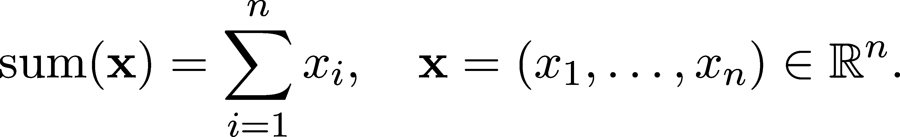

一种基本方法可能是这样的：

```py
def naive_sum(x: np.ndarray): 
    val = 0 

    for x_i in x: 
        val += x_i 

    return val 

naive_sum(x)
```

```py
np.float64(13.799999999999999)
```

或者，我们可以使用 Python 内置的求和函数。

```py
sum(x)
```

```py
np.float64(13.799999999999999)
```

故事是一样的：NumPy 做得更好。我们可以调用函数 np.sum，或者使用数组方法 np.ndarray.sum。

```py
np.sum(x)
```

```py
np.float64(13.799999999999999)
```

```py
x.sum()
```

```py
np.float64(13.799999999999999)
```

你现在知道我喜欢计时函数，所以我们再来比较一次性能。

```py
t_naive_sum = timeit( 
    /span>sum(x) 
    setup=f/span>import numpy as np; x = np.ones({size}) 
    number=n_runs 
) 

t_numpy_sum = timeit( 
    /span>np.sum(x) 
    setup=f/span>import numpy as np; x = np.ones({size}) 
    number=n_runs 
) 

print(f/span>Built-in sum:            \t{t_naive_sum:.5f} s 
print(f/span>NumPy sum:               \t{t_numpy_sum:.5f} s 
print(f/span>Performance improvement: \t{t_naive_sum/t_numpy_sum:.5f} times faster
```

```py
Built-in sum:                 5.52380 s 
NumPy sum:                     0.35774 s 
Performance improvement:       15.44076 times faster
```

类似地，乘积

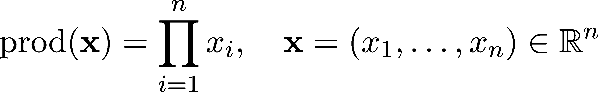

由 np.prod 函数和 np.ndarray.prod 方法实现。

```py
np.prod(x)
```

```py
np.float64(-543.996)
```

在很多情况下，我们需要找到一个数组的最大值或最小值。我们可以使用 np.max 和 np.min 函数来实现。（与其他函数类似，它们也可以作为数组方法使用。）经验法则是，如果你想进行任何数组操作，使用 NumPy 函数。

### 3.1.1 范数、距离和点积

现在我们已经回顾了如何高效地对向量进行操作，接下来是深入探讨真正有趣的部分：范数和距离。

让我们从最重要的一个开始：欧几里得范数，也称为 2-范数，定义为

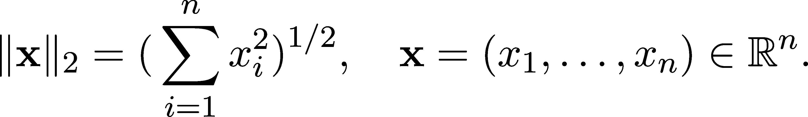

一个简单的实现如下。

```py
def euclidean_norm(x: np.ndarray): 
    return np.sqrt(np.sum(x**2))
```

请注意，我们的 euclidean_norm 函数是与维度无关的；也就是说，它适用于所有维度的数组。

```py
# a 1D array with 4 elements, which is a vector in 4-dimensional space 
x = np.array([-3.0, 1.2, 1.2, 2.1]) 

# a 1D array with 2 elements, which is a vector in 2-dimensional space 
y = np.array([8.1, 6.3]) 

euclidean_norm(x)
```

```py
np.float64(4.036087214122113)
```

```py
euclidean_norm(y)
```

```py
np.float64(10.261578825892242)
```

等等，我刚刚不是说过，我们应该尽可能使用 NumPy 函数吗？范数足够重要，以至于有自己的函数：np.linalg.norm。

```py
np.linalg.norm(x)
```

```py
np.float64(4.036087214122113)
```

通过快速检查，我们可以验证这些结果是否与我们的向量 x 匹配。

```py
np.equal(euclidean_norm(x), np.linalg.norm(x))
```

```py
np.True_
```

然而，欧几里得范数只是 p-范数的特例。回想一下，对于任何 p ∈ 0,∞)，我们通过以下公式定义 p-范数：

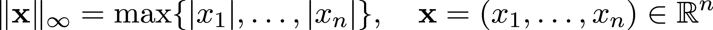

对于 p = ∞。保持代码库中的函数数量最少是一种好习惯，这样可以降低维护成本。我们能否将所有 p-范数合并成一个接收 p 值作为参数的 Python 函数？当然可以。我们只遇到了一个小问题：表示 ∞。Python 和 NumPy 都提供了各自的表示方法，但我们将使用 NumPy 的 np.inf。令人惊讶的是，这个是浮动类型。

```py
type(np.inf)
```

```py
float
```

```py
def p_norm(x: np.ndarray, p: float): 
    if np.isinf(p): 
        return np.max(np.abs(x)) 
    elif p  1: 
        return (np.sum(np.abs(x)**p))**(1/p) 
    else: 
        raise ValueError("/span>p must be a float larger or equal than 1.0 or inf."
```

由于 ∞ 可以有多种表示方式，比如 Python 内建的 math.inf，我们可以通过使用 np.isinf 函数来检查一个对象是否表示 ∞，从而让我们的函数更加健壮。

快速检查显示 p_norm 按预期工作。

```py
x = np.array([-3.0, 1.2, 1.2, 2.1]) 

for p in [1, 2, 42, np.inf]: 
    print(f/span>p-norm for p = {p}: \t {p_norm(x, p=p):.5f}"
```

```py
p-norm for p = 1:        7.50000 
p-norm for p = 2:        4.03609 
p-norm for p = 42:     3.00000 
p-norm for p = inf:       3.00000
```

然而，再一次，NumPy 已经领先我们一步。事实上，熟悉的 np.linalg.norm 已经可以直接实现这一功能。我们可以通过将 p 的值作为参数 ord（即 order 的缩写）传递，从而用更少的代码实现相同的功能。对于 ord = 2，我们得到传统的 2-范数。

```py
for p in [1, 2, 42, np.inf]: 
    print(f/span>p-norm for p = {p}: \t {np.linalg.norm(x, ord=p):.5f}"
```

```py
p-norm for p = 1:        7.50000 
p-norm for p = 2:        4.03609 
p-norm for p = 42:     3.00000 
p-norm for p = inf:       3.00000
```

有些令人惊讶的是，距离度量并没有自己独立的 NumPy 函数。然而，由于最常见的距离度量是通过范数（第 2.1.1 节）生成的，我们通常可以自己编写。例如，这是欧几里得距离。

```py
def euclidean_distance(x: np.ndarray, y: np.ndarray): 
    return np.linalg.norm(x - y, ord=2)
```

除了范数和距离，定义我们向量空间几何的第三个组成部分是内积。在我们的学习过程中，我们几乎只会使用点积，它在向量空间 ℝ^n 中的定义为：

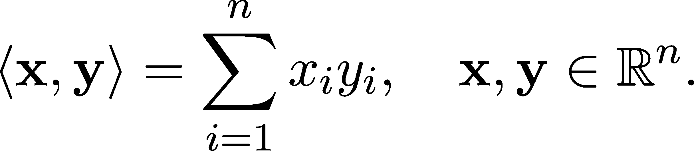

到现在为止，你应该能够轻松地编写一个计算该值的 Python 函数。原则上，下面的单行代码应该可以工作。

```py
def dot_product(x: np.ndarray, y: np.ndarray): 
    return np.sum(x*y)
```

让我们试试看！

```py
x = np.array([-3.0, 1.2, 1.2, 2.1]) 
y = np.array([1.9, 2.5, 3.9, 1.2]) 

dot_product(x, y)
```

```py
np.float64(4.5)
```

当向量的维度不匹配时，函数会抛出我们预期的异常。

```py
x = np.array([-3.0, 1.2, 1.2, 2.1]) 
y = np.array([1.9, 2.5]) 

dot_product(x, y)
```

```py
--------------------------------------------------------------------------- 
ValueError                              Traceback (most recent call last) 
Cell In[39], line 4 
     1 x = np.array([-3.0, 1.2, 1.2, 2.1]) 
     2 y = np.array([1.9, 2.5]) 
---->/span> 4 dot_product(x, y) 

Cell In[37], line 2, in dot_product(x, y) 
     1 def dot_product(x: np.ndarray, y: np.ndarray): 
---->/span> 2    return np.sum(x*y) 

ValueError: operands could not be broadcast together with shapes (4,) (2,)
```

然而，在进一步尝试破坏代码时，发生了一件奇怪的事。我们的函数 dot_product 应该在传入一个 n 维向量和一个一维向量时失败，但实际情况并非如此。

```py
x = np.array([-3.0, 1.2, 1.2, 2.1]) 
y = np.array([2.0]) 

dot_product(x, y)
```

```py
np.float64(3.0)
```

我总是主张提前破坏解决方案，以避免后续的意外，而上面的例子很好地说明了这一原则的有用性。如果之前的现象发生在生产环境中，你可能会有一段正常执行的代码，却给出完全错误的结果。这是最糟糕的 bug。

在幕后，NumPy 正在执行名为广播（broadcasting）的操作。当对两个形状不匹配的数组执行操作时，它会尝试推测正确的大小，并重新调整它们的形状，以使操作得以进行。查看在计算 x*y 时发生了什么。

```py
x*y
```

```py
array([-6\. ,  2.4,  2.4,  4.2])
```

NumPy 猜测我们想要将 x 的所有元素乘以标量 y[0]，所以它将 y = np.array([2.0]) 转换为 np.array([2.0, 2.0, 2.0, 2.0])，然后计算逐元素乘积。

广播非常有用，因为它通过自动执行转换让我们编写更简洁的代码。然而，如果你不清楚广播是如何以及何时进行的，它可能会给你带来麻烦。就像我们的情况一样，四维和一维向量的内积是没有定义的。

为了避免写过多的边界条件检查（或完全漏掉），我们在实际操作中使用 np.dot 函数来计算内积。

```py
x = np.array([-3.0, 1.2, 1.2, 2.1]) 
y = np.array([1.9, 2.5, 3.9, 1.2]) 

np.dot(x, y)
```

```py
np.float64(4.5)
```

当尝试调用 np.dot 时，如果数组不对齐，它会按预期失败，即便广播功能会让我们自定义的实现成功运行。

```py
x = np.array([-3.0, 1.2, 1.2, 2.1]) 
y = np.array([2.0]) 

np.dot(x, y)
```

```py
--------------------------------------------------------------------------- 
ValueError                              Traceback (most recent call last) 
Cell In[43], line 4 
     1 x = np.array([-3.0, 1.2, 1.2, 2.1]) 
     2 y = np.array([2.0]) 
---->/span> 4 np.dot(x, y) 

ValueError: shapes (4,) and (1,) not aligned: 4 (dim 0) != 1 (dim 0)
```

现在我们已经拥有了基本的数组操作和函数，是时候用它们做点事情了！

### 3.1.2 Gram-Schmidt 正交化过程

线性代数中最基本的算法之一是 Gram-Schmidt 正交化过程（定理 13），用于将一组线性无关的向量转化为标准正交集。

更精确地说，对于输入的线性无关向量集 v[1],…,v[n] ∈ℝ^n，Gram-Schmidt 过程会找到输出的向量集 e[1],…,e[n] ∈ℝ^n，使得∥e[i]∥ = 1 且⟨e[i],e[j]⟩ = 0 对所有 i≠j（即向量是正交标准的），并且 span(e[1],…,e[k]) = span(v[1],…,v[k]) 对所有 k = 1,…,n 成立。

如果你记不清楚怎么做了，可以随时回顾第 2.2.5 节，我们在其中首次描述了该算法。学习过程是一个螺旋式的过程，我们不断从新的角度回顾旧的概念。对于 Gram-Schmidt 过程来说，这是我们的第二次迭代，我们将数学公式转化为代码。

由于我们正在处理一系列向量，因此需要一个合适的数据结构来存储它们。在 Python 中，有几种可能的选择。目前我们选择了一个概念上最简单，尽管计算上不太优的方案：列表。

```py
vectors = [np.random.rand(5) for _ in range(5)]    # randomly generated vectors in a list 
vectors
```

```py
[array([0.85885635, 0.05917163, 0.42449235, 0.39776749, 0.89750107]), 
 array([0.49579437, 0.42797077, 0.21057023, 0.3091438 , 0.52590854]), 
 array([0.73079791, 0.58140107, 0.09823772, 0.14323477, 0.63606972]), 
 array([0.89495164, 0.40614454, 0.60637559, 0.61614928, 0.69006552]), 
 array([0.1996764 , 0.90298211, 0.70604567, 0.45721469, 0.02375226])]
```

算法的第一个组成部分是正交投影算子，定义为

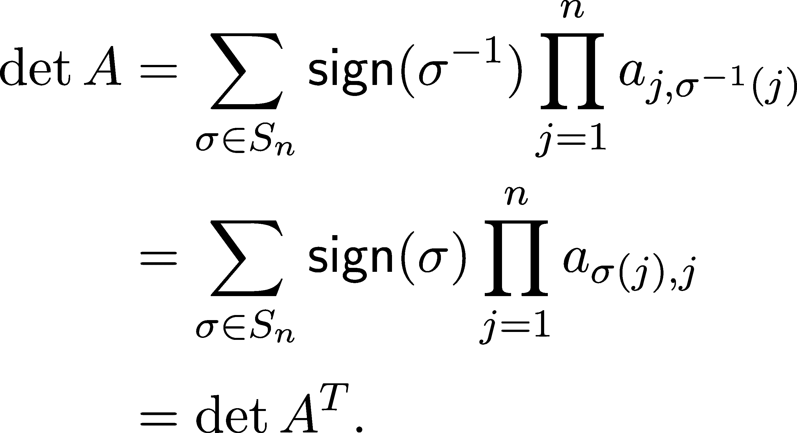

有了 NumPy 工具，实施变得非常直接。

```py
from typing import List 

def projection(x: np.ndarray, to: List[np.ndarray]): 
    #x0022;"/span> 
    Computes the orthogonal projection of the vector ‘x‘ 
    onto the subspace spanned by the set of vectors ‘to‘. 
    #x0022;"/span> 
    p_x = np.zeros_like(x) 

    for e in to: 
        e_norm_square = np.dot(e, e) 
        p_x += np.dot(x, e)*e/e_norm_square 

    return p_x
```

为了检查它是否有效，让我们看一个简单的例子并可视化结果。由于本书是用 Jupyter Notebooks 编写的，我们可以直接在这里进行操作。

```py
x = np.array([1.0, 2.0]) 
e = np.array([2.0, 1.0]) 

x_to_e = projection(x, to=[e])
```

```py
import matplotlib.pyplot as plt 

with plt.style.context("/span>seaborn-v0_8": 
    plt.figure(figsize=(7, 7)) 
    plt.xlim([-0, 3]) 
    plt.ylim([-0, 3]) 
    plt.arrow(0, 0, x[0], x[1], head_width=0.1, color="/span>r label="/span>x linewidth=2) 
    plt.arrow(0, 0, e[0], e[1], head_width=0.1, color="/span>g label="/span>e linewidth=2) 
    plt.arrow(x_to_e[0], x_to_e[1], x[0] - x_to_e[0], x[1] - x_to_e[1], linestyle="-" 
    plt.arrow(0, 0, x_to_e[0], x_to_e[1], head_width=0.1, color="/span>b label="/span>projection(x, to=[e]) 
    plt.legend() 
    plt.show()
```

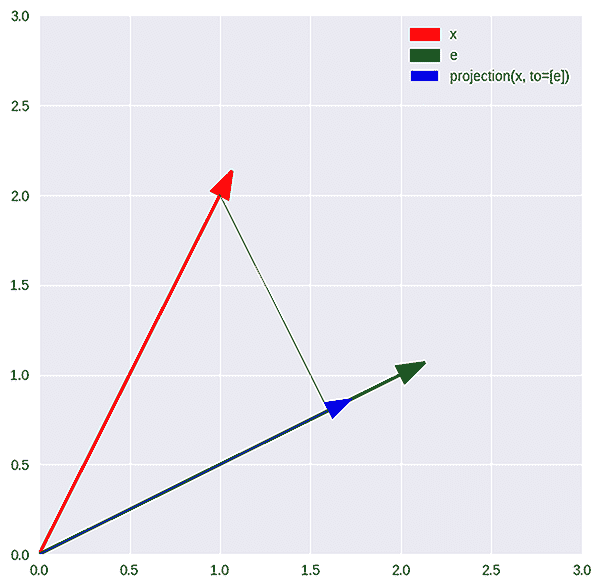

图 3.1：x 到 e 的投影

检查 e 和 x 的正交性——x 到 e 为我们提供了另一种验证手段。

```py
np.allclose(np.dot(e, x - x_to_e), 0.0)
```

```py
True
```

在为生产环境编写代码时，几个可视化和临时检查并不足够。通常会编写一套详尽的单元测试，确保函数按预期工作。为了保持讨论的进度，我们跳过了这部分，但你可以随时添加一些测试。毕竟，数学和编程不是观众的运动。

有了投影函数，我们准备好大展身手，实现 Gram-Schmidt 算法。

```py
def gram_schmidt(vectors: List[np.ndarray]): 
    #x0022;"/span> 
    Creates an orthonormal set of vectors from the input 
    that spans the same subspaces. 
    #x0022;"/span> 
    output = [] 

    # 1st step: finding an orthogonal set of vectors 
    output.append(vectors[0]) 
    for v in vectors[1:]: 
        v_proj = projection(v, to=output) 
        output.append(v - v_proj) 

    # 2nd step: normalizing the result 
    output = [v/np.linalg.norm(v, ord=2) for v in output] 

    return output 

gram_schmidt([np.array([2.0, 1.0, 1.0]), 
              np.array([1.0, 2.0, 1.0]), 
              np.array([1.0, 1.0, 2.0])])
```

```py
[array([0.81649658, 0.40824829, 0.40824829]), 
 array([-0.49236596,  0.86164044,  0.12309149]), 
 array([-0.30151134, -0.30151134,  0.90453403])]
```

让我们用一个简单的例子快速测试一下这个实现。

```py
test_vectors = [np.array([1.0, 0.0, 0.0]), 
                np.array([1.0, 1.0, 0.0]), 
                np.array([1.0, 1.0, 1.0])] 

gram_schmidt(test_vectors)
```

```py
[array([1., 0., 0.]), array([0., 1., 0.]), array([0., 0., 1.])]
```

所以，我们刚刚从头开始创建了我们的第一个算法。这就像是珠穆朗玛峰的基地营。我们已经走了很长一段路，但在我们能够从头开始创建神经网络之前，还有很长的路要走。直到那时，这段旅程将充满一些美丽的部分，而这就是其中之一。花点时间欣赏这一部分，准备好后再继续前行。

备注 4\. （格拉姆-施密特过程中的线性相关输入）

记住，如果格拉姆-施密特的输入向量线性相关，则输出的一些向量为零（备注 3）。在实践中，这会引发许多问题。

例如，我们在最后对向量进行归一化，使用列表推导式：

```py
output = [v/np.linalg.norm(v, ord=2) for v in output]
```

这可能会导致数值问题。如果任何 v 近似为 0，则其范数 np.linalg.norm(v, ord=2) 会非常小，而用这样的小数进行除法会引发问题。

这个问题也影响投影函数。请看下面的定义：

```py
def projection(x: np.ndarray, to: List[np.ndarray]): 
    #x0022;"/span> 
    Computes the orthogonal projection of the vector ‘x‘ 
    onto the subspace spanned by the set of vectors ‘to‘. 
    #x0022;"/span> 
    p_x = np.zeros_like(x) 

    for e in to: 
        e_norm_square = np.dot(e, e) 
        p_x += np.dot(x, e)*e / e_norm_square 

    return p_x
```

如果 e 接近 0（当输入向量线性相关时可能发生这种情况），那么 e_norm_square 会很小。解决这个问题的一种方法是加上一个很小的浮动数，例如 1e-16。

```py
def projection(x: np.ndarray, to: List[np.ndarray]): 
    p_x = np.zeros_like(x) 

    for e in to: 
        e_norm_square = np.dot(e, e) 

        # note the change below: 
        p_x += np.dot(x, e)*e / (e_norm_square + 1e-16) 

    return p_x
```

现在，让我们来认识机器学习中最重要的对象：矩阵。

## 3.2 矩阵，线性代数的主力军

我很确定在阅读这本书之前，你已经熟悉矩阵的概念。矩阵是最重要的数据结构之一，可以表示方程组、图、向量空间之间的映射等等。矩阵是机器学习的基本构建块。

从表面上看，我们将矩阵定义为一个数字表格。例如，如果矩阵 A 具有 n 行和 m 列的实数，我们写作

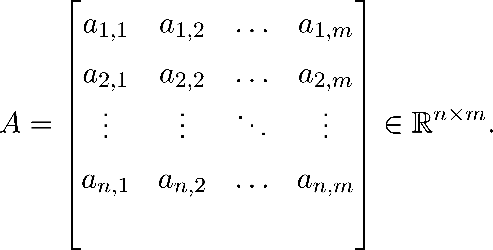

(3.1)

当我们不想写出完整的矩阵时，如 (3.1)，我们使用缩写 A = (a[i,j])[i=1,j=1]^(n,m)。

所有 n ×m 实数矩阵的集合记作 ℝ^(n×m)。我们将专门讨论实矩阵，但在提到其他类型时，这个符号会相应地修改。例如，ℤ^({n×m}) 表示整数矩阵的集合。

矩阵可以进行加法和乘法运算，或者与标量相乘。

定义 14\. （矩阵运算）

(a) 设 A ∈ℝ^(n×m) 为一个矩阵，c ∈ℝ 为一个实数。矩阵 A 与标量 c 的乘积定义为

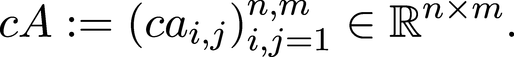

(b) 设 A, B ∈ℝ^(n×m) 为两个匹配维度的矩阵。它们的和 A + B 定义为

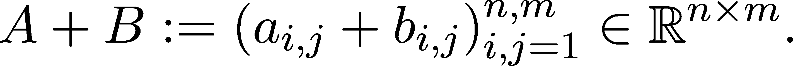

(c) 设 A ∈ℝ^(n×l) 且 B ∈ℝ^(l×m) 为两个矩阵。它们的乘积 AB ∈ℝ^(n×m) 定义为

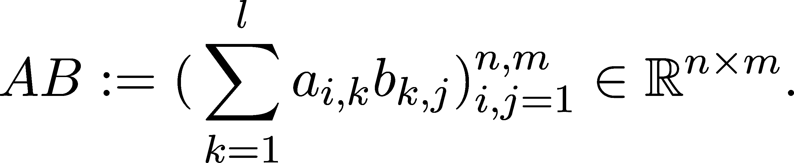

标量乘法和加法很容易理解，但矩阵乘法并不像加法那样简单。幸运的是，可视化可以帮助我们理解。实质上，（i,j）元素是矩阵 A 的第 i 行与矩阵 B 的第 j 列的点积。

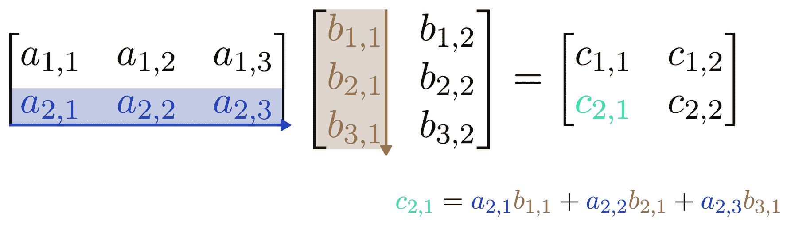

图 3.2：矩阵乘法可视化

除了加法和乘法，还有另一个值得提及的操作：转置。

定义 15.（矩阵转置）

设 A = (a[{]i,j})[{]i,j = 1}^({n,m}) ∈ ℝ^({n×m}) 是一个矩阵。矩阵 A^T 定义为：

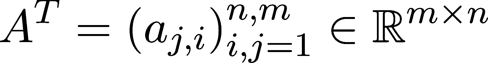

被称为 A 的转置。操作 A→A^T 称为转置。

转置简单来说就是“翻转”矩阵，将行替换为列。例如：

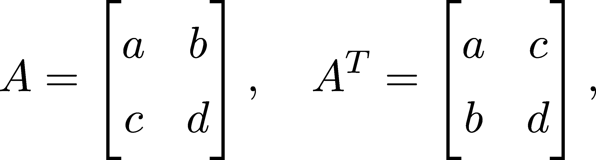

或者：

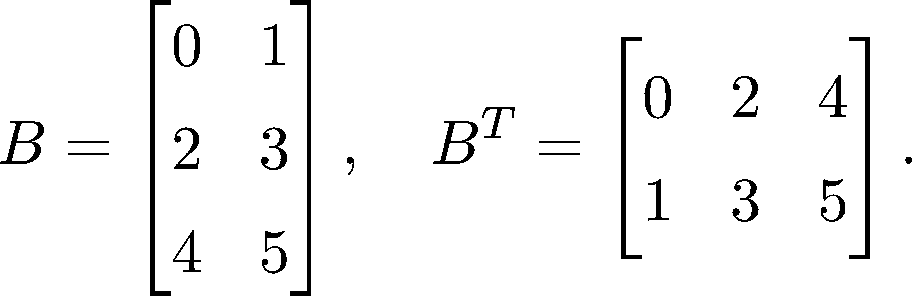

与加法和乘法不同，转置是一个一元操作。（一元操作意味着它只需要一个参数。二元操作需要两个参数，以此类推。）

让我们再看一遍矩阵乘法，这是计算中最常用的操作之一。由于现代计算机可以极其快速地执行矩阵乘法，很多算法都被向量化，以便通过矩阵乘法来表示。

因此，越了解它越好。为了更好地掌握这一操作，我们可以从不同的角度来看看它。让我们从一个特例开始！

在机器学习中，矩阵与列向量的乘积是某些模型的基础组成部分。例如，这本身就是线性回归，或者是神经网络中的著名全连接层。

为了看看这种情况发生了什么，设 A ∈ℝ^(n×m) 是一个矩阵。如果我们把 x ∈ℝ^m 看作一个列向量 x ∈ℝ^(m×1)，那么 Ax 可以写成：

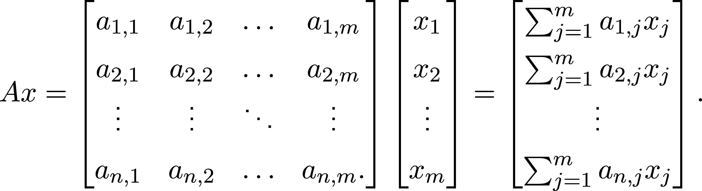

基于此，矩阵 A 描述了一个函数，它接受一块数据 x，然后将其转换为 Ax 的形式。

这就相当于对矩阵 A 的列进行线性组合，即：

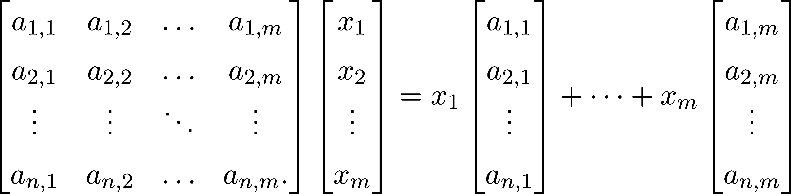

使用更具提示性的符号，我们可以将第 i 列表示为 a[i]，这样就可以写成：

.png)

(3.2)

如果我们用矩阵 B 替代向量 x，那么乘积矩阵 AB 中的列是矩阵 A 的列的线性组合，其中系数由 B 决定。

你应该真正意识到，对数据进行的某些操作可以写成 Ax 的形式。将这个简单的性质提升到更高的抽象层次，我们可以说数据和函数有着相同的表示。如果你熟悉像 Lisp 这样的编程语言，你会知道这有多美妙。

还有一种思考矩阵乘积的方式：取列内积。如果 a[i] = (a[i,1],…,a[i,n])表示 A 的第 i 列，那么 Ax 可以写成

.png)

(3.3)

也就是说，变换 x→Ax 将输入 x 投影到 A 的行向量上，然后将结果压缩成一个向量。

### 3.2.1 操作矩阵

因为矩阵运算是定义良好的，我们可以像处理数字一样对矩阵进行代数运算。然而，还是存在一些主要的区别。由于操作矩阵表达式是一个基本技能，我们来看看它的基本规则！

定理 16. （矩阵加法和乘法的性质）

(a) 设 A,B,C ∈ℝ^(n×l)是任意矩阵。那么，

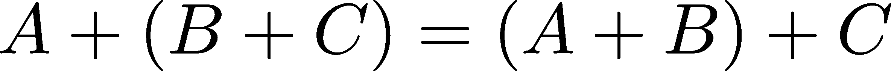

这成立。也就是说，矩阵加法是结合的。

(b) 设 A ∈ℝ^(n×l), B ∈ℝ^(l×k), C ∈ℝ^(k×m)是任意矩阵。那么，

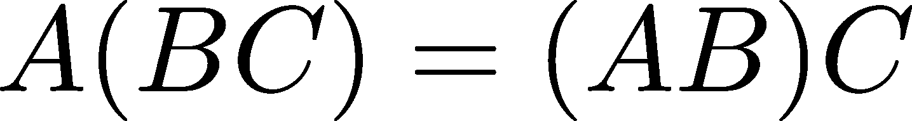

这成立。也就是说，矩阵乘法是结合的。

(c) 设 A ∈ℝ^(n×l) 和 B,C ∈ℝ^(l×m)是任意矩阵。那么，

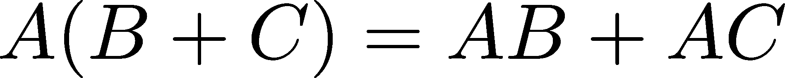

这成立。也就是说，矩阵乘法对加法是左分配的。

(d) 设 A,B ∈ℝ^(n×l) 和 C ∈ℝ^(l×m)是任意矩阵。那么，

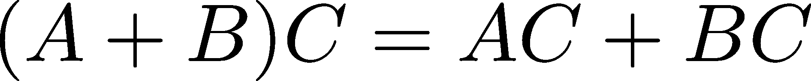

这成立。也就是说，矩阵乘法对加法是右分配的。

由于证明非常技术性且枯燥，我们将跳过它。然而，有几点需要注意。最重要的是，矩阵乘法不是交换的；也就是说，AB 不总是等于 BA。（它甚至可能没有定义。）例如，考虑

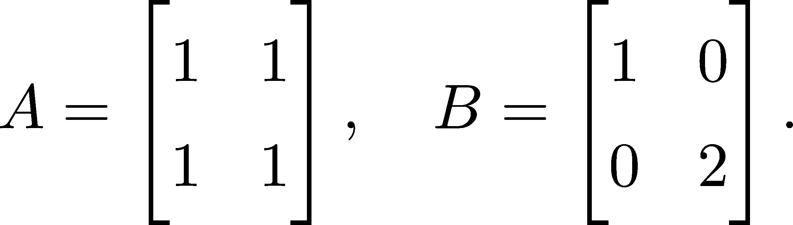

你可以手动验证

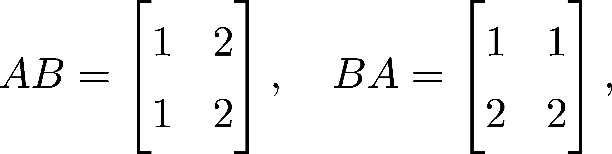

这些不相等。

与此一致，我们用于标量的代数恒等式是完全不同的。例如，如果 A 和 B 是矩阵，那么


或者

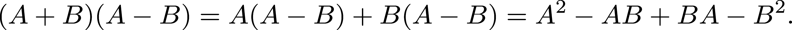

转置操作对于加法和乘法也表现得很好。

定理 17. （转置的性质）

(a) 设 A,B ∈ℝ^(n×m)是任意矩阵。那么，

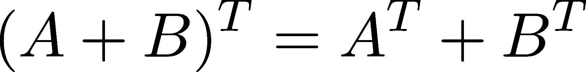

这成立。

(b) 设 A ∈ℝ^(n×l), B ∈ℝ^(l×m)是任意矩阵。那么，

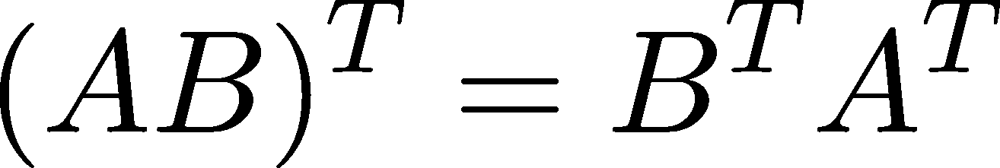

这成立。

我们也不打算证明这个，但你可以当做练习来做。

### 3.2.2 矩阵作为数组

为了在计算机中执行矩阵运算，我们需要一个能够表示矩阵 A 并支持以下功能的数据结构：

+   通过 A[i, j]访问元素，

+   通过 A[i, j] = value 进行元素赋值

+   使用+和*运算符进行加法和乘法运算，

并且运行速度极快。这些要求只指定了我们矩阵数据结构的接口，并没有涉及实际实现。一个显而易见的选择是使用列表的列表，但正如在讨论计算中表示向量时所提到的（第 1.3 节），这种方式非常不理想。我们能否利用 C 语言的数组结构来存储矩阵？

是的，这正是 NumPy 所做的，它为矩阵提供了以多维数组形式表示的快速便捷方法。在学习如何使用 NumPy 的工具之前，让我们深入探讨一下问题的核心。

乍一看，似乎有个问题：计算机的内存是单维的，因此是通过单一的键来寻址（索引），而不是我们所需要的两个键。因此，我们不能直接将矩阵塞入内存中。解决方案是将矩阵展平，将每一行依次放在一起，就像图 3.3 中在 3×3 的情况下所示。这叫做行主序排列。

通过将任何 n×m 矩阵的行存储在一个连续数组中，我们可以在低成本的简单索引转换下，获得数组数据结构的所有优势，转换方式由以下公式定义：

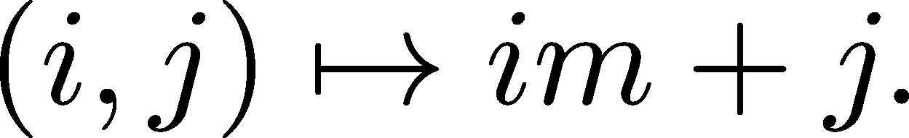

（请注意，对于使用列主序排列的编程语言（如 Fortran 或 MATLAB）——即列是连接起来的——此索引转换将不起作用。我将正确的转换作为一个练习留给你，以检查你对这一部分的理解。）

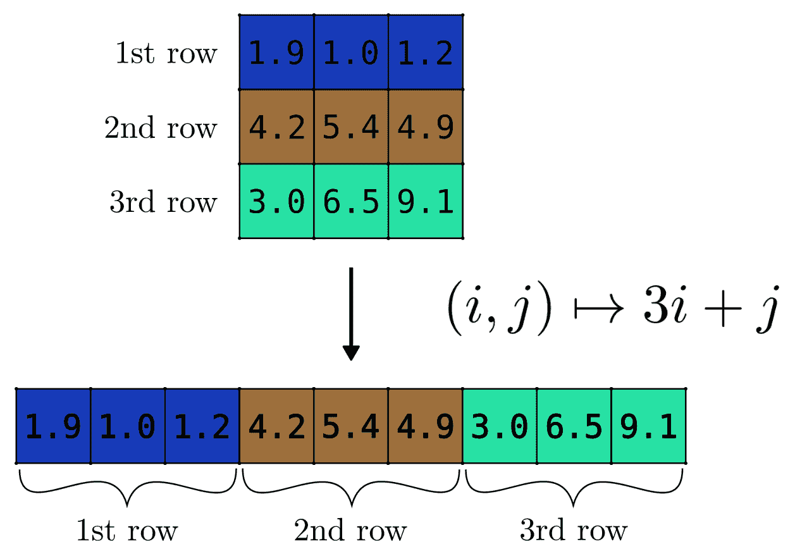

图 3.3：展平矩阵

为了展示发生了什么，让我们在 Python 中创建一个典型的 Matrix 类，它使用一个单一的列表来存储所有值，但支持通过行列索引访问元素。为了便于说明，我们假设 Python 列表实际上是一个静态数组。（至少在这次演示结束之前是这样。）这仅用于教育目的，因为目前我们只想理解过程，而不是最大化性能。

花点时间查看下面的代码。我会逐行解释。

```py
from typing import Tuple 

class Matrix: 
    def __init__(self, shape: Tuple[int, int]): 
        if len(shape) != 2: 
            raise ValueError("/span>The shape of a Matrix object must be a two-dimensional tuple." 

        self.shape = shape 
        self.data = [0.0 for _ in range(shape[0]*shape[1])] 

    def _linear_idx(self, i: int, j: int): 
        return i*self.shape[1] + j 

    def __getitem__(self, key: Tuple[int, int]): 
        linear_idx = self._linear_idx(*key) 
        return self.data[linear_idx] 

    def __setitem__(self, key: Tuple[int, int], value): 
        linear_idx = self._linear_idx(*key) 
        self.data[linear_idx] = value 

    def __repr__(self): 
        array_form = [ 
            [self[i, j] for j in range(self.shape[1])] 
            for i in range(self.shape[0]) 
        ] 
        return njoin(["tjoin([fx}"/span> for x in row]) for row in array_form])
```

矩阵对象通过`__init__`方法初始化。当一个对象被创建时，就会调用该方法，正如我们现在要做的那样。

```py
M = Matrix(shape=(3, 4))
```

在初始化时，我们以二维元组的形式提供矩阵的维度，这个元组被传递给形状参数。在我们的具体示例中，M 是一个 3×4 的矩阵，通过一个长度为 12 的数组表示。为了简单起见，我们的简单 Matrix 默认填充为零。

总的来说，`__init__`方法执行三个主要任务：

1.  验证形状参数以确保正确性

1.  将形状存储在实例属性中，以便将来参考

1.  初始化一个大小为 shape[0] * shape[1]的列表，作为主要数据存储。

第二个方法，暗示性地命名为 _linear_idx，负责在矩阵的行列索引和我们内部一维表示的线性索引之间进行转换。（在 Python 中，通常用下划线作为前缀表示方法不打算外部调用。许多其他语言，如 Java，支持私有方法，而 Python 不支持，因此我们只能依赖这种礼貌的建议，而不是严格执行的规则。）

我们可以通过索引提供`__getitem__`方法来实现项目检索，它期望一个二维整数元组作为键。对于任何键 = (i, j)，该方法：

1.  使用我们的 _linear_idx 方法计算线性索引。

1.  从列表中检索位于给定线性索引位置的元素。

项目赋值的过程类似，由`__setitem__`魔法方法给出。让我们尝试一下，看看它们是否有效。

```py
M[1, 2] = 3.14 
M[1, 2]
```

```py
3.14
```

通过提供`__repr__`方法，我们指定了 Matrix 对象作为字符串的表示方式。因此，我们可以将其以美观的形式打印到标准输出。

```py
M
```

```py
0.0    0.0    0.0    0.0 
0.0    0.0    3.14    0.0 
0.0    0.0    0.0    0.0
```

相当棒。现在我们了解了一些内部实现，接下来是时候看看我们能用 NumPy 做些什么了。

### 3.2.3 NumPy 中的矩阵

如前所述，NumPy 为矩阵提供了非常出色的开箱即用表示，采用的是多维数组的形式。（这些通常被称为张量，但我将坚持使用数组这一命名方式。）

我有个好消息：这些就是我们一直在使用的 np.ndarray 对象！我们可以通过在初始化时简单地提供一个列表的列表来创建一个。

```py
import numpy as np 

A = np.array([[0, 1, 2, 3], 
              [4, 5, 6, 7], 
              [8, 9, 10, 11]]) 

B = np.array([[5, 5, 5, 5], 
              [5, 5, 5, 5], 
              [5, 5, 5, 5]]) 
A
```

```py
array([[ 0,  1,  2,  3], 
      [ 4,  5,  6,  7], 
      [ 8,  9, 10, 11]])
```

一切都和我们到目前为止看到的一样。操作按元素进行，你可以将它们传递到像 np.exp 这样的函数中。

```py
A + B       # pointwise addition
```

```py
array([[ 5,  6,  7,  8], 
      [ 9, 10, 11, 12], 
      [13, 14, 15, 16]])
```

```py
A*B         # pointwise multiplication
```

```py
array([[ 0,  5, 10, 15], 
      [20, 25, 30, 35], 
      [40, 45, 50, 55]])
```

```py
np.exp(A)   # pointwise application of the exponential function
```

```py
array([[1.00000000e+00, 2.71828183e+00, 7.38905610e+00, 2.00855369e+01], 
      [5.45981500e+01, 1.48413159e+02, 4.03428793e+02, 1.09663316e+03], 
      [2.98095799e+03, 8.10308393e+03, 2.20264658e+04, 5.98741417e+04]])
```

由于我们在处理多维数组，可以定义转置操作符。在这里，这个操作符方便地实现为 np.transpose 函数，但也可以通过 np.ndarray.T 属性进行访问。

```py
np.transpose(A)
```

```py
array([[ 0,  4,  8], 
      [ 1,  5,  9], 
      [ 2,  6, 10], 
      [ 3,  7, 11]])
```

```py
A.T         # is the same as np.transpose(A)
```

```py
array([[ 0,  4,  8], 
      [ 1,  5,  9], 
      [ 2,  6, 10], 
      [ 3,  7, 11]])
```

正如预期的那样，我们可以通过索引操作符[]来获取和设置元素。索引从零开始。（别让我开始讲这个。）

```py
A[1, 2]    # 1st row, 2nd column (if we index rows and columns from zero)
```

```py
np.int64(6)
```

可以使用切片访问整行或整列。与其给出精确的定义，我不如提供几个示例，让你通过内部的模式匹配引擎（也就是你的大脑）来弄清楚。

```py
A[:, 2]    # 2nd column
```

```py
array([ 2,  6, 10])
```

```py
A[1, :]    # 1st row
```

```py
array([4, 5, 6, 7])
```

```py
A[2, 1:4]   # 2nd row, 1st-4th elements
```

```py
array([ 9, 10, 11])
```

```py
A[1]        # 1st row
```

```py
array([4, 5, 6, 7])
```

当作为可迭代对象使用时，二维数组每一步都会返回其行。

```py
for row in A: 
    print(row)
```

```py
[0 1 2 3] 
[4 5 6 7] 
[ 8  9 10 11]
```

初始化数组可以通过熟悉的 np.zeros、np.ones 和其他函数来完成。

```py
np.zeros(shape=(4, 5))
```

```py
array([[0., 0., 0., 0., 0.], 
      [0., 0., 0., 0., 0.], 
      [0., 0., 0., 0., 0.], 
      [0., 0., 0., 0., 0.]])
```

正如你猜的那样，shape 参数指定了数组的维度。接下来我们将探索这个属性。让我们初始化一个具有三行四列的示例多维数组。

```py
A = np.array([[0, 1, 2, 3], 
              [4, 5, 6, 7], 
              [8, 9, 10, 11]]) 
A
```

```py
array([[ 0,  1,  2,  3], 
      [ 4,  5,  6,  7], 
      [ 8,  9, 10, 11]])
```

数组的形状存储在属性 np.ndarray.shape 中，是一个描述其维度的元组对象。在我们的示例中，既然我们有一个 3×4 的矩阵，那么形状就是(3, 4)。

```py
A.shape
```

```py
(3, 4)
```

这个看似无害的属性决定了你可以对数组执行哪些操作。让我告诉你，作为一名机器学习工程师，形状不匹配将成为你工作的最大障碍。你想计算两个矩阵 A 和 B 的乘积吗？A 的第二维必须与 B 的第一维匹配。逐点乘积？需要匹配或可广播的形状。理解形状至关重要。

然而，我们刚刚学到的多维数组其实是线性数组的伪装。（参见第 3.2.2 节。）因此，我们可以通过不同的切片方式重新排列数组的线性视图。例如，A 可以重塑为形状为(12, 1)、(6, 2)、(4, 3)、(3, 4)、(2, 6)和(1, 12)的数组。

```py
A.reshape(6, 2)    # reshapes A into a 6 x 2 matrix
```

```py
array([[ 0,  1], 
      [ 2,  3], 
      [ 4,  5], 
      [ 6,  7], 
      [ 8,  9], 
      [10, 11]])
```

np.ndarray.reshape 方法返回一个新构建的数组对象，但不会改变 A。换句话说，在 NumPy 中，重塑不会破坏原数组。

```py
A
```

```py
array([[ 0,  1,  2,  3], 
      [ 4,  5,  6,  7], 
      [ 8,  9, 10, 11]])
```

初次接触重塑时可能很难理解。为了帮助你更好地可视化这一过程，图 3.4 清晰地展示了我们案例中的具体情况。

如果你不知道某个特定轴的确切维度，可以在重塑时输入-1。由于维度的乘积是恒定的，NumPy 足够聪明，能够为你推算出缺失的维度。这个技巧能帮你经常脱困，因此值得记住。

```py
A.reshape(-1, 2)
```

```py
array([[ 0,  1], 
      [ 2,  3], 
      [ 4,  5], 
      [ 6,  7], 
      [ 8,  9], 
      [10, 11]])
```

```py
A.reshape(-1, 4)
```

```py
array([[ 0,  1,  2,  3], 
      [ 4,  5,  6,  7], 
      [ 8,  9, 10, 11]])
```

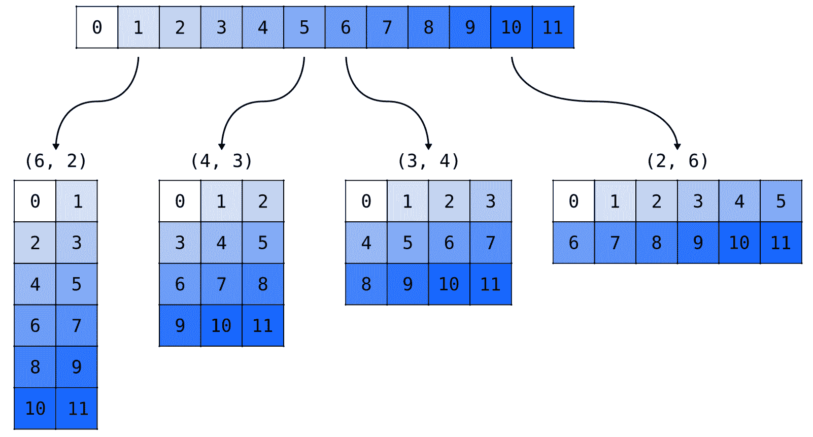

图 3.4：将一维数组重塑为多种可能的形状

我们现在不讨论细节，但正如你可能猜到的，多维数组可以有多个维度。那么，操作允许的形状范围将会更复杂。因此，现在建立一个扎实的理解，将为将来提供巨大的领先优势。

### 3.2.4 矩阵乘法，重新审视

毫无疑问，关于矩阵的最重要操作之一就是矩阵乘法。计算行列式和特征值？矩阵乘法。通过全连接层传递数据？矩阵乘法。卷积？矩阵乘法。我们将看到这些看似不同的操作如何追溯到矩阵乘法；但首先，让我们从计算的角度讨论一下这一操作本身。

首先，回顾一下数学定义。对于任意的 A ∈ℝ^(n×m)和 B ∈ℝ^(m×l)，它们的乘积由以下公式定义：

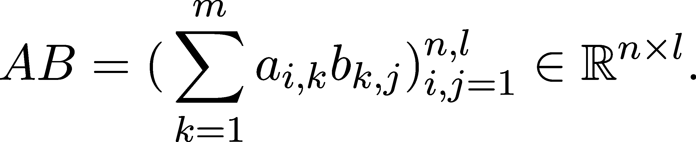

注意，AB 中第 i 行第 j 列的元素是 A 的第 i 行与 B 的第 j 列的点积。

我们可以使用到目前为止学到的工具将其写成代码。

```py
from itertools import product 

def matrix_multiplication(A: np.ndarray, B: np.ndarray): 
    # checking if multiplication is possible 
    if A.shape[1] != B.shape[0]: 
        raise ValueError("/span>The number of columns in A must match the number of rows in B." 

    # initializing an array for the product 
    AB = np.zeros(shape=(A.shape[0], B.shape[1])) 

    # calculating the elements of AB 
    for i, j in product(range(A.shape[0]), range(B.shape[1])): 
        AB[i, j] = np.sum(A[i, :]*B[:, j]) 

    return AB
```

让我们通过一个容易手动验证的例子来测试我们的函数。

```py
A = np.ones(shape=(4, 6)) 
B = np.ones(shape=(6, 3)) 
matrix_multiplication(A, B)
```

```py
array([[6., 6., 6.], 
      [6., 6., 6.], 
      [6., 6., 6.], 
      [6., 6., 6.]])
```

结果是正确的，正如我们预期的那样。

当然，矩阵乘法在 NumPy 中有对应的函数，形式为 numpy.matmul。

```py
np.matmul(A, B)
```

```py
array([[6., 6., 6.], 
      [6., 6., 6.], 
      [6., 6., 6.], 
      [6., 6., 6.]])
```

这产生的结果与我们的自定义函数相同。我们可以通过生成一堆随机矩阵并检查结果是否匹配来测试它。

```py
for _ in range(100): 
    n, m, l = np.random.randint(1, 100), np.random.randint(1, 100), np.random.randint(1, 100) 
    A = np.random.rand(n, m) 
    B = np.random.rand(m, l) 

    if not np.allclose(np.matmul(A, B), matrix_multiplication(A, B)): 
        print(f/span>Result mismatch for\n{A}\n and\n{B}" 
        break 
else: 
    print("/span>All good! Yay!"
```

```py
All good! Yay!
```

根据这个简单的测试，我们的 matrix_multiplication 函数与 NumPy 内建函数的结果是一样的。我们很高兴，但别忘了：在实际操作中，始终使用你所选择的框架的实现，无论是 NumPy、TensorFlow 还是 PyTorch。

由于在存在大量乘法时编写 np.matmul 会显得繁琐，NumPy 提供了一种使用 @ 运算符来简化的方法。

```py
A = np.ones(shape=(4, 6)) 
B = np.ones(shape=(6, 3)) 

np.allclose(A @ B, np.matmul(A, B))
```

```py
True
```

### 3.2.5 矩阵和数据

既然我们已经熟悉了矩阵乘法，现在是时候在其他领域理解它们了。假设有一个矩阵 A ∈ℝ^(n×m) 和一个向量 x ∈ℝ^m。通过将 x 视为列向量 x ∈ℝ^(m×1)，可以通过以下方式计算 A 和 x 的乘积：


从数学角度来看，将 x 视为列向量是完全自然的。可以将其看作是通过引入一个虚拟维度来扩展 ℝ^m，从而得到 ℝ^(m×1)。这个形式也可以通过考虑矩阵的列是基向量的像来理解。

在实践中，事情并不像看起来那么简单。隐含地，我们在这里做出了一个选择：将数据集表示为列向量的水平堆叠。为了进一步阐述，让我们考虑两个具有四个特征的数据点，以及一个将它们映射到三维特征空间的矩阵。也就是说，假设 x[1], x[2] ∈ℝ⁴ 和 A ∈ℝ^(3×4)。

```py
x1 = np.array([2, 0, 0, 0])       # first data point 
x2 = np.array([-1, 1, 0, 0])      # second data point 

A = np.array([[0, 1, 2, 3], 
              [4, 5, 6, 7], 
              [8, 9, 10, 11]])    # a feature transformation
```

（我特意选择了这些数字，以便通过手工计算轻松验证结果。）为了确保准确无误，我们再次检查了形状。

```py
A.shape
```

```py
(3, 4)
```

```py
x1.shape
```

```py
(4,)
```

当我们调用 np.matmul 函数时，会发生什么？

```py
np.matmul(A, x1)
```

```py
array([ 0,  8, 16])
```

结果是正确的。然而，当我们有一堆输入数据点时，我们更倾向于通过一次操作计算这些数据点的映像。这样，我们就可以利用向量化代码、引用局部性以及到目前为止我们所看到的所有计算魔法。

我们可以通过水平堆叠列向量来实现这一点，每个列向量表示一个数据点。从数学上讲，我们希望在代码中执行该计算。

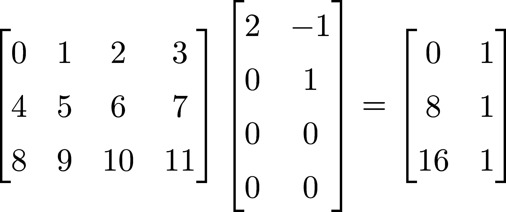

查阅 NumPy 文档后，我们很快发现 np.hstack 函数可能是解决问题的工具，至少根据它的官方文档（[`numpy.org/doc/stable/reference/generated/numpy.hstack.html`](https://numpy.org/doc/stable/reference/generated/numpy.hstack.html)）来看是这样。耶！

```py
np.hstack([x1, x2])    # np.hstack takes a list of np.ndarrays as its argument
```

```py
array([ 2,  0,  0,  0, -1,  1,  0,  0])
```

不太高兴。发生了什么？np.hstack 对一维数组的处理方式不同，尽管通过巧妙地滥用符号，数学计算结果是正确的，但在实际的计算过程中，我们不能这么轻松地逃避。因此，我们必须手动调整输入数据的形状。让我们认识到初级与高级机器学习工程师之间的真正技能差距：正确地调整多维数组的形状。

```py
# x.reshape(-1,1) turns x into a column vector 
data = np.hstack([x1.reshape(-1, 1), x2.reshape(-1, 1)]) 
data
```

```py
array([[ 2, -1], 
      [ 0,  1], 
      [ 0,  0], 
      [ 0,  0]])
```

让我们再试一次。

```py
np.matmul(A, data)
```

```py
array([[ 0,  1], 
      [ 8,  1], 
      [16,  1]])
```

太棒了！(这次是真的。)

请注意，在这一章中我们做出了一个极为重要的选择：将单个数据点表示为列向量。我用粗体字写出这一点，以强调其重要性。

为什么？因为我们本可以选择另一种方式，将样本视为行向量。选择当前的方式后，我们得到了形状为

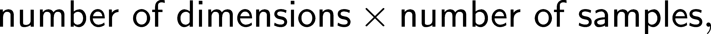

与之相对的是

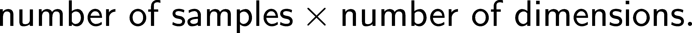

前者称为批次最后（batch-last），而后者称为批次优先（batch-first）格式。像 TensorFlow 和 PyTorch 这样的流行框架使用批次优先，但我们选择了批次最后。之所以如此，是因为这与矩阵的定义密切相关，其中列是给定线性变换下基向量的像。这样，我们可以像从左到右书写乘法一样写出 Ax 和 AB。

如果我们将矩阵定义为基向量像的行，所有事情都会颠倒过来。这样，如果 f 和 g 是具有“矩阵”A 和 B 的线性变换，那么组合变换 f ∘ g 的“矩阵”将是 BA。这使得数学变得复杂且不美观。

另一方面，批次优先使得数据存储和读取更加方便。想象一下，当你有成千上万的数据点在一个 CSV 文件中时，文件的读取是逐行进行的，因此将每一行与一个样本对应是自然且便捷的。

这里没有绝对的好选择，任何选择都有其牺牲。由于批次最后的数学运算更为简便，我们将使用这种格式。然而，在实践中，你会发现批次优先更为常见。通过这本教科书，我并不打算仅仅给你一本手册。我的目标是帮助你理解机器学习的内部原理。如果我成功了，你将能够毫不费力地在批次优先和批次最后之间进行转换。

## 3.3 小结

在本章中，我们终于深入实践，而不只是从理论的高塔中展望。之前，我们看到 NumPy 数组是进行数值计算，尤其是线性代数的理想工具。现在，我们用它们来快速且优雅地实现我们在上一章中学到的内容：范数、距离、点积和 Gram-Schmidt 过程。

除了向量，我们最终还介绍了矩阵，这是机器学习中最重要的工具之一。这一次，我们以一种实际的方式来理解矩阵，将其视为一个数字表格。矩阵可以进行转置和加法运算，不同于向量，矩阵还可以相互相乘。

说到我们的“从头开始”的方法，在实际研究如何使用矩阵之前，我们用原生 Python 创建了我们自己的矩阵实现。结束这一章时，我们处理了二维 NumPy 数组的基本概念和最佳实践，这是 Python 能提供的最重要的矩阵表示。

在下一章，我们将再次采取理论方法。这就是我们本书的做法：同时查看两个方面，从而提升我们对数学（以及沿途的机器学习）的理解。我们将看到矩阵不仅仅是普通的数字表格；它们也是数据变换。这一特性美得无法用言语形容：数据及其变换由同一个对象表示。

让我们开始吧！

## 3.4 问题

问题 1\. 实现均方误差

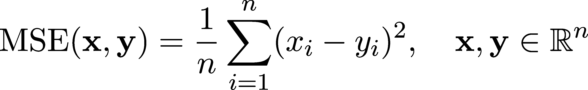

无论是否使用 NumPy 函数和方法，均需实现。 （向量 x 和 y 应该在这两种情况下都由 NumPy 数组表示。）

问题 2\. 使用 `timeit.timeit` 比较内置的最大值函数 `max` 和 NumPy 的 `np.max` 的性能，就像我们上面做的那样。尝试运行不同数量的实验，并改变数组大小，以找出两者性能的平衡点。

问题 3\. 不像我们在本章第 3.1.1 节中实现一般的 p 范数，我们可以改变方法，得到下面的版本。

```py
def p_norm(x: np.ndarray, p: float): 
    if p  1: 
        return (np.sum(np.abs(x)**p))**(1/p) 
    elif np.isinf(p): 
        return np.max(np.abs(x)) 
    else: 
        raise ValueError("/span>p must be a float larger or equal than 1.0 or inf."
```

但是，这在 \( p = \infty \) 时不起作用。它的问题是什么？

问题 4\. 设 \( w \in \mathbb{R}^n \) 是一个包含非负元素的向量。使用 NumPy 实现加权 p 范数，公式为

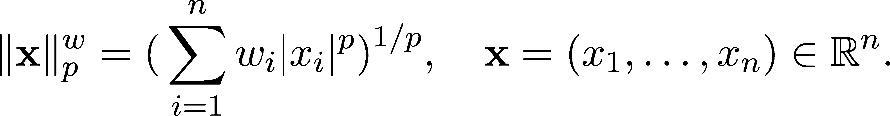

你能想出一个机器学习中可能用到这个的场景吗？

问题 5\. 实现余弦相似度函数，定义公式为

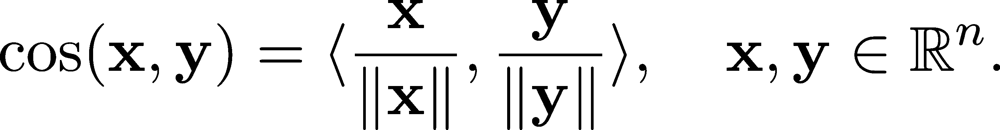

（尽可能使用内置的 NumPy 函数。）

问题 6\. 计算以下矩阵的乘积。

(a)

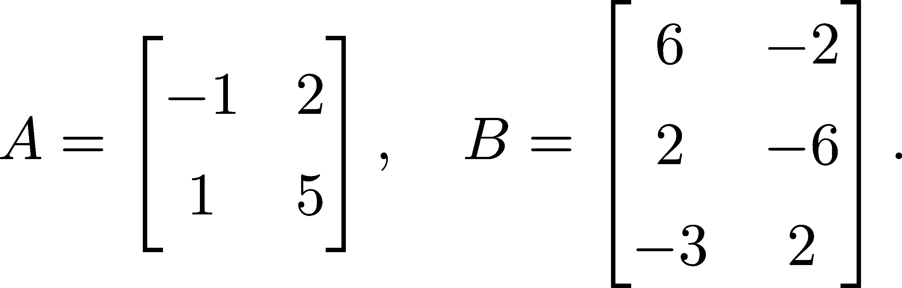

(b)

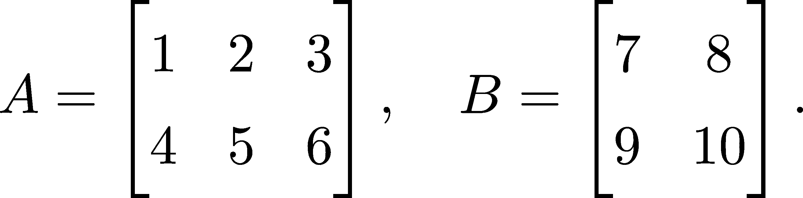

问题 7\. 著名的斐波那契数列由递归序列定义

F[0]= 0，

F[1]=1，

F[n]= F[n−1] + F[n−2]

(a) 编写一个递归函数，计算第 n 个斐波那契数。 （预期它会非常慢。）

(b) 展示

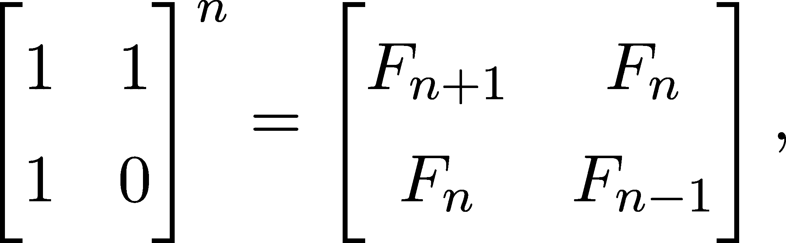

并使用此恒等式编写一个非递归函数，计算第 n 个斐波那契数。

使用 Python 内置的 `timeit` 函数测量两种函数的执行时间。哪个更快？

问题 8\. 设 \( A,B \in \mathbb{R}^{n \times m} \) 为两个矩阵。它们的 Hadamard 积定义为

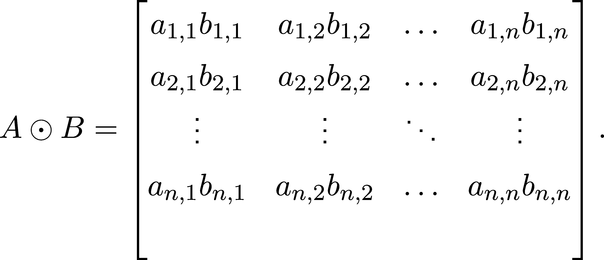

实现一个函数，接收两个形状相同的 NumPy 数组，然后对它们执行 Hadamard 乘积。（有两种方法可以实现这一点：使用 for 循环和使用 NumPy 操作。实现这两种方法都很有启发性。）

问题 9\. 设 A ∈ℝ^(n×n) 为一个方阵。形式如下的函数

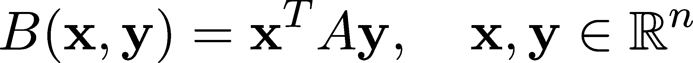

这称为双线性形式。实现一个函数，接收两个向量和一个矩阵（都由 NumPy 数组表示），然后计算对应的双线性形式。

## 加入我们的 Discord 社区

与其他用户、机器学习专家以及作者本人一起阅读本书。提问、为其他读者提供解决方案、通过“问我任何问题”环节与作者聊天，等等。扫描二维码或访问链接加入社区。 [`packt.link/math`](https://packt.link/math)


