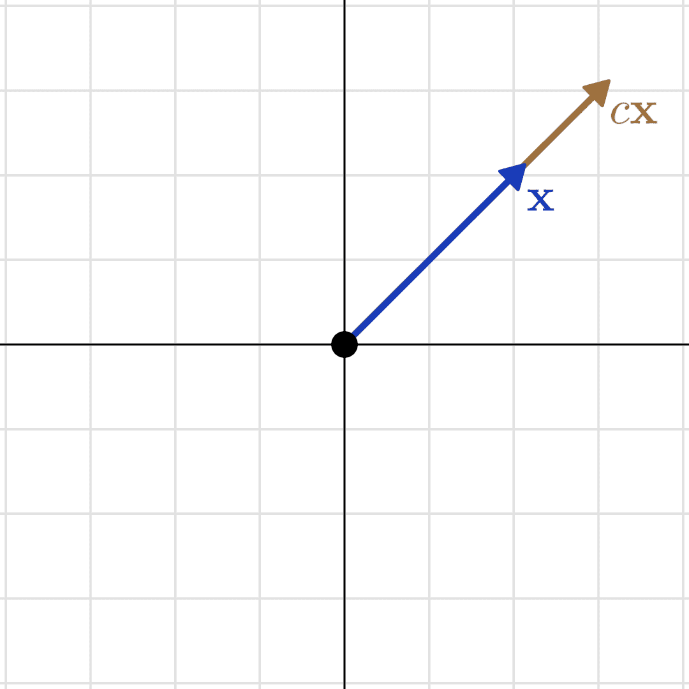
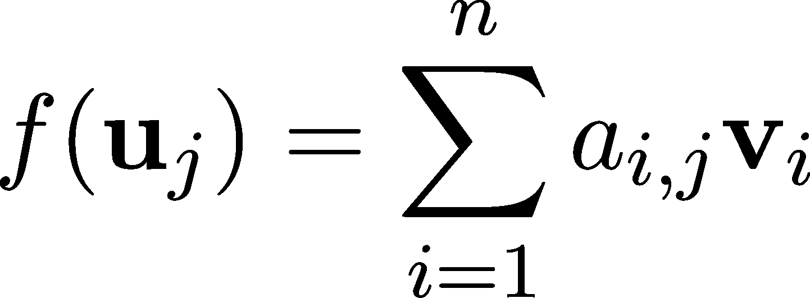
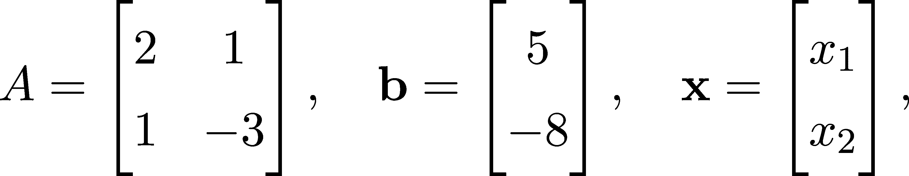
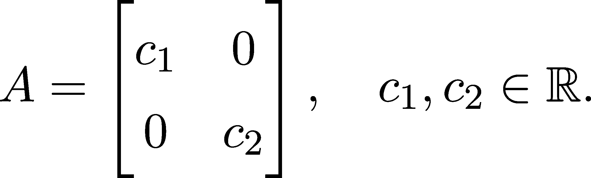
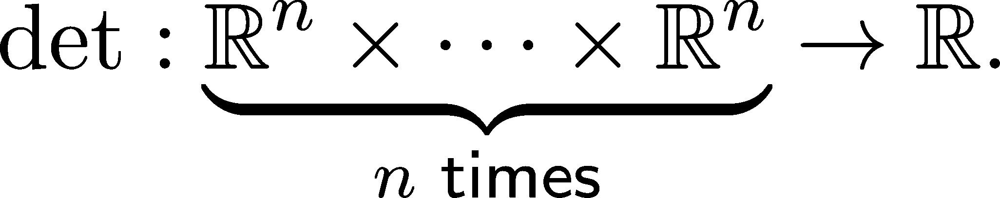

线性变换

> “为什么我的眼睛痛？” “你以前从未使用过它们。”
> 
> — 莫非斯对尼奥说，当他第一次从矩阵中醒来时

在大多数线性代数课程中，课程内容都围绕矩阵展开。在机器学习中，我们一直在使用矩阵。问题是：矩阵并不能讲述整个故事。仅仅通过矩阵很难理解其中的模式。例如，为什么矩阵乘法定义得如此复杂？为什么像 B = T^(−1)AT 这样的关系很重要？为什么有些矩阵是可逆的，有些则不是？

要真正理解发生了什么，我们必须看看什么导致了矩阵的产生：线性变换。就像对于尼奥一样，这可能有些痛苦，但从长远来看，它会给我们带来巨大的回报。让我们开始吧！

## 第六章：4.1 什么是线性变换？

通过引入内积、正交性以及正交/规范正交基，我们现在已经了解了特征空间的结构。然而，在机器学习中，我们的主要兴趣在于数据的变换。

从这个角度来看，神经网络只是一个由更小部分（称为层）组成的函数，在每一步中将数据转化为新的特征空间。机器学习模型中的一个关键组件就是线性变换。

你可能遇到过形式为 f(x) = Ax 的函数，但这只是其中的一种表现方式。本节将从几何视角开始，然后过渡到你可能已经熟悉的代数表示方式。要理解神经网络如何学习数据的强大高层表示，观察变换的几何性质至关重要。

那么，线性变换究竟是什么呢？让我们不再犹豫，直接进入定义吧！

定义 16\.（线性变换）

设 U 和 V 为两个向量空间（在相同的标量域上），并且设 f : U →V 为它们之间的一个函数。如果 f 是线性的，我们说 f 满足

f( ax + by) = af(x) + bf(y)

（4.1）

对于所有向量 x、y ∈U 和所有标量 a、b，公式成立。

这就是为什么线性代数被称为线性代数的原因。从本质上讲，线性变换是两个向量空间之间的一种映射，它保持代数结构不变：加法和标量乘法。（向量空间之间的函数通常称为变换，因此我们将使用这个术语。）

备注 5\.

线性本质上是将两个性质结合在一起：对于所有向量 x、y 和所有标量 a，有 f(x + y) = f(x) + f(y) 和 f(ax) = af(x)。从这两个公式中，(4.1) 可以推出。

定义中立刻显现出两个性质。首先，由于

f(0) = 0 对于每个线性变换都成立。此外，线性变换的复合仍然是线性的，如

对于任意的线性 f 和 g 以及标量 a 和 b，公式如下。

像往常一样，让我们看一些例子来建立直觉。

示例 1\. 对于任意标量 c，缩放变换 f(x) = cx 是线性的。

这是可能是最简单的例子，而且它可以在所有向量空间中定义。

图 4.1：作为线性变换的缩放

很容易看出，缩放是线性的：

示例 2\. 在 ℝ² 中，绕原点的旋转角度 α 也是线性的。

图 4.2：作为线性变换的欧几里得平面旋转

为了证明旋转确实是线性的，我从帽子里拿出了定义：平面向量 x = (x[1], x[2]) 以角度 α 旋转可以用以下公式描述

从中（16）可以很容易地确认。我知道这看起来像是魔法，但相信我，旋转公式会详细解释。你可以通过一些基本的三角学知识来推导，或者等到我们稍后使用矩阵来处理这个问题。

一般来说，线性变换与空间的几何结构有着紧密的联系。稍后我们将详细研究 ℝ² 的线性变换，重点讨论像这样的几何变换。（注意，在更高维度下，旋转会稍微复杂一些，因为它们需要一个旋转轴。）

示例 3\. 在任何向量空间 V 中，若存在非零向量 v ∈ V，定义为 f(x) = x + v 的平移不是线性的，因为 f(0) = v≠0。

我们稍后将在本节中看到更多例子。目前，让我们继续讨论线性变换的一些一般性质。对于任何线性变换 f : U → V，其像

总是 V 的一个子空间，见节 1.2.7。这很容易验证：如果，那么存在，使得 f(u[1]) = v[1] 和 f(u[2]) = v[2]，如

为了增加一个抽象的层次，我们将看到所有线性变换的集合形成了一个向量空间。

定理 18\。

设 U 和 V 是两个在相同域 F 上的向量空间。那么，所有线性变换的集合

(4.2)

也是一个定义在 F 上的向量空间，具有通常的函数加法和标量乘法定义。

证明这个的过程只是一个无聊的检查清单，逐项检查向量空间定义中的条目（定义 2）。我建议你至少走一遍这个过程，以巩固你对向量空间的理解，但实际上并没有什么特别的地方。

### 4.1.1 线性变换与矩阵

如我们所见，线性变换的定义有点抽象。然而，有一种简单且富有表现力的方式来刻画它们。

为了验证这一点，设 f : U →V 是两个向量空间 U 和 V 之间的线性变换。假设 {u[1]，…，u[m]} 是 U 中的基，而 {v[1]，…，v[n]} 是 V 中的基。由于每个 x ∈U 都可以表示为

f 的线性性质意味着

f( ∑ [j=1]^m x[j] u[j] ) = ∑ [j=1]^m x[j] f(u[j])，

(4.3)

这意味着 f(x) 是 f(u[1])，…，f(u[m]) 的线性组合。换句话说，每个线性变换完全由基向量的像决定。为了扩展这个想法，假设对于每个 u[j]，我们有

对于某些标量 a[i,j]。

这 n × m 个数完全描述了 f。为了简化符号，我们将它们存储在一个 n × m 大小的表格中，称为矩阵，记作 A[f]：

这意味着线性变换由矩阵表示。这个联系在机器学习中被广泛利用。

进一步扩展（4.3），对于每个 x = ∑ [j=1]^m x[j]u[j]，我们有

因此，x 的像可以表示为 A[f]x：

这里有两点需要注意。首先，我们隐式地选择了将向量表示为列向量而非行向量。这是一个非常重要的决定，稍后的许多计算都会受到这个选择的影响，我们会一直指出这一点。

其次，矩阵表示依赖于基的选择！如果，例如，P = {p[1]，…，p[n]} ⊂ U 是我们的矩阵基，我们将在下标中表示这种依赖关系，写作 A[f,P]。

为了避免混淆，我们几乎总是通过给出标准正交基中的矩阵来定义线性变换。在实际应用中，这使得理解发生了什么变得更容易。所以，每当我写下类似“让 A 是线性变换 f 的矩阵”的内容时，隐含的假设是 A 是在基 e[1] = (1,0,…,0)，e[2] = (0,1,…,0)，…，e[n] = (0,0,…,1) 中写的。

从哲学的角度讲，你听说过柏拉图的洞穴寓言吗？在这个思想实验中，人们被假设生活在一个洞穴里，永远面对一面墙，只观察由他们身后火光投射的影像。他们所观察到的，用来构建世界的内部表征，与现实大相径庭。将这一类比应用到线性代数中，矩阵就是我们在实际场景中观察到并使用的影像。在许多入门课程中，线性变换被隐藏，只教授矩阵运算。我最初接触这个主题时也是如此：我上过的第一门线性代数课程完全讲解了矩阵。那门课复杂且令人困惑，堪称数学课程中的典型（而且，我可以保证，它确实是非常复杂和困惑的）。在我后来的学习中，当我发现可以从线性变换的角度看待矩阵时，一切都恍若豁然开朗。

如果不深入了解矩阵背后的内容，是无法掌握线性代数的。如果我的方法对你来说太抽象，请记住这一点：多年后，当你成为一名实践中的数据科学家/机器学习工程师/研究员或者其他职业时，深入表面背后的内容会带来巨大的回报。

让我们回到正题，继续讨论线性变换。最常用的矩阵是单位变换 id : x→x 的矩阵。我们用 I 来表示它。很容易看出

.png)(4.4)

总结来说，对于一个矩阵 A，一个线性变换可以通过 x→Ax 来表示。事实上，映射

定义了线性变换空间 L(U,V )（由 4.2 定义）与 n × m 矩阵集之间的一个一一对应关系，其中 n 和 m 是对应的维度。

### 4.1.2 矩阵运算重温

函数可以进行加法和复合操作。由于线性变换和矩阵之间的关系，矩阵运算继承了相应的函数运算。

在这个原则的指导下，我们定义了矩阵加法，使得两个线性变换的和对应的矩阵之和就是它们的矩阵之和。

从数学角度来看，假设 f,g : U →V 是两个具有矩阵的线性变换，f ↔︎A 和 g ↔︎B，则

因此，对应的矩阵可以按元素逐项相加：

矩阵之间的乘法通过对应变换的复合作用来定义。

为了理解这个，我们首先研究一个特殊情况。（一般来说，首先看特殊情况是个好主意，因为它们通常可以减少复杂性，并帮助我们在没有信息过载的情况下看到模式。）因此，设 f,g : U → U 是两个线性变换，将 U 映射到自身。为了确定对应于 f ∘ g 的矩阵元素，我们必须将 f(g(u[j])) 表示为所有基向量 u[1],…,u[n] 的线性组合。为此，我们有：

通过考虑我们如何定义变换的矩阵，标量 (∑ [k=1]^n a[i,k]b[k,j]) 是 f ∘ g 的矩阵中第 i 行、第 j 列的元素。因此，矩阵乘法可以定义为：

在一般情况下，只有当相应的线性变换可以组合时，我们才能定义矩阵的乘积。也就是说，如果 f : U → V，那么 g 必须从 V 开始。将其转化为矩阵语言，A 的列数必须与 B 的行数相匹配。因此，对于任意的 A ∈ ℝ^(n×m) 和 B ∈ ℝ^(m×l)，它们的乘积定义为：

### 4.1.3 线性变换的逆

关于线性变换，逆变换的问题极其重要。例如，你是否遇到过这样的方程组？

如果我们定义：

上述系统可以写成 Ax = b 的形式。这些称为线性方程，能够描述从金融到生物学的各种过程。

如何写出这样方程的解呢？如果存在一个矩阵 A^(−1)，使得 A^(−1)A 是单位矩阵 I（由 (4.4) 定义），那么将方程 Ax = b 左乘 A^(−1) 会得到解的形式 x = A^(−1)b。

矩阵 A^(−1) 被称为 A 的逆矩阵。它可能并不总是存在，但当它存在时，它在多个方面都是非常重要的。我们稍后会讨论线性方程，但首先，让我们研究逆变换的基础！这是一般定义：

定义 17.（线性变换的逆）

设 f : U → V 是在向量空间 U 和 V 之间的线性变换。如果存在一个线性变换 f^(−1)，使得 f^(−1) ∘ f 和 f ∘ f^(−1) 是单位函数，即：

对于所有 u ∈ U, v ∈ V 都成立。那么，f^(−1) 就叫做 f 的逆变换。

不是所有的线性变换都有逆。例如，如果 f 将所有向量都映射到零向量，那么就无法定义逆变换。

有一些条件可以保证逆的存在。最重要的条件之一是将基的概念与可逆性联系起来。

定理 19\. （线性变换的可逆性）

设 f : U → V 是一个线性变换，且 u[1],…,u[n] 是 U 中的一个基。则 f 可逆当且仅当 f(u[1]),…,f(u[n]) 是 V 中的一个基。

以下证明是直接的，但可能有点复杂。第一次阅读时可以跳过，您可以稍后再回过头来看。

证明。像往常一样，if 和 only if 类型的定理的证明由两部分组成，因为这些陈述涉及两个推论。

(a) 首先，我们证明 f 是可逆的，然后 f(u[1]),…,f(u[n]) 是一个基。也就是说，我们需要证明 f(u[1]),…,f(u[n]) 是线性无关的，并且每个 y ∈V 都可以表示为它们的线性组合。

由于 f 是可逆的，f(0) = 0，此外没有非零向量 x ∈ U 使得 f(x) = 0。换句话说，0 不能表示为 f(u[1]),…,f(u[n]) 的非平凡线性组合，因此定理 3 推导出线性无关性。

另一方面，可逆性意味着每个  都可以表示为 ，其中 。 （选择 。）由于  是一个基， 。因此，

证明 span(f(u[1]),…,f(u[n])) = V。

线性无关的 f(u[1]),…,f(u[n]) 以及它覆盖整个 V 的事实，证明它确实是一个基。

(b) 现在我们证明另一个推论：如果 f(u[1]),…,f(u[n]) 是一个基，那么 f 是可逆的。

如果 f(u[1]),…,f(u[n]) 确实是一个基，那么每个 y ∈V 都可以表示为

这证明了满射性。关于单射性，如果 y = f(a) = f(b)，其中 a,b ∈U，那么，由于 a 和 b 都可以表示为 u[i] 基向量的线性组合，我们会得到

且

因此，0 = ∑ [i=1]^n(a[i]−b[i])u[i]，由于 u[1],…,u[n] 是 U 中的一个基，必须有 a[i] = b[i]。因此，f 是单射的。

这个定理的一个推论是，如果 U 和 V 的维数不同，那么线性变换 f : U → V 不是可逆的。我们也可以从矩阵的角度来看可逆性。对于任意 A ∈ℝ^(n×n)，如果对应的线性变换是可逆的，那么存在一个矩阵 A^(−1) ∈ℝ^(n×n)，使得 A^(−1)A = AA^(−1) = I。如果一个矩阵不是方阵，它在经典意义下不可逆。

### 4.1.4 核和像

关于线性变换的可逆性，有两个特殊的集合发挥着至关重要的作用：核（kernel）和像（image）。我们来看看它们！

定义 18\. （线性变换的核与像）

设 f : U →V 是一个线性变换。其像和核分别定义为

和

通常，我们使用 imA 和 kerA 来表示某个矩阵 A 所定义的线性变换 x→Ax。由于 f 的线性性质，我们可以很容易地看出，imf 是 V 的一个子空间，kerf 是 U 的一个子空间。如前所述，它们与可逆性密切相关，接下来我们将看到这一点。

定理 20. （关于线性变换的可逆性）

设 f : U →V 是一个线性变换。

（a）A 是单射当且仅当 kerf = {0}。

（b）A 是满射当且仅当 imf = V。

（c）A 是双射（即可逆）当且仅当 kerf = {0} 且 imf = V。

证明。（a）如果 f 是单射，那么 U 中只能有一个向量映射到 0。由于对任何线性变换来说，f(0) = 0，因此 kerf = {0}。

另一方面，如果存在两个不同的向量 x, y ∈ U，使得 f(x) = f(y)，那么 f(x−y) = f(x) − f(y) = 0，因此 x−y ∈ kerf。于是，kerf = {0} 意味着 x = y，从而得出单射性。

（b）这只是满射的定义。

（c）这立即可以通过结合上述（a）和（b）得出。

由于矩阵定义了线性变换，因此讨论矩阵的逆是有意义的。

从代数的角度来看，A ∈ ℝ^(n×n) 的逆矩阵是 A^(−1) ∈ ℝ^(n×n)，满足 A^(−1)A = AA^(−1) = I。线性变换与矩阵之间的联系意味着 A^(−1) 就是 f^(−1) 的矩阵，因此这里没有什么令人惊讶的。

如果这一节关于可逆性的内容让你觉得有些代数上的复杂，不必担心。稍后在讲到变换的行列式时，我们将从几何角度研究可逆性。在矩阵方面，我们将在本章的第 5.1.6 节中看到一种计算逆矩阵的通用方法。我们很快就会讲到，但首先，我们来看看基的选择如何决定矩阵表示。

## 4.2 基变换

在本节之前，我们已经看到，任何线性变换都可以通过基向量的像来描述（参见第 4.1.1 节）。这给了我们通常使用的矩阵表示。然而，这很大程度上取决于基的选择。不同的基会为同一个变换生成不同的矩阵。

比如，我们可以看一下 f : ℝ² → ℝ²，它将 e[1] = (1,0) 映射到向量 (2,1)，将 e[2] = (0,1) 映射到 (1,2)。在标准正交基 E = {e[1],e[2]} 下，它的矩阵表示为

.png)(4.5)

图 4.3：线性变换 f，由于基变换定义的（参见 5.2）

f 的作用在图 4.3 中可视化。

如果我们选择不同的基，比如 P = {p[1] = (1,1), p[2] = (−1,1)}，那么通过快速计算，我们可以检查到

换句话说，f(p[1]) = 3p[1] + 0p[2] 和 f(p[2]) = 0p[1] + p[2]。这可以通过图形 4.4 来直观展示。

图 4.4：f 对 p[1] = (1,1) 和 p[2] = (−1,1) 的作用

这意味着，如果 P = {p[1],p[2]} 是我们的基（因此，若写作 (a,b) 就意味着 ap[1] + bp[2]），则 f 的矩阵为

在这种形式下，A[f,P] 是一个对角矩阵。（也就是说，它的对角线下方和上方的元素是零。）如你所见，选择正确的基可以显著简化线性变换。例如，在 n 维空间中，应用对角矩阵形式的变换只需要进行 n 次操作，因为

否则，可能需要 n² 次操作。因此，我们可以节省很多计算。

### 4.2.1 变换矩阵

我们刚才看到，线性变换的矩阵依赖于我们选择的基。然而，对于同一变换的矩阵之间存在一种特殊的关系。我们接下来将探讨这一点。设 f : U → U 是一个线性变换，P = {p[1],…,p[n]} 和 Q = {q[1],…,q[n]} 是两个基。如前所述，A[f,S] 表示在某基 S 中 f 的矩阵。

假设我们知道 A[f,P]，但是我们的向量是通过另一组基 Q 来表示的。我们如何计算在该线性变换下向量的像呢？一种自然的思路是，首先将向量从 Q 基变换到 P 基，应用 A[f,P]，然后再将表示转换回来。接下来，我们将精确地描述这一过程。

设  是一个变换，定义为 ，适用于所有 。 （换句话说， 将一组基向量映射到另一组。）由于  和  是基（因此这些集合是线性无关的），所以  是可逆的。

假设矩阵  已知，即

对于所有  都成立。因此，我们有

换句话说，在基 P 中，组合变换 t^(−1)ft 的矩阵与基 Q 中 f 的矩阵相同。用公式表示，

T^(−1) A [f,P] T = A[f,Q]，

(4.6)

其中 T 表示 t 在基 P 中的矩阵。（为了简化符号，我们省略了下标。通常，我们并不关心变换在哪个基下进行。）

我们将 T 称为基变换矩阵。这类关系在线性代数中很常见，因此我们将花时间正式介绍这个定义。

定义 19.（相似矩阵）

设 A,B ∈ℝ^(n×n) 为两个任意矩阵。如果存在一个矩阵 T ∈ℝ^(n×n)，使得 A 和 B 称为相似矩阵，则有

成立。我们称形式为 A→T^(−1)AT 的映射为相似变换。

用这些术语，（4.6）说明了给定线性变换的矩阵彼此相似。

掌握了这些，我们可以完成例子（4.5）。在这种情况下，T 和 T^(−1) 可以写作

（稍后，我们将看到计算任何矩阵的逆的一般方法，但现在，你可以手动验证这一点。）因此，

.png)(4.7)

或等价地，

.png)(4.8)

图 4.5 显示了 (4.8) 在几何上的表现。

图 4.5：基变换示意图

从这个例子中，我们可以看到，正确选择的相似变换能够对某些矩阵进行对角化。这是巧合吗？剧透：不是的。在第七章中，我们将精确了解何时以及如何做到这一点。

我知道，这有点抽象。正如往常一样，示例能最好地阐明一个概念，所以我们来看一些示例！

## 4.3 欧几里得平面中的线性变换

我们刚刚看到，线性变换可以通过基集的映射来描述。从几何角度来看，它们是将[平行六面体](https://en.wikipedia.org/wiki/Parallelepiped)映射到平行六面体的函数。

由于是线性变换，你可以将其想象为扭曲由基向量确定的网格。

图 4.6：线性变换如何扭曲由基向量确定的网格

在二维中，我们已经看到了几个几何映射的例子，例如缩放和旋转，它们作为线性变换。现在我们可以将它们转化为矩阵形式。我们将研究其中的五种：拉伸、剪切、旋转、反射和投影。

这些简单的变换不仅对建立直觉至关重要，而且在计算机视觉中也经常应用。翻转、旋转和拉伸是图像增强管道的关键部分，能够显著提升模型的性能。

### 4.3.1 拉伸

最简单的一个是缩放的推广。我们已经在上面的示例 1 中看到了这种变体（见第 4.1 节）。在矩阵形式下，这可以表示为

这类线性变换可以通过绘制由标准基 e[1] = (1,0)，e[2] = (0,1) 确定的单位正方形的图像来可视化。

图 4.7：拉伸

### 4.3.2 旋转

旋转由矩阵给出

要理解为什么，回想一下变换矩阵的每一列描述了基向量的图像。旋转 (1,0) 给出的结果是 (cosα, sinα)，而旋转 (0,1) 给出的结果是 (cos(α + π∕2), sin(α + π∕2))。这一点在图 4.8 中有所说明。

图 4.8：旋转矩阵说明

就像上面一样，我们可以通过可视化单位正方形的图像，来获得对发生的几何学理解。

图 4.9：旋转

### 4.3.3 剪切

另一个重要的几何变换是剪切，这在物理学中有广泛应用。剪切力（[`en.wikipedia.org/wiki/Shear_force`](https://en.wikipedia.org/wiki/Shear_force)）是一对方向相反的力作用于同一物体。

图 4.10：剪切

它的矩阵以如下形式给出

其中 S[x]、S[y] 和 S 代表在 x、y 方向及两者方向上的剪切变换。

### 4.3.4 反射

到目前为止，我们在欧几里得平面上看到的所有变换都保持了空间的“方向性”。然而，情况并非总是如此。由以下矩阵给出的变换

相对于 x 轴和 y 轴，它们充当反射。

图 4.11：反射

当与旋转结合使用时，我们可以利用反射来翻转基向量。例如，变换将 e[1] 映射到 e[2]，并将 e[2] 映射到 e[1]。

图 4.12：交换 e[1] 和 e[2] 是反射和旋转

这些类型的变换在理解行列式时起着至关重要的作用，正如我们将在下一章中看到的那样。

一般来说，反射可以很容易地定义在更高维空间中。例如，

是 ℝ³ 中的一个反射，它将 e[3] 翻转到相反的方向。这就像照镜子：它把左变右，把右变左。

反射可以多次翻转方向。由以下变换给出的

翻转 e[2] 和 e[3]，改变了方向两次。稍后我们将看到，给定变换的“方向变化次数”是其一个重要的描述性特征。

### 4.3.5 正交投影

其中一个最重要的变换（不仅仅是在二维空间中）是正交投影。我们已经在讨论内积及其几何表示时提到过这一点，在 2.2.3 节中有讲解。仔细观察会发现，它们是线性变换。

图 4.13：正交投影

回忆一下（3.2.3 节），x 到某个 y 的正交投影可以写成

⟨⋅,⋅⟩的双线性特性立即意味着 projy 也是线性的。通过一些代数，我们可以用矩阵的形式重新写出这个公式。我们有

因此，

注意到

所以标准基向量的像不是线性无关的。结果，平面在 proj[y]下的像是 span(y)，这是一个一维子空间。通过这个例子，我们可以看到，线性变换下的向量空间的像不一定与起始空间的维度相同。

通过这些例子和所掌握的知识，我们对线性变换有了基本的理解，这也是神经网络最基本的构建块。在下一节中，我们将研究线性变换如何影响向量空间的几何结构。

## 4.4 行列式，或者线性变换如何影响体积

在第 4.3 节中，我们已经看到，线性变换（定义 16）可以看作是扭曲由基向量决定的网格。

跟随我们的几何直觉，我们怀疑，测量变换如何扭曲体积和距离能够提供一些有价值的洞察。正如我们在本章中所见，确实如此。保持距离或范数不变的变换是特殊的，这也催生了主成分分析等方法。

### 4.4.1 线性变换如何缩放面积

让我们再回到欧几里得平面。考虑任何线性变换 A，将单位正方形映射到一个平行四边形。

图 4.14：单位正方形在线性变换下的像

这个平行四边形的面积描述了 A 如何缩放单位正方形。暂时将其称为λ，即，

其中 C = [0,1] × [0,1]是单位正方形，A(C)是其像

由于线性性，λ也符合任何矩形（其边与坐标轴平行）面积与其在 A 下像的比例。如图 4.15 所示，我们可以将任何平面物体近似为矩形的并集。

如果所有矩形都被λ缩放，那么矩形的并集也会按该比例缩放。因此，λ也就是任何平面物体 E 与其像 A(E) = {Ax : x ∈E}之间的缩放比例。

图 4.15：用矩形并集近似平面物体

这个数量λ揭示了变换本身的很多信息，但仍然有一个问题：我们如何计算它？

假设我们的线性变换由以下给出：

因此，其列向量 x = (x[1],x[2])和 y = (y[1],y[2])描述了平行四边形的两条边。这是单位正方形的图像。

图 4.16：线性变换下单位正方形的图像

我们的面积缩放因子λ等于这个平行四边形的面积，所以我们的目标是计算这个。

任何平行四边形的面积都可以通过将底边的长度（此处为∥x∥）与高度 h 相乘来计算。（你可以通过在平行四边形的右侧切去一个三角形并将其放到左侧，重新排列成一个矩形来轻松看到这一点。）h 是未知的，但通过基础三角学，我们可以看到 h = sinα∥y∥，其中α是 x 和 y 之间的角度。

因此，

这几乎是 x 和 y 的点积。（回想一下，点积可以表示为⟨x,y⟩ = ∥x∥∥y∥cosα。）然而，sinα部分并不匹配。

幸运的是，我们可以使用一个巧妙的技巧将其转换为点积！由于 sinα = cos(α −)，我们有

问题是，x 和 y 之间的角度不是α −。然而，我们可以通过应用旋转来轻松解决这个问题（第 4.3.2 节）。应用变换

我们得到

由于，我们有

数量⟨x,y[rot]⟩可以仅使用矩阵 A 的元素来计算：

注意，⟨x,y[rot]⟩可能为负！当 y = Ae[2]和 x = Ae[1]之间的角度，从逆时针方向测量时，大于π时，就会发生这种情况，因为这意味着 cos(α −)/span>0\。

因此，⟨x,y[rot]⟩被称为平行四边形的带符号面积。

在二维空间中，我们称之为线性变换的行列式。也就是说，对于任何给定的线性变换/矩阵 A ∈ℝ^(2×2)，其行列式定义为

.png)(4.9)

行列式通常写作 jAj，但我们将避免使用这种符号。我们将处理任何矩阵 A ∈ℝ^(n×n)的行列式，但为了直观起见，我们先保持在 2 × 2 的情况。

行列式还揭示了向量的方向性：正行列式表示正方向，负行列式表示负方向。（直观地说，正方向意味着从 x 到 y 的角度在逆时针方向上位于 0 到π之间；等价地，顺时针方向上从 x 到 y 的角度在π到 2π之间。）这一点在下图 4.17 中得到了体现。

图 4.17：平面中两个向量的方向性

总的来说，

area(A(E)) = |detA|area(E)

(4.10)

成立，其中 E ⊆ℝ²是一个平面对象，且

是变换 A 下 E 的像。

尽管我们只展示了二维空间中的(5.4.1)，但这在一般情况下是成立的。（尽管我们尚未知道如何在其他维度定义行列式。）

因此，如果 e[1]和 e[2]是平面上的一组基，方程式(5.4.1)和(5.4.1)告诉我们二维空间中的行列式等于

基于欧几里得平面的示例，我们已经建立了足够的几何直觉来理解线性变换如何扭曲体积并改变空间的方向。这些是通过行列式的概念来描述的，我们已经在特殊情况下(5.4.1)定义了行列式。接下来，我们将继续研究行列式的完整一般性概念。

为了引入行列式的正式定义，我们将采用不同于常规的路径。最常见的做法是直接用一个复杂的公式定义线性变换 A 的行列式，然后展示其所有几何性质。

与其如此，我们将通过推广我们在前一节学到的几何概念来推导行列式公式。在这里，我们大致按照 Peter D. Lax 的《线性代数及其应用》的大纲进行。

我们通过引入一些关键符号奠定了基础。设

设矩阵为具有列 a[1],…,a[n]的矩阵。当我们在 4.1.1 节引入矩阵作为线性变换的概念时，我们看到第 i 列是第 i 个基向量的像。为了简便起见，假设 e[1],e[2],…,e[n]是标准正交归一基，即 e[i]是第 i 个坐标为 1，其余坐标为 0 的向量。因此，Ae[i] = a[i]。

在我们对欧几里得平面 4.3 节的探索中，我们已经看到行列式是基向量像的方向与它们所定义的平行四边形面积的乘积。按照这个逻辑，我们可以通过以下方式定义 n×n 矩阵的行列式

很快出现了两个问题。首先，如何在 n 维空间中定义多个向量的方向？其次，我们如何计算面积？

我们不是要找到这些问题的答案，而是要给故事增加一点曲折：首先，我们将找到一个方便的行列式公式，然后用它来定义方向。

### 4.4.2 行列式的多线性

为了更明确地表示行列式与矩阵列 a[i] = Ae[i] 之间的关系，我们将写作

从这个角度思考行列式，det 只是多个变量的一个函数：

好消息是：det(a[1],…,a[n]) 在每个变量上都是线性的。也就是说，

这是成立的。我们不会证明这一点，但由于行列式代表的是带符号的体积，你可以通过查看图 4.18 来自我验证。

图 4.18：det(a[1],a[2]) 的多线性

线性性的一个结果是，我们可以将行列式表示为标准基向量 e[1],…,e[n] 的行列式的线性组合。例如，考虑以下内容。因为

我们得到

再进一步，利用

我们开始注意到一个规律。借助线性性，我们得到

det(a[1], a[2],…, a[n]) = ∑ [i=1]^n ∑ [j=1]^n a[i,1] a[j,2] det(e[i], e[j], a[3],…, a[n])。

(4.11)

我们可以看到，系数 a[i,1]a[j,2] 中的行索引与 det(e[i],e[j],a[3],…,a[n]) 中的 e[k] 的索引相匹配。在一般情况下，这个模式可以通过置换来形式化；即，{1,2,…,n} 集合的排列。

你可以将置换想象成一个函数 σ，它将 {1,2,…,n} 映射到自身，使得对于每个 j ∈{1,2,…,n}，都有一个 i ∈{1,2,…,n}，使得 σ(i) = j。换句话说，你把从 1 到 n 的每个整数按某种顺序排列。{1,2,…,n} 上的所有可能置换的集合用 S[n] 表示。

继续 (5.4.2) 并进一步展开 A 的行列式，我们得到

![ ∑ ∏n det(a1,...,an) = [ aσ(i),i]det(eσ(1),...,eσ(n)). σ∈Sn i=1 ](img/file435.png)

这个公式并不是最容易理解的。你可以把每一项 ∏ [i=1]^n a[σ(i),i] 想象成把 n 个棋子放置在一个 n×n 的棋盘上，使得它们互不攻击。

 图 4.19：项 a[σ(1)1]⋅⋅⋅a[σ(n)n] 的解剖

公式

![∑ [∏n ] aσ(i),i det(eσ(1),...,e σ(n)) σ∈Sn i=1 ](img/file438.png)

结合了我们可以这样做的所有可能方式。

只剩下一件事：计算 det(e[σ(1)],…,e[σ(n)])。

记得我们在讨论欧几里得平面中的反射和旋转的组合时（第 4.3.4 节）吗？由 e[i]→e[σ(i)] 确定的变换与此类似。当谈到排列时，了解每个排列都可以通过一次交换两个元素得到是很有用的。在排列中，交换两个元素的次数——也就是影响两个元素的排列——被称为 σ 的符号。在我们讨论的线性变换 e[i]→e[σ(i)] 中，σ 的交换次数就是所需反射的次数，sign(σ) 是 (e[σ(1)],…,e[σ(n)]) 的方向。

因此，借助这些，我们终于可以为行列式和方向给出一个正式的定义。

定义 20. （行列式与方向）

设 A ∈ℝ^(n×n) 为任意矩阵，a[i] ∈ℝ^n 为它的第 i 列。A 的行列式定义为

detA = det( a[1],…, a[n]) = ∑ [σ∈S[n]] sign(σ) [ ∏ [i=1]^n a [σ(i),i] ],

(4.12)

以及向量 a[1],…,a[n] 的方向是

当 det 表示法不方便时，我们通过将矩阵的元素放入一个大的绝对值符号中来表示行列式：

当我还是一名年轻的数学学生时，行列式公式（4.12）是我在第一节线性代数课上直接看到的。没有解释它与体积和方向的联系，我花了几年时间才真正理解它。我依然认为，行列式是线性代数中最复杂的概念之一，尤其是在没有几何动机的情况下进行定义时。

现在你已经对行列式有了基本的理解，你可能会问：我们如何在实践中计算行列式呢？对所有排列求和并计算它们的符号，从计算角度来看并不是一项简单的操作。

好消息是：行列式有一个递归公式。坏消息是：对于一个 n×n 的矩阵，它涉及 n 个 (n − 1) × (n − 1) 的矩阵。尽管如此，相比于排列公式，这已经是一个很大的进步了。让我们来看看！

定理 21. （行列式的递归公式）

设 A ∈ℝ^(n×n) 为任意方阵。那么

detA = ∑ [j=1]^n (−1)^(j+1) a [1,j] detA[1,j],

4.13

其中 A[i,j] 是从 A 中通过去除其第 i 行和第 j 列得到的 (n − 1) × (n − 1) 矩阵。

我们不提供证明，而是通过一个例子来演示这个公式。对于 3 × 3 的矩阵，它看起来是这样的：

现在我们既有几何直觉，又有递归公式，让我们来看看行列式的最重要的性质！

### 4.4.3 行列式的基本性质

在计算行列式时，我们更倾向于构造基本的构建模块和组合规则。（正如我们多次见到的模式，即使在推导 (4.12) 时也是如此。）这些规则由行列式的基本性质体现，我们现在将讨论这些基本性质。

第一个性质涉及到复合与行列式的关系。

定理 22\. （行列式的乘积）

∈ℝ^(n×n) 是两个矩阵。那么

detAB = detAdetB。

（4.14）

方程式 (4.14) 被称为行列式乘积法则，它的证明涉及一些基于公式 (4.12) 和 (4.13) 的复杂计算。我们不提供完整的证明，而是给出一个直观的解释。毕竟，我们希望用数学构建算法，而不是构建数学。

所以，detAB = detAdetB 的解释非常简单。如果我们把矩阵 A,B ∈ℝ^(n×n) 看作是线性变换，我们刚刚看到 detA 和 detB 决定了它们如何缩放单位立方体。

由于这些线性变换的组合是矩阵乘积 AB，线性变换 AB 将单位立方体缩放为带符号体积 detAdetB 的平行六面体。（因为应用 AB 相当于先应用 B，再在结果上应用 A。）

因此，通过我们对行列式的理解，由于 AB 的缩放因子也是 detAB，（4.14）成立。

我们可以通过递归公式 (4.13) 进行实际证明，从而得到一个长而复杂的计算过程。

乘积法则的一个直接推论是矩阵的行列式与其逆矩阵之间的特殊关系。

定理 23\。

设 A ∈ℝ^(n×n) 是一个任意可逆矩阵。那么

证明。使用乘积法则，我们有

从而得出定理。

由于这个原因，我们也可以得出结论，行列式在相似关系下保持不变。

定理 24\。

设 A,B ∈ ℝ^(n×n) 是两个相似矩阵，且 B = T^(−1)AT，其中 T ∈ℝ^(n×n)。则

证明。这个结论直接跟随于

这就是我们需要证明的。

另一个重要的结论是行列式与矩阵所处的基底无关。如果 A : U →U 是一个线性变换，且 P = {p[1],…,p[n]} 和 R = {r[1],…,r[n]} 是 U 的两个基底，那么我们知道，变换的矩阵（第 4.2.1 节）之间的关系为

其中 A[S]是变换 A 在基 S 下的矩阵，T ∈ℝ^(n×n)是基变换矩阵（第 4.2.1 节）。前面的定理意味着 detA[P] = detA[R]。因此，行列式不仅仅是矩阵的定义，它也适用于线性变换！

关于行列式，有一个重要的对偶关系：你可以交换矩阵的行和列，同时保持所有与行列式相关的恒等式成立。

定理 25\。

设 A ∈ℝ^(n×n)是一个任意矩阵。那么

证明。假设 A = (a[i,j])[i,j=1]^n。我们用 a[i,j]^t = a[j,i]表示其转置矩阵的元素。根据(4.12)，我们有

现在来一个技巧。由于积∏ [i=1]^n a[i,σ(i)]遍历所有的 i，并且项的顺序不重要，我们可以将项的顺序排列为 i = σ^(−1)(1),…,σ^(−1)(n)。由于

继续上述计算，我们得到

因为每个置换都是可逆的，并且σ→σ^(−1)是一个双射，因此对σ ∈S[n]求和与对σ^(−1) ∈S[n]求和是一样的。

综合上述所有内容，我们得到

这是我们需要证明的内容。

定理 26\。

设 A ∈ℝ^(n×n)是一个任意矩阵，设 A^(i,j)表示通过交换 A 的第 i 列和第 j 列得到的矩阵。那么

换句话说，交换 A 的任何两列会改变行列式的符号。类似地，交换两行也会改变行列式的符号。

证明。这个结论可以通过巧妙应用(4.14)得到，注意到 A^(i,j) = AI^(i,j)，其中 I^(i,j)是通过交换单位矩阵的第 i 列和第 j 列得到的。detI^(i,j)是形如 det(e[σ(1)],…,e[σ(n)])的行列式，其中σ是一个简单交换 i 和 j 的置换。（即σ是一个置换）。因此，

这是我们需要证明的内容。

关于交换行，我们可以应用前面的结果，因为转置矩阵保持行列式不变。

结果是，具有两个相同的行的矩阵行列式为零。

定理 27\。

设是一个具有两个相同的行或列的矩阵。那么。

证明。假设 -th 和 -th 列是相同的。由于这两列相等，。然而，应用之前的定理（即交换两列会改变行列式的符号），我们得到 。只有当  时，这才成立。

再次，转置矩阵给出了行的结论。

作为另一个结果，我们得到线性相关的向量系统与行列式之间的重要联系。

定理 28。

设  是一个矩阵。则其列是线性相关的，当且仅当 。类似地，矩阵  的行是线性相关的，当且仅当 。

证明。(i) 首先，我们将证明线性相关的列（或行）意味着 detA = 0。像往常一样，设 A 的列为 a[1],…,a[n]，为了简便起见，假设

由于行列式是列的线性函数，我们得到

根据之前的定理，所有项 det(a[i],a[2],…,a[n]) 都为零，这意味着 detA = 0，这就是我们需要证明的。如果行是线性相关的，我们可以应用上述内容得到 detA = detA^T = 0。

1.  现在，让我们证明 detA = 0 意味着列是线性相关的。与其提供一个非常复杂的精确证明，不如给出一个直观的解释。

回顾行列式是由列向量所给出的平行六面体的方向和体积之积。由于方向是 ±1，detA 意味着平行六面体的体积为 0。只有当 n 列向量位于一个 n − 1 维的子空间中时，这才可能发生，也就是说，它们是线性相关的。

我们可以立即应用这个结果得到以下结论。

推论 2。

设 A ∈ ℝ^(n×n) 为一个矩阵，其中有一列（或一行）是常数零列（或零行）。则 detA = 0。

由于行列式是基向量像的带符号体积，它在某些情况下可以为零。这些变换是非常特殊的。什么时候会发生这种情况呢？让我们回到欧几里得平面，构建一些直观的理解。

在这里，我们得到

或换句话说， = 。还有一种解释：向量 (y[1],y[2]) 是 (x[1],x[2]) 的标量倍；也就是说，它们是共线的，意味着它们位于通过原点的同一条直线上。从线性变换的角度来看，这意味着 e[1] 和 e[2] 的像位于 ℝ² 的一个子空间中。正如我们接下来将看到的，这与变换的可逆性密切相关。

定理 29.（可逆性与行列式）线性变换是可逆的，当且仅当。

证明。当我们引入可逆性的概念（定义 17）时，我们看到！A 只有在其列！a1,...,an 构成基时才可逆。因此，它们是线性独立的。

由于列的线性独立性（定义 3）等同于行列式非零，因此结果成立。

## 4.5 小结

那么，你的眼睛在第一次使用它们之后会疼吗？我第一次学习矩阵作为线性变换时肯定是疼的。这是抽象观点第一次显示出其价值的地方，相信我，后来它将带来更多的回报。

让我们快速回顾一下这一章。

我们已经学到，除了数字表格，矩阵还可以表示线性变换：

其中，A 的列描述了基向量在线性变换 x →Ax 下的像。

为什么这对我们有用呢？把数学看作一种解决问题的工具。解决问题的关键往往是找到我们感兴趣的对象的合适表示。把矩阵看作是一种变换数据的方法，给我们提供了急需的几何视角，开启了一整套新的方法。

以这种方式看矩阵，我们很快就能理解为什么矩阵乘法会按这种方式定义。定义是

起初看起来令人畏惧，但从线性变换的角度来看，它都揭示出是一个简单的复合：首先应用变换 B，然后是 A。

然而要小心：线性变换和矩阵并不完全相同，因为矩阵表示依赖于我们向量空间的基础（基）。(看吧，我早就告诉过你，基是有用的。)

矩阵还具有一个重要的量，叫做行列式，最初由复杂的公式定义

![ ∑ ∏n det(a1,...,an) = [ aσ(i),i]det(eσ(1),...,eσ(n)), σ∈Sn i=1 ](img/file481.png)

但是，通过利用我们新获得的几何视角的研究发现，行列式只是描述了线性变换如何扭曲领域空间的体积，以及它如何改变基向量的方向。

对于我们这些机器学习的从业者来说，从矩阵到线性变换的概念跃迁是更有趣的（与理论学习相比，在理论中我们通常先学习线性变换，再学习矩阵）。 例如，这让我们能够将神经网络中的一层看作是对特征空间的拉伸、旋转、剪切，甚至可能是反射。

在下一章，我们将从一个略有不同的角度重新审视矩阵：方程组。 当然，一切都是相互联系的，我们最终会回到原点，从更高的视角看我们所知道的知识。 这是因为学习是一个螺旋过程，我们正在快速上升。

## 4.6 问题

问题 1\. 证明如果 A ∈ℝ^(n×n)是可逆矩阵，则

问题 2\. 设 R[α]为二维旋转矩阵，由以下定义：

证明 R[α]R[β] = R[α+β]。

问题 3\. 设 A = (a[i,j])[i,j=1]^n ∈ℝ^(n×n)为矩阵，D ∈ℝ^(n×n)为对角矩阵，定义如下：

其中所有元素在对角线外均为零。证明

和

问题 4\. 设∥⋅∥为ℝ^n 上的范数，A ∈ℝ^(n×n)为任意矩阵。

证明 A 是可逆的当且仅当该函数

是ℝ^n 上的一个范数。

问题 5\. 设 U 是一个有范空间，f : U →U 是一个线性变换。

如果

是一个范数，f 是否一定可逆？

提示：考虑向量空间ℝ[x]，其范数为

以及线性变换 f : p(x)→xp(x)。

问题 6\. 设⟨⋅,⋅,⟩为ℝ^n 上的内积。证明存在矩阵 A ∈ℝ^(n×n)，使得

（回想一下，我们将向量 x, y ∈ℝ^n 视为列向量。）

问题 7\. 设 A ∈ℝ^(n×n)为矩阵。如果 x^T Ax/span>0 对所有非零 x ∈ℝ^n 成立，则 A 称为正定矩阵。

证明 A 是正定的当且仅当

是一个内积。

问题 8\. 设 A ∈ℝ^(n×m)为矩阵，并将其列向量记为 a[1],…,a[n] ∈ℝ^n。

(a) 证明对于所有 x ∈ℝ^m，我们有 Ax ∈ span(a[1],…,a[n])。

(b) 设 B ∈ℝ^(m×k)，并将 AB 的列记为 v[1],…,v[k] ∈ℝ^n。证明

问题 9\. 设 A ∈ℝ^(n×n)为矩阵。证明

对所有 x, y ∈ℝ^n 成立，其中⟨⋅,⋅⟩为欧几里得内积。

问题 10\. 计算以下矩阵的行列式：

问题 11\. 设 A ∈ℝ^(n×n) 为矩阵，c ∈ℝ 为常数。

(a) 证明

对所有 i = 1,…,n 成立。

(b) 证明

对所有 i = 1,…,n 成立，并且

(c) 证明

问题 12\. 设 A ∈ℝ^(n×n) 为上三角矩阵。（即，所有对角线以下的元素为零。）证明

证明对下三角矩阵同样成立。（即，矩阵中对角线以上的元素为零。）

问题 13\. 设 M ∈ℝ^(n×m) 为具有区块结构的矩阵

其中 A ∈ℝ^(k×k), B ∈ℝ^(k×l), C ∈ℝ^(l×l)。

证明

## 加入我们的 Discord 社区

与其他用户、机器学习专家和作者本人一起阅读本书。提问、为其他读者提供解决方案，通过“问我任何问题”环节与作者交流，更多内容尽在其中。扫描二维码或访问链接加入社区。[`packt.link/math`](https://packt.link/math)

