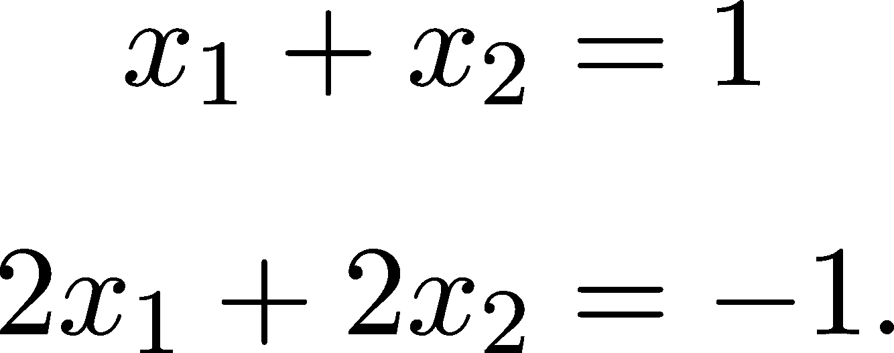
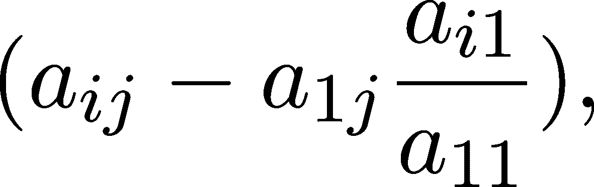

矩阵与方程

因此，矩阵不仅仅是数字的表格，而是线性变换；我们已经花费了长篇幅的章节来探索这一关系。

现在，我希望我们再次回到那些老旧的数字表格，但这次是代表线性方程组。为什么？很简单。因为解线性方程是推动关键理论和技术创新的动力。在上一章中，我们谈到了逆矩阵，但没有实际计算它。通过我们即将学习的内容，我们不仅能够计算逆矩阵，还能迅速地完成这个过程。

开始工作吧！

## 第七章：5.1 线性方程

在实践中，我们可以将多个问题转化为线性方程。例如，一个现金分配机有$900，其中包含$20 和$50 钞票。我们知道，$20 钞票的数量是$50 钞票的两倍。问题是，这台机器分别有多少张$20 和$50 钞票？

如果我们将$20 钞票的数量记作 x[1]，$50 钞票的数量记作 x[2]，那么我们得到以下方程：


对于现在我们所拥有的两个变量，这些方程可以通过将其中一个表示为另一个的形式轻松求解。在这里，第一个方程意味着 x[1] = 2x[2]。将其代入第二个方程，我们得到 90x[2] = 900，从而得出 x[2] = 10。然后将其代入 x[1] = 2x[2]，最终得到解：


然而，对于像实际应用中那样有成千上万的变量，我们需要更多的技巧。这就是线性代数的用武之地。通过引入矩阵和向量


这个方程可以写成 Ax = b 的形式。也就是说，从线性变换的角度来看，我们可以重新表述问题：哪个向量 x 通过变换 A 映射到 b？这个问题在线性代数中非常重要，我们将专门用这一部分来解决它。

### 5.1.1 高斯消元法

让我们回顾一下之前的例子：


我们可以使用第一个方程 x[1] − 2x[2] = 0 来消去第二个方程 20x[1] + 50x[2] = 900 中的 x[1]项。我们可以通过将其乘以 20 并从第二行中减去来做到这一点，得到 90x[2] = 900，从而得出 x[2] = 10。然后可以将其代入第一行，得到 x[1] = 20。

那么一般情况呢？对于一般的 A ∈ℝ^(n×n) 和 x,b ∈ℝ^n，这是否有效？绝对有效。到目前为止，我们已经使用了两条规则来操作线性系统中的方程：

1.  将方程乘以一个非零的标量不会改变解。

1.  将一行的标量倍数加到另一行上也不会改变解。

之前，我们反复应用这些方法来逐步消去变量。对于 n 个变量，我们也能轻松地做到！首先，让我们看看我们在谈论什么！

定义 21.（线性方程组）

设 A ∈ ℝ^(n×n) 是一个矩阵，b ∈ ℝ^n 是一个向量。方程组的集合为


(5.1)

称为由 A 和 b 决定的线性方程组。

线性方程组通常写成简短的形式 Ax = b，其中 A 称为系数矩阵。如果向量 x 满足 Ax = b，它就叫做解。

说到解，是否存在解，如果存在，我们如何找到它们呢？

如果 a[11] 不为零，我们可以将 (5.1) 中的第一个方程乘以 ，并从第 k 个方程中减去它。

这样，x[1] 将从除第一行以外的所有行中消去，得到


(5.2)

为了更清楚地表示这个符号，我们将新的系数表示为 a[ij]^((1)) 和 b[i]^((1))。所以，我们得到

(5.3)

我们可以重复上述过程，并使用第二个方程消去第三个方程中的 x[2] 变量，以此类推。

总共可以进行 n − 1 次这样的操作，最终得到一个方程系统 A^((n−1))x = b^((n−1))，其中 A^((n−1)) 的所有对角线以下的系数都是 0：

.png)(5.4)

请注意，第 k 步的消元仅影响从第 (k + 1) 行开始的系数。现在我们可以倒退操作：最后一个方程 a[nn]^((n−1))x[n] = b[n]^((n−1)) 可用于求解 x[n]。将其代入 (n − 1) 阶方程中，得到 x[n−1]。以此类推，我们最终可以求出所有的 x[1],…,x[n]，从而获得线性方程组的解。

这个过程叫做高斯消元法，它非常重要。它不仅仅用于解线性方程，还可以用来计算行列式、将矩阵分解成简单矩阵的乘积等等。我们将详细讨论所有这些内容，但现在先多关注方程吧。

不幸的是，并非所有线性方程都能解。例如，考虑以下系统



从第二个方程中减去第一个方程得到


在第一步中，明确表明该方程无解。

在我们进入技术细节之前，让我们看看高斯消元法如何在实际中应用的一个简单例子！

### 5.1.2 手动高斯消元法

为了更深入地理解高斯消元法，让我们考虑这个简单的方程系统


为了跟踪我们的进展（并且因为我们懒得写太多），我们记录下中间结果：


系数矩阵 A 在左边，b 在右边。为了更好地掌握该方法，我建议你亲自动手计算，跟着步骤做。

在从第二个和第三个方程中消去第一个变量之后，我们得到


最终步骤的结果是


从这个形式中，我们可以逐个解开方程的解。

在 21 世纪，手动解线性方程的机会几乎为 0。（如果你是在 22 世纪或更晚的时代阅读这本书，我同时感到无比荣幸和惊讶。或者，如果我还活着，我肯定会这么感受。）不过，理解解决线性方程背后的基本原理仍然能带你走得很远。

### 5.1.3 什么时候可以进行高斯消元？

如果你仔细跟随高斯消元的描述，可能会注意到过程可能会出现问题。在任何消元步骤中，我们可能会不小心除以 0！

例如，在方程(5.2)给出的第一步之后，新的系数呈现如下形式



如果 a[11] = 0，则此公式无效。一般来说，步骤 k 涉及到除以 a[kk]^((k−1))。由于 a[kk]^((k−1))是递归定义的，因此用 A 来描述它并不简单。为此，我们引入了主子式的概念，即矩阵的左上方子行列式。

定义 22\。（主子式）

设  为任意方阵。定义子矩阵  为去掉所有大于  的 A 的行列。例如，

![ ⌊ ⌋ [ ] ⌈a11 a12⌉ A1 = a11 , A2 = a a , 21 22 ](img/file522.png)

以此类推。A 的第 k 个主子式，记作 M[k]，定义为


第一个和最后一个主子式是特殊的，因为 M[1] = a[11]且 M[n] = detA。通过主子式，我们可以描述何时可以进行高斯消元。事实上，结果是


一般来说，a[kk]^((k−1)) = 。

总结一下，我们可以得出以下结论。

定理 30\。

设  为任意方阵，且  为其第  主子式。如果对于所有 ，都有 ，则可以成功进行高斯消元。

由于证明过程稍显复杂，我们这里不做详细讲解。（困难的步骤是证明 a[kk]^((k−1)) = M[k]∕M[k−1]；其余部分立刻可以推导出。）关键是，如果没有主子式为 0，算法就完成了。

我们可以稍微简化这一要求，用行列式而不是主子式来描述高斯消元。

定理 31\。

设 A ∈ℝ^(n×n) 为任意方阵。如果 detA≠0，则所有主子式也都不为零。

结果是，如果行列式不为零，则高斯消元成功。一个简单而美妙的要求。

### 5.1.4 高斯消元的时间复杂度

为了掌握高斯消元算法的执行速度，让我们做一点复杂度分析。如（5.2）中所描述，第一次消元步骤涉及到每个元素的加法和乘法，除了第一行的元素。也就是说，总共有 2n(n − 1) 次操作。

下一步本质上是第一次步骤，在从 A^((1)) 中去掉第一行和第一列后得到的 (n − 1) × (n − 1) 矩阵上执行。这时，我们有 2(n − 1)(n − 2) 次操作。

按照这个思路，我们很快得到总操作次数是


这看起来并不那么友好。由于我们关注的是复杂度的阶数而不是精确的次数，我们可以宽松地假设在每次消元步骤中，我们执行的是 O(n²) 次操作。所以，我们的时间复杂度是


这意味着我们需要大约 cn³ 次操作来进行高斯消元，其中 c 是一个任意的正常数。乍看之下，这似乎很多，但在算法的美妙领域中，这是非常不错的。O(n³) 是多项式时间，而且我们可以遇到更差的情况。

### 5.1.5 何时可以解线性方程组？

所以，我们刚刚看到，对于任何线性方程


如果主子式 M[1],…,M[n−1] 非零，则高斯消元可以成功执行。请注意结果的一个警告：M[n] = detA 也可以为零。事实证明，这是一个非常重要的细节。

如果你一直紧跟到现在的讨论，你会发现我们漏掉了一个关键点：对于给定的线性方程，是否存在解？有三种选择：

1.  没有解。

1.  只有一个解。

1.  有多个解。

从某种角度来看，这些都是相关的，但让我们从最直接的一个开始：何时我们有唯一解？答案很简单：当 A 可逆时，解可以明确写成 x = A^(−1)b。从线性变换的角度讲，我们可以找到一个唯一的向量 x，它被映射到 b。我们在以下定理中总结了这一思想。

定理 32\。

设  是一个可逆矩阵。那么，对于任何 ，方程  有一个唯一解，可以写成 。

如果 A 可逆，那么 detA 不为零。因此，利用我们之前学到的知识，可以执行高斯消元，从而得到唯一解。简单明了。

如果 A 不可逆，则剩下的两种可能性是：没有向量被映射到 b，这意味着没有解，或者多个向量被映射到 b，导致无限多个解。

你还记得我们在定理 20 中如何使用线性变换的核来描述其可逆性吗？事实证明，kerA 还可以用来求解线性系统的所有解。

定理 33\。

设 A ∈ℝ^(n×n) 为一个任意矩阵，且 x[0] ∈ℝ^n 为线性方程组 Ax = b 的一个解，其中 b ∈ℝ^n。则所有解的集合可以写为


证明。我们需要证明两件事：(a) 如果 x ∈ x[0] + kerA，则 x 是解；(b) 如果 x 是解，则 x ∈ x[0] + kerA。

(a) 假设 x ∈ x[0] + kerA，即 x = x[0] + y，其中 y ∈ kerA。那么，


这表明 x 确实是一个解。

(b) 现在设 x 为一个任意解。我们需要证明 x −x[0] ∈ kerA。这很容易，因为


因此，(a) 和 (b) 表明 x[0] + kerA 是所有解的集合。

从理论上讲，这一定理为求解线性方程组提供了一种极好的方法，广泛地推广到有限维向量空间以外。（请注意，这一证明对所有向量空间和线性变换适用。）例如，这一精确结果用于描述非齐次线性微分方程的所有解。

### 5.1.6 矩阵求逆

到目前为止，我们已经看到矩阵 A ∈ℝ^(n×n) 的可逆性是解线性方程的关键。然而，我们还没有找到计算矩阵逆的办法。

让我们回顾一下逆矩阵在线性变换中的含义。如果 A 的列由向量 a[1],…,a[n] ∈ℝ^n 表示，那么 A 是将标准基向量映射到这些向量的线性变换：


如果箭头的方向可以被反转，也就是说，


如果这是一个定义良好的线性方程，则 A^(−1) 称为 A 的逆矩阵。

根据本章内容，求解逆矩阵的方法很简单：对于每个 i 求解 Ax = e[i]，其中 e[1],…,e[n] ∈ℝ^n 为标准基。

假设 Ax[i] = e i。如果 b 可以表示为 b = ∑ [i=1]^nb[i]e i，则向量 x = ∑ [i=1]^nb[i]x[i] 是方程 Ax = b 的解：


因此，逆矩阵是其第 i 列为 x[i] 的矩阵。

我知道，这看起来很矛盾：为了找到 Ax = b 的解，我们需要逆矩阵 A^(−1)。为了求逆，我们需要解 n 个方程。答案是高斯消元法（第 5.1.1 节），它为我们提供了一种精确的计算方法来获得 A^(−1)。在下一节中，我们将把这一方法付诸实践，编写我们的矩阵求逆算法。从头开始，非常棒。

## 5.2 LU 分解

在上一章，我承诺你永远不需要手动解线性方程。事实证明，这个任务非常适合计算机处理。在这一章中，我们将深入探讨解线性方程的艺术，从头开始开发工具。

我们首先通过矩阵来描述高斯消元法的过程。为什么我们要这样做呢？因为矩阵乘法在现代计算机中可以非常快速地执行。将任何算法表示为矩阵形式是加速的可靠方式。

在开始时，我们的线性方程 Ax = b 由系数矩阵给出


在消元过程结束时，A 被转化为


A^((n−1)) 是上三角矩阵；也就是说，它的对角线以下的所有元素都是 0。

高斯消元法逐步执行这个任务，专注于连续的列。在第一次消元步骤后，这转化为方程式 (5.1.1)，由系数矩阵描述


我们能否通过与某个矩阵相乘从 A 获得 A^((1))；也就是说，我们能否找到 G[1] ∈ℝ^(n×n)，使得 A^((1)) = G[1]A 成立？

是的。通过定义 G[1] 为

.png)(5.5)

我们可以看到，A^((1)) = G[1]A 就是执行高斯消元法的第一步。（拿起笔和纸手动验证一下，这是一个很好的练习。）G[1]是下三角矩阵；也就是说，它的对角线以上的所有元素都是 0。事实上，除了第一列外，所有对角线下方的元素也都是 0。（请注意，G[1]依赖于 A。）

通过类比定义

.png)(5.6)

我们得到 A^((2)) = G[2]A^((1)) = G[2]G[1]A，这个矩阵在前两列上是上三角矩阵。（也就是说，所有元素在对角线以下为 0，但仅限于前两列。）

我们可以继续这个过程，直到得到上三角矩阵。

A^((n−1)) = G[n−1]…G[1]A。

算法开始逐渐形成了良好的结构。G[i] 矩阵是可逆的，具有逆矩阵


依此类推。通过逐个乘以它们的逆矩阵，我们可以将 A 表示为


幸运的是，我们可以手动计算 L := G[1]^(−1)…G[n−1]^(−1)。经过快速计算，我们得到：

.png)(5.8)

这是一个下三角矩阵。（再次提醒，不要羞于手动验证（5.8））。通过定义上三角矩阵 U := A^((n−1))，我们得到了著名的 LU 分解，将 A 分解为下三角矩阵和上三角矩阵：


注意，使用这个算法，我们用一个代价完成了两个任务：将 A 分解为上三角矩阵和下三角矩阵的乘积，同时执行高斯消元。

从计算角度看，LU 分解是一个极其重要的工具。由于它本质上是高斯消元法的改进版，它的复杂度是 O(n³)，正如我们在之前（第 5.1.4 节）所看到的。

坏消息：LU 分解并不总是可用的。由于它与高斯消元法相关联，我们可以用类似的方式描述其存在性。回顾一下，高斯消元法要成功完成，要求主小行列式非零（定理 31）。这一要求同样适用于 LU 分解。

定理 34.（LU 分解的存在性）

设 A ∈ℝ^(n×n) 是一个任意的方阵，M[k] 是它的第 k 个主小行列式。如果对所有 k = 1, 2, …, n − 1，M[k] ≠ 0，则 A 可以写作：


其中 L 是下三角矩阵，U 是上三角矩阵。此外，L 的对角线元素均为 1。

关键点是：如果在算法中避免除以 0，一切都没问题。请注意，LU 算法不要求非零 M[n] = detA，也就是说，不需要是一个可逆矩阵！

经过所有这些准备后，我们终于可以付诸实践了！

### 5.2.1 实现 LU 分解

总结 LU 分解，它本质上是两个步骤的迭代：

1.  计算输入的消元矩阵。

1.  将输入乘以消元矩阵，将输出反馈到第一步。

计划很清晰：首先，我们写一个函数计算消元矩阵及其逆矩阵；然后，使用矩阵乘法迭代执行消元步骤。

```py
import numpy as np 

def elimination_matrix( 
    A: np.ndarray, 
    step: int, 
): 
    #x0022;"/span> 
    Computes the step-th elimination matrix and its inverse. 

    Args: 
        A (np.ndarray): The matrix of shape (n, n) for which 
            the LU decomposition is being computed. 
        step (int): The current step of elimination, an integer 
            between 1 and n-1 

    Returns: 
        elim_mtx (np.ndarray): The step-th elimination matrix 
            of shape (n, n) 
        elim_mtx_inv (np.ndarray): The inverse of the 
            elimination matrix of shape (n, n) 
    #x0022;"/span> 

    n = A.shape[0] 
    elim_mtx = np.eye(n) 
    elim_mtx_inv = np.eye(n) 

    if 0 /span> step /span> n: 
        a = A[:, step-1]/A[step-1, step-1] 
        elim_mtx[step:, step-1] = -a[step:] 
        elim_mtx_inv[step:, step-1] = a[step:] 

    return elim_mtx, elim_mtx_inv
```

现在，我们准备执行消元步骤了。

```py
def LU(A: np.ndarray): 
    #x0022;"/span> 
    Computes the LU factorization of a square matrix A. 

    Args: 
        A (np.ndarray): A square matrix of shape (n, n) to be factorized. 
            It must be non-singular (invertible) for the 
            decomposition to work. 

    Returns: 
        L (np.ndarray): A lower triangular matrix of shape (n, n) 
            with ones on the diagonal. 
        U (np.ndarray): An upper triangular matrix of shape (n, n). 
    #x0022;"/span> 

    n = A.shape[0] 
    L = np.eye(n) 
    U = np.copy(A) 

    for step in range(1, n): 
        elim_mtx, elim_mtx_inv = elimination_matrix(U, step=step) 
        U = np.matmul(elim_mtx, U) 
        L = np.matmul(L, elim_mtx_inv) 

    return L, U
```

让我们在一个小矩阵上测试我们的函数。

```py
A = 10*np.random.rand(4, 4) - 5 
A
```

```py
array([[-4.61990165, -3.97616553, -1.34258661,  0.50835913], 
      [-2.39491833, -2.3919011 , -1.3266581 ,  2.8658852 ], 
      [ 4.32658116,  0.43607725,  4.41630776, -4.46731714], 
      [-0.68329877,  4.76659965, -1.13602896, -2.12305592]])
```

```py
L, U = LU(A) 

print(f/span>Lower:\n{L}\n\nUpper:\n{U}"
```

```py
Lower: 
[[  1\.          0\.          0\.          0\.       ] 
 [  0.51839163   1\.          0\.          0\.       ] 
 [ -0.93650936   9.94174964   1\.          0\.       ] 
 [  0.14790331 -16.19246049  -1.18248523   1\.       ]] 

Upper: 
[[-4.61990165e+00 -3.97616553e+00 -1.34258661e+00  5.08359130e-01] 
 [ 0.00000000e+00 -3.30690182e-01 -6.30672445e-01  2.60235608e+00] 
 [ 0.00000000e+00  0.00000000e+00  9.42895038e+00 -2.98632067e+01] 
 [ 1.11022302e-16 -8.88178420e-16  1.77635684e-15  4.62750317e+00]]
```

结果正确吗？让我们通过将 L 和 U 相乘来测试，看看是否能还原回 A。

```py
np.allclose(np.matmul(L, U), A)
```

```py
True
```

总体而言，LU 分解是一种非常灵活的工具，在实现基本算法中作为一个重要的基础步骤。其中之一是计算逆矩阵，正如我们接下来将看到的。

### 5.2.2 逆矩阵的计算，真正的计算

到目前为止，我们已经谈论了很多关于逆矩阵的内容。我们从多个角度探讨了可逆性的问题，包括核与像、行列式和线性方程的可解性。

然而，我们还没有讨论实际计算逆矩阵的过程。通过 LU 分解，我们得到了一种可以用于此目的的工具。如何实现？通过将下三角矩阵代入高斯消元过程，我们可以将其逆矩阵作为副作用获得。因此，我们

1.  计算 LU 分解 A = LU，

1.  反转下三角矩阵 L 和 U^T，

1.  使用恒等式(U[−1])T = (U[T])−1 来得到 U^(−1)，

1.  将 L^(−1)和 U^(−1)相乘，最终得到 A^(−1) = U^(−1)L^(−1)。

这就是计划！让我们从反转下三角矩阵开始。

设 L ∈ℝ^(n×n)是一个任意的下三角矩阵。按照与(5.7)相同的过程，我们可以得到


其中 D，经过高斯消元后的最终结果，是一个对角矩阵


G[i]是由(5.5)、(5.6)等定义的消元矩阵。

由于的逆矩阵就是，我们可以将表示为


我们可以非常类似地实现这一点，LU 分解的实现方法几乎相同；我们甚至可以重用我们的 elimination_matrix 函数。

```py
def invert_lower_triangular_matrix(L: np.ndarray): 
    #x0022;"/span> 
    Computes the inverse of a lower triangular matrix. 

    Args: 
        L (np.ndarray): A square lower triangular matrix of shape (n, n). 
                        It must have non-zero diagonal elements for the 
                        inversion to succeed. 

    Returns: 
        np.ndarray: The inverse of the lower triangular matrix L, with 
                        shape (n, n). 
    #x0022;"/span> 
    n = L.shape[0] 
    G = np.eye(n) 
    D = np.copy(L) 

    for step in range(1, n): 
        elim_mtx, _ = elimination_matrix(D, step=step) 
        G = np.matmul(elim_mtx, G) 
        D = np.matmul(elim_mtx, D) 

    D_inv = np.eye(n)/np.diagonal(D)   # NumPy performs this operation elementwise 

    return np.matmul(D_inv, G)
```

完成这些后，我们就准备好反转任何矩阵（前提是矩阵确实可逆）。

我们几乎快到终点了。每个组件都已准备好，剩下的就是将它们组合起来。我们可以通过几行代码来完成这一切。

```py
def invert(A: np.ndarray): 
    #x0022;"/span> 
    Computes the inverse of a square matrix using its LU decomposition. 

    Args: 
        A (np.ndarray): A square matrix of shape (n, n). The matrix must be 
                        non-singular (invertible) for the inversion to succeed. 

    Returns: 
        np.ndarray: The inverse of the input matrix A, with shape (n, n). 
    #x0022;"/span> 
    L, U = LU(A) 
    L_inv = invert_lower_triangular_matrix(L) 
    U_inv = invert_lower_triangular_matrix(U.T).T 
    return np.matmul(U_inv, L_inv)
```

Voilà！亲眼见证这个结果。

```py
A = np.random.rand(3, 3) 
A_inv = invert(A) 

print(f/span>A:\n{A}\n\nA^{-1}:\n{A_inv}\n\nAA^{-1}:\n{np.matmul(A, A_inv)}"
```

```py
A: 
[[0.17180745 0.79269571 0.36879642] 
 [0.37772174 0.94712553 0.55310582] 
 [0.93418085 0.38813821 0.51581695]] 

A^{-1}: 
[[  9.14230036  -8.87123133   2.97602074] 
 [ 10.74480189  -8.5427258    1.47801811] 
 [-24.64252111  22.49459369  -4.56327945]] 

AA^{-1}: 
[[ 1.00000000e+00 -1.37050081e-15  1.56962305e-17] 
 [-4.06841165e-16  1.00000000e+00 -4.50714074e-16] 
 [ 1.26848123e-14 -1.04564970e-14  1.00000000e+00]]
```

为了测试我们的反转函数的正确性，我们快速检查几种随机生成的矩阵结果。

```py
for _ in range(1000): 
    n = np.random.randint(1, 10) 
    A = np.random.rand(n, n) 
    A_inv = invert(A) 
    if not np.allclose(np.matmul(A, A_inv), np.eye(n), atol=1e-5): 
        print("/span>Test failed."
```

由于上面没有错误消息，函数（可能）是正确的。

几章之前看似复杂抽象的内容，现在已掌握在我们手中。我们能够反转任何矩阵，不依赖内置函数，而是通过从零开始编写的函数来实现。我喜欢这种时刻，当所有的部分终于组合起来，一切都变得清晰明了。放松一下，欣赏一下带我们走到这里的过程吧！

### 5.2.3 如何实际反转矩阵

当然，我们的 LU 分解！矩阵反转实现远非最优。当处理 NumPy 数组时，我们可以依赖内置函数。在 NumPy 中，这是 np.linalg.inv。

```py
A = np.random.rand(3, 3) 
A_inv = np.linalg.inv(A) 

print(f/span>A:\n{A}\n\nNumPy’s A^{-1}:\n{A_inv}\n\nAA^{-1}:\n{np.matmul(A, A_inv)}"
```

```py
A: 
[[0.08503998 0.31186637 0.71032538] 
 [0.48973954 0.77358354 0.96303592] 
 [0.31250848 0.14359491 0.05593863]] 

NumPy’s A^{-1}: 
[[ 2.13348825 -1.89861153  5.59470678] 
 [-6.14268693  4.87769374 -5.97239945] 
 [ 3.84931433 -1.91423645  1.95236829]] 

AA^{-1}: 
[[ 1.00000000e+00 -1.86546922e-16  2.74435800e-16] 
 [-1.62367293e-16  1.00000000e+00  9.21871975e-17] 
 [-1.41854334e-18  3.64838601e-17  1.00000000e+00]]
```

让我们比较一下我们实现的运行时间与 NumPy 的运行时间。

```py
from timeit import timeit 

n_runs = 100 
size = 100 
A = np.random.rand(size, size) 

t_inv = timeit(lambda: invert(A), number=n_runs) 
t_np_inv = timeit(lambda: np.linalg.inv(A), number=n_runs) 

print(f/span>Our invert:              \t{t_inv} s 
print(f/span>NumPy’s invert:          \t{t_np_inv} s 
print(f/span>Performance improvement: \t{t_inv/t_np_inv} times faster
```

```py
Our invert:                    14.586225221995846 s 
NumPy’s invert:                0.46499890399718424 s 
Performance improvement:       31.368300218798304 times faster
```

一次巨大的改进。不错！（别忘了执行时间是 LU 分解！矩阵的逆运算是硬件相关的。）为什么 NumPy 会更快呢？有两个主要原因。首先，它直接调用了 LAPACK 中的 SGETRI 函数，这个函数极其快速。其次，根据它的文档（[`www.netlib.org/lapack/explore-html/da/d28/group__getri_gaa3bf1bb1432917f0e5fdf4c48bd6998c.html`](https://www.netlib.org/lapack/explore-html/da/d28/group__getri_gaa3bf1bb1432917f0e5fdf4c48bd6998c.html)），SGETRI 使用了一个更快的算法：

```py
#x0022;"/span> 
SGETRI computes the inverse of a matrix using the LU factorization 
computed by SGETRF. 

This method inverts U and then computes inv(A) by solving the system 
inv(A)*L = inv(U) for inv(A). 
 #x0022;"/span>
```

因此，NumPy 调用了 LAPACK 函数，而该函数又使用了 LU 分解。（我并不是特别擅长深入研究比我还要古老的 Fortran 代码，所以如果我在这里错了，请告诉我。不过，现代框架仍然调用这个古老的库，足以证明它的强大。永远不要低估像 LAPACK 和 Fortran 这样的老技术。）

我们刚刚学到的强大 LU 分解，还有其他应用吗？很高兴你问了！当然有；这就是数学的美妙之处。即使是最古老的工具，总能找到新的和意想不到的应用。这一次，我们终于会看到如何快速计算行列式！（当然也会有慢的计算方法。）

## 5.3 行列式的实际应用

在数学的理论与实践中，概念的发展通常有一个简单的流程。定义首先源于模糊的几何或代数直觉，最终凝练为数学形式化。

然而，数学定义常常忽略实际情况。你可得理解，这背后有非常好的理由！把实际考虑抛在一边使得我们能够有效地推理结构，这就是抽象的力量。最终，如果能找到有意义的应用，发展方向就会朝向计算问题，速度和效率便成为焦点。

神经网络本身就是这一点的典型。无论是从理论构想到如今可以在智能手机上运行的先进算法，机器学习研究遵循了这一同样的轨迹。

这也是我们在本书中从微观层面上所经历的事情。在许多其他例子中，想想行列式。我们将行列式定义为列向量的方向性以及由它们定义的平行六面体的体积。然而，我们实际上并没有真正进行过计算它们的实践。我们当然给出了一个或两个公式，但很难判断哪个公式最复杂，实际上它们都一样复杂。

另一方面，行列式的数学研究产生了大量有用的结果：线性变换的可逆性、高斯消元的特征化等等（甚至更多的结果还在后面）。

在这一节中，我们准备偿还我们的债务，并开发实际计算行列式的工具。像之前一样，我们将采用直接的方式，使用之前推导出的某个行列式公式。剧透一下：这远非最优方法，因此我们将找到一种更快速地计算行列式的方法。

### 5.3.1 两害相权取其轻

让我们回顾一下迄今为止我们关于行列式的了解（定义 20）。给定一个矩阵 A ∈ℝ^(n×n)，它的行列式 detA 量化了线性变换 x → Ax 对体积的扭曲。也就是说，如果 e[1],…,e[n] 是标准的正交归一基，那么非正式地说，


我们已经推导出了两种计算这个量的公式。最初，我们通过对所有排列求和来描述行列式：


这很难理解，更不用说编程计算了。因此，推导出了一个递归公式，我们也可以使用。它指出：


其中 A[i,j] 是通过删除 A 的第 i 行和第 j 列得到的矩阵。你更倾向于使用哪一种方法？花几分钟思考一下你的推理。

不幸的是，这里没有正确的选择。使用排列公式时，必须首先找到生成所有排列的方法，然后计算它们的符号。此外，S[n] 中有 n! 种唯一排列，因此这个和包含了很多项。使用这个公式似乎非常困难，因此我们将采用递归版本。递归也有它的问题（我们很快就会看到），但从编码的角度来看，它比较容易处理。让我们开始吧！

### 5.3.2 递归方式

让我们来看一下这个公式：


在我们的放大镜下。如果 A 是一个 n×n 矩阵，那么 A[1,j]（通过删除 A 的第一行和第 j 列得到的矩阵）是一个 (n−1) × (n−1) 的矩阵。这是一个递归步骤。对于每个 n×n 的行列式，我们需要计算 n 个 (n−1) × (n−1) 的行列式，依此类推。

到最后，我们得到了大量的 1 × 1 行列式，这些可以很容易计算。因此，我们有了一个边界条件，有了它，我们准备将这些合并在一起。

```py
def det(A: np.ndarray): 
    #x0022;"/span> 
    Recursively computes the determinant of a square matrix A. 

    Args: 
        A (np.ndarray): A square matrix of shape (n, n) for which the 
        determinant is to be calculated. 

    Returns: 
        float: The determinant of matrix A. 

    Raises: 
        ValueError: If A is not a square matrix. 
    #x0022;"/span> 

    n, m = A.shape 

    # making sure that A is a square matrix 
    if n != m: 
        raise ValueError("/span>A must be a square matrix." 

    if n == 1: 
        return A[0, 0] 

    else: 
        return sum([(-1)**j*A[0, j]*det(np.delete(A[1:], j, axis=1)) for j in range(n)])
```

让我们在一个小例子中测试一下 det 函数。对于 2 × 2 矩阵，我们可以轻松使用以下规则计算行列式：


```py
A = np.array([[1, 2], 
              [3, 4]]) 
det(A)    # should be -2
```

```py
np.int64(-2)
```

结果似乎没问题。到目前为止，一切顺利。那问题出在哪里呢？递归。让我们计算一个小的 10 × 10 矩阵的行列式，并测量所需的时间。

```py
from timeit import timeit 

A = np.random.rand(10, 10) 
t_det = timeit(lambda: det(A), number=1) 

print(f/span>The time it takes to compute the determinant of a 10 x 10 matrix: {t_det} seconds
```

```py
The time it takes to compute the determinant of a 10 x 10 matrix: 
63.98369195000123 seconds
```

那真是漫长且令人无法忍受。对于这么简单的任务，感觉像过了一个世纪。

对于 n×n 的输入，我们递归地调用 det 函数 n 次，每次处理 (n−1) × (n−1) 的输入。也就是说，如果 a[n] 表示我们算法在 n×n 矩阵上的时间复杂度，那么由于递归步骤，我们有：


它爆炸得非常快。实际上，a[n] = O(n!)，这就是令人害怕的阶乘复杂度。与其他一些递归算法不同，[缓存](https://docs.python.org/3/library/functools.html#functools.cache)也没有帮助。出现这种情况有两个原因：子矩阵很少匹配，而且 numpy.ndarray 对象是可变的，因此不能进行哈希处理。

实际上，n 可以达到数百万，所以这个公式完全没有用。我们该怎么办？很简单：LU 分解。

### 5.3.3 如何实际计算行列式

除了这两个公式外，我们还看到了许多矩阵和行列式的有用性质。我们能否将目前学到的知识应用到简化问题上呢？

让我们考虑 LU 分解。根据此分解，如果 detA ≠ 0，则 A = LU，其中 L 是下三角矩阵，U 是上三角矩阵。由于行列式在矩阵乘法下表现良好（参见公式(4.11)），我们有


表面上看，我们把情况弄得更糟了：我们需要处理两个行列式，而不是一个。然而，L 和 U 是非常特殊的，因为它们是三角矩阵。事实证明，计算三角矩阵的行列式是非常简单的。我们只需要把对角线上的元素相乘！

定理 35（一个三角矩阵的行列式）

让 A ∈ ℝ^(n×n)是一个三角矩阵。（也就是说，它可以是下三角矩阵或上三角矩阵。）那么，


证明：假设 A 是下三角矩阵。（即，所有位于对角线上的元素都为 0。）根据 detA 的递归公式，我们得到


因为 A 是下三角矩阵，当 j > 1 时，a[1,j] = 0。所以，


A[1,1] = (a[ij])[i,j=2]^n 也是下三角矩阵。通过迭代上一步，我们得到


这正是我们需要证明的。

如果 A 是上三角矩阵，则其转置 A^T 是下三角矩阵。因此，我们可以应用之前的结果，所以


这个式子同样成立。

回到我们最初的问题。由于对角矩阵 L 的元素为常数 1（见(5.8)），这是 LU 分解所保证的，因此我们有


所以，计算行列式的算法非常简单：先获取 LU 分解，再计算 U 对角线元素的乘积。让我们实际操作一下！

```py
def fast_det(A: np.ndarray): 
    #x0022;"/span> 
    Computes the determinant of a square matrix using LU decomposition. 

    Args: 
        A (np.ndarray): A square matrix of shape (n, n) for which the determinant 
                         needs to be computed. The matrix must be non-singular (invertible). 

    Returns: 
        float: The determinant of the matrix A. 
    #x0022;"/span> 
    L, U = LU(A) 
    return np.prod(np.diag(U))
```

是的，就是这么简单。让我们看看它的效果吧！

```py
A = np.random.rand(10, 10) 

t_fast_det = timeit(lambda : fast_det(A), number=1) 
print(f/span>The time it takes to compute the determinant of a 10 x 10 matrix: {t_fast_det} seconds
```

```py
The time it takes to compute the determinant of a 10 x 10 matrix: 
0.0008458310039713979 seconds
```

它的速度提高了一个巨大的幅度。到底提高了多少呢？

```py
print(f/span>Recursive determinant:   \t{t_det} s 
print(f/span>LU determinant:          \t{t_fast_det} s 
print(f/span>Performance improvement: \t{t_det/t_fast_det} times faster
```

```py
Recursive determinant:         63.98369195000123 s 
LU determinant:                0.0008458310039713979 s 
Performance improvement:       75645.95250065446 times faster
```

这真是一个疯狂的改进！如果我们使用更好的 LU 分解算法（例如 scipy.linalg.lu，它依赖于我们熟悉的 LAPACK），速度甚至可以更快。

仅仅看到这个结果，我就感动得不行。看看我们能用一点点线性代数做到多远？这就是为什么理解高斯消元法等基础知识至关重要的原因。机器学习和深度学习仍然是非常新的领域，尽管已经投入了大量的研究力量，但这样的时刻却时常发生。简单的想法往往会催生新的范式。

## 5.4 小结

在本章中，我们从线性方程组的角度研究了矩阵，即形式为


不出所料，这些都可以用矩阵来描述，上述表达式等同于 Ax = b。解线性方程是一个古老的艺术，那么为什么我们在 AI 时代还要谈论它呢？

记住：如果你在和投资者谈论，那才叫 AI。从根本上说，这只是线性代数、微积分和概率论。

我们想要解线性方程，这将我们引向了高斯消元法（嗯，引导高斯到了高斯消元法）。这又引导我们到 LU 分解。然后引导我们到快速矩阵求逆，以及我们当前技术所建立的一系列其他创新。让我告诉你，快速的矩阵乘法和求逆是计算线性代数的基础，它们都源于那门古老的解线性方程的艺术。

让我们一一回顾一下在本章中取得的成就：

+   通过高斯消元法求解线性方程，

+   通过线性方程组来描述矩阵的可逆性，

+   发现了一种矩阵分解技巧，称为 LU 分解，

+   使用 LU 分解构建一个疯狂快速的矩阵求逆算法，

+   并且使用——鼓声！——LU 分解，构建一个疯狂快速的行列式计算算法。

然而，我们与矩阵的关系还没有结束。回想一下我们之前建立的矩阵与线性变换之间的关系，将矩阵视为扭曲底层特征空间的数据变换。事实证明，如果从正确的角度来看，这种扭曲总是拉伸。嗯，几乎总是。嗯，几乎是拉伸。

好吧，那些“嗯”太多了，让我们在下一章中彻底清理这些内容，深入研究特征值和特征向量。出发吧！

## 5.5 问题

问题 1\. 证明上三角矩阵的乘积是上三角矩阵。同理，证明下三角矩阵的乘积是下三角矩阵。（我们在本节中广泛使用了这些事实，但没有给出证明。所以，如果你还没有这么做，现在正是自己验证这些事实的好时机。）

问题 2\. 编写一个函数，给定一个可逆的方阵 A ∈ℝ^(n×n) 和一个向量 b ∈ℝ^n，求解线性方程 Ax = b 的解。（如果你使用我们在这里构建的工具之一，可以通过一行代码完成。）

问题 3。 在我们结束本章之前，回到行列式的定义。尽管有很多理由反对使用行列式公式，但我们有一个支持它的理由：它是一个很好的练习，实现它会加深你的理解。因此，在这个问题中，你将构建


一步一步来。

(i) 实现一个函数，给定整数 n，返回集合{0,1,…,n − 1}的所有排列。将每个排列σ表示为一个列表。例如，

```py
[2, 0, 1]
```

将表示排列σ，其中σ(0) = 2，σ(1) = 0，σ(2) = 1。

(ii) 让σ ∈S[n]是集合{0,1,…,n − 1}的一个排列。它的逆序数定义为


其中 j ⋅j 表示集合中元素的数量。本质上，逆序描述了排列中反转一对数字顺序的次数。

结果，σ的符号可以写成


实现一个函数，首先计算逆序数，然后计算任意排列的符号。（排列如前一个问题中所示）

(iii) 将问题 1 和问题 2 的解法结合在一起，并使用排列公式计算矩阵的行列式。你认为这个算法的时间复杂度是多少？

## 加入我们的社区，参与 Discord 讨论

与其他用户、机器学习专家以及作者本人一起阅读本书。提问、为其他读者提供解决方案、通过“问我任何问题”环节与作者交流，等等。扫描二维码或访问链接加入社区。[`packt.link/math`](https://packt.link/math)


