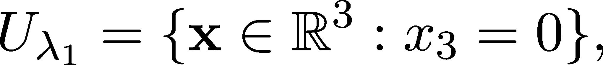
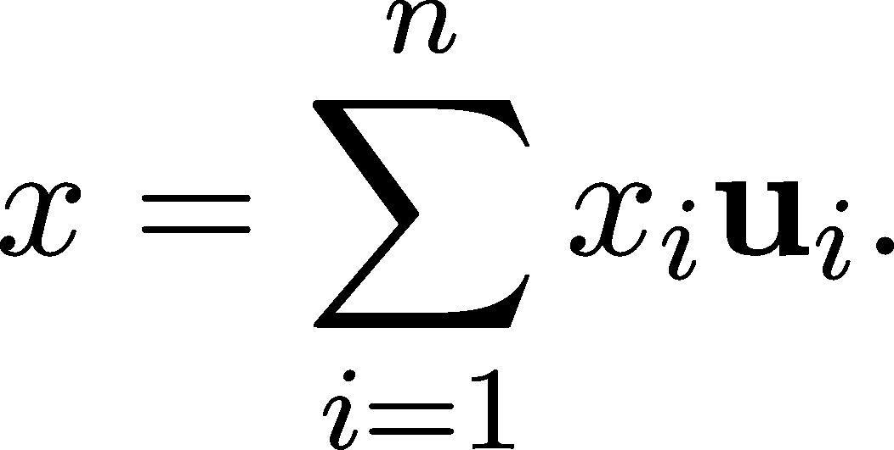
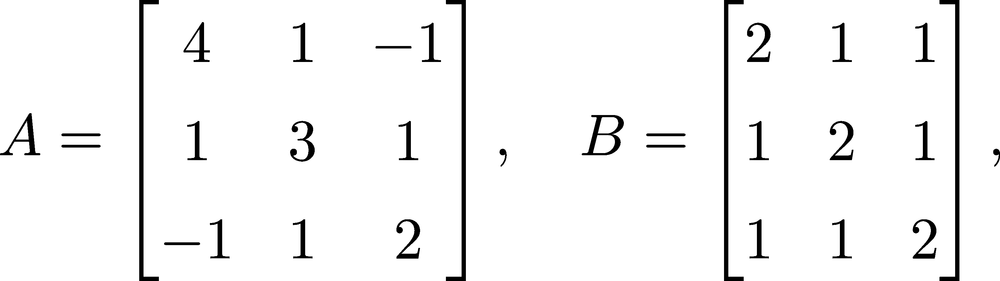

特征值和特征向量

到目前为止，我们已经看到了线性变换的三个方面：函数、矩阵和扭曲底层向量空间网格的变换。在欧几里得平面中，我们看到了一些示例（第 4.3 节），这些示例为它们的几何性质提供了一些启示。

延续这个思路，让我们考虑由矩阵给出的线性变换

.png)6.1

由于 A 的列是标准基向量 e[1] = (1,0)和 e[2] = (0,1)的像，我们可以通过图 6.1 来直观地理解 A 的作用。（如果你不记得这个事实，请查看第 4.1.1 节。）

这似乎是剪切、拉伸并旋转了整个网格。然而，有些特殊方向下，A 只是一个拉伸。例如，考虑向量 u[1] = (1,1)。通过简单的计算，你可以验证 Au[1] = 3u[1]。

由于线性性，这意味着如果一个向量 x 在 span(u[1])中，那么它在 A 作用下的像是 3x。

图 7.1：A 给出的线性变换下标准基向量的像

另一个是 u[2] = (−1,1)，我们有 Au[2] = u[2]。因此，任何 x ∈ span(u[2])都会保持不变。

如果我们选择 u[1]，u[2]作为基础，那么该变换的矩阵是

也就是说，A[u[1],u[2]]是对角化的。

图 7.2：A 给出的线性变换下 u[1] = (1,1)和 u[2] = (−1,1)的像

在实践中，我们喜欢对角矩阵，因为与对角矩阵的乘法要快得多，它只需要 O(n)次操作，相对于 O(n²)的操作复杂度。

这是一个普遍现象吗？这些有用吗？答案是对这两个问题都回答“是”。我们刚才看到的内容通过特征值和特征向量的概念得到了形式化。这个术语来源于德语单词“eigen”，意思是“自己的”，也因此导致了数学中最丑陋的命名约定之一。

定义 23.（特征值和特征向量）

设 f : V → V 为任意线性变换。如果 f(x) = λx 成立，那么标量λ和 x ∈V ∖{0}非零向量就是 f 的特征值-特征向量对。

## 第八章：6.1 矩阵的特征值

尽管我们已经正式定义了线性变换的特征值和特征向量，但我们通常在矩阵的上下文中讨论它们。（因为，正如我们所见，矩阵和线性变换是同一事物的两种不同表现形式。）让我们从将定义转换为矩阵语言开始。

如果 A ∈ℝ^(n×n)是一个矩阵，则定义 23 可转化为以下内容：标量λ和向量 x ∈ℝ ∖{0}是矩阵的特征值-特征向量对，如果

A**x** = λ**x**

(6.2)

这可以简化：线性变换 x→λx 对应的矩阵是λI，(6.2)等价于

(A − λI)**x** = **0**

(6.3)

如果你回忆起第四章，第 4.1.1 节，我们在那一节中学到了矩阵是如何从线性变换中产生的，你可能会问：特征值不会依赖于矩阵的选择吗？

以下定理指出情况并非如此：线性变换及其矩阵的特征值是相同的。

定理 36.（相似矩阵的特征值）

设 A,B ∈ℝ^(n×n)是两个相似矩阵，即假设存在一个可逆矩阵 T ∈ℝ^(n×n)，使得 B = T^(−1)AT。那么，如果对于某个标量λ和向量 x ∈ℝ^n，有 Ax = λx，

则：

对某些 x^′∈ℝ^n 同样成立。

证明。让我们稍微调整一下特征值 (6.3)！我们有：

由于 T 是可逆的，T[(T^(−1)AT −λI)T^(−1)x] = 0 只有在 (T^(−1)AT −λI)T^(−1)x = 0 时才成立。（回顾定理 20 中关于核与可逆性的关系。）这看起来几乎和 (6.3) 一样，只是稍微复杂了一点。让我用一些提示性的括号来突出相似之处：

![ −1 − 1 [T AT − λI ][T x] = 0\. ](img/file586.png)

所以，使用选择 x^′ = T^(−1)x，我们有：

这就是我们需要证明的。

换句话说，相似矩阵的特征值是相同的。因此，我们可以谈论矩阵的特征值，而不仅仅是线性变换的特征值。上述定理意味着变换及其对应矩阵的特征值是相同的。而且，矩阵的特征值不依赖于基的选择。

更精确地说，假设 A : U →U 是一个线性变换，P，Q 是 U 的基。A 在某个基 S 中的矩阵表示为 A[Q]。我们知道，存在一个变换矩阵 T ∈ℝ^(n×n)，使得：

所以，特征值是相同的。

上述所有内容都引出了一个问题：我们到底该如何实际找到特征值呢？接下来我们就来讨论这个问题。

## 6.2 查找特征值-特征向量对

尽管从几何解释来看，特征值-特征向量对的定义很容易理解，但它并没有为我们提供实际寻找它们的工具。利用它们来获得矩阵的简化表示是其中的一项应用，但如果没有方法来寻找它们，我们还是停留在原点。

首先，我们关注特征值。假设对于某个λ，存在一个非零向量 x 使得 Ax = λx。由 x →λx 定义的变换是线性的，其矩阵是对角矩阵：

其中对角线上是λ的矩阵就是λI，也就是λ倍的单位矩阵。

因为线性变换可以相加和相减（正如我们在第 4.1.2 节中看到的），所以定义方程 Ax = λx 等价于

其中 I 表示单位变换，如公式（4.3）所定义。换句话说，变换 A−λI 将一个非零向量映射到 0，这意味着它是不可逆的，正如定理 20 所暗示的那样。我们可以用行列式来表征这一点：我们需要找到所有λ，使得

我们可以将上述结论总结为以下定理。

定理 37\.

设是一个任意的线性变换。那么是其特征值，当且仅当

虽然我们已经更进一步，但基于这个方法找到特征值仍然看起来很复杂。接下来，我们将看看 det(A−λI)到底是什么，以及我们如何在实际中找到 det(A −λI) = 0 的解。

在深入讨论一般情况之前，让我们回顾一下例子（6.1）。在这个例子中，我们有

为了找到特征值，我们必须解这个二次方程

这是我们可以轻松做到的。回想一下，任何二次方程 ax² + bx + c = 0 的解是

应用这一点，我们得到λ[1] = 3 和 λ[2] = 1 作为解。没有其他解，因此 1 和 3 是 A 的唯一两个特征值。

让我们看看在一般情况下会发生什么！

### 6.2.1 特征多项式

正如上面的例子所示，如果底层向量空间 U 是 n 维的，也就是说 A 是一个 n ×n 的矩阵，那么 det(A −λI)是λ的 n 次多项式。

为了看清这一点，让我们显式地将 det(A−λI)写成矩阵的形式。考虑到这一点，我们得到

如果你考虑计算行列式的公式（4.12），你会发现每一项都是一个多项式。根据σ的固定点数（即σ(i) = i 的点有多少），这个多项式的次数介于 0 和 n 之间。

（或者，你可以通过使用递归公式（4.13）并应用归纳法，看到 det(A−λI)是一个 n 次的多项式。）

定义 24\. （矩阵的特征多项式）

设 A ∈ℝ^(n×n)是任意矩阵。多项式

被称为 A 的特征多项式。

特征多项式的根就是特征值。如果 U 是一个 n 维复向量空间（即标量集是 ℂ），代数基本定理（定理 156）保证 det(A −λI) = 0 有正好 n 个根。

结果是，任何矩阵 A ∈ℂ^(n×n) 至少有一个特征值。注意，根可以具有更高的代数重数。例如，矩阵的特征多项式

为 (1 −λ)²(2 −λ)。所以，它的根是 1（代数重数为 2）和 2。

如果我们只局限于实矩阵和实向量空间，那么特征值和特征向量的存在并不能得到保证。例如，考虑

它的特征多项式是 λ² + 1，它没有实数根，只有复数根：λ[1] = i 和 λ[2] = −i。从数学上讲，如果我们想在实向量空间的范围内停留，C 没有特征值。然而，我们现在是在做机器学习，而不是代数。因此，我们将稍微不精确一些，将实数矩阵视为复数矩阵。我们通常不需要复数来描述数据集的数学模型，但它们在矩阵分析过程中经常出现。

### 6.2.2 寻找特征向量

当一个特征值 λ 被识别时，我们可以开始寻找对应的特征向量；即，寻找向量 x，使得 (A−λI)x = 0。更精确地说，我们在寻找 ker(A −λI)。

正如我们在第 4.1.4 节中提到的，任何线性变换的核是一个子空间。由于它可能是多维的，因此确定它通常需要像 x[1] + x[2] = 0 这样的隐式描述。

让我们检查一下我们反复出现的例子

之前，我们已经看到 λ[1] = 3 和 λ[2] = 1 是特征值。为了识别对应的特征向量，例如 λ[1]，我们必须找到线性方程 (A −λ[1]I)x = 0 的所有解。展开后，我们有

两个方程意味着所有 x = (x[1],x[2]) 是解，其中 x[1] = x[2]。

## 6.3 特征向量、特征空间及其基

定义 25.（特征空间）

设 f : V →V 是一个任意的线性变换，λ 是它的特征值。由此定义的特征向量子空间

称为 λ 的特征空间。

特征空间在理解线性变换的结构中起着重要作用。首先，我们注意到线性变换保持其特征空间不变。（也就是说，如果 x 属于 U[λ] 特征空间，那么 f(x) 也属于 U[λ]。）这一性质使我们能够将线性变换限制在其特征空间内。

为了说明特征空间的概念，让我们回顾一下已经熟悉的矩阵

再次考虑。它的特征值为λ[1] = 3 和λ[2] = 1，通过解方程(A −λ[1]I)x = 0，我们得到λ[1]的特征空间是

同样，你可以检查 U[λ[2]] = {x ∈ ℝ² : x[1] = −x[2]}。（如果你回到图 6.2，可以直观地看到 U[λ[1]]和 U[λ[2]]。）

特征空间不一定是一维的。例如，考虑前面提到的一个例子

具有两个特征值λ[1] = 1 和λ[2] = 2。将λ[1]代入方程并解方程(B −I)x = 0，得到

这只是由前两个坐标轴确定的平面。

特征空间的结构决定了我们是否可以通过基变换对矩阵 A 进行对角化（第 4.2 节）。以下的定理建立了这种联系。

定理 38。（对角化与特征空间）

设 f : V → V 为线性变换，A ∈ ℝ^(n×n)是其在某个基下的矩阵，U[λ1,…,U]{λ[k]}是 f 的特征空间。以下是等价的。

（a）存在一个矩阵 T ∈ ℝ^(n×n)，使得

其中Λ是一个对角矩阵。

（b）存在一个基 u[1],…,u[n]，它可以从 f 的特征向量中选取。

（c）V 可以表示为特征空间的直和，即，

（注意，k，即特征空间的数量，不一定等于 n。）

证明。（a）⇒（b）。如果是某个基下的矩阵，那么相似变换等同于基的变化。

也就是说，新的矩阵Λ = T^(−1)AT 是 f 在不同基下的矩阵，例如 u[1],…,u[n]。

如果Λ是对角矩阵，它可以写成以下形式

（注意，λ[i] 不一定彼此不同。）因此，Λu[i] = λ[i]u[i]，这意味着 u[1],…,u[n]是 f 的特征向量所组成的基。

（b）⇒（a）。如果 u[1],…,u[n]是 f 的特征向量所组成的基，那么在该基下它的矩阵Λ是对角的。因此，A 与Λ相似，这就是我们需要证明的。

（b）⇒（c）。根据定义，特征空间的直和（定义 6）包含所有形式的线性组合

由于 u[1],…,u[n]是一个基，V = U[λ[1]] + ⋅⋅⋅ + U[λ[k]]成立。

（c）⇒（b）。从每个特征空间 U[λ[i]]中，我们可以选择一个基。由于 U[λ[i]]的构造，其基将由特征向量组成。

由于 V = U[λ[1]] + ⋅⋅⋅ + U[λ[k]]，这些基 u[1],…,u[n]的并集将是 V 的基。

尽管这个定理没有给我们任何有用的矩阵对角化的具体方法，但它为我们提供了一个极为宝贵的见解：对角化等价于找到一个特征向量基。并非总是可能做到这一点，但一旦能够实现，我们就可以大展拳脚了。

在下一章，我们将深入探讨这一主题，提供多种简化矩阵的方法。如果我们的线性代数之旅像登山一样，我们很快就会到达巅峰。

## 6.4 小结

在这一章中，我们再次进入了数学的理论领域。这一次，我们探讨了矩阵的特征值和特征向量，即标量 λ 和向量 x，其中

保持。

就像大多数数学对象一样，这一概念开始可能让人感到畏惧，但从几何角度来看，这意味着在线性变换 A 的方向 x 上，A 就是对 λ 的拉伸。实际上，我们可以通过解所谓的特征方程来找到特征向量。

对于 λ。

特征值有什么用？应用非常广泛，但有一个尤为突出：根据定理 38，如果你能通过矩阵 A ∈ℝ^(n×n) 的特征向量构建一个基，那么你可以找到一个 T ∈ℝ^(n×n)，使得 T^(−1)AT 是对角矩阵。这个过程非常有用。首先，与对角矩阵的乘法运算快速且简单，我们在可能的情况下都倾向于使用它。其次，对角化揭示了关于底层线性变换的许多内部结构。

我们在这一章结束时提出了许多问题。我们如何找到特征值？哪些矩阵是可对角化的？如果一个矩阵是可对角化的，我们该如何找到这样的形式？

我们将在下一章回答所有这些问题。请注意：我们正接近线性代数的巅峰。下一章可能是我们最难的一章，就像攀登珠穆朗玛峰的最后一段路程一样。然而，你完全可以相信我。如果你能来到这里，你一定能征服它。

加油！

## 6.5 问题

问题 1\. 计算矩阵的特征值

并为每个特征值找到一个特征向量。

问题 2\. 设 A ∈ℝ^(n×n) 为上三角矩阵或下三角矩阵。证明 A 的特征值是其对角线元素。

问题 3\. 设 A ∈ℝ^(n×n) 为一个方阵。证明

是一个关于 λ 的 n 次多项式。

这是我们之前谈到的特征多项式，我们甚至提到过这个事实。不过，我们省略了证明，所以这是你填补空白的机会。

问题 4\. 设 A ∈ℝ^(n×n)、B ∈ℝ^(n×m)，C ∈ℝ^(m×m) 为任意矩阵，我们定义所谓的块矩阵

证明如果 λ 是 A 或 B 的特征值，那么它也是 C 的特征值。

## 加入我们的 Discord 社区

与其他读者、机器学习专家以及作者本人一起阅读本书。提出问题，提供解决方案，参与与作者的“问我任何问题”环节，等等。扫描二维码或访问链接加入社区。[`packt.link/math`](https://packt.link/math)

