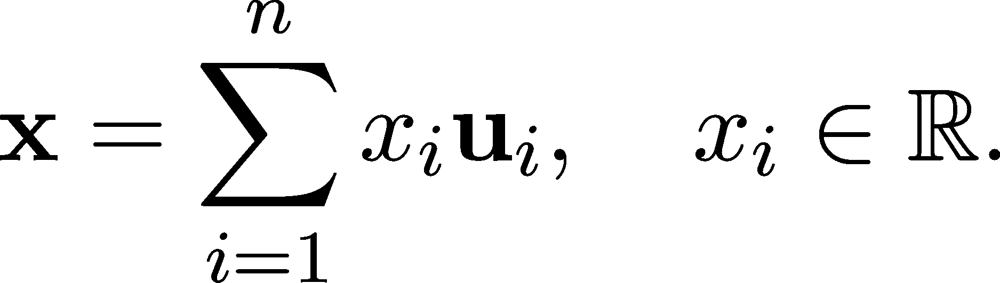
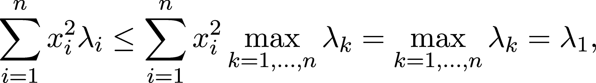
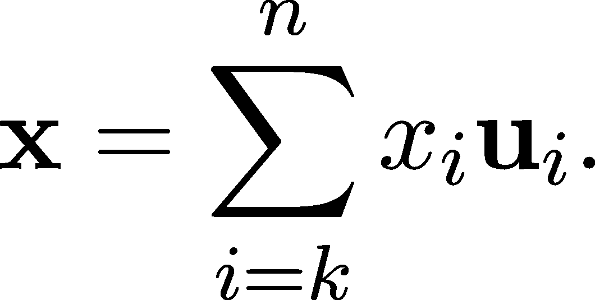
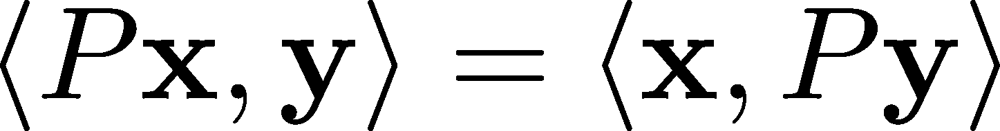
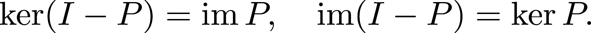
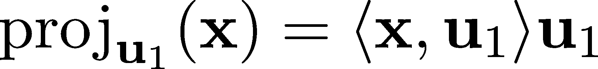
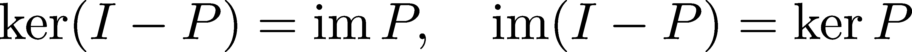

矩阵分解

本书中的一个反复出现的观点是，问题解决的关键在于找到你研究对象的最佳表示。 比如，向量空间的线性变换由矩阵表示。 研究一个就等同于研究另一个，但每种视角都有其独特的工具。 线性变换是几何的，而矩阵则是代数的，二者是同一枚硬币的两面。

这个思路也可以应用于更小的范围。 回想一下第六章中的 LU 分解。 你可以将其视为矩阵的另一种视角。

猜猜看：这不是唯一的。 本章将重点介绍三个最重要的分解方法：

+   光谱分解，

+   奇异值分解，

+   以及 QR 分解。

系好安全带。 这是我们迄今为止最具挑战性的冒险。

## 第九章：7.1 特殊变换

到目前为止，我们一直在努力发展线性代数的几何视角。 向量是通过其方向和大小来定义的数学对象。在向量空间中，距离和正交性的概念衍生出了几何结构。

线性变换是机器学习的构建模块，它们只是扭曲结构的映射：旋转、拉伸和扭曲几何形状。 然而，也有一些变换类型能够保持部分结构。 实际上，这些变换提供了宝贵的见解，此外，它们也更容易处理。 在本节中，我们将重点介绍最重要的变换类型，那些我们在机器学习中会遇到的变换。

### 7.1.1 伴随变换

在机器学习中，最重要的空间是欧几里得空间 ℝ^n。 这是数据表示和操作的地方。 在那里，整个几何结构由内积定义。


产生了大小、方向（以角度的形式）和正交性的概念。 因此，可以与内积相关的变换是特殊的。 例如，如果对所有 x ∈ℝ^n 和线性变换 f : ℝ^n →ℝ^n，满足 ⟨f(x), f(x)⟩ = ⟨x, x⟩，我们知道 f 保持范数不变。 也就是说，原始和变换后的特征空间中的距离具有相同的意义。

首先，我们将建立一个关于变换下向量映像与它们内积之间的普遍关系。 这将成为本章讨论的基础。

定理 39.（伴随变换）

设 f : ℝ^n →ℝ^n 是一个线性变换。 那么，存在一个线性变换 f^∗ : ℝ^n →ℝ^n，使得

⟨f(**x**), **y**⟩ = ⟨**x**, f^*(**y**)⟩

（7.1）

对所有 x,y ∈ℝ^n 都成立。 f^∗ 被称为 f 的伴随变换*。

此外，如果 A ∈ℝ^(n×n) 是 f 在标准正交基下的矩阵，那么 f^∗ 的矩阵就是 A^T。 即，

⟨A**x**, **y**⟩ = ⟨**x**, A^T**y**⟩。

（7.2）

证明。假设 A ∈ ℝ^(n×n) 是 f 在标准正交基中的矩阵。对于任何 x = (x[1],…,x[n]) 和 y = (y[1],…,y[n])，内积定义为


Ax 可以写成


使用这个形式，我们可以将 ⟨Ax,y⟩ 表示为 a[ij]、x[i] 和 y[i] 的形式。为此，我们有


这表明由 f^∗ : x→A^T x 给出的变换满足 (7.1) 和 (7.2)，这正是我们需要证明的。

为什么内积 ⟨Ax,y⟩ 对我们来说如此重要？因为内积定义了一个向量空间的几何结构。回想方程 (2.12)，它允许我们仅通过与正交基的内积来完全描述任何向量。此外，⟨x,x⟩ = ∥x∥² 定义了距离和大小的概念。正因为如此，(7.1) 和 (7.2) 对我们来说将是非常有用的。

正如我们即将看到的，保持内积的变换是非常特殊的，这些关系为我们提供了代数和几何上描述它们的方式。

### 7.1.2 正交变换

让我们直接进入定义。

定义 26\. （正交变换）

设 f : ℝ^n → ℝ^n 是一个任意的线性变换。如果 f 是正交的，那么


对所有的 x, y ∈ ℝ^n 都成立。

因此，正交变换 f 保持范数：∥f(x)∥² = ⟨f(x),f(x)⟩ = ⟨x,x⟩ = ∥x∥²。由于两个向量之间的夹角由它们的内积定义，见方程 (2.9)，性质 ⟨f(x),f(y)⟩ = ⟨x,y⟩ 意味着正交变换也保持角度。

我们也可以将定义转换为矩阵的语言。在实际应用中，我们总是会使用矩阵，因此这个表述是至关重要的。

定理 40\. （正交变换的矩阵）

设 f : ℝ^n → ℝ^n 是线性变换，A ∈ ℝ^(n×n) 是 f 在标准正交基中的矩阵。那么，f 是正交的，当且仅当，A^T = A^(−1)。

证明。像往常一样，我们需要在两个方向上都证明这个蕴含。

(a) 假设 f 是正交的。那么，(7.2) 给出了


因此，对于任何给定的 y，


对所有的 x 都成立。通过让 x = (A^T A −I)y，内积的正定性意味着 (A^T A −I)y = 0 对所有 y 成立。因此，A^T A = I，这意味着 A^T 是 A 的逆矩阵。

(b) 如果 A^T = A^(−1)，我们有


显示 f 是正交的。

A^T = A^(−1) 这一事实对 A 的列有着深远的影响。如果你回想一下第 4.1.2 节中矩阵乘法的定义，AB 中第 i 行第 j 列的元素就是 A 的第 i 行与 B 的第 j 列的内积。

更精确地说，若第 i 列记作 a[i] = (a[1,i],a[2,i],…,a[n,i])，则我们有


也就是说，


换句话说，A 的列构成了一个正交归一系统。这个事实应该不让人感到意外，因为正交变换保持了大小和正交性，而 A 的列是标准正交基底 e[1],…,e[n] 的像。

在机器学习中，对特征进行正交变换相当于从另一个角度看待它们，而不会产生失真。你可能已经知道，但这正是主成分分析（PCA）所做的事情。

## 7.2 自伴随变换与谱分解定理

除了正交变换，还有另一类重要的变换：其伴随矩阵就是它本身。稍微忍耐一下，我们很快就会看到一个例子。

定义 27\.（自伴随变换）

设 f : ℝ^n →ℝ^n 是一个线性变换。如果 f 是自伴随的，则有 f^∗ = f，也就是说，

⟨f(**x**), **y**⟩ = ⟨**x**, f(**y**)⟩

(7.3)

对所有 x,y ∈ℝ^n 都成立。

一如既往，我们将这转化为矩阵的语言。如果 A 是 f 在标准正交基底下的矩阵，我们知道 A^T 是其伴随矩阵。对于自伴随变换，意味着 A^T = A。像这样的矩阵称为对称矩阵，它们具有许多良好的性质。

对我们而言，最重要的一点是对称矩阵可以对角化！（也就是说，它们可以被转换成一个对角矩阵，并有检查参考）以下定理精确地说明了这一点。

定理 41\.（实对称矩阵的谱分解）

设 A ∈ ℝ^(n×n) 是一个实对称矩阵。那么，A 恰好有 n 个实特征值 λ[1] ≥⋅⋅⋅≥λ[n]，并且可以选择对应的特征向量 u[1],…,u[n]，使它们构成一个正交归一基底。

此外，如果我们令 Λ = diag(λ[1],…,λ[n]) 且 U 是一个正交矩阵，其列是 u[1],…,u[n]，则

A = UΛU^T

(7.4)

成立。

注意，特征值 λ[1] ≥⋅⋅⋅≥λ[n] 不一定彼此不同。

证明。（大致思路）由于证明过程相当复杂，我们最好先了解其中的主要思路，而不必深入所有的数学细节。

主要步骤如下。

1.  如果矩阵 A 是对称的，则它的所有特征值都是实数。

1.  利用这一点，可以证明可以从 A 的特征向量中形成一个正交归一基底。

1.  在这个正交基下将变换 x → Ax 的矩阵写成对角矩阵。因此，基变换得到了 (7.4)。

显示特征值为实数需要一些复数魔法（这超出了本章的范围）。困难的部分是第二步。一旦完成这一步，移动到第三步就很直接了，就像我们在讨论特征空间及其基向量时看到的那样（第 6.3 节）。

我们仍然没有一种实际的方法来对角化矩阵，但这个定理让我们更接近一步：至少我们知道对称矩阵的对角化是可能的。这是一个重要的步骤，因为我们可以将一般情况简化到对称情况。

矩阵对称的要求看起来是一个非常特殊的条件。然而，在实践中，我们可以通过几种不同的方式使矩阵对称化。对于任意矩阵 A ∈ℝ^(n×m)，乘积 AA^T 和 A^T A 将是对称的。对于方阵，平均值  也适用。因此，对称矩阵比你想象的更常见。

正交矩阵 U 和相应的正交基 {u[1],…,u[n]}，对称矩阵 A 的对角化具有一个非常重要的特性，在机器学习中进行数据样本的主成分分析时非常重要。

在看下一个定理之前，我们引入 argmax 符号。回想一下，表达式 max[x∈A]f(x) 表示函数在集合 A 上的最大值。通常，我们想知道这个最大值取到的位置，这由 argmax 定义：


现在，让我们看看 PCA 的基础！

定理 42。

设 A ∈ ℝ^(n×n) 是一个实对称矩阵，λ[1] ≥ ⋅⋅⋅ ≥ λ[n] 是它的实特征值按降序排列。此外，设 U ∈ ℝ^(n×n) 是对角化 A 的正交矩阵，对应的正交基为 {u[1],…,u[n]}。

然后，


和


证明。由于 {u[1],…,u[n]} 是正交基，任何 x 都可以表示为它们的线性组合：



因此，由于 u[i] 是 A 的特征向量，


将其代入 x^T Ax，我们有


由于 u[i] 形成正交基，


换句话说，当 i≠j 时，u[j]^T u[i] 为零。继续以上计算时，考虑到这一观察结果，


当  时，和  是特征值  的加权平均。因此，



从中可以得出 x^T Ax ≤ λ[1]。（回忆一下，我们可以在不失一般性的情况下假设特征值是递减的。）另一方面，通过代入 x = u[1]，我们可以看到 u[1]^T Au[1] = λ[1]，因此最大值确实达到了。从这两点，定理得以证明。

注释 6\。

换句话说，定理 42 表明，函数 x→x^T Ax 在 u[1]处取得最大值，并且该最大值为 u[1]^T Au[1] = λ[1]。x^T Ax 这个量看起来也相当神秘，因此让我们稍作澄清。如果我们从特征角度来看，向量 u[1],…,u[n]可以看作是“旧”特征 e[1],…,e[n]的组合。当我们有实际观察数据（即数据）时，可以使用上述过程对协方差矩阵进行对角化。所以，如果 A 表示这个协方差矩阵，u[1]^T Au[1]就是新特征 u[1]的方差。

因此，定理表明 u[1]是唯一能够最大化方差的特征。因此，在所有可能的新特征选择中，u[1]传达了关于数据的最多信息。

此时，我们没有所有工具来看到，但在主成分分析中，这表明第一个主向量是最大化方差的那个。

定理 42 只是以下一般定理的一个特例。

定理 43\。

设 A ∈ ℝ^(n×n)是一个实对称矩阵，λ[1] ≥ ⋅⋅⋅ ≥ λ[n]是其按降序排列的实特征值。此外，设 U ∈ ℝ^(n×n)是对角化 A 的正交矩阵，对应的正交规范基为{u[1],…,u[n]}。

然后，对于所有 k = 1,…,n，我们有


和


（有时，当条件过于复杂时，我们写 max{f(x) : x ∈A}来代替 max[x∈A]f(x)。）

证明。证明与之前的几乎相同。由于 x 需要与 u[1],…,u[k−1]正交，它可以表示为



根据前一条定理证明中的计算，我们得出


另一方面，与之前类似，u[k]^T Au[k] = λ[k]，因此定理得以证明。

## 7.3 奇异值分解

所以，我们可以通过正交变换对任何实对称矩阵进行对角化。这很好，但如果我们的矩阵不是对称的呢？毕竟，这是一个相当特殊的情况。

我们如何对一般矩阵做同样的操作呢？我们将使用一个非常强大的工具，直接来自数学家的工具箱：异想天开。我们假装有解决方案，然后反向推导。具体来说，设 A ∈ ℝ^(n×m)是任何实矩阵。（它可能不是方阵。）由于 A 不是对称的，我们必须放宽对将其因式分解为 UΛU^T 形式的要求。最直接的方法是假设左侧和右侧的正交矩阵不是彼此的转置。

因此，我们正在寻找正交矩阵 U ∈ℝ^(n×n) 和 V ∈ℝ^(m×m)，使得


对于某些对角矩阵 Σ ∈ℝ^(n×m)，成立。（非方阵矩阵 Σ = (σ[i,j])[i,j=1]^(n,m) 是对角矩阵，当 i≠j 时，σ[i,j] 为 0。）

你可能会好奇为何符号从 Λ 变为 Σ。这是因为 Σ 不一定包含特征值，而是包含奇异值。我们很快会解释。

下面是逆向工程部分。首先，正如我们之前讨论的，AA^T 和 A^T A 是对称矩阵。其次，我们可以利用 U 和 V 的正交性来简化它们，得到


类似地，我们有 A^T A = V Σ²V ^T。好消息是：我们实际上可以通过将谱分解定理（定理 41）应用于 AA^T 和 A^T A 来找到 U 和 V。因此，分解 A = UΣV ^T 是有效的！这种形式被称为奇异值分解（SVD），是线性代数的巅峰成就之一。

当然，我们还没有完成；我们只是知道该从哪里开始。让我们把这个数学上精确化！

定理 44\. （奇异值分解）

设 A ∈ℝ^(n×m) 为任意矩阵。那么，存在对角矩阵 Σ ∈ℝ^(n×m) 和正交矩阵 U ∈ℝ^(n×n) 和 V ∈ℝ^(m×m)，使得


什么是非方阵对角矩阵？让我给你两个例子，你立刻就能理解要点：


我们总是可以将矩形矩阵 M ∈ℝ^(n×m) 写成以下形式


如果 m/span>n，并且

![ [ ] n×n n×(m−n) M = M1 M2 , M1 ∈ ℝ , M2 ∈ ℝ ](img/file665.png)

否则，现在，让我们来看一下奇异值分解的证明！

证明。（概要。）为了说明证明的主要思想，我们假设 1）A 是方阵，2）A 是可逆的；即，0 不是 A 的特征值，

由于 A^T A ∈ ℝ^(m×m) 是实对称矩阵，我们可以应用谱分解定理，得到对角矩阵 Σ ∈ ℝ^(m×m) 和正交矩阵 V ∈ℝ^(m×m)，使得


成立。（回忆一下，对称矩阵的特征值是非负的，因此我们可以将 A^T A 的特征值写成 Σ² 的形式。）

由于 A 可逆，A^T A 也可逆；因此，0 不是 A^T A 的特征值。结果，ΣA^(−1) 是良好定义的。现在，通过定义 U := AV ΣA^(−1)，V 的正交性表明


因此，我们几乎完成了。剩下要证明的是 U 确实是正交的，即 U^T U = I。我们开始：


这样，我们得到了平方且可逆 A 的奇异值分解特例。

为了保持复杂度可控，我们不会详细推导剩下的部分；我将把它留给你作为练习。到现在为止，你已经掌握了所有工具。

让我们稍作停留，欣赏一下奇异值分解的威力。U 和 V 的列是正交矩阵，这是相当特殊的变换。因为它们保持了内积和范数不变，所以保持了底层向量空间的结构。对角矩阵 Σ 也是特殊的，它只是沿着基方向的拉伸。令人惊讶的是，任何线性变换都是这三种特殊变换的组合。

除了揭示线性变换的精细结构外，SVD 还提供了更多功能。例如，它推广了特征向量的概念，而特征向量仅定义于方阵。通过这个，我们有了


我们可以按列查看这个矩阵。这里，Σ 是对角矩阵，但其元素的数量取决于 n 或 m 中较小的那个。

所以，如果 u[i] 是 U 的第 i 列，v[i] 是 V 的第 i 列，那么身份式 AV = UΣ 就可以转化为


这与特征值-特征向量对的定义非常相似，不同的是这里我们有两个向量，而不是一个。u[i] 和 v[i] 被称为所谓的左奇异向量和右奇异向量，而标量 σ[i] =  被称为奇异值。

总结来说，正交变换给出了奇异值分解，但这就是全部吗？还有其他特殊的变换和矩阵分解吗？当然有。

引入正交投影。

## 7.4 正交投影

线性变换本质上是数据的操作，揭示了其他（希望是更有用的）表示。直观地，我们将它们看作一一映射，忠实地保留输入的所有“信息”。

这通常不是这样，以至于有时候数据的有损压缩是非常有益的。举个具体的例子，考虑一个包含一百万个特征的数据集，其中只有几百个是有用的。我们可以做的是识别出重要的特征并丢弃其余的，得到一个更紧凑的表示，便于操作。

这个概念通过正交投影的定义被形式化。我们在首次接触内积时就遇到了它们（见(2.7)）。

投影在格拉姆-施密特过程（定理 13）中也起着基础作用，用于将任意基向量正交化。由于我们已经对正交投影有一定的了解，因此需要给出正式的定义。

定义 28\. （投影与正交投影）

设 V 为一个任意的内积空间，P : V → V 是一个线性变换。如果 P² = P，那么 P 就是一个投影。

如果投影 P 是正交的，那么子空间 kerP 和 imP 是彼此正交的。（也就是说，对于 kerP 中的每个 x 和 imP 中的每个 y，我们有 ⟨x,y⟩ = 0。）

让我们重新审视迄今为止见过的例子，以便理解其定义！

例 1\. 最简单的是到单个向量的正交投影。也就是说，如果 u ∈ℝ^n 是任意向量，则变换


是 (由) u 的正交投影。（在讨论内积的几何解释时，我们谈到过这一点，见第 2.2.3 节。）反复应用这一变换，我们得到


因此，忠实于其名字， 确实是一个投影。为了看到它是正交的，让我们检查其核和图像！由于  的值是  的标量倍，其图像是


其核心，被 proj[u] 映射到 0 的向量集合，也很容易找到，因为 u = 0 只有当 ⟨x,u⟩ = 0 时才会发生，即 x ⊥u。

换句话说，


其中 span(u)^⊥ 表示 span(u) 的正交补（定义 13）。这意味着 proj[u] 确实是一个正交投影。

我们还可以用矩阵描述 。通过按分量写出 ，我们有


其中 u = (u[1],…,u[n])。这看起来像某种矩阵乘法！正如我们之前看到的，将矩阵和向量相乘可以用行向量点积来描述。（见 (3.3)。）

因此，根据这种矩阵乘法的解释，我们有

.png)(7.5)

注意，与 ∥u∥² 的比例可以通过将其写成 “矩阵” 乘积中的一部分来整合。


矩阵 uu^T ∈ℝ^(n×n)，由向量 u ∈ℝ^(n(×1)) 和其转置 u^T ∈ℝ^(1×n) 的乘积得到，是一个非常特殊的矩阵。它们被称为秩-1 投影矩阵，并且在数学中经常出现。

（一般来说，矩阵 uv^T 被称为向量 u 和 v 的外积。我们不会广泛使用它，但它在线性代数中经常出现。）

示例 2\。如我们在引入格拉姆-施密特正交化过程时所看到的（定理 13），前面的例子可以通过对多个向量进行投影来推广。如果 \( u[1], \dots, u[k] \in \mathbb{R}^n \) 是一组线性无关且两两正交的向量，则线性变换


是对子空间 \( \text{span}(u[1], \dots, u[k]) \) 的正交投影。这很容易看出来，我建议读者将此作为练习来完成。（这也可以在问题部分找到。）

从 (7.5)，我们还可以确定 \( \text{proj}[u[1], \dots, u[k]] \) 的矩阵形式：


这是一个重要的知识点，因为投影矩阵通常在某些算法的实现中需要用到。

### 7.4.1 正交投影的性质

现在我们已经看到了一些例子，是时候以更一般的方式讨论正交投影了。正交投影有很多有用的理由，我们将在本节中探讨它们。首先，让我们从最重要的一点开始：正交投影也使得向量能够分解为给定子空间加上一个正交向量。

定理 45\。

设 \( V \) 为一个内积空间，\( P : V \rightarrow V \) 为一个投影算子。那么，\( V = \ker P + \text{im} P \); 也就是说，任意向量 \( x \in V \) 都可以表示为


如果 \( P \) 是一个正交投影，则 \( x[\text{im}] \perp x[\ker] \)。

证明：每个 \( x \) 可以表示为


由于 \( P \) 是幂等的，即 \( P² = P \)，我们有


也就是说，\( x - P x \in \ker P \)。根据定义，\( P x \in \text{im} P \)，因此 \( V = \ker V + \text{im} V \)，这证明了我们的主要命题。

如果 \( P \) 是一个正交投影，那么根据定义，\( x[\text{im}] \perp x[\ker] \)，这正是我们需要证明的。

此外，正交投影是自伴的。听起来似乎不算什么大事，但自伴性导致了一些非常愉快的性质。

定理 46\。

设 \( V \) 为一个内积空间，\( P : V \rightarrow V \) 为一个正交投影。则，\( P \) 是自伴的。

证明：根据定义（27），我们只需要证明



对于任意 \( x, y \in V \)，成立。在之前的结果中，我们已经看到 \( x \) 和 \( y \) 可以表示为

**x** = **x**[\(\ker P\)] + **x**[\(\text{im} P\)], **x**[\(\ker P\)] ∈ \(\ker P\), **x**[\(\text{im} P\)] ∈ \(\text{im} P\) **y** = **y**[\(\ker P\)] + **y**[\(\text{im} P\)], **y**[\(\ker P\)] ∈ \(\ker P\), **y**[\(\text{im} P\)] ∈ \(\text{im} P\)

由于 \( P² = P \)，我们有


类似地，可以证明 \( \langle x, P y \rangle = \langle x[\text{im} P], y[\text{im} P] \rangle \)。这两个恒等式意味着 \( \langle P x, y \rangle = \langle x, P y \rangle \)，这正是我们需要证明的。

自伴算子的一个直接推论是，正交投影的核是其像的正交补。

定理 47\. 设 \( V \) 是一个内积空间，\( P : V \to V \) 是一个正交投影。那么，


证明。为了证明这两个集合的相等，我们需要证明 (a) \( \text{ker} P \subseteq (\text{im} P)^\perp \)，以及 (b) \( (\text{im} P)^\perp \subseteq \text{ker} P \)。

(a) 设 \( x \in \text{ker} P \)，即假设 \( Px = 0 \)。我们需要证明，对于任何 \( y \in \text{im} P \)，有 \( \langle x, y \rangle = 0 \)。为此，设 \( y[0] \in V \)，使得 \( P y[0] = y \)。（这是可以保证存在的，因为我们从 \( P \) 的像中取了 \( y \)。）那么，


其中 \( P \) 是自伴的。因此，\( x \in (\text{im} P)^\perp \) 也成立，意味着 \( \text{ker} P \subseteq (\text{im} P)^\perp \)。

(b) 现在，设 \( x \in (\text{im} P)^\perp \)。那么，对于任何 \( y \in V \)，我们有 \( \langle x, Py \rangle = 0 \)。然而，


特别地，当选择 \( y = Px \) 时，我们有 \( \langle Px, Px \rangle = 0 \)。由于内积的正定性，这意味着 \( Px = 0 \)，即 \( x \in \text{ker} P \)。

总结以上内容，如果 \( P \) 是内积空间 \( V \) 的正交投影，那么


你还记得当我们首次遇到正交补的概念时（定义 13），我们证明了对于任何有限维内积空间 \( V \) 及其子空间 \( S \)，有 \( V = S + S^\perp \) 吗？我们是通过使用一个特殊的正交投影来实现的。我们离看到一般模式已经不远了。

因为正交投影 \( P \) 的核是其像的正交补，所以变换 \( I - P \) 也是一个正交投影，且像与核的角色发生了反转。

定理 48\。

设 \( V \) 是一个内积空间，\( P : V \to V \) 是一个正交投影。那么，\( I - P \) 也是一个正交投影，并且



证明非常简单，因此留给读者作为练习。

还有一点需要提到。如果两个正交投影的像空间相同，那么这些投影本身是相等的。这是一个非常强的唯一性性质，因为如果你仔细想一想，对于其他类线性变换，这种情况并不成立。

定理 49\. （正交投影的唯一性）

设 \( V \) 是一个内积空间，\( P, Q : V \to V \) 是两个正交投影。如果 \( \text{im} P = \text{im} Q \)，那么 \( P = Q \)。

证明。由于 \( \text{ker} P = (\text{im} P)^\perp \)，像空间的相等也意味着 \( \text{ker} P = \text{ker} Q \)。

由于 \( V = \text{ker} P + \text{im} P \)，每个 \( x \in V \) 都可以分解为


这个分解和核与像空间的相等给出了


通过类似的推理，我们有 \( Qx = x[\text{im} P] \)，因此对于所有 \( x \in V \)，有 \( Px = Qx \)。这证明了 \( P = Q \)。

换句话说，给定一个子空间，只有一个正交投影可以映射到它。那么，这样的投影存在吗？当然存在，在下一节中，我们将看到它可以用几何术语来描述。

### 7.4.2 正交投影是最佳投影

正交投影具有极其愉悦且在数学上非常有用的性质。从某种意义上讲，如果 P : V →V 是一个正交投影，则 Px 在所有 imP 中的向量中提供了 x 的最佳近似。为了精确表达这一点，我们可以陈述如下。

定理 50．（正交变换的构造）

设 V 是一个有限维内积空间，S ⊆V 是它的子空间。那么，定义变换 P : V →V，如下所示


是 S 的正交投影。

换句话说，由于正交投影到给定子空间是唯一的（如定理 49 所示），因此 Px 是子空间 S 中最接近 x 的向量。因此，我们可以将其表示为 P[S]，以强调其唯一性。

除了有明确的方法来描述正交投影之外，还有一个额外的好处。回想之前，我们展示了


恒成立。由于对于任何子空间 S，都存在一个正交投影 P[S]，其像集为 S，因此也可以得出 V = S + S^⊥。虽然我们在讨论正交补时已经看到过这一点（定义 13），但通过不需要构造 S 中的正交标准基的证明来看到这一点仍然很有趣。

有趣的是，这正是数学分析和线性代数交汇的地方。虽然我们目前还没有相关工具，但通过使用收敛的概念，以上定理可以推广到无限维空间。尽管在实际的机器学习中无限维空间并不特别相关，但它为函数研究提供了一个美丽的数学框架。谁知道呢，也许有一天这些先进工具会为机器学习带来重大突破。

## 7.5 计算特征值

在上一章中，我们达到了奇异值分解，这是线性代数的一个巅峰结果。我们为此打下了理论基础。

然而，有一件事还没解决：在实践中计算奇异值分解。没有这个工具，我们无法充分发挥这一强大工具的所有优势。在这一节中，我们将开发两种方法来实现这一目的。一种方法为特征向量的行为提供了深刻的洞察，但在实践中并不适用。另一种方法则提供了出色的性能，但难以理解公式背后的具体含义。我们先从第一种方法开始，阐明特征向量是如何决定线性变换的效果的！

### 7.5.1 用幂迭代法计算实对称矩阵的特征向量

如果你记得，我们通过追溯问题到对称矩阵的谱分解，发现了奇异值分解。反过来，我们可以通过从矩阵的特征向量中找到正交归一基来获得谱分解。计划如下：首先，我们定义一个过程，用来找到对称矩阵的正交归一特征向量集。然后，利用这个过程计算任意矩阵的奇异值分解。

一种简单的方法是通过解多项式方程 det(A−λI) = 0 来找到特征值，然后通过解线性方程 (A −λI)x = 0 来计算相应的特征向量。

然而，这种方法存在问题。对于一个 n × n 矩阵，特征多项式 p(λ) = det(A−λI) 是一个 n 次多项式。即使我们能够有效地评估 det(A −λI) 对任意 λ 的值，也存在严重的问题。不幸的是，与二次方程 ax² + bx + c = 0 不同，当 n > 4 时，并没有找到解的公式。(并不是数学家们不够聪明，而是根本没有这样的公式。)

我们如何找到一种替代方法呢？我们再次使用之前非常有效的空想法。让我们假设我们知道特征值，玩弄它们，看看这是否能给我们一些有用的启示。

为了简化问题，假设 A 是一个小的对称 2 × 2 矩阵，特征值为 λ[1] = 4 和 λ[2] = 2。由于 A 是对称的，我们甚至可以找到一组对应的特征向量 u[1]、u[2]，使得 u[1] 和 u[2] 形成一个正交归一基。 (也就是说，它们的范数为 1，且相互正交。) 这一点由谱分解定理（定理 41）保证。

因此，任何 x ∈ℝ² 都可以写成 x = x[1]u[1] + x[2]u[2]，其中 x[1]、x[2] 是某些非零标量。如果我们将变换 A 应用到向量 x 上，会发生什么呢？因为 u[i] 是特征向量，所以我们有


再次应用 A，我们得到


一种模式开始显现。一般来说，A 的第 k 次迭代结果为


通过对 A^kx 进行深入观察，我们可以注意到 u[1] 的贡献比 u[2] 更加显著。为什么？因为系数 x[1]λ[1]^k = 4^kx[1] 比 x[2]λ[2]^k = 2^kx[2] 增长得更快，无论 x[1] 和 x[2] 的值如何。从技术上讲，我们可以说 λ[1] 支配了 λ[2]。

现在，通过将数值缩放为 λ[1]^k，我们可以提取特征向量 u[1]! 也就是说，


如果我们让 k 无限增大，u[2] 对  的贡献将消失。如果你熟悉极限的概念，你可以写出

lim[k → ∞]  = *x*[1]**u**[1]。

(7.6)

注释 7.（极限基础）

如果你不熟悉极限，这里有一个简短的解释。恒等式


这意味着随着 k 的增加，量  会越来越接近 x[1]u[1]，直到它们之间的差异变得微不足道。实际上，这意味着我们可以通过选择一个非常大的 k 来近似 x[1]u[1]，即 。

方程式(7.6)对我们来说是个好消息！我们所要做的就是反复应用变换 A，以识别主特征值λ[1]的特征向量。然而，有一个小警告：我们必须知道λ[1]的值。我们稍后会处理这个问题，但首先，让我们以定理的形式记录这一里程碑。

定理 51。

使用幂迭代法求主特征值的特征向量。

设 A ∈ℝ^(n×n)是一个实对称矩阵。假设：

(a) A 的特征值为λ[1]…λ[n]（即λ[1]是主特征值）。

(b) 对应的特征向量 u[1],…,u[n]构成一个正交归一基。

设 x ∈ℝ^n 是一个向量，使得当写作线性组合 x = ∑ [i=1]^nx[i]u[i]时，系数 x[1] ∈ℝ是非零的。那么，

lim[k → ∞]  = *x*[1]**u**[1]。

(7.7)

在我们进入证明之前，需要做一些解释。回想一下，如果 A 是对称的，谱分解定理（定理 41）保证它可以通过相似变换对角化。在它的证明（概要）中，我们提到过对称矩阵具有：

+   实特征值

+   由特征向量构成的正交归一基

因此，假设(a)和(b)是有保证的，除了一个警告：特征值不一定是不同的。然而，这在实践中很少引发问题。原因有很多，但最重要的是，具有重复特征值的矩阵非常罕见，以至于它们形成了零概率集。（稍后我们将学习概率论。现在，我们可以假设随机选择一个具有重复特征值的矩阵是不可能的。）因此，碰到这种情况的可能性极小。

证明。由于 u[k]是特征值λ[k]的特征向量，我们有

*A*^k**x** = ∑[i=1]^n *x*[i]*λ*[i]^k**u**[i]。（7.8）

因此，


由于λ[1]是主特征值，对于 i = 2,…,n，∥λ[i]∕λ[1]∥/span>1，因此(λ[i]∕λ[1])^k → 0 当 k →∞时。因此，


这就是我们需要证明的。

现在，让我们修复一下需要知道的小问题。由于是最大特征值，前述定理表明等于加上一些更小的项，至少相较于这个主项更小。我们可以通过取上确界范数来提取这个量。（回想一下，对于任何，上确界范数定义为。请记住，-s 是在我们向量空间原始基下的系数，这不一定是我们特征向量基。）

通过将 jλ[1]j^k 从 A^kx 中提取出来，我们有


直观地说，余项∑ [i=2]^nxi)^ku[i]很小，因此我们可以将范数近似为


换句话说，我们可以用来代替进行缩放。

因此，我们已经准备好完整描述我们的一般特征向量求解过程。首先，我们随机初始化一个向量 x[0]，然后定义递归序列


利用 A 的线性性质，我们可以看到，实际上，


但是缩放有一个额外的好处，因为我们在任何计算步骤中都不需要使用大数字。这样，(51)表明


换句话说，我们可以在不实际知道特征值的情况下，提取出对应于主特征值的特征向量。

### 7.5.2 幂迭代法的实践

让我们将幂迭代法付诸实践！我们 power_iteration 函数的输入是一个方阵 A，我们期望输出的是对应于主特征值的特征向量。

由于这是一个迭代过程，我们应该定义一个条件来确定何时终止该过程。如果序列{x[k]}[k=1]^∞的连续项足够接近，我们就可以得到一个解。也就是说，如果，例如，


我们可以停止并返回当前值。然而，这可能永远不会发生。对于这种情况，我们定义一个截止点，比如 k = 100,000，当计算达到此点时即使没有收敛，也终止计算。

为了给我们更多控制权，我们还可以手动定义初始化向量 x_init。

```py
import numpy as np 
def power_iteration( 
    A: np.ndarray, 
    n_max_steps: int = 100000, 
    convergence_threshold: float = 1e-10, 
    x_init: np.ndarray = None, 
    normalize: bool = False 
): 
    #x0022;"/span> 
    Performs the power iteration method to find an approximation of the dominant eigenvector 
    of a square matrix. 

    Parameters 
    ---------- 
    A : np.ndarray 
        A square matrix whose dominant eigenvector is to be computed. 
    n_max_steps : int, optional 
        The maximum number of iterations to perform. Default is 100000\. 
    convergence_threshold : float, optional 
        The convergence threshold for the difference between successive approximations. 
        Default is 1e-10\. 
    x_init : np.ndarray, optional 
        The initial guess for the eigenvector. If None, a random vector is used. 
        Default is None. 
    normalize : bool, optional 
        If True, the resulting vector is normalized to unit length. Default is False. 

    Returns 
    ------- 
    np.ndarray 
        The approximate dominant eigenvector of the matrix ‘A‘. 

    Raises 
    ------ 
    ValueError 
        If the input matrix ‘A‘ is not square. 
    #x0022;"/span> 

    n, m = A.shape 

    # checking the validity of the input 
    if n != m: 
        raise ValueError("/span>the matrix A must be square 

    # reshaping or defining the initial vector 
    if x_init is not None: 
        x = x_init.reshape(-1, 1) 
    else: 
        x = np.random.normal(size=(n, 1)) 

    # performing the iteration 
    for step in range(n_max_steps): 
        x_transformed = A @ x    # applying the transform 
        x_new = x_transformed / np.linalg.norm(x_transformed, ord=np.inf)    # scaling the result 

        # quantifying the difference between the new and old vector 
        diff = np.linalg.norm(x - x_new) 
        x = x_new 

        # stopping the iteration in case of convergence 
        if diff /span> convergence_threshold: 
            break 

    # normalizing the result if required 
    if normalize: 
        return x / np.linalg.norm(x) 

    return x
```

为了测试这个方法，我们应该使用一个容易手工计算出正确输出的输入。我们常用的示例


应该是完美的，因为我们已经知道很多关于它的信息。

我们之前在 6.2.2 节中看到，它的特征值为λ[1] = 3 和λ[2] = 1，且对应的特征向量为 u[1] = (1,1)和 u[2] = (−1,1)。

让我们看看我们的函数是否正确地恢复了(u[1] = (1,1))的标量倍数！

```py
A = np.array([[2, 1], [1, 2]]) 
u_1 = power_iteration(A, normalize=True) 
u_1
```

```py
array([[0.70710678], 
      [0.70710678]])
```

成功！为了恢复特征值，我们只需应用线性变换并计算比例。

```py
A @ u_1 / u_1
```

```py
array([[3.], 
      [3.]])
```

结果是 3，正如预期的那样。

### 7.5.3 剩余特征向量的幂迭代

我们能否修改幂迭代算法来恢复其他特征值？理论上可以。实际操作中不行。让我详细解释！

为了掌握如何推广这个想法，让我们再次查看方程(7.8)，表示


 收敛的条件之一是 x 应该包含特征向量 u[1]的非零分量，也就是说，x[1]≠0。

如果 x[1] = 0 怎么办？在这种情况下，我们得到


其中 x[2]λ[2]^ku[2]成为主导项。

因此，我们有


这意味着


让我们在以下定理中将其数学化。

定理 52。（广义幂迭代）

令 A ∈ℝ^(n×n)为一个实对称矩阵。假设：

(a) A 的特征值为λ[1]/span>…/span>λ[n]（即，λ[1]是主特征值）。

(b) 相应的特征向量 u[1]、…,u[n]构成一个正交规范基。

令  为一个向量，使得当它被表示为基向量  的线性组合时，它的第一个非零分量沿着  方向，其中 （即， ）。

然后，


成立。

证明过程与我们之前看到的几次非常相似。问题是，如何从任何向量中消除 u[1]、…,u[l−1]分量？答案很简单：正交投影（7.4 节）。

为了简化问题，让我们看看如何用幂迭代提取第二主特征向量。回想一下变换



描述了任何 x 到 u1 的正交投影。

具体来说，如果 x = ∑ [i=1]^nx[i]u[i]，那么


这正是我们所寻找的相反方向！然而，在此时，我们可以看到 I − proj[u[1]]将适合我们的需求。这仍然是正交投影。此外，我们有


即，I − proj[u[1]] 消除了 x 中的 u[1] 分量。因此，如果我们用 x^∗ = (I − proj[u[1]])(x) 初始化幂迭代，序列  将收敛到 u[2]，第二个主特征向量。

我们如何实际计算 ？回忆一下，在标准正交基下，![proju1] 的矩阵可以写成：


（请记住，![ui] 向量构成一个正交归一基，因此 。）因此，![I − proju1] 的矩阵是：


我们可以很容易地计算出这个结果。

对于一个一般的向量 u，我们可以这样在 NumPy 中实现。

```py
def get_orthogonal_complement_projection(u: np.ndarray): 
    #x0022;"/span> 
    Compute the projection matrix onto the orthogonal complement of the vector u. 

    This function returns a projection matrix P such that for any vector v, 
    P @ v is the projection of v onto the subspace orthogonal to u. 

    Parameters 
    ---------- 
    u : np.ndarray 
        A 1D or 2D array representing the vector u. It will be reshaped to a column vector. 

    Returns 
    ------- 
    np.ndarray 
        The projection matrix onto the orthogonal complement of u. This matrix 
        has shape (n, n), where n is the length of u. 
    #x0022;"/span> 

    u = u.reshape(-1, 1) 
    n, _ = u.shape 
    return np.eye(n) - u @ u.T / np.linalg.norm(u, ord=2)**2
```

所以，找出所有特征向量的过程如下。

1.  初始化一个随机的 ，并使用幂迭代找到 。

1.  将  投影到由  所张成的子空间的正交补空间，从而得到

    

    我们将其作为第二轮幂迭代的初始向量，从而得到第二个主特征向量 。

1.  将  投影到由  和  所张成的子空间的正交补空间，从而得到

    

    我们将其作为第三轮幂迭代的初始向量，从而得到第三个主特征向量 。

1.  将  投影到……

你已经明白了这个模式。为了在实践中实现这一点，我们添加了 find_eigenvectors 函数。

```py
def find_eigenvectors(A: np.ndarray, x_init: np.ndarray): 
    #x0022;"/span> 
    Find the eigenvectors of the matrix A using the power iteration method. 

    This function computes the eigenvectors of the matrix A by iteratively 
    applying the power iteration method and projecting out previously found 
    eigenvectors to find orthogonal eigenvectors. 

    Parameters 
    ---------- 
    A : np.ndarray 
        A square matrix of shape (n, n) for which eigenvectors are to be computed. 

    x_init : np.ndarray 
        A 1D array representing the initial vector used for the power iteration. 

    Returns 
    ------- 
    List[np.ndarray] 
        A list of eigenvectors, each represented as a 1D numpy array of length n. 
    #x0022;"/span> 

    n, _ = A.shape 
    eigenvectors = [] 

    for _ in range(n): 
        ev = power_iteration(A, x_init=x_init) 
        proj = get_orthogonal_complement_projection(ev) 
        x_init = proj @ x_init 
        x_init = x_init / np.linalg.norm(x_init, ord=np.inf) 
        eigenvectors.append(ev) 

    return eigenvectors
```

让我们在我们的老朋友上测试一下 find_eigenvectors


```py
A = np.array([[2.0, 1.0], [1.0, 2.0]]) 
x_init = np.random.rand(2, 1) 
find_eigenvectors(A, x_init)
```

```py
[array([[1.], 
       [1.]]), 
 array([[ 1.], 
       [-1.]])]
```

结果如我们所料。（不要惊讶于特征向量未被归一化，因为我们在 find_eigenvectors 函数中并没有显式执行这一操作。）

我们已经准备好真正对称矩阵进行对角化。回忆一下，通过将特征向量一个个垂直堆叠，可以获得对角化的正交矩阵 U。

```py
def diagonalize_symmetric_matrix(A: np.ndarray, x_init: np.ndarray): 
    #x0022;"/span> 
    Diagonalize a symmetric matrix A using its eigenvectors. 

    Parameters 
    ---------- 
    A : np.ndarray 
        A symmetric matrix of shape (n, n) to be diagonalized. The matrix should 
        be square and symmetric. 

    x_init : np.ndarray 
        A 1D array representing the initial guess for the power iteration. 

    Returns 
    ------- 
    Tuple[np.ndarray, np.ndarray] containing: 
        - U : np.ndarray 
            A matrix of shape (n, n) whose columns are the normalized eigenvectors 
            of A. 
        - np.ndarray 
            A diagonal matrix (n, n) of the eigenvalues of A, computed as U @ A @ U.T. 
    #x0022;"/span> 

    eigenvectors = find_eigenvectors(A, x_init) 
    U = np.hstack(eigenvectors) / np.linalg.norm(np.hstack(eigenvectors), axis=0, ord=2) 
    return U, U @ A @ U.T 

diagonalize_symmetric_matrix(A, x_init)
```

```py
(array([[ 0.70710678,  0.70710678], 
       [ 0.70710678, -0.70710678]]), 
 array([[ 3.00000000e+00, -3.57590301e-11], 
       [-3.57589164e-11,  1.00000000e+00]]))
```

太棒了！

什么问题？不幸的是，幂迭代在数值上不稳定。对于 n × n 的矩阵，其中 n 可能达到数百万，这个问题非常严重。

那么，为什么我们要讲这么多关于幂迭代的内容呢？除了它是最简单的，它还提供了对线性变换如何工作的深刻洞察。

这个恒等式


其中 λ[i] 和 u[i] 是对称矩阵 A 的特征值-特征向量对，反映了特征向量和特征值如何决定变换的行为。

如果幂迭代在实践中不可用，我们该如何计算特征值呢？我们将在下一节中看到这一点。

## 7.6 QR 算法

在实践中用于计算特征值的算法是所谓的 QR 算法，由 John G. R. Francis 和苏联数学家 Vera Kublanovskaya 独立提出。这就是我们在学习线性代数时所有知识的汇聚点。描述 QR 算法非常简单，因为它是矩阵分解和乘法步骤的迭代。

然而，理解它为什么有效是另一个问题。在幕后，QR 算法结合了我们之前学习的许多工具。首先，让我们回顾一下经典的格拉姆-施密特正交化过程。

### 7.6.1 QR 分解

如果你记得，我们在引入正交基的概念时遇到了格拉姆-施密特正交化过程（定理 13）。

本质上，这个算法将一个任意基 v[1],…,v[n] 转换为一个正交标准基 e[1],…,e[n]，使得对于所有 1 ≤k ≤n，e[1],…,e[k] 与 v[1],…,v[k] 张成相同的子空间。自从我们上次遇到这个问题以来，我们已经对线性代数有了更多的了解，所以我们已经准备好看到更大的图景。

通过定义的正交投影


我们可以递归地描述格拉姆-施密特过程为


其中 e[k] 向量在之后是标准化的。

扩展并明确写出 e[k] 后，我们得到


一种模式开始显现出来。通过将 e[1],…,e[n] 项排列在一边，我们得到


这开始像某种矩阵乘法了！回想一下，矩阵乘法可以看作是对列向量的线性组合。（如果不确定这一点，可以查阅 (4.2)。）

通过将列向量 v[k] 水平拼接成矩阵 A，并类似地通过 e[k] 向量定义向量 Q，我们得到


对于某些上三角矩阵 R，它由根据格拉姆-施密特正交化方法确定的 e[k] 在 v[k] 中的系数定义。更精确地说，定义


和


结果 A = Q^∗R^∗ 几乎就是我们所说的 QR 分解。Q^∗ 的列是正交的（但不是标准正交的），而 R^∗ 是上三角矩阵。我们可以通过按列提取范数轻松将 Q^∗ 正交标准化，从而得到


很容易看出，A = QR 仍然成立。这个结果被称为 QR 分解，我们刚刚证明了以下定理。

定理 53. (QR 分解)

设 A ∈ ℝ^(n×n)为可逆矩阵。那么，存在一个正交矩阵 Q ∈ ℝ^(n×n)和一个上三角矩阵 R ∈ ℝ^(n×n)，使得


公式成立。

正如我们将要看到的，QR 分解是一个极其有用且多功能的工具（就像所有其他矩阵分解一样）。在我们继续讨论它如何用于实际计算特征值之前，让我们先将迄今为止的内容转化为代码！

QR 分解算法本质上是 Gram-Schmidt 正交化，我们显式地记住一些系数并由此形成一个矩阵。（如果你觉得有些困惑，回顾一下我们在第 3.1.2 节的实现。）

```py
def projection_coeff(x: np.ndarray, to: np.ndarray): 
    #x0022;"/span> 
    Compute the scalar coefficient for the projection of vector x onto vector to. 

    Parameters 
    ---------- 
    x : np.ndarray 
        A 1D array representing the vector onto which the projection is computed. 

    to : np.ndarray 
        A 1D array representing the vector onto which x is being projected. 

    Returns 
    ------- 
    float 
        The scalar coefficient representing the projection of x onto to. 
    #x0022;"/span> 
    return np.dot(x, to)/np.dot(to, to)
```

```py
from typing import List

def projection(x: np.ndarray, to: List[np.ndarray], return_coeffs: bool = True):
    """
    Computes the orthogonal projection of a vector `x` onto the subspace 
    spanned by a set of vectors `to`.

    Parameters
    ----------
    x : np.ndarray
        A 1D array representing the vector to be projected onto the subspace.

    to : List[np.ndarray]
        A list of 1D arrays, each representing a vector spanning the subspace
        onto which `x` is projected.

    return_coeffs : bool, optional, default=True
        If True, the function returns the list of projection coefficients.
        If False, only the projected vector is returned.

    Returns
    -------
    Tuple[np.ndarray, List[float]] or np.ndarray
        - If `return_coeffs` is True, returns a tuple where the first element
        is the projected vector and
          the second element is a list of the projection coefficients
          for each vector in `to`.
        - If `return_coeffs` is False, returns only the projected vector.
    """

    p_x = np.zeros_like(x)
    coeffs = []

    for e in to:
        coeff = projection_coeff(x, e)
        coeffs.append(coeff)
        p_x += coeff*e

    if return_coeffs:
        return p_x, coeffs
    else:
        return p_x
```

现在，我们可以将这些工具结合起来，得到一个任意方阵的 QR 分解。（令人惊讶的是，这对于非方阵也适用，但我们不在此讨论。）

```py
def QR(A: np.ndarray): 
    #x0022;"/span> 
    Computes the QR decomposition of matrix A using the Gram-Schmidt 
    orthogonalization process. 

    Parameters 
    ---------- 
    A : np.ndarray 
        A 2D array of shape (n, m) representing the matrix to be decomposed. 
        The matrix A should have full column rank for a valid QR decomposition. 

    Returns 
    ------- 
    Tuple[np.ndarray, np.ndarray] 
        - Q : np.ndarray 
            An orthogonal matrix of shape (n, m), whose columns are orthonormal. 
        - R : np.ndarray 
            An upper triangular matrix of shape (m, m), representing the coefficients of the 
            linear combinations of the columns of A. 
    #x0022;"/span> 
    n, m = A.shape 

    A_columns = [A[:, i] for i in range(A.shape[1])] 
    Q_columns, R_columns = [], [] 

    Q_columns.append(A_columns[0]) 
    R_columns.append([1] + (m-1)*[0]) 

    for i, a in enumerate(A_columns[1:]): 
        p, coeffs = projection(a, Q_columns, return_coeffs=True) 
        next_q = a - p 
        next_r = coeffs + [1] + max(0, m - i - 2)*[0] 

        Q_columns.append(next_q) 
        R_columns.append(next_r) 

    # assembling Q and R from its columns 
    Q, R = np.array(Q_columns).T, np.array(R_columns).T 

    # normalizing Q’s columns 
    Q_norms = np.linalg.norm(Q, axis=0) 
    Q = Q/Q_norms 
    R = np.diag(Q_norms) @ R 
    return Q, R
```

让我们对一个随机的 3×3 矩阵进行尝试。

```py
A = np.random.rand(3, 3) 
Q, R = QR(A)
```

需要检查三件事：（a）A = QR，（b）Q 是正交矩阵，以及（c）R 是上三角矩阵。

```py
np.allclose(A, Q @ R)
```

```py
True
```

```py
np.allclose(Q.T @ Q, np.eye(3))
```

```py
True
```

```py
np.allclose(R, np.triu(R))
```

```py
True
```

成功！只剩下一个问题了。这个如何帮助我们计算特征值呢？我们现在来看看。

### 7.6.2 迭代 QR 分解

令人惊讶的是，我们可以通过一个简单的迭代过程发现矩阵 A 的特征值。首先，我们找到 QR 分解。


并通过以下方式定义矩阵 A[1]


也就是说，我们只是反转 Q 和 R 的顺序。然后，我们从头开始，找到 A[1]的 QR 分解，依此类推，定义这个序列

(7.9)

从长远来看，A[k]的对角元素将越来越接近 A 的特征值。这就是所谓的 QR 算法，简单到我第一次看到时都不敢相信。

有了所有这些工具，我们可以在几行代码中实现 QR 算法。

```py
def QR_algorithm(A: np.ndarray, n_iter: int = 1000): 
    #x0022;"/span> 
    Computes the QR algorithm to find the eigenvalues of a matrix A. 

    Parameters 
    ---------- 
    A : np.ndarray 
        A square matrix of shape (n, n) for which the eigenvalues are to be computed. 

    n_iter : int, optional, default=1000 
        The number of iterations to run the QR algorithm. 
        More iterations may lead to more accurate results, 
        but the algorithm typically converges quickly. 

    Returns 
    ------- 
    np.ndarray 
        A matrix that has converged, where the diagonal elements are the eigenvalues of the 
        original matrix A. 
        The off-diagonal elements should be close to zero. 
    #x0022;"/span> 

    for _ in range(n_iter): 
        Q, R = QR(A) 
        A = R @ Q 

    return A
```

让我们立即测试一下。

```py
A = np.array([[2.0, 1.0], [1.0, 2.0]]) 
QR_algorithm(A)
```

```py
array([[3.00000000e+00, 2.39107046e-16], 
      [0.00000000e+00, 1.00000000e+00]])
```

我们几乎达到了最前沿的技术。不幸的是，传统的 QR 算法有一些问题，因为它可能无法收敛。一个简单的例子是由矩阵给出的


```py
A = np.array([[0.0, 1.0], [1.0, 0.0]]) 
QR_algorithm(A)
```

```py
array([[0., 1.], 
      [1., 0.]])
```

在实际操作中，我们可以通过引入位移来解决这个问题：

.png)(7.10)

其中α[k]是某个标量。定义这些位移的方法有很多种（例如 Rayleigh 商位移、Wilkinson 位移等），但这些细节超出了我们的研究范围。

## 7.7 总结

我告诉过你，攀登高峰并不容易：到目前为止，这是我们遇到的最难的一章。然而，我们所学的工具已经达到了线性代数的顶峰。我们首先研究了两种特殊的变换：自伴随变换和正交变换。前者带来了谱分解定理，而后者则给出了奇异值分解。

毋庸置疑，奇异值分解（SVD）是线性代数中最重要的结果之一，它表明每个矩形矩阵 A 都可以写成如下形式：


其中 U ∈ℝ^(n×n)，Σ ∈ℝ^(n×m)，V ∈ℝ^(m×m)是相当特殊的：Σ是对角矩阵，而 U 和 V 是正交矩阵。

当将 A 视为一个线性变换时，奇异值分解告诉我们，它可以写成两个保持距离的变换（正交变换）和一个简单的缩放的组合。这个表述相当准确！

说到奇异值和特征值，我们如何在实际中找到它们呢？绝对不是通过解多项式方程。


这是一个计算上非常痛苦的问题。

我们已经看到了两种实际方法来解决这个任务。一个是复杂、缓慢、不稳定，但富有启发性的幂迭代算法，它通过极限为实对称矩阵 A 的主特征值求得特征向量


尽管幂迭代法为我们提供了有关这类矩阵结构的宝贵见解，但真正的关键是 QR 算法（与二维码无关），它源自格拉姆-施密特算法的矢量化版本。QR 算法难以直观理解，但尽管其神秘性，它提供了一种在实践中快速计算特征值的方法。

下一步是什么？现在我们已经登上了顶峰，是时候稍微放松一下，享受美丽的景色了。下一章正是如此。

你看，线性代数中最美丽和最有用的主题之一是矩阵与图形之间的关系。因为从正确的角度来看，矩阵就是图形，我们可以利用这种关系来研究两者的结构。让我们来看看！

## 7.8 问题

问题 1. 设 u[1],…,u[k] ∈ℝ^n 为一组线性无关且两两正交的向量。证明线性变换


是一个正交投影。

问题 2. 设 u[1],…,u[k] ∈ℝ^n 为一组线性无关的向量，并定义线性变换


这是一个投影吗？（提示：研究特殊情况 k = 2 和ℝ³。如果需要，你可以将其可视化。）

问题 3. 设 V 是一个内积空间，P: V →V 是一个正交投影。证明 I −P 也是一个正交投影，并且



成立。

问题 4. 设 A,B ∈ℝ^(n×n)为两个方阵，它们以块矩阵形式写出


其中 A[1,1],B[1,1] ∈ℝ^(k×k)，A[1,2],B[1,2] ∈ℝ^(k×l)，A[2,1],B[2,1] ∈ℝ^(l×k)，A[2,2],B[2,2] ∈ℝ^(l×l)。

证明以下内容


问题 5\. 设 A ∈ℝ^(2×2)是由以下定义的方阵：


(a) 证明 A 的两个特征值为


其中φ =  是黄金比例。

(b) 证明λ[1]和λ[2]的特征向量为


并证明它们是正交的；即，⟨f[1],f[2]⟩ = 0。

(c) 设 U 为由 A 的特征向量组成的矩阵，定义为


证明以下内容


(d) 证明以下内容


其中


(e) 你是否曾经想过这些日常计算的目的？接下来是关键。首先，证明


其中 F[n]是第 n 个斐波那契数，定义为递归序列


因此，证明 A = UΛU^(−1)意味着


真酷！

## 加入我们的 Discord 社区

与其他用户、机器学习专家以及作者本人一起阅读本书。提出问题，为其他读者提供解决方案，通过“问我任何问题”环节与作者互动，等等。扫描二维码或访问链接加入社区。[`packt.link/math`](https://packt.link/math)


