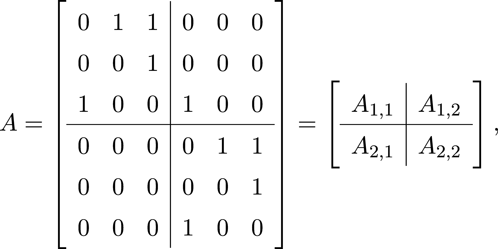
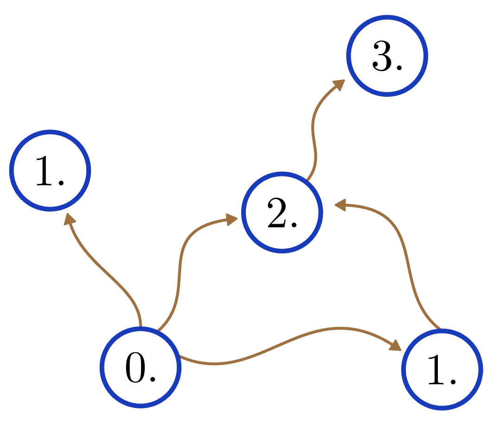

矩阵与图

现在，我们已经度过了困难的部分（即奇异值分解和其他矩阵分解），是时候以一个震撼的结尾完成我们的线性代数之旅了。在我的教学经验中，学生们最常见的一个担忧是实践与理论之间的明显脱节。在机器学习从业者和软件工程师中，通常有一种不愿接触那些在实践中不立即有价值的内容的倾向。

作为一名数学家，我完全理解这种恐惧的来源。我们常常被教授一些无实际意义的深奥话题，浪费了宝贵的时间，而这些时间本可以用来通过数据进行快速的分析和处理。

在本章中，我们将讨论一个对你的机器学习实践不立即有用，但未来会带来丰厚回报的主题。考虑到它的美丽，它或许会成为你下一个天才创意的灵感来源。（不过不敢保证。）

让我给你介绍线性代数中最被低估的事实：矩阵就是图，图就是矩阵。将矩阵编码为图是一种作弊方式，使得复杂的行为变得容易研究。

请查看下面的图 8.1。

图 8.1：一个矩阵及其有向图

你能弄明白它是如何构建的吗？你能猜到它为什么有用吗？我们将在接下来的几页中回答这些问题。具体来说，我们将看到：

+   图与矩阵之间的关系是什么

+   矩阵乘法如何转化为图上的路径

+   图的连通结构揭示了其对应矩阵的什么信息

让我们开始吧！

## 第十章：8.1 非负矩阵的有向图

如果你仔细观察图 8.1，你可能会弄明白如何从矩阵构建一个加权图。只需比较每一行和节点的出边权重。

每一行是一个节点，每个元素代表一条有向且加权的边。零元素的边会被省略。第 i 行第 j 列的元素对应着一条从 i 到 j 的边。得到的图叫做矩阵的有向图（或称为有向图）。

为了稍微展开定义，让我们看一下之前的矩阵图

这是第一行，对应于从第一个节点出来的边。

图 8.2：第一行对应于从第一个节点出来的边

同样，第一列对应于进入第一个节点的边。

图 8.3：第一列对应于进入第一个节点的边

现在，我们可以将所有这些内容结合起来。图 8.4 展示了完整的图像，节点被明确标注。

图 8.4：构建矩阵的图

现在是时候查看正式定义了，我们将其分为两部分。首先，让我们讨论有权的有向图。

定义 29\。

令 V = {v[1],v[2],…,v[n]} 为一个任意有限集合。我们说 G = (V,E,w) 是一个加权有向图，如果

（a）V 表示顶点集合（也称为节点）。(b) E ⊆V ×V 表示有向边集合。 (c) 函数 w : E →ℝ 表示边的权重。

例如，查看图 8.4，我们可以将其形式化为（V,E,w），其中 V = {v[1],v[2],v[3]}，

并且

现在，我们可以开始讨论矩阵了。

定义 30.（不可约和可约矩阵）

令 A ∈ℝ^(n×n) 为一个非负矩阵，即只含有非负元素的矩阵。如果有向加权图 G = (V,E,w)，则称其为 A 的有向图（或简称有向图），当且仅当：

（a）V = {1,2,…,n}，（b）当且仅当，a[i,j]/span>0 时，（i,j) ∈E，（c）w(i,j) = a[i,j]。

（有时为了说明问题，我们会省略权重，并假设它们都等于 1。）那么，这有什么用呢？因为这样，我们可以将代数问题转化为图论问题。因此，我们可以使用图论的强大工具集。

## 8.2 图表示法的好处

让我们来讨论图表示法的具体优势。首先，矩阵的幂对应于图中的行走。假设，对于任意的，。它的平方记为 ，其中元素  的定义为

（注意，a[i,j]^((2)) 上标中的(2)不是指数，它只是一个索引，表示 a[i,j]^((2)) 是 A² 的元素。）

图 8.5 显示了矩阵平方和其图的元素：所有可能的两步行走都包含在定义 A² 元素的和中。

图 8.5：矩阵的幂描述了其有向图上的行走

这个连接性有更多的内容；例如，它让我们深入理解非负矩阵的结构。为了更好理解这一点，我们来讨论强连通分量的概念。

### 8.2.1 图的连通性

直观地说，我们可以将连通性视为从一个节点到达其他所有节点的能力。为了形式化这一点，我们需要几个定义。首先是“从其他节点到达每个节点”这一部分。

定义 31.（图上的行走）

令 G = (V,E,w) 为一个加权有向图。序列 v[k[1]]v[k[2]]…v[k[l]] 是 G 上的（有向）行走，当且仅当对所有 i，(v[k[i]],v[k[i+1]]) ∈E。

（为了保持一致性，我们定义了加权有向图的行走，但该定义同样适用于简单图——即没有边或没有方向的图——大多数即将出现的概念也是如此。）

通常，我们说从 v[k[1]]v[k[2]]…v[k[l]] 开始的行走是从 v[k[1]] 出发并以 v[k[l]] 结束。

“步行”这个术语出奇地形象，因为它真正描述了在有向边上从一个节点到另一个节点的过程。然而，图论中的步行是一个定义明确的数学对象，而不仅仅是一个模糊的直觉。再次拿起笔和纸，画出一个图，并画出它的几个步行，来更好地理解这个概念。

步行和连通性有什么关系？很简单：如果你能从每个节点到达其他所有节点，那么这个图就被称为连通图。由于我们在讨论有向图，让我们在讨论中加入一些细微的差别，并给出一个正式的定义。

定义 32\.

（强连通性）

设 G = (V,E,w) 是一个加权有向图。我们说 G 是强连通的，如果对于每个 u,v ∈V ，都存在一条从 u 开始到 v 结束的步行。

换句话说，如果每个节点都可以从其他任何节点到达，那么一个有向图就是强连通的。如果这一点不成立，那么这个图就不是强连通的。图 8.6 展示了这两种情况的例子。

图 8.6 还说明了，强连通性与简单图的连通性概念不完全相同。

仅仅能从 v 到达 u 还不够；你还必须能够从 u 回到 v。

图 8.6：连通与强连通

现在，让我们把我们学到的知识转化为矩阵语言。与强连通图对应的矩阵叫做不可约矩阵。所有其他非负矩阵都叫做可约矩阵。稍后我们会看到为什么，但首先，这里是正式的定义。

定义 33\.

（不可约和可约矩阵）

设 A ∈ℝ^(n×n) 是一个非负矩阵。

(a) 如果 A 的有向图是强连通的，那么称 A 为不可约的。(b) 如果 A 不是不可约的，那么称 A 为可约的。

让我们看一个例子！图 8.7 展示了一个不可约矩阵。

图 8.7：强连通有向图及其矩阵

回到一般情况！尽管并非所有有向图都是强连通的，我们可以将节点划分为强连通分量（如图 8.8 所示）。

图 8.8：强连通分量

让我们给这个图的节点标上标签，并构建相应的矩阵！如果你假设权重简单地等于 1，并且将所有的边转化为我们已经学习过的行列式形式，你将得到：

这只是一大块 1 和 0 的矩阵，但你不应该感到失望：其中有规律！通过将 A 分成块，我们可以将这个示例图的矩阵简化为更简单的形式：

其中

对角块 A[1,1] 和 A[2,2] 表示的是强连通的图（即这些块是不可约的）。此外，对角线下方的块是 0。对于所有非负矩阵，这个结论都成立吗？

当然。我们来看看！

## 8.3 Frobenius 正常形

一般来说，我们刚才看到的块矩阵结构被称为 Frobenius 正常形。下面是它的精确定义。

定义 34.

（Frobenius 正常形）

令 A ∈ ℝ^(n×n) 为一个非负矩阵。如果它能写成块矩阵形式，则称 A 为 Frobenius 正常形。

.png)

其中 A[1],…,A[k] 是不可约矩阵。

让我们反过来问这个问题：我们能否将一个任意的非负矩阵转化为 Frobenius 正常形？是的，并且借助有向图，这比单纯使用代数要容易展示得多。以下是这个著名定理的完整形式。

定理 54.（Frobenius 正常形的存在性）

令 A ∈ ℝ^(n×n) 为一个非负矩阵。存在一个置换矩阵 P ∈ ℝ^(n×n)，使得 P^T AP 处于 Frobenius 正常形。

严格地说明定理 54 的证明相当复杂。然而，证明背后的思想很容易展示。因此，我们将采用一种不那么严谨但更有趣的方法。

那么，为什么 Frobenius 正常形如此重要，置换矩阵到底是什么？让我们深入了解一下。

### 8.3.1 置换矩阵

数学通常是从具体到抽象进行的。这就是为什么我们经常从特殊情况开始：如果我们将一个 2 x 2 矩阵与

一个简单的零一矩阵？通过快速计算，我们可以验证

也就是说，

1.  它从左侧乘时会交换行，

1.  它从右侧乘时会交换列。

从左右两侧同时乘以 P 会复合其效果：它交换了行和列，如下所示

如下所示。（顺便说一句，这是一个相似变换，因为我们特殊的零一矩阵是它自身的逆。这并非偶然，稍后我们会详细讲解。）

我们为什么要看这个？因为在幕后，这个变换并不会改变底层的图结构，只是重新标记了它的节点！

你可以轻松地手动验证这一点，图 8.9 也进行了说明。

图 8.9：重新标记节点

在一般的 n×n 情况下也存在类似的现象。在这里，我们通过交换单位矩阵的第 i 行和第 j 行来定义所谓的转置矩阵，例如：

排列矩阵的两个最重要的属性是 P[i,j]^T = P[i,j] 和 P[i,j]^T P[i,j] = I。也就是说，它们的逆矩阵就是它们的转置矩阵。

与转置矩阵相乘具有相同的效果：它交换左侧的行和右侧的列。更确切地说，

1.  P[i,j]A 交换 A 的第 i 和第 j 行，

1.  并且 AP[i,j] 交换 A 的第 i 和第 j 列。

最重要的是，相似性变换

重新标记 A 的有向图中的第 i 和第 j 个节点，保持图形结构不变。

现在，关于上述排列矩阵。排列矩阵只是转置矩阵的乘积：

排列矩阵继承了它们构建块的一些特性。最重要的是，

1.  它们的逆矩阵就是它们的转置矩阵，

1.  与它们的相似性变换只是一个重新标记节点的过程，保持图形结构不变。

要看这一点，可以考虑

=

依次重新标记节点。（回想一下，转置矩阵的乘积顺序会发生变化，而且转置矩阵是其自身的转置。）相反，每一个节点的重新标记都等同于一个与构建良好的排列矩阵相似性变换。

为什么我们要讨论这个？因为节点的正确标记是 Frobenius 正常形式的关键。

### 8.3.2 有向图及其强连通分量

现在，让我们来谈谈图。我们将看到每个有向图如何分解成强连通分量。让我们看一个具体的例子：

图 8.10：一个足够复杂供我们研究的有向图

这将是我们的教材示例。给定一个节点，能到达多少个节点呢？不一定是全部。例如，对于图 8.11 中高亮的点，只有部分图形是可达的。

图 8.11：从一个起始点出发的下游节点

然而，互相可达的节点集要小得多：图 8.12 显示，在我们的示例中，它只包含两个点。

图 8.12：互相可达的节点

从代数的角度来说，“ 和  是彼此可达的”是一种特殊的关系，它将节点集合划分为互不重叠的子集，使得

1.  来自同一子集的两个节点是彼此可达的，

1.  来自不同子集的两个节点是不可相互到达的。

这个划分的子集称为强连通分量，我们总是可以通过这种方式分解一个有向图。

图 8.13：我们示例图的强连通组件

现在，让我们把所有东西连接起来（不是以图的方式，而是以一个完整的数学方式来连接）！

### 8.3.3 将图形和置换矩阵结合起来

我们距离证明每个非负方阵都可以通过一个置换矩阵转换为 Frobenius 正常形只有两步之遥。以下是计划。

1.  构建我们非负矩阵的图形。

1.  找到强连通组件。

1.  以巧妙的方式重新标记节点。

就这样！为什么？因为，正如我们所见，重新标记等同于通过置换矩阵进行相似变换。唯一的小问题是：巧妙的方式是什么？我来展示给你看。

首先，我们“骨架化”图形：将组件合并在一起，以及它们之间的所有边。

把每个组件视为一个黑盒子：我们不关心内部的内容，只关心它们的外部连接。

图 8.14：强连通组件

在这个骨架中，我们可以找到无法从其他组件进入的组件。这些将是我们的起始点，即零类组件。在我们的例子中，我们只有一个。

图 8.15：寻找“零类”组件

现在，事情变得有点棘手。我们通过从最远的零类组件开始，按最长路径对每个组件进行编号。

这甚至很难阅读，更不用说理解了。图 8.16 展示了这个过程。

图 8.16：组件编号

关键在于，如果你能够从第 n 类到达第 m 类，那么 n < m。最终，我们会得到类似于图 8.17 的结果。

图 8.17：已编号的组件

这定义了组件的一个顺序（如果你想精确一点，它是一个偏序）。

现在，我们为节点标记，使得

1.  高阶类排在前面，

1.  连续的索引如果可能，表示来自同一组件的节点。

就是这样。

图 8.18：标记节点

这里是这个特定例子中的矩阵，为了简化，使用了零和一：

![⌊ | | | | ⌋ 0 1 1 |1 0 0 0 |0 0 | 0 |0 0 0 || | | | | || || 0 0 1 |0 0 1 0 |0 0 | 1 |0 0 0 || || 1 0 0 |0 0 0 0 |1 0 | 0 |0 0 0 || | ---------|-----------|----|---|-------| || 0 0 0 |0 1 0 1 |0 0 | 0 |0 0 0 || || 0 0 0 |0 0 1 0 |0 0 | 0 |0 0 0 || || | | | | || || 0 0 0 |1 0 0 0 |0 0 | 0 |0 0 0 || || 0 0 0 |0 1 1 0 |0 0 | 0 |0 0 0 || | ---------|-----------|----|---|-------| || 0 0 0 |0 0 0 0 |0 1 | 1 |0 0 0 || || 0 0 0 |0 0 0 0 |1 0 | 0 |0 0 0 || || ---------|-----------|----|---|-------|| || -0--0--0-|0--0--0--0-|0-0-|-0-|1-0--0-|| || 0 0 0 |0 0 0 0 |0 0 | 0 |0 1 0 || | | | | | | || 0 0 0 |0 0 0 0 |0 0 | 0 |0 0 1 || || 0 0 0 |0 0 0 0 |0 0 | 0 |1 0 0 || ⌈ ⌉ ](img/file844.png)

这样，定理 54 的证明思路就清晰了！现在，我们也终于明白了为什么不可约矩阵被称为不可约：因为它们描述的是强连通图，因此不能以有意义的方式进一步分解成更小的块。

## 8.4 总结

随着线性代数与图论之间关系的研究，我们的线性代数学习之旅已经结束。

在本章以及前七章中，我们学到，向量和矩阵不仅仅是存储观察值和测量数据的数据结构。向量和矩阵具有丰富而美丽的几何结构，能够同时描述数据及其变换！

首先，我们了解到，向量存在于所谓的向量空间中，它们是我们所处的三维空间的高维推广（根据一些弦理论学者的说法，可能是 26 维，但我们暂且只讨论地球上的空间）。我们可以通过范数来测量长度和距离，范数通常定义为

或通过内积来测量角度（等等），内积通常定义为

从数学的角度来看，矩阵来源于向量空间的线性变换，即满足线性关系 f(ax + by) = af(x) + bf(y) 的函数 f : U →V 。矩阵通过代数方式表示线性变换，具体表现为

使我们能够从几何角度推理数据变换。这在机器学习中是一个极其强大的工具。想想看：Ax 可以是回归模型、神经网络中的一层，或其他各种机器学习构建模块。归根结底，这就是我们要学习向量空间的原因：数据存在于其中，而数据变换则通过矩阵来描述。

然而，建立模型并不止步于线性代数。为了捕捉更复杂的模式，我们需要引入非线性。例如，考虑著名的 Sigmoid 函数，它由以下公式定义

由σ(Ax)定义的变换（其中σ是按元素应用的）是一个简单的逻辑回归模型，使我们能够对多维特征空间进行二分类。基于这一思路，我们得到的表达式

定义了一个两层神经网络。

所以，我们接下来的旅程将进入微积分的领域，我们将学习函数到底是什么，如何从函数构建预测模型，以及如何通过梯度下降调节参数来拟合这些模型。

让我们开始吧！

## 8.5 问题

问题 1\. 设 G = (V,E) 是一个有向图，u,v ∈V 是其两个节点。证明如果从 u 到 v 存在一条路径，则存在一条没有重复边和重复顶点的路径。

问题 2\. 设 G = (V,E) 是一个强连通有向图。证明 jEj ≥ jV j，其中 jSj 表示集合 S 中元素的个数。（换句话说，证明为了强连通，G 至少需要有与节点数相等或更多的边。）

问题 3\. 设 A ∈ℝ^(n×n) 是一个不可约矩阵。A² 也不可约吗？（如果是，请证明。如果不是，请给出反例。）

问题 4\. 设 A ∈ℝ^(4×4) 是一个矩阵，其定义如下：

找到将 A 转换为 Frobenius 标准型的置换矩阵 P！

## 加入我们的 Discord 社区

与其他用户、机器学习专家和作者本人一起阅读本书。提出问题、为其他读者提供解决方案、通过“问我任何问题”环节与作者互动等等。扫描二维码或访问链接加入社区。[`packt.link/math`](https://packt.link/math)

