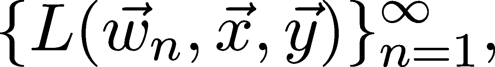
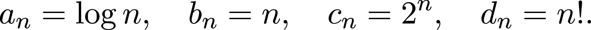
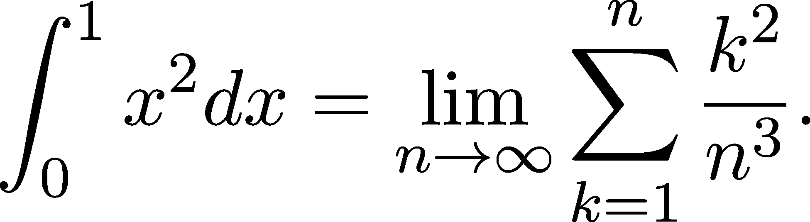
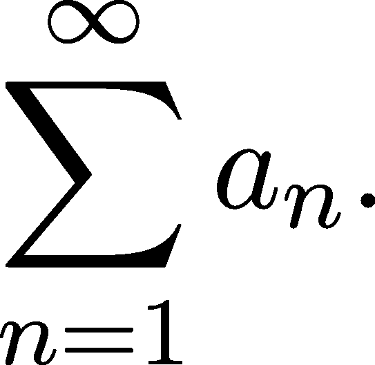
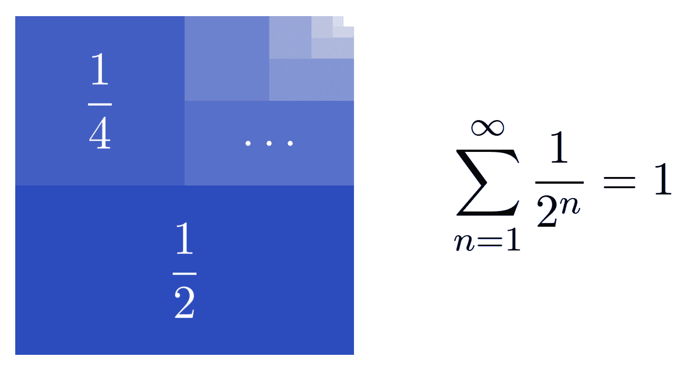
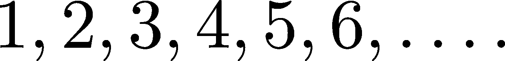
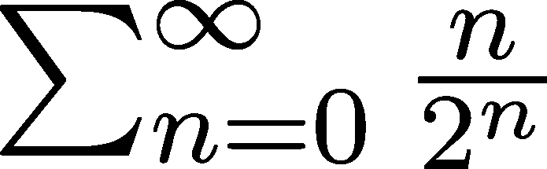

数字、数列和级数

> “这就像问，为什么路德维希·范·贝多芬的《第九交响曲》那么美。如果你看不出来为什么美，那么没人能告诉你。我知道数字是美的。如果它们不美，那么没有什么是美的。”
> 
> — 保罗·厄尔德什

当我从高中直接进入大学准备上第一堂数学分析课时，我曾想，为什么我们要花几节课讲实数。当时，我对自己的知识很有信心，认为我知道什么是数字。这是我第一次痛苦地遇到[Dunning–Kruger 效应](https://en.wikipedia.org/wiki/Dunning%E2%80%93Kruger_effect)：你知道得越少，信心越大。可以说，几节课之后，我对数字感到困惑，花了些时间才最终理解它们。

如果你用放大镜看数字，它们会变得非常复杂。在这一章中，我们将理清这些概念。为了前瞻性地看待并关注机器学习，考虑到梯度下降（你知道的，那个到处都在用的优化算法）对于不可微分的函数是无法应用的。反过来，函数 f 在 x 点可微分，当且仅当极限


极限存在。要理解极限，我们必须首先理解实数。

另一个深入探究数字模式和结构的好理由：它们很美（正如保罗·厄尔德什所说，他是有史以来最伟大的数学家之一）。从深层次理解那些看似熟悉的事物是有一种特殊的乐趣的。即使你可能并不每天都用到这些知识，它仍然能教会你对工作中遇到的对象的全新视角。

所以，让我们开始吧！

## 第十三章：10.1 数字

有五个著名的数字类别，任何想要精通数学的人都必须知道：

+   自然数，用符号ℕ表示，

+   整数，用符号ℤ表示，

+   有理数，用符号ℚ表示，

+   实数，用符号ℝ表示，

+   最后是复数，用符号ℂ表示。

这些类别是按顺序递增的，也就是说，


在这一节中，我们将关注前四个自然数。（复数将有自己的章节。）

### 10.1.1 自然数和整数

自然数被简单地定义为


有时候 0 被包含在内，有时候不包含。信不信由你，经过几千年的讨论，数学家们仍然无法决定 0 是否是自然数。这个问题听起来可能有些滑稽，但相信我，我见过一些资深教授几乎因为讨论这个问题而打起来。对某些人来说，这是一个宗教性的问题。

我其实不太在意，你也不必太在意。我建议使用更常见且实用的定义，也就是不包含 0 的定义。当我们真正需要讨论包括 0 在内的自然数时，我会使用符号ℕ[0] = {0,1,2,…}。

自然数集合的基数是可数的无限大。实际上，可数性定义为 jℕj。（如果你不熟悉基数的概念，请参见附录 C。）

为了能够表达负数和零的数量，我们将自然数扩展为整数集合，定义如下：


到目前为止，一切顺利。整数也是可数的：我们可以通过枚举它的所有元素来实现这一点。


整数相较于自然数的一个重要优势是它们包含每个元素的加法逆元。简单来说，如果 n ∈ℤ，那么 −n 也 ∈ℤ。这样我们就能够在整数上定义各种代数结构，从而为我们提供数学工具来推理与这些现象相关的模型。

请注意，如果 n, m ∈ℤ，那么 n + m ∈ℤ。在数学术语中，我们说 ℤ 对加法封闭。

总结一下，ℤ 是

+   对加法封闭，

+   并且每个元素都有加法逆元。

这两个性质将指导我们如何从自然数扩展到实数。每个扩展的构造方式都确保这两个性质成立，但在不同的运算下有所不同。

### 10.1.2 有理数

因此，我们通过向 ℕ 中添加 0 和每个元素的加法逆元来得到 ℤ。那么，乘法逆元呢？这个想法引出了有理数的概念，即可以表示为两个整数的比率的数字。它的定义是：


它对乘法封闭，并且每个元素（除 0 外）都有乘法逆元。这不仅仅是为了数学构造而构造的艺术：有理数描述了我们周围的各种量。例如“7.9 秒”到“100.0 公里/小时”，78.4 公斤需要搬运，0.5 个披萨要吃。你明白了。

这可能令人惊讶，但 ℚ 也是可数的。

证明这一点的一个简单方法是注意到它可以作为可数集合的可数并集获得：


（如果你不熟悉基本的集合运算，如并集和差集，请参见附录 C。）

由于可数集合的并集仍然是可数的，因此 ℚ 也是可数的。另一种（或许更加直观）的方法是简单地将它们按顺序枚举，如图 10.1 所示。


图 10.1：有理数的枚举，其中箭头表示顺序

有理数可以写成小数形式，例如  = 0.5。一般来说，以下是成立的：

定理 55\.

任何有理数 x 都可以表示为：

(a) 有限小数


(b) 或者是重复小数


其中，两个点之间的小数部分会无限重复。（这也可以是一个单一的数字。）

请注意，小数表示法不是唯一的：例如，1.0 0.˙9 是相等的。

上述定理完全描述了有理数。那么，具有无限不重复小数形式的数呢？

就像著名的数学常数 π 描述单位圆的半周长一样，


这些数没有重复的模式。它们叫做无理数，和有理数一起构成了实数。

### 10.1.3 实数

想象实数的最简单方式是将它们表示为一条线，其中每个点代表一个数字。


图 10.2：实数线

如果我们暂时忽略数学的严格性，可以说

ℝ = 有限小数∪有限循环小数∪无限不循环小数

实数是我们旅程中遇到的第一个不可数的集合，我们将证明这一点！它的证明如此美丽，以至于它应该出现在《数学之书》中——这本书收录了最优雅、最美丽的数学证明。

定理 56\。

ℝ 是不可数的。

证明。为了证明 ℝ 是不可数的，我们采取间接方法：假设它是可数的，并推导出矛盾。这个方法叫做间接证明，是数学家工具箱中的一项高级工具。

由于 0,1) ⊆ ℝ，只需证明 [0,1) 是不可数的。如果它是可数的，我们可以列举出它的元素：


让我们聚焦于对角线！通过改变这里的数字，我们定义


这个数字可以表示为


是否可以在序列 {a[1],a[2],…} 中找到？不可以，因为对于所有 i ∈ ℕ，a[i] 和 â 的第 i 位小数必须不同！我们通过改变 a[i] 的第 i 位小数构造了 â。

总结一下，我们假设 0,1) 可以被列举出来的假设导致了矛盾，因为我们发现了一个不可能出现在列举中的元素。因此，[0,1) 是不可数的，进而 ℝ 也是不可数的。这就是我们需要证明的！

你刚才看到的证明方法叫做康托尔对角线论证。这是一个美丽且强大的思想，尽管我们以后不会再遇到它，但它是证明几个困难定理的关键。（比如哥德尔著名的不完备性定理，实质上是说公理系统要么是表达不充分的，要么是自相矛盾的。这些定理在 20 世纪初给数学的运作带来了巨大冲击。）

请注意，实数打破了我们之前观察到的模式。整数是通过扩展自然数并引入加法逆元来构造的，并且对加法封闭；有理数则是通过类似的方式获得的，不过是针对乘法进行封闭。正如我们稍后所见，实数遵循类似的过程：我们通过对有理数进行极限封闭来得到它们。

但是极限是什么呢？让我们通过研究序列来看看——序列为极限提供了上下文！

## 10.2 序列

序列是数学的核心所在。序列及其极限描述了长期行为，比如梯度下降（偶尔）收敛到局部最优点。根据定义，序列是数学对象的列举。

序列的元素可以是任何数学对象，比如集合、函数或希尔伯特空间。（这些是什么呢？）对于我们来说，序列由数字组成。我们正式地表示它们为

![ ∞ {an }n=1, an ∈ ℝ. 

为了简便，通常省略下标和上标，所以如果你看到{a[n]}，不用惊慌，它只是一个缩写。（或者是 a[n]。数学家喜欢使用缩写。）如果序列的所有元素都属于集合 A，我们通常写作{a[n]}⊆A。

序列也可以是双向的。这些序列表示为{a[n]}[n=−∞]^∞。我们目前不需要它们，但它们在概率分布的上下文中经常会出现。

有时我们不需要整个序列，只需要一个子序列。我们暂时不会对它们做任何特别的处理，但这是它们的正式定义。

定义 38.（子序列）

设 a[nn=1]^∞，并且设 n[kk=1]^∞⊆ℕ为一个严格递增的自然数序列。那么，序列{a[n[k]]}[k=1]^∞是{a[n]}的一个子序列。

可以把它想象成把元素从序列中丢弃。

### 10.2.1 收敛

序列的一个重要方面是它们的渐近行为，换句话说，就是它们在长期中的表现。我们常常关注的一个特性是收敛性。用通俗的语言来说，序列{a[n]}收敛到 a，如果无论我们定义一个多小的区间(a−𝜀, a + 𝜀)（其中𝜀可以非常小），最终所有{a[n]}的元素都会落入其中。

以下是收敛的数学精确定义。

定义 39.（序列的收敛性）

序列{a[n]}⊆ℝ说是收敛到某个 a ∈ℝ，如果对于每个𝜀/span>0，都存在一个截止索引 n[0] ∈ℕ，使得


对所有的索引 n/span>n[0]成立。值 a 被称为{a[n]}的极限，我们写作


或者


请注意，截止索引 n[0]依赖于𝜀。我们可以写作 n0 来强调这种依赖关系，但我们很少这么做。为了避免一直提到并命名截止索引 n[0]，我们通常简单地说“对于所有足够大的 n，这个属性成立。”（我提过数学家喜欢缩写吗？）

用通俗的语言来说，这个定义意味着无论你定义一个多小的区间来包含 a，序列的所有成员最终都会落入这个区间。

尽管在数学上非常精确且正确，但这个定义并没有提供很多工具来判断一个序列是否收敛。首先，我们必须构造极限 a，然后构建截断索引。例如，考虑 a[n] := 。

为了简化我们的工作，我们可以绘制图形来可视化这种情况。

```py
import numpy as np 
import matplotlib.pyplot as plt 

with plt.style.context("/span>seaborn-v0_8": 
    plt.figure(figsize=(8, 5)) 
    plt.scatter(range(1, 21), [1/n for n in range(1, 21)]) 
    plt.xticks(range(1, 21, 2)) 
    plt.title("/span>the 1/n sequence 
    plt.show()
```


图 10.3：1∕n 序列

在这里，我们可以显式地为每个 𝜀 构造截断索引 n[0]。因为我们希望有


我们可以重新组织不等式以得到


所以，


这就能解决问题。

在这个例子中，我们比较容易解决问题，但这基本上是我们能够用定义解决的问题的极限了。例如，如何证明


仅使用定义来处理吗？不行。

对于此问题，存在更为先进的工具，正如我们将看到的那样。（顺便提一下，lim[n→∞]a[n] = ）。对于递归定义且没有解析公式的序列，例如



其中 L 是神经网络的损失函数，带有权重 [n] 和训练数据 (,)，我们遇到的情况更为复杂。现在不必担心它们，让我们一次只关注一个问题。

### 10.2.2 收敛性质

本质上，研究特定序列的收敛性就是将其分解为越来越简单的部分，直到知道极限为止。

1.  这是一个“著名的”序列，已知其极限吗？如果是，我们就完成了。如果不是，进入下一步。

1.  你能将它分解成更简单的部分吗？如果可以，它们的收敛性是否已知？如果收敛性未知，你能进一步简化吗？

我们之所以能这样做，是因为收敛具有一些特别好的性质，正如下述定理所总结的那样。

定理 57. （收敛性质）

设 {a[n]} 和 {b[n]} 是两个收敛序列，且


那么：

(a)


(b)


(c)


(d) 如果 a[n]≠0 且 a≠0，则


性质（a）和（b）合起来被称为收敛的线性性质。

正如我们稍后将看到的，函数的连续性也为研究序列的收敛性质提供了一个很好的工具。事实上，连续性不过是极限和函数的可交换性：


收敛序列的一个重要性质是，在某些情况下，它们保持不等式。这对于函数极限也同样成立，因此对我们来说非常重要。

定理 58. （传递原理）

设 {a[n]}[n=1]^∞ 是一个收敛序列。如果对于所有 n ∈ℕ，a[n] ≥α，其中 α ∈ℝ 是某个下界，那么 lim[n→∞]a[n] ≥α。

证明。我们将通过间接方式来证明。如果 lim[n→∞]a[n] = α，那么根据收敛的定义，

|a[n] −a|/span>  对所有足够大的 n 成立。这意味着这些 a[n] 实际上低于 α，与我们的假设矛盾。

这个证明如果画图并可视化发生了什么，会很容易理解，因此我鼓励你这样做。如果我们将上式中的 ≥ 替换为 ≤，并且证明的措辞保持不变，得到的结果是一样的。

注意，如果对于所有的 n 都有 a[n]/span>α，lim[n→∞]a[n]/span>α 并不保证！最好的例子是 a[n] := 1∕n，它收敛到 0，尽管它的所有项都是正数。

作为推论，我们得到了一个工具，它将对证明特定序列的收敛性非常有用。

推论 3\.（挤压原理）

设 、 和  是三个序列，使得对于所有足够大的 ，有 。如果


那么


换句话说，将 {b[n]} 夹在两个具有相同极限的收敛序列之间，意味着 b[n] 收敛到该共同极限。

### 10.2.3 知名收敛序列

因为收敛在某些操作下表现得很好（见第 10.2.2 节），我们通过将序列分解为构建块来研究它们。让我们看看哪些最重要的构建块将对我们后续的研究有所帮助！

示例 1\. 对于任意 x ≥ 0，

.png)(10.1)

如果你想一下，这很容易看出来。x = 0 和 x = 1 的情况是显然的。至于其他情况，因为取对数将指数运算转化为乘法，所以我们有 log x^n = nlog x。因此，


由于对数是递增且可逆的，（10.1）成立。

示例 2\. 对于任意 x ≥ 0，

.png)(10.2)

类似于前面的例子，这可以通过对数的运用来证明。

示例 3\. 让我们考虑以下序列



你能按照增长速度对它们进行排序吗？这在计算机科学中非常重要，因为这些可能代表时间复杂度。几乎可以说，对数时间复杂度优于线性，线性优于指数，指数优于阶乘。换句话说，


示例 4\. 我们刚刚学到 n 的增长速度快于 log n。从中可以推得


一个令人惊讶的结果（至少，对于年轻的我来说是惊讶的）！为了证明这一点，我们应用那个老生常谈的对数技巧：


### 10.2.4 收敛性在机器学习中的作用

收敛性无处不在。你现在才刚刚接触到这个概念，可能还没有意识到它的重要性。但它在数学和机器学习中是至关重要的。

先来预览并给出几个例子，微分是通过极限来定义的：


关于导数，积分（微分的“逆”运算）是收敛序列的极限。例如，



因为积分是极限，所以用积分计算的每一个量也是极限，比如标准正态分布的期望值，

![ ∫ ∞ 𝔼[𝒩 (0,1)] = x √1--e−x2∕2dx. −∞ 2π ](img/file951.png)

收敛性在概率论和统计学中也至关重要。

有两个著名的定理：大数法则，表明


公式成立；还有中心极限定理，它说


在分布中，对于独立同分布的随机变量 X[1],X[2],…，它们有有限的期望值 𝔼[X[i]] = μ 和方差 var(X[i]) = σ²。它们在机器学习和神经网络中非常重要；例如，大数法则是随机梯度下降法背后的一个基本思想。

即使是梯度下降优化过程也是一个递归定义的模型权重序列，它会收敛到一个最优点，在这个点上模型最符合数据。

我们将详细讨论所有这些内容。所以，即使你现在还不理解这些，也不用担心。很快就会明了。在结束序列部分之前，我们将讨论当一个序列不收敛时会发生什么。

### 10.2.5 发散序列

我们已经讨论过收敛序列无处不在，它们是数学和机器学习的核心。然而，并非所有序列都是收敛的。

试想一下以下例子：


当绘制出来时，它看起来是这样的。

```py
with plt.style.context("/span>seaborn-v0_8": 
    plt.figure(figsize=(8, 5)) 
    plt.scatter(range(1, 21), [np.sin(n) for n in range(1, 21)]) 
    plt.xticks(range(1, 21, 2)) 
    plt.title("/span>the sin(n) sequence 
    plt.show()
```


图 10.4：sin(n) 序列

尽管证明起来困难，但这个序列是不会收敛的。它的值在区间 [ − 1,1] 内不断震荡。我们称这种不收敛的序列为发散序列。在这些序列中，有一种特殊的发散类型：趋近于无穷大。

定义 40.（∞-发散）

序列 {a[n]} 被称为 ∞-发散的，如果对于每一个任意大的数 x，都存在一个截止指数 n[0]，使得


对所有索引 n/span>n[0] 都成立。

我们用 x[n] →∞ 来表示 ∞-发散性。类似地，可以定义（−∞）-发散序列。

一个显而易见的例子是 {n} 或 {nlog n}。这些也遍布计算机科学领域：算法的运行时间与步骤数量或输入大小相关，呈 ∞-发散。

当你看到像 a[n] = O(n) 这样的表达式时，意味着存在一个常数 c，使得


对所有足够大的 n 都成立。

### 10.2.6 大 O 和小 o 符号

如果你有一些计算机科学的经验，你可能对大 O 小 o 符号有所了解。在那里，它用来表示算法的运行时间，但并不限于此。一般来说，它用于比较序列的长期行为。让我们先从定义开始，然后我会解释直觉和一些应用场景。

定义 41.（大 O 和小 o 符号）

设  和  为两个任意的序列。我们说：

+   ，如果存在一个常数 ，使得对于所有足够大的 ，都有 

+   ，如果对于每个 ，存在一个截止索引 ，使得对于所有 ，都有 。

用简单的英语来说，“b[n] 是 a[n] 的大 O”意味着 b[n] 的增长速度大致与 a[n] 相同，而“b[n] 是 a[n] 的小 o”意味着 b[n] 比 a[n] 小一个数量级。

所以，当我们说一个算法的运行时间是 O(n) 步时，其中 n 是输入大小，意味着该算法将在 Cn 步内完成。通常，我们不关心常数因子，因为从长远来看，它不会带来数量级上的差异。

### 10.2.7 实数是序列

现在我们已经熟悉了收敛序列的概念，我们将再次审视有理数和实数。当从 ℕ 扩展到 ℝ 时，我们选择一种运算，对其进行闭包处理，并为该运算添加逆元素。

扩展 ℕ 为所有 n ∈ℕ 的加法逆元 −n，得到 ℤ。将 ℤ 扩展为所有 n 的乘法逆元 1∕n，并对乘法进行闭包，得到 ℚ。在 ℝ 的情况下，似乎有不同的模式，但事实并非如此。在理解了收敛性之后，我们就有工具来理解为什么。

考虑以下序列：


由于有理数对加法和乘法封闭，我们可以看出 a[n] 是有理数。然而，


这个著名的欧拉常数，并不是有理数。

因此，我们找到了缺失的部分：ℚ 对极限运算不封闭。所以，我们可以通过对 ℚ 进行极限运算闭包来获得实数集。

每个无理数都可以通过有理数尽可能接近地进行近似这一事实常常被低估。想一想：你能用计算机表示所有的实数吗？不行。这是因为一个简单的基数论证：浮点数的数量是有限的，但实数是不可数的。然而，某些数字（比如π或 e）在工程计算和仿真中是至关重要的。没有近似值的帮助，处理无理数将变得不可行。

说到 e：你会如何为计算目的近似它？理论上，只需取一个足够大的 n 并使用(1 + 1∕n)^n 的值就足够了。在实践中，存在几个潜在的问题：收敛可能会很慢，且对一个接近 1 的数进行大次幂运算可能会引起数值不稳定。

然而，存在一种解决方案：这种形式


这解决了这两个问题！从数值角度来看，加法比乘法更好。而且，由于 n! 增长得非常快，即使对于小的 n，项  也变得可以忽略不计。因此，收敛速度很快。看看这个。

```py
from math import factorial 

x = range(1, 21) 

e_def = [(1 + 1/n)**n for n in x] 
e_sum = [np.sum([1/factorial(k) for k in range(n)]) for n in x] 
with plt.style.context("/span>seaborn-v0_8": 
    plt.figure(figsize=(8, 5)) 
    plt.scatter(x, e_def, label="1 + 1/n) ** n 
    plt.scatter(x, e_sum, label="/span>sum approximation 
    plt.xticks(range(1, 21, 2)) 
    plt.title("/span>Approximating the value of e 
    plt.legend() 
    plt.show()
```


图 10.5：近似 e：定义与级数

形式为 ∑ [n=0]^∞a[n] 的表达式称为级数，它们是数学中最重要的对象之一，既在理论上也在实践中。让我们看看它们是什么，以及我们如何与它们合作！

## 10.3 级数

我家乡有一家很棒的披萨店，我以前经常去。那里，每个披萨都装在一个盒子里，盒子里有一张披萨优惠券。十张披萨优惠券可以兑换一份免费的披萨。这就引出了一个问题：你通过一次购买能获得多少披萨？

立即，你将得到一份披萨。你还将获得 1/10 的披萨作为优惠券，使得购买的“价值”至少为 1 +  披萨。

然而，兑换十张优惠券后，你还会得到另一张。因此，一张优惠券代表着  +  披萨。按照这个逻辑，我们可以得到每次购买的真实价值是：


这个数值是多少呢？为了找出答案，我们将研究无限级数，数学的一个重要支柱。无限级数（或简称级数）是这种形式的求和：



将无限多个项加在一起可能看起来是一件微不足道的事，但我向你保证，情况远非如此。例如，考虑以下求和：


一方面，


另一方面，


这到底是哪一个呢？是零还是一？都不是。我们将在本节中看到为什么。

### 10.3.1 收敛级数与发散级数

使无限级数合理的自然方法


是通过取所谓的部分和的极限得到的


这是通过以下定义来形式化的。

定义 42。

（收敛和发散级数）

设  为任意实数序列。无限级数  定义为


如果上述极限存在，我们称是收敛的。否则，它是发散的。

听起来很简单。让我们来看一些例子！

示例 1. 几何级数，如下所示


由于 S[N] + q^(N+1) = S[N+1] = 1 + qS[N]，因此，S[N] = 。因此，


这就是著名的公式 ∑ [n=1]^∞ = 1 的来源。（图 10.6 也说明了这一点。）



图 10.6：几何级数收敛性的可视化证明，适用于 q = 1∕2

几何级数也是我们在入门比萨优惠券示例中看到的那个。现在，我们可以看到单次购买的值为


比萨饼。

示例 2. 调和级数，如下所示


为什么调和级数发散？要看为什么，首先注意到


因此，通过适当分组项，我们得到


如果你难以想象这一点，这里有一个图示。

```py
xs = range(1, 41) 
an = [1/n for n in xs] 
ys = np.cumsum(an) 

with plt.style.context("/span>seaborn-v0_8": 
    plt.figure(figsize=(8, 5)) 
    plt.scatter(xs, ys) 
    plt.xticks(range(1, 41, 5)) 
    plt.title("/span>the harmonic series 
    plt.show()
```


图 10.7：调和级数

根据欧拉-麦克劳林公式，


其中 γ ≈ 0.5772156649… 是著名的欧拉–马歇罗尼常数。查一下。 （当省略底数时，log 表示自然对数，也常记作 ln。）

```py
with plt.style.context("/span>seaborn-v0_8": 
    plt.figure(figsize=(8, 5)) 
    plt.plot(xs, np.log(xs) + np.euler_gamma, c="/span>r linewidth=5, zorder=1, label="/span>log(x + y) 
    plt.scatter(xs[::2], ys[::2], label="/span>harmonic series 
    plt.xticks(range(1, 41, 5)) 
    plt.title("/span>the harmonic series 
    plt.legend() 
    plt.show()
```


图 10.8：调和级数和 log(x + γ) 函数

示例 3. 交替调和级数，如下所示


出人意料的是，交替调和级数是收敛的，求和结果为 log 2。

示例 4. 巴塞尔问题。信不信由你，解多项式方程和评估无限和曾是数学家们的一种运动。最著名的其中之一就是巴塞尔问题，涉及反平方的无限和。1735 年，传奇人物欧拉证明了


这是一个令人震惊的结果。π到底在这里做什么？常数π被定义为半径为 1 的圆的半周长，而它在反平方的无限和中出现，至少是让人困惑的。（有一种解释：1∕n²这些数字是函数 f(x) = x 的（缩放的）傅里叶系数，而傅里叶系数的和总是等于该函数在区间[ −π,π]上的积分。然而，这种方法超出了本书的讨论范围。）

个人而言，∑ [n=1]^∞ = 是我微积分教授最喜欢的恒等式。那位教授我非常喜爱，以至于我最终选择了数学分析作为我的专业。曾经，他在一次事故中撞到了头。急救车到达时，急救员让他说话，目的是测试他的认知能力是否正常。所以，他开始向医护人员解释巴塞尔问题。差点就被送到创伤中心了，但幸运的是，他的妻子在场，向大家解释说他没事，他只是个数学家。

示例 5\. 阿佩里常数。我们已经看过调和级数和巴塞尔问题，那么反立方和的和呢？虽然已知该级数


是收敛的，并且它的值是无理数，我们还没有得到一个封闭的解析解！

示例 6\. 交替级数


这是一个发散级数的第一个例子：因为


极限 lim[N→∞]∑ [n=0]^N(−1)^n 不存在。这就是我们在引言中所说的看似矛盾的结果的解决办法：由于∑ [n=0]^∞(−1)^n 是发散的，结合律失效了。

示例 7\. 著名的欧拉数，定义为 e = limn→∞)^n，也可以表示为无限级数

e = ∑ [n=0]^∞。

目前，这超出了我们的讨论范围，但稍后我们将看到为什么这个结论是正确的。（剧透：这是所谓的泰勒级数，我们将在第十二章讨论它。）

这引出了一个问题：是否存在一种方法可以判断一个级数是否收敛？并不是所有级数的部分和都能找到封闭形式的公式。我鼓励你尝试为∑ [n=0]^N1∕n!找出一个公式，如果你不相信我。

### 10.3.2 级数的性质

让我们来看看级数的一些最重要的性质。首先，很明显，收敛级数的通项也应该收敛于 0。

命题 2\。

设∑ n = 1^∞a[n]是一个收敛级数。那么 lim[N→∞]a[N] = 0。

证明。因为 a[N] = ∑ [n=1]^Na[n] −∑ [n=1]^(N−1)a[n]，我们得到


这就是我们要证明的。

命题 2 可以用来快速判断某些级数的收敛性。例如，∑ [n=1]^∞ 不可能收敛，因为 lim[n→∞] = 1。

另一方面，注意到命题 2 的逆命题不成立：有些发散级数的通项收敛于 0。一个直接的例子是调和级数 ∑ [n=1]^∞。

就像数列一样，收敛级数在加法和数乘方面表现得正如我们所期望的那样。

定理 59．（收敛级数的线性）

令 ∑ n = 1^∞a[n] 和 ∑ n = 1^∞b[n] 为两个收敛级数，且令 α,β ∈ℝ 为任意实数。那么，


证明是定理 57 的直接推论。可以通过亲自推导来进行练习！

注意，定理 59 不适用于发散级数。例如，

![∑∞ n n+1 [(− 1) + (− 1) ] = 0, n=0 ](img/file1016.png)

然而，


都是发散的。

级数的乘积稍微复杂一点。我们稍后会在本章讨论这个问题，我保证。

### 10.3.3 条件收敛与绝对收敛

让我们把怪异程度提高一点。回想一下交替调和级数 ∑ [n=1]^∞(−1)^(n+1)，它的和是 log 2。如果我们重新排列它的项会发生什么？

与其在一个奇数项和一个偶数项之间交替，不如做一个奇数项和两个偶数项的交替。（奇数和偶数是相对于它们的索引而言的。）

这由图 10.9 说明。


图 10.9：交替调和级数的重新排列

变化虽小，但却带来了深远的影响。事实证明，通过简单地重新排列项，我们改变了和的值！查看图 10.10 了解原因。


图 10.10：交替调和级数的重新排列，解释

这是因为在级数的世界中，重新排列并不是有效的操作。然而，收敛性的概念可以被细化，使我们能够区分可重新排列的和不可重新排列的级数。

进入绝对收敛与条件收敛。

定义 43．（绝对收敛与条件收敛）

令 ∑ [n=1]^∞a[n] 为一个无穷级数。

(a) 如果 ∑ [n=1]^∞ja[n]j 收敛，那么 ∑ [n=1]^∞a[n] 被称为绝对收敛。

(b) 如果 ∑ [n=1]^∞a[n] 收敛但不是绝对收敛的，那么它称为条件收敛。

例如，几何级数 ∑ [n=0]^∞^n 是绝对收敛的，而交替调和级数 ∑ [n=1]^∞(−1)^n 仅是条件收敛的。

如果一个级数是绝对收敛的，那么它也是收敛的。（我们跳过证明，因为其中的细节对我们来说不那么重要。）

### 10.3.4 重访重排

绝对收敛或条件收敛对级数的行为有着深远的影响。一个重要的例子就是它的重排性。事实证明，绝对收敛级数可以重排，而条件收敛级数则变得不稳定。

从数学角度讲，重排可以通过对索引集合的排列来形式化。

定义 44\. （排列）

设 A 是一个任意集合。如果映射 σ : A →A 是双射，则称 σ 是 A 的一个排列。

这看起来相当抽象，但排列是很容易理解的。可以将索引集合看作是递增的序列



（它可能包括 0，甚至可能从更大的数字开始。）这个简单的排列


交换相邻的偶数和奇数，将索引集合转变为


对于一个一般的级数 ∑ [n=1]^∞a[n]，其由排列 σ 给出的重排为 ∑ [n=1]^∞a[σ(n)]。

那么，你能重排一个收敛级数吗？如果它是绝对收敛的，毫无疑问可以。

定理 60\.

设  是一个绝对收敛级数，

我们在这里不打算证明这个，但本质上是，收敛级数的行为完全符合我们的预期：我们可以改变项的顺序而不影响结果。

那么，条件收敛的级数呢？我们已经看到重排可以改变其值，但情况更为有趣。接下来介绍黎曼重排定理。

定理 61\. （黎曼重排定理）

设 ∑ [n=1]^∞a[n] 是一个条件收敛级数，设 c ∈ ℝ 是一个任意的实数。那么，存在一个排列 σ : ℕ →ℕ，使得


这非常疯狂。黎曼重排定理指出，如果你给我一个任意的实数，我可以构造一个重排，使得其值变为你给定的那个数。

我们也不会证明这个，但这里有一个直观的解释。假设你想重排级数以改变其和为 10。你先将正项按降序排列在前，当部分和超过 10 时，你继续使用负项。当部分和小于 10 时，你再次转为正值，并不断重复这个过程，直到无穷。条件收敛的性质保证了这个方法的可行性。

现在我们已经熟悉了绝对收敛与条件收敛之间的细微差别，让我们转向一个我们本应早早提出的迫切问题：我们如何知道一个级数是否收敛？

### 10.3.5 级数的收敛性检验

判断一个级数是否收敛是一项艰巨的任务。即使在看似最简单的情况下，比如 ∑ [n=1]^∞，找到其部分和的闭式形式通常是不可能的。

那么该怎么办呢？最简单的方法是将该级数与我们熟悉的其他级数进行比较。

定理 62\。 （直接比较检验）

设  为一个任意级数。

(a) 如果 ∑ [n=1]^∞b[n] 是绝对收敛的，并且对于某个截断点后的所有 n，ja[n]j ≤jb[n]j，那么 ∑ [n=1]^∞a[n] 是绝对收敛的。

(a) 如果 ∑ [n=1]^∞b[n] = ∞并且 jb[n]j ≤ja[n]j 对于某个截断点之后的所有 n，则 ∑ [n=1]^∞a[n] = ∞。

这是定理 62 的一个简单应用案例：该级数


对于 ，由于 ，因此该级数


通过与...的比较收敛


另一方面，对于 α/span>1， 因为 /span>， ∑ [n=1]^∞ 通过与调和级数的比较是发散的。

尽管直接比较检验非常强大，但它有一个显著的缺点：你必须想出一个级数来进行比较。这并不总是简单的。因此，我们需要其他的检验来展示收敛性。我们将讨论其中的两个：根号检验和交替级数检验。

定理 63\。

（根号检验）

设 ∑ [n=1]^∞a[n] 为一个任意级数。如果存在一个正整数 N，使得


对于所有 n ≥N，则 ∑ [n=1]^∞a[n] 是绝对收敛的。

根号检验的最重要应用案例是展示  的收敛性（它的和是欧拉常数 ，但我们目前还没有方法来计算该和）。我们很快会有一种方法，它来自一个最意想不到的地方。不过我还不想提前剧透。

关于该和。由于 （相信我，它真的存在），。因此，定理 63 的条件得到满足，从而  是收敛的。

根号检验的缺点是，研究  的行为可能出乎意料地困难。我们必须是真正的微积分忍者，才能应对根号检验所抛出的所有界限和极限。因此，我们将再看一个收敛性检验。

定理 64\。

（交替检验，也叫莱布尼茨准则）

设  为一个序列，其项要么全是非负的，要么全是负的。如果

(a) ja[n]j 单调递减

(b) 且 ，

则 ∑ [n=0]^∞(−1)^na[n] 是条件收敛的。

就这么简单。交替检验是最容易应用的，但它仅仅意味着条件收敛。有了这个，我们终于可以看到交替调和级数 ∑ [n=1]^∞(−1)^(n+1) 是条件收敛的。

### 10.3.6 级数的 Cauchy 积

为了结束这一章，我们来谈谈两个级数的积。我们已经看到，收敛级数的线性组合表现得很好，但积的情况如何呢？这比加法稍微复杂一些。这里是准确的结果。

定理 65. (梅尔腾定理)

设  和  是两个收敛级数，并假设其中至少一个是绝对收敛的。那么，该级数

∑[n=0]^∞ ( ∑[k=0]^n *a*[k]*b*[n−k] ) (10.3)

是收敛的，并且


该级数 (65) 被称为 Cauchy 积，表示  和  的积。请注意，在和式  中，每项的索引  的和为 。

这里没有严格的证明，而是一个直观的解释。让我们来拆解一下在求和积时发生了什么。

由于这个积是逐项计算的，我们得出


在逐项展开积的过程之后，项 a[k]b[l] 被排列成一个表格。在计算 ∑ [n=0]^∞a[n] 和 ∑ [n=0]^∞b[n] 的积时，我们只需将表格中的项逐行相加。

然而，我们可以通过对角线求和。通过观察这个表格


你可以注意到对角线的和是 ∑ [k=0]^na[k]b[n−k]。因此，考虑所有这些项，我们得出


当然，这不是一个严格的证明，因为我们在没有展示绝对收敛的情况下使用了重新排列。

## 10.4 小结

直到这一章，我们的数学研究与机器学习非常接近。向量、矩阵、函数：它们都是理论与实践的基础。

然而，这一次，我们已经远离表面了。我们在实际中很少直接处理序列，但尽管表面上看起来不是这样，序列无处不在，为所有定量的事物提供了坚实的理论基础。

那么，我们学到了什么？首先，数字是什么。从自然数到实数的过渡简直是一次启示，让我们看到了数字概念的演变。但从深层次看，序列将数字的概念联系在一起。而每当我们谈论序列时，极限和收敛就会进入视野。

总结来说，梯度下降法是关于序列的极限


如果星星对齐，x[n+1] = x[n] −hf^′(x[n]) 会收敛到 f 的局部最小值。在接下来的章节中，我们的主要目标是理解 x[n+1] = x[n] −hf^′(x[n])。f^′(x)是什么，为什么 x[n] 会收敛到局部最小值？为了看到完整的画面，我们需要学习微分和积分，换句话说，就是微积分。

然而，要做到这一点，还有一步要走。是时候超越序列，研究函数上下文中的极限概念了！

## 10.5 问题

问题 1\. 哪些序列是收敛的，哪些是∞发散的，或者两者都不是？

(a) a[n] = 2^(−n²) (b) b[n] =  (c) c[n] =  (d) d[n] = sin(1∕n) (e) e[n] = e^(n(−1)^n)

问题 2\. 计算以下极限。

(a) 

(b) 

(c) 

(d) 

(e) limn→∞)^n

问题 3\. 哪些级数是绝对收敛、条件收敛或发散的？（使用直接比较法、根判别法和交错级数测试。）

(a) 

(b) 

(c) 

(d) 

(e) ∑ [n=0]^∞

## 加入我们的 Discord 社区

和其他用户、机器学习专家以及作者本人一起阅读本书。提问、为其他读者提供解决方案、通过问我任何问题与作者互动等等。扫描二维码或访问链接加入社区。[`packt.link/math`](https://packt.link/math)


