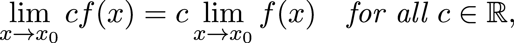

拓扑、极限和连续性

在上一章中，我们学习了所有（与我们相关的）关于数字、序列和级数的知识。这些是微积分的基础对象：数字定义序列，序列定义极限，极限定义了几乎所有我们感兴趣的量。然而，这里有一个难点。让我们往前看，看看导数的定义：

如果你感到有些似曾相识，别感到惊讶。我们在上一章的引言中也看到了这个公式，而且我们离理解它已经更近了。我们已经学习了极限，但似乎存在一个问题：极限是通过序列来定义的，而表达式 lim[x→y]whatever(x)似乎并不是极限的定义。

那么这到底是什么呢？这是我们将在本章学习的内容，从实数的拓扑开始。我们出发吧！

## 第十四章：11.1 拓扑

根据[剑桥英语词典](https://dictionary.cambridge.org/dictionary/english/topology)，"拓扑"一词的意思是

> 某物的各个部分是如何组织或连接的。

从数学角度看，拓扑研究结构和空间的局部属性。

在机器学习中，我们通常关注的是像最小值和最大值这样的全局属性，但我们只有局部工具来寻找它们。一个例子是函数的导数。导数描述了切平面的斜率，正如图 11.1 所示，如果函数在导数求取的点附近发生变化，斜率并不会改变。

图 11.1：如果两个函数在某个点周围的任何小区间内相等，则它们的导数也相等。

在数学中，局部属性是通过序列和邻域来处理的。我们在上一章学习了序列，现在我们将探讨邻域的概念。

我们将关注三个基本方面：

+   开集合和闭集合，

+   集合中序列的行为，

+   以及它们的最小元素和最大元素，上界和下界。

我们进行数学分析的主要目标是理解梯度下降，这是训练模型的基本工具。为了做到这一点，我们需要理解极限。为此，我们需要理解序列和实数，这将把我们带入当前所处的深奥领域。

想象一下，学习 Python 语言和学习 TensorFlow 或 PyTorch 的区别。由于我们想做机器学习，最终我们想学习一个高级框架。然而，如果我们没有掌握 Python 的基本关键字，比如 import 或 def，我们就不准备学习并有效使用这些高级工具。序列、开集合、闭集合、极限等是数学分析的基础构件，而数学分析则是优化的语言。

### 11.1.1 开集合和闭集合

让我们从开集和闭集的讨论开始！(在本章中，当我们提到子集或集合时，隐含假定它是在 ℝ 中。)

定义 45.（开集和闭集）

让 A ⊆ℝ 为实数的子集。

(a) 如果对于每一个 x ∈A，都存在一个 𝜀/span>0，使得 (x−𝜀,x + 𝜀) ⊆A，则 A 是开的。

(b) 如果 A 是闭的，则它的补集 ℝ ∖A 是开的。

在开始分析开集和闭集的性质之前，这里有一些关键示例，以帮助建立有用的思维模型。

示例 1. 形式为 (a,b) = {x ∈ℝ : a/span>x/span>b} 的区间是开的。通过选择任何 x ∈ (a,b) 并令 𝜀 = min{jx −aj∕2,jx −bj∕2}，可以很容易地看出这一点。本质上，我们取距离最近端点的距离并将其减半。任何比距离最近端点的一半还要接近 x 的点也将位于 (a,b) 中。

示例 2. 形式为 [a,b] = {x ∈ℝ : a ≤x ≤b} 的区间是闭的。事实上，它的补集是 ℝ ∖ [a,b] = (−∞,a) ∪ (b,∞)。根据上述推理，很容易看出 (−∞,a) ∪ (b,∞) 是开集。

示例 3. 形式为 (a,b] = {x ∈ℝ : a/span>x ≤b} 的区间既不是开集也不是闭集。要看它不是开的，观察到没有一个包含 b 的区间完全位于 (a,b] 内，因为 b 是端点。出于类似的原因，它的补集 ℝ ∖ (a,b] = (−∞,a] ∪ (b,∞) 也不是开的。

上一个例子中的一个重要结论是，如果一个集合不是闭的，并不意味着它是开的，反之亦然。

我们可以通过引入邻域的概念来重新表述开集的定义。给定点 x 的邻域是包含 x 的开区间 (a,b)。使用这个术语，如果对于任何 x ∈A，存在一个包含 x 的邻域完全位于 A 内，则集合 A 是开的。从这个角度来看，开集意味着从任何点出发，仍然有“活动的空间”。

开集和闭集的最基本性质是它们在并集和交集下的行为。由于这一点适用于任何开集和闭集的集合，我们需要在此引入一种新的符号。回顾一下，如果我们有集合 A[1],…,A[n]，它们的并集可以简写为

交集也可以类似表示。如果我们有可数集，可以写成

如果我们有不可数集合的集合，我们该怎么做呢？假设 ![Ac = [0,c] ](img/file1083.png) 对所有  都成立。在这种情况下，我们使用表达式

对于一般集合 ，我们讨论由  定义的集合，以及其并集/交集

现在，让我们来看第一个定理！

定理 66.

令  为任意集合的集合。

(a) 如果每个  都是开的，则

也是开的。

(b) 如果每个  都是闭集，则

也是闭集。

证明。（a）假设 A[γ], γ ∈ Γ 是开集，并且设 x ∈ ∪[γ∈Γ] A[γ]。因为 x 在并集中，所以存在某个 γ[0] ∈ Γ，使得 x ∈ A[γ[0]]。由于 A[γ[0]] 是开集，因此存在一个以 x 为中心的小邻域 (a,b)，使得 (a,b) ⊆ A[γ[0]]。因此，(a,b) ⊆ ∪[γ∈Γ] A[γ]，这就是我们需要证明的内容。

（b）现在设 A[γ], γ ∈ Γ 是闭集。在这种情况下，德·摩根定律（定理 153）表明，ℝ ∖ (∩[γ∈Γ] A[γ]) = ∪[γ∈Γ] (ℝ ∖ A[γ])。由于每个 A[γ] 都是闭集，因此 ℝ ∖ A[γ] 是开集。正如我们之前所见，开集的并集仍然是开集。

集合的闭合性和开集性影响其在集合序列中的行为。关于这一点的第一个基本结果就是康托尔公理。

定理 67.（康托尔公理）

设 I[n] = [a[n], b[n]] ⊆ ℝ 为一列区间，满足对于每个 n ∈ ℕ，I[n+1] ⊆ I[n]。则交集 ∩[n=1]^∞ I[n] 非空。

这个看似简单的命题是实数的一个深刻特性，最终来源于它们的数学构造。例如，如果我们讨论的是 ℚ 的子集而不是 ℝ，那么康托尔公理就不成立。考虑一个从下方逼近π的有理数序列 a[n] → π，以及一个从上方逼近π的序列 b[n] → π，也就是说，

区间 [a[n], b[n]] 的交集仅包含 π，而 π 不是有理数。因此，在有理数空间中，∩[n=1]^∞ [a[n], b[n]] = ∅，因此康托尔公理在这里不成立。

有一句古老的谚语，说的是因为一颗钉子丢失了战斗。大意是这样的：

> 因为缺少一颗钉子，鞋子丢失了。因为缺少一只鞋，马丢失了。因为缺少一匹马，骑士丢失了。因为缺少一位骑士，消息丢失了。因为缺少一条消息，战斗丢失了。因为缺少一场战斗，王国丢失了。所有这一切都是因为缺少一颗马蹄铁钉。

将康托尔公理看作是马蹄铁中的钉子。没有它，我们无法讨论序列的极限。没有极限，就没有梯度。没有梯度，就没有梯度下降，因此我们无法拟合机器学习模型。

### 11.1.2 距离与拓扑

最初，我们通过类似 (x − 𝜖, x + 𝜖) 这样的开区间定义开集。我们称一个集合为开集，如果对其中的每个点都能找到一个这样的小区间。通过抽象化，我们可以将定义重新表述为范数（定义 7）。

从这个角度看，区间 (x − 𝜖, x + 𝜖) 与一维开球是相同的。给定一个带范数 j ⋅ j 的范数空间 V，半径为 r/span>0 且以 x 为中心的球定义为

等价地，半径为 r 的球体是与中心点距离小于 r 的所有点的集合。在欧几里得空间 ℝ^n 中，使用范数 ∥x∥ = ，这与我们的直观理解相符。此内容在图 11.2 中进行了说明。

图 11.2：球体，从一维到三维

然而，在一维中，欧几里得范数简化为 ∥x∥ = jxj。因此，我们有

我们通常不将区间 (x −𝜀,x + 𝜀) 视为一维球体 B(x,𝜀)。然而，建立这种联系将使得以后将 ℝ 的拓扑扩展到 ℝ^n 变得容易，而这正是我们最终希望工作的地方。

利用范数和球体，我们可以用以下方式重新表述开集的定义。

定义 46.（开集，第二版）

设 A ⊆ℝ 是实数集合的一个子集。

如果对于每个 x ∈A，存在一个以 x 为中心、半径为 𝜀 的一维球体 B(x,𝜀)，使得 B(x,𝜀) ⊆A，则 A 是开集。

因此，从某种意义上说，开集是由开球确定的。

### 11.1.3 集合与序列

闭集可以通过它们的序列来刻画。以下定理给出了闭集的等价定义，为我们提供了一种有用的思考方式。

定理 68.（用序列刻画闭集）

设 A ⊆ℝ 是一个集合。以下是等价的。

(a) A 是闭集。

(b) 如果 {a[n]}[n=1]^∞⊆A 是一个收敛序列，那么 lim[n→∞]a[n] ∈A。

证明。为了证明这两个命题等价，我们需要证明两点：即 (a) 推出 (b)，以及 (b) 推出 (a)。如果你第一次阅读这个证明时觉得它很复杂，不用担心。如果你不能立即理解，建议将 A 看作一个闭区间并画一个图。你也可以跳过这个部分，因为我会在以后的每次需要时再提到这个事实。

首先，我们来看 (a) 如何推导出 (b)。假设 A 是闭集，且 {a[n]}[n=1]^∞ ⊆ A 是一个收敛序列，设 a := lim[n→∞]a[n]。我们需要证明 a ∈A，并且将通过反证法来证明。证明的思路如下：假设 aA，并推导出 {a[n]} 必定最终离开 A。

实际上，假设 a ∈ℝ ∖A。由于 A 是闭集，ℝ ∖A 是开集，因此存在一个小的邻域 (a −𝜀,a + 𝜀) ⊆ℝ ∖A。通俗来说，这意味着我们可以将 a 与 A 分开。这与 {a[n]} ⊆ A 且 a[n] → a 的事实相矛盾，因为根据收敛的定义（定义 39），最终序列中的所有成员都必须落入 (a −𝜀,a + 𝜀) 中。由于产生了矛盾，因此 a ∈A。

其次，我们将证明 (b) 推出 (a)，即如果 A 中每个收敛序列的极限也在 A 中，那么该集合是闭集。我们的目标是证明 ℝ ∖A 是开集。更精确地说，如果 x ∈ ℝ ∖A，我们希望找到一个与 A 不相交的小邻域 (x −𝜀,x + 𝜀)。同样，我们可以通过反证法来证明这一点。

假设无论𝜖 > 0 有多小，我们都可以找到一个 a ∈ A∩(x−𝜖,x+𝜖)。因此，我们可以定义一个序列{a[n]}[n=1]^∞，使得 a[n] ∈A ∩ (x − 1∕n,x + 1∕n)。由于构造过程，lim[n→∞]a[n] = a，而根据前提(b)的规定，A 是闭合的，因此这意味着 a ∈A，这与假设矛盾。这就是我们需要证明的内容。

这个结果也解释了“闭集”术语的来源。闭集之所以被称为“闭集”，是因为它对极限是闭合的。

### 11.1.4 有界集合

从一个（非常）高层次的角度来看，机器学习可以被描述为一个优化问题。对于输入 x 和预测 y，我们考虑一个参数化的函数族 f(x,w)，其中我们的参数集中在变量 w 中。

给定一组样本和观察值，我们的目标是找到这个集合的最小值。

{Loss(*f*(**x**, **w**), **y**) : **w** ∈ ℝ^(一个非常大的数字)} ⊆ ℝ, (11.1)

以及参数配置 w，其中最优解达到。为了确保我们的基础不缺少这一构建块，我们将花些时间研究这个问题。

定义 47\. （有界集合）

设 A ⊆ℝ。

(a) 如果存在一个 m ∈ ℝ，使得对于所有 x ∈ A 都有 m ≤ x，则称 A 从下方有界。这个值 m 称为下界。

(b) 如果存在一个 M ∈ ℝ，使得对于所有 x ∈ A 都有 x ≤ M，则称 A 从上方有界。类似之前，M 称为上界。

(c) 如果一个集合从上界和下界都有界，则称其为有界的。

有界意味着我们可以将该集合包含在一个大区间[m, M]中。对于优化问题，有一些与界限相关的重要量：最小和最大元素、最小上界和最大下界。

让我们从形式化集合中最小和最大元素的概念开始。

定义 48\. （最小元素和最大元素）

设 A ⊆ℝ。

(a) 如果对于每个 a ∈ A，都有 m ≤ a，那么 m ∈ A 称为 A 的最小元素。最小元素记作 m = minA。

(b) 如果对于每个 a ∈ A，都有 a ≤ M，那么 M ∈ A 称为 A 的最大元素。最大元素记作 M = maxA。

如常见，让我们看一些例子。

示例 1\. 集合 A = [0,1] ∪ [2,3]既有最小元素，也有最大元素。它的最小元素是 0，最大元素是 3。

示例 2\. 集合 A = { : n ∈ℕ}没有最小元素。0 是最大的下界，但由于它不在集合中，因此不是最小元素。

关键的结论是，最小元素和最大元素不一定存在。为了避免不便，我们需要一些始终存在的相关量。

这些将是下确界和上确界。

定义 49\. （下确界和上确界）

设 A ⊆ℝ。

(a) inf A ∈ℝ是 A 的最大下界，如果对于每个下界 m 都有 m ≤ inf A。这个值叫做下确界。

(b) supA ∈ℝ是 A 的最小上界，如果对于每个上界 M，都有 M ≥ supA。这个值叫做上确界。

我们在这里不打算深入讨论，但下确界和上确界总是存在的。然而，必须注意的是，存在一个序列 {a[n]}[n=1]^∞ ⊆ A，使得 a[n] → inf A。（对上确界同样成立。）

### 11.1.5 紧致集

通过下确界和上确界的概念，我们可以将机器学习中的优化问题形式化，描述为(11.1)：

其中，这个数字表示损失函数的最小可能值，而 w 是我们模型的参数。

然而，w ∈ ℝ^n 部分存在一个显著问题。首先，我们的参数空间是高维的。在实际应用中，n 可能达到百万级别。除此之外，我们正在处理一个无界的参数空间，在这个空间中，可能根本不存在这样的最优解。最后，是否存在一个参数 w 使得下确界得以实现？毕竟，这正是我们最关心的问题。

我们可以将参数空间限制在一个闭且有界的集合上，以解决这些问题。这些集合非常常见，以至于有了专门的名称：紧致集。

定义 50. （紧致集）

集合 A ⊆ ℝ 是紧致的，当且仅当它是有界的并且是闭集。

我们喜欢紧致集。尽管它们的定义看似简单，但这两条性质对于优化有着深远的影响。目前，我们还不准备详细讨论这个问题，但实际上我们可以在紧致集上找到最小值或最大值，因为连续函数在紧致集上表现得很好。

关于紧致集有一个关键结果，它将在我们研究函数的过程中不断浮现：博尔扎诺-魏尔施特拉斯定理。

定理 69. （博尔扎诺-魏尔施特拉斯定理）

在紧致集中，每个序列都有一个收敛的子序列。

证明。设 A ⊆ ℝ 是一个紧致集，{a[n]}[n=1]^∞ 是 A 中的一个任意序列。

因为 A 是紧致的，存在一个区间 I[1] := [m, M]，它包含 A 的所有元素。通过将这个区间一分为二，我们得到 [m, (m+M) / 2] 和 [(m+M) / 2, M]。至少有一个区间包含 {a[n]} 中的无限多个点；设该区间为 I[2]。重复这个过程会得到一系列闭区间 I[1] ⊇ I[2] ⊇ I[3] ……。区间 I[k] 的长度是 (M − m) / 2^(k − 1)，因此这些区间最终会变得非常小。

由于这些区间的构造，我们还可以通过选择 a[n[k]] 使得 a[n[k]] ∈ I[k] 来定义一个子序列 {a[n[k]]}[k=1]^∞。

根据康托尔公理（定理 67），∩[k=1]^∞ I[k] 是非空的，所以设 a ∈ ∩[k=1]^∞ I[k]。由于 a[n[k]] 和 a 都是 I[k] 的元素，我们有：

这表明 lim[k→∞] a[n[k]] = a，这正是我们需要证明的。

我们在这里使用的技巧叫做“捕狮术”。一个数学家如何在沙漠中捕捉一只狮子？通过将沙漠一分为二。狮子将位于其中的一半。这个区间可以不断对半切割，直到面积变得非常小。最终，狮子就会被困在其中。

现在我们理解了实数的拓扑结构以及与收敛序列的关系，我们可以继续讨论函数的极限！

## 11.2 极限

回顾在章节 10.2 中关于序列的内容，我们定义了收敛序列的极限。从直观上看，极限捕捉了这样一个概念：最终，所有元素都可以接近极限值到任意精度。这个概念也可以扩展到函数。

定义 51.（函数的极限）

令 f : ℝ →ℝ 为任意函数。我们说

如果对于每个序列 x[n] →x[0]，其中所有 n 的 x[n] 不等于 x[0]，

继续成立。

首先，有两件事需要注意。

1.  函数的极限是通过序列的极限来定义的。如果所有可能的序列 {f(x[n])}，其中 x[n] → x[0]，都具有相同的极限，则 lim[x→x[0]]f(x) 定义为这个共同的极限。

1.  对于无穷大发散的序列，定义 ±∞ 处的极限。

这里有一张帮助可视化该过程的图。

图 11.3：极限的说明：当 x[n] 越来越接近 0 时，f(x[n]) 越来越接近 lim[n→∞]f(x[n])

为了进一步说明函数极限的概念，下面是一些例子。

示例 1. 定义函数

如图 11.4 所示。换句话说，f(x) 在 0 处为 1，其他地方为 0。

图 11.4：f(x) 的图像

lim[x→0]f(x) 是否存在？是的。因为对于任意不为 0 的序列 x[n] → 0，极限 lim[n→∞]f(x[n]) = 0。另一方面，注意到 lim[x→0]f(x)≠f(0)。

示例 2. 对于我们的第二个例子，定义

.png)(11.2)

这是著名的（或不太著名的）狄里希雷函数，难以想象且无法绘制图像：它在有理数时取值为 1，在无理数时取值为 0。毫不奇怪，lim[x→x[0]]D(x) 对于所有 x[0] 都不存在，因为有理数和无理数是“稠密的”：每个数 x[0] 都可以通过有理数和无理数的极限得到。

由于函数的极限是作为序列的共同极限来定义的，因此它的许多性质来自于序列。序列在运算下的行为（定理 57）决定了函数极限的行为。

定理 70.（运算与极限）

令 f 和 g 为两个函数。

(a)

(b)

(c)

(d) 如果在某小区间 (x[0] − 𝜖,x[0] + 𝜖) 内，f(x)≠0，且 lim[x→x[0]]f(x)≠0，那么

证明：这直接来自定理 57。

类似于我们在收敛序列中看到的，(a) 和 (b) 被称为极限的线性。

记得大 O 和小 o 符号（定义 41）是如何表示序列的渐近性质的吗？我们对于函数也有类似的工具。

定义 52.（函数的大 O 和小 o 符号）

设 f : ℝ →ℝ 和 g : ℝ →ℝ 为任意函数。我们说

(a) 当 x → a 时，g(x) = O(f(x)) 如果存在一个常数 C，使得对于某个 δ >0，所有 x ∈ (a −δ, a) ∪ (a, a + δ) 中都有 |g(x)| ≤ C |f(x)|。类似地，当 x →∞ 时，g(x) = O(f(x)) 如果存在一个常数 C 和一个截断数 N，使得对于所有 x > N，都有 |g(x)| ≤ C |f(x)|。

(b) 当 x →a 时，g(x) = o(f(x)) 如果对于任意 𝜖 >0，都存在一个 δ >0 使得对于所有 x ∈ (a−δ,a) ∪ (a,a + δ)，都有 |g(x)| ≤ 𝜖 |f(x)|。类似地，当 x →∞ 时，g(x) = o(f(x)) 如果对于任意 𝜖 >0，都存在一个截断数 N，使得对于所有 x > N，都有 |g(x)| ≤ 𝜖 |f(x)|。

### 11.2.1 极限的等价定义

如果你眼光敏锐（并且有一定的数学经验），你可能已经提出了这样一个问题：对于所有序列 x[n] → x[0]，证明 {f(x[n])} 的收敛性会不会很困难？

事实上，考虑函数极限时，这通常不是最方便的思考方式。另一种等价的定义是通过描述围绕给定点越来越小的邻域来表达极限。

定理 71.（极限作为误差项）

设 f : ℝ →ℝ 为任意函数，且 x[0] ∈ℝ。那么，以下等价。

(a) lim[x→x[0]]f(x) = a。

(b) 对于每个 𝜖 >0，存在一个围绕 x[0] 的小邻域 (x[0] −δ, x[0] + δ)，使得对于每个 x ∈ (x[0] −δ, x[0]) ∪ (x[0], x[0] + δ)，

成立。

证明。（a）⇒（b）。我们将采用间接证明法，因此假设（a）成立而（b）不成立。（b）的否定表明存在一个 𝜖 >0，使得对于每个 δ >0，都有一个 x ∈ (x[0] −δ, x[0]) ∪ (x[0], x[0] + δ)，使得 |f(x) −a| ≥ 𝜖。（如果你不明白为什么这是否定，查阅附录 A 中关于逻辑的内容。）

现在我们定义一个序列来与 (a) 矛盾。如果我们选择 δ = 1∕n，可以让 x[n] 位于 (x[0] −δ, x[0]) ∪ (x[0], x[0] + δ) 中，使得 |f(x[n]) −a| < 𝜖，这一点由我们假设 (b) 错误所保证。由于该序列的构造，{f(x[n])}[n=1]^∞ 不收敛于 a。这与 (a) 矛盾，从而完成了我们的间接证明。

(b) ⇒ (a)。设 {x[n]}[n=1]^∞ 是一个收敛于 x[0] 的任意序列。如果 n 足够大（即大于某个截断指数 N），则 x[n] 会落入 (x[0] −δ, x[0] + δ)，其中 δ >0 是任意小常数。由于 (b) 表明对于所有这样的 n 都有 |f(x[n]) −a| < 𝜖，按照收敛的定义（定义 39），我们有 lim[n→∞]f(x[n]) = a。

用简单的英语来说，这个定理表明，如果 x 足够接近 x[0]，那么 f(x) 会无限接近 lim[x→x[0]]f(x)。类似于 (b) 的定义称为 epsilon-delta 定义。

还有另一个等价的定义，尽管看似微不足道，但在思考极限时，它是一个有用的思维模型。

定理 72.

设 f : ℝ →ℝ 为任意函数，x[0] ∈ℝ。则，以下是等价的。

（a） lim[x→x[0]]f(x) = a。

（b）存在一个函数 error(x)，使得 lim[x→x[0]]error(x) = 0 并且

证明。（a）⇒（b）。由于极限在操作上的行为（定理 70），很容易看出

满足要求。

（b）⇒（a）。同样，由于极限操作的线性，这一点也显而易见：

这就是我们要证明的。

通常，我们不需要知道函数的确切极限；知道极限在某个特定的上下界之上或之下就足够了。

为了给出一个具体的例子，我们将稍微提前谈一下微分。我将在下一章详细解释所有内容，但函数 f 在点 x[0] 处的导数定义为极限

如果函数是递增的，我们有

由于我们接下来要看到的内容，这意味着导数是正的。

不再废话，让我们看看结果！

定理 73.（函数的转移原则）

设 f : ℝ → ℝ 为任意函数。如果对于所有 x ∈ (a −δ,a) ∪ (a,a + δ) 和某个常数 δ/span>，以及 α ∈ℝ 的下界，f(x) ≥ α，则当极限存在时，lim[x→a]f(x) ≥ α。

证明。由于函数极限的定义，这是收敛序列的转移原则（定理 58）的直接结果。

有几个特殊的极限经常出现在计算中。这些是计算更复杂极限的基础，因为它们通常可以简化为已知极限的形式。

我们不会在这里包含证明，因为它们对我们理解机器学习算法的目的并没有太大帮助。

定理 74.（a）

lim[*x*→0] sin x x = 1. (11.3)

（b）

lim[*x* → 0] *x* log *x* = 0. (11.4)

（c）

lim[*x* → ∞] *x*^k e^(−ax) = 0, a ∈ (0, ∞), k = 0, 1, 2, … (11.5)

随着极限从序列扩展到函数，我们看到，如果极限存在，它不一定等于函数在给定点的值。然而，当它存在时，函数就变得更容易处理。这称为连续性，接下来我们将讨论这个问题。

## 11.3 连续性

如果我让你从脑海中想出一个随机函数，我几乎可以确定你会想出一个既连续又可微的函数。（除非你有奇怪的口味，像许多数学家一样）。

然而，绝大多数函数既不是连续的也不是可微的。从基数的角度来看，如果你计算所有实数函数 f : ℝ→ℝ，结果表明总共有 2^c 个函数，但其中连续的子集的基数是 c。很难想象这样的数量：c 和 2^c 都是无限的，但，嗯，2^c 比 c 更无限。是的，我知道。集合论很奇怪。（回想一下，c 表示实数集合的基数。如果你想复习这个话题，可以查阅集合论附录 C。）

总的来说，正如我们将看到的，连续性和可微性使我们能够对函数进行有意义的操作。例如，通常基于梯度下降的神经网络优化方法，如果损失函数和层不是可微的，就无法工作。仅这一点就足以使机器学习的齿轮卡住，因为在该领域的深度学习部分中，这种方法被频繁使用。

本节探讨这些概念如何协同工作，并最终使我们能够训练神经网络。因此，让我们直接跳入深水区，精确定义连续性的概念！

定义 53\.（连续性）

设 f : ℝ →ℝ为任意函数。我们说 f 在 a 处连续，当且仅当

成立。

换句话说，连续性意味着如果 x 接近 y，那么 f(x)也会接近 f(y)。这就是我们大多数心智模型的工作方式。这也是我们希望许多机器学习模型具备的特性。例如，如果 f 是一个模型，它接受图像并判断其中是否有猫，我们希望在改变 x 的几个像素之后，预测结果保持不变。（然而，一般来说，情况并非如此，这被某些对抗性攻击所利用。）

我们可以通过展开极限来重新表述上述定义。如果你稍加思考，就会发现 f 在 a 处连续等价于

对于所有收敛序列 a[n] →a。换句话说，极限和函数应用是可以互换的。我们将非常频繁地使用这一点。

和往常一样，我们首先会看到一些例子。我们将回顾在第 11.2 节中看到的例子。

示例 1\. 让我们重新回顾一下

尽管 f(x)在 0 处不连续，因为 lim[x→0]f(x) = 0≠f(0)，但正如我们之前所见，f(x)在其他地方是连续的（因为它是常数 0）。

注意，尽管该函数在 0 处不连续，但极限是存在的！

示例 2\. 那么 Dirichlet 函数 D(x)怎么样？（见 11.2 节中的定义。）由于极限甚至不存在，它根本不是连续函数。

示例 3\. 定义

令人惊讶的是，f(x) 在 0 处连续，但在其他地方都不连续。正如你所看到的，关于连续性，几乎没有什么是不可行的。一般来说，函数可以是复杂的对象，没有一定的规律性条件，优化它们是非常困难的。本章的核心目标是理解我们如何在训练机器学习模型时优化这些函数。

最后一个例子！

示例 4\. 我们称一个函数为初等函数，如果它可以通过有限次的求和、乘积和组合得到。

+   常数函数，

+   幂函数 x, x², x³,…，

+   n 次根函数 x^(1∕2), x^(1∕3), x^(1∕4),…，

+   指数函数 a^x，

+   对数函数 log [a]x，

+   三角函数和反三角函数 sinx, cosx, arcsinx, arccosx，

+   双曲函数和反双曲函数 sinhx, coshx, sinh^(−1)x, cosh^(−1)x。

例如，

是一个初等函数。初等函数在其定义域内都是连续的。这对我们来说非常有用，因为仅通过定义来展示像 f(x) 这样复杂函数的连续性是困难的。这样，如果它是初等的，我们知道它是连续的。这对多元函数（如神经网络）也同样适用。

### 11.3.1 连续函数的性质

数学中的典型模式，正如你在讨论收敛序列的性质时所看到的定理 57，是首先研究基本构建块的某些属性，然后展示它们在操作下的表现。

我们将按照与前一个示例类似的模式，讨论初等函数的连续性。

定理 75\。

设 f 和 g 为两个函数。

(a) 如果 f 和 g 在 a 处连续，则 f + g 和 fg 也在 a 处连续。

(b) 如果 f 和 g 在 a 处连续，且 g(a)≠0，则 f∕g 也在 a 处连续。

(c) 如果 g 在 a 处连续，且 f 在 g(a) 处连续，则 f ∘ g 也在 a 处连续。

证明：(a) 和 (b) 直接来自极限的性质（定理 70）。

为了看清 (c)，我们只需令 {a[n]}[n=1]^∞ 是一个收敛到 a 的序列。然后，假设 f 在 g(a) 处连续，且 g 在 a 处连续，我们有：

这显示了 f ∘ g 在 a 处的连续性。

到目前为止，我们只定义了单点的连续性。一般来说，函数 f : ℝ →ℝ 在集合 A 上连续，当且仅当它在集合 A 的每个点上连续。

我们已经到达了一个部分解释我们为何喜爱连续函数和紧集的点。

原因很简单：在紧集上连续的函数在该集合内有界并且能达到它们的最优值。

定理 76\。

设 f 在紧集 K 上连续。存在 α, β ∈K，使得对于所有 x ∈K，f(α) ≤ f(x) ≤ f(β)。

设 {α[n]}[n=1]^∞ ⊆ K 是一个序列，使得 f(α[n]) → inf{f(x) : x ∈K}。（由于下确界和上确界的性质，这一定存在。）

现在，根据博尔扎诺-魏尔施特拉斯定理（定理 69），{α[n]}[n=1]^∞ 有一个收敛的子序列 {α[n[k]]}[k=1]^∞，且 lim[k→∞]α[n[k]] = α。由于 K 是紧的，α ∈K。（回想一下，紧集是闭集，且闭集包含其收敛序列的极限，正如定理 68 所暗示的。）

因为 f 是连续的，我们有

这正是我们需要证明的。通过相同的论证，可以证明存在一个 β ∈K，使得对所有 x ∈K，f(x) ≤ f(β)。

这个命题对于那些不是闭合且有界的集合不成立。例如，f(x) =  在(0,1]上是连续的，但没有上界。

## 11.4 总结

我承认，拓扑、极限和连续性的细节可能显得复杂和抽象。然而，根据我的经验，走最难的路往往是最有收获的，尤其是在学习技术性话题时。总之，我们已经学到了

+   什么是拓扑，

+   它与序列和极限有什么关系，

+   如何求取函数的极限，

+   最后，什么是连续函数。

现在，我们已经掌握了上述所有内容，准备好攻克机器学习核心内容之一：微分。我们将研究如何分析函数以及什么样的函数“表现良好”。

如果你仔细思考机器学习的本质，你会发现从宏观角度来看，它其实非常简单。实质上，我们想做的就是：1. 设计参数化函数来解释数据和观察之间的关系；2. 找到最适合我们数据的参数。

为了找到既具有表达能力又易于处理的模型，我们需要将自己限制在满足某些性质的函数中。最重要的两个性质是连续性和可微性。既然我们已经了解了什么是连续函数，我们可以继续学习可微函数。

在接下来的章节中，我们将专门讨论单变量实函数。这样做是为了引入概念，而不一次性增加太多复杂性。在后续章节中，我们会逐步转向多变量函数，到机器学习部分时，我们将掌握它们的使用。

## 11.5 问题

问题 1。以下哪些 ℝ 的子集是开集、闭集，或者既不是开集也不是闭集？

（a）ℤ （b）ℚ （c）∩[n=1]^∞(−,) （d）∪[n=1]^∞0,1 −![1 n]

问题 2。设  是一个任意集合。证明存在一个序列 ，使得

（对  也成立，并且可以通过相同的方式证明。）

问题 3。设 D(x) 为狄利克雷函数，定义为

给出一个数学上严格的证明，证明对于任何 x[0] ∈ ℝ，极限 lim[x→x[0]]D(x) 不存在。

问题 4\. 设 X 为任意集合，且 τ ⊆ P(X) 为其子集的集合。（回顾一下，P(A) 表示 A 的所有子集。）结构 (X, τ) 称为拓扑空间，如果

1.  ∅∈τ 且 X ∈τ，

1.  对于 τ 中的任何集合，其并集也在 τ 中。

1.  对于 τ 中的任何有限集合，其交集也在 τ 中。

τ中的集合称为开集。证明以下是拓扑空间。

(a) X 是任意集合，τ = {∅, X}。 (b) X 是任意集合，τ = P(X)。 (c) (ℕ, τ)，其中 τ = {S ⊆ ℕ : 0τ}。

问题 5\. 设 f : ℝ → ℝ 为任意函数。证明 f 在 x[0] 处连续当且仅当对于每个 𝜖/span>0，存在 δ/span>0，使得对于任意 x ∈ (x[0] − δ, x[0] + δ)，|f(x) − f(x[0])|/span>𝜖。

上述是连续性的等价定义，称为ε-δ定义。

问题 6\. 设 f : ℝ → ℝ 为任意函数。证明 f 在每个点处连续当且仅当下述集合

对于每个开集 X 都是开集！

## 加入我们的 Discord 社区

阅读本书，与其他用户、机器学习专家以及作者本人一起讨论。提问，向其他读者提供解决方案，参加“问我任何问题”环节，与作者互动，更多精彩内容等你来参与。扫描二维码或访问链接加入社区。[`packt.link/math`](https://packt.link/math)

