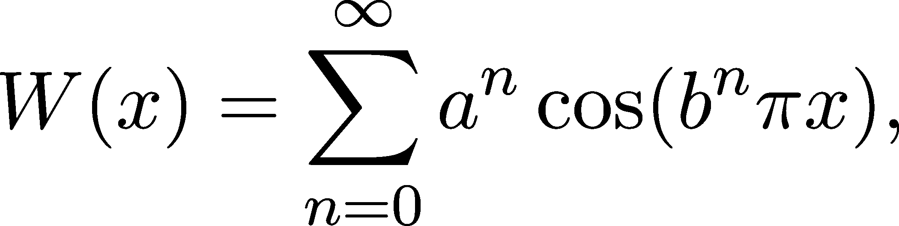
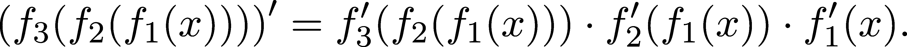
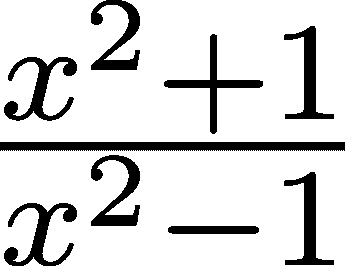

微分

> 我转身，充满恐惧和恐慌，远离这个没有导数的连续函数的悲惨灾难。
> 
> — 查尔斯·埃尔米特

在科学史上，很少有里程碑像发明轮子一样具有重要意义。在这些里程碑中，微分尤为突出。随着微积分的发明，牛顿创造了我们今天所知的力学。微分在科学和工程中无处不在，事实证明，它也是机器学习的关键组成部分。

为什么？因为优化！事实证明，函数的极值点可以通过其导数来表征，而这些极值点可以通过梯度下降法反复找到。

在本章中，我们将学习微分是什么，它的起源是什么，以及最重要的，如何在实践中使用它。让我们开始吧！

## 第十五章：12.1 理论中的微分

在直接进入数学定义之前，让我们先从一个简单的例子开始：一个沿直线运动的质点。它的运动完全由时间-距离图（图 12.1）描述，该图展示了它在某一时刻离起点的距离。


图 12.1：我们运动物体的时间-距离图

我们的目标是计算物体在某一时刻的速度。在高中时，我们学到：


为了将其转化为定量形式，假设 f(t) 表示时间-距离函数，t[1] 和 t[2] 是任意的两个时间点，那么


像  这样的表达式被称为微分商。请注意，如果物体是倒退的，则平均速度为负值。（与速度不同，速度总是正值。速度包括速率和方向。）

平均速度有一个简单的几何解释：如果你将物体的运动替换为一个恒定速度的运动，且该速度与平均速度相同，你最终将到达完全相同的位置。从图形的角度来看，这等同于用一条直线连接 (t[1], f(t[1])) 和 (t[2], f(t[2]))。

平均速度就是这条直线的斜率。图 12.2 直观地展示了这一点。


图 12.2：t[1] 和 t[2] 之间的平均速度

鉴于此，我们可以计算在某一时间点 t 上的精确速度，我们将其表示为 v(t)。这个思想很简单：如果 Δt 足够小，那么在 t 和 t + Δt 之间的小时间间隔内的平均速度应该越来越接近 v(t)。（Δt 也可以是负值。）

所以，

v(t) = lim[Δt → 0] (f(t + Δt) - f(t)) / Δt, (12.1)

如果上述极限存在。图 12.3 说明了由 (12.1) 定义的极限。在那里，我们可以看到，随着 Δt 越来越接近 0，连接 (t, f(t)) 和 (t + Δt, f(t + Δt)) 的直线的斜率也越来越接近切线的斜率。


图 12.3：在 t 时刻近似速度

根据我们的几何直觉，我们看到 v(t) 就是 f 在 t 时刻的切线斜率。记住这一点后，我们准备介绍正式定义。

定义 54.（可微性）

设 f : ℝ →ℝ 为任意函数。我们说 f 在 x[0] ∈ℝ 处是可微的，当且仅当极限


存在。如果存在，这被称为 f 在 x[0] 处的导数。

换句话说，如果 f 描述的是一个物体运动的时间-距离函数，那么导数就是物体的速度。

类似于连续性，可微性是局部性质。然而，我们更关注的是那些几乎到处都可微的函数。在这些情况下，导数是一个函数，通常记作 f^′(x)。

有时会让人困惑的是，x 既可以表示 f 的自变量，也可以表示求导数时的具体点。以下是一个快速的术语表，用于澄清导数和导数函数之间的区别。

+   (x[0])：f 关于变量 x 在点 x[0] 处的导数。这是一个标量，通常记作 f^′(x[0])。

+   ：f 关于变量 x 的导数函数。这是一个函数，通常记作 f^′。

注释 9.（极限中的变量）

不要被符号的变化从 t 和 t + Δt 到 x[0] 和 x 所困惑；定义导数的极限与之前完全相同：


另外需要注意的是


有时，我们甚至可能使用 x 和 y 来代替 x[0] 和 x，写成


我们会使用更方便的表示方式。

让我们来看一些例子！

示例 1. f(x) = x。对于任意的 x，我们有


因此，f(x) = x 在每一点都是可微的，它的导数是常数函数 f^′(x) = 1。

示例 2. f(x) = x²。在这里，我们有


所以，f(x) = x² 在每一点都是可微的，且 f^′(x) = 2x。稍后，当我们讨论初等函数时，我们将看到更一般的情况 f(x) = x^k。

示例 3. f(x) = |x| 在 x = 0 处。对于这个例子，我们有


因为


这个极限不存在，如图 12.4 所示。这是我们第一个非可微函数的例子。然而，|x|在其他地方是可微的。

在这里画一张图来增强我们对可微性的理解是值得的。回忆一下，某一点的导数值等于函数图像的切线斜率。

由于 jxj 在 0 处有尖锐的拐角，切线不定义。


图 12.4：f(x) = jxj 在 0 处的切平面

可微分性意味着图形中没有尖锐的拐角，因此可微函数通常被称为光滑函数。这是我们更喜欢可微函数的原因之一：变化率是可控的。

接下来，我们将看到微分的等价定义，涉及到用线性函数进行局部近似。从这个角度看，可微分性意味着可控的行为：没有皱纹、角落或剧烈的值变化。

### 12.1.1 微分的等价形式

要真正理解导数和微分，我们将从另一个角度来看待它：局部线性近似。

近似是数学中的一个非常自然的概念。比如，你有没有想过当你在计算器中输入 sin(2.18) 时会发生什么？我们无法用有限次加法和乘法表达 sin 函数，因此我们必须对其进行近似。实际上，我们使用形式为的函数


这些可以很容易地计算出来。它们被称为多项式，它们只是有限次加法和乘法的组合。

我们能否仅通过将函数替换为多项式来简化计算？（即使这以失去完美精度为代价。）

事实证明我们可以这么做，微分是其中的一种方法。从本质上讲，导数描述了用线性函数进行的最佳局部近似。

以下定理使这一点变得清晰。

定理 77. （作为局部线性近似的微分）

设 f : ℝ → ℝ 为任意函数。以下是等价的。

(a) f 在 x[0] 处可微。

(b) 存在一个 α ∈ ℝ 使得

f(x) = f(x₀) + α(x − x₀) + o(|x − x₀|) *当* x → x₀。 (12.2)

回想一下，小 O 符号（见定义 52）意味着该函数在 x[0] 附近比函数 |x − x[0]| 小一个数量级。

如果存在，上述定理中的 α 就是导数 f^′(x[0])。换句话说，f(x) 可以局部写成

f(x[0]) + f′(x[0])(x − x[0]) + o(|x − x[0]|)。 (12.3)

证明。为了证明两个陈述的等价性，我们必须证明微分意味着所需的属性，反之亦然。虽然这看起来可能复杂，但其实是直接的，并且完全取决于函数如何可以写成它们的极限加上一个误差项（定理 71）。

(a) ⇒ (b)。极限的存在


这意味着我们可以将近似切线的斜率写成


其中 lim[x→x[0]]error(x) = 0。

通过一些简单的代数运算，我们得到


由于误差项随着 x 接近 x[0] 而趋近于零，误差(x)(x − x[0]) = o(|x − x[0]|)，这就是我们想要证明的。

(b) ⇒ (a)。现在，按照我们之前所做的，只是倒过来。我们可以重写


形式为


根据我们之前使用的知识，这意味着


所以，f 在 x[0] 处可微，且其导数为 f^′(x[0]) = α。

这种形式的一个巨大优势是它可以很容易地推广到多变量函数。尽管我们离此还有很长一段距离，但可以先窥见一二。多变量函数将向量映射到标量，因此比例


甚至无法定义。（因为我们不能用向量进行除法。）然而，表达式


完全有意义，因为 ∇f(x[0])^T (x −x[0]) 是标量。这里，∇f(x[0]) 表示 f 的梯度，即导数的多变量版本。∇f(x[0]) 是一个 n 维向量。如果你不熟悉这种符号，别担心，我们会在适当的时候讲解。重点是，这种替代定义将来对我们更为方便。

局部最佳近似思想的另一个优势是，定理 77 可以推广到更高阶的导数。

请看以下定理。

定理 78\. （泰勒定理）

设 f : ℝ →ℝ 是在 x[0] 处 n 次可微的函数。那么


成立，其中 f^((k))(x[0]) 表示 f 在 x[0] 处的第 k 阶导数。

（注意，零阶导数 f^((0)) 等于 f。）

换句话说，定理 78 表示，如果 f 可以足够多次微分，它可以表示为一个多项式加上一个小的误差项。对于无限可微的函数，泰勒定理产生了著名的泰勒展开式。

定义 55\. （泰勒展开式）

设 f : ℝ → ℝ 是在 x[0] 处可无限次微分的函数。由下式定义的级数


称为 f 在 x[0] 处的泰勒展开。

举个例子，因 (e^x)^′ = e^x，所以 e^x 在 0 处的泰勒展开式为


注意，等式符号并非偶然：e^x 的泰勒展开式等于 e^x！(这并非总是如此。)现在我们看到为什么 e = ∑ [k=0]^∞，如我们在讨论数列与级数时所暗示的那样。

换句话说，


这意味着，在任意区间 [ −α,α] 上，对于任何任意小的 𝜖/span>0，


当 n 足够大时，成立。实际上，这个多项式被用来近似 e^x 的值。

### 12.1.2 微分与连续性

如下定理所述，微分是比连续性更严格的条件。

定理 79\.

可微函数是连续的。

如果 f : ℝ → ℝ 在 a 处可微，那么它在该点也是连续的。

证明。我们将使用定理 77 来证明这个结果。根据一般形式（12.2），我们得到：


这表明 f 在 x[0] 处是连续的。

请注意，前面的定理并不是反过来成立的：一个函数可以是连续的，但并不是可微的。（正如 f(x) = jxj 在 x = 0 处的例子所示。）

这可以推到极限：存在一些函数在每一点上都是连续的，但在任何地方都不可微。第一个例子是由魏尔斯特拉斯提供的（来自博尔扎诺-魏尔斯特拉斯定理）。该函数本身由无限和式定义：



其中 a ∈ (0,1)，b 是一个正奇数，且 ab/span>1 + 3π∕2\。

我同意，这个定义看起来完全随机，您可能会想：作者是怎么想到这个的？为了理解这个函数，想象它是多个余弦波的叠加，每个波的振幅越来越小，但频率越来越高。记住，微分意味着“没有尖角”吗？这个定义在实数线上的每个点上都放置了一个尖角。

它的图形是一条具有自相似性的分形曲线，如下所示。


图 12.5：魏尔斯特拉斯函数的图形。来源：[`en.wikipedia.org/wiki/Weierstrass_function`](https://en.wikipedia.org/wiki/Weierstrass_function)

这样的例子启发了本节的开头引述：

> 我从这个可悲的无导数连续函数的祸害中，满怀恐惧和惊恐地转过身来。 — 查尔斯·埃米特

19 世纪的数学家们显然没有太多关注不可微函数。然而，这类函数的数量远远超过了可微函数。我们不会深入讨论这一点，但在所有连续函数中，至少在一个点可微的函数集合是稀疏的。稀疏是一个专业的术语，虽然我们不需要确切理解它的含义，但它的名字暗示它是极其小的。

现在我们理解了什么是导数，是时候将理论付诸实践了。我们如何计算导数，又如何在机器学习中使用它们呢？我们将在下一节中看到。

## 12.2 实践中的微分

在我们第一次接触微分时，我们看到通过定义计算导数


在实际操作中，如果遇到复杂的函数，如 f(x) = cos(x)sin(e^x)，微分可能会非常困难。类似于收敛序列和极限，使用微分定义是无法快速解决的——复杂性迅速堆积。因此，我们必须找到方法将复杂性分解为其基本构件。

### 12.2.1 导数的规则

首先，我们将看看最简单的几种操作：标量乘法、加法、乘法和除法。

定理 80.（微分法则）

令 f : ℝ → ℝ 和 g : ℝ → ℝ 为两个任意函数，且令 x ∈ ℝ。假设 f 和 g 在 x 处都可微。则

(a) (cf)^′(x) = cf^′(x)，对所有 c ∈ℝ成立。

(b) (f + g)^′(x) = f^′(x) + g^′(x)，

(c) (fg)^′(x) = f^′(x)g(x) + f(x)g^′(x)（乘积法则），

(d) ()^′(x) = ，当 g(x)≠0 时（商法则）。

证明：（a）和（b）是定理 70 的直接结果。

为了证明(c)，我们需要做一些代数运算：

![lim f(x)g(x)−-f-(y)g(y)-= lim f(x)g(x)−--f(y)g-(x-)+-f(y)g(x)−-f-(y)g(y)- y→x x − y x→y x − y f(x)g(x)− f(y)g (x ) f(y)g(x)− f (y)g (y) = lyim→x -------x−--y-------+ lxi→my -------x−-y-------- = lim [f(x)−-f(y)g(x)]+ f (y ) lim g(x)−-g(y)- y→x x − y x→y x − y = f′(x)g(x)+ f(x)g′(x), ](img/file1188.png)

从中可以得到(c)。

对于(d)，我们将从(1∕g)^′的特例开始。我们有


从中，通过对 f 和 1∕g 应用(c)，可以得到一般情况。

有一种操作我们在之前的定理中没有涉及：函数复合。在神经网络的研究中，复合起着至关重要的作用。每一层都可以看作一个函数，这些函数组合在一起形成整个网络。

定理 81.（链式法则/莱布尼茨法则）

令 f : ℝ→ℝ 和 g : ℝ→ℝ 为两个任意函数，且令 x ∈ ℝ。假设 g 在 x 处可微，且 f 在 g(x)处可微。则


保持不变。

证明：首先，我们将微分商重写成以下形式：


因为 g 在 x 处可微，它在该点也是连续的，因此 lim[y→x]g(y) = g(x)。因此，第一项可以重写为


由于 g 在 x 处可微，第二项是 g^′(x)。因此，我们有


这就是我们需要证明的内容。

由于神经网络本质上是由大量复合函数组成的，其导数是通过反复应用链式法则来计算的。（虽然它的各层导数是向量和矩阵，因为它们是多变量函数。）

### 12.2.2 初等函数的导数

按照已经熟悉的模式，现在我们计算最重要的类别的导数：初等函数。有一些是我们经常遇到的，比如均方误差、交叉熵、Kullback-Leibler 散度等。

定理 82。（基本函数的导数）

(a) (x⁰)^′ = 0 和 (x^n)^′ = nx^(n−1)，其中 n ∈ℤ ∖ 0，

(b) (sinx)^′ = cosx 和 (cosx)^′ = −sinx，

(c) (e^x)^′ = e^x，

(d) (log x)^′ = 。

你不一定要知道如何证明这些。我将包括（a）的证明，但如果这是你第一次接触微积分，完全可以跳过它。你需要记住的，是这些导数本身。（不过，当需要时，我会回到这一部分。）

证明。（a）很容易看出，当 n = 0 时，导数 (x⁰)^′ = 0。n = 1 的情况也很简单：计算微分商可以得到 (x)^′ = 1。对于 n ≥ 2 的情况，我们将使用一个小技巧。写出 f(x) = x^n 的微分商，得到


我们想简化这个。如果你在数学上没有太多经验，可能觉得这像是魔法，但 x^n −y^n 可以写成


通过计算乘积，可以很容易看出这一点：

![ n∑−1 n−1−k k n n−1 n−1 (x − y) x y .= x + [x y + ⋅⋅⋅+ xy ] k=0 − [xn− 1y + ⋅⋅⋅+ xyn− 1]− yn = xn − yn. ](img/file1199.png)

因此，我们得到


所以，(x^n)^′ = nx^(n−1)。有了这个以及微分法则，我们可以计算任何多项式 p(x) = ∑ [k=0]^np[k]x^k 的导数：


n/span>0 的情况可以通过使用微分法则将 x^(−n) = 1∕x^n 得出。

有了这些规则，我们可以计算一些最著名的激活函数的导数。

最经典的一个是 sigmoid 函数，定义为


由于它是一个基本函数，所以它在任何地方都是可微的。为了计算它的导数，我们可以使用商法则：

(12.4)

现在我们有了 sigmoid 函数及其导数，让我们一起绘制它们的图像吧！

```py
def sigmoid(x): 
    return 1/(1 + np.exp(-x)) 

def sigmoid_prime(x): 
    return sigmoid(x) - sigmoid(x)**2
```

```py
import numpy as np 
import matplotlib.pyplot as plt 

xs = np.linspace(-10, 10, 1000) 

with plt.style.context("/span>seaborn-v0_8": 
    plt.title("/span>Sigmoid and its derivative 
    plt.plot(xs, [sigmoid(x) for x in xs], label="/span>Sigmoid 
    plt.plot(xs, [sigmoid_prime(x) for x in xs], label="/span>Sigmoid prime 
    plt.legend() 
    plt.tight_layout() 
    plt.show()
```


图 12.6：Sigmoid 及其导数

另一个流行的激活函数是 ReLU，定义为


让我们先绘制它的图像！

```py
def relu(x): 
    if x /span> 0: 
        return x 
    else: 
        return 0
```

```py
xs = np.linspace(-5, 5, 1000) 

with plt.style.context("/span>seaborn-v0_8": 
    plt.title("/span>Graph of the ReLU function 
    plt.plot(xs, [relu(x) for x in xs], label="/span>ReLU 
    plt.legend() 
    plt.tight_layout() 
    plt.show()
```


图 12.7：ReLU 函数的图像

通过观察它，我们可以怀疑它在 0 处不可微。确实，因


微分商的极限不存在。

然而，除了 0 之外，它是可微的，并且


尽管 ReLU 在 0 点不可导，但在实际应用中这并不成问题。在进行反向传播时，ReLU^′(x)接收到 0 作为输入的情况极为不可能。即使发生这种情况，也可以通过将其定义为 0 来人为扩展导数为零。

### 12.2.3 高阶导数

在继续之前，我们要谈谈高阶导数。由于导数本身是函数，因此计算导数的导数是一个完全自然的想法。正如我们在第十四章学习优化基础时将会看到的，二阶导数包含了有关最小值和最大值的许多重要信息。

f 的 n 阶导数记作 f^((n))，其中 f^((0)) = f。有几个关于它们的规则值得记住。尽管我们需要注意，导数函数并不总是可导的，正如这个例子所示


现在，关于高阶导数的那些规则。

定理 83。

设 f : ℝ →ℝ 和 g : ℝ →ℝ 是两个任意函数。

(a) (f + g)^((n)) = f^((n)) + g^((n))

(b) (fg)^((n)) = ∑ [k=0]^nf^((n−k))g^((k))

证明。(a) 显然来自于微分的线性性质。

关于(b)，我们将使用归纳法证明。对于 n = 1，该命题简单地表示(fg)^′ = f^′g + fg^′，正如我们之前所见。

现在，我们假设对于 n 成立，并推导出 n + 1 的情况。为此，我们有

![ ∑n ( ) (fg)(n+1) = ((fg)(n))′ = n (f(n−k)g(k))′ k=0 k ∑n ( ) = n [f(n−k+1)g(k) + f(n−k)g(k+1)] k=0 k ∑n ( ) ∑n ( ) = n f(n− k+1)g (k) + n f(n−k)g(k+1) k=0 k k=0 k ( ) n ( ) n− 1( ) ( ) = n f (n+1)g + [∑ n f(n+1−k)g(k)]+ [∑ n f(n−k)g(k+1)]+ n fg(n+1). 0 k k n k=1 k=0 ](img/file1211.png)

首先，我们注意到！( ) n 0 =  = 1，且！( ) n n =  = 1。其次，二项式系数的递推关系告诉我们


通过简单的重新索引，我们得到


因此，我们可以将两个和式合并，得到

![ ( ) n ( ) ( ) ( ) (fg)(n+1) = n + 1 f(n+1)g + ∑ [ n + n f(n+1−k)g(k)]+ n+ 1 fg(n+1) 0 k k − 1 n+ 1 ( ) k=1 n∑+1 n + 1 (n+1−k) (k) = k f g , k=0 ](img/file1218.png)

这就是我们需要证明的内容。

### 12.2.4 扩展函数基类

现在，我们已经掌握了计算导数的几种工具，是时候考虑实现方法了。由于我们有自己的 Function 基类（第 9.2.3 节），一个自然的想法是将导数实现为一个方法。这是一个简单的解决方案，也符合面向对象原则，所以我们应该采用它！

```py
class Function: 
    def __init__(self): 
        pass 

    def __call__(self, *args, **kwargs): 
        pass 

    # new interface element for 
    # computing the derivative 
    def prime(self): 
        pass 

    def parameters(self): 
        return dict()
```

为了看到一个具体的例子，让我们回顾一下 sigmoid 函数，它的导数由(12.4)给出：


```py
class Sigmoid(Function): 
    def __call__(self, x): 
        return 1/(1 + np.exp(-x)) 

    def prime(self, x): 
        return self(x) - self(x)**2
```

简单的实现，强大的功能。现在我们已经处理了导数问题，接下来让我们计算更复杂函数的导数！

### 12.2.5 组合函数的导数

到现在为止，我可能已经强调了函数组合和链式法则（定理 81）的重要性数十次。我们终于达到了一个节点，准备实现一个简单的神经网络并计算其导数！（当然，最终我们的方法会更加精细，但这仍然是一个里程碑。）

我们如何计算 n 个函数组合的导数？

为了观察模式，让我们列出前几个情况。当 n = 2 时，我们得到经典的链式法则


当 n = 3 时，我们得到



在众多括号中，我们可以注意到一个模式。首先，我们应该计算组合函数 f[3] ∘ f[2] ∘ f[1] 在 x 处的值，并存储中间结果，然后将这些结果传递给适当的导数并求得结果的积。

```py
class Composition(Function): 
    def __init__(self, *functions): 
        self.functions = functions 

    def __call__(self, x): 
        for f in self.functions: 
            x = f(x) 

        return x 

    def prime(self, x): 
        forward_pass = [x] 

        for f in self.functions: 
            try: 
                x = f(x) 
                forward_pass.append(x) 
            except ValueError as e: 
                print(f/span>Error in function {f}: {e}" 
                return np.nan 

        forward_pass.pop()    # removing the last element, as we won’t need it 

        derivative = np.prod([f.prime(x) for f, x in zip(self.functions, forward_pass)]) 

        return derivative
```

为了验证我们的实现是否有效，我们应该在一个简单的测试案例上进行测试，比如：


组合函数 (f[3] ∘ f[2] ∘ f[1])(x) = 24x 的导数应为常数 24。

```py
class Linear(Function): 
    def __init__(self, a, b): 
        self.a = a 
        self.b = b 

    def __call__(self, x): 
        return self.a*x + self.b 

    def prime(self, x): 
        return self.a 

    def parameters(self): 
        return {"/span>a self.a, /span>b self.b}
```

```py
f = Composition(Linear(2, 0), Linear(3, 0), Linear(4, 0)) 

xs = np.linspace(-10, 10, 1000) 
ys = [f.prime(x) for x in xs] 

with plt.style.context("/span>seaborn-v0_8": 
    plt.title("/span>The derivative of f(x) = 24x 
    plt.plot(xs, ys, label="/span>f prime 
    plt.legend() 
    plt.tight_layout() 
    plt.show()
```


图 12.8：f(x) = 24x 的导数

成功！尽管我们现在只处理单变量函数，但我们的组合将成为神经网络的骨架。

### 12.2.6 数值微分

到目前为止，我们已经看到，当至少有一些公式可以用于给定的函数时，我们可以应用微分规则（参见定理 80）来求导。

然而，在实践中，情况往往并非如此。例如，想象一下函数表示的是录制的音频信号。如果我们无法准确地计算导数，一个自然的想法是进行近似，即提供一个足够接近真实值的估计。

举个例子，假设我们不知道要微分的函数的准确公式，实际上它是经典的正弦函数。

```py
def f(x):
    return np.sin(x)
```

回顾一下，根据定义，导数由以下公式给出


由于我们无法在计算机内求极限（因为计算机无法处理无穷大），第二好的做法是通过以下方法进行近似：


其中 h/span>0 是一个任意小但固定的量。Δ[h]f(x) 称为前向差分商。在理论上，当 h 足够小时，Δ[h]f(x) ≈ f^′(x) 成立。让我们看看它们是如何表现的！

```py
def delta(f, h, x): 
    return (f(x + h) - f(x))/h 

def f_prime(x): 
    return np.cos(x)
```

```py
hs = [3.0, 1.0, 0.1] 
xs = np.linspace(-5, 5, 100) 
f_prime_ys = [f_prime(x) for x in xs] 

with plt.style.context("/span>seaborn-v0_8": 
    _colormap = plt.cm.hot_r 
    plt.figure(figsize=(10, 5)) 
    plt.title("/span>Approximating the derivative with finite differences 

    true_color = _colormap(0.99)  # Get a fixed color for the true derivative 
    for i, h in enumerate(hs): 
        ys = [delta(f, h, x) for x in xs] 
        blend_ratio = 1 - (len(hs) - i) / len(hs)  # Progressively blend closer to the true color 
        approx_color = _colormap(blend_ratio) 
        plt.plot(xs, ys, label=f/span>h = {h}" color=approx_color) 

    plt.plot(xs, f_prime_ys, label="/span>the true derivative color=true_color, linewidth=2) 
    plt.legend() 
    plt.tight_layout() 
    plt.show()
```


图 12.9：用有限差分近似导数

虽然 Δ[h]f(x) 函数似乎接近 f^′(x)，但当 h 很小时，仍然存在许多潜在问题。

例如，Δ[h]f(x) =  仅仅是从 x 的右侧近似导数，因为 h/span>0\. 为了解决这个问题，人们可能会使用后向差分商。


但似乎也有相同的问题。问题的关键是，如果 f 在某个 x 处可微，那么


但只有当 h 非常小时，且对于不同点来说，“足够好”的 h 值可能会有所不同。

一个折中的方法是所谓的对称差分商，定义为


这是前向差分和后向差分的平均值：δ[h]f(x) = 。这三种近似方法被称为有限差分。通过它们的重复应用，我们也可以逼近高阶导数。

即使对称差分在理论上证明更好，但在长期内，近似误差仍可能显著放大。

综合考虑，我们实际上不会在机器学习中使用有限差分。然而，正如我们将看到的，梯度下降法实际上是特殊微分方程的前向差分近似。

## 12.3 小结

本章讲解了微分，这是优化函数的关键组成部分。是的，即使是具有百万个变量的函数。

尽管我们目前专注于一元函数，但我们成功地构建了对微分的深刻理解。例如，我们已经了解到导数


该式描述了切线在 x 处的斜率，若 f 是一维运动的轨迹，则描述了速度。从物理学的角度来看，导数描述了变化率。

然而，从数学的角度来看，微分提供的远不止是变化率：我们已经看到可微函数可以写成如下形式


在某个 x[0] ∈ℝ 附近。换句话说，从局部角度来看，一个可微函数是线性部分加上一个小的误差项。与商的极限定义不同，这种方法可以轻松推广到多个变量。更重要的是，我们可以应用类似的思想来得到所谓的泰勒展开


这使我们能够用多项式逼近像 log x, sinx, cosx, e^x 这样的超越函数。

除了理论，我们还学习了如何在实践中计算导数。

这可以通过 1) 将复杂函数分解为基本构件，然后使用规则计算导数来实现


或者 2) 使用有限差分近似导数，如下所示


其中 h/span>0 是一个小常数。前者方法是反向传播的基础，而后者方法是梯度下降的核心。这些方法使得训练巨大的神经网络成为可能。

现在我们理解了微分，是时候讨论它的对立面：积分了。开始吧！

## 12.4 问题

问题 1\. 计算由下式定义的 tanh(x) 函数的导数


问题 2\. 定义函数


求 f(x) 的导数。f^′(x) 是否在每个点都可导？

问题 3\. 定义函数


证明

(a) f 在 0 处可导且 f^′(0) = 0，(b) f 在其他地方不可导。

问题 4\. 计算以下函数的导数。

(a) f(x) = e^(−) (b) f(x) = x²e^(sin x) (c) f(x) = sin(cosx²) (d) f(x) = 

问题 5\. 求以下函数在 0 附近的泰勒展开。

(a) f(x) = sinx (b) f(x) = cosx (c) f(x) = log x (d) f(x) = e^({-x)2}

问题 6\. 求函数的泰勒展开


在 0 附近。f 的泰勒展开是否等于 f？

## 加入我们的 Discord 社区

与其他用户、机器学习专家以及作者本人一起阅读本书。提出问题，为其他读者提供解决方案，通过问我任何问题的环节与作者聊天，等等。扫描二维码或访问链接加入社区。[`packt.link/math`](https://packt.link/math)


