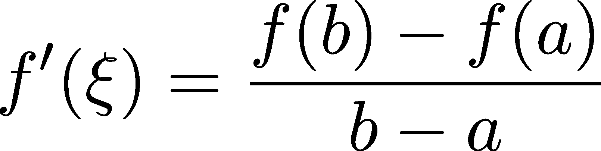
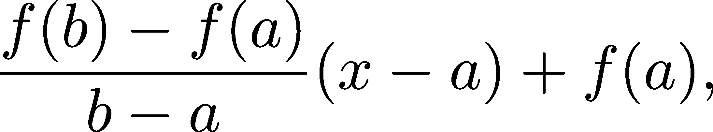
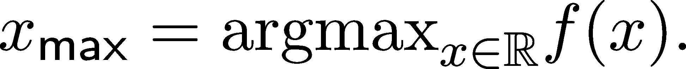

优化

如果有人给你一个由某个易处理的公式定义的函数，你将如何找到它的极小值和极大值？在继续之前，花点时间想想一些方法。

大多数人首先想到的方式是对所有可能的值评估函数，简单地找到最优解。但这种方法由于多种原因立即失败。我们只能进行有限的评估，因此这是不可能的。即使我们巧妙地定义一个离散的搜索网格并只在其上进行评估，这种方法也需要耗费不合理的时间。

另一种方法是使用某种不等式来提供一个特定的上界或下界，然后查看这个界限是否能达到。遗憾的是，对于更复杂的函数，如神经网络的损失函数，这几乎是不可能的。

然而，导数提供了一种极其有用的方式来优化函数。在本章中，我们将研究导数与最优点之间的关系，以及如何找到它们的算法。让我们开始吧！

## 第十六章：13.1 极小值、极大值和导数

直观地说，极小值和极大值的概念很简单。看看下面的图 13.1。


图 13.1：局部和全局极值

山峰的顶部是极大值，山谷的底部是极小值。极小值和极大值统称为极值点或最优点。正如我们的例子所示，我们必须区分局部最优解和全局最优解。图形中有两个山谷，虽然它们都有底部，但其中一个底部比另一个低。

真正有趣的部分是找到这些点，正如我们接下来将看到的那样。让我们考虑上面的例子来演示导数是如何与局部极小值和极大值相连接的。

如果我们运用几何直觉，我们会发现切线在山峰和山谷的底部是水平的。直观地说，如果切线不是水平的，那么图形上就有一个上升或下降。这在图 13.2 中得到了说明。


图 13.2：局部和全局极值点的切线

从导数的角度来看，由于它们描述了切线的斜率，这意味着在该点导数应该为 0。

如果我们把函数看作是沿着实数轴的运动描述，导数表明运动在该点停止并改变方向。它首先减速，停下来，然后立即开始向相反方向运动。例如，在局部最大值的情况下，函数在那个点之前增加，然后开始减少。


图 13.3：函数的流动

再次，我们可以通过导数来描述这种单调性行为。注意，当函数增加时，导数是正的（物体在运动时速度是正的）。另一方面，减小部分的导数是负的。


图 13.4：导数的符号

我们可以将这些直觉转化为数学形式。首先，我们从定义的单调性开始，以及它们与导数的关系。然后，我们将所有点连接起来，看看这如何结合起来描述最优解。

定义 56\. （局部增大和减小函数）

设 f : ℝ → ℝ 为一个任意函数，且 a ∈ ℝ。我们说

(a) 如果 f 在 a 处局部增大，则在邻域 (a −δ, a + δ) 中存在这样一种情况：


(b) 并且如果在邻域 (a −δ, a + δ) 中存在这样的情况：


局部减小和严格局部减小的性质定义类似，只是不等式方向相反。

对于可微函数，导数的行为描述了它们在单调性方面的局部行为。

定理 84\.

设 f : ℝ → ℝ 为一个在某个 a ∈ ℝ 处可微的任意函数。

(a) 如果 f^′(a) ≥ 0，那么 f 在 a 处局部增大。

(b) 如果 f^′(a)/span>0，那么 f 在 a 处严格地局部增大。

(c) 如果 f^′(a) ≤ 0，那么 f 在 a 处局部减小。

(d) 如果 f^′(a)/span>0，那么 f 在 a 处严格地局部减小。

证明。我们只证明 (a)，因为其余的证明是一样的。由于极限的定义方式（定义 51），


这意味着一旦 x 足够接近 a，即 x 来自于小邻域 (a −δ, a + δ)，


成立。如果 x >a，那么因为差商非负，必须有 f(x) ≥ f(a)。同样地，对于 x <a，差商的非负性意味着 f(x) ≤ f(a)。

(b)、(c) 和 (d) 的证明几乎完全相同，唯一的变化是在不等式中的显著改变。

与非严格单调性相关的命题也以相反的方式成立。

定理 85\.

设 f : ℝ → ℝ 为一个在某个 a ∈ ℝ 处可微的任意函数。

(a) 如果 f 在 a 处局部增大，那么 f^′(a) ≥ 0。

(b) 如果 f 在 a 处局部减小，那么 f^′(a) ≤ 0。

证明。与之前类似，我们只证明 (a)，因为 (b) 可以用相同的方式完成。如果 f 在 a 处局部增大，那么差商是正的：


使用极限的传递原理（定理 73），我们得到


这就是我们需要证明的内容。

在所有这些准备工作完成后，我们准备研究局部最优解。导数能告诉我们什么关于它们的信息呢？让我们看看！

### 13.1.1 局部最小值和最大值

正如我们在引言中看到的，极值点的切线是水平的。现在是时候将这个引言转化为一个数学上正确的形式了。

定义 57.（局部最小值和最大值）

设 f : ℝ →ℝ 是任意函数，且 a ∈ℝ。

(a) 如果存在一个邻域 (a−δ,a+δ)，使得对于每一个 x ∈ (a−δ,a+δ)，都有 f(a) ≤ f(x)，则 a 是局部最小值。

(b) 如果存在一个邻域 (a−δ,a+δ)，使得对于每一个 x ∈ (a−δ,a+δ)，都有 f(a) < f(x)，则 a 是严格局部最小值。

(c) 如果存在一个邻域 (a−δ,a+δ)，使得对于每一个 x ∈ (a−δ,a+δ)，都有 f(x) ≤ f(a)，则 a 是局部最大值。

(d) 如果存在一个邻域 (a−δ,a+δ)，使得对于每一个 x ∈ (a−δ,a+δ)，都有 f(x) > f(a)，则 a 是严格局部最大值。

极值点也有其全局版本。遗憾的是，尽管我们总是追求全局最优解，但我们只有工具能够找到局部最优解。

定义 58.（全局最小值和最大值）

设 f : ℝ →ℝ 是任意函数，且 a ∈ℝ。

(a) 如果对所有 x ∈ ℝ，f(a) ≤ f(x) 都成立，则 a 是全局最小值。

(b) 如果对所有 x ∈ ℝ，f(x) ≤ f(a) 都成立，则 a 是全局最大值。

请注意，全局最优解也是局部最优解，但反之则不成立。

定理 86\。

设 f : ℝ →ℝ 是在某点 a ∈ℝ 可微的任意函数。如果 f 在 a 处有局部最小值或最大值，则 f^′(a) = 0。

证明：根据定理 84，如果 f^′(a)≠0，则该点在局部范围内要么严格递增，要么严格递减。由于这与我们假设 a 是局部最优解相矛盾，因此该定理得证。

（如果你感兴趣，这就是逆命题原理（定理 150）的实际应用。通过否定结论，我们证明了前提的否定。）

强调这一点非常重要，即定理并非反过来也成立。例如，函数 f(x) = x³ 在任何地方都是严格递增的，但 f^′(0) = 0。

通常，我们称这种行为为拐点。因此，f(x) = x³ 被认为在 0 处具有拐点。拐点意味着行为的变化，在这种情况下，反映了其导数从递减变为递增的转换。（多维的拐点类比被称为“鞍点”，我们稍后会讨论。）

所以，我们的最终目标还没有实现，因为所承诺的另一半刻画还没有完成。

在局部极值点处导数为零，但我们能否提出一个准则，暗示最小值或最大值的存在？


图 13.5：f(x) = x³ 的图像，作为反例展示 f^′(0) = 0 并不意味着局部最优解

利用二阶导数，这是可能的。

### 13.1.2 利用高阶导数刻画极值

让我们再看一遍我们的例子，这次考虑 f^′ 的局部行为，而不仅仅是其符号。在图 13.6 中，导数与我们的函数一起绘制。


图 13.6：函数及其导数

这个模式看起来很简单：导数增大意味着局部最小值，导数减小意味着局部最大值。这与我们对于导数作为速度的直觉相符合：局部最大值意味着物体在正方向上运动，然后停下并开始反转。

我们可以通过以下定理将这一点数学化。

定理 87. （第二导数法则）

设 f : ℝ →ℝ是一个在某个 a ∈ℝ处二次可微的任意函数。

(a) 如果 f^′(a) = 0 且 f^(′′)(a)/span>0，那么 a 是局部最小值。

(b) 如果 f^′(a) = 0 且 f^(′′)(a)/span>0，那么 a 是局部最大值。

证明。再一次，我们只证明(a)，因为(b)的证明几乎是相同的。

首先，正如我们在讨论导数与单调性之间的关系时所看到的（定理 84），f^(′′)(a) 0 意味着 f^′在 a 处严格局部递增。由于 f^′(a) = 0，这意味着

![ ( ′ |{ ≤ 0 如果 x ∈ (a− δ,a] f (x)| ( ≥ 0 如果 x ∈ a,a + δ) 

对于某个δ > 0。根据定理 84，f 在(a −δ,a]内局部递减，在[a,a + δ)内局部递增。只有当 a 是局部最小值时，这种情况才可能发生。

总结一下，找到函数 f 的极值的方法如下。

1.  解 f^′(x) = 0。它的解{x[1],…,x[n]} —— 被称为临界点 —— 是可能的极值点候选点。（但不一定所有解都是极值点。）

1.  检查所有解 x[i]的 f^(′′)(x[i])的符号。如果 f^(′′)(x[i])/span>0，则为局部最小值。如果 f^(′′)(x[i])/span>0，则为局部最大值。

如果 f^(′′)(x[i]) = 0，我们仍然无法得出任何结论。函数 x⁴，−x²和 x³表明，具有零二阶导数的临界点可以是局部最小值、最大值或两者都不是。

即使我们有了一个“公式”，这对于实际应用来说仍然远远不够。更不用说我们关心的函数是多变量的，计算导数并解 f^′(x) = 0 并不可行。对于神经网络的损失函数，我们甚至懒得写出公式，因为对于数百个函数的组合，公式可能会变得异常复杂。

### 13.1.3 均值定理

在某些情况下，我们可以不显式计算导数就提取出很多关于导数的信息。这些结果在我们没有函数的显式公式或公式可能非常庞大的情况下（例如在神经网络的情况下）极为有用。接下来，我们将介绍著名的均值定理，连接函数在区间端点和区间内的行为。

首先，我们从一个特殊的情况开始，假设函数在某个区间[a,b]的末端取得相同的值，那么它的导数在该区间内某处为零。

定理 88. （罗尔均值定理）

设 f : ℝ →ℝ是一个可微函数，且假设对于某个 a≠b，f(a) = f(b)。则存在一个ξ ∈ (a,b)，使得 f^′(ξ) = 0。

证明。如果你是一个喜欢可视化的人，可以看一下图 13.7。这就是我们需要证明的内容。


图 13.7：罗尔定理

为了数学上的精确性，存在两种情况。首先，如果 f 在 [a,b] 上是常数，那么它在整个区间上的导数为零。

如果 f 不是常数，那么它在 (a,b) 内达到某个不等于 f(a) = f(b) 的值 c。为了简化，假设 c > f(a)。（如果是 c < f(a) 的情况，接下来的论证也能成立，只需做一些显而易见的调整。）由于 f 是连续的，它在 [a,b] 上会在某个点 ξ ∈ [a,b] 处达到最大值。（见定理 76）。根据我们刚刚看到的关于局部极值与导数关系的内容（定理 86），有 f^′(ξ) = 0，这就是我们要证明的内容。

罗尔定理是通向拉格朗日均值定理的重要跳板，接下来我们将证明这一点。

定理 89\.（拉格朗日均值定理）

设 f : ℝ → ℝ 为可微函数，且 [a,b] 为某个 a≠b 的区间。那么存在 ξ ∈ (a,b)，使得



成立。

证明。让我们再次从一个可视化开始，以便更好地理解该定理。图 13.8 展示了我们需要证明的内容。


图 13.8：拉格朗日均值定理

回想一下， 是通过 (a,f(a)) 和 (b,f(b)) 两点的直线的斜率。该直线由以下函数描述：



如通过直线的点斜式方程给出。利用这一点，我们引入函数


我们可以将罗尔定理应用于 g(x)，因为 g(a) = g(b) = 0。因此，对于某个 ξ ∈ (a,b)，我们有


这意味着 f^′(ξ) = ，这是我们需要证明的内容。

为什么均值定理如此重要？在数学中，它们在多个结果中起着基石的作用。举个例子，想一想积分。（或许你已经熟悉这个概念了。如果不熟悉也没关系，我们稍后会详细学习它。）积分本质上是微分的逆过程：如果 F^′(x) = f(x)，那么


这将是拉格朗日均值定理的一个简单推论。

## 13.2 梯度下降的基础

我们需要解决两个计算问题来训练神经网络：

+   计算损失 L(w) 的导数，

+   并且通过导数找到它的最小值。

通过求解L(w) = 0 来寻找最小值在实际中行不通。存在几个问题。首先，正如我们所看到的，并不是所有的解都是最小点：还有最大点和拐点。其次，除非在最简单的情况下，比如线性回归和均方误差，否则解这个方程是不可行的。训练神经网络不是简单的案例。

幸运的是，对于我们这些机器学习从业者来说，有一个解决方案：梯度下降！著名的梯度下降提供了一种方法来应对寻找精确解的复杂性，使我们能够大规模地进行机器学习。让我们看看它是如何实现的！

### 13.2.1 再访导数

当我们第一次在第十二章探讨导数的概念时，我们看到了它的多种形式。我们已经学到，导数可以被看作

+   速度（当函数描述一个移动物体的时间-距离图时），

+   函数切线的斜率，

+   在给定的点上的最佳线性近似器。

为了理解梯度下降是如何工作的，我们将看到另一个解释：导数作为向量。对于任何可微分函数 f(x)，导数 f^′(x)可以被看作一个一维向量。如果 f^′(x)是正的，它指向右侧。如果是负的，它指向左侧。我们可以通过为 f(x)图形上的每个点画一条水平向量来可视化这一点，其中向量的长度代表|f^′(x)|，方向代表符号。图 13.9 展示了这一过程。


图 13.9：导数作为一个向量

你是否还记得单调性是如何通过导数的符号来描述的？（正如定理 84 所述。）负导数意味着函数递减，正导数意味着函数递增。换句话说，这意味着导数作为一个向量指向增大的方向。

想象你自己是 x-y 平面上的一个徒步旅行者，y 表示高度。你如何攀登面前的山？通过朝着增高的方向迈出一步；也就是说，跟随导数。如果你还没有到达山顶，你仍然可以在正确的方向上再迈出一步（也许更小），反复如此，直到到达顶峰。如果你已经在山顶，导数就是零，你就不会再移动。

这个过程如图 13.10 所示。


图 13.10：一步一步爬山

你看到的正是梯度上升的过程。现在我们已经理解了主要思想，准备处理数学细节。

### 13.2.2 梯度下降算法

设 f : ℝ →ℝ是我们想要最大化的可微函数，也就是说，找到



基于我们的直觉，过程相当简单。首先，我们设定一个任意的起始点 x[0]，然后定义序列

x[n+1] := x[n] + h f′(x[n]), (13.1)

其中 h ∈ (0,∞)是我们梯度下降算法的一个参数，称为学习率。

在英语中，公式 x[n] + hf^′(x[n])描述了从 x[n]出发，朝着增大方向迈出一步，步长为 hf^′(x[n])。（回想一下，导数的符号表示增大的方向。）

如果一切顺利，序列 x[n]会收敛到 f 的局部最大值。然而，事情并不总是按照我们的计划进行。我们将在讨论梯度下降的问题时谈到这一点。

那么，如何找到最小值呢？在机器学习中，我们试图最小化损失函数。有一个简单的技巧：f(x)的最小值就是−f(x)的最大值。因此，既然( −f)^′ = −f^′，逼近序列 x[n]的定义就变为


这就是梯度下降的核心概念。

### 13.2.3 实现梯度下降

到现在为止，我们已经具备了实现梯度下降算法的所有知识。我们将使用之前介绍的 Function 基类；在这里再次给出它，以免你需要查找类定义。

```py
class Function: 
    def __init__(self): 
        pass 

    def __call__(self, *args, **kwargs): 
        pass 

    def prime(self): 
        pass 

    def parameters(self): 
        return dict()
```

和往常一样，我鼓励你在查看我的实现之前，先尝试实现你自己的梯度下降版本。编程是学习最有效的方式之一，即使在人工智能的时代——特别是在人工智能的时代。

```py
def gradient_descent( 
    f: Function, 
    x_init: float,                  # the initial guess 
    learning_rate: float = 0.1,     # the learning rate 
    n_iter: int = 1000,             # number of steps 
    return_all: bool = False        # if true, returns all intermediate values 
): 
    xs = [x_init]    # we store the intermediate results for visualization 

    for n in range(n_iter): 
        x = xs[-1] 
        grad = f.prime(x) 
        x_next = x - learning_rate*grad 
        xs.append(x_next) 

    if return_all: 
        return xs 
    else: 
        return x
```

让我们在一个简单的例子上测试梯度下降，假设 f(x) = x²！如果一切顺利，算法应该会在短时间内找到最小值 x = 0。

```py
class Square(Function): 
    def __call__(self, x): 
        return x**2 

    def prime(self, x): 
        return 2*x 

f = Square() 

gradient_descent(f, x_init=5.0)
```

```py
7.688949513507002e-97
```

结果如预期：我们的 gradient_descent 函数成功找到了最小值。

为了可视化发生的过程，我们可以绘制整个过程。由于我们将重复使用相同的图表，这里有一个通用函数来完成这个工作。

```py
import numpy as np 
import matplotlib.pyplot as plt 

def plot_gradient_descent(f, xs: list, x_min: float, x_max: float, label: str = /span>f(x): 
    ys = [f(x) for x in xs] 

    grid = np.linspace(x_min, x_max, 1000) 
    fs = [f(x) for x in grid] 

    with plt.style.context("/span>seaborn-v0_8-whitegrid: 
        plt.figure(figsize=(8, 8)) 
        plt.plot(grid, fs, label=label, c="/span>b lw=2.0) 
        plt.plot(xs, ys, label="/span>gradient descent c="/span>r lw=4.0) 
        plt.scatter(xs, ys, c="/span>r s=100.0) 
        plt.legend() 
        plt.show() 

xs = gradient_descent(f, x_init=5.0, n_iter=25, learning_rate=0.2, return_all=True) 
plot_gradient_descent(f, xs, x_min=-5, x_max=5, label="/span>x²"
```


图 13.11：通过梯度下降找到 f(x) = x²的最小值

那么，一切都是快乐和阳光吗？不是，但这没关系。让我们看看可能出现的问题，以及如何解决它们。

### 13.2.4 缺点与警告

尽管梯度下降背后的思想是合理的，但它仍然存在一些问题。在我们的机器学习旅程中，我们会看到大多数这些问题通过算法的变种得到解决，但在此时了解基础版本可能出现的问题也是值得的。

首先，基础的梯度下降算法可能会在局部最小值处陷入无限循环。

为了说明这一点，让我们看看 f(x) = cos(x) + x 函数，它没有全局最小值，只有局部最小值。

```py
class CosPlusSquare(Function): 
    def __call__(self, x): 
        return np.sin(x) + 0.5*x 

    def prime(self, x): 
        return np.cos(x) + 0.5 

f = CosPlusSquare() 
xs = gradient_descent(f, x_init=7.5, n_iter=20, learning_rate=0.2, return_all=True) 
plot_gradient_descent(f, xs, -10, 10, label="/span>sin(x) + 0.5x
```


图 13.12：运行梯度下降于 f(x) = sin(x) + 1/2x

请注意，如果初始点 x[0]选择不当，算法的效果会大打折扣。换句话说，对初始条件的敏感性是另一个弱点。在我们刚刚看到的简单一维案例中，这个问题可能不那么明显。然而，在训练神经网络时，我们会遇到百万维的参数空间，这时它就是一个巨大的难题。

起始点并不是算法的唯一参数；它还依赖于学习率 h。这里有几个潜在的错误：过大的学习率会导致算法在空间中四处弹跳，永远找不到最优解。另一方面，过小的学习率会导致收敛速度极慢。

在 f(x) = x²的情况下，从 x[0] = 1.0 开始梯度下降，学习率为 h = 1.05，算法发散，x[n]在越来越大的幅度下振荡。

```py
f = Square() 

xs = gradient_descent(f, x_init=1.0, n_iter=20, learning_rate=1.05, return_all=True) 
plot_gradient_descent(f, xs, -8, 8, label="/span>x²"
```


图 13.13：梯度下降，由于学习率过大导致错过最优解

你能想到一些解决这些问题的方案吗？无需进行详细的计算，只需花几分钟进行头脑风暴，记下你想到的内容。在后续章节中，我们会看到这些问题的几种解决方案，但花些时间思考这些问题是一个非常有益的练习。

然而，如果你注重细节，可能会问：梯度下降总是会收敛到局部最优解吗？为什么它在实践中如此有效？让我们来看看。

## 13.3 为什么梯度下降有效？

> 年轻人，在数学中你并不理解事物。你只是习惯它们。——约翰·冯·诺依曼

在机器学习的实践中，我们如此频繁地使用梯度下降，以至于我们已经习惯了它。我们几乎从不质疑它为何有效。

通常的解释是爬山类比：为了找到一个崎岖地形的山顶（或山谷），需要观察最陡上升（或下降）方向，并朝该方向迈出一步。这个方向由梯度描述，而通过跟随梯度迭代寻找局部极值的过程称为梯度上升/下降。（上升用于寻找山顶，下降用于寻找山谷。）

然而，这并不是一个数学上精确的解释。仍然存在一些未解答的问题，并且根据我们的爬山直觉，甚至不清楚该算法是否有效。

如果没有对梯度下降的精确理解，我们实际上是在盲目地操作。在本节中，我们的目标是深入探讨梯度下降背后的原理，揭示其中的奥秘。

理解梯度下降的“为什么”从数学中最美丽的领域之一——微分方程开始。

### 13.3.1 微分方程入门

什么是微分方程？方程在数学中扮演着至关重要的角色；这是一条常识，但其背后有着深刻的真理。方程常常来源于对系统的建模，例如生化网络中的相互作用、经济过程等成千上万的应用。例如，建模有机体中的代谢过程会得到如下形式的线性方程：


其中向量 x 和 b 表示分子浓度（其中 x 为未知量），矩阵 A 表示它们之间的相互作用。线性方程容易求解，我们对它们了解颇多。

然而，我们迄今为止看到的方程并不适合用来描述动力学系统，因为它们缺少时间组件。例如，要描述绕地球轨道运行的空间站的轨迹，我们必须用函数及其导数来描述我们的模型。

例如，摆动的钟摆的轨迹可以通过方程描述：

x″(t) + (g/L) sin x(t) = 0, (13.2)

其中

+   x(t) 描述钟摆相对于竖直方向的角度，

+   L 是（无质量）杆的长度，物体的质量为 m，物体悬挂在其上，

+   其中 g 是重力加速度常数 ≈ 9.81 m/s²。

根据微分的原始解释，如果 x(t) 描述了钟摆在时刻 t 的运动，那么 x^′(t) 和 x^(′′)(t) 分别描述了它的速度和加速度，其中微分是相对于时间 t 进行的。

（实际上，微分方程（13.2）是牛顿第二定律的直接结果。）


图 13.14：摆动的钟摆

包含函数及其导数的方程，如（13.2），被称为常微分方程，简称 ODE。从 17 世纪起，它们的研究几乎可以说是推动数学发展的主要动力。相信我，当我说微分方程是数学中最美丽的对象之一时，你会明白的。正如我们将看到的，梯度下降算法实际上是微分方程的一个近似解。

本节的第一部分将作为微分方程的快速入门。我将主要跟随 Steven Strogatz 的《非线性动力学与混沌》这本精彩的书。如果你有兴趣深入研究动力学系统，我全心全意推荐这本书给你。（这是我最喜欢的数学书籍之一——它读起来像小说一样。书中阐述的质量和清晰度始终是我写作的持续灵感来源。）

### 13.3.2 常微分方程的（稍微更一般的）形式

让我们直接跳入深水，先从一个例子开始，以掌握微分方程。很可能，最简单的例子是方程


其中，微分是相对于时间变量 t 进行的。例如，如果 x(t) 是细菌群落的大小，那么方程 x^′(t) = x(t) 描述的是其种群动态，假设增长是无限的。可以将 x^′(t) 理解为种群增长的速度：如果空间和养分没有限制，每个细菌细胞都可以随时自由繁殖。因此，由于每个细胞都可以自由分裂，增长的速度与群落的大小成正比。

用通俗的语言来说，方程 x^′(t) = x(t) 的解是其导数等于自身的函数。稍加思考，我们可以得到一个解的族：x(t) = ce^t，其中 c ∈ℝ 是一个任意常数。（回想一下，e^t 是一个初等函数，我们在定理 82 中已经看到它的导数是它自己。）

如果你是一个视觉型的人，可以在图 13.15 上看到一些解的图像。

这里有两个关键要点：微分方程描述了随时间变化的动态过程，而且它们可能有多个解。每个解由两个因素决定：方程 x^′(t) = x(t)，和初始条件 x(0) = x^∗。如果我们指定 x(0) = x^∗，那么常数 c 的值为


因此，常微分方程有一组解，每一个解由初始条件确定。

所以，现在是时候更一般性地讨论微分方程了！


图 13.15：指数增长方程的一些解

定义 59. （一维常微分方程）

设 f : ℝ →ℝ 是一个可微函数。方程

x′(t) = f(x(t)) （13.3）

称为一阶齐次常微分方程。

当情况明确时，t 的依赖性通常会被省略，所以我们只写 x^′ = f(x)。 （一些资源用 ẋ 表示时间导数，这种符号可能源自牛顿。我们不会使用这个符号，尽管了解它是有益的。）

“一阶齐次常微分方程”这个术语不容易说出口，而且它充满了繁重的术语。所以，让我们解开其中的含义。

微分方程部分很明确：它是一个涉及导数的函数方程。由于时间 t 是唯一的变量，因此该微分方程是常微分方程。（与涉及多变量函数和偏导数的微分方程相对，后者将在以后讲解。）由于只涉及一阶导数，方程成为一阶微分方程。二阶方程则涉及二阶导数，以此类推。最后，由于右侧的 f(x) 不显式依赖于时间变量 t，因此该方程在时间上是齐次的。齐次性意味着支配我们动态系统的规则不会随着时间变化。

不要让 f(x(t)) 部分吓到你！例如，在我们的例子 x^′(t) = x(t) 中，f 的角色被映射为恒等函数 f(x) = x。一般来说，f(x) 建立了量 x(t)（可以是位置、密度等）及其导数（即变化率）之间的关系。

正如我们所看到的，我们通过微分方程和初始条件来思考，这些条件确定了解在一组函数中的位置。让我们将这一点写成正式的数学定义！

定义 60. （初值问题）

设 x^′ = f(x) 是一阶齐次常微分方程，且 x[0] ∈ℝ 为任意值。系统


被称为初值问题。如果函数 x(t)满足这两个条件，则称其为初值问题的解。

最常见的是，我们选择 t[0]为 0。毕竟，我们可以自由选择时间的原点。

不幸的是，事情并不像看起来那么简单。通常，微分方程和初值问题是很难求解的。除了少数简单的例子，我们无法找到精确的解。（当我说“我们”时，我指的是地球上的每一个人。）在这种情况下，我们可以做两件事：要么通过数值方法构造近似解，要么转向定性方法，研究解的行为，而不需要实际找到它们。

我们将讨论这两者，但首先让我们转向定性方法。如我们所见，从几何的角度来看，可以深刻理解微分方程是如何运作的。

### 13.3.3 微分方程的几何解释

当无法找到解析解时，我们会寻求对解的定性理解，关注局部和长期行为，而不是公式。

假设给定一个微分方程


你对一个特定的解感兴趣，它在时间 t[0]时假设值为 x^∗。

例如，假设你正在研究细菌群体的动态，并希望提供一个预测模型，以适应你最新的测量值 x(t[0]) = x^∗。在短期内，你的解会走向哪里？

我们可以立即注意到，如果 x(t[0]) = x^∗且 f(x) = 0，则常数函数 x(t) = x 是一个解！这些被称为平衡解，而且它们非常重要。所以，让我们给出一个正式定义！

定义 61（平衡解）

设

x′(t) = f(x(t)) (13.4)

设为一阶齐次常微分方程，并让 x^∗∈ℝ为任意点。如果 f(x^∗) = 0，则称 x^∗为方程 x^′ = f(x)的平衡点。

对于平衡点，常数函数 x(t) = x^∗是方程(13.4)的解。这被称为平衡解。

思考我们反复出现的例子，最简单的常微分方程 x^′(t) = x(t)。如前所述，我们可以将这个方程解释为在理想条件下无限制的种群增长模型。在这种情况下，f(x) = x，而只有当 x = 0 时，这个方程的解才为零。因此，常数解 x(t) = 0 是一个解。这是完全合乎逻辑的：如果一个种群的个体数量为零，那么它的大小就不会发生变化。换句话说，系统处于平衡状态。

这就像一个停止运动并到达底部静止点的摆。然而，摆有两个平衡态：一个在顶部，一个在底部。（假设质量由一根无质量的杆支撑，否则它会坍塌。）在底部，你可以尽情推摆的质量，它会返回静止状态。然而，在顶部，任何轻微的推力都会打破平衡状态，摆将永远无法恢复到平衡。

为了阐明这一现象，让我们来看另一个例子：著名的逻辑方程

x′(t) = x(t)(1 − x(t))。 (13.5)

从种群动态的角度来看，如果我们最喜欢的方程 x^′(t) = x(t)描述了细菌群落的无限制增长，那么逻辑方程则模拟了在资源限制下的种群增长。如果我们假设 1 是我们种群的总容量，那么当种群接近这一限制时，增长会变得越来越困难。因此，种群的变化率 x^′(t)可以通过 x(t)(1 −x(t))来建模，其中 1 −x(t)这一项会随着群体接近承载能力而减缓增长过程。

我们可以通过将 f(x) = x(1 −x)代入通用形式(13.3)来写出逻辑方程。你还记得关于导数与单调性关系的定理 84 吗？将其转化为微分方程 x^′ = f(x)，这揭示了我们解的流动！具体来说，


我们可以在所谓的相位图中可视化这个过程。


图 13.16：x^′ = x(1 −x)的解的流动，在相位图上可视化。（箭头表示给定初值的解的方向。）

因此，单调性描述了长期行为：

.png)(13.6)

通过一些计算（其细节对我们来说并不重要），我们可以得到我们可以将解写为 noindent。


其中 c ∈ℝ是一个任意常数。对于 c = 1，这是著名的 S 型函数。

你可以手动检查这些确实是解。我们甚至可以绘制它们，如下图 13.17 所示。


图 13.17：逻辑微分方程 x^′ = x(1 −x)的解

如图 13.17 所示，解的单调性正如我们在(13.6)中预测的那样。

我们可以根据附近解的长期行为来表征平衡态。（在我们的逻辑方程中，平衡态是 0 和 1。）这可以与函数 f 的局部行为相联系：如果它在平衡点 x^∗周围减小，它就会吸引附近的解。另一方面，如果 f 在 x^∗周围增大，则附近的解会被排斥。

这引出了稳定和平衡不稳定点的概念。

定义 62.（稳定和平衡不稳定点）

令 x^′ = f(x) 为一阶齐次常微分方程，并假设 f 是可微的。此外，设 x^∗ 为该方程的平衡点。

x^∗ 被称为稳定的平衡点，如果存在一个邻域 (x^∗−𝜖, x^∗ + 𝜖)，对于所有的 x[0] ∈ (x^∗−𝜖, x^∗ + 𝜖)，初值问题的解


收敛到 x^∗。（也就是说，lim[t→∞]x(t) = x^∗ 成立。）

如果 x^∗ 不是稳定的，那么它被称为不稳定。

在逻辑斯蒂常微分方程 x^′ = x(1 −x) 的情况下，x^∗ = 1 是稳定平衡点，而 x^∗ = 0 是不稳定平衡点。这是符合其种群动态解释的：平衡点 x^∗ = 1 意味着种群处于最大容量。如果种群数量略高或略低于容量 1，部分个体会因饥饿而死亡，或者种群达到其约束。另一方面，无论种群有多小，在这个理想模型中，它永远不会灭绝。

回想一下微分定理 84 如何表征可微函数的单调性？有了这个，我们就有了一个简单的工具，帮助我们判断一个给定的平衡点是否稳定。

定理 90\.

令 x^′ = f(x) 为一阶齐次常微分方程，并假设 f 是可微的。此外，设 x^∗ 为该方程的平衡点。

如果 f^′(x)/span>0，则 x 是一个稳定的平衡点。

稳定平衡的概念是基本的，即使在最一般的情况下也是如此。此时，是时候退后一步，提醒我们自己为什么在这里：为了理解梯度下降。如果稳定平衡让你想起梯度下降过程所收敛到的局部最小值，那并非偶然。我们已经准备好了解幕后隐藏的内容。

### 13.3.4 梯度上升的连续版本

现在，让我们讨论最大化一个函数 F : ℝ → ℝ。假设 F 是二阶可微的，并且我们将它的导数记作 F^′ = f。幸运的是，可以通过查看 f(x) = 0 和 f^′(x)/span>0 来找到 F 的局部最大值（定理 87）。

这看起来熟悉吗？如果 f(x) = 0 确实成立，那么 x(t) = x 是一个平衡解；且由于 f^′(x^∗)/span>0，它也会吸引附近的解。这意味着，如果 x[0] 来自吸引盆地，并且 x(t) 是初值问题的解

(13.7)

那么，lim[t→∞]x(t) = x^∗。换句话说，解收敛到 x^∗，这是 F 的局部最大值！这是连续版本的梯度上升。

我们很高兴，但有一个问题。我们已经讨论过解微分方程有多困难。对于一般的 F，我们没有办法实际找到解。幸运的是，我们可以对它们进行近似。

### 13.3.5 梯度上升作为离散化的微分方程

在实际研究微分时，我们看到导数可以通过前向差分进行数值近似。


其中 h/span>0 是一个小步长。如果 x(t)确实是初值问题的解(13.7)，那么我们很幸运！使用前向差分，我们可以从 0 出发，采用小步长近似 x(h)，将前向差分代入微分方程。准确地说，我们有


从中


可得。通过定义 x[0]和 x[1]为


我们有 x[1] ≈ x(h)。如果这看起来像是梯度上升的第一步(13.1)，那么你走在正确的道路上。再次使用前向差分，这次从点 x(h)开始，我们得到


因此，通过定义 x[2] := x[1] + hf(x[1])，我们得到 x[2] ≈ x(2h)。注意，在 x[2]中，积累了两种类型的近似误差：首先是前向差分，然后是上一步的近似误差。

这激励我们定义递归序列

(13.8)

它通过 x[n]近似 x(nh)，正如其定义所暗示的那样。这个递归序列就是梯度上升本身，而小步长 h 就是学习率！

查看(13.1)，如果你不相信我。13.8 被称为欧拉方法。

不深入细节，如果 h 足够小并且 f“表现得当”，欧拉方法将收敛到平衡解 x^∗。（“表现得当”是什么意思呢？）

我们只需要再做一步：将一切变成梯度下降而不是上升。这非常简单，因为梯度下降就是对−f 应用梯度上升。想想看：最小化一个函数 f 就等同于最大化它的负值−f。这样，我们就完成了！著名的梯度下降是动态系统向其稳定平衡收敛的结果，这非常美妙。

### 13.3.6 梯度上升的实际应用

为了看到梯度上升（即欧拉方法）在实际中的应用，我们应该回到我们熟悉的例子：逻辑斯蒂方程(13.5)。所以，假设我们想找到该函数的局部最大值。


如图 13.18 所示。


图 13.18：F(x) = x² −x³的图形

首先，我们可以运用学到的知识，利用导数 f(x) = F^′(x) = x(1 −x) 来找最大值，得出在 x^∗ = 1 处有一个局部最大值。（不要只听我说，查阅定理 87，自己推导一下！）

由于 f(x) = F^′(x) = 0 且 f^′(x)/span>0，点 x 是逻辑方程的稳定平衡点


因此，如果初始值 x(0) = x[0] 足够接近 x^∗ = 1，初值问题的解 x(t) 将是


那么 lim[t→∞]x(t) = x^∗。（实际上，我们可以从无限区间 (0,∞) 中选择任何初始值 x[0]，并且收敛性将成立）。通过欧拉方法的离散化，我们得到递归序列


这个过程由图 13.19 可视化。


图 13.19：通过欧拉方法求解 x^′ = x(1 −x)。 （为了可视化，初始值设为 t[0] = −5。）

我们甚至可以取欧拉方法提供的离散解，并将其绘制在 x −F(x) 平面上。


图 13.20：将欧拉方法映射到 x, F(x) 平面

如果你查看图 13.20，你会看到这是 F 的梯度上升！如果你考虑 F^′ = f 并且考虑欧拉方法给出的解是

(13.9)

你会注意到（13.9）正是我们定义梯度上升的方法。

## 13.4 小结

最后，我们做到了。直到这一章之前，我们还没有接触到机器学习，但现在，我们已经进入了它的核心。梯度下降是训练神经网络的第一算法。是的，即使是最先进的神经网络。

一切都始于微积分。为了达到梯度下降的高度，我们研究了单调性、局部极值和导数之间的关系。这个模式很简单：如果 f^′(a)/span>0，那么 f 是递增的；但如果 f^′(a)/span>0，那么 f 在 a 周围是递减的。从物理角度讲，如果速度为正，物体在远离；但如果速度为负，物体在靠近。

基于这一观察，我们可以推导出找到局部极值和极大值的必要和充分条件：如果 f^′(a) = 0

+   如果 f^(′′)(a)/span>0，那么 a 是局部最小值，

+   但如果 f^′(a) = 0 且 f^(′′)(a)/span>0，那么 a 是局部最大值。

所以，找到局部极值应该和解 f^′(a) = 0 一样简单，对吧？理论上，不是，因为当 f^(′′)(a) = 0 时，结果是未定的。实践中，仍然不行，因为即使是复杂的 f，也很难找到 f^′，更不用说解 f^′(x) = 0 了。

然而，还是有办法的。我们可以采用带有梯度下降的迭代方法：如果学习率 h 和起始点 x[0] 选择得当，那么由以下递归序列定义的


收敛到局部最小值。

一如既往，当一个问题得到解决时，往往会产生十个其他问题。例如，梯度下降可能无法收敛，或者会陷入局部最小值而不是找到全局最小值。但这只是我们面临的最小问题。真正的问题是，我们在实践中必须优化多个变量的函数，通常参数的范围可以达到数十亿。

在我们继续学习多变量微积分之前，还有一个话题需要讲解。我曾多次提到过积分，即神秘的“逆向微分”。现在是时候看看它是什么，以及为什么它对于学习高级数学至关重要。

## 13.5 问题

问题 1. 找出 f(x) = sinx 的局部最小值和最大值。

问题 2. 使用二阶导数法则找出 f(x) = 2x³ + 5x² + 4x + 6 的局部最小值和最大值。

问题 3. 设 f : ℝ →ℝ 为可微函数。由以下递推式定义的序列


其中 δ[0] = 0，x[0] 为任意值，称为带动量的梯度下降法。实现它！

## 加入我们的 Discord 社区

和其他用户、机器学习专家以及作者本人一起阅读本书。提出问题，为其他读者提供解决方案，通过“问我任何问题”环节与作者交流，等等。扫描二维码或访问链接加入社区。[`packt.link/math`](https://packt.link/math)


