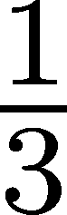
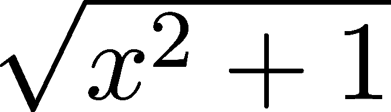

积分

当我们在第十二章首次遇到导数的概念时，我们通过物理学中的一个例子进行了介绍。正如牛顿所创建的，导数描述了通过时间-距离图计算出的物体的速度。换句话说，速度可以从时间-距离信息中推导出来。

给定速度能否重构出距离？从某种意义上说，这正是微分的逆过程。

这些问题如果我们仅仅从最一般的角度来看，很难回答，因此我们考虑一个特殊的情况。假设我们的物体以恒定速度 v(t) = v[0]运动，持续时间为 T 秒。通过一些基本的逻辑推理，我们可以得出总的移动距离是 v[0]T 米。

当我们查看时间-速度图时，可以立即看到，距离就是时间-速度函数图 v(t) = v[0]下的面积。

v(t)的图像描述了一个宽度为 v[0]，长度为 T 的矩形，因此它的面积确实是 v[0]T。


图 14.1：物体的时间-速度图，物体以恒定速度运动

在一般情况下，v(t)下的面积是否等于行驶的距离？例如，当时间-速度图像看起来像这样时会发生什么？


图 14.2：物体的时间-速度图，物体以变化的速度运动

这里速度不是恒定的。在这种情况下，我们可以做一个简单的技巧：将时间区间[0,T]划分为更小的区间，并在这些区间上将物体的运动近似为匀速运动。


图 14.3：用匀速运动进行近似

如果时间区间[t[i],t[i+1]]足够精细，所行驶的距离将大致匹配以平均速度进行的匀速运动，即，如果我们引入符号

![vi := 在时间区间[ti−1,ti]内的平均速度，i = 1,2,...,n,](img/file1316.png)

我们应该有

![∑n vi(ti − ti−1) ≈ 在[0,T]期间的总行驶距离。 i=1](img/file1317.png)

我们可以将整个过程看作用阶梯常数函数 vapprox 来逼近 v(t)。从这个角度来看，我们有


和


(非常)粗略地说，如果时间区间[t[i],t[i+1]]的粒度变得极其小，近似值将变成等式。因此，

![在[0,T]期间的总行驶距离 = v(t)在[0,T]中的面积。](img/file1320.png)

我们需要记住两个关键点：如果 s(t)是行驶的距离，v(t)是速度，那么

+   v(t)是导数 s^′(t)，

+   而 s(T)是图形 v(t)在 0 和 T 之间的面积。

换句话说，计算曲线下的面积就相当于反向微分。这个过程称为积分。

不幸的是，事情并不像看上去那么简单。我们在上述讨论中错过了很多数学细节。比如，和下面的和


如果 [0,T] 的划分变得更细，极限会收敛吗？极限是否依赖于划分？我们能否为所有函数定义“图形”下的面积？像 Dirichlet 函数，由

.png)(14.1)

我们如何在实践中计算 ∑ [i=1]^nvi 的极限？此外，这一切与机器学习有什么关系？

系好安全带！接下来是对积分的严谨研究，解答所有这些问题。

## 第十七章：14.1 理论中的积分

让我们为直观的解释构建一个坚实的理论基础！设 f : [a,b] →ℝ 为一个任意有界函数，我们的目标是计算图形下方的有符号面积。（注意，如果图形低于 x 轴，则有符号面积为负。在上述的时间-速度图例中，这相当于倒退，从而减少从起点出发的行进距离。）

设 a = x[0]/span>x[1]/span>…/span>x[n] = b 为区间 [a,b] 的一个任意划分。

为了便于记号，我们也将这个划分记为 X = {x[0],…,x[n]}。X 的粒度（或网格）由


这是 X 中最大间隔的长度。请注意，划分不一定是均匀的，因此 jx[i] −x[i−1]j 不是常数。

我们将使用类似于挤压原理的论证（推论 3）来使得这个近似思想更加严谨。（你知道的，就是我们用分段常数函数代替了移动物体的速度的那个原理。）我们将不再使用 f(x) 在每个区间 [x[i−1],x[i]] 上的平均值，而是通过使用上下估算来提供估算值。

![mi := inf f (x ) x∈[xi−1,xi] ](img/file1324.png)

以及

![Mi := sup f(x). x∈ [xi− 1,xi] ](img/file1325.png)

从数学角度来看，极小值和极大值比平均值更容易处理。现在我们可以通过从上方和下方用分段常数函数来近似 f(x)。这一点通过图 14.4 进行了可视化。


图 14.4：使用划分 X 估算函数 f 曲线下的面积

我们的计划是将面积挤压在上下和之间。

L[f, X] := ∑[i=1]^n mi (14.2)

以及

U[f, X] := ∑[i=1]^n Mi，(14.3)

然后研究这两个是否匹配。（如常，如果从上下文中能够清楚看出，则可以省略对 f 和 X 的依赖。）

从构造中可以清楚地看出，

![L[f,X ] ≤ area under the graph ≤ U [f,X ] ](img/file1327.png)

是否对任何划分 X 都成立？

随着划分 X 的粒度趋近于零，理想情况下，L[f,X] 和 U[f,X] 都将收敛到相同的数值。直观地，这个共同的极限应该是“函数图下的面积”，但目前我们对面积的理解还不够通用，无法做出如此大胆的声明。例如，如何定义 Dirichlet 函数下的“面积”，它由 (14.1) 定义？正如我们很快将看到的，积分将会推广我们对面积的启发式理解。为了达到这一点，我们还有很多工作要做。首先，我们需要更仔细地观察划分。

### 14.1.1 划分及其细化

我们需要引入一些关于细化划分的基本事实，以便构建关于逼近和 L[f,X] 和 U[f,X] 收敛性的数学正确论证。

定义 63\.（划分的细化）

设 X = {x[0],…,x[n]} 和 Y = {y[0],…,y[m]} 为 [a,b] 的两个划分。我们说 Y 是 X 的细化，当且仅当 X ⊆Y。

我们可以很容易地将其可视化。


图 14.5：划分 Y，作为 X 的细化

细化对理解积分的工作原理至关重要。核心原因之一就是以下结果。

定义 64\. 上和与下和的单调性

设 f : [a,b] →ℝ 为有界函数，X 和 Y 为 [a,b] 的两个划分。假设 Y 是 X 的细化。则

L[f, X] ≤ L[f, Y] （14.4）

和

U[f, Y] ≤ U[f, X]。（14.5）

证明。我们将证明 L[f,X] ≤ L[f,Y ]，如 (14.5) 所示，推理类似。假设 x[i−1] ≤ y[j] ≤ ⋅⋅⋅ ≤ y[l] ≤ x[i]。从数学上讲，我们有

![ inf f(x) ≤ inf f(x), k = j + 1,...,l. x∈[xi−1,xi] x∈[yk−1,yk] ](img/file1330.png)

由于 x[i] − x[i−1] = ∑ [k=j+1]^ly[k] − y[k−1]，上述推论意味着

(14.6)

如果这些数学形式让你很难跟上，不用担心。只要看看下面的图 14.6，它总结了我们到目前为止所做的所有工作。


图 14.6：下和的细化

由于 L[f,X] 和 L[f,Y ] 由类似于 (14.6) 的部分组成，对 i 求和，立即得出 L[f,X] ≤ L[f,Y ]。

我们快到了。我们只剩下一件事要展示：对于任意两个划分，下和总是小于上和。因此，可以应用挤压原理（推论 3）来证明，在某些情况下，下和和上和会收敛到相同的极限。

为此，我们需要一个关于划分的简单但重要的事实。

命题 3\.

设  和  为 [a,b] 的两个划分。则存在一个划分 ，它是  和  的细化。

证明。很容易看出  满足我们的要求。

上述 Z 被称为 X 和 Y 的互细化。通过这个概念，我们可以展示上和下和之间的一个基本关系。

命题 4.

设 f : [a,b] → ℝ 是一个有界实函数，且 X 和 Y 是区间 [a,b] 的两个分割。那么

![L [f,X ] ≤ U[f,Y ] ](img/file1340.png)

成立。

证明。设 Z 是 X 和 Y 的互细化，正如前述结果所保证的那样。那么，(14.4) 和 (14.5) 说明

![L[f,X ] ≤ L [f,Z ] ≤ U [f,Z ] ≤ U [f,Y], ](img/file1341.png)

这正是我们要证明的。

### 14.1.2 里曼积分

让我们将区间 [a,b] 上所有分割的集合表示为 ℱ[a,b]：

![ℱ [a,b] = {X : X 是 [a,b] 的一个分割}。](img/file1342.png)

现在我们已经准备好定义函数的积分为将上和下和的界限分开的单一值。

定义 65. （里曼可积性）

设 f : [a,b] → ℝ 是一个有界函数。如果

![X∈suℱp[a,b]L[f,X ] = X i∈nℱf[a,b]U [f,X ]. ](img/file1343.png)

这个值被称为 f 在 [a,b] 上的里曼积分（或简称积分），表示为


在 ∫ [a]^b f(x)dx 中的函数 f 被称为被积函数。我们如何计算积分本身？最困难的方法是定义一个分割序列 X[n] 并证明

![ lim L[f,Xn ] = lim U[f,Xn ], n→ ∞ n→ ∞ ](img/file1345.png)

所以这个数必定是 ∫ [a]^b f(x)dx。我们很快会看到简单的方法，但先来看一个示例，演示这个过程。

让我们计算 ∫ [0]¹ x² dx！

最简单的方法是使用均匀分割 X[n] = i∕n [i=0]^n，从而得到

![ ∑n i − 1 21 L[x2,Xn ] = (-----) -- i=1 n n 1 ∑n = -3- (i− 1)2\. n i=1 ](img/file1346.png)

由于 ∑ [k=1]^n k² = （可以通过归纳法证明），很容易看出

![ 2 1 nli→m∞ L[x ,Xn ] = 3\. ](img/file1348.png)

通过类似的论证，你也可以检查到 lim[n→∞] U[x², X[n]] = ，因此，∫ [0]¹ x² dx 存在并且


尽管这种方法适用于像 f(x) = x² 这样简单的情况，但对于更复杂的函数，它会出现问题，因为计算上下和的极限可能很困难。此外，选择合适的分割也是一个挑战。例如，你能通过定义计算 ∫ [0]^π sin(x)dx 吗？

因为我们懒（就像任何好的数学家一样），我们想找到一种通用方法来计算积分。上下和的引入使得积分的概念在数学上更加精确。结合挤压原理（推论 3），它们用于提供定义。

然而，一旦我们知道一个函数是可积的，其他工具就可以使用了。例如，常见的近似和方法，正如我们接下来要看到的那样。

定理 91\. 设  为任意有界函数，且  为 ![[a,b] ](img/file1353.png) 上的划分序列，满足 。则当且仅当极限


存在，在这种情况下，


成立，其中 ξ[i] ∈ [x[i−1,n],x[i,n]]。

（注意 jX[n]j → 0 意味着 X[n] 的最大子区间的长度变得非常小。换句话说，X[n] 的分辨率变得非常大。）

我们不会证明上述定理，因为证明过程较为技术性，且不提供有价值的见解。然而，关键点很明确：在下和和上和中的局部最小值和最大值可以被任何局部值替代。

为了简便，我们将这个和表示为

S[f, X, \xi_X] = \sum_{i=1}^n f(\xi_i)(x_i - x_{i-1}) (14.7)

对于任意的 X = {x[0],…,x[n]} 和 ξ[X] = {ξ[1],…,ξ[n]}，其中 ξ[i] ∈ [x[i−1],x[i]]。

### 14.1.3 积分作为微分的逆操作

现在我们理解了积分的数学定义，是时候找到一些实际使用的工具了。最重要的结果是牛顿-莱布尼茨公式，它以牛顿和莱布尼茨的名字命名，他们是微积分的发明者。（有趣的事实：这两位科学家是独立发现微积分的，并且终生是死对头。）

定理 92\. （微积分基本定理，亦称牛顿-莱布尼茨公式）

设 f : ℝ →ℝ 为在 [a,b] 上可积的函数，且存在一个 F : ℝ →ℝ，使得 F^′(x) = f(x)。则

∫ₐᵇ f(x) dx = F(b) − F(a) (14.8)

成立。

换句话说，通过定义 x→F(a) + ∫ [a]^xf(x)dx，我们可以有效地从导数重构一个函数。

证明。设  为任意的 ![[a,b] ](img/file1360.png) 划分。根据拉格朗日中值定理（定理 89），对于所有 ，存在一个 ，使得


因此，我们可以将这些数相加，去除除了第一个和最后一个元素之外的所有元素：


另一方面，由于下和上和的性质，我们有

![ ∑n L[f,X ] ≤ f(ξ)(x − x ) ≤ U[f,X ] i=1 i i i−1 ](img/file1365.png)

由于 f 可积，挤压原理（推论 3）和定理 91 表明


必须成立。这就是我们需要证明的内容。

备注 10\. （函数的增量）

为了简化，函数 F 在区间 [a,b] 上的增量也表示为

![ x=b [F(x)]x=a := F (b)− F (a ). ](img/file1367.png)

因此，根据微积分基本定理（定理 92），

![∫ b f(x)dx = [F (x)]x=x=ba a ](img/file1368.png)

如果 F^′(x) = f(x)，则成立。

请注意，积分对 f(x) 在可数多个点处的值的改变是无关的。更准确地说，假设 f : ℝ →ℝ 是在 [ − 1,1] 上可积的函数。让我们在一个单一的点上改变它的值并定义


如果给定一个划分 −1 = x[0]/span>…/span>x[k−1] ≤ 0/span>x[k]/span>…/span>x[n] = 1，那么

![|L[f,X] − L[f∗,X ]| = | inf f (x)− inf f∗(x)|(xk − xk− 1) x∈[xk−1,xk] x∈[xk−1,xk] ◟------------=◝:◜m--------------◞ k ](img/file1370.png)

且

![ ∗ ∗ |U [f,X] − U[f ,X ]| = |x∈s[xukp−1,xk]f(x)− x∈[sxuk−p1,xk]f (x )|(xk − xk −1) ◟-------------◝◜--------------◞ =:Mk ](img/file1371.png)

我们可以选择一个划分，使得  对于某个任意的 ，因此，

![|L[f,X ]− L[f∗,X ]| 和 |U [f,X ]− U[f∗,X ]| ](img/file1374.png)

可以根据需要使其变得任意小。这意味着


因此，说积分是微分的逆操作在数学上稍显不精确。对于一个可微函数 F(x)，它的导数是唯一的，但有无限多种函数的积分 F(a) + ∫ [a]^xg(y)dy 可以重建 F。

微积分基本定理使我们能够用积分的形式表述拉格朗日均值定理（定理 89）。

定理 93.（定积分的均值定理）

设 f : ℝ →ℝ 是在 [a,b] 上连续的函数。那么存在一个 ξ ∈ [a,b]，使得


证明。根据微积分基本定理（定理 92），该函数


在 [a,b] 上是可微的，且 F^′(t) = f(t)。

因此，拉格朗日均值定理（定理 89）给出了


对于某个 ξ ∈ (a,b)，由此得出


如此。这就是我们需要证明的。

在经历了这些理论之后，你可能会问：积分和机器学习有什么关系？虽然不进行严格的数学推导，以下是一个（非常）简要的概述。

首先，你可以将积分看作是算术平均数的连续推广。正如你所见，对于等距划分，近似求和

![ ∑n S[f,X,ξ] = 1- f(ξi) n i=1 ](img/file1380.png)

恰好是 f(ξ[1]),…,f(ξ[n]) 的平均值。在机器学习中，平均值常常用来表示各种量，比如均方误差。想一想：损失函数通常是某些单个损失的平均值。在足够细的尺度上，平均值变成了积分。

与线性代数和微积分一起，机器学习的核心支柱是概率论和统计学，它为我们提供了一种基于观察结果建模世界的方法。概率和统计是科学与决策的逻辑。在这其中，积分被用来表示概率、期望值、信息等多种概念。如果没有严格的积分理论，我们无法在某些阶段构建更复杂的概率模型。

## 14.2 实际中的积分

尽管我们理解积分的含义，但在实际中计算它们仍然非常困难。与微分不同，解析地评估积分通常非常困难，有时几乎不可能。公式 (92) 表示，关键在于找到其导数为被积函数的函数，称为反导数或原始函数。这比你想象的要难得多。不过，还是有一些工具可以帮助我们，接下来我们将专注于研究最重要的这些工具。

通常，关键在于找到反导数，因此我们引入符号


对于满足 F^′ = f 的函数。（有时我们简写为 F = ∫ fdx。）请注意，由于 (F + 常数)^′ = F^′，因此反导数 ∫ f(x)dx 不是唯一确定的。然而，这对我们来说不是问题，因为牛顿-莱布尼茨公式指出：


因此，任何额外的常数都会被消除。

掌握了这一点后，我们准备深入实际评估积分。

### 14.2.1 积分与操作

如我们在多次讨论中所见（例如，在定理 80 中讨论微分法则时），操作与加法、乘法以及其他操作之间的关系对于深入理解和开发实际工具非常有用。

积分也是如此。与之前类似，积分的线性性质是我们评估它的主要工具。

定理 94.（黎曼积分的线性）

设 f,g : ℝ → ℝ 是在 [a,b] 上可积的两个函数。那么

（a）∫ [a]^b(f(x) + g(x))dx = ∫ [a]^bf(x)dx + ∫ [a]^bg(x)dx，

（b）∫ [a]^bcf(x)dx = c∫ [a]^bf(x)dx。

证明：（a）如果 f 和 g 可积，那么对于任何 𝜖 > 0，都存在分割 X[f]、X[g]，使得：

![∫ ∫ b b a f(x)dx− 𝜖 ≤ L [f,Xf ] ≤ U [f,Xf] ≤ a f(x)dx + 𝜖 ](img/file1385.png)

和

![∫ b ∫ b g(x)dx− 𝜖 ≤ L [g,Xg ] ≤ U [g,Xg ] ≤ g(x )dx + 𝜖, a a ](img/file1386.png)

其中，较低和较高的和分别由(14.2)和(14.3)定义。因此，对于互相细化的 X = X[f] ∪ X[g]，我们有：

![L[f,Xf ] ≤ L [f,X ], L [g,Xg ] ≤ L [g,X ], U[f,X ] ≤ U [f,Xf ], U[g,X ] ≤ U [g,X ] g ](img/file1387.png)

由于命题 4 的存在。因此，

![∫ ∫ b b f(x)dx+ g(x)dx− 2𝜀 ≤ L [f,Xf ]+ L [g,Xg ] a a ≤ L [f,X ]+ L [g,X ] ≤ S [f,X, ξX]+ S[g,X,ξX ] ≤ U [f, X]+ U[g,X ] ≤ U [f, Xf]+ U [g,Xg] ∫ ∫ b b ≤ a f (x)dx+ a g(x )dx + 2𝜀, ](img/file1388.png)

其中 S 的定义见(14.7)。从这个定义也可以看出，

![S[f + g,X, ξX ] = S[f,X, ξX]+ S [g,X, ξX]. ](img/file1389.png)

因此，


这意味着


定理 91 关于近似和 S 的求和公式表明，f + g 在 [a,b] 上是可积的，并且


(b) 这可以从事实得出，S[cf,X,ξ[X]] = cS[f,X,ξ[X]]。

### 14.2.2 分部积分法

正如我们在学习求导法则时所了解到的（定理 80），对于任意的 f 和 g，我们有


将此逻辑应用于不定积分，


等式成立。稍微调整方程，我们得到分部积分法的公式：

∫ f′g dx = fg − ∫ fg′ dx. 14.9

这可以通过以下定理总结。

定理 95.（分部积分法）

设 f,g : ℝ →ℝ 是两个函数。如果它们在区间 [a,b] 上都可微，那么

![∫ b ∫ b f′(x)g(x)dx = [f(x)g(x)]x=b − f(x)g′(x)dx a x=a a ](img/file1395.png)

这个等式成立。

这对我们有什么用处呢？考虑一种情况，其中 f 的不定积分和 g 的导数容易求得，但 fg 的不定积分却很难求。例如，您能快速计算以下积分吗？


应用 (14.9) 时，取 f^′(x) = x 和 g(x) = log x 可立即得出


其中 C ∈ℝ 是任意常数。

### 14.2.3 代换积分法

由于分部积分法公式是“对立”于乘积的求导规则，因此也有类似的链式法则。回想一下，对于两个可微函数，我们有


将其转化为积分的语言，我们可以得到以下结果。

定理 96.（代换积分法）

设 f,g : ℝ → ℝ 是 [a,b] 区间上的可积函数。假设 f 是连续的，g 是可微的。那么，


等式成立。

这称为代换积分法。为了给你一个应用示例，考虑


当 y(x) = x² 时，我们有


其中 C ∈ℝ 是任意常数。

分部积分法和代换法是我们在纸面上计算积分的主要工具。大多数我们可能遇到的积分都可以通过这两条规则的创造性（并可能是迭代的）应用来求解。其步骤很简单：找到反导数，然后使用牛顿-莱布尼茨公式（定理 92）来计算积分值。

然而，这里存在一个严重的问题：反导数可能极难找到，甚至可能无法找到。这使得积分在符号计算中变得非常困难。例如，考虑


其中，函数 e^(−x²)描述了著名的高斯钟形曲线。令人惊讶的是，∫ e^(−x²) dx 无法用闭式公式表示！（也就是说，不能用有限的运算和仅有的初等函数表示。）并不是说数学家们不够聪明，找不到反导数的闭式公式；实际上，这种公式不存在。

因此，计算积分在数值上要简单得多。这与微分形成鲜明对比，微分在符号计算中很容易，但在数值计算中却很难。

### 14.2.4 数值积分

我们将再次采用近似方法，而不是使用符号计算来获取积分的精确值。之前的定理 91 向我们展示了积分是黎曼和的极限：

∫[a]^b f(x) dx = lim[n→∞] ∑[i=1]^n f(ξ[i]) (x[i,n] − x[i−1,n]), (14.10)

其中 X[n] = {x[0,n],…,x[n,n]} 是区间[a,b]的划分，ξ[i] ∈ [x[i−1,n],x[i,n]] 是任意的中间值。

换句话说，如果 n 足够大，那么和∑ [i=1]^n f(ξ[i])(x[i,n] − x[i−1,n])就接近于∫ [a]^b f(x) dx。这里有两个关键问题：首先，如何选择划分和中间值；其次，收敛速度有多快？

如果我们想使得(14.11)方法有效，我们必须设计一个具体的方法，规定 x[i]、ξ[i]的取值，并告诉我们应该选择多大的 n。这是一个极其丰富的主题，自从积分被引入以来，学者们一直在关注这一领域。因此，这里有很多内容需要讨论。为了简单起见，我们只关注核心要点。

最直接的方法是选择均匀划分，然后用一系列梯形来近似函数曲线下的面积。

也就是说，设 X = {a, a + , a + 2,…, b} 为一个等距划分，我们将利用该划分通过计算由划分和图形确定的梯形的面积来估算积分，如图 14.7 所示。


图 14.7：用连续梯形近似函数下的面积

由于梯形的面积为 h，因此区间[x[i−1],x[i]]下的面积近似为


并且我们有近似值

(14.11)

这就是梯形法则。它可能看起来很复杂，但（14.11）只是 f(x[i]) 值的加权和。

它的收敛速度是二次的，如以下定理所述。

定理 97.（梯形法则）

设 f : [a,b] →ℝ 是一个二次可微的函数，并且设


这是由梯形法则给出的近似值。然后


还有其他方法，例如辛普森法则，它通过分段二次函数来近似该函数。（而不是像梯形法则那样使用分段线性函数。）由于近似更精确，收敛速度也更快：辛普森法则以 O(n^(−4)) 的速度收敛。无需深入细节，它由下式给出

S[n] =  ∑[i=1]^(⌊n/2⌋) ( f(x[2i−2]) + 4f(x[2i−1]) + f(x[2i]) ), (14.12)

误差为


其中 x[i] 再次是等距划分 x[i] = a + i。

公式（14.12）可能难以理解，但其本质保持不变：我们在给定点上计算函数值，然后取它们的加权和。

### 14.2.5 实现梯形法则

为了展示梯形法则是多么简单，我们来实践一下！为了保持简单，我们将其实现为一个接收另一个函数作为输入的函数。

```py
def trapezoidal_rule(f, a, b, n): 
    # Define the partition of the interval [a, b] 
    partition = [a + i*(b - a)/n for i in range(n+1)] 

    # Evaluate the function at each partition point 
    vals = [f(x) for x in partition] 

    # Apply the trapezoidal rule 
    I_n = (b - a) / (2 * n) * (vals[0] + vals[-1]) + (b - a) / n * sum(vals[1:-1]) 

    return I_n
```

使用 NumPy 甚至可以更简单地实现这一点，不过我会把这留给你作为练习。我们来通过一个例子测试一下吧！

使用牛顿-莱布尼茨公式（定理 92），你可以验证


（我们甚至用手工计算过，使用了下和上和。）将函数 lambda x: x**2 代入 trapezoidal_rule 后，我们可以看到这种方法确实是正确的。

```py
import matplotlib.pyplot as plt 

with plt.style.context("/span>seaborn-v0_8": 
    plt.figure() 
    ns = range(1, 25, 1) 
    Is = [trapezoidal_rule(lambda x: x**2, 0, 1, n) for n in ns] 
    plt.axhline(y=1/3, color=’r’, label="/span>the true integral 
    plt.scatter(ns, Is, label="/span>trapezoidal_rule(f, a, b, n) 
    plt.ylim([0.3, 0.52]) 
    plt.title("/span>the trapezoidal rule 
    plt.show()
```


图 14.8：梯形法则

## 14.3 总结

在本章中，我们学习了积分，这是迄今为止技术上最具挑战性的主题之一。从直观上看，一个函数的积分描述了其图形下方的有符号面积，但从数学上讲，它由极限给出


其中 a = x[0]/span>x[1]/span>…/span>x[n] = b 是区间 [a,b] 的划分。当然，我们不常按定义来计算积分；我们有牛顿-莱布尼茨公式来处理这个问题：


其中 F 是所谓的反导数，满足 F^′(x) = f(x)。这就是为什么积分被认为是微分的逆过程。

正如我的一位教授曾经说的，符号微分很容易，数值微分很难。对于积分来说，情况正好相反：符号积分很难，数值积分很容易。我们已经学到了一些技巧来掌握符号部分，即分部积分法公式

![∫ ∫ b ′ x=b b ′ a f(x)g(x)dx = [f(x)g(x)]x=a − a f(x)g (x)dx ](img/file1420.png)

以及代换积分公式


当符号积分困难时（几乎总是很困难），我们可以借助数值方法，比如辛普森法则，它由以下公式给出


尽管积分技术性很强且复杂，但如果你想理解数学，正确的阐述方式是极其重要的。用一系列矩形来近似复杂形状（如图 14.3 所示）是测度理论的基础，而测度理论又是概率论的基础。（实际上，用简单的东西来近似复杂对象是数学的基础。）

到目前为止，我们已经掌握了单变量函数的微分和积分。然而，单变量函数在实际中很少出现：在机器学习中，我们常常处理数百万或数十亿个变量。为了在实际中处理这些变量，我们将把我们所学的知识推广到更高维度。这就是多变量微积分的主题，我们的下一个重大里程碑。让我们开始吧！

## 14.4 问题

问题 1\. 使用分部积分法求以下反导数。

(a) ∫ sin(x)cos(x)dx (b) ∫ xe^xdx (c) ∫ x²e^xdx (d) ∫ e^x sinxdx

问题 2\. 使用代换积分法求以下反导数。

(a) ∫ xcos(x²)dx (b) ∫ sin(x)e^({-x)2}dx (c) ∫  (d) ∫ xdx

问题 3\. 设 f : [a,b] →ℝ 为一个可积函数。证明


问题 4\. 设 f,g : [a,b] →ℝ 为两个可积函数，并且 jfj² 和 jgj² 也可积。证明


提示：回顾第二章关于规范空间的内容，找出一个与此不等式类似的结论。

问题 5\. 著名的狄里赫勒函数定义为


D(x) 可积吗？

## 加入我们的 Discord 社区

与其他用户、机器学习专家以及作者本人一起阅读本书。提出问题，向其他读者提供解决方案，通过“问我任何问题”环节与作者交流，还有更多精彩内容。扫描二维码或访问链接加入社区。[`packt.link/math`](https://packt.link/math)


