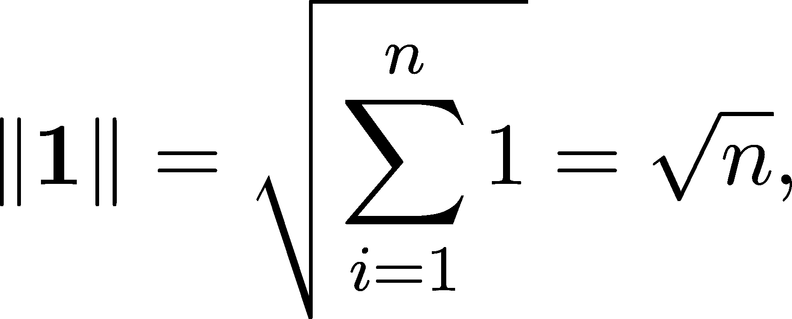

多变量函数

多变量微积分与单变量微积分有何不同？当我还是学生时，我有一位教授曾经说过类似的话：“多变量和单变量函数的行为是相同的，只不过你得写更多的东西。”

好吧，这个说法远离事实。试想一下我们在机器学习中做的事情：通过梯度下降训练模型；也就是说，找到一个使参数函数最小化的参数配置。在一维（虽然这个假设并不现实）中，我们可以通过导数来实现，就像我们在第 13.2 节中看到的那样。那么我们如何将导数扩展到多维呢？

多变量函数的输入是向量。因此，给定一个函数 f : ℝ^n →ℝ，我们不能仅仅定义

对应于定义 54 的类比。为什么？因为与向量 x[0] −x 的除法是没有定义的。

正如我们将看到的，多维微分要复杂得多。想想看：在一维中，只有两个方向，左和右。而即使是在二维中，每个点的方向也是无限多的。

那么，究竟什么是多变量函数呢？

## 第十九章：15.1 什么是多变量函数？

我们在第九章中介绍了函数，作为两个集合之间的映射。然而，我们只讨论了将实数映射到实数的函数。简单的标量-标量函数很适合传达思想，但我们周围的世界比这些可以描述的要复杂得多。在范围的另一端，集合-集合函数过于一般化，无法实际使用。

实际上，三个类别足够特殊，可以进行数学分析，但又足够通用，能够描述科学和工程中的模式：那些

1.  将标量映射到向量，也就是说，f : ℝ →ℝ^n，

1.  将向量映射到标量，也就是说，f : ℝ^n →ℝ，

1.  以及那些将向量映射到向量的函数，也就是说，f : ℝ^n →ℝ^m。

标量-向量变种称为曲线，向量-标量变种称为标量场，而向量-向量函数则是我们所说的向量场。这个命名有点抽象，所以让我们看看一些例子。

标量-向量函数，或者称为曲线，是运动的数学表示。环绕地球运行的空间站描述了一条曲线。股票市场中的股票轨迹也是如此。

给你一个具体的例子，标量-向量函数

描述了单位圆。这在图 15.1 中有所说明。

图 15.1：标量-向量函数，即曲线

并非所有曲线都是闭合的。例如，曲线

表示一个螺旋上升的运动，如图 15.2 所示。这些曲线称为开口曲线。

图 15.2：一条开放曲线

由于它们固有的描述轨迹的能力，标量-矢量函数在数学和科学中至关重要。你熟悉牛顿第二定律吗？它表明力等于质量乘以加速度。这可以通过方程 F = ma 来描述，这是一个常微分方程的实例。它的所有解都是曲线。

表面上看，标量-矢量函数与机器学习几乎没有关系，但实际上并非如此。尽管我们不会深入探讨它们，但它们在幕后有着重要的作用。例如，梯度下降就是一个离散化的曲线，正如我们在第 13.3 节看到的那样。

标量-矢量函数将是我们接下来几章的重点。当我说“多变量函数”时，我通常指的是标量-矢量函数。

想象一下山地景观的地图。它将高度——一个标量——映射到每个坐标，从而定义了表面。从数学角度来看，这只是一个函数 f : ℝ² → ℝ。

将标量场视为表面有助于构建几何直觉，给我们提供了一种可视化它们的方式，正如图 15.3 所示。（注意，对于大于二的维度，表面类比就不成立了。）

图 15.3：由标量-矢量函数给出的表面

首先让我们澄清符号。如果 f : ℝ^n → ℝ 是一个 n 变量的函数，我们可以写作 f(x)，其中 x ∈ ℝ^n，或者写作 f(x[1],…,x[n])，其中 x[i] ∈ ℝ，如果我们想强调它对变量的依赖关系。n 变量的函数与单一向量变量的函数是相同的。我知道这看起来很混乱，但相信我，你很快就会习惯的。

为了给出一个标量-矢量函数的具体例子，我们来考虑压力。压力是力的大小与接触表面积之比：

这可以看作是一个二变量函数：p(x,y) = x∕y。

为了说明在多维空间中问题可能变得多么复杂，考虑 (0,0) 周围的压力。尽管我们还没有讨论多变量函数的极限，但你觉得怎么样呢？

应该是？

基于我们为单变量函数定义极限的方式（见定义 51），

必须对所有可能的 x[n] 和 y[n] 选择匹配。这并非如此。考虑 x[n] = α²∕n 和 y[n] = α∕n，其中 α 是任意实数。通过这个选择，我们得到

因此，上述极限是没有定义的。我们在这里所做的只是沿着略微不同的轨迹逼近零，然而结果却完全混乱。在单变量的情况下，我们需要动用我们的智力才能产生这样的例子；而在多变量的情况下，简单的 x∕y 就足够了。

向量-向量函数称为向量场。例如，考虑我们的太阳系，用 ℝ³ 来建模。每个点都受到一个引力的影响，这个引力是一个向量。因此，引力可以通过 f : ℝ³ → ℝ³ 函数来描述，这也是向量场这个名称的由来。

尽管它们经常隐藏在背景中，向量场在机器学习中扮演着至关重要的角色。还记得我们在第 13.3 节中讨论的为什么梯度下降有效吗？（至少在一个变量的情况下。）我们在那儿遇到的所有微分方程都等同于向量场。

为什么？考虑微分方程 x^′ = f(x)。如果 x(t) 描述了一个物体的运动轨迹，那么它的导数 x^′(t) 就是它的速度。因此，我们可以将方程 x^′(t) = f(x(t)) 解释为在每个位置规定物体的速度。当物体在一维空间中运动时，这并不特别惊艳，但如果轨迹 x : ℝ → ℝ² 描述了平面上的运动，那么函数 f : ℝ² → ℝ² 可以直观地呈现出来。

例如，考虑一个简单的捕食者-猎物系统的人口动态。捕食者以猎物为食，因此在食物充足时，它们的数量会增长。反过来，过度捕食会减少猎物种群，导致捕食者的饥荒并减少它们的数量。这导致猎物种群的增长，循环再次开始。

如果 x1 和 x2 分别是猎物和捕食者种群的大小，那么它们的动态由著名的 Lotka-Volterra 方程描述：

如果我们将轨迹表示为标量-向量函数

然后导数为

由向量-向量函数给出

f 可以通过在平面上的每个点绘制一个向量来可视化，如图 13.4 所示。

图 15.4：由 Lotka-Volterra 方程给出的向量场

向量场在机器学习中有重要应用。正如我们很快会看到的，多变量导数（称为梯度）定义了一个向量场。

此外，正如单变量情况所示（见第 13.3 节），梯度下降算法将是由梯度的向量场确定的离散化轨迹。

现在我们理解了多变量函数的概念，让我们来看一个特殊情况。你知道我们的方法：举例子至关重要，每当可能时我们都会从举例开始。这次，我们将线性函数放大显微镜下观察。

## 15.2 多变量中的线性函数

数学中最重要的函数之一是线性函数。在一个变量的情况下，它的形式为 l(x) = ax + b，其中 a 和 b 是任意实数。

我们已经多次见过线性函数。例如，定理 77 说明，微分等同于找到最好的线性逼近。

线性函数，也就是形如

在多变量中，它们和在单变量中一样重要。

为了建立深刻的理解，我们将看看最简单的情况：二维平面上的一条直线。

图 15.5：平面上的一条直线

给定其法向量 m = (m[1],m[2]) 和任意点 v[0]，如果且仅当 m 和 x −v[0]正交时，向量 x 才在直线上，也就是说，如果

⟨m, x − v[0]⟩ = 0 (15.1)

保持不变。(15.1) 被称为直线的法向量方程。

通过利用内积的双线性特性，并用坐标表示⟨m,x⟩，我们可以简化 (15.1)。假设 m[2]≠0，也就是说，直线不与 x[2]轴平行，快速计算得到

这是单一变量 x[1]的线性函数的完整形式。系数 − 描述了斜率，而 ⟨m,v[0]⟩ 描述了截距。

换句话说，线性函数等同于形如(15.1)的向量方程，至少在一个变量的情况下是如此。

如果我们在更高维空间中应用相同的论证，会发生什么呢？在ℝ^(n+1)中，法向量方程

⟨m, x − v[0]⟩ = 0, m, x, v[0] ∈ ℝ^(n+1) (15.2)

定义了一个超平面，也就是一个 n 维平面。（比嵌入平面少一个维度，在我们的情况下是ℝ^(n+1)。）解开 (15.2)，我们得到

因此，n 个变量的线性函数的通用形式

起源于嵌入在(n + 1)维空间中的 n 维平面的法向量方程。

这也可以写成向量化形式

(15.3)

这是我们以后大多数情况下使用的方式。（注意，在查看向量 u ∈ ℝ^n 的矩阵表示时，我们总是使用列向量形式ℝ^(n×1)。此外，a 并不是平面的法向量。）

在我们继续研究多变量微积分的内部机制之前，我想强调一下，在机器学习中，多维度是如何让事情变得复杂的。

## 15.3 高维诅咒

首先，让我们谈谈优化。如果其他方法都失败了，优化一个单变量函数 f : [a,b] →ℝ 可能就像将 [a,b] 划分为 n 个点的网格，计算每个点的函数值，然后找到最小值/最大值一样简单。

在更高维度下我们无法做到这一点。为了理解为什么，考虑 ResNet18 这一著名的卷积神经网络架构。它有精确的 11,689,512 个参数。因此，训练等同于优化一个拥有 11,689,512 个变量的函数。如果我们在每个维度上构建一个包含两个点的网格，我们就会有 2¹¹⁶⁸⁹⁵¹² 个点需要对函数进行评估。相比之下，我们可观测到的宇宙中的原子数大约为 10⁸²。这个数字远远小于我们网格的大小。因此，在如此巨大的网格上进行网格搜索在当前是不可能的。我们不得不设计巧妙的算法来应对大维度空间的规模和复杂性。

另一个问题是，在高维空间中，球体会开始出现一种奇怪的现象。回想一下，根据定义，n 维空间中以点 x[0] ∈ℝ^n 为中心、半径为 r 的单位球是由以下方式定义的：

我们将其体积记作 V n。 (体积仅依赖于半径和维度，而与中心无关。)

结果表明，

其中 Γ(z) 是著名的伽马函数（[`en.wikipedia.org/wiki/Gamma_function`](https://en.wikipedia.org/wiki/Gamma_function)），它是阶乘的推广。

体积公式看起来可能很复杂，因为它涉及到伽马函数、π以及其他所有项，但我们可以聚焦于问题的核心。如果我们从单位球中切割出一个𝜀宽的外壳，会发生什么呢？

结果表明，单位球的体积集中在其外壳附近，如体积公式所示：

从启发式角度来看，这意味着如果你从单位球中随机选择一个点，那么在高维空间中，它距离中心的距离将接近 1。

换句话说，距离的变化并不像你直觉上所期望的那样。另一种看待这个问题的方法是研究从原点开始、朝每个可能的方向迈一步后到达某一点的影响。

如图 15.6 所示，这种现象在三维空间中也有类似的表现。

图 15.6：在三维空间中每个方向上迈出一步

我们走过的欧几里得距离是：

随着维度的增加，它会趋向无穷大。也就是说，单位立方体的对角线非常大。

这两种现象在实际应用中可能会带来显著的头痛。更多的参数意味着更具表现力的模型，但也使得训练变得更加困难。这就是所谓的“维度的诅咒”。

## 15.4 小结

在本章中，我们刚刚触及了多变量函数的表面。只要我们增加更多的维度，复杂度就会急剧上升。

例如，我们有三类：

1.  标量-向量函数 f : ℝ →ℝ^n,

1.  向量-标量函数 f : ℝ^n →ℝ,

1.  和向量-向量函数 f : ℝ^n →ℝ^m。

它们在机器学习中都是至关重要的。特征转换，如神经网络中的层，是向量-向量函数。损失地形由向量-标量函数给出，但训练是通过沿着（离散化的）标量-向量函数进行的，也被称为曲线。

除了更复杂的符号表示外，我们还必须应对维度的诅咒。这就是为什么优化百万变量的函数很困难：不仅参数空间变得巨大，而且距离的概念也开始失效。

现在我们对多变量函数有了一些直觉并熟悉了符号表示，接下来该深入探讨了。我们如何在更高维度中做微积分呢？让我们在下一章看看吧！

## 加入我们的 Discord 社区

与其他用户、机器学习专家以及作者本人一起阅读这本书。提问、为其他读者提供解决方案，通过“问我任何问题”环节与作者聊天，还有更多内容。扫描二维码或访问链接加入社区。[`packt.link/math`](https://packt.link/math)

