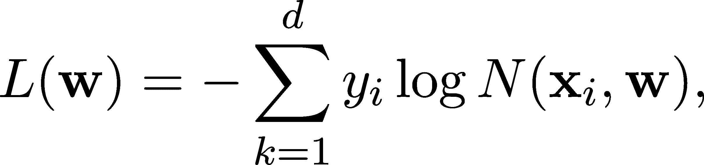
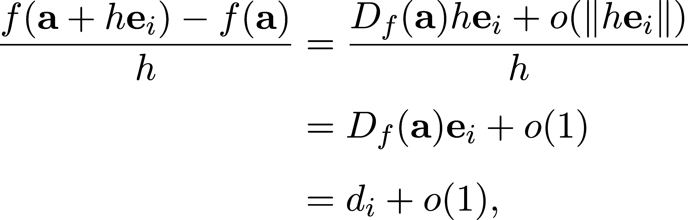
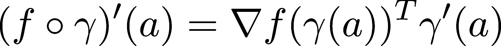

导数与梯度

现在我们理解了为什么多变量函数和高维空间比之前学习的单变量情况更复杂，是时候看看如何在一般情况下处理这些问题了。

快速回顾一下，我们在机器学习中的目标是优化拥有数百万个变量的函数。例如，考虑一个为二元分类训练的神经网络 N(x,w)，其中

+   x ∈ℝ^n 是输入数据，

+   w ∈ℝ^m 是压缩所有权重参数的向量，

+   而 N(x,w) ∈ [0,1]是预测值，表示属于正类的概率。

在比如二元交叉熵损失的情况下，我们有损失函数

其中 x[i]是第 i 个数据点，真实值 y[i] ∈{0,1}。看，我告诉过你，我们在多变量微积分中要写更多内容。（我们将在第二十章讨论二元交叉熵损失。）

训练神经网络与寻找 L(w)的全局最小值是一样的，如果它存在的话。我们已经看到如何在单变量情况下进行优化：

+   通过计算导数来找出增加的方向，

+   采取一个小步骤，

+   然后进行迭代。

为了使这在多变量情况下有效，我们需要推广导数的概念。我们可以迅速发现问题：因为向量的除法没有定义，所以差商

当 f : ℝ^n →ℝ是一个 n 变量的函数且 x,y ∈ℝ^n 是 n 维向量时，这个公式没有意义。

那么我们该如何理解它呢？这就是我们将在下一章学习的内容。

## 第二十章：16.1 偏导数与全导数

让我们更仔细地看看多变量函数！为了简化起见，设 f : ℝ² →ℝ为我们的二元函数。为了强调对单个变量的依赖，我们通常写成

这里有个技巧：通过固定其中一个变量，我们就能得到两个单变量函数！也就是说，如果固定 x[1] ∈ℝ²，我们就得到 x→f(x[1],x)，如果固定 x[2] ∈ℝ²，我们就得到 x→f(x,x[2])，这两者都是定义良好的单变量函数。把这个看作是通过平行于 x−z 或 y−z 轴的平面来切割函数图像，就像图 16.1 所示。被平面切割出来的部分是一个单变量函数。

图 16.1：用 x−z 平面切割曲面

我们可以通过差商的极限来定义这些函数的导数。这些被称为偏导数：

（请记住，x[1]表示中的变量，但在(x[1],x[2])的参数中是一个实际的标量值。这可能会让人感到困惑，但你很快就能理解它。）

对于一般的多变量函数，定义是类似的；我们只需要写得更多。在那里，f : ℝ^n →ℝ 在点 x = (x[1],…,x[n])处关于第 i 个变量的偏导数通过以下方式定义：

.png)(16.1)

在多变量微积分中，最大的挑战之一就是管理不断增加的符号复杂性。只要看看上面的差商：

这不是最美观的表示方式，并且这种符号复杂性可能会迅速堆积。幸运的是，线性代数来解救我们！我们不仅可以将变量压缩成向量 x = (x[1],…,x[n])，还可以使用标准基

将差商写成

因此，(19.1) 可以简化。通过这种新发现的形式，我们准备好为偏导数做出简洁和正式的定义。

定义 66\.（偏导数）

设 f : ℝ^n →ℝ 是一个 n 变量的函数。f 在点 x = (x[1],…,x[n])处关于第 i 个变量的偏导数通过以下方式定义：

如果上述极限存在，我们称 f 在第 i 个变量 x[i]处是部分可微的。

偏导数再次是一个向量-标量函数。因为这个原因，它通常被写作 f，反映出符号  可以被看作一个将函数映射到函数的函数。我知道，这有点抽象，但你很快就会习惯的。

如往常一样，偏导数有几种替代符号。包括符号

+   f[x[i]](x),

+   D[i]f(x),

+   ∂[i]f(x)

表示 f 在 x 处的第 i 个偏导数。为了简化，我们将使用老式符号 (x)。

最好从几个例子开始，来说明偏导数的概念。

示例 1\. 让

为了计算，例如，∂f∕∂x[1]，我们固定第二个变量，并将 x[2]视为常数。形式上，我们得到单变量函数

其导数给出了第一个偏导数：

同样，我们得到

一旦你习惯了固定变量的思维方式，就可以在不写出所有中间步骤的情况下执行偏微分。

示例 2\. 让我们来看一个更复杂的例子。定义

通过固定 x[2]，我们得到一个复合函数。因此，链式法则用于计算第一个偏导数：

类似地，我们得到

（我强烈建议您逐步进行上述计算，即使您理解所有中间步骤，也要作为练习完成。）

示例 3\. 最后，让我们看一个在一个变量上部分可微但在另一个变量上不可微的函数。定义函数

由于 f(x[1],x[2]) 不依赖于 x[1]，我们可以看到，通过固定 x[2]，结果函数是常数。因此，

在所有地方成立。然而，在 x[2] 中，0 处存在不连续性；因此， 在该处未定义。

### 16.1.1 梯度

如果一个函数在每个变量上都部分可微，我们可以将所有的导数合并成一个单一的向量来形成梯度。

定义 67\. （梯度）

设 f : ℝ^n → ℝ 是一个在其所有变量上部分可微的函数。那么，其梯度由（列）向量定义为

需要做一些说明。首先，符号 ∇ 被称为 nabla，是一个用于表示梯度的符号。

第二，梯度可以看作是一个向量-向量函数。为了理解这一点，考虑已经熟悉的函数 f(x[1],x[2]) = x[1]² + x[2]²。f 的梯度是

或者

以向量化形式表示。我们可以通过在每个点 (x[1],x[2]) ∈ ℝ² 画出向量 ∇f(x[1],x[2]) 来可视化这一点。

图 16.2：由 x[1]² + x[2]² 的梯度给出的向量场

因此，您可以将 ∇f 看作是一个向量-向量函数 ∇f : ℝ^n → ℝ^n。给定点 x 处的梯度是通过评估该函数得到的，得到 (∇f)(x)。

为了清晰起见，省略了括号，得到了大家熟悉的符号 ∇f(x)。

### 16.1.2 高阶偏导数

向量-标量函数 f : ℝ^n → ℝ 的偏导数本身也是向量-标量函数。因此，我们可以再进行一次偏微分！

如果它们存在，二阶偏导数由以下公式定义：

.png)(16.2)

其中 a ∈ ℝ^n 是任意向量。（当第二次偏导数是关于同一变量的偏导时，(16.2) 由 (a) 简写表示。）

这个定义引出了一个问题：求导的顺序是否可以互换？也就是说，是否有

这个问题的答案相当令人惊讶：在一些温和的假设下，求导顺序是可以互换的，但在一般情况下不是。关于这一点有一个著名的定理，我们不会证明，但它是非常重要的。

定理 98\.

设 f : ℝ^n → ℝ为任意的向量-标量函数，且 a ∈ ℝ^n。如果存在一个以 a 为中心的球 B(𝜖,a) ⊆ ℝ^n，使得 f 在 B(𝜖,a)的所有点处具有连续的二阶偏导数，则

对于所有 i = 1,…,n 成立。

定理 98 被称为施瓦茨定理、克莱罗定理或杨氏定理。

### 16.1.3 总导数

偏导数似乎将可微性的概念推广到多变量函数。然而，似乎还有什么缺失。让我们稍微回顾一下单变量的情况。

回想一下，根据定理 77，单变量函数 f : ℝ → ℝ在给定点 a 处的可微性等价于由线性函数进行的局部近似

如果 x 靠近 a，l(x)也将接近 f(x)。此外，这是我们在 a 附近所能做的最佳线性近似。在单变量中，这相当于求导。

这给了我们一个想法：尽管像这样的差商在多变量中不存在，但多变量线性函数的最佳局部近似却存在！

因此，总可微性的概念就此诞生。

定义 68.（总可微性）

设 f : ℝ^n → ℝ为一个 n 变量的函数。如果 f 在 a ∈ ℝ^n 处完全可微（或简称为可微），则存在一个行向量 Df ∈ ℝ^(1×n)，使得

f(x) = f(a) + Df(x − a) + o(∥x − a∥) (16.3)

对于所有 x ∈ B(𝜖,a)，其中𝜖/span>0，B(𝜖,a)由下式定义

（换句话说，B(𝜖,a)是以 a 为中心，半径为𝜖/span>0 的球。）当存在时，向量 Df 称为 f 在 a 处的总导数。

回想一下，当没有明确说明时，我们使用列向量，因为我们希望将线性变换写成 Ax 的形式，其中 A ∈ ℝ^(m×n)且 x ∈ ℝ^(n×1)。因此，公式的“维度学” 

计算得出。（别被愚弄了，ℝ^(1×1)是一个标量。）

让我们解开总可微性的概念。形式（16.3）意味着一个完全可微的函数 f 等于线性部分 f(a) + Df(x − a)加上一个小误差。

由线性部分给出的表面称为切平面。我们可以为二变量函数可视化它。

图 16.3：切平面

不出所料，偏导数和总导数有着密切的关系。

定理 99.（总导数与偏导数）

设 f : ℝ^n → ℝ为一个在 a ∈ ℝ^n 处完全可微的函数。则，它的所有偏导数在 a 处都存在，并且

f(x) = f(a) + ∇f(a)^T (x − a) + o(∥x − a∥) (16.4)

对于所有 a ∈ B(𝜀,a)，𝜀/span>0，成立。（即，Df = ∇f(a)^T 。）

换句话说，方程 (16.4) 表明最佳线性近似的系数等于偏导数。

证明。因为 f 在 a 处是完全可微的，定义告诉我们 f 可以写成如下形式

其中 Df = (d[1],…,d[n]) 是描述线性部分系数的向量。

我们的目标是证明

其中 e[i] 是单位（列）向量，其第 i 个分量为 1，其余分量为 0。

让我们快速做个计算！根据我们所知道的，我们有

从而确认 lim[h→0] = d[i]，这正是我们需要证明的。

那么，总微分的麻烦在哪里呢？定理 99 告诉我们，总微分是比偏微分更强的条件。

出人意料的是，反方向不成立：偏导数的存在并不意味着总微分性，如示例所示。

如图所示。这个函数在 0 处有所有的偏导数，但总导数不存在。（你可以通过画图或注意到函数 1 −d^T x 永远不可能是 o(∥x∥) 来证明这一点，无论 d 的选择如何。）

备注 11\. （总导数作为算子）

就像单变量函数一样，f : ℝ^n →ℝ 的总导数是一个函数 D[f] : ℝ^n →ℝ^n。

在最高层次的抽象中，我们可以将总导数看作是一个算子，它将一个向量标量函数映射到一个向量向量函数：

其中 A^B 表示将 A 映射到 B 的所有函数的集合。

你不需要完全理解这一点，但相信我，你的思维越抽象，你就会越强大。

### 16.1.4 方向导数

到目前为止，我们谈了两种导数：描述沿固定轴变化速率的偏导数，以及给出给定点函数最佳线性近似的总导数。

偏导数只关注几个特定的方向。然而，在多变量中，这不是故事的全部。通过标准的正交归一基向量 e[i]，偏导数的定义为

.png)(16.5)

正如我们之前看到的，这些描述了沿各维度的变化速率。然而，标准的正交归一向量仅是一些特定的方向。

那么在任意方向 v 下呢？我们可以定义沿这些方向的导数吗？当然！没有任何东西阻止我们在 (16.5) 中用 v 替换 e[i]。因此，方向导数应运而生。

定义 69.（方向导数）

设 f : ℝ^n →ℝ 是一个 n 个变量的函数，v ∈ℝ^n 是一个任意向量。f 在 v 方向上的方向导数由极限定义：

好消息：方向导数可以通过梯度来描述！

定理 100.

设 f : ℝ^n →ℝ 是一个 n 个变量的函数。如果 f 在 a ∈ℝ^n 处全微分，那么它在所有方向上的方向导数都存在，并且

证明。由于全微分性，定理 103 表明：

在 a 附近。因此，

给出：

如我们所需的那样证明。

换句话说，定理 100 表示，无论方向 v 如何，方向导数都可以用梯度和 v 来表示。如果你仔细想一想，这真的很惊人：沿着 n 个特定方向的变化率决定了其他任何方向的变化率。

### 16.1.5 梯度的性质

在一维情况下，我们已经学到，如果 f 在某个 a 处的导数为正，那么 f 在 a 附近是增加的。（如果导数为负，则 f 是减少的。）如果我们将 f'(a) 看作一个一维向量，那么导数指向增大的方向。

这在高维空间中也成立吗？是的，这就是梯度下降法有效的原因。

定理 101.（梯度决定增加的方向）

设 f : ℝ^n →ℝ 是一个 n 个变量的函数，假设 f 在 a ∈ℝ^n 处全微分。

然后

.png)(16.6)

我知道，(16.6) 很复杂，所以让我们来详细解析一下。首先，从神秘的 argmax 开始。对于给定的函数 f，

表示在集合 S 上最大化 f 的值。由于最大值可能不唯一，argmax 可能会得到一个集合。（argmin 的定义相同，只是取最小值而不是最大值。）

因此，英文中，(16.6) 表明，在 a ∈ℝ^n 处，最大化方向导数的单位方向是归一化的梯度。现在我们准备好看到证明了！

证明。你还记得柯西-施瓦茨不等式（定理 8）吗？那是很久以前的事了，让我们来回顾一下！在向量空间 ℝ^n 中，柯西-施瓦茨不等式告诉我们，对于任何 x, y ∈ℝ^n，

现在，正如定理 100 所暗示的，方向导数可以写作

结合柯西-施瓦茨不等式，我们得到

通过将方向限制为单位向量，

.png)(16.7)

如此，方向导数必须小于或等于梯度的范数。（至少，在单位长度的方向向量上。）

然而，通过让 v[0] = ∇f(a)∕∥∇f(a)∥，我们得到

因此，通过选择 v[0] = ，可以在(16.7)中达到等式。这意味着  在 a 点最大化了方向导数，这就是我们需要证明的。

到此，我们已经掌握了多变量的微分基础。总结一下，我们已经学到，导数的差商定义不能直接推广到多变量，但我们可以将除一个变量外的其他变量固定，从而使差商成立，从而得到偏导数。

另一方面，线性近似定义在多维空间中也适用，但不是

就像我们在单变量时那样，我们得到

其中，导数的类比是梯度向量 ∇f(a) ∈ℝ^n。

即使我们第一次学习单变量微分时，我也曾告诉你，局部线性近似定义总有一天会派上用场。那个时候就是现在，我们正在收获成果。很快，我们将全面了解梯度下降。

## 16.2 向量值函数的导数

在单变量情况下，定义高阶导数是很简单的。我们只需要不断地进行求导：

等等。然而，对于多变量函数来说，这并不是那么简单。

到目前为止，我们只讨论了梯度，这是向量-标量函数的导数的推广。

由于 ∇f(a) 是列向量，梯度是一个向量-向量函数 ∇ : ℝ^n →ℝ^n。我们只知道如何计算向量-标量函数的导数。是时候改变这一点了！

### 16.2.1 曲线的导数

曲线，通常描述动态系统的解，是数学中最重要的对象之一。虽然我们在机器学习中并不显式使用它们，但它们在诸如梯度下降的算法中潜在地起作用。（在这里，我们遍历一个离散化的曲线，最终到达局部最小值。）

从形式上讲，曲线——即标量-向量函数——由一个函数给出

其中 γ[i] : ℝ →ℝ 函数是经典的一元标量-标量函数。由于自变量通常表示时间，因此习惯上用 t 来表示它。

我们可以逐分量地对 γ 求导：

如果我们确实将 γ(t) 想象为空间中的一条轨迹，则 γ′(t) 是 γ 在 t 处的切向量。由于微分是逐分量进行的，定理 77 说明，如果 γ 在某个 a ∈ℝ 处可微，

γ(t) = γ(a) + γ′(t)^T (t − a) + o(|t − a|) （16.8）

在那里。方程式（16.8）是一个真正的向量化公式：一些分量是向量，一些是标量。然而，这很简单，并且对我们来说非常有意义。隐藏向量和矩阵的复杂性是线性代数的真正力量。

很容易看出，对于任意两条曲线 γ, η : ℝ →ℝ^n，微分是可加的，即 (γ + η)^′ = γ^′ + η^′。当我们将标量-向量函数与向量-标量函数复合时，会发生什么呢？

这种情况在机器学习中非常常见。比如，假设 L : ℝ^n →ℝ 描述的是损失函数，而 γ : ℝ →ℝ^n 是我们在参数空间 ℝ^n 中的轨迹，复合函数 f(γ(t)) 描述了时间 t 时刻的模型损失。因此，为了计算 (f ∘γ)^′，我们必须推广链式法则。

定理 102.（标量-向量函数和向量-标量函数复合的链式法则）

设 γ : ℝ →ℝ^n 和 f : ℝ^n →ℝ 为任意函数。如果 γ 在某个 a ∈ℝ 处可微，且 f 在 γ(a) 处可微，则 f ∘γ : ℝ →ℝ 也在 a 处可微，且

在那里。

证明。由于 f 在 γ(a) 处可微，定理 99 给出：

因此，

![(f ∘γ )′(a) = lim f(γ(t))−f(γ(a)) t→a t− a T γ(t)−γ(a)- = ∇f (γ(a)) lit→ma [ t− a + o(1)] T ′ = ∇f (γ(a)) γ (a), ](img/file1532.png)

这就是我们要证明的。

### 16.2.2 雅可比矩阵和海森矩阵

现在，我们的任务是将导数扩展到向量-向量函数。设 f : ℝ^n →ℝ^m 为一个这样的函数。通过显式地写出 f 的输出，我们可以将其分解为多个分量：

其中 f[i] : ℝ^n →ℝ 是向量-标量函数。

自然的想法是计算 f[i] 的偏导数，将它们压缩成一个矩阵。我们就这么做！

定义 70.（雅可比矩阵）

设 f : ℝ^n →ℝ^m 为任意的向量-向量函数，假设

其中所有的 f[i] : ℝ^n → ℝ 都是在某个 a ∈ ℝ^n 处（部分）可微的。矩阵为

这被称为 f 在 a 处的 Jacobian。

换句话说，Jacobian 的行是 f[i] 的梯度：

我有个好消息：f 在 a 附近的最佳局部线性近似由下式给出

如果最佳局部线性近似存在。于是，Jacobian 成为梯度的适当概括。

我们可以利用 Jacobian 来概括向量-标量函数的二阶导数的概念：通过计算梯度的 Jacobian，我们得到一个特殊的矩阵，它是二阶导数的类比。

定义 71.（Hessian 矩阵）

设 f : ℝ^n →ℝ 是一个任意的向量-标量函数，并假设其所有二阶偏导数在 a ∈ℝ^n 处存在。

矩阵

这被称为 f 在 a 处的 Hessian。

换句话说，

通过定义得以成立。此外，如果 f 行为良好（例如，所有二阶偏导数都存在且连续），定理 98 表明 Hessian 是对称的；也就是说，Hf = Hf^T。

### 16.2.3 向量-向量函数的总导数

最后一个概括。（我保证。）回忆一下，梯度的存在（即，部分可微性）并不意味着向量-标量函数的整体可微性，如该例所示

显示在零处。

对于向量-向量函数同样成立，因为 Jacobian 是梯度的概括，而不是总导数。

最好快速“撕下创可贴”，并为向量-向量函数定义总导数。这个定义可能有点抽象，但相信我，这项投资将在讨论链式法则时得到回报。（链式法则是反向传播算法的基础，而反向传播使得梯度下降的计算成为可能。）

定义 72.（向量-向量函数的整体可微性）

设 f : ℝ^n →ℝ^m 是一个任意的向量-向量函数。我们说 f 在 a ∈ℝ^n 处是整体可微的（或简略地称为可微的），如果存在矩阵 Df ∈ℝ^(m×n)，使得

f(x) = f(a) + Df(x − a) + o(∥x − a∥)（16.9）

对所有 x ∈B(𝜖,a) 都成立，其中 𝜖/span>0 且 B(𝜖,a) 定义为

（换句话说，B(𝜖,a) 是以 a 为中心、半径为 𝜖/span>0 的球体。）当存在时，矩阵 Df 被称为 f 在 a 处的总导数。

注意到定义 72 几乎与定义 68 完全相同，唯一不同的是这次“导数”是一个矩阵。

你可能不惊讶地听到，它与雅可比矩阵的关系与向量-标量情况下的梯度和全导数相同。

定理 103.（全导数与偏导数）

设 f : ℝ^n →ℝ^m 是一个在 a ∈ℝ^n 处完全可微的函数。那么，它的所有偏导数在 a 处存在，并且

证明几乎与定理 99 的证明相同，只是符号更复杂。我强烈建议你逐行推导，因为这种脑力训练有助于你更好地适应矩阵的实际应用。

按分量来看，全导数可以写成

通过引入记号

全导数 Df 可以写成块状形式。

![ [-∂f -∂f -∂f ] Df (a ) = ∂x1(a) ∂x2(a) ... ∂xn(a) ](img/file1545.png)

和

### 16.2.4 导数与函数运算

我们已经将导数的概念推广到尽可能广泛的程度。现在是时候研究它们与两个基本的函数运算——加法和复合——之间的关系了。（由于高维空间中没有向量乘法，向量-向量函数的乘积和比值是未定义的。）

我们从更简单的开始：加法。

定理 104.（全导数的线性性质）

设 f,g : ℝ^n →ℝ^m 是两个在某个 a ∈ℝ^n 处可微的向量-向量函数，且设α,β ∈ℝ为两个任意标量。

然后，αf + βg 在 a 处也是可微的，并且

那里。

证明。由于全微分，（16.9）意味着

这意味着

这是我们需要展示的内容。

线性是始终可取的，但我们需要的是链式法则的终极推广。我们之前看到过标量-向量和向量-向量函数的特殊情况（见定理 102），但我们需要更进一步。

多变量链式法则在机器学习中极其重要。神经网络是一个复合函数，层次结构充当了其组成部分。在梯度下降过程中，我们使用链式法则来计算这个复合函数的导数。

定理 105.（多变量链式法则）

设 f : ℝ^m →ℝ^l，g : ℝ^n →ℝ^m 是两个向量-向量函数。如果 g 在 a ∈ ℝ^n 处完全可微，且 f 在 g(a)处完全可微，则 f ∘g 在 a 处也完全可微，并且

Df∘g = Df) Dg (16.10)

成立。

对我们有利的是，复合函数的导数（16.10）由两个矩阵的乘积给出。由于矩阵乘法可以快速进行，这是个好消息。

我们将看到定理 105 的两个证明。一个使用超光速引擎，另一个通过将一般情况简化为定理 102 展示了更多内容。两者都提供了丰富的见解。让我们从重型机械开始。

证明。（第一种方法。）

由于 f 在 g(a)处完全可微，方程（16.9）意味着

反过来，由于 g 在 a 处完全可微，我们有

因此，我们可以继续计算

![f(g (x )) = f(g(a)) + Df (g(a))(g(x )− g(a)) + o(∥g(x) − g(a)∥) = f(g(a)) + D (g(a))D (a)(x − a) f g + Df (g (a ))[o(∥x− a ∥)+ o(∥g(x)− g(a)∥)], ◟-----------------◝◜----------------◞ =o (∥x−a∥) ](img/file1552.png)

证明 f ∘g 在 a 处完全可微，且具有全导数

这是我们需要展示的内容。

现在，关于第二个证明。

证明。（第二种方法。）

让我们稍微分析一下 Df∘g。写出 f∘g 的各个组成部分，我们得到

根据定义，Df∘g 的第 i 行第 j 列是

如果你足够长时间看它，你会意识到(a)是单变量函数的导数。事实上，要求导的函数是曲线的组合

以及向量-标量函数 f[i] : ℝ^m → ℝ。因此，标量-向量和向量-标量函数的链式法则（由定理 102 给出）可以应用：

其中g(a)是按分量计算的导数

总结一下，我们得到

这是矩阵乘积 Df)Dg 中第 i 行第 j 列的元素，因此

这是我们必须展示的内容。

通过掌握向量-向量函数的全导数概念和一般的链式法则，我们准备好实际处理多变量函数了。因此，我们的下一站是奠定优化的基础。

## 16.3 总结

你现在应该知道：数学成功的一半在于选择正确的表示法和符号。尽管多变量微积分看起来异常复杂，但如果我们对线性代数有很好的理解，它就变得轻松了。这也是我们为何从向量和矩阵开始的原因！从 f(x[1],…,x[n]) 到 f(x) 是一项重要的进展。

在这一章中，我们学到了多维度的微分比单变量情况稍微复杂一些。首先，我们定义了偏导数：

其中，e[i] 是一个向量，其第 i 个分量为 1，其他分量为 0。我们可以将  视为通过固定 f 的除第 i 个变量外所有变量所得到的单变量函数的导数。所有的偏导数组成梯度：

然而，偏导数并不完全是单变量导数的完美类比。在单变量的情况下，我们知道导数是最好的局部线性近似，而这正是可以推广到多变量的版本。因此，我们说 f 在 a ∈ ℝ^n 处是全微分的，如果它可以写成以下形式：

在机器学习中，最重要的工具之一就是多变量链式法则。

这就是用来实际计算导数的工具。如果没有链式法则，我们就没有有效的方法来计算梯度。因此，正如名字所示，梯度是梯度下降法的基石。我们已经理解了单变量版本，现在是时候深入研究一般的多变量版本了。下一章见！

## 16.4 问题

问题 1. 计算以下函数的偏导数和 Hessian 矩阵。

(a) f(x[1],x[2]) = x[1]^(3x[2]²) + 2x[1]x[2] + x[2]³ (b) f(x[1],x[2]) = e^(x[1]²−x[2]) + sin(x[1]x[2]) (c) f(x[1],x[2]) = ln(x[1]² + x[2]²) + x[1]e^(x[2]) (d) f(x[1],x[2]) = cos(x[1]x[2]) + x[1]² sin(x[2]) (e) f(x[1],x[2]) = f(x[1],x[2]) = 

问题 2. 计算以下函数的 Jacobian 矩阵。

(a)

(b)

(c)

(d)

(e)

问题 3. 设 f(x[1],x[2]) = x[1]。证明 f 在 (0,0) 处是部分可微的，但不是全微的。

## 加入我们的 Discord 社区

与其他用户、机器学习专家以及作者本人一起阅读本书。提问、为其他读者提供解决方案、通过问我任何问题环节与作者交流，等等。扫描二维码或访问链接加入社区。[`packt.link/math`](https://packt.link/math)

