多变量优化

嘿！我们已经到了微积分学习的最后一个检查点。还缺什么？当然是梯度下降。

在之前的八章中，我们将所有内容都整理好了，现在是时候下手了。首先，我们将多变量函数代码化。之前，我们构建了一个方便的接口形式——Function 类，用来表示可微函数。在上一章进行了较长的设置后，我们现在可以轻松扩展它，并且利用向量化的强大功能，我们甚至不需要做太多修改。开始吧！

## 第二十一章：17.1 多变量函数的代码实现

自从我们将理论转化为代码以来已经有一段时间了。那么，让我们来看看多变量函数吧！

上一次，我们构建了一个函数基类，包含两个主要方法：一个用于计算导数（Function.prime），另一个用于获取参数字典（Function.parameters）。

这并不会让人感到惊讶：多变量函数基类与此没有太大区别。为了清晰起见，我们将适当重命名主方法为 grad。

```py
class MultivariableFunction: 
    def __init__(self): 
        pass 

    def __call__(self, *args, **kwargs): 
        pass 

    def grad(self): 
        pass 

    def parameters(self): 
        return dict()
```

让我们立即来看几个例子。最简单的一个是平方欧几里得范数 f(x) = ∥x∥²，它与均方误差函数非常相似。它的梯度由下式给出：

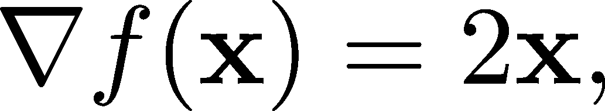

因此，一切准备就绪，可以进行实现。由于我们使用 NumPy 数组来表示向量，我们也将它们作为输入。

```py
import numpy as np

class SquaredNorm(MultivariableFunction):
    def __call__(self, x: np.array):
        return np.sum(x**2)

    def grad(self, x: np.array):
        return 2*x
```

注意，SquaredNorm 与 f(x) = ∥x∥² 在数学意义上是不同的，因为它接受任何 NumPy 数组，而不仅仅是一个 n 维向量。现在这不是问题，但稍后会有问题，所以请记住这一点。

另一个例子可以通过参数线性函数给出

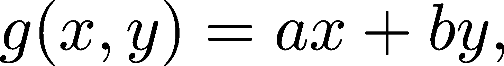

其中 a, b ∈ ℝ 是任意参数。让我们看看如何实现 g(x, y)！

```py
class Linear(MultivariableFunction): 
    def __init__(self, a: float, b: float): 
        self.a = a 
        self.b = b 

    def __call__(self, x: np.array): 
        #x0022;"/span> 
        x: np.array of shape (2, ) 
        #x0022;"/span> 
        x = x.reshape(2) 
        return self.a*x[0] + self.b*x[1] 

    def grad(self, x: np.array): 
        return np.array([self.a, self.b]).reshape(2, 1) 

    def parameters(self): 
        return {"/span>a self.a, /span>b self.b}
```

为了检查我们的实现是否正确，我们可以在一个简单的例子中快速测试一下。

```py
g = Linear(a=1, b=-1) 

g(np.array([1, 0]))
```

```py
np.int64(1)
```

或许我们直到现在才开始关注这个问题，但相信我，指定输入和输出的形状至关重要。在做数学时，我们可以灵活地使用符号，将任何向量 x ∈ ℝ^n 视为列向量或行向量，但令人痛苦的是，实践中情况并非如此。

正确地跟踪数组形状至关重要，它可以为你节省数百小时的时间。绝不是开玩笑。

## 17.2 最小值和最大值，再次探讨

在单变量的情况下，我们成功地使用导数找到了可微函数的局部最优解。

回顾一下，如果 f : ℝ → ℝ 在处处可微，那么定理 87 给出的结论是

(a) f^′(a) = 0 且 f^(′′)(a) > 0 表示局部最小值。(b) f^′(a) = 0 且 f^(′′)(a) < 0 表示局部最大值。

(简单的 f^′(a) = 0 不足以确定最值，正如 f(x) = x³ 在 0 处的例子所示。)

我们能在多变量的情况下做类似的事情吗？

从一开始似乎就有一个问题：导数不是标量（因此，我们不能将其等于 0）。

这很容易解决：条件 f^′(a) = 0 的类似条件是 ∇f(a) = (0,0,…,0)。为了简便，零向量 (0,0,…,0) 也可以表示为 0\。别担心，这不会让人困惑；从上下文中可以清楚地理解。引入零向量的新符号只是增加了复杂性。

我们可以通过切平面来直观地理解临界点的情况。在单变量情况下，我们已经看到过这个：如图 17.1 所示，f^′(a) = 0 表明切线是水平的。

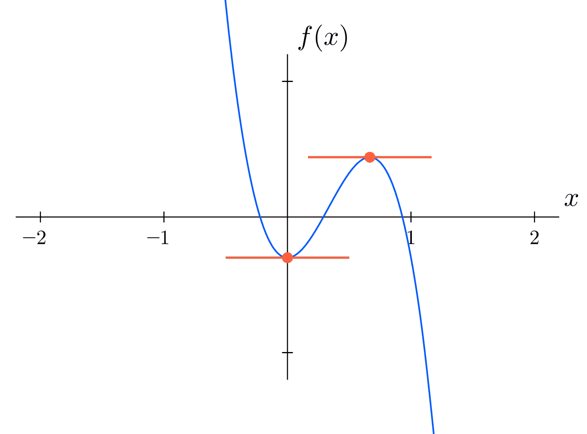

图 17.1：单变量的局部极值

在多变量情况下，情况类似：∇f(a) = 0 表示最佳的局部线性逼近（16.3）是常数；即切平面是水平的。（如图 17.2 所示。）


图 17.2：多变量的局部极值

那么，∇f(a) = 0 表示什么呢？类似于单变量的情况，a ∈ℝ^n 如果满足 ∇f(a) = 0，则称为 f 的临界点。这种相似性不仅体现在术语上，我们在多变量情况下也有三种选择：a 是

1.  局部最小值，

1.  局部最大值，

1.  或者都不是。

在多变量情况下，非极值的临界点称为鞍点，因为二维情况下的形状与实际的马鞍非常相似，正如你将要看到的那样。鞍点是高维空间中单变量拐点的类比。函数

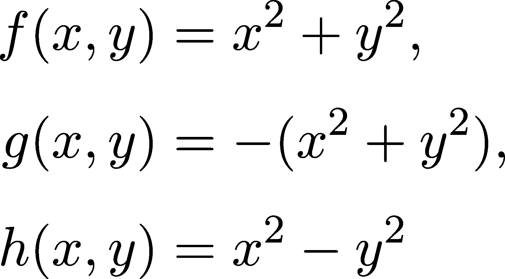

在 (0,0) 处提供了所有三种情况的示例，如图 17.3、图 17.4 和图 17.5 所示。（记住，局部极值可能是全局极值。）

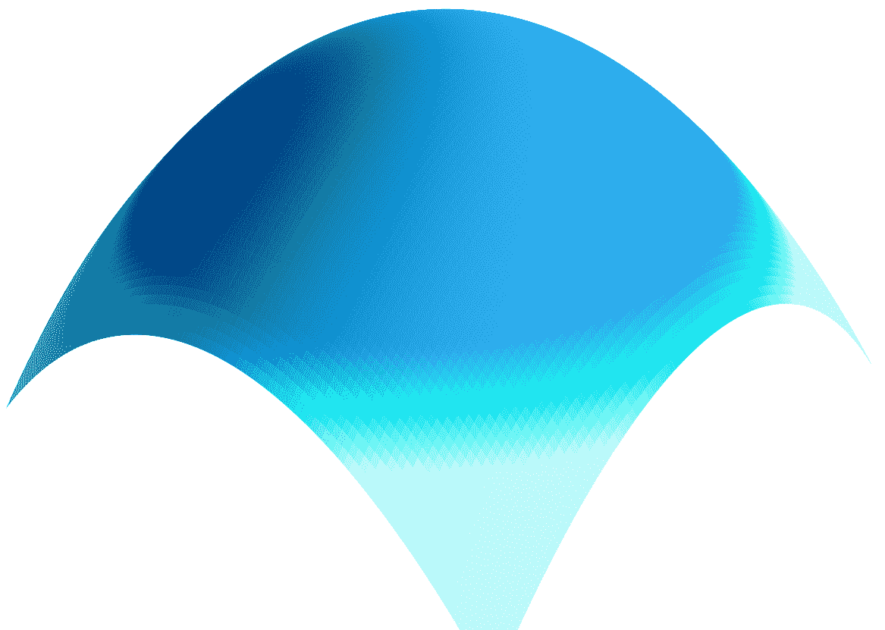

图 17.3：一个（局部）最大值


图 17.4：一个（局部）最小值

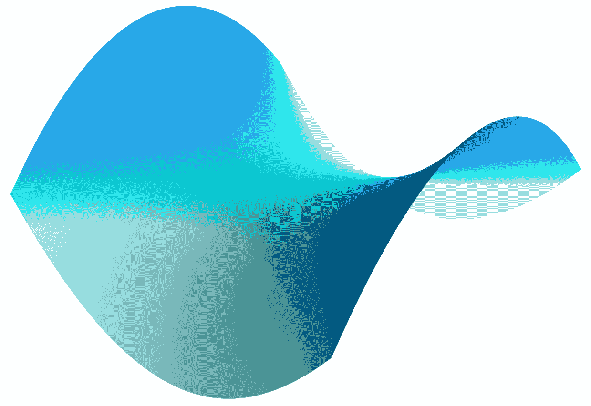

图 17.5：一个鞍点

为了理清思路，我们从定义和定理开始制定。

定义 73.（临界点）

设 f : ℝ^n →ℝ 为任意向量-标量函数。我们说 a ∈ℝ^n 是 f 的临界点，如果满足以下条件之一：

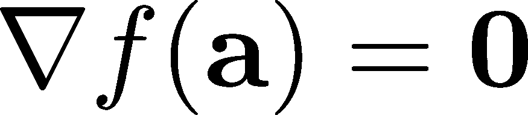

保持成立，或者 f 在至少一个变量上不可偏微分。

第二种情况（f 在 a 处不可微）是为了处理像 f(x,y) = jxj + jyj 这样的情况。

为了精确起见，我们也来定义多维的局部极值。

定义 74.（局部最小值和最大值）

设 f : ℝ^n →ℝ 为任意向量-标量函数，a ∈ℝ^n 为任意点。

(a) 如果存在 𝜀/span>0，使得

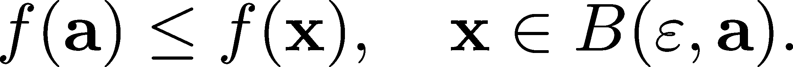

(b) a 是严格局部最小值，如果存在 𝜀/span>0，使得

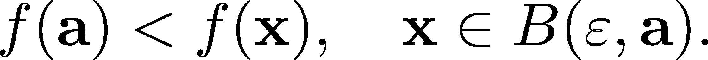

(c) a 是局部最大值，如果存在 𝜀/span>0，使得

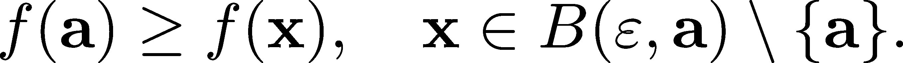

(d) a 是严格局部最大值，如果存在 𝜀/span>0，使得

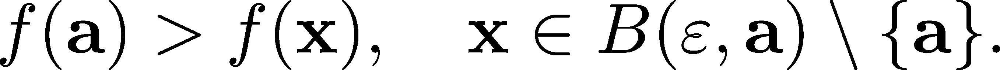

正如 x² −y² 的例子所示，临界点不一定是局部极值，但局部极值总是临界点。接下来的结果，类似于定义 73，对此进行了数学上的精确描述。

定理 106\。

令 f : ℝ^n →ℝ 为一个任意的向量-标量函数，假设 f 在某个 a ∈ℝ^n 处对所有变量部分可微。

如果 f 在 a 处有局部极值，则 ∇f(a) = 0。

证明：这是定理 86 的直接结果，因为如果 a = (a[1],…,a[n]) 是向量-标量函数 f 的局部极值，那么它也是单变量函数 h→f(a + he[i]) 的局部极值，其中 e[i] 是一个向量，其第 i 个分量为 1，其余分量为 0。

根据定义 66 给出的偏导数定义，

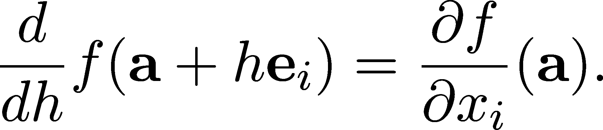

因此，定理 86 给出了

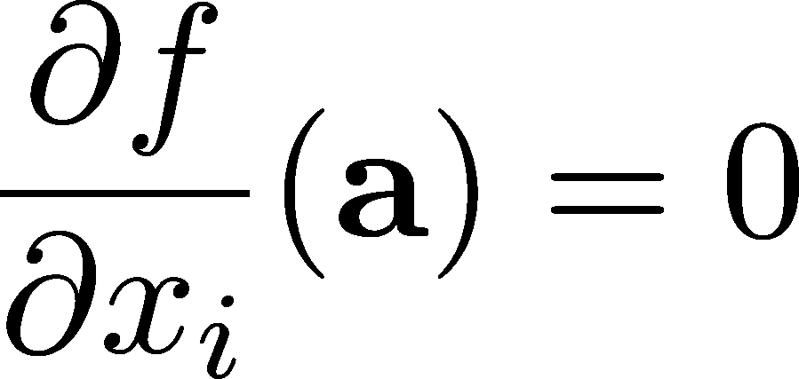

对所有 i = 1,…,n，给定 ∇f(a) = 0。

那么，我们如何通过导数来找到局部极值呢？正如我们之前所建议的，研究二阶导数将帮助我们在临界点中定位极值。不幸的是，n 变量的情况要复杂得多，所以我们首先集中讨论二元情况。

定理 107\。（二元函数的二阶导数检验）

令 f : ℝ² →ℝ 为一个任意的向量-标量函数，假设 f 在某个 a ∈ℝ² 处部分可微。并且假设 a 是一个临界点，即 ∇f(a) = 0。

(a) 如果 detHf/span>0 且 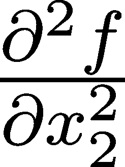/span>0，则 a 是局部最小值。

(b) 如果 detHf/span>0 且 /span>0，则 a 是局部最大值。

(c) 如果 detHf/span>0，则 a 是一个鞍点。

我们不会证明这一点，但有一些说明是必要的。首先，由于 Hessian 行列式可能为 0，定理 107 并未涵盖所有可能的情况。

最好看几个例子，因此让我们回顾一下之前看到的函数

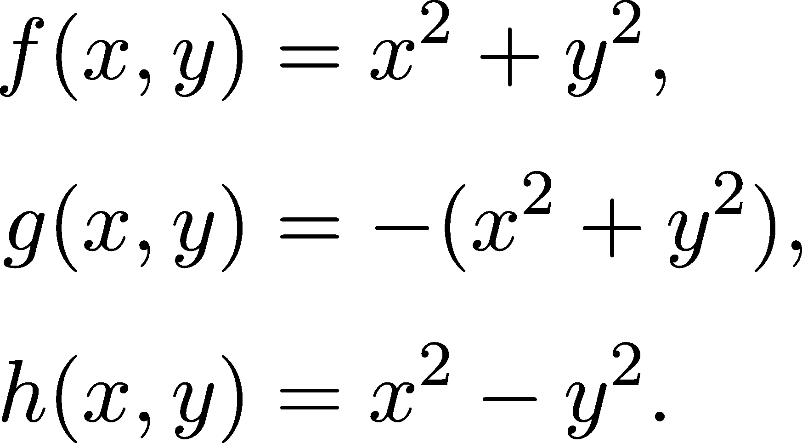

这三个函数在 0 处都有一个临界点，因此 Hessian 可以提供更清晰的图像。Hessian 的矩阵为

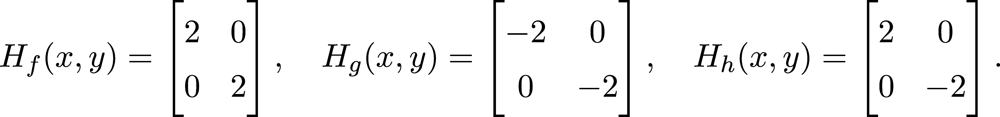

对于二元函数，定理 107 说明，研究 detHf 和 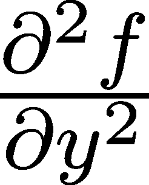(a) 就足够了。

对于 f(x,y) = x² + y²，我们有 Hf = 4 且 (0,0) = 2，说明 0 是 f(x,y) = x² + y² 的局部最小值。

同样地，我们可以得出结论，0 是 g(x,y) = −(x² + y²) 的局部最大值（这并不令人惊讶，因为 g = −f）。

最后，对于 h(x,y) = x² − y²，二阶导数检验确认 0 确实是一个鞍点。

那么，通用情况如何呢？不幸的是，仅仅研究 Hessian 矩阵的行列式是不够的。我们需要引入重磅人物：特征值。（见定义 23）。这就是二阶导数检验的完整形式。

定理 108. （多变量二阶导数检验）

设 f : ℝ^n →ℝ 是一个任意的向量-标量函数，假设 f 对所有变量在某个 a ∈ℝ^n 处部分可微。还假设 a 是一个临界点，即 ∇f(a) = 0。

(a) 如果 Hf 的所有特征值都是正数，则 a 是局部最小值。

(b) 如果 Hf 的所有特征值都是负数，则 a 是局部最大值。

(c) 如果 Hf 的所有特征值都是正数或负数，则 a 是鞍点。

没错：如果任何特征值为 0，则该检验无法得出结论。你可能还记得在线性代数中，实际上计算特征值的速度不如计算二阶导数快，但有很多数值方法（比如我们在第 7.5 节中看到的 QR 算法）。

总结一下，优化（可微）多变量函数的方法是一个简单的两步过程：

1.  通过解方程 ∇f(x) = 0 来找到临界点，

1.  然后使用二阶导数检验来确定哪些临界点是极值点。

我们在实际中使用这种方法来优化函数吗？不使用。为什么？最重要的原因是，对于具有数百万变量的向量-标量函数，计算 Hessian 矩阵的特征值是非常困难的。为什么二阶导数检验如此重要？因为理解函数在极值点附近的行为是深入理解梯度下降的关键。信不信由你，这就是理论上保证收敛性的关键。

说到梯度下降，现在是时候深入探讨驱动神经网络的算法了。

## 17.3 梯度下降的完整形式

梯度下降是机器学习中最重要的算法之一。我们已经讨论过很多次，尽管到目前为止，我们仅仅看到它用于单变量函数（我承认，这并不是最实际的应用案例）。

然而，现在我们已经掌握了所有讨论梯度下降一般形式所需的工具。让我们开始吧！

假设我们有一个可微的向量-标量函数 f : ℝ^n →ℝ ，我们想要最大化它。这可以描述投资策略的回报，或任何其他量。计算梯度并找到临界点通常不可行，因为解方程 ∇f(x) = 0 在计算上可能不可行。因此，我们采用迭代解法。

该算法与单变量函数的情况相同（如第 13.2 节所见）：

1.  从一个随机点开始。

1.  计算它的梯度。

1.  向它的方向迈出一步。

1.  重复直到收敛。

这被称为梯度上升。我们可以按照以下方式进行形式化。

（梯度上升算法）步骤 1：初始化起始点 x[0] ∈ℝ^n 并选择学习率 h ∈ (0,∞)。步骤 2：令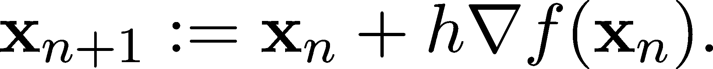。步骤 3：重复步骤 2，直到收敛。

如果我们想最小化 f，那么不妨最大化−f。这样做的唯一影响是梯度的符号变化。以这种形式，算法被称为梯度下降法，这也是广泛用于训练神经网络的版本。

（梯度下降算法）步骤 1：初始化起始点 x[0] ∈ℝ^n 并选择学习率 h ∈ (0,∞)。步骤 2：令。步骤 3：重复步骤 2，直到收敛。

完成所有这些设置后，实现梯度下降法非常直接。

```py
def gradient_descent( 
    f: MultivariableFunction, 
    x_init: np.array,               # the initial guess 
    learning_rate: float = 0.1,     # the learning rate 
    n_iter: int = 1000,             # number of steps 
): 
    x = x_init 

    for n in range(n_iter): 
        grad = f.grad(x) 
        x = x - learning_rate*grad 

    return x
```

注意，这与第 13.2 节中的单变量版本几乎完全相同。为了验证它是否有效，让我们在之前由 SquaredNorm 实现的平方欧几里得范数函数上进行测试！

```py
squared_norm = SquaredNorm() 
local_minimum = gradient_descent( 
    f=squared_norm, 
    x_init=np.array([10.0, -15.0]) 
) 

local_minimum
```

```py
array([ 1.23023192e-96, -1.84534788e-96])
```

实际上并没有什么特别之处。多变量梯度下降法的问题与我们在单变量版本中讨论的相同：它可能会陷入局部最小值，对学习率的选择非常敏感，而且在高维度下，梯度的计算可能非常困难。

## 17.4 小结

尽管本章简短而精炼，但通过详细剖析高维度梯度下降法的细节，我们迈出了一个很大的步伐。本章的简洁是向量化强大功能的见证：相同的公式、代码和超级充能的功能。这几乎难以置信，但这个简单的算法

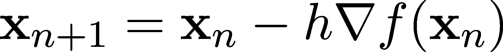

这是大多数神经网络模型背后的原理。是的，甚至是最先进的模型。

这与单变量情况有相同的理论基础，但我们不再检查二阶导数的正性，而是需要研究完整的 Hessian 矩阵 H[f]。更准确地说，我们已经了解到，临界点∇f(a) = 0 是

1.  如果 Hf 的所有特征值都是正数，则为局部最小值，

1.  如果 Hf 的所有特征值都是负数，则为局部最大值。

从根本上讲，这就是梯度下降法有效的原因。有了这个，我们已经完成了对微积分的学习，包括单变量和多变量情况。

深呼吸，放松一下。我们即将进入冒险的最后阶段：我们最后的目的地是概率论，这是预测建模背后的思维范式。例如，最著名的损失函数，如均方误差或交叉熵，都是基于概率概念的。理解和驾驭不确定性是科学领域中最大的智力成就之一，我们即将开始这段旅程。

下章见！

## 17.5 问题

问题 1. 设 y ∈ ℝ^n 是一个任意向量。著名的均方误差的一般版本定义为

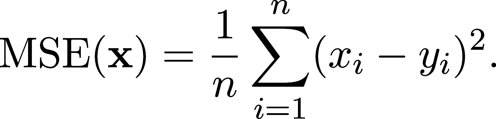

计算其梯度，并使用 MultivariateFunction 基类实现它！

问题 2. 设 f : ℝ² → ℝ 是由以下方式定义的函数

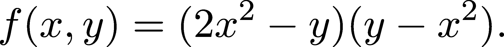

f 在 x = (0,0) 处有局部极值吗？

问题 3. 使用之前实现的 gradient_descent 函数来找到以下函数的最小值

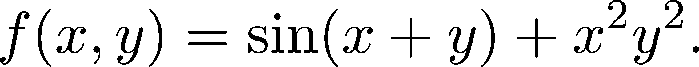

尝试不同的学习率和初始值！

问题 4. 在第十三章的问题部分，我们看到了梯度下降的改进版本，称为带动量的梯度下降。我们可以在多变量的情况下做相同的事情：定义


其中 d[0] = 0 且 x[0] 是任意的。实现它！

## 加入我们的 Discord 社区

与其他用户、机器学习专家以及作者本人一起阅读这本书。提问、为其他读者提供解决方案、通过“问我任何问题”环节与作者互动，等等。扫描二维码或访问链接加入社区。 [`packt.link/math`](https://packt.link/math)


