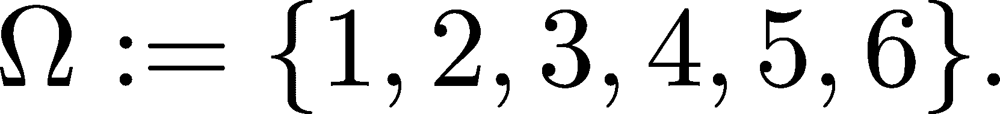
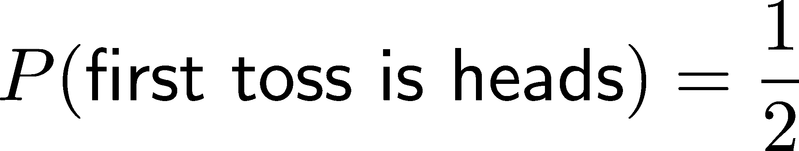
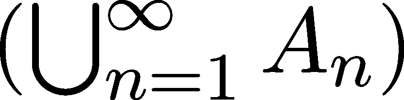
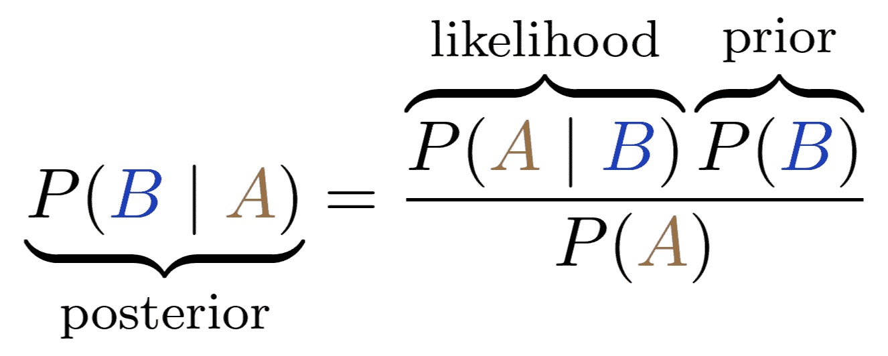
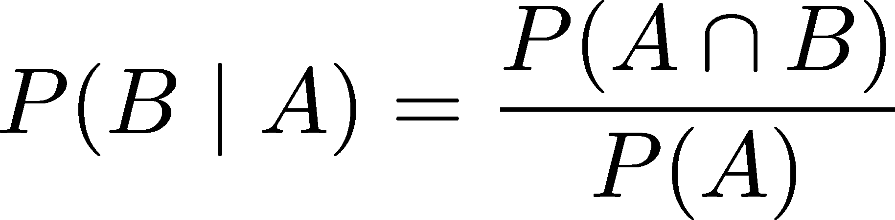

什么是概率？

在我们日常生活中，我们几乎总是以二元的方式来思考。一个陈述要么为真，要么为假。一个结果要么已经发生，要么没有发生。

在实践中，我们很少能够拥有绝对的确定性。我们必须在不完全的信息下操作。当科学家观察实验结果时，他们能以 100% 的确定性验证自己的假设吗？不能。因为他们无法完全控制所有变量（如天气或星星的排列），观察到的效果可能是偶然的。每个结果要么增强，要么削弱我们对假设的信心，但没有结果能提供最终的证明。

在机器学习中，我们的工作不仅仅是对某个类别标签进行预测，而是构建一个数学模型，总结我们对数据的理解，并以一种能够传达我们对预测准确度的信心的方式来表达。

因此，拟合一个参数化函数 f : ℝ^n →ℝ^m 来建模数据与要预测变量之间的关系是不够的。我们需要一个全新的词汇来表达这样的模型。我们需要从概率的角度来思考。

## 第二十三章：18.1 思维的语言

首先，让我们谈谈我们是如何思考的。从最基本的层面来看，我们对世界的知识存储在命题中。从数学角度来看，命题是一个要么为真，要么为假的声明。（在二进制的术语中，真用 1 表示，假用 0 表示。）

“天空是蓝色的。”

“质数是无限多的。”

“1 + 1 = 3。”

“我得了流感。”

命题通常被缩写为变量，例如 A = “外面在下雨”。

使用证据和推理来确定给定命题的真值被称为推理。为了能够制定有效的论证并理解推理是如何工作的，我们将简要了解一下数学逻辑的世界。

### 18.1.1 绝对思维

因此，我们有命题，例如 A = “外面在下雨” 或 B = “人行道是湿的”。我们需要更多的表达能力：命题是构建块，我们想要将它们组合起来，得到更复杂的命题。（我们将在这里回顾数学逻辑的基础知识，但请查看附录 A 获取更多信息。）

我们可以通过逻辑连接词将简单命题构造为复杂命题。考虑命题“如果外面下雨，则人行道是湿的”。这是 A 和 B 的结合，通过蕴含连接词串联在一起。

有四个基本的连接词：

+   NOT (¬)，也称为否定，

+   AND ( ∧)，也称为合取，

+   OR (∨)，也称为析取，

+   THEN (→)，也称为蕴含。

连接词通过结果命题的真值来定义。例如，如果 A 为真，则 ¬A 为假；如果 A 为假，则 ¬A 为真。用 1 表示真，用 0 表示假，我们可以通过真值表来描述连接词。以下是否定的真值表：


AND (∧) 和 OR (∨) 用来连接两个命题。如果 A ∧B 为真，那么 A 和 B 都必须为真；如果 A ∨B 为真，那么 A 或 B 中至少有一个为真。


连接词 THEN (→) 形式化了从前提 A 推导结论 B 的过程。根据定义，A →B 在 B 为真或 A 和 B 都为假时为真。举个例子：“如果外面在下雨”，那么“人行道是湿的”。


请注意，A →B 并不意味着 B →A。这种常见的逻辑谬误被称为肯定后件，我们在生活中都曾经陷入过这种错误。举个具体的例子：“外面在下雨”可以推出“人行道是湿的”，但反过来就不成立。人行道也可以因为其他原因变湿，例如有人打翻了一桶水。

连接词与集合运算相对应。为什么？让我们来看看集合运算的正式定义。

定义 75. （集合运算与关系的（合理的）正式定义）

设 A 和 B 为两个集合。

(a) A 和 B 的并集定义为


即 A ∪B 包含所有在 A 或 B 中的元素。

(b) A 和 B 的交集定义为


即 A ∩B 包含所有既在 A 又在 B 中的元素。

(c) 我们说 A 是 B 的子集，即 A ⊆B，当且仅当


对于所有 x ∈A，命题成立。

(d) A 相对于 Ω ⊃A 的补集定义为


即 Ω ∖A 包含所有在 Ω 中但不在 A 中的元素。

如果你仔细阅读这些定义，你会发现连接词和集合运算之间的关系。∧ 是交集，∨ 是并集，¬ 是补集，→ 是子集关系。这在图 18.1 中有所说明。（在这里我稍微滥用了符号，因为像 A ∧B ⟺ A ∩B 这样的表达式在数学上是不正确的。A 和 B 不能同时是命题和集合，因此这个等式并不精确。）


图 18.1：连接词和集合运算

为什么这很重要？因为概率作用于集合，而集合充当命题的角色。我们稍后会讨论这个问题，但首先，让我们深入了解数学逻辑如何形式化科学思维。

让我们细化数学逻辑的推理过程。一个命题要么为真，要么为假，公平而明确。那么我们如何在实际中确定这一点呢？例如，我们如何找到命题“素数有无穷多个”的真值呢？

通过使用证据和推理。就像福尔摩斯通过连接事实来破案一样，我们依赖于形式为“如果 A，则 B”的知识。我们对世界的知识是通过真实的蕴含存储的。例如：

+   “如果下雨，那么人行道会湿。”

+   “如果是一个直角三角形，那么 A² + B² = C²。”

+   “如果一个系统是封闭的，那么它的熵不能减少。”

正如我们所见，蕴含可以转化为集合论的语言（和其他所有连接词一样）。其中，∧对应交集，∨对应并集，而蕴含则是子集关系。记住这一点，因为它非常重要。

在推理过程中，我们以以下方式使用蕴含：

1.  如果 A，那么 B。

1.  A。

1.  因此，B。

这被称为“假言推理”（modus ponens）。如果听起来有些抽象，下面是一个具体的例子：

1.  如果下雨，人行道是湿的。

1.  正在下雨。

1.  因此，人行道是湿的。

因此，我们可以在不查看人行道的情况下推断出它的状态。这比听起来更重要：假言推理是科学思维的基石。没有它，我们仍然会生活在洞穴里。假言推理使我们能够建立起强大的知识大厦。

然而，这并不完美。经典的演绎逻辑可能有助于证明素数的无穷性，但当面对数学和哲学以外的推理问题时，它会失败得很惨。

经典逻辑有一个致命的缺陷：它无法处理不确定性。想想这个简单的命题“外面在下雨”。如果我们无法实际观察天气，但有一些间接证据（比如人行道是湿的，或者天空多云，或者外面是秋天），那么“外面在下雨”是可能的，但不是确定的。

我们需要一个工具来在 0 到 1 的范围内衡量真值。这就是概率派上用场的地方。

### 18.1.2 概率思维

从数学角度来看，概率是一个将介于零和一之间的数值分配给代表事件的各个集合的函数。（你可以把事件看作是命题。）事件是事件空间的子集，通常用大写希腊字母欧米伽（Ω）表示。图 18.2 展示了这一点。


图 18.2：事件与事件空间

这听起来相当抽象，让我们看看一个简单的例子：掷一个公平的六面骰子。我们可以用事件空间Ω = {1,2,3,4,5,6}来编码所有可能的结果。像 A = “结果是偶数”或 B = “结果大于 3”这样的事件，可以通过集合表示为


由于骰子是公平的，每个结果的概率是相同的：


有两个属性使得这样的函数 P 成为一个合适的概率度量：

1.  事件空间的概率是 1，

1.  不相交事件的并集的概率是各个事件概率之和。

在我们的掷骰子例子中，这可以转化为例如


我们将在下一节中详细讨论这些性质。由于逻辑连接词可以用集合论语言表示，集合运算将逻辑的语义转化为概率。交集表示事件的联合发生，联集表示任一事件的发生。


图 18.3：交集和并集的概率

通过这种方式，我们能够构建涉及不确定性的模型，并发展出一种微积分来操作这些模型。在数学的“巴别塔”中，统计学处理建模部分，而概率论处理微积分部分。

即使是技术上训练有素的工程师也常常混淆建模和使用模型。例如，当我们讨论抛公平硬币时，正反面朝上的概率都是 1∕2。即使我们对模型完全确信，但如果连续十次都是正面，许多人也会立即得出结论：我们的硬币是有偏的。

为了确保我们不犯这个错误，首先我们要学习概率是什么。

## 18.2 概率公理

在前一节中，我们已经讨论了概率作为数学逻辑的扩展。就像形式逻辑一样，概率也有它的公理，我们需要理解这些公理才能使用概率模型。现在，我们要回答一个基本问题：概率的数学模型是什么，我们如何与它打交道？

概率是在实验和结果的背景下定义的。要讨论概率，我们需要定义我们将概率赋予什么。正式来说，我们用 P(A)表示事件 A 的概率。首先，我们将讨论什么是事件。

### 18.2.1 事件空间和σ-代数

让我们回顾一下前一节中的六面骰子示例。这里有六种不同的互斥结果（也就是说，无法同时发生的事件），它们共同构成事件空间，记作Ω：



一般来说，事件空间是所有互斥结果的集合。它可以是任何集合。

我们可以为哪些类型的事件赋予概率？显然，个别的结果是我们首先想到的。然而，我们也可以考虑像“结果是奇数”、“结果是 2 或 6”或“结果不是 1”这样的事件。根据这个逻辑，我们的预期是，对于任何两个事件 A 和 B，

+   “A 或 B”，

+   “A 和 B”，

+   和“非 A”

这些也是事件。它们可以转化为集合论的语言，并通过σ-代数的概念进行形式化。

定义 76\。

（σ-代数）

设Ω为一个事件空间。如果Ω的子集的集合Σ ⊆ 2^Ω满足以下条件，那么称Σ为Ω上的σ-代数：

(a) Ω ∈ Σ。（也就是说，所有结果的集合是一个事件。）

(b) 对于所有 A ∈ Σ，集合Ω∖A 也是Σ的元素。（也就是说，σ-代数对补集是封闭的。）

(c) 对于所有 A[1],A[2],⋅⋅⋅∈ Σ，集合∪[n=1]^∞A[n]也是Σ的一个元素。（也就是说，σ-代数对并运算是封闭的。）

由于事件是通过集合来建模的，因此诸如“与”、“或”和“非”等逻辑概念可以转化为集合运算：

+   事件 A 和 B 的联合发生相当于 A ∩B，

+   “A 或 B”相当于 A ∪B，

+   “非 A”相当于Ω ∖A。

定义的一个直接结果是，对于任何事件 A[1],A[2],⋅⋅⋅∈ Σ，它们的交集∩[n=1]^∞A[n]也是Σ的一个成员。事实上，正如德摩根定律（定理 153）所暗示的那样，


由于Ω ∖ (Ω ∖A) = A，我们得到


因此，σ-代数的定义特性保证了∩[n=1]^∞A[n]确实是Σ的一个元素。定义的另一个直接结果是，由于Ω ∈ Σ，空集∅也是Σ的一个成员。

乍一看，σ-代数似乎有点抽象。像往常一样，适当的抽象现在将为我们的后续学习带来巨大的回报。为了让这个概念更贴近实际，这里有一个关于σ-代数的英文总结：

+   所有可能结果的集合是一个事件。

+   对于任何事件，它的不发生也是一个事件。

+   对于任何事件，它们的联合发生也是一个事件。

+   对于任何事件，至少有一个事件发生也是一个事件。

现在我们已经掌握了正式定义，接下来看看第一个例子。

示例 1\. 投掷一个六面骰子。在这里，σ-代数就是事件空间的幂集：


（回想一下，A 的幂集是集合 2^A，它包含了 A 的所有子集，如定义在定义 108 中的所述。）尽管这是最简单的一个例子，但它将作为一个原型，并为构建更复杂的事件空间提供一个基础。

示例 2\. 投掷硬币 n 次。一次投掷有两个可能的结果：正面或反面。为了简化，我们用 0 表示正面，用 1 表示反面。由于我们投掷硬币 n 次，实验的结果将是一个包含 n 个 0 和 1 的序列，如：(0,1,1,1,…,0,1)。因此，完整的事件空间是Ω = {0,1}^n。

（我们还没有讨论概率，但可以花些时间弄清楚如何将它们分配给这些事件。如果现在不清楚也没关系，我们稍后会详细讲解。）

就像之前的例子一样，σ-代数 2^Ω是一个不错的选择。它涵盖了我们需要的所有事件，例如，“尾巴的个数是 k”。

在实践中，σ-代数很少被明确给出。当然，对于像上面的简单情况，是可以的。

那么，在事件空间不可数的情况下该如何处理呢？例如，假设我们从 0 到 1 之间选择一个随机数。那么，Ω = [0,1]，但选择Σ = 2^([0,1])是极其有问题的。回想一下，我们希望为Σ中的每个事件分配一个概率。幂集 2^([0,1])是如此之大，以至于会发生一些非常奇怪的事情。在某些情况下，我们可以将集合切割成有限个部分，并从这些部分重新组装成两个相同的集合。（如果你对更多内容感兴趣，可以查看[Banach-Tarski 悖论](https://en.wikipedia.org/wiki/Banach%E2%80%93Tarski_paradox)。）

为了避免像上述那样奇怪的情况，我们需要另一种方式来描述σ-代数。

### 18.2.2 描述σ-代数

让我们从一个简单但基本的σ-代数性质开始，这个性质我们很快会用来对σ-代数给出一个友好的描述。

定理 109。（事件代数的交集。）

设Ω为样本空间，Σ[1]和Σ[2]为其上的两个σ-代数。则Σ[1] ∩ Σ[2]也是一个σ-代数。

证明。正如我们在σ-代数的定义中所看到的（定义 76），我们需要验证三个性质以证明Σ[1] ∩ Σ[2]确实是一个σ-代数。这个验证非常简单，所以我建议你先自己试试看，再阅读我的解释。

(a) 由于Σ[1]和Σ[2]都是σ-代数，Ω ∈ Σ[1]且Ω ∈ Σ[2]都成立。因此，根据交集的定义，Ω ∈ Σ[1] ∩ Σ[2]。

(b) 设 A ∈ Σ[1] ∩ Σ[2]。由于它们都是σ-代数，Ω ∖ A ∈ Σ[1]且Ω ∖ A ∈ Σ[2]。因此，Ω ∖ A 也是交集的元素。

(c) 设 A[1],A[2],⋅⋅⋅ ∈ Σ[1] ∩ Σ[2]为任意事件。我们可以使用之前完全相同的论证：由于Σ[1]和Σ[2]都是σ-代数，我们有


所以，联合也是交集的成员，即，


有了这些，我们准备好通过生成集来描述σ-代数了。

定理 110。（生成的σ-代数）

设Ω为一个事件空间，S ⊆ 2^Ω为其任意集合的集合。则存在唯一的最小σ-代数σ(S)，它包含 S。

（所谓最小，指的是如果Σ是包含 S 的σ-代数，则σ(S) ⊆ Σ。）

证明。我们之前的结果表明，σ-代数的交集也是一个σ-代数。因此，让我们取所有包含 S 的σ-代数，并取它们的交集。正式地，我们定义


根据定义，σ(S)显然是最小的，并且它也包含 S。

还显然，生成的σ-代数是唯一的，因为如果存在另一个σ̂(S)满足条件，那么根据构造，σ̂(S) ⊆ σ(S)且σ(S) ⊆ σ̂(S)，因此σ̂(S) = σ(S)。

立刻，我们可以利用这一点精确构造一个σ-代数，用于一个极其常见的任务：从 0 到 1 之间选一个数。

示例 3\. 在 0 到 1 之间选择一个随机数。显然，事件空间是Ω = [0,1]。那么事件呢？在这种情况下，我们想问的问题是，随机数 X 落在某些 a,b ∈ [0,1]之间的概率是多少。即，像(a,b)、(a,b]、[a,b]、[a,b]这样的事件（无论我们是否需要 a 和 b 之间严格的不等式）。

因此，一个合适的σ-代数可以通过由形如(a,b]的事件生成的代数给出。即，

![Σ = σ({(a,b] : 0 ≤ a <b ≤ 1}). ](img/file1634.png)

这个Σ具有丰富的结构。例如，它包含了简单的事件，如{x}，其中 x ∈ [0,1]，但也包含更复杂的事件，如“X 是一个有理数”或“X 是一个无理数”。花几分钟思考一下为什么这是对的。如果你没有看到答案，不用担心——我们将在问题部分讲解这个问题。（如果你思考这个问题，你也会明白为什么我们选择了形如(a,b]的区间，而不是(a,b)或[a,b]这样的其他形式。）

### 18.2.3 实数上的σ-代数

从我们到目前为止看到的所有例子来看，很明显，最常见的做法是我们在ℕ或ℝ上定义概率空间。当Ω ⊆ℕ时，σ-代数的选择是明确的，因为Σ = 2^Ω总是适用的。

然而，正如上面示例 3 所示，选择Σ = 2^Ω当Ω ⊆ℝ时可能会导致一些奇怪的结果。因为我们关心的是事件的概率，例如[a,b]，所以我们的标准选择是生成的σ-代数。

ℬ(ℝ) = σ({ (a,b) : a,b ∈ ℝ }), (18.1)

被称为 Borel 代数，以著名的法国数学家[埃米尔·博雷尔](https://en.wikipedia.org/wiki/%C3%89mile_Borel)的名字命名。由于其构造，ℬ包含了所有对我们重要的事件，如区间和区间的并集。ℬ的元素称为 Borel 集合。

因为σ-代数对并集是封闭的，可以看出所有类型的区间都可以在ℬ(ℝ)中找到。这个结果可以通过以下定理来总结。

定理 111\。

对于所有 a,b ∈ℝ，集合[a,b]、(a,b]、[a,b)、(−∞,a]、(−∞,a)、(a,∞)和 a,∞)都是ℬ(ℝ)的元素。

作为一个练习，试着自己推导出证明。启发思路的一个技巧是开始画一些图形。如果你能够直观地理解发生了什么，你会很快发现证明。

证明。一般来说，对于给定的集合 S，我们可以通过将其表示为已知的 Borel 集合的并集/交集/差集来证明它属于ℬ(ℝ)。首先，我们有

![ ∞ ⋃ (a,∞ ) = (a,n), n=1 

所以 (a,∞) ∈ ℬ(ℝ)。通过类似的论证，我们可以得出(−∞,a) ∈ ℬ(ℝ)。

接下来，

![(− ∞, a] = ℝ ∖ (a,∞ ), a,∞ ) = ℝ ∖ (− ∞, a), 

所以 (−∞,a],[a,∞) ∈ ℬ(ℝ) 对于所有的 a。通过这些集合，可以通过交集生成[a,b],(a,b],[a,b)等集合。

既然我们理解了事件和σ-代数的概念，我们可以开始详细地探讨概率。在下一节中，我们将引入其精确定义。

### 18.2.4 概率度量

让我们回顾一下到目前为止所学的内容！在数学语言中，具有内在不确定性的实验使用结果、事件空间和事件来描述。

实验的所有可能的互斥结果的集合称为事件空间，记作 Ω。Ω 的某些子集称为事件，我们希望为这些事件分配概率。

这些事件形成了所谓的 σ-代数，记作 Σ。我们用 P(A) 来表示事件 A 的概率。

直观来说，我们对概率有三个合理的期望：

1.  P(Ω) = 1，也就是说，至少有一个结果发生的概率为 1\. 换句话说，我们的事件空间是对实验的完整描述。

1.  P(∅) = 0，也就是说，任何结果都不发生的概率为 0\. 这再次意味着我们的事件空间是完整的。

1.  对于两个互斥事件，任意一个事件发生的概率是各自概率的和。

这些通过以下定义被形式化。

定义 77\.（概率度量和空间）设 Ω 为事件空间，Σ 为 Ω 上的 σ-代数。我们说函数 P : Σ → [0,1] 是 Σ 上的概率度量，如果满足以下性质：

(a) P(Ω) = 1。

(b) 如果 A[1],A[2],… 是互不相交的事件（即，A[i]∩A[j] = ∅ 对于所有 i≠j），那么 P(∪[n=1]^∞A[n]) = ∑ [n=1]^∞P(A[n])。这个性质称为概率度量的 σ-可加性。

与概率度量 P 一起，结构 (Ω,Σ,P) 被称为形成一个概率空间。

一如既往，让我们首先看看一些具体的例子！我们将继续使用在讨论 σ-代数时已经解决的例子。

示例 1，继续。掷一个六面骰子。回忆一下，事件空间和代数是通过以下方式定义的


如果我们对骰子没有额外的知识，合理的假设是每个结果的概率相等。也就是说，由于有六种可能的结果，我们有


请注意，在这种情况下，知道单个结果的概率就足以确定任何事件的概率。这是因为概率的（σ-）可加性。例如，事件“掷骰子的结果是奇数”可以通过以下方式描述：


用英语表达，任何事件的概率可以通过以下公式写出：


你可能记得这个公式，它来自你的小学和高中的学习（具体取决于你所在国家的课程）。这是一个有用的公式，但有一个警告：它只在假设每个结果的概率相等时有效。

当我们的骰子不是均匀加权时，各种结果发生的概率是不相等的。（想象一下一个铅制骰子，其中一面明显比其他面重。）目前，我们不考虑这种情况，稍后会详细讨论这一普遍情况。

示例 2，继续。投掷硬币 n 次。在这里，我们的事件空间和代数是Ω = {0,1}^n，Σ = 2^Ω。为了简化，假设 n = 5。

某一特定结果的概率是多少呢？例如 HHTTT？逐步分析，第一次投掷为正面的概率是 1∕2\. 也就是说，



由于第一次投掷与第二次投掷是独立的，


也是如此。为了结合这一点并计算第一次和第二次投掷都为正面的概率，我们可以这样思考。对于第一次投掷为正面的结果，其中一半的第二次投掷也是正面。因此，我们要寻找的是一半中的一半。也就是，


按照相同的逻辑继续推演，我们得到


如果我们稍微深入分析，就会发现这遵循了之前看到的“有利/总数”公式。事实上，通过一些组合学知识可以发现，总共有 2⁵种可能性，且它们的概率相等。

考虑到这一点，五次投掷中恰好有两个正面的概率是多少呢？用集合的语言来说，我们可以将每次五次投掷的实验编码为{1,2,3,4,5}的子集，元素表示结果为正面的投掷。（例如，{1,4,5}表示结果为 HTTHH。）在这种情况下，恰好有两个正面的实验正是{1,2,3,4,5}的二元子集。

从我们的组合学研究中，我们知道给定元素的子集数目是


其中 n 是我们集合的大小，k 是我们期望的子集大小。因此，总共有次出现恰好两个正面的情况。按照“有利/总数”公式，我们有


再举一个例子，我们就可以继续往下讲了。

示例 3，继续。选择一个 0 到 1 之间的随机数。在这里，我们的事件空间是Ω = [0,1]，我们的σ代数是生成的代数

![ ( ) Σ = σ {(a,b] : 0 ≤ a <b ≤ 1} . ](img/file1650.png)

在没有任何进一步信息的情况下，合理的假设是每个数字都能以相等的概率被选中。这对于像Ω = [0,1]这样的无限事件空间意味着什么呢？我们无法将 1 分成无数个相等的部分。

所以，我们不应只考虑个别结果，而应开始考虑事件。我们用 X 来表示随机选取的数字。如果所有数字“同样可能”，那么 P(X ∈ (0,1∕2]) 是多少？直观上，基于我们“同样可能”的假设，这个概率应该与 [0,1∕2] 的大小成正比。因此，


其中 I 是某个区间，jIj 是它的长度。例如，


通过给定 σ-代数生成集上的概率，可以推导出所有其他事件的概率。例如，


因此，选中一个特定数字的概率是零。这里有一个重要的教训：概率为零的事件是可以发生的。一开始这听起来违反直觉，但根据上面的例子，你可以看到这是正确的。

### 18.2.5 概率的基本性质

现在我们已经熟悉了概率的数学模型，可以开始使用它们了。操作概率表达式让我们能够处理复杂的情景。

如果你还记得，概率测度有三个简单的定义性质（见定义 77）：

(a) P(Ω) = 1，

(b) P(∅) = 0，且

(c) P = ∑ [n=1]^∞P(A[n])，如果事件 A[n] 互不相交。

从这些性质中，许多其他性质可以推导出来。为了简化，下面是一个定理，概括了最重要的几个性质。

定理 112\。

设 (Ω,Σ,P) 是一个概率空间，A, B ∈ Σ 是两个任意事件。

(a) P(A ∪B) = P(A) + P(B) −P(A ∩B)。

(b) P(A) = P(A ∩B) + P(A ∖B)。具体地，P(Ω ∖A) + P(A) = 1。

(c) 如果 A ⊆B，那么 P(A) ≤P(B)。

这个证明非常简单，因此作为练习留给你自己。所有这些都来自于对互不相交事件的概率测度加法性。（如果你没看出解决办法，可以画一些维恩图！）

另一个基本工具是全概率法则，它在处理更复杂的事件时经常被使用。

定理 113\. （全概率法则）

设 (Ω,Σ,P) 是一个概率空间，A ∈ Σ 是一个任意事件。如果 A[1],A[2],⋅⋅⋅∈ Σ 是互不相交的事件（即 A[i] ∩A[j] = ∅ 当 i≠j 时），并且 ∪[n=1]^∞A[n] = Ω，那么：

P(A) = ∑[n=1]^∞ P(A ∩ A[n])。（18.2）

我们称那些互不相交且其并集构成整个事件空间的事件为分割事件。

证明。这简单地遵循了概率测度的 σ-加法性。可以自己尝试一下证明，来检验你的理解。

如果你看不懂这个，没关系。这里有一个简短的解释。由于 A[1],A[2],… 是互不相交的，A ∩A[1],A ∩A[2],… 也是互不相交的。此外，由于 ∪[n=1]^∞A[n] = Ω，我们还可以得到：


因此，概率测度的 σ-加法性意味着：


这就是我们要证明的。

让我们立即看一个例子！假设我们投掷两个骰子。那么，结果之和为 7 的概率是多少？

首先，我们应该正确描述概率空间。为了简化符号，假设投掷的结果为 X 和 Y。我们要找的是 P(X + Y = 7)。如果我们对两个骰子投掷加上顺序的要求，那么建模就变得最简单。考虑到这一点，事件空间 Ω 可以通过笛卡尔积来描述


结果是 (i,j) 形式的元组。（也就是说，元组 (i,j) 编码了基本事件 {X = i, Y = j}。）由于投掷是相互独立的，


(当事件{X = i, Y = j}明确时，我们可以省略括号。)

由于第一次投掷的结果在 1 到 6 之间，我们可以通过形成事件空间来划分它


因此，总概率法则给出了


然而，如果我们知道 X + Y = 7 且 X = n，那么我们也知道 Y = 7 −n 必须成立。因此，继续上面的计算，


所以，总概率法则通过将复杂事件分解为简单事件，帮助我们处理复杂的事件。我们现在已经看到了这种模式好几次了，而且它再次证明了其重要性。

作为 σ-加性（σ-additivity）的另一个结果，我们可以通过取极限来计算递增事件序列的概率。

定理 114. （概率测度的下连续性）

设 (Ω, Σ, P) 是一个概率空间，且 A[1] ⊆ A[2] ⊆ ⋅⋅⋅ ∈ Σ 是一个递增事件序列。那么，

P(∪[n=1]^∞ A[n]) = lim[n→∞] P(A[n]) (18.3)

成立。这个性质称为概率测度的下连续性。

证明。由于事件是递增的，即 A[n−1] ⊆ A[n]，我们可以将 A[n] 写为


其中 A[n−1] 和 A[n] ∖A[n−1] 是不相交的。

因此，


这给出了

![ ∑∞ P (∪∞n=1An ) = P(An ∖ An− 1) n=1 N∑ = lim P (An ∖ An− 1) N → ∞n=1 N = lim ∑ [P(A )− P (A )] N → ∞ n n−1 n=1 = lim P (AN ), N → ∞ ](img/file1666.png)

其中我们用到了 P(∅) = 0。

我们可以为递减事件序列给出上述定理的类似命题。

定理 115. （概率测度的上连续性）

设 (Ω, Σ, P) 是一个概率空间，且 A[1] ⊇ A[2] ⊇ ⋅⋅⋅ ∈ Σ 是一个递减事件序列。那么，

P(∩[n=1]^∞ A[n]) = lim[n→∞] P(A[n]) (18.4)

成立。这个性质称为概率测度的上连续性。

证明。为了简化，我们将无穷交集记为 A := ∩[n=1]^∞ A[n]。

通过定义 B[n] := A[1] ∖A[n]，我们有 ∪[n=1]^∞B[n] = A[1] ∖A。由于 A[n] 是递减的，B[n] 是递增的，因此我们可以应用定理 114 得到


由于 P(A[1] ∖A) = P(A[1]) −P(A)，我们得到 P(A) = lim[n→∞]P(A[n])。

现在我们已经有了一个概率模型的数学定义，是时候迈出一步进入机器学习所在的空间：ℝ^n。

### 18.2.6 ℝ^n 上的概率空间

在机器学习中，每个数据点是一个基本结果，位于欧几里得空间 ℝ^n 的某个位置。因此，我们有兴趣在这个空间中模拟实验。

如何在 ℝ^n 上定义概率空间？正如我们在第 18.2.1 节中对实数轴所做的那样，我们通过生成一个方便的 σ-代数来描述它。在那里，我们可以使用 (a,b) 区间的高维对应物：n 维球体。为此，我们定义集合


其中 x 是球体的中心，r/span>0 是它的半径，∥⋅∥ 表示通常的欧几里得范数。（B 表示球体的意思。在数学中，n 维球体通常称为球。）与实数轴类似，Borel σ-代数的定义为

ℬ(ℝ^n) := σ({B(x, r) : x ∈ ℝ^n, r > 0}) (18.5)

正如我们在实数轴上所看到的（见第 18.2.3 节），ℬ(ℝ^n) 的结构比定义所暗示的更为丰富。这里，区间的类似物是矩形，其定义为


其中 A×B 是笛卡尔积。（见定义 110）类似地，我们可以定义 [a,b]，(a,b]，[a,b] 等等。

定理 116\.

对于任意 a,b ∈ ℝ^n，集合 [a,b]，[a,b)，(a,b]，(a,∞)，[a,∞)，(−∞,a)，(−∞,b] 都是 ℬ(ℝ^n) 的元素。

证明。证明过程与 ℬ(ℝ) 中的对应部分相同。因此，留给你作为练习。

作为提示，首先，我们可以证明 (a,b) 可以写成可数个球的并集。我们还可以证明这种情况对于一些集合也成立，例如


通过这两个，我们可以将其他集合写成并集/交集/差集的形式。

举个例子，假设我们在一面矩形墙上投掷几只飞镖。假设我们是糟糕的飞镖玩家，打到墙上的任何一点的概率是一样的。

我们可以用 Ω = [0,1] × [0,1] ⊆ ℝ² 来模拟这个事件空间，代表我们的墙。可能的事件是什么？例如，墙上挂着一个圆形的飞镖靶，我们想找出打中它的概率。在这种情况下，我们可以将通过 (22.2.6) 定义的 Borel 集合限制为


既然事件空间和代数已经清晰，我们需要思考如何赋予事件概率。我们的假设是，任何一个点的出现概率是相等的。所以，通过推广我们在离散情况下看到的公式，我们定义了概率度量：


（在二维空间中，我们使用的是面积而不是体积。）这在图 18.4 中有所说明。


图 18.4：投掷飞镖打墙的概率空间。来源：https://unsplash.com/photos/black-and-white-round-logo-i3WlrO7oAHA

正如我们稍后将看到的，这其实是均匀分布的一个特殊案例，均匀分布是概率论中最常见的分布之一。然而，在那之前还有很多要讨论的内容。在我们结束对概率基础的讨论之前，让我们来讨论一下如何解释它们。

### 18.2.7 如何解释概率

既然我们知道了如何处理概率，接下来就该研究如何将概率赋予现实生活中的事件了。

首先，我们将看看频率派解释，用相对频率来解释概率。（如果你是那些对此问题有宗教般信仰的人，冷静一下。我们会详细讨论贝叶斯解释，但现在还不是时候。）

让我们回到一开始，考虑掷硬币实验。如果我公平地投掷硬币 1000 次，其中多少次会是正面？大多数人会立刻回答 500 次，但这是不正确的。没有正确答案，因为正面次数可以是 0 到 1000 之间的任何一个数。当然，最有可能的是接近 500，但也有非常小的概率会出现 0 次正面。

一般来说，事件的概率描述了在无限多次尝试中该事件的相对频率。也就是说，


当尝试次数趋向于无限时，事件发生的相对频率会收敛到真实的基本概率。换句话说，如果 X[i]定量描述了我们的第 i 次尝试，


然后


我们可以通过快速模拟掷硬币的例子来说明这一点。如果你不理解代码，不用担心；我们将在接下来的章节中详细讲解。

```py
import numpy as np 
from scipy.stats import randint 

n_tosses = 1000 
# coin tosses: 0 for tails and 1 for heads 
coin_tosses = [randint.rvs(low=0, high=2) for _ in range(n_tosses)] 
averages = [np.mean(coin_tosses[:k+1]) for k in range(n_tosses)]
```

让我们绘制一些结果以获得一些洞察：

```py
import matplotlib.pyplot as plt 

with plt.style.context("/span>seaborn-v0_8": 
    plt.figure(figsize=(16, 8)) 
    plt.title("/span>Relative frequency of the coin tosses 
    plt.xlabel("/span>Number of tosses 
    plt.ylabel("/span>Relative frequency 

    # plotting the averages 
    plt.plot(range(n_tosses), averages, linewidth=3) # the averages 

    # plotting the true expected value 
    plt.plot([-100, n_tosses+100], [0.5, 0.5], c="/span>k 
    plt.xlim(-10, n_tosses+10) 
    plt.ylim(0, 1) 
    plt.show()
```


图 18.5：掷硬币的相对频率

相对频率很好地稳定在 1/2 左右，这就是我们公平硬币正面朝上的真实概率。这是偶然吗？不是。

我们将在第 20.5 节讨论大数法则时将这一切数学化，但首先，我们将介绍贝叶斯观点，这是一种基于新观察更新模型的概率框架。

## 18.3 条件概率

在前面的章节中，我们学习了概率的基础知识。现在我们可以使用结果、事件和机会来进行讨论。然而，在实际应用中，这些基本工具不足以构建有用的预测模型。

为了说明这一点，让我们构建一个概率垃圾邮件过滤器！对于我们收到的每封邮件，我们希望估算其垃圾邮件的概率 P(邮件是垃圾邮件)。这个概率越接近 1，说明我们看到的邮件越有可能是垃圾邮件。

基于我们的收件箱，我们可能会计算出垃圾邮件的相对频率，并得出


然而，这对我们没有任何帮助。根据这个信息，我们可以以概率 P(邮件是垃圾邮件) 随机丢弃每封邮件，但这将是一个糟糕的垃圾邮件过滤器。

为了改进，我们需要更深入地挖掘。当分析垃圾邮件时，我们开始注意到一些模式。例如，“立即行动”这一短语几乎只出现在垃圾邮件中。经过快速统计，我们得出


这看起来对我们垃圾邮件过滤工作更有帮助。通过检查是否包含“立即行动”这一短语，我们可以自信地将一封邮件归类为垃圾邮件。

当然，垃圾邮件过滤还有更多内容，但这个例子展示了基于其他事件的条件概率的重要性。为了将其数学化，我们引入以下定义。

定义 78.（条件概率）

设(Ω,Σ,P) 是一个概率空间，设 A，B ∈ Σ 为两个事件，并假设 P(A)/span>0。给定 A 的条件下 B 的条件概率定义为


你可以将 P(B∣A) 理解为将事件空间限制在 A 中，如图 18.6 所示。


图 18.6：条件概率的可视化表示

当有更多条件时，例如 A[1] 和 A[2]，定义形式为


以此类推，适用于更多的事件。

为了让这个概念更清晰，我们来回顾一下掷骰子实验。假设你的朋友掷了一个六面骰子，并告诉你结果是一个奇数。基于这一信息，结果是 3 的概率是多少？为了简化问题，我们用 X 来表示掷骰子的结果。从数学角度讲，这可以通过以下公式计算：


这是我们预期的数字。

虽然这个简单的例子没有展示条件概率的实用性，但它是机器学习中的基石。实质上，从数据中学习可以表述为估计 P(标签∣数据)。我们将在本章后面进一步扩展这个观点。

### 18.3.1 独立性

条件概率的核心思想是，观察某些事件会改变其他事件的概率。但是，难道每次都是这样吗？

在概率建模中，认识到观察一个事件不会影响另一个事件同样重要。这推动了独立性概念的发展。

定义 79.（事件的独立性）

设(Ω,Σ,P)为一个概率空间，A, B ∈ Σ为两个事件。如果 A 和 B 是独立的，则我们说


成立。

等效地，可以通过条件概率来表述此问题。根据定义，如果 A 和 B 是独立的，我们有


举个例子，回到掷硬币的情景，假设我们投掷一枚硬币两次。设第一次和第二次的投掷结果分别用 X[1]和 X[2]表示。那么这两次投掷都是正面的概率是多少？正如我们在 18.2.4 节中讨论过的，我们可以看到


也就是说，这两个事件是彼此独立的。

关于概率，有很多常见的误解。其中之一是关于独立性的解释。假设我投掷一枚公平的硬币十次，结果每次都是正面。那么我下一次投掷得到正面的概率是多少？

大多数人会立即得出结论：这是一个非常小的概率，因为连续十一次得到正面是极不可能的。然而，一旦我们得到了前十次的结果，我们就不再讨论十一次投掷的概率，而只是讨论最后一次！由于硬币投掷彼此独立，第十一投（在前十次结果已知的条件下）得到正面的概率仍然是 50%。

这种现象被称为赌徒谬误，我敢肯定，在你的一生中，你曾经成为过它的受害者。（我自己也有过。）

在实际场景中，处理条件概率可能更为简便。（例如，有时候我们可以直接估计条件概率，而标准概率则很难衡量。）因此，我们需要一些工具来处理它们。

### 18.3.2 总概率法则再探

还记得定理 113 中的总概率法则吗？我们可以使用条件概率将其转换为稍微不同的形式。

定理 117.（总概率法则，条件版）

设(Ω, Σ, P)为一个概率空间，且 A ∈ Σ为任意事件。如果 A[1], A[2], ⋅⋅⋅ ∈ Σ为互不相交的事件（即 A[i] ∩ A[j] = ∅，当 i ≠ j 时），并且∪[n=1]^∞A[n] = Ω，则

P(A) = ∑[k=1]^∞ P(A | A[k]) P(A[k]) (18.6)

证明：这个证明是全概率法则（定理 113）和条件概率定义的简单应用：因为 P(A ∩ A[k]) = P(A∣A[k])P(A[k])，

P(A) = ∑[k=1]^∞ P(A ∩ A[k]) = ∑[k=1]^∞ P(A | A[k]) P(A[k])

成立，这就是我们需要证明的内容。

为什么这对我们有用呢？让我们通过一个例子来展示。假设我们有三个 urn，其中包含浅色和深色球。

第一个 urn 包含 4 个深色球，第二个 urn 包含 2 个浅色球和 2 个深色球，而最后一个 urn 包含 1 个浅色球和 3 个深色球。


图 18.7：包含彩色球的 urn

我们随机选择一个 urn；然而，选择第一个 urn 的概率是选择另外两个的两倍。（也就是说，我们选择第一个 urn 的概率是 50%，而选择第二个和第三个 urn 的概率分别为 25%和 25%。）然后，我们从该 urn 中随机挑选一个球。那么，我们选择一个浅色球的概率是多少？如果不使用全概率法则，这个计算是比较困难的。

设选中的球的颜色为 X，并假设事件 A[n]表示选择了第 n 个 urn。那么，我们有


不使用条件概率，计算 P({X = light}∩A[k])是困难的（因为我们并非以等概率选择每个 urn）。但是，我们可以通过计算每个 urn 中浅色球的数量来简化条件概率的计算。也就是说，我们有


由于 P(A[1]) = 1/2, P(A[2]) = 1/4, 且 P(A[3]) = 1/4，我们要寻找的概率是


注意，由于 urn 的选择并非等概率，


如同直觉上猜测的那样。

条件概率的另一个有用性质是，由于其定义，我们可以利用它来表示事件的联合概率：


尽管这听起来很简单，但有时我们可以估计/计算条件概率，但却无法计算联合概率。事实上，这个简单的恒等式可以推广到任意数量的条件，这就是链式法则。（尽管它叫做链式法则，但与微分中的链式法则无关。）

定理 118. （链式法则）

设(Ω, Σ, P)为一个概率空间，A[1], A[2], ⋅⋅⋅ ∈ Σ为任意事件。那么，

P(A) = ∑[k=1]^∞ P(A | A[k]) P(A[k]) (18.7)

成立。

证明：首先，我们注意到 P(A[1] ∩⋅⋅⋅∩A[n])可以写为


因为这些项互相抵消。

由于


链式法则（18.7）随之得出。

### 18.3.3 贝叶斯定理

本质上，机器学习是将观察转化为预测模型。概率论为我们提供了表达模型的语言。例如，回到我们的垃圾邮件过滤示例，我们可以注意到 5%的邮件是垃圾邮件。然而，仅凭这些信息不足以过滤垃圾邮件。经过检查，我们观察到 95%的包含“立即行动”这一短语的邮件是垃圾邮件（但只有 1%的邮件包含“立即行动”）。用条件概率的语言来说，我们得出结论：


这样，我们可以开始查找包含“立即行动”这一短语的邮件，并以 95%的置信度将其丢弃。这个垃圾邮件过滤器有效吗？其实不太有效，因为垃圾邮件中可能还包含其他常见关键词，而我们并没有检查这些。我们该如何检查呢？

举个例子，我们可以看一下条件概率 P(包含“立即行动”|垃圾邮件)，它描述了在所有垃圾邮件中“立即行动”这一关键词的出现频率。低频率意味着我们错过了其他可以用于过滤的关键词。

一般来说，我们通常希望计算/估算数量 P(A|B)，但我们的观察只能推断出 P(B|A)。因此，我们需要一种方法来反转条件和事件。通过一些代数运算，我们可以轻松做到这一点。

定理 119. （贝叶斯公式）

设 (Ω, Σ, P) 为一个概率空间，A, B 为两个任意事件，且假设 P(A), P(B) > 0，那么，

.png)(18.8)

成立。

证明：根据条件概率的定义，我们有


这是我们需要证明的。

为了验证它的实际效果，让我们在垃圾邮件过滤示例中进行测试。根据我们所知道的信息，我们有


所以，根据贝叶斯公式，


因此，仅仅过滤包含“立即行动”的邮件，我们会错过很多垃圾邮件。

我们可以通过将贝叶斯公式与定理 117 中的全概率法则结合，进一步应用它。（见方程式(18.6)。）

定理 120. （贝叶斯定理）

设(Ω, Σ, P)为一个概率空间，且 A, B ∈ Σ为任意事件。此外，设 A[1], A[2],⋅⋅⋅ ∈ Σ为事件空间Ω的一个划分。（即，A[n]是两两不相交的，并且它们的并集是整个事件空间。）那么，


保持。

证明。这个证明直接来自贝叶斯公式（定理 119）和全概率法则（定理 117）。

### 18.3.4 概率的贝叶斯解释

历史上，概率是作为观察事件的相对频率引入的，见第 18.2.7 节。然而，条件概率和贝叶斯公式的发明使得另一种解释逐渐在统计学和机器学习中流行起来。

在纯英文中，贝叶斯公式可以被理解为通过新的观察结果来更新我们的概率模型。假设我们对事件 B 感兴趣。在没有任何观察的情况下，我们可以通过给 B 分配一个概率来构建一个概率模型，即估计 P(B)。这就是我们所说的先验。然而，观察到另一个事件 A 可能会改变我们的概率模型。

因此，我们希望估计后验概率 P(B∣A)。我们不能直接这样做，但多亏了我们的先验模型，我们可以知道 P(A∣B)。这个量 P(A∣B)被称为似然。将这些与贝叶斯公式结合起来，我们可以看到后验与似然和先验成正比。



图 18.8：贝叶斯公式，作为似然和先验的乘积

让我们来看一个具体的例子，以便更清楚地理解这个概念。假设我们正在为一种罕见疾病开发诊断测试。那么，随机一个人是否患有这种疾病的概率有多大？

在不了解任何具体情况的情况下，我们只能通过统计来构建概率模型。假设只有 2%的人口受影响。那么，我们的概率模型是


然而，一旦某人产生了阳性测试结果，情况就会发生变化。目标是估计后验概率 P(infected∣positive)，一个更准确的模型。

由于没有任何医疗测试是完美的，因此可能会发生假阳性和假阴性。从制造商那里，我们知道该测试在 99%的情况下会给出真正的阳性结果，但假阳性的概率是 5%。用概率术语来说，我们有


基于这些，贝叶斯定理给出了


所以，在给出阳性测试结果时，感染的概率令人惊讶地为 29%（假设这些特定的真正阳性和假阳性率）。

这些概率思维原则同样适用于机器学习。如果我们抽象化地看待从数据中学习的过程，实际上我们是在进行 1）观察，2）根据新的观察更新我们的模型，以及 3）重新开始这个过程。贝叶斯定理为这个过程提供了具体的工具。

### 18.3.5 概率推理过程

正如我们之前所见，概率论是数学逻辑的扩展。到目前为止，我们讨论了逻辑连接词如何与集合运算对应，以及概率如何通过加入不确定性成分来推广真值。那么，如何处理概率推理过程呢？我们能否将经典推理推广，利用概率推理来构建论证？答案是肯定的。

为了说明这一点，我们从一个故事开始。现在是早上 6 点，闹钟响个不停，但你起床非常困难。你感觉不舒服，肌肉无力，头痛欲裂。经过短暂的挣扎后，你终于拨通了医生的电话，列出了所有症状。喉咙痛让你说话都感到疼痛。

“这可能只是流感，”他们说。

像这样的互动是日常常见的事。然而，我们很少考虑它们背后的推理过程。毕竟，你可能只是宿醉了。同样，如果警察在你家里发现谋杀武器，他们会怀疑你是凶手。两者之间有关联，但不完全相同。例如，谋杀武器可能是被安置的。

人类知识的主要来源就是通过这种方式获得的：我们收集证据，然后建立假设。我们如何从观察结果推断出潜在原因？最重要的是，我们如何避免自欺欺人，得出错误的结论？

我们来关注一下“肌肉疲劳、头痛、喉咙痛 → 流感”。从绝对意义上来说，这显然不对，因为这些症状更像是你在金属音乐会中大声喊叫和过度饮酒后会感觉到的那种不适，离流感相差甚远。然而，流感的阳性诊断是有可能的。鉴于当前的证据，我们对这一假设的信心增强了。

不幸的是，经典逻辑无法处理“可能性”，只能处理“绝对”。概率论通过在 0 到 1 的区间内测量可能性，解决了这个问题，而不是固守极端。零是不可能的。 一是确定的。介于两者之间的所有值表示不确定性的不同程度。

我们用数学术语来表达这一点！

我们如何在因果关系之间建立概率联系？在经典逻辑中，事件在其他事件的上下文中才具有意义。之前，蕴涵和模态肯定提供了这种上下文。用概率的语言来说，问题是这样的：在观察到 A 的情况下，B 发生的概率是多少？答案是：条件概率。

为什么条件概率能够推广蕴含的概念？画图会更容易理解，考虑图 18.9 中的两个极端情况。（回忆一下，蕴含对应于子集关系，正如我们之前所看到的。）


图 18.9：条件概率作为逻辑蕴含

本质上，P(B∣A) = 1 表示 A →B 成立，而 P(B∣A) = 0 则表示不成立。我们可以进一步类比：小的 P(B∣A) 表示 A →B 可能为假，而大的 P(B∣A) 则表示它很可能为真。

这在图 18.10 中得到了说明。


图 18.10：条件概率作为逻辑蕴含的扩展

因此，“概率性模式假言推理”是这样的：

1.  P(B∣A) ≈ 1。

1.  A。

1.  因此，B 是可能的。

这让人松了一口气，因为现在我们对大多数决策都有了坚实的理论依据。因此，启动我们调查的诊断过程现在更有意义了：

1.  P(流感∣头痛、肌肉疲劳、喉咙痛) ≈ 1。

1.  “头痛和肌肉疲劳”。

1.  因此，“流感”是可能的。

然而，仍然有一个悬而未决的问题。我们如何知道 P(B∣A) ≈ 1 是成立的？

让我们关注“头痛、喉咙痛、肌肉疲劳 →流感”的概率版本。我们知道这不是确定的，只是合理的。然而，反向蕴含“流感 →头痛、喉咙痛、肌肉疲劳”几乎是确定的。

当我们天真地认为证据意味着假设时，我们心里想的是相反的情况。我们没有应用模式假言推理，而是使用了错误的论证。

1.  A →B。

1.  B。

1.  因此，A。

我们之前讨论过：这种逻辑谬误叫做肯定后件，从纯粹逻辑的角度来看是完全错误的。然而，贝叶斯定理提供了一个概率性的转折。

命题 A →B 转化为 P(B∣A) = 1，这意味着当观察到 A 时，B 也会发生。为什么？因为这样我们就得到了


这是个好消息，因为反转蕴含并非完全错误。相反，我们有了概率性的肯定后件：

1.  A →B。

1.  B。

1.  因此，A 更可能。

有了这个，概率推理过程变得完全合理。回顾一下，“如果你有肌肉疲劳、喉咙痛和头痛，那么你得了流感”这样的论证有问题，因为这些症状也可能由其他疾病引起，而且在少数情况下，流感并不会出现所有这些症状。

然而，这种思维方式在现实生活中的决策中可以出奇有效。概率和条件概率通过三步推理扩展了我们的推理工具包：

1.  将二元的 0 − 1 真值扩展到允许表示不确定性。

1.  定义了“如果 A，则 B”类型的蕴含的类比，使用条件概率。

1.  提供了一种从观察效果推断原因的方法。

这三个思路非常强大，它们的诞生使得科学能够取得难以置信的成就。（如果你对概率论与逻辑的关系感兴趣，我推荐你阅读 E. T. Jaynes 的经典著作《Probability Theory: The Logic of Science》）

还有一件事我想给你展示。让我们回到二十世纪中期，看看一个电视节目是如何塑造概率思维的。

### 18.3.6 蒙提霍尔悖论

在我们结束条件概率之前，我们将讨论一个重要问题。在概率论中，我们经常会遇到一些看似矛盾的现象，违背了我们的直觉预期。这些现象被称为悖论。为了掌握概率思维，我们需要解决这些悖论，并消除我们思维过程中的常见谬误。到目前为止，我们在讨论独立性概念时已经看到过赌徒谬误（在 18.3.1 节中）。现在，我们将讨论著名的蒙提霍尔悖论。

在 60 年代，美国有一个叫《Let's Make a Deal》（[`en.wikipedia.org/wiki/Let\%27s_Make_a_Deal`](https://en.wikipedia.org/wiki/Lets_Make_a_Deal)）的电视节目。作为参赛者，你面对三扇关闭的门，其中一扇门后面藏着一辆车（你可以带回家），其他两扇门后面什么也没有。你有机会打开其中一扇门。


图 18.11：三扇关闭的门，其中一扇门后面藏着奖励

假设在选择了第一扇门后，节目主持人蒙提霍尔打开了第三扇门，显示它不是获胜的那扇门。现在，你有机会改变主意，选择打开第二扇门，而不是第一扇门。你会选择换门吗？


图 18.12：蒙提为你打开了第三扇门。你是否要换门？

乍一看，你的获胜机会是 50%/50%，因此你可能觉得换门没有什么优势。然而，这并不是真的！

为了澄清问题，让我们进行一个仔细的概率分析。设 A[i]表示奖品在第 i 扇门后面的事件，B[i]表示蒙提打开第 i 扇门的事件。在蒙提打开第三扇门之前，我们的模型是


我们现在想计算 P(A[1]∣B[3])和 P(A[2]∣B[3])。

从节目的主持人角度思考，你会选择打开哪扇门？如果你知道奖品在第一扇门后面，你会平等概率地打开第二和第三扇门。然而，如果奖品实际上在第二扇门后面（并且参赛者选择了第一扇门），你总是会打开第三扇门。也就是说，


因此，通过应用贝叶斯公式，我们得出


和


总结来说，P(A[2]∣B[3]) 是 P(A[1]∣B[3]) 的两倍， 从中我们可以推断出


所以，你应该总是换门。是不是很令人惊讶？这里的悖论是，尽管我们可能预期相反，改变主意才是更好的选择。通过清晰的概率思维，我们可以轻松解决这个问题。

## 18.4 总结

呼！我们终于结束了一个令人畏惧的、虽然极其重要的章节。尽管我们已经讨论了几十页关于概率的数学细节，但最重要的收获可以用一句话总结：概率理论通过处理不确定性，扩展了我们的推理工具包。它不是通过真或假的二元尺度来衡量命题的真实性，而是开启了一个从 0 到 1 的谱系，其中 0 代表（几乎）不可能，1 代表（几乎）确定。

从数学角度看，概率模型由概率度量和空间定义，即形如 (Ω, Σ, P) 的结构，其中 Ω 是可能的基本结果的集合，Σ 是事件的集合，P 是概率度量，满足

1.  P(Ω) = 1

1.  并且 P(∪[n=1]^∞−A[n]) = ∑ [n=1]^∞P(A[n]) 对所有互不相交的 A[n] ∈ Σ 成立，

这些被称为 Kolmogorov 公理。思考概率使我们能够在不确定性下进行推理：如果 P(A) 是命题的概率版本，那么条件概率



是蕴含命题 A → B 的概率版本。

然而，我们所学的所有工具仅仅是巨大冰山的一角。要构建真正强大且有用的模型，我们需要像科学和数学的许多进展那样，将定性转化为定量。你还记得骰子掷出实验吗？我们使用一个神秘的变量 X 来表示掷骰子的结果。通过这种方式，我们可以讨论像“X = k”这样的事件，将一个概率空间转化为一系列数字。

这不是巧合；它是一种方法。X 是随机变量的一个实例，随机变量是概率论和统计学中的重要对象。随机变量在抽象的概率空间与数字和向量之间进行转换，我们的老朋友。让我们把它们作为我们工具箱中的永久工具。

## 18.5 问题

问题 1. 让我们掷两个六面骰子！描述这个实验的事件空间、σ-代数以及相应的概率。

问题 2. 让 Ω = [0,1]，对应的 σ-代数是生成代数

![ ( ) Σ = σ {(a,b] : 0 ≤ a <b ≤ 1} . ](img/file1725.png)

证明以下事件是 Σ 的成员：

(a) S[1] = {x}，对于所有 x ∈ [0,1]。

(b) S[2] = ∪[i=1]^n(a[i],b[i])。（证明当区间 […] 被替换为开区间和半开区间（…），（…]，（…）时，这也成立。）

(c) S[3] = [0,1] ∩ℚ。 （即 [0,1] 中的有理数集合。）

(d) S[4] = [0,1] ∩(ℝ ∖ℚ)。 （即 [0,1] 中的无理数集合。）

问题 3. 让我们掷两个六面骰子。计算以下事件的概率：

(a) 两次掷骰子都是奇数吗？

(b) 至少有一个是奇数吗？

(c) 它们都不是奇数吗？

问题 4\. 设 Ω = ℝ² 为事件空间，其中我们定义了开放圆盘

= 

以及由开放矩形构成的集合


证明由这些集合生成的 σ-代数是相同的，即，


问题 5\. 让我们考虑蒙提霍尔问题的一个变体。假设有一百扇门，而不是三扇；只有一扇门背后藏有奖励。在选择一扇门后，蒙提会打开另外九十八扇门，所有这些门后都是空的。现在你应该换门吗？

## 加入我们的 Discord 社区

与其他用户、机器学习专家和作者本人的一起阅读此书。提出问题，为其他读者提供解决方案，通过“问我任何问题”环节与作者聊天，还有更多内容。扫描二维码或访问链接加入社区。[`packt.link/math`](https://packt.link/math)


